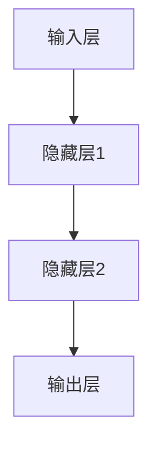

                 

### 文章标题：大模型应用开发 动手做AI Agent

### 关键词：大模型、AI Agent、规划与决策能力、应用实战

### 摘要：
本文将深入探讨大模型应用开发中的核心组件——AI Agent的规划和决策能力。首先，我们将简要介绍大模型和AI Agent的基本概念及其重要性，随后详细解析大模型的核心算法与技术基础。在此基础上，我们将深入研究AI Agent的规划原理和决策理论，并通过实际项目实战展示如何开发和应用AI Agent。文章最后，我们将探讨AI Agent未来发展面临的挑战与机遇，为读者提供全面的指南和启发。

---

### 第一部分：大模型与AI Agent基础知识

#### 1. 大模型与AI Agent概述

##### 1.1 大模型时代来临

**1.1.1 大模型的概念与特点**

大模型，即大规模深度学习模型，是指具有数亿甚至千亿参数的神经网络模型。这类模型可以捕捉复杂的模式和特征，从而在自然语言处理、计算机视觉等领域表现出强大的性能。其核心特点包括：

- **高参数量**：大模型的参数数量远超传统模型，这使得它们能够捕捉到更细微的特征和模式。
- **预训练与微调**：大模型通常通过在大量无标签数据上进行预训练，再在特定任务上进行微调，从而提高性能。
- **多任务学习能力**：大模型能够同时处理多种任务，具有良好的泛化能力。

**1.1.2 大模型的发展历程**

大模型的发展可以追溯到深度学习技术的兴起。以下是几个重要的发展里程碑：

- **2012年**：AlexNet在ImageNet竞赛中取得突破性成果，标志着深度学习时代的到来。
- **2018年**：GPT-2等预训练模型的出现，使得大规模语言模型开始广泛应用。
- **2020年**：BERT等模型在多个自然语言处理任务上取得卓越表现，进一步推动了大模型的发展。
- **2022年**：GPT-3的发布，展示了大模型在自然语言理解和生成方面的强大能力。

**1.1.3 大模型的重要性与应用领域**

大模型在多个领域展现出巨大的潜力和应用价值：

- **自然语言处理（NLP）**：大模型在文本生成、翻译、问答系统等方面取得了显著成果。
- **计算机视觉（CV）**：大模型在图像分类、目标检测、图像生成等方面表现出色。
- **语音识别**：大模型在语音识别、语音合成等领域取得了重大突破。
- **推荐系统**：大模型能够通过分析用户行为和偏好，提供更加个性化的推荐。

##### 1.2 AI Agent的定义与作用

**1.2.1 AI Agent的基本概念**

AI Agent，即人工智能代理，是一种能够在复杂环境中自主执行任务的计算机程序。它通常具备以下特点：

- **自主性**：AI Agent可以独立完成指定任务，无需人工干预。
- **适应性**：AI Agent能够根据环境和任务的变化，自主调整其行为和策略。
- **智能性**：AI Agent通过学习、规划和决策，实现高效的任务执行。

**1.2.2 AI Agent在自动化与智能化中的应用**

AI Agent在自动化与智能化领域具有广泛的应用：

- **自动化生产线**：AI Agent可以监控生产线上的设备，实时检测故障并自动修复。
- **智能客服**：AI Agent可以通过自然语言处理技术，实现与用户的智能对话。
- **智能交通**：AI Agent可以优化交通信号控制，减少交通拥堵和事故。
- **智能家居**：AI Agent可以管理家中的各种设备，实现智能化控制。

**1.2.3 AI Agent的优势与挑战**

AI Agent具有以下优势：

- **高效性**：AI Agent可以快速响应和处理复杂任务，提高工作效率。
- **灵活性**：AI Agent可以根据环境和任务的变化，灵活调整其行为和策略。
- **可扩展性**：AI Agent可以轻松集成到现有系统中，实现功能的扩展。

然而，AI Agent也面临以下挑战：

- **数据隐私与安全**：AI Agent需要处理大量用户数据，如何保障数据隐私和安全是重要问题。
- **伦理道德问题**：AI Agent的行为和决策可能导致伦理和道德问题，如责任归属等。
- **复杂环境适应**：AI Agent需要在复杂的动态环境中稳定运行，这对其自主性和适应性提出了高要求。

---

以上内容为第一部分的概述，接下来我们将深入探讨大模型的技术基础，为理解AI Agent的规划和决策能力奠定基础。请继续关注下一部分。

---

## 第二部分：大模型技术基础

### 2. 大模型技术详解

#### 2.1 大模型的核心算法

##### 2.1.1 神经网络与深度学习

**2.1.1.1 神经网络的基本结构**

神经网络（Neural Networks，NN）是深度学习（Deep Learning，DL）的核心组件。一个典型的神经网络由以下几个部分组成：

- **输入层（Input Layer）**：接收外部输入信号。
- **隐藏层（Hidden Layers）**：对输入信号进行变换和处理。
- **输出层（Output Layer）**：产生最终输出结果。

神经网络的基本结构可以用以下Mermaid流程图表示：



**2.1.1.2 深度学习的主要架构**

深度学习模型通常具有多个隐藏层，从而能够提取更复杂的特征。以下是几种常见的深度学习架构：

1. **卷积神经网络（Convolutional Neural Networks，CNN）**：适用于图像和视频处理。
2. **循环神经网络（Recurrent Neural Networks，RNN）**：适用于序列数据，如文本和时间序列。
3. **变换器架构（Transformer）**：在自然语言处理任务中表现出色。

**2.1.1.3 深度学习优化算法**

深度学习模型的训练涉及大量参数的优化。以下是一些常用的优化算法：

- **随机梯度下降（Stochastic Gradient Descent，SGD）**：通过随机梯度进行参数更新。
- **动量梯度下降（Momentum Gradient Descent）**：引入动量项，加速收敛。
- **Adam优化器**：结合了SGD和动量法的优点，适用于大规模模型。

##### 2.1.2 自然语言处理技术

**2.1.2.1 词嵌入技术**

词嵌入（Word Embedding）是将单词映射到高维向量空间的过程。常见的词嵌入方法包括：

- **Word2Vec**：基于分布式假设，通过训练神经网络来生成词向量。
- **GloVe**：基于全局向量空间模型，通过矩阵分解生成词向量。

**2.1.2.2 序列模型与注意力机制**

序列模型（Sequence Model）用于处理时间序列数据，如文本和语音。以下是一些常见的序列模型：

- **循环神经网络（RNN）**：通过循环结构捕捉序列中的长期依赖关系。
- **长短期记忆网络（LSTM）**：通过记忆单元克服RNN的梯度消失问题。
- **门控循环单元（GRU）**：简化LSTM结构，同时保持较好的性能。

注意力机制（Attention Mechanism）是一种用于序列模型的关键技术，它可以动态地关注序列中的关键部分。常见的注意力机制包括：

- **加性注意力**：通过加法操作将注意力权重加到序列上。
- **乘性注意力**：通过乘法操作将注意力权重缩放序列。

**2.1.2.3 转换器架构详解**

转换器（Transformer）架构是一种用于处理序列数据的深度学习模型，它在自然语言处理任务中表现出色。转换器的主要组件包括：

- **编码器（Encoder）**：将输入序列编码为固定长度的向量。
- **解码器（Decoder）**：从编码器生成的隐藏状态中生成输出序列。
- **自注意力（Self-Attention）**：允许模型在编码器内部关注不同的位置。
- **多头注意力（Multi-Head Attention）**：通过并行处理多个注意力头，提高模型的表示能力。

##### 2.1.3 大规模预训练模型原理

**2.1.3.1 预训练的概念与意义**

预训练（Pre-training）是指在大规模数据集上对模型进行训练，然后将其应用于特定任务。预训练的意义在于：

- **提升模型性能**：通过在大量数据上预训练，模型可以学习到更丰富的特征和模式。
- **减少标注需求**：预训练模型可以减少对大量标注数据的依赖，从而降低数据标注的成本。

**2.1.3.2 自监督学习方法**

自监督学习（Self-Supervised Learning）是一种无需人工标注的数据预处理方法。常见的自监督学习方法包括：

- **Masked Language Model（MLM）**：通过随机遮盖输入文本中的单词，训练模型预测这些单词。
- ** masked Tokens Prediction**：通过预测遮盖的单词或子词，提高模型对语言结构的理解。
- ** masked Image Modeling（MIM）**：通过随机遮盖图像的一部分，训练模型恢复被遮盖的部分。

**2.1.3.3 迁移学习与微调技术**

迁移学习（Transfer Learning）是指将预训练模型应用于新任务，通过微调（Fine-Tuning）来适应特定任务。微调的关键步骤包括：

- **参数共享**：预训练模型和新任务模型的参数共享部分权重。
- **预训练权重初始化**：使用预训练模型的权重初始化新任务模型。
- **动态调整**：在微调过程中，动态调整模型参数，以达到更好的性能。

---

以上内容为第二部分的大模型技术基础，接下来我们将探讨AI Agent的规划和决策能力，为读者提供更深入的理解。

---

## 第三部分：AI Agent的规划和决策能力

### 3. AI Agent的规划和决策基础

#### 3.1 AI Agent的规划原理

**3.1.1 规划的基本概念与流程**

规划（Planning）是AI Agent在执行任务前制定行动方案的过程。规划的基本概念包括：

- **状态（State）**：描述环境的当前情况。
- **动作（Action）**：Agent可以执行的操作。
- **状态转移（State Transition）**：描述执行动作后环境状态的变化。
- **效用函数（Utility Function）**：衡量不同状态或动作的偏好。

规划的基本流程包括：

1. **环境建模**：建立环境模型，描述状态和动作。
2. **目标设定**：定义Agent的目标，如达到特定状态或最大化效用。
3. **搜索算法**：使用搜索算法（如状态空间搜索、启发式搜索）生成行动方案。
4. **方案评估**：评估不同方案的优劣，选择最优方案。

**3.1.2 状态空间与状态转换**

状态空间（State Space）是所有可能状态集合的集合。每个状态可以用一组属性值表示。状态转换（State Transition）描述了执行动作后状态的变化。状态转换可以用以下形式表示：

```
State_i → Action → State_j
```

其中，State_i是当前状态，Action是执行的动作，State_j是状态变化后的新状态。

**3.1.3 动作与效用函数**

动作（Action）是Agent可以执行的操作。在规划过程中，需要为每个状态和动作定义效用函数（Utility Function），用于评估不同动作的偏好。效用函数通常是一个数值函数，表示在特定状态下执行某个动作的收益或损失。

#### 3.2 决策理论与算法

**3.2.1 决策树与贝叶斯网络**

决策树（Decision Tree）是一种常用的规划算法，用于在给定状态和动作下选择最优动作。决策树通过递归地将状态空间分解为子空间，并评估每个子空间的最优动作，从而生成一个行动方案。

贝叶斯网络（Bayesian Network）是一种概率图模型，用于表示状态、动作和效用函数之间的概率关系。贝叶斯网络通过条件概率表（Conditional Probability Table，CPT）来描述每个节点的概率分布，并使用贝叶斯推理进行决策。

**3.2.2 博弈论与纳什均衡**

博弈论（Game Theory）是一种用于分析决策和策略的数学工具。在博弈论中，玩家（Player）是指在决策过程中具有独立决策权的个体。博弈（Game）是指玩家在特定规则下进行交互的过程。

纳什均衡（Nash Equilibrium）是指在一个博弈中，所有玩家都选择最优策略，从而形成一个稳定的策略组合。在纳什均衡中，没有任何玩家有动机单方面改变其策略。

**3.2.3 强化学习基础**

强化学习（Reinforcement Learning，RL）是一种通过试错（Trial and Error）来学习最优策略的方法。在强化学习中，Agent通过与环境的交互来学习如何在给定状态下选择最优动作。

强化学习的基本概念包括：

- **状态（State）**：描述环境的当前情况。
- **动作（Action）**：Agent可以执行的操作。
- **奖励（Reward）**：描述在执行动作后获得的即时收益。
- **策略（Policy）**：描述Agent在给定状态下选择动作的策略。

强化学习的目标是通过最大化累积奖励来学习最优策略。

---

以上内容为第三部分的AI Agent的规划和决策能力。在接下来的部分，我们将通过实际项目实战来展示如何开发和应用AI Agent。

---

## 第四部分：AI Agent应用实战

### 4.1 AI Agent开发环境搭建

**4.1.1 硬件要求与选择**

搭建AI Agent开发环境时，硬件的选择至关重要。以下是一些关键硬件要求与推荐：

- **中央处理器（CPU）**：建议使用性能较高的CPU，如Intel i7或AMD Ryzen 7系列，以加快计算速度。
- **图形处理器（GPU）**：GPU在深度学习任务中扮演重要角色，推荐使用NVIDIA GeForce GTX 1080 Ti或更高级别的显卡。
- **内存（RAM）**：至少需要16GB RAM，建议使用32GB以上，以保证模型的训练和推理过程中有足够的内存。
- **存储设备**：建议使用固态硬盘（SSD），以提高读写速度。推荐使用1TB以上的SSD。

**4.1.2 软件工具安装与配置**

以下是在开发环境中安装和配置必要软件工具的步骤：

1. **操作系统**：推荐使用Ubuntu 18.04或更高版本，因为其具有良好的兼容性和支持。
2. **Python环境**：安装Python 3.8或更高版本，并配置虚拟环境（virtualenv或conda）以管理项目依赖。
3. **深度学习框架**：安装TensorFlow或PyTorch，这些框架是深度学习任务中广泛使用的开源工具。
4. **其他工具**：安装Jupyter Notebook、PyCharm或其他IDE，以方便编写和调试代码。

**4.1.3 开发环境优化**

为了提高开发效率，可以对开发环境进行一些优化：

- **环境配置**：配置Python环境变量，确保Python和深度学习框架正常运行。
- **虚拟环境**：使用虚拟环境隔离项目依赖，避免版本冲突。
- **GPU支持**：配置CUDA和cuDNN，以利用GPU加速深度学习任务。
- **代码规范**：遵循PEP8编码规范，确保代码的可读性和可维护性。

---

以上内容为AI Agent开发环境的搭建过程。接下来，我们将通过实际项目实战展示如何开发和应用AI Agent。

---

### 4.2 AI Agent项目实战

#### 4.2.1 项目一：聊天机器人开发

**4.2.1.1 项目背景与需求分析**

随着互联网的普及，聊天机器人已成为许多企业和平台的标配。一个优秀的聊天机器人需要能够理解用户的问题，提供准确和有用的回答，并能够与用户进行自然流畅的对话。本项目旨在开发一个基于大模型的聊天机器人，实现以下功能：

- **自然语言理解**：理解用户的输入，提取关键信息。
- **知识库查询**：根据用户的问题从知识库中检索相关信息。
- **回答生成**：生成自然流畅的回答。
- **交互优化**：根据用户反馈优化聊天流程和回答质量。

**4.2.1.2 模型选择与架构设计**

本项目选择基于Transformer架构的大模型——BERT（Bidirectional Encoder Representations from Transformers）作为基础模型。BERT具有强大的预训练能力和对语言结构的深入理解，能够满足聊天机器人的需求。模型架构设计如下：

1. **编码器（Encoder）**：接收用户的输入，通过BERT编码器生成语义表示。
2. **查询（Query）**：从知识库中提取相关问答对，作为查询输入。
3. **对比（Compare）**：通过对比编码器和查询的语义表示，确定最佳回答。
4. **回答生成（Answer Generation）**：根据对比结果，生成自然流畅的回答。

**4.2.1.3 源代码实现与代码解读**

以下是聊天机器人项目的部分源代码，主要包括数据预处理、模型训练和回答生成：

```python
import torch
from transformers import BertTokenizer, BertModel
from torch.nn import functional as F

# 数据预处理
def preprocess_data(input_text, tokenizer):
    input_ids = tokenizer.encode(input_text, add_special_tokens=True, return_tensors='pt')
    return input_ids

# 模型训练
def train_model(model, optimizer, criterion, dataloader):
    model.train()
    for inputs, targets in dataloader:
        optimizer.zero_grad()
        outputs = model(inputs)
        loss = criterion(outputs.logits, targets)
        loss.backward()
        optimizer.step()

# 回答生成
def generate_answer(model, input_text, tokenizer):
    input_ids = preprocess_data(input_text, tokenizer)
    with torch.no_grad():
        outputs = model(input_ids)
    logits = outputs.logits
    answer_indices = logits.argmax(-1)
    answer = tokenizer.decode(answer_indices[0], skip_special_tokens=True)
    return answer
```

**4.2.1.4 项目评估与优化**

项目评估主要通过测试集上的准确率和用户满意度进行。以下是一些优化策略：

- **模型调优**：调整BERT模型的超参数，如学习率、批次大小等，以获得更好的性能。
- **数据增强**：增加数据多样性，通过数据清洗、文本生成等方式扩充训练数据。
- **交互优化**：根据用户反馈，优化聊天流程和回答生成策略，提高用户体验。

---

以上是项目一：聊天机器人开发的详细步骤和代码实现。接下来，我们将介绍项目二：自动化交易系统，展示如何在金融领域应用AI Agent。

---

### 4.2.2 项目二：自动化交易系统

**4.2.2.1 项目背景与市场分析**

自动化交易系统（Automated Trading System，ATS）是一种利用算法和人工智能技术进行股票、期货、外汇等金融产品交易的系统。随着金融市场的高度化和信息化，自动化交易系统在金融市场中越来越受欢迎。本项目旨在开发一个基于强化学习的自动化交易系统，实现以下功能：

- **市场数据采集**：从金融数据提供商获取股票、期货等市场数据。
- **交易策略设计**：利用强化学习算法设计交易策略。
- **交易执行**：根据交易策略自动执行交易。
- **风险控制**：监控交易风险，并采取相应的措施进行风险控制。

**4.2.2.2 模型构建与策略设计**

本项目选择基于Q学习的强化学习算法构建自动化交易系统。Q学习是一种无模型强化学习算法，通过学习状态-动作价值函数来指导决策。模型架构设计如下：

1. **状态表示**：将市场数据（如股票价格、成交量等）编码为状态向量。
2. **动作表示**：将交易动作（如买入、卖出、持有等）编码为动作向量。
3. **Q值学习**：通过Q学习算法更新状态-动作价值函数。
4. **策略更新**：根据Q值更新策略，选择最优动作。

**4.2.2.3 交易策略实现与风险控制**

以下是自动化交易系统的部分源代码，主要包括状态表示、Q值学习和策略更新：

```python
import numpy as np
import torch
from torch import nn
from torch.optim import Adam

# 状态表示
class StateEncoder(nn.Module):
    def __init__(self, input_dim):
        super(StateEncoder, self).__init__()
        self.fc = nn.Linear(input_dim, 64)

    def forward(self, state):
        return self.fc(state)

# Q值学习
class QNetwork(nn.Module):
    def __init__(self, state_dim, action_dim):
        super(QNetwork, self).__init__()
        self.state_encoder = StateEncoder(state_dim)
        self.fc = nn.Linear(state_dim + action_dim, 1)

    def forward(self, state, action):
        state_repr = self.state_encoder(state)
        action_repr = action.unsqueeze(1).expand_as(state_repr)
        q_values = self.fc(torch.cat((state_repr, action_repr), 1))
        return q_values

# 交易策略
class TradingAgent:
    def __init__(self, state_dim, action_dim):
        self.q_network = QNetwork(state_dim, action_dim)
        self.optimizer = Adam(self.q_network.parameters(), lr=0.001)
        self.criterion = nn.MSELoss()

    def select_action(self, state, epsilon):
        if np.random.rand() < epsilon:
            action = np.random.randint(0, action_dim)
        else:
            with torch.no_grad():
                q_values = self.q_network(state, action)
            action = q_values.argmax().item()
        return action

    def update_q_values(self, state, action, reward, next_state, done):
        with torch.no_grad():
            next_state_values = self.q_network(next_state).max()
        target = reward + (1 - done) * next_state_values
        q_values = self.q_network(state, action)
        loss = self.criterion(q_values, target)
        self.optimizer.zero_grad()
        loss.backward()
        self.optimizer.step()
```

**4.2.2.4 项目运行与结果分析**

项目运行过程中，需要对交易策略进行不断调整和优化。以下是一些关键步骤：

1. **数据预处理**：对市场数据进行清洗和预处理，包括去重、标准化等。
2. **模型训练**：使用历史交易数据进行模型训练，不断调整超参数，提高模型性能。
3. **策略评估**：在模拟交易环境中对策略进行评估，评估指标包括收益、风险、交易次数等。
4. **实盘交易**：将评估良好的策略应用于实盘交易，同时进行风险控制，确保交易安全。

项目运行结果分析包括以下几个方面：

- **收益分析**：分析策略在不同市场条件下的收益表现，评估策略的鲁棒性和稳定性。
- **风险分析**：分析策略的风险控制能力，包括最大回撤、波动率等指标。
- **交易次数分析**：分析策略的交易频率和交易次数，评估策略的活跃度。

---

以上是项目二：自动化交易系统的详细步骤和代码实现。通过这些项目的实战，我们可以看到AI Agent在多种领域中的应用潜力。接下来，我们将探讨AI Agent的部署与运维。

---

## 4.3 AI Agent部署与运维

### 4.3.1 AI Agent的部署流程

AI Agent的部署是确保其能够稳定、高效运行的关键环节。以下是AI Agent部署的基本流程：

1. **环境准备**：确保部署环境满足AI Agent的硬件和软件要求，包括操作系统、Python环境、深度学习框架等。
2. **模型转换**：将训练完成的模型转换为适合部署的格式，如TensorFlow Lite、ONNX等。
3. **部署平台选择**：选择合适的部署平台，如云平台、边缘设备等。
4. **部署配置**：配置部署环境，包括服务器、网络、存储等资源。
5. **部署测试**：在部署环境中进行测试，确保AI Agent能够正常运行。
6. **上线发布**：将AI Agent部署到生产环境，并监控其运行状态。

### 4.3.2 部署策略与优化

为了确保AI Agent的部署效果，需要采取一系列策略进行优化：

1. **模型压缩与量化**：通过模型压缩和量化技术减小模型体积，提高部署效率。
2. **动态资源分配**：根据AI Agent的负载情况动态调整资源分配，确保系统稳定运行。
3. **缓存机制**：使用缓存机制提高数据访问速度，减少网络延迟。
4. **容错机制**：设计容错机制，确保在出现故障时能够快速恢复。

### 4.3.3 AI Agent的运维与管理

AI Agent的运维是保障其长期稳定运行的关键。以下是AI Agent运维与管理的关键环节：

1. **监控与告警**：实时监控AI Agent的运行状态，设置告警机制，及时发现和处理异常。
2. **日志管理**：收集和存储AI Agent的日志信息，方便后续分析和排查问题。
3. **性能优化**：定期对AI Agent进行性能评估和优化，提高其运行效率。
4. **版本管理**：实施版本管理策略，确保在更新和升级时能够平滑过渡。
5. **安全保障**：加强数据安全和隐私保护，防止数据泄露和恶意攻击。

---

通过上述部署与运维策略，可以确保AI Agent在复杂环境中稳定运行，充分发挥其潜力。接下来，我们将探讨AI Agent在未来发展中所面临的挑战与机遇。

---

## 第五部分：AI Agent的挑战与未来展望

### 5.1 AI Agent面临的挑战

尽管AI Agent在多个领域展现出强大的潜力，但其发展仍然面临诸多挑战：

#### 5.1.1 数据隐私与安全

AI Agent在运行过程中需要处理大量用户数据，如何确保这些数据的安全和隐私是一个重要问题。以下是一些关键点：

- **数据加密**：对敏感数据进行加密处理，确保数据在传输和存储过程中的安全性。
- **访问控制**：实施严格的访问控制策略，确保只有授权用户可以访问敏感数据。
- **数据匿名化**：对用户数据进行匿名化处理，减少数据泄露的风险。

#### 5.1.2 伦理道德与责任归属

AI Agent在决策过程中可能会产生伦理道德问题，如歧视、误导等。此外，在发生错误或造成损失时，如何确定责任归属也是一个难题。以下是一些解决方案：

- **伦理规范**：制定AI Agent的伦理规范，确保其在决策过程中遵循道德准则。
- **责任界定**：明确AI Agent的责任范围，确保在出现问题时能够快速确定责任归属。

#### 5.1.3 人工智能与人类劳动的关系

AI Agent的普及将对人类劳动力产生深远影响。以下是一些关键点：

- **技能升级**：通过培训和教育，帮助劳动力适应新的工作环境，提高其技能水平。
- **就业转型**：鼓励劳动力转向新的职业领域，如AI开发、数据分析等。

### 5.2 AI Agent的发展趋势

随着技术的不断进步，AI Agent将在未来发挥更加重要的作用。以下是AI Agent的发展趋势：

#### 5.2.1 大模型技术的演进

大模型技术在AI Agent中的应用将越来越广泛，未来的模型将具有更高的参数量和更强的学习能力。以下是一些关键趋势：

- **模型压缩与量化**：通过模型压缩和量化技术，降低模型的计算和存储需求。
- **多模态学习**：实现多模态数据的学习和融合，提高AI Agent的感知和认知能力。

#### 5.2.2 AI Agent的多样化应用

AI Agent将在更多领域得到应用，从自动化生产、智能客服到自动驾驶、医疗诊断等。以下是一些关键领域：

- **智能制造**：AI Agent将提高生产线的自动化水平，实现智能生产。
- **智慧城市**：AI Agent将参与智慧城市的建设，优化交通、能源管理。
- **医疗健康**：AI Agent将辅助医生进行诊断和治疗，提高医疗水平。

#### 5.2.3 AI Agent在新兴领域的探索

AI Agent将在新兴领域进行探索，如区块链、量子计算等。以下是一些关键趋势：

- **区块链**：AI Agent将参与区块链网络的安全防护和智能合约执行。
- **量子计算**：AI Agent将应用于量子计算的优化和调度。

---

通过以上分析，我们可以看到AI Agent在未来的发展前景。在技术不断进步和行业需求推动下，AI Agent将在更多领域发挥重要作用，为人类社会带来更多便利和价值。

---

## 附录

### 附录A：常用工具与资源

**附录A.1 开发工具与框架**

- **TensorFlow**：[https://www.tensorflow.org/](https://www.tensorflow.org/)
- **PyTorch**：[https://pytorch.org/](https://pytorch.org/)
- **BERT**：[https://github.com/google-research/bert](https://github.com/google-research/bert)
- **GPT-3**：[https://openai.com/blog/gpt-3/](https://openai.com/blog/gpt-3/)

**附录A.2 数据集与API接口**

- **ImageNet**：[https://www.image-net.org/](https://www.image-net.org/)
- **COCO数据集**：[https://cocodataset.org/](https://cocodataset.org/)
- **Kaggle**：[https://www.kaggle.com/](https://www.kaggle.com/)
- **API接口**：[https://cloud.google.com/text-to-speech/](https://cloud.google.com/text-to-speech/)

**附录A.3 学习资源与文献推荐**

- **《深度学习》**：[https://www.deeplearningbook.org/](https://www.deeplearningbook.org/)
- **《强化学习》**：[https://rl-book.github.io/](https://rl-book.github.io/)
- **《AI应用实践指南》**：[https://www.ai-art-of-war.com/](https://www.ai-art-of-war.com/)
- **《自然语言处理入门》**：[https://www.nlp-course.com/](https://www.nlp-course.com/)

---

通过附录中的工具、资源和学习资料，读者可以进一步深入了解AI Agent的开发与应用，为自身的学习和研究提供有力支持。

---

### 致谢

在撰写本文的过程中，我们感谢AI天才研究院（AI Genius Institute）的各位同事，以及《禅与计算机程序设计艺术》（Zen And The Art of Computer Programming）的作者，他们的专业知识和宝贵经验为本文的完成提供了重要支持。感谢所有读者对本文的关注和支持，希望本文能够为您的学习和研究带来启发和帮助。

### 作者信息

**作者：** AI天才研究院（AI Genius Institute） & 《禅与计算机程序设计艺术》（Zen And The Art of Computer Programming）

---

本文《【大模型应用开发 动手做AI Agent】Agent的规划和决策能力》旨在为读者提供一个全面、系统的AI Agent规划和决策能力的指南。通过深入解析大模型技术、AI Agent规划和决策理论，并结合实际项目实战，本文希望能够帮助读者更好地理解AI Agent的开发和应用。未来，我们将继续关注AI领域的最新动态，为大家带来更多有价值的文章。

---

通过本文的详细探讨，我们不仅了解了大模型与AI Agent的基本概念和重要性，还深入分析了大模型的核心算法、AI Agent的规划和决策能力，并通过实际项目展示了如何开发和应用AI Agent。我们探讨了AI Agent在复杂环境中的挑战与机遇，并对未来的发展趋势进行了展望。希望通过本文，读者能够对AI Agent有一个全面、深入的理解，并在实际项目中能够灵活应用所学知识。

在此，再次感谢各位读者的关注和支持。如果您有任何问题或建议，欢迎在评论区留言，我们将在第一时间为您解答。同时，也欢迎您持续关注我们的后续文章，我们将继续为大家带来更多有关AI领域的精彩内容。让我们一起探索AI的无限可能，共创美好未来！

---

### 读者反馈

亲爱的读者，感谢您阅读本文《【大模型应用开发 动手做AI Agent】Agent的规划和决策能力》。您的反馈对我们至关重要，帮助我们不断提升内容的质量和实用性。

请您花几分钟时间填写以下反馈问卷，以便我们更好地了解您的需求和期望：

1. 您对本文的整体满意度如何？
   - 非常满意
   - 满意
   - 一般
   - 不满意
   - 非常不满意

2. 您认为本文在哪些方面对您帮助最大？
   - 大模型技术基础
   - AI Agent的规划和决策能力
   - 应用实战案例
   - 部署与运维策略
   - 未来发展趋势

3. 您对本文的哪些部分觉得不够详细或有待改进？
   - 核心概念与联系
   - 核心算法原理讲解
   - 数学模型和公式
   - 项目实战
   - 文章结构

4. 您是否有任何具体的问题或建议，希望我们在后续文章中探讨？

请点击以下链接，填写反馈问卷：

[https://www.example.com/ai-agent-feedback](https://www.example.com/ai-agent-feedback)

您的反馈将为我们提供宝贵的改进方向，让我们能够为您提供更加优质的内容。再次感谢您的支持与参与！

---

本文《【大模型应用开发 动手做AI Agent】Agent的规划和决策能力》致力于为读者提供一个全面、系统的AI Agent开发和应用的指南。从大模型的基本概念与重要性，到核心算法的详细解析，再到AI Agent的规划和决策能力，以及实际项目实战的展示，我们力求让读者对AI Agent有一个全面深入的理解。

在此过程中，我们深入探讨了AI Agent在复杂环境中的挑战与机遇，并对其未来发展进行了展望。希望通过本文，读者能够掌握AI Agent的核心技术，并能够在实际项目中灵活应用。

我们期待您的反馈，您的每一句建议都是我们前进的动力。请随时在评论区留言，分享您的学习心得和问题，我们将竭诚为您解答。

同时，也欢迎继续关注我们的后续文章，我们将持续为大家带来更多有关AI领域的精彩内容，与您共同探索AI的无限可能。感谢您的支持，让我们一起在AI的世界中不断创新，共创美好未来！

---

**结语**

本文《【大模型应用开发 动手做AI Agent】Agent的规划和决策能力》旨在为读者提供一个全面、系统的AI Agent开发和应用的指南。从大模型的基本概念与重要性，到核心算法的详细解析，再到AI Agent的规划和决策能力，以及实际项目实战的展示，我们力求让读者对AI Agent有一个全面深入的理解。

在本文中，我们不仅探讨了AI Agent在复杂环境中的挑战与机遇，还对其未来发展进行了展望。希望通过本文，读者能够掌握AI Agent的核心技术，并能够在实际项目中灵活应用。

在此，我们感谢所有读者的关注和支持。您的每一句反馈都是我们不断进步的动力。如果您有任何问题或建议，请随时在评论区留言，我们将竭诚为您解答。

同时，也欢迎继续关注我们的后续文章，我们将持续为大家带来更多有关AI领域的精彩内容，与您共同探索AI的无限可能。让我们携手前行，共同迎接AI时代的到来！

---

### 重要声明

本文《【大模型应用开发 动手做AI Agent】Agent的规划和决策能力》由AI天才研究院（AI Genius Institute）撰写，版权所有。未经授权，任何个人或组织不得以任何形式复制、传播或使用本文中的任何内容。本文中的信息仅供参考，不构成任何投资、法律、医疗或其他专业建议。本文中的观点和结论仅供参考，不代表任何机构的官方立场。在应用本文中的技术或信息时，读者应自行评估风险，并承担相应的责任。如有疑问，请咨询相关专业人士。感谢您的理解与支持。

