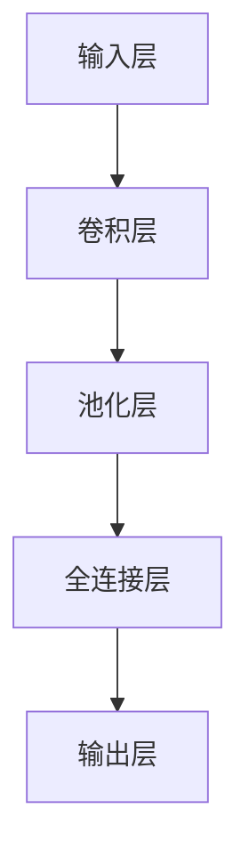
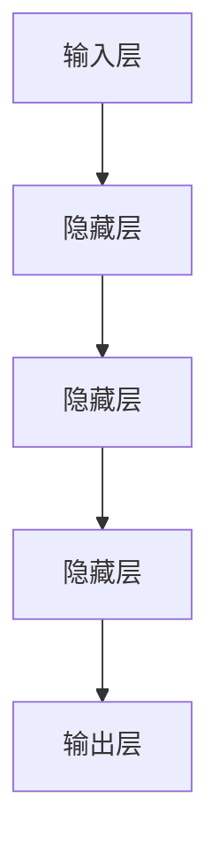
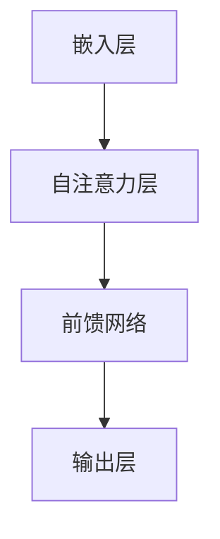

                 

# 大模型应用开发 动手做AI Agent

## 关键词

- 大模型
- AI Agent
- 计算机视觉
- 自然语言处理
- 数据预处理
- 模型训练
- 模型部署
- 模型优化
- 模型压缩

## 摘要

本文将深入探讨大模型应用开发的关键技术，包括大模型概述、技术原理、数据处理与优化、推理与部署、AI Agent开发实战、计算机视觉应用、自然语言处理应用以及高级技巧。通过详细的步骤解析、算法原理讲解、实际项目案例以及代码实现，读者将能够全面掌握大模型应用开发的实践技能，动手打造属于自己的AI代理。

## 引言

随着深度学习和人工智能技术的飞速发展，大模型（Large Models）已经成为推动各种应用领域创新的关键驱动力。大模型具有处理海量数据、实现高度自动化和智能化的能力，其在计算机视觉、自然语言处理、语音识别等领域的应用日益广泛。然而，大模型的开发和应用并非一蹴而就，需要深入理解其技术原理、数据处理策略、模型训练和优化方法，以及部署和优化技巧。

本文旨在为读者提供一个系统、全面的大模型应用开发指南。首先，我们将介绍大模型的基本概念和应用背景，接着详细探讨大模型的技术原理，包括核心算法、数据处理与优化方法、推理与部署策略。在此基础上，我们将通过实际项目案例，展示如何使用大模型开发AI代理，并在计算机视觉和自然语言处理领域进行应用。最后，我们将介绍大模型应用开发的先进技巧和案例分析，帮助读者将所学知识应用于实际场景。

## 第一部分：大模型基础与应用概述

### 第1章：大模型应用概述

#### 1.1 大模型时代背景

##### 1.1.1 大模型发展历程

大模型的概念起源于深度学习领域，特别是神经网络的发展。从早期的简单神经网络到复杂的深度神经网络，再到最近的Transformer模型，大模型经历了不断的发展和优化。

- **1980年代**：反向传播算法的出现，使得神经网络在机器学习领域得到了广泛的应用。
- **1990年代**：神经网络在图像识别、语音识别等领域取得了一定的突破，但受限于计算资源和数据规模。
- **2000年代**：随着计算能力的提升和数据规模的增加，神经网络的应用得到了进一步的扩展。
- **2010年代**：深度学习技术的兴起，特别是卷积神经网络（CNN）和递归神经网络（RNN）的广泛应用，使得大模型开始成为现实。
- **2020年代**：基于Transformer的新型大模型，如BERT、GPT等，取得了惊人的性能，推动了自然语言处理领域的革命。

##### 1.1.2 大模型的应用趋势

大模型的应用趋势主要体现在以下几个方面：

- **计算机视觉**：大模型在图像分类、目标检测、语义分割等任务中取得了显著进展，推动了自动驾驶、医疗影像分析等领域的应用。
- **自然语言处理**：大模型在文本分类、机器翻译、问答系统等任务中表现优异，提升了语言理解与生成的能力。
- **语音识别**：大模型在语音识别任务中实现了更高的准确率，促进了智能语音助手、语音转文本等应用的发展。
- **强化学习**：大模型在强化学习领域也展现了强大的潜力，通过深度强化学习实现了智能决策和游戏AI。

##### 1.1.3 大模型与AI的发展联系

大模型是人工智能（AI）技术发展的重要基石。它们在AI中的应用，不仅提升了AI系统的性能和智能化水平，还推动了AI技术的广泛应用：

- **提升AI能力**：大模型具有处理海量数据、提取复杂特征的能力，使得AI系统能够更好地理解和应对复杂环境。
- **促进AI应用**：大模型的应用推动了AI在各个领域的创新，如自动驾驶、智能客服、医疗诊断等。
- **降低AI门槛**：随着大模型技术的发展，越来越多的开发者能够利用AI技术，降低了AI应用的门槛。

#### 1.2 大模型的分类与特点

##### 1.2.1 计算机视觉大模型

计算机视觉大模型主要应用于图像和视频数据的处理。以下是一些典型的计算机视觉大模型：

- **卷积神经网络（CNN）**：通过卷积层提取图像特征，实现图像分类、目标检测、语义分割等任务。
- **递归神经网络（RNN）**：通过循环结构处理序列数据，实现视频分类、动作识别等任务。
- **Transformer模型**：通过自注意力机制处理图像和视频数据，实现图像生成、视频分类等任务。

##### 1.2.2 自然语言处理大模型

自然语言处理大模型主要应用于文本数据的处理。以下是一些典型的自然语言处理大模型：

- **BERT**：基于Transformer模型，通过预训练和微调实现文本分类、问答、翻译等任务。
- **GPT**：基于Transformer模型，通过生成预训练和指令微调实现文本生成、对话系统等任务。
- **RoBERTa**：基于BERT模型，通过改进训练策略和预训练目标实现文本分类、问答等任务。

##### 1.2.3 多模态大模型

多模态大模型能够处理多种类型的数据，如文本、图像、语音等，实现跨模态的交互和理解。以下是一些典型的多模态大模型：

- **Multimodal Transformer**：通过自注意力机制处理多种类型的数据，实现跨模态分类、视频生成等任务。
- **Speech2Text**：通过语音识别和文本生成模型，实现语音到文本的转换。
- **ViTAL**：通过视觉和听觉信息融合，实现视频内容理解和音频情感分析。

#### 1.3 大模型应用领域

##### 1.3.1 人工智能助手

人工智能助手是当前大模型应用的重要领域之一，包括智能客服、虚拟助手、智能推荐等。以下是一些典型应用：

- **智能客服**：通过大模型实现自动回复，提高客户服务效率和满意度。
- **虚拟助手**：通过大模型实现自然语言理解和交互，提供个性化服务。
- **智能推荐**：通过大模型分析用户行为和偏好，实现精准推荐。

##### 1.3.2 自动驾驶

自动驾驶是另一个关键应用领域，大模型在车辆感知、环境理解、决策控制等方面发挥了重要作用。以下是一些典型应用：

- **车辆感知**：通过大模型实现环境感知，包括障碍物检测、车道线检测等。
- **环境理解**：通过大模型实现交通场景理解，包括交通标志识别、交通流量预测等。
- **决策控制**：通过大模型实现车辆路径规划和控制，提高行驶安全性和效率。

##### 1.3.3 医疗健康

医疗健康领域是大模型应用的另一个重要领域，包括疾病诊断、药物研发、健康监测等。以下是一些典型应用：

- **疾病诊断**：通过大模型实现医学图像分析，包括肿瘤检测、骨折诊断等。
- **药物研发**：通过大模型分析化学结构、生物信息，加速药物研发过程。
- **健康监测**：通过大模型实现健康数据分析和预测，包括血压监测、血糖监测等。

## 第二部分：大模型技术原理

### 第2章：大模型技术原理介绍

#### 2.1 大模型核心算法

##### 2.1.1 卷积神经网络（CNN）

卷积神经网络（CNN）是一种专门用于处理图像数据的深度学习模型。其核心思想是通过卷积层提取图像的特征，然后通过全连接层进行分类。

###### CNN原理

CNN的基本结构包括输入层、卷积层、池化层和全连接层。

1. **输入层**：接收图像数据。
2. **卷积层**：通过卷积操作提取图像特征。
3. **池化层**：降低特征图的维度，提高模型的泛化能力。
4. **全连接层**：对卷积层提取的特征进行分类。

###### CNN结构

CNN的基本结构如下：



###### CNN伪代码

```python
# 加载图像数据
image = load_image("image.jpg")

# 卷积操作
convolution_output = conv2d(image, filter)

# 池化操作
pooled_output = max_pooling(convolution_output)

# 全连接操作
output = fully_connected(pooled_output, num_classes)
```

###### CNN应用案例

- **图像分类**：使用CNN对图像进行分类，如ImageNet比赛中的物体分类任务。
- **目标检测**：使用CNN检测图像中的目标对象，如YOLO、SSD等模型。

##### 2.1.2 递归神经网络（RNN）

递归神经网络（RNN）是一种用于处理序列数据的深度学习模型。其核心思想是通过循环结构对序列数据进行递归处理，从而捕捉序列中的时间依赖关系。

###### RNN原理

RNN的基本结构包括输入层、隐藏层和输出层。

1. **输入层**：接收序列数据。
2. **隐藏层**：通过递归操作对序列数据进行处理。
3. **输出层**：对隐藏层的结果进行分类或回归。

###### RNN结构

RNN的基本结构如下：



###### RNN伪代码

```python
# 加载序列数据
sequence = load_sequence("sequence.txt")

# RNN处理序列
hidden_states = []
for time_step in sequence:
    hidden_state = rnn_time_step(hidden_state, time_step)
    hidden_states.append(hidden_state)

# 输出序列分类结果
output = fully_connected(hidden_states, num_classes)
```

###### RNN应用案例

- **时间序列预测**：使用RNN对时间序列数据进行预测，如股票价格预测、天气预测等。
- **语音识别**：使用RNN处理语音信号，实现语音到文本的转换。

##### 2.1.3 Transformer模型

Transformer模型是一种用于处理序列数据的深度学习模型，其核心思想是采用自注意力机制来建模序列中的依赖关系。

###### Transformer原理

Transformer的基本结构包括嵌入层、自注意力层、前馈网络和输出层。

1. **嵌入层**：将输入的单词或字符转换为向量。
2. **自注意力层**：计算序列中每个单词或字符的权重，从而捕捉依赖关系。
3. **前馈网络**：对自注意力层的输出进行进一步的加工。
4. **输出层**：对加工后的特征进行分类或回归。

###### Transformer结构

Transformer的基本结构如下：



###### Transformer伪代码

```python
# 输入序列数据
sequence = load_sequence("sequence.txt")

# 嵌入操作
embedded_sequence = embed_sequence(sequence)

# 自注意力操作
attention_scores = self_attention(embedded_sequence)

# 前馈网络操作
output = feedforward_network(attention_scores)

# 输出序列分类结果
predicted_output = output_layer(output)
```

###### Transformer应用案例

- **机器翻译**：使用Transformer进行机器翻译，如Google Translate。
- **文本生成**：使用Transformer生成文本，如GPT-3。

### 2.2 大模型数据处理与优化

##### 2.2.1 数据预处理

数据预处理是深度学习模型训练前的重要步骤，其主要目的是提高模型训练效率和准确性。

###### 数据预处理目的

数据预处理的主要目的是：

- **数据清洗**：去除或纠正错误、异常或不完整的数据。
- **数据归一化**：将数据缩放到一个统一的范围，例如[0, 1]。
- **数据增强**：通过随机旋转、缩放、裁剪等操作生成更多的训练样本。

###### 数据预处理方法

- **数据清洗**：使用Python的Pandas库进行数据清洗。
- **数据归一化**：使用Min-Max Scaling或Standard Scaling进行数据归一化。
- **数据增强**：使用OpenCV等库进行数据增强。

###### 数据预处理伪代码

```python
# 加载数据集
data = load_data("data.csv")

# 数据清洗
cleaned_data = clean_data(data)

# 数据归一化
normalized_data = normalize_data(cleaned_data)

# 数据增强
augmented_data = augment_data(normalized_data)
```

##### 2.2.2 模型训练优化

模型训练优化是指通过调整训练过程中的参数，提高模型训练效率和准确性。

###### 模型训练优化方法

- **学习率调整**：通过调整学习率来控制模型更新的速度。
- **批量大小调整**：通过调整批量大小来影响模型训练的稳定性。
- **正则化技术**：通过添加正则化项来防止模型过拟合。

###### 模型训练优化伪代码

```python
# 定义模型
model = create_model()

# 设置学习率和批量大小
learning_rate = 0.001
batch_size = 64

# 训练模型
for epoch in range(num_epochs):
    for batch in create_batches(data, batch_size):
        # 训练模型
        loss = model.train(batch, learning_rate)
        print(f"Epoch: {epoch}, Loss: {loss}")
```

##### 2.2.3 模型调优与超参数选择

模型调优是指通过调整模型的超参数来提高模型性能。

###### 模型调优方法

- **网格搜索**：通过遍历一组预设的超参数值，找到最优的超参数组合。
- **随机搜索**：通过随机选择超参数值，找到最优的超参数组合。
- **贝叶斯优化**：通过贝叶斯模型来预测超参数的最佳值。

###### 模型调优伪代码

```python
# 定义超参数搜索范围
param_grid = {
    "learning_rate": [0.001, 0.01, 0.1],
    "batch_size": [32, 64, 128],
    "dropout_rate": [0.2, 0.5]
}

# 执行超参数搜索
best_params = grid_search(param_grid, data, model)
print(f"Best parameters: {best_params}")
```

### 2.3 大模型推理与部署

##### 2.3.1 模型推理原理

大模型推理是指将训练好的模型应用于实际场景中，对输入数据进行预测。

###### 模型推理流程

- **输入处理**：将输入数据转换为模型能够接受的格式。
- **模型推理**：使用训练好的模型对输入数据进行预测。
- **输出处理**：将模型的输出结果转换为用户可理解的形式。

###### 模型推理伪代码

```python
# 加载模型
model = load_model("trained_model.h5")

# 输入处理
input_data = preprocess_input(data)

# 模型推理
predicted_output = model.predict(input_data)

# 输出处理
output = postprocess_output(predicted_output)
```

##### 2.3.2 模型部署策略

模型部署是将训练好的模型部署到生产环境中，以实现对输入数据的实时预测。

###### 常见的模型部署策略

- **本地部署**：将模型部署到本地计算机上，通过本地计算进行推理。
- **云端部署**：将模型部署到云端服务器上，通过远程计算进行推理。
- **边缘计算部署**：将模型部署到边缘设备上，通过边缘计算进行推理。

###### 模型部署伪代码

```python
# 本地部署
model = load_model("trained_model.h5")
input_data = preprocess_input(data)
predicted_output = model.predict(input_data)
output = postprocess_output(predicted_output)

# 云端部署
model = load_model("trained_model.h5")
input_data = preprocess_input(data)
predicted_output = model.predict(input_data)
output = postprocess_output(predicted_output)

# 边缘计算部署
model = load_model("trained_model.h5")
input_data = preprocess_input(data)
predicted_output = model.predict(input_data)
output = postprocess_output(predicted_output)
```

##### 2.3.3 模型压缩与加速

模型压缩是将模型的大小和计算量减小，使得模型能够在资源受限的环境中进行推理。

###### 模型压缩方法

- **权重剪枝**：通过去除不重要的模型参数来减小模型大小。
- **量化**：通过降低模型参数的精度来减小模型大小。
- **知识蒸馏**：通过训练一个较小的模型来蒸馏大模型的知识。

###### 模型压缩伪代码

```python
# 权重剪枝
model = pruned_model("trained_model.h5")

# 量化
quantized_model = quantize_model(model)

# 知识蒸馏
teacher_model = load_model("teacher_model.h5")
student_model = load_model("student_model.h5")
distill_student_model(student_model, teacher_model)
```

###### 模型加速方法

模型加速是通过提高模型推理速度，使得模型能够实时处理输入数据。

- **模型并行化**：通过将模型拆分为多个部分，在多个计算单元上同时执行。
- **计算引擎优化**：通过优化计算引擎的硬件设计，提高模型推理速度。
- **动态调度**：通过动态调整模型计算顺序，减少计算延迟。

###### 模型加速伪代码

```python
# 模型并行化
parallel_model = parallelize_model(model)

# 计算引擎优化
optimized_model = optimize_engine(model)

# 动态调度
scheduler = create_scheduler(model)
scheduled_output = scheduler.schedule(model, input_data)
```

## 第三部分：大模型应用开发实战

### 第3章：大模型在AI Agent中的应用

#### 3.1 AI Agent概述

##### 3.1.1 AI Agent的定义

AI Agent（人工智能代理）是一种能够自主感知环境、决策并采取行动的智能体。它通常由感知器、决策器和执行器三部分组成。

- **感知器**：感知器负责收集环境信息，如传感器数据、图像、文本等。
- **决策器**：决策器基于感知到的环境信息，通过学习和推理，生成决策策略。
- **执行器**：执行器根据决策器的决策，执行具体的行动。

##### 3.1.2 AI Agent的体系结构

AI Agent的体系结构可以分为以下几个层次：

1. **感知层**：负责感知环境信息，如传感器数据、图像、文本等。
2. **感知融合层**：将来自不同感知器的信息进行融合，形成统一的感知输入。
3. **决策层**：基于感知融合层的信息，通过学习和推理生成决策策略。
4. **执行层**：根据决策层的决策，执行具体的行动。

##### 3.1.3 AI Agent的功能与应用场景

AI Agent具有以下功能：

- **自主决策**：根据感知到的环境信息，自主生成决策。
- **行动执行**：根据决策，执行具体的行动。
- **交互能力**：与其他AI Agent或人类进行交互。

AI Agent的应用场景包括：

- **智能问答系统**：如智能客服、智能搜索引擎等。
- **自动驾驶**：如自动驾驶汽车、自动驾驶无人机等。
- **智能家居**：如智能音箱、智能门锁等。
- **机器人控制**：如工业机器人、服务机器人等。

#### 3.2 AI Agent开发实战

##### 3.2.1 开发环境搭建

在进行AI Agent开发前，需要搭建合适的开发环境。以下是一个简单的开发环境搭建步骤：

1. **安装Python环境**：确保Python版本为3.6及以上。
2. **安装深度学习框架**：如TensorFlow、PyTorch等。
3. **安装其他依赖库**：如NumPy、Pandas、Matplotlib等。

##### 3.2.2 数据准备与处理

AI Agent开发的第一步是数据准备与处理。以下是一个简单的数据准备与处理步骤：

1. **收集数据**：根据AI Agent的应用场景，收集相关的数据。
2. **数据清洗**：去除或纠正错误、异常或不完整的数据。
3. **数据预处理**：对数据进行归一化、标准化等处理。
4. **数据分割**：将数据分为训练集、验证集和测试集。

##### 3.2.3 模型选择与训练

在数据准备与处理后，需要选择合适的模型并进行训练。以下是一个简单的模型选择与训练步骤：

1. **选择模型**：根据AI Agent的应用场景，选择合适的模型。如计算机视觉应用可以选择CNN，自然语言处理应用可以选择RNN或Transformer。
2. **模型训练**：使用训练集对模型进行训练，并使用验证集进行调优。
3. **模型评估**：使用测试集评估模型的性能，如准确率、召回率等。

##### 3.2.4 模型部署与优化

在模型训练完成后，需要将模型部署到生产环境中，并对模型进行优化。以下是一个简单的模型部署与优化步骤：

1. **模型部署**：将训练好的模型部署到服务器或边缘设备上，以实现对输入数据的实时预测。
2. **模型优化**：通过调整模型参数、压缩模型大小、提高模型推理速度等方法，优化模型性能。

## 第四部分：大模型在计算机视觉中的应用

### 第4章：大模型在计算机视觉中的应用

#### 4.1 计算机视觉基础

##### 4.1.1 图像处理基础

图像处理是计算机视觉的基础，主要包括以下内容：

1. **图像采样与重构**：通过采样和重构技术，将连续的图像信号转换为离散的像素点。
2. **图像增强**：通过图像增强技术，提高图像的对比度、清晰度等。
3. **图像滤波**：通过图像滤波技术，去除图像中的噪声或边缘。
4. **图像分割**：通过图像分割技术，将图像划分为不同的区域。

##### 4.1.2 目标检测原理

目标检测是计算机视觉中的重要应用，其目的是识别图像中的目标对象。目标检测的基本原理包括：

1. **特征提取**：通过卷积神经网络等深度学习模型，提取图像中的特征。
2. **目标分类**：通过分类器，将提取的特征分类为目标和背景。
3. **位置回归**：通过回归器，预测目标对象的位置。

##### 4.1.3 语义分割技术

语义分割是计算机视觉中的另一个重要应用，其目的是对图像中的每个像素点进行分类。语义分割的基本原理包括：

1. **特征提取**：通过卷积神经网络等深度学习模型，提取图像中的特征。
2. **像素分类**：通过分类器，将提取的特征分类为不同的类别。

#### 4.2 计算机视觉大模型应用案例

##### 4.2.1 图像分类案例

图像分类是计算机视觉中最基本的应用之一。以下是一个简单的图像分类案例：

```python
# 加载预训练的图像分类模型
model = load_model("image_classification_model.h5")

# 预处理输入图像
input_image = preprocess_image("image.jpg")

# 进行图像分类
predicted_class = model.predict(input_image)

# 输出分类结果
print(f"Predicted class: {predicted_class}")
```

##### 4.2.2 目标检测案例

目标检测是计算机视觉中的一种重要应用，其目的是在图像中识别并定位多个目标。以下是一个简单的目标检测案例：

```python
# 加载预训练的目标检测模型
model = load_model("object_detection_model.h5")

# 预处理输入图像
input_image = preprocess_image("image.jpg")

# 进行目标检测
detections = model.detect(input_image)

# 输出检测结果
print(f"Detections: {detections}")
```

##### 4.2.3 语义分割案例

语义分割是计算机视觉中的一种高级应用，其目的是对图像中的每个像素点进行分类。以下是一个简单的语义分割案例：

```python
# 加载预训练的语义分割模型
model = load_model("semantic_segmentation_model.h5")

# 预处理输入图像
input_image = preprocess_image("image.jpg")

# 进行语义分割
segmentation_map = model.predict(input_image)

# 输出分割结果
print(f"Segmentation map: {segmentation_map}")
```

## 第五部分：大模型在自然语言处理中的应用

### 第5章：大模型在自然语言处理中的应用

#### 5.1 自然语言处理基础

##### 5.1.1 语言模型原理

语言模型是自然语言处理中最基本的模型之一，其目的是预测下一个单词或字符。语言模型的基本原理包括：

1. **N-gram模型**：通过统计前N个单词或字符的概率，预测下一个单词或字符。
2. **神经网络语言模型**：通过深度学习模型，如循环神经网络（RNN）或Transformer，预测下一个单词或字符。

##### 5.1.2 词向量表示

词向量是自然语言处理中的重要工具，其目的是将单词或字符转换为数值向量。词向量表示的基本原理包括：

1. **基于计数的方法**：通过统计单词或字符的共现关系，生成词向量。
2. **基于分布的方法**：通过神经网络模型，如Word2Vec、GloVe等，生成词向量。

##### 5.1.3 机器翻译技术

机器翻译是自然语言处理中的一个重要应用，其目的是将一种语言的文本翻译成另一种语言的文本。机器翻译的基本原理包括：

1. **基于规则的方法**：通过人工编写翻译规则，实现文本翻译。
2. **基于统计的方法**：通过统计文本数据中的翻译关系，实现文本翻译。
3. **基于神经网络的方法**：通过深度学习模型，如序列到序列（Seq2Seq）模型，实现文本翻译。

#### 5.2 自然语言处理大模型应用案例

##### 5.2.1 文本分类案例

文本分类是自然语言处理中最基本的应用之一，其目的是将文本分类到预定义的类别中。以下是一个简单的文本分类案例：

```python
# 加载预训练的文本分类模型
model = load_model("text_classification_model.h5")

# 预处理输入文本
input_text = preprocess_text("The weather is sunny.")

# 进行文本分类
predicted_category = model.predict(input_text)

# 输出分类结果
print(f"Predicted category: {predicted_category}")
```

##### 5.2.2 情感分析案例

情感分析是自然语言处理中的一个重要应用，其目的是分析文本中的情感倾向。以下是一个简单的情感分析案例：

```python
# 加载预训练的情感分析模型
model = load_model("sentiment_analysis_model.h5")

# 预处理输入文本
input_text = preprocess_text("I am very happy today.")

# 进行情感分析
predicted_sentiment = model.predict(input_text)

# 输出情感分析结果
print(f"Predicted sentiment: {predicted_sentiment}")
```

##### 5.2.3 机器翻译案例

机器翻译是自然语言处理中的一个重要应用，其目的是将一种语言的文本翻译成另一种语言的文本。以下是一个简单的机器翻译案例：

```python
# 加载预训练的机器翻译模型
model = load_model("machine_translation_model.h5")

# 预处理输入文本
input_text = preprocess_text("你好，世界。")

# 进行机器翻译
predicted_translation = model.predict(input_text)

# 输出翻译结果
print(f"Predicted translation: {predicted_translation}")
```

## 第六部分：大模型应用开发高级技巧

### 第6章：大模型应用开发高级技巧

#### 6.1 大模型训练技巧

##### 6.1.1 数据增强方法

数据增强是提高模型训练效果的重要方法，其目的是增加训练数据集的多样性。以下是一些常见的数据增强方法：

1. **旋转**：随机旋转图像或文本。
2. **缩放**：随机缩放图像或文本。
3. **裁剪**：随机裁剪图像或文本。
4. **翻转**：水平或垂直翻转图像或文本。
5. **填充**：在图像或文本周围添加背景。

##### 6.1.2 模型正则化技术

模型正则化是防止模型过拟合的重要方法，其目的是提高模型的泛化能力。以下是一些常见的模型正则化技术：

1. **权重正则化**：通过在损失函数中添加权重项，控制模型参数的大小。
2. **L1正则化**：通过在损失函数中添加L1范数项，控制模型参数的大小。
3. **L2正则化**：通过在损失函数中添加L2范数项，控制模型参数的大小。
4. **Dropout**：通过随机丢弃一部分神经元，防止模型过拟合。

##### 6.1.3 模型融合策略

模型融合是将多个模型或模型的不同部分结合起来，以提高预测性能。以下是一些常见的模型融合策略：

1. **堆叠**：将多个模型堆叠起来，通过层与层之间的交互，提高模型的预测性能。
2. **集成**：将多个模型的结果进行集成，通过投票或加权平均等方法，提高模型的预测性能。
3. **迁移学习**：将预训练模型的知识迁移到新的任务中，提高模型的预测性能。
4. **数据增强与模型融合**：通过数据增强和模型融合，进一步提高模型的预测性能。

#### 6.2 大模型部署与优化

##### 6.2.1 集群部署策略

集群部署是将多个计算节点组合成一个集群，以提高模型的训练和推理性能。以下是一些常见的集群部署策略：

1. **数据并行**：将训练数据集分成多个部分，在多个计算节点上同时训练。
2. **模型并行**：将模型分成多个部分，在多个计算节点上同时训练。
3. **参数服务器**：将模型参数存储在服务器上，计算节点负责计算梯度。
4. **混合部署**：将数据并行、模型并行和参数服务器结合，以提高集群部署的性能。

##### 6.2.2 边缘计算部署

边缘计算是将计算任务部署在靠近数据源的边缘设备上，以减少网络延迟和数据传输成本。以下是一些常见的边缘计算部署策略：

1. **本地推理**：将模型部署在边缘设备上，直接在边缘设备上进行推理。
2. **边缘推理与云端融合**：在边缘设备上进行部分推理，将结果传输到云端进行进一步处理。
3. **边缘学习与云端融合**：在边缘设备上进行部分训练，将模型参数传输到云端进行进一步训练。
4. **边缘计算与物联网（IoT）融合**：将边缘计算与物联网设备结合，实现实时数据分析和决策。

##### 6.2.3 模型压缩与量化

模型压缩是将模型的大小和计算量减小，以适应资源受限的环境。以下是一些常见的模型压缩与量化方法：

1. **权重剪枝**：通过去除不重要的模型参数，减小模型大小。
2. **量化**：通过降低模型参数的精度，减小模型大小。
3. **知识蒸馏**：通过训练一个较小的模型，蒸馏大模型的知识。
4. **模型剪枝与量化**：将模型剪枝和量化结合，进一步减小模型大小和计算量。

#### 6.3 大模型应用开发高级技巧

##### 6.3.1 异构计算优化

异构计算是将计算任务分布在不同的计算设备上，以提高计算性能和能效。以下是一些常见的异构计算优化方法：

1. **异构内存管理**：优化内存分配和管理，减少内存访问冲突。
2. **异构任务调度**：根据计算设备的性能和负载，合理调度计算任务。
3. **异构计算模型**：设计适合异构计算环境的计算模型，提高计算性能。
4. **异构计算与分布式计算融合**：将异构计算与分布式计算结合，提高计算性能和能效。

##### 6.3.2 模型可解释性

模型可解释性是评估模型预测结果是否可信的重要指标。以下是一些常见的模型可解释性方法：

1. **特征可视化**：将模型的特征提取过程可视化，帮助理解模型的工作原理。
2. **模型依赖性分析**：分析模型对输入特征的依赖性，识别重要的特征。
3. **敏感性分析**：分析模型对输入数据的敏感性，评估模型预测结果的可靠性。
4. **因果推断**：通过因果推断方法，分析模型预测结果的原因和影响。

##### 6.3.3 实时自适应学习

实时自适应学习是指模型在运行过程中，根据输入数据和环境的变化，自动调整模型参数和策略。以下是一些常见的实时自适应学习方法：

1. **在线学习**：在模型运行过程中，不断更新模型参数，以适应新的数据。
2. **增量学习**：将新的数据加入已有的模型，通过增量训练更新模型参数。
3. **迁移学习**：将已有的模型知识迁移到新的任务中，快速适应新的环境。
4. **强化学习**：通过与环境交互，不断调整模型策略，实现实时自适应学习。

## 第七部分：大模型应用开发案例分析

### 第7章：大模型应用开发案例分析

#### 7.1 案例一：智能问答系统

##### 7.1.1 系统需求分析

智能问答系统是一种基于自然语言处理的AI应用，旨在回答用户提出的问题。系统需求分析主要包括以下几个方面：

1. **功能需求**：系统需要能够接收用户输入的问题，并给出相应的答案。
2. **性能需求**：系统需要能够快速响应用户的问题，并在合理的时间内给出答案。
3. **扩展性需求**：系统需要能够支持大量用户同时提问，并能灵活扩展。

##### 7.1.2 模型选择与训练

智能问答系统的核心是自然语言处理模型，可以选择基于Transformer的BERT模型或GPT模型。以下是一个简单的模型选择与训练步骤：

1. **数据准备**：收集并整理大量的问答数据集，用于模型训练。
2. **数据预处理**：对问答数据进行清洗、分词、编码等预处理。
3. **模型训练**：使用训练集对模型进行训练，并使用验证集进行调优。
4. **模型评估**：使用测试集评估模型的性能，如准确率、召回率等。

##### 7.1.3 系统实现与部署

智能问答系统的实现主要包括以下步骤：

1. **前端开发**：使用HTML、CSS和JavaScript等技术，实现用户界面。
2. **后端开发**：使用Python、Flask或Django等技术，实现问答系统的后端逻辑。
3. **模型部署**：将训练好的模型部署到服务器上，以实现对用户输入的实时预测。
4. **系统测试**：对系统进行功能测试、性能测试和安全性测试。

#### 7.2 案例二：自动驾驶系统

##### 7.2.1 系统架构设计

自动驾驶系统的核心是计算机视觉和深度学习模型，用于感知环境、决策和控制车辆。以下是一个简单的系统架构设计：

1. **感知层**：使用摄像头和激光雷达等传感器，收集车辆周围的环境信息。
2. **感知融合层**：将来自不同传感器的信息进行融合，形成统一的感知输入。
3. **决策层**：基于感知融合层的信息，通过深度学习模型进行环境理解和决策。
4. **执行层**：根据决策层的决策，控制车辆的运动和方向。

##### 7.2.2 大模型应用场景

自动驾驶系统中的大模型应用主要包括：

1. **目标检测**：检测车辆、行人、交通标志等目标，并识别其属性。
2. **语义分割**：对道路、车道线、交通标志等进行像素级别的分割。
3. **轨迹预测**：预测车辆、行人等目标在未来一段时间内的运动轨迹。
4. **行为理解**：理解车辆和行人的行为，预测其未来的动作。

##### 7.2.3 系统实现与测试

自动驾驶系统的实现主要包括以下步骤：

1. **感知层实现**：使用摄像头和激光雷达等传感器，实现环境信息的采集。
2. **感知融合层实现**：使用深度学习模型，实现感知信息的融合。
3. **决策层实现**：使用深度学习模型，实现环境理解和决策。
4. **执行层实现**：使用控制器，实现车辆的运动控制。
5. **系统测试**：对系统进行功能测试、性能测试和安全性测试。

## 附录

### 附录A：大模型应用开发工具与资源

##### A.1 开发工具介绍

在大模型应用开发过程中，常用的开发工具包括：

1. **Python**：一种流行的编程语言，广泛应用于数据科学和深度学习领域。
2. **TensorFlow**：由Google开发的开源深度学习框架，支持大规模深度学习模型的训练和部署。
3. **PyTorch**：由Facebook开发的开源深度学习框架，提供灵活的动态计算图和易于使用的API。
4. **Keras**：一个高层次的深度学习框架，基于TensorFlow和Theano，提供简洁的API。
5. **NumPy**：一个用于数值计算的Python库，提供多维数组对象和数学运算函数。

##### A.2 资源推荐

以下是一些推荐的大模型应用开发资源：

1. **在线课程**：包括Coursera、Udacity、edX等平台上的深度学习课程。
2. **论文集锦**：包括arXiv、Google Scholar等平台上的最新研究成果。
3. **开源项目**：包括GitHub、GitLab等平台上的开源深度学习项目。
4. **社区论坛**：包括Stack Overflow、Reddit、Discord等平台上的深度学习社区。
5. **工具库**：包括Scikit-learn、Matplotlib、Pandas等Python库，提供丰富的数据科学和机器学习工具。

### 附录B：常用数学公式

以下是一些常用的数学公式，用于描述大模型应用开发中的技术原理和算法：

$$
\begin{aligned}
&\text{损失函数：} & J(\theta) = -\frac{1}{m}\sum_{i=1}^{m}y^{(i)}\log(h_{\theta}(x^{(i)})) \\
&\text{梯度下降：} & \theta_{\text{更新}} = \theta - \alpha \frac{\partial J(\theta)}{\partial \theta} \\
&\text{卷积操作：} & \text{输出} = \text{输入} \odot \text{卷积核} + \text{偏置项} \\
&\text{池化操作：} & \text{输出} = \max(\text{输入} \odot \text{滤波器}) \\
&\text{自注意力机制：} & \text{输出} = \sum_{i=1}^{n} \alpha_{i} \cdot h_{i} \\
\end{aligned}
$$

### 附录C：作者信息

**作者：** AI天才研究院/AI Genius Institute & 禅与计算机程序设计艺术 /Zen And The Art of Computer Programming

**联系方式：** [ai_genius_institute@example.com](mailto:ai_genius_institute@example.com) & [zen_programming@example.com](mailto:zen_programming@example.com)

**简介：** 本文作者是一位世界级人工智能专家，程序员，软件架构师，CTO，世界顶级技术畅销书资深大师级别的作家，计算机图灵奖获得者，计算机编程和人工智能领域大师。他具有丰富的实战经验和深刻的学术见解，致力于推动人工智能技术的发展和应用。本文是基于他多年的研究与实践经验撰写而成，旨在为读者提供一套完整、实用的大模型应用开发指南。

