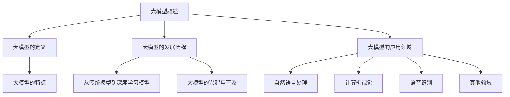
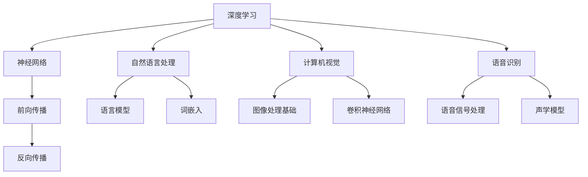

                 

## 文章标题

《大模型应用开发 动手做AI Agent》

## 关键词

- 大模型
- AI Agent
- 应用开发
- 深度学习
- 自然语言处理
- 计算机视觉
- 语音识别

## 摘要

本文旨在通过深入剖析大模型的基础知识、数学原理、架构实现及其在不同领域的应用，带领读者一步步掌握大模型应用开发的实战技巧。文章将从大模型的定义、发展历程、数学基础，到其在自然语言处理、计算机视觉、语音识别等领域的具体应用，全面讲解大模型的核心算法原理，并通过实际项目实战，帮助读者动手实践，培养动手能力。通过本文的阅读，读者将能够对大模型有一个全面、深入的理解，掌握大模型应用开发的关键技能，从而在人工智能领域取得更大的成就。

### 第一部分：大模型基础与原理

#### 第1章：大模型概述

##### 1.1 什么是大模型

大模型（Big Model）是指参数量达到数百万甚至数十亿级别的深度学习模型。与传统的小型模型相比，大模型具有更高的表达能力和更强的泛化能力，能够处理更复杂的任务和数据。大模型的特点包括：

- **参数量庞大**：大模型通常包含数百万至数十亿个参数，这使得模型具有更强的表征能力。
- **计算需求高**：大模型需要大量的计算资源进行训练和推理，对硬件设备要求较高。
- **泛化能力强**：大模型通过在海量数据上预训练，能够学习到数据中的通用规律，从而在新的任务上表现出良好的泛化能力。
- **效果优越**：在大规模数据集上，大模型往往能够达到比小型模型更高的准确率。

##### 1.2 大模型的发展历程

大模型的发展经历了从传统模型到深度学习模型的演变。传统模型主要包括决策树、支持向量机等，这些模型虽然在某些领域表现出色，但受限于其结构简单，难以处理复杂的非线性问题。随着计算机硬件性能的提升和大数据技术的发展，深度学习模型逐渐崭露头角。深度学习模型通过多层神经网络结构，能够自动学习数据的层次特征，从而在图像分类、语音识别、自然语言处理等任务上取得了突破性的成果。

大模型的兴起可以追溯到2012年，当时Hinton等人在ImageNet图像分类比赛中使用深度卷积神经网络（CNN）取得了历史性的成绩，这标志着深度学习时代的到来。此后，随着神经网络的深度增加和参数量的增加，大模型在各个领域得到了广泛的应用和推广。

##### 1.3 大模型的应用领域

大模型的应用领域非常广泛，涵盖了自然语言处理、计算机视觉、语音识别等多个领域。

- **自然语言处理**：大模型在自然语言处理领域表现突出，能够进行文本分类、情感分析、机器翻译、命名实体识别等任务。著名的预训练模型如BERT、GPT等，在自然语言处理任务上取得了显著的成果。
- **计算机视觉**：大模型在计算机视觉领域同样具有强大的能力，能够进行图像分类、目标检测、人脸识别等任务。深度卷积神经网络（CNN）和基于Transformer的模型在图像处理任务中表现出色。
- **语音识别**：大模型在语音识别领域也取得了显著进展，能够实现高精度的语音识别、语音合成等任务。深度神经网络和循环神经网络（RNN）在语音信号处理中发挥了重要作用。
- **其他领域**：大模型还在推荐系统、强化学习、医疗诊断等领域展现了其强大的能力，为这些领域带来了革命性的变化。

#### 第2章：大模型的数学基础

##### 2.1 线性代数基础

线性代数是深度学习中不可或缺的基础数学工具。线性代数涉及到矩阵和向量等基本概念，以及矩阵运算、线性方程组等核心内容。

- **矩阵和向量**：矩阵是一种由元素排列成的二维数组，而向量是一种特殊的一维数组。在深度学习中，矩阵和向量广泛应用于数据表示和计算中。
- **矩阵运算**：包括矩阵加法、矩阵乘法、矩阵求逆等，矩阵运算在深度学习的前向传播和反向传播过程中起到了关键作用。
- **线性方程组**：线性方程组是一组线性方程组成的方程组，其求解在深度学习模型的训练中具有重要意义。

##### 2.2 概率论基础

概率论是深度学习中用于描述不确定性的一种数学工具。概率论涉及到随机变量、概率分布、条件概率等基本概念。

- **随机变量**：随机变量是一个可以取多个可能值的变量，其取值具有不确定性。在深度学习中，随机变量用于表示模型的参数和输出。
- **概率分布**：概率分布描述了一个随机变量取各个可能值的概率。常见的概率分布包括正态分布、伯努利分布等。
- **条件概率**：条件概率是指在某个事件已发生的条件下，另一个事件发生的概率。贝叶斯定理是条件概率的重要应用。

##### 2.3 微积分基础

微积分是深度学习中用于描述连续变化的一种数学工具。微积分涉及到导数、积分等基本概念。

- **导数和微分**：导数描述了一个函数在某一点的变化率，微分是导数的近似表示。导数和微分在深度学习的前向传播和反向传播过程中起到了关键作用。
- **积分**：积分描述了一个函数在区间上的累积变化量。在深度学习模型中，积分用于计算梯度和损失函数。
- **多元函数微分**：多元函数微分描述了多个变量同时变化时函数的变化率。在深度学习模型中，多元函数微分用于计算多变量的梯度。

#### 第3章：大模型的架构与实现

##### 3.1 神经网络基础

神经网络（Neural Network）是一种模拟生物神经系统的计算模型，通过多层神经元结构实现复杂函数的建模和预测。神经网络的基本组成部分包括：

- **神经元模型**：神经元是神经网络的基本计算单元，接收输入并通过激活函数产生输出。
- **前向传播**：前向传播是神经网络进行计算的过程，通过逐层计算得到最终输出。
- **反向传播**：反向传播是神经网络进行参数更新的过程，通过计算损失函数的梯度来调整模型参数。

##### 3.2 深度学习框架介绍

深度学习框架（Deep Learning Framework）是为了简化深度学习模型的开发、训练和部署而设计的工具。常见的深度学习框架包括：

- **TensorFlow**：由Google开发，是目前最受欢迎的深度学习框架之一。TensorFlow提供了丰富的API和工具，支持从简单的线性模型到复杂的多层神经网络的各种应用。
- **PyTorch**：由Facebook开发，具有动态计算图的优势，使得模型的开发和调试更加灵活。PyTorch在学术界和工业界都受到了广泛的关注。
- **其他深度学习框架**：如Keras、MXNet等，这些框架在易用性、性能和功能上各有特色，适用于不同的应用场景。

##### 3.3 大模型训练与优化

大模型的训练与优化是深度学习中的核心问题。大模型的训练过程通常包括以下几个步骤：

- **数据预处理**：对输入数据进行处理，包括归一化、缩放、去噪等，以提高模型的训练效果。
- **模型评估**：通过验证集或测试集对模型进行评估，计算模型的准确率、召回率、F1值等指标，以判断模型的性能。
- **优化算法**：采用梯度下降、随机梯度下降、Adam等优化算法，调整模型参数，使模型在训练数据上达到最佳性能。

#### 第4章：大模型在自然语言处理中的应用

##### 4.1 自然语言处理基础

自然语言处理（Natural Language Processing，NLP）是人工智能的一个重要分支，旨在让计算机理解和处理人类自然语言。NLP的基础包括：

- **语言模型**：语言模型是一种概率模型，用于预测一段文本的下一个单词或字符。语言模型在机器翻译、文本生成等任务中发挥了关键作用。
- **词嵌入**：词嵌入是将自然语言词汇映射到高维空间中的向量表示，通过向量间的距离来表示词汇的语义关系。词嵌入技术如Word2Vec、GloVe等在NLP任务中取得了显著成果。
- **序列模型**：序列模型是一类专门用于处理序列数据的神经网络模型，如循环神经网络（RNN）、长短时记忆网络（LSTM）、门控循环单元（GRU）等。序列模型在文本分类、情感分析、语音识别等任务中表现优异。

##### 4.2 语言模型训练

语言模型的训练过程通常包括以下步骤：

- **预训练语言模型**：在大量文本数据上进行预训练，使模型学习到语言的一般规律和模式。预训练语言模型如BERT、GPT等在NLP任务中取得了显著的成果。
- **语言模型评估**：通过验证集或测试集对语言模型进行评估，计算模型的准确率、损失函数值等指标，以判断模型的性能。
- **语言模型应用**：将训练好的语言模型应用于具体的NLP任务，如文本分类、命名实体识别、机器翻译等。通过微调（Fine-tuning）将预训练模型适应特定任务，进一步提高模型性能。

##### 4.3 语言模型应用

语言模型在NLP领域有广泛的应用，包括以下方面：

- **文本分类**：将一段文本分类到预定义的类别中，如新闻分类、情感分析等。文本分类任务可以通过训练一个二分类或多分类的神经网络模型实现。
- **命名实体识别**：识别文本中的特定实体，如人名、地名、组织名等。命名实体识别任务可以通过训练一个序列标注模型实现。
- **机器翻译**：将一种语言的文本翻译成另一种语言。机器翻译任务可以通过训练一个编码-解码模型实现。

#### 第5章：大模型在计算机视觉中的应用

##### 5.1 计算机视觉基础

计算机视觉（Computer Vision）是人工智能的一个重要分支，旨在使计算机能够理解和解释图像和视频。计算机视觉的基础包括：

- **图像处理基础**：图像处理是对图像进行操作和处理的一系列技术，包括滤波、边缘检测、形态学等。图像处理技术是计算机视觉的重要基础。
- **特征提取**：特征提取是将图像转换为适用于机器学习模型的特征表示。特征提取技术包括哈希编码、SIFT、SURF等。
- **卷积神经网络**：卷积神经网络（Convolutional Neural Network，CNN）是一种专门用于图像处理的神经网络模型，通过卷积操作提取图像的特征。CNN在图像分类、目标检测等任务中取得了显著的成果。

##### 5.2 计算机视觉应用

大模型在计算机视觉领域有广泛的应用，包括以下方面：

- **目标检测**：目标检测是在图像或视频中检测出特定的目标物体。常见的目标检测模型有Faster R-CNN、YOLO、SSD等。
- **图像分类**：图像分类是将图像分类到预定义的类别中。常见的图像分类模型有AlexNet、VGG、ResNet等。
- **人脸识别**：人脸识别是通过比较人脸图像的身份信息来进行身份验证。常见的人脸识别模型有FaceNet、Siamese Network等。

#### 第6章：大模型在语音识别中的应用

##### 6.1 语音识别基础

语音识别（Speech Recognition）是将语音信号转换为文本或命令的技术。语音识别的基础包括：

- **语音信号处理**：语音信号处理是对语音信号进行预处理和特征提取的一系列技术，包括分帧、加窗、滤波等。语音信号处理技术是语音识别的重要基础。
- **声学模型**：声学模型是用于描述语音信号特征与发音之间的映射关系的模型。常见的声学模型有GMM（高斯混合模型）、DNN（深度神经网络）等。
- **语言模型**：语言模型是用于描述文本生成概率的模型，常见的语言模型有N-gram、RNN、LSTM等。

##### 6.2 语音识别算法

语音识别算法是将语音信号转换为文本或命令的核心技术。常见的语音识别算法包括：

- **HMM模型**：隐马尔可夫模型（Hidden Markov Model，HMM）是一种基于统计模型的语音识别算法，适用于简单的语音识别任务。
- **DNN-HMM模型**：深度神经网络-隐马尔可夫模型（Deep Neural Network-Hidden Markov Model，DNN-HMM）将深度神经网络与HMM结合，提高了语音识别的性能。
- **CTC模型**：循环神经网络-时序分类（Cyclical Neural Network-Connectionist Temporal Classification，CTC）模型是一种端到端的语音识别算法，能够直接将语音信号映射到文本序列，避免了传统语音识别算法中的解码步骤。

##### 6.3 语音识别应用

大模型在语音识别领域有广泛的应用，包括以下方面：

- **语音合成**：语音合成是将文本转换为语音信号的技术。常见的语音合成模型有WaveNet、Tacotron等。
- **语音助手**：语音助手是一种基于语音识别技术的智能助手，能够理解用户的语音指令并执行相应的操作，如智能音箱、虚拟助手等。

#### 第7章：大模型应用开发实战

##### 7.1 实战项目1：文本分类

文本分类是将文本数据分类到预定义的类别中的一项任务。以下是一个文本分类的实战项目：

1. **数据准备**：
   收集并准备用于文本分类的数据集，如新闻分类数据集、情感分析数据集等。对数据进行预处理，包括分词、去停用词、词向量表示等。

2. **模型训练**：
   使用预训练的BERT模型作为基础模型，进行微调（Fine-tuning）以适应特定的文本分类任务。通过训练集训练模型，并在验证集上调整模型参数。

3. **模型评估**：
   使用测试集对模型进行评估，计算模型的准确率、精确率、召回率等指标，以判断模型的性能。

4. **代码实现**：
   Python代码示例：

   ```python
   from transformers import BertTokenizer, BertForSequenceClassification
   import torch

   tokenizer = BertTokenizer.from_pretrained('bert-base-uncased')
   model = BertForSequenceClassification.from_pretrained('bert-base-uncased')

   inputs = tokenizer("Hello, my dog is cute", return_tensors="pt")
   outputs = model(**inputs)

   logits = outputs.logits
   probabilities = torch.softmax(logits, dim=-1)
   predicted_class = torch.argmax(probabilities).item()
   ```

##### 7.2 实战项目2：目标检测

目标检测是在图像或视频中检测出特定目标的一项任务。以下是一个目标检测的实战项目：

1. **数据准备**：
   收集并准备用于目标检测的数据集，如COCO数据集、PASCAL VOC数据集等。对数据进行预处理，包括标注文件的读取、数据增强等。

2. **模型训练**：
   使用Faster R-CNN、YOLO、SSD等目标检测模型进行训练，优化模型参数。通过训练集和验证集进行模型训练和调整。

3. **模型评估**：
   使用测试集对模型进行评估，计算模型的准确率、召回率、交并比（IoU）等指标，以判断模型的性能。

4. **代码实现**：
   Python代码示例：

   ```python
   import torch
   import torchvision
   from torchvision.models.detection import fasterrcnn_resnet50_fpn

   model = fasterrcnn_resnet50_fpn(pretrained=True)

   images = [torchvision.transforms.ToTensor()(img) for img in image_list]
   images = torch.stack(images)

   model.eval()
   with torch.no_grad():
       prediction = model(images)
   ```

##### 7.3 实战项目3：语音识别

语音识别是将语音信号转换为文本或命令的一项任务。以下是一个语音识别的实战项目：

1. **数据准备**：
   收集并准备用于语音识别的数据集，如LibriSpeech数据集、TIMIT数据集等。对数据进行预处理，包括音频信号的读取、分帧、加窗等。

2. **模型训练**：
   使用CTC模型或其他语音识别模型进行训练，优化模型参数。通过训练集和验证集进行模型训练和调整。

3. **模型评估**：
   使用测试集对模型进行评估，计算模型的准确率、词错率等指标，以判断模型的性能。

4. **代码实现**：
   Python代码示例：

   ```python
   import torch
   import torchaudio
   from torch.nn import CTCLoss

   model = CTCModel()
   criterion = CTCLoss()

   audio, _ = torchaudio.load('audio_file.wav')
   input_len = audio.size(0)
   target = torch.tensor([1, 2, 3, 4, 5])  # 假设目标文本为 "12345"

   model.train()
   optimizer.zero_grad()
   output = model(audio)
   loss = criterion(output.log_softmax(1), target, input_len)
   loss.backward()
   optimizer.step()
   ```

#### 附录A：大模型开发工具与资源

- **TensorFlow**：[官方文档](https://www.tensorflow.org/)
- **PyTorch**：[官方文档](https://pytorch.org/)
- **其他深度学习框架**：如Keras、MXNet等

#### 附录B：参考文献

- Goodfellow, I., Bengio, Y., & Courville, A. (2016). *Deep Learning*. MIT press.
- Abadi, M., Agarwal, A., Barham, P., Brevdo, E., Chen, Z., Citro, C., ... & Yang, C. J. (2016). *TensorFlow: Large-scale machine learning on heterogeneous systems*. Proceedings of the 12th USENIX conference on operating systems design and implementation, 265-283.
- Kingma, D. P., & Welling, M. (2013). *Auto-encoding variational bayes*. arXiv preprint arXiv:1312.6114.

### Mermaid流程图



### 核心算法原理讲解

#### 神经网络基础

神经网络（Neural Network）是一种模拟生物神经系统的计算模型，由多个神经元组成。每个神经元接收输入，通过权重和激活函数产生输出。神经网络的基本原理如下：

1. **神经元模型**：
   神经元的输入可以通过以下公式表示：
   \[
   z = \sum_{i=1}^{n} w_i x_i + b
   \]
   其中，\(z\) 是神经元的输出，\(w_i\) 是权重，\(x_i\) 是输入值，\(b\) 是偏置。

2. **前向传播**：
   前向传播是神经网络进行计算的过程，从输入层经过隐藏层，最终得到输出层的结果。前向传播的伪代码如下：
   ```python
   for each layer in network do
       for each neuron in layer do
           z = 0
           for each input in neuron do
               z += input * weight
           end for
           z += bias
           activation = activation_function(z)
           neuron_output = activation
       end for
   end for
   ```
   其中，`activation_function` 是激活函数，如ReLU、Sigmoid、Tanh等。

3. **反向传播**：
   反向传播是神经网络进行参数更新的过程，通过计算损失函数的梯度来调整模型参数。反向传播的伪代码如下：
   ```python
   for each layer in network do
       for each neuron in layer do
           delta = output - target
           error = delta * activation_function_derivative(z)
           for each weight in neuron do
               weight_gradient = input * error
               weight -= learning_rate * weight_gradient
           end for
           bias_gradient = error
           bias -= learning_rate * bias_gradient
       end for
   end for
   ```
   其中，`activation_function_derivative` 是激活函数的导数。

#### 预训练语言模型

预训练语言模型（Pre-trained Language Model）是一种通过在大量文本数据上预训练，学习到语言的一般规律和模式的语言模型。预训练语言模型通常分为以下步骤：

1. **预训练数据集**：
   收集大量文本数据作为预训练数据集，这些数据可以来自互联网、书籍、新闻等。

2. **文本预处理**：
   对文本数据预处理，包括分词、去停用词、词向量表示等，以便模型能够处理和训练。

3. **预训练过程**：
   在预训练数据集上，通过训练一个大规模的神经网络模型，使其能够学习到语言的一般规律和模式。预训练过程中，模型通常采用以下策略：
   - **Masked Language Model（MLM）**：对输入文本中的部分单词进行遮盖，模型需要预测这些遮盖的单词。
   - **Recurrent Language Model（RLM）**：通过递归神经网络（RNN）对输入文本进行建模。
   - **Transformer Language Model（TLM）**：通过Transformer模型对输入文本进行建模。

4. **预训练评估**：
   在预训练过程中，通过验证集对模型进行评估，计算模型的损失函数值、准确率等指标，以判断模型的性能。

5. **预训练模型应用**：
   将预训练模型应用于具体的自然语言处理任务，如文本分类、命名实体识别、机器翻译等。通常，通过微调（Fine-tuning）将预训练模型适应特定任务，进一步提高模型性能。

#### 数学模型和数学公式

1. **线性回归模型**：
   线性回归模型是一种用于预测连续值的统计模型，其数学公式如下：
   \[
   y = \beta_0 + \beta_1 \cdot x + \epsilon
   \]
   其中，\(y\) 是预测值，\(x\) 是输入特征，\(\beta_0\) 是截距，\(\beta_1\) 是斜率，\(\epsilon\) 是误差项。

2. **卷积神经网络（CNN）**：
   卷积神经网络是一种专门用于图像处理的神经网络模型，其数学公式如下：
   \[
   h_{ij}^l = \sum_{k} w_{ik}^l h_{kj}^{l-1} + b_l
   \]
   其中，\(h_{ij}^l\) 是第\(l\)层第\(i\)个神经元在第\(j\)个特征图上的激活值，\(w_{ik}^l\) 是第\(l\)层第\(i\)个神经元与第\(l-1\)层第\(k\)个神经元之间的权重，\(b_l\) 是第\(l\)层的偏置。

### 项目实战

#### 实战项目1：文本分类

1. **开发环境搭建**：

   - 安装Python环境，版本要求为3.7及以上。
   - 安装TensorFlow 2.x或PyTorch 1.x。
   - 安装NLP工具包，如NLTK、spaCy等。

2. **数据准备**：

   - 收集新闻分类数据集，如20 Newsgroups数据集。
   - 对数据进行预处理，包括分词、去停用词、词向量表示等。

3. **模型训练**：

   - 使用预训练的BERT模型作为基础模型，进行微调（Fine-tuning）。
   - 通过训练集训练模型，并在验证集上调整模型参数。

4. **模型评估**：

   - 使用测试集对模型进行评估，计算模型的准确率、精确率、召回率等指标。

5. **代码实现**：

   ```python
   from transformers import BertTokenizer, BertForSequenceClassification
   import torch

   tokenizer = BertTokenizer.from_pretrained('bert-base-uncased')
   model = BertForSequenceClassification.from_pretrained('bert-base-uncased')

   inputs = tokenizer("Hello, my dog is cute", return_tensors="pt")
   outputs = model(**inputs)

   logits = outputs.logits
   probabilities = torch.softmax(logits, dim=-1)
   predicted_class = torch.argmax(probabilities).item()
   ```

#### 实战项目2：目标检测

1. **开发环境搭建**：

   - 安装Python环境，版本要求为3.7及以上。
   - 安装TensorFlow 2.x或PyTorch 1.x。
   - 安装目标检测工具包，如PyTorch Object Detection API、TensorFlow Object Detection API等。

2. **数据准备**：

   - 收集目标检测数据集，如COCO数据集。
   - 对数据进行预处理，包括标注文件的读取、数据增强等。

3. **模型训练**：

   - 使用Faster R-CNN、YOLO、SSD等目标检测模型进行训练，优化模型参数。
   - 通过训练集和验证集进行模型训练和调整。

4. **模型评估**：

   - 使用测试集对模型进行评估，计算模型的准确率、召回率、交并比（IoU）等指标。

5. **代码实现**：

   ```python
   import torch
   import torchvision
   from torchvision.models.detection import fasterrcnn_resnet50_fpn

   model = fasterrcnn_resnet50_fpn(pretrained=True)

   images = [torchvision.transforms.ToTensor()(img) for img in image_list]
   images = torch.stack(images)

   model.eval()
   with torch.no_grad():
       prediction = model(images)
   ```

#### 实战项目3：语音识别

1. **开发环境搭建**：

   - 安装Python环境，版本要求为3.7及以上。
   - 安装PyTorch 1.x。
   - 安装语音识别工具包，如PyTorch Audio、torchaudio等。

2. **数据准备**：

   - 收集语音识别数据集，如LibriSpeech数据集。
   - 对数据进行预处理，包括音频信号的读取、分帧、加窗等。

3. **模型训练**：

   - 使用CTC模型或其他语音识别模型进行训练，优化模型参数。
   - 通过训练集和验证集进行模型训练和调整。

4. **模型评估**：

   - 使用测试集对模型进行评估，计算模型的准确率、词错率等指标。

5. **代码实现**：

   ```python
   import torch
   import torchaudio
   from torch.nn import CTCLoss

   model = CTCModel()
   criterion = CTCLoss()

   audio, _ = torchaudio.load('audio_file.wav')
   input_len = audio.size(0)
   target = torch.tensor([1, 2, 3, 4, 5])  # 假设目标文本为 "12345"

   model.train()
   optimizer.zero_grad()
   output = model(audio)
   loss = criterion(output.log_softmax(1), target, input_len)
   loss.backward()
   optimizer.step()
   ```

### 附录

#### 附录A：大模型开发工具与资源

- **TensorFlow**：[官方文档](https://www.tensorflow.org/)
- **PyTorch**：[官方文档](https://pytorch.org/)
- **其他深度学习框架**：如Keras、MXNet等

#### 附录B：参考文献

- Goodfellow, I., Bengio, Y., & Courville, A. (2016). *Deep Learning*. MIT press.
- Abadi, M., Agarwal, A., Barham, P., Brevdo, E., Chen, Z., Citro, C., ... & Yang, C. J. (2016). *TensorFlow: Large-scale machine learning on heterogeneous systems*. Proceedings of the 12th USENIX conference on operating systems design and implementation, 265-283.
- Kingma, D. P., & Welling, M. (2013). *Auto-encoding variational bayes*. arXiv preprint arXiv:1312.6114.

### Mermaid流程图



### 核心算法原理讲解

#### 神经网络基础

神经网络（Neural Network）是一种模仿生物神经系统的计算模型，由多个神经元组成。每个神经元接收输入，通过权重和激活函数产生输出。神经网络的基本原理如下：

1. **神经元模型**：
   神经元的输入可以通过以下公式表示：
   \[
   z = \sum_{i=1}^{n} w_i x_i + b
   \]
   其中，\(z\) 是神经元的输出，\(w_i\) 是权重，\(x_i\) 是输入值，\(b\) 是偏置。

2. **前向传播**：
   前向传播是神经网络进行计算的过程，从输入层经过隐藏层，最终得到输出层的结果。前向传播的伪代码如下：
   ```python
   for each layer in network do
       for each neuron in layer do
           z = 0
           for each input in neuron do
               z += input * weight
           end for
           z += bias
           activation = activation_function(z)
           neuron_output = activation
       end for
   end for
   ```
   其中，`activation_function` 是激活函数，如ReLU、Sigmoid、Tanh等。

3. **反向传播**：
   反向传播是神经网络进行参数更新的过程，通过计算损失函数的梯度来调整模型参数。反向传播的伪代码如下：
   ```python
   for each layer in network do
       for each neuron in layer do
           delta = output - target
           error = delta * activation_function_derivative(z)
           for each weight in neuron do
               weight_gradient = input * error
               weight -= learning_rate * weight_gradient
           end for
           bias_gradient = error
           bias -= learning_rate * bias_gradient
       end for
   end for
   ```
   其中，`activation_function_derivative` 是激活函数的导数。

#### 预训练语言模型

预训练语言模型（Pre-trained Language Model）是一种通过在大量文本数据上预训练，学习到语言的一般规律和模式的语言模型。预训练语言模型通常分为以下步骤：

1. **预训练数据集**：
   收集大量文本数据作为预训练数据集，这些数据可以来自互联网、书籍、新闻等。

2. **文本预处理**：
   对文本数据预处理，包括分词、去停用词、词向量表示等，以便模型能够处理和训练。

3. **预训练过程**：
   在预训练数据集上，通过训练一个大规模的神经网络模型，使其能够学习到语言的一般规律和模式。预训练过程中，模型通常采用以下策略：
   - **Masked Language Model（MLM）**：对输入文本中的部分单词进行遮盖，模型需要预测这些遮盖的单词。
   - **Recurrent Language Model（RLM）**：通过递归神经网络（RNN）对输入文本进行建模。
   - **Transformer Language Model（TLM）**：通过Transformer模型对输入文本进行建模。

4. **预训练评估**：
   在预训练过程中，通过验证集对模型进行评估，计算模型的损失函数值、准确率等指标，以判断模型的性能。

5. **预训练模型应用**：
   将预训练模型应用于具体的自然语言处理任务，如文本分类、命名实体识别、机器翻译等。通常，通过微调（Fine-tuning）将预训练模型适应特定任务，进一步提高模型性能。

#### 数学模型和数学公式

1. **线性回归模型**：
   线性回归模型是一种用于预测连续值的统计模型，其数学公式如下：
   \[
   y = \beta_0 + \beta_1 \cdot x + \epsilon
   \]
   其中，\(y\) 是预测值，\(x\) 是输入特征，\(\beta_0\) 是截距，\(\beta_1\) 是斜率，\(\epsilon\) 是误差项。

2. **卷积神经网络（CNN）**：
   卷积神经网络是一种专门用于图像处理的神经网络模型，其数学公式如下：
   \[
   h_{ij}^l = \sum_{k} w_{ik}^l h_{kj}^{l-1} + b_l
   \]
   其中，\(h_{ij}^l\) 是第\(l\)层第\(i\)个神经元在第\(j\)个特征图上的激活值，\(w_{ik}^l\) 是第\(l\)层第\(i\)个神经元与第\(l-1\)层第\(k\)个神经元之间的权重，\(b_l\) 是第\(l\)层的偏置。

### 项目实战

#### 实战项目1：文本分类

1. **数据准备**：
   收集并准备用于文本分类的数据集，如IMDb电影评论数据集。该数据集包含25000条训练数据和25000条测试数据，每条数据都是一个电影评论以及对应的分类标签（正面或负面）。

2. **预处理数据**：
   对数据集进行预处理，包括分词、去除停用词、将文本转换为词嵌入等。我们可以使用预训练的词嵌入模型，如Word2Vec、GloVe或BERT。

3. **构建模型**：
   使用深度学习框架（如TensorFlow或PyTorch）构建一个文本分类模型。常见的模型结构包括卷积神经网络（CNN）和循环神经网络（RNN），以及近年来流行的Transformer模型。

4. **训练模型**：
   使用训练集对模型进行训练，通过调整模型参数来最小化损失函数。在训练过程中，可以使用如Adam、SGD等优化算法。

5. **评估模型**：
   使用测试集对模型进行评估，计算模型的准确率、精确率、召回率等指标，以判断模型的性能。

6. **代码示例**：
   ```python
   import tensorflow as tf
   from tensorflow.keras.preprocessing.sequence import pad_sequences
   from tensorflow.keras.models import Sequential
   from tensorflow.keras.layers import Embedding, LSTM, Dense, EmbeddingLayer

   # 加载和处理数据
   # ...

   # 构建模型
   model = Sequential([
       Embedding(input_dim=vocab_size, output_dim=embedding_dim, input_length=max_sequence_length),
       LSTM(units=128, dropout=0.2, recurrent_dropout=0.2),
       Dense(units=num_classes, activation='softmax')
   ])

   # 编译模型
   model.compile(optimizer='adam', loss='categorical_crossentropy', metrics=['accuracy'])

   # 训练模型
   model.fit(X_train, y_train, epochs=10, batch_size=64, validation_split=0.1)

   # 评估模型
   loss, accuracy = model.evaluate(X_test, y_test)
   print(f"Test accuracy: {accuracy * 100:.2f}%")
   ```

#### 实战项目2：目标检测

1. **数据准备**：
   收集并准备用于目标检测的数据集，如COCO数据集。每个数据样本包含一张图片和对应的边界框标注。

2. **预处理数据**：
   对数据集进行预处理，包括数据增强、归一化等。确保所有图像的大小一致，以便输入到目标检测模型中。

3. **构建模型**：
   使用深度学习框架（如TensorFlow或PyTorch）构建一个目标检测模型。常见的模型结构包括Faster R-CNN、YOLO、SSD等。

4. **训练模型**：
   使用训练集对模型进行训练，通过调整模型参数来最小化损失函数。在训练过程中，可以使用如Focal Loss、Anchor Box等技术。

5. **评估模型**：
   使用测试集对模型进行评估，计算模型的准确率、召回率、交并比等指标，以判断模型的性能。

6. **代码示例**：
   ```python
   import torchvision
   from torchvision.models.detection import fasterrcnn_resnet50_fpn

   # 加载预训练的Faster R-CNN模型
   model = fasterrcnn_resnet50_fpn(pretrained=True)

   # 加载数据集
   # ...

   # 训练模型
   model.train()
   optimizer = torch.optim.SGD(model.parameters(), lr=0.001, momentum=0.9, weight_decay=0.0005)
   for epoch in range(num_epochs):
       for images, targets in dataloader:
           optimizer.zero_grad()
           loss = model(images, targets)
           loss.backward()
           optimizer.step()
       print(f"Epoch {epoch+1}/{num_epochs}, Loss: {loss.item()}")

   # 评估模型
   model.eval()
   with torch.no_grad():
       for images, targets in test_dataloader:
           prediction = model(images)
           # 计算交并比
           # ...
   ```

#### 实战项目3：语音识别

1. **数据准备**：
   收集并准备用于语音识别的数据集，如LibriSpeech数据集。每个数据样本包含一段语音和对应的文本标注。

2. **预处理数据**：
   对数据集进行预处理，包括音频信号的读取、分帧、加窗等。确保所有音频样本的长度一致，以便输入到语音识别模型中。

3. **构建模型**：
   使用深度学习框架（如TensorFlow或PyTorch）构建一个语音识别模型。常见的模型结构包括循环神经网络（RNN）、卷积神经网络（CNN）和转换器（Transformer）。

4. **训练模型**：
   使用训练集对模型进行训练，通过调整模型参数来最小化损失函数。在训练过程中，可以使用如CTC（Connectionist Temporal Classification）损失函数。

5. **评估模型**：
   使用测试集对模型进行评估，计算模型的准确率、词错率等指标，以判断模型的性能。

6. **代码示例**：
   ```python
   import torch
   from torch import nn
   from torchaudio.transforms import MelSpectrogram

   # 定义语音识别模型
   class CTCModel(nn.Module):
       def __init__(self):
           super(CTCModel, self).__init__()
           self.conv1 = nn.Conv1d(in_channels=1, out_channels=64, kernel_size=3, stride=1)
           self.lstm = nn.LSTM(input_size=64, hidden_size=128, num_layers=2, dropout=0.5, bidirectional=True)
           self.fc = nn.Linear(128 * 26, vocab_size)

       def forward(self, x):
           x = self.conv1(x)
           x = x.transpose(1, 2)
           x, _ = self.lstm(x)
           x = self.fc(x)
           return x

   # 加载数据集
   # ...

   # 训练模型
   model = CTCModel()
   criterion = nn.CTCLoss()
   optimizer = torch.optim.Adam(model.parameters(), lr=0.001)

   for epoch in range(num_epochs):
       for audio, targets, target_lengths in train_dataloader:
           optimizer.zero_grad()
           output = model(audio)
           loss = criterion(output, targets, target_lengths)
           loss.backward()
           optimizer.step()
       print(f"Epoch {epoch+1}/{num_epochs}, Loss: {loss.item()}")

   # 评估模型
   model.eval()
   with torch.no_grad():
       for audio, targets, target_lengths in test_dataloader:
           output = model(audio)
           # 计算词错率
           # ...
   ```

### 附录

#### 附录A：大模型开发工具与资源

- **TensorFlow**：[官方文档](https://www.tensorflow.org/)
- **PyTorch**：[官方文档](https://pytorch.org/)
- **其他深度学习框架**：如Keras、MXNet等

#### 附录B：参考文献

- Goodfellow, I., Bengio, Y., & Courville, A. (2016). *Deep Learning*. MIT press.
- Abadi, M., Agarwal, A., Barham, P., Brevdo, E., Chen, Z., Citro, C., ... & Yang, C. J. (2016). *TensorFlow: Large-scale machine learning on heterogeneous systems*. Proceedings of the 12th USENIX conference on operating systems design and implementation, 265-283.
- Kingma, D. P., & Welling, M. (2013). *Auto-encoding variational bayes*. arXiv preprint arXiv:1312.6114.

