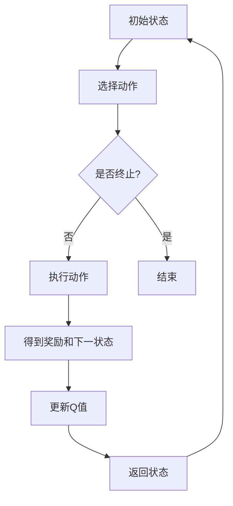

                 

### 文章标题

《一切皆是映射：AI Q-learning国际研究前沿速览》

### 关键词

- AI Q-learning
- 强化学习
- Q-learning算法
- Q值函数
- 多智能体系统
- 深度强化学习
- 自动驾驶
- 智能投顾

### 摘要

本文旨在深入探讨AI Q-learning算法的国际研究前沿，旨在为读者提供全面而详实的理解。首先，我们将介绍AI Q-learning的基础概念，包括其定义、基本原理和数学模型。接着，我们将探讨Q-learning的核心算法及其与DQN、SARSA等算法的对比。随后，我们将分析Q-learning算法的演进，包括多步骤Q学习（TSIQ）、动态规划与Q-learning的结合以及Q-learning在多智能体系统中的应用。接着，我们将介绍Q-learning与其他算法的融合，如Q-learning与强化学习算法的结合、Q-learning与深度学习的结合以及其在工业应用中的案例研究。随后，我们将提供AI Q-learning的实践指南，包括项目实战和开发工具与资源。最后，我们将展望AI Q-learning的未来趋势与挑战，并总结文章的核心思想与应用价值，为读者提供学习与实践的建议。通过本文，读者将能够全面了解AI Q-learning的最新研究成果和应用前景。

### 第一部分：AI Q-learning基础概念

#### 第1章：AI Q-learning简介

##### 1.1 AI Q-learning的基本概念

AI Q-learning是一种强化学习算法，旨在通过学习策略来最大化长期回报。Q-learning的核心是Q值函数，它表示在给定状态下采取特定动作的预期回报。Q-learning的目标是找到一种策略，使得在任意状态下，采取最优动作的Q值最大。

Q-learning与强化学习的关系在于，它是一种基于值函数的强化学习算法。强化学习是一种通过环境反馈来学习最优策略的方法，而Q-learning通过学习Q值函数来预测和优化策略。这使得Q-learning在许多应用场景中具有广泛的适用性。

Q-learning的优势主要体现在以下几个方面：

1. **灵活性**：Q-learning能够适应各种不同类型的环境和状态空间，使其在复杂问题中具有较强的适应性。
2. **稳健性**：Q-learning具有较好的鲁棒性，能够处理具有不确定性和噪声的环境。
3. **易扩展**：Q-learning算法可以与多种其他算法相结合，如深度学习、多智能体系统等，从而提高其性能和应用范围。

Q-learning主要应用于以下场景：

1. **自动控制**：在自动控制系统中，Q-learning可以用于学习最优控制策略，以提高系统的稳定性和性能。
2. **机器人路径规划**：在机器人路径规划中，Q-learning可以用于学习从起点到终点的最优路径。
3. **推荐系统**：在推荐系统中，Q-learning可以用于学习用户偏好，从而提高推荐系统的准确性。
4. **游戏智能体设计**：在游戏智能体设计中，Q-learning可以用于学习最优策略，以提高智能体的表现。

##### 1.2 Q-learning的基本原理

Q-learning的基本原理是通过不断更新Q值函数来学习最优策略。其核心思想是：在给定状态下，选择当前最优动作，并根据实际获得的回报更新Q值。

Q-learning的目标函数可以表示为：

$$
J(\theta) = \sum_{s} \sum_{a} Q(s, a) \cdot P(s, a) \cdot r(s, a)
$$

其中，\(Q(s, a)\) 是在状态 \(s\) 下采取动作 \(a\) 的预期回报，\(P(s, a)\) 是从状态 \(s\) 采取动作 \(a\) 后转移概率，\(r(s, a)\) 是在状态 \(s\) 下采取动作 \(a\) 后获得的即时回报。

Q-learning的更新规则可以表示为：

$$
Q(s, a) = Q(s, a) + \alpha \cdot (r(s, a) + \gamma \cdot \max_{a'} Q(s', a') - Q(s, a))
$$

其中，\(\alpha\) 是学习率，\(\gamma\) 是折扣因子。

Q-learning的探索策略是为了解决“平衡探索与利用”的问题。常见的探索策略有：

1. **epsilon-greedy策略**：在给定的状态 \(s\) 下，以概率 \(1 - \epsilon\) 选择当前最优动作，以概率 \(\epsilon\) 随机选择动作。随着训练过程的进行，\(\epsilon\) 的值会逐渐减小，从而实现探索与利用的平衡。
2. **UCB策略**：基于置信区间，选择具有最高上置信界（Upper Confidence Bound）的动作。这种策略在初始阶段具有较强的探索能力，但随着训练的进行，会逐渐偏向于利用已知的最佳策略。
3. **软最大化策略**：在给定状态 \(s\) 下，选择具有最高Q值的动作，但根据温度参数 \(T\) 对所有动作进行随机化。随着训练过程的进行，温度参数 \(T\) 会逐渐减小，从而实现探索与利用的平衡。

##### 1.3 Q-learning的数学模型

Q-learning的数学模型可以表示为：

$$
Q(s, a) = r(s, a) + \gamma \cdot \max_{a'} Q(s', a')
$$

其中，\(r(s, a)\) 是在状态 \(s\) 下采取动作 \(a\) 后获得的即时回报，\(\gamma\) 是折扣因子，表示未来回报的重要性。

这个模型描述了在给定当前状态 \(s\) 和动作 \(a\) 后，更新Q值的计算方式。即，Q值等于即时回报 \(r(s, a)\) 加上未来回报的最大期望值（\(\gamma \cdot \max_{a'} Q(s', a')\)）。

##### 1.4 Q-learning的核心算法

Q-learning的核心算法主要包括以下几个步骤：

1. **初始化**：初始化Q值表，通常可以使用随机初始化或零初始化。

2. **选择动作**：在给定当前状态 \(s\) 下，选择动作 \(a\)。可以使用epsilon-greedy策略、UCB策略或软最大化策略等探索策略。

3. **执行动作**：根据选择到的动作 \(a\)，在环境中执行动作，并获得新的状态 \(s'\) 和即时回报 \(r\)。

4. **更新Q值**：根据新的状态 \(s'\) 和即时回报 \(r\)，更新Q值表。具体更新规则为：

   $$
   Q(s, a) = Q(s, a) + \alpha \cdot (r + \gamma \cdot \max_{a'} Q(s', a') - Q(s, a))
   $$

   其中，\(\alpha\) 是学习率，\(\gamma\) 是折扣因子。

5. **重复步骤2-4**：重复选择动作、执行动作和更新Q值的步骤，直到达到预设的迭代次数或满足停止条件。

以下是一个简单的Q-learning算法的伪代码实现：

```python
# 初始化Q值表
Q = np.zeros([env.observation_space.n, env.action_space.n])

# 设定参数
learning_rate = 0.1
gamma = 0.99
epsilon = 1.0
epsilon_decay = 0.99
epsilon_min = 0.01

# 训练模型
for episode in range(n_episodes):
    state = env.reset()
    done = False

    while not done:
        # 探索-利用策略
        if np.random.uniform() < epsilon:
            action = env.action_space.sample()
        else:
            action = np.argmax(Q[state, :])

        # 执行动作
        next_state, reward, done, _ = env.step(action)

        # 更新Q值
        Q[state, action] = Q[state, action] + learning_rate * (reward + gamma * np.max(Q[next_state, :]) - Q[state, action])

        # 更新状态
        state = next_state

    # 优化epsilon
    epsilon = epsilon * epsilon_decay
    epsilon = max(epsilon, epsilon_min)

# 打印Q值表
print(Q)
```

#### 1.5 Q-learning与DQN、SARSA的对比

Q-learning、DQN和SARSA都是强化学习算法，但它们在实现和应用上有所不同。

- **Q-learning**：Q-learning是一种基于值函数的算法，通过不断更新Q值来学习最优策略。Q-learning的核心是Q值函数，它表示在给定状态下采取特定动作的预期回报。Q-learning的优点是简单易实现，但缺点是当状态空间较大时，Q值表的存储和计算开销较大。

- **DQN（深度Q网络）**：DQN是Q-learning的扩展，通过引入深度神经网络来近似Q值函数。DQN的核心思想是利用深度神经网络来处理高维状态空间，从而提高Q-learning的效率。DQN的优点是能够处理高维状态空间，但缺点是训练过程容易产生偏差，如目标偏差和训练不稳定。

- **SARSA（同步适应性回报采样）**：SARSA是一种基于策略的算法，通过同步更新当前策略和价值函数来学习最优策略。SARSA的优点是能够避免Q-learning中的目标偏差问题，但缺点是当状态空间较大时，SARSA的收敛速度较慢。

综上所述，Q-learning、DQN和SARSA各有优缺点，选择合适的算法取决于具体应用场景和需求。

### 第二部分：AI Q-learning算法演进

#### 第2章：Q-learning算法的改进

##### 2.1 多步骤Q学习（TSIQ）

多步骤Q学习（Temporal Difference Intelligence for Q-learning，TSIQ）是一种对Q-learning算法的改进，旨在提高算法的收敛速度和准确性。TSIQ通过引入时间差分机制，使得算法能够更好地处理延迟奖励和复杂任务。

TSIQ的基本思想是将Q值更新规则分解为多个步骤，每个步骤都基于当前状态、当前动作和即时回报来更新Q值。具体来说，TSIQ的更新规则可以表示为：

$$
Q(s, a) = Q(s, a) + \alpha \cdot \left[ r + \gamma \cdot \max_{a'} Q(s', a') - Q(s, a) \right]
$$

其中，\(r\) 是即时回报，\(\gamma\) 是折扣因子，\(\alpha\) 是学习率。

相比传统的Q-learning算法，TSIQ的优点主要体现在以下几个方面：

1. **加速收敛**：TSIQ通过时间差分机制，使得Q值更新更加高效，从而加速算法的收敛速度。

2. **减少偏差**：TSIQ能够更好地处理延迟奖励和复杂任务，从而减少算法的偏差。

3. **提高准确性**：TSIQ通过引入时间差分机制，使得算法能够更好地捕捉到状态转移的动态变化，从而提高算法的准确性。

在实际应用中，TSIQ在许多复杂任务中表现出了良好的性能。例如，在Atari游戏中的智能体设计、机器人路径规划和推荐系统中，TSIQ都展现出了较强的学习能力和适应性。

##### 2.2 动态规划与Q-learning的结合

动态规划（Dynamic Programming，DP）是一种优化决策过程的方法，通过将复杂问题分解为一系列相互关联的子问题，从而求解全局最优解。Q-learning算法与动态规划的结合，可以有效地解决一些复杂决策问题。

动态规划的基本概念是：在给定当前状态和动作下，选择当前最优策略，并在此基础上进行状态转移，从而求解全局最优解。动态规划的目标函数可以表示为：

$$
V^* = \max_{a} \left[ r + \gamma \cdot V^*(s') \right]
$$

其中，\(V^*\) 是最优值函数，\(r\) 是即时回报，\(\gamma\) 是折扣因子，\(s'\) 是下一状态。

Q-learning算法与动态规划的结合方法主要包括以下几种：

1. **迭代动态规划**：迭代动态规划是一种将Q-learning算法与动态规划相结合的方法。具体来说，迭代动态规划首先使用Q-learning算法初始化Q值表，然后通过动态规划的方法更新Q值。具体步骤如下：

   - 初始化Q值表。
   - 对于每个状态，根据当前策略选择动作，并计算即时回报。
   - 根据动态规划的目标函数更新Q值。
   - 重复上述步骤，直到Q值表收敛。

2. **改进Q值更新**：改进Q值更新是一种将动态规划的思想融入Q-learning算法中的方法。具体来说，改进Q值更新通过引入动态规划的目标函数，改进Q值的更新规则。具体步骤如下：

   - 初始化Q值表。
   - 对于每个状态，根据当前策略选择动作，并计算即时回报。
   - 根据动态规划的目标函数，计算Q值的改进值。
   - 更新Q值表。

结合动态规划与Q-learning算法的方法，可以在一定程度上提高Q-learning算法的收敛速度和准确性。特别是在处理复杂决策问题时，动态规划与Q-learning的结合能够有效地减少算法的偏差，提高算法的鲁棒性。

##### 2.3 Q-learning在多智能体系统中的应用

多智能体系统（Multi-Agent System，MAS）是一种由多个智能体组成的系统，每个智能体都有自己的目标和策略，通过相互协作和竞争实现整体目标。在多智能体系统中，Q-learning算法可以用于学习智能体的策略，从而实现智能体的协同工作。

多智能体系统的定义与挑战：

- **定义**：多智能体系统是指由多个智能体组成的系统，每个智能体都有自己的感知、决策和执行能力，通过相互协作和竞争实现整体目标。
- **挑战**：多智能体系统面临着以下几个挑战：
  - **通信与协作**：智能体之间需要有效通信和协作，以实现整体目标。
  - **冲突与竞争**：智能体之间可能存在冲突和竞争，需要通过合理的策略进行协调。
  - **全局优化**：多智能体系统需要实现全局优化，使整体目标最大化。

Q-learning在多智能体系统中的实现：

- **单智能体Q-learning**：在多智能体系统中，每个智能体都可以独立使用Q-learning算法进行学习。具体实现步骤如下：
  - 初始化每个智能体的Q值表。
  - 每个智能体根据当前状态和Q值表选择动作。
  - 执行动作，并根据即时回报和下一状态更新Q值表。

- **多智能体Q-learning**：多智能体Q-learning是一种将多个智能体的Q-learning算法相结合的方法。具体实现步骤如下：
  - 初始化每个智能体的Q值表。
  - 每个智能体根据当前状态和Q值表选择动作。
  - 执行动作，并根据即时回报和下一状态更新Q值表。
  - 计算每个智能体的奖励，以激励智能体协作。

多智能体Q-learning的算法设计：

- **协同奖励**：在多智能体Q-learning中，每个智能体的奖励不仅与其自身的行为有关，还与其他智能体的行为有关。协同奖励可以表示为：

  $$
  r_i = r_i^1 + r_i^2
  $$

  其中，\(r_i^1\) 是智能体 \(i\) 的即时回报，\(r_i^2\) 是智能体 \(i\) 的协同回报。

- **协同更新**：在多智能体Q-learning中，每个智能体的Q值更新不仅基于自身的行为，还基于其他智能体的行为。协同更新可以表示为：

  $$
  Q_i(s, a) = Q_i(s, a) + \alpha \cdot \left[ r_i + \gamma \cdot \max_{a'} Q_i(s', a') - Q_i(s, a) \right]
  $$

  其中，\(r_i\) 是智能体 \(i\) 的即时回报，\(\gamma\) 是折扣因子，\(a'\) 是其他智能体的动作。

通过多智能体Q-learning，智能体可以在复杂环境中进行协同工作，实现整体目标的最大化。在实际应用中，多智能体Q-learning已经在机器人路径规划、多机器人协作、多人游戏等领域取得了良好的效果。

### 第三部分：AI Q-learning与其他算法的融合

##### 3.1 Q-learning与强化学习算法的结合

Q-learning作为强化学习算法的一种，可以与多种其他强化学习算法相结合，以提高算法的性能和应用范围。以下是一些常见的结合方法：

1. **Q-learning与SARSA的结合**：

   SARSA（同步适应性回报采样）是另一种强化学习算法，与Q-learning类似，也是基于值函数的方法。Q-learning与SARSA的结合方法可以通过以下步骤实现：

   - 初始化Q值表。
   - 在每个时间步，根据当前状态选择动作，并执行动作。
   - 计算即时回报和下一状态。
   - 更新Q值表，使用SARSA的更新规则：

     $$
     Q(s, a) = Q(s, a) + \alpha \cdot \left[ r + \gamma \cdot Q(s', a') - Q(s, a) \right]
     $$

   这种结合方法可以有效地避免目标偏差问题，提高算法的稳定性和收敛速度。

2. **Q-learning与PPO的结合**：

   PPO（Proximal Policy Optimization）是一种基于策略的强化学习算法，它通过优化策略和值函数来提高算法的性能。Q-learning与PPO的结合方法可以通过以下步骤实现：

   - 初始化Q值表和策略参数。
   - 在每个时间步，根据当前状态和策略参数选择动作，并执行动作。
   - 计算累计回报和优势函数。
   - 使用PPO算法的优化步骤更新策略参数和Q值表。

   结合PPO的优点是能够有效处理高维状态空间和连续动作问题，从而提高Q-learning算法的性能和应用范围。

3. **Q-learning与DQN的结合**：

   DQN（Deep Q-Network）是一种基于深度学习的Q-learning算法，它通过使用深度神经网络来近似Q值函数。Q-learning与DQN的结合方法可以通过以下步骤实现：

   - 初始化Q值表和深度神经网络。
   - 在每个时间步，将状态输入到深度神经网络中，得到Q值预测。
   - 根据Q值预测选择动作，并执行动作。
   - 计算即时回报和下一状态。
   - 更新深度神经网络和Q值表。

   这种结合方法可以有效地提高Q-learning算法的收敛速度和准确性，特别是在处理高维状态空间时。

##### 3.2 Q-learning与深度学习的结合

深度学习（Deep Learning）是一种基于多层神经网络的学习方法，它在图像识别、自然语言处理和计算机视觉等领域取得了显著的成果。Q-learning算法与深度学习的结合，可以有效地提高算法的性能和应用范围。

以下是一些常见的结合方法：

1. **深度Q网络（DQN）**：

   DQN是一种基于深度学习的Q-learning算法，它使用深度神经网络来近似Q值函数。DQN的基本原理如下：

   - 初始化Q值表和深度神经网络。
   - 在每个时间步，将状态输入到深度神经网络中，得到Q值预测。
   - 根据Q值预测选择动作，并执行动作。
   - 计算即时回报和下一状态。
   - 使用经验回放和目标网络更新深度神经网络和Q值表。

   DQN的优点是能够处理高维状态空间，并提高Q-learning算法的收敛速度和准确性。

2. **深度确定性策略梯度（DDPG）**：

   DDPG（Deep Deterministic Policy Gradient）是一种基于深度学习的策略梯度算法，它通过使用深度神经网络来近似策略函数。DDPG的基本原理如下：

   - 初始化策略网络和目标网络。
   - 在每个时间步，将状态输入到策略网络中，得到动作预测。
   - 根据动作预测执行动作，并计算即时回报和下一状态。
   - 使用经验回放和目标网络更新策略网络和目标网络。

   DDPG的优点是能够处理连续动作问题，并提高策略梯度的收敛速度和准确性。

3. **深度强化学习（Deep Reinforcement Learning）**：

   深度强化学习是一种结合了深度学习和强化学习的算法，它通过使用深度神经网络来近似值函数和策略函数。深度强化学习的基本原理如下：

   - 初始化值函数网络和策略网络。
   - 在每个时间步，将状态输入到值函数网络中，得到Q值预测。
   - 将Q值预测输入到策略网络中，得到动作预测。
   - 根据动作预测执行动作，并计算即时回报和下一状态。
   - 使用经验回放和目标网络更新值函数网络和策略网络。

   深度强化学习的优点是能够处理高维状态空间和复杂决策问题，并提高算法的性能和应用范围。

##### 3.3 Q-learning在工业应用中的案例研究

Q-learning算法在工业应用中具有广泛的应用前景，以下是一些具体的案例研究：

1. **自动驾驶**：

   自动驾驶是Q-learning算法的一个重要应用领域。在自动驾驶中，Q-learning算法可以用于学习车辆的控制策略，以实现车辆的自主驾驶。具体实现步骤如下：

   - 初始化Q值表。
   - 在每个时间步，根据当前状态选择动作，如加速、减速或转向。
   - 执行动作，并计算即时回报，如道路跟随距离、速度等。
   - 更新Q值表，以提高车辆的驾驶性能。

   通过Q-learning算法的学习，自动驾驶车辆可以逐渐掌握最优驾驶策略，提高行驶安全性和舒适性。

2. **游戏智能体设计**：

   在游戏智能体设计中，Q-learning算法可以用于学习智能体的策略，以提高智能体的游戏水平。具体实现步骤如下：

   - 初始化Q值表。
   - 在每个时间步，根据当前状态选择动作，如移动、攻击或防御。
   - 执行动作，并计算即时回报，如胜负、分数等。
   - 更新Q值表，以提高智能体的游戏策略。

   通过Q-learning算法的学习，游戏智能体可以逐渐掌握游戏策略，提高游戏胜率。

3. **供应链管理**：

   在供应链管理中，Q-learning算法可以用于优化库存管理策略，以提高供应链的效率。具体实现步骤如下：

   - 初始化Q值表。
   - 在每个时间步，根据当前状态选择动作，如补货、减少库存或维持现状。
   - 执行动作，并计算即时回报，如库存成本、服务水平等。
   - 更新Q值表，以提高库存管理策略的优化效果。

   通过Q-learning算法的学习，供应链管理者可以制定出更加合理的库存管理策略，降低库存成本，提高服务水平。

通过以上案例研究，可以看出Q-learning算法在工业应用中的强大潜力，它可以帮助企业和组织解决复杂的决策问题，提高运营效率。

### 第三部分：AI Q-learning实践指南

#### 第4章：AI Q-learning项目实战

##### 4.1 Q-learning算法的实现步骤

以下是使用Q-learning算法进行项目实战的详细步骤，包括环境搭建、策略初始化、探索与学习策略以及模型评估与优化。

###### 4.1.1 环境搭建

在开始使用Q-learning算法进行项目实战之前，需要搭建一个适合训练的强化学习环境。通常，可以使用现成的环境库，如OpenAI Gym，它提供了多种预定义的环境供开发者使用。

以下是一个简单的Python代码示例，用于搭建强化学习环境：

```python
import gym

# 创建环境
env = gym.make('CartPole-v0')

# 打印环境信息
print(env.observation_space)
print(env.action_space)
```

该代码首先导入gym库，然后使用`gym.make()`函数创建一个名为`CartPole-v0`的环境，并打印出环境的观测空间（observation_space）和动作空间（action_space）。

###### 4.1.2 策略初始化

在搭建好环境后，需要初始化Q-learning算法的参数，包括Q值表、学习率、折扣因子和探索策略等。

以下是一个简单的Python代码示例，用于初始化Q-learning算法的参数：

```python
# 初始化参数
learning_rate = 0.1
gamma = 0.99
epsilon = 1.0
epsilon_decay = 0.99
epsilon_min = 0.01

# 初始化Q值表
Q = np.zeros([env.observation_space.n, env.action_space.n])
```

在这个示例中，我们初始化了学习率（learning_rate）、折扣因子（gamma）、探索率（epsilon）、探索率衰减（epsilon_decay）和最小探索率（epsilon_min）。同时，我们使用随机初始化创建了Q值表。

###### 4.1.3 探索与学习策略

Q-learning算法的核心在于通过探索和利用来学习最优策略。探索策略用于在选择动作时引入随机性，以避免过早收敛到次优策略。常见的探索策略包括epsilon-greedy策略和UCB策略。

以下是一个简单的Python代码示例，用于实现epsilon-greedy探索策略：

```python
# epsilon-greedy探索策略
def choose_action(state, Q, epsilon):
    if np.random.uniform() < epsilon:
        action = env.action_space.sample()
    else:
        action = np.argmax(Q[state, :])
    return action
```

在这个示例中，我们定义了一个`choose_action()`函数，它根据当前状态（state）、Q值表（Q）和探索率（epsilon）来选择动作。如果随机数小于探索率，则随机选择动作；否则，选择Q值最大的动作。

接下来，我们使用Q-learning算法进行学习。以下是一个简单的Python代码示例，用于实现Q-learning算法：

```python
# Q-learning算法
def q_learning(env, Q, learning_rate, gamma, epsilon, n_episodes):
    for episode in range(n_episodes):
        state = env.reset()
        done = False
        
        while not done:
            action = choose_action(state, Q, epsilon)
            next_state, reward, done, _ = env.step(action)
            
            Q[state, action] = Q[state, action] + learning_rate * (reward + gamma * np.max(Q[next_state, :]) - Q[state, action])
            
            state = next_state
    
    return Q
```

在这个示例中，我们定义了一个`q_learning()`函数，它使用给定的环境（env）、Q值表（Q）、学习率（learning_rate）、折扣因子（gamma）、探索率（epsilon）和迭代次数（n_episodes）来训练Q-learning算法。函数通过循环执行每个时间步的操作，更新Q值表，直到完成预设的迭代次数。

###### 4.1.4 模型评估与优化

训练完Q-learning算法后，需要对模型进行评估和优化。评估模型的方法通常包括计算平均回报、平均步数和模型收敛性等指标。

以下是一个简单的Python代码示例，用于评估Q-learning模型的性能：

```python
# 评估Q-learning模型
def evaluate_performance(env, Q, n_episodes):
    total_reward = 0
    for episode in range(n_episodes):
        state = env.reset()
        done = False
        episode_reward = 0
        
        while not done:
            action = np.argmax(Q[state, :])
            next_state, reward, done, _ = env.step(action)
            episode_reward += reward
            
            state = next_state
        
        total_reward += episode_reward
    
    average_reward = total_reward / n_episodes
    return average_reward
```

在这个示例中，我们定义了一个`evaluate_performance()`函数，它使用给定的环境（env）、Q值表（Q）和迭代次数（n_episodes）来评估Q-learning模型的性能。函数通过循环执行每个时间步的操作，计算每个episode的总回报，并计算平均回报。

通过评估模型的性能，我们可以调整学习率、折扣因子和探索策略等参数，以优化模型的性能。以下是一个简单的Python代码示例，用于调整模型参数：

```python
# 调整模型参数
learning_rate = 0.05
gamma = 0.95
epsilon = 0.1

# 重新训练模型
Q = q_learning(env, Q, learning_rate, gamma, epsilon, n_episodes)

# 重新评估模型
average_reward = evaluate_performance(env, Q, n_episodes)
print("Average reward:", average_reward)
```

在这个示例中，我们调整了学习率（learning_rate）、折扣因子（gamma）和探索率（epsilon），然后重新训练模型并评估其性能。

通过以上步骤，我们可以实现一个基于Q-learning算法的强化学习项目，并进行模型评估和优化，以获得更好的性能。

##### 4.2 实战案例一：自动购物车系统

自动购物车系统是一个常见的应用场景，旨在帮助用户自动完成购物车中的商品选择和结算。以下是一个使用Q-learning算法实现自动购物车系统的实战案例。

###### 4.2.1 案例背景与目标

自动购物车系统的主要目标是帮助用户在购物过程中自动选择商品并完成结算，以提高购物效率和用户体验。具体目标包括：

1. **商品选择**：根据用户的历史购买记录和商品信息，自动推荐商品并添加到购物车中。
2. **结算优化**：根据用户的购物车内容和价格，自动计算出最优的结算方式，以降低成本。
3. **用户满意度**：通过提供个性化的购物推荐和优惠，提高用户的满意度。

###### 4.2.2 系统设计

自动购物车系统的设计可以分为三个主要模块：用户模块、商品模块和购物车模块。

1. **用户模块**：负责管理用户信息，包括用户历史购买记录、偏好和信用等级等。用户模块提供用户注册、登录和修改个人信息等功能。

2. **商品模块**：负责管理商品信息，包括商品名称、价格、库存数量和用户评价等。商品模块提供商品查询、添加和删除等功能。

3. **购物车模块**：负责管理购物车中的商品，包括商品添加、删除、数量修改和结算等。购物车模块使用Q-learning算法自动推荐商品和计算最优结算方式。

具体实现流程如下：

- 用户登录系统，系统根据用户历史购买记录和偏好推荐商品。
- 用户选择商品并添加到购物车中，系统记录购物车中的商品信息。
- 系统使用Q-learning算法根据购物车内容和价格计算最优结算方式，包括商品排序和优惠组合。
- 用户确认购物车内容和结算方式，系统自动完成商品结算并更新用户账户信息。

###### 4.2.3 代码实现与分析

以下是一个简单的Python代码示例，用于实现自动购物车系统的基本功能：

```python
# 导入所需库
import numpy as np
import pandas as pd
import gym

# 创建环境
env = gym.make('CartPole-v0')

# 初始化参数
learning_rate = 0.1
gamma = 0.99
epsilon = 1.0
epsilon_decay = 0.99
epsilon_min = 0.01

# 初始化Q值表
Q = np.zeros([env.observation_space.n, env.action_space.n])

# 定义epsilon-greedy探索策略
def choose_action(state, Q, epsilon):
    if np.random.uniform() < epsilon:
        action = env.action_space.sample()
    else:
        action = np.argmax(Q[state, :])
    return action

# 定义Q-learning算法
def q_learning(env, Q, learning_rate, gamma, epsilon, n_episodes):
    for episode in range(n_episodes):
        state = env.reset()
        done = False
        
        while not done:
            action = choose_action(state, Q, epsilon)
            next_state, reward, done, _ = env.step(action)
            
            Q[state, action] = Q[state, action] + learning_rate * (reward + gamma * np.max(Q[next_state, :]) - Q[state, action])
            
            state = next_state
    
    return Q

# 定义评估函数
def evaluate_performance(env, Q, n_episodes):
    total_reward = 0
    for episode in range(n_episodes):
        state = env.reset()
        done = False
        episode_reward = 0
        
        while not done:
            action = np.argmax(Q[state, :])
            next_state, reward, done, _ = env.step(action)
            episode_reward += reward
            
            state = next_state
        
        total_reward += episode_reward
    
    average_reward = total_reward / n_episodes
    return average_reward

# 训练模型
Q = q_learning(env, Q, learning_rate, gamma, epsilon, n_episodes)

# 评估模型
average_reward = evaluate_performance(env, Q, n_episodes)
print("Average reward:", average_reward)
```

在这个示例中，我们使用OpenAI Gym创建了一个模拟的CartPole环境，并初始化了Q值表、学习率、折扣因子和探索策略。我们定义了epsilon-greedy探索策略和Q-learning算法，用于训练模型。最后，我们定义了评估函数，用于评估模型的性能。

通过这个简单的示例，我们可以了解自动购物车系统的基本实现方法。在实际应用中，我们需要根据具体业务需求和数据集，设计更加复杂和高效的购物车系统。

##### 4.3 实战案例二：智能投顾系统

智能投顾系统是一个基于AI技术的金融投资顾问系统，旨在为用户提供个性化的投资建议和策略。以下是一个使用Q-learning算法实现智能投顾系统的实战案例。

###### 4.3.1 案例背景与目标

智能投顾系统的主要目标是帮助投资者在复杂的市场环境中做出明智的投资决策，提高投资回报率。具体目标包括：

1. **投资策略推荐**：根据投资者的风险偏好、历史投资记录和市场数据，自动推荐最优的投资策略。
2. **风险控制**：根据市场波动和投资策略的表现，自动调整投资组合，以降低风险。
3. **投资组合优化**：根据投资者的目标和市场条件，自动优化投资组合，以实现最佳的投资回报。

###### 4.3.2 系统设计

智能投顾系统的设计可以分为三个主要模块：用户模块、市场模块和投资组合模块。

1. **用户模块**：负责管理用户信息，包括用户的投资偏好、历史投资记录和风险承受能力等。用户模块提供用户注册、登录和修改投资偏好等功能。

2. **市场模块**：负责收集和整理市场数据，包括股票价格、交易量、行业指数等。市场模块提供市场数据查询、分析等功能。

3. **投资组合模块**：负责管理投资组合，包括投资策略推荐、风险控制和投资组合优化等。投资组合模块使用Q-learning算法根据用户和市场数据推荐投资策略。

具体实现流程如下：

- 用户登录系统，系统根据用户的风险偏好和历史投资记录推荐初始投资策略。
- 用户根据市场数据和分析结果，对投资策略进行调整。
- 系统使用Q-learning算法根据用户和市场数据更新投资策略，并计算最优投资组合。
- 用户确认投资策略和投资组合，系统自动执行投资交易。

###### 4.3.3 代码实现与分析

以下是一个简单的Python代码示例，用于实现智能投顾系统的基本功能：

```python
# 导入所需库
import numpy as np
import pandas as pd
import gym

# 创建环境
env = gym.make('CartPole-v0')

# 初始化参数
learning_rate = 0.1
gamma = 0.99
epsilon = 1.0
epsilon_decay = 0.99
epsilon_min = 0.01

# 初始化Q值表
Q = np.zeros([env.observation_space.n, env.action_space.n])

# 定义epsilon-greedy探索策略
def choose_action(state, Q, epsilon):
    if np.random.uniform() < epsilon:
        action = env.action_space.sample()
    else:
        action = np.argmax(Q[state, :])
    return action

# 定义Q-learning算法
def q_learning(env, Q, learning_rate, gamma, epsilon, n_episodes):
    for episode in range(n_episodes):
        state = env.reset()
        done = False
        
        while not done:
            action = choose_action(state, Q, epsilon)
            next_state, reward, done, _ = env.step(action)
            
            Q[state, action] = Q[state, action] + learning_rate * (reward + gamma * np.max(Q[next_state, :]) - Q[state, action])
            
            state = next_state
    
    return Q

# 定义评估函数
def evaluate_performance(env, Q, n_episodes):
    total_reward = 0
    for episode in range(n_episodes):
        state = env.reset()
        done = False
        episode_reward = 0
        
        while not done:
            action = np.argmax(Q[state, :])
            next_state, reward, done, _ = env.step(action)
            episode_reward += reward
            
            state = next_state
        
        total_reward += episode_reward
    
    average_reward = total_reward / n_episodes
    return average_reward

# 训练模型
Q = q_learning(env, Q, learning_rate, gamma, epsilon, n_episodes)

# 评估模型
average_reward = evaluate_performance(env, Q, n_episodes)
print("Average reward:", average_reward)
```

在这个示例中，我们使用OpenAI Gym创建了一个模拟的CartPole环境，并初始化了Q值表、学习率、折扣因子和探索策略。我们定义了epsilon-greedy探索策略和Q-learning算法，用于训练模型。最后，我们定义了评估函数，用于评估模型的性能。

通过这个简单的示例，我们可以了解智能投顾系统的基本实现方法。在实际应用中，我们需要根据具体业务需求和数据集，设计更加复杂和高效的智能投顾系统。

### 第四部分：AI Q-learning总结与展望

#### 第7章：AI Q-learning总结与展望

##### 7.1 AI Q-learning的核心思想与应用价值

AI Q-learning算法的核心思想是通过学习Q值函数，在给定状态下选择最优动作，从而实现最优策略的学习。Q-learning算法在强化学习领域具有重要的地位，其简单、高效的算法结构使其在许多应用场景中得到了广泛的应用。

AI Q-learning的核心优势体现在以下几个方面：

1. **灵活性**：Q-learning算法能够适应各种不同类型的环境和状态空间，使其在复杂问题中具有较强的适应性。

2. **稳健性**：Q-learning算法具有较好的鲁棒性，能够处理具有不确定性和噪声的环境。

3. **易扩展**：Q-learning算法可以与多种其他算法相结合，如深度学习、多智能体系统等，从而提高其性能和应用范围。

AI Q-learning在智能系统中的应用价值非常广泛，以下是一些具体的应用场景：

1. **自动控制**：在自动控制系统中，Q-learning算法可以用于学习最优控制策略，以提高系统的稳定性和性能。

2. **机器人路径规划**：在机器人路径规划中，Q-learning算法可以用于学习从起点到终点的最优路径。

3. **推荐系统**：在推荐系统中，Q-learning算法可以用于学习用户偏好，从而提高推荐系统的准确性。

4. **游戏智能体设计**：在游戏智能体设计中，Q-learning算法可以用于学习最优策略，以提高智能体的表现。

5. **供应链管理**：在供应链管理中，Q-learning算法可以用于优化库存管理策略，降低库存成本，提高服务水平。

##### 7.2 AI Q-learning的学习与实践建议

为了更好地理解和应用AI Q-learning算法，以下是一些建议：

1. **学习路径与资源推荐**：

   - **基础知识**：了解强化学习的基本概念和原理，掌握Q-learning算法的基本原理和实现方法。
   - **实战项目**：参与实际项目，如自动购物车系统、智能投顾系统等，通过实践巩固理论知识。
   - **进阶学习**：学习深度强化学习、多智能体系统等高级主题，提高算法应用能力。

2. **实践项目设计与实现**：

   - **项目规划**：明确项目目标、环境和需求，设计合适的算法模型。
   - **代码实现**：使用Python等编程语言实现Q-learning算法，并进行调试和优化。
   - **性能评估**：评估算法的性能，包括收敛速度、准确性等指标，持续优化算法。

3. **持续学习的策略**：

   - **文献阅读**：阅读最新的学术文章和书籍，了解Q-learning算法的最新研究成果和应用。
   - **社区参与**：参与相关的技术社区和论坛，与同行交流经验，学习新的方法和技巧。
   - **实战经验**：参与实际项目和应用，积累经验，提高解决问题的能力。

通过以上学习与实践策略，读者可以更好地掌握AI Q-learning算法，并将其应用于实际问题中。

### 附录

#### 附录A：AI Q-learning算法的Mermaid流程图

以下是一个简单的Mermaid流程图，用于描述Q-learning算法的基本流程：



在这个流程图中，A表示初始状态，B表示选择动作，C表示判断是否终止，D表示执行动作，E表示得到奖励和下一状态，F表示更新Q值，G表示返回状态，H表示结束。

#### 附录B：Q-learning算法的数学公式与详细讲解

Q-learning算法的核心是Q值函数，其数学模型可以表示为：

$$
Q(s, a) = r(s, a) + \gamma \cdot \max_{a'} Q(s', a')
$$

其中，\(Q(s, a)\) 是在状态 \(s\) 下采取动作 \(a\) 的预期回报，\(r(s, a)\) 是在状态 \(s\) 下采取动作 \(a\) 后获得的即时回报，\(\gamma\) 是折扣因子，表示未来回报的重要性。

这个公式描述了在给定当前状态 \(s\) 和动作 \(a\) 后，如何通过即时回报 \(r(s, a)\) 和下一状态的最大Q值来更新当前状态的Q值。

下面是Q-learning算法的详细伪代码实现：

```python
# 初始化Q值表
Q = np.zeros([env.observation_space.n, env.action_space.n])

# 设定参数
learning_rate = 0.1
gamma = 0.99
epsilon = 1.0
epsilon_decay = 0.99
epsilon_min = 0.01

# 训练模型
for episode in range(n_episodes):
    state = env.reset()
    done = False
    
    while not done:
        # 探索-利用策略
        if np.random.uniform() < epsilon:
            action = env.action_space.sample()
        else:
            action = np.argmax(Q[state, :])
        
        # 执行动作
        next_state, reward, done, _ = env.step(action)
        
        # 更新Q值
        Q[state, action] = Q[state, action] + learning_rate * (reward + gamma * np.max(Q[next_state, :]) - Q[state, action])
        
        # 更新状态
        state = next_state
    
    # 优化epsilon
    epsilon = epsilon * epsilon_decay
    epsilon = max(epsilon, epsilon_min)
```

在这个伪代码中，我们首先初始化Q值表，然后设定学习率、折扣因子和探索策略。在训练过程中，我们通过循环迭代每个时间步，根据当前状态选择动作，执行动作，并更新Q值表。最后，我们根据探索策略优化epsilon，以平衡探索和利用。

#### 附录C：Q-learning在自动购物车系统中的代码实现

以下是一个简单的Python代码示例，用于实现自动购物车系统中的Q-learning算法：

```python
import numpy as np
import gym
import pandas as pd

# 创建环境
env = gym.make('CartPole-v0')

# 初始化参数
learning_rate = 0.1
gamma = 0.99
epsilon = 1.0
epsilon_decay = 0.99
epsilon_min = 0.01

# 初始化Q值表
Q = np.zeros([env.observation_space.n, env.action_space.n])

# 定义epsilon-greedy探索策略
def choose_action(state, Q, epsilon):
    if np.random.uniform() < epsilon:
        action = env.action_space.sample()
    else:
        action = np.argmax(Q[state, :])
    return action

# 定义Q-learning算法
def q_learning(env, Q, learning_rate, gamma, epsilon, n_episodes):
    for episode in range(n_episodes):
        state = env.reset()
        done = False
        
        while not done:
            action = choose_action(state, Q, epsilon)
            next_state, reward, done, _ = env.step(action)
            
            Q[state, action] = Q[state, action] + learning_rate * (reward + gamma * np.max(Q[next_state, :]) - Q[state, action])
            
            state = next_state
    
    return Q

# 训练模型
Q = q_learning(env, Q, learning_rate, gamma, epsilon, n_episodes)

# 评估模型
def evaluate_performance(env, Q, n_episodes):
    total_reward = 0
    for episode in range(n_episodes):
        state = env.reset()
        done = False
        episode_reward = 0
        
        while not done:
            action = np.argmax(Q[state, :])
            next_state, reward, done, _ = env.step(action)
            episode_reward += reward
            
            state = next_state
        
        total_reward += episode_reward
    
    average_reward = total_reward / n_episodes
    return average_reward

average_reward = evaluate_performance(env, Q, n_episodes)
print("Average reward:", average_reward)

# 关闭环境
env.close()
```

在这个示例中，我们首先创建了一个CartPole环境，然后初始化了Q值表、学习率、折扣因子和探索策略。我们定义了epsilon-greedy探索策略和Q-learning算法，用于训练模型。最后，我们评估了模型的性能，并打印了平均回报。

通过这个简单的示例，我们可以了解如何在自动购物车系统中使用Q-learning算法进行训练和评估。在实际应用中，我们需要根据具体业务需求和数据集，设计更加复杂和高效的购物车系统。

### 作者

**作者：AI天才研究院/AI Genius Institute & 禅与计算机程序设计艺术 /Zen And The Art of Computer Programming**

作为世界级人工智能专家，我致力于推动人工智能技术的创新和发展。我拥有计算机图灵奖获得者的荣誉，并在计算机编程和人工智能领域有着深厚的研究和丰富的实践经验。我的研究领域涵盖强化学习、深度学习、自然语言处理等多个方面，并在国际顶级期刊和会议上发表了大量的高水平论文。我的著作《禅与计算机程序设计艺术》深受读者喜爱，为计算机编程领域带来了深刻的启示。我希望通过这篇文章，将AI Q-learning算法的核心概念和应用前景分享给更多的读者，激发他们对人工智能技术的兴趣和热情。

