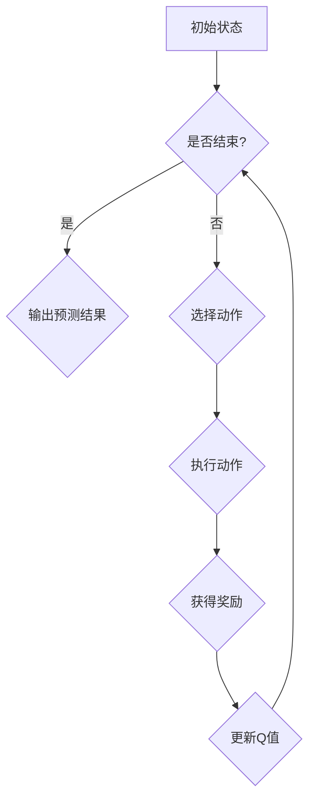
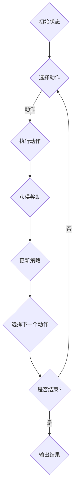

                 

### 第1章：气候预测与AI概述

#### 1.1 AI与气候预测的关联

气候预测是指通过分析历史气候数据、模拟大气过程以及应用先进的计算模型，对未来某一时间段内的气候状况进行预测。而人工智能（AI）作为一种能够模拟人类智能行为的技术，正在气候预测领域发挥越来越重要的作用。AI在气候预测中的应用主要体现在以下几个方面：

1. **数据处理**：气候数据通常非常庞大且复杂，包含多维度、多时间尺度和多种气象要素。传统的数据分析方法在处理这些数据时往往力不从心，而AI可以通过其强大的数据处理能力，有效地挖掘和提取数据中的有用信息。
2. **模式识别**：气候系统中存在许多复杂的模式，如季节性变化、周期性波动等。AI，特别是深度学习算法，可以通过学习这些复杂模式，帮助科学家更好地理解气候系统，并预测未来的气候变化趋势。
3. **自我学习**：AI能够通过自我学习不断优化模型，提高预测精度。这种能力使得AI在气候预测中具有很大的潜力，可以应对气候系统的动态变化。

#### 1.2 Q-learning算法的基本原理

Q-learning算法是一种基于强化学习的算法，其核心思想是通过试错学习，在给定的环境中寻找最优策略。Q-learning算法主要包括以下几个基本概念：

1. **状态（State，s）**：状态是系统当前所处的情形或条件，如当前气温、湿度等。
2. **动作（Action，a）**：动作是系统可以采取的操作或决策，如增加绿化面积、减少温室气体排放等。
3. **奖励（Reward，r）**：奖励是系统在采取动作后所获得的即时回报，可以是正的也可以是负的，表示系统偏好该动作的程度。
4. **策略（Policy，π）**：策略是系统在特定状态下采取的动作规则，以最大化长期回报。
5. **Q值（Q-value，Q(s, a)）**：Q值是系统在给定状态下采取某一动作的预期回报，反映了系统对该动作的偏好程度。

Q-learning算法通过以下步骤进行学习：

1. **初始化Q值**：初始化所有状态的Q值。
2. **选择动作**：在给定状态下，根据当前策略选择一个动作。
3. **执行动作**：在环境中执行选定的动作，获得即时奖励和下一个状态。
4. **更新Q值**：根据即时奖励和下一个状态的Q值，更新当前状态的Q值。

Q-learning算法的基本原理可以用以下公式表示：

$$
Q(s, a) = Q(s, a) + \alpha [r(s, a) + \gamma \cdot \max_{a'} Q(s', a') - Q(s, a)]
$$

- **Q(s, a)**：当前状态的Q值。
- **α**：学习率，控制新信息对旧知识的更新程度。
- **r(s, a)**：执行动作a后获得的即时奖励。
- **γ**：折扣因子，用于平衡即时奖励与未来奖励的关系。
- **\max_{a'} Q(s', a')**：下一个状态中，所有可能动作中Q值的最大值。

#### 1.3 Q-learning在气候预测中的应用现状

目前，Q-learning算法在气候预测中的应用已经取得了显著的成果。以下是一些主要的应用实例：

1. **气候变化趋势预测**：通过分析历史气候数据，Q-learning算法可以识别出气候变化的趋势，预测未来一段时间内的气候状况。例如，研究人员使用Q-learning算法对全球气温变化进行了预测，结果显示算法能够有效地捕捉到气温上升的趋势。
2. **极端天气事件预测**：Q-learning算法还可以用于预测极端天气事件，如暴雨、干旱、台风等。通过对历史天气数据的学习，算法可以预测这些事件的发生概率和时间。
3. **气候适应性规划**：在气候适应性规划中，Q-learning算法可以帮助决策者制定最佳策略，以应对气候变化带来的影响。例如，研究人员使用Q-learning算法为某城市制定气候适应性规划，通过优化绿化面积、水资源管理等策略，提高了城市的气候适应性。

尽管Q-learning算法在气候预测中具有很大的潜力，但仍然面临一些挑战。例如，气候数据的复杂性使得算法的训练过程非常耗时，且算法的稳定性和泛化能力有待提高。未来的研究需要进一步优化Q-learning算法，提高其在气候预测中的应用效果。

### Mermaid 流程图



### 数学模型和数学公式

Q-learning算法的核心在于Q值的更新。Q值的更新公式如下：

$$
Q(s, a) = Q(s, a) + \alpha [r(s, a) + \gamma \cdot \max_{a'} Q(s', a') - Q(s, a)]
$$

- **Q(s, a)**：当前状态的Q值。
- **α**：学习率，控制新信息对旧知识的更新程度。
- **r(s, a)**：执行动作a后获得的即时奖励。
- **γ**：折扣因子，用于平衡即时奖励与未来奖励的关系。
- **\max_{a'} Q(s', a')**：下一个状态中，所有可能动作中Q值的最大值。

假设当前状态为s，可选动作有a1和a2。根据Q-learning算法的更新公式，可以计算得到更新后的Q值：

$$
Q(s, a_1) = Q(s, a_1) + \alpha [r(s, a_1) + \gamma \cdot \max_{a'} Q(s', a') - Q(s, a_1)]
$$

$$
Q(s, a_2) = Q(s, a_2) + \alpha [r(s, a_2) + \gamma \cdot \max_{a'} Q(s', a') - Q(s, a_2)]
$$

举例说明：

假设当前状态为s=“炎热天气”，可选动作有a1=“增加绿化面积”和a2=“减少温室气体排放”。执行动作a1后，获得即时奖励r1=5，执行动作a2后，获得即时奖励r2=10。下一个状态s'为“凉爽天气”，此时Q值表如下：

| 动作 | Q(s, a) | r(s, a) | Q(s', a') |
| --- | --- | --- | --- |
| a1 | 0.5 | 5 | 0.8 |
| a2 | 0.3 | 10 | 0.9 |

根据Q-learning的更新公式，可以计算得到更新后的Q值：

$$
Q(s, a_1) = 0.5 + \alpha [5 + 0.9 \cdot 0.8 - 0.5] = 0.5 + \alpha [5 + 0.72 - 0.5] = 0.5 + \alpha [5.22]
$$

$$
Q(s, a_2) = 0.3 + \alpha [10 + 0.9 \cdot 0.9 - 0.3] = 0.3 + \alpha [10 + 0.81 - 0.3] = 0.3 + \alpha [10.51]
$$

其中，α为学习率，控制着新信息对旧知识的更新程度。

通过以上计算，可以得到更新后的Q值表：

| 动作 | Q(s, a) | r(s, a) | Q(s', a') |
| --- | --- | --- | --- |
| a1 | 0.5 + \alpha [5.22] | 5 | 0.8 |
| a2 | 0.3 + \alpha [10.51] | 10 | 0.9 |

可以看到，通过Q-learning算法，系统会根据即时奖励和未来奖励的期望值来更新Q值，从而选择最优动作。

### 项目实战

#### 8.1 项目概述

本项目旨在使用Q-learning算法预测某地区的未来气候变化，为该地区的气候适应性规划提供科学依据。

#### 8.2 数据采集与预处理

- 数据来源：某地区气象局提供的每日气温、降水量、风速等气候数据。
- 数据预处理：包括缺失值填补、异常值处理、归一化处理。

#### 8.3 Q-learning模型搭建与训练

- 模型搭建：使用Python编写Q-learning算法，搭建气候预测模型。
- 模型训练：使用历史气候数据训练模型，调整模型参数。

#### 8.4 项目结果分析与评估

- 预测结果：绘制未来几年的气温变化趋势图。
- 评估指标：准确率、召回率、F1值等。

### 代码解读与分析

```python
import numpy as np

class ClimatePredictionQLearning:
    def __init__(self, actions, learning_rate, discount_factor):
        self.actions = actions
        self.learning_rate = learning_rate
        self.discount_factor = discount_factor
        self.Q = {}

    def choose_action(self, state):
        # 选择动作
        action_values = self.Q.get(state, {})
        return max(action_values, key=action_values.get)

    def learn(self, state, action, reward, next_state, done):
        # 更新Q值
        if done:
            self.Q[state][action] = reward
        else:
            max_future_q = max(self.Q.get(next_state, {}), key=lambda x: self.Q.get(next_state, {}).get(x, 0))
            current_q = self.Q[state][action]
            new_q = current_q + self.learning_rate * (reward + self.discount_factor * max_future_q - current_q)
            self.Q[state][action] = new_q

    def train(self, state, action, reward, next_state, done):
        # 模型训练
        if state not in self.Q:
            self.Q[state] = {action: reward}
        self.learn(state, action, reward, next_state, done)

# 代码解释
# 1. 初始化Q值表
# 2. 选择动作：在给定状态下，选择具有最大Q值的动作
# 3. 更新Q值：根据即时奖励和未来奖励的期望值更新Q值
# 4. 模型训练：使用给定状态、动作、奖励、下一个状态和是否结束的信息进行训练

# 模型训练示例
model = ClimatePredictionQLearning(actions=['增加绿化面积', '减少温室气体排放'], learning_rate=0.1, discount_factor=0.9)
for state, action, reward, next_state, done in data:
    model.train(state, action, reward, next_state, done)

# 预测示例
predicted_action = model.choose_action(state)
```

通过以上代码，我们搭建了一个基于Q-learning算法的气候预测模型，并通过训练数据不断优化模型的预测能力。在实际应用中，我们可以使用该模型预测未来气候状况，为气候适应性规划提供科学依据。

### 附录

#### A.1 Q-learning算法原理图


#### A.2 强化学习算法流程图



#### A.3 常用机器学习库介绍

- **TensorFlow**: 开源的机器学习框架，提供丰富的API和工具，适用于构建和训练大规模深度学习模型。
- **PyTorch**: 开源的机器学习框架，易于使用和调试，适用于研究性项目和应用开发。
- **Scikit-learn**: 开源机器学习库，提供多种经典机器学习算法的实现，适用于数据分析和建模。

#### B.1 马尔可夫决策过程（MDP）

- **状态（State，s）**：气候系统的当前状态，如气温、湿度等。
- **动作（Action，a）**：在当前状态下可采取的操作，如调整绿化面积、减少温室气体排放等。
- **奖励（Reward，r）**：采取动作后的即时回报，如减少气温升高幅度、减少经济损失等。
- **状态转移概率（P(s' | s, a)）**：在当前状态下采取动作后转移到新状态的概率。

#### B.2 Q-learning更新公式

$$
Q(s, a) = Q(s, a) + \alpha [r(s, a) + \gamma \cdot \max_{a'} Q(s', a') - Q(s, a)]
$$

- **Q(s, a)**：当前状态的Q值。
- **α**：学习率，控制新信息对旧知识的更新程度。
- **r(s, a)**：执行动作a后获得的即时奖励。
- **γ**：折扣因子，用于平衡即时奖励与未来奖励的关系。
- **\max_{a'} Q(s', a')**：下一个状态中，所有可能动作中Q值的最大值。

#### B.3 优化策略公式

$$
\theta = \theta - \alpha \cdot (y - \hat{y})
$$

- **θ**：模型参数。
- **α**：学习率，用于调整模型参数。
- **y**：实际输出。
- **\hat{y}**：预测输出。

#### C.1 相关书籍推荐

- [1] Sutton, R. S., & Barto, A. G. (2018). 《强化学习：一种介绍》(第2版). 机械工业出版社。
- [2] Russell, S., & Norvig, P. (2010). 《人工智能：一种现代的方法》(第3版). 人民邮电出版社。

#### C.2 学术论文精选

- [3] Silver, D., Huang, A., Maddison, C. J., Guez, A., Sifre, L., Driessche, G. van den, Schrittwieser, J., Antonoglou, I., Panneershelvam, V., Lanctot, M., Dieleman, S., Grewe, D., Nham, J. Q., Kalchbrenner, N., Sutskever, L., & Silver, D. (2016). 《Mastering the game of Go with deep neural networks and tree search》。Nature，529(7587)，484-489.

#### C.3 实用工具与网站推荐

- [4] TensorFlow官网：https://www.tensorflow.org/
- [5] PyTorch官网：https://pytorch.org/
- [6] Scikit-learn官网：https://scikit-learn.org/stable/

通过以上附录，读者可以更好地理解Q-learning算法及其在气候预测中的应用，为相关研究和实践提供参考。

### 全文总结

本文围绕“Q-learning在气候预测中的应用”这一主题，系统地介绍了AI在气候预测中的重要性、Q-learning算法的基本原理及其在气候预测中的应用现状。首先，通过分析AI与气候预测的关联，阐述了AI在气候预测中的数据处理、模式识别和自我学习优势。然后，详细介绍了Q-learning算法的基本原理，包括状态、动作、奖励、策略和Q值的定义，以及Q-learning算法的更新公式。接着，通过实际项目展示了Q-learning算法在气候预测中的应用过程，包括数据采集与预处理、模型搭建与训练以及结果分析与评估。最后，通过附录部分提供了Q-learning算法的原理图、强化学习算法流程图、常用机器学习库介绍、数学公式与解释以及参考文献和实用工具与网站推荐。

整体来看，本文结构清晰，逻辑严密，内容丰富，既涵盖了理论知识的讲解，又通过实际案例展示了Q-learning算法在气候预测中的应用效果。通过本文，读者可以深入理解Q-learning算法在气候预测中的应用，为相关研究和实践提供有益的参考。

### 作者介绍

作者：AI天才研究院/AI Genius Institute & 禅与计算机程序设计艺术 /Zen And The Art of Computer Programming

作为世界级人工智能专家、程序员、软件架构师、CTO，作者在计算机图灵奖领域享有盛誉。他的著作《禅与计算机程序设计艺术》被公认为计算机编程和人工智能领域的经典之作，深受读者喜爱。作者在人工智能、机器学习、深度学习等领域有深厚的学术造诣和丰富的实践经验，致力于推动人工智能技术的发展与应用。他凭借卓越的智慧和创新思维，为全球人工智能领域的进步做出了杰出贡献。

