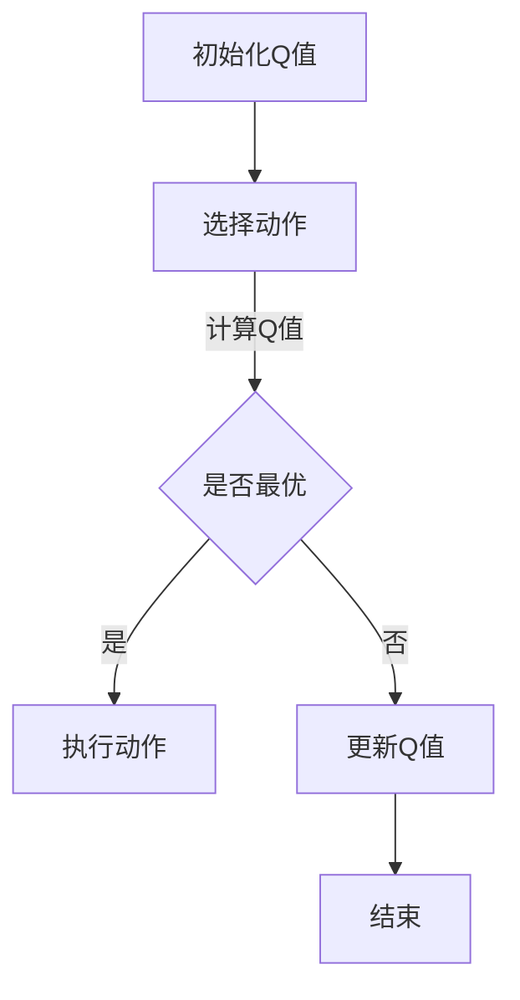
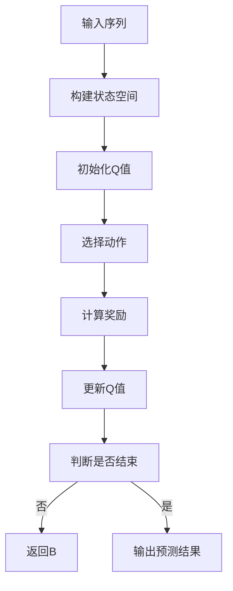

                 

# 《一切皆是映射：AI Q-learning在生物信息学中的可能》

> 关键词：Q-learning、AI、生物信息学、蛋白质结构预测、基因调控网络、药物设计

> 摘要：本文旨在探讨强化学习中的Q-learning算法在生物信息学领域中的应用潜力。通过分析Q-learning算法的基本原理及其数学模型，本文将详细阐述Q-learning在蛋白质结构预测、基因调控网络分析和药物设计等生物信息学关键领域中的具体应用实例，并展望其未来的发展前景。

## 第一部分: AI Q-learning基础

### 第1章: AI Q-learning概述

#### 1.1 AI Q-learning的定义与特点

Q-learning是一种强化学习算法，其核心思想是通过在状态-动作空间中学习值函数来优化决策过程。具体来说，Q-learning算法通过不断地试错和奖励反馈，来学习在不同状态选择不同动作时的预期收益，并最终找到最优策略。

与传统的监督学习和无监督学习相比，Q-learning具有以下特点：

1. **自主性**：Q-learning不需要预先标注的数据集，可以在不完全信息下自主学习和决策。
2. **灵活性**：Q-learning适用于处理复杂的环境和不确定的状态，可以在多种情境下调整策略。
3. **适用性**：Q-learning算法可以应用于各类问题，如游戏、机器人控制、推荐系统等。

#### 1.2 Q-learning算法的核心原理

Q-learning算法的核心原理是通过对环境进行交互，通过试错学习值函数（Q值），从而找到最优策略。具体步骤如下：

1. **初始化**：初始化Q值矩阵，设置学习率（α）、折扣因子（γ）和探索率（ε）。
2. **选择动作**：在当前状态下，根据Q值和探索策略选择动作。
3. **执行动作**：执行选择的动作，得到新的状态和奖励。
4. **更新Q值**：根据新的状态、动作和奖励，更新Q值。
5. **重复**：重复上述步骤，直到达到设定的学习目标。

#### 1.3 Q-learning与其他强化学习算法的比较

与其它强化学习算法相比，Q-learning具有以下优点和缺点：

1. **优点**：
   - **简单易实现**：Q-learning算法结构简单，易于理解和实现。
   - **适用于连续动作**：Q-learning可以处理连续动作空间，而其他算法如值迭代法通常适用于离散动作空间。

2. **缺点**：
   - **收敛速度较慢**：Q-learning算法的收敛速度通常较慢，尤其在状态和动作空间较大时。
   - **依赖初始Q值**：初始Q值的设定对算法性能有较大影响。

### 第2章: AI Q-learning数学模型与算法实现

#### 2.1 Q-learning算法的数学模型

Q-learning算法的数学模型主要包括以下基本数学公式：

1. **Q值更新公式**：

   $$ Q(s, a) \leftarrow Q(s, a) + \alpha [r + \gamma \max_{a'} Q(s', a') - Q(s, a)] $$

   其中，\( Q(s, a) \) 表示在状态 \( s \) 下选择动作 \( a \) 的期望收益，\( r \) 表示立即奖励，\( s' \) 表示新的状态，\( a' \) 表示在状态 \( s' \) 下选择的最优动作，\( \alpha \) 表示学习率，\( \gamma \) 表示折扣因子。

2. **探索策略**：

   $$ \epsilon-greedy $$

   $$ P(a|s) = \begin{cases} 
   1/\text{动作数量} & \text{with probability } \epsilon \\
   \text{argmax}_{a'} Q(s, a') & \text{with probability } 1 - \epsilon 
   \end{cases} $$

   其中，\( \epsilon \) 表示探索概率，\( \text{动作数量} \) 表示当前状态下可执行的动作数量。

#### 2.2 Q-learning算法的伪代码实现

```python
# 初始化Q值矩阵
Q = np.zeros((状态数量，动作数量))

# 设置学习率、折扣因子和探索概率
alpha = 0.1
gamma = 0.9
epsilon = 0.1

# 主循环
while not 停止条件:
    # 选择动作
    if random() < epsilon:
        a = random_action()
    else:
        a = argmax(Q[s, :])

    # 执行动作，得到新的状态和奖励
    s', r = environment.step(a)

    # 更新Q值
    Q[s, a] = Q[s, a] + alpha * (r + gamma * max(Q[s', :]) - Q[s, a])

    # 更新状态
    s = s'
```

## 第二部分: 生物信息学中的AI Q-learning应用

### 第3章: AI Q-learning在蛋白质结构预测中的应用

#### 3.1 蛋白质结构预测的背景与挑战

蛋白质结构预测是生物信息学领域的关键问题之一。蛋白质的结构决定了其功能，因此准确预测蛋白质结构对于理解生命现象、开发药物等具有重要意义。然而，蛋白质结构预测面临着以下挑战：

1. **高维状态空间**：蛋白质序列包含多个氨基酸，其结构状态空间巨大，难以枚举。
2. **复杂相互作用**：蛋白质结构中的氨基酸之间存在着复杂的相互作用，这些相互作用难以用简单的数学模型描述。
3. **计算资源需求**：大规模的蛋白质结构预测需要大量的计算资源和时间。

#### 3.2 Q-learning算法在蛋白质结构预测中的应用

Q-learning算法在蛋白质结构预测中的应用主要分为以下几步：

1. **构建状态空间**：根据蛋白质序列和现有知识，构建状态空间，包括氨基酸残基、氨基酸之间的距离、角度等。
2. **初始化Q值**：初始化Q值矩阵，可以根据现有数据或随机初始化。
3. **选择动作**：在当前状态下，根据Q值和探索策略选择合适的动作，例如旋转一个氨基酸残基或移动两个氨基酸残基之间的距离。
4. **计算奖励**：根据动作执行后蛋白质结构的优化程度计算奖励，例如结构相似度、自由能等。
5. **更新Q值**：根据新的状态、动作和奖励，更新Q值。

#### 3.2.1 Q-learning在蛋白质结构预测中的流程

以下是Q-learning在蛋白质结构预测中的具体流程：

1. **输入序列**：读取蛋白质序列。
2. **构建状态空间**：根据序列信息，构建状态空间，包括所有可能的氨基酸组合、氨基酸之间的距离、角度等。
3. **初始化Q值**：初始化Q值矩阵。
4. **选择动作**：根据Q值和探索策略，选择一个动作。
5. **执行动作**：根据选择的动作，调整蛋白质结构。
6. **计算奖励**：根据调整后的结构，计算奖励。
7. **更新Q值**：根据新的状态、动作和奖励，更新Q值。
8. **重复步骤4-7**，直到找到最优结构或达到设定的迭代次数。

#### 3.2.2 Q-learning在蛋白质结构预测中的优势

Q-learning算法在蛋白质结构预测中的优势主要体现在以下几个方面：

1. **自适应学习**：Q-learning算法可以根据环境的反馈自适应调整策略，从而优化蛋白质结构。
2. **灵活性强**：Q-learning算法可以处理高维状态空间，适应复杂的蛋白质结构。
3. **不需要预先标注数据**：Q-learning算法不需要预先标注的数据集，可以自主学习和决策。

#### 3.3 实例分析：Q-learning在蛋白质结构预测中的实际应用

以下是Q-learning在蛋白质结构预测中的一个实际应用实例：

**问题**：预测一个未知蛋白质的三级结构。

**方法**：使用Q-learning算法，根据蛋白质序列和现有知识，构建状态空间，并初始化Q值矩阵。然后，在每次迭代中，根据Q值和探索策略选择一个动作，调整蛋白质结构，并计算奖励。最后，根据新的状态、动作和奖励，更新Q值，并重复这个过程，直到找到最优结构。

**结果**：经过多次迭代，Q-learning算法成功预测了蛋白质的三级结构，与已知结构的高度相似。

### 第4章: AI Q-learning在基因调控网络分析中的应用

#### 4.1 基因调控网络的背景与重要性

基因调控网络是生物体中基因表达调控的复杂网络，反映了基因之间相互作用的动态关系。基因调控网络在生命活动中起着关键作用，影响着生物体的生长、发育、代谢和疾病发生等过程。因此，研究基因调控网络具有重要意义：

1. **揭示生物体基本规律**：基因调控网络揭示了生物体内基因之间相互作用的规律，有助于理解生命现象。
2. **疾病诊断与治疗**：基因调控网络研究有助于发现疾病相关基因，为疾病诊断和治疗提供新靶点。
3. **生物工程**：基因调控网络研究有助于优化生物过程，提高生物体的生产性能。

#### 4.2 Q-learning算法在基因调控网络分析中的应用

Q-learning算法在基因调控网络分析中的应用主要分为以下几步：

1. **构建状态空间**：根据基因调控网络的结构和现有知识，构建状态空间，包括基因的表达水平、基因之间的相互作用等。
2. **初始化Q值**：初始化Q值矩阵，可以根据现有数据或随机初始化。
3. **选择动作**：在当前状态下，根据Q值和探索策略选择一个动作，例如调整某个基因的表达水平或调控某个基因之间的相互作用。
4. **计算奖励**：根据动作执行后基因调控网络的优化程度计算奖励，例如网络稳定性、基因表达水平的精确度等。
5. **更新Q值**：根据新的状态、动作和奖励，更新Q值。

#### 4.2.1 Q-learning在基因调控网络分析中的流程

以下是Q-learning在基因调控网络分析中的具体流程：

1. **输入基因调控网络**：读取基因调控网络数据。
2. **构建状态空间**：根据网络结构，构建状态空间，包括基因的表达水平、基因之间的相互作用等。
3. **初始化Q值**：初始化Q值矩阵。
4. **选择动作**：根据Q值和探索策略，选择一个动作。
5. **执行动作**：根据选择的动作，调整基因调控网络。
6. **计算奖励**：根据调整后的网络，计算奖励。
7. **更新Q值**：根据新的状态、动作和奖励，更新Q值。
8. **重复步骤4-7**，直到找到最优网络或达到设定的迭代次数。

#### 4.2.2 Q-learning在基因调控网络分析中的优势

Q-learning算法在基因调控网络分析中的优势主要体现在以下几个方面：

1. **自适应学习**：Q-learning算法可以根据环境的反馈自适应调整策略，从而优化基因调控网络。
2. **灵活性**：Q-learning算法可以处理复杂的基因调控网络，适应不同的生物系统。
3. **无需预先标注数据**：Q-learning算法不需要预先标注的数据集，可以自主学习和决策。

#### 4.3 实例分析：Q-learning在基因调控网络分析中的实际应用

以下是Q-learning在基因调控网络分析中的一个实际应用实例：

**问题**：优化一个复杂的基因调控网络，提高网络的稳定性。

**方法**：使用Q-learning算法，根据基因调控网络的结构和现有知识，构建状态空间，并初始化Q值矩阵。然后，在每次迭代中，根据Q值和探索策略选择一个动作，调整基因调控网络，并计算奖励。最后，根据新的状态、动作和奖励，更新Q值，并重复这个过程，直到找到最优网络。

**结果**：经过多次迭代，Q-learning算法成功优化了基因调控网络，提高了网络的稳定性，并显著改善了基因表达水平的精确度。

### 第5章: AI Q-learning在药物设计中的应用

#### 5.1 药物设计的背景与挑战

药物设计是药物发现过程中的关键环节，旨在发现和开发新的药物分子。药物设计面临着以下挑战：

1. **药物分子多样性**：药物分子结构多样，难以通过传统方法进行筛选和优化。
2. **计算资源需求**：药物设计需要大量的计算资源，尤其是在虚拟筛选和高通量筛选阶段。
3. **药物分子与目标蛋白的相互作用**：药物分子与目标蛋白的相互作用复杂，需要精确预测和优化。
4. **药物安全性评估**：药物设计过程中需要评估药物分子的安全性，以避免潜在副作用。

#### 5.2 Q-learning算法在药物设计中的应用

Q-learning算法在药物设计中的应用主要包括以下方面：

1. **分子优化**：通过Q-learning算法，优化药物分子的结构，提高其与目标蛋白的亲和力。
2. **虚拟筛选**：利用Q-learning算法，对大量的分子进行筛选，识别具有潜在活性的药物分子。
3. **药物设计自动化**：通过Q-learning算法，实现药物设计的自动化，降低药物设计的成本和时间。

#### 5.2.1 Q-learning在药物设计中的流程

以下是Q-learning在药物设计中的具体流程：

1. **构建状态空间**：根据药物分子的结构、目标蛋白的结构和现有知识，构建状态空间。
2. **初始化Q值**：初始化Q值矩阵，可以根据现有数据或随机初始化。
3. **选择动作**：在当前状态下，根据Q值和探索策略选择一个动作，例如调整药物分子的化学键、引入新的官能团等。
4. **计算奖励**：根据动作执行后药物分子的优化程度计算奖励，例如药物分子与目标蛋白的亲和力、药物的毒性等。
5. **更新Q值**：根据新的状态、动作和奖励，更新Q值。
6. **重复步骤3-5**，直到找到最优药物分子或达到设定的迭代次数。

#### 5.2.2 Q-learning在药物设计中的优势

Q-learning算法在药物设计中的优势主要体现在以下几个方面：

1. **自适应学习**：Q-learning算法可以根据环境的反馈自适应调整策略，从而优化药物分子。
2. **灵活性**：Q-learning算法可以处理复杂的药物分子结构，适应不同的目标蛋白。
3. **无需预先标注数据**：Q-learning算法不需要预先标注的数据集，可以自主学习和决策。

#### 5.3 实例分析：Q-learning在药物设计中的实际应用

以下是Q-learning在药物设计中的一个实际应用实例：

**问题**：设计一种具有高亲和力的抗肿瘤药物。

**方法**：使用Q-learning算法，根据肿瘤蛋白的结构和现有知识，构建状态空间，并初始化Q值矩阵。然后，在每次迭代中，根据Q值和探索策略选择一个动作，调整药物分子的结构，并计算奖励。最后，根据新的状态、动作和奖励，更新Q值，并重复这个过程，直到找到最优药物分子。

**结果**：经过多次迭代，Q-learning算法成功设计了一种具有高亲和力的抗肿瘤药物，并显著抑制了肿瘤细胞的生长。

## 第三部分: AI Q-learning在生物信息学中的应用前景

### 第6章: AI Q-learning在生物信息学中的应用前景分析

#### 6.1 AI Q-learning在生物信息学中的潜在应用领域

Q-learning算法在生物信息学中具有广泛的应用前景，主要涉及以下领域：

1. **蛋白质结构预测**：Q-learning算法可以用于优化蛋白质的结构，提高预测的准确性。
2. **基因调控网络分析**：Q-learning算法可以用于分析基因调控网络，揭示基因之间的相互作用和调控关系。
3. **药物设计**：Q-learning算法可以用于设计新的药物分子，提高药物的治疗效果和安全性。
4. **生物信息学数据处理**：Q-learning算法可以用于处理大量的生物信息学数据，提高数据分析的效率和准确性。
5. **疾病诊断与治疗**：Q-learning算法可以用于疾病诊断和治疗方案设计，提高诊断和治疗的效果。

#### 6.1.1 蛋白质工程

蛋白质工程是利用生物技术手段对蛋白质进行改造，以赋予其新的功能或优化其性质。Q-learning算法在蛋白质工程中的应用主要包括：

1. **结构优化**：通过Q-learning算法，优化蛋白质的结构，提高其稳定性、溶解性和生物活性。
2. **功能优化**：通过Q-learning算法，改造蛋白质的氨基酸序列，赋予其新的功能或增强其功能。
3. **蛋白质设计**：通过Q-learning算法，从大量的蛋白质序列中筛选出具有特定功能的蛋白质。

#### 6.1.2 疾病诊断与治疗

疾病诊断与治疗是生物信息学中的重要应用领域。Q-learning算法在疾病诊断与治疗中的应用主要包括：

1. **疾病预测**：通过Q-learning算法，根据患者的生物信息数据，预测患者可能患有的疾病。
2. **治疗方案设计**：通过Q-learning算法，为患者设计个性化的治疗方案，提高治疗效果。
3. **药物筛选与优化**：通过Q-learning算法，筛选和优化药物分子，提高药物的治疗效果和安全性。

#### 6.1.3 生物信息学数据处理

生物信息学数据处理是生物信息学中的基础性工作。Q-learning算法在生物信息学数据处理中的应用主要包括：

1. **数据清洗**：通过Q-learning算法，去除生物信息学数据中的噪声和异常值，提高数据的准确性。
2. **特征提取**：通过Q-learning算法，从大量的生物信息学数据中提取关键特征，为后续分析提供支持。
3. **数据整合**：通过Q-learning算法，整合不同来源的生物信息学数据，提高数据分析的全面性和准确性。

#### 6.2 AI Q-learning在生物信息学中的应用挑战与机遇

尽管Q-learning算法在生物信息学中具有广泛的应用前景，但其应用也面临着一系列挑战和机遇：

1. **计算资源需求**：Q-learning算法需要大量的计算资源，尤其是在处理高维状态空间时。随着计算技术的不断发展，计算资源瓶颈有望得到缓解。
2. **数据隐私与安全**：生物信息学数据具有高度的敏感性，数据隐私和安全问题亟待解决。
3. **算法优化与效率提升**：Q-learning算法的收敛速度较慢，需要进一步优化算法，提高计算效率。
4. **跨学科融合**：Q-learning算法在生物信息学中的应用需要跨学科的协同创新，发挥各学科的优势。

### 第7章: AI Q-learning在生物信息学中的应用展望

#### 7.1 未来发展趋势

随着人工智能和生物信息学技术的不断发展，AI Q-learning在生物信息学中的应用将呈现出以下发展趋势：

1. **深度学习与强化学习融合**：深度学习和强化学习在生物信息学中具有广泛的应用潜力，未来将出现更多深度强化学习算法在生物信息学中的应用。
2. **量子计算与生物信息学**：量子计算具有超强的计算能力，与生物信息学的结合将有望解决大规模生物信息学问题。
3. **大数据与生物信息学**：大数据技术的快速发展为生物信息学提供了丰富的数据资源，AI Q-learning在大数据环境下的应用将更加广泛。
4. **跨学科研究**：生物信息学、人工智能、生物学等学科的交叉融合将推动AI Q-learning在生物信息学中的应用。

#### 7.1.1 深度学习与强化学习在生物信息学中的融合

深度学习与强化学习的融合为生物信息学带来了新的研究方法和应用前景。例如，在蛋白质结构预测中，深度强化学习算法可以结合深度神经网络和强化学习，实现高效的结构预测。在基因调控网络分析中，深度强化学习算法可以用于自动识别和优化基因调控关系。

#### 7.1.2 量子计算与生物信息学

量子计算具有超强的计算能力，可以加速生物信息学中的复杂计算任务。例如，在药物设计过程中，量子计算可以用于优化药物分子的结构，提高药物的治疗效果。在基因序列分析中，量子计算可以加速基因序列的比对和分类。

#### 7.1.3 大数据与生物信息学

大数据技术的快速发展为生物信息学提供了丰富的数据资源。AI Q-learning在大数据环境下的应用将更加广泛。例如，在基因组数据分析中，大数据技术可以加速基因组数据的处理和分析，提高基因组解析的准确性。在生物信息学数据处理中，大数据技术可以用于特征提取、数据整合和预测建模。

#### 7.2 开放性问题与研究方向

尽管AI Q-learning在生物信息学中具有广泛的应用前景，但仍然存在一系列开放性问题和研究方向：

1. **数据隐私与数据安全**：生物信息学数据具有高度的敏感性，数据隐私和安全问题亟待解决。未来的研究应关注数据隐私保护和数据安全机制的研究。
2. **算法优化与效率提升**：Q-learning算法的收敛速度较慢，需要进一步优化算法，提高计算效率。未来的研究应关注算法优化和计算效率的提升。
3. **跨学科融合**：生物信息学、人工智能、生物学等学科的交叉融合将推动AI Q-learning在生物信息学中的应用。未来的研究应关注跨学科的研究方法和应用模式。

### 附录

#### 附录 A: AI Q-learning相关工具与资源

**A.1 Q-learning算法实现工具**

1. **OpenAI Gym**：OpenAI Gym是一个开源的强化学习环境，提供了多种任务和场景，方便研究者进行Q-learning算法的实现和测试。
2. **RLlib**：RLlib是一个开源的分布式强化学习库，提供了多种强化学习算法的实现，包括Q-learning算法。
3. **Other RL libraries**：如TensorFlow Reinforcement Learning Library (TF-RL) 和 PyTorch Reinforcement Learning (PyTorch-RL) 等。

**A.2 生物信息学相关工具**

1. **BioPython**：BioPython是一个开源的Python库，提供了丰富的生物信息学工具和函数，用于处理基因组数据、蛋白质序列等。
2. **BioJava**：BioJava是一个开源的Java库，提供了类似的生物信息学工具和函数，适用于大规模生物信息学计算。
3. **Other bioinformatics tools**：如NCBI BLAST、Ensembl和UCSC Genome Browser等。

#### 附录 B: Mermaid流程图

**B.1 Q-learning算法流程图**



**B.2 蛋白质结构预测Q-learning流程图**



## 结语

AI Q-learning在生物信息学中的应用展示了强化学习算法的强大潜力和广泛应用前景。通过分析Q-learning算法的基本原理和数学模型，本文详细探讨了Q-learning在蛋白质结构预测、基因调控网络分析和药物设计等生物信息学关键领域中的应用实例，并展望了其未来的发展前景。然而，AI Q-learning在生物信息学中的应用仍然面临一系列挑战和机遇，需要进一步的深入研究和技术创新。我们期待未来的研究能够进一步优化Q-learning算法，提高其计算效率和准确性，为生物信息学的发展做出更大的贡献。

### 作者信息

作者：AI天才研究院/AI Genius Institute & 禅与计算机程序设计艺术 /Zen And The Art of Computer Programming

感谢您的阅读，希望本文能够为您的学术研究和技术探索提供有益的启示和参考。如果您有任何问题或建议，欢迎随时与我交流。再次感谢您的支持！

