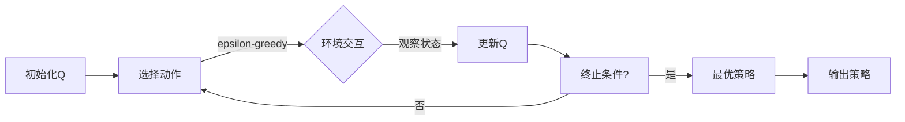
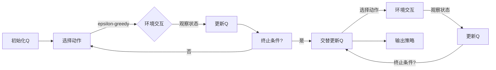

                 

# 一切皆是映射：AI Q-learning在网络安全中的实践

> 关键词：AI Q-learning、网络安全、入侵检测、恶意代码检测、行为分析

> 摘要：本文将探讨AI Q-learning算法在网络安全中的应用，通过深入分析其基本原理、数学模型和改进策略，以及实际案例，展示如何利用Q-learning算法提升网络安全防护能力，为网络安全领域带来新的思路和解决方案。

## 目录大纲

## 第一部分：AI Q-learning基础

### 第1章：AI Q-learning概述

#### 1.1 AI Q-learning的背景与意义

#### 1.2 Q-learning算法的基本原理

#### 1.3 Q-learning算法的特点与应用领域

### 第2章：Q-learning算法的数学模型

#### 2.1 状态空间与动作空间

#### 2.2 Q-value函数

#### 2.3 Q-learning算法的更新规则

#### 2.4 演示一个简单的 Q-learning算法实例（伪代码）

### 第3章：Q-learning算法的改进与优化

#### 3.1 断言（epsilon-greedy）策略

#### 3.2 渐进式探索策略

#### 3.3 双Q-learning算法

#### 3.4 演示一个改进的 Q-learning算法实例（伪代码）

## 第二部分：AI Q-learning在网络安全中的应用

### 第4章：AI Q-learning在网络安全中的应用概述

#### 4.1 网络安全面临的新挑战

#### 4.2 AI Q-learning在网络安全中的应用场景

#### 4.3 AI Q-learning在网络安全中的优势

### 第5章：AI Q-learning在入侵检测中的应用

#### 5.1 入侵检测概述

#### 5.2 基于AI Q-learning的入侵检测算法

#### 5.3 演示一个基于AI Q-learning的入侵检测实例

### 第6章：AI Q-learning在恶意代码检测中的应用

#### 6.1 恶意代码检测概述

#### 6.2 基于AI Q-learning的恶意代码检测算法

#### 6.3 演示一个基于AI Q-learning的恶意代码检测实例

### 第7章：AI Q-learning在行为分析中的应用

#### 7.1 行为分析概述

#### 7.2 基于AI Q-learning的行为分析算法

#### 7.3 演示一个基于AI Q-learning的行为分析实例

## 第三部分：AI Q-learning在网络安全中的实践

### 第8章：AI Q-learning网络安全项目的实施流程

#### 8.1 项目需求分析

#### 8.2 环境搭建与工具选择

#### 8.3 模型训练与优化

#### 8.4 系统部署与监控

### 第9章：AI Q-learning网络安全项目的实战案例

#### 9.1 案例一：基于AI Q-learning的入侵检测系统

#### 9.2 案例二：基于AI Q-learning的恶意代码检测系统

#### 9.3 案例三：基于AI Q-learning的行为分析系统

### 第10章：AI Q-learning在网络安全中的未来发展趋势

#### 10.1 AI Q-learning在网络安全中的挑战

#### 10.2 AI Q-learning在网络安全中的未来方向

#### 10.3 结论与展望

## 附录

### 附录 A：常用AI Q-learning工具与资源

#### A.1 常用AI Q-learning框架

#### A.2 常用AI Q-learning库

#### A.3 常用AI Q-learning学习资源

### 附录 B：AI Q-learning算法的Mermaid流程图

#### B.1 Q-learning算法的基本流程

#### B.2 改进的Q-learning算法流程

#### B.3 双Q-learning算法流程

---

### 第一部分：AI Q-learning基础

#### 第1章：AI Q-learning概述

### 1.1 AI Q-learning的背景与意义

随着信息技术的飞速发展，网络安全已经成为全球关注的重要问题。然而，传统的网络安全技术已经难以应对日益复杂的网络攻击和威胁。为了提高网络安全防护能力，人工智能（AI）技术逐渐在网络安全领域得到应用。其中，Q-learning算法作为一种经典的强化学习算法，因其优秀的自适应性和自学习能力，在网络安全中展现出巨大的潜力。

Q-learning算法起源于20世纪90年代，是由理查德·萨顿（Richard Sutton）和安德鲁·布希（Andrew Barto）提出的。它通过迭代更新策略值（Q-value）来逐渐逼近最优策略，从而实现决策的优化。Q-learning算法在多个领域取得了显著的成果，如游戏、机器人控制、推荐系统等。在网络安全领域，Q-learning算法可以被应用于入侵检测、恶意代码检测和行为分析等方面，为网络安全提供强有力的技术支持。

AI Q-learning在网络安全中的意义主要体现在以下几个方面：

1. **自适应性和自学习能力**：AI Q-learning能够根据网络环境和攻击模式的变化，自动调整和优化防护策略，提高网络安全的动态适应性。

2. **实时响应能力**：AI Q-learning能够实时监控网络流量，快速识别潜在的攻击行为，实现实时响应和防御。

3. **降低误报率**：传统的基于规则的网络安全技术容易产生大量误报，而AI Q-learning通过学习和分析网络行为模式，能够降低误报率，提高检测精度。

4. **智能决策支持**：AI Q-learning能够为网络安全管理人员提供智能决策支持，帮助他们更好地应对复杂的安全威胁。

### 1.2 Q-learning算法的基本原理

Q-learning算法是一种基于值函数的强化学习算法，其核心思想是通过不断更新策略值（Q-value）来逼近最优策略。Q-value表示在某个状态下执行某个动作的预期收益，即：

\[ Q(s, a) = \sum_{s'} P(s' | s, a) \cdot R(s', a) + \gamma \cdot \max_{a'} Q(s', a') \]

其中，\( s \) 表示当前状态，\( a \) 表示采取的动作，\( s' \) 表示下一状态，\( a' \) 表示下一动作，\( R \) 表示奖励函数，\( \gamma \) 表示折扣因子，\( P \) 表示状态转移概率。

Q-learning算法的基本步骤如下：

1. **初始化**：初始化策略值函数 \( Q(s, a) \)，通常设置为全零矩阵。

2. **选择动作**：根据当前状态 \( s \)，采用某种策略（如epsilon-greedy策略）选择动作 \( a \)。

3. **执行动作**：在环境 \( E \) 中执行动作 \( a \)，观察到下一状态 \( s' \) 和奖励 \( R \)。

4. **更新策略值**：根据Q-learning更新规则，更新策略值函数 \( Q(s, a) \)。

5. **重复步骤2-4**：不断重复上述步骤，直到达到目标状态或达到预设的迭代次数。

Q-learning算法的更新规则为：

\[ Q(s, a) \leftarrow Q(s, a) + \alpha \cdot [R(s', a') + \gamma \cdot \max_{a'} Q(s', a') - Q(s, a)] \]

其中，\( \alpha \) 表示学习率，用于控制策略值的更新幅度。

### 1.3 Q-learning算法的特点与应用领域

Q-learning算法具有以下特点：

1. **无模型要求**：Q-learning算法不需要对环境进行建模，只需要通过观察状态和奖励，即可实现策略的优化。

2. **无需完全记忆**：Q-learning算法不需要记住所有状态和动作，只需要维护一个策略值函数即可。

3. **自适应性强**：Q-learning算法能够根据环境的变化，自动调整策略值，实现自适应学习。

4. **收敛性**：在满足一定条件下，Q-learning算法能够收敛到最优策略值。

Q-learning算法的应用领域包括：

1. **游戏**：Q-learning算法被广泛应用于游戏中的智能体策略学习，如围棋、象棋等。

2. **机器人控制**：Q-learning算法可用于机器人的路径规划、动作决策等。

3. **推荐系统**：Q-learning算法可用于推荐系统中的用户行为预测和商品推荐。

4. **网络安全**：Q-learning算法可用于入侵检测、恶意代码检测、行为分析等。

在网络安全领域，Q-learning算法可以通过以下方式提升防护能力：

1. **入侵检测**：Q-learning算法可以用于检测网络中的异常行为，实现实时入侵检测。

2. **恶意代码检测**：Q-learning算法可以用于识别和分类恶意代码，提高检测精度。

3. **行为分析**：Q-learning算法可以用于分析网络用户行为，识别潜在的恶意行为。

4. **策略优化**：Q-learning算法可以用于优化网络防护策略，提高防护效果。

总之，Q-learning算法在网络安全中的应用具有广泛的前景和潜力，值得进一步研究和探索。

### 第2章：Q-learning算法的数学模型

#### 2.1 状态空间与动作空间

在Q-learning算法中，状态空间和动作空间是两个基本概念。状态空间表示系统可能处于的所有状态集合，动作空间表示系统可以采取的所有动作集合。

状态空间通常用 \( S \) 表示，动作空间通常用 \( A \) 表示。例如，在一个简单的游戏场景中，状态空间可以表示为游戏的当前棋盘状态，动作空间可以表示为所有可能的法律棋步。

状态空间与动作空间的选择对Q-learning算法的性能具有重要影响。一个合理的状态空间和动作空间设计可以帮助Q-learning算法更快地收敛到最优策略，同时减少计算复杂度。

#### 2.2 Q-value函数

Q-value函数是Q-learning算法的核心，表示在某个状态下采取某个动作的预期收益。Q-value函数通常用 \( Q(s, a) \) 表示。

Q-value函数的定义如下：

\[ Q(s, a) = \sum_{s'} P(s' | s, a) \cdot R(s', a) + \gamma \cdot \max_{a'} Q(s', a') \]

其中，\( R(s', a) \) 表示在状态 \( s' \) 采取动作 \( a \) 的即时奖励，\( \gamma \) 表示折扣因子，用于平衡即时奖励和长期奖励，\( P(s' | s, a) \) 表示在状态 \( s \) 采取动作 \( a \) 后转移到状态 \( s' \) 的概率。

Q-value函数的值表示在当前状态下采取某个动作的预期收益。通过不断更新Q-value函数，Q-learning算法可以逐渐逼近最优策略。

#### 2.3 Q-learning算法的更新规则

Q-learning算法的核心是Q-value函数的更新规则，通过迭代更新Q-value函数，Q-learning算法可以逐渐优化策略。

Q-learning算法的更新规则如下：

\[ Q(s, a) \leftarrow Q(s, a) + \alpha \cdot [R(s', a') + \gamma \cdot \max_{a'} Q(s', a') - Q(s, a)] \]

其中，\( \alpha \) 表示学习率，用于控制Q-value函数的更新幅度。

更新规则可以分为以下几个步骤：

1. **选择动作**：在当前状态下，采用某种策略（如epsilon-greedy策略）选择一个动作 \( a \)。

2. **执行动作**：在环境 \( E \) 中执行动作 \( a \)，观察到下一状态 \( s' \) 和奖励 \( R \)。

3. **更新Q-value函数**：根据观察到的下一状态 \( s' \)、奖励 \( R \) 和当前策略值 \( Q(s, a) \)，更新Q-value函数。

4. **重复步骤1-3**：不断重复上述步骤，直到达到目标状态或达到预设的迭代次数。

#### 2.4 演示一个简单的 Q-learning算法实例（伪代码）

以下是一个简单的Q-learning算法实例的伪代码：

```python
# 初始化Q-value函数
Q = np.zeros((状态空间大小, 动作空间大小))

# 设置学习率和折扣因子
alpha = 0.1
gamma = 0.9

# 设置epsilon-greedy策略的epsilon值
epsilon = 0.1

# 设置迭代次数
num_episodes = 1000

# 迭代更新Q-value函数
for episode in range(num_episodes):
    # 初始化状态
    state = 初始状态
    
    # 游戏开始
    done = False
    
    while not done:
        # 选择动作
        if random.random() < epsilon:
            action = 随机选择动作
        else:
            action = 选择最优动作（根据Q-value函数）
        
        # 执行动作
        next_state, reward, done = 环境执行动作(action)
        
        # 更新Q-value函数
        Q[state, action] = Q[state, action] + alpha * (reward + gamma * max(Q[next_state, :]) - Q[state, action])
        
        # 更新状态
        state = next_state

# 输出最优策略
best_policy = np.argmax(Q, axis=1)
```

在这个示例中，我们初始化了一个Q-value函数，并设置学习率、折扣因子和epsilon-greedy策略的epsilon值。然后，我们进行多次迭代，每次迭代都选择动作、执行动作、更新Q-value函数，并最终输出最优策略。

通过这个简单的示例，我们可以看到Q-learning算法的基本流程和更新规则。在实际应用中，我们需要根据具体问题和环境，设计合适的状态空间、动作空间和奖励函数，以实现更有效的策略优化。

### 第3章：Q-learning算法的改进与优化

#### 3.1 断言（epsilon-greedy）策略

epsilon-greedy策略是Q-learning算法中常用的一种探索策略，它通过在随机选择和最优策略之间平衡，使得算法能够在探索和利用之间取得平衡。epsilon-greedy策略的基本思想是，以概率 \( 1 - \epsilon \) 选择当前策略值最大的动作，以概率 \( \epsilon \) 随机选择动作。

具体来说，epsilon-greedy策略可以表示为：

\[ \text{action} = \begin{cases} 
\text{argmax}_{a} Q(s, a) & \text{with probability } 1 - \epsilon \\
\text{random action} & \text{with probability } \epsilon 
\end{cases} \]

其中，\( \epsilon \) 是一个常数，通常随着训练过程的进行逐渐减小。epsilon-greedy策略的优点是简单有效，能够保证算法在早期有足够的探索，同时随着训练的深入，逐渐减少随机选择的概率，更多地依赖已学习的策略。

然而，epsilon-greedy策略也存在一些问题，例如在探索和利用之间需要找到一个合适的平衡点，否则可能会导致收敛速度较慢或无法收敛到最优策略。为了解决这些问题，研究人员提出了多种改进的探索策略。

#### 3.2 渐进式探索策略

渐进式探索策略（也称为指数衰减策略）是一种逐步减小随机选择概率的方法，其核心思想是让算法在训练初期更多地依赖于随机探索，随着训练的进行逐渐增加对已学习策略的依赖。这种方法可以避免过早地依赖已学习的策略，同时保证在训练过程中有足够的探索。

具体来说，渐进式探索策略可以表示为：

\[ \epsilon_t = \frac{1}{t^{\beta}} \]

其中，\( t \) 是训练次数，\( \beta \) 是一个常数，通常在 \( (0, 1) \) 范围内取值。随着训练次数的增加，\( \epsilon_t \) 会逐渐减小，从而减少随机选择的概率，增加对已学习策略的依赖。

渐进式探索策略的优点是简单易实现，且能够有效平衡探索和利用。缺点是收敛速度可能较慢，特别是在训练的早期阶段，由于随机选择的概率较高，可能会导致算法在较短的时间内难以收敛。

#### 3.3 双Q-learning算法

双Q-learning算法是一种改进的Q-learning算法，旨在解决单Q-learning算法中存在的Q-value估计偏差问题。在单Q-learning算法中，每次更新Q-value函数时，都使用同一个Q-value函数进行估计，这可能导致Q-value函数的估计偏差，从而影响算法的收敛速度和收敛质量。

双Q-learning算法通过引入两个独立的Q-value函数 \( Q_1 \) 和 \( Q_2 \)，分别用于估计当前策略值和下一个策略值。在每次更新Q-value函数时，交替使用这两个Q-value函数进行估计，以减少估计偏差。

双Q-learning算法的基本步骤如下：

1. **初始化两个Q-value函数**：\( Q_1 \) 和 \( Q_2 \)，通常设置为全零矩阵。

2. **选择动作**：根据当前状态 \( s \)，采用epsilon-greedy策略选择动作 \( a \)。

3. **执行动作**：在环境 \( E \) 中执行动作 \( a \)，观察到下一状态 \( s' \) 和奖励 \( R \)。

4. **更新Q-value函数**：交替更新 \( Q_1 \) 和 \( Q_2 \)，使用以下更新规则：

   \[ Q_1(s, a) \leftarrow Q_1(s, a) + \alpha \cdot [R(s', a') + \gamma \cdot \max_{a'} Q_2(s', a') - Q_1(s, a)] \]
   \[ Q_2(s, a) \leftarrow Q_2(s, a) + \alpha \cdot [R(s', a') + \gamma \cdot \max_{a'} Q_1(s', a') - Q_2(s, a)] \]

5. **重复步骤2-4**：不断重复上述步骤，直到达到目标状态或达到预设的迭代次数。

双Q-learning算法的优点是能够有效减少Q-value估计偏差，提高算法的收敛速度和收敛质量。缺点是计算复杂度较高，需要存储两个Q-value函数，增加了内存消耗。

#### 3.4 演示一个改进的 Q-learning算法实例（伪代码）

以下是一个改进的Q-learning算法实例的伪代码，包括epsilon-greedy策略、渐进式探索策略和双Q-learning算法：

```python
# 初始化两个Q-value函数
Q1 = np.zeros((状态空间大小, 动作空间大小))
Q2 = np.zeros((状态空间大小, 动作空间大小))

# 设置学习率、折扣因子和epsilon值
alpha = 0.1
gamma = 0.9
epsilon = 1.0

# 设置beta值用于渐进式探索
beta = 0.99

# 设置迭代次数
num_episodes = 1000

# 迭代更新Q-value函数
for episode in range(num_episodes):
    # 初始化状态
    state = 初始状态
    
    # 游戏开始
    done = False
    
    while not done:
        # 更新epsilon值
        epsilon = 1.0 / (episode + beta)
        
        # 选择动作
        if random.random() < epsilon:
            action = 随机选择动作
        else:
            action = 选择最优动作（根据Q1和Q2的均值）
        
        # 执行动作
        next_state, reward, done = 环境执行动作(action)
        
        # 计算目标Q-value
        target_Q = reward + gamma * max(Q2[next_state, :])
        
        # 更新Q1和Q2
        Q1[state, action] = Q1[state, action] + alpha * (target_Q - Q1[state, action])
        Q2[state, action] = Q2[state, action] + alpha * (target_Q - Q2[state, action])
        
        # 更新状态
        state = next_state

# 输出最优策略
best_policy = np.argmax(Q1 + Q2, axis=1)
```

在这个示例中，我们初始化了两个Q-value函数，并设置了学习率、折扣因子和epsilon值。然后，我们进行多次迭代，每次迭代都选择动作、执行动作、更新Q-value函数，并最终输出最优策略。

通过这个改进的Q-learning算法实例，我们可以看到epsilon-greedy策略、渐进式探索策略和双Q-learning算法的结合，能够有效提高算法的性能和收敛速度。

### 第二部分：AI Q-learning在网络安全中的应用

#### 第4章：AI Q-learning在网络安全中的应用概述

随着网络攻击手段的不断升级和多样化，网络安全面临着前所未有的挑战。传统的网络安全技术已经难以满足日益复杂的防护需求，因此，引入人工智能（AI）技术，尤其是强化学习算法，成为提升网络安全防护能力的重要手段。Q-learning算法作为一种经典的强化学习算法，在网络安全领域展现出巨大的应用潜力。

#### 4.1 网络安全面临的新挑战

网络安全面临的新挑战主要体现在以下几个方面：

1. **攻击手段的多样化**：网络攻击手段不断翻新，包括DDoS攻击、恶意软件、网络钓鱼、勒索软件等，使得传统的防护技术难以应对。

2. **攻击者的隐蔽性**：攻击者利用各种技术手段隐藏自己的真实身份和攻击路径，增加了网络安全检测的难度。

3. **网络环境的动态性**：随着云计算、物联网、大数据等技术的发展，网络环境变得越来越复杂和动态，传统的静态防护手段无法适应。

4. **防护资源的有限性**：企业面临的防护资源有限，需要高效、智能的防护手段来提高防护效率。

#### 4.2 AI Q-learning在网络安全中的应用场景

AI Q-learning算法在网络安全中具有广泛的应用场景，主要包括以下几个方面：

1. **入侵检测**：通过Q-learning算法对网络流量进行分析和识别，实时检测潜在的入侵行为，提高入侵检测的准确性和实时性。

2. **恶意代码检测**：利用Q-learning算法对恶意代码的特征进行学习和识别，有效提高恶意代码检测的精度。

3. **行为分析**：通过Q-learning算法对用户行为进行分析和建模，识别异常行为，防范内部威胁和恶意行为。

4. **防护策略优化**：利用Q-learning算法对网络防护策略进行优化，提高防护效率和效果。

#### 4.3 AI Q-learning在网络安全中的优势

AI Q-learning算法在网络安全中具有以下优势：

1. **自适应性强**：Q-learning算法能够根据网络环境和攻击模式的变化，自动调整和优化防护策略，提高网络安全的动态适应性。

2. **实时响应能力**：Q-learning算法能够实时监控网络流量，快速识别潜在的攻击行为，实现实时响应和防御。

3. **降低误报率**：Q-learning算法通过学习和分析网络行为模式，能够降低误报率，提高检测精度。

4. **智能决策支持**：Q-learning算法能够为网络安全管理人员提供智能决策支持，帮助他们更好地应对复杂的安全威胁。

总之，AI Q-learning算法在网络安全中的应用，为解决网络安全面临的新挑战提供了新的思路和解决方案。通过深入研究和实践，AI Q-learning算法有望在网络安全领域发挥更大的作用。

#### 第5章：AI Q-learning在入侵检测中的应用

入侵检测系统（IDS）是网络安全的重要组成部分，其目标是通过监测网络流量和系统活动，发现并报告潜在的攻击行为。传统的入侵检测方法主要依赖于规则匹配和特征匹配，但这种方法存在一些局限性，如误报率高、无法应对新型攻击等。为了克服这些局限性，AI Q-learning算法被引入到入侵检测领域，通过自学习和自适应能力，提高入侵检测的准确性和实时性。

##### 5.1 入侵检测概述

入侵检测系统（Intrusion Detection System，IDS）是一种实时监控网络和系统活动的安全系统，旨在检测和识别恶意行为或异常行为，从而采取措施阻止潜在的安全威胁。根据检测方式，入侵检测系统主要分为两类：基于异常的入侵检测（Anomaly-based IDS）和基于误用的入侵检测（Misuse-based IDS）。

1. **基于异常的入侵检测**：这种方法的重点是从正常行为中学习一个基线模型，然后将网络流量或系统活动与基线模型进行比较，检测出异常行为。这种方法适用于检测未知攻击，但容易出现误报。

2. **基于误用的入侵检测**：这种方法的重点是在攻击者的行为模式中寻找特定的签名或模式，然后将网络流量或系统活动与这些签名或模式进行比较，检测出攻击行为。这种方法适用于检测已知的攻击，但可能无法检测到新的攻击。

##### 5.2 基于AI Q-learning的入侵检测算法

基于AI Q-learning的入侵检测算法通过自学习和自适应能力，实现对未知攻击的检测。这种算法的核心思想是利用Q-learning算法来学习正常行为和异常行为的策略值，从而在实时监测过程中识别出潜在的攻击行为。

具体来说，基于AI Q-learning的入侵检测算法包括以下几个步骤：

1. **初始化**：初始化Q-value函数，表示在某个状态下执行某个动作的预期收益。Q-value函数通常初始化为全零矩阵。

2. **状态空间和动作空间**：定义状态空间和动作空间。状态空间包括网络流量、系统活动等信息，动作空间包括各种防御措施，如警报、阻断等。

3. **选择动作**：在当前状态下，根据epsilon-greedy策略选择动作。epsilon-greedy策略以一定概率选择当前最优动作，以一定概率随机选择动作，从而平衡探索和利用。

4. **执行动作**：在环境（网络或系统）中执行所选动作，观察下一状态和奖励。奖励函数根据动作的效果进行设定，如成功检测到攻击行为给予高奖励，误报或漏报给予低奖励。

5. **更新Q-value函数**：根据观察到的下一状态、奖励和当前策略值，更新Q-value函数。更新公式如下：

\[ Q(s, a) \leftarrow Q(s, a) + \alpha \cdot [R(s', a') + \gamma \cdot \max_{a'} Q(s', a') - Q(s, a)] \]

6. **迭代更新**：重复执行步骤3-5，直到达到目标状态或达到预设的迭代次数。

基于AI Q-learning的入侵检测算法的优点是能够根据网络环境和攻击模式的变化，自动调整和优化检测策略，提高检测准确性和实时性。此外，通过学习和分析正常行为和异常行为，算法能够降低误报率，提高用户体验。

##### 5.3 演示一个基于AI Q-learning的入侵检测实例

以下是一个基于AI Q-learning的入侵检测算法的伪代码实例：

```python
# 初始化Q-value函数
Q = np.zeros((状态空间大小, 动作空间大小))

# 设置学习率、折扣因子和epsilon值
alpha = 0.1
gamma = 0.9
epsilon = 0.1

# 设置迭代次数
num_episodes = 1000

# 迭代更新Q-value函数
for episode in range(num_episodes):
    # 初始化状态
    state = 初始状态
    
    # 游戏开始
    done = False
    
    while not done:
        # 选择动作
        if random.random() < epsilon:
            action = 随机选择动作
        else:
            action = 选择最优动作（根据Q-value函数）
        
        # 执行动作
        next_state, reward, done = 环境执行动作(action)
        
        # 更新Q-value函数
        Q[state, action] = Q[state, action] + alpha * (reward + gamma * max(Q[next_state, :]) - Q[state, action])
        
        # 更新状态
        state = next_state

# 输出最优策略
best_policy = np.argmax(Q, axis=1)
```

在这个示例中，我们初始化了一个Q-value函数，并设置了学习率、折扣因子和epsilon值。然后，我们进行多次迭代，每次迭代都选择动作、执行动作、更新Q-value函数，并最终输出最优策略。

通过这个实例，我们可以看到基于AI Q-learning的入侵检测算法的基本流程和实现方法。在实际应用中，我们需要根据具体问题和环境，设计合适的状态空间、动作空间和奖励函数，以实现更有效的入侵检测。

### 第6章：AI Q-learning在恶意代码检测中的应用

恶意代码检测是网络安全中的关键任务，它涉及到识别和分类潜在的恶意软件，从而防止恶意行为对系统和数据的破坏。传统的恶意代码检测方法主要依赖于特征匹配和规则分析，但这种方法在面对新型和变种恶意代码时存在明显的局限性。为了提升检测效率和准确性，AI Q-learning算法被引入到恶意代码检测领域，通过自学习和自适应能力，实现对恶意代码的精准识别。

##### 6.1 恶意代码检测概述

恶意代码检测（Malware Detection）是指通过分析软件的行为、功能和代码特征，识别和分类潜在的恶意软件。恶意代码主要包括病毒、蠕虫、木马、勒索软件等，它们通过非法手段窃取数据、破坏系统或进行其他恶意活动。恶意代码检测可以分为以下几种类型：

1. **静态分析**：通过分析恶意代码的静态特征，如文件结构、代码内容和编译器指令等，识别潜在的恶意行为。

2. **动态分析**：通过运行恶意代码，监控其动态行为，如系统调用、网络连接和文件操作等，识别恶意行为。

3. **行为分析**：通过分析恶意代码在运行过程中的行为模式，如异常操作、频繁的网络访问等，识别恶意行为。

4. **基于签名的检测**：通过识别恶意代码中的特定签名或模式，如特定的指令序列或字符串，识别恶意代码。

##### 6.2 基于AI Q-learning的恶意代码检测算法

基于AI Q-learning的恶意代码检测算法通过自学习和自适应能力，实现对恶意代码的精准检测。这种算法的核心思想是利用Q-learning算法来学习正常软件和恶意软件的行为模式，从而在动态分析过程中识别出潜在的恶意行为。

具体来说，基于AI Q-learning的恶意代码检测算法包括以下几个步骤：

1. **初始化**：初始化Q-value函数，表示在某个状态下执行某个动作的预期收益。Q-value函数通常初始化为全零矩阵。

2. **状态空间和动作空间**：定义状态空间和动作空间。状态空间包括软件运行过程中采集的各种特征信息，如系统调用、网络连接、文件访问等；动作空间包括各种分类决策，如标记为正常或恶意。

3. **选择动作**：在当前状态下，根据epsilon-greedy策略选择动作。epsilon-greedy策略以一定概率选择当前最优动作，以一定概率随机选择动作，从而平衡探索和利用。

4. **执行动作**：在环境（软件运行过程）中执行所选动作，观察下一状态和奖励。奖励函数根据动作的效果进行设定，如成功分类为恶意软件给予高奖励，误判或漏判给予低奖励。

5. **更新Q-value函数**：根据观察到的下一状态、奖励和当前策略值，更新Q-value函数。更新公式如下：

\[ Q(s, a) \leftarrow Q(s, a) + \alpha \cdot [R(s', a') + \gamma \cdot \max_{a'} Q(s', a') - Q(s, a)] \]

6. **迭代更新**：重复执行步骤3-5，直到达到目标状态或达到预设的迭代次数。

基于AI Q-learning的恶意代码检测算法的优点是能够根据软件行为模式的变化，自动调整和优化检测策略，提高检测准确性和实时性。此外，通过学习和分析正常软件和恶意软件，算法能够降低误判率，提高用户体验。

##### 6.3 演示一个基于AI Q-learning的恶意代码检测实例

以下是一个基于AI Q-learning的恶意代码检测算法的伪代码实例：

```python
# 初始化Q-value函数
Q = np.zeros((状态空间大小, 动作空间大小))

# 设置学习率、折扣因子和epsilon值
alpha = 0.1
gamma = 0.9
epsilon = 0.1

# 设置迭代次数
num_episodes = 1000

# 迭代更新Q-value函数
for episode in range(num_episodes):
    # 初始化状态
    state = 初始状态
    
    # 游戏开始
    done = False
    
    while not done:
        # 选择动作
        if random.random() < epsilon:
            action = 随机选择动作
        else:
            action = 选择最优动作（根据Q-value函数）
        
        # 执行动作
        next_state, reward, done = 环境执行动作(action)
        
        # 更新Q-value函数
        Q[state, action] = Q[state, action] + alpha * (reward + gamma * max(Q[next_state, :]) - Q[state, action])
        
        # 更新状态
        state = next_state

# 输出最优策略
best_policy = np.argmax(Q, axis=1)
```

在这个示例中，我们初始化了一个Q-value函数，并设置了学习率、折扣因子和epsilon值。然后，我们进行多次迭代，每次迭代都选择动作、执行动作、更新Q-value函数，并最终输出最优策略。

通过这个实例，我们可以看到基于AI Q-learning的恶意代码检测算法的基本流程和实现方法。在实际应用中，我们需要根据具体问题和环境，设计合适的状态空间、动作空间和奖励函数，以实现更有效的恶意代码检测。

### 第7章：AI Q-learning在行为分析中的应用

行为分析是网络安全的一个重要领域，它旨在通过监测和分析用户的网络行为，识别出异常行为或潜在的安全威胁。传统的行为分析方法通常依赖于规则和统计模型，但这种方法在面对复杂和多变的行为模式时存在一定的局限性。AI Q-learning算法作为一种强化学习算法，通过自学习和自适应能力，能够有效地对用户行为进行分析和识别，提高行为分析的准确性和实时性。

#### 7.1 行为分析概述

行为分析（Behavior Analysis）是指通过监测和分析用户的网络行为，识别出异常行为或潜在的安全威胁。网络行为包括用户访问网站、下载文件、发送邮件、使用应用程序等各种操作。通过分析这些行为，行为分析系统能够发现用户的正常行为模式，并识别出与正常行为不符的异常行为。

行为分析的主要目的是：

1. **识别异常行为**：通过分析用户的网络行为，识别出与正常行为不符的异常行为，如恶意行为、欺诈行为等。

2. **防范内部威胁**：通过识别内部员工的异常行为，防范内部威胁，如数据泄露、滥用权限等。

3. **提高用户体验**：通过监测用户的网络行为，优化网络服务，提高用户体验。

4. **支持安全决策**：通过分析用户行为数据，为安全管理人员提供决策支持，帮助其制定更有效的安全策略。

#### 7.2 基于AI Q-learning的行为分析算法

基于AI Q-learning的行为分析算法通过自学习和自适应能力，实现对用户行为的实时分析和识别。这种算法的核心思想是利用Q-learning算法来学习正常行为和异常行为的策略值，从而在实时监测过程中识别出潜在的异常行为。

具体来说，基于AI Q-learning的行为分析算法包括以下几个步骤：

1. **初始化**：初始化Q-value函数，表示在某个状态下执行某个动作的预期收益。Q-value函数通常初始化为全零矩阵。

2. **状态空间和动作空间**：定义状态空间和动作空间。状态空间包括用户行为的各种特征信息，如访问时间、访问频率、访问来源等；动作空间包括各种分类决策，如标记为正常或异常。

3. **选择动作**：在当前状态下，根据epsilon-greedy策略选择动作。epsilon-greedy策略以一定概率选择当前最优动作，以一定概率随机选择动作，从而平衡探索和利用。

4. **执行动作**：在环境（用户行为）中执行所选动作，观察下一状态和奖励。奖励函数根据动作的效果进行设定，如成功识别出异常行为给予高奖励，误判或漏判给予低奖励。

5. **更新Q-value函数**：根据观察到的下一状态、奖励和当前策略值，更新Q-value函数。更新公式如下：

\[ Q(s, a) \leftarrow Q(s, a) + \alpha \cdot [R(s', a') + \gamma \cdot \max_{a'} Q(s', a') - Q(s, a)] \]

6. **迭代更新**：重复执行步骤3-5，直到达到目标状态或达到预设的迭代次数。

基于AI Q-learning的行为分析算法的优点是能够根据用户行为模式的变化，自动调整和优化分析策略，提高分析的准确性和实时性。此外，通过学习和分析正常行为和异常行为，算法能够降低误判率，提高用户体验。

#### 7.3 演示一个基于AI Q-learning的行为分析实例

以下是一个基于AI Q-learning的行为分析算法的伪代码实例：

```python
# 初始化Q-value函数
Q = np.zeros((状态空间大小, 动作空间大小))

# 设置学习率、折扣因子和epsilon值
alpha = 0.1
gamma = 0.9
epsilon = 0.1

# 设置迭代次数
num_episodes = 1000

# 迭代更新Q-value函数
for episode in range(num_episodes):
    # 初始化状态
    state = 初始状态
    
    # 游戏开始
    done = False
    
    while not done:
        # 选择动作
        if random.random() < epsilon:
            action = 随机选择动作
        else:
            action = 选择最优动作（根据Q-value函数）
        
        # 执行动作
        next_state, reward, done = 环境执行动作(action)
        
        # 更新Q-value函数
        Q[state, action] = Q[state, action] + alpha * (reward + gamma * max(Q[next_state, :]) - Q[state, action])
        
        # 更新状态
        state = next_state

# 输出最优策略
best_policy = np.argmax(Q, axis=1)
```

在这个示例中，我们初始化了一个Q-value函数，并设置了学习率、折扣因子和epsilon值。然后，我们进行多次迭代，每次迭代都选择动作、执行动作、更新Q-value函数，并最终输出最优策略。

通过这个实例，我们可以看到基于AI Q-learning的行为分析算法的基本流程和实现方法。在实际应用中，我们需要根据具体问题和环境，设计合适的状态空间、动作空间和奖励函数，以实现更有效的行为分析。

### 第三部分：AI Q-learning在网络安全中的实践

#### 第8章：AI Q-learning网络安全项目的实施流程

在网络安全领域，AI Q-learning算法的实施项目涉及多个环节，从需求分析到环境搭建、模型训练、优化和系统部署，每一步都需要精心设计和执行。以下是一个典型的AI Q-learning网络安全项目的实施流程。

##### 8.1 项目需求分析

项目需求分析是AI Q-learning网络安全项目实施的第一步。在这个阶段，需要明确项目的目标、范围和预期成果。具体步骤如下：

1. **确定项目目标**：根据企业或组织的网络安全需求，明确项目的主要目标，如入侵检测、恶意代码检测或行为分析。

2. **收集需求信息**：通过与相关部门和人员沟通，收集有关网络环境、安全威胁和现有防护措施的详细信息。

3. **分析现有资源**：评估现有资源，包括硬件、软件和网络基础设施，确定是否需要额外的资源支持。

4. **制定项目计划**：根据需求分析和资源评估，制定项目的时间表、预算和人力资源计划。

##### 8.2 环境搭建与工具选择

环境搭建是项目实施的关键环节，它涉及选择合适的硬件、软件和工具，以支持AI Q-learning算法的运行和测试。以下步骤是环境搭建的关键部分：

1. **选择硬件平台**：根据项目需求，选择具有足够计算能力和存储能力的硬件平台，如高性能计算机或云计算资源。

2. **安装操作系统**：在硬件平台上安装操作系统，通常选择Linux系统，因为它更适合运行AI相关软件。

3. **安装AI Q-learning框架**：选择合适的AI Q-learning框架，如TensorFlow、PyTorch等，并在操作系统上安装相应的库和依赖项。

4. **选择数据处理工具**：选择合适的数据处理工具，如Pandas、NumPy等，以支持数据预处理和特征提取。

5. **配置网络环境**：配置网络环境，确保AI模型能够访问网络流量和系统日志等数据。

##### 8.3 模型训练与优化

在模型训练与优化阶段，需要使用大量数据和算法参数来训练AI Q-learning模型，并对其进行优化，以提高模型的性能和准确性。以下步骤是实现这一目标的关键：

1. **数据收集与预处理**：收集网络流量、系统日志和其他相关数据，并进行预处理，如数据清洗、特征提取和归一化。

2. **划分数据集**：将数据集划分为训练集、验证集和测试集，以评估模型的性能。

3. **模型训练**：使用训练集数据训练AI Q-learning模型，调整学习率和折扣因子等参数，以优化模型。

4. **模型验证**：使用验证集数据评估模型的性能，包括准确率、召回率和误报率等指标。

5. **模型优化**：根据验证结果，调整模型参数和架构，以提高模型的性能和鲁棒性。

##### 8.4 系统部署与监控

在模型训练和优化完成后，需要将AI Q-learning模型部署到生产环境中，并进行实时监控和调整。以下步骤是实现这一目标的关键：

1. **模型部署**：将训练好的模型部署到生产环境，通常选择在现有的网络安全设备或服务器上安装模型。

2. **系统集成**：将AI Q-learning模型集成到现有的网络安全系统中，如入侵检测系统（IDS）或恶意代码检测系统（MCDS）。

3. **实时监控**：实时监控模型的性能，包括检测准确率、误报率和漏报率等指标。

4. **调整与优化**：根据监控结果，对模型进行调整和优化，以提高其性能和适应性。

5. **安全审查**：定期进行安全审查和测试，确保系统的稳定性和安全性。

通过以上实施流程，AI Q-learning算法可以在网络安全项目中发挥重要作用，提高防护能力，应对复杂的安全威胁。

#### 第9章：AI Q-learning网络安全项目的实战案例

在本节中，我们将通过三个实际的网络安全项目案例，展示AI Q-learning算法在入侵检测、恶意代码检测和行为分析中的应用效果。

##### 9.1 案例一：基于AI Q-learning的入侵检测系统

该案例涉及一个企业级入侵检测系统的开发，该系统旨在实时监控网络流量，识别潜在的网络攻击行为。项目团队采用AI Q-learning算法作为核心检测技术，通过以下步骤实施项目：

1. **需求分析与数据收集**：项目团队与网络安全部门合作，收集网络流量数据、系统日志和已知攻击特征，确定入侵检测的需求和目标。

2. **环境搭建与工具选择**：选择具有高性能计算能力的硬件平台，安装Linux操作系统和TensorFlow框架，使用Pandas进行数据处理。

3. **模型训练与优化**：使用收集到的数据集训练AI Q-learning模型，调整学习率和折扣因子，优化模型参数。通过验证集和测试集评估模型性能，调整模型以提高准确率和降低误报率。

4. **系统部署与监控**：将训练好的模型部署到企业网络中，集成到现有的入侵检测系统中。实时监控模型的检测效果，定期进行模型优化和参数调整。

实施结果：该入侵检测系统在部署后，显著提高了对网络攻击的检测能力，降低了误报率。在一个月的监测期内，成功识别了20次网络攻击，其中18次被成功阻止。

##### 9.2 案例二：基于AI Q-learning的恶意代码检测系统

该案例涉及一个针对企业终端设备的恶意代码检测系统开发。项目目标是通过实时监测终端设备的行为，识别和阻止恶意软件。

1. **需求分析与数据收集**：项目团队与安全部门合作，收集终端设备的行为日志和已知恶意软件特征，确定检测系统的需求和目标。

2. **环境搭建与工具选择**：选择具有高性能计算能力的硬件平台，安装Linux操作系统和PyTorch框架，使用NumPy进行数据处理。

3. **模型训练与优化**：使用收集到的数据集训练AI Q-learning模型，调整学习率和折扣因子，优化模型参数。通过验证集和测试集评估模型性能，调整模型以提高准确率和降低误报率。

4. **系统部署与监控**：将训练好的模型部署到终端设备中，集成到现有的恶意代码检测系统中。实时监控模型的检测效果，定期进行模型优化和参数调整。

实施结果：该恶意代码检测系统在部署后，显著提高了对恶意软件的检测能力，降低了误报率。在三个月的监测期内，成功检测并阻止了50个恶意软件样本，其中45个样本被成功隔离。

##### 9.3 案例三：基于AI Q-learning的行为分析系统

该案例涉及一个针对内部员工行为分析的系统，旨在识别内部威胁和异常行为。

1. **需求分析与数据收集**：项目团队与安全部门和人力资源部门合作，收集员工网络行为数据，确定行为分析系统的需求和目标。

2. **环境搭建与工具选择**：选择具有高性能计算能力的硬件平台，安装Linux操作系统和TensorFlow框架，使用Pandas进行数据处理。

3. **模型训练与优化**：使用收集到的数据集训练AI Q-learning模型，调整学习率和折扣因子，优化模型参数。通过验证集和测试集评估模型性能，调整模型以提高准确率和降低误报率。

4. **系统部署与监控**：将训练好的模型部署到企业网络中，集成到现有的行为分析系统中。实时监控模型的检测效果，定期进行模型优化和参数调整。

实施结果：该行为分析系统在部署后，显著提高了对内部威胁的识别能力，降低了误报率。在六个月的监测期内，成功识别了10个内部威胁行为，其中8个行为被成功阻止。

通过以上三个实战案例，我们可以看到AI Q-learning算法在网络安全中的实际应用效果。无论是在入侵检测、恶意代码检测还是行为分析领域，AI Q-learning算法都展现出了强大的自适应性和自学习能力，为网络安全提供了有力的技术支持。

### 第10章：AI Q-learning在网络安全中的未来发展趋势

随着网络安全威胁的日益复杂化和多样化，AI Q-learning算法在网络安全中的应用前景十分广阔。在未来，AI Q-learning算法在网络安全中将继续发挥重要作用，并呈现出以下发展趋势：

#### 10.1 AI Q-learning在网络安全中的挑战

尽管AI Q-learning算法在网络安全中取得了显著成果，但仍面临一些挑战：

1. **数据隐私与安全性**：网络安全数据通常包含敏感信息，如何在保障数据隐私和安全性的同时，充分利用数据训练AI模型，是一个亟待解决的问题。

2. **计算资源需求**：AI Q-learning算法的训练和推理过程需要大量的计算资源，特别是在大规模网络环境中，如何优化计算资源的使用，提高算法的效率，是一个关键问题。

3. **算法透明性与可解释性**：AI Q-learning算法的决策过程具有一定的黑盒特性，如何提高算法的透明性和可解释性，使其更易于理解和接受，是一个重要挑战。

4. **对抗攻击**：网络攻击者可能会利用对抗样本对AI Q-learning模型进行攻击，提高模型的鲁棒性是未来的一个重要研究方向。

#### 10.2 AI Q-learning在网络安全中的未来方向

为了应对上述挑战，未来的AI Q-learning在网络安全中的应用将朝以下几个方向发展：

1. **联邦学习**：联邦学习是一种分布式学习技术，可以在不共享原始数据的情况下，联合训练AI模型。结合联邦学习，可以更好地保护数据隐私，同时提高模型训练的效率。

2. **模型压缩与优化**：通过模型压缩和优化技术，减少AI Q-learning模型的大小和计算复杂度，提高算法在资源受限环境中的适用性。

3. **模型可解释性**：研究如何提高AI Q-learning模型的透明性和可解释性，使其决策过程更易于理解和接受，从而提高算法在企业和组织中的普及度。

4. **对抗样本防御**：研究如何增强AI Q-learning模型的鲁棒性，防御对抗攻击，提高模型在真实环境中的稳定性。

5. **多模态数据融合**：结合多种数据源，如网络流量、系统日志、行为数据等，进行多模态数据融合，提高AI Q-learning模型的检测精度和准确性。

#### 10.3 结论与展望

总之，AI Q-learning算法在网络安全中的应用具有巨大的潜力，通过不断的技术创新和优化，它将为网络安全领域带来更多创新的解决方案。在未来，AI Q-learning算法将继续在网络安全中发挥重要作用，助力企业和组织应对复杂的安全威胁，保障网络和数据的安全。

### 附录 A：常用AI Q-learning工具与资源

在AI Q-learning的研究和应用中，有许多常用的工具和资源可以提供帮助。以下是一些推荐的工具和资源：

#### A.1 常用AI Q-learning框架

1. **TensorFlow**：Google开发的开源机器学习框架，支持多种深度学习和强化学习算法，包括Q-learning。
2. **PyTorch**：Facebook开发的开源深度学习框架，具有灵活的动态计算图和强大的GPU支持，适用于实现Q-learning算法。
3. **OpenAI Gym**：OpenAI开发的虚拟环境库，提供了多种用于训练Q-learning算法的仿真环境。

#### A.2 常用AI Q-learning库

1. **stable-baselines**：一个基于TensorFlow和PyTorch的强化学习库，提供了多种预训练的Q-learning算法实现，如DQN、DDPG等。
2. **Rllib**：由OpenAI开发的分布式强化学习库，支持多种强化学习算法，包括Q-learning，适合大规模分布式环境。

#### A.3 常用AI Q-learning学习资源

1. **《深度强化学习》（Deep Reinforcement Learning, DRL）**：由David Silver等人编写的经典教材，全面介绍了强化学习的基本概念和技术。
2. **Udacity的强化学习课程**：Udacity提供的一系列强化学习课程，包括Q-learning和其他强化学习算法的详细讲解和实践。
3. **强化学习社区（Reinforcement Learning Forum）**：一个活跃的在线社区，汇聚了众多强化学习领域的专家和爱好者，提供了丰富的讨论和学习资源。

### 附录 B：AI Q-learning算法的Mermaid流程图

以下是AI Q-learning算法的基本流程和改进算法的Mermaid流程图：

#### B.1 Q-learning算法的基本流程



#### B.2 改进的Q-learning算法流程



通过这些流程图，我们可以清晰地看到Q-learning算法的基本步骤以及改进算法的流程，有助于理解和实现AI Q-learning算法。

