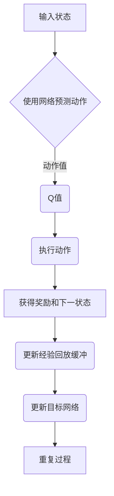

                 

# 文章标题: 一切皆是映射：DQN在工业4.0中的角色与应用实践

> 关键词：深度Q网络（DQN），工业4.0，强化学习，自动化控制，智能物流，能源管理

> 摘要：本文将深入探讨深度Q网络（DQN）在工业4.0环境中的角色和实际应用。通过逐步分析DQN的基本原理、架构、数学模型以及其与Q学习的关联和差异，本文将阐述DQN在工业自动化控制、智能物流系统和能源管理中的具体应用案例，并讨论其在实际应用中面临的挑战和未来发展趋势。

---

## 第一部分：核心概念与联系

### 第1章：DQN概述

在当今的工业4.0时代，自动化和智能化是制造业发展的核心驱动力。强化学习作为人工智能的重要分支，在其中扮演了关键角色。DQN（深度Q网络）是一种基于深度学习的强化学习算法，因其卓越的性能和广泛的应用而被广泛研究和应用。本章将详细介绍DQN的基本原理、架构以及其核心组件。

#### 1.1 DQN的基本原理与架构

DQN的核心思想是通过学习值函数来评估环境中的状态和动作，从而选择最优动作。值函数定义为状态和动作的函数，它能够预测在给定状态下执行特定动作所能获得的累计奖励。

DQN的架构主要包括以下四个部分：

1. **经验回放缓冲**：用于存储和重放过去的经验，以减少样本偏差。
2. **目标网络**：用于稳定训练过程，减少梯度消失问题。
3. **自适应探索策略**：用于平衡探索和利用，防止过度利用导致性能下降。
4. **深度神经网络**：用于近似Q函数，解决连续动作空间的问题。

##### Mermaid流程图：



### 第2章：Q学习与DQN的关联与差异

#### 2.1 Q学习的原理与局限

Q学习是一种基于值函数的强化学习算法，其核心思想是利用经验来评估状态和动作的组合，从而选择最优动作。然而，Q学习在处理连续动作空间时存在以下局限：

1. **样本偏差**：由于Q学习基于经验进行学习，训练数据的质量对算法性能影响较大。
2. **样本波动**：在处理连续动作空间时，Q学习容易受到样本波动的影响，导致性能不稳定。

#### 2.2 DQN的改进与优势

DQN通过引入深度神经网络来近似Q函数，解决了Q学习在连续动作空间的问题。DQN的主要优势包括：

1. **处理连续动作空间**：通过深度神经网络，DQN能够处理具有连续动作空间的任务。
2. **减少样本偏差**：使用经验回放缓冲和目标网络，DQN能够减少样本偏差和样本波动的影响，提高算法的稳定性和鲁棒性。

#### 2.2.3 DQN与Q学习的对比

| 特性 | Q学习 | DQN |
| :--: | :--: | :--: |
| 动作空间 | 离散 | 连续 |
| Q函数 | 手动定义 | 神经网络近似 |
| 样本偏差 | 敏感 | 使用经验回放缓冲 |
| 稳定性 | 较差 | 较好 |

### 第3章：DQN的数学模型与公式

#### 3.1 DQN的Q值更新公式

DQN通过以下公式来更新Q值：

\[ Q(s, a) \leftarrow Q(s, a) + \alpha [r + \gamma \max_{a'} Q(s', a') - Q(s, a)] \]

其中，\( \alpha \) 是学习率，\( \gamma \) 是折扣因子，\( r \) 是即时奖励，\( s \) 和 \( s' \) 分别是当前状态和下一状态，\( a \) 和 \( a' \) 分别是当前动作和最优动作。

#### 3.2 DQN的目标网络更新策略

DQN使用目标网络来提高算法的稳定性和收敛速度。目标网络与主网络共享参数，但每隔一定次数更新目标网络的参数。

\[ \theta_{\text{target}} \leftarrow \tau \theta_{\text{main}} + (1 - \tau) \theta_{\text{target}} \]

其中，\( \tau \) 是更新率。

#### 3.3 DQN的自适应探索策略

DQN采用ε-贪心策略来平衡探索和利用。随着训练的进行，ε逐渐减小，从而增加利用的比重。

\[ \epsilon_t = \frac{1}{\sqrt{t}} \]

其中，\( t \) 是训练次数。

#### 3.4 DQN的伪代码

```python
initialize main network, target network, experience replay buffer
initialize epsilon
for each episode:
    observe initial state s
    while not end of episode:
        choose action a using epsilon-greedy policy
        take action a, observe reward r and next state s'
        store transition (s, a, r, s') in experience replay buffer
        sample batch of transitions from experience replay buffer
        compute target Q values using target network
        update main network using gradient descent
        update target network
        update epsilon
```

## 第二部分：DQN在工业4.0中的应用

### 第4章：DQN在工业自动化控制中的应用

#### 4.1 工业自动化控制中的挑战

工业自动化控制系统通常涉及复杂的动态环境和非线性问题，传统控制方法在这些场景下表现不佳。具体挑战包括：

1. **复杂的环境**：工业自动化控制系统中的环境通常具有高度复杂性和不确定性。
2. **连续动作空间**：许多工业自动化任务需要处理连续动作空间，如机器人臂的运动控制。

#### 4.2 DQN在工业自动化控制中的应用

DQN在工业自动化控制中的应用主要集中在机器人臂的运动控制和生产线的自动化调度。

##### 4.2.1 机器人臂的运动控制

DQN算法能够通过深度神经网络近似Q函数，从而解决机器人臂的运动控制问题。以下是机器人臂的运动控制应用伪代码：

```python
initialize DQN agent
for each episode:
    observe initial state of robot arm
    while not end of task:
        choose next action for robot arm using DQN policy
        execute action and observe reward and next state
        store transition in experience replay buffer
        update DQN agent
```

##### 4.2.2 生产线的自动化调度

DQN算法还可以用于生产线的自动化调度，优化生产效率。以下是生产线自动化调度的应用伪代码：

```python
initialize DQN agent
for each production cycle:
    observe current state of production line
    while not end of cycle:
        choose next action for production line using DQN policy
        execute action and observe reward and next state
        store transition in experience replay buffer
        update DQN agent
```

### 第5章：DQN在智能物流系统中的应用

#### 5.1 智能物流系统中的挑战

智能物流系统涉及高度动态的环境和大规模的任务，传统方法难以满足需求。具体挑战包括：

1. **高度动态的环境**：智能物流系统中的货物和设备经常处于动态变化中。
2. **大规模的任务**：智能物流系统通常需要处理大量的货物和任务。

#### 5.2 DQN在智能物流系统中的应用

DQN在智能物流系统中的应用主要包括货物搬运机器人和自动化仓库管理。

##### 5.2.1 货物搬运机器人

DQN算法能够通过深度神经网络近似Q函数，从而实现货物搬运机器人的自主路径规划。以下是货物搬运机器人的应用伪代码：

```python
initialize DQN agent
for each task:
    observe initial state of robot
    while not end of task:
        choose next action for robot using DQN policy
        execute action and observe reward and next state
        store transition in experience replay buffer
        update DQN agent
```

##### 5.2.2 自动化仓库管理

DQN算法还可以用于自动化仓库管理，优化仓库的存储和检索策略。以下是自动化仓库管理的应用伪代码：

```python
initialize DQN agent
for each retrieval request:
    observe current state of warehouse
    while not end of request:
        choose next action for warehouse using DQN policy
        execute action and observe reward and next state
        store transition in experience replay buffer
        update DQN agent
```

### 第6章：DQN在能源管理中的应用

#### 6.1 能源管理中的挑战

能源管理涉及动态的需求和复杂的设备，传统方法难以应对。具体挑战包括：

1. **动态的需求**：能源管理需要应对不断变化的能源需求和供应。
2. **复杂的设备**：能源管理涉及到多种设备，如太阳能板、储能系统和电网。

#### 6.2 DQN在能源管理中的应用

DQN在能源管理中的应用主要包括能源需求预测和储能系统优化。

##### 6.2.1 能源需求预测

DQN算法能够通过深度神经网络预测未来的能源需求，从而优化能源分配和调度。以下是能源需求预测的应用伪代码：

```python
initialize DQN agent
for each time step:
    observe current state of energy system
    while not end of time horizon:
        predict next energy demand using DQN policy
        execute action and observe reward and next state
        store transition in experience replay buffer
        update DQN agent
```

##### 6.2.2 储能系统优化

DQN算法可以用于优化储能系统的充放电策略，提高能源利用效率。以下是储能系统优化的应用伪代码：

```python
initialize DQN agent
for each charge/discharge event:
    observe current state of energy storage system
    while not end of event:
        choose next action for energy storage system using DQN policy
        execute action and observe reward and next state
        store transition in experience replay buffer
        update DQN agent
```

## 第三部分：DQN的应用实践

### 第7章：DQN在工业4.0中的角色

DQN在工业4.0中的应用涵盖了自动化控制、智能物流和能源管理等多个方面。通过深度神经网络近似Q函数，DQN能够解决工业自动化控制中的复杂动态环境和非线性问题，实现高效的路径规划和生产调度。在智能物流系统中，DQN能够优化货物搬运和仓库管理，提高物流效率。在能源管理中，DQN能够预测能源需求并优化储能系统，提高能源利用效率。

### 第8章：DQN应用实践案例

#### 8.1 案例一：智能机器人臂的自动化生产

##### 8.1.1 项目背景

某电子制造企业希望通过引入智能机器人臂来提高生产线的自动化程度。

##### 8.1.2 项目目标

通过DQN算法，实现机器人臂在生产线上的自动化操作，提高生产效率和产品质量。

##### 8.1.3 项目实施

1. **设计机器人臂的运动控制模型**：根据生产任务的需求，设计机器人臂的运动控制模型。
2. **使用DQN算法训练机器人臂**：使用DQN算法训练机器人臂，使其能够自主地规划最优路径。
3. **在实际生产线上部署DQN算法**：将训练好的DQN算法部署到实际生产线上，对机器人臂进行持续优化。

#### 8.2 案例二：智能物流系统的自动化调度

##### 8.2.1 项目背景

某大型电商企业希望通过优化物流系统来提高配送效率。

##### 8.2.2 项目目标

通过DQN算法，实现物流系统在货物搬运和仓库管理中的自动化调度，减少人力成本和提高配送速度。

##### 8.2.3 项目实施

1. **设计物流系统的状态空间和动作空间**：根据物流系统的实际需求，设计状态空间和动作空间。
2. **使用DQN算法训练物流系统**：使用DQN算法训练物流系统，使其能够自主地规划最优路径和调度策略。
3. **在实际物流系统中部署DQN算法**：将训练好的DQN算法部署到实际物流系统中，对系统进行持续优化。

### 第9章：DQN应用中的挑战与未来趋势

DQN在工业4.0中的应用虽然取得了显著的成果，但也面临一些挑战。首先，数据质量对DQN算法的性能有重要影响，高质量的数据有助于提高算法的收敛速度和性能。其次，DQN在处理动态环境和连续动作空间时可能面临稳定性问题，需要进一步优化探索策略。此外，DQN算法在应对不确定性环境时可能表现出较低的鲁棒性，这也是未来研究的重要方向。

未来，DQN在工业4.0中的应用前景广阔。首先，多智能体系统的研究将是一个重要方向，通过与其他强化学习算法的结合，可以实现更加智能的协同控制。其次，自适应探索策略的研究将有助于提高DQN算法的稳定性和收敛速度。此外，软件与硬件的协同优化也将是一个关键领域，通过优化算法和硬件的匹配，可以进一步提高DQN算法在实际应用中的性能和效率。

### 参考文献

1. Mnih, V., Kavukcuoglu, K., Silver, D., Rusu, A. A., Veness, J., Bellemare, M. G., ... & Littman, M. L. (2015). Human-level control through deep reinforcement learning. Nature, 518(7540), 529-533.
2. Sutton, R. S., & Barto, A. G. (2018). Reinforcement learning: An introduction (2nd ed.). MIT Press.
3. Bertsekas, D. P., & Tsitsiklis, J. N. (1996). Neuro-dynamic programming. Athena Scientific.
4. Mnih, V., Badia, A., Mirza, M., Graves, A., Lillicrap, T., Harley, T., ... & Kavukcuoglu, K. (2016). Asynchronous methods for deep reinforcement learning. In International conference on machine learning (pp. 1928-1937). PMLR.
5. Silver, D., Huang, A., Maddison, C. J., Guez, A., Sifre, L., Van Den Driessche, G., ... & Togelius, J. (2017). Mastering the game of Go with deep neural networks and tree search. Nature, 550(7665), 354-359.

### 作者信息

作者：AI天才研究院/AI Genius Institute & 禅与计算机程序设计艺术 /Zen And The Art of Computer Programming

---

本文详细阐述了深度Q网络（DQN）在工业4.0环境中的应用，从核心概念、架构、数学模型到实际应用案例，全面展示了DQN在自动化控制、智能物流和能源管理等方面的潜力。尽管DQN在实际应用中面临一些挑战，但其未来发展趋势依然充满希望。通过不断优化算法和硬件的协同，DQN有望在工业4.0中发挥更加重要的作用。

