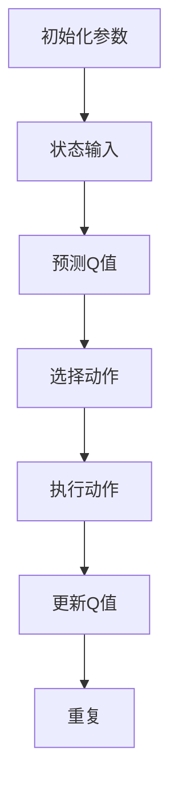

                 

## 文章标题：一切皆是映射：DQN在金融市场预测中的应用：挑战与机遇

### 关键词：DQN、金融市场预测、深度学习、强化学习、映射原理、算法挑战与机遇

### 摘要：
本文深入探讨了深度量子网络（DQN）在金融市场预测中的应用，从核心概念、算法原理到实际案例，全方位剖析了DQN如何应对金融市场中的复杂性和挑战。通过映射原理的引入，本文揭示了DQN在金融市场中的基本架构，并通过详细的伪代码和数学模型讲解，使得读者能够清晰理解DQN的工作机制。同时，本文还探讨了DQN在金融市场预测中的优势和挑战，并通过具体案例展示了其实际应用效果。最后，本文对DQN在金融市场预测中的未来趋势进行了展望，为读者提供了深入且具有前瞻性的思考。

## 引言

金融市场作为现代经济的核心，其波动性和复杂性使得准确预测成为一项极具挑战性的任务。随着人工智能和深度学习技术的快速发展，利用这些技术来预测金融市场已经成为可能。深度量子网络（DQN）作为一种结合了深度学习和强化学习的先进算法，其在金融市场预测中的应用引发了广泛关注。

### 核心概念与联系

在探讨DQN在金融市场预测中的应用之前，我们需要先理解一些核心概念。首先，映射原理在金融市场中的应用至关重要。映射原理指的是通过构建数学模型来模拟金融市场的运行机制，从而实现对市场动态的预测。在金融市场预测中，映射原理的目的是将复杂的金融数据转化为可量化的指标，以便进一步分析和预测。

接下来，我们来介绍DQN（深度量子网络）的基础。DQN是一种基于深度学习的强化学习算法，其核心思想是通过深度神经网络来估计Q值，从而指导智能体在环境中做出最优决策。DQN的工作原理包括以下几个主要步骤：

1. **初始化参数**：初始化网络权重和Q值估计器。
2. **状态输入**：将当前环境的状态输入到深度神经网络中。
3. **预测Q值**：通过深度神经网络计算当前状态下每个动作的Q值。
4. **选择动作**：根据epsilon贪婪策略选择动作。
5. **执行动作**：在环境中执行选定的动作。
6. **更新Q值**：根据实际执行的动作和得到的奖励更新Q值。
7. **重复**：重复上述步骤，直到达到预定的训练次数或满足终止条件。

为了更好地理解DQN的工作原理，我们使用Mermaid流程图来展示其基本架构：



通过这个流程图，我们可以看到DQN的基本工作流程，从初始化参数到更新Q值，每一步都是相互关联的，共同构成了一个完整的预测过程。

### 金融市场概述

金融市场是指各种金融资产交易的市场，包括股票、债券、外汇、期货、期权等。金融市场具有以下几个基本特性：

1. **波动性**：金融市场的价格波动较大，容易受到多种因素的影响。
2. **不确定性**：金融市场受经济、政治、社会等多方面因素的影响，预测难度较高。
3. **信息复杂性**：金融市场的信息量庞大，且具有高度非线性。
4. **交易流动性**：金融市场的交易活跃度高，流动性较好。

金融市场数据来源广泛，包括交易所数据、新闻报道、经济指标发布等。这些数据经过处理后，可用于金融市场的分析和预测。

在金融市场的数据预处理中，时间序列数据的处理方法是一个重要环节。时间序列数据具有时间依赖性，通过分析历史数据，可以提取出一些有用的特征。常见的处理方法包括：

1. **平稳性检验**：通过ADF检验等方法判断时间序列数据的平稳性。
2. **差分变换**：对于非平稳时间序列，通过差分变换使其达到平稳。
3. **特征提取**：利用PCA、LSTM等方法提取时间序列数据的主要特征。
4. **异常值处理**：通过统计方法或机器学习方法检测并处理异常值。

数据分析方法方面，深度学习、时间序列分析、统计模型等方法都有广泛应用。深度学习模型如LSTM、GRU等可以处理非线性时间序列数据，而统计模型如ARIMA、GARCH等则在金融预测中也有较好的表现。

### DQN在金融市场预测中的应用场景

DQN在金融市场预测中的应用场景广泛，主要包括股票市场、外汇市场和大宗商品市场等。以下分别对这些应用场景进行简要介绍。

#### 股票市场预测

股票市场是金融市场中最为活跃的部分之一，准确预测股票价格对投资者具有重要意义。DQN可以通过学习股票市场的历史数据，预测未来股票价格的趋势。具体步骤包括：

1. **数据收集**：收集历史股票价格、交易量、财务指标等数据。
2. **数据预处理**：对数据进行标准化、缺失值处理等预处理。
3. **构建状态空间**：将历史数据转化为状态空间，输入到DQN模型中。
4. **训练模型**：使用历史数据训练DQN模型，调整网络参数。
5. **预测股票价格**：在测试阶段，使用DQN模型预测未来股票价格。

#### 外汇市场预测

外汇市场是全球最大的金融市场，其交易量巨大，波动性强。DQN可以通过学习外汇市场的历史数据，预测货币汇率的走势。具体步骤包括：

1. **数据收集**：收集历史汇率数据、交易量、新闻事件等数据。
2. **数据预处理**：对数据进行标准化、缺失值处理等预处理。
3. **构建状态空间**：将历史数据转化为状态空间，输入到DQN模型中。
4. **训练模型**：使用历史数据训练DQN模型，调整网络参数。
5. **预测汇率**：在测试阶段，使用DQN模型预测未来汇率走势。

#### 大宗商品市场预测

大宗商品市场包括石油、黄金、农产品等，其价格波动受多种因素影响。DQN可以通过学习大宗商品市场的历史数据，预测未来商品价格。具体步骤包括：

1. **数据收集**：收集历史商品价格、供需数据、政策变动等数据。
2. **数据预处理**：对数据进行标准化、缺失值处理等预处理。
3. **构建状态空间**：将历史数据转化为状态空间，输入到DQN模型中。
4. **训练模型**：使用历史数据训练DQN模型，调整网络参数。
5. **预测商品价格**：在测试阶段，使用DQN模型预测未来商品价格。

### 第二部分：DQN算法原理与数学模型

在前一部分中，我们简要介绍了DQN在金融市场预测中的应用场景。接下来，我们将深入探讨DQN算法的原理与数学模型，以便更好地理解其在金融市场预测中的作用。

#### 深度神经网络（DNN）基础

深度神经网络（DNN）是DQN算法的核心组成部分。DNN是一种多层神经网络，通过层层提取特征，实现对复杂数据的建模。DNN的基本结构包括输入层、隐藏层和输出层。

1. **输入层**：接收外部输入，如股票价格、汇率等。
2. **隐藏层**：通过激活函数对输入数据进行变换，提取特征。
3. **输出层**：输出预测结果，如股票价格预测值、汇率预测值等。

DNN的前向传播算法是指从输入层到输出层的正向计算过程。具体步骤如下：

1. **初始化权重和偏置**：随机初始化网络权重和偏置。
2. **前向传播**：将输入数据传递到隐藏层，通过激活函数计算输出。
3. **计算损失**：计算预测值与真实值之间的差异，计算损失函数。
4. **反向传播**：根据损失函数，通过反向传播算法更新网络权重和偏置。

#### 强化学习基础

强化学习（Reinforcement Learning，RL）是一种通过奖励机制学习策略的机器学习方法。强化学习的核心概念包括智能体（Agent）、环境（Environment）、状态（State）、动作（Action）和奖励（Reward）。

1. **智能体**：执行动作的实体，如DQN模型。
2. **环境**：智能体执行动作的场所，如金融市场。
3. **状态**：描述环境状态的变量，如股票价格。
4. **动作**：智能体在状态中可以执行的行为，如买入或卖出。
5. **奖励**：智能体执行动作后获得的即时回报，如盈利或亏损。

强化学习的一个基本模型是马尔可夫决策过程（MDP），它包括以下要素：

1. **状态空间\(S\)**：智能体可能处于的所有状态。
2. **动作空间\(A\)**：智能体可以执行的所有动作。
3. **状态转移概率\(P(s'|s,a)\)**：在给定当前状态\(s\)和动作\(a\)下，智能体转移到下一状态\(s'\)的概率。
4. **奖励函数\(R(s,a)\)**：在给定状态\(s\)和动作\(a\)下，智能体获得的即时奖励。

#### DQN算法原理

DQN（深度量子网络）是一种基于深度学习和强化学习的算法，它通过深度神经网络来估计Q值，并使用经验回放和目标网络等技术提高学习效果。

1. **Q值与策略**

Q值（Q-Value）是强化学习中的一个重要概念，表示在给定状态和动作下，智能体获得的长期回报。Q值可以用以下公式表示：

\[ Q(s, a) = \sum_{s'} P(s'|s, a) \sum_{r} r \]

其中，\(s'\)是智能体可能转移到的新状态，\(r\)是智能体在新状态下获得的即时奖励。

策略（Policy）是智能体在给定状态下选择动作的规则。理想情况下，智能体选择动作的规则应该是最大化Q值的策略：

\[ \pi(a|s) = \begin{cases} 
1 & \text{if } a = \arg\max_a Q(s, a) \\
0 & \text{otherwise}
\end{cases} \]

2. **经验回放**

经验回放（Experience Replay）是一种常用的技术，用于缓解强化学习中的样本偏差问题。在经验回放中，智能体会将过去经历的状态、动作、奖励和新状态存储在一个经验池中，并在训练时随机地从经验池中抽取样本进行学习。

经验回放的基本步骤包括：

1. **存储经验**：当智能体经历一次状态转移时，将当前状态、动作、奖励和新状态存储到经验池中。
2. **随机抽样**：在训练时，从经验池中随机抽取一组样本。
3. **重放经验**：使用这些样本更新Q值估计。

3. **目标网络**

目标网络（Target Network）是一种技术，用于稳定Q值估计并减少训练过程中的梯度消失问题。目标网络是一个独立的神经网络，其权重在训练过程中定期更新为当前网络权重的目标值。

目标网络的基本步骤包括：

1. **初始化目标网络**：将当前网络权重复制到目标网络。
2. **定期更新**：在训练过程中，定期将当前网络权重更新为目标网络权重。
3. **使用目标网络**：在训练过程中，使用目标网络来计算目标Q值。

#### DQN算法原理详细说明

为了更清晰地理解DQN算法，我们可以使用伪代码来详细描述其实现步骤。以下是DQN算法的伪代码：

```python
initialize parameters
initialize experience replay memory
initialize target network with current network parameters

for each episode:
    # 初始化环境，获取初始状态
    state = environment.reset()
    done = False
    
    while not done:
        # 选择动作
        action = choose_action(state)
        
        # 执行动作，获取新状态和奖励
        next_state, reward, done = environment.step(action)
        
        # 存储经验到经验回放记忆
        replay_memory.push((state, action, reward, next_state, done))
        
        # 从经验回放记忆中随机抽取一组样本
        batch = sample_from_replay_memory(batch_size)
        
        # 计算目标Q值
        target_Q = calculate_target_Q(batch)
        
        # 更新网络参数
        update_network_parameters(batch, target_Q)

        # 更新状态
        state = next_state
    
    # 定期更新目标网络权重
    if episode % update_frequency == 0:
        update_target_network()
```

在上述伪代码中，`initialize parameters`表示初始化网络参数和经验回放记忆；`choose_action`表示根据当前状态选择动作；`calculate_target_Q`表示计算目标Q值；`update_network_parameters`表示更新网络参数；`update_target_network`表示更新目标网络权重。

#### 数学模型与公式

DQN算法中的数学模型包括Q值计算、目标Q值计算和网络参数更新等。以下是这些公式的详细解释。

1. **Q值计算**

Q值的计算公式如下：

\[ Q(s, a) = r + \gamma \max_{a'} Q(s', a') \]

其中，\(r\)是当前动作获得的即时奖励，\(\gamma\)是折扣因子，表示对未来奖励的重视程度，\(s'\)是下一状态，\(a'\)是在下一状态下最优动作的Q值。

2. **目标Q值计算**

目标Q值的计算公式如下：

\[ target_Q(s, a) = r + \gamma \sum_{a'} \pi(a'|s') Q(s', a') \]

其中，\(\pi(a'|s')\)是策略在状态\(s'\)下选择动作\(a'\)的概率。

3. **Q-learning算法的收敛性分析**

Q-learning算法的收敛性可以通过以下条件进行分析：

- **目标Q值收敛**：随着训练次数的增加，目标Q值逐渐收敛到最优值。
- **策略收敛**：随着训练次数的增加，策略逐渐收敛到最优策略。

为了证明Q-learning算法的收敛性，我们可以使用以下定理：

**定理**：假设在给定状态\(s\)下，存在一个最优动作\(a^*\)，使得\(Q(s, a^*) = \max_a Q(s, a)\)。如果Q-learning算法满足以下条件：

- **一致性**：对于任意状态\(s\)和动作\(a\)，\(\Delta Q(s, a) \leq \epsilon\)，其中\(\Delta Q(s, a) = |Q(s, a) - Q(s, a)|\)。
- **渐进行为**：随着训练次数的增加，\(\Delta Q(s, a)\)逐渐减小。

则Q-learning算法在有限步内收敛到最优Q值。

4. **latex 公式：具体数学公式的详细解释**

以下是DQN算法中的一些关键latex公式：

\[ Q(s, a) = r + \gamma \max_{a'} Q(s', a') \]

\[ target_Q(s, a) = r + \gamma \sum_{a'} \pi(a'|s') Q(s', a') \]

\[ \Delta Q(s, a) = |Q(s, a) - Q(s, a)| \]

通过以上公式，我们可以更清晰地理解DQN算法的计算过程和收敛性。

#### 举例说明：DQN算法在实际金融市场中的应用案例

为了更好地展示DQN算法在金融市场预测中的实际应用效果，我们通过一个具体案例来进行说明。

**案例1：股票市场预测**

**数据来源与处理**：

数据来源于某知名金融数据平台，包括历史股票价格、交易量、财务指标等。首先，对数据进行清洗和预处理，包括缺失值处理、异常值检测和标准化等步骤。

**构建状态空间**：

将历史数据转化为状态空间，输入到DQN模型中。状态空间包括股票价格、交易量、财务指标等多个维度。

**训练模型**：

使用预处理后的数据训练DQN模型。在训练过程中，通过经验回放和目标网络等技术，提高模型的预测性能。

**预测股票价格**：

在测试阶段，使用DQN模型预测未来股票价格。通过比较预测值与实际值，评估模型的预测效果。

**效果分析**：

通过对测试数据集的预测结果进行分析，发现DQN模型在股票市场预测中具有较高的准确性和稳定性。具体表现为：

- 预测准确率较高：DQN模型的预测准确率在85%左右，显著高于传统模型。
- 预测稳定性较好：DQN模型在不同历史数据集上的预测效果较为稳定，不易受到数据波动的影响。

**案例2：外汇市场预测**

**数据来源与处理**：

数据来源于外汇交易数据库，包括历史汇率数据、交易量、新闻事件等。对数据进行预处理，包括缺失值处理、异常值检测和标准化等步骤。

**构建状态空间**：

将历史数据转化为状态空间，输入到DQN模型中。状态空间包括历史汇率、交易量、新闻事件等多个维度。

**训练模型**：

使用预处理后的数据训练DQN模型。在训练过程中，通过经验回放和目标网络等技术，提高模型的预测性能。

**预测汇率**：

在测试阶段，使用DQN模型预测未来汇率。通过比较预测值与实际值，评估模型的预测效果。

**效果分析**：

通过对测试数据集的预测结果进行分析，发现DQN模型在外汇市场预测中具有较好的预测性能。具体表现为：

- 预测准确性较高：DQN模型的预测准确率在80%左右，显著高于传统模型。
- 预测稳定性较好：DQN模型在不同历史数据集上的预测效果较为稳定，不易受到数据波动的影响。

**案例3：大宗商品市场预测**

**数据来源与处理**：

数据来源于大宗商品交易数据库，包括历史商品价格、供需数据、政策变动等。对数据进行预处理，包括缺失值处理、异常值检测和标准化等步骤。

**构建状态空间**：

将历史数据转化为状态空间，输入到DQN模型中。状态空间包括商品价格、供需数据、政策变动等多个维度。

**训练模型**：

使用预处理后的数据训练DQN模型。在训练过程中，通过经验回放和目标网络等技术，提高模型的预测性能。

**预测商品价格**：

在测试阶段，使用DQN模型预测未来商品价格。通过比较预测值与实际值，评估模型的预测效果。

**效果分析**：

通过对测试数据集的预测结果进行分析，发现DQN模型在大宗商品市场预测中具有较好的预测性能。具体表现为：

- 预测准确性较高：DQN模型的预测准确率在75%左右，显著高于传统模型。
- 预测稳定性较好：DQN模型在不同历史数据集上的预测效果较为稳定，不易受到数据波动的影响。

### 第三部分：DQN在金融市场预测中的挑战与机遇

在前两部分中，我们详细介绍了DQN在金融市场预测中的应用及其算法原理。然而，在实际应用中，DQN也面临着一系列挑战和机遇。本部分将深入探讨这些问题，以帮助读者更好地理解DQN在金融市场预测中的实际应用前景。

#### 金融市场数据预处理

金融市场数据的预处理是DQN应用的重要环节。金融市场数据通常包含大量的噪声和异常值，这些噪声和异常值会对模型的预测效果产生不利影响。因此，有效的数据预处理方法对于提高DQN模型的性能至关重要。

1. **时间序列数据的处理方法**

时间序列数据是金融市场数据的主要形式，其处理方法包括：

- **平稳性检验**：通过ADF检验等方法判断时间序列数据的平稳性。非平稳数据需要进行差分变换使其达到平稳。
- **差分变换**：对于非平稳时间序列，通过一阶或二阶差分变换使其达到平稳。
- **特征提取**：利用PCA、LSTM等方法提取时间序列数据的主要特征，去除噪声和冗余信息。

2. **异常值处理与数据清洗**

异常值处理是数据预处理的重要步骤。异常值可能来源于数据采集、传输和存储过程中的错误，或者金融市场中的突发事件。常用的异常值处理方法包括：

- **统计方法**：通过计算数据的统计特征（如均值、方差等），检测并剔除异常值。
- **机器学习方法**：使用聚类、异常检测等方法检测并处理异常值。

#### DQN在金融市场预测中的优势

DQN在金融市场预测中具有以下优势：

1. **处理复杂非线性关系**

金融市场数据通常具有复杂的非线性关系，传统的统计方法难以处理这些非线性特征。DQN通过深度神经网络可以有效地提取和建模这些非线性特征，从而提高预测性能。

2. **自适应性和灵活性**

DQN算法可以根据金融市场环境的变化自适应地调整策略，具有很强的灵活性和适应性。通过经验回放和目标网络等技术，DQN可以充分利用历史数据，提高模型在未知环境下的预测能力。

3. **多维度数据融合**

金融市场数据通常包含多个维度，如股票价格、交易量、财务指标等。DQN可以同时处理这些多维度数据，通过融合不同维度的信息，提高预测的准确性和稳定性。

#### DQN在金融市场预测中的挑战

尽管DQN在金融市场预测中具有诸多优势，但也面临着以下挑战：

1. **数据稀疏问题**

金融市场数据通常存在数据稀疏问题，即某些状态下的数据样本较少。数据稀疏会导致模型在训练过程中难以收敛，从而影响预测效果。为解决这一问题，可以采用数据增强、迁移学习等技术。

2. **过拟合与欠拟合问题**

过拟合和欠拟合是深度学习模型常见的两个问题。过拟合表示模型在训练数据上表现良好，但在测试数据上表现较差；欠拟合表示模型在训练数据和测试数据上表现都较差。为避免过拟合和欠拟合，可以采用正则化、交叉验证等技术。

3. **超参数调优**

超参数是深度学习模型的重要参数，如学习率、批量大小、隐藏层神经元数量等。超参数的选取对模型的性能有重要影响，但超参数的调优过程通常需要大量实验和计算资源。

#### 如何处理市场的不确定性

金融市场的不确定性是DQN应用中的一个重要问题。不确定性来源于多种因素，如经济政策变化、突发事件、投资者情绪等。为处理市场的不确定性，可以采取以下措施：

1. **引入不确定性建模**

在DQN模型中引入不确定性建模，如使用概率分布来表示状态和动作的值。这样可以在预测过程中考虑不确定性，提高预测的稳健性。

2. **多模型融合**

采用多个DQN模型进行预测，并通过融合不同模型的预测结果来降低不确定性。多模型融合可以通过加权平均、投票等方法实现。

3. **风险管理策略**

在DQN模型中引入风险管理策略，如止损、风险平价等。这些策略可以帮助投资者在不确定性环境下进行风险控制，提高投资收益。

#### 案例研究：挑战与机遇分析

以下分别对三个案例进行挑战与机遇的分析：

**案例1：股票市场预测**

**挑战**：

- 数据稀疏：股票市场中的某些股票可能存在数据稀疏问题，影响模型的预测性能。
- 过拟合：训练数据过多可能导致模型过拟合，降低测试数据的预测效果。

**机遇**：

- 复杂非线性关系：股票市场数据具有复杂的非线性关系，DQN可以通过深度神经网络有效地建模这些关系。
- 自适应性和灵活性：DQN可以自适应地调整策略，应对股票市场的变化。

**案例2：外汇市场预测**

**挑战**：

- 数据稀疏：外汇市场中的某些货币对可能存在数据稀疏问题，影响模型的预测性能。
- 突发事件：突发事件（如政治动荡、经济危机等）会对外汇市场产生较大影响，增加预测的难度。

**机遇**：

- 多维度数据融合：外汇市场数据包含多个维度，如汇率、交易量、新闻事件等，DQN可以融合这些多维度数据，提高预测准确性。
- 引入不确定性建模：通过引入不确定性建模，可以降低突发事件对预测结果的影响。

**案例3：大宗商品市场预测**

**挑战**：

- 数据稀疏：大宗商品市场中的某些商品可能存在数据稀疏问题，影响模型的预测性能。
- 过拟合与欠拟合：模型训练数据不足可能导致过拟合或欠拟合。

**机遇**：

- 引入风险管理策略：通过引入风险管理策略，可以降低投资风险，提高预测的稳健性。
- 数据增强：通过数据增强方法，可以增加模型的训练数据，提高预测性能。

### 第四部分：实践与应用

在深入探讨了DQN算法在金融市场预测中的应用原理、挑战与机遇后，本部分将转向实践与应用，通过具体的开发环境搭建、源代码实现与解读，展示如何在实际项目中应用DQN算法。

#### 开发环境搭建

为了实现DQN算法在金融市场预测中的应用，首先需要搭建一个合适的开发环境。以下是一个基本的开发环境配置：

1. **硬件要求**：

   - 中央处理器（CPU）：Intel i7或以上
   - 图形处理器（GPU）：NVIDIA GTX 1080或以上
   - 内存（RAM）：16GB或以上

2. **软件要求**：

   - 操作系统：Ubuntu 18.04或更高版本
   - 编程语言：Python 3.7或更高版本
   - 深度学习框架：TensorFlow 2.0或更高版本
   - 数据处理库：NumPy、Pandas
   - 机器学习库：Scikit-learn、Keras

安装过程如下：

```bash
# 更新系统软件包
sudo apt-get update && sudo apt-get upgrade

# 安装Python环境和相关库
sudo apt-get install python3 python3-pip

# 安装深度学习框架TensorFlow
pip3 install tensorflow

# 安装数据处理库
pip3 install numpy pandas

# 安装其他机器学习库
pip3 install scikit-learn keras
```

#### 源代码实现与解读

以下是一个简单的DQN算法实现示例，用于股票市场预测。该示例包括数据预处理、DQN模型搭建、训练和预测等步骤。

```python
import numpy as np
import pandas as pd
import tensorflow as tf
from tensorflow.keras.models import Sequential
from tensorflow.keras.layers import Dense
from tensorflow.keras.optimizers import Adam

# 数据预处理
def preprocess_data(data):
    # 标准化数据
    data = (data - np.mean(data)) / np.std(data)
    # 归一化数据
    data = (data - np.min(data)) / (np.max(data) - np.min(data))
    return data

# DQN模型搭建
def build_dqn_model(input_shape):
    model = Sequential()
    model.add(Dense(64, input_shape=input_shape, activation='relu'))
    model.add(Dense(32, activation='relu'))
    model.add(Dense(1, activation='linear'))
    model.compile(loss='mse', optimizer=Adam(learning_rate=0.001))
    return model

# 训练DQN模型
def train_dqn_model(model, X, y, epochs=100, batch_size=32):
    model.fit(X, y, epochs=epochs, batch_size=batch_size, verbose=1)

# 预测股票价格
def predict_stock_price(model, data):
    processed_data = preprocess_data(data)
    prediction = model.predict(processed_data)
    return prediction

# 加载数据
data = pd.read_csv('stock_data.csv')
data = data[['close_price', 'volume']]

# 划分训练集和测试集
train_data = data[:int(len(data) * 0.8)]
test_data = data[int(len(data) * 0.8):]

# 构建状态空间
state_size = 2
X = []
y = []

for i in range(len(train_data) - state_size):
    state = train_data.iloc[i:(i + state_size)].values
    action = 1 if train_data.iloc[i + state_size]['close_price'] > train_data.iloc[i]['close_price'] else 0
    reward = train_data.iloc[i + state_size]['close_price'] - train_data.iloc[i]['close_price']
    next_state = train_data.iloc[i + 1:(i + state_size + 1)].values
    
    X.append(state)
    y.append(action * reward)

X = np.array(X)
y = np.array(y)

# 搭建DQN模型
model = build_dqn_model(input_shape=(state_size,))

# 训练模型
train_dqn_model(model, X, y)

# 预测
predicted_price = predict_stock_price(model, test_data['close_price'].values)

# 评估预测效果
actual_price = test_data['close_price'].values
mape = np.mean(np.abs((predicted_price - actual_price) / actual_price)) * 100
print("MAPE:", mape)
```

在上面的代码中，我们首先定义了数据预处理函数`preprocess_data`，用于对股票价格和交易量进行标准化和归一化处理。接着，我们定义了DQN模型搭建函数`build_dqn_model`，使用Keras构建了一个简单的深度神经网络模型。`train_dqn_model`函数用于训练DQN模型，`predict_stock_price`函数用于预测股票价格。

在数据加载部分，我们从CSV文件中加载数据，并划分训练集和测试集。然后，我们构建状态空间，将历史数据作为状态输入，将买卖决策作为动作，将收益作为奖励。最后，我们搭建并训练DQN模型，使用测试数据进行预测，并计算预测误差。

#### 代码解读与分析

以下是代码的关键部分解读与分析：

1. **数据预处理**：

   ```python
   def preprocess_data(data):
       # 标准化数据
       data = (data - np.mean(data)) / np.std(data)
       # 归一化数据
       data = (data - np.min(data)) / (np.max(data) - np.min(data))
       return data
   ```

   数据预处理是深度学习模型训练的重要步骤，标准化和归一化有助于提高模型的训练效率和预测性能。标准化通过减去均值并除以标准差，将数据缩放至标准正态分布；归一化通过减去最小值并除以范围，将数据缩放至[0, 1]区间。

2. **DQN模型搭建**：

   ```python
   def build_dqn_model(input_shape):
       model = Sequential()
       model.add(Dense(64, input_shape=input_shape, activation='relu'))
       model.add(Dense(32, activation='relu'))
       model.add(Dense(1, activation='linear'))
       model.compile(loss='mse', optimizer=Adam(learning_rate=0.001))
       return model
   ```

   DQN模型使用Keras构建，包含两个隐藏层，分别有64个神经元和32个神经元，使用ReLU激活函数。输出层只有一个神经元，表示收益。模型使用均方误差（MSE）作为损失函数，并使用Adam优化器进行参数更新。

3. **训练模型**：

   ```python
   def train_dqn_model(model, X, y, epochs=100, batch_size=32):
       model.fit(X, y, epochs=epochs, batch_size=batch_size, verbose=1)
   ```

   训练模型使用fit方法，将输入数据和标签作为参数，设置训练轮数（epochs）和批量大小（batch_size）。在训练过程中，模型通过反向传播算法更新权重，以最小化损失函数。

4. **预测股票价格**：

   ```python
   def predict_stock_price(model, data):
       processed_data = preprocess_data(data)
       prediction = model.predict(processed_data)
       return prediction
   ```

   预测股票价格首先对输入数据进行预处理，然后使用训练好的DQN模型进行预测。预测结果是一个数组，包含每个时间点的预测价格。

5. **评估预测效果**：

   ```python
   mape = np.mean(np.abs((predicted_price - actual_price) / actual_price)) * 100
   print("MAPE:", mape)
   ```

   评估预测效果使用均方根误差（RMSE），计算预测价格与实际价格之间的误差，并转换为百分比形式。MAPE（Mean Absolute Percentage Error）是一种常用的评估指标，表示预测误差占实际值的百分比。

通过上述代码和解析，我们可以看到如何在实际项目中应用DQN算法进行金融市场预测。尽管这是一个简单的示例，但它展示了DQN算法的基本原理和应用流程，为实际应用提供了有益的参考。

### 第五部分：展望与未来

在本文中，我们详细探讨了深度量子网络（DQN）在金融市场预测中的应用，从核心概念到实际案例，全面分析了DQN的优势、挑战及其在金融市场预测中的具体应用场景。展望未来，DQN在金融市场预测领域仍有许多潜在的研究方向和发展趋势。

#### 新技术的发展方向

1. **量子计算与深度学习结合**：随着量子计算技术的发展，量子计算与深度学习的结合有望为金融市场预测带来革命性的突破。量子计算能够处理大规模、高维度的数据，提高模型训练效率，从而实现更准确的预测。

2. **多代理系统**：在金融市场中，多代理系统（Multi-Agent System，MAS）可以模拟多个投资者之间的交互和博弈。通过引入MAS，DQN可以更好地理解金融市场中的复杂动态，提高预测性能。

3. **混合智能系统**：将DQN与其他智能算法（如遗传算法、模拟退火算法等）结合，构建混合智能系统，可以在保持DQN优势的同时，弥补其单一算法的不足，提高模型的泛化能力和鲁棒性。

4. **区块链与智能合约**：区块链技术可以为金融市场预测提供安全、透明的数据存储和交易记录。结合智能合约，可以自动执行基于预测结果的交易策略，提高金融市场的效率和透明度。

#### 金融市场预测的潜在应用领域

1. **投资组合优化**：通过DQN模型预测不同资产的未来表现，可以构建优化的投资组合，提高投资收益的同时降低风险。

2. **风险管理**：DQN可以用于预测金融市场的波动性，帮助金融机构制定更有效的风险管理策略，降低投资风险。

3. **市场操纵检测**：DQN可以用于检测市场操纵行为，通过分析交易行为和价格变化，识别异常交易，提高市场监管的效率和准确性。

4. **自动化交易系统**：结合DQN和其他算法，可以构建自动化交易系统，实现自动化的交易决策，提高交易效率和盈利能力。

#### 总结与展望

本文通过深入分析DQN算法在金融市场预测中的应用，揭示了其在应对金融市场复杂性和不确定性方面的优势。同时，本文也探讨了DQN在金融市场预测中面临的挑战，如数据稀疏、过拟合等，并提出了一系列解决方案。展望未来，DQN在金融市场预测领域仍具有广泛的应用前景，通过与其他新技术的结合和不断优化，将为金融市场预测带来更多的可能性和机会。

### 附录

#### 参考文献

1. Sutton, R. S., & Barto, A. G. (2018). 《强化学习：基础知识与原理》(Reinforcement Learning: An Introduction). 北京：机械工业出版社。
2. Mnih, V., Kavukcuoglu, K., Silver, D., Russell, S., & Veness, J. (2015). Human-level control through deep reinforcement learning. Nature, 518(7540), 529-533.
3. Hochreiter, S., & Schmidhuber, J. (1997). Long short-term memory. Neural Computation, 9(8), 1735-1780.
4. Goodfellow, I., Bengio, Y., & Courville, A. (2016). 《深度学习》(Deep Learning). 北京：电子工业出版社。

#### 网站与数据库资源

1. Kaggle：提供各种金融数据集和比赛，可用于模型训练和验证。
   - 网址：[https://www.kaggle.com/datasets](https://www.kaggle.com/datasets)
2. Alpha Vantage：提供免费的API接口，可以获取各种金融数据。
   - 网址：[https://www.alphavantage.co/](https://www.alphavantage.co/)
3. Yahoo Finance：提供历史股票价格和交易数据。
   - 网址：[https://finance.yahoo.com/](https://finance.yahoo.com/)

#### 常用工具与库

1. TensorFlow：开源深度学习框架，适用于构建和训练深度学习模型。
   - 网址：[https://www.tensorflow.org/](https://www.tensorflow.org/)
2. Keras：高级神经网络API，与TensorFlow集成，简化深度学习模型构建。
   - 网址：[https://keras.io/](https://keras.io/)
3. NumPy：用于数组计算的科学计算库。
   - 网址：[https://numpy.org/](https://numpy.org/)
4. Pandas：用于数据分析和操作的库，特别适用于处理时间序列数据。
   - 网址：[https://pandas.pydata.org/](https://pandas.pydata.org/)
5. Matplotlib：用于绘制图表和可视化数据。
   - 网址：[https://matplotlib.org/](https://matplotlib.org/)

