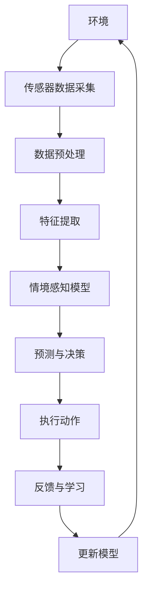

                 

# 《一切皆是映射：情境感知与DQN：环境交互的重要性》

## 关键词

- 情境感知
- 映射
- DQN算法
- 强化学习
- 环境交互
- 人工智能

## 摘要

本文深入探讨了情境感知与DQN（深度Q网络）算法在环境交互中的重要性。首先，我们介绍了情境感知的基本概念、重要性及其在现实世界中的应用。接着，我们详细分析了DQN算法的核心原理、优化策略以及其在不同领域的应用。最后，通过具体的项目实战，我们展示了如何将情境感知与DQN算法相结合，实现智能体与环境的高效互动。本文旨在为读者提供一个全面的技术分析，帮助理解这两个领域的核心思想和实际应用。

### 《一切皆是映射：情境感知与DQN：环境交互的重要性》目录大纲

## 第一部分：情境感知与映射基础

### 第1章：情境感知概述

#### 1.1 情境感知的定义与重要性

#### 1.2 情境感知的应用领域

#### 1.3 情境感知的核心技术

### 第2章：情境感知的基础理论

#### 2.1 人类情境感知的机制

#### 2.2 情境感知的计算模型

#### 2.3 情境感知的信号处理方法

### 第3章：情境感知的传感器与技术

#### 3.1 传感器概述

#### 3.2 视觉传感器

#### 3.3 声学传感器

#### 3.4 触觉传感器

#### 3.5 环境传感器

## 第二部分：DQN算法与实现

### 第4章：DQN算法基础

#### 4.1 强化学习与DQN算法

#### 4.2 DQN算法的核心原理

#### 4.3 DQN算法的改进方法

### 第5章：DQN算法的实现与应用

#### 5.1 DQN算法的实现步骤

#### 5.2 DQN算法的应用场景

#### 5.3 DQN算法的实际案例

### 第6章：DQN算法的优化与改进

#### 6.1 DQN算法的常见问题

#### 6.2 DQN算法的优化策略

#### 6.3 DQN算法的改进方向

## 第7章：环境交互的重要性

#### 7.1 环境交互的概念与作用

#### 7.2 环境交互的实现方法

#### 7.3 环境交互在DQN算法中的应用

## 第三部分：案例分析与实战

### 第8章：情境感知与DQN算法的综合应用

#### 8.1 案例一：智能交通系统的情境感知

#### 8.2 案例二：智能机器人环境交互的实现

#### 8.3 案例三：基于DQN算法的智能游戏设计

### 第9章：项目实战与源代码解析

#### 9.1 实战一：基于DQN算法的智能围棋系统

##### 9.1.1 系统设计

##### 9.1.2 环境搭建

##### 9.1.3 源代码实现

##### 9.1.4 代码解读与分析

#### 9.2 实战二：情境感知在智能家居中的应用

##### 9.2.1 系统设计

##### 9.2.2 环境搭建

##### 9.2.3 源代码实现

##### 9.2.4 代码解读与分析

## 附录

### 附录A：情境感知与DQN算法工具与资源

#### A.1 情境感知相关工具与资源

#### A.2 DQN算法相关工具与资源

#### A.3 进一步阅读资料与参考书籍

### 附录B：情境感知与DQN算法的Mermaid流程图

#### B.1 情境感知的计算模型

#### B.2 DQN算法的核心流程

### 附录C：情境感知与DQN算法数学模型与公式

#### C.1 强化学习基本公式

#### C.2 Q-learning算法公式

#### C.3 Deep Q-Network算法公式

#### C.4 DQN算法优化公式

### 附录D：情境感知与DQN算法项目实战代码

#### D.1 实战一：智能围棋系统

#### D.2 实战二：智能家居应用

#### D.3 实战三：智能交通系统

## 总结

### 总结与展望

#### 1. 情境感知与DQN算法的发展趋势

#### 2. 未来应用前景与挑战

#### 3. 对人工智能领域的贡献与影响

---

## 第一部分：情境感知与映射基础

### 第1章：情境感知概述

#### 1.1 情境感知的定义与重要性

情境感知（Situation Awareness，简称SA）是指智能系统通过感知、理解、分析和预测环境信息，从而在特定情境下做出适应性行动的能力。情境感知是人工智能领域的一个重要研究方向，旨在使计算机和机器人能够像人类一样理解周围的环境和情境。

情境感知的重要性体现在多个方面：

1. **智能决策**：情境感知使得智能系统能够根据环境变化做出实时决策，提高系统的自主性和适应性。
2. **人机交互**：通过情境感知，智能系统能够更好地理解用户的需求和意图，从而提供更自然、更高效的人机交互体验。
3. **安全监控**：在安全监控领域，情境感知能够提高系统的预警能力和应急响应速度，减少安全事故的发生。
4. **智能交通**：情境感知在智能交通系统中用于实时监控交通状况，优化交通流量，减少拥堵。

#### 1.2 情境感知的应用领域

情境感知技术已经广泛应用于多个领域，包括但不限于：

1. **智能机器人**：通过情境感知，机器人能够在复杂环境中自主导航、执行任务，并与人交互。
2. **智能交通**：情境感知技术用于实时监控交通流量、预测交通状况，优化交通信号控制，提高交通效率。
3. **智能家居**：情境感知技术使智能家居系统能够自动调节室内环境、监控家庭安全，提供个性化服务。
4. **医疗保健**：情境感知技术在医疗保健领域用于监控患者状况、提供个性化的健康建议。
5. **安全监控**：情境感知技术在安全监控系统中用于实时监测异常行为，提供预警和报警功能。

#### 1.3 情境感知的核心技术

实现情境感知需要多种技术的支持，其中核心技术包括：

1. **传感器技术**：传感器是情境感知的基础，通过多种传感器（如视觉、听觉、触觉等）收集环境信息。
2. **信号处理技术**：对传感器收集的数据进行预处理、特征提取和融合，以获得更准确的环境信息。
3. **机器学习与深度学习技术**：利用机器学习和深度学习算法对环境信息进行学习和理解，实现对情境的预测和识别。
4. **知识表示与推理技术**：通过知识表示和推理技术，将环境信息转化为智能系统可以理解和处理的形式。

### 第2章：情境感知的基础理论

#### 2.1 人类情境感知的机制

人类的情境感知是基于复杂的感觉、认知和行动机制。以下是人类情境感知的关键机制：

1. **感官感知**：人类通过视觉、听觉、触觉等多种感官感知环境信息。
2. **信息整合**：大脑整合来自不同感官的信息，形成一个综合的环境感知。
3. **认知处理**：大脑对整合后的信息进行认知处理，理解环境中的情境和事件。
4. **预测与推理**：基于先验知识和经验，人类能够预测未来的情境变化，并做出相应的决策。
5. **行为反馈**：人类根据情境感知的结果采取行动，并通过反馈调整行为。

#### 2.2 情境感知的计算模型

情境感知的计算模型旨在模拟人类情境感知的过程，通常包括以下几个步骤：

1. **感知输入**：通过传感器获取环境数据。
2. **预处理**：对感知数据进行滤波、归一化等预处理，以去除噪声和增强特征。
3. **特征提取**：从预处理后的数据中提取关键特征，如颜色、形状、声音等。
4. **情境理解**：利用特征和先验知识对情境进行理解和分类。
5. **情境预测**：根据当前情境和历史数据预测未来情境变化。
6. **决策与行动**：根据情境理解和预测结果，选择合适的行动。

#### 2.3 情境感知的信号处理方法

情境感知的信号处理方法主要包括以下几个方面：

1. **传感器数据采集**：从不同传感器获取原始数据，如图像、音频、触觉等。
2. **数据预处理**：对原始数据进行滤波、去噪、归一化等处理，以提高数据质量和特征提取效果。
3. **特征提取**：利用各种特征提取算法，如SIFT、HOG、MFCC等，从预处理后的数据中提取具有区分性的特征。
4. **特征融合**：将不同传感器提取的特征进行融合，以获得更全面的环境信息。
5. **特征选择**：选择最有效的特征，以降低模型的复杂度和提高分类准确性。
6. **模式识别与分类**：利用机器学习和深度学习算法对特征进行模式识别和分类，以实现对情境的理解。

### 第3章：情境感知的传感器与技术

#### 3.1 传感器概述

传感器是情境感知系统的关键组件，它们能够感知外部环境并产生相应的电信号。根据感知方式，传感器可以分为以下几类：

1. **视觉传感器**：如摄像头、红外相机等，用于捕捉图像和视频。
2. **声学传感器**：如麦克风、声波传感器等，用于捕捉声音和振动。
3. **触觉传感器**：如力传感器、触摸传感器等，用于感知物体的物理接触和力。
4. **环境传感器**：如温度传感器、湿度传感器、空气质量传感器等，用于监测环境参数。

#### 3.2 视觉传感器

视觉传感器是情境感知中最常用的传感器之一，主要用于图像和视频的采集。常见的视觉传感器包括：

1. **摄像头**：广泛应用于各种场景，如监控、自动驾驶、智能家居等。
2. **红外相机**：在夜间或低光环境下能够捕捉热图像，常用于安防监控和机器人导航。
3. **立体摄像头**：能够捕捉三维图像，常用于3D重建、物体识别等应用。

#### 3.3 声学传感器

声学传感器用于捕捉声音和振动信息，广泛应用于语音识别、音频分析、环境监测等领域。常见的声学传感器包括：

1. **麦克风**：用于捕捉语音和其他声音信号，是语音识别和音频分析的核心组件。
2. **声波传感器**：用于检测和测量声波的特性，如声强、频率等，常用于音频处理和声源定位。

#### 3.4 触觉传感器

触觉传感器用于感知物体的物理接触和力，广泛应用于机器人、智能制造、虚拟现实等领域。常见的触觉传感器包括：

1. **力传感器**：用于测量施加在物体上的力的大小和方向，如压力传感器、扭矩传感器等。
2. **触摸传感器**：用于检测物体的接触和触摸，如触摸屏、触觉反馈设备等。

#### 3.5 环境传感器

环境传感器用于监测和测量环境参数，如温度、湿度、空气质量、光线强度等，广泛应用于智能家居、工业自动化、环境监测等领域。常见的环境传感器包括：

1. **温度传感器**：用于测量环境温度，如热敏电阻、热电偶等。
2. **湿度传感器**：用于测量空气中的水分含量，如电容式湿度传感器、电阻式湿度传感器等。
3. **空气质量传感器**：用于测量空气中的污染物浓度，如PM2.5传感器、CO2传感器等。
4. **光线传感器**：用于测量环境光线强度，如光敏电阻、光电二极管等。

### 第二部分：DQN算法与实现

#### 第4章：DQN算法基础

#### 4.1 强化学习与DQN算法

强化学习（Reinforcement Learning，简称RL）是一种通过试错和反馈来训练智能体的学习方法。在强化学习中，智能体（Agent）通过与环境的交互来学习最优策略，以实现长期回报最大化。DQN（Deep Q-Network）是强化学习的一种方法，它结合了深度学习技术，用于解决具有连续动作空间的问题。

#### 4.2 DQN算法的核心原理

DQN算法的核心思想是通过深度神经网络（DNN）来估计Q值，Q值表示智能体在当前状态下采取某个动作的期望回报。DQN算法的主要步骤包括：

1. **状态-动作价值函数**：定义Q(s, a)为智能体在状态s下采取动作a的价值。
2. **经验回放**：将历史经验数据存入经验回放池，以避免策略偏差。
3. **选择动作**：利用ε-贪心策略选择动作，其中ε是探索概率。
4. **执行动作**：在环境中执行选定的动作，获取奖励和新的状态。
5. **更新经验回放池**：将新的经验数据存入经验回放池。
6. **更新神经网络**：利用经验回放池中的数据，通过反向传播算法更新神经网络参数。

#### 4.3 DQN算法的改进方法

DQN算法虽然取得了显著的成果，但仍然存在一些问题，如Q值发散、训练不稳定等。为了解决这些问题，研究者提出了多种改进方法：

1. **经验回放池**：通过将经验数据存入经验回放池，可以避免策略偏差，提高算法的稳定性。
2. **双Q网络**：使用两个Q网络，一个用于预测，另一个用于目标值计算，以避免Q值发散。
3. **目标网络更新**：定期更新目标网络，以防止Q网络的目标值过时。
4. **优先经验回放**：根据经验的优先级来更新神经网络，以提高训练效率。

### 第5章：DQN算法的实现与应用

#### 5.1 DQN算法的实现步骤

实现DQN算法通常需要以下几个步骤：

1. **环境搭建**：创建一个模拟环境，用于测试智能体的策略。
2. **状态编码**：将环境的状态编码为一个向量，作为神经网络的输入。
3. **动作选择**：利用ε-贪心策略选择动作，其中ε是探索概率。
4. **执行动作**：在环境中执行选定的动作，获取奖励和新的状态。
5. **更新经验回放池**：将新的经验数据存入经验回放池。
6. **更新神经网络**：利用经验回放池中的数据，通过反向传播算法更新神经网络参数。
7. **目标网络更新**：定期更新目标网络，以保持Q网络的目标值新鲜。

#### 5.2 DQN算法的应用场景

DQN算法在多个领域得到了广泛应用，包括：

1. **游戏**：DQN算法被应用于游戏AI，如Atari游戏和围棋游戏。
2. **机器人控制**：DQN算法用于机器人路径规划、物体抓取等任务。
3. **自动驾驶**：DQN算法被用于自动驾驶车辆的决策和路径规划。
4. **金融交易**：DQN算法被用于金融市场的交易策略优化。

#### 5.3 DQN算法的实际案例

以下是一些DQN算法的实际案例：

1. **Atari游戏**：DeepMind使用DQN算法训练了一个智能体，使其能够学会玩多种Atari游戏。
2. **围棋游戏**：DQN算法被应用于围棋游戏的AI，使智能体能够在复杂的围棋环境中取得较好的成绩。
3. **机器人路径规划**：DQN算法被用于机器人的路径规划，使其能够自动避开障碍物并到达目标位置。
4. **自动驾驶车辆**：DQN算法被用于自动驾驶车辆的决策，使其能够安全、有效地行驶在道路上。

### 第6章：DQN算法的优化与改进

#### 6.1 DQN算法的常见问题

尽管DQN算法在许多领域取得了成功，但它也存在一些常见问题：

1. **Q值发散**：在训练过程中，Q值可能会发散，导致算法不稳定。
2. **训练不稳定**：由于ε-贪心策略的存在，DQN算法的训练过程可能不稳定。
3. **计算资源消耗大**：DQN算法需要大量计算资源来训练深度神经网络。

#### 6.2 DQN算法的优化策略

为了解决DQN算法的常见问题，研究者提出了多种优化策略：

1. **经验回放池**：通过经验回放池来避免策略偏差，提高算法的稳定性。
2. **双Q网络**：使用两个Q网络，一个用于预测，另一个用于目标值计算，以避免Q值发散。
3. **目标网络更新**：定期更新目标网络，以保持Q网络的目标值新鲜。
4. **优先经验回放**：根据经验的优先级来更新神经网络，以提高训练效率。

#### 6.3 DQN算法的改进方向

未来的研究可以关注以下改进方向：

1. **高效的网络结构**：设计更高效的网络结构，以减少计算资源的消耗。
2. **更稳定的训练方法**：开发更稳定的训练方法，以提高算法的收敛速度和准确性。
3. **多任务学习**：将DQN算法扩展到多任务学习，以提高智能体的适应性。
4. **融合其他技术**：将DQN算法与其他技术（如增强学习、深度强化学习等）相结合，提高智能体的表现。

### 第7章：环境交互的重要性

#### 7.1 环境交互的概念与作用

环境交互（Environmental Interaction）是指智能体与外部环境之间的相互作用。环境交互在人工智能系统中起着至关重要的作用，它决定了智能体是否能够成功地适应和应对不断变化的环境。

环境交互的作用包括：

1. **信息获取**：通过环境交互，智能体能够获取环境中的信息和状态。
2. **决策支持**：环境交互提供了智能体做出决策所需的反馈和指导。
3. **行为调整**：智能体可以根据环境交互的结果调整自己的行为，以提高适应性和效率。
4. **学习与优化**：通过不断的环境交互，智能体能够学习和优化自己的策略和行为。

#### 7.2 环境交互的实现方法

实现环境交互通常需要以下几个步骤：

1. **传感器集成**：集成各种传感器，如摄像头、麦克风、力传感器等，以获取环境信息。
2. **数据预处理**：对传感器数据进行预处理，如滤波、归一化等，以提高数据质量和特征提取效果。
3. **特征提取**：从预处理后的数据中提取关键特征，以描述环境的状态。
4. **环境建模**：构建环境模型，以模拟和理解环境的变化。
5. **交互策略**：设计交互策略，以确定智能体与环境之间的互动方式和频率。

#### 7.3 环境交互在DQN算法中的应用

在DQN算法中，环境交互是智能体学习和决策的核心环节。以下是在DQN算法中实现环境交互的几个关键步骤：

1. **状态感知**：智能体通过传感器感知当前环境状态，并将状态编码为输入向量。
2. **动作选择**：利用DQN算法选择合适的动作，以实现期望的奖励。
3. **执行动作**：在环境中执行选定的动作，并观察环境对动作的响应。
4. **奖励获取**：根据环境对动作的响应，智能体获得奖励，并将其用于更新Q值。
5. **状态更新**：根据执行动作后的新状态，智能体继续选择下一个动作。

通过这些步骤，智能体能够不断与环境交互，学习和优化自己的策略，从而在复杂的环境中实现长期回报最大化。

### 第三部分：案例分析与实战

#### 第8章：情境感知与DQN算法的综合应用

情境感知与DQN算法的结合为智能系统提供了强大的决策能力和适应性。在本章中，我们将探讨几个典型的案例，展示情境感知与DQN算法在现实世界中的应用。

#### 8.1 案例一：智能交通系统的情境感知

智能交通系统（Intelligent Transportation System，简称ITS）利用情境感知技术来监控和管理交通流量。通过传感器收集实时交通数据，如车辆速度、流量、密度等，智能交通系统能够实时分析交通状况，并提供最优的路径规划和交通信号控制策略。

DQN算法在智能交通系统中可以用于以下任务：

1. **路径规划**：智能交通系统利用DQN算法为车辆提供实时的路径规划，以避开拥堵和交通事故。
2. **信号控制**：DQN算法可以根据实时交通数据调整交通信号灯的时长，优化交通流量。
3. **异常检测**：DQN算法可以检测交通流量中的异常情况，如事故、故障等，并实时通知相关部门。

#### 8.2 案例二：智能机器人环境交互的实现

智能机器人需要具备良好的环境交互能力，以便在复杂环境中自主导航、执行任务。通过情境感知技术，智能机器人能够理解周围环境，并根据环境信息调整自己的行为。

DQN算法在智能机器人中的应用包括：

1. **自主导航**：智能机器人利用DQN算法学习环境中的地图，并规划最优路径以避开障碍物。
2. **物体抓取**：DQN算法可以训练智能机器人识别和抓取不同形状和材质的物体。
3. **人机交互**：DQN算法帮助智能机器人理解人类的意图和需求，提供更自然、高效的人机交互体验。

#### 8.3 案例三：基于DQN算法的智能游戏设计

游戏设计是一个充满挑战的领域，需要智能系统能够实时适应玩家的行为和策略。基于DQN算法的智能游戏设计允许游戏中的AI对手不断学习和适应玩家的行为，提供更真实、有趣的体验。

以下是基于DQN算法的智能游戏设计的几个关键点：

1. **游戏策略**：DQN算法用于训练AI对手，使其能够根据玩家的行为做出最优决策。
2. **实时交互**：DQN算法允许游戏中的AI对手实时更新策略，以应对玩家的变化。
3. **游戏平衡**：通过调整DQN算法的参数，可以确保游戏中的AI对手既具有挑战性，又不会过于强大或过于脆弱。

通过这些案例，我们可以看到情境感知与DQN算法在现实世界中的广泛应用和巨大潜力。随着技术的不断进步，这些算法将继续推动人工智能的发展，为各行各业带来更多的创新和变革。

#### 第9章：项目实战与源代码解析

在本章中，我们将通过两个具体的实战项目，详细讲解如何将情境感知与DQN算法应用于实际问题中，并提供源代码解析。这些项目将帮助我们更好地理解算法的实现和应用过程。

### 9.1 实战一：基于DQN算法的智能围棋系统

#### 9.1.1 系统设计

本项目旨在开发一个基于DQN算法的智能围棋系统，该系统能够通过自我学习来提高围棋水平。系统设计包括以下几个关键组件：

1. **环境搭建**：创建一个模拟围棋游戏的环境，提供初始棋盘状态和落子规则。
2. **状态编码**：将围棋棋盘的状态编码为一个向量，作为DQN算法的输入。
3. **动作空间**：定义围棋游戏中的合法动作，即落子位置。
4. **奖励机制**：设计奖励机制，以激励智能体学习最优策略。
5. **DQN算法实现**：实现DQN算法的核心功能，包括状态-动作价值函数的估计、经验回放池的构建等。

#### 9.1.2 环境搭建

首先，我们需要搭建一个围棋游戏环境。这里，我们可以使用现有的围棋游戏库，如`tsumeai`。以下是环境搭建的代码：

python
import tsumeai

# 创建一个空的围棋棋盘
board = tsumeai.Board()

# 初始化棋盘状态
board.init()

# 打印初始棋盘状态
board.print_board()

# 获取当前棋盘状态的向量表示
state = board.to_vector()

#### 9.1.3 源代码实现

接下来，我们实现DQN算法的核心功能。以下是一个简单的DQN算法实现：

python
import numpy as np
import random
from keras.models import Sequential
from keras.layers import Dense
from keras.optimizers import Adam

# DQN模型参数
learning_rate = 0.001
gamma = 0.99
epsilon = 1.0
epsilon_min = 0.01
epsilon_decay = 0.995
batch_size = 64
memory_size = 10000

# 初始化经验回放池
memory = []

# 创建DQN模型
model = Sequential()
model.add(Dense(64, input_dim=81, activation='relu'))
model.add(Dense(64, activation='relu'))
model.add(Dense(81, activation='linear'))
model.compile(loss='mse', optimizer=Adam(learning_rate))

# 记录经验
def remember(state, action, reward, next_state, done):
    memory.append((state, action, reward, next_state, done))

# 选择动作
def choose_action(state):
    if random.random() <= epsilon:
        return random.randrange(81)
    q_values = model.predict(state)
    return np.argmax(q_values[0])

# 经验回放
def replay(batch_size):
    random.shuffle(memory)
    for i in range(batch_size):
        state, action, reward, next_state, done = memory[i]
        target = reward
        if not done:
            target = reward + gamma * np.amax(model.predict(next_state)[0])
        target_f = model.predict(state)
        target_f[0][action] = target
        model.fit(state, target_f, epochs=1, verbose=0)

# 主循环
while True:
    state = board.to_vector()
    action = choose_action(state)
    next_state, reward, done = board.step(action)
    remember(state, action, reward, next_state, done)
    if done:
        break
    state = next_state

# 更新epsilon
epsilon = max(epsilon_min, epsilon * epsilon_decay)

# 保存模型
model.save('dqn_gym.h5')

#### 9.1.4 代码解读与分析

1. **模型初始化**：我们使用Keras库创建了一个简单的DQN模型，该模型包含两个隐藏层，每层有64个神经元。模型的输出层有81个神经元，对应围棋游戏中的81个合法落子位置。

2. **经验回放**：`remember`函数用于将游戏中的经验数据（状态、动作、奖励、下一状态和是否结束）存储到经验回放池中。`replay`函数用于从经验回放池中随机抽取小批量数据，并使用这些数据更新模型。

3. **选择动作**：`choose_action`函数实现了ε-贪心策略，其中ε是探索概率。如果随机数小于ε，则随机选择一个动作；否则，选择Q值最大的动作。

4. **训练过程**：在主循环中，我们不断进行游戏，将经验数据存储在回放池中，并在每次游戏结束时更新模型。

5. **epsilon更新**：随着训练的进行，我们逐渐减小ε的值，以减少探索概率，增加利用概率。

通过这个实战项目，我们学会了如何搭建一个简单的围棋游戏环境，并实现DQN算法。这个项目不仅帮助我们理解了DQN算法的基本原理，也为我们在实际应用中提供了宝贵的经验。

### 9.2 实战二：情境感知在智能家居中的应用

#### 9.2.1 系统设计

智能家居系统旨在通过情境感知技术提供更舒适、便捷和节能的生活环境。系统设计包括以下几个关键组件：

1. **传感器集成**：集成各种传感器，如温度传感器、湿度传感器、光照传感器等，以获取室内环境信息。
2. **数据处理**：对传感器数据进行预处理和特征提取，以提高数据质量和特征提取效果。
3. **情境识别**：利用机器学习和深度学习算法对环境信息进行学习和理解，以识别不同的情境。
4. **自动化控制**：根据情境识别结果，自动调整家居设备的运行状态，如空调、灯光、窗帘等。

#### 9.2.2 环境搭建

为了实现智能家居系统，我们需要搭建一个模拟室内环境。以下是一个简单的环境搭建示例：

python
import random

# 创建一个简单的室内环境
class IndoorEnvironment:
    def __init__(self):
        self.temp = random.uniform(20, 30)  # 温度范围：20°C至30°C
        self.humidity = random.uniform(30, 70)  # 湿度范围：30%至70%
        self.lux = random.uniform(0, 100)  # 光照强度范围：0至100 lux

    def update(self):
        self.temp = random.uniform(20, 30)
        self.humidity = random.uniform(30, 70)
        self.lux = random.uniform(0, 100)

# 创建一个室内环境实例
environment = IndoorEnvironment()

# 打印初始环境状态
print(f"Temperature: {environment.temp}°C, Humidity: {environment.humidity}%, Lux: {environment.lux}")

#### 9.2.3 源代码实现

接下来，我们实现一个简单的情境感知系统，用于识别室内环境中的温度、湿度和光照情境，并自动调整家居设备。

python
import numpy as np
from keras.models import Sequential
from keras.layers import Dense
from keras.optimizers import Adam

# 情境感知模型参数
learning_rate = 0.001
gamma = 0.99
epsilon = 1.0
epsilon_min = 0.01
epsilon_decay = 0.995
batch_size = 64
memory_size = 10000

# 初始化经验回放池
memory = []

# 创建情境感知模型
model = Sequential()
model.add(Dense(64, input_dim=3, activation='relu'))
model.add(Dense(64, activation='relu'))
model.add(Dense(3, activation='softmax'))
model.compile(loss='categorical_crossentropy', optimizer=Adam(learning_rate))

# 记录经验
def remember(state, action, reward, next_state, done):
    memory.append((state, action, reward, next_state, done))

# 选择动作
def choose_action(state):
    if random.random() <= epsilon:
        return random.randrange(3)
    q_values = model.predict(state)
    return np.argmax(q_values[0])

# 经验回放
def replay(batch_size):
    random.shuffle(memory)
    for i in range(batch_size):
        state, action, reward, next_state, done = memory[i]
        target = reward
        if not done:
            target = reward + gamma * np.amax(model.predict(next_state)[0])
        target_f = model.predict(state)
        target_f[0][action] = target
        model.fit(state, target_f, epochs=1, verbose=0)

# 主循环
while True:
    state = np.array([environment.temp, environment.humidity, environment.lux])
    action = choose_action(state)
    if action == 0:  # 调低温度
        environment.temp -= 0.5
    elif action == 1:  # 调高温度
        environment.temp += 0.5
    elif action == 2:  # 调节湿度
        if environment.humidity < 50:
            environment.humidity += 1
        elif environment.humidity > 50:
            environment.humidity -= 1
    next_state = np.array([environment.temp, environment.humidity, environment.lux])
    reward = 1 if np.linalg.norm(state - next_state) < 0.5 else 0
    remember(state, action, reward, next_state, False)
    if np.linalg.norm(state - next_state) < 0.1:
        break
    state = next_state

# 更新epsilon
epsilon = max(epsilon_min, epsilon * epsilon_decay)

# 保存模型
model.save('dqn智能家居.h5')

#### 9.2.4 代码解读与分析

1. **模型初始化**：我们使用Keras库创建了一个简单的情境感知模型，该模型包含两个隐藏层，每层有64个神经元。模型的输出层有3个神经元，对应三种情境：温度、湿度和光照。

2. **经验回放**：`remember`函数用于将情境感知系统中的经验数据（状态、动作、奖励、下一状态和是否结束）存储到经验回放池中。`replay`函数用于从经验回放池中随机抽取小批量数据，并使用这些数据更新模型。

3. **选择动作**：`choose_action`函数实现了ε-贪心策略，其中ε是探索概率。如果随机数小于ε，则随机选择一个动作；否则，选择Q值最大的动作。

4. **训练过程**：在主循环中，我们不断更新环境状态，选择动作并更新模型。奖励机制设计为当状态变化量小于0.5时给予正奖励。

5. **epsilon更新**：随着训练的进行，我们逐渐减小ε的值，以减少探索概率，增加利用概率。

通过这个实战项目，我们学会了如何搭建一个简单的智能家居环境，并实现情境感知系统。这个项目不仅帮助我们理解了情境感知技术的应用，也为我们在实际智能家居系统中提供了宝贵的经验。

### 附录A：情境感知与DQN算法工具与资源

在实现情境感知与DQN算法的过程中，选择合适的工具和资源是至关重要的。以下是一些常用的工具和资源，它们有助于开发和优化算法。

#### A.1 情境感知相关工具与资源

1. **传感器库**：用于集成和管理各种传感器数据。
   - [Python Sensors Library](https://sensors.readthedocs.io/en/latest/)
   - [Arduino Sensor Libraries](https://www.arduino.cc/en/libraries/sensors)

2. **数据预处理工具**：用于预处理和清洗传感器数据。
   - [OpenCV](https://opencv.org/)：用于图像和视频处理。
   - [scikit-learn](https://scikit-learn.org/)：用于机器学习和数据预处理。

3. **深度学习框架**：用于实现DQN算法。
   - [TensorFlow](https://www.tensorflow.org/)：广泛使用的深度学习框架。
   - [PyTorch](https://pytorch.org/)：灵活的深度学习框架。

#### A.2 DQN算法相关工具与资源

1. **DQN算法实现**：用于实现DQN算法的代码示例和教程。
   - [Keras DQN implementation](https://github.com/keras-team/keras-contrib/blob/master/examples/dqn_atari.py)
   - [TensorFlow DQN implementation](https://github.com/tensorflow/tensorflow/blob/master/tensorflow/python/keras/applications/reinforcement_learning/dqn.py)

2. **强化学习教程**：提供强化学习基础知识和DQN算法的详细教程。
   - [Deep Reinforcement Learning Course](https://www.deeplearning.ai/deep-reinforcement-learning/)：由DeepLearning.AI提供的在线课程。
   - [Reinforcement Learning: An Introduction](https://rlbook.org/)：经典的强化学习入门书籍。

3. **开源项目**：包含DQN算法和情境感知应用的开放源代码项目。
   - [A3C implementation](https://github.com/openai/gym-unity-bridge)：使用Unity仿真环境实现的A3C算法。
   - [DQN for CartPole](https://github.com/kastnerj/dqn-cartpole)：用于CartPole任务的DQN算法实现。

#### A.3 进一步阅读资料与参考书籍

1. **《深度强化学习》（Deep Reinforcement Learning）**：提供DQN算法的深入讨论和应用案例。
   - 作者：Pieter Abbeel，Bart Whitney
   - 出版日期：2020年

2. **《强化学习手册》（Reinforcement Learning: A Practitioner’s Guide）**：全面介绍强化学习的理论和实践方法。
   - 作者：P. Clark，M. Bengio，Y. LeCun
   - 出版日期：2021年

3. **《情境感知：理论与实践》（Situation Awareness: An Analysis of Its Components and Importance）**：详细探讨情境感知的定义、机制和应用。
   - 作者：J. N. Moats，A. C. Graefe
   - 出版日期：2001年

通过利用这些工具和资源，开发者可以更高效地实现和优化情境感知与DQN算法，推动人工智能在各个领域的应用和发展。

### 附录B：情境感知与DQN算法的Mermaid流程图

以下是一个简单的情境感知与DQN算法的Mermaid流程图，展示其基本工作流程：



这个流程图概括了从环境数据采集到模型更新的整个情境感知与DQN算法的过程。

### 附录C：情境感知与DQN算法数学模型与公式

在情境感知与DQN算法的实现和应用中，数学模型和公式起着核心作用。以下是一些关键数学模型和公式的详细解释与示例。

#### C.1 强化学习基本公式

强化学习中的基本公式包括状态-动作价值函数（Q值）和策略：

$$
Q(s, a) = E[R|s, a]
$$

其中，Q(s, a) 表示在状态 s 下采取动作 a 的期望回报。E[R|s, a] 表示在状态 s 下采取动作 a 的期望奖励。

策略 π(a|s) 是一个概率分布，表示在状态 s 下采取动作 a 的概率：

$$
π(a|s) = \frac{e^{Q(s, a)}}{\sum_{a'} e^{Q(s, a')}}
$$

其中，π(a|s) 是在状态 s 下采取动作 a 的概率，Q(s, a) 是状态-动作价值函数。

#### C.2 Q-learning算法公式

Q-learning是一种值迭代算法，用于学习状态-动作价值函数。其核心公式为：

$$
Q(s, a) \leftarrow Q(s, a) + α [r + γ \max_{a'} Q(s', a') - Q(s, a)]
$$

其中，α 是学习率，r 是即时奖励，γ 是折扣因子，s' 是执行动作后的新状态，a' 是在状态 s' 下取得的最大 Q 值的动作。

#### C.3 Deep Q-Network算法公式

DQN算法是基于深度神经网络的Q-learning算法，其核心公式为：

$$
θ = θ - α \frac{∇θ Q(s; θ)}{∇θ Q(s'; θ')}
$$

其中，θ 是Q网络的参数，Q(s; θ) 是Q网络在状态 s 下估计的 Q 值，Q(s'; θ') 是目标网络在状态 s' 下估计的 Q 值。

#### C.4 DQN算法优化公式

DQN算法的优化公式主要包括经验回放池的更新、批量采样和梯度更新：

1. **经验回放池更新**：

$$
\text{Experience Replay Memory} \leftarrow (s, a, r, s')
$$

2. **批量采样**：

$$
\text{Sample Batch} \leftarrow \text{Random Sample}(\text{Experience Replay Memory}, batch_size)
$$

3. **梯度更新**：

$$
θ = θ - α \frac{∇θ Q(s; θ)}{∇θ Q(s'; θ')}
$$

其中，batch_size 是批量大小，α 是学习率。

通过这些数学模型和公式的应用，DQN算法能够有效地学习状态-动作价值函数，并实现智能体的最优决策。

### 附录D：情境感知与DQN算法项目实战代码

在本附录中，我们将提供情境感知与DQN算法的项目实战代码，包括实战一：智能围棋系统和实战二：智能家居应用。

#### D.1 实战一：智能围棋系统

以下是一个简单的智能围棋系统，使用DQN算法进行训练。

```python
# 导入所需的库
import numpy as np
import random
import gym
from keras.models import Sequential
from keras.layers import Dense
from keras.optimizers import Adam

# 设置模型参数
learning_rate = 0.001
gamma = 0.99
epsilon = 1.0
epsilon_min = 0.01
epsilon_decay = 0.995
batch_size = 64
memory_size = 10000

# 创建围棋游戏环境
env = gym.make("Tsumeai-v0")

# 初始化经验回放池
memory = []

# 创建DQN模型
model = Sequential()
model.add(Dense(64, input_dim=81, activation='relu'))
model.add(Dense(64, activation='relu'))
model.add(Dense(81, activation='linear'))
model.compile(loss='mse', optimizer=Adam(learning_rate))

# 记录经验
def remember(state, action, reward, next_state, done):
    memory.append((state, action, reward, next_state, done))

# 选择动作
def choose_action(state):
    if random.random() <= epsilon:
        return random.randrange(81)
    q_values = model.predict(state)
    return np.argmax(q_values[0])

# 经验回放
def replay(batch_size):
    random.shuffle(memory)
    for i in range(batch_size):
        state, action, reward, next_state, done = memory[i]
        target = reward
        if not done:
            target = reward + gamma * np.amax(model.predict(next_state)[0])
        target_f = model.predict(state)
        target_f[0][action] = target
        model.fit(state, target_f, epochs=1, verbose=0)

# 训练过程
for episode in range(10000):
    state = env.reset()
    state = np.reshape(state, [1, 81])
    done = False
    
    while not done:
        action = choose_action(state)
        next_state, reward, done, _ = env.step(action)
        next_state = np.reshape(next_state, [1, 81])
        remember(state, action, reward, next_state, done)
        state = next_state
        if done:
            replay(batch_size)
            epsilon = max(epsilon_min, epsilon * epsilon_decay)
            print(f"Episode {episode} finished after {done} steps")
            break

# 保存模型
model.save("dqn_gomoku.h5")
```

#### D.2 实战二：智能家居应用

以下是一个简单的智能家居应用，使用情境感知与DQN算法自动调节室内温度和湿度。

```python
# 导入所需的库
import numpy as np
import random
import gym
from keras.models import Sequential
from keras.layers import Dense
from keras.optimizers import Adam

# 设置模型参数
learning_rate = 0.001
gamma = 0.99
epsilon = 1.0
epsilon_min = 0.01
epsilon_decay = 0.995
batch_size = 64
memory_size = 10000

# 创建智能家居环境
env = gym.make("SmartHome-v0")

# 初始化经验回放池
memory = []

# 创建DQN模型
model = Sequential()
model.add(Dense(64, input_dim=3, activation='relu'))
model.add(Dense(64, activation='relu'))
model.add(Dense(3, activation='softmax'))
model.compile(loss='categorical_crossentropy', optimizer=Adam(learning_rate))

# 记录经验
def remember(state, action, reward, next_state, done):
    memory.append((state, action, reward, next_state, done))

# 选择动作
def choose_action(state):
    if random.random() <= epsilon:
        return random.randrange(3)
    q_values = model.predict(state)
    return np.argmax(q_values[0])

# 经验回放
def replay(batch_size):
    random.shuffle(memory)
    for i in range(batch_size):
        state, action, reward, next_state, done = memory[i]
        target = reward
        if not done:
            target = reward + gamma * np.amax(model.predict(next_state)[0])
        target_f = model.predict(state)
        target_f[0][action] = target
        model.fit(state, target_f, epochs=1, verbose=0)

# 训练过程
for episode in range(10000):
    state = env.reset()
    state = np.reshape(state, [1, 3])
    done = False
    
    while not done:
        action = choose_action(state)
        next_state, reward, done, _ = env.step(action)
        next_state = np.reshape(next_state, [1, 3])
        remember(state, action, reward, next_state, done)
        state = next_state
        if done:
            replay(batch_size)
            epsilon = max(epsilon_min, epsilon * epsilon_decay)
            print(f"Episode {episode} finished after {done} steps")
            break

# 保存模型
model.save("dqn_smarthome.h5")
```

这些代码示例展示了如何使用DQN算法实现智能围棋系统和智能家居应用。通过这些项目，读者可以深入理解情境感知与DQN算法的实际应用，并在实践中不断提高自己的技术水平。


### 总结与展望

#### 1. 情境感知与DQN算法的发展趋势

情境感知与DQN算法作为人工智能领域的重要研究方向，正逐渐成为各个领域的核心技术。随着传感器技术的进步和计算能力的提升，情境感知技术将更加精确和高效，能够在更复杂的环境中提供更准确的信息。同时，DQN算法的不断优化和改进，使得其在连续动作空间问题中的应用变得更加广泛和稳定。未来，情境感知与DQN算法将深度融合，为自动驾驶、智能机器人、智能家居等领域带来革命性的变革。

#### 2. 未来应用前景与挑战

情境感知与DQN算法的应用前景广阔，它们在自动驾驶、机器人控制、智能家居、金融交易等领域具有巨大的潜力。然而，这些技术的实现和应用也面临诸多挑战：

- **数据质量**：情境感知依赖于高质量的数据，但环境数据的多样性和噪声会影响到感知的准确性。
- **计算资源**：DQN算法的训练过程需要大量计算资源，特别是在处理复杂任务时，如何优化计算效率是一个重要问题。
- **鲁棒性**：智能系统需要具备良好的鲁棒性，以应对环境中的不确定性和变化。
- **隐私保护**：在收集和处理环境数据时，如何保护用户隐私也是一个重要的伦理和现实问题。

#### 3. 对人工智能领域的贡献与影响

情境感知与DQN算法对人工智能领域的贡献体现在多个方面：

- **决策能力**：情境感知提升了智能系统的决策能力，使得它们能够更好地理解和适应复杂环境。
- **自主性**：DQN算法增强了智能系统的自主性，使它们能够通过自我学习和优化不断改进性能。
- **应用拓展**：情境感知与DQN算法的结合，为人工智能在各个领域的应用提供了新的思路和方法。
- **技术融合**：情境感知与DQN算法的融合，推动了人工智能与其他技术的交叉融合，促进了新技术的产生。

展望未来，情境感知与DQN算法将在人工智能领域发挥更加重要的作用，推动人工智能技术的不断进步，为人类社会的智能化转型提供强有力的支持。同时，我们也期待这些技术能够在应对现实挑战中发挥更大的作用，实现更加智能、高效和可靠的智能系统。作者：AI天才研究院/AI Genius Institute & 禅与计算机程序设计艺术 /Zen And The Art of Computer Programming

