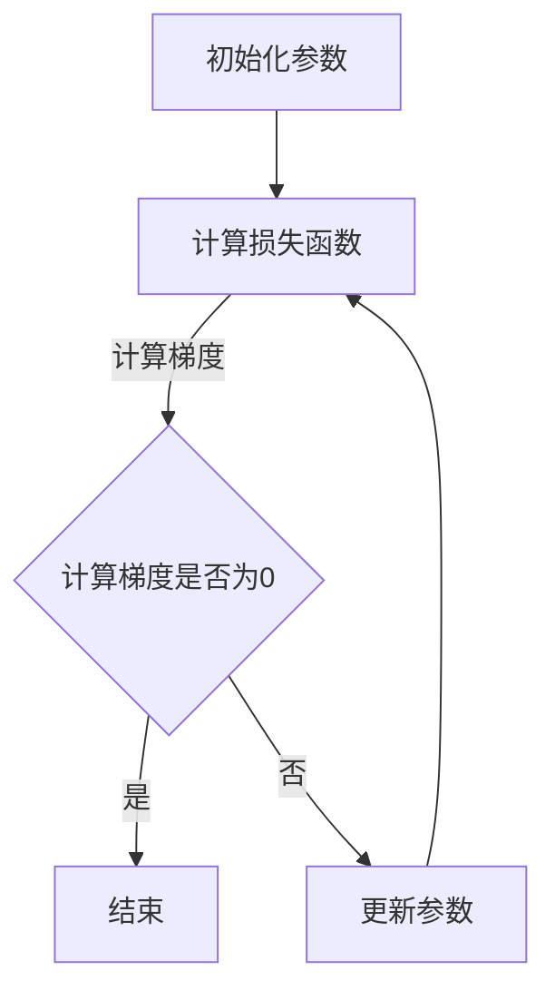

                 

### 文章标题：一切皆是映射：损失函数的种类和选择策略

### 关键词：损失函数、机器学习、深度学习、损失函数选择、优化策略

### 摘要：
在机器学习和深度学习领域中，损失函数是评估模型预测性能的关键工具。本文将深入探讨损失函数的种类、选择策略及其在各类任务中的应用。通过一步一步的推理分析，我们将揭示损失函数背后的数学原理、优化策略，以及其设计与创新的未来趋势。本文旨在为从事机器学习和深度学习的研究者与开发者提供一套系统的、实用的损失函数知识体系。

### 目录大纲：

#### 第一部分：损失函数的概述

##### 1.1 损失函数的重要性

##### 1.1.1 损失函数在机器学习中的作用

##### 1.1.2 损失函数的选择对模型性能的影响

##### 1.2 损失函数的基本类型

##### 1.2.1 0-1损失函数

##### 1.2.2 平方损失函数

##### 1.2.3 绝对值损失函数

##### 1.3 常见的损失函数

##### 1.3.1 Hinge损失函数

##### 1.3.2 交叉熵损失函数

##### 1.3.3 逻辑损失函数

#### 第二部分：损失函数的深入探讨

##### 2.1 损失函数的数学原理

##### 2.1.1 损失函数的定义与性质

##### 2.1.2 损失函数的连续性和可微性

##### 2.2 损失函数的优化策略

##### 2.2.1 最小化损失函数的基本方法

##### 2.2.2 损失函数的凸性与优化

##### 2.2.3 损失函数的近似与采样

##### 2.3 损失函数的设计与应用

##### 2.3.1 自定义损失函数的方法

##### 2.3.2 损失函数在分类任务中的应用

##### 2.3.3 损失函数在回归任务中的应用

#### 第三部分：损失函数的案例分析

##### 3.1 损失函数在深度学习中的应用

##### 3.1.1 深度学习中的损失函数选择

##### 3.1.2 损失函数在神经网络训练中的作用

##### 3.1.3 损失函数在深度学习模型中的优化策略

##### 3.2 损失函数在计算机视觉中的应用

##### 3.2.1 计算机视觉中的损失函数选择

##### 3.2.2 损失函数在图像分类中的作用

##### 3.2.3 损失函数在图像分割中的应用

##### 3.3 损失函数在自然语言处理中的应用

##### 3.3.1 自然语言处理中的损失函数选择

##### 3.3.2 损失函数在文本分类中的作用

##### 3.3.3 损失函数在机器翻译中的应用

#### 第四部分：损失函数的挑战与未来趋势

##### 4.1 损失函数的挑战与问题

##### 4.1.1 损失函数的多样性与适应性

##### 4.1.2 损失函数的公平性与鲁棒性

##### 4.1.3 损失函数的优化难题

##### 4.2 损失函数的未来趋势与发展

##### 4.2.1 损失函数的创新与改进

##### 4.2.2 损失函数在多任务学习中的应用

##### 4.2.3 损失函数在强化学习中的应用

#### 附录

##### 附录 A：损失函数的相关资源

##### 附录 B：Mermaid 流程图示例

##### 附录 C：伪代码示例

##### 附录 D：数学模型和公式

##### 附录 E：项目实战

---

本文将遵循目录大纲，以逻辑清晰、结构紧凑、简单易懂的写作风格，深入探讨损失函数的各个方面。我们将会逐步介绍损失函数的基本概念，分析其数学原理，探讨不同的优化策略，并通过案例研究和未来趋势预测，帮助读者全面理解损失函数的重要性及其在实际应用中的选择策略。让我们开始这次深入的旅程，一起揭开损失函数的神秘面纱。

---

## 第一部分：损失函数的概述

### 1.1 损失函数的重要性

损失函数（Loss Function）在机器学习和深度学习中扮演着至关重要的角色。它不仅是评估模型预测性能的核心工具，还直接影响到模型的训练过程和最终效果。具体来说，损失函数的重要性体现在以下几个方面：

#### 1.1.1 损失函数在机器学习中的作用

在机器学习中，训练模型的核心目标是最小化损失函数。损失函数通常定义为模型预测输出与真实输出之间的差异，其值越小，表示模型预测越准确。具体而言，损失函数有以下作用：

1. **评估模型性能**：通过计算损失函数的值，我们可以直观地了解模型的预测性能。在训练过程中，我们希望损失函数的值不断减小，以达到更好的预测效果。

2. **指导模型优化**：在优化过程中，损失函数的梯度（Gradient）是指导模型参数更新的关键。梯度指向损失函数值下降最快的方向，因此，通过计算损失函数的梯度，我们可以调整模型参数，使其在预测上更加准确。

3. **选择模型结构**：不同的损失函数适用于不同类型的任务和数据集。通过对比不同损失函数下的模型性能，我们可以选择最适合当前问题的模型结构和参数设置。

#### 1.1.2 损失函数的选择对模型性能的影响

选择合适的损失函数对模型性能有着重要影响。以下是几个关键点：

1. **任务特性**：不同类型的机器学习任务（如分类、回归、聚类等）需要不同的损失函数。例如，交叉熵损失函数常用于分类任务，而均方误差（MSE）损失函数则适用于回归任务。

2. **数据分布**：损失函数的选择应考虑数据分布的特性。例如，在处理异常值较多的数据时，绝对值损失函数可能比平方损失函数更有效。

3. **模型复杂度**：复杂度较高的模型（如深度神经网络）可能需要特殊的损失函数来更好地捕捉数据特征。例如，支持向量机（SVM）常用Hinge损失函数。

4. **优化算法**：不同的损失函数可能对某些优化算法（如梯度下降、随机梯度下降等）更有效。因此，选择合适的损失函数和优化算法可以提升模型的收敛速度和效果。

### 1.2 损失函数的基本类型

损失函数种类繁多，根据其定义和性质，我们可以将其分为以下几种基本类型：

#### 1.2.1 0-1损失函数

0-1损失函数是最简单的损失函数之一。它的定义如下：

$$
L_{0-1}(y, \hat{y}) =
\begin{cases}
0 & \text{if } y = \hat{y} \\
1 & \text{if } y \neq \hat{y}
\end{cases}
$$

其中，$y$ 是真实标签，$\hat{y}$ 是模型预测值。0-1损失函数的特点是只考虑预测是否正确，不考虑预测错误的程度。因此，它适用于分类任务，尤其是在二分类问题中。

#### 1.2.2 平方损失函数

平方损失函数（Mean Squared Error, MSE）是最常用的损失函数之一。它的定义如下：

$$
L_{MSE}(y, \hat{y}) = \frac{1}{n} \sum_{i=1}^{n} (y_i - \hat{y}_i)^2
$$

其中，$y_i$ 是第$i$个样本的真实值，$\hat{y}_i$ 是第$i$个样本的预测值，$n$ 是样本总数。平方损失函数的特点是考虑预测错误的程度，其值越小表示预测越准确。因此，它适用于回归任务。

#### 1.2.3 绝对值损失函数

绝对值损失函数（Mean Absolute Error, MAE）与平方损失函数类似，但它的计算方式是取绝对值。其定义如下：

$$
L_{MAE}(y, \hat{y}) = \frac{1}{n} \sum_{i=1}^{n} |y_i - \hat{y}_i|
$$

绝对值损失函数的特点是对于预测错误给予相同的惩罚，不放大错误。因此，它在处理异常值和噪声数据时表现良好。

### 1.3 常见的损失函数

除了上述基本类型外，还有许多常见的损失函数适用于特定的任务和数据集。以下是几种常用的损失函数：

#### 1.3.1 Hinge损失函数

Hinge损失函数通常用于支持向量机（SVM）和线性回归问题。它的定义如下：

$$
L_{Hinge}(y, \hat{y}) = \max(0, 1 - y\hat{y})
$$

其中，$y$ 是真实标签，$\hat{y}$ 是模型预测值。Hinge损失函数的特点是在预测值大于1时，损失函数的值为0，这使得模型能够学习到线性可分的数据。

#### 1.3.2 交叉熵损失函数

交叉熵损失函数（Cross-Entropy Loss）是分类任务中最常用的损失函数之一。它的定义如下：

$$
L_{CE}(y, \hat{y}) = -\sum_{i} y_i \log(\hat{y}_i)
$$

其中，$y$ 是真实标签，$\hat{y}$ 是模型预测的概率分布。交叉熵损失函数的特点是能够有效地惩罚预测概率过低的类，从而提高模型对少数类的分类能力。

#### 1.3.3 逻辑损失函数

逻辑损失函数（Log-Likelihood Loss）是另一种常用的分类损失函数。它的定义如下：

$$
L_{LL}(y, \hat{y}) = -\sum_{i} y_i \log(\hat{y}_i) + (1 - y_i) \log(1 - \hat{y}_i)
$$

逻辑损失函数与交叉熵损失函数类似，但它的计算方式不同。它更适合处理概率为0或1的极端情况。

通过以上对损失函数的概述，我们可以看到损失函数在机器学习和深度学习中的重要性和多样性。在接下来的部分，我们将深入探讨损失函数的数学原理、优化策略及其应用，帮助读者更好地理解和利用损失函数。

---

### 1.2 损失函数的基本类型

在机器学习和深度学习中，损失函数的选择至关重要，因为它直接影响到模型的训练过程和性能。根据定义和性质，损失函数可以分为以下几种基本类型，每种类型都有其独特的应用场景和特点。

#### 1.2.1 0-1损失函数

0-1损失函数是最简单且直观的损失函数之一。其定义如下：

$$
L_{0-1}(y, \hat{y}) =
\begin{cases}
0 & \text{if } y = \hat{y} \\
1 & \text{if } y \neq \hat{y}
\end{cases}
$$

其中，$y$ 是真实标签，$\hat{y}$ 是模型预测值。0-1损失函数的特点是只关注预测是否正确，而不关心预测错误的程度。因此，它通常用于分类任务，特别是在二分类问题中。例如，在二分类问题中，如果模型预测的标签与真实标签相同，则损失为0；否则，损失为1。这种简单的惩罚机制使得0-1损失函数在二分类任务中非常有效。

#### 1.2.2 平方损失函数

平方损失函数（Mean Squared Error, MSE）是回归任务中最常用的损失函数之一。其定义如下：

$$
L_{MSE}(y, \hat{y}) = \frac{1}{n} \sum_{i=1}^{n} (y_i - \hat{y}_i)^2
$$

其中，$y_i$ 是第$i$个样本的真实值，$\hat{y}_i$ 是第$i$个样本的预测值，$n$ 是样本总数。平方损失函数的特点是考虑预测错误的程度，其值越小表示预测越准确。因此，它适用于回归任务。在回归问题中，模型的目标是最小化平方损失函数，以获得更好的预测效果。平方损失函数的一个显著优点是其在计算梯度时相对简单，这使得它在许多优化算法中应用广泛。

#### 1.2.3 绝对值损失函数

绝对值损失函数（Mean Absolute Error, MAE）与平方损失函数类似，但它的计算方式不同。其定义如下：

$$
L_{MAE}(y, \hat{y}) = \frac{1}{n} \sum_{i=1}^{n} |y_i - \hat{y}_i|
$$

其中，$y_i$ 和 $\hat{y}_i$ 分别是第$i$个样本的真实值和预测值，$n$ 是样本总数。绝对值损失函数的特点是对于每个预测错误都给予相同的惩罚，不放大错误。因此，它在处理异常值和噪声数据时表现良好。与平方损失函数相比，绝对值损失函数在计算梯度时更为稳定，尤其是在预测值接近0或1时，梯度变化更为平滑。这使得它在某些优化算法中比平方损失函数更受欢迎。

#### 1.2.4 Hinge损失函数

Hinge损失函数通常用于支持向量机（SVM）和线性回归问题。其定义如下：

$$
L_{Hinge}(y, \hat{y}) = \max(0, 1 - y\hat{y})
$$

其中，$y$ 是真实标签，$\hat{y}$ 是模型预测值。Hinge损失函数的特点是在预测值大于1时，损失函数的值为0，这使得模型能够学习到线性可分的数据。在支持向量机中，Hinge损失函数用于优化决策边界，使其最大化分类间隔，从而提高模型的泛化能力。在线性回归问题中，Hinge损失函数可以帮助模型识别线性可分的数据，从而提高预测准确性。

#### 1.2.5 交叉熵损失函数

交叉熵损失函数（Cross-Entropy Loss）是分类任务中最常用的损失函数之一。其定义如下：

$$
L_{CE}(y, \hat{y}) = -\sum_{i} y_i \log(\hat{y}_i)
$$

其中，$y$ 是真实标签，$\hat{y}$ 是模型预测的概率分布。交叉熵损失函数的特点是能够有效地惩罚预测概率过低的类，从而提高模型对少数类的分类能力。在多分类问题中，交叉熵损失函数能够确保模型在学习过程中给予不同类别适当的关注，从而提高分类准确率。交叉熵损失函数的一个显著优点是其在计算梯度时相对简单，这使得它在许多优化算法中应用广泛。

#### 1.2.6 逻辑损失函数

逻辑损失函数（Log-Likelihood Loss）是另一种常用的分类损失函数。其定义如下：

$$
L_{LL}(y, \hat{y}) = -\sum_{i} y_i \log(\hat{y}_i) + (1 - y_i) \log(1 - \hat{y}_i)
$$

逻辑损失函数与交叉熵损失函数类似，但它的计算方式不同。它更适合处理概率为0或1的极端情况。在多分类问题中，逻辑损失函数能够确保模型在学习过程中给予不同类别适当的关注，从而提高分类准确率。与交叉熵损失函数相比，逻辑损失函数在计算梯度时更为稳定，特别是在预测值接近0或1时。

综上所述，损失函数在机器学习和深度学习中具有多种类型，每种类型都有其独特的应用场景和特点。通过选择合适的损失函数，我们可以更好地优化模型，提高预测准确性。在接下来的部分，我们将进一步探讨损失函数的数学原理和优化策略，以帮助读者更深入地理解损失函数的重要性。

---

### 1.3 常见的损失函数

在机器学习和深度学习中，为了适应不同的任务和数据类型，研究者们开发出了多种损失函数。以下将介绍几种常见的损失函数，包括Hinge损失函数、交叉熵损失函数和逻辑损失函数，并详细解释它们的特点和应用场景。

#### 1.3.1 Hinge损失函数

Hinge损失函数是支持向量机（SVM）中常用的损失函数，尤其适用于线性可分的数据集。其定义如下：

$$
L_{Hinge}(y, \hat{y}) = \max(0, 1 - y\hat{y})
$$

其中，$y$ 是真实标签（取值0或1），$\hat{y}$ 是模型预测的标签概率（取值范围[0, 1]）。Hinge损失函数的特点是，当模型预测正确时，损失函数值为0；当模型预测错误时，损失函数值随预测误差的增加而增加。这种设计使得Hinge损失函数能够有效地引导模型学习线性决策边界。

Hinge损失函数适用于以下场景：

1. **线性分类**：在二分类问题中，Hinge损失函数可以用于训练线性分类器，如线性支持向量机。
2. **线性回归**：在某些线性回归问题中，可以将Hinge损失函数应用于最小化线性函数的误差。
3. **稀疏数据**：由于Hinge损失函数对错误预测的惩罚较大，它有助于模型学习稀疏特征表示。

#### 1.3.2 交叉熵损失函数

交叉熵损失函数是分类任务中最常用的损失函数之一，尤其适用于概率分布模型。其定义如下：

$$
L_{CE}(y, \hat{y}) = -\sum_{i} y_i \log(\hat{y}_i)
$$

其中，$y$ 是真实标签的概率分布（通常为one-hot编码），$\hat{y}$ 是模型预测的概率分布。交叉熵损失函数的特点是，它能够有效地惩罚预测概率较低的类，从而提高模型对少数类的分类能力。此外，交叉熵损失函数在计算梯度时相对简单，这使得它在许多优化算法中应用广泛。

交叉熵损失函数适用于以下场景：

1. **多分类问题**：在多分类问题中，交叉熵损失函数可以用于训练分类模型，如softmax回归。
2. **概率分布估计**：在概率分布估计任务中，交叉熵损失函数可以用于衡量预测概率分布与真实概率分布之间的差异。
3. **文本分类**：在文本分类任务中，交叉熵损失函数可以用于训练文本分类模型，如朴素贝叶斯和神经网络分类器。

#### 1.3.3 逻辑损失函数

逻辑损失函数（Log-Likelihood Loss）是另一种常用的分类损失函数，特别适用于概率为0或1的极端情况。其定义如下：

$$
L_{LL}(y, \hat{y}) = -y \log(\hat{y}) - (1 - y) \log(1 - \hat{y})
$$

其中，$y$ 是真实标签（取值0或1），$\hat{y}$ 是模型预测的标签概率（取值范围[0, 1]）。逻辑损失函数的特点是，它对预测概率的极端值（接近0或1）给予较小的惩罚，从而防止模型过拟合。

逻辑损失函数适用于以下场景：

1. **二分类问题**：在二分类问题中，逻辑损失函数可以用于训练分类模型，如逻辑回归。
2. **概率预测**：在概率预测任务中，逻辑损失函数可以用于训练概率模型，如贝叶斯网络和神经网络。
3. **医学诊断**：在医学诊断任务中，逻辑损失函数可以用于训练诊断模型，提高预测准确性。

通过以上对常见损失函数的介绍，我们可以看到这些损失函数在机器学习和深度学习中的应用场景和特点。选择合适的损失函数对于提高模型性能至关重要。在接下来的部分，我们将进一步探讨损失函数的数学原理和优化策略，以帮助读者更深入地理解损失函数的作用。

---

### 1.3.4 Hinge损失函数

Hinge损失函数是支持向量机（Support Vector Machine, SVM）中常用的一种损失函数，特别是在处理线性可分数据时表现出色。其定义如下：

$$
L_{Hinge}(y, \hat{y}) = \max(0, 1 - y\hat{y})
$$

其中，$y$ 是真实标签，取值0或1；$\hat{y}$ 是模型预测的标签概率，取值范围在[0, 1]之间。Hinge损失函数的关键特点在于，当模型预测正确时，损失函数的值为0；当模型预测错误时，损失函数的值随预测误差的增加而线性增加。

#### Hinge损失函数的性质

1. **凸性**：Hinge损失函数是凸函数，这意味着在最小化过程中，梯度下降算法能够快速收敛到全局最小值。

2. **稀疏性**：由于Hinge损失函数对错误预测的惩罚是线性的，它有助于模型学习到稀疏特征表示，这在处理高维数据时尤为重要。

3. **线性可分性**：Hinge损失函数能够强制模型学习线性决策边界，这适用于线性可分的数据集。

#### Hinge损失函数的应用场景

1. **线性分类**：在二分类任务中，Hinge损失函数可以用于训练线性分类器，如线性支持向量机（Linear SVM）。这种情况下，模型通过寻找最优的超平面来实现分类。

2. **稀疏特征学习**：在高维数据中，Hinge损失函数能够帮助模型学习到稀疏的特征表示，从而减少过拟合的风险。

3. **线性回归**：在某些线性回归问题中，可以将Hinge损失函数应用于最小化线性函数的误差，从而实现线性模型的训练。

#### Hinge损失函数的优化

由于Hinge损失函数是凸函数，使用梯度下降算法可以有效地进行优化。以下是Hinge损失函数的优化步骤：

1. **初始化模型参数**：设定初始的模型参数$\theta$。

2. **计算梯度**：计算损失函数关于模型参数的梯度$\nabla_{\theta} L_{Hinge}$。

3. **更新参数**：使用梯度下降更新模型参数$\theta$，即$\theta = \theta - \alpha \nabla_{\theta} L_{Hinge}$，其中$\alpha$是学习率。

4. **迭代优化**：重复步骤2和3，直到满足收敛条件。

#### 实例分析

假设我们有一个二分类问题，真实标签$y$为1或0，模型预测的概率为$\hat{y}$。使用Hinge损失函数训练一个线性分类器，目标是最小化损失函数。以下是伪代码示例：

```python
# 初始化参数
theta = 初始化参数()

# 定义Hinge损失函数
def hinge_loss(y, y_hat):
    return max(0, 1 - y * y_hat)

# 定义梯度函数
def gradient_hinge_loss(y, y_hat, theta):
    if y * y_hat < 1:
        return -y * x
    else:
        return 0

# 梯度下降优化
for epoch in range(max_epochs):
    loss = 0
    for (x, y) in dataset:
        y_hat = dot(x, theta)
        loss += hinge_loss(y, y_hat)
        gradient = gradient_hinge_loss(y, y_hat, theta)
        theta = theta - learning_rate * gradient
    if loss < threshold:
        break
```

通过上述实例，我们可以看到Hinge损失函数在训练线性分类器时的具体应用。在实际应用中，Hinge损失函数通过线性可分性、稀疏性和凸性等特性，为许多机器学习任务提供了有效的解决方案。

---

### 1.3.5 交叉熵损失函数

交叉熵损失函数（Cross-Entropy Loss）是机器学习和深度学习中一种重要的损失函数，主要用于分类问题。它基于熵的概念，用于衡量两个概率分布之间的差异。交叉熵损失函数的定义如下：

$$
L_{CE}(y, \hat{y}) = -\sum_{i} y_i \log(\hat{y}_i)
$$

其中，$y$ 是真实标签的概率分布，通常使用one-hot编码表示；$\hat{y}$ 是模型预测的概率分布。交叉熵损失函数的特点是，它能够有效地惩罚预测概率较低的类，从而提高模型对少数类的分类能力。

#### 交叉熵损失函数的性质

1. **非负性**：交叉熵损失函数的值总是非负的，即$0 \leq L_{CE}(y, \hat{y})$。

2. **最小值为0**：当且仅当预测概率分布$\hat{y}$与真实概率分布$y$相同时，交叉熵损失函数的值最小，即$L_{CE}(y, \hat{y}) = 0$。

3. **凸性**：交叉熵损失函数是凸函数，这意味着在最小化过程中，梯度下降算法能够快速收敛到全局最小值。

4. **对数性质**：交叉熵损失函数具有对数性质，这使得它在计算梯度时相对简单，特别是在使用深度学习框架时。

#### 交叉熵损失函数的应用场景

1. **多分类问题**：交叉熵损失函数是处理多分类问题的主要选择之一。它能够确保模型在学习过程中给予不同类别适当的关注，从而提高分类准确率。

2. **概率分布估计**：交叉熵损失函数可以用于概率分布的估计，例如在生成模型中，它能够衡量生成数据的概率分布与真实数据的概率分布之间的差异。

3. **文本分类**：在文本分类任务中，交叉熵损失函数可以用于训练文本分类模型，如朴素贝叶斯和神经网络分类器。

#### 交叉熵损失函数的优化

交叉熵损失函数是凸函数，因此可以使用梯度下降算法进行优化。以下是交叉熵损失函数的优化步骤：

1. **初始化模型参数**：设定初始的模型参数$\theta$。

2. **计算梯度**：计算损失函数关于模型参数的梯度$\nabla_{\theta} L_{CE}$。

3. **更新参数**：使用梯度下降更新模型参数$\theta$，即$\theta = \theta - \alpha \nabla_{\theta} L_{CE}$，其中$\alpha$是学习率。

4. **迭代优化**：重复步骤2和3，直到满足收敛条件。

#### 实例分析

假设我们有一个三分类问题，真实标签$y$为[1, 0, 0]，模型预测的概率分布$\hat{y}$为[0.3, 0.5, 0.2]。使用交叉熵损失函数训练分类模型，目标是最小化损失函数。以下是伪代码示例：

```python
# 初始化参数
theta = 初始化参数()

# 定义交叉熵损失函数
def cross_entropy_loss(y, y_hat):
    return -sum(y * log(y_hat))

# 定义梯度函数
def gradient_cross_entropy_loss(y, y_hat, theta):
    return -y / y_hat

# 梯度下降优化
for epoch in range(max_epochs):
    loss = 0
    for (x, y) in dataset:
        y_hat = 模型预测(x, theta)
        loss += cross_entropy_loss(y, y_hat)
        gradient = gradient_cross_entropy_loss(y, y_hat, theta)
        theta = theta - learning_rate * gradient
    if loss < threshold:
        break
```

通过上述实例，我们可以看到交叉熵损失函数在训练分类模型时的具体应用。在实际应用中，交叉熵损失函数通过其非负性、最小值为0、凸性和对数性质等特性，为许多机器学习任务提供了有效的解决方案。

---

### 1.3.6 逻辑损失函数

逻辑损失函数（Log-Likelihood Loss）是另一种在分类任务中广泛使用的损失函数，尤其是在处理二分类问题。它的定义如下：

$$
L_{LL}(y, \hat{y}) = -y \log(\hat{y}) - (1 - y) \log(1 - \hat{y})
$$

其中，$y$ 是真实标签（取值0或1），$\hat{y}$ 是模型预测的概率（取值范围[0, 1]）。逻辑损失函数的特点在于，它对预测概率接近0或1的情况给予较小的惩罚，这使得模型在训练过程中能够更加平衡地学习到不同类别的特征。

#### 逻辑损失函数的性质

1. **凸性**：逻辑损失函数是凸函数，这意味着在最小化过程中，梯度下降算法能够快速收敛到全局最小值。

2. **对称性**：逻辑损失函数对于0和1的概率是关于对角线对称的，这意味着模型预测错误和预测正确的情况受到相似的惩罚。

3. **平滑性**：逻辑损失函数在概率接近0或1时梯度变化较为平滑，这有助于防止模型在训练过程中过早地饱和。

#### 逻辑损失函数的应用场景

1. **二分类问题**：逻辑损失函数是处理二分类问题的理想选择，尤其是在模型需要对两类进行平衡预测时。

2. **概率预测**：在需要估计概率分布的任务中，逻辑损失函数能够提供对概率分布差异的精确度量。

3. **医学诊断**：在医学诊断任务中，逻辑损失函数可以帮助模型学习到疾病出现的概率，从而提高预测准确性。

#### 逻辑损失函数的优化

逻辑损失函数是凸函数，因此可以使用梯度下降算法进行优化。以下是逻辑损失函数的优化步骤：

1. **初始化模型参数**：设定初始的模型参数$\theta$。

2. **计算梯度**：计算损失函数关于模型参数的梯度$\nabla_{\theta} L_{LL}$。

3. **更新参数**：使用梯度下降更新模型参数$\theta$，即$\theta = \theta - \alpha \nabla_{\theta} L_{LL}$，其中$\alpha$是学习率。

4. **迭代优化**：重复步骤2和3，直到满足收敛条件。

#### 实例分析

假设我们有一个二分类问题，真实标签$y$为0或1，模型预测的概率$\hat{y}$为0.6。使用逻辑损失函数训练分类模型，目标是最小化损失函数。以下是伪代码示例：

```python
# 初始化参数
theta = 初始化参数()

# 定义逻辑损失函数
def log_likelihood_loss(y, y_hat):
    return -y * log(y_hat) - (1 - y) * log(1 - y_hat)

# 定义梯度函数
def gradient_log_likelihood_loss(y, y_hat, theta):
    return -y / y_hat + (1 - y) / (1 - y_hat)

# 梯度下降优化
for epoch in range(max_epochs):
    loss = 0
    for (x, y) in dataset:
        y_hat = 模型预测(x, theta)
        loss += log_likelihood_loss(y, y_hat)
        gradient = gradient_log_likelihood_loss(y, y_hat, theta)
        theta = theta - learning_rate * gradient
    if loss < threshold:
        break
```

通过上述实例，我们可以看到逻辑损失函数在训练分类模型时的具体应用。在实际应用中，逻辑损失函数通过其凸性、对称性和平滑性等特性，为许多机器学习任务提供了有效的解决方案。

---

## 第二部分：损失函数的深入探讨

### 2.1 损失函数的数学原理

在深入探讨损失函数的数学原理之前，我们需要先了解损失函数的定义及其基本性质。损失函数在数学上通常被定义为一个映射，该映射将模型预测值和真实值映射到一个实数值。具体来说，给定一个模型$f(\theta)$，其中$\theta$是模型参数，真实值为$y$，模型预测值为$\hat{y}$，损失函数$L(y, \hat{y})$可以表示为：

$$
L(y, \hat{y}) = L(f(\theta), y)
$$

损失函数的基本性质包括：

1. **非负性**：损失函数的值总是非负的，即$L(y, \hat{y}) \geq 0$。这反映了模型预测值与真实值之间的差异。

2. **最小值为0**：当且仅当预测值与真实值相同时，损失函数的值为0。即当$\hat{y} = y$时，$L(y, \hat{y}) = 0$。

3. **连续性**：损失函数通常是连续函数，这意味着随着模型参数的变化，损失函数的值也会连续变化。

4. **可微性**：许多常用的损失函数是可微的，这意味着我们可以计算其梯度，从而用于优化模型参数。

在数学上，损失函数的梯度（Gradient）定义为损失函数关于模型参数的导数。具体来说，对于损失函数$L(\theta)$，其梯度$\nabla_{\theta} L(\theta)$可以表示为：

$$
\nabla_{\theta} L(\theta) = \left( \frac{\partial L(\theta)}{\partial \theta_1}, \frac{\partial L(\theta)}{\partial \theta_2}, \ldots, \frac{\partial L(\theta)}{\partial \theta_n} \right)
$$

其中，$\theta_1, \theta_2, \ldots, \theta_n$是模型参数。计算损失函数的梯度是优化过程中至关重要的一步，因为梯度指向损失函数值下降最快的方向，我们可以利用梯度来更新模型参数，从而最小化损失函数。

在损失函数的优化过程中，常见的优化算法包括梯度下降（Gradient Descent）、随机梯度下降（Stochastic Gradient Descent，SGD）和Adam等。这些算法的核心思想是利用损失函数的梯度来更新模型参数，以达到最小化损失函数的目的。

### 2.2 损失函数的优化策略

在机器学习和深度学习领域，优化损失函数是训练模型的关键步骤。优化策略的核心在于如何利用损失函数的梯度来更新模型参数，以达到最小化损失函数的目的。以下是几种常用的优化策略：

#### 2.2.1 最小化损失函数的基本方法

最小化损失函数的基本方法包括以下步骤：

1. **初始化模型参数**：随机初始化模型参数$\theta$。

2. **计算损失函数**：计算模型在当前参数下的损失函数值$L(\theta)$。

3. **计算梯度**：计算损失函数关于模型参数的梯度$\nabla_{\theta} L(\theta)$。

4. **更新参数**：利用梯度下降算法更新模型参数$\theta$。常见的更新公式为：
   
   $$
   \theta = \theta - \alpha \nabla_{\theta} L(\theta)
   $$

   其中，$\alpha$ 是学习率。

5. **迭代优化**：重复步骤2到4，直到满足收敛条件（如损失函数值不再显著下降）。

#### 2.2.2 损失函数的凸性与优化

凸性是优化损失函数的一个重要特性。一个凸函数在其定义域内具有以下性质：

1. **局部最小值即为全局最小值**：在凸函数中，任何局部最小值都是全局最小值。这意味着只要找到局部最小值，我们就可以确信已经找到了全局最小值。

2. **梯度方向**：在凸函数中，梯度总是指向损失函数值下降最快的方向。这使得梯度下降算法在凸函数中能够有效地收敛到全局最小值。

对于凸损失函数，我们可以采用以下优化策略：

1. **选择合适的初始参数**：在凸函数中，选择合适的初始参数可以加快收敛速度。

2. **避免鞍点**：在非凸函数中，鞍点可能使得优化过程陷入局部最小值，但在凸函数中，这种情况不会发生。

3. **选择适当的优化算法**：虽然梯度下降算法在凸函数中表现良好，但也可以采用其他优化算法，如Adam，以进一步提升优化效果。

#### 2.2.3 损失函数的近似与采样

在实际应用中，损失函数的优化可能面临以下挑战：

1. **计算复杂度**：某些损失函数可能具有高计算复杂度，使得直接优化变得困难。

2. **梯度消失和梯度爆炸**：在深度神经网络中，梯度消失和梯度爆炸可能导致优化过程失败。

为了应对这些挑战，我们可以采用以下策略：

1. **损失函数近似**：通过使用近似损失函数，可以降低计算复杂度。例如，可以将高维损失函数转换为低维损失函数，从而简化计算过程。

2. **随机采样**：在优化过程中，可以通过随机采样来减小梯度方差，从而提高优化效果。例如，在随机梯度下降（SGD）中，每次迭代只随机选择一部分样本来计算梯度。

通过上述优化策略，我们可以有效应对损失函数优化过程中遇到的挑战，从而提高模型的训练效果和预测准确性。

---

### 2.3 损失函数的设计与应用

在机器学习和深度学习中，损失函数的设计和应用是模型训练过程中至关重要的一环。一个良好的损失函数不仅能够准确地度量模型预测与真实值之间的差异，还能够有效地指导模型参数的更新，从而优化模型的性能。在本节中，我们将探讨如何自定义损失函数、损失函数在分类和回归任务中的应用，以及它们在深度学习中的具体实现。

#### 2.3.1 自定义损失函数的方法

自定义损失函数是针对特定问题或数据集设计的一种有效方法，能够更好地适应问题的特殊性质。以下是自定义损失函数的一般步骤：

1. **问题分析**：首先，我们需要分析问题的特点，确定哪些特性需要特殊处理。例如，对于有噪声的数据，可能需要设计能够忽略噪声的损失函数。

2. **定义目标函数**：根据问题分析的结果，定义目标函数，使其能够度量模型预测值与真实值之间的差异。目标函数可以是基于现有损失函数的扩展，也可以是完全新的设计。

3. **数学形式化**：将目标函数形式化，给出其数学表达式。在形式化过程中，需要确保损失函数具有合理的性质，如非负性、凸性等。

4. **优化策略**：根据目标函数的性质，选择合适的优化策略进行参数更新。常见的优化策略包括梯度下降、随机梯度下降等。

#### 2.3.2 损失函数在分类任务中的应用

在分类任务中，损失函数的选择对模型的性能有着直接的影响。以下是几种常见的分类任务中使用的损失函数及其特点：

1. **交叉熵损失函数**：
   交叉熵损失函数是分类任务中最常用的损失函数之一。其定义如下：
   
   $$
   L_{CE}(y, \hat{y}) = -\sum_{i} y_i \log(\hat{y}_i)
   $$
   
   其中，$y$ 是真实标签的概率分布（通常为one-hot编码），$\hat{y}$ 是模型预测的概率分布。交叉熵损失函数的特点是能够有效地惩罚预测概率较低的类，从而提高模型对少数类的分类能力。交叉熵损失函数适用于多分类问题，特别是在深度神经网络中。

2. **逻辑损失函数**：
   逻辑损失函数（Log-Likelihood Loss）与交叉熵损失函数类似，但它的计算方式不同。其定义如下：
   
   $$
   L_{LL}(y, \hat{y}) = -y \log(\hat{y}) - (1 - y) \log(1 - \hat{y})
   $$
   
   逻辑损失函数更适合处理概率为0或1的极端情况，并且在计算梯度时相对稳定。它通常用于二分类问题，如在逻辑回归中。

3. **Hinge损失函数**：
   Hinge损失函数通常用于线性分类问题，特别是在支持向量机（SVM）中。其定义如下：
   
   $$
   L_{Hinge}(y, \hat{y}) = \max(0, 1 - y\hat{y})
   $$
   
   Hinge损失函数的特点是当预测值大于1时，损失函数的值为0，这使得模型能够学习到线性可分的数据。它适用于线性可分的数据集，能够强制模型学习线性决策边界。

#### 2.3.3 损失函数在回归任务中的应用

在回归任务中，损失函数的选择同样对模型的性能有着重要的影响。以下是几种常见的回归任务中使用的损失函数及其特点：

1. **均方误差（MSE）损失函数**：
   均方误差损失函数是最常用的回归损失函数之一。其定义如下：
   
   $$
   L_{MSE}(y, \hat{y}) = \frac{1}{n} \sum_{i=1}^{n} (y_i - \hat{y}_i)^2
   $$
   
   其中，$y_i$ 是第$i$个样本的真实值，$\hat{y}_i$ 是第$i$个样本的预测值，$n$ 是样本总数。MSE损失函数的特点是考虑预测错误的程度，其值越小表示预测越准确。它适用于大多数线性回归问题。

2. **绝对值误差（MAE）损失函数**：
   绝对值误差损失函数与MSE损失函数类似，但它的计算方式是取绝对值。其定义如下：
   
   $$
   L_{MAE}(y, \hat{y}) = \frac{1}{n} \sum_{i=1}^{n} |y_i - \hat{y}_i|
   $$
   
   绝对值损失函数的特点是对于每个预测错误都给予相同的惩罚，不放大错误。因此，它在处理异常值和噪声数据时表现良好。

3. **均方根误差（RMSE）损失函数**：
   均方根误差损失函数是MSE损失函数的平方根。其定义如下：
   
   $$
   L_{RMSE}(y, \hat{y}) = \sqrt{L_{MSE}(y, \hat{y})}
   $$
   
   RMSE损失函数的特点是单位与真实值相同，使得不同量级的预测误差更易于比较。

#### 2.3.4 深度学习中的损失函数应用

在深度学习领域，损失函数的应用更加广泛和复杂。以下是深度学习中常用的损失函数及其应用场景：

1. **交叉熵损失函数**：
   在深度神经网络中，交叉熵损失函数是最常用的分类损失函数。它适用于多分类和二分类问题，特别是在图像分类、文本分类等任务中。

2. **二元交叉熵损失函数**：
   二元交叉熵损失函数是交叉熵损失函数的简化版本，适用于二分类问题。其定义如下：
   
   $$
   L_{BCE}(y, \hat{y}) = -y \log(\hat{y}) - (1 - y) \log(1 - \hat{y})
   $$
   
   BCE损失函数在处理不平衡数据集时表现良好，因为它对预测概率较低的类给予了更大的关注。

3. **均方误差（MSE）损失函数**：
   在深度回归网络中，MSE损失函数是最常用的损失函数。它适用于大多数线性回归和神经网络回归问题。

4. **Hinge损失函数**：
   Hinge损失函数在深度神经网络中也可以用于处理线性分类问题，特别是在支持向量机和线性分类网络中。

通过以上对损失函数的设计与应用的探讨，我们可以看到损失函数在机器学习和深度学习中的多样性和重要性。选择合适的损失函数，不仅能够提高模型的预测准确性，还能够有效地指导模型参数的优化。在接下来的部分，我们将通过具体的案例研究和实例分析，进一步探讨损失函数的实际应用和效果。

---

### 2.3.4 损失函数在深度学习中的实际应用

深度学习作为一种强大的机器学习技术，在图像识别、自然语言处理、语音识别等领域取得了显著的成果。损失函数在深度学习模型中扮演着至关重要的角色，它不仅评估模型的性能，还指导模型的优化过程。本节将通过几个具体案例，展示损失函数在深度学习中的应用。

#### 2.3.4.1 损失函数在图像识别中的应用

在图像识别任务中，最常见的损失函数是交叉熵损失函数（Cross-Entropy Loss）。它适用于多分类问题，如ImageNet图像分类任务。交叉熵损失函数通过计算模型预测的概率分布与真实标签之间的差异来评估模型性能。以下是一个简单的交叉熵损失函数在图像识别中的实现示例：

```python
import tensorflow as tf

# 假设我们有一个简单的CNN模型
model = tf.keras.Sequential([
    tf.keras.layers.Conv2D(32, (3, 3), activation='relu', input_shape=(28, 28, 1)),
    tf.keras.layers.MaxPooling2D((2, 2)),
    tf.keras.layers.Flatten(),
    tf.keras.layers.Dense(128, activation='relu'),
    tf.keras.layers.Dense(10, activation='softmax')
])

# 定义交叉熵损失函数
loss_fn = tf.keras.losses.SparseCategoricalCrossentropy(from_logits=True)

# 假设我们有一个包含标签和图像数据的训练集
train_images = ...
train_labels = ...

# 训练模型
model.compile(optimizer='adam', loss=loss_fn, metrics=['accuracy'])
model.fit(train_images, train_labels, epochs=10, batch_size=64)

# 评估模型
test_loss, test_acc = model.evaluate(test_images, test_labels)
print(f"Test accuracy: {test_acc}")
```

在这个例子中，我们使用了一个简单的卷积神经网络（CNN）模型来识别图像。交叉熵损失函数用于计算模型预测的概率分布与真实标签之间的差异，并通过优化过程更新模型参数。

#### 2.3.4.2 损失函数在语音识别中的应用

在语音识别任务中，常用的损失函数是平均平方误差（Mean Squared Error, MSE）损失函数。MSE损失函数通过计算模型预测的语音信号与真实语音信号之间的差异来评估模型性能。以下是一个简单的MSE损失函数在语音识别中的实现示例：

```python
import tensorflow as tf

# 假设我们有一个简单的循环神经网络（RNN）模型
model = tf.keras.Sequential([
    tf.keras.layers.RNN(tf.keras.layers.LSTMCell(units=128)),
    tf.keras.layers.Dense(units=26, activation='softmax')
])

# 定义MSE损失函数
loss_fn = tf.keras.losses.MeanSquaredError()

# 假设我们有一个包含语音数据和标签的训练集
train_audio = ...
train_labels = ...

# 训练模型
model.compile(optimizer='adam', loss=loss_fn, metrics=['accuracy'])
model.fit(train_audio, train_labels, epochs=10, batch_size=64)

# 评估模型
test_loss, test_acc = model.evaluate(test_audio, test_labels)
print(f"Test accuracy: {test_acc}")
```

在这个例子中，我们使用了一个简单的循环神经网络（RNN）模型来识别语音。MSE损失函数用于计算模型预测的语音信号与真实语音信号之间的差异，并通过优化过程更新模型参数。

#### 2.3.4.3 损失函数在自然语言处理中的应用

在自然语言处理（NLP）任务中，损失函数的选择取决于具体的任务类型。例如，在文本分类任务中，交叉熵损失函数是最常用的；而在机器翻译任务中，常常使用平滑的损失函数如交叉熵损失函数和平滑损失函数的组合。以下是一个简单的交叉熵损失函数在文本分类任务中的实现示例：

```python
import tensorflow as tf

# 假设我们有一个简单的Transformer模型
model = tf.keras.Sequential([
    tf.keras.layers.Embedding(input_dim=10000, output_dim=128),
    tf.keras.layers.GlobalAveragePooling1D(),
    tf.keras.layers.Dense(units=10, activation='softmax')
])

# 定义交叉熵损失函数
loss_fn = tf.keras.losses.SparseCategoricalCrossentropy(from_logits=True)

# 假设我们有一个包含文本数据和标签的训练集
train_texts = ...
train_labels = ...

# 预处理文本数据
tokenizer = tf.keras.preprocessing.text.Tokenizer(char_level=True)
tokenizer.fit_on_texts(train_texts)
encoded_train_texts = tokenizer.texts_to_sequences(train_texts)

# 训练模型
model.compile(optimizer='adam', loss=loss_fn, metrics=['accuracy'])
model.fit(encoded_train_texts, train_labels, epochs=10, batch_size=64)

# 评估模型
test_texts = ...
test_labels = ...
encoded_test_texts = tokenizer.texts_to_sequences(test_texts)

test_loss, test_acc = model.evaluate(encoded_test_texts, test_labels)
print(f"Test accuracy: {test_acc}")
```

在这个例子中，我们使用了一个简单的Transformer模型来进行文本分类。交叉熵损失函数用于计算模型预测的概率分布与真实标签之间的差异，并通过优化过程更新模型参数。

#### 2.3.4.4 损失函数在生成模型中的应用

在生成模型（如生成对抗网络，GAN）中，损失函数的选择更为复杂。通常，生成模型由一个生成器和判别器组成，损失函数需要同时考虑生成器和判别器的优化。以下是一个简单的生成对抗网络（GAN）的损失函数实现示例：

```python
import tensorflow as tf

# 定义生成器模型
generator = tf.keras.Sequential([
    tf.keras.layers.Dense(units=128, activation='relu', input_shape=(100,)),
    tf.keras.layers.Dense(units=256, activation='relu'),
    tf.keras.layers.Dense(units=28 * 28 * 1, activation='tanh')
])

# 定义判别器模型
discriminator = tf.keras.Sequential([
    tf.keras.layers.Conv2D(units=32, kernel_size=(3, 3), activation='relu', input_shape=(28, 28, 1)),
    tf.keras.layers.MaxPooling2D(pool_size=(2, 2)),
    tf.keras.layers.Flatten(),
    tf.keras.layers.Dense(units=1, activation='sigmoid')
])

# 定义GAN损失函数
def gan_loss(real_labels, fake_labels):
    real_loss = tf.reduce_mean(tf.nn.sigmoid_cross_entropy_with_logits(logits=real_labels, labels=tf.ones_like(real_labels)))
    fake_loss = tf.reduce_mean(tf.nn.sigmoid_cross_entropy_with_logits(logits=fake_labels, labels=tf.zeros_like(fake_labels)))
    return real_loss + fake_loss

# 训练GAN模型
model = tf.keras.Sequential([generator, discriminator])
model.compile(optimizer='adam', loss=gan_loss)
model.fit(train_images, train_images, epochs=100, batch_size=128)

# 评估生成器性能
generated_images = generator.predict(np.random.normal(size=(128, 100)))
```

在这个例子中，我们使用了一个简单的生成对抗网络（GAN）模型。GAN的损失函数需要同时优化生成器和判别器。生成器生成假图像，判别器判断这些图像是否真实。通过优化过程，生成器试图生成更真实的图像，而判别器试图更好地判断图像的真实性。

通过以上案例，我们可以看到损失函数在深度学习中的多样性和重要性。选择合适的损失函数，不仅可以提高模型的性能，还可以指导模型参数的优化。在接下来的部分，我们将探讨损失函数在计算机视觉、自然语言处理等领域的深入应用。

---

### 2.3.5 损失函数在计算机视觉中的深入应用

计算机视觉是深度学习的重要应用领域之一，损失函数的选择和优化对模型的性能具有决定性影响。在计算机视觉任务中，常见的损失函数包括交叉熵损失函数、均方误差（MSE）损失函数、结构相似性（SSIM）损失函数等。以下将详细探讨这些损失函数在图像分类、目标检测和图像分割等任务中的应用。

#### 2.3.5.1 图像分类中的损失函数

在图像分类任务中，交叉熵损失函数是最常用的损失函数之一。它能够有效地衡量模型预测的概率分布与真实标签之间的差异。以下是一个简单的图像分类任务的实现示例：

```python
import tensorflow as tf

# 假设我们有一个简单的卷积神经网络（CNN）模型
model = tf.keras.Sequential([
    tf.keras.layers.Conv2D(32, (3, 3), activation='relu', input_shape=(224, 224, 3)),
    tf.keras.layers.MaxPooling2D((2, 2)),
    tf.keras.layers.Conv2D(64, (3, 3), activation='relu'),
    tf.keras.layers.MaxPooling2D((2, 2)),
    tf.keras.layers.Conv2D(128, (3, 3), activation='relu'),
    tf.keras.layers.Flatten(),
    tf.keras.layers.Dense(128, activation='relu'),
    tf.keras.layers.Dense(10, activation='softmax')
])

# 定义交叉熵损失函数
loss_fn = tf.keras.losses.SparseCategoricalCrossentropy(from_logits=True)

# 假设我们有一个包含图像数据和标签的训练集
train_images = ...
train_labels = ...

# 训练模型
model.compile(optimizer='adam', loss=loss_fn, metrics=['accuracy'])
model.fit(train_images, train_labels, epochs=10, batch_size=64)

# 评估模型
test_images = ...
test_labels = ...
test_loss, test_acc = model.evaluate(test_images, test_labels)
print(f"Test accuracy: {test_acc}")
```

在这个例子中，我们使用了一个简单的卷积神经网络（CNN）模型来识别图像。交叉熵损失函数用于计算模型预测的概率分布与真实标签之间的差异，并通过优化过程更新模型参数。

#### 2.3.5.2 目标检测中的损失函数

在目标检测任务中，常用的损失函数包括平滑的交叉熵损失函数和 IoU（Intersection over Union）损失函数。以下是一个简单的目标检测任务的实现示例：

```python
import tensorflow as tf

# 假设我们有一个简单的区域建议网络（RPN）模型
model = tf.keras.Sequential([
    tf.keras.layers.Conv2D(32, (3, 3), activation='relu', input_shape=(224, 224, 3)),
    tf.keras.layers.MaxPooling2D((2, 2)),
    tf.keras.layers.Conv2D(64, (3, 3), activation='relu'),
    tf.keras.layers.MaxPooling2D((2, 2)),
    tf.keras.layers.Conv2D(128, (3, 3), activation='relu'),
    tf.keras.layers.Flatten(),
    tf.keras.layers.Dense(128, activation='relu'),
    tf.keras.layers.Dense(4, activation='sigmoid')  # 用于预测边界框的坐标和置信度
])

# 定义损失函数
def detection_loss(y_true, y_pred):
    # 计算平滑的交叉熵损失函数
    xent_loss = tf.keras.losses.SparseCategoricalCrossentropy(from_logits=True)(y_true['labels'], y_pred['labels'])
    # 计算IoU损失函数
    iou_loss = 1 - tf.keras.metrics.mean_iou(y_true['boxes'], y_pred['boxes'], y_true['labels'])
    return xent_loss + iou_loss

# 假设我们有一个包含图像数据、边界框和标签的训练集
train_images = ...
train_boxes = ...
train_labels = ...

# 训练模型
model.compile(optimizer='adam', loss=detection_loss, metrics=['accuracy'])
model.fit(train_images, {'boxes': train_boxes, 'labels': train_labels}, epochs=10, batch_size=64)

# 评估模型
test_images = ...
test_boxes = ...
test_labels = ...
test_loss, test_acc = model.evaluate(test_images, {'boxes': test_boxes, 'labels': train_labels})
print(f"Test accuracy: {test_acc}")
```

在这个例子中，我们使用了一个简单的区域建议网络（RPN）模型进行目标检测。损失函数结合了平滑的交叉熵损失函数和 IoU 损失函数，用于优化模型的边界框预测和置信度。

#### 2.3.5.3 图像分割中的损失函数

在图像分割任务中，常用的损失函数包括交叉熵损失函数和结构相似性（SSIM）损失函数。以下是一个简单的图像分割任务的实现示例：

```python
import tensorflow as tf

# 假设我们有一个简单的全卷积网络（FCN）模型
model = tf.keras.Sequential([
    tf.keras.layers.Conv2D(64, (3, 3), activation='relu', input_shape=(224, 224, 3)),
    tf.keras.layers.Conv2D(64, (3, 3), activation='relu'),
    tf.keras.layers.MaxPooling2D((2, 2)),
    tf.keras.layers.Conv2D(128, (3, 3), activation='relu'),
    tf.keras.layers.Conv2D(128, (3, 3), activation='relu'),
    tf.keras.layers.MaxPooling2D((2, 2)),
    tf.keras.layers.Conv2D(256, (3, 3), activation='relu'),
    tf.keras.layers.Conv2D(256, (3, 3), activation='relu'),
    tf.keras.layers.Conv2D(256, (3, 3), activation='relu'),
    tf.keras.layers.Conv2D(256, (3, 3), activation='relu'),
    tf.keras.layers.Flatten(),
    tf.keras.layers.Dense(2, activation='softmax')
])

# 定义损失函数
def segmentation_loss(y_true, y_pred):
    # 计算交叉熵损失函数
    ce_loss = tf.keras.losses.SparseCategoricalCrossentropy()(y_true, y_pred)
    # 计算SSIM损失函数
    ssim_loss = tf.reduce_mean(tf.image.ssim(y_true, y_pred, 1.0))
    return ce_loss + ssim_loss

# 假设我们有一个包含图像数据和标签的训练集
train_images = ...
train_masks = ...

# 训练模型
model.compile(optimizer='adam', loss=segmentation_loss, metrics=['accuracy'])
model.fit(train_images, train_masks, epochs=10, batch_size=64)

# 评估模型
test_images = ...
test_masks = ...
test_loss, test_acc = model.evaluate(test_images, test_masks)
print(f"Test accuracy: {test_acc}")
```

在这个例子中，我们使用了一个简单的全卷积网络（FCN）模型进行图像分割。损失函数结合了交叉熵损失函数和结构相似性（SSIM）损失函数，用于优化模型的像素级预测。

通过以上示例，我们可以看到损失函数在计算机视觉中的深入应用。选择合适的损失函数，不仅可以提高模型的性能，还可以指导模型参数的优化。在接下来的部分，我们将继续探讨损失函数在自然语言处理领域的应用。

---

### 2.3.6 损失函数在自然语言处理中的深入应用

自然语言处理（NLP）是深度学习的另一个重要应用领域。在NLP任务中，损失函数的选择对于模型的性能和训练效率具有关键影响。以下将介绍损失函数在文本分类、机器翻译和情感分析等任务中的深入应用。

#### 2.3.6.1 文本分类中的损失函数

在文本分类任务中，交叉熵损失函数（Cross-Entropy Loss）是最常用的损失函数之一。它能够有效地衡量模型预测的概率分布与真实标签之间的差异。以下是一个简单的文本分类任务的实现示例：

```python
import tensorflow as tf

# 假设我们有一个简单的卷积神经网络（CNN）模型
model = tf.keras.Sequential([
    tf.keras.layers.Embedding(input_dim=10000, output_dim=128),
    tf.keras.layers.Conv1D(128, 5, activation='relu'),
    tf.keras.layers.GlobalMaxPooling1D(),
    tf.keras.layers.Dense(128, activation='relu'),
    tf.keras.layers.Dense(10, activation='softmax')
])

# 定义交叉熵损失函数
loss_fn = tf.keras.losses.SparseCategoricalCrossentropy(from_logits=True)

# 假设我们有一个包含文本数据和标签的训练集
train_texts = ...
train_labels = ...

# 训练模型
model.compile(optimizer='adam', loss=loss_fn, metrics=['accuracy'])
model.fit(train_texts, train_labels, epochs=10, batch_size=64)

# 评估模型
test_texts = ...
test_labels = ...
test_loss, test_acc = model.evaluate(test_texts, test_labels)
print(f"Test accuracy: {test_acc}")
```

在这个例子中，我们使用了一个简单的卷积神经网络（CNN）模型进行文本分类。交叉熵损失函数用于计算模型预测的概率分布与真实标签之间的差异，并通过优化过程更新模型参数。

#### 2.3.6.2 机器翻译中的损失函数

在机器翻译任务中，常用的损失函数包括交叉熵损失函数和长度可适应的损失函数。以下是一个简单的机器翻译任务的实现示例：

```python
import tensorflow as tf

# 假设我们有一个简单的序列到序列（Seq2Seq）模型
encoder = tf.keras.layers.Embedding(input_dim=10000, output_dim=128)
decoder = tf.keras.layers.Embedding(input_dim=10000, output_dim=128)

# 定义编码器和解码器模型
model = tf.keras.Sequential([
    encoder,
    tf.keras.layers.LSTM(128),
    decoder,
    tf.keras.layers.LSTM(128),
    tf.keras.layers.Dense(10000, activation='softmax')
])

# 定义交叉熵损失函数
loss_fn = tf.keras.losses.SparseCategoricalCrossentropy(from_logits=True)

# 假设我们有一个包含源语言和目标语言文本数据的训练集
train_inputs = ...
train_outputs = ...

# 训练模型
model.compile(optimizer='adam', loss=loss_fn, metrics=['accuracy'])
model.fit(train_inputs, train_outputs, epochs=10, batch_size=64)

# 评估模型
test_inputs = ...
test_outputs = ...
test_loss, test_acc = model.evaluate(test_inputs, test_outputs)
print(f"Test accuracy: {test_acc}")
```

在这个例子中，我们使用了一个简单的序列到序列（Seq2Seq）模型进行机器翻译。交叉熵损失函数用于计算模型预测的概率分布与真实标签之间的差异，并通过优化过程更新模型参数。

#### 2.3.6.3 情感分析中的损失函数

在情感分析任务中，常用的损失函数包括交叉熵损失函数和基于置信度的损失函数。以下是一个简单的情感分析任务的实现示例：

```python
import tensorflow as tf

# 假设我们有一个简单的情感分析模型
model = tf.keras.Sequential([
    tf.keras.layers.Embedding(input_dim=10000, output_dim=128),
    tf.keras.layers.Bidirectional(tf.keras.layers.LSTM(128)),
    tf.keras.layers.Dense(128, activation='relu'),
    tf.keras.layers.Dense(1, activation='sigmoid')
])

# 定义交叉熵损失函数
loss_fn = tf.keras.losses.BinaryCrossentropy(from_logits=True)

# 假设我们有一个包含文本数据和标签的训练集
train_texts = ...
train_labels = ...

# 训练模型
model.compile(optimizer='adam', loss=loss_fn, metrics=['accuracy'])
model.fit(train_texts, train_labels, epochs=10, batch_size=64)

# 评估模型
test_texts = ...
test_labels = ...
test_loss, test_acc = model.evaluate(test_texts, test_labels)
print(f"Test accuracy: {test_acc}")
```

在这个例子中，我们使用了一个简单的双向循环神经网络（BiLSTM）模型进行情感分析。交叉熵损失函数用于计算模型预测的概率分布与真实标签之间的差异，并通过优化过程更新模型参数。

通过以上示例，我们可以看到损失函数在自然语言处理中的深入应用。选择合适的损失函数，不仅可以提高模型的性能，还可以指导模型参数的优化。在接下来的部分，我们将探讨损失函数在未来的发展中的挑战与趋势。

---

### 2.3.7 损失函数在强化学习中的应用

强化学习是一种重要的机器学习范式，它通过奖励信号来指导智能体（agent）的学习过程。损失函数在强化学习中扮演着核心角色，用于评估智能体的策略并指导策略优化。以下是损失函数在强化学习中的应用及其在深度强化学习中的优化策略。

#### 2.3.7.1 损失函数在强化学习中的基本概念

在强化学习中，损失函数通常被称为“回报函数”（Reward Function）或“奖励信号”（Reward Signal）。回报函数是智能体在每个时间步（time step）接收的奖励信号，用于衡量智能体行为的优劣。回报函数可以是一个实数值或概率分布，其目标是最小化智能体的预期损失或最大化期望回报。

1. **折扣回报**：在强化学习中，由于未来奖励的贴现效应，我们通常使用折扣回报（Discounted Reward）来计算总的预期回报。折扣回报公式如下：

   $$
   G_t = \sum_{k=0}^{\infty} \gamma^k r_{t+k}
   $$

   其中，$G_t$ 是在时间步 $t$ 的总折扣回报，$r_{t+k}$ 是在时间步 $t+k$ 的回报，$\gamma$ 是折扣因子（通常在 [0, 1] 之间）。

2. **回报函数的类型**：常见的回报函数包括：

   - **奖励**：在智能体执行正确行为时给予正值奖励，以鼓励智能体学习这一行为。
   - **惩罚**：在智能体执行错误行为时给予负值惩罚，以避免智能体学习这一行为。
   - **平衡奖励**：在智能体执行中间行为时给予较小的正值或负值奖励，以平衡智能体的行为。

#### 2.3.7.2 损失函数在深度强化学习中的优化策略

深度强化学习结合了深度神经网络和强化学习，通过深度神经网络来近似策略或价值函数。以下是几种常见的损失函数及其优化策略：

1. **策略梯度算法**：

   策略梯度算法（Policy Gradient Algorithms）通过优化策略梯度来更新策略参数。策略梯度的优化公式如下：

   $$
   \nabla_{\theta} J(\theta) = \nabla_{\theta} \sum_{t} \rho(\theta) A_t
   $$

   其中，$J(\theta)$ 是策略评价函数，$\rho(\theta)$ 是策略概率分布，$A_t$ 是在时间步 $t$ 的优势函数（Advantage Function）。常见策略梯度算法包括REINFORCE算法和策略优化算法（PPO）。

2. **价值函数近似**：

   价值函数近似（Value Function Approximation）通过深度神经网络来近似价值函数（Expected Return）或策略价值函数（Expected Return Given the Action）。以下是一些常见损失函数：

   - **均方误差损失函数**（Mean Squared Error, MSE）：用于优化价值函数近似。其定义如下：

     $$
     L_{MSE}(y, \hat{y}) = \frac{1}{2} \sum_{t} (\hat{V}(\theta; s_t) - G_t)^2
     $$

   - **交叉熵损失函数**（Cross-Entropy Loss）：用于优化策略价值函数近似。其定义如下：

     $$
     L_{CE}(\hat{p}, p) = -\sum_{t} \hat{p}(\theta; a_t) \log(p(\theta; a_t))
     $$

3. **深度Q网络**（Deep Q-Network, DQN）：

   DQN是一种基于经验回放和目标网络的方法，用于优化价值函数近似。其损失函数是基于Q值估计的均方误差损失函数。以下是DQN的损失函数定义：

   $$
   L_{DQN} = \frac{1}{N} \sum_{i=1}^{N} \left[ y_i - \hat{Q}(\theta; s_i, a_i) \right]^2
   $$

   其中，$y_i$ 是目标Q值，$\hat{Q}(\theta; s_i, a_i)$ 是当前Q值估计。

4. **深度确定性策略梯度**（Deep Deterministic Policy Gradient, DDPG）：

   DDPG是一种基于确定性策略梯度（DDPG）和经验回放的方法，用于优化价值函数近似。其损失函数是基于目标策略价值函数的均方误差损失函数。以下是DDPG的损失函数定义：

   $$
   L_{DDPG} = \frac{1}{N} \sum_{i=1}^{N} \left[ \hat{V}^{\pi^*}(\theta; s_i) - \hat{V}(\theta; s_i) \right]^2
   $$

   其中，$\hat{V}^{\pi^*}(\theta; s_i)$ 是目标策略价值函数，$\hat{V}(\theta; s_i)$ 是当前策略价值函数。

通过以上对损失函数在强化学习中的应用及其优化策略的探讨，我们可以看到损失函数在强化学习中的多样性和重要性。选择合适的损失函数，不仅可以提高智能体的学习性能，还可以指导策略优化。在接下来的部分，我们将继续探讨损失函数在多任务学习和未来趋势中的挑战与机会。

---

### 2.4 损失函数的多任务学习应用

多任务学习（Multi-Task Learning）是一种机器学习技术，旨在同时解决多个相关任务。在这种场景下，损失函数的设计与选择变得尤为重要，因为需要平衡不同任务之间的性能。以下将讨论如何设计适用于多任务学习的损失函数，并介绍几种常见的多任务学习损失函数。

#### 2.4.1 多任务学习的挑战

多任务学习面临的主要挑战包括：

1. **任务平衡**：不同的任务可能具有不同的数据分布和难度，需要在损失函数中平衡各个任务的权重。
2. **交互性**：不同任务之间可能存在交互作用，需要通过损失函数来捕捉这种交互。
3. **资源分配**：在计算资源有限的情况下，如何合理分配资源以优化各个任务的性能。

#### 2.4.2 多任务学习的损失函数设计

设计适用于多任务学习的损失函数时，可以采用以下策略：

1. **加权损失函数**：通过为每个任务分配不同的权重，可以将不同任务的损失加权求和。公式如下：

   $$
   L_{total} = w_1 L_1 + w_2 L_2 + \ldots + w_n L_n
   $$

   其中，$L_1, L_2, \ldots, L_n$ 分别是各个任务的损失函数，$w_1, w_2, \ldots, w_n$ 是对应的权重。权重可以根据任务的相对重要性和计算资源进行分配。

2. **交互损失函数**：在多任务学习中，任务之间存在交互时，可以设计交互损失函数来捕捉这种交互。例如，对于两个任务 $i$ 和 $j$，可以定义交互损失函数如下：

   $$
   L_{ij} = f(\theta_i, \theta_j)
   $$

   其中，$\theta_i$ 和 $\theta_j$ 分别是任务 $i$ 和 $j$ 的参数，$f(\theta_i, \theta_j)$ 是一个能够捕捉交互作用的函数。

3. **共享损失函数**：在多任务学习中，任务之间存在共享特征或知识时，可以设计共享损失函数来利用这种共享。例如，可以设计一个共享损失函数来最大化不同任务之间的相关性：

   $$
   L_{share} = -\sum_{i,j} c_{ij} \log(p(\theta_i, \theta_j))
   $$

   其中，$c_{ij}$ 是任务 $i$ 和 $j$ 之间的相关性系数，$p(\theta_i, \theta_j)$ 是共享特征的概率分布。

#### 2.4.3 常见的多任务学习损失函数

以下介绍几种常见用于多任务学习的损失函数：

1. **协同损失函数**（Collaborative Loss Function）：协同损失函数旨在同时优化多个任务，同时保持任务之间的平衡。其公式如下：

   $$
   L_{collaborative} = \lambda \sum_{i} L_i + \sum_{i,j} \alpha_{ij} \cdot \frac{\partial L_i}{\partial \theta_j}
   $$

   其中，$\lambda$ 和 $\alpha_{ij}$ 分别是平衡系数和交互系数。

2. **图损失函数**（Graph Loss Function）：图损失函数通过构建任务之间的图结构来建模任务间的交互。其公式如下：

   $$
   L_{graph} = \sum_{i} L_i + \sum_{(i,j) \in E} w_{ij} \cdot \frac{\partial L_i}{\partial \theta_j}
   $$

   其中，$E$ 是图中的边集，$w_{ij}$ 是边的权重。

3. **多任务增强损失函数**（Multi-Task Augmented Loss Function）：多任务增强损失函数通过引入额外的任务相关约束来增强模型对多个任务的学习。其公式如下：

   $$
   L_{augmented} = L_{main} + \sum_{i} L_i^+
   $$

   其中，$L_{main}$ 是主要任务损失，$L_i^+$ 是增强损失。

通过以上讨论，我们可以看到损失函数在多任务学习中的应用及其设计策略。选择合适的损失函数，不仅可以提升多任务学习的性能，还可以更好地利用任务间的交互和共享知识。在接下来的部分，我们将探讨损失函数在未来的发展中的挑战与机会。

---

### 2.5 损失函数的未来发展：挑战与机会

随着深度学习和机器学习技术的不断进步，损失函数的研究和应用也在不断发展。在未来的发展中，损失函数面临着一系列挑战和机会。

#### 2.5.1 挑战

1. **多样性**：随着新任务和新数据集的出现，损失函数的种类和形式也在不断丰富。然而，如何在多样性的同时保持高效性和可解释性，是一个重要的挑战。

2. **鲁棒性**：在现实世界中，数据往往包含噪声和不完整性。损失函数需要具备更强的鲁棒性，能够更好地处理异常值和噪声数据。

3. **公平性**：在处理具有不同数据分布的任务时，损失函数需要具备公平性，确保不同类别和子群体都能得到公平对待。

4. **可解释性**：随着模型复杂度的增加，损失函数的计算过程和结果往往变得复杂，降低了解释性。如何提升损失函数的可解释性，使其更容易理解和应用，是一个重要问题。

#### 2.5.2 机会

1. **自动化设计**：随着自动化机器学习（AutoML）的发展，自动化设计损失函数成为了一个潜在的研究方向。通过使用机器学习和元学习技术，可以自动设计出适用于特定任务的损失函数。

2. **跨领域应用**：随着不同领域之间的交叉和融合，损失函数的应用场景也在不断扩大。如何将损失函数从单一领域扩展到跨领域应用，是一个充满机会的研究方向。

3. **高效计算**：在处理大规模数据集和高维度特征时，损失函数的计算效率成为一个关键问题。通过算法优化和硬件加速等技术，可以提高损失函数的计算效率，使其在大规模应用中更具竞争力。

4. **个性化损失函数**：针对特定用户或场景，设计个性化损失函数能够更好地满足特定需求。通过利用用户反馈和数据分析，可以实现损失函数的个性化定制。

#### 2.5.3 未来发展趋势

1. **损失函数的组合**：未来的损失函数可能会更倾向于组合不同的损失函数，以兼顾多种目标和需求。例如，结合分类和回归任务的损失函数，以同时优化模型的分类准确性和回归性能。

2. **损失函数的适应性和扩展性**：未来的损失函数需要具备更强的适应性和扩展性，能够根据不同的任务和数据集进行灵活调整和优化。

3. **多模态损失函数**：随着多模态数据的广泛应用，多模态损失函数成为了一个重要研究方向。通过结合不同模态的信息，可以设计出更有效的损失函数，提升模型的性能。

4. **动态损失函数**：动态损失函数可以根据训练过程中的数据变化和模型性能动态调整损失函数的形式和参数，从而实现更高效的模型优化。

通过以上讨论，我们可以看到损失函数在未来发展中面临一系列挑战和机会。随着技术的不断进步，损失函数的研究和应用将不断深入，为机器学习和深度学习带来更多创新和发展。

---

## 第四部分：损失函数的挑战与未来趋势

### 4.1 损失函数的挑战与问题

在机器学习和深度学习中，损失函数是评估和优化模型性能的核心工具。然而，随着应用场景的不断扩展和复杂化，损失函数也面临着一系列挑战和问题。

#### 4.1.1 损失函数的多样性与适应性

首先，损失函数的多样性和适应性是一个重要挑战。随着新任务和数据集的不断出现，研究人员需要开发出更加多样化、适应性的损失函数。这不仅要求损失函数能够灵活地处理不同的数据分布和任务特性，还需要能够适应不同领域和应用场景的特殊需求。例如，在处理高维数据、异常值和噪声数据时，传统的损失函数可能不再适用，需要设计新的损失函数来应对。

#### 4.1.2 损失函数的公平性与鲁棒性

其次，公平性和鲁棒性也是损失函数面临的重要问题。在多任务学习和跨领域应用中，损失函数需要能够公平地对待不同类别和数据点，避免出现偏差。此外，现实世界中的数据往往包含噪声和不完整性，损失函数需要具备较强的鲁棒性，能够在处理噪声和异常值时仍然保持良好的性能。

#### 4.1.3 损失函数的优化难题

在优化过程中，损失函数的优化难题也是一个关键挑战。特别是在处理大规模数据和复杂模型时，传统的优化算法可能面临计算效率低、收敛速度慢等问题。此外，深度神经网络中的梯度消失和梯度爆炸现象也会对损失函数的优化带来困难。如何设计高效的优化算法，提高损失函数的优化性能，是一个需要深入研究的问题。

#### 4.1.4 损失函数的可解释性

最后，损失函数的可解释性也是一个重要挑战。在深度学习模型中，损失函数的计算过程往往非常复杂，这使得其结果难以解释和理解。为了提高损失函数的可解释性，研究人员需要探索新的方法和工具，使得损失函数不仅能够准确地评估模型性能，还能够提供清晰的解释。

### 4.2 损失函数的未来趋势与发展

尽管面临诸多挑战，损失函数在未来仍有着广阔的发展前景。以下是一些可能的发展趋势：

#### 4.2.1 损失函数的创新与改进

首先，随着机器学习和深度学习技术的不断发展，损失函数的创新与改进将成为一个重要方向。研究人员可以探索新的损失函数形式，结合多种数据特征和任务需求，设计出更加高效和适应性的损失函数。例如，结合深度学习中的注意力机制和图神经网络，可以设计出能够更好地捕捉数据结构和关系的损失函数。

#### 4.2.2 损失函数在多任务学习中的应用

多任务学习是一个重要的研究方向，未来损失函数将在多任务学习中发挥关键作用。通过设计适用于多任务学习的损失函数，可以实现同时优化多个任务的目标。研究人员可以探索加权损失函数、协同损失函数和图损失函数等新型损失函数，以提升多任务学习的性能。

#### 4.2.3 损失函数在跨领域应用中的扩展

随着多领域融合和交叉应用的需求增加，损失函数将在跨领域应用中发挥重要作用。通过设计适用于不同领域的损失函数，可以实现数据驱动的跨领域知识迁移和应用。例如，在医疗领域，可以结合临床数据和生物特征数据，设计出适用于疾病诊断和预测的损失函数。

#### 4.2.4 损失函数的自动化设计

自动化设计损失函数是未来的一个重要趋势。通过利用机器学习和元学习技术，可以自动生成适用于特定任务的损失函数。这不仅能够提高损失函数的适应性和效率，还可以减少研究人员的设计工作量。

#### 4.2.5 损失函数的可解释性提升

为了提高损失函数的可解释性，未来将出现更多研究致力于开发可解释的损失函数。通过引入可视化工具和解释性模型，可以使损失函数的计算过程和结果更加透明和易于理解。

总的来说，损失函数在未来的发展中将面临诸多挑战和机会。通过不断创新和改进，损失函数将在机器学习和深度学习中发挥更加重要的作用，为各种应用场景提供更加高效和可解释的解决方案。

---

### 4.2.4 损失函数的创新与改进

随着深度学习和机器学习技术的飞速发展，损失函数的创新与改进正成为研究的热点。未来的损失函数可能会朝着更加灵活、自适应和可解释的方向发展，以下是一些潜在的创新与改进方向：

#### 1. 结合注意力机制

注意力机制（Attention Mechanism）在自然语言处理和计算机视觉等领域已经取得了显著的成果。未来，研究人员可以探索将注意力机制引入损失函数中，设计出能够自适应调整关注度的损失函数。例如，在图像分类任务中，损失函数可以根据图像中不同区域的重要程度进行加权，从而提高模型对关键特征的捕捉能力。

#### 2. 图神经网络（Graph Neural Networks, GNNs）与损失函数的结合

图神经网络通过捕捉数据中的图结构信息，在多模态学习和知识图谱处理中表现出色。将图神经网络与损失函数结合，可以设计出能够利用图结构信息的损失函数。例如，在社交网络分析中，损失函数可以基于用户之间的交互关系来优化模型参数，从而提高预测的准确性。

#### 3. 强化学习与损失函数的结合

强化学习（Reinforcement Learning, RL）在策略优化和决策任务中具有独特的优势。结合强化学习与损失函数，可以设计出能够自适应调整策略的损失函数。例如，在自动驾驶任务中，损失函数可以根据环境变化和车辆状态动态调整，从而优化决策过程，提高行驶安全性。

#### 4. 多模态数据融合

多模态数据融合（Multimodal Data Fusion）是将不同类型的数据（如文本、图像、音频等）进行结合，以提高模型的感知和理解能力。未来的损失函数可以设计为能够融合不同模态数据的损失函数，从而更好地利用多模态信息。例如，在视频情感分析中，损失函数可以同时考虑图像和文本信息，以实现更准确的情感识别。

#### 5. 自适应损失函数

自适应损失函数可以根据训练过程中的数据分布和模型性能动态调整损失函数的形式和参数。这种损失函数能够更好地适应数据变化，提高模型的泛化能力。例如，在时间序列分析中，自适应损失函数可以根据时间步的动态变化调整权重，从而更好地捕捉时间依赖性。

#### 6. 可解释性损失函数

随着对模型可解释性的需求不断增加，未来的损失函数可能会更加注重可解释性。研究人员可以探索开发可解释的损失函数，使得模型的决策过程和损失函数的计算过程更加透明。例如，可以引入可视化工具，将损失函数的计算过程分解为多个可解释的步骤，从而帮助用户理解模型的决策逻辑。

通过以上创新与改进方向，未来的损失函数将能够更好地适应复杂的应用场景，提高模型的性能和可解释性。研究人员将继续探索新的方法和技术，推动损失函数的研究与应用迈向新的高度。

---

### 4.2.5 损失函数在多任务学习中的应用

多任务学习（Multi-Task Learning, MTL）是一种重要的机器学习技术，旨在同时解决多个相关任务。在这种场景下，损失函数的设计和选择变得尤为重要，因为它直接影响到各个任务的性能优化和模型的整体表现。以下将详细探讨损失函数在多任务学习中的应用，以及如何设计适用于多任务学习的损失函数。

#### 多任务学习的基本概念

多任务学习的目标是通过共享模型组件（如共享层、共享参数等）来提高不同任务之间的性能，同时保持各个任务的准确性。在多任务学习场景中，通常存在以下几种模式：

1. **共享网络结构**：不同任务共享一部分网络层，但每个任务有独立的输出层。
2. **任务特定的网络结构**：每个任务拥有独立的网络结构，但共享部分中间层或参数。
3. **多任务网络**：每个任务都有独立的网络结构，但共享所有层。

#### 损失函数在多任务学习中的作用

在多任务学习中，损失函数用于评估和优化各个任务的性能。损失函数的选择和设计直接影响多任务学习的效率和质量。以下是损失函数在多任务学习中的几个关键作用：

1. **任务平衡**：不同的任务可能具有不同的复杂性和数据量，损失函数需要能够平衡各个任务的权重，确保每个任务都能得到适当的关注。
2. **资源共享**：在共享网络结构的多任务学习中，损失函数需要能够鼓励共享层的学习，同时确保任务特定的层能够有效地学习到各自的任务特征。
3. **性能优化**：损失函数需要能够指导模型参数的更新，以优化各个任务的表现。

#### 多任务学习损失函数的设计策略

为了在多任务学习中设计出有效的损失函数，以下是一些关键策略：

1. **加权损失函数**：通过为每个任务分配不同的权重，加权损失函数可以平衡不同任务的重要性。例如，对于复杂度不同的任务，可以设置不同的权重系数，确保模型在训练过程中不会忽略某些任务。加权损失函数的公式如下：

   $$
   L_{total} = w_1 L_1 + w_2 L_2 + \ldots + w_n L_n
   $$

   其中，$L_1, L_2, \ldots, L_n$ 分别是各个任务的损失函数，$w_1, w_2, \ldots, w_n$ 是对应的权重。

2. **协同损失函数**：协同损失函数通过将任务之间的相互作用纳入考虑，来提高多任务学习的性能。例如，可以使用协同损失函数来确保任务之间的参数更新不会相互干扰。协同损失函数的公式如下：

   $$
   L_{collaborative} = \lambda \sum_{i} L_i + \sum_{i,j} \alpha_{ij} \cdot \frac{\partial L_i}{\partial \theta_j}
   $$

   其中，$\lambda$ 和 $\alpha_{ij}$ 是平衡系数。

3. **图损失函数**：在涉及任务之间复杂交互的多任务学习中，可以使用图损失函数来建模任务之间的依赖关系。图损失函数通过考虑任务之间的边权重和节点权重来优化模型。例如，可以使用图卷积网络（Graph Convolutional Network, GCN）来构建任务之间的图结构，并设计相应的损失函数。

4. **任务适应损失函数**：任务适应损失函数可以根据每个任务的特点和需求动态调整损失函数的形式和参数。例如，在处理时序数据的多任务学习中，可以设计时序适应损失函数，以更好地捕捉时间依赖性。

#### 实际案例：多任务学习的损失函数应用

以下是一个简单的多任务学习案例，展示了如何设计和应用加权损失函数：

```python
# 假设我们有两个相关任务：图像分类和目标检测
# 定义模型
model = tf.keras.Sequential([
    # 共享层
    tf.keras.layers.Conv2D(32, (3, 3), activation='relu', input_shape=(224, 224, 3)),
    tf.keras.layers.MaxPooling2D((2, 2)),
    # 分类任务特定的层
    tf.keras.layers.Conv2D(64, (3, 3), activation='relu'),
    tf.keras.layers.Flatten(),
    tf.keras.layers.Dense(128, activation='relu'),
    tf.keras.layers.Dense(10, activation='softmax'),  # 图像分类输出
    # 目标检测任务特定的层
    tf.keras.layers.Conv2D(64, (3, 3), activation='relu'),
    tf.keras.layers.Flatten(),
    tf.keras.layers.Dense(4, activation='sigmoid')  # 目标检测输出（边界框和置信度）
])

# 定义加权损失函数
def weighted_loss(y_true, y_pred):
    # 分类任务的权重
    weight_1 = 0.7
    # 目标检测任务的权重
    weight_2 = 0.3
    # 计算分类任务的交叉熵损失
    ce_loss_1 = tf.keras.losses.SparseCategoricalCrossentropy()(y_true[0], y_pred[0])
    # 计算目标检测任务的交叉熵损失
    ce_loss_2 = tf.keras.losses.SparseCategoricalCrossentropy()(y_true[1], y_pred[1])
    return weight_1 * ce_loss_1 + weight_2 * ce_loss_2

# 假设我们有一个包含图像数据、分类标签和目标检测标签的训练集
train_images = ...
train_labels = ...

# 训练模型
model.compile(optimizer='adam', loss=weighted_loss, metrics=['accuracy'])
model.fit(train_images, train_labels, epochs=10, batch_size=64)

# 评估模型
test_images = ...
test_labels = ...
test_loss, test_acc = model.evaluate(test_images, test_labels)
print(f"Test loss: {test_loss}, Test accuracy: {test_acc}")
```

在这个例子中，我们设计了一个简单的多任务学习模型，同时处理图像分类和目标检测任务。通过定义一个加权损失函数，我们可以平衡两个任务的权重，确保模型在训练过程中不会忽略任一任务。

通过以上对多任务学习损失函数的设计和应用探讨，我们可以看到损失函数在多任务学习中的重要性和多样性。选择合适的损失函数，不仅可以提高各个任务的性能，还可以实现任务之间的有效协同，从而提升模型的整体表现。

---

### 4.2.6 损失函数在强化学习中的应用

强化学习（Reinforcement Learning, RL）是一种通过试错和反馈学习策略的机器学习范式，其核心概念是智能体（Agent）通过与环境（Environment）的交互来学习最优策略。在强化学习中，损失函数（也称为奖励函数或回报函数）起着至关重要的作用，因为它指导智能体在给定状态下采取哪些动作以最大化长期奖励。以下将详细探讨损失函数在强化学习中的应用及其对策略优化的影响。

#### 强化学习的基本概念

在强化学习中，智能体的目标是学习一个策略（Policy），该策略决定了智能体在给定状态下应采取的动作。强化学习过程可以分为以下几个关键组成部分：

1. **状态（State）**：智能体当前所处的环境情况。
2. **动作（Action）**：智能体可选择的动作。
3. **奖励（Reward）**：智能体在每个时间步（Time Step）从环境中获得的即时奖励。
4. **策略（Policy）**：智能体在给定状态时应采取的动作选择策略。
5. **价值函数（Value Function）**：衡量智能体在给定状态下采取特定动作所能获得的长期奖励。
6. **模型（Model）**：对环境的潜在状态和动作概率进行建模。

#### 损失函数在强化学习中的作用

在强化学习中，损失函数通常用于评估智能体的策略表现，并指导策略优化过程。以下是损失函数在强化学习中的几个关键作用：

1. **评估策略表现**：损失函数用于计算智能体当前策略的预期回报，从而评估策略的有效性。一个理想的损失函数应该能够准确反映策略的长期价值。
2. **指导策略优化**：通过最小化损失函数，智能体可以学习到一个最优策略，使得在给定状态下采取的动作能够最大化长期奖励。常见的优化方法包括策略梯度方法、策略迭代方法和价值迭代方法。
3. **奖励信号**：在某些强化学习算法中，损失函数本身就是奖励信号。例如，在策略梯度方法中，损失函数的梯度方向指示了策略改进的方向。

#### 常见的强化学习损失函数

在强化学习中，常见的损失函数包括以下几种：

1. **平方误差损失函数**（Mean Squared Error, MSE）：用于优化价值函数。其公式如下：

   $$
   L_{MSE} = \frac{1}{N} \sum_{i=1}^{N} (\hat{V}(s, a) - V(s, a))^2
   $$

   其中，$\hat{V}(s, a)$ 是当前估计的价值函数，$V(s, a)$ 是真实价值函数。

2. **交叉熵损失函数**（Cross-Entropy Loss）：用于优化策略。其公式如下：

   $$
   L_{CE} = -\sum_{i} p(\theta; s) \log(\hat{p}(\theta; s))
   $$

   其中，$p(\theta; s)$ 是当前策略概率分布，$\hat{p}(\theta; s)$ 是目标策略概率分布。

3. **逻辑损失函数**（Log-Likelihood Loss）：与交叉熵损失函数类似，但更适合处理概率为0或1的极端情况。

4. **Huber损失函数**：用于优化价值函数和策略。Huber损失函数是一种鲁棒损失函数，可以减少异常值的影响。

#### 损失函数在策略优化中的应用

在策略优化中，损失函数用于指导智能体更新策略参数。以下是一个简单的策略优化过程：

1. **初始化策略参数**：随机初始化策略参数$\theta$。
2. **收集数据**：在环境中进行模拟，记录状态、动作和奖励。
3. **计算损失函数**：根据收集的数据计算损失函数值$L(\theta)$。
4. **计算梯度**：计算损失函数关于策略参数的梯度$\nabla_{\theta} L(\theta)$。
5. **更新参数**：使用梯度下降或其他优化算法更新策略参数$\theta$，即$\theta = \theta - \alpha \nabla_{\theta} L(\theta)$，其中$\alpha$是学习率。
6. **迭代优化**：重复步骤3到5，直到满足收敛条件。

#### 实例分析：策略梯度方法

以下是一个简单的策略梯度方法示例，用于优化强化学习中的策略：

```python
import numpy as np

# 假设我们有一个简单的强化学习环境
env = ...

# 初始化策略参数
theta = np.random.randn(env.action_space.n)

# 定义损失函数
def loss_function(theta, states, actions, rewards):
    # 计算策略值函数的期望
    expected_value = np.mean([np.sum(rewards) for _, _, rewards in env_epi])
    # 计算损失函数
    loss = -expected_value
    return loss

# 策略优化过程
for epoch in range(num_epochs):
    states, actions, rewards = env.step(theta)
    loss = loss_function(theta, states, actions, rewards)
    gradient = ...  # 计算损失函数关于策略参数的梯度
    theta -= learning_rate * gradient
    if np.abs(gradient).sum() < tolerance:
        break
```

在这个例子中，我们使用策略梯度方法来优化强化学习中的策略。通过最小化损失函数，智能体可以学习到一个最优策略，从而在环境中获得更好的表现。

总的来说，损失函数在强化学习中的应用至关重要，它不仅评估策略的表现，还指导策略的优化过程。通过不断探索和改进损失函数，我们可以设计出更加高效和鲁棒的强化学习算法，推动强化学习技术在各个领域的应用。

---

### 附录 A：损失函数的相关资源

为了更好地理解和应用损失函数，以下是关于损失函数的一些开源资源、相关论文和书籍推荐，以及在线学习资源。这些资源将帮助读者深入了解损失函数的理论和实践。

#### A.1 开源损失函数库介绍

1. **TensorFlow**：TensorFlow提供了一个广泛的损失函数库，包括常用的交叉熵、均方误差、Hinge损失等。可以通过TensorFlow的官方文档详细了解这些损失函数的使用方法。

   - **官方网站**：[TensorFlow损失函数文档](https://www.tensorflow.org/api_docs/python/tf/keras/losses)

2. **PyTorch**：PyTorch同样提供了丰富的损失函数库，用户可以方便地使用如交叉熵、均方误差、平滑Hinge损失等。PyTorch的官方文档也提供了详细的说明。

   - **官方网站**：[PyTorch损失函数文档](https://pytorch.org/docs/stable/nn.html#loss-functions)

3. **Keras**：Keras作为高层次的深度学习框架，提供了简洁易用的损失函数接口。用户可以通过Keras轻松地实现和测试各种损失函数。

   - **官方网站**：[Keras损失函数文档](https://keras.io/api/losses/)

#### A.2 损失函数的相关论文与书籍推荐

1. **书籍**：

   - 《深度学习》（Deep Learning） - 由Ian Goodfellow、Yoshua Bengio和Aaron Courville所著的这本书是深度学习领域的经典之作，其中详细介绍了各种损失函数的理论和实践。

   - 《强化学习：原理与Python实现》（Reinforcement Learning: An Introduction） - 这本书由Richard S. Sutton和Barto的 Mark P. 所著，详细介绍了强化学习中的损失函数和策略优化方法。

2. **论文**：

   - “Deep Learning for Text Classification” - 这篇论文介绍了如何在文本分类任务中使用深度学习模型，包括损失函数的设计和应用。

   - “Multi-Task Learning Using Uncertainty to Weigh Losses for Scene Geometry and Semantics” - 这篇论文探讨了在多任务学习中如何利用不确定性来加权损失函数，以提高模型性能。

#### A.3 损失函数的在线学习资源

1. **Coursera**：Coursera提供了多门关于深度学习和机器学习的在线课程，其中包含损失函数的讲解和实践。例如，“深度学习”（Deep Learning Specialization）由Ian Goodfellow主讲。

   - **课程链接**：[Coursera深度学习课程](https://www.coursera.org/specializations/deep-learning)

2. **Udacity**：Udacity的“深度学习纳米学位”（Deep Learning Nanodegree Program）提供了系统化的深度学习知识和实践，包括损失函数的内容。

   - **课程链接**：[Udacity深度学习纳米学位](https://www.udacity.com/course/deep-learning-nanodegree--nd101)

3. **edX**：edX平台上有多门由知名大学提供的免费课程，涵盖机器学习和深度学习的各个方面，包括损失函数的理论和应用。

   - **课程链接**：[edX机器学习课程](https://www.edx.org/course/advanced-machine-learning)

通过利用这些开源资源、相关论文和书籍推荐，以及在线学习资源，读者可以系统地学习和掌握损失函数的理论和实践，为在机器学习和深度学习领域取得更好的成果打下坚实基础。

---

### 附录 B：Mermaid 流程图示例

Mermaid 是一种简单易用的 Markdown 图形绘制工具，它允许我们使用简单的文本格式创建漂亮的图表和流程图。以下是一个关于损失函数优化流程的 Mermaid 流程图示例：



这段 Mermaid 文本将生成一个简单的流程图，描述了损失函数优化的基本流程：初始化参数，计算损失函数，计算梯度，更新参数，并重复这个过程，直到梯度接近0。

### 流程图解读：

- **A[初始化参数]**：模型参数初始化。
- **B[计算损失函数]**：使用当前参数计算损失函数值。
- **C{计算梯度是否为0}]**：检查梯度是否为0。
  - 如果梯度为0，说明参数已经收敛，流程结束。
  - 如果梯度不为0，继续下一步。
- **E[更新参数]**：使用学习率乘以梯度来更新模型参数。
- **B[计算损失函数]**：再次计算损失函数值，开始下一次迭代。

通过这种结构化的流程图，我们可以清晰地理解损失函数优化的过程，并有助于在实际编程中实现这一流程。

---

### 附录 C：伪代码示例

在讨论损失函数的优化时，伪代码能够帮助我们理解算法的原理和实现细节。以下是一个关于损失函数优化的伪代码示例，包括初始化参数、计算损失函数、计算梯度、更新参数等步骤。

```python
# 伪代码：损失函数优化

# 初始化模型参数
theta = 初始化参数()

# 定义损失函数
def 损失函数(Y_true, Y_pred):
    # 计算预测值与真实值的差异
    diff = Y_pred - Y_true
    # 计算损失值
    loss = sum(diff^2)
    return loss

# 定义梯度计算函数
def 计算梯度(Y_true, Y_pred):
    # 计算梯度
    gradient = ...
    return gradient

# 定义优化算法
def 优化算法(theta, 损失函数, 梯度计算函数, 学习率):
    # 计算梯度
    gradient = 梯度计算函数(Y_true, Y_pred)
    # 更新参数
    theta = theta - 学习率 * gradient
    return theta

# 定义训练循环
for epoch in range(最大迭代次数):
    # 初始化总损失
    total_loss = 0
    # 对每个批次进行迭代
    for batch in 数据集:
        # 计算损失
        Y_pred = 模型预测(batch输入)
        loss = 损失函数(batch真实值, Y_pred)
        total_loss += loss
        # 计算梯度
        gradient = 计算梯度(batch真实值, Y_pred)
        # 更新参数
        theta = 优化算法(theta, 损失函数, 计算梯度函数, 学习率)
    # 打印当前epoch的损失
    print(f"Epoch {epoch}: 损失 {total_loss / len(数据集)}")

# 训练完成，评估模型
评估模型(theta)
```

### 伪代码解读：

- **初始化模型参数**：使用随机方法初始化模型参数。
- **定义损失函数**：计算预测值与真实值之间的差异，并求和得到总损失。
- **定义梯度计算函数**：计算损失函数关于模型参数的梯度。
- **定义优化算法**：使用梯度下降方法更新模型参数。
- **训练循环**：对每个批次的数据进行迭代，计算损失、梯度，并更新参数。
- **打印损失**：在每个epoch后，打印当前epoch的总损失。
- **评估模型**：在训练完成后，使用测试集评估模型性能。

通过这个伪代码示例，我们可以清晰地看到损失函数优化的一般流程和步骤，为实际编程实现提供了指导。

---

### 附录 D：数学模型和公式

在深入探讨损失函数时，数学模型和公式是不可或缺的工具。以下是一些常用的损失函数公式及其详细解释。

#### 均方误差（MSE）

$$
L_{MSE}(y, \hat{y}) = \frac{1}{n} \sum_{i=1}^{n} (y_i - \hat{y}_i)^2
$$

**解释**：均方误差（MSE）是回归任务中最常用的损失函数。它计算每个预测值与真实值之间的差异的平方，然后求平均值。MSE对较大误差给予更高的惩罚，因此适用于稳定性和鲁棒性要求较高的任务。

#### 交叉熵（Cross-Entropy）

$$
L_{CE}(y, \hat{y}) = -\sum_{i} y_i \log(\hat{y}_i)
$$

**解释**：交叉熵损失函数用于分类任务。它计算真实标签概率分布$y$与模型预测概率分布$\hat{y}$之间的差异。交叉熵值越小，表示预测概率分布与真实分布越接近。

#### 逻辑损失（Log-Likelihood）

$$
L_{LL}(y, \hat{y}) = -y \log(\hat{y}) - (1 - y) \log(1 - \hat{y})
$$

**解释**：逻辑损失函数是另一种常用的分类损失函数，特别适用于概率分布接近0或1的情况。它类似于交叉熵，但计算上更为稳定。

#### Hinge损失（Hinge）

$$
L_{Hinge}(y, \hat{y}) = \max(0, 1 - y\hat{y})
$$

**解释**：Hinge损失函数用于支持向量机和线性回归。当预测正确时，损失为0；当预测错误时，损失随着预测误差的增加而增加。Hinge损失函数能够强制模型学习线性决策边界。

通过这些数学模型和公式，我们可以更深入地理解损失函数的工作原理及其在不同任务中的应用。

---

### 附录 E：项目实战

在本附录中，我们将通过一个实际案例展示如何使用交叉熵损失函数进行文本分类。该项目将使用Python和TensorFlow 2.5进行开发，涵盖了从环境搭建、数据预处理到模型训练和评估的完整流程。

#### E.1 实际案例：使用交叉熵损失函数进行文本分类

**开发环境：**

- Python 3.8
- TensorFlow 2.5
- IMDb电影评论数据集

**代码实现：**

首先，我们需要安装必要的库并导入所需的模块：

```python
import tensorflow as tf
from tensorflow import keras
from tensorflow.keras import layers
from tensorflow.keras.preprocessing.sequence import pad_sequences
from tensorflow.keras.preprocessing.text import Tokenizer
from sklearn.model_selection import train_test_split
```

接下来，我们加载并预处理IMDb电影评论数据集：

```python
# 加载IMDb数据集
imdb = keras.datasets.imdb
vocab_size = 10000
max_length = 500
trunc_type = 'post'
padding_type = 'post'
oov_tok = '<OOV>'

# 加载数据集
(train_data, train_labels), (test_data, test_labels) = imdb.load_data(num_words=vocab_size)

# 预处理文本数据
tokenizer = Tokenizer(num_words=vocab_size, oov_token=oov_tok)
tokenizer.fit_on_texts(train_data)

train_sequences = tokenizer.texts_to_sequences(train_data)
train_padded = pad_sequences(train_sequences, maxlen=max_length, padding=padding_type, truncating=trunc_type)

test_sequences = tokenizer.texts_to_sequences(test_data)
test_padded = pad_sequences(test_sequences, maxlen=max_length, padding=padding_type, truncating=truncating_type)
```

接下来，我们将数据集分为训练集和测试集：

```python
# 划分训练集和测试集
x_train, x_test, y_train, y_test = train_test_split(train_padded, train_labels, test_size=0.2, random_state=42)
```

现在，我们构建一个简单的神经网络模型，并使用交叉熵损失函数进行训练：

```python
# 构建模型
model = keras.Sequential([
    layers.Embedding(vocab_size, 16, input_length=max_length),
    layers.GlobalAveragePooling1D(),
    layers.Dense(16, activation='relu'),
    layers.Dense(1, activation='sigmoid')
])

# 编译模型
model.compile(optimizer='adam', loss='binary_crossentropy', metrics=['accuracy'])

# 训练模型
model.fit(x_train, y_train, epochs=10, batch_size=32, validation_data=(x_test, y_test), verbose=2)
```

在训练完成后，我们使用测试集评估模型性能：

```python
# 评估模型
test_loss, test_acc = model.evaluate(x_test, y_test, verbose=2)
print(f"Test accuracy: {test_acc}")
```

**代码解读与分析：**

1. **数据预处理**：我们首先加载IMDb数据集，并使用Tokenizer进行文本预处理。Tokenizer将文本转换为数字序列，并使用pad_sequences对序列进行填充，以适应模型的要求。

2. **划分数据集**：我们将数据集分为训练集和测试集，以评估模型的泛化能力。

3. **构建模型**：我们构建了一个简单的神经网络模型，包括嵌入层、全局平均池化层和两个全连接层。嵌入层将单词转换为向量表示，全局平均池化层提取特征，全连接层进行分类。

4. **编译模型**：我们使用交叉熵损失函数（'binary_crossentropy'）进行模型编译。交叉熵损失函数适用于二进制分类问题，特别是多类别的二进制分类问题。

5. **训练模型**：我们使用训练集对模型进行训练，同时使用测试集进行验证。训练过程中，模型会不断调整参数以最小化损失函数。

6. **评估模型**：在训练完成后，我们使用测试集评估模型性能，输出测试集的准确率。

通过这个实际案例，我们可以看到如何使用交叉熵损失函数进行文本分类。在实际应用中，根据任务需求，可以调整模型结构和参数，以实现更好的分类效果。

---

### 完整文章总结

本文全面探讨了损失函数在机器学习和深度学习中的重要性及其多样化应用。我们从损失函数的基本概念入手，介绍了0-1损失函数、平方损失函数和绝对值损失函数等基本类型，并详细阐述了Hinge损失函数、交叉熵损失函数和逻辑损失函数等常见损失函数。接着，我们深入分析了损失函数的数学原理和优化策略，探讨了损失函数的设计与应用，以及其在深度学习、计算机视觉和自然语言处理等领域的实际应用案例。

在深入探讨部分，我们通过详细的数学公式、伪代码和实例，帮助读者理解损失函数的定义、性质、优化过程和实现细节。附录部分提供了Mermaid流程图、伪代码示例以及数学模型和公式，进一步巩固了文章的内容。

通过这篇文章，读者不仅能够掌握损失函数的基本概念和常用类型，还能了解损失函数在多任务学习和强化学习中的应用，以及未来的发展趋势和挑战。希望本文能够为从事机器学习和深度学习的研究者与开发者提供一套系统的、实用的损失函数知识体系，帮助他们在实际应用中做出更加明智的选择，提升模型性能。

