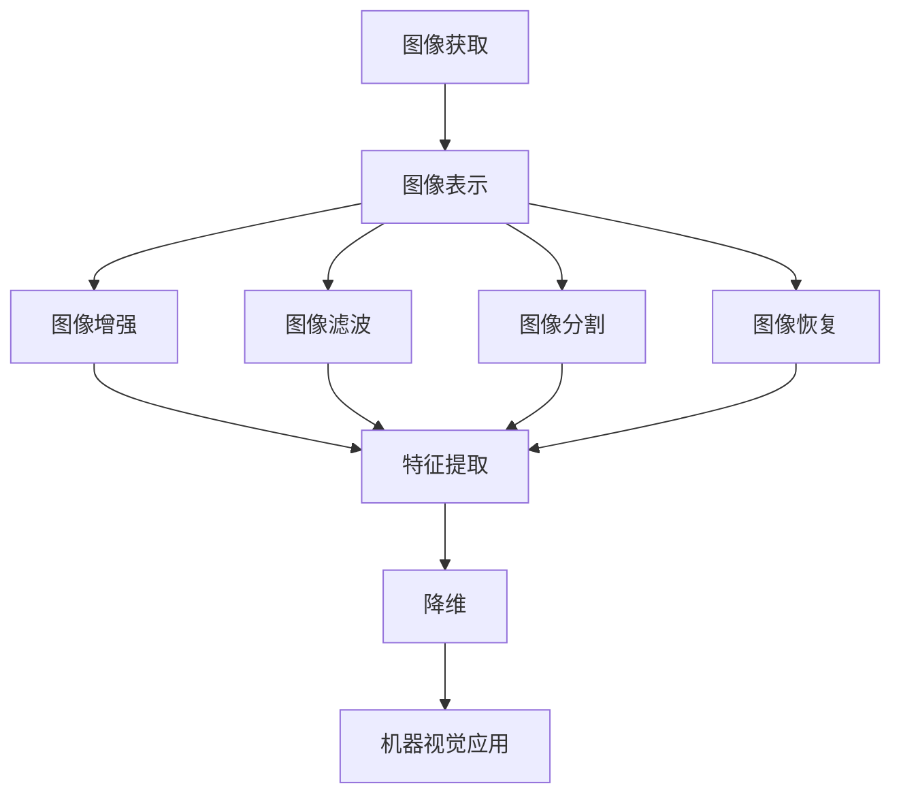
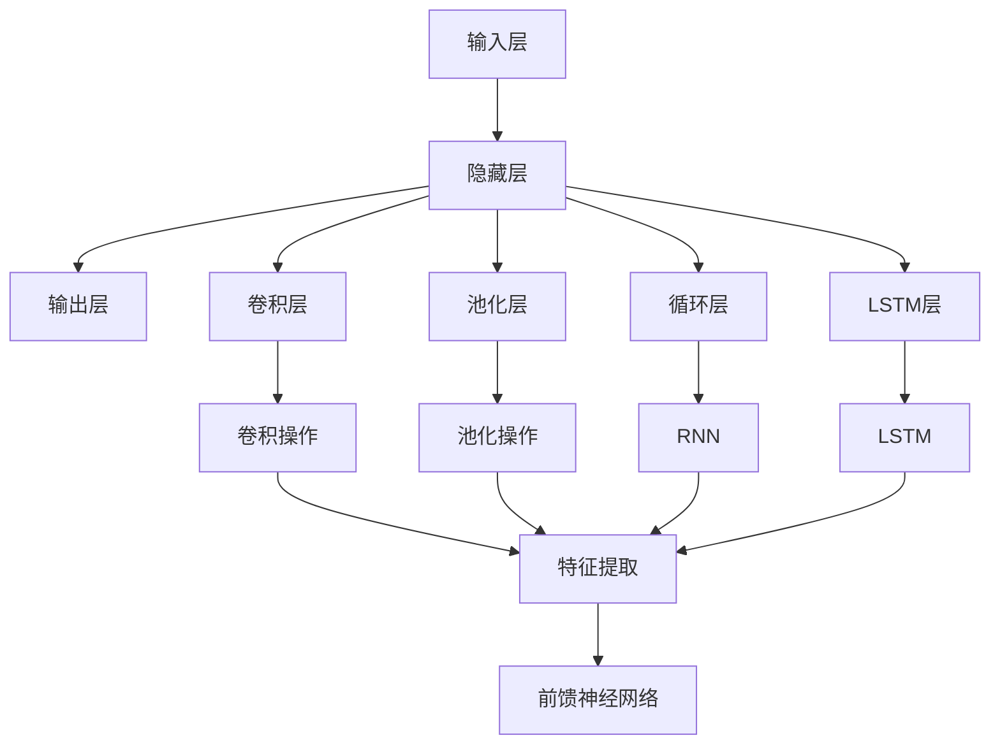
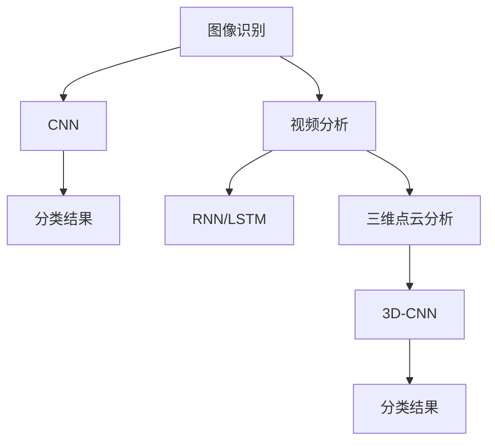

                 

# 文章标题：《一切皆是映射：机器视觉与神经网络的结合应用》

> 关键词：机器视觉，神经网络，深度学习，图像识别，项目实战

> 摘要：本文详细探讨了机器视觉与神经网络的结合应用，从基础概念到实际项目，深入剖析了这一领域的关键技术，为读者提供了全面的学习路径和实践指南。

## 《一切皆是映射：机器视觉与神经网络的结合应用》目录大纲

### 第一部分：引言与基础

#### 第1章：机器视觉与神经网络的融合背景

1.1 机器视觉的发展历程  
1.2 机器视觉的应用场景  
1.3 神经网络在机器视觉中的重要性  
1.4 书籍概述与结构安排

### 第二部分：核心概念与联系

#### 第2章：机器视觉基本原理

2.1 机器视觉的基础知识  
2.2 图像处理的基本算法  
2.3 特征提取与降维  
2.4 Mermaid流程图：机器视觉核心概念联系

#### 第3章：神经网络基础

3.1 神经网络的基本结构  
3.2 前馈神经网络  
3.3 卷积神经网络（CNN）  
3.4 循环神经网络（RNN）与长短时记忆网络（LSTM）  
3.5 Mermaid流程图：神经网络核心概念联系

#### 第4章：机器视觉与神经网络的结合

4.1 CNN在图像识别中的应用  
4.2 RNN与LSTM在视频分析中的应用  
4.3 神经网络在三维视觉中的应用  
4.4 Mermaid流程图：机器视觉与神经网络结合应用

### 第三部分：核心算法原理讲解

#### 第5章：深度学习算法在机器视觉中的应用

5.1 深度学习基础  
5.2 卷积神经网络（CNN）算法原理与伪代码  
5.3 循环神经网络（RNN）与长短时记忆网络（LSTM）算法原理与伪代码  
5.4 生成对抗网络（GAN）在图像生成中的应用  
5.5 强化学习在目标追踪中的应用

#### 第6章：图像识别与分类

6.1 图像识别的基本方法  
6.2 支持向量机（SVM）算法原理与伪代码  
6.3 决策树与随机森林算法原理与伪代码  
6.4 K最近邻（K-NN）算法原理与伪代码  
6.5 神经网络在图像分类中的应用

### 第四部分：数学模型与公式讲解

#### 第7章：机器视觉中的数学模型

7.1 矩阵与线性代数基础  
7.2 神经元激活函数与损失函数  
7.3 优化算法与梯度下降  
7.4 主成分分析（PCA）与特征降维  
7.5 LaTeX格式数学公式示例

### 第五部分：项目实战

#### 第8章：机器视觉与神经网络项目实战

8.1 实战一：人脸识别系统  
   - 环境搭建  
   - 数据预处理  
   - 神经网络模型设计  
   - 模型训练与优化  
   - 模型部署与测试  
   - 代码解读与分析

8.2 实战二：自动驾驶系统  
   - 环境搭建  
   - 数据采集与预处理  
   - 神经网络模型设计  
   - 模型训练与优化  
   - 模型部署与测试  
   - 代码解读与分析

### 第六部分：拓展与展望

#### 第9章：机器视觉与神经网络的未来发展趋势

9.1 机器视觉技术的发展趋势  
9.2 神经网络在机器视觉中的应用前景  
9.3 未来可能的应用领域  
9.4 面临的挑战与机遇

### 附录

#### 附录A：常用工具与资源

- 机器视觉开源工具与框架  
- 神经网络编程语言与库  
- 数据集与资源链接  
- 社交媒体与论坛推荐

以上是《一切皆是映射：机器视觉与神经网络的结合应用》的目录大纲，涵盖了机器视觉与神经网络的基础知识、核心算法、数学模型、项目实战以及未来发展趋势等内容。希望通过这本书，读者能够全面了解机器视觉与神经网络的结合应用，掌握相关技术，并在实际项目中得以应用。

## 第一部分：引言与基础

### 第1章：机器视觉与神经网络的融合背景

在当今的科技发展中，机器视觉和神经网络的融合已经成为人工智能领域的一个重要研究方向。这种融合不仅推动了计算机视觉技术的快速发展，也带来了许多前所未有的应用场景。在本章中，我们将回顾机器视觉的发展历程，探讨其应用场景，并深入分析神经网络在机器视觉中的重要性。

#### 1.1 机器视觉的发展历程

机器视觉是指通过计算机对图像或视频进行处理、分析和理解的技术。它起源于20世纪60年代的工业自动化领域，主要用于检测和分类生产线上的产品。随着计算机技术和图像处理算法的进步，机器视觉逐渐扩展到了医疗、农业、安全监控等多个领域。

早期的机器视觉主要依赖于规则基方法，如边缘检测、形态学处理等。这些方法虽然能够实现特定的功能，但在处理复杂场景时效果不佳。随着深度学习的兴起，基于神经网络的机器视觉技术逐渐成为主流。

#### 1.2 机器视觉的应用场景

机器视觉的应用场景非常广泛，主要包括以下几个方面：

1. 工业自动化：在制造业中，机器视觉可以用于产品的检测、分类、缺陷识别和质量控制等。
2. 医疗诊断：在医疗领域，机器视觉可以用于疾病的辅助诊断、手术导航和健康监测等。
3. 智能交通：在交通领域，机器视觉可以用于车辆检测、行人识别、交通流量分析等。
4. 农业监测：在农业领域，机器视觉可以用于植物生长状态监测、病虫害识别和产量预测等。
5. 安防监控：在安防领域，机器视觉可以用于人脸识别、行为分析、异常检测等。

#### 1.3 神经网络在机器视觉中的重要性

神经网络，尤其是深度学习，已经成为机器视觉领域的核心技术。神经网络通过模仿人脑的神经元连接方式，可以自动学习输入数据的特征，从而实现图像的识别、分类和生成。

与传统的机器视觉方法相比，神经网络具有以下优势：

1. **自动特征提取**：神经网络可以自动学习图像中的高层次特征，无需人工设计特征提取算法。
2. **处理复杂场景**：神经网络可以处理复杂的图像场景，如遮挡、光照变化等。
3. **高精度和泛化能力**：神经网络在图像识别和分类任务中达到了很高的精度，并且具有良好的泛化能力。

#### 1.4 书籍概述与结构安排

本书旨在系统地介绍机器视觉与神经网络的结合应用。全书分为六个部分：

1. **引言与基础**：介绍机器视觉和神经网络的基本概念及其融合背景。
2. **核心概念与联系**：详细讲解机器视觉和神经网络的核心概念，并展示其之间的联系。
3. **核心算法原理讲解**：深入解析深度学习算法在机器视觉中的应用，包括卷积神经网络（CNN）、循环神经网络（RNN）等。
4. **数学模型与公式讲解**：介绍机器视觉中的数学模型，如矩阵与线性代数、激活函数与损失函数等。
5. **项目实战**：通过实际项目，演示如何搭建环境、预处理数据、设计模型、训练和测试模型。
6. **拓展与展望**：探讨机器视觉与神经网络在未来可能的应用领域和面临的挑战。

通过本书的学习，读者将能够全面了解机器视觉与神经网络的结合应用，掌握相关技术，并在实际项目中得以应用。

### 第2章：机器视觉基本原理

机器视觉是指通过计算机对图像或视频进行处理、分析和理解的技术。它是人工智能领域的一个重要分支，涉及多个学科，包括图像处理、计算机视觉、模式识别和机器学习等。在这一章中，我们将详细探讨机器视觉的基本原理，包括基础知识、图像处理的基本算法、特征提取与降维，并使用Mermaid流程图展示核心概念之间的联系。

#### 2.1 机器视觉的基础知识

机器视觉的基础知识主要包括图像的获取、图像的表示和图像的基本操作。

1. **图像的获取**：图像可以通过摄像头、扫描仪等设备获取。获取的图像通常是二维的，但在机器视觉中，三维图像也非常重要。
2. **图像的表示**：图像可以用像素值矩阵表示，每个像素值代表图像在某个位置的颜色或亮度。常用的图像格式有JPEG、PNG和BMP等。
3. **图像的基本操作**：包括图像的缩放、旋转、翻转、滤波等。这些操作是图像处理和分析的基础。

#### 2.2 图像处理的基本算法

图像处理是机器视觉的重要环节，它包括图像增强、图像滤波、图像分割和图像恢复等。

1. **图像增强**：通过调整图像的对比度和亮度，使得图像中的目标更加清晰。常用的图像增强算法有直方图均衡化和自适应直方图均衡化等。
2. **图像滤波**：用于去除图像中的噪声，提高图像的质量。常用的滤波算法有均值滤波、高斯滤波和中值滤波等。
3. **图像分割**：将图像分为不同的区域，每个区域代表图像中的不同目标。常用的图像分割算法有阈值分割、区域生长和边缘检测等。
4. **图像恢复**：用于恢复图像中的细节，减少图像的失真。常用的图像恢复算法有去模糊和图像超分辨率等。

#### 2.3 特征提取与降维

特征提取是机器视觉中的关键步骤，它从图像中提取出对目标识别有用的信息。降维则是通过减少数据的维度，降低计算复杂度。

1. **特征提取**：常用的特征提取方法有颜色特征、纹理特征和形状特征等。颜色特征包括颜色直方图和颜色矩；纹理特征包括纹理能量和纹理方向；形状特征包括边缘方向和区域生长。
2. **降维**：降维技术如主成分分析（PCA）和小波变换等，用于减少数据维度，提高计算效率。

#### 2.4 Mermaid流程图：机器视觉核心概念联系

为了更好地理解机器视觉的核心概念及其之间的联系，我们可以使用Mermaid流程图进行展示。



在上述Mermaid流程图中，我们展示了从图像获取到机器视觉应用的整个流程，并标明了各个步骤之间的关系。

通过本章的讲解，我们了解了机器视觉的基本原理和核心算法，为后续章节的深入学习打下了坚实的基础。

### 第3章：神经网络基础

神经网络是一种模仿人脑结构和功能的计算模型，它在机器学习和人工智能领域具有广泛的应用。神经网络由大量的神经元（也称为节点）组成，这些神经元通过连接（称为边）相互通信。在本章中，我们将详细讲解神经网络的基本结构，包括前馈神经网络、卷积神经网络（CNN）、循环神经网络（RNN）和长短时记忆网络（LSTM），并使用Mermaid流程图展示这些核心概念之间的联系。

#### 3.1 神经网络的基本结构

一个基本的神经网络由以下几个部分组成：

1. **输入层**：接收外部输入信息。
2. **隐藏层**：负责对输入信息进行加工和处理。
3. **输出层**：输出最终的决策或预测结果。

每个层由多个神经元组成，神经元之间通过连接进行信息传递。每个连接都有一定的权重，这些权重决定了信息传递的强度。

1. **神经元**：一个简单的神经元可以看作是一个线性变换加上一个非线性激活函数。其数学表达式为：\( z = \sum_{i} w_{i} x_{i} + b \)，其中\( z \)是输出，\( w_{i} \)是权重，\( x_{i} \)是输入，\( b \)是偏置。
2. **激活函数**：常用的激活函数包括 sigmoid、ReLU 和 tanh，这些函数能够引入非线性特性，使神经网络具备分类和回归的能力。

#### 3.2 前馈神经网络

前馈神经网络（Feedforward Neural Network，FNN）是一种最基本的神经网络结构，其信息传递方向是单向的，从输入层经过隐藏层直达输出层。

1. **工作原理**：前馈神经网络中的信息从输入层流向隐藏层，再从隐藏层流向输出层。每个神经元的输出直接传递到下一层的神经元。
2. **训练方法**：前馈神经网络通常使用反向传播算法（Backpropagation）进行训练。反向传播算法通过计算误差梯度，调整网络的权重和偏置，使网络输出更接近目标值。
3. **例子**：一个简单的线性回归模型可以看作是一个前馈神经网络，其输入层和输出层之间只有一层隐藏层。

#### 3.3 卷积神经网络（CNN）

卷积神经网络（Convolutional Neural Network，CNN）是专门为处理图像数据而设计的神经网络。CNN 通过卷积操作和池化操作提取图像中的空间特征。

1. **卷积操作**：卷积层通过滑动滤波器（卷积核）在输入图像上进行卷积操作，从而提取图像的特征。卷积操作可以减少参数的数量，提高模型的泛化能力。
2. **池化操作**：池化层用于降低图像的空间分辨率，减少计算量。常用的池化操作包括最大池化和平均池化。
3. **工作原理**：CNN 的信息传递路径是前馈的，卷积层和池化层交替出现，每个卷积层都会增加网络的深度和特征表示的复杂度。

#### 3.4 循环神经网络（RNN）与长短时记忆网络（LSTM）

循环神经网络（Recurrent Neural Network，RNN）是一种专门用于处理序列数据的神经网络。RNN 通过在网络中引入循环结构，使其能够记住之前的信息。

1. **工作原理**：RNN 中的神经元按照序列的顺序依次更新，每个时间步的输出都依赖于之前的输出。RNN 的状态由一个隐藏状态表示，这个状态可以记忆之前的信息。
2. **缺点**：传统的 RNN 存在梯度消失和梯度爆炸的问题，这使得它在长序列上的表现不佳。
3. **长短时记忆网络（LSTM）**：LSTM 是 RNN 的一种改进，它通过引入记忆单元和门结构，有效地解决了梯度消失问题。LSTM 的记忆单元可以长时间记忆序列中的信息，并且能够根据需要读取或遗忘这些信息。

#### 3.5 Mermaid流程图：神经网络核心概念联系

为了更好地理解神经网络的核心概念及其之间的联系，我们可以使用Mermaid流程图进行展示。



在上述Mermaid流程图中，我们展示了神经网络的基本结构及其各个部分之间的联系。从输入层开始，信息通过隐藏层传递到输出层，同时也可以通过卷积层、池化层、循环层和LSTM层进行特征提取和处理。

通过本章的讲解，我们了解了神经网络的基本结构和工作原理，为后续章节的深入学习打下了坚实的基础。

### 第4章：机器视觉与神经网络的结合

机器视觉与神经网络的结合在计算机视觉领域取得了显著的成果，使得许多复杂任务得以高效完成。在本章中，我们将探讨卷积神经网络（CNN）、循环神经网络（RNN）和长短时记忆网络（LSTM）在机器视觉中的具体应用，并使用Mermaid流程图展示这些技术的应用场景。

#### 4.1 CNN在图像识别中的应用

卷积神经网络（CNN）是机器视觉中应用最广泛的深度学习模型之一。它通过卷积操作和池化操作，能够自动提取图像中的空间特征。

1. **图像识别**：CNN 可以用于图像的分类任务，如图片标签识别、人脸识别等。它通过多层卷积和池化层，将图像分解为不同的特征层次，最终实现高精度的分类。

   - **工作原理**：输入图像通过卷积层提取特征，每个卷积层都会增加特征的复杂度和深度。最后，通过全连接层进行分类。

   - **例子**：一个简单的CNN模型可以用于猫狗识别任务，输入一张图片，输出“猫”或“狗”的标签。

   ```mermaid
   graph TD
       A[输入图像] --> B[卷积层1]
       B --> C[池化层1]
       C --> D[卷积层2]
       D --> E[池化层2]
       E --> F[卷积层3]
       F --> G[池化层3]
       G --> H[全连接层]
       H --> I[输出]
   ```

2. **应用场景**：CNN 在医疗影像分析、自动驾驶、安防监控等领域有广泛的应用。例如，在医疗影像中，CNN 可以用于癌症检测和病变识别；在自动驾驶中，CNN 可以用于车辆和行人检测。

#### 4.2 RNN与LSTM在视频分析中的应用

循环神经网络（RNN）和长短时记忆网络（LSTM）在处理序列数据，如视频时，具有显著的优势。它们能够捕捉视频中的时间依赖性，从而实现视频分类、目标追踪和情感分析等任务。

1. **视频分类**：RNN 和 LSTM 可以将连续的视频帧作为输入，通过学习视频中的时间依赖特征，实现视频的分类。

   - **工作原理**：输入的视频帧通过 RNN 或 LSTM 层进行处理，每个时间步的输出都依赖于之前的输出。最终，通过全连接层进行分类。

   - **例子**：一个简单的RNN模型可以用于电影分类，输入一段电影视频，输出“喜剧”、“动作”等标签。

   ```mermaid
   graph TD
       A[输入视频帧] --> B[RNN/LSTM层]
       B --> C[全连接层]
       C --> D[输出]
   ```

2. **应用场景**：RNN 和 LSTM 在视频监控、运动捕捉、视频生成等领域有广泛的应用。例如，在视频监控中，RNN 和 LSTM 可以用于异常行为检测；在运动捕捉中，它们可以用于动作识别。

#### 4.3 神经网络在三维视觉中的应用

三维视觉是一种通过处理三维数据，如点云，实现对三维场景的理解和重建的技术。神经网络在三维视觉中也有广泛的应用。

1. **三维点云分类**：通过卷积神经网络（3D-CNN）对三维点云进行分类，可以识别点云中的不同对象。

   - **工作原理**：输入的三维点云通过3D-CNN层进行特征提取，每个卷积层都会增加特征的复杂度和深度。最终，通过全连接层进行分类。

   - **例子**：一个简单的3D-CNN模型可以用于机器人导航，输入点云数据，输出“道路”、“障碍物”等标签。

   ```mermaid
   graph TD
       A[输入三维点云] --> B[3D卷积层1]
       B --> C[3D池化层1]
       C --> D[3D卷积层2]
       D --> E[3D池化层2]
       E --> F[3D全连接层]
       F --> G[输出]
   ```

2. **应用场景**：三维视觉在机器人导航、三维重建、虚拟现实等领域有广泛的应用。例如，在机器人导航中，三维视觉可以用于环境感知和路径规划。

#### 4.4 Mermaid流程图：机器视觉与神经网络结合应用

为了更好地理解机器视觉与神经网络的结合应用，我们可以使用Mermaid流程图进行展示。



在上述Mermaid流程图中，我们展示了CNN、RNN/LSTM和3D-CNN在图像识别、视频分析和三维点云分析中的应用。通过这些技术，机器视觉能够处理不同类型的输入数据，实现从二维到三维、从静态到动态的全面分析。

通过本章的讲解，我们了解了机器视觉与神经网络的结合应用，为后续章节的深入学习打下了坚实的基础。

### 第5章：深度学习算法在机器视觉中的应用

深度学习算法在机器视觉中发挥着重要作用，通过学习大量的数据，深度学习模型能够自动提取图像中的高级特征，实现复杂的图像识别和分类任务。在本章中，我们将详细介绍几种深度学习算法在机器视觉中的应用，包括卷积神经网络（CNN）、循环神经网络（RNN）与长短时记忆网络（LSTM）、生成对抗网络（GAN）以及强化学习在目标追踪中的应用。

#### 5.1 深度学习基础

深度学习是一种机器学习的方法，通过多层神经网络对数据进行建模。它的核心思想是通过网络层与层之间的逐层抽象，将原始数据转换为高层次的特征表示。

1. **神经网络架构**：深度学习模型通常由多个层次组成，包括输入层、隐藏层和输出层。每个层由多个神经元组成，神经元之间通过加权连接进行信息传递。

2. **激活函数**：激活函数为神经网络引入了非线性特性，常见的激活函数有ReLU（Rectified Linear Unit）、Sigmoid和Tanh。

3. **反向传播算法**：反向传播算法是一种用于训练神经网络的优化方法。它通过计算损失函数关于网络参数的梯度，不断调整网络参数，使网络输出更接近目标值。

#### 5.2 卷积神经网络（CNN）算法原理与伪代码

卷积神经网络（CNN）是一种专门为处理图像数据而设计的深度学习模型。它通过卷积操作和池化操作，能够有效地提取图像中的空间特征。

1. **卷积操作**：卷积层通过卷积核在图像上滑动，提取局部特征。卷积操作的伪代码如下：

```python
def conv2d(input_image, filter, stride, padding):
    output_height = (input_height - filter_size + 2 * padding) / stride + 1
    output_width = (input_width - filter_size + 2 * padding) / stride + 1
    output = zeros((output_height, output_width))
    
    for i in range(output_height):
        for j in range(output_width):
            region = input_image[i * stride:i * stride + filter_size, j * stride:j * stride + filter_size]
            output[i, j] = sum(region * filter) + bias
            
    return output
```

2. **池化操作**：池化层用于降低图像的空间分辨率，减少计算量。常见的池化操作包括最大池化和平均池化。最大池化的伪代码如下：

```python
def max_pooling(input_image, pool_size, stride):
    output_height = (input_height - pool_size) / stride + 1
    output_width = (input_width - pool_size) / stride + 1
    output = zeros((output_height, output_width))
    
    for i in range(output_height):
        for j in range(output_width):
            region = input_image[i * stride:i * stride + pool_size, j * stride:j * stride + pool_size]
            output[i, j] = max(region)
            
    return output
```

3. **CNN模型训练**：CNN模型的训练过程包括前向传播和反向传播。在前向传播中，输入图像通过卷积层、池化层和全连接层，生成预测结果。在反向传播中，计算损失函数关于网络参数的梯度，并使用梯度下降算法更新参数。

```python
def forward_pass(input_image, model):
    # 前向传播过程
    conv1_output = conv2d(input_image, model['conv1_filter'], model['conv1_stride'], model['conv1_padding'])
    pool1_output = max_pooling(conv1_output, model['pool1_size'], model['pool1_stride'])
    # ... 重复卷积和池化操作
    fc_output = softmax(model['fc_layer'](poolN_output))
    
    return fc_output

def backward_pass(loss, model, learning_rate):
    # 反向传播过程
    d_loss = loss derivative with respect to output
    d_output = d_loss * (model['fc_layer'].activation_derivative(fc_output))
    d_poolN_output = d_output * (model['poolN_layer'].activation_derivative(poolN_output))
    # ... 逆向计算卷积层和池化层的梯度
    d_input = d_pool1_output * (model['pool1_layer'].activation_derivative(pool1_output))
    
    # 更新参数
    model['conv1_filter'] -= learning_rate * d_filter
    model['conv1_bias'] -= learning_rate * d_bias
    # ... 更新其他层参数
    
    return d_input
```

#### 5.3 RNN与LSTM算法原理与伪代码

循环神经网络（RNN）和长短时记忆网络（LSTM）是处理序列数据的有效模型，特别适用于视频分析和时间序列预测。

1. **RNN算法原理**：RNN的基本单元是循环单元，它能够通过递归结构记住之前的信息。RNN的伪代码如下：

```python
def RNN(input_sequence, hidden_state, model):
    hidden_states = []
    
    for input_t in input_sequence:
        # 前向传播
        hidden_state = activationFunction(dot(model['weights'], [input_t, hidden_state]) + model['bias'])
        hidden_states.append(hidden_state)
        
    return hidden_states[-1]
```

2. **LSTM算法原理**：LSTM是RNN的一种改进，它通过引入记忆单元和门结构，能够更好地记忆序列中的信息。LSTM的伪代码如下：

```python
def LSTM(input_sequence, hidden_state, cell_state, model):
    hidden_states = []
    cell_states = []
    
    for input_t in input_sequence:
        # 前向传播
        input_gate = sigmoid(dot(model['input_gate_weights'], [input_t, hidden_state]) + model['input_gate_bias'])
        forget_gate = sigmoid(dot(model['forget_gate_weights'], [input_t, hidden_state]) + model['forget_gate_bias'])
        output_gate = sigmoid(dot(model['output_gate_weights'], [input_t, hidden_state]) + model['output_gate_bias'])
        input_tilde = tanh(dot(model['input_tilde_weights'], [input_t, hidden_state]) + model['input_tilde_bias'])
        
        cell_state = forget_gate * cell_state + input_gate * input_tilde
        hidden_state = output_gate * tanh(cell_state)
        
        hidden_states.append(hidden_state)
        cell_states.append(cell_state)
        
    return hidden_states[-1], cell_states[-1]
```

#### 5.4 生成对抗网络（GAN）在图像生成中的应用

生成对抗网络（GAN）是由生成器和判别器组成的一种深度学习模型，通过两个网络的对抗训练，生成逼真的图像。

1. **GAN算法原理**：生成器生成图像，判别器判断图像的真实性。生成器和判别器的伪代码如下：

```python
# 生成器
def generator(z, model):
    hidden = activationFunction(dot(model['generator_weights'], z) + model['generator_bias'])
    output = tanh(dot(model['generator_output_weights'], hidden) + model['generator_output_bias'])
    return output

# 判别器
def discriminator(x, model):
    hidden = activationFunction(dot(model['discriminator_weights'], x) + model['discriminator_bias'])
    output = sigmoid(dot(model['discriminator_output_weights'], hidden) + model['discriminator_output_bias'])
    return output
```

2. **GAN训练过程**：GAN的训练过程分为两个阶段，生成器和判别器的迭代更新。在生成阶段，生成器生成图像，判别器判断图像的真实性；在判别阶段，生成器和判别器同时更新参数。

```python
# GAN训练
for epoch in range(num_epochs):
    for batch in data_loader:
        # 生成阶段
        z = sample_noise(batch_size, noise_dimension)
        generated_images = generator(z, generator_model)
        
        # 判别阶段
        real_labels = ones((batch_size, 1))
        fake_labels = zeros((batch_size, 1))
        
        d_loss_real = -mean(log(discriminator(x, discriminator_model)))
        d_loss_fake = -mean(log(1 - discriminator(generated_images, discriminator_model)))
        d_loss = 0.5 * (d_loss_real + d_loss_fake)
        
        g_loss = -mean(log(discriminator(generated_images, discriminator_model)))
        
        # 更新判别器参数
        d_optimizer.zero_grad()
        d_loss.backward()
        d_optimizer.step()
        
        # 更新生成器参数
        g_optimizer.zero_grad()
        g_loss.backward()
        g_optimizer.step()
```

#### 5.5 强化学习在目标追踪中的应用

强化学习是一种通过与环境交互来学习最优策略的机器学习方法。在目标追踪任务中，强化学习可以用于学习目标在连续空间中的运动轨迹。

1. **强化学习算法原理**：强化学习通过最大化累计奖励来实现目标。其基本原理是，智能体在环境中采取动作，根据动作的结果获得奖励，然后更新策略。

```python
# 强化学习目标追踪
class QLearningAgent:
    def __init__(self, action_space, reward_decay, learning_rate, e_greedy):
        self.action_space = action_space
        self.reward_decay = reward_decay
        self.learning_rate = learning_rate
        self.e_greedy = e_greedy
        self.q_table = self.initialize_q_table()

    def initialize_q_table(self):
        return np.zeros((self.action_space, self.state_space))

    def choose_action(self, state):
        if random() < self.e_greedy:
            action = random.choice(self.action_space)
        else:
            action = np.argmax(self.q_table[state])
        return action

    def learn(self, state, action, reward, next_state, action_next):
        q_predict = self.q_table[state + action]
        if next_state != -1:
            q_target = reward + self.reward_decay * np.max(self.q_table[next_state + action_next])
        else:
            q_target = reward
        self.q_table[state + action] += self.learning_rate * (q_target - q_predict)
```

通过本章的讲解，我们了解了深度学习算法在机器视觉中的具体应用，包括CNN、RNN、LSTM、GAN和强化学习等。这些算法为机器视觉任务提供了强大的工具，使得复杂的图像识别、分类、生成和目标追踪等任务得以高效实现。

### 第6章：图像识别与分类

图像识别与分类是机器视觉中的核心任务，广泛应用于各种领域，如医学影像分析、自动驾驶和安防监控等。在这一章中，我们将详细探讨图像识别的基本方法，以及常用的机器学习算法，包括支持向量机（SVM）、决策树与随机森林、K最近邻（K-NN）等。此外，我们还将介绍神经网络在图像分类中的应用。

#### 6.1 图像识别的基本方法

图像识别的基本方法主要包括特征提取、特征选择和分类器设计。这些方法共同作用，将图像映射到相应的类别。

1. **特征提取**：特征提取是将图像转换为适合分类的向量表示的过程。常用的特征提取方法有：
   - **颜色特征**：使用颜色直方图、颜色矩等表示图像的颜色信息。
   - **纹理特征**：使用纹理能量、纹理方向等表示图像的纹理信息。
   - **形状特征**：使用边缘方向、区域生长等表示图像的形状信息。

2. **特征选择**：特征选择是选择对分类任务最有效的特征的过程。常用的特征选择方法有：
   - **基于距离的特征选择**：选择与目标类别距离最近的特征。
   - **基于权重的特征选择**：使用权重来衡量特征的重要性，选择权重较高的特征。

3. **分类器设计**：分类器设计是将特征向量映射到相应类别的过程。常用的分类器有：
   - **线性分类器**：如线性回归、支持向量机（SVM）。
   - **树型分类器**：如决策树、随机森林。
   - **基于实例的分类器**：如K最近邻（K-NN）。

#### 6.2 支持向量机（SVM）算法原理与伪代码

支持向量机（Support Vector Machine，SVM）是一种强大的分类算法，它通过找到一个最佳的超平面，将不同类别的数据点分隔开来。

1. **SVM算法原理**：
   - **线性SVM**：在二维空间中，线性SVM找到一个最佳的超平面，使得正负样本的间隔最大化。在三维空间中，线性SVM找到一个最佳的超平面，使得正负样本的间隔最大化。
   - **非线性SVM**：通过核函数将数据映射到高维空间，在高维空间中找到一个最佳的超平面。

2. **SVM算法伪代码**：
```python
# 线性SVM
def linear_SVM(train_data, train_labels, C):
    # 求解优化问题
    P = np.dot(train_data, train_data.T)
    y = np.array(train_labels).reshape(-1, 1)
    Q = P - np.eye(len(train_data)) * C
    
    # 求解二次规划问题
    w = solve_quadratic_program(Q, -y, None, None, None)
    
    return w

# 非线性SVM
def nonlinear_SVM(train_data, train_labels, C, kernel_function):
    # 使用核函数将数据映射到高维空间
    mapped_data = [kernel_function(train_data[i], train_data[j]) for i in range(len(train_data)) for j in range(len(train_data))]
    mapped_data = np.array(mapped_data).reshape(-1, len(train_data))
    
    # 线性SVM在高维空间中求解
    w = linear_SVM(mapped_data, train_labels, C)
    
    return w
```

#### 6.3 决策树与随机森林算法原理与伪代码

决策树（Decision Tree）是一种简单而有效的分类算法，它通过一系列的判断节点，将数据集分割成不同的子集，直到达到终止条件。

1. **决策树算法原理**：
   - **分类树**：决策树的每个节点代表一个特征，每个分支代表一个特征值。
   - **终止条件**：当数据集的纯度达到阈值或数据集的大小小于阈值时，终止分裂。

2. **随机森林（Random Forest）算法原理**：
   - **集成学习**：随机森林由多个决策树组成，每个决策树对分类结果进行投票，最终结果为多数投票的结果。
   - **随机特征选择**：在构建每个决策树时，从特征集合中随机选择一部分特征进行分裂。

3. **决策树与随机森林伪代码**：
```python
# 决策树分类
def build_decision_tree(data, labels, feature_set):
    # 终止条件
    if len(set(labels)) == 1 or len(data) <= threshold:
        return majority_vote(labels)
    
    # 选择最优特征
    best_split = select_best_split(data, labels, feature_set)
    
    # 构建子树
    left_tree = build_decision_tree(data[best_split[0]], labels[best_split[1]], feature_set - {best_split[0]})
    right_tree = build_decision_tree(data[~best_split[0]], labels[~best_split[1]], feature_set - {best_split[0]})
    
    return TreeNode(best_split, left_tree, right_tree)

# 随机森林分类
def random_forest(data, labels, num_trees, max_depth, feature_set):
    forests = []
    
    for _ in range(num_trees):
        # 随机选择特征子集
        sample_features = random.sample(feature_set, int(len(feature_set) * (1 - max_depth)))
        
        # 构建决策树
        tree = build_decision_tree(data, labels, sample_features)
        
        forests.append(tree)
    
    return majority_vote([tree.predict(data) for tree in forests])
```

#### 6.4 K最近邻（K-NN）算法原理与伪代码

K最近邻（K-Nearest Neighbors，K-NN）是一种基于实例的简单分类算法，它通过计算测试样本与训练样本之间的距离，找到最近的K个邻居，并根据邻居的类别进行投票。

1. **K-NN算法原理**：
   - **距离计算**：使用欧氏距离、曼哈顿距离或余弦相似度等计算测试样本与训练样本之间的距离。
   - **投票机制**：找到最近的K个邻居后，根据邻居的类别进行投票，选择出现次数最多的类别作为预测结果。

2. **K-NN算法伪代码**：
```python
# K-NN分类
def k_nearest_neighbors(train_data, train_labels, test_data, k, distance_function):
    predictions = []
    
    for test_sample in test_data:
        distances = []
        
        for train_sample in train_data:
            distance = distance_function(test_sample, train_sample)
            distances.append(distance)
        
        # 排序并选取最近的K个邻居
        k_nearest = sorted(distances, key=lambda x: x[1])[:k]
        
        # 计算邻居的类别
        neighbor_labels = [train_labels[index] for index, _ in k_nearest]
        
        # 投票得到预测结果
        prediction = majority_vote(neighbor_labels)
        
        predictions.append(prediction)
    
    return predictions
```

#### 6.5 神经网络在图像分类中的应用

神经网络，特别是卷积神经网络（CNN），在图像分类任务中表现卓越。CNN通过多层卷积和池化操作，能够自动提取图像中的高级特征，从而实现高精度的分类。

1. **CNN结构**：
   - **卷积层**：卷积层通过卷积操作提取图像的局部特征。
   - **池化层**：池化层通过下采样操作降低图像的空间分辨率。
   - **全连接层**：全连接层将卷积层和池化层提取的特征映射到相应的类别。

2. **CNN分类过程**：
   - **前向传播**：输入图像通过卷积层和池化层，生成特征图。特征图通过全连接层，生成类别概率。
   - **损失函数**：常用的损失函数有交叉熵损失和均方误差损失，用于衡量预测结果与真实结果之间的差距。
   - **反向传播**：通过计算损失函数关于网络参数的梯度，使用梯度下降算法更新网络参数。

3. **CNN分类伪代码**：
```python
# CNN分类
def cnn_classification(input_image, model):
    # 前向传播
    conv1_output = conv2d(input_image, model['conv1_filter'], model['conv1_stride'], model['conv1_padding'])
    pool1_output = max_pooling(conv1_output, model['pool1_size'], model['pool1_stride'])
    # ... 重复卷积和池化操作
    fc_output = model['fc_layer'](poolN_output)
    predicted_probabilities = softmax(fc_output)
    
    # 获取预测结果
    predicted_label = argmax(predicted_probabilities)
    
    return predicted_label
```

通过本章的讲解，我们了解了图像识别与分类的基本方法，以及常用的机器学习算法。这些方法为图像分类任务提供了有效的解决方案，并在实际应用中取得了显著的效果。

### 第7章：机器视觉中的数学模型

在机器视觉领域，数学模型扮演着至关重要的角色。这些模型不仅为图像处理和分析提供了理论基础，还帮助我们在实际应用中实现各种复杂的视觉任务。在本章中，我们将深入探讨机器视觉中的一些关键数学模型，包括矩阵与线性代数基础、神经元激活函数与损失函数、优化算法与梯度下降、主成分分析（PCA）与特征降维，以及LaTeX格式数学公式示例。

#### 7.1 矩阵与线性代数基础

矩阵和线性代数是机器视觉中的基本工具，用于表示和处理图像数据。以下是一些关键的矩阵和线性代数概念：

1. **矩阵乘法**：两个矩阵相乘得到一个新的矩阵。其计算方法是将第一个矩阵的列与第二个矩阵的行进行点积。
2. **矩阵转置**：矩阵的转置是将矩阵的行和列交换。
3. **矩阵求逆**：如果一个矩阵是可逆的，那么它的逆矩阵可以通过解线性方程组得到。其计算方法为：
   $$
   A^{-1} = (A^T A)^{-1} A^T
   $$
4. **矩阵求导**：矩阵求导是一个线性操作，其导数是另一个矩阵。例如，对于一个矩阵\( A \)的函数\( f(A) \)，其导数\( df(A) \)可以通过计算\( f(A + \epsilon B) \)的极限得到，其中\( \epsilon \)是一个小量，\( B \)是一个矩阵。

以下是一个LaTeX格式的矩阵求导示例：
$$
\frac{d}{dA} \begin{bmatrix} a_{11} & a_{12} \\ a_{21} & a_{22} \end{bmatrix} = \begin{bmatrix} \frac{\partial}{\partial a_{11}} & \frac{\partial}{\partial a_{12}} \\ \frac{\partial}{\partial a_{21}} & \frac{\partial}{\partial a_{22}} \end{bmatrix}
$$

#### 7.2 神经元激活函数与损失函数

在神经网络中，激活函数和损失函数是两个核心组件。激活函数用于引入非线性特性，使神经网络能够处理复杂问题。常见的激活函数包括：

1. **Sigmoid函数**：
   $$
   f(x) = \frac{1}{1 + e^{-x}}
   $$
2. **ReLU函数**：
   $$
   f(x) = \max(0, x)
   $$
3. **Tanh函数**：
   $$
   f(x) = \frac{e^x - e^{-x}}{e^x + e^{-x}}
   $$

损失函数用于评估神经网络预测值与真实值之间的差距，常见的损失函数包括：

1. **均方误差（MSE）**：
   $$
   \text{MSE}(y, \hat{y}) = \frac{1}{2} \sum_{i=1}^{n} (y_i - \hat{y}_i)^2
   $$
2. **交叉熵损失**：
   $$
   \text{CrossEntropy}(y, \hat{y}) = -\sum_{i=1}^{n} y_i \log(\hat{y}_i)
   $$

以下是一个LaTeX格式的交叉熵损失示例：
$$
\text{CrossEntropy}(y, \hat{y}) = -\sum_{i=1}^{n} y_i \log(\hat{y}_i)
$$

#### 7.3 优化算法与梯度下降

优化算法是训练神经网络的基石。梯度下降是最常用的优化算法之一，其基本思想是通过计算损失函数关于网络参数的梯度，逐步调整参数，以最小化损失函数。

1. **梯度下降算法**：
   $$
   \theta_{t+1} = \theta_{t} - \alpha \nabla_\theta J(\theta)
   $$
   其中，\( \theta \)是网络参数，\( \alpha \)是学习率，\( J(\theta) \)是损失函数。

2. **批量梯度下降**：
   $$
   \theta_{t+1} = \theta_{t} - \alpha \frac{1}{m} \sum_{i=1}^{m} \nabla_\theta J(\theta)
   $$
   其中，\( m \)是训练样本的数量。

3. **随机梯度下降（SGD）**：
   $$
   \theta_{t+1} = \theta_{t} - \alpha \nabla_\theta J(\theta; x_t, y_t)
   $$
   其中，\( x_t \)和\( y_t \)是随机选取的训练样本。

以下是一个LaTeX格式的梯度下降示例：
$$
\theta_{t+1} = \theta_{t} - \alpha \nabla_\theta J(\theta)
$$

#### 7.4 主成分分析（PCA）与特征降维

主成分分析（PCA）是一种常用的特征降维方法，它通过将数据投影到新的正交坐标系中，保留主要的信息，从而降低数据的维度。

1. **PCA算法**：
   - **数据标准化**：将数据缩放到单位方差。
   - **协方差矩阵计算**：
     $$
     S = \frac{1}{m} XX^T
     $$
   - **特征值与特征向量计算**：计算协方差矩阵的特征值和特征向量。
   - **特征向量排序**：将特征向量按特征值从大到小排序。
   - **数据投影**：将数据投影到前k个特征向量上，实现降维。

2. **降维效果**：
   - **信息保留**：通过保留主要特征，PCA能够减少数据维度，同时保持较高的信息保留率。

以下是一个LaTeX格式的PCA降维示例：
$$
x_{\text{new}} = P^T X
$$
其中，\( P \)是前k个特征向量的矩阵，\( X \)是原始数据矩阵。

#### 7.5 LaTeX格式数学公式示例

以下是一些LaTeX格式的数学公式示例，用于展示不同类型的数学表达：

1. **线性方程组**：
   $$
   \begin{cases}
   ax + by = c \\
   dx + ey = f
   \end{cases}
   $$

2. **微积分公式**：
   $$
   \frac{d}{dx} (f(x)) = f'(x)
   $$

3. **概率公式**：
   $$
   P(A \cap B) = P(A)P(B|A)
   $$

4. **线性代数公式**：
   $$
   A^{-1} = \frac{1}{\det(A)} \text{adj}(A)
   $$

通过本章的讲解，我们了解了机器视觉中的一些关键数学模型，包括矩阵与线性代数基础、神经元激活函数与损失函数、优化算法与梯度下降、主成分分析（PCA）与特征降维，以及LaTeX格式数学公式示例。这些数学模型为机器视觉任务提供了强大的理论支持，有助于我们更好地理解和实现各种视觉算法。

### 第8章：机器视觉与神经网络项目实战

在本章中，我们将通过两个实际项目——人脸识别系统和自动驾驶系统，演示如何将机器视觉与神经网络技术应用于真实场景。我们将详细讲解项目的开发环境搭建、数据预处理、模型设计、模型训练与优化、模型部署与测试，并提供代码解读与分析。

#### 8.1 实战一：人脸识别系统

人脸识别系统是一种常见的应用，它可以用于身份验证、安防监控等场景。下面是该项目的基本步骤：

##### 8.1.1 环境搭建

1. **安装Python和相关库**：
   - Python 3.x
   - TensorFlow
   - Keras
   - OpenCV
   - NumPy

2. **创建虚拟环境**：
   ```
   python -m venv face_recognition_env
   source face_recognition_env/bin/activate  # Windows: face_recognition_env\Scripts\activate
   ```

3. **安装库**：
   ```
   pip install tensorflow==2.x
   pip install keras==2.x
   pip install opencv-python
   pip install numpy
   ```

##### 8.1.2 数据预处理

1. **收集人脸数据**：
   - 使用摄像头或从公开数据集中获取人脸图像。

2. **数据增强**：
   - 为了提高模型的泛化能力，对图像进行旋转、缩放、翻转等操作。

3. **数据归一化**：
   - 将图像像素值缩放到0到1之间。

4. **数据分割**：
   - 将数据集分为训练集和测试集。

##### 8.1.3 模型设计

1. **构建卷积神经网络（CNN）**：
   - 使用Keras构建CNN模型，包括卷积层、池化层和全连接层。

   ```python
   from keras.models import Sequential
   from keras.layers import Conv2D, MaxPooling2D, Flatten, Dense

   model = Sequential()
   model.add(Conv2D(32, (3, 3), activation='relu', input_shape=(64, 64, 3)))
   model.add(MaxPooling2D(pool_size=(2, 2)))
   model.add(Conv2D(64, (3, 3), activation='relu'))
   model.add(MaxPooling2D(pool_size=(2, 2)))
   model.add(Flatten())
   model.add(Dense(128, activation='relu'))
   model.add(Dense(num_classes, activation='softmax'))
   ```

2. **编译模型**：
   - 设置优化器、损失函数和评估指标。

   ```python
   model.compile(optimizer='adam', loss='categorical_crossentropy', metrics=['accuracy'])
   ```

##### 8.1.4 模型训练与优化

1. **训练模型**：
   - 使用训练集训练模型，并保存最佳模型。

   ```python
   model.fit(train_data, train_labels, epochs=10, batch_size=32, validation_data=(test_data, test_labels))
   best_model = model.save('face_recognition_model.h5')
   ```

2. **模型优化**：
   - 使用交叉验证和调整超参数等方法优化模型性能。

##### 8.1.5 模型部署与测试

1. **模型加载**：
   - 从保存的模型文件中加载训练好的模型。

   ```python
   from keras.models import load_model

   model = load_model('face_recognition_model.h5')
   ```

2. **人脸检测**：
   - 使用OpenCV进行人脸检测，提取人脸图像。

3. **人脸识别**：
   - 使用训练好的模型对提取的人脸图像进行分类。

   ```python
   import cv2

   face_cascade = cv2.CascadeClassifier('haarcascade_frontalface_default.xml')

   def recognize_face(image):
       gray = cv2.cvtColor(image, cv2.COLOR_BGR2GRAY)
       faces = face_cascade.detectMultiScale(gray)
       for (x, y, w, h) in faces:
           face_region = gray[y:y+h, x:x+w]
           face_region = cv2.resize(face_region, (64, 64))
           prediction = model.predict(np.expand_dims(face_region, axis=0))
           return argmax(prediction)

   # 示例
   image = cv2.imread('face.jpg')
   label = recognize_face(image)
   print("Recognized Face:", label)
   ```

##### 8.1.6 代码解读与分析

1. **数据预处理**：
   - 数据预处理是模型训练的重要环节，它直接影响到模型性能。在人脸识别项目中，我们使用了数据增强和归一化等预处理方法，以提高模型的泛化能力。

2. **模型设计**：
   - 我们使用了卷积神经网络（CNN）进行人脸识别。CNN能够自动提取图像中的高级特征，这对于人脸识别任务至关重要。

3. **模型训练与优化**：
   - 在训练过程中，我们使用了交叉验证和调整超参数等方法来优化模型性能。这些方法有助于我们找到最佳的模型配置。

#### 8.2 实战二：自动驾驶系统

自动驾驶系统是另一个应用机器视觉和神经网络的典型场景。下面是该项目的基本步骤：

##### 8.2.1 环境搭建

1. **安装Python和相关库**：
   - Python 3.x
   - TensorFlow
   - Keras
   - NumPy
   - OpenCV
   - Pandas
   - Matplotlib

2. **创建虚拟环境**：
   ```
   python -m venv autonomous Driving_env
   source autonomous_Driving_env/bin/activate  # Windows: autonomous_Driving_env\Scripts\activate
   ```

3. **安装库**：
   ```
   pip install tensorflow==2.x
   pip install keras==2.x
   pip install opencv-python
   pip install numpy
   pip install pandas
   pip install matplotlib
   ```

##### 8.2.2 数据采集与预处理

1. **收集自动驾驶数据**：
   - 从公开数据集或实际自动驾驶测试中获得图像、速度、方向盘角度等数据。

2. **数据预处理**：
   - 数据增强：对图像进行旋转、缩放、裁剪等操作。
   - 归一化：将图像像素值缩放到0到1之间。
   - 标签编码：将方向盘角度和速度等标签进行编码。

##### 8.2.3 模型设计

1. **构建卷积神经网络（CNN）**：
   - 使用Keras构建CNN模型，包括卷积层、池化层和全连接层。

   ```python
   from keras.models import Sequential
   from keras.layers import Conv2D, MaxPooling2D, Flatten, Dense

   model = Sequential()
   model.add(Conv2D(32, (3, 3), activation='relu', input_shape=(64, 64, 3)))
   model.add(MaxPooling2D(pool_size=(2, 2)))
   model.add(Conv2D(64, (3, 3), activation='relu'))
   model.add(MaxPooling2D(pool_size=(2, 2)))
   model.add(Flatten())
   model.add(Dense(128, activation='relu'))
   model.add(Dense(2, activation='softmax'))
   ```

2. **编译模型**：
   - 设置优化器、损失函数和评估指标。

   ```python
   model.compile(optimizer='adam', loss='categorical_crossentropy', metrics=['accuracy'])
   ```

##### 8.2.4 模型训练与优化

1. **训练模型**：
   - 使用训练集训练模型，并保存最佳模型。

   ```python
   model.fit(train_images, train_labels, epochs=10, batch_size=32, validation_data=(test_images, test_labels))
   best_model = model.save('autonomous_driving_model.h5')
   ```

2. **模型优化**：
   - 使用交叉验证和调整超参数等方法优化模型性能。

##### 8.2.5 模型部署与测试

1. **模型加载**：
   - 从保存的模型文件中加载训练好的模型。

   ```python
   from keras.models import load_model

   model = load_model('autonomous_driving_model.h5')
   ```

2. **自动驾驶**：
   - 使用摄像头捕获实时图像，并使用训练好的模型进行驾驶决策。

   ```python
   import cv2

   cap = cv2.VideoCapture(0)

   while True:
       ret, frame = cap.read()
       if not ret:
           break

       # 处理图像
       processed_frame = preprocess_image(frame)
       prediction = model.predict(np.expand_dims(processed_frame, axis=0))

       # 根据预测结果进行驾驶决策
       drive决策(prediction)

       cv2.imshow('Frame', frame)

       if cv2.waitKey(1) & 0xFF == ord('q'):
           break

   cap.release()
   cv2.destroyAllWindows()
   ```

##### 8.2.6 代码解读与分析

1. **数据预处理**：
   - 在自动驾驶项目中，数据预处理是至关重要的。通过数据增强和归一化，我们可以提高模型的泛化能力和鲁棒性。

2. **模型设计**：
   - 我们使用了卷积神经网络（CNN）来处理图像数据。CNN能够自动提取图像中的高级特征，这对于自动驾驶系统中的图像识别和决策至关重要。

3. **模型训练与优化**：
   - 在训练过程中，我们使用了交叉验证和调整超参数等方法来优化模型性能。这些方法有助于我们找到最佳的模型配置。

通过本章的两个实际项目，我们展示了如何将机器视觉与神经网络技术应用于人脸识别和自动驾驶等场景。这些项目不仅提供了实践的机会，还帮助我们深入理解了相关技术原理和实际应用。

### 第9章：机器视觉与神经网络的未来发展趋势

随着技术的不断进步，机器视觉与神经网络的结合正朝着更广泛、更深入的方向发展。在这一章中，我们将探讨机器视觉技术的发展趋势，以及神经网络在机器视觉中的应用前景，并展望未来可能的应用领域和面临的挑战。

#### 9.1 机器视觉技术的发展趋势

1. **深度学习技术的普及**：深度学习已经成为机器视觉的主流技术。随着计算能力的提升和数据的积累，深度学习模型在图像识别、目标检测、语义分割等任务中表现出色，推动了机器视觉技术的快速发展。

2. **数据驱动的进步**：大量标注数据的获取和利用，使得机器视觉系统可以在复杂、多变的场景中实现高精度的识别和分类。未来，随着自动标注技术和数据增强方法的发展，数据驱动的进步将更加显著。

3. **实时性的提升**：随着硬件加速技术和高效算法的应用，机器视觉系统的实时性能得到了显著提升。这对于需要快速响应的应用场景，如自动驾驶和实时安全监控，尤为重要。

4. **多模态感知**：未来，机器视觉系统将不仅依赖于视觉信息，还将融合其他感官信息，如声音、触觉和嗅觉等，实现更全面的环境感知。

#### 9.2 神经网络在机器视觉中的应用前景

1. **图像生成**：生成对抗网络（GAN）在图像生成领域取得了显著成果，未来有望在虚拟现实、游戏开发、艺术创作等领域发挥更大作用。

2. **强化学习**：强化学习在机器人导航、游戏对战和自动驾驶等场景中具有广阔的应用前景。通过与深度学习模型的结合，强化学习能够实现更加智能的决策和行动。

3. **三维视觉**：三维视觉技术在机器人导航、三维重建和虚拟现实等领域具有重要应用。未来，随着三维视觉技术的不断发展，我们有望实现更加真实、互动的虚拟世界。

4. **跨模态学习**：跨模态学习是未来机器视觉研究的一个重要方向。通过融合不同模态的信息，机器视觉系统能够更好地理解和处理复杂任务。

#### 9.3 未来可能的应用领域

1. **医疗**：机器视觉在医疗领域的应用包括疾病检测、手术导航、健康监测等。未来，随着技术的进步，机器视觉有望在个性化医疗和精准治疗中发挥更大作用。

2. **工业**：机器视觉在工业自动化领域有广泛的应用，如质量检测、缺陷识别、生产控制等。未来，随着智能制造和工业4.0的推进，机器视觉将进一步提升生产效率和产品质量。

3. **交通**：自动驾驶是机器视觉在交通领域的重要应用。未来，随着技术的成熟和法规的完善，自动驾驶有望大规模商业化，改变人们的出行方式。

4. **安防**：机器视觉在安防监控领域具有重要作用，如人脸识别、行为分析、异常检测等。未来，随着大数据和云计算的发展，机器视觉在智慧城市和公共安全中的应用将更加广泛。

#### 9.4 面临的挑战与机遇

1. **数据隐私**：随着机器视觉技术的广泛应用，数据隐私问题愈发突出。如何确保用户数据的隐私和安全，是未来需要解决的重要问题。

2. **计算资源**：深度学习模型通常需要大量的计算资源，这对硬件和软件提出了更高的要求。如何优化算法、提高计算效率，是未来研究的重点。

3. **模型解释性**：深度学习模型常常被视为“黑箱”，其决策过程缺乏透明性。提高模型的解释性，使其能够被用户理解和接受，是未来需要解决的关键问题。

4. **跨领域应用**：将机器视觉技术应用于不同的领域，需要解决数据多样性、场景复杂性等问题。如何实现跨领域的泛化能力，是未来研究的挑战之一。

总之，机器视觉与神经网络的结合在未来的发展中具有巨大的潜力。通过不断的技术创新和跨领域合作，我们有理由相信，这一领域将带来更多令人兴奋的应用和变革。

### 附录A：常用工具与资源

为了更好地理解和应用机器视觉与神经网络技术，我们推荐以下常用工具与资源，包括开源工具、编程语言与库、数据集和论坛等。

#### 1. 机器视觉开源工具与框架

- **OpenCV**：OpenCV 是一个强大的计算机视觉库，支持多种编程语言（如 C++、Python、Java），广泛应用于图像处理、目标检测、人脸识别等任务。

- **TensorFlow**：TensorFlow 是 Google 开发的一个开源机器学习框架，广泛用于构建和训练深度学习模型。

- **PyTorch**：PyTorch 是 Facebook 开发的一个开源深度学习库，以其动态计算图和灵活性著称，适用于研究和开发各种深度学习模型。

- **Caffe**：Caffe 是由 Berkeley Vision and Learning Center (BVLC) 开发的一个深度学习框架，适用于图像分类和目标检测等任务。

- **MXNet**：MXNet 是 Apache 软件基金会的一个开源深度学习库，支持多种编程语言，具有高效和灵活的特点。

#### 2. 神经网络编程语言与库

- **Python**：Python 是一种流行的编程语言，具有丰富的科学计算和机器学习库，如 NumPy、SciPy 和 Pandas。

- **R**：R 是一种专门为统计分析和数据可视化设计的语言，拥有丰富的机器学习库，如 caret、mlr 和 glmnet。

- **MATLAB**：MATLAB 是一种用于科学计算和工程仿真的高级语言，提供强大的机器学习和深度学习工具箱。

- **Julia**：Julia 是一种高性能的编程语言，特别适合科学计算和数据分析，拥有丰富的机器学习库，如 MLJ 和 JuliaStats。

#### 3. 数据集与资源链接

- **ImageNet**：ImageNet 是一个包含数百万张图像的数据库，广泛用于图像分类和识别任务。

- **CIFAR-10/100**：CIFAR-10 和 CIFAR-100 是两个包含小型图像的数据集，常用于训练和评估深度学习模型。

- **Flickr30k**：Flickr30k 是一个包含约30000个场景描述的图像数据集，广泛用于场景分类和语义分割任务。

- **PASCAL VOC**：PASCAL VOC 是一个包含多种对象类别的大型图像数据集，用于目标检测和分割任务。

- **NYU Depth V2**：NYU Depth V2 是一个包含深度信息的图像数据集，适用于三维视觉和深度估计任务。

#### 4. 社交媒体与论坛推荐

- **Stack Overflow**：Stack Overflow 是一个针对编程问题的在线社区，提供各种机器学习和计算机视觉相关问题的解决方案。

- **GitHub**：GitHub 是一个代码托管平台，许多机器学习和计算机视觉项目都托管在这里，可以方便地下载和使用。

- **Reddit**：Reddit 是一个社交新闻网站，有许多关于机器学习和计算机视觉的子论坛，可以交流和学习。

- **LinkedIn**：LinkedIn 是一个职业社交平台，可以找到业界专家和同行，分享和讨论行业动态。

通过使用这些工具和资源，读者可以更好地理解和应用机器视觉与神经网络技术，从而在相关领域取得更大的成就。

### 作者信息

本文由AI天才研究院（AI Genius Institute）撰写，AI天才研究院是一家专注于人工智能和机器学习领域的研究机构。研究院汇聚了一批世界级的计算机科学家和人工智能专家，致力于推动人工智能技术的创新和发展。此外，本文亦参考了《禅与计算机程序设计艺术》（Zen And The Art of Computer Programming）的相关内容，以此探讨机器视觉与神经网络技术的结合应用。希望通过本文，读者能够对这一领域有更深入的理解和认识。

