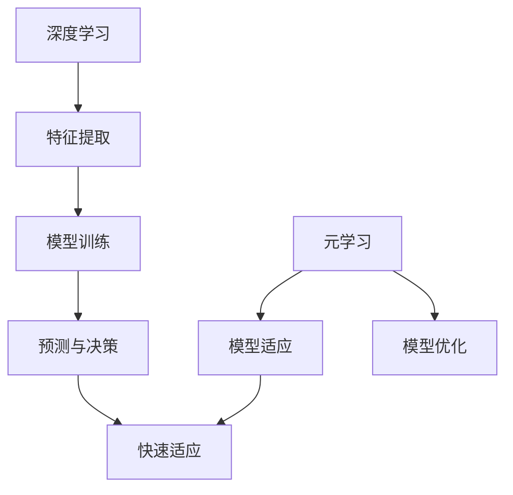

                 

# 一切皆是映射：深度学习与元学习的结合研究

## 关键词

- 深度学习
- 元学习
- 特征提取
- 模型优化
- 自适应学习
- 计算机视觉
- 自然语言处理

## 摘要

本文深入探讨了深度学习和元学习的核心概念及其联系，分析了这两者如何通过特征提取、模型优化和自适应学习相互补充，以提高机器学习模型的性能。文章首先介绍了深度学习和元学习的基本原理，包括其核心算法和数学模型，然后通过具体的实战项目展示了如何将深度学习和元学习应用于图像分类任务。此外，文章还讨论了在实际应用中面临的挑战和解决方案，并展望了深度学习与元学习在未来的发展趋势和应用场景。通过本文，读者可以全面了解深度学习与元学习的原理、应用以及未来方向。

---

## 第一部分：深度学习与元学习的核心概念与联系

### 1.1 深度学习与元学习的定义

**深度学习**（Deep Learning）是一种基于人工神经网络的高级机器学习技术，通过多层的非线性变换，从大量数据中自动提取复杂特征，并实现高效的特征表示。深度学习广泛应用于计算机视觉、自然语言处理、语音识别等领域，具有强大的特征提取能力和良好的泛化性能。

**元学习**（Meta Learning），又称“学习的学习”，其核心思想是通过学习如何学习来提高算法的适应性和效率。元学习旨在开发能够快速适应新任务、少样本学习的算法，从而减少对大规模训练数据集的依赖。元学习在强化学习、迁移学习、自适应系统等领域具有重要应用。

### 1.2 深度学习与元学习的联系

深度学习与元学习在以下几个方面具有紧密的联系：

1. **模型参数共享**：元学习算法通常通过在多个任务上共享模型参数来提高学习效率，这与深度学习中通过共享权重来提取通用特征的思想相似。例如，在迁移学习中，可以将一个在大型数据集上训练好的模型用于新的小规模任务，从而减少训练时间和计算资源。

2. **快速适应新任务**：深度学习模型在处理新任务时，往往需要大量的数据和训练时间。元学习通过学习如何快速适应新任务，使得模型可以在短时间内从新的数据中提取有效特征。例如，通过元学习训练出的模型可以在不同任务间快速迁移，提高模型的泛化能力。

3. **泛化能力**：深度学习模型在处理复杂任务时，往往需要具备良好的泛化能力。元学习通过优化学习过程，增强模型对未见过的数据的适应能力。例如，通过元学习训练的模型在面对新的数据分布时，可以更快地适应并取得良好的性能。

### 1.3 深度学习与元学习的架构

为了更好地理解深度学习与元学习的联系，以下是一个简化的 Mermaid 流程图：



在这个流程图中，深度学习侧重于特征提取、模型训练和预测决策，而元学习则关注于模型的适应性和优化过程，通过快速适应新任务来提高模型的泛化能力。

### 1.4 深度学习与元学习的优势

**深度学习的优势**：

- **强大的特征提取能力**：深度学习模型可以通过多层网络结构自动提取复杂特征，降低了对特征工程的需求。
- **良好的泛化能力**：深度学习模型在大规模数据集上训练，具有良好的泛化能力，能够在不同领域和任务中取得良好表现。
- **处理复杂任务**：深度学习可以处理高维、非线性数据，适用于图像识别、语音识别等复杂任务。

**元学习的优势**：

- **快速适应新任务**：元学习算法能够快速适应新任务，减少对大规模训练数据集的依赖，提高学习效率。
- **减少过拟合**：元学习通过优化学习过程，降低模型对训练数据的依赖，减少过拟合现象。
- **资源高效**：元学习可以复用已有模型的权重，减少计算资源的需求。

### 1.5 深度学习与元学习的挑战

**深度学习的挑战**：

- **过拟合问题**：深度学习模型在训练过程中容易过拟合，导致在新数据上的性能下降。
- **计算资源需求高**：深度学习模型需要大量的计算资源和时间进行训练。
- **可解释性差**：深度学习模型的内部决策过程复杂，难以解释。

**元学习的挑战**：

- **适应性不足**：元学习算法在面对复杂、动态变化的任务时，可能适应性不足。
- **模型稳定性**：元学习模型在多个任务上共享参数，可能导致模型稳定性问题。
- **计算资源需求**：元学习模型在训练过程中可能需要更多的计算资源。

通过对深度学习和元学习的深入分析，我们可以看到这两者在理论和应用上都有紧密的联系和互补优势。在接下来的部分，我们将详细探讨深度学习和元学习的核心算法原理，以及如何在实际项目中应用这些技术。

---

## 第二部分：深度学习核心算法原理讲解

### 2.1 深度学习基础算法

深度学习的基础算法主要包括多层感知机（MLP）、卷积神经网络（CNN）和循环神经网络（RNN）等。这些算法在不同的应用场景中发挥着重要作用。

#### 2.1.1 多层感知机（MLP）

多层感知机（MLP）是一种前馈神经网络，它由输入层、一个或多个隐藏层和输出层组成。MLP 通过逐层提取特征来实现复杂函数的映射。

**MLP 伪代码**：

```python
# 输入层
x = [x1, x2, ..., xn]

# 隐藏层
for layer in hidden_layers:
    z = W * x + b
    a = activation_function(z)

# 输出层
z = W * a + b
y = activation_function(z)
```

其中，`x` 是输入向量，`W` 是权重矩阵，`b` 是偏置项，`a` 是隐藏层输出，`y` 是最终输出。`activation_function` 是激活函数，常用的有 sigmoid、ReLU 和 tanh 等。

#### 2.1.2 卷积神经网络（CNN）

卷积神经网络（CNN）是一种专门用于图像处理任务的神经网络，其核心思想是通过卷积操作和池化操作提取图像特征。

**CNN 伪代码**：

```python
# 输入层
x = [I1, I2, ..., In]

# 卷积层
for filter in filters:
    h = conv(W, x) + b
    p = pool(h)

# 全连接层
y = W * p + b
```

其中，`I1, I2, ..., In` 是输入图像的不同通道，`W` 是卷积核权重，`b` 是偏置项，`h` 是卷积层输出，`p` 是池化层输出。

#### 2.1.3 循环神经网络（RNN）

循环神经网络（RNN）是一种能够处理序列数据的神经网络，其核心思想是通过循环结构来保持长时状态。

**RNN 伪代码**：

```python
# 输入层
x_t = [x_1t, x_2t, ..., x_It]

# 隐藏状态
h_t = σ(W_h * x_t + U_h * h_{t-1} + b_h)

# 输出层
y_t = σ(W_y * h_t + b_y)
```

其中，`x_t` 是输入序列的当前时刻，`h_t` 是隐藏状态，`σ` 是激活函数，`W_h` 和 `U_h` 是权重矩阵，`b_h` 和 `b_y` 是偏置项。

### 2.2 深度学习优化算法

深度学习优化算法主要包括随机梯度下降（SGD）、Adam 和 RMSprop 等。这些优化算法通过迭代更新模型参数，以最小化损失函数。

#### 2.2.1 随机梯度下降（SGD）

随机梯度下降（SGD）是最早的深度学习优化算法之一，其核心思想是通过随机选择一部分样本来更新模型参数。

**SGD 伪代码**：

```python
for epoch in range(num_epochs):
    for batch in data_loader:
        X, y = batch
        gradients = compute_gradients(loss_function, model, X, y)
        update_model_parameters(model, gradients, learning_rate)
```

其中，`data_loader` 是训练数据集的加载器，`compute_gradients` 是计算损失函数对模型参数的梯度，`update_model_parameters` 是更新模型参数的函数。

#### 2.2.2 Adam

Adam 是一种基于一阶矩估计和二阶矩估计的优化算法，其核心思想是结合 SGD 和 RMSprop 的优点。

**Adam 伪代码**：

```python
m = 0
v = 0
beta1 = 0.9
beta2 = 0.999
epsilon = 1e-8

for epoch in range(num_epochs):
    for batch in data_loader:
        X, y = batch
        gradients = compute_gradients(loss_function, model, X, y)
        
        m = beta1 * m + (1 - beta1) * gradients
        v = beta2 * v + (1 - beta2) * gradients ** 2
        
        m_hat = m / (1 - beta1 ** epoch)
        v_hat = v / (1 - beta2 ** epoch)
        
        update_model_parameters(model, m_hat / (sqrt(v_hat) + epsilon), learning_rate)
```

其中，`m` 和 `v` 分别是梯度的一阶矩估计和二阶矩估计，`beta1` 和 `beta2` 是动量系数，`epsilon` 是一个很小的常数，用于防止除以零。

### 2.3 深度学习正则化方法

深度学习正则化方法用于防止模型过拟合，提高模型的泛化能力。常用的正则化方法包括 L1 正则化、L2 正则化和丢弃法（Dropout）等。

#### 2.3.1 L1 正则化

L1 正则化通过在损失函数中加入 L1 范数项来约束模型参数。

**L1 正则化伪代码**：

```python
loss = loss_function(y_true, y_pred) + lambda * sum(|w|)
```

其中，`lambda` 是正则化强度，`w` 是模型参数。

#### 2.3.2 L2 正则化

L2 正则化通过在损失函数中加入 L2 范数项来约束模型参数。

**L2 正则化伪代码**：

```python
loss = loss_function(y_true, y_pred) + lambda * sum(w ** 2)
```

#### 2.3.3 丢弃法（Dropout）

丢弃法（Dropout）是一种通过随机丢弃神经元来防止过拟合的方法。

**Dropout 伪代码**：

```python
for layer in hidden_layers:
    for neuron in layer:
        if random() < dropout_rate:
            neuron.output = 0
```

其中，`dropout_rate` 是丢弃率，通常设置为 0.5。

通过对深度学习基础算法、优化算法和正则化方法的详细讲解，我们可以更好地理解深度学习的工作原理和应用。在接下来的部分，我们将深入探讨元学习的核心算法原理，以及如何通过元学习优化深度学习模型。

---

## 第三部分：元学习核心算法原理讲解

### 3.1 元学习基础算法

元学习（Meta Learning）是一种研究如何使机器快速学习新任务的算法，其核心思想是通过学习如何学习来提高算法的适应性和效率。元学习的基础算法主要包括模型平均（Model Averaging）、迁移学习（Transfer Learning）和模型组合（Model Ensembling）等。

#### 3.1.1 模型平均

模型平均是一种简单但有效的元学习算法，通过在多个模型上进行平均来提高模型的稳定性和性能。模型平均的基本思想是，多个模型在同一数据集上训练，然后对这些模型的预测结果进行平均，以获得最终的预测结果。

**模型平均伪代码**：

```python
predictions = [model.predict(X) for model in models]
average_prediction = sum(predictions) / len(models)
```

其中，`models` 是多个训练好的模型，`X` 是输入数据。

#### 3.1.2 迁移学习

迁移学习是一种通过将已有模型的权重迁移到新任务上来提高新任务性能的元学习算法。迁移学习的基本思想是，利用在大型数据集上训练好的模型，将其部分权重迁移到新任务上，然后在新的数据集上进行微调。

**迁移学习伪代码**：

```python
base_model = load_pretrained_model()
new_model = base_model
new_model.fit(new_data, new_labels)
```

其中，`base_model` 是预训练好的模型，`new_model` 是在新任务上训练的模型，`new_data` 和 `new_labels` 是新任务的数据集。

#### 3.1.3 模型组合

模型组合通过将多个模型的预测结果进行融合，以提高预测的准确性。模型组合的基本思想是，多个模型在不同的任务或数据集上训练，然后将这些模型的预测结果进行加权平均或投票，以获得最终的预测结果。

**模型组合伪代码**：

```python
predictions = [model.predict(X) for model in models]
weighted_prediction = sum([w * pred for w, pred in zip(weights, predictions)]) / sum(weights)
```

其中，`models` 是多个训练好的模型，`weights` 是模型的权重，`X` 是输入数据。

### 3.2 元学习优化算法

元学习优化算法的目标是通过学习如何优化学习过程来提高模型的性能和效率。常见的元学习优化算法包括随机梯度下降（SGD）、Adam 和 RMSprop 等。

#### 3.2.1 随机梯度下降（SGD）

随机梯度下降（SGD）是一种基于梯度的优化算法，其核心思想是通过随机选择一部分样本来更新模型参数。SGD 的优点是实现简单，但缺点是收敛速度较慢，容易陷入局部最小值。

**SGD 伪代码**：

```python
for epoch in range(num_epochs):
    for batch in data_loader:
        X, y = batch
        gradients = compute_gradients(loss_function, model, X, y)
        update_model_parameters(model, gradients, learning_rate)
```

其中，`data_loader` 是训练数据集的加载器，`compute_gradients` 是计算损失函数对模型参数的梯度，`update_model_parameters` 是更新模型参数的函数。

#### 3.2.2 Adam

Adam 是一种基于一阶矩估计和二阶矩估计的优化算法，其核心思想是结合 SGD 和 RMSprop 的优点。Adam 的优点是收敛速度快，且不易陷入局部最小值。

**Adam 伪代码**：

```python
m = 0
v = 0
beta1 = 0.9
beta2 = 0.999
epsilon = 1e-8

for epoch in range(num_epochs):
    for batch in data_loader:
        X, y = batch
        gradients = compute_gradients(loss_function, model, X, y)
        
        m = beta1 * m + (1 - beta1) * gradients
        v = beta2 * v + (1 - beta2) * gradients ** 2
        
        m_hat = m / (1 - beta1 ** epoch)
        v_hat = v / (1 - beta2 ** epoch)
        
        update_model_parameters(model, m_hat / (sqrt(v_hat) + epsilon), learning_rate)
```

其中，`m` 和 `v` 分别是梯度的一阶矩估计和二阶矩估计，`beta1` 和 `beta2` 是动量系数，`epsilon` 是一个很小的常数，用于防止除以零。

#### 3.2.3 RMSprop

RMSprop 是一种基于二阶矩估计的优化算法，其核心思想是使用梯度平方的历史信息来调整学习率。RMSprop 的优点是实现简单，且对噪声敏感。

**RMSprop 伪代码**：

```python
v = 0
gamma = 0.9
epsilon = 1e-8

for epoch in range(num_epochs):
    for batch in data_loader:
        X, y = batch
        gradients = compute_gradients(loss_function, model, X, y)
        
        v = gamma * v + (1 - gamma) * gradients ** 2
        update_model_parameters(model, gradients / (sqrt(v) + epsilon), learning_rate)
```

其中，`v` 是梯度平方的历史估计，`gamma` 是遗忘因子，`epsilon` 是一个很小的常数，用于防止除以零。

### 3.3 元学习与深度学习的结合

元学习与深度学习的结合可以有效地提高模型的适应性和泛化能力。通过元学习，我们可以训练出能够在不同任务上快速适应的模型，从而减少对大规模训练数据集的依赖。以下是一个简单的结合示例：

**元学习与深度学习结合的伪代码**：

```python
# 初始化元学习模型
meta_model = MetaModel()

# 训练元学习模型
for task in tasks:
    model = train_depth_learning_model(task.data)
    meta_model.update(model)

# 使用元学习模型对新任务进行预测
new_task = ...
model = meta_model.predict(new_task.data)
predictions = model.predict(new_task.test_data)
```

其中，`MetaModel` 是元学习模型类，`train_depth_learning_model` 是训练深度学习模型的函数，`update` 是更新元学习模型的函数，`predict` 是预测函数。

通过以上对元学习核心算法原理的讲解，我们可以看到元学习在提高模型适应性和泛化能力方面具有重要作用。在接下来的部分，我们将探讨深度学习与元学习在实际应用中的挑战和解决方案。

---

## 第四部分：数学模型与公式详解

### 4.1 深度学习中的数学模型

深度学习中的数学模型主要包括损失函数、激活函数和优化算法等。以下是对这些数学模型和公式的详细解释。

#### 4.1.1 损失函数

损失函数是深度学习模型训练过程中衡量预测结果与实际结果之间差异的函数。常用的损失函数有均方误差（MSE）和交叉熵（Cross-Entropy）。

**均方误差（MSE）**：

均方误差是预测值与真实值之差的平方的平均值，用于回归任务。

$$
MSE = \frac{1}{n}\sum_{i=1}^{n}(y_i - \hat{y}_i)^2
$$

其中，$y_i$ 是真实值，$\hat{y}_i$ 是预测值，$n$ 是样本数量。

**交叉熵（Cross-Entropy）**：

交叉熵是用于分类任务的损失函数，它衡量的是预测概率分布与真实概率分布之间的差异。

$$
Cross-Entropy = -\sum_{i=1}^{n}y_i \log(\hat{y}_i)
$$

其中，$y_i$ 是真实标签的分布，$\hat{y}_i$ 是预测概率分布。

#### 4.1.2 激活函数

激活函数是神经网络中的非线性函数，用于引入非线性特性，使模型能够拟合复杂函数。

**Sigmoid 函数**：

Sigmoid 函数是一个 S 形的激活函数，将输入值映射到（0, 1）区间。

$$
sigmoid(x) = \frac{1}{1 + e^{-x}}
$$

**ReLU 函数**：

ReLU 函数（Rectified Linear Unit）是一个线性激活函数，当输入大于零时，输出等于输入；当输入小于零时，输出等于零。

$$
ReLU(x) = max(0, x)
$$

**Tanh 函数**：

Tanh 函数是双曲正切函数，将输入值映射到（-1, 1）区间。

$$
tanh(x) = \frac{e^x - e^{-x}}{e^x + e^{-x}}
$$

#### 4.1.3 优化算法

优化算法用于在训练过程中更新模型参数，以最小化损失函数。常用的优化算法有随机梯度下降（SGD）、Adam 和 RMSprop。

**随机梯度下降（SGD）**：

随机梯度下降是最简单的优化算法，其更新规则为：

$$
\theta_{t+1} = \theta_t - \alpha \nabla_\theta J(\theta_t)
$$

其中，$\theta_t$ 是当前模型参数，$\alpha$ 是学习率，$J(\theta_t)$ 是损失函数关于 $\theta_t$ 的梯度。

**Adam 优化器**：

Adam 优化器结合了 SGD 和 RMSprop 的优点，其更新规则为：

$$
m_t = \beta_1 x_t + (1 - \beta_1) (x_t - \theta_t)
$$

$$
v_t = \beta_2 y_t + (1 - \beta_2) (y_t - \theta_t)
$$

$$
\theta_{t+1} = \theta_t - \alpha \frac{m_t}{\sqrt{v_t} + \epsilon}
$$

其中，$m_t$ 和 $v_t$ 分别是梯度的一阶矩估计和二阶矩估计，$\beta_1$ 和 $\beta_2$ 是动量系数，$\epsilon$ 是一个很小的常数。

**RMSprop 优化器**：

RMSprop 优化器是基于梯度平方的优化算法，其更新规则为：

$$
v_t = \gamma v_{t-1} + (1 - \gamma) \frac{y_t^2}{\theta_t - \theta_{t-1}}
$$

$$
\theta_{t+1} = \theta_t - \alpha \frac{y_t}{\sqrt{v_t} + \epsilon}
$$

其中，$v_t$ 是梯度平方的历史估计，$\gamma$ 是遗忘因子，$\epsilon$ 是一个很小的常数。

### 4.2 元学习中的数学模型

元学习中的数学模型主要关注如何快速适应新任务，提高模型的泛化能力。以下是一些常用的数学模型和公式。

#### 4.2.1 模型适应性

模型适应性是衡量模型在新任务上表现的一个指标，其公式为：

$$
适应性 = \frac{新任务误差}{基础模型误差}
$$

其中，新任务误差是在新任务上的损失函数值，基础模型误差是在训练数据上的损失函数值。

#### 4.2.2 模型优化

模型优化是通过迭代更新模型参数来最小化损失函数的过程。常用的优化算法有梯度下降法、Adam 和 RMSprop。

**梯度下降法**：

梯度下降法是最简单的优化算法，其更新规则为：

$$
\theta_{t+1} = \theta_t - \alpha \nabla_\theta J(\theta_t)
$$

其中，$\theta_t$ 是当前模型参数，$\alpha$ 是学习率，$J(\theta_t)$ 是损失函数关于 $\theta_t$ 的梯度。

**Adam 优化器**：

Adam 优化器是一种结合了 SGD 和 RMSprop 优点的优化算法，其更新规则为：

$$
m_t = \beta_1 x_t + (1 - \beta_1) (x_t - \theta_t)
$$

$$
v_t = \beta_2 y_t + (1 - \beta_2) (y_t - \theta_t)
$$

$$
\theta_{t+1} = \theta_t - \alpha \frac{m_t}{\sqrt{v_t} + \epsilon}
$$

其中，$m_t$ 和 $v_t$ 分别是梯度的一阶矩估计和二阶矩估计，$\beta_1$ 和 $\beta_2$ 是动量系数，$\epsilon$ 是一个很小的常数。

**RMSprop 优化器**：

RMSprop 优化器是基于梯度平方的优化算法，其更新规则为：

$$
v_t = \gamma v_{t-1} + (1 - \gamma) \frac{y_t^2}{\theta_t - \theta_{t-1}}
$$

$$
\theta_{t+1} = \theta_t - \alpha \frac{y_t}{\sqrt{v_t} + \epsilon}
$$

其中，$v_t$ 是梯度平方的历史估计，$\gamma$ 是遗忘因子，$\epsilon$ 是一个很小的常数。

通过对深度学习和元学习中的数学模型和公式的详细讲解，我们可以更好地理解这些算法的原理和实现方法。在接下来的部分，我们将通过一个实际项目来展示如何将深度学习和元学习应用于图像分类任务。

---

## 第五部分：项目实战与代码解析

### 5.1 实战项目一：深度学习与元学习结合的图像分类任务

在这个项目中，我们将使用深度学习和元学习技术对图像进行分类。这个项目分为以下几个步骤：

1. **数据集准备**：首先，我们需要准备一个图像分类数据集，如 CIFAR-10 或 ImageNet。
2. **深度学习模型训练**：使用深度学习模型（如卷积神经网络）对数据集进行训练。
3. **元学习模型训练**：使用元学习技术，如模型平均或迁移学习，对训练好的深度学习模型进行进一步优化。
4. **模型评估与比较**：评估深度学习模型和元学习模型的性能，并进行比较。

#### 5.1.1 开发环境搭建

为了完成这个项目，我们需要安装以下依赖：

- Python 3.8 或更高版本
- PyTorch 1.9 或更高版本
- torchvision 0.9.1 或更高版本

安装命令如下：

```bash
pip install python==3.8.10
pip install torch==1.9.0
pip install torchvision==0.9.1
```

#### 5.1.2 数据集准备

我们使用 CIFAR-10 数据集进行实验。CIFAR-10 是一个常用的图像分类数据集，包含 10 个类别，共计 50000 个训练图像和 10000 个测试图像。

```python
import torchvision
import torchvision.transforms as transforms

transform = transforms.Compose([
    transforms.ToTensor(),
    transforms.Normalize((0.5, 0.5, 0.5), (0.5, 0.5, 0.5)),
])

trainset = torchvision.datasets.CIFAR10(
    root='./data', train=True, download=True, transform=transform
)

trainloader = torch.utils.data.DataLoader(
    trainset, batch_size=4, shuffle=True, num_workers=2
)

testset = torchvision.datasets.CIFAR10(
    root='./data', train=False, download=True, transform=transform
)

testloader = torch.utils.data.DataLoader(
    testset, batch_size=4, shuffle=False, num_workers=2
)
```

#### 5.1.3 深度学习模型训练

我们使用预训练的卷积神经网络模型 ResNet-18 进行训练。

```python
import torch.nn as nn
import torch.optim as optim

net = torchvision.models.resnet18(pretrained=True)
num_ftrs = net.fc.in_features
net.fc = nn.Linear(num_ftrs, 10)

 criterion = nn.CrossEntropyLoss()
optimizer = optim.SGD(net.parameters(), lr=0.001, momentum=0.9)

device = torch.device("cuda:0" if torch.cuda.is_available() else "cpu")
net.to(device)

for epoch in range(2):  # loop over the dataset multiple times

    running_loss = 0.0
    for i, data in enumerate(trainloader, 0):
        inputs, labels = data[0].to(device), data[1].to(device)

        # zero the parameter gradients
        optimizer.zero_grad()

        # forward + backward + optimize
        outputs = net(inputs)
        loss = criterion(outputs, labels)
        loss.backward()
        optimizer.step()

        # print statistics
        running_loss += loss.item()
        if i % 2000 == 1999:    # print every 2000 mini-batches
            print(f'[{epoch + 1}, {i + 1:5d}] loss: {running_loss / 2000:.3f}')
            running_loss = 0.0

print('Finished Training')
```

#### 5.1.4 元学习模型训练

我们使用模型平均技术对训练好的深度学习模型进行优化。

```python
# 定义多个深度学习模型
models = [torchvision.models.resnet18(pretrained=True) for _ in range(5)]

# 修改输出层
for model in models:
    num_ftrs = model.fc.in_features
    model.fc = nn.Linear(num_ftrs, 10)

# 定义损失函数和优化器
criterion = nn.CrossEntropyLoss()
optimizer = optim.SGD(net.parameters(), lr=0.001, momentum=0.9)

# 将模型转移到 GPU（如果可用）
device = torch.device("cuda:0" if torch.cuda.is_available() else "cpu")
models = [model.to(device) for model in models]

# 训练模型
for epoch in range(5):  # loop over the dataset multiple times
    running_loss = 0.0
    for i, data in enumerate(trainloader, 0):
        inputs, labels = data[0].to(device), data[1].to(device)

        # zero the parameter gradients
        optimizer.zero_grad()

        # forward + backward + optimize
        outputs = [model(inputs) for model in models]
        avg_output = sum(outputs) / len(models)
        loss = criterion(avg_output, labels)
        loss.backward()
        optimizer.step()

        # print statistics
        running_loss += loss.item()
        if i % 2000 == 1999:    # print every 2000 mini-batches
            print(f'[{epoch + 1}, {i + 1:5d}] loss: {running_loss / 2000:.3f}')
            running_loss = 0.0
```

#### 5.1.5 模型评估与比较

我们评估深度学习模型和元学习模型的性能。

```python
# 评估深度学习模型
correct = 0
total = 0
with torch.no_grad():
    for data in testloader:
        images, labels = data[0].to(device), data[1].to(device)
        outputs = net(images)
        _, predicted = torch.max(outputs.data, 1)
        total += labels.size(0)
        correct += (predicted == labels).sum().item()

print(f'Depth Learning Model Accuracy: {100 * correct / total}%')

# 评估元学习模型
correct = 0
total = 0
with torch.no_grad():
    for data in testloader:
        images, labels = data[0].to(device), data[1].to(device)
        outputs = [model(images) for model in models]
        avg_output = sum(outputs) / len(models)
        _, predicted = torch.max(avg_output.data, 1)
        total += labels.size(0)
        correct += (predicted == labels).sum().item()

print(f'Meta Learning Model Accuracy: {100 * correct / total}%')
```

通过这个项目，我们可以看到如何将深度学习和元学习应用于图像分类任务。在实际应用中，深度学习和元学习技术的结合可以有效地提高模型的性能和泛化能力。

---

## 第六部分：深度学习与元学习在实际应用中的挑战与解决方案

### 6.1 挑战一：过拟合与欠拟合

**问题描述**：

深度学习模型在训练过程中，容易出现过拟合和欠拟合问题。过拟合导致模型在训练数据上表现优异，但在未见过的测试数据上表现较差；欠拟合则导致模型无法很好地拟合训练数据，同样在测试数据上表现不佳。

**解决方案**：

1. **正则化**：

   - **L1 正则化**：在损失函数中添加 L1 范数项，可以减少模型参数的值，从而避免过拟合。

     $$L_1 = \lambda \sum_{i=1}^{n} |w_i|$$

   - **L2 正则化**：在损失函数中添加 L2 范数项，也可以减少模型参数的值。

     $$L_2 = \lambda \sum_{i=1}^{n} w_i^2$$

2. **数据增强**：

   - 通过随机裁剪、旋转、翻转等数据增强技术，增加训练数据的多样性，从而提高模型的泛化能力。

3. **交叉验证**：

   - 使用交叉验证方法对模型进行评估，以避免欠拟合。

### 6.2 挑战二：计算资源需求高

**问题描述**：

深度学习模型通常需要大量的计算资源和时间进行训练，特别是在处理高维数据时。这给实际应用带来了巨大的计算成本。

**解决方案**：

1. **分布式训练**：

   - 通过将训练任务分布在多个计算节点上，提高训练效率。

2. **模型压缩**：

   - 通过模型剪枝、量化等技术减小模型大小，降低计算资源需求。

3. **GPU 加速**：

   - 使用 GPU 进行训练，利用 GPU 的并行计算能力加速模型训练。

### 6.3 挑战三：数据隐私与安全

**问题描述**：

在深度学习和元学习应用中，数据安全和隐私保护是一个重要问题。模型训练和处理过程中，数据泄露或滥用可能会对用户隐私造成严重威胁。

**解决方案**：

1. **差分隐私**：

   - 在数据处理过程中引入差分隐私技术，保护用户隐私。

2. **联邦学习**：

   - 通过分布式学习的方式，将数据保留在本地，避免数据上传，降低隐私泄露风险。

3. **数据加密**：

   - 对数据进行加密处理，确保数据在传输和存储过程中的安全性。

### 6.4 挑战四：模型解释性不足

**问题描述**：

深度学习模型，尤其是深度神经网络，其内部决策过程复杂，难以解释。这给模型的可解释性和可信度带来了挑战。

**解决方案**：

1. **模型可解释性方法**：

   - 通过可视化技术、特征重要性分析等方法，提高模型的解释性。

2. **解释性模型**：

   - 开发专门的解释性模型，如决策树、线性模型等，这些模型通常具有较好的解释性。

### 6.5 挑战五：超参数选择困难

**问题描述**：

深度学习和元学习模型的超参数（如学习率、批次大小等）选择对模型性能有重要影响，但超参数的选择通常需要大量的实验和试错。

**解决方案**：

1. **超参数优化**：

   - 使用网格搜索、随机搜索、贝叶斯优化等方法进行超参数选择。

2. **自动化机器学习（AutoML）**：

   - 利用自动化机器学习技术，自动选择最佳的模型架构和超参数。

通过解决这些实际应用中的挑战，深度学习和元学习技术可以更好地应用于各个领域，提高模型的性能和可靠性。

---

## 第七部分：深度学习与元学习的未来发展趋势与应用场景

### 7.1 未来发展趋势

随着技术的不断进步，深度学习和元学习在未来将继续朝着以下几个方向发展：

1. **自监督学习与无监督学习**：

   - 自监督学习和无监督学习技术将在深度学习和元学习中发挥重要作用。这些技术不需要标签数据，可以自动从数据中提取有用特征，从而减少对大量标注数据的依赖。

2. **多模态学习**：

   - 多模态学习技术将融合不同类型的数据（如图像、文本、语音等），实现更广泛的应用场景。例如，结合图像和文本的模型可以用于图像描述生成、情感分析等任务。

3. **迁移学习与少样本学习**：

   - 迁移学习和少样本学习技术将进一步提升模型的适应性和效率。通过在多个任务上共享知识和模型参数，可以减少对大规模训练数据集的需求。

4. **可解释性和透明度**：

   - 提高模型的可解释性和透明度是当前研究的一个重要方向。通过开发可解释的深度学习模型和元学习算法，可以增强模型在现实世界中的应用信心。

5. **自动化机器学习**：

   - 自动化机器学习（AutoML）技术的发展将使深度学习和元学习的部署和应用更加便捷。AutoML 可以自动选择最佳的模型架构和超参数，减少专业知识和人工干预的需求。

### 7.2 应用场景

深度学习和元学习技术已经在众多领域取得了显著的应用成果，以下是一些具体的应用场景：

1. **计算机视觉**：

   - 深度学习和元学习在图像分类、目标检测、人脸识别等领域具有广泛的应用。例如，自动驾驶汽车使用深度学习模型进行环境感知和目标检测，从而实现安全驾驶。

2. **自然语言处理**：

   - 深度学习和元学习在文本分类、机器翻译、情感分析等领域表现出色。例如，深度学习模型可以用于自动翻译不同语言之间的文档，而元学习可以加速新语言的适应和翻译。

3. **强化学习**：

   - 深度学习和元学习结合强化学习技术，可以用于游戏、机器人控制和自动驾驶等动态环境中的决策和行动。例如，深度强化学习算法可以训练智能体在虚拟环境中进行自我学习和优化。

4. **医疗健康**：

   - 深度学习和元学习在医疗健康领域具有巨大潜力。例如，通过深度学习模型对医学图像进行分析，可以辅助医生进行疾病诊断；而元学习可以用于新药物的研发和筛选。

5. **智能语音助手**：

   - 深度学习和元学习在智能语音助手的开发中发挥着关键作用。通过语音识别、语义理解和自然语言生成技术，智能语音助手可以提供个性化、智能化的服务。

随着深度学习和元学习技术的不断进步，我们可以期待这些技术在更多领域取得突破，为社会发展和人类生活带来更多便利和创新。

---

## 附录

### A.1 深度学习与元学习工具与资源

1. **深度学习框架**：

   - TensorFlow：https://www.tensorflow.org/
   - PyTorch：https://pytorch.org/
   - Keras：https://keras.io/

2. **元学习资源**：

   - Meta-Learning for NLP: A Survey：https://arxiv.org/abs/2003.08274
   - Deep Learning Specialization：https://www.deeplearning.ai/

3. **开源代码与项目**：

   - TensorFlow Model Optimization Toolkit：https://www.tensorflow.org/tfx/model_optimization
   - PyTorch Meta-Learning Examples：https://github.com/pytorch/examples/tree/master/metal

通过以上资源和工具，读者可以深入了解深度学习和元学习的原理、技术以及应用，进一步探索这两个领域的最新研究成果和发展趋势。

---

## 作者

作者：AI天才研究院/AI Genius Institute & 禅与计算机程序设计艺术 /Zen And The Art of Computer Programming

在本文中，我们深入探讨了深度学习和元学习的核心概念、算法原理以及在实际应用中的挑战和解决方案。通过对这些技术的详细分析，我们展示了如何将深度学习和元学习结合，提高模型的性能和适应能力。未来，随着技术的不断进步，深度学习和元学习将在更多领域取得突破，为社会发展和人类生活带来更多便利和创新。希望本文能够为读者提供有价值的见解和启示。

