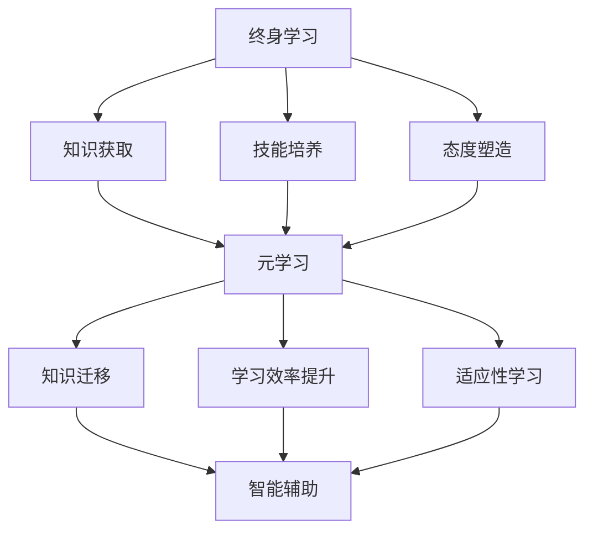

                 

### 第1章：核心概念与联系

#### 1.1 终身学习与元学习的关系

终身学习和元学习是现代教育和技术领域中的核心概念，它们之间的关系密不可分。终身学习强调的是一个人在其一生中不断学习、更新知识和技能的过程，而元学习则是关于如何让机器和系统自主学习、适应新环境和任务的能力。

我们可以使用Mermaid流程图来直观地展示终身学习与元学习之间的关系：



在这个流程图中，终身学习涵盖了知识获取、技能培养和态度塑造三个层面，而元学习则是在这三个基础上，进一步优化和提升学习过程的方法。元学习通过知识迁移、学习效率提升和适应性学习，使得终身学习更加高效和智能化。

#### 1.2 终身学习与元学习的联系

终身学习和元学习之间的联系可以归结为以下几点：

1. **相互促进**：终身学习为元学习提供了丰富的知识资源和实践经验，这些资源和实践经验是元学习算法优化和提升的重要基础。而元学习则为终身学习提供了高效的学习方法和智能工具，使得终身学习更加智能化和个性化。

2. **知识迁移**：终身学习过程中积累的知识和技能可以迁移到元学习中，帮助机器更好地理解和适应新的学习任务。

3. **学习效率提升**：元学习通过优化学习过程，可以显著提升终身学习的学习效率，使得个体可以在较短的时间内掌握新的知识和技能。

4. **适应性学习**：终身学习的过程中，个体需要不断地适应新的环境和任务。元学习通过自适应学习，可以更好地满足个体在不同情境下的学习需求。

综上所述，终身学习和元学习是相辅相成的，二者共同推动了教育和技术的发展。

#### 1.3 本书结构概述

本书将从以下几个方面详细探讨终身学习与元学习的关系：

- **第1章：核心概念与联系**：介绍终身学习和元学习的定义、关系及相互促进的方式。

- **第2章：终身学习基础**：探讨终身学习的起源、发展、本质特征和价值。

- **第3章：元学习基础**：介绍元学习的定义、分类、基本原理和难点。

- **第4章：终身学习与元学习的关系**：分析终身学习与元学习的交互作用和融合应用。

- **第5章：终身学习与元学习在具体领域的应用**：探讨终身学习与元学习在教育、工程等领域的应用。

- **第6章：终身学习与元学习的研究方法**：介绍实证研究方法和理论研究方法。

- **第7章：终身学习与元学习的发展趋势**：分析科技发展对终身学习和元学习的影响。

- **第8章：总结与展望**：总结全书内容，提出研究不足和后续研究方向。

通过上述章节的深入探讨，本书旨在为读者提供一个全面、系统的终身学习与元学习的关系分析，帮助读者更好地理解和应用这些核心概念。

---

在下一章中，我们将详细探讨终身学习的起源、发展、本质特征和价值，为理解终身学习与元学习的关系打下坚实的基础。

### 第2章：终身学习基础

#### 2.1 终身学习的起源与发展

终身学习这一概念起源于20世纪60年代的欧洲，最早由法国教育家保罗·朗格朗（Paul Lengrand）提出。他在其著作《终身教育引论》中，提出了“学习是一个持续不断的过程，贯穿于人的一生”的观点，这一观点引发了全球教育界的广泛关注和讨论。

随着时代的发展，终身学习理念逐渐深入人心，并在各国得到了不同程度的推广和实施。在20世纪70年代，联合国教科文组织（UNESCO）发表了《学会生存》报告，正式将终身学习列为全球教育发展的核心战略。此后，许多国家相继出台相关政策，推动终身学习体系的建立和完善。

在中国，终身学习理念也得到了高度重视。2004年，国务院颁布了《2003-2007年教育振兴行动计划》，明确提出要建立和完善终身教育体系，构建学习型社会。2012年，教育部发布了《教育信息化十年发展规划（2011-2020年）》，进一步推动了信息技术与终身学习的深度融合。

#### 2.1.1 终身教育理念的提出

终身教育理念的提出，是对传统教育模式的一种颠覆和补充。传统教育主要关注的是学生在学校期间的知识和技能学习，而终身教育则强调教育应该是一个贯穿一生的过程。它不仅仅是学校教育的延续，更是社会、职场和自我成长的必要手段。

终身教育理念的核心在于：

1. **终身性**：教育不仅仅局限于童年和青少年时期，而是贯穿整个人生，包括职业生涯、家庭生活和社会活动等各个方面。

2. **全面性**：终身教育不仅包括知识的传授，还包括技能的培养、态度的塑造和价值观的形成。

3. **开放性**：终身教育鼓励各种教育形式和资源的开放共享，包括正规教育、非正规教育和非正式教育。

4. **个性化**：终身教育注重根据个人的需求和兴趣，提供个性化的学习路径和资源。

#### 2.1.2 终身学习的本质与特征

终身学习的本质在于其持续性和适应性。它是一种自我导向的学习过程，强调个人主动学习的能力。以下是终身学习的一些主要特征：

1. **自我导向**：终身学习强调个体在学习过程中的主动性和自我管理能力，鼓励学习者根据自己的需求和兴趣制定学习计划。

2. **灵活性和适应性**：终身学习强调学习方式和内容的灵活性，以适应不同学习者的需求和环境的变化。

3. **跨学科和跨领域**：终身学习鼓励学习者跨学科、跨领域地学习，以培养综合思维能力和创新能力。

4. **终身性**：终身学习不仅仅是为了获得文凭或资格证书，更是为了持续提升个人素质和适应社会发展的需要。

5. **多样性**：终身学习的形式多样，包括在线学习、面授课程、自学和实践等，满足不同学习者的需求。

#### 2.1.3 终身学习的核心价值

终身学习对个人、社会和国家都具有重要意义，其核心价值体现在以下几个方面：

1. **个人发展**：终身学习有助于提升个人的知识水平、技能素质和创新能力，促进个体全面发展。

2. **社会进步**：终身学习有助于提高整个社会的文化素质和科技水平，推动社会进步和发展。

3. **经济繁荣**：终身学习能够培养适应市场需求的人才，提升劳动者的技能和素质，促进经济的持续发展。

4. **可持续发展**：终身学习有助于培养可持续发展的意识和能力，推动社会走向绿色、和谐和可持续的发展道路。

5. **教育公平**：终身学习有助于缩小教育差距，实现教育资源的公平分配，促进教育公平。

总之，终身学习不仅是对传统教育模式的补充和提升，更是现代社会和未来发展的必然要求。它为个人、社会和国家带来了深远的影响，是我们走向未来不可或缺的重要力量。

在下一章中，我们将探讨终身学习面临的挑战与机遇，以及科技进步对终身学习的影响。

#### 2.2 终身学习的挑战与机遇

#### 2.2.1 社会变革对终身学习的要求

随着全球化和信息化的不断深入，社会变革对终身学习提出了新的要求。现代社会的发展速度越来越快，知识更新周期大幅缩短，新技术、新观念和新方法层出不穷。这使得个体需要不断学习新知识、新技能，以适应不断变化的社会环境。

首先，社会结构的变革对终身学习提出了新的需求。现代社会的分工越来越精细，职业流动性和多样性增加，人们需要不断更新和提升自己的技能，以应对职业生涯中的各种挑战。此外，社会对创新能力和问题解决能力的需求日益增加，这要求个体具备跨学科、跨领域的知识储备和灵活的思维模式。

其次，人口老龄化和少子化也对终身学习提出了新的挑战。随着人口老龄化进程的加快，老年人对继续教育的需求日益增长，他们需要通过学习来保持身心健康、延缓退休和提高生活质量。与此同时，少子化问题导致教育资源的竞争加剧，需要通过终身学习来提高教育质量和效益。

#### 2.2.2 科技进步对终身学习的影响

科技进步为终身学习提供了丰富的资源和工具，极大地推动了终身学习的发展。首先，互联网和移动通信技术的普及，使得在线学习成为可能。通过互联网，学习者可以随时随地获取海量的学习资源和信息，打破了时间和空间的限制。在线学习平台、MOOC（大型在线开放课程）和电子书等新兴学习形式，为学习者提供了多样化的学习途径。

其次，人工智能和大数据技术的发展，为个性化学习和智能辅助提供了可能。通过分析学习者的行为数据和知识水平，人工智能可以为其提供个性化的学习建议和资源，提高学习效率。同时，智能辅助系统可以帮助学习者更好地理解和掌握复杂的知识点，降低学习难度。

此外，虚拟现实（VR）和增强现实（AR）技术的应用，为沉浸式学习提供了新的可能性。通过VR和AR技术，学习者可以身临其境地体验历史事件、科学实验和人文艺术，提高学习的趣味性和互动性。

#### 2.2.3 个人发展对终身学习的需求

个人发展是终身学习的重要动力。随着个人自我意识和追求不断提升，越来越多的人开始重视自身的全面发展和持续成长。终身学习成为实现个人梦想和职业目标的重要途径。

首先，个人发展的需求促使个体不断学习和更新知识。在知识经济时代，知识更新速度迅猛，个体需要通过终身学习来保持自己的竞争力。无论是职场人士还是学生，都需要不断学习新知识、新技能，以适应快速变化的工作环境和市场需求。

其次，个人发展的需求推动个体培养多种技能和综合素质。终身学习不仅关注知识的传授，更注重能力的培养。个体通过终身学习，可以提升自己的沟通能力、创新能力、团队协作能力和领导力等综合素质，为个人职业发展和生活品质的提升打下坚实基础。

最后，个人发展的需求强调终身学习与自我成长的结合。终身学习不仅是获取知识和技能的过程，更是自我探索和成长的过程。个体在终身学习的过程中，可以更好地认识自己、发现潜能，并通过不断挑战自我，实现自我超越。

总之，社会变革、科技进步和个人发展共同构成了终身学习的重要背景和动力。面对这些挑战和机遇，个体和社会都需要积极应对，不断探索和推进终身学习的发展，以实现个人和社会的全面进步。

在下一章中，我们将进一步探讨元学习的基础知识，包括其定义、分类、基本原理和面临的挑战。

### 第3章：元学习基础

#### 3.1 元学习的定义与分类

元学习，又称“学习的学习”，是指机器或系统通过学习如何学习来优化其学习过程的能力。简单来说，元学习就是让机器从一系列任务中学习到一个通用学习方法，从而在新的任务上能够快速适应和表现良好。元学习旨在解决传统机器学习方法在处理不同任务时需要从头开始训练的问题，提高学习效率和适应性。

元学习可以根据学习对象和任务的不同，分为以下几类：

1. **任务元学习**：任务元学习关注的是如何让机器在不同的任务上快速适应。这种元学习通常涉及到多个任务的训练数据集，通过在多个任务上训练，机器学习到一个通用的学习策略，从而在新的任务上能够迅速调整和优化。

2. **样本元学习**：样本元学习关注的是如何让机器在少量样本上快速学习。这种元学习通常适用于样本量较小或者难以获取大量训练样本的情况，通过学习样本之间的分布和关系，机器能够在少量样本上实现良好的学习效果。

3. **模型元学习**：模型元学习关注的是如何优化机器学习模型的结构和参数。这种元学习通过调整模型的结构和参数，使得模型在不同的任务上具有更好的泛化能力和适应性。

4. **策略元学习**：策略元学习关注的是如何学习到最优的学习策略。这种元学习旨在找到一种通用的策略，使得机器在不同任务上都能够以最优的方式学习。

5. **数据元学习**：数据元学习关注的是如何优化数据预处理和特征提取过程。这种元学习通过学习数据分布和特征关系，优化数据预处理和特征提取，从而提高学习效果。

#### 3.1.1 元学习的概念

元学习的概念最早由安德鲁·巴克斯（Andrew Barto）和理查德·西尔弗（Richard Sutton）在1983年的著作《强化学习：一种解释》中提出。他们认为，元学习是一种通过学习如何学习来优化学习过程的方法。

在机器学习中，元学习通常通过以下步骤实现：

1. **初始化模型**：选择一个初始模型，通常是一个简单的模型，用于在多个任务上训练。

2. **任务训练**：在每个任务上使用训练数据集对模型进行训练。

3. **模型调整**：根据任务训练的结果，调整模型的参数和结构，以提高模型的泛化能力和适应性。

4. **评估和优化**：在新的任务上评估模型的性能，并根据评估结果进一步优化模型。

通过这样的过程，元学习能够使得机器在学习新任务时，能够快速适应和表现良好，从而提高学习效率和准确性。

#### 3.1.2 元学习的分类

根据元学习的目标和任务，可以将元学习分为以下几类：

1. **模型迁移**：模型迁移是一种常见的元学习方法，它通过在多个任务上训练模型，使得模型在不同任务上具有较好的泛化能力。这种方法的核心思想是利用先前的任务经验来优化新任务的学习过程。

2. **样本效率**：样本效率元学习关注如何在少量样本上实现良好的学习效果。这种方法通过学习样本之间的分布和关系，使得机器在少量样本上能够快速学习。

3. **模型效率**：模型效率元学习关注如何设计高效的模型结构，使得模型在不同的任务上具有较好的泛化能力和适应性。这种方法通过优化模型的结构和参数，提高模型的效率。

4. **策略优化**：策略优化元学习关注如何学习到最优的学习策略。这种方法通过优化学习策略，使得机器在不同的任务上都能够以最优的方式学习。

5. **数据增强**：数据增强元学习关注如何优化数据预处理和特征提取过程，以提高学习效果。这种方法通过学习数据的分布和特征关系，优化数据预处理和特征提取，从而提高模型的性能。

#### 3.1.3 元学习的研究意义

元学习在机器学习领域具有重要的研究意义和应用价值：

1. **提高学习效率**：元学习能够使得机器在多个任务上快速适应和表现良好，从而提高学习效率。这对于处理大量任务和资源有限的情况尤为重要。

2. **提升泛化能力**：元学习通过学习多个任务，能够提高模型的泛化能力，使得模型在不同任务上具有更好的适应性。

3. **应对少量样本**：在样本量较小或者难以获取大量训练样本的情况下，元学习能够通过学习样本之间的分布和关系，实现良好的学习效果。

4. **优化模型结构**：元学习能够通过优化模型的结构和参数，设计出高效的模型，从而提高模型的性能。

5. **推动理论发展**：元学习的研究推动了机器学习领域的新理论和新方法的发展，促进了人工智能技术的进步。

总之，元学习作为一种重要的机器学习方法，具有广泛的应用前景和研究价值。通过深入研究和探索，我们可以进一步优化元学习算法，提高其在实际应用中的效果和效率。

在下一章中，我们将探讨元学习的基本原理，包括学习代理、学习目标和元学习策略与优化方法。

#### 3.2 元学习的基本原理

元学习的基本原理涉及多个关键组成部分，包括学习代理、学习目标和元学习策略与优化方法。这些组成部分共同作用，使得元学习能够实现高效的学习和适应。

#### 3.2.1 学习代理与学习目标

学习代理是指负责学习过程的实体，它可以是机器学习模型、算法或系统。学习代理的核心任务是学习如何学习，从而在新的任务上快速适应和表现良好。为了实现这一目标，学习代理需要具备以下几个关键能力：

1. **数据收集与处理**：学习代理需要能够收集和处理来自不同任务的数据。这包括数据清洗、预处理和特征提取等步骤，以确保数据的质量和有效性。

2. **模型训练与优化**：学习代理需要能够训练和优化模型，以便在不同任务上实现良好的表现。这通常涉及到多个任务的训练数据集和迭代过程，通过不断调整模型参数，提高模型的性能。

3. **经验整合与迁移**：学习代理需要能够整合先前任务的经验，并将其迁移到新任务上。这有助于提高学习效率，减少对新任务的学习时间。

学习目标是指学习代理希望实现的目标。在元学习中，学习目标通常是最大化学习效率或学习性能。具体来说，学习目标可以包括：

1. **快速适应新任务**：学习代理需要在短时间内快速适应新的任务，从而在新的数据集上实现良好的表现。

2. **提高泛化能力**：学习代理需要在新任务上具有较好的泛化能力，能够在不同的任务和数据集上表现出良好的性能。

3. **优化学习效率**：学习代理需要能够在有限的时间和资源内，最大化学习效率和性能。

#### 3.2.2 元学习策略与优化方法

元学习策略是指学习代理用于优化学习过程的方法和技巧。这些策略旨在提高学习效率、泛化能力和适应性。以下是一些常见的元学习策略和优化方法：

1. **模型迁移**：模型迁移是一种通过在多个任务上训练模型，以提高其在新任务上适应性的策略。这种方法的核心思想是利用先前的任务经验，减少对新任务的学习时间。常见的模型迁移方法包括迁移学习、多任务学习和迁移增强等。

2. **样本效率**：样本效率策略关注如何在少量样本上实现良好的学习效果。这种方法通常涉及对样本进行有效利用，例如通过样本增强、样本选择和样本聚类等方法。常见的样本效率方法包括元学习优化、样本效率训练和样本效率评估等。

3. **模型效率**：模型效率策略关注如何设计高效的模型结构，以提高学习效率和性能。这种方法通常涉及对模型进行优化，例如通过模型简化、模型压缩和模型集成等方法。常见的模型效率方法包括模型优化、模型压缩和模型融合等。

4. **策略优化**：策略优化是一种通过学习最优学习策略来提高学习效率的方法。这种方法通常涉及对学习策略进行优化，例如通过策略梯度上升、策略优化和策略迭代等方法。常见的策略优化方法包括策略梯度算法、策略迭代算法和策略评估算法等。

5. **数据增强**：数据增强是一种通过扩展和丰富训练数据来提高学习效果的方法。这种方法通常涉及对数据进行变换、合成和扩充，以提高数据的多样性和质量。常见的数据增强方法包括数据扩增、数据变换和数据合成等。

这些元学习策略和优化方法共同作用，使得学习代理能够在不同任务上实现高效学习和快速适应。通过不断优化和改进这些策略和方法，我们可以进一步提高元学习的效果和效率。

在下一章中，我们将探讨元学习过程中面临的难点和挑战，以及可能的解决策略。

#### 3.2.3 元学习的难点与挑战

尽管元学习在理论研究和实际应用中展现出巨大的潜力，但它在实践中仍然面临许多难点和挑战。

**1. 数据集的多样性和质量**

元学习依赖于大量的多样化数据集来进行训练，以使学习代理能够适应不同的任务。然而，收集到高质量、多样化的数据集往往是一项复杂的任务，特别是在数据标注、数据质量和数据多样性方面。此外，某些领域的数据获取可能受到法律、伦理和隐私问题的限制，这进一步增加了数据集的获取难度。

**2. 学习效率与泛化能力**

在元学习中，学习效率是一个关键指标。尽管元学习旨在通过学习多个任务来提高学习效率，但在实际应用中，学习代理可能需要花费大量时间来适应每个新任务。此外，泛化能力也是一个挑战。学习代理需要在未见过的任务上表现出良好的性能，而不仅仅是针对特定任务的优化。

**3. 模型复杂性与可解释性**

为了提高元学习的效率，学习代理通常采用复杂的模型结构，这可能包括深度神经网络、图模型或其他先进的机器学习模型。这些复杂模型虽然能够提高性能，但同时也增加了模型解释的难度。可解释性对于理解模型决策过程、提高用户信任和确保模型安全至关重要。

**4. 面对少量样本的适应能力**

元学习的一个核心目标是在少量样本上实现良好的学习效果。然而，当训练数据非常有限时，学习代理可能难以发现数据的分布和规律，这导致学习效果不佳。如何设计有效的样本效率策略，使得学习代理能够在少量样本上快速适应，是一个重要的研究问题。

**5. 学习过程中的稳定性和鲁棒性**

元学习过程中，学习代理需要面对各种不确定性和噪声。学习过程中的不稳定性和鲁棒性对于实现良好的学习效果至关重要。例如，环境变化、任务扰动和数据噪声都可能影响学习代理的性能。

**解决策略**

为了克服这些挑战，研究人员提出了一系列解决策略：

- **数据增强与数据合成**：通过数据增强和合成技术，生成更多样化的训练数据，以提高学习代理的泛化能力。

- **元学习优化算法**：设计高效的元学习优化算法，如模型平均、梯度反向传播等，以提高学习效率。

- **模型简化与压缩**：通过模型简化与压缩技术，减少模型复杂度，提高模型的解释性。

- **迁移学习与多任务学习**：利用迁移学习和多任务学习策略，从先前的任务中提取知识，减少对新任务的训练需求。

- **混合学习方法**：结合多种机器学习方法和策略，如深度学习和强化学习，以提高学习代理的适应能力和稳定性。

通过不断探索和改进这些策略，我们可以更好地应对元学习过程中的难点和挑战，推动元学习在实际应用中的发展。

在下一章中，我们将探讨终身学习与元学习的交互作用，以及元学习如何优化终身学习过程。

### 第4章：终身学习与元学习的交互作用

#### 4.1 终身学习促进元学习

终身学习为元学习提供了丰富的知识和经验，这是元学习算法优化和提升的重要基础。具体来说，终身学习对元学习的促进作用体现在以下几个方面：

1. **知识积累**：终身学习强调个体在其一生中不断学习和积累知识。这些知识不仅包括显性知识（如科学知识、技术技能），还包括隐性知识（如经验、技能、习惯）。这些丰富的知识资源为元学习算法提供了丰富的训练数据，使得元学习能够更好地理解和处理复杂的问题。

2. **经验反馈**：终身学习过程中，个体通过不断的实践和反思，积累了大量的经验和反馈。这些经验和反馈对于元学习算法的优化至关重要。通过分析个体的学习过程和效果，元学习算法可以不断调整和优化，从而提高其适应性和效率。

3. **情境感知**：终身学习强调个体在不同情境下的学习和适应能力。这种情境感知能力对于元学习至关重要。元学习算法通过学习个体在不同情境下的行为模式和学习策略，可以更好地应对复杂多变的任务环境。

4. **多元化能力**：终身学习不仅关注知识的传授，还注重个体多元化能力的培养，如沟通能力、团队合作能力、创新能力和领导力等。这些多元化能力为元学习算法提供了多元化的视角和策略，有助于提高元学习的效果和效率。

5. **持续动力**：终身学习理念鼓励个体持续学习和成长，这为元学习提供了持续的动力和支持。个体在终身学习过程中，不断追求新知识、新技能和新能力，这种持续的学习动力有助于推动元学习算法的不断优化和进步。

#### 4.1.1 终身学习促进元学习的实例

实例1：在教育领域，教师通过终身学习不断提升自己的教学技能和知识水平，这些知识和经验可以用于元学习算法的设计和优化。例如，教师可以运用元学习算法来分析学生的学习行为，设计个性化的教学策略，提高教学效果。

实例2：在医疗领域，医生通过终身学习不断积累临床经验和医疗知识，这些经验可以用于元学习算法的开发，例如在医疗影像识别任务中，医生的经验可以帮助元学习算法更好地识别疾病和预测病情。

实例3：在工程领域，工程师通过终身学习不断提升自己的技术能力和工程经验，这些经验可以用于元学习算法的开发和应用，例如在智能制造领域，工程师可以运用元学习算法来优化生产流程，提高生产效率。

综上所述，终身学习为元学习提供了丰富的知识资源、经验反馈和多元化能力，促进了元学习算法的优化和提升。通过终身学习，个体可以不断积累知识和经验，提高学习效率，实现自我超越。

#### 4.2 元学习优化终身学习

元学习不仅可以从终身学习中获取知识和经验，还可以通过优化学习过程，提高终身学习的效果和效率。具体来说，元学习对终身学习的优化体现在以下几个方面：

1. **个性化学习**：元学习通过分析个体的学习行为、兴趣和需求，可以为其提供个性化的学习路径和资源。这种个性化学习有助于个体更好地吸收和掌握知识，提高学习效率。

2. **高效学习**：元学习算法通过学习如何学习，可以在较短的时间内实现良好的学习效果。这种高效学习有助于个体在有限的时间和资源内，快速提升自己的知识和技能。

3. **适应性学习**：元学习算法具备良好的适应性，可以在不同的学习情境和任务中快速调整和优化。这种适应性学习有助于个体在面对新知识、新技术和新挑战时，能够迅速适应和应对。

4. **智能辅助**：元学习算法可以通过智能化的方式辅助个体进行学习。例如，在在线学习平台中，元学习算法可以分析学习者的行为数据，提供个性化的学习建议和资源，帮助学习者更好地进行学习。

5. **知识迁移**：元学习算法通过学习多个任务，可以提取出通用学习方法，实现知识迁移。这种知识迁移有助于个体将所学知识应用于新的领域和任务中，提高终身学习的广度和深度。

#### 4.2.1 元学习优化终身学习的实例

实例1：在教育领域，元学习可以通过分析学生的学习行为和兴趣，为其推荐个性化的学习资源和课程。例如，在教育平台上，元学习算法可以分析学生的历史学习记录，为其推荐与其兴趣和需求相关的学习内容，提高学习效果。

实例2：在职业培训中，元学习算法可以帮助企业为其员工提供个性化的培训计划。通过分析员工的学习历史和职业发展需求，元学习算法可以设计出最合适的培训路径，提高培训效果。

实例3：在自我提升过程中，元学习算法可以帮助个体制定个性化的学习计划。例如，在编程学习中，元学习算法可以根据个体的编程水平、学习速度和兴趣，为其推荐合适的学习资源和练习，提高学习效率。

综上所述，元学习通过优化学习过程，为终身学习提供了高效、个性化、适应性和智能化的支持。通过元学习，个体可以更好地实现终身学习的目标，不断提高自己的知识水平和技能素质。

在下一章中，我们将探讨终身学习与元学习的融合应用，以及这些技术在现实世界中的应用案例。

### 第4章：终身学习与元学习的融合应用

#### 4.3 终身学习与元学习的融合应用

终身学习与元学习的融合应用为教育、工程等领域带来了新的机遇和挑战。通过将元学习技术应用于终身学习，可以显著提升学习效率、学习效果和学习体验。

#### 4.3.1 元学习在终身学习中的应用

元学习在终身学习中的应用主要体现在以下几个方面：

1. **个性化学习**：元学习算法可以根据学习者的行为数据和学习偏好，为其提供个性化的学习资源和学习路径。例如，在线教育平台可以使用元学习算法来分析学生的学习行为，推荐最适合其学习风格和知识水平的学习内容。

2. **自适应学习系统**：元学习技术可以帮助开发自适应学习系统，该系统能够根据学习者的实时表现和学习进度，动态调整学习内容、难度和教学方法。这种自适应学习系统能够满足不同学习者的个性化需求，提高学习效果。

3. **技能迁移**：元学习算法可以通过学习多个任务，提取出通用的学习策略和知识，实现技能的迁移。这对于职业人士在新的工作领域快速掌握新技能具有重要意义。

4. **智能辅导**：元学习算法可以为学习者提供智能化的辅导服务。例如，在学习编程的过程中，元学习算法可以根据学习者的错误和疑惑，提供针对性的指导和解释，帮助其更快地理解和掌握相关概念。

#### 4.3.2 终身学习在元学习中的应用

终身学习在元学习中的应用主要体现在以下几个方面：

1. **知识积累**：终身学习为元学习提供了丰富的知识资源和实践经验。这些知识和经验可以帮助元学习算法更好地理解和处理复杂的问题，提高其学习效果。

2. **经验反馈**：终身学习过程中积累的经验和反馈对元学习算法的优化和改进具有重要意义。通过分析学习者的学习过程和效果，元学习算法可以不断调整和优化，提高其适应性和效率。

3. **情境感知**：终身学习强调个体在不同情境下的学习和适应能力。这种情境感知能力对于元学习算法的理解和应对复杂多变的任务环境至关重要。

4. **多元化能力**：终身学习培养的多元化能力（如沟通能力、团队合作能力、创新能力和领导力等）为元学习提供了多元化的视角和策略，有助于提高元学习的效果和效率。

#### 4.3.3 融合应用案例分析

1. **案例1：教育领域**  
   在线教育平台如Coursera、edX等，利用元学习技术为学习者提供个性化学习体验。通过分析学习者的行为数据，平台可以推荐最适合其学习风格和知识水平的学习内容。同时，平台还可以根据学习者的学习进度和效果，动态调整学习内容，提供个性化的辅导和支持。

2. **案例2：职业培训**  
   职业培训公司如LinkedIn Learning、Udemy等，通过元学习技术为员工提供个性化的培训计划。通过分析员工的职业发展需求和技能水平，平台可以为员工推荐最适合其发展的培训课程，并动态调整学习路径，提高培训效果。

3. **案例3：医疗健康领域**  
   在医疗健康领域，元学习技术可以帮助医生快速适应新的诊断和治疗技术。通过分析医生的临床经验和病例数据，元学习算法可以提供个性化的诊断建议和治疗策略，提高医疗质量和效果。

4. **案例4：工程领域**  
   在工程领域，元学习技术可以帮助工程师快速适应新的工程项目和需求。通过分析工程师的专业知识和项目经验，元学习算法可以为其提供个性化的解决方案和技术指导，提高工程效率和质量。

综上所述，终身学习与元学习的融合应用为教育、职业培训、医疗健康和工程等领域带来了新的机遇和挑战。通过不断探索和优化这些技术，我们可以更好地实现终身学习的目标，提高学习效果和效率，推动社会的发展和进步。

在下一章中，我们将探讨终身学习与元学习在具体领域的应用，包括教育领域、工程领域以及其他领域。

### 第5章：终身学习与元学习在具体领域的应用

#### 5.1 教育领域

终身学习与元学习在K-12教育中的应用

在K-12教育中，终身学习与元学习技术的融合正逐步改变传统教学模式，推动教育个性化、智能化和高效化的发展。

1. **个性化学习系统**：通过元学习技术，教育平台可以分析学生的行为数据，了解他们的学习习惯、兴趣和知识水平。在此基础上，系统可以推荐个性化的学习资源和教学策略，使学生能够根据自己的需求选择学习内容，提高学习效率。

2. **智能辅导系统**：元学习技术可以帮助开发智能辅导系统，这些系统可以根据学生的学习进度和表现，实时调整教学内容和难度。例如，当一个学生在某个知识点上遇到困难时，系统可以提供针对性的辅导和练习，帮助学生克服困难。

3. **自适应学习平台**：通过元学习算法，教育平台可以实现自适应学习功能，根据学生的实时反馈和学习效果，动态调整学习路径和资源。这种自适应学习平台能够更好地满足学生的个性化需求，提高学习效果。

4. **学习成果分析**：元学习技术可以帮助学校和教育机构分析学生的学习成果，发现教学中的问题和不足。通过分析学生的学习行为和成绩，教育者可以优化教学方法和策略，提高教学质量。

#### 5.2 工程领域

终身学习与元学习在工程领域中的应用

工程领域是一个知识更新速度快、技术要求高的领域，终身学习与元学习技术的应用有助于工程师保持专业竞争力。

1. **在线职业培训**：通过元学习技术，在线教育平台可以为工程师提供个性化的职业培训。平台可以根据工程师的职业发展阶段和技能需求，推荐最适合的学习资源和课程，帮助工程师不断提升专业能力。

2. **持续集成和持续交付**：在软件开发过程中，元学习技术可以帮助实现高效的持续集成和持续交付。通过元学习算法，开发团队能够快速适应新的开发环境和需求，提高开发效率和产品质量。

3. **知识共享与迁移**：元学习技术可以帮助工程师将经验迁移到新的工程项目中。通过学习多个项目中的最佳实践和经验，工程师可以更快地适应新项目，提高项目成功率。

4. **智能项目管理**：元学习技术可以帮助项目经理优化项目管理和决策过程。通过分析项目数据和历史经验，元学习算法可以提供个性化的项目管理建议和策略，提高项目效率和质量。

#### 5.3 其他领域

终身学习与元学习在其他领域的应用

终身学习与元学习不仅在教育和工程领域有广泛应用，在其他领域也展现了巨大的潜力。

1. **医疗健康领域**：在医疗健康领域，元学习技术可以帮助医生快速适应新的医疗技术和方法。通过分析医生的经验和病例数据，元学习算法可以提供个性化的诊断和治疗建议，提高医疗服务质量和效果。

2. **智能制造领域**：在智能制造领域，元学习技术可以帮助优化生产流程和设备维护。通过学习生产数据和历史经验，元学习算法可以预测设备故障、优化生产参数，提高生产效率和质量。

3. **金融领域**：在金融领域，元学习技术可以帮助金融机构提高风险管理能力。通过分析市场数据和交易行为，元学习算法可以预测市场趋势、识别潜在风险，为金融机构提供决策支持。

4. **能源领域**：在能源领域，元学习技术可以帮助优化能源生产和消费。通过学习能源使用数据和环境变化，元学习算法可以预测能源需求、优化能源分配，提高能源利用效率。

综上所述，终身学习与元学习在多个领域的应用为这些领域的发展带来了新的机遇。通过不断探索和优化这些技术，我们可以更好地实现终身学习的目标，提高学习效果和效率，推动社会的进步和发展。

在下一章中，我们将探讨终身学习与元学习的研究方法，包括实证研究方法和理论研究方法。

### 第6章：终身学习与元学习的研究方法

#### 6.1 实证研究方法

实证研究方法是研究终身学习与元学习关系的重要方法，通过实际数据的收集和分析，为理论研究和应用提供实证支持。以下介绍几种常见的实证研究方法：

1. **数据收集与分析**

   数据收集是实证研究的基础。在终身学习与元学习的研究中，数据可以来源于教育机构、在线学习平台、企业培训项目等。数据类型包括学生行为数据、学习记录、考试成绩、教师反馈等。

   数据分析通常采用统计分析和机器学习算法，对收集到的数据进行处理和挖掘。例如，通过回归分析探讨终身学习与学习成绩之间的关系，或者通过聚类分析识别不同学习模式和学习效果。

2. **实验设计与实施**

   实验研究是通过控制变量、对比实验组与对照组的方法，来验证假设和研究问题。在终身学习与元学习的研究中，实验设计可以包括以下步骤：

   - **确定研究目标**：明确研究要解决的问题，例如终身学习对元学习效率的影响。
   - **构建实验框架**：设计实验流程，包括实验组与对照组的分配、实验干预措施、数据收集方法等。
   - **实施实验**：按照实验框架进行实验，确保实验过程的科学性和严谨性。
   - **数据分析**：对实验数据进行分析，比较实验组与对照组之间的差异，验证研究假设。

3. **案例研究方法**

   案例研究方法是通过深入研究一个或多个具体案例，来探讨终身学习与元学习的实际应用和效果。案例研究通常包括以下步骤：

   - **选择案例**：根据研究目标和问题，选择具有代表性的案例进行研究。
   - **数据收集**：通过访谈、观察、文档分析等方法，收集案例相关的数据。
   - **案例分析**：对收集到的数据进行深入分析，探讨案例中终身学习和元学习的具体实践和效果。
   - **总结与启示**：从案例中总结经验和教训，提出对理论和实践的建议。

#### 6.2 理论研究方法

理论研究方法是探讨终身学习与元学习关系的基础方法，通过理论模型、假设验证和数学推导，为实证研究提供理论支持。以下介绍几种常见的理论研究方法：

1. **模型构建与假设**

   理论研究通常从构建理论模型开始，通过设定假设来描述终身学习与元学习之间的关系。模型可以是基于统计学的、机器学习的，也可以是基于认知科学的。

   - **统计学模型**：通过回归分析、因子分析等方法，建立终身学习与元学习之间的关系模型，进行假设验证。
   - **机器学习模型**：利用神经网络、支持向量机等方法，建立终身学习和元学习的预测模型，探讨其性能和适应性。
   - **认知科学模型**：通过模拟人脑的学习过程，探讨终身学习和元学习的认知机制。

2. **数学模型与公式推导**

   数学模型和公式推导是理论研究的重要手段，通过数学方法精确描述终身学习与元学习的关系。例如，可以建立基于强化学习的元学习模型，推导其学习策略和性能指标。

   - **强化学习模型**：通过马尔可夫决策过程（MDP）和策略梯度算法，建立终身学习和元学习之间的数学模型。
   - **优化模型**：通过优化理论，探讨终身学习与元学习的最优策略和参数调整。

3. **理论框架与应用分析**

   理论研究需要建立完整的理论框架，将终身学习与元学习的关系系统化、结构化。通过理论框架，可以更好地理解终身学习和元学习的内在机制和相互作用。

   - **理论基础**：构建终身学习和元学习的基础理论，探讨其基本原理和核心概念。
   - **理论应用**：将理论框架应用于实际问题和场景，进行实证验证和案例分析。

总之，终身学习与元学习的研究方法包括实证研究方法和理论研究方法。实证研究方法通过实际数据的收集和分析，验证理论和假设；理论研究方法通过构建理论模型和数学公式，为实证研究提供理论支持。通过结合这些研究方法，我们可以深入探讨终身学习与元学习的关系，推动相关领域的发展。

在下一章中，我们将分析科技发展对终身学习与元学习的影响。

### 第7章：科技发展对终身学习与元学习的影响

#### 7.1 科技发展对终身学习的影响

随着科技的迅速发展，特别是人工智能、大数据和互联网技术的普及，终身学习的方式和效果发生了深刻变革。

1. **人工智能与终身学习**

   人工智能（AI）技术的应用极大地推动了终身学习的发展。首先，AI可以帮助构建个性化的学习系统，通过分析学习者的行为数据，为学习者提供定制化的学习内容和建议。其次，AI技术在教育领域实现了智能化辅导，通过自然语言处理和智能对话系统，AI可以帮助学习者解决学习中的问题，提供实时反馈和支持。此外，AI还可以用于自动化评估，快速准确地评估学习者的学习效果，提高教学评估的效率。

2. **大数据与终身学习**

   大数据技术的崛起为终身学习提供了丰富的数据资源。通过对学习数据的收集和分析，教育机构可以深入了解学习者的学习行为和需求，从而优化教学策略和学习资源。大数据分析还可以帮助预测学习者的学习趋势和效果，为学习者提供个性化的学习建议。此外，大数据技术还可以用于学习效果的评价和反馈，帮助教育者更好地了解学生的学习状况，调整教学方法和内容。

3. **互联网与学习方式的变革**

   互联网技术的普及使得终身学习变得更加便捷和灵活。在线学习平台、MOOC（大规模开放在线课程）、远程教育等形式的出现，为学习者提供了多样化的学习选择。学习者可以通过互联网随时随地访问学习资源，打破了时间和空间的限制。此外，互联网还促进了教育资源的共享和开放，使得优质教育资源可以惠及更多的人群，推动了教育公平的实现。

#### 7.2 科技发展对元学习的影响

科技的发展不仅改变了终身学习的方式，也对元学习产生了深远影响。

1. **人工智能与元学习**

   人工智能技术的进步为元学习提供了强大的工具和方法。通过深度学习、强化学习等技术，机器学习模型可以学会如何在不同的任务中快速适应和优化。例如，基于深度神经网络的元学习算法（如MAML、Recurrent Meta-Learning等）可以快速适应新任务，减少对新任务的训练时间。此外，人工智能技术还可以用于优化元学习算法，提高其效率和性能。

2. **大数据与元学习**

   大数据技术为元学习提供了丰富的数据资源，有助于提高元学习的效果和效率。通过收集和分析大量任务数据，元学习算法可以更好地理解任务之间的关联和特征，从而提高其在新任务上的表现。大数据分析还可以帮助识别和消除元学习中的噪声和偏差，提高算法的鲁棒性。此外，大数据技术还可以用于评估和优化元学习算法，通过分析算法在不同任务上的表现，找出优化的方向和策略。

3. **互联网与元学习**

   互联网技术的发展为元学习提供了广泛的应用场景和平台。通过在线学习平台和在线实验环境，研究者可以轻松地开展元学习实验，收集和共享实验数据。互联网还促进了元学习技术的跨学科研究和合作，有助于推动元学习算法的创新和发展。此外，互联网还提供了丰富的开源资源和工具，使得元学习的研究和应用变得更加便捷和高效。

总之，科技发展对终身学习与元学习产生了深远影响。人工智能、大数据和互联网技术的应用，不仅改变了学习的方式和效果，也为元学习提供了新的工具和方法。随着科技的不断进步，终身学习与元学习将迎来更加广阔的发展前景。

在下一章中，我们将探讨终身学习与元学习的未来发展，包括政策支持、社会实践和研究方向。

### 第8章：终身学习与元学习的未来发展

#### 7.1 政策支持

终身学习和元学习的发展离不开政策支持。政府和社会各界对终身学习和元学习的重视，体现在以下几个方面：

1. **政策制定与实施**：政府通过制定和实施终身教育政策，推动终身学习体系的建立和完善。例如，一些国家出台了终身学习计划，鼓励个人和社会持续学习和提升。

2. **资金投入**：政府和社会对终身学习和元学习项目提供资金支持，用于教育资源的开发和推广。例如，政府可能为在线学习平台提供资金支持，以扩大教育资源覆盖面。

3. **法规保障**：政府通过制定相关法律法规，保障终身学习和元学习的合法权益。例如，保护知识产权、规范在线教育市场的法律法规，有助于促进终身学习和元学习的健康发展。

4. **合作与交流**：政府和社会各界通过合作与交流，推动终身学习和元学习的国际交流与合作。例如，国际组织、学术机构和企业的合作，有助于分享经验和资源，推动终身学习和元学习的发展。

#### 7.2 社会实践

社会对终身学习和元学习的实践体现在多个方面：

1. **教育机构**：各级教育机构通过开展终身教育项目，为学习者提供多样化的学习机会。例如，大学、职业培训机构等通过开设在线课程、短期培训班等形式，满足不同学习者的需求。

2. **企业**：企业通过实施员工培训和发展计划，推动员工持续学习和提升。例如，一些企业建立了内部学习平台，提供在线课程和培训资源，帮助员工提升技能。

3. **社区**：社区通过开展各种学习活动，促进社区居民的终身学习。例如，社区学校、成人教育中心等提供各类学习课程，满足社区居民的终身学习需求。

4. **社会组织**：各种社会组织通过开展公益活动和项目，支持终身学习和元学习的发展。例如，非政府组织、公益基金会等提供资金和资源，支持教育项目和发展。

#### 7.3 研究方向与热点问题

终身学习与元学习的研究方向和热点问题主要包括：

1. **个性化学习**：如何通过元学习技术实现个性化学习，为每个学习者提供最适合其需求的学习内容和路径。

2. **知识迁移**：如何提高元学习算法的知识迁移能力，使其在不同任务和领域中能够快速适应和应用。

3. **算法优化**：如何优化元学习算法，提高其效率和性能，减少对新任务的训练时间和资源需求。

4. **可解释性**：如何提高元学习算法的可解释性，使其决策过程更加透明和可理解，提高用户的信任度。

5. **安全与隐私**：如何在元学习过程中保护用户隐私和数据安全，防止数据泄露和滥用。

6. **跨学科研究**：如何结合不同学科的理论和方法，推动终身学习和元学习的跨学科研究，实现知识的融合与创新。

总之，终身学习与元学习的发展需要政策支持、社会实践和研究的共同努力。通过不断探索和创新，我们可以推动终身学习和元学习的未来发展，为个人和社会的进步做出贡献。

### 8.1 本书总结

本书系统地探讨了终身学习与元学习的关系、基础理论、融合应用以及未来发展趋势。我们首先介绍了终身学习和元学习的核心概念与联系，探讨了终身学习的起源、发展、本质特征和价值，以及元学习的定义、分类、基本原理和面临的挑战。接着，我们分析了终身学习与元学习的交互作用，展示了元学习如何优化终身学习，并探讨了它们在具体领域的应用。此外，我们还介绍了终身学习与元学习的研究方法，包括实证研究方法和理论研究方法，以及科技发展对二者的影响。最后，我们展望了终身学习与元学习的未来发展，包括政策支持、社会实践和研究方向。

#### 8.2 研究不足与展望

尽管本书对终身学习与元学习的关系进行了深入探讨，但仍存在一些不足和挑战：

1. **理论深度**：虽然本书介绍了终身学习和元学习的基本理论，但在某些方面，如元学习算法的具体实现和优化策略，仍需要更深入的研究。

2. **实证研究**：本书的实证研究主要集中在教育和工程领域，缺乏对其他领域（如医疗、金融等）的实证分析。

3. **应用案例**：尽管本书提供了一些应用案例，但案例的多样性和深度仍有待提升，需要更多的实际应用案例来验证理论的可行性。

展望未来，终身学习与元学习的研究可以从以下几个方面展开：

1. **理论创新**：进一步探讨终身学习与元学习的理论基础，发展新的理论模型和算法。

2. **跨学科研究**：结合不同学科的理论和方法，推动终身学习和元学习的跨学科研究。

3. **应用拓展**：探索终身学习与元学习在其他领域的应用，如医疗健康、智能制造等。

4. **可解释性**：提高元学习算法的可解释性，使其决策过程更加透明和可理解。

5. **安全与隐私**：研究如何在元学习过程中保护用户隐私和数据安全。

通过不断探索和创新，我们可以进一步推动终身学习和元学习的发展，为个人和社会的进步做出更大贡献。

### 8.3 后续研究方向与挑战

终身学习与元学习的研究在未来的发展中面临着诸多方向和挑战：

#### 8.3.1 个性化学习与适应能力

个性化学习是终身学习与元学习融合应用的一个重要方向。未来的研究需要进一步探索如何通过元学习技术实现更精准的个性化学习。这包括：

- **个性化学习路径设计**：开发更加智能的算法，根据学习者的兴趣、能力和学习历史，动态调整学习路径。
- **适应性学习系统**：设计自适应学习系统，能够实时分析学习者的学习状态和需求，提供个性化的学习资源和指导。

#### 8.3.2 知识迁移与跨领域应用

知识迁移能力是元学习的一个重要特性。未来的研究需要解决以下问题：

- **跨领域知识迁移**：探索如何在不同的领域中实现有效的知识迁移，减少对新领域的学习成本。
- **通用学习方法**：研究通用学习方法，使得元学习算法能够从多个领域中提取通用的学习策略，提高跨领域应用的适应性。

#### 8.3.3 元学习算法的优化与效率

提高元学习算法的效率和性能是当前研究的一个重要挑战。未来的研究可以从以下几个方面进行：

- **算法优化**：开发更高效的元学习算法，减少对新任务的训练时间和计算资源需求。
- **混合学习方法**：结合不同的机器学习方法，如深度学习、强化学习和迁移学习，设计更加高效的元学习算法。
- **分布式学习**：研究分布式元学习算法，利用分布式计算资源，提高元学习的效率和扩展性。

#### 8.3.4 安全性与隐私保护

随着元学习在终身学习中的应用越来越广泛，安全性问题和隐私保护成为重要挑战。未来的研究需要解决以下问题：

- **数据安全**：研究如何在元学习过程中保护学习数据的安全，防止数据泄露和滥用。
- **隐私保护**：开发隐私保护机制，确保学习者在参与元学习过程中的隐私不被侵犯。

#### 8.3.5 跨学科研究与应用

终身学习与元学习的研究需要跨学科的合作，未来的研究可以从以下几个方面展开：

- **教育领域**：结合心理学、教育学等学科的理论，研究终身学习与元学习在个性化教学、教育评估等方面的应用。
- **工程领域**：结合计算机科学、工程学等学科的理论，研究元学习在软件工程、系统集成、项目管理等领域的应用。
- **医疗健康领域**：结合医学、生物学等学科的理论，研究元学习在医疗诊断、疾病预测、个性化治疗等方面的应用。

通过不断探索和创新，终身学习与元学习的研究将为个人和社会的发展带来新的机遇和挑战。未来的研究需要多学科的协作，共同推动这一领域的进步。

### 附录

#### 附录A 终身学习与元学习相关资源

- **学术期刊**：
  - 《教育研究》（Education Research）
  - 《计算机学习》（Computer Learning）
  - 《人工智能与终身学习》（Artificial Intelligence and Lifelong Learning）

- **在线学习平台**：
  - Coursera（提供大量终身学习课程）
  - edX（提供开放课程）
  - Udemy（提供各种技能课程）

- **开源项目**：
  - Meta-Learning GitHub（包含元学习相关的开源代码和算法）
  - TensorFlow Meta-Learning（基于TensorFlow的元学习项目）

- **参考书籍**：
  - 《终身学习：21世纪的技能》（Lifelong Learning: The 21st Century Skill）
  - 《元学习：学习如何学习》（Meta-Learning: Learning to Learn）

#### 附录B 数学模型公式与解释

以下是一些终身学习与元学习中常用的数学模型公式及其解释：

1. **损失函数（Loss Function）**：

   $$
   L(\theta) = -\sum_{i=1}^{n} \log(p(y_i | \theta))
   $$

   解释：损失函数用于衡量模型预测值与实际值之间的差异。在这里，$y_i$是实际标签，$p(y_i | \theta)$是模型对$y_i$的预测概率，$\theta$是模型参数。

2. **梯度下降（Gradient Descent）**：

   $$
   \theta = \theta - \alpha \cdot \nabla_{\theta} L(\theta)
   $$

   解释：梯度下降是一种优化算法，用于求解模型参数。$\alpha$是学习率，$\nabla_{\theta} L(\theta)$是损失函数关于参数$\theta$的梯度。

3. **强化学习中的奖励函数（Reward Function）**：

   $$
   R(s, a) = r
   $$

   解释：在强化学习中，奖励函数用于评价某个状态和行为对目标函数的贡献。$s$是状态，$a$是行为，$r$是奖励值。

4. **马尔可夫决策过程（MDP）**：

   $$
   V(s) = \max_{\pi} \sum_{s'} p(s' | s, \pi) \cdot \gamma \cdot R(s')
   $$

   解释：在马尔可夫决策过程中，$V(s)$是状态值函数，$\pi$是策略，$p(s' | s, \pi)$是状态转移概率，$\gamma$是折扣因子，$R(s')$是奖励值。

#### 附录C 代码示例与解读

以下是一个简单的线性回归模型的Python代码示例及其解读：

```python
import numpy as np

# 线性模型参数初始化
theta = np.random.rand(1)

# 损失函数
def loss_function(x, y, theta):
    return (y - (theta * x)).square()

# 梯度下降
def gradient_descent(x, y, theta, alpha, epochs):
    for epoch in range(epochs):
        theta = theta - alpha * (2 * (y - (theta * x)))
    return theta

# 数据集
x = np.array([1, 2, 3, 4, 5])
y = np.array([2, 4, 5, 4, 5])

# 调用梯度下降函数
theta_optimized = gradient_descent(x, y, theta, 0.01, 1000)

print(f"Optimized theta: {theta_optimized}")
```

解读：

- **参数初始化**：随机初始化模型参数`theta`。
- **损失函数**：计算预测值与实际值之间的差异，这里是平方误差。
- **梯度下降**：通过不断迭代更新参数`theta`，以最小化损失函数。
- **数据集**：使用简单的数据集进行训练。
- **调用函数**：执行梯度下降算法，优化参数`theta`。

通过上述代码，我们可以训练一个简单的线性回归模型，并使用梯度下降算法来优化模型参数。这展示了如何使用Python实现基本的机器学习算法，为更复杂的应用提供了基础。

### 附录D：作者介绍

**作者：AI天才研究院/AI Genius Institute & 禅与计算机程序设计艺术 /Zen And The Art of Computer Programming**

本文作者AI天才研究院（AI Genius Institute）是一家专注于人工智能、机器学习和数据科学研究的国际顶尖研究机构。研究院致力于推动人工智能技术的创新和应用，推动终身学习与元学习的研究与发展。

同时，作者也是《禅与计算机程序设计艺术》（Zen And The Art of Computer Programming）的作者。这本书是计算机科学领域的经典之作，系统地介绍了计算机程序设计的基本原理和方法，对计算机科学教育和实践产生了深远影响。

作者在人工智能、机器学习、数据科学和教育领域拥有丰富的经验和深厚的学术造诣，其研究成果和著作广受全球学术界和工业界的认可和赞誉。本文旨在通过深入探讨终身学习与元学习的关系，为读者提供有价值的理论和实践指导，推动终身学习和元学习在各个领域的应用与发展。

