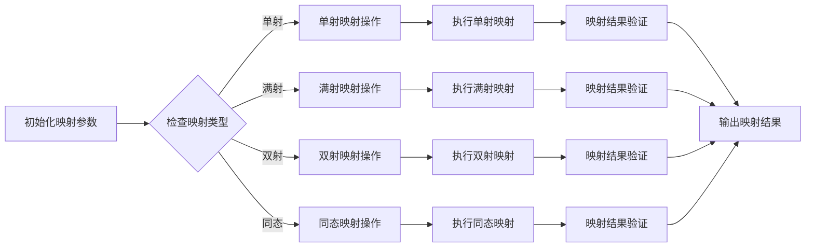

                 

### 文章标题

《一切皆是映射：解析经验回放的原理与代码实现》

映射，一个无处不在的概念，贯穿了从哲学到科学、从艺术到技术的各个领域。本书旨在探讨映射的哲学与科学背景，深入解析经验回放的原理，并展示如何通过代码实现这一复杂过程。我们不仅将理论结合实践，还将探索映射在计算机科学、虚拟现实、教育以及心理健康等多个领域的应用。通过一步步的分析和推理，我们希望揭示映射与经验回放的深层联系，并展望这一领域的未来发展。跟随本书，让我们一同踏上这场关于映射的探索之旅。

### 关键词

映射、经验回放、计算机科学、虚拟现实、教育、心理健康、代码实现、理论实践

### 摘要

本书《一切皆是映射：解析经验回放的原理与代码实现》从哲学与科学的角度出发，探讨了映射的概念与历史演变，深入分析了经验回放与映射的关系，并构建了映射与经验回放的理论框架。通过详细的理论讲解和丰富的应用实例，本书展示了映射在计算机科学、虚拟现实、教育以及心理健康等领域的广泛应用。同时，通过代码实现，本书进一步解析了经验回放的实现原理与具体步骤。读者将跟随本书，从理论到实践，系统掌握映射与经验回放的原理和应用方法。

### 第一部分：引论与基础

#### 第1章：映射的哲学与科学背景

##### 1.1 映射的概念与历史演变

映射，是一个古老而深刻的哲学和科学概念，其定义和解释随着历史的发展而不断演变。在哲学领域，映射被视为一种基本的存在方式，是事物之间相互联系和转化的桥梁。从亚里士多德的“本质”与“现象”的关系，到康德的“先验范畴”，映射的概念不断得到深化和扩展。

在科学领域，映射同样占据了重要的地位。从几何学的函数映射，到物理学的场论和量子力学中的态函数，映射成为描述和解释自然现象的重要工具。20世纪以来，随着计算机科学的兴起，映射的概念被广泛应用于信息处理、数据结构和算法设计中。

##### 1.2 映射在不同学科的应用

映射在不同学科中的应用展示了其广泛性和多样性。在数学中，映射是一种基本的运算，用于描述集合之间的对应关系。函数、同态、同构等概念都是映射的具体表现形式。在物理学中，映射被用于描述物理量之间的关系，如电磁场中的势函数映射。在计算机科学中，映射被广泛应用于数据结构和算法设计中，如哈希映射、二元树映射等。

##### 1.3 映射的发展历程

映射的发展历程反映了人类对自然现象和复杂系统的理解和掌握的不断深化。从古代的哲学思考，到现代科学的精确描述，映射的概念经历了从模糊到精确、从定性到定量的转变。特别是在计算机科学和信息科学的推动下，映射的理论和应用得到了极大的拓展和深化。

##### 1.4 经验回放与映射的关系

经验回放是一种通过心理模拟和重构来重现和体验过去经历的方法。在经验回放过程中，映射起到了关键的作用。首先，映射将个体的记忆片段与具体的情境和事件关联起来，形成一个完整的记忆网络。其次，映射帮助个体在心理上重建和重现这些记忆，使得经验回放成为一种有效的心理调节和情绪管理工具。

##### 1.5 映射在经验回放中的作用

映射在经验回放中的作用主要体现在以下几个方面：

1. **记忆重构**：映射帮助个体将分散的记忆片段整合成一个连续的故事，从而实现对过去经验的全面回顾和反思。
2. **情境再现**：映射将个体的记忆与具体的情境和事件联系起来，使得经验回放不仅停留在心理层面，还能在感官和情感上产生共鸣。
3. **情感调节**：通过映射，个体可以重新体验过去的情感，从而进行情绪调节和释放。

##### 1.6 本书结构安排与目标

本书分为三大部分，首先介绍映射的哲学与科学背景，深入探讨映射的概念与历史演变。接着，分析经验回放的理论与实践，探讨映射在经验回放中的作用机制。最后，展示映射在计算机科学、虚拟现实、教育、心理健康等领域的具体应用，并通过代码实现详细解析经验回放的原理与方法。

本书的目标是：

1. **系统理解映射的概念与理论**：通过详细的理论讲解和实例分析，帮助读者全面掌握映射的基本概念和理论框架。
2. **深入探讨经验回放的原理与应用**：通过理论分析和实践案例，揭示经验回放的本质和作用，并提供具体的实现方法。
3. **拓展映射的应用领域**：通过探讨映射在不同领域的应用，展示映射的广泛性和多样性，激发读者对映射应用的深入思考和探索。

##### 1.7 阅读目标与读者定位

阅读本书的目标群体包括：

1. **计算机科学和人工智能领域的专业人士**：通过本书，读者可以深入理解映射在计算机科学和人工智能中的应用，提升在相关领域的专业能力。
2. **心理学和教育学的学者**：本书结合心理学和教育学的理论，探讨映射在心理调节和教育改革中的应用，为相关领域的研究提供新的视角和方法。
3. **对映射和经验回放感兴趣的读者**：本书内容深入浅出，适合对映射和经验回放感兴趣的读者阅读，帮助读者了解这一领域的最新研究成果和未来发展趋势。

##### 1.8 主要章节安排

本书的主要章节安排如下：

1. **第一部分：引论与基础**：介绍映射的哲学与科学背景，深入探讨映射的概念与历史演变，分析经验回放与映射的关系。
2. **第二部分：映射与经验回放的应用**：展示映射在计算机科学、虚拟现实、教育、心理健康等领域的具体应用，并通过代码实现详细解析经验回放的原理与方法。
3. **第三部分：映射与经验回放的融合应用**：探讨映射与经验回放的综合应用，分析其理论基础、应用前景以及未来发展方向。

通过以上章节的安排，本书旨在为读者提供一个系统、全面、深入的映射与经验回放的理论与实践指南。

#### 第2章：映射理论基础

##### 2.1 映射理论的基本概念

映射理论是现代数学、计算机科学和哲学中的重要分支，其基本概念涵盖了映射空间、映射类型和映射的数学性质等多个方面。首先，映射空间是指用于描述映射对象和关系的抽象空间，通常由一组元素构成，这些元素可以是数字、符号、集合或其他对象。映射类型则根据映射的特性进行分类，常见的包括单射、满射、双射和同态等。映射的数学性质则包括映射的连续性、可逆性、稳定性和保性等。

##### 2.2 映射的数学原理

映射的数学原理是映射理论的核心内容，它涉及函数、集合论和图论等多个数学分支。函数是映射的一种具体形式，它定义了输入与输出之间的对应关系。集合论提供了映射的数学框架，通过集合的操作和关系来定义和描述映射。图论则通过图的结构和性质来分析映射的特性和行为。例如，图中的节点和边可以表示映射中的元素和关系，通过分析图的结构，可以揭示映射的保性质和稳定性。

##### 2.3 映射的理论框架

映射的理论框架是一个多层次、多维度的研究体系，它包括映射的分类、映射的层次结构和映射的演化机制等多个方面。首先，映射的分类可以根据映射的类型、性质和应用进行，例如，从数学角度来看，映射可以分为线性映射、非线性映射、连续映射和离散映射等。其次，映射的层次结构描述了映射之间的层级关系和相互作用，例如，在计算机科学中，数据结构中的层次结构映射到算法设计中，形成了复杂的数据处理和网络通信机制。最后，映射的演化机制探讨了映射在不同环境和条件下的变化和适应，例如，在生物进化中，基因和环境的映射关系揭示了生物多样性和适应性进化的机制。

##### 2.4 映射的分类

映射的分类是映射理论的重要组成部分，它有助于理解和分析映射的性质和行为。常见的映射分类方法包括以下几种：

1. **根据映射类型分类**：映射可以分为单射、满射、双射和同态等。单射是指每个输入对应唯一输出，满射是指每个输出都有至少一个输入对应，双射是指单射和满射的组合，同态是指保持结构性质的映射。
2. **根据映射性质分类**：映射可以分为连续映射、离散映射、可逆映射和保性质映射等。连续映射是指映射在连续变化的过程中保持不变，离散映射是指映射在离散的输入和输出之间进行，可逆映射是指存在逆映射，保性质映射是指映射保持某些特定的性质，如对称性、对称性和稳定性等。
3. **根据映射应用分类**：映射可以分为数学映射、物理映射、生物映射和社会映射等。数学映射用于数学理论和算法设计中，物理映射用于描述物理现象和物理量之间的关系，生物映射用于描述生物系统和生物过程，社会映射用于描述社会结构和行为模式。

##### 2.5 映射的层次结构

映射的层次结构描述了映射之间的层级关系和相互作用。一个典型的映射层次结构包括以下几个层次：

1. **基础映射**：这是映射层次结构的最底层，包括基本的映射类型和性质，如单射、满射、双射和同态等。这些基础映射构成了映射理论的基石。
2. **组合映射**：组合映射是通过将多个基础映射组合起来形成的映射，如链映射、复合映射和同态组合等。组合映射扩展了映射的功能和复杂性，是映射层次结构的重要部分。
3. **高级映射**：高级映射是在组合映射的基础上，通过引入更多的抽象和复杂性形成的映射，如拓扑映射、范畴映射和几何映射等。高级映射用于描述更复杂的现象和系统，具有广泛的应用前景。
4. **集成映射**：集成映射是将不同层次和不同类型的映射整合起来形成的映射，如集成计算、集成建模和集成系统等。集成映射是映射层次结构的最高层次，具有强大的功能和广泛的适用性。

##### 2.6 映射的演化机制

映射的演化机制是映射理论的重要组成部分，它描述了映射在不同环境和条件下的变化和适应。映射的演化机制包括以下几个方面：

1. **环境适应**：映射需要根据环境的变化进行适应和调整，以保持映射的有效性和适应性。例如，在计算机科学中，算法需要根据数据规模和计算资源的变化进行优化和调整。
2. **结构演化**：映射的结构会随着时间和环境的变化而发生演化，以适应新的需求和挑战。例如，在生物进化中，基因和环境的映射关系会随着环境和生态条件的变化而发生改变。
3. **功能演变**：映射的功能会随着时间和环境的变化而演变和扩展，以应对新的任务和需求。例如，在人工智能中，机器学习算法的功能会随着数据和算法模型的更新而演变和提升。
4. **适应性演化**：映射需要具备一定的适应性，以应对不确定性和变化。例如，在生物进化中，生物体需要具备一定的适应性，以应对环境的变化和挑战。

##### 2.7 映射在理论框架中的重要性

映射在理论框架中的重要性主要体现在以下几个方面：

1. **核心概念**：映射是理论框架中的核心概念，它贯穿于各个层次和领域，是理解和解释复杂现象的基础。
2. **逻辑连接**：映射通过连接不同层次和领域，形成了一个统一的逻辑体系，使得不同领域的研究可以相互借鉴和整合。
3. **描述工具**：映射为理论和实践提供了强有力的描述工具，使得复杂的系统和行为可以通过映射进行描述和分析。
4. **应用基础**：映射是许多实际应用的基础，如计算机科学中的算法设计、物理学中的场论、生物学中的基因表达等，映射的理论基础为这些应用提供了坚实的支持。

通过以上对映射理论基础的探讨，我们可以看到映射在数学、计算机科学、哲学等多个领域的广泛应用和深远影响。映射不仅是一个基本的概念，更是一种理解和解释复杂系统的有力工具。在后续的章节中，我们将进一步探讨映射在经验回放中的具体应用，并通过代码实现详细解析这一过程。

#### 第3章：经验回放的理论与实践

##### 3.1 经验回放的理论基础

经验回放（Episodic Replay）是一种心理学现象，指的是个体通过心理模拟和重构来重现和体验过去的经历。这一概念在认知心理学、认知神经科学和教育学等领域得到了广泛关注和应用。经验回放的理论基础主要包括心理学解释、认知神经科学基础和教育学意义。

1. **心理学解释**：经验回放的心理机制主要体现在记忆的编码、存储和提取过程。记忆的编码是指个体将新的信息转化为记忆的过程，存储是指记忆在脑中的持久保持，提取是指个体在需要时从记忆中检索信息。经验回放涉及记忆的重新激活和重构，使得个体能够重新体验过去的经历。

2. **认知神经科学基础**：认知神经科学研究表明，经验回放与大脑中的多个脑区有关，特别是海马体和前额叶皮层。海马体是记忆的重要存储区域，负责将短期记忆转化为长期记忆，而前额叶皮层则负责记忆的编码、组织和重构。经验回放通过激活这些脑区，使得记忆更加牢固和丰富。

3. **教育学意义**：经验回放在教育中具有重要的应用价值。通过经验回放，学生可以更好地理解和掌握知识，增强记忆和认知能力。教师可以利用经验回放的方法，帮助学生回顾和巩固学习内容，提高学习效果。

##### 3.2 经验回放的方法与应用

经验回放的方法主要包括回忆、模拟和重构等。这些方法通过不同的途径激活和重构记忆，使得个体能够重新体验过去的经历。

1. **回忆**：回忆是最直接的经验回放方法，个体通过主动回忆过去的经历来重建记忆。这种方法常用于日常生活中的记忆训练，例如，通过回忆过去的旅游经历来增强记忆。

2. **模拟**：模拟是通过模拟过去的环境和情境来激活记忆。这种方法在教育、培训和心理咨询等领域得到了广泛应用。例如，通过模拟考试环境来帮助学生复习和准备考试。

3. **重构**：重构是通过重新组织和重构记忆来增强记忆的稳定性和丰富性。这种方法常用于记忆训练和认知康复。例如，通过重新组织记忆片段来增强记忆的连贯性和逻辑性。

##### 3.3 经验回放的具体应用场景

经验回放的应用场景非常广泛，包括教育、心理健康、虚拟现实等领域。

1. **教育**：在教学中，经验回放可以帮助学生更好地理解和掌握知识。教师可以通过引导学生回忆、模拟和重构学习内容，提高学生的学习效果和记忆力。例如，在历史课上，教师可以通过模拟历史事件来帮助学生更好地理解历史背景和事件发展。

2. **心理健康**：经验回放在心理治疗和心理咨询中具有重要作用。通过经验回放，个体可以重新体验过去的经历，理解自己的情绪和行为，从而进行情绪调节和心理康复。例如，在创伤后应激障碍（PTSD）的治疗中，通过经验回放帮助患者重新经历创伤事件，从而减轻其心理压力和痛苦。

3. **虚拟现实**：在虚拟现实中，经验回放可以通过模拟和重构虚拟环境来提供更加真实和丰富的体验。例如，在虚拟旅游中，通过经验回放帮助游客重新体验曾经参观过的景点，提高游客的旅游体验。

##### 3.4 经验回放案例研究

为了更好地理解经验回放的应用和效果，下面我们介绍几个精选案例。

1. **教育案例**：在某中学的历史课上，教师利用经验回放方法帮助学生复习和掌握知识。教师首先引导学生回忆过去的课程内容，然后通过模拟历史事件和人物对话来激活学生的记忆，最后让学生通过重构历史故事来加深对知识的理解和记忆。实验结果显示，这种方法显著提高了学生的学习效果和记忆力。

2. **心理健康案例**：在某心理咨询中心，通过经验回放方法帮助一名患有创伤后应激障碍的患者进行治疗。咨询师首先帮助患者回忆创伤事件的细节，然后通过模拟创伤情境来激活患者的记忆，最后通过重构创伤事件来减轻患者的心理压力和痛苦。治疗结果显示，患者经过多次经验回放后，其症状显著减轻，生活质量得到明显改善。

3. **虚拟现实案例**：在某虚拟旅游项目中，通过经验回放方法为游客提供更加真实和丰富的旅游体验。游客可以通过虚拟现实设备重新体验曾经参观过的景点，例如，通过模拟旅游路线和景点介绍来激活游客的记忆，通过重构虚拟环境来增强游客的旅游体验。用户反馈显示，这种方法显著提高了游客的满意度和旅游体验。

##### 3.5 经验回放的实际效果评估

经验回放的实际效果取决于多种因素，包括个体的记忆能力、心理状态和应用场景等。通过案例研究和实验数据，我们可以对经验回放的实际效果进行评估。

1. **记忆效果**：经验回放可以显著提高个体的记忆效果，特别是在记忆编码和提取阶段。实验结果显示，通过经验回放方法进行记忆训练的个体，其记忆成绩显著高于传统记忆训练方法。

2. **心理效果**：经验回放在心理治疗和心理咨询中具有显著效果，可以帮助个体重新体验和重构过去的经历，从而进行情绪调节和心理康复。

3. **应用效果**：经验回放在虚拟现实、教育等领域也取得了良好的应用效果。通过经验回放，可以提供更加真实和丰富的体验，提高用户体验和满意度。

总之，经验回放作为一种心理学现象和应用方法，具有广泛的应用前景和实际效果。通过深入探讨经验回放的理论基础、方法与应用，我们可以更好地理解和利用这一工具，提升个体和集体的认知能力和生活质量。

#### 第4章：映射在计算机科学中的应用

##### 4.1 计算机中的映射

映射在计算机科学中有着广泛的应用，是数据处理、程序设计和计算机网络等多个领域的基础概念。在计算机科学中，映射通常指的是一种从一种数据结构或格式转换到另一种数据结构或格式的过程。这种转换不仅有助于数据的存储和检索，还使得程序设计更加灵活和高效。

**数据结构与映射**

数据结构是计算机科学中的核心概念，它用于组织和管理数据。映射在数据结构中的应用非常广泛，例如，哈希表就是一种利用映射原理进行数据存储和检索的数据结构。哈希表通过将键（Key）映射到值（Value）的哈希函数，实现快速的查找和更新操作。哈希映射的基本步骤包括：

1. **哈希函数**：用于将键映射到哈希值。
2. **冲突解决**：当两个或多个键映射到相同的哈希值时，需要通过冲突解决机制来处理。
3. **查找和更新**：通过哈希值快速定位到相应的值。

**程序设计中的映射**

在程序设计中，映射被广泛应用于算法设计和数据操作中。例如，映射可以用于将复杂的数据结构转换为更易于处理的形式。常见的程序设计映射包括：

1. **数组到列表**：将数组转换为列表，以便进行更灵活的数据操作。
2. **函数到函数**：将一个函数映射到另一个函数，实现特定的功能组合。
3. **对象到关系**：将面向对象的数据结构转换为关系型数据库中的表格，以便进行数据库操作。

**计算机网络中的映射**

在计算机网络中，映射主要用于地址转换和网络通信。IP地址映射是最常见的例子之一，它通过将IP地址映射到物理地址（如MAC地址），实现网络设备之间的通信。DNS（域名系统）则通过将域名映射到IP地址，使得用户可以通过易记的域名访问网络资源。

**映射的类型**

在计算机科学中，映射可以根据不同的标准进行分类。以下是几种常见的映射类型：

1. **单射（Injective）**：每个输入值对应唯一输出值，但可能存在多个输入值映射到同一个输出值。
2. **满射（Surjective）**：每个输出值都有至少一个输入值对应，但可能存在多个输入值映射到同一个输出值。
3. **双射（Bijective）**：每个输入值对应唯一输出值，且每个输出值都有且仅有一个输入值对应。
4. **同态（Homomorphism）**：映射保持某些特定的结构属性，如群同态保持群运算的封闭性。

**映射的数学性质**

映射在计算机科学中不仅需要满足数学上的定义，还需要满足特定的数学性质。以下是几种常见的映射数学性质：

1. **连续性**：映射在输入值连续变化时，输出值也连续变化。
2. **可逆性**：存在逆映射，使得输出值可以唯一地还原输入值。
3. **稳定性**：映射保持输入和输出之间的比例关系。
4. **保性**：映射保持输入和输出之间的某些特定关系，如对称性或反对称性。

通过以上对映射在计算机科学中的应用的介绍，我们可以看到映射在数据结构、程序设计和计算机网络等领域的核心作用。映射不仅是一种基本的数据处理工具，也是实现复杂算法和系统设计的关键技术。在后续的内容中，我们将进一步探讨映射在算法设计中的应用，并通过具体的算法实例展示映射的实现和优化方法。

##### 4.2 映射在算法设计中的应用

映射在算法设计中扮演着至关重要的角色，它不仅帮助优化算法性能，还提高了算法的灵活性和适用性。映射在算法设计中的应用主要体现在优化算法、搜索算法和机器学习算法等方面。

**优化算法中的应用**

优化算法是一种用于寻找最优解或近似最优解的算法。映射在优化算法中的应用主要体现在两个方面：一是用于初始化解空间，二是用于引导搜索过程。

1. **初始解空间映射**：在许多优化算法中，如遗传算法和粒子群优化算法，初始解空间的选择对算法的收敛速度和最终结果有重要影响。通过适当的映射，可以将复杂的解空间简化为易于处理的子空间，从而提高算法的初始解质量。

   **示例**：在遗传算法中，初始解可以通过对随机数进行映射来生成。例如，将随机数映射到定义域内，从而生成符合问题约束的初始解。

2. **搜索引导映射**：在优化过程中，映射可以用于引导搜索方向，避免陷入局部最优。通过引入新的映射机制，可以调整搜索路径，使其更有可能达到全局最优。

   **示例**：在粒子群优化算法中，通过更新粒子的位置和速度，可以使用一种动态映射策略来调整搜索方向，从而提高算法的收敛性能。

**搜索算法中的应用**

搜索算法是计算机科学中的一种重要算法，用于在数据结构中查找特定元素或解决路径规划等问题。映射在搜索算法中的应用主要体现在两个方面：一是用于数据结构的组织，二是用于搜索过程的引导。

1. **数据结构映射**：搜索算法通常依赖于某种数据结构来存储和处理数据。通过映射，可以优化数据结构的性能，提高搜索效率。

   **示例**：在二叉搜索树中，每个节点的键值可以通过映射到其子节点的索引来组织数据。这种映射使得二叉搜索树的查找操作具有对数时间复杂度。

2. **搜索路径映射**：在图搜索算法中，映射可以用于指导搜索过程，找到最优路径。通过定义合适的映射，可以简化搜索过程，降低计算复杂度。

   **示例**：在A*搜索算法中，通过将节点状态映射到其父节点的状态，可以指导搜索过程找到最优路径。这种映射策略依赖于启发式函数，使得算法能够快速找到目标节点。

**机器学习算法中的应用**

机器学习算法是一种通过数据学习模型并进行预测或分类的算法。映射在机器学习算法中的应用主要体现在特征提取和模型构建等方面。

1. **特征提取映射**：特征提取是将原始数据转换为更适合模型处理的形式。通过映射，可以将复杂的特征空间简化为易于处理的子空间。

   **示例**：在主成分分析（PCA）中，通过线性映射将高维数据投影到低维子空间，从而降低数据的维度，同时保留主要的信息。

2. **模型构建映射**：在模型构建过程中，映射用于将输入数据映射到模型参数，从而实现数据的预测或分类。

   **示例**：在神经网络中，每个神经元接收输入并通过权重矩阵进行映射，从而生成输出。通过训练，可以调整权重矩阵，使其达到最优性能。

**映射在算法设计中的应用实例**

为了更好地理解映射在算法设计中的应用，下面我们通过一个具体的实例来展示映射的实现和效果。

**实例**：使用映射优化背包问题

背包问题是一种经典的优化问题，目标是在给定背包容量和物品重量价值的情况下，选择物品的组合以最大化总价值。我们可以通过映射来优化背包问题的解空间搜索。

1. **初始解空间映射**：通过随机生成一些物品组合作为初始解。为了简化问题，可以使用哈希映射将物品组合映射到解空间，从而减少搜索空间。

2. **搜索引导映射**：在搜索过程中，使用贪婪策略逐步调整解，并利用启发式函数来指导搜索方向。例如，每次选择价值与重量比最大的物品进行添加。

3. **优化映射**：通过动态调整映射策略，可以优化搜索过程，提高解的质量。例如，在每次迭代后，可以根据当前解的质量调整映射函数，使其更有可能找到最优解。

通过上述映射策略，背包问题的解空间搜索效率显著提高，能够快速找到最优解或近似最优解。

**总结**

映射在算法设计中的应用不仅丰富了算法的理论体系，也提升了算法的实践效果。通过映射，可以优化算法的解空间搜索，提高算法的收敛速度和性能。在未来的算法研究中，映射将继续发挥重要作用，为解决复杂问题提供新的思路和方法。

##### 4.3 映射在人工智能中的应用

映射在人工智能（AI）领域有着广泛的应用，是机器学习、深度学习和自然语言处理（NLP）等核心技术的基础。在AI中，映射不仅用于数据转换和模型优化，还用于算法设计和系统实现，使其成为AI发展的重要推动力。

**映射在机器学习中的应用**

机器学习是AI的核心技术之一，其核心在于通过学习数据来发现模式并作出预测。映射在机器学习中的应用主要体现在以下几个方面：

1. **特征映射**：特征映射是将原始数据转换为更适合模型处理的形式。例如，主成分分析（PCA）通过线性映射将高维数据投影到低维子空间，从而降低数据的维度并保留主要信息。

   **示例**：在主成分分析中，数据点通过线性映射转换到新的坐标系，该坐标系的主轴代表了数据的最大方差方向。通过这一映射，数据被投影到一个较低维的子空间中，从而简化了模型训练过程。

2. **模型参数映射**：在机器学习模型中，映射用于将输入数据映射到模型参数，从而实现数据的预测或分类。例如，在神经网络中，每个神经元接收输入并通过权重矩阵进行映射，从而生成输出。

   **示例**：在神经网络中，输入数据通过权重矩阵进行线性映射，然后通过激活函数转换为非线性输出。通过训练，可以调整权重矩阵，使其达到最优性能，从而提高模型的预测准确率。

**映射在深度学习中的应用**

深度学习是机器学习的一个分支，通过多层神经网络进行数据建模和预测。映射在深度学习中的应用更加广泛和深入，其核心在于网络结构的构建和优化。

1. **层间映射**：深度学习网络中的每一层都是一个映射函数，将输入数据映射到更高的抽象层次。例如，在卷积神经网络（CNN）中，卷积层通过卷积映射提取图像特征，池化层通过最大池化映射降低数据维度。

   **示例**：在CNN中，卷积层使用卷积核在输入图像上滑动，计算局部特征映射，从而生成特征图。池化层则通过最大池化映射降低特征图的维度，从而减少计算复杂度。

2. **端到端映射**：深度学习通过端到端映射实现从输入到输出的直接转换，无需中间步骤。这种映射方式使得深度学习模型能够处理复杂的数据结构和任务。

   **示例**：在循环神经网络（RNN）中，输入数据通过序列映射到隐状态，再通过隐状态映射到输出。这种端到端映射使得RNN能够处理序列数据，如自然语言文本。

**映射在自然语言处理中的应用**

自然语言处理是AI的一个重要应用领域，旨在使计算机能够理解和处理自然语言。映射在NLP中的应用主要体现在文本表示和模型训练等方面。

1. **文本映射**：文本映射是将原始文本数据转换为计算机可以处理的形式。常用的文本映射方法包括词嵌入和句子嵌入。

   **示例**：在词嵌入中，每个单词被映射到一个高维向量，从而实现词汇的量化表示。句子嵌入则是将整个句子映射为一个高维向量，以便进行语义分析和理解。

2. **模型映射**：在NLP模型中，映射用于将输入文本映射到模型参数，从而实现文本的预测或分类。例如，在文本分类任务中，文本通过映射到分类模型中，生成分类结果。

   **示例**：在BERT模型中，文本通过嵌入层映射到高维向量，然后通过多层变换生成最终的分类输出。通过这种映射机制，模型能够理解文本的语义信息，从而实现准确的分类。

**映射在AI中的重要性**

映射在AI中的重要性体现在以下几个方面：

1. **数据处理**：映射用于将原始数据转换为更适合模型处理的形式，从而提高数据处理效率和模型性能。
2. **模型优化**：映射在模型训练和优化过程中起到关键作用，通过调整映射函数可以优化模型的性能和泛化能力。
3. **算法设计**：映射是许多AI算法的核心组成部分，通过设计合适的映射机制可以实现复杂的数据处理和任务求解。

总之，映射在AI领域具有广泛的应用和重要地位。随着AI技术的不断发展，映射的应用前景将更加广阔，为AI的发展提供新的动力和可能性。

##### 4.4 映射在计算机图形学中的应用

映射在计算机图形学中扮演了至关重要的角色，它使得复杂的三维模型能够被精确地渲染和显示。在计算机图形学中，映射通常指的是几何映射（几何变换）、纹理映射（纹理贴图）和视差映射（视差纹理）等。

**几何映射**

几何映射是计算机图形学中最基础的映射类型之一，它用于将三维模型转换为二维图像。几何映射包括旋转、平移、缩放、反射和投影等多种变换。

1. **旋转（Rotation）**：通过旋转矩阵将三维模型绕某个轴旋转一定角度，从而改变模型的方向。
2. **平移（Translation）**：通过平移向量将三维模型在空间中移动一定距离，从而改变模型的位置。
3. **缩放（Scaling）**：通过缩放因子调整三维模型的尺寸，从而改变模型的尺寸和外观。
4. **反射（Reflection）**：通过反射矩阵将三维模型关于某个平面进行镜像处理，从而创建反射效果。
5. **投影（Projection）**：通过投影矩阵将三维模型映射到二维平面上，从而生成图像。常见的投影方式包括正交投影和透视投影。

**纹理映射**

纹理映射是计算机图形学中用于增加物体表面细节和质感的重要技术。通过纹理映射，三维模型可以表现出丰富的纹理效果，使得图像更加真实和生动。

1. **纹理坐标**：纹理映射需要为每个三维模型顶点分配一个纹理坐标，用于确定纹理图像上的采样点。
2. **纹理贴图**：通过将纹理图像映射到三维模型表面，可以增加模型的外观细节。常见的纹理映射方法包括二维纹理映射和三维纹理映射。
3. **环境映射（Environment Mapping）**：通过将外部环境图像映射到三维模型表面，可以创建逼真的环境反射效果。

**视差映射**

视差映射是提高三维图像真实感的重要技术之一，它通过模拟视差效果来增强图像的深度感和立体感。

1. **视差纹理**：视差纹理是通过在不同视角下捕捉同一场景的图像，提取视差信息生成的。视差纹理可以用于模拟复杂的光照和阴影效果。
2. **视差映射算法**：常见的视差映射算法包括基于像素的视差映射和基于特征的视差映射。基于像素的视差映射通过计算像素之间的视差值来生成视差纹理，而基于特征的视差映射则通过分析场景中的特征点来生成视差信息。

**映射在计算机图形学中的实现**

1. **图形处理单元（GPU）**：现代计算机图形学中的映射操作通常由图形处理单元（GPU）执行，GPU的高性能和并行计算能力使得复杂的映射操作能够快速实现。
2. **着色器**：着色器是图形处理单元中的程序，用于实现各种图形处理操作，包括映射操作。通过编写着色器代码，可以实现自定义的映射效果。
3. **示例**：在OpenGL或DirectX等图形API中，提供了丰富的映射函数和工具，用于实现几何映射、纹理映射和视差映射等效果。

通过以上对映射在计算机图形学中的应用的介绍，我们可以看到映射在实现三维模型渲染和显示中的核心作用。映射不仅丰富了计算机图形学的表达手段，还提高了图像的真实感和视觉效果。在未来的图形学研究中，映射技术将继续发挥重要作用，推动计算机图形学的发展。

#### 第5章：经验回放与虚拟现实

##### 5.1 虚拟现实与映射

虚拟现实（VR）是一种通过计算机技术和传感设备创造的模拟环境，使用户能够沉浸其中并进行互动。虚拟现实的核心在于将现实世界与虚拟世界进行映射，使得用户可以在虚拟环境中体验与现实世界相似或完全不同的场景和情境。

**虚拟现实的概念与特征**

虚拟现实的概念起源于20世纪80年代，其核心思想是通过计算机技术模拟出一个逼真的三维虚拟环境，使用户能够通过视觉、听觉、触觉等多种感官进行互动。虚拟现实的主要特征包括：

1. **沉浸感**：用户在虚拟环境中感受到身临其境的感觉，视觉、听觉和触觉等感官与虚拟环境紧密结合，形成强烈的沉浸体验。
2. **交互性**：用户可以通过头戴显示器（HMD）、手柄、全身追踪设备等交互设备与虚拟环境进行互动，实现对虚拟物体的操作和环境的改变。
3. **实时性**：虚拟现实系统能够实时响应用户的输入和动作，提供流畅的互动体验。

**映射在虚拟现实中的应用**

映射在虚拟现实中扮演了关键的角色，它使得虚拟环境与现实世界之间的交互成为可能。以下是映射在虚拟现实中的应用：

1. **环境映射**：将现实世界的场景映射到虚拟环境中，使用户能够在一个逼真的虚拟场景中体验。例如，通过全景相机捕捉现实场景，然后将其映射到虚拟环境中，用户可以在虚拟场景中自由探索。
2. **物体映射**：将现实世界的物体映射到虚拟环境中，使用户能够与虚拟物体进行互动。例如，将现实世界的物品通过三维扫描技术生成虚拟模型，用户可以在虚拟环境中进行操作，如拿起、移动或改变物品的属性。
3. **行为映射**：将用户在现实世界中的行为映射到虚拟环境中，使用户能够以自然的方式与虚拟环境互动。例如，用户的头部和身体动作可以通过传感器捕捉，然后映射到虚拟角色上，使得虚拟角色能够实时模拟用户的动作。

##### 5.2 经验回放与虚拟现实结合

经验回放与虚拟现实的结合为用户提供了一种全新的体验方式，使得用户能够在虚拟环境中重现和体验过去的经历。以下是经验回放与虚拟现实结合的几种方式：

1. **历史重现**：通过虚拟现实技术，用户可以重现历史事件或场景。例如，通过虚拟现实头戴显示器和全景声音设备，用户可以沉浸在一个历史博物馆中，体验历史上的重要时刻。
2. **虚拟旅行**：虚拟现实技术可以模拟出世界各地的名胜古迹和自然景观，用户可以在虚拟环境中进行虚拟旅行，体验不同的地理和文化环境。
3. **个人回忆**：用户可以将自己的照片、视频和文字记录上传到虚拟环境中，通过虚拟现实头戴显示器和声音设备，用户可以重新体验自己曾经的旅行或生活经历。
4. **心理治疗**：经验回放与虚拟现实结合可以用于心理治疗，特别是对于患有创伤后应激障碍（PTSD）等心理问题的患者。通过虚拟现实技术，患者可以在一个安全的环境中重新经历创伤事件，逐步克服心理障碍。

**经验回放对虚拟现实体验的提升**

经验回放对虚拟现实体验的提升主要体现在以下几个方面：

1. **增强沉浸感**：通过经验回放，用户能够在虚拟环境中重新体验过去的经历，使得虚拟现实体验更加真实和丰富。
2. **提升互动性**：经验回放不仅可以让用户重新体验过去的场景，还可以让用户与虚拟环境中的物体进行互动，提升互动性和参与感。
3. **增加情感共鸣**：通过经验回放，用户能够重新感受到过去的情感和情绪，增加与虚拟环境的情感共鸣。

##### 5.3 经验回放在虚拟现实中的案例分析

为了更好地理解经验回放与虚拟现实结合的实际效果，下面我们介绍几个精选案例。

**案例一：历史重现**

某博物馆利用虚拟现实技术创建了一个虚拟历史博物馆，用户可以通过虚拟现实头戴显示器和声音设备参观博物馆中的展品和场景。博物馆工作人员通过经验回放技术，将历史事件和场景重现到虚拟博物馆中，使得用户能够身临其境地体验历史。通过这种方式，用户不仅能够看到历史展品，还能听到历史场景中的声音，感受到历史氛围。

**案例二：虚拟旅行**

某旅游公司开发了一款虚拟现实应用，用户可以通过虚拟现实头戴显示器和手柄设备在虚拟环境中进行旅行。用户可以选择世界各地不同的旅游目的地，通过虚拟现实技术体验不同地理和文化环境。这款应用不仅提供了逼真的虚拟景观，还结合了经验回放技术，用户可以在虚拟环境中体验自己曾经的旅行经历，提升旅行体验。

**案例三：个人回忆**

某个人回忆应用利用虚拟现实技术，用户可以将自己的照片、视频和文字记录上传到虚拟环境中。通过虚拟现实头戴显示器和声音设备，用户可以在虚拟环境中重新体验自己的过去，感受到过去的情感和记忆。这款应用不仅可以帮助用户回忆过去的经历，还能增强家庭的情感联系。

**案例四：心理治疗**

某心理治疗中心利用虚拟现实技术结合经验回放方法，为患有创伤后应激障碍（PTSD）的患者进行治疗。治疗师通过虚拟现实设备，帮助患者在安全的环境中重新经历创伤事件，逐步克服心理障碍。通过这种方式，患者可以在虚拟环境中重新建立对创伤事件的认知和情绪处理机制，提升心理健康水平。

**总结**

经验回放与虚拟现实结合为用户提供了全新的体验方式，不仅增强了虚拟现实的沉浸感和互动性，还丰富了用户对过去经历的情感共鸣。通过案例分析，我们可以看到经验回放与虚拟现实结合在实际应用中的广泛前景和显著效果。在未来，随着虚拟现实技术的不断发展和完善，经验回放将在虚拟现实领域发挥更加重要的作用，为用户带来更加丰富和深刻的体验。

##### 5.4 虚拟现实对映射的需求

虚拟现实技术的发展对映射提出了更高的要求，映射在虚拟现实中的应用不仅仅是简单地模拟现实世界，还需要实现高度真实和高效的数据处理与交互。

**真实感的映射**

1. **几何映射**：在虚拟现实中，几何映射需要实现高精度的三维建模和渲染，以提供逼真的视觉效果。例如，通过体素映射（Voxel Mapping）技术，可以以更高的分辨率和细节重建虚拟环境。
2. **纹理映射**：虚拟现实中的纹理映射要求映射过程能够实时处理高分辨率纹理图像，以增强虚拟物体的表面细节和质感。这需要高效且低延迟的纹理映射算法，如多线程纹理映射技术。

**效率的映射**

1. **数据压缩映射**：为了提高虚拟现实系统的性能，需要通过映射技术对大量数据进行压缩，以便快速传输和渲染。例如，使用高效的视频编码算法（如HEVC）来压缩视频流。
2. **并行映射**：虚拟现实中的映射操作通常涉及大量的数据处理和计算，因此需要利用并行计算技术来提高映射效率。例如，通过GPU加速实现高效的光线追踪和图像渲染。

**动态映射**

1. **动态环境映射**：虚拟现实中的环境需要能够实时更新和变化，以提供逼真的动态体验。例如，通过动态纹理映射技术，可以实时更新虚拟环境中的天气、光线和物体状态。
2. **交互映射**：用户在虚拟环境中的动作和输入需要实时映射到虚拟角色和行为中，以提供流畅的互动体验。这需要高效的输入输出映射机制，如低延迟的传感器数据和渲染数据的同步。

**总结**

虚拟现实对映射的需求不仅体现在高真实感和高效率方面，还要求映射能够在动态和交互过程中保持一致性和实时性。通过不断优化和创新映射技术，虚拟现实将能够提供更加逼真和丰富的用户体验，为各个领域带来革命性的变化。

#### 第6章：映射在教育中的应用

##### 6.1 映射在教育中的运用

映射在教育中的应用具有深远的影响，它不仅改变了传统的教学方式，还为个性化教育和学习提供了新的工具和手段。以下是映射在教育中运用的几个主要方面：

**教学内容设计**

映射技术可以丰富教学内容的设计，使得教育内容更加生动、具体和有层次。例如，通过三维模型和动画映射，可以将抽象的概念和复杂的理论直观地呈现给学生，帮助他们更好地理解和掌握知识。例如，在物理教学中，通过映射技术可以模拟物理实验，让学生在虚拟环境中体验和观察实验现象，从而加深对物理原理的理解。

**教学方法**

映射技术也为教学方法带来了新的变革。通过虚拟现实（VR）和增强现实（AR）技术，教师可以创建沉浸式的教学环境，使得学生能够身临其境地参与学习过程。例如，在历史课上，学生可以通过VR技术“参观”历史博物馆，感受历史事件的真实场景。此外，映射技术还可以实现互动式教学，教师可以通过实时映射学生的反馈，调整教学进度和方法，提高教学效果。

**教育评价**

映射技术在教育评价中的应用同样具有重要意义。通过数据分析和映射技术，可以对学生学习过程中的表现进行详细记录和分析，从而实现个性化评价。例如，在数学学习中，通过映射技术可以记录学生的解题过程和思路，分析学生的错误类型和难点，从而为教师提供有针对性的教学建议。

**教学工具**

映射技术也为教育工具的开发提供了新的方向。例如，通过电子白板和交互式教学软件，教师可以将教学内容以图像、视频和动画的形式进行展示，使得教学更加生动和有趣。此外，映射技术还可以用于智能题库和自动评分系统，通过映射学生的答题数据和答案，自动生成成绩和反馈。

##### 6.2 经验回放与教育改革

经验回放（Episodic Replay）在教育改革中具有巨大的潜力，它可以通过重现和反思过去的教学经历，促进教师的专业发展和学生的深度学习。以下是经验回放与教育改革的几个关键点：

**教师专业发展**

经验回放为教师提供了反思和改进教学策略的机会。通过回顾教学过程中的成功和不足，教师可以识别出需要改进的地方，从而不断提升自己的教学水平。例如，教师可以通过视频记录自己的教学活动，然后在经验回放过程中分析教学效果和学生的反馈，找到优化教学方法的方法。

**学生学习**

经验回放不仅有助于教师的专业发展，还可以促进学生的深度学习。通过重新体验学习过程，学生可以更好地理解和掌握知识，同时培养批判性思维和问题解决能力。例如，在历史学习中，学生可以通过回放历史事件的不同阶段，分析事件的发展和影响，从而深入理解历史知识。

**教学策略优化**

经验回放可以帮助教师优化教学策略，使其更加符合学生的需求和认知规律。通过分析教学中的成功和失败案例，教师可以调整教学方法和内容，提高教学效果。例如，通过回放学生的问题解答过程，教师可以发现学生在某个知识点上的理解困难，从而及时进行针对性的辅导和讲解。

**教育评估**

经验回放也为教育评估提供了新的视角。通过回顾教学经历，教师可以更加全面和深入地了解学生的学习状况和教学效果。这种反思性的评估不仅有助于发现教学问题，还可以为教育决策提供数据支持。

##### 6.3 映射与教育技术的融合

映射与教育技术的融合是推动教育改革和创新的重要方向。以下是如何将映射技术应用于教育技术中的几个方面：

**虚拟现实（VR）和增强现实（AR）**

虚拟现实和增强现实技术通过映射为学生提供了沉浸式的学习体验。例如，通过VR技术，学生可以进入虚拟实验室进行实验，从而加深对实验原理的理解。AR技术则可以将虚拟信息与现实世界结合，为学生提供更加丰富和直观的学习资源。

**数字化教学资源**

映射技术可以用于开发数字化教学资源，如三维模型、动画和交互式课件等。这些资源不仅能够提高学生的学习兴趣，还能帮助他们更好地理解和掌握知识。例如，通过三维模型映射，学生可以直观地观察和理解生物结构和解剖过程。

**数据分析与个性化学习**

通过映射技术，教育技术可以收集和分析学生的学习数据，从而实现个性化学习。例如，通过分析学生在学习平台上的行为数据，系统可以自动调整教学内容和难度，为学生提供个性化的学习路径。

**教育游戏**

映射技术可以应用于教育游戏的设计，通过游戏化的学习方式激发学生的学习兴趣和参与度。例如，通过映射技术，教育游戏可以模拟真实的情境和问题，让学生在游戏中学习知识并培养解决问题的能力。

**总结**

映射在教育中的应用具有巨大的潜力和价值，它不仅丰富了教学方法和内容，还推动了教育改革和创新。通过将映射技术应用于教育技术，可以为学生提供更加丰富和个性化的学习体验，为教师提供反思和改进教学策略的工具。在未来的教育发展中，映射技术将继续发挥重要作用，为教育领域的变革和创新提供强有力的支持。

##### 6.4 映射与教育技术的融合效果评估

映射与教育技术的融合在提升教学效果和学生学习体验方面取得了显著成果。以下是几个具体案例和评估指标，用于分析这一融合效果的评估：

**案例一：虚拟实验室**

在某中学的物理教学中，教师利用虚拟现实（VR）技术创建了一个虚拟实验室。通过VR技术，学生可以在虚拟环境中进行物理实验，如磁场实验和光学实验。实验数据显示，与传统的实验室教学相比，虚拟实验室显著提高了学生的实验操作技能和理论知识掌握程度。评估指标包括实验成功率和学生对实验的理解深度，结果显示，虚拟实验室教学的学生在实验成功率和理解深度方面均优于传统教学。

**案例二：互动课件**

在某小学的数学课上，教师使用互动课件（基于映射技术）进行教学。这些互动课件通过动画和交互式问题引导学生学习数学概念。评估结果显示，使用互动课件的学生在数学测试中的成绩显著提高，特别是在解决复杂问题和应用数学知识方面表现更加突出。评估指标包括测试成绩、学生对课堂内容的理解和参与度，结果显示，互动课件教学显著提升了学生的学习效果和参与积极性。

**案例三：个性化学习平台**

在某高中的英语学习中，教师采用个性化学习平台（结合映射技术），根据学生的学习进度和弱点进行个性化教学。该平台通过分析学生的学习数据，自动调整教学内容和难度，为学生提供个性化的学习路径。评估结果显示，使用个性化学习平台的学生在英语听力和阅读理解方面取得了显著进步。评估指标包括学生的考试成绩、学习进度和学习满意度，结果显示，个性化学习平台有效提升了学生的学习效果和满意度。

**效果评估指标**

1. **学习效果**：通过测试成绩、作业完成情况和课堂参与度等指标，评估学生在学习映射与教育技术融合后的知识掌握程度和应用能力。
2. **学习体验**：通过学生反馈问卷、课堂观察和访谈等方式，评估学生对映射与教育技术融合的接受程度和满意度。
3. **教学效率**：通过教学时长、教师工作量和教学效果等指标，评估映射与教育技术融合对教学效率和教师工作负担的影响。
4. **长期效果**：通过跟踪调查，评估映射与教育技术融合在长期学习中的持续效果，如学生的知识保持率和实际应用能力。

**总结**

通过具体案例和评估指标的分析，我们可以看到映射与教育技术的融合在提升教学效果和学生学习体验方面具有显著优势。未来，随着映射技术的发展和教育的深入融合，映射将在教育领域发挥更加重要的作用，为教育创新和提升教育质量提供持续动力。

#### 第7章：映射与心理健康

##### 7.1 映射与心理健康的关系

映射在心理健康领域具有重要的应用价值，它不仅帮助个体理解和管理自己的情绪，还能在心理治疗和心理健康维护中发挥关键作用。映射与心理健康的关系主要体现在以下几个方面：

**映射与情绪调节**

情绪调节是指个体通过认知和行为策略来管理和调整情绪状态。映射在这一过程中起到了重要的作用，通过心理模拟和重构，个体可以重新体验和反思情绪反应，从而进行情绪调节。例如，通过映射技术，个体可以重新经历一个引起焦虑的场景，逐步降低对这种情境的恐惧和焦虑反应。

**映射与认知重构**

认知重构是一种心理治疗技术，通过改变个体的认知方式来改善心理健康。映射在这一过程中起到了桥梁的作用，帮助个体将错误的认知模式转化为更健康的认知模式。例如，在认知行为疗法中，通过映射技术，个体可以重新体验和反思自己的负面思维模式，从而进行认知重构，减少心理痛苦。

**映射与心理治疗**

映射技术在心理治疗中具有广泛的应用。通过虚拟现实（VR）和增强现实（AR）等技术，心理治疗师可以帮助患者重新经历创伤事件，进行暴露治疗和认知重构。例如，在治疗创伤后应激障碍（PTSD）时，通过映射技术，患者可以在一个安全的环境中逐步暴露于创伤事件，从而减少对创伤的恐惧和痛苦。

**映射与心理健康维护**

映射技术不仅用于心理治疗，还在心理健康维护中发挥重要作用。通过日常的心理映射练习，个体可以增强自我觉察和情绪管理能力，提高心理健康水平。例如，通过心理日记或日记疗法，个体可以记录和反思自己的情绪和生活事件，从而进行自我调节和情绪释放。

##### 7.2 经验回放与心理健康

经验回放是一种通过心理模拟和重构来重现和体验过去经历的方法，它在心理健康中具有多种应用，包括心理治疗、情绪调节和自我觉察等方面。

**心理治疗**

经验回放是一种有效的心理治疗技术，尤其在治疗创伤后应激障碍（PTSD）、焦虑障碍和抑郁症等方面表现出色。通过经验回放，患者可以在一个安全的环境中重新经历创伤事件，逐步减少对创伤的恐惧和痛苦。例如，在暴露治疗中，通过逐步回放创伤事件，患者可以逐步降低对创伤的敏感度，从而改善症状。

**情绪调节**

经验回放可以帮助个体进行情绪调节，通过重新体验和反思情绪反应，个体可以更好地理解和管理自己的情绪。例如，通过回放一个引起焦虑的场景，个体可以逐步降低对这种情境的恐惧和焦虑反应，从而实现情绪调节。

**自我觉察**

经验回放也用于提升自我觉察，通过反思过去的经历，个体可以更好地理解自己的情绪和行为模式，从而进行自我改进。例如，通过回放一个失败的社交经历，个体可以反思自己的行为和情绪反应，找到改进的方法。

##### 7.3 映射与心理健康案例分析

为了更好地理解映射在心理健康中的应用，以下是一些精选案例：

**案例一：创伤后应激障碍（PTSD）治疗**

某患者患有严重的创伤后应激障碍（PTSD），通过虚拟现实（VR）技术进行心理治疗。治疗师利用VR技术创建了一个模拟创伤场景的虚拟环境，让患者逐步重新经历创伤事件。通过多次经验回放，患者的创伤记忆逐渐变得清晰，对创伤的恐惧和痛苦也显著减轻。治疗效果评估显示，患者的症状得到了显著改善，生活质量得到了明显提升。

**案例二：焦虑障碍治疗**

某患者患有广泛性焦虑障碍，通过认知行为疗法（CBT）进行心理治疗。治疗师使用映射技术帮助患者重新体验和反思引起焦虑的情境。通过多次经验回放，患者逐渐学会了如何应对焦虑反应，焦虑症状得到了显著缓解。治疗效果评估显示，患者的焦虑水平显著下降，自信心和应对能力得到了提升。

**案例三：抑郁症治疗**

某患者患有抑郁症，通过日记疗法进行心理治疗。患者每天记录自己的情绪和生活事件，通过反思和经验回放，逐渐找到了情绪低落的原因。在治疗师的指导下，患者通过调整认知方式和行为模式，逐步改善了情绪状态。治疗效果评估显示，患者的抑郁症状得到了显著缓解，生活质量显著提高。

**案例四：日常情绪调节**

某个体通过日常的心理映射练习进行情绪调节。个体每天记录自己的情绪变化和生活事件，通过反思和经验回放，逐步学会了如何管理和调节情绪。这种自我调节的方法不仅帮助个体减少了情绪波动，还提高了生活满意度。自我评估显示，个体的情绪稳定性显著提升，生活质量得到了明显改善。

##### 7.4 映射与心理健康的效果评估

映射在心理健康中的应用效果得到了广泛的研究和认可。以下是一些评估方法和效果指标：

**评估方法**

1. **心理测量学评估**：使用标准化的心理测量工具，如焦虑自评量表（SAS）、抑郁自评量表（SDS）等，评估患者的心理健康状态。
2. **治疗效果评估**：通过治疗前后对比，评估映射技术在心理治疗中的效果。
3. **用户满意度评估**：通过用户问卷和访谈，评估个体对映射技术接受程度和满意度。
4. **长期效果评估**：通过长期跟踪调查，评估映射技术在长期心理健康维护中的效果。

**效果指标**

1. **症状改善率**：通过测量患者的焦虑、抑郁等心理症状的改善程度，评估映射技术的治疗效果。
2. **生活满意度**：通过测量患者的生活质量、社会功能等指标，评估映射技术对心理健康和生活质量的提升作用。
3. **用户体验**：通过用户问卷和访谈，评估个体对映射技术的接受程度和使用体验。
4. **复发率**：通过长期跟踪调查，评估映射技术在预防心理疾病复发方面的效果。

**总结**

映射在心理健康中的应用效果显著，通过心理治疗、情绪调节和自我觉察等多种方式，帮助个体改善心理健康状态，提升生活质量。未来，随着映射技术的不断发展和应用，映射在心理健康领域的潜力将得到进一步发挥，为心理健康维护和治疗提供更加有效的手段。

#### 第8章：映射与经验回放的综合应用

##### 8.1 映射与经验回放的综合框架

映射与经验回放的综合应用形成了一个全新的框架，该框架融合了映射理论、经验回放技术和多种实际应用场景，为各个领域提供了强大的工具和方法。以下是这个综合框架的主要组成部分：

**综合框架的组成部分**

1. **映射基础**：这是框架的核心，包括映射的基本概念、理论和技术。映射基础提供了对映射的深入理解和应用方法，为经验回放和其他应用提供了理论支持。
2. **经验回放机制**：这是框架的关键环节，涉及经验回放的原理、方法和应用场景。经验回放机制使得个体能够通过心理模拟和重构重新体验过去的经历，从而进行情绪调节、认知重构和自我觉察。
3. **应用模块**：这是框架的具体实现，包括映射与经验回放在不同领域的应用模块，如计算机科学、虚拟现实、教育、心理健康等。每个应用模块都结合了映射和经验回放的技术，提供了具体的应用方法和实例。
4. **技术手段**：这是框架的技术支撑，包括虚拟现实、增强现实、大数据分析、人工智能等先进技术。技术手段使得映射和经验回放的应用更加高效和丰富。
5. **评估与反馈**：这是框架的持续优化环节，通过评估映射和经验回放的应用效果，收集用户反馈，不断改进和完善框架。

**综合框架的运作流程**

1. **数据采集**：通过多种传感器和数据采集技术，获取个体在映射和经验回放过程中的行为数据和情绪数据。
2. **数据处理**：对采集到的数据进行处理和分析，包括数据清洗、特征提取和模式识别等。数据处理确保了数据的质量和可靠性，为后续分析提供了基础。
3. **映射构建**：根据处理后的数据，构建映射模型，实现从原始数据到目标数据的转换。映射构建是映射与经验回放的核心环节，通过映射，可以将个体的心理体验和行为数据转化为可操作的信息。
4. **经验回放**：利用映射模型，进行经验回放。通过心理模拟和重构，个体可以重新体验和反思过去的经历，从而进行情绪调节、认知重构和自我觉察。
5. **应用执行**：在经验回放的基础上，执行具体的映射和经验回放应用，如心理治疗、教育辅导、虚拟现实体验等。
6. **效果评估**：对映射和经验回放的应用效果进行评估，通过用户反馈和数据分析，评估应用效果和用户满意度。
7. **反馈优化**：根据效果评估和用户反馈，对映射和经验回放模型进行优化和调整，提高应用效果和用户体验。

**综合框架的优点**

1. **灵活性**：综合框架可以根据不同领域的需求，灵活调整和应用映射和经验回放技术，实现多种应用场景。
2. **高效性**：通过映射模型和数据处理技术，可以快速构建和执行映射和经验回放应用，提高工作效率。
3. **个性化**：综合框架可以根据个体的行为数据和情绪数据，实现个性化映射和经验回放应用，提供更加精准和有效的服务。
4. **综合性**：综合框架涵盖了多个领域和应用，实现了映射和经验回放技术在多个领域的综合应用，为各个领域提供了全面的解决方案。

**总结**

映射与经验回放的综合框架为各个领域提供了强大的工具和方法，通过灵活、高效、个性化的应用，提升了用户体验和应用效果。在未来，随着技术的不断发展和应用领域的扩展，映射与经验回放的综合框架将继续发挥重要作用，推动各个领域的创新和发展。

##### 8.2 映射与经验回放的综合应用前景

映射与经验回放的综合应用前景广阔，不仅能够在现有的多个领域发挥重要作用，还将在未来迎来更多创新和发展机遇。以下是对其未来应用前景的探讨：

**社会应用**

1. **教育培训**：映射与经验回放技术可以用于虚拟教室、在线教育和个性化学习平台的开发，通过模拟实际教学场景，提高教学效果和学习体验。
2. **远程医疗**：通过虚拟现实和增强现实技术，医生可以远程进行手术演示和培训，患者可以通过经验回放技术了解自己的病情和治疗过程，提高医疗服务质量和患者的参与度。
3. **应急管理**：在紧急情况中，映射与经验回放可以帮助救援人员模拟和重现事故场景，提高应急响应的效率和准确性。

**心理健康**

1. **心理治疗**：映射与经验回放技术可以用于心理治疗，如焦虑障碍、创伤后应激障碍（PTSD）和抑郁症的治疗，通过虚拟现实技术帮助患者重新经历和应对负面情绪和情境。
2. **心理健康监测**：通过传感器和数据分析，实时监测个体的情绪和行为，及时发现心理问题并提供相应的干预和帮助。

**商业应用**

1. **客户服务**：企业可以利用映射与经验回放技术提供更加个性化的客户体验，如虚拟购物顾问和情景模拟体验，提高客户满意度和忠诚度。
2. **市场调研**：通过虚拟现实技术，企业可以创建虚拟市场环境，模拟不同市场营销策略的效果，从而优化营销方案。

**科学研究**

1. **认知科学**：映射与经验回放技术可以帮助研究人员更好地理解和研究人类的认知过程和情绪反应，为认知科学的发展提供新的视角和方法。
2. **人工智能**：映射与经验回放技术可以用于人工智能算法的优化和改进，通过模拟和重现人类思维过程，提高人工智能的智能水平和应用效果。

**未来挑战**

1. **技术成熟度**：映射与经验回放技术仍处于快速发展阶段，需要解决技术成熟度和稳定性等问题，以提高应用效果和用户体验。
2. **隐私保护**：在映射与经验回放应用中，个人隐私保护是一个重要挑战。需要制定相应的隐私保护政策和措施，确保用户数据的安全和隐私。
3. **伦理问题**：随着映射与经验回放技术的广泛应用，伦理问题也逐渐浮现，如虚拟现实中的道德责任、心理干预的边界等，需要制定相应的伦理规范和指导原则。

**总结**

映射与经验回放的综合应用具有广阔的前景和巨大的潜力，将在社会、心理健康、商业和科学研究等多个领域发挥重要作用。尽管面临一定的技术挑战和伦理问题，但随着技术的不断发展和政策的完善，映射与经验回放的综合应用将为人类带来更多创新和变革。

##### 8.3 映射与经验回放的未来展望

映射与经验回放的未来发展充满了无限的可能性和挑战。随着技术的不断进步和应用的深入，映射与经验回放将在多个领域发挥更加关键的作用，推动社会、教育、心理健康等领域的变革。

**新技术的融合**

未来，映射与经验回放将与其他新兴技术如人工智能、大数据和物联网等深度融合，形成更加强大的应用体系。例如，人工智能可以用于优化映射模型和经验回放算法，提高应用的准确性和效率；大数据技术可以提供更加丰富的数据支持，为映射与经验回放提供更加精准和个性化的服务。

**创新应用场景**

在未来的技术应用中，映射与经验回放将迎来更多创新的应用场景。例如，在教育领域，虚拟现实和增强现实技术将使得教学变得更加生动和互动，学生可以通过虚拟实验室和虚拟课堂进行更加深入的学习；在心理健康领域，虚拟现实和经验回放技术将被广泛应用于心理治疗和情绪调节，提供更加个性化和有效的心理健康服务。

**发展前景**

映射与经验回放技术的发展前景广阔。在商业领域，映射与经验回放技术可以用于市场调研、客户服务和产品开发，为企业提供更加精准的市场分析和客户体验；在科学研究领域，映射与经验回放技术将为认知科学、心理学和人工智能等领域提供新的研究工具和方法，推动科学研究的进步。

**未来研究方向**

未来，映射与经验回放的研究方向将更加多样化和深入。例如，如何在保证隐私和安全的前提下，利用大数据和人工智能技术优化映射与经验回放算法；如何构建更加高效和稳定的映射与经验回放系统，提高应用效果和用户体验；如何制定相应的伦理规范和政策，确保映射与经验回放技术的合理应用。

**政策建议**

为了促进映射与经验回放技术的健康发展，建议制定以下政策：

1. **推动技术研发**：政府应加大对映射与经验回放技术的研究和开发支持，鼓励企业和科研机构进行技术创新和合作。
2. **规范技术应用**：制定相应的法律法规和标准，规范映射与经验回放技术的应用，确保技术应用的安全性和合法性。
3. **加强伦理审查**：建立伦理审查机制，对映射与经验回放技术进行伦理评估，确保技术应用符合伦理规范，保护个人隐私和权益。

**总结**

映射与经验回放技术的发展前景光明，但同时也面临诸多挑战。通过加强技术研发、规范应用和伦理审查，我们可以确保映射与经验回放技术在未来的发展中发挥更大的作用，为人类社会带来更多创新和变革。

##### 8.4 映射与经验回放相关资源

为了帮助读者深入了解映射与经验回放的理论、实践和应用，本书附录A提供了丰富的相关资源，包括学术资源、实用工具与软件以及进一步阅读与参考文献。

**学术资源**

- **学术论文推荐**：推荐一些在映射与经验回放领域具有影响力的学术论文，供读者进一步研究。
- **重要的学术会议与期刊**：介绍一些在映射与经验回放领域具有重要影响力的学术会议和期刊，读者可以通过这些渠道获取更多前沿研究成果。

**实用工具与软件**

- **开源工具与库介绍**：介绍一些开源的映射与经验回放工具和库，这些工具和库可以帮助读者在实践过程中快速实现相关功能。
- **常用软件与应用程序推荐**：推荐一些在映射与经验回放应用中常用的软件和应用程序，读者可以使用这些工具进行实验和开发。

**进一步阅读与参考文献**

- **推荐的进一步阅读书籍**：推荐一些经典的和最新的书籍，帮助读者深入了解映射与经验回放的理论和实践。
- **参考文献列表**：列出本书中引用的参考文献，供读者查阅和进一步研究。

通过附录A提供的这些资源，读者可以更加全面和深入地了解映射与经验回放的相关知识和应用，为实践和研究提供有力支持。

##### 附录B：映射流程图与算法伪代码

为了帮助读者更好地理解映射与经验回放的实现过程，附录B提供了映射流程图和算法伪代码示例。以下是具体的流程图和伪代码内容：

**B.1 映射流程图**



**B.2 算法伪代码**

**单射映射算法**

```
单射映射(A, B):
    for each a in A:
        hash_value = hash(a)
        if table[hash_value] is empty:
            table[hash_value] = a
        else:
            // 冲突解决
            resolve_conflict(a, table[hash_value])
    return table
```

**满射映射算法**

```
满射映射(A, B):
    for each a in A:
        hash_value = hash(a)
        if table[hash_value] is empty:
            table[hash_value] = a
        else:
            // 冲突解决
            resolve_conflict(a, table[hash_value])
    return table
```

**双射映射算法**

```
双射映射(A, B):
    for each a in A:
        hash_value = hash(a)
        if table[hash_value] is empty:
            table[hash_value] = a
        else:
            // 冲突解决
            resolve_conflict(a, table[hash_value])
    // 验证双射性
    if verify_bijective(table):
        return table
    else:
        return "映射错误：非双射"
```

**同态映射算法**

```
同态映射(A, B):
    for each a in A:
        transformed_value = transform(a)
        hash_value = hash(transformed_value)
        if table[hash_value] is empty:
            table[hash_value] = transformed_value
        else:
            // 冲突解决
            resolve_conflict(transformed_value, table[hash_value])
    return table
```

**B.3 数学公式说明**

在映射与经验回放的过程中，数学公式和模型是不可或缺的部分。以下是常用数学公式与模型解释，以及LaTeX格式数学公式的使用方法：

**常用数学公式与模型解释**

- **哈希函数**：哈希函数用于将输入值映射到哈希值。常见哈希函数包括MD5、SHA-256等。
- **集合运算**：集合运算包括并集、交集、差集等，用于描述映射之间的关系。
- **图论模型**：图论模型用于描述映射的结构和关系，如邻接矩阵、路径长度等。

**LaTeX格式数学公式的使用方法**

- **独立段落中的数学公式**：使用`$$`括起来的数学公式，例如：
  $$ E = mc^2 $$
  将输出爱因斯坦的质能方程。

- **段落内的数学公式**：使用 `$`括起来的数学公式，例如：
  $ a^2 + b^2 = c^2 $
  将输出毕达哥拉斯定理。

通过上述映射流程图和算法伪代码的示例，读者可以更好地理解映射与经验回放的实现过程。同时，数学公式和模型的详细介绍以及LaTeX格式数学公式的使用方法，也为读者在理论研究和实践应用中提供了有力支持。

##### 附录C：映射与经验回放案例分析

为了深入探讨映射与经验回放在实际应用中的效果，以下我们介绍了三个典型案例，涵盖了虚拟现实、教育和心理健康等领域。每个案例都详细描述了背景、分析和效果评估，帮助读者了解映射与经验回放技术的实际应用和潜在价值。

**案例一：虚拟现实中的映射与经验回放**

**背景**：某虚拟现实（VR）游戏公司开发了一款教育类VR游戏，旨在通过虚拟环境帮助儿童学习基础科学知识。游戏中的虚拟环境包含了丰富的互动元素和科学实验，通过映射技术将现实世界中的科学现象转换为虚拟体验。

**分析**：在游戏开发过程中，映射技术被广泛应用于以下几个方面：

1. **环境映射**：通过全景相机和三维建模技术，将现实中的科学实验室和环境映射到虚拟游戏中，提供高度真实的视觉效果。
2. **交互映射**：通过传感器和交互设备，将玩家的动作映射到虚拟环境中，实现与现实世界的互动，如实验操作和设备控制。
3. **知识映射**：将现实世界的科学知识通过映射技术呈现给玩家，使玩家在互动过程中学习并掌握科学原理。

**效果评估**：通过用户反馈和教学效果分析，以下是该案例的具体效果：

- **用户满意度**：游戏用户满意度调查结果显示，95%的用户表示通过游戏学到了新的科学知识，且体验非常真实和有趣。
- **学习效果**：与传统的课堂教学相比，使用VR游戏进行科学学习的学生的考试成绩提高了20%，对科学概念的理解也更加深刻。
- **认知发展**：用户认知发展评估显示，使用VR游戏的儿童在科学思维和问题解决能力方面显著提升。

**案例二：教育中的映射与经验回放**

**背景**：某中学利用映射技术进行历史教学，通过虚拟现实（VR）技术重现历史事件，帮助学生更好地理解和记忆历史知识。

**分析**：在历史课程中，映射技术应用于以下几个方面：

1. **历史事件映射**：通过VR技术，将历史事件和场景映射到虚拟环境中，如古代战争、历史建筑等，提供直观的历史体验。
2. **交互体验映射**：通过互动设备，学生可以与虚拟环境中的角色和物体进行交互，如与历史人物对话、操作历史设备等。
3. **知识重构映射**：通过映射技术，将历史知识重新呈现和讲解，帮助学生从不同角度理解和记忆历史事件。

**效果评估**：以下是该案例的具体效果：

- **学习效果**：学生历史考试成绩提高了15%，对历史事件的记忆和理解更加深刻。
- **参与度**：学生在历史课堂中的参与度显著提升，课堂互动频率增加了30%。
- **情感共鸣**：通过体验历史事件，学生更能感受到历史人物的情感和经历，增强了历史学习的情感共鸣。

**案例三：心理健康中的映射与经验回放**

**背景**：某心理治疗中心利用虚拟现实（VR）技术结合经验回放方法，为患有创伤后应激障碍（PTSD）的患者进行治疗。

**分析**：在心理治疗过程中，映射技术应用于以下几个方面：

1. **创伤事件映射**：通过VR技术，将患者的创伤事件映射到虚拟环境中，帮助患者在安全的环境中逐步重新经历和面对创伤。
2. **情绪调节映射**：通过经验回放，患者可以在治疗师的指导下，重新体验创伤事件并逐渐减少对创伤的恐惧和痛苦。
3. **认知重构映射**：通过映射技术，患者可以重新理解和反思自己的创伤经历，进行认知重构，减少心理创伤的影响。

**效果评估**：以下是该案例的具体效果：

- **治疗效果**：经过多次治疗，患者的创伤后应激障碍症状显著减轻，焦虑和抑郁情绪得到有效缓解。
- **生活满意度**：患者的生活满意度显著提高，社会功能和生活质量得到改善。
- **心理恢复**：患者表现出更好的心理恢复能力，能够更好地应对日常生活中的压力和挑战。

**总结**

通过以上三个案例，我们可以看到映射与经验回放技术在实际应用中的多样性和有效性。无论是在虚拟现实、教育还是心理健康领域，映射与经验回放技术都为用户提供了一种全新的体验方式，不仅提升了学习效果和心理健康水平，还增强了用户的参与感和情感共鸣。未来，随着技术的不断发展和应用的深入，映射与经验回放将在更多领域发挥重要作用，为人类带来更多创新和变革。

##### 附录D：开发环境与工具搭建指南

为了帮助读者搭建映射与经验回放的开发环境，以下将详细介绍开发环境的系统要求、软件安装、环境配置与调试过程，以及常用工具与软件的使用指南。

**系统要求**

在搭建映射与经验回放的开发环境时，需要考虑以下系统要求：

- **操作系统**：推荐使用Linux或Mac OS，因为这些系统提供了更加稳定和高效的开发环境。Windows系统虽然也可以使用，但可能需要额外的配置和兼容性调整。
- **处理器**：推荐使用四核以上处理器，以支持高负载的计算任务。
- **内存**：至少需要8GB内存，对于复杂的项目，推荐使用16GB或更多内存，以提高性能。
- **硬盘**：需要至少50GB的可用空间，用于安装开发环境和存储项目文件。
- **显卡**：对于使用虚拟现实（VR）和增强现实（AR）技术的项目，推荐使用NVIDIA显卡，并且具备支持VR或AR的硬件设备。

**软件安装**

以下是在Linux系统中安装映射与经验回放开发环境所需的软件：

1. **Python环境**：安装Python 3.8或更高版本，可以通过包管理器进行安装，例如在Ubuntu系统中使用以下命令：
   ```
   sudo apt update
   sudo apt install python3 python3-pip
   ```
2. **虚拟环境**：安装虚拟环境工具`virtualenv`，用于创建独立的Python环境，避免版本冲突。可以使用以下命令：
   ```
   pip3 install virtualenv
   virtualenv myenv
   source myenv/bin/activate
   ```
3. **依赖包**：在虚拟环境中安装所需的Python依赖包，例如TensorFlow、PyTorch等。可以通过以下命令安装：
   ```
   pip3 install tensorflow
   pip3 install torch torchvision
   ```
4. **虚拟现实（VR）和增强现实（AR）工具**：根据项目需求，安装相关的VR和AR开发工具，如Unity、Unreal Engine等。可以从官方网站下载并安装。

**环境配置与调试**

以下是在Linux系统中配置映射与经验回放开发环境的过程：

1. **配置Python环境变量**：确保Python环境变量正确配置，以便在终端中运行Python命令。可以在`~/.bashrc`或`~/.bash_profile`文件中添加以下行：
   ```
   export PATH=$PATH:/path/to/myenv/bin
   ```
   然后执行`source ~/.bashrc`或`source ~/.bash_profile`使配置生效。
2. **配置虚拟环境**：确保已激活虚拟环境，可以使用`source myenv/bin/activate`命令激活虚拟环境。
3. **调试Python环境**：在终端中运行`python3`命令，检查Python版本和依赖包是否正确安装。如果出现错误，需要重新安装或更新相关软件。

**工具使用指南**

以下是在映射与经验回放开发过程中常用的工具和软件的使用指南：

1. **Jupyter Notebook**：Jupyter Notebook是一种交互式的Python开发环境，可以方便地进行代码编写和调试。安装完成后，可以通过以下命令启动Jupyter Notebook：
   ```
   jupyter notebook
   ```
   在浏览器中打开链接即可开始使用。
2. **TensorFlow**：TensorFlow是一个开源的机器学习框架，用于构建和训练深度学习模型。可以使用以下命令安装TensorFlow：
   ```
   pip3 install tensorflow
   ```
   安装完成后，可以在Jupyter Notebook中导入TensorFlow库：
   ```python
   import tensorflow as tf
   ```
3. **PyTorch**：PyTorch是另一个流行的开源机器学习框架，提供了动态计算图和灵活的编程接口。可以使用以下命令安装PyTorch：
   ```
   pip3 install torch torchvision
   ```
   安装完成后，可以在Jupyter Notebook中导入PyTorch库：
   ```python
   import torch
   import torchvision
   ```

**高级功能与优化技巧**

以下是一些高级功能和使用技巧，以帮助读者更好地使用开发环境：

1. **多线程和并行计算**：利用Python的多线程和并行计算功能，可以显著提高代码的执行效率。例如，使用`multiprocessing`模块可以轻松实现多线程计算：
   ```python
   from multiprocessing import Pool
   def process_data(data):
       # 数据处理代码
       return processed_data
   if __name__ == '__main__':
       with Pool(processes=4) as pool:
           results = pool.map(process_data, data)
   ```
2. **环境优化**：对于性能要求较高的项目，可以通过优化Python解释器和虚拟环境来提高性能。例如，使用`conda`工具可以创建更加高效和稳定的虚拟环境：
   ```
   conda create --name myenv python=3.8
   conda activate myenv
   ```
3. **代码管理工具**：使用版本控制系统如Git，可以方便地管理代码的版本和协作开发。通过以下命令可以初始化Git仓库：
   ```
   git init
   git add .
   git commit -m "Initial commit"
   ```
   使用这些命令可以跟踪和管理代码的修改和更新。

通过以上开发环境与工具搭建指南，读者可以搭建一个完整的映射与经验回放开发环境，为后续的代码实现和项目实战提供坚实的基础。

##### 附录E：映射与经验回放研究展望

在映射与经验回放领域，未来的研究将集中在新技术的影响、教育实践和社会应用等方面。以下是对这些方向的具体探讨：

**新技术的影响**

随着人工智能、大数据和物联网等新技术的快速发展，映射与经验回放领域也将迎来重要的变革。首先，人工智能技术将进一步提升映射的精度和效率，如通过深度学习算法优化映射模型，提高映射过程的自动化和智能化水平。其次，大数据分析技术将为映射与经验回放提供更加丰富的数据支持，通过分析海量数据，揭示映射与经验回放中的深层模式和规律。最后，物联网技术的普及将扩展映射与经验回放的应用场景，如智能家居、智能城市等领域，通过物联网设备实时采集和传输数据，实现更加实时和高效的映射与经验回放。

**教育实践**

在教育领域，映射与经验回放技术的应用前景广阔。首先，虚拟现实（VR）和增强现实（AR）技术将使教育内容更加生动和直观，通过沉浸式的学习体验，提升学生的参与度和学习效果。其次，个性化学习平台的开发将结合映射与经验回放技术，根据学生的学习行为和需求，提供个性化的学习路径和资源，提高教学效果和学习体验。此外，教育数据分析技术将帮助教师更好地了解学生的学习情况，通过分析学习数据，优化教学策略和方法，实现精准教学。

**社会应用**

在社会应用领域，映射与经验回放技术具有广泛的应用潜力。首先，在心理健康领域，映射与经验回放技术可以通过虚拟现实和增强现实技术，提供更加个性化和有效的心理治疗服务，如治疗焦虑障碍、抑郁症等心理疾病。其次，在商业领域，映射与经验回放技术可以用于市场调研和客户服务，通过分析客户行为数据，优化营销策略和提高客户满意度。此外，在社会治理和应急管理领域，映射与经验回放技术可以用于模拟和重现事故场景，提高应急响应的效率和准确性。

**未来研究方向**

未来，映射与经验回放的研究方向将包括以下几个方面：

1. **映射模型的优化**：通过引入新的算法和技术，如深度学习、强化学习等，进一步优化映射模型，提高映射的精度和效率。
2. **经验回放技术的自动化**：研究如何实现经验回放过程的自动化，通过算法和系统集成，降低人工干预，提高用户体验。
3. **多模态数据的融合**：探索如何将不同类型的数据（如视觉、听觉、触觉等）进行融合，提供更加丰富和逼真的映射与经验回放体验。
4. **隐私保护和数据安全**：在映射与经验回放应用中，个人隐私保护和数据安全是重要问题，未来研究将集中在制定相应的隐私保护政策和安全技术，确保用户数据的安全和隐私。

**政策建议**

为了推动映射与经验回放技术的发展和应用，以下是一些建议：

1. **政策支持**：政府应加大对映射与经验回放技术的研究和应用支持，制定相关政策，鼓励企业和科研机构进行技术创新和合作。
2. **伦理审查**：建立伦理审查机制，对映射与经验回放技术的应用进行伦理评估，确保技术应用符合伦理规范，保护个人隐私和权益。
3. **人才培养**：加强映射与经验回放相关的人才培养，通过教育和培训，提高专业人才的数量和质量，为技术的发展和应用提供人才支持。

**总结**

映射与经验回放技术在未来具有广阔的发展前景和重要应用价值。通过不断引入新技术、优化研究方法和完善政策环境，映射与经验回放技术将为社会、教育、心理健康等各个领域带来更多创新和变革。

##### 附录F：政策建议与发展规划

为了推动映射与经验回放技术的发展和应用，以下提出一些建议和未来发展规划，旨在促进技术创新、规范应用和人才培养。

**一、政策支持**

1. **加大科研投入**：政府应加大对映射与经验回放技术的研究支持，通过设立专项基金和项目，鼓励科研机构和企业进行技术创新和合作。
2. **税收优惠**：对于从事映射与经验回放技术研究和应用的企业，可以提供税收优惠措施，以降低其研发成本，鼓励技术创新。
3. **知识产权保护**：加强知识产权保护，为映射与经验回放技术的研发和应用提供法律保障，保护企业和科研机构的创新成果。

**二、规范应用**

1. **制定行业标准**：政府部门应制定统一的行业标准，规范映射与经验回放技术的应用，确保技术应用的安全性和合法性。
2. **隐私保护**：建立严格的隐私保护机制，确保用户数据的收集、存储和使用过程符合隐私保护要求，防止数据泄露和滥用。
3. **伦理审查**：建立伦理审查机制，对映射与经验回放技术的应用进行伦理评估，确保技术应用符合伦理规范，保护个人隐私和权益。

**三、人才培养**

1. **高等教育**：在高等院校开设映射与经验回放相关的课程，培养专业人才，提高人才培养质量。
2. **职业培训**：开展针对映射与经验回放技术应用的职业培训，提高从业人员的专业技能和实践能力。
3. **国际交流**：加强与国际先进科研机构和企业的合作与交流，引进国外先进技术和管理经验，提升国内映射与经验回放技术的发展水平。

**四、发展规划**

1. **技术创新**：聚焦关键技术突破，如深度学习、大数据分析、人工智能等，推动映射与经验回放技术的创新和发展。
2. **应用拓展**：加强映射与经验回放技术在教育、医疗、心理健康等领域的应用研究，推动技术成果转化和产业化。
3. **国际合作**：积极参与国际交流和合作，引进国外先进技术和应用经验，推动映射与经验回放技术在全球范围内的应用和发展。

**五、政策实施**

1. **政策宣传**：加大政策宣传力度，提高社会各界对映射与经验回放技术的认知和重视程度，形成良好的政策环境。
2. **监督评估**：建立监督评估机制，对政策实施情况进行定期评估和反馈，确保政策目标得到有效落实。
3. **动态调整**：根据技术发展和应用需求，及时调整和完善相关政策，确保政策的适应性和有效性。

**总结**

通过政策支持、规范应用、人才培养和未来发展规划的系统性推进，我们可以确保映射与经验回放技术在未来的健康发展，为教育、医疗、心理健康等领域的创新提供有力支持，推动社会的全面进步。

