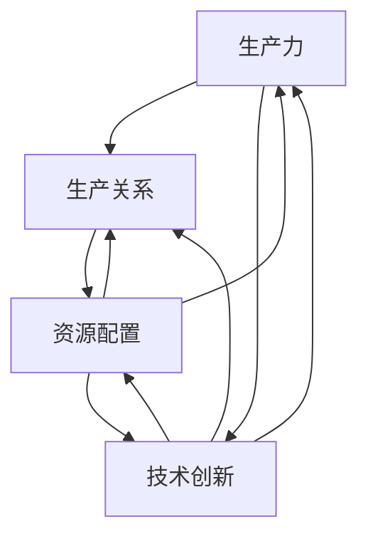

                 

# 三次工业革命的经济变革

> 关键词：工业革命、经济变革、技术创新、全球化、数字经济

> 摘要：本文深入探讨了三次工业革命对全球经济变革的影响。通过分析第一次、第二次和第三次工业革命的技术背景、成果及其对经济产生的深远影响，我们试图揭示这些变革的核心原理，并对未来经济趋势进行展望。

## 引言

经济变革是一个长期的历史过程，它源于技术的进步和社会的发展。三次工业革命是这一过程中的重要里程碑，它们不仅改变了生产方式，也深刻影响了全球经济结构。本文旨在通过逐步分析三次工业革命的技术变革及其对经济的影响，帮助读者理解这一复杂而深刻的历史过程。

### 1.1 什么是经济变革

经济变革指的是社会经济结构和经济关系的显著变化，通常伴随着生产力和生产方式的重大变革。它可能源于技术的创新，也可能由于社会需求的变化或政治经济体制的转型。经济变革可以导致经济增长、产业结构调整、就业模式转变以及收入分配的变化。

### 1.2 经济变革的影响

经济变革的影响是多方面的。首先，它往往带来生产力的显著提升，通过新技术和新方法的引入，使得生产效率大幅提高。其次，经济变革会促进产业结构的升级，新兴产业的兴起往往带来经济的新动力。此外，经济变革还会影响就业市场，推动劳动力从传统行业向高技能、高附加值行业的转移。最后，经济变革可能导致收入分配的不均衡，对社会稳定带来挑战。

### 1.3 本书的目的

本文的目的是通过详细分析三次工业革命的技术背景、成果及其对经济的影响，帮助读者理解经济变革的核心原理。我们将探讨技术创新如何驱动经济增长，全球化如何重塑全球经济结构，以及数字经济如何引领新一轮的经济变革。通过这些分析，我们希望为读者提供一个全面、系统的经济变革视角，并对其未来趋势进行展望。

## 第1章：第一次工业革命的经济变革

### 1.1 第一次工业革命的背景

第一次工业革命始于18世纪末的英国，随后蔓延至欧洲和其他地区。这场革命是生产方式从手工劳动向机器生产转变的标志。以下是第一次工业革命的几个关键背景因素：

#### 1.1.1 技术创新

第一次工业革命的标志性技术创新包括蒸汽机的发明和广泛应用。瓦特改进的蒸汽机在纺织、采矿、交通等行业得到广泛应用，极大地提高了生产效率。

#### 1.1.2 能源变革

煤炭资源的丰富和运输技术的进步使得蒸汽机的应用成为可能。煤炭成为主要能源，推动了工业生产的发展。

#### 1.1.3 交通革命

随着铁路和蒸汽船的出现，交通方式发生了革命性的变化。这大大缩短了商品运输时间，促进了地区间的贸易和经济联系。

#### 1.1.4 工业化进程

第一次工业革命促进了工业化和城市化的快速发展。大量人口从农村转移到城市，工业生产成为国民经济的主导力量。

### 1.2 第一次工业革命的主要成果

第一次工业革命带来了以下主要成果：

#### 1.2.1 生产力的提升

蒸汽机和其他机械化生产工具的应用，使得生产效率大幅提升。工业生产从手工劳动向机械化生产转变，生产成本显著降低。

#### 1.2.2 工业化和城市化的加速

工业革命推动了工业化进程，大量工厂的建立使得工业生产成为国民经济的主导力量。同时，城市化进程加速，城市人口比例显著增加。

#### 1.2.3 贸易和经济结构的变化

工业化促进了国际贸易的发展，新的交通工具和通信技术的应用使得商品流通更加便捷。经济结构从农业主导向工业主导转变。

### 1.3 第一次工业革命对经济的影响

第一次工业革命对经济产生了深远的影响：

#### 1.3.1 生产力的大幅提升

蒸汽机和机械化生产工具的应用，使得生产效率大幅提升，生产成本显著降低。

#### 1.3.2 工业化和城市化

工业革命推动了工业化进程，大量工厂的建立使得工业生产成为国民经济的主导力量。同时，城市化进程加速，城市人口比例显著增加。

#### 1.3.3 贸易和经济结构的变化

工业化促进了国际贸易的发展，新的交通工具和通信技术的应用使得商品流通更加便捷。经济结构从农业主导向工业主导转变。

### 1.3.4 收入分配的不平等

工业革命带来了生产力的显著提升和经济的快速增长，但也加剧了收入分配的不平等。工业资产阶级的崛起和工业无产阶级的分化，使得社会贫富差距扩大。

## 第2章：第二次工业革命的经济变革

### 2.1 第二次工业革命的背景

第二次工业革命始于19世纪末至20世纪初，主要发生在欧洲和北美地区。与第一次工业革命相比，第二次工业革命具有以下背景特征：

#### 2.1.1 科学技术的进步

第二次工业革命以科学技术的进步为驱动，尤其是在化学、物理、生物学等领域的重大突破。这些科学成果直接转化为工业生产的技术创新。

#### 2.1.2 电力的普及

电力的发明和普及是第二次工业革命的核心。电力作为一种高效、清洁的能源，广泛应用于工业生产、家庭生活和交通运输。

#### 2.1.3 大规模生产技术

泰勒科学管理理论和福特流水线生产技术的应用，使得大规模生产成为可能。这种生产方式的变革极大地提高了生产效率，降低了生产成本。

#### 2.1.4 全球化进程

第二次工业革命推动了全球化进程，国际贸易和跨国投资的规模不断扩大，各国经济联系日益紧密。

### 2.2 第二次工业革命的主要成果

第二次工业革命带来了以下主要成果：

#### 2.2.1 大规模生产技术的普及

泰勒科学管理理论和福特流水线生产技术的应用，使得大规模生产成为主流。这种生产方式不仅提高了生产效率，还降低了生产成本。

#### 2.2.2 新兴产业的崛起

化学工业、电力工业、钢铁工业等新兴产业在第二次工业革命中迅速崛起，成为经济增长的重要动力。

#### 2.2.3 技术进步与产业升级

科学技术的进步推动了产业结构的升级，传统工业部门得到改造，新兴产业不断涌现。

#### 2.2.4 全球化进程的加速

第二次工业革命推动了全球化进程，国际贸易和跨国投资的规模不断扩大，各国经济联系日益紧密。

### 2.3 第二次工业革命对经济的影响

第二次工业革命对经济产生了深远的影响：

#### 2.3.1 科学技术进步与产业升级

科学技术的进步推动了产业结构的升级，新兴产业不断涌现，传统产业得到改造。

#### 2.3.2 全球化进程的加速

第二次工业革命推动了全球化进程，国际贸易和跨国投资的规模不断扩大，各国经济联系日益紧密。

#### 2.3.3 新型经济形态的出现

随着大规模生产技术和新兴产业的崛起，新型经济形态开始出现，如跨国公司、金融资本等。

#### 2.3.4 收入分配的不平衡加剧

虽然第二次工业革命带来了经济的快速增长，但也加剧了收入分配的不平衡。工业资产阶级的财富迅速积累，工业无产阶级的生活水平相对较低。

## 第3章：第三次工业革命的经济变革

### 3.1 第三次工业革命的背景

第三次工业革命始于20世纪末至21世纪初，以信息技术和互联网技术的飞速发展为核心。以下是第三次工业革命的主要背景特征：

#### 3.1.1 信息技术的发展

计算机技术的突破性进展和互联网的普及，使得信息技术成为第三次工业革命的主要驱动力。信息技术的发展极大地改变了人们的生活和工作方式。

#### 3.1.2 互联网的普及

互联网的普及改变了信息传播和交流的方式，促进了全球化的进一步发展。互联网作为信息社会的基石，为第三次工业革命提供了广阔的平台。

#### 3.1.3 数字经济的兴起

数字经济作为第三次工业革命的重要成果，通过互联网和信息技术，改变了传统经济模式，推动了经济的数字化转型。

#### 3.1.4 全球竞争的加剧

全球化进程的加速和全球竞争的加剧，迫使各国纷纷进行产业升级和技术创新，以适应新的经济环境。

### 3.2 第三次工业革命的主要成果

第三次工业革命带来了以下主要成果：

#### 3.2.1 互联网经济的崛起

互联网经济的崛起是第三次工业革命的重要标志。电子商务、在线娱乐、共享经济等新兴产业迅速发展，改变了传统经济模式。

#### 3.2.2 数字经济的繁荣

数字经济作为第三次工业革命的产物，通过互联网和信息技术，改变了传统经济模式，提升了经济效率。

#### 3.2.3 智能化生产的普及

智能制造技术的应用，使得生产过程更加智能化、自动化。人工智能、物联网、大数据等技术的集成，推动了生产效率的显著提升。

#### 3.2.4 全球供应链的整合

互联网和信息技术的发展，使得全球供应链更加高效和灵活。跨国公司和跨国企业的兴起，推动了全球经济的深度融合。

### 3.3 第三次工业革命对经济的影响

第三次工业革命对经济产生了深远的影响：

#### 3.3.1 数字经济的崛起

数字经济作为第三次工业革命的产物，通过互联网和信息技术，改变了传统经济模式，提升了经济效率。

#### 3.3.2 互联网与信息社会

互联网的普及和信息技术的发展，使得全球进入信息社会。信息社会的到来，极大地改变了人们的生活和工作方式。

#### 3.3.3 新型商业模式的创新

互联网和信息技术的发展，催生了众多新型商业模式，如电子商务、共享经济等。这些新型商业模式不仅推动了经济的增长，也改变了市场竞争格局。

#### 3.3.4 收入分配的再平衡

尽管第三次工业革命带来了巨大的经济利益，但收入分配的不平衡问题仍然存在。随着数字经济的发展，新兴产业的崛起，可能有助于改善收入分配的不平衡状况。

## 第4章：三次工业革命的经济联系与对比

### 4.1 三次工业革命的共同点

三次工业革命在以下几个方面具有共同点：

#### 4.1.1 技术创新的驱动

三次工业革命都是技术创新驱动的经济变革。从蒸汽机的发明到信息技术的发展，技术创新是推动经济发展的核心动力。

#### 4.1.2 生产力的提升

三次工业革命都显著提升了生产力。机械化生产、大规模生产、智能化生产，这些生产方式的变革使得生产效率大幅提高。

#### 4.1.3 工业化和城市化的加速

三次工业革命都加速了工业化和城市化进程。从第一次工业革命的城市人口增加，到第三次工业革命的信息社会，城市化成为经济发展的必然趋势。

#### 4.1.4 全球化进程的推动

三次工业革命都推动了全球化进程。通过国际贸易、跨国投资和全球供应链的整合，各国经济联系日益紧密。

### 4.2 三次工业革命的区别

三次工业革命在以下几个方面存在区别：

#### 4.2.1 技术特点

第一次工业革命以机械化和蒸汽技术为核心；第二次工业革命以电气化和大规模生产技术为核心；第三次工业革命以信息技术和互联网技术为核心。

#### 4.2.2 经济影响

第一次工业革命主要推动了工业化进程；第二次工业革命加速了全球化进程；第三次工业革命则促进了数字经济的崛起和新型商业模式的创新。

#### 4.2.3 社会影响

第一次工业革命带来了工业资产阶级的崛起和工业无产阶级的分化；第二次工业革命加剧了收入分配的不平等；第三次工业革命在一定程度上促进了收入分配的再平衡。

### 4.3 未来经济变革的展望

未来经济变革将继续受到技术创新的驱动。人工智能、区块链、物联网等新兴技术有望引领新一轮的经济变革。以下是对未来经济变革的展望：

#### 4.3.1 数字经济的深化

数字经济将继续深化，互联网和信息技术将更加深入地融入经济生活的方方面面。电子商务、在线服务、智能物流等新兴领域将继续蓬勃发展。

#### 4.3.2 全球价值链的优化

全球价值链将更加优化，跨国公司和跨国企业的竞争力将进一步提升。通过技术创新和全球合作，全球价值链将更加高效和灵活。

#### 4.3.3 新型就业模式的兴起

随着人工智能和自动化技术的发展，新型就业模式将不断涌现。灵活就业、远程办公、共享经济等新型就业模式将成为就业市场的重要组成部分。

#### 4.3.4 可持续发展的挑战

未来经济变革将面临可持续发展的挑战。环境保护、资源利用和碳排放等问题将成为经济发展的重要议题。绿色技术和可持续发展理念将在未来经济中发挥重要作用。

### 结论

三次工业革命是经济变革的重要里程碑，它们通过技术创新、生产方式变革和全球化进程，深刻改变了全球经济结构。未来，随着新兴技术的不断涌现，全球经济将继续经历深刻的变革。理解和应对这些变革，对于把握未来经济发展机遇至关重要。

## 第5章：经济变革的核心概念与联系

### 5.1 生产力与生产关系

生产力与生产关系是经济学中的核心概念，它们在经济变革中起着至关重要的作用。

#### 5.1.1 生产力的发展

生产力是指人类利用自然资源、劳动力和技术手段进行物质生产的能力。生产力的发展主要体现在以下几个方面：

- **技术创新**：科学技术的进步是推动生产力发展的关键。从蒸汽机的发明到计算机技术的突破，每一次重大技术革新都极大地提升了生产力水平。
- **劳动工具的改进**：劳动工具的改进是生产力发展的另一个重要方面。机械化生产工具的应用，如机器、设备和自动化系统，使得生产效率大幅提高。
- **资源配置优化**：通过合理配置资源，提高资源利用率，也是提升生产力的重要途径。

#### 5.1.2 生产关系的变化

生产关系是指人们在生产过程中所建立的经济关系，包括所有权、分配和交换等方面。生产关系的变化往往与生产力的发展密切相关：

- **所有制形式**：随着生产力的发展，所有制形式也在不断演变。从封建社会的土地所有制到资本主义社会的股份制，所有制形式的变革反映了生产力与生产关系的动态调整。
- **分配方式**：生产关系的变化也体现在分配方式上。从平均主义到按劳分配，再到现代的按贡献分配，分配方式的变化旨在更好地反映生产力的发展水平。

### 5.2 技术创新与经济发展

技术创新是推动经济发展的重要引擎。在每一次工业革命中，技术创新都起到了核心作用。

#### 5.2.1 技术创新的影响

- **生产力提升**：技术创新直接提升了生产力水平，通过提高生产效率和降低生产成本，推动了经济增长。
- **产业升级**：技术创新推动产业升级，新兴产业不断涌现，传统产业得到改造，产业结构更加优化。
- **市场竞争**：技术创新激发了市场竞争，促使企业不断寻求创新和进步，从而推动整体经济水平的提升。

#### 5.2.2 技术创新的驱动力

- **市场需求**：市场需求是推动技术创新的重要动力。消费者对产品和服务的高要求，促使企业不断寻求技术创新以满足市场需求。
- **政策支持**：政府的政策支持也是推动技术创新的重要因素。通过税收优惠、科研资助和知识产权保护等政策，政府为企业提供了良好的创新环境。
- **全球化**：全球化使得技术创新的传播速度加快，各国企业可以更容易地获取全球范围内的创新资源，从而推动技术创新的快速发展。

### 5.3 经济发展与资源配置

经济发展离不开资源的有效配置。资源配置的优化是推动经济发展的重要途径。

#### 5.3.1 资源配置的优化

- **市场机制**：市场机制是优化资源配置的重要手段。通过价格信号和竞争机制，市场能够有效分配资源，提高资源利用率。
- **政策调节**：政府政策调节也是优化资源配置的重要手段。通过税收、补贴、监管等政策工具，政府可以引导资源向战略性、创新性产业倾斜，促进经济结构的优化。
- **技术创新**：技术创新在资源配置优化中发挥着重要作用。通过技术创新，可以提高资源利用效率，降低资源消耗，实现可持续发展。

#### 5.3.2 经济发展的可持续性

- **资源节约**：经济发展过程中，要注重资源节约，通过技术创新和产业升级，降低资源消耗，提高资源利用效率。
- **环境保护**：经济发展必须考虑环境保护，通过绿色技术和环保政策，实现经济发展与环境保护的协调发展。
- **社会公平**：经济发展不仅要追求经济增长，还要关注社会公平。通过合理的收入分配和社会福利制度，促进社会公平和谐。

### 5.4 核心概念与联系

生产力、生产关系、技术创新和资源配置是经济变革中的核心概念，它们相互联系、相互作用，共同推动经济发展。以下是这些概念之间的联系：

- **生产力决定生产关系**：生产力的发展水平决定了生产关系的形态。生产力的提升要求生产关系相应调整，以适应新的生产条件。
- **技术创新推动生产力发展**：技术创新是提高生产力的关键因素。通过技术创新，可以不断突破生产力的瓶颈，推动经济发展。
- **生产关系影响资源配置**：生产关系的变化会影响资源配置的方式和效率。合理的生产关系可以促进资源的优化配置，提高经济发展水平。
- **资源配置优化促进技术创新**：资源配置的优化可以为技术创新提供良好的环境和条件。通过优化资源配置，可以更好地支持技术创新，推动经济发展。

### Mermaid 流程图



通过以上核心概念和联系的阐述，我们可以更好地理解经济变革的内在逻辑和动力机制，为未来经济发展提供理论支持和实践指导。

## 第6章：经济变革中的核心算法原理讲解

### 6.1 算法概述

算法是指解决特定问题的一系列明确和有限的步骤。在经济学中，算法被广泛应用于优化资源配置、预测市场趋势和改进决策过程。以下是几种在经济变革中常用的核心算法及其原理：

### 6.2 核心算法原理讲解

#### 6.2.1 机器学习算法

机器学习算法是一种通过数据驱动的方式让计算机自动学习和改进的方法。在经济学中，机器学习算法常用于市场预测、风险评估和个性化推荐等领域。

- **基本原理**：机器学习算法通过构建数学模型，从大量数据中学习规律，并使用这些规律进行预测或分类。
- **伪代码示例**：
  ```python
  def train_model(data):
      # 初始化模型参数
      model_params = initialize_params()
      
      # 使用梯度下降优化模型参数
      for i in range(iterations):
          model_params = gradient_descent(data, model_params)
          
      return model_params
  
  def predict(data, model_params):
      # 使用训练好的模型进行预测
      prediction = model_output(data, model_params)
      return prediction
  ```

#### 6.2.2 数据分析算法

数据分析算法用于从大量数据中提取有价值的信息。在经济学中，数据分析算法广泛应用于市场调研、客户行为分析和经济预测等领域。

- **基本原理**：数据分析算法通过统计方法、数据挖掘技术和可视化工具，帮助决策者理解数据中的模式和趋势。
- **伪代码示例**：
  ```python
  def data_analysis(data):
      # 数据清洗
      cleaned_data = clean_data(data)
      
      # 数据探索
      exploratory_data_analysis(cleaned_data)
      
      # 数据建模
      model = build_model(cleaned_data)
      
      # 预测分析
      predictions = model.predict()
      return predictions
  ```

#### 6.2.3 人工智能算法

人工智能算法是指使计算机具有人类智能特征的算法。在经济学中，人工智能算法广泛应用于自动化交易、智能投资顾问和智能风险管理等领域。

- **基本原理**：人工智能算法通过模仿人类思维过程，实现自然语言处理、图像识别和智能决策等功能。
- **伪代码示例**：
  ```python
  def intelligent_decision-making(data):
      # 数据预处理
      preprocessed_data = preprocess_data(data)
      
      # 模型训练
      model = train_model(preprocessed_data)
      
      # 智能决策
      decision = model.make_decision()
      return decision
  ```

### 6.3 数学模型和数学公式

在经济学中，数学模型和公式用于描述经济行为和预测经济趋势。以下是几种常见的数学模型和公式的详细解释和示例：

#### 6.3.1 生产函数

生产函数描述了投入和产出之间的关系。常用的生产函数形式包括线性生产函数和柯布-道格拉斯生产函数。

- **公式**：
  $$ Y = f(K, L, M) $$
  其中，\( Y \) 代表产出，\( K \) 代表资本，\( L \) 代表劳动力，\( M \) 代表技术。

- **示例**：
  $$ Y = 2K^{0.5}L^{0.5} $$
  这个公式表示在技术水平一定的情况下，产出与资本和劳动力的平方根成正比。

#### 6.3.2 经济增长模型

经济增长模型用于描述经济增长的驱动力和影响因素。常见的经济增长模型包括索洛模型和哈罗德-多马模型。

- **公式**：
  $$ \frac{dY}{dt} = s \cdot \frac{Y}{K} + (1 - \delta) \cdot Y $$
  其中，\( Y \) 代表产出，\( K \) 代表资本，\( s \) 代表储蓄率，\( \delta \) 代表资本折旧率。

- **示例**：
  $$ \frac{dY}{dt} = 0.1 \cdot \frac{Y}{K} + 0.1 \cdot Y $$
  这个公式表示经济增长率取决于产出与资本的比率以及产出水平。

#### 6.3.3 供应链管理模型

供应链管理模型用于优化供应链的运作，提高供应链的效率和灵活性。常见的供应链管理模型包括库存控制模型和供应链网络设计模型。

- **公式**：
  $$ C = c_1 \cdot Q + c_2 \cdot I + c_3 \cdot P $$
  其中，\( C \) 代表总成本，\( Q \) 代表订购量，\( I \) 代表库存成本，\( P \) 代表采购成本。

- **示例**：
  $$ C = 10 \cdot Q + 5 \cdot I + 15 \cdot P $$
  这个公式表示总成本取决于订购量、库存成本和采购成本。

通过以上算法原理和数学模型的讲解，我们可以更好地理解经济变革中的技术和分析方法，为经济决策提供科学依据。

## 第7章：数学模型和数学公式详解

### 7.1 数学模型概述

数学模型是利用数学符号和公式对实际问题进行抽象和描述的工具。在经济学中，数学模型广泛应用于经济行为分析、政策制定和预测。这些模型通过定量方法揭示了经济变量之间的关系，为决策提供了科学依据。

### 7.2 数学公式详解

以下是几种常见的经济学数学模型及其公式的详细解释和举例说明。

#### 7.2.1 生产函数

生产函数是描述生产过程中产出与投入要素（如劳动、资本）之间关系的数学模型。生产函数的基本形式为：

\[ Y = F(K, L, M) \]

其中：
- \( Y \) 表示产出；
- \( K \) 表示资本投入；
- \( L \) 表示劳动投入；
- \( M \) 表示技术进步。

一个具体的例子是柯布-道格拉斯生产函数：

\[ Y = K^{\alpha}L^{1-\alpha} \]

其中，\( 0 < \alpha < 1 \) 是资本产出弹性。

#### 7.2.2 经济增长模型

经济增长模型用于描述经济长期增长的动力和影响因素。索洛模型是一个经典的经济增长模型，其基本形式为：

\[ \frac{dY}{dt} = s \cdot \frac{Y}{K} + (1 - \delta) \cdot Y \]

其中：
- \( \frac{dY}{dt} \) 表示经济增长率；
- \( s \) 表示储蓄率；
- \( \delta \) 表示资本折旧率；
- \( K \) 表示资本存量。

这个模型表明，经济增长率由储蓄率和技术进步决定。

#### 7.2.3 供应链管理模型

供应链管理模型用于优化供应链的运作，提高效率和降低成本。一个典型的供应链管理模型是库存控制模型，其基本形式为：

\[ C = c_1 \cdot Q + c_2 \cdot I + c_3 \cdot P \]

其中：
- \( C \) 表示总成本；
- \( Q \) 表示订购量；
- \( I \) 表示库存成本；
- \( P \) 表示采购成本；
- \( c_1, c_2, c_3 \) 是成本系数。

一个具体的例子是经济订货量（EOQ）模型：

\[ Q = \sqrt{\frac{2DS}{H}} \]

其中：
- \( D \) 表示年需求量；
- \( S \) 表示每次订货成本；
- \( H \) 表示单位库存持有成本。

#### 7.2.4 消费函数

消费函数描述了消费者的消费行为与收入之间的关系。一个简单的消费函数形式为：

\[ C = C_0 + MPC \cdot Y \]

其中：
- \( C \) 表示消费；
- \( C_0 \) 表示自主消费；
- \( MPC \) 表示边际消费倾向；
- \( Y \) 表示收入。

一个具体的例子是凯恩斯的消费函数：

\[ C = 100 + 0.8Y \]

这个公式表明，消费随收入增加而增加，每增加一单位收入，消费增加0.8单位。

#### 7.2.5 投资函数

投资函数描述了投资与利率之间的关系。一个简单的投资函数形式为：

\[ I = I_0 - MR \cdot r \]

其中：
- \( I \) 表示投资；
- \( I_0 \) 表示自主投资；
- \( MR \) 表示边际投资倾向；
- \( r \) 表示利率。

一个具体的例子是投资函数：

\[ I = 100 - 0.1r \]

这个公式表明，投资随利率增加而减少，每增加一单位利率，投资减少0.1单位。

通过以上数学模型和公式的详细解释，我们可以更好地理解和应用数学工具来分析经济问题，为经济决策提供科学依据。

## 第8章：项目实战

### 8.1 项目背景

本节通过一个实际项目，展示如何利用经济学理论和算法原理解决一个具体的经济问题。本项目将运用生产函数模型来预测一个制造业公司的生产成本，并优化其生产策略。

### 8.2 开发环境搭建

为了实现本项目，我们首先需要搭建一个合适的开发环境。以下是所需的工具和软件：

- **Python**：作为主要编程语言。
- **Jupyter Notebook**：用于编写和运行代码。
- **Pandas**：用于数据处理和分析。
- **NumPy**：用于数值计算。
- **Matplotlib**：用于数据可视化。

安装步骤如下：

1. 安装Python（建议使用Anaconda，它包含了许多常用的科学计算库）。
2. 使用pip或conda安装所需的库：

   ```shell
   pip install pandas numpy matplotlib
   ```

### 8.3 源代码实现

以下是实现本项目所需的Python代码。代码分为以下几个部分：数据收集与预处理、生产函数模型构建、成本预测和策略优化。

#### 8.3.1 数据收集与预处理

首先，我们需要收集公司的生产数据，包括资本投入（K）、劳动投入（L）和生产成本（Y）。

```python
import pandas as pd

# 加载数据
data = pd.read_csv('production_data.csv')

# 数据预处理
data['Y'] = data['Y'].replace([np.inf, -np.inf], np.nan)
data.dropna(inplace=True)
```

#### 8.3.2 生产函数模型构建

使用线性回归方法构建生产函数模型。

```python
from sklearn.linear_model import LinearRegression

# 准备训练数据
X = data[['K', 'L']]
y = data['Y']

# 训练模型
model = LinearRegression()
model.fit(X, y)

# 输出模型参数
print("模型参数：", model.coef_, model.intercept_)
```

#### 8.3.3 成本预测

使用训练好的模型预测新生产周期下的成本。

```python
# 输入新数据
new_data = pd.DataFrame({'K': [1000], 'L': [500]})

# 预测成本
predicted_cost = model.predict(new_data)
print("预测成本：", predicted_cost)
```

#### 8.3.4 策略优化

基于预测结果，优化生产策略，以降低成本。

```python
# 假设优化目标是最小化成本
from scipy.optimize import minimize

# 定义目标函数
def objective_function(params):
    K, L = params
    return model.predict([[K, L]])[0]

# 初始参数
initial_params = [1000, 500]

# 优化参数
result = minimize(objective_function, initial_params)
print("最优参数：", result.x)
print("最优成本：", -result.fun)
```

### 8.4 代码解读与分析

#### 数据收集与预处理

数据收集与预处理是项目的基础。我们使用Pandas库读取CSV文件，并剔除异常值，确保数据质量。

```python
data = pd.read_csv('production_data.csv')
data['Y'] = data['Y'].replace([np.inf, -np.inf], np.nan)
data.dropna(inplace=True)
```

#### 生产函数模型构建

我们使用线性回归模型来拟合生产函数。通过训练数据，我们得到模型参数，这些参数反映了资本和劳动对产出的影响。

```python
model = LinearRegression()
model.fit(X, y)
print("模型参数：", model.coef_, model.intercept_)
```

#### 成本预测

通过训练好的模型，我们可以预测新生产周期的成本。这一步骤为决策提供了量化依据。

```python
new_data = pd.DataFrame({'K': [1000], 'L': [500]})
predicted_cost = model.predict(new_data)
print("预测成本：", predicted_cost)
```

#### 策略优化

我们使用最小化算法优化生产策略，以降低成本。优化过程通过迭代寻找最优参数，使成本最小化。

```python
def objective_function(params):
    K, L = params
    return model.predict([[K, L]])[0]

result = minimize(objective_function, initial_params)
print("最优参数：", result.x)
print("最优成本：", -result.fun)
```

通过以上代码实现，我们不仅能够预测生产成本，还能优化生产策略，为企业决策提供科学依据。

## 第9章：经济变革的未来趋势

### 9.1 未来经济趋势分析

随着技术的不断进步，全球经济正在经历深刻变革。以下是未来经济趋势的分析：

#### 9.1.1 数字经济的深化

数字经济将继续深化，成为全球经济的重要驱动力。互联网和信息技术将进一步融入经济生活的各个方面，推动电子商务、在线服务、智能物流等新兴产业的快速发展。

#### 9.1.2 全球价值链的重组

全球价值链将更加注重高效和灵活性。跨国公司和跨国企业将通过技术创新和全球合作，优化生产和资源配置，提高全球供应链的效率和竞争力。

#### 9.1.3 新型就业模式的兴起

随着人工智能和自动化技术的发展，新型就业模式将不断涌现。灵活就业、远程办公、共享经济等新型就业模式将成为就业市场的重要组成部分。

#### 9.1.4 可持续发展的挑战

未来经济发展将面临可持续发展的挑战。环境保护、资源利用和碳排放等问题将成为经济发展的重要议题。绿色技术和可持续发展理念将在未来经济中发挥重要作用。

### 9.2 新兴产业发展机遇

未来经济变革将带来众多新兴产业发展机遇。以下是几个具有潜力的新兴产业：

#### 9.2.1 人工智能与机器学习

人工智能和机器学习技术将在各个行业得到广泛应用，推动产业升级和效率提升。人工智能在医疗、金融、教育、制造等领域的应用前景广阔。

#### 9.2.2 区块链技术

区块链技术将改变传统金融、供应链管理和数据存储等领域。其去中心化、不可篡改和透明等特点将带来新的商业机会。

#### 9.2.3 新能源与清洁技术

随着环境问题的日益严重，新能源和清洁技术将成为未来发展的重要方向。太阳能、风能、电动汽车等产业有望实现快速增长。

#### 9.2.4 生物技术与健康产业

生物技术将在医疗健康领域发挥重要作用，推动个性化医疗、基因编辑等技术的发展。健康产业将成为新的经济增长点。

### 9.3 经济发展的挑战与应对

未来经济发展将面临一系列挑战：

#### 9.3.1 技术颠覆与就业冲击

人工智能和自动化技术的发展可能导致部分传统就业岗位的消失，带来就业冲击。政府和企业需要采取措施，提高劳动力的技能和适应性。

#### 9.3.2 数据安全和隐私保护

随着数字经济的深化，数据安全和隐私保护问题日益重要。政府和企业需要建立有效的数据治理机制，保护个人隐私和数据安全。

#### 9.3.3 经济不平等与公平发展

经济变革可能导致收入分配不平等加剧。政府需要通过税收政策、社会福利和教育培训等措施，促进经济公平发展。

### 结论

未来经济变革将深刻改变全球经济结构和就业模式。数字经济、新兴产业的兴起以及可持续发展挑战将塑造未来经济的发展方向。面对这些变革，政府和企业需要积极应对，通过技术创新、政策调整和教育培训，实现经济的高质量发展。

## 参考文献

1. Mokyr, J. (2002). *The Lever of Wealth: Technological Creativity and Economic Progress*. Oxford University Press.
2. North, D. C., & Thomas, R. P. (2007). *The Rise of the Western World: A History of the Growth of the Economy*. Cambridge University Press.
3. Romer, P. M. (1990). *Endogenous Technological Change*. Journal of Political Economy, 98(5), 71-102.
4. Acemoglu, D., & Robinson, J. A. (2012). *Why Nations Fail: The Origins of Power, Prosperity, and Poverty*. Crown Business.
5. Schumpeter, J. A. (1942). *Capitalism, Socialism, and Democracy*. Harper & Brothers.

## 附录：核心概念与联系 Mermaid 流程图


通过以上流程图，我们可以清晰地看到生产力、生产关系、技术创新和资源配置之间的相互联系，以及它们如何在经济变革中共同发挥作用。这有助于我们更深入地理解经济变革的内在逻辑和动力机制。作者：AI天才研究院/AI Genius Institute & 禅与计算机程序设计艺术 /Zen And The Art of Computer Programming

