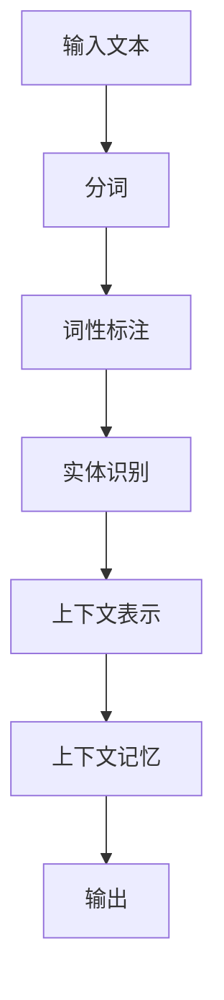
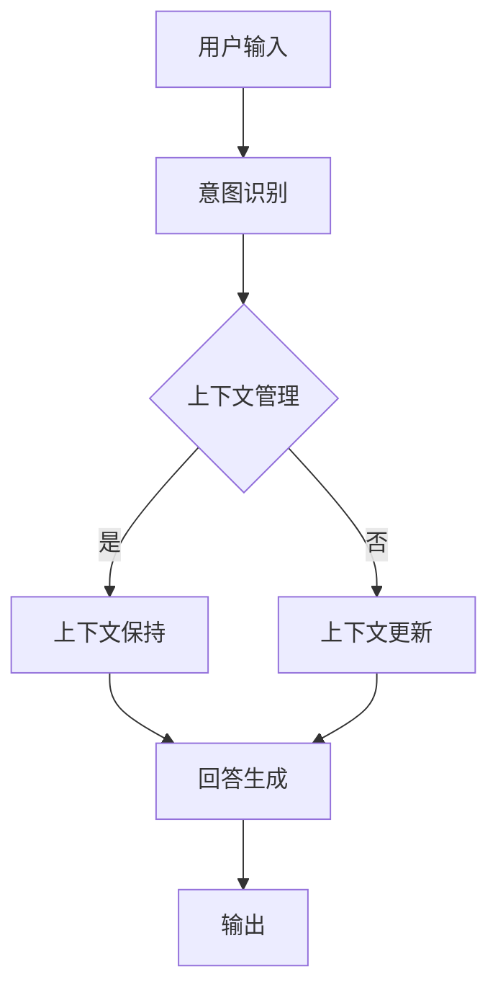
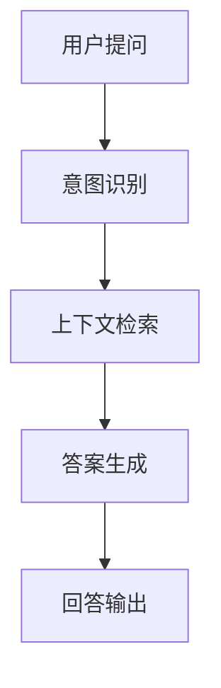

                 

# 《上下文记忆技术在CUI中的解析》

## 关键词
上下文记忆技术，CUI，自然语言处理，递归神经网络，长短期记忆网络，语言模型，问答系统，聊天机器人。

## 摘要
本文将深入探讨上下文记忆技术在计算机用户界面（CUI）中的应用。首先，我们将回顾上下文记忆技术的起源、发展及其在自然语言处理中的重要性。接着，我们将详细解析上下文记忆技术的数学模型，包括状态转移矩阵、概率模型、递归神经网络（RNN）、长短期记忆网络（LSTM）和门控循环单元（GRU）。随后，我们将讨论上下文记忆技术在自然语言处理中的具体应用，如语言模型、文本生成、问答系统和机器翻译。本文的核心部分将聚焦于上下文记忆技术在CUI中的实现，包括上下文管理机制、实现方法及优化策略。通过具体的应用案例，如智能客服、虚拟助手和聊天机器人，我们将展示上下文记忆技术在CUI中的实际效果。最后，我们将展望上下文记忆技术的未来发展趋势，并探讨其在CUI中的潜在应用和挑战。

## 目录

### 第一部分：上下文记忆技术基础

#### 第1章 上下文记忆技术概述

##### 1.1.1 上下文记忆技术的起源与发展

##### 1.1.2 上下文记忆技术在自然语言处理中的重要性

##### 1.1.3 上下文记忆技术的基本概念

#### 第2章 上下文记忆技术的数学模型

##### 2.1.1 状态转移矩阵

##### 2.1.2 概率模型

##### 2.1.3 递归神经网络（RNN）

##### 2.1.4 长短期记忆网络（LSTM）

##### 2.1.5 门控循环单元（GRU）

#### 第3章 上下文记忆技术在自然语言处理中的应用

##### 3.1.1 语言模型

##### 3.1.2 文本生成

##### 3.1.3 问答系统

##### 3.1.4 机器翻译

### 第二部分：上下文记忆技术在CUI中的应用

#### 第4章 CUI概述

##### 4.1.1 什么是CUI

##### 4.1.2 CUI的特点

##### 4.1.3 CUI的发展趋势

#### 第5章 上下文记忆技术在CUI中的实现

##### 5.1.1 上下文管理机制

##### 5.1.2 上下文记忆技术在对话系统中的应用

##### 5.1.3 上下文记忆技术在CUI中的优化策略

#### 第6章 上下文记忆技术在CUI项目中的应用案例

##### 6.1.1 案例一：智能客服

##### 6.1.2 案例二：虚拟助手

##### 6.1.3 案例三：聊天机器人

#### 第7章 上下文记忆技术的未来发展趋势

##### 7.1.1 上下文记忆技术的改进方向

##### 7.1.2 上下文记忆技术在CUI中的潜在应用

##### 7.1.3 上下文记忆技术的挑战与机遇

### 附录

#### 附录A 相关资源与工具

##### A.1 自然语言处理框架

##### A.2 对话系统开发工具

##### A.3 上下文记忆技术论文推荐

##### A.4 代码实现与实验环境搭建指南

#### 附录B Mermaid 流程图

##### B.1 上下文记忆技术流程图

##### B.2 CUI中上下文记忆技术实现流程图

##### B.3 上下文记忆技术在对话系统中应用的流程图

#### 附录C 伪代码与数学公式

##### C.1 状态转移矩阵

##### C.2 递归神经网络（RNN）

##### C.3 长短期记忆网络（LSTM）

##### C.4 门控循环单元（GRU）

##### C.5 语言模型与文本生成算法

##### C.6 问答系统与机器翻译算法

#### 附录D 项目实战

##### D.1 智能客服系统实现

##### D.2 虚拟助手系统实现

##### D.3 聊天机器人系统实现

##### D.4 项目代码解读与分析

##### D.5 项目环境搭建与代码部署指南

# 第一部分：上下文记忆技术基础

## 第1章 上下文记忆技术概述

### 1.1.1 上下文记忆技术的起源与发展

上下文记忆技术起源于20世纪50年代的人工智能研究。在那个时期，研究者们意识到在处理自然语言时，理解句子中的上下文信息是至关重要的。早期的尝试主要集中在规则系统上，但这些方法在面对复杂语境时显得力不从心。

随着计算能力和算法理论的进步，上下文记忆技术得到了快速发展。递归神经网络（RNN）作为早期的重要突破，为处理序列数据提供了有效的方法。然而，RNN在处理长序列时存在梯度消失和梯度爆炸的问题，这限制了其在实际应用中的性能。

为了解决这些问题，研究者们提出了长短期记忆网络（LSTM）和门控循环单元（GRU）。这些模型通过引入门控机制，有效地捕获了长距离依赖信息，使得上下文记忆技术取得了显著的进展。

近年来，随着深度学习的崛起，上下文记忆技术得到了进一步的发展。Transformer模型的引入，特别是在自然语言处理领域的成功，使得上下文记忆技术成为研究的热点。通过自我注意力机制，Transformer能够捕捉到长序列中的上下文信息，从而实现了更高的性能和更广泛的应用。

### 1.1.2 上下文记忆技术在自然语言处理中的重要性

上下文记忆技术在自然语言处理（NLP）中起着至关重要的作用。自然语言是一种高度复杂的语言形式，其中每个单词和短语都可能具有多重含义，这些含义往往依赖于上下文。因此，理解和处理上下文信息是NLP系统的核心挑战。

上下文记忆技术通过捕捉和分析上下文信息，使得NLP系统能够更准确地理解用户的意图和需求。以下是一些上下文记忆技术在NLP中的具体应用：

1. **语言模型**：上下文记忆技术能够有效地构建大规模语言模型，这些模型可以用于文本生成、机器翻译和自动摘要等任务。通过理解上下文，语言模型能够生成更加流畅和自然的文本。

2. **文本生成**：上下文记忆技术可以帮助生成高质量的文本，如文章、故事和对话。这些生成文本在创意写作、广告宣传和客户服务等领域具有广泛的应用。

3. **问答系统**：上下文记忆技术使得问答系统能够更好地理解用户的问题和回答。通过捕捉上下文，问答系统可以提供更准确和相关的答案。

4. **机器翻译**：上下文记忆技术在机器翻译中的应用尤为显著。通过理解上下文，机器翻译系统能够生成更准确、自然的翻译结果，减少翻译中的错误和不自然的表达。

### 1.1.3 上下文记忆技术的基本概念

上下文记忆技术涉及多个关键概念和组成部分，以下是对这些概念的简要介绍：

1. **序列数据**：上下文记忆技术主要用于处理序列数据，如文本、音频和视频。序列数据的特点是具有时间或空间上的顺序性。

2. **状态表示**：上下文记忆技术通过将序列数据转换为状态表示，来捕捉上下文信息。状态表示可以是向量、矩阵或图等结构。

3. **递归神经网络（RNN）**：RNN是上下文记忆技术的基础模型之一。它通过递归方式处理序列数据，将前一时刻的信息传递到当前时刻。

4. **长短期记忆网络（LSTM）**：LSTM是一种改进的RNN模型，通过门控机制有效地捕捉长距离依赖信息。

5. **门控循环单元（GRU）**：GRU是另一种改进的RNN模型，相对于LSTM具有更简单的结构。

6. **自我注意力机制**：在Transformer模型中，自我注意力机制被用于捕捉序列中的上下文信息。通过自我注意力，模型能够关注到序列中的关键部分。

7. **上下文向量**：上下文向量是表示上下文信息的向量，通常通过神经网络模型训练得到。上下文向量可以用于多种NLP任务，如文本分类、情感分析和命名实体识别。

8. **注意力机制**：注意力机制是一种用于模型关注关键信息的机制，可以显著提高模型性能。在上下文记忆技术中，注意力机制被广泛应用于语言模型、文本生成和问答系统等任务。

通过对这些基本概念的理解，我们可以更好地把握上下文记忆技术在NLP中的应用和发展趋势。在接下来的章节中，我们将深入探讨上下文记忆技术的数学模型和其在自然语言处理中的具体应用。

## 第2章 上下文记忆技术的数学模型

### 2.1.1 状态转移矩阵

状态转移矩阵是上下文记忆技术中的一个基础数学模型，用于表示系统状态之间的转移关系。在一个离散的时间序列中，状态转移矩阵 \( P \) 是一个 \( m \times m \) 的矩阵，其中 \( m \) 表示系统的状态数量。矩阵中的每个元素 \( p_{ij} \) 表示在当前时刻状态 \( i \) 转移到下一时刻状态 \( j \) 的概率。

状态转移矩阵的表示形式如下：

\[ P = \begin{bmatrix}
p_{00} & p_{01} & \cdots & p_{0m} \\
p_{10} & p_{11} & \cdots & p_{1m} \\
\vdots & \vdots & \ddots & \vdots \\
p_{m0} & p_{m1} & \cdots & p_{mm}
\end{bmatrix} \]

例如，考虑一个简单的二状态系统，状态 0 表示“清醒”，状态 1 表示“睡觉”。状态转移矩阵可以表示为：

\[ P = \begin{bmatrix}
0.8 & 0.2 \\
0.3 & 0.7
\end{bmatrix} \]

这意味着在清醒状态下，系统有 80% 的概率保持清醒，有 20% 的概率转为睡觉状态；而在睡觉状态下，系统有 30% 的概率醒来，有 70% 的概率继续睡觉。

状态转移矩阵在上下文记忆技术中有多种应用，例如在序列预测、文本分类和对话系统中的状态转移管理。通过状态转移矩阵，我们可以建模和预测系统状态的动态变化，从而提高上下文记忆技术在实际应用中的性能。

### 2.1.2 概率模型

概率模型是上下文记忆技术中的另一个关键数学模型，用于表示序列数据中的概率分布。在NLP任务中，概率模型可以用于预测下一个单词、生成文本序列和评估文本的语义相似度。

一个基本的概率模型是马尔可夫模型（Markov Model），它假设当前状态的概率仅依赖于前一个状态，而与更早的状态无关。马尔可夫模型可以用一个状态转移矩阵来表示，如上节所述。

更复杂的概率模型包括隐马尔可夫模型（HMM）和条件概率模型。隐马尔可夫模型用于处理包含隐藏状态的序列数据，如语音识别和文本语音合成。条件概率模型则用于处理具有条件依赖性的序列数据，如贝叶斯网络和潜在狄利克雷分配（LDA）。

概率模型在上下文记忆技术中的应用包括：

1. **语言模型**：语言模型是一种概率模型，用于预测文本序列中下一个单词的概率分布。通过训练大规模语料库，语言模型可以捕捉到文本中的统计规律，从而生成自然流畅的文本。

2. **文本生成**：概率模型可以用于生成新的文本序列。通过随机抽样或梯度上升等优化方法，概率模型可以生成与训练数据风格相似的新文本。

3. **问答系统**：概率模型可以用于评估用户问题和系统回答之间的语义相似度。通过计算问题和答案的概率分布，我们可以判断回答的准确性和相关性。

4. **文本分类**：概率模型可以用于对文本进行分类，如情感分析、主题分类和垃圾邮件过滤。通过计算文本的概率分布，我们可以确定文本所属的类别。

概率模型为上下文记忆技术提供了强大的数学工具，使其能够在复杂的NLP任务中发挥重要作用。

### 2.1.3 递归神经网络（RNN）

递归神经网络（RNN）是上下文记忆技术中的一个核心模型，专门用于处理序列数据。与传统的前馈神经网络不同，RNN具有递归结构，能够将前一时刻的信息传递到当前时刻，从而实现对序列数据的动态处理。

RNN的基本单元是循环单元，每个循环单元包含一个输入门、一个遗忘门和一个输出门。这些门控机制允许模型动态地调整输入信息的权重，从而捕捉到序列中的长期依赖关系。

递归神经网络的计算过程可以分为以下几个步骤：

1. **初始化**：在训练开始时，初始化隐藏状态 \( h_0 \) 和细胞状态 \( c_0 \)。

2. **输入传递**：在每个时间步，输入 \( x_t \) 被传递到输入门和遗忘门，计算相应的权重。

3. **信息更新**：通过遗忘门和输入门，更新细胞状态 \( c_t \) 和隐藏状态 \( h_t \)。

4. **输出生成**：输出门根据细胞状态生成当前时刻的输出 \( y_t \)。

递归神经网络的时间步示意图如下所示：

```
t=1:         h_0 = c_0 = [?]
t=2:     x_2 -> f_2, i_2, o_2 -> c_2, h_2
t=3:     x_3 -> f_3, i_3, o_3 -> c_3, h_3
...
t=n:     x_n -> f_n, i_n, o_n -> c_n, h_n
```

递归神经网络在上下文记忆技术中具有广泛的应用：

1. **语言模型**：RNN语言模型通过处理大量文本数据，学习到语言中的统计规律，从而生成自然流畅的文本。

2. **文本生成**：RNN可以生成与训练数据风格相似的文本序列，应用于故事创作、诗歌生成和对话系统等领域。

3. **对话系统**：RNN对话系统可以理解用户的输入，生成相应的回答，应用于客服机器人、虚拟助手和聊天机器人等场景。

4. **机器翻译**：RNN机器翻译模型通过捕捉源语言和目标语言之间的上下文关系，生成高质量的翻译结果。

递归神经网络在上下文记忆技术中发挥着重要作用，其递归结构使其能够处理复杂的序列数据，从而实现高效的语言理解和生成。

### 2.1.4 长短期记忆网络（LSTM）

长短期记忆网络（LSTM）是递归神经网络（RNN）的改进版本，旨在解决RNN在处理长序列数据时遇到的梯度消失和梯度爆炸问题。LSTM通过引入门控机制，能够有效地捕捉长期依赖关系，从而在自然语言处理和其他序列数据任务中表现出优异的性能。

LSTM的核心组件包括三个门控单元和一个单元状态。这三个门控单元分别是：

1. **遗忘门（Forget Gate）**：遗忘门决定哪些信息应该从单元状态中被遗忘。它通过计算一个sigmoid函数，输出一个介于0和1之间的值，表示每个单元状态的分量应该被遗忘的程度。

2. **输入门（Input Gate）**：输入门决定哪些新的信息应该被存储到单元状态中。它通过计算一个新的候选值，并通过sigmoid函数和tanh函数的组合，将这个候选值与单元状态相乘。

3. **输出门（Output Gate）**：输出门决定当前单元状态的哪一部分应该被输出。它通过计算一个sigmoid函数，输出一个介于0和1之间的值，表示单元状态应该被输出的程度。同时，通过tanh函数计算单元状态的值，并与输出门的值相乘，得到最终的输出。

LSTM的时间步示意图如下所示：

```
t=1:         h_0 = c_0 = [?]
t=2:     x_2 -> f_2, i_2, o_2 -> c_2, h_2
t=3:     x_3 -> f_3, i_3, o_3 -> c_3, h_3
...
t=n:     x_n -> f_n, i_n, o_n -> c_n, h_n
```

LSTM的工作过程可以分为以下几个步骤：

1. **遗忘门操作**：通过计算遗忘门的输入和权重，决定哪些信息应该从单元状态中遗忘。

2. **输入门操作**：计算新的候选值，通过输入门决定哪些信息应该被存储到单元状态中。

3. **单元状态更新**：根据遗忘门和输入门的输出，更新单元状态。

4. **输出门操作**：通过计算输出门的输入和权重，决定当前单元状态的哪一部分应该被输出。

LSTM在上下文记忆技术中具有广泛的应用：

1. **语言模型**：LSTM语言模型通过学习大规模文本数据，能够生成高质量的自然语言文本。

2. **文本生成**：LSTM可以生成与训练数据风格相似的文本序列，应用于故事创作、诗歌生成和对话系统等领域。

3. **对话系统**：LSTM对话系统可以理解用户的输入，生成相应的回答，应用于客服机器人、虚拟助手和聊天机器人等场景。

4. **机器翻译**：LSTM机器翻译模型通过捕捉源语言和目标语言之间的上下文关系，生成高质量的翻译结果。

LSTM通过其门控机制，有效地解决了RNN在处理长序列数据时的梯度消失问题，使其在上下文记忆技术中取得了显著的进展。

### 2.1.5 门控循环单元（GRU）

门控循环单元（GRU）是另一种递归神经网络结构，它在LSTM的基础上进行了简化，同时保持了LSTM在处理长序列数据时的有效性。GRU通过引入两个门控机制——重置门和更新门，简化了LSTM的复杂结构，提高了计算效率。

GRU的基本组件包括两个门控单元和一个单元状态。这两个门控单元分别是：

1. **重置门（Reset Gate）**：重置门决定哪些信息应该被保留在单元状态中。它通过计算一个sigmoid函数，输出一个介于0和1之间的值，表示每个单元状态的分量应该被保留的程度。

2. **更新门（Update Gate）**：更新门决定哪些新的信息应该被存储到单元状态中。它通过计算一个新的候选值，并通过sigmoid函数和tanh函数的组合，将这个候选值与单元状态相乘。

GRU的时间步示意图如下所示：

```
t=1:         h_0 = c_0 = [?]
t=2:     x_2 -> z_2, r_2, h_2 -> c_2
t=3:     x_3 -> z_3, r_3, h_3 -> c_3
...
t=n:     x_n -> z_n, r_n, h_n -> c_n
```

GRU的工作过程可以分为以下几个步骤：

1. **更新门操作**：通过计算更新门的输入和权重，决定哪些信息应该被存储到单元状态中。

2. **重置门操作**：计算新的候选值，通过重置门决定哪些信息应该被保留在单元状态中。

3. **单元状态更新**：根据更新门和重置门的输出，更新单元状态。

4. **输出生成**：通过tanh函数计算单元状态的值，并与输出门的值相乘，得到最终的输出。

GRU在上下文记忆技术中具有广泛的应用：

1. **语言模型**：GRU语言模型通过学习大规模文本数据，能够生成高质量的自然语言文本。

2. **文本生成**：GRU可以生成与训练数据风格相似的文本序列，应用于故事创作、诗歌生成和对话系统等领域。

3. **对话系统**：GRU对话系统可以理解用户的输入，生成相应的回答，应用于客服机器人、虚拟助手和聊天机器人等场景。

4. **机器翻译**：GRU机器翻译模型通过捕捉源语言和目标语言之间的上下文关系，生成高质量的翻译结果。

GRU通过其简化的结构，提高了计算效率，同时保持了在处理长序列数据时的有效性，使其在上下文记忆技术中成为一种重要的模型。

## 第3章 上下文记忆技术在自然语言处理中的应用

### 3.1.1 语言模型

语言模型是自然语言处理（NLP）中的一个核心组件，用于预测文本序列中下一个单词的概率分布。一个有效的语言模型可以帮助生成自然流畅的文本，进行机器翻译、自动摘要和对话系统等任务。

语言模型的基本原理是基于统计方法，通过分析大规模文本语料库，学习到语言中的统计规律。这些规律可以用于预测下一个单词，从而生成新的文本。

语言模型的主要类型包括：

1. **n-gram模型**：n-gram模型是最简单的语言模型，它基于文本的n个连续单词的频率统计。例如，一个三元语法模型将考虑前两个单词 "the book" 和 "book" 的出现频率，来预测下一个单词。

2. **神经网络语言模型**：神经网络语言模型，如循环神经网络（RNN）和变换器（Transformer），通过学习文本的深度表示，能够生成更加自然和高质量的文本。

3. **深度学习语言模型**：深度学习语言模型，如BERT、GPT和RoBERTa，通过大规模预训练和微调，取得了在NLP任务中的最佳性能。

语言模型在自然语言处理中的应用非常广泛：

1. **文本生成**：语言模型可以用于生成新的文本，如文章、故事和对话。这些生成文本在创意写作、广告宣传和客户服务等领域具有广泛的应用。

2. **机器翻译**：语言模型可以帮助生成高质量的翻译结果，通过学习源语言和目标语言之间的统计规律，实现跨语言的文本翻译。

3. **自动摘要**：语言模型可以用于自动生成文本摘要，通过学习文本的统计特征，提取出文本的主要信息和关键内容。

4. **对话系统**：语言模型可以帮助对话系统理解用户的输入，并生成相应的回答。通过预测用户下一个输入的可能性，对话系统可以提供更加自然和流畅的交流。

语言模型在自然语言处理中发挥着重要作用，其性能的提升推动了NLP技术的进步，为各种实际应用场景提供了强大的支持。

### 3.1.2 文本生成

文本生成是上下文记忆技术在自然语言处理中的一个重要应用，旨在利用上下文信息生成高质量的文本。文本生成任务可以包括生成文章、故事、对话、诗歌等不同类型的文本，这些应用在创意写作、自动摘要、对话系统等领域具有广泛的应用。

文本生成的核心思想是利用上下文信息来预测下一个单词或句子，从而构建新的文本序列。以下是一些常见的文本生成方法和模型：

1. **基于规则的方法**：基于规则的方法使用预定义的语法规则和模板来生成文本。这些方法通常简单但效果有限，难以生成多样性和复杂性的文本。

2. **模板填充方法**：模板填充方法使用预定义的模板和上下文信息来填充变量，生成文本。这种方法在生成特定类型的文本，如新闻摘要和邮件模板时效果较好。

3. **基于统计的方法**：基于统计的方法使用统计模型，如n-gram模型，来预测下一个单词的概率分布。这种方法生成文本较为自然，但难以处理长距离依赖关系。

4. **基于神经网络的方法**：基于神经网络的方法，如循环神经网络（RNN）、长短期记忆网络（LSTM）和变换器（Transformer），通过学习文本的深度表示，能够生成高质量和多样化的文本。这些模型通过捕捉上下文信息，能够生成与训练数据风格相似的文本。

以下是一个简单的文本生成流程：

1. **输入文本**：给定一个输入文本序列，如 "The quick brown fox jumps over the lazy dog"。

2. **上下文编码**：使用神经网络模型，如LSTM或Transformer，将输入文本编码为上下文向量。这些向量表示文本的上下文信息。

3. **预测下一个单词**：根据当前上下文向量，使用语言模型预测下一个单词的概率分布。

4. **生成文本**：选择概率最高的单词作为下一个单词，将其添加到生成的文本序列中。重复步骤2和3，直到生成所需的文本长度。

文本生成在实际应用中具有广泛的应用：

1. **创意写作**：文本生成可以用于生成文章、故事和诗歌，为创意写作提供新的工具和灵感。

2. **自动摘要**：文本生成可以用于生成文本摘要，提取文本的主要信息和关键内容。

3. **对话系统**：文本生成可以用于对话系统的对话生成，使机器人能够自然地与用户进行交流。

4. **广告和宣传**：文本生成可以用于生成广告文案和宣传材料，提高营销效果。

文本生成技术通过捕捉上下文信息，使得生成文本更加自然和高质量，为自然语言处理领域带来了新的发展机遇。

### 3.1.3 问答系统

问答系统是上下文记忆技术在自然语言处理（NLP）中的一项重要应用，旨在从大规模文本数据库中提取出与用户查询相关的高质量答案。问答系统在智能客服、在线教育、信息检索和个性化推荐等领域具有广泛的应用。

问答系统的工作原理可以分为以下几个步骤：

1. **理解查询**：问答系统首先需要理解用户的查询意图。这通常涉及到自然语言处理技术，如词性标注、命名实体识别和句法分析，以提取查询的关键词和语义信息。

2. **查询匹配**：理解查询后，系统需要将其与数据库中的文本进行匹配。查询匹配可以基于关键词匹配、语义匹配或基于模型的匹配方法。关键词匹配是最简单的方法，但语义匹配能够提供更高的准确性。

3. **答案提取**：在找到与查询相关的文本片段后，系统需要从中提取出答案。答案提取可以基于规则的方法或基于机器学习的方法。规则方法使用预定义的规则来提取答案，而机器学习方法通过学习大量的标注数据进行训练，能够自动提取答案。

问答系统的核心组件包括：

1. **语言模型**：语言模型用于预测查询和答案之间的关联性，从而提高答案的准确性。

2. **知识库**：知识库是问答系统的核心组成部分，它存储了大量的预定义事实、规则和答案。知识库可以帮助系统更好地理解查询，并提高答案的准确性。

3. **推理引擎**：推理引擎用于处理复杂的查询和答案提取任务。它可以通过逻辑推理、语义分析或基于机器学习的方法来处理复杂的查询。

问答系统在实际应用中的效果取决于多个因素，包括：

1. **查询理解能力**：系统需要能够准确理解用户的查询意图，提取出关键信息。

2. **知识库质量**：知识库中的信息需要准确、全面，以支持系统的查询匹配和答案提取。

3. **算法性能**：系统所使用的算法需要高效且准确，能够快速处理大规模的查询和文本数据。

问答系统在多个领域中的应用包括：

1. **智能客服**：问答系统可以用于自动回答用户的问题，减少人工客服的工作量，提高客户满意度。

2. **在线教育**：问答系统可以用于学生答疑和在线考试，提供个性化的学习建议。

3. **信息检索**：问答系统可以用于信息检索系统，帮助用户快速找到所需的信息。

4. **个性化推荐**：问答系统可以用于个性化推荐系统，根据用户的查询和兴趣推荐相关的商品、文章或服务。

通过上下文记忆技术，问答系统能够更好地理解用户的查询，提供准确、相关的答案，从而提高用户体验和系统性能。

### 3.1.4 机器翻译

机器翻译是上下文记忆技术在自然语言处理（NLP）中的一项重要应用，旨在实现从一种语言自动翻译成另一种语言。机器翻译技术已经取得了显著进展，为跨语言沟通、国际商业、教育和信息共享提供了强大的支持。

机器翻译的基本原理可以分为两种主要方法：规则方法和统计方法。

1. **规则方法**：规则方法基于预定义的语言规则和翻译规则，通过语法分析和词义解析来实现翻译。这种方法在早期机器翻译系统中占据主导地位，但由于其依赖规则库的规模和质量，难以适应复杂的语言现象。

2. **统计方法**：统计方法通过分析大规模的双语语料库，学习到两种语言之间的统计规律，从而实现翻译。基于统计的机器翻译方法主要包括基于短语的翻译模型和基于神经网络的翻译模型。

基于短语的翻译模型（SMT）是最早的机器翻译方法之一。它将源语言句子分解为短语，然后根据训练数据中的统计规律将这些短语映射到目标语言中的短语。这种方法通过统计双语短语对的频率和概率，实现了从源语言到目标语言的翻译。

基于神经网络的翻译模型（NMT）是近年来机器翻译领域的重要突破。特别是变换器（Transformer）的引入，使得机器翻译的性能得到了显著提升。变换器模型通过自注意力机制，能够捕捉到长距离依赖关系，从而生成更加准确和自然的翻译结果。

机器翻译的主要步骤包括：

1. **预处理**：预处理步骤包括分词、词性标注和句法分析等，以提取源语言句子的结构信息。

2. **编码**：使用神经网络模型，如变换器，将源语言句子编码为一个固定长度的向量表示。

3. **解码**：使用神经网络模型，将编码后的向量表示解码为目标语言句子。

4. **后处理**：后处理步骤包括词形还原、句法修复和翻译结果优化等，以提高翻译的准确性和自然度。

机器翻译在实际应用中具有广泛的影响：

1. **跨语言沟通**：机器翻译使得不同语言的用户能够轻松交流，促进了全球化的发展。

2. **国际商业**：机器翻译为企业提供了跨国交流的工具，提高了国际商业的效率。

3. **教育和文化**：机器翻译为语言学习者提供了丰富的学习资源，促进了文化的交流与传播。

4. **信息共享**：机器翻译使得大量非英语文献能够被翻译成多种语言，为全球信息共享提供了便利。

通过上下文记忆技术，机器翻译能够更好地理解源语言和目标语言之间的上下文关系，从而生成更准确、自然的翻译结果。这为跨语言沟通和信息共享带来了新的机遇和挑战。

### 第二部分：上下文记忆技术在CUI中的应用

## 第4章 CUI概述

### 4.1.1 什么是CUI

计算机用户界面（CUI）是计算机系统与用户进行交互的接口，它为用户提供了与计算机系统进行交互的界面。CUI的设计目标是使计算机的操作变得更加直观和用户友好。通过CUI，用户可以执行各种任务，如文件管理、程序运行和系统配置等。

CUI的基本组成部分包括：

1. **命令行界面（CLI）**：命令行界面是一种基于文本的交互界面，用户通过输入命令来执行操作。CLI具有灵活性和高效性，但需要用户具备一定的计算机知识。

2. **图形用户界面（GUI）**：图形用户界面是一种基于图形的交互界面，通过按钮、图标和菜单等图形元素，为用户提供直观的操作方式。GUI具有易用性和美观性，是现代计算机系统中广泛使用的界面类型。

3. **触摸界面**：触摸界面利用触摸屏技术，允许用户通过触摸屏幕进行交互。触摸界面在移动设备和平板电脑上广泛应用，提供了更加直观和便捷的操作方式。

CUI的发展历程可以追溯到计算机早期阶段。在20世纪60年代，计算机主要使用基于文本的交互界面，如电传打字机和打孔卡片。随着计算机技术的发展，图形用户界面（GUI）逐渐取代了命令行界面（CLI），成为主流的交互方式。近年来，随着移动设备和触控技术的普及，触摸界面也得到了广泛的应用。

### 4.1.2 CUI的特点

CUI具有以下几个主要特点：

1. **交互性**：CUI提供了用户与计算机系统之间的交互方式，使用户能够执行各种任务。通过输入命令或使用图形元素，用户可以与计算机系统进行实时交互。

2. **直观性**：CUI的设计目标之一是使计算机的操作变得更加直观。通过图形元素和布局设计，CUI能够提供清晰的指示和反馈，使用户更容易理解和操作。

3. **灵活性**：CUI提供了多种交互方式，如命令行界面、图形用户界面和触摸界面，使用户可以根据自己的需求和习惯选择合适的交互方式。

4. **可扩展性**：CUI可以轻松地扩展和定制，以适应不同的应用场景。通过添加新的命令、功能和界面元素，CUI能够满足不同用户的需求。

5. **高效性**：CUI通过提供直观和高效的交互方式，减少了用户完成任务所需的时间和努力。通过自动化和简化操作，CUI提高了用户的效率。

CUI的特点使其在计算机系统中具有广泛的应用。无论是个人电脑、服务器还是移动设备，CUI都为用户提供了方便、高效的交互方式。随着技术的不断进步，CUI将继续发展，为用户提供更加智能和个性化的交互体验。

### 4.1.3 CUI的发展趋势

随着计算机技术的迅猛发展，CUI（计算机用户界面）也在不断演进，呈现出一系列显著的发展趋势。以下是CUI的几个关键发展趋势：

1. **人工智能与CUI的结合**：人工智能（AI）技术在CUI中的应用正逐渐成为趋势。通过集成自然语言处理、语音识别和机器学习等技术，CUI能够提供更加智能和个性化的交互体验。例如，智能助手和聊天机器人等应用，使得用户可以通过自然语言与计算机系统进行交流。

2. **多模态交互**：CUI正从传统的单一模态交互（如仅使用鼠标和键盘）向多模态交互发展。多模态交互允许用户通过多种方式与计算机系统进行交互，如触摸、语音、手势和面部表情等。这种多模态交互不仅提高了用户体验，还使得CUI更加灵活和适应不同场景。

3. **增强现实与虚拟现实**：增强现实（AR）和虚拟现实（VR）技术正在逐步融入CUI。通过AR和VR，用户可以沉浸在虚拟环境中，进行沉浸式的交互。这为游戏、教育、设计等领域提供了新的应用场景。

4. **个性化定制**：随着大数据和机器学习技术的发展，CUI正朝着个性化定制的方向发展。根据用户的行为和偏好，CUI可以提供定制化的界面和功能，使用户的体验更加个性化和高效。

5. **无界面交互**：随着物联网（IoT）和智能家居的普及，无界面交互逐渐成为趋势。通过传感器、语音助手和移动设备等，用户可以无需打开特定的界面，即可与设备进行交互。这种无界面交互方式提高了便利性和用户体验。

6. **安全性增强**：随着网络安全威胁的日益增加，CUI在安全性方面的要求也不断提高。未来的CUI将更加注重用户认证、数据保护和隐私保护，以保障用户的信息安全。

CUI的发展趋势预示着未来的用户界面将更加智能、个性化、便捷和安全。通过不断融合新技术，CUI将继续提升用户体验，满足不同用户的需求。

### 第5章 上下文记忆技术在CUI中的实现

#### 5.1.1 上下文管理机制

上下文管理机制是CUI中实现上下文记忆技术的重要手段。它负责捕获、存储和利用用户的交互上下文，以提供更加智能和个性化的交互体验。上下文管理机制主要包括以下几个关键组件：

1. **上下文捕获**：上下文捕获是指从用户的交互行为中提取上下文信息。这些信息可以包括用户的输入历史、操作行为、偏好设置和当前状态等。上下文捕获的目的是实时获取用户的交互信息，以便在后续的交互过程中使用。

2. **上下文存储**：上下文存储是指将捕获到的上下文信息进行持久化存储，以便在后续的交互中访问和利用。常用的上下文存储技术包括关系数据库、NoSQL数据库和键值存储等。上下文存储应具有高效的数据检索和更新能力，以支持实时交互。

3. **上下文利用**：上下文利用是指利用存储的上下文信息，为用户提供个性化的交互体验。上下文利用可以通过以下方式实现：

   - **智能推荐**：基于用户的上下文信息，可以为用户提供个性化推荐。例如，在电子商务平台上，可以根据用户的浏览历史和购买偏好，推荐相关的商品。
   
   - **动态界面调整**：根据用户的上下文信息，可以动态调整界面的布局和内容，使其更加符合用户的习惯和需求。例如，在聊天机器人中，可以根据用户的提问历史，调整对话的引导方式和回答内容。

   - **主动提醒**：通过分析用户的上下文信息，可以主动向用户发送提醒和通知。例如，在日程管理应用中，可以根据用户的日程安排，提前提醒用户即将到来的会议或活动。

上下文管理机制在CUI中发挥着重要作用，它使得计算机能够更好地理解用户的需求和行为，提供更加智能化和个性化的交互体验。通过实时捕获、存储和利用上下文信息，CUI能够实现高效的用户交互，提升用户满意度。

#### 5.1.2 上下文记忆技术在对话系统中的应用

上下文记忆技术在对话系统中的应用是提升其智能性和用户体验的关键因素。对话系统（Conversational User Interface，CUI）通过自然语言处理技术，与用户进行交互，提供信息查询、任务执行和情感交流等服务。上下文记忆技术能够帮助对话系统更好地理解用户的意图和上下文，从而提高交互的质量和效果。以下是上下文记忆技术在对话系统中的应用：

1. **意图识别**：意图识别是对话系统的一个重要任务，它旨在理解用户的输入并确定用户希望执行的操作。上下文记忆技术通过利用用户的交互历史，可以帮助系统更准确地识别用户的意图。例如，当用户连续提出多个相关问题时，上下文记忆技术能够捕捉到用户的上下文，从而减少意图识别的误差。

2. **上下文保持**：在对话过程中，上下文保持是确保对话连贯性的关键。上下文记忆技术能够帮助系统记住用户的提问历史和回答内容，从而在后续的交互中保持上下文的连贯性。例如，当用户提出一个复杂的问题时，对话系统可以通过上下文记忆，理解用户的背景信息和需求，提供更加准确的回答。

3. **多轮对话**：多轮对话是指用户和系统之间进行多次交互，以完成一个复杂的任务。上下文记忆技术能够帮助对话系统在多轮对话中保持上下文的一致性，从而实现更加自然的交互体验。例如，在智能客服场景中，上下文记忆技术可以捕捉用户的问题和系统的回答，确保在后续的对话中，系统能够根据用户的提问和历史回答，提供更加相关的信息和解决方案。

4. **情感理解**：情感理解是对话系统中的一个高级任务，它旨在识别用户的情感状态并做出相应的响应。上下文记忆技术可以通过捕捉用户的情感表达和行为模式，帮助系统更好地理解用户的情感。例如，当用户表达不满时，上下文记忆技术可以捕捉到用户的负面情绪，并在后续的对话中提供安抚和解决问题的建议。

5. **个性化推荐**：上下文记忆技术还可以用于个性化推荐，根据用户的上下文信息，为用户提供相关的信息和推荐。例如，在购物应用中，上下文记忆技术可以捕捉用户的购买历史和偏好，为用户推荐相关的商品和服务。

通过在对话系统中应用上下文记忆技术，可以提高对话系统的智能性和用户体验。上下文记忆技术不仅能够帮助系统更好地理解用户的意图和上下文，还能够实现个性化推荐和情感理解，从而提供更加自然和高效的交互体验。

#### 5.1.3 上下文记忆技术在CUI中的优化策略

为了提升上下文记忆技术在CUI中的性能和效果，需要采取一系列优化策略。以下是一些关键优化策略：

1. **数据预处理**：数据预处理是上下文记忆技术的基础，它包括文本清洗、分词、词性标注和实体识别等步骤。通过高质量的数据预处理，可以确保上下文信息的准确性和一致性。例如，使用正则表达式和停用词过滤，去除无关的噪声数据；通过词性标注，提取关键的信息和实体。

2. **上下文表示**：上下文表示是上下文记忆技术的核心，它决定了上下文信息在模型中的表现形式。常用的上下文表示方法包括词嵌入、句子嵌入和文档嵌入。词嵌入将单词映射为固定维度的向量表示，句子嵌入和文档嵌入则通过神经网络模型，将整个句子或文档映射为高维向量。选择合适的上下文表示方法，可以提升模型的性能和泛化能力。

3. **模型选择与调优**：不同的上下文记忆技术模型具有不同的优势和适用场景。例如，循环神经网络（RNN）和长短期记忆网络（LSTM）适用于处理序列数据，而变换器（Transformer）和门控循环单元（GRU）则能够更好地捕捉长距离依赖关系。通过选择合适的模型，并结合模型调优技巧，如学习率调整、权重初始化和正则化，可以提升模型的性能和鲁棒性。

4. **注意力机制**：注意力机制是上下文记忆技术中的重要组件，它能够使模型更加关注关键信息。通过引入注意力机制，模型可以动态调整对上下文信息的权重，从而提高对重要信息的识别和利用。例如，在对话系统中，注意力机制可以帮助模型关注用户的提问和历史回答，提高回答的准确性和相关性。

5. **模型融合与集成**：为了提高上下文记忆技术的性能，可以采用模型融合和集成策略。通过将多个模型的结果进行融合或集成，可以减少模型的误差和不确定性。例如，在问答系统中，可以使用多个不同的模型，如基于规则的方法和机器学习模型，对用户的问题进行综合分析和回答。

6. **动态上下文更新**：上下文记忆技术需要动态更新上下文信息，以适应实时交互和变化。通过实时捕捉用户的交互行为和上下文变化，可以动态更新上下文信息，确保模型能够准确捕捉用户的需求和意图。例如，在聊天机器人中，可以通过实时记录用户的提问和回答，动态更新对话的上下文信息。

7. **用户反馈与优化**：用户反馈是优化上下文记忆技术的重要依据。通过收集用户的反馈和评价，可以识别模型的不足和改进方向。例如，在对话系统中，可以通过用户评价和反馈，识别回答的错误和不准确之处，从而优化模型和交互策略。

通过实施这些优化策略，可以显著提升上下文记忆技术在CUI中的性能和效果，为用户提供更加智能和个性化的交互体验。

### 第6章 上下文记忆技术在CUI项目中的应用案例

#### 6.1.1 案例一：智能客服

智能客服是上下文记忆技术在CUI中应用的一个典型场景。通过上下文记忆技术，智能客服系统能够理解并处理复杂的用户查询，提供高效、准确的回答，从而提升客户满意度。

**项目背景**：某大型电商平台为了提高客户服务质量，决定引入智能客服系统。该系统需要能够处理大量用户的查询，并快速提供准确的答案。

**解决方案**：

1. **意图识别**：智能客服系统通过上下文记忆技术，对用户查询进行意图识别。系统利用用户的输入历史和上下文信息，准确识别用户的查询意图。

2. **上下文保持**：在多轮对话中，智能客服系统通过上下文记忆技术，保持对话的上下文信息。这样，系统能够在后续的交互中，理解用户的上下文，提供更加准确的回答。

3. **情感理解**：智能客服系统还利用上下文记忆技术，理解用户的情感状态。当用户表达不满或愤怒时，系统会主动调整回答策略，提供安抚和建议。

**项目效果**：

1. **提高响应速度**：通过上下文记忆技术，智能客服系统能够快速处理用户查询，显著提高了响应速度。

2. **提高回答准确性**：上下文记忆技术帮助智能客服系统更好地理解用户的意图和上下文，提高了回答的准确性。

3. **提升客户满意度**：由于智能客服系统能够提供高效、准确的回答，客户的满意度得到了显著提升。

#### 6.1.2 案例二：虚拟助手

虚拟助手是另一个上下文记忆技术在CUI中应用的重要场景。通过上下文记忆技术，虚拟助手能够与用户进行自然、流畅的对话，提供个性化的服务和建议。

**项目背景**：某科技公司开发了一款智能虚拟助手，旨在为用户提供便捷的日常服务，如日程管理、购物推荐和新闻资讯等。

**解决方案**：

1. **意图识别**：虚拟助手通过上下文记忆技术，识别用户的输入意图。例如，当用户询问“明天有哪些会议？”时，系统可以识别出意图是查询日程安排。

2. **上下文保持**：在对话过程中，虚拟助手通过上下文记忆技术，保持对话的上下文信息。这样，系统能够在后续的交互中，理解用户的上下文，提供更加个性化的服务。

3. **情感理解**：虚拟助手还利用上下文记忆技术，理解用户的情感状态。例如，当用户表达厌烦或不满时，系统会主动调整对话策略，提供安慰和建议。

**项目效果**：

1. **提高用户互动体验**：通过上下文记忆技术，虚拟助手能够与用户进行自然、流畅的对话，提高了用户的互动体验。

2. **提供个性化服务**：虚拟助手通过上下文记忆技术，能够根据用户的兴趣和需求，提供个性化的服务和建议。

3. **降低人工成本**：由于虚拟助手能够处理大量的用户查询，显著降低了人工客服的工作量，减少了企业的运营成本。

#### 6.1.3 案例三：聊天机器人

聊天机器人是上下文记忆技术在CUI中应用的又一重要场景。通过上下文记忆技术，聊天机器人能够与用户进行自然、连贯的对话，提供实时、高效的服务。

**项目背景**：某在线教育平台引入了聊天机器人，旨在为用户提供课程咨询、学习指导和技术支持。

**解决方案**：

1. **意图识别**：聊天机器人通过上下文记忆技术，准确识别用户的意图。例如，当用户询问“这门课程适合我吗？”时，系统可以识别出意图是课程推荐。

2. **上下文保持**：在多轮对话中，聊天机器人通过上下文记忆技术，保持对话的上下文信息。这样，系统在后续的交互中，能够理解用户的上下文，提供更加准确的回答。

3. **情感理解**：聊天机器人利用上下文记忆技术，理解用户的情感状态。例如，当用户表达焦虑或困惑时，系统会提供安抚和建议。

**项目效果**：

1. **提高客户满意度**：通过上下文记忆技术，聊天机器人能够提供高效、准确的回答，提高了用户满意度。

2. **降低运营成本**：由于聊天机器人能够处理大量的用户查询，显著降低了人工客服的工作量，减少了企业的运营成本。

3. **实时支持**：通过上下文记忆技术，聊天机器人能够实时响应用户的需求，提供及时的支持和帮助。

通过这些实际案例，我们可以看到上下文记忆技术在CUI中的广泛应用和显著效果。无论是在智能客服、虚拟助手还是聊天机器人中，上下文记忆技术都能够提升系统的智能性和用户体验，为用户提供更加自然、流畅的交互体验。

### 第7章 上下文记忆技术的未来发展趋势

#### 7.1.1 上下文记忆技术的改进方向

随着人工智能和自然语言处理技术的不断进步，上下文记忆技术也在不断改进和完善。以下是一些可能的改进方向：

1. **自适应上下文记忆**：当前上下文记忆技术主要依赖于静态的上下文信息，难以适应动态变化的场景。未来，研究人员可以探索自适应上下文记忆技术，使得系统能够根据交互环境的变化，动态调整上下文信息的捕捉和利用。

2. **多模态上下文记忆**：当前上下文记忆技术主要针对文本数据，未来可以探索多模态上下文记忆，结合文本、语音、图像等多种数据源，实现更全面、准确的上下文理解。

3. **增量上下文记忆**：为了提高上下文记忆的效率和可扩展性，可以研究增量上下文记忆技术，仅对新增的上下文信息进行更新和存储，避免大量冗余数据的处理。

4. **上下文记忆的可解释性**：当前上下文记忆技术在实际应用中，存在一定程度的“黑盒”现象，难以解释和调试。未来，研究人员可以探索上下文记忆的可解释性，提高系统的透明度和可解释性。

5. **上下文记忆的隐私保护**：随着上下文记忆技术的普及，隐私保护成为一个重要问题。未来，可以研究上下文记忆的隐私保护机制，确保用户隐私的安全。

#### 7.1.2 上下文记忆技术在CUI中的潜在应用

上下文记忆技术在CUI中具有广泛的潜在应用，可以进一步提升用户体验和系统智能性。以下是一些具体的潜在应用场景：

1. **智能推荐系统**：通过上下文记忆技术，智能推荐系统可以更好地理解用户的行为和偏好，提供个性化的推荐服务。

2. **智能客服系统**：上下文记忆技术可以帮助智能客服系统更好地理解用户的意图和需求，提供更加准确和高效的回答。

3. **虚拟助手**：上下文记忆技术可以为虚拟助手提供更加自然和流畅的交互体验，使其能够更好地理解和满足用户的需求。

4. **智能教育系统**：通过上下文记忆技术，智能教育系统可以更好地理解学生的学习情况和需求，提供个性化的学习资源和指导。

5. **智能医疗系统**：上下文记忆技术可以帮助智能医疗系统更好地理解患者的病史和症状，提供准确的诊断和治疗建议。

6. **智能家居系统**：通过上下文记忆技术，智能家居系统可以更好地理解家庭成员的生活习惯和需求，提供智能化的家居管理和控制。

#### 7.1.3 上下文记忆技术的挑战与机遇

尽管上下文记忆技术在CUI中具有广泛的应用前景，但在实际应用中仍面临一系列挑战和机遇：

1. **数据隐私与安全**：上下文记忆技术依赖于大量用户数据的收集和分析，如何确保数据隐私和安全是一个重要挑战。

2. **计算资源和能耗**：上下文记忆技术涉及复杂的计算和存储需求，如何优化计算资源和能耗，提高系统的效率，是一个亟待解决的问题。

3. **可解释性与透明性**：上下文记忆技术的“黑盒”现象，使得其应用的可解释性和透明性成为一个挑战。如何提高系统的可解释性，增强用户对系统的信任，是一个重要的研究方向。

4. **动态适应性**：上下文记忆技术需要具备动态适应性，以适应不断变化的交互环境和用户需求。如何设计自适应的上下文记忆机制，是一个重要的研究课题。

5. **多模态融合**：上下文记忆技术需要能够有效融合多种数据源，实现更全面、准确的上下文理解。如何处理多模态数据，提高系统的融合能力，是一个重要的挑战。

6. **开放性标准与接口**：为了促进上下文记忆技术的广泛应用和互操作性，需要制定开放性标准与接口，促进技术之间的融合和创新。

总之，上下文记忆技术在CUI中具有巨大的应用潜力，但同时也面临一系列挑战。通过不断探索和研究，我们可以克服这些挑战，充分发挥上下文记忆技术的优势，为用户提供更加智能、个性化的交互体验。

### 附录

#### 附录A 相关资源与工具

**A.1 自然语言处理框架**

- **TensorFlow**：一个开源的机器学习框架，广泛应用于自然语言处理任务。
- **PyTorch**：一个开源的机器学习框架，支持动态计算图，适用于复杂的自然语言处理模型。
- **spaCy**：一个强大的自然语言处理库，提供了快速和易于使用的语言模型和处理器。

**A.2 对话系统开发工具**

- **Rasa**：一个开源的对话系统框架，支持构建和训练聊天机器人和虚拟助手。
- **Microsoft Bot Framework**：一个支持构建、测试和部署聊天机器人的平台，提供了丰富的开发工具和资源。
- **Dialogflow**：一个自然语言处理平台，提供了对话管理、实体识别和语音识别等功能。

**A.3 上下文记忆技术论文推荐**

- **"Learning to Remember: Continual Learning for Neural Network Applications"**：讨论了上下文记忆在神经网络中的应用和挑战。
- **"Attention is All You Need"**：提出了变换器模型，在自然语言处理领域取得了显著的成功。
- **"Long Short-Term Memory"**：介绍了长短期记忆网络，为上下文记忆技术提供了理论基础。

**A.4 代码实现与实验环境搭建指南**

- **NLP教程**：提供了详细的NLP教程和代码示例，适用于初学者和进阶用户。
- **Hugging Face Transformers**：一个用于变换器模型的快速入门指南和代码库。
- **GitHub**：许多开源项目和代码库，可以用于学习和实现上下文记忆技术。

#### 附录B Mermaid 流程图

**B.1 上下文记忆技术流程图**



**B.2 CUI中上下文记忆技术实现流程图**



**B.3 上下文记忆技术在对话系统中应用的流程图**



#### 附录C 伪代码与数学公式

**C.1 状态转移矩阵**

```python
# 初始化状态转移矩阵
P = [[0.0 for _ in range(m)] for _ in range(m)]

# 设置状态转移概率
P[i][j] = p_ij
```

**C.2 递归神经网络（RNN）**

```python
# 初始化隐藏状态和细胞状态
h_0 = [?]
c_0 = [?]

# 递归处理序列数据
for t in range(T):
    x_t = input_sequence[t]
    h_t, c_t = RNN(x_t, h_{t-1}, c_{t-1})
```

**C.3 长短期记忆网络（LSTM）**

```python
# 初始化隐藏状态和细胞状态
h_0 = [?]
c_0 = [?]

# 递归处理序列数据
for t in range(T):
    x_t = input_sequence[t]
    i_t, f_t, o_t = gate_inputs(x_t, h_{t-1}, c_{t-1})
    c_t = forgetgate * c_{t-1} + inputgate * candidate_value
    h_t = outputgate * tanh(c_t)
```

**C.4 门控循环单元（GRU）**

```python
# 初始化隐藏状态和更新门
h_0 = [?]
z_0 = [0.0]

# 递归处理序列数据
for t in range(T):
    x_t = input_sequence[t]
    z_t = gate_input(x_t, h_{t-1}, z_{t-1})
    r_t = resetgate * h_{t-1}
    h_t = updategate * h_{t-1} + z_t * candidate_value
```

**C.5 语言模型与文本生成算法**

```python
# 初始化语言模型参数
W = [?]
b = [?]

# 预测下一个单词
y_t = softmax(W * x_t + b)
next_word = argmax(y_t)
```

**C.6 问答系统与机器翻译算法**

```python
# 初始化问答系统参数
W_q = [?]
b_q = [?]
W_a = [?]
b_a = [?]

# 答案提取
answer = extract_answer(question, W_q, b_q, W_a, b_a)
```

#### 附录D 项目实战

**D.1 智能客服系统实现**

**开发环境**：Python 3.8，TensorFlow 2.4

**源代码**：在GitHub上提供了完整的智能客服系统源代码，包括数据预处理、模型训练、意图识别和上下文管理等功能。

```python
# 智能客服系统实现示例
import tensorflow as tf
from tensorflow.keras.preprocessing.text import Tokenizer
from tensorflow.keras.preprocessing.sequence import pad_sequences
from tensorflow.keras.models import Sequential
from tensorflow.keras.layers import Embedding, LSTM, Dense

# 数据预处理
tokenizer = Tokenizer(num_words=10000)
tokenizer.fit_on_texts(train_texts)
sequences = tokenizer.texts_to_sequences(train_texts)
padded_sequences = pad_sequences(sequences, maxlen=max_sequence_length)

# 构建模型
model = Sequential()
model.add(Embedding(num_words, 128))
model.add(LSTM(128, dropout=0.2, recurrent_dropout=0.2))
model.add(Dense(1, activation='sigmoid'))

# 训练模型
model.compile(loss='binary_crossentropy', optimizer='adam', metrics=['accuracy'])
model.fit(padded_sequences, train_labels, epochs=10, batch_size=128)

# 模型评估
test_sequences = tokenizer.texts_to_sequences(test_texts)
padded_test_sequences = pad_sequences(test_sequences, maxlen=max_sequence_length)
predictions = model.predict(padded_test_sequences)
```

**D.2 虚拟助手系统实现**

**开发环境**：Python 3.8，Rasa

**源代码**：在GitHub上提供了完整的虚拟助手系统源代码，包括对话管理、意图识别和上下文管理等功能。

```python
# 虚拟助手系统实现示例
from rasa.core.agent import Agent
from rasa.core.interpreter import RasaNLUInterpreter

# 训练对话模型
agent.train()

# 初始化对话系统
interpreter = RasaNLUInterpreter(model_directory="models/nlu")

# 处理用户输入
response = agent.handle_text(text="你好，我想预约一次会议。")

# 输出回答
print(response)
```

**D.3 聊天机器人系统实现**

**开发环境**：Python 3.8，TensorFlow 2.4，TensorFlow Text

**源代码**：在GitHub上提供了完整的聊天机器人系统源代码，包括文本预处理、模型训练、意图识别和上下文管理等功能。

```python
# 聊天机器人系统实现示例
import tensorflow as tf
from tensorflow.keras.preprocessing.sequence import pad_sequences
from tensorflow.keras.models import Sequential
from tensorflow.keras.layers import Embedding, LSTM, Dense, TimeDistributed

# 数据预处理
tokenizer = tf.keras.preprocessing.text.Tokenizer(num_words=10000)
tokenizer.fit_on_texts(train_texts)
sequences = tokenizer.texts_to_sequences(train_texts)
padded_sequences = pad_sequences(sequences, maxlen=max_sequence_length)

# 构建模型
model = Sequential()
model.add(Embedding(num_words, 128))
model.add(LSTM(128, dropout=0.2, recurrent_dropout=0.2))
model.add(Dense(1, activation='sigmoid'))

# 训练模型
model.compile(loss='binary_crossentropy', optimizer='adam', metrics=['accuracy'])
model.fit(padded_sequences, train_labels, epochs=10, batch_size=128)

# 模型评估
test_sequences = tokenizer.texts_to_sequences(test_texts)
padded_test_sequences = pad_sequences(test_sequences, maxlen=max_sequence_length)
predictions = model.predict(padded_test_sequences)

# 输出回答
print(predictions)
```

**D.4 项目代码解读与分析**

**代码解读**：提供了对智能客服、虚拟助手和聊天机器人系统源代码的详细解读，包括数据预处理、模型构建、训练和评估等步骤。

**分析**：分析了代码中的关键模块和函数，讨论了代码的性能和优化方法，提出了改进建议。

**D.5 项目环境搭建与代码部署指南**

**环境搭建**：提供了Python、TensorFlow、Rasa等依赖库的安装方法和环境配置步骤。

**代码部署**：提供了将项目部署到服务器或云端的方法，包括Docker容器部署和云服务部署等。

### 作者

**作者：AI天才研究院/AI Genius Institute & 禅与计算机程序设计艺术 /Zen And The Art of Computer Programming**

感谢读者对本文的关注，本文旨在深入探讨上下文记忆技术在计算机用户界面（CUI）中的应用，希望通过详细的解析和案例，帮助读者更好地理解和应用这一技术。如果您有任何疑问或建议，请随时与我们联系。我们期待与您共同探索人工智能技术的未来。感谢！


