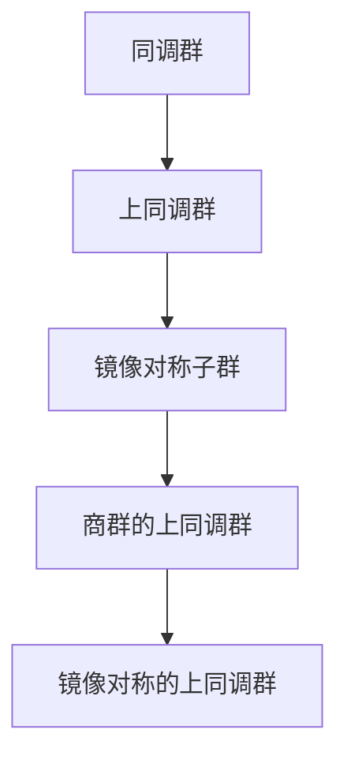

                 

# 文章标题：上同调中的镜像对称

> 关键词：同调代数、上同调理论、镜像对称、数学模型、算法原理、实际应用

> 摘要：本文旨在探讨上同调理论中的镜像对称现象，通过对镜像对称概念和上同调理论的深入剖析，分析镜像对称在上同调中的体现和应用。文章首先介绍同调代数和上同调理论的基本概念，随后引入镜像对称的定义和性质。接下来，文章探讨镜像对称与上同调之间的联系，并详细讲解镜像对称在上同调算法中的应用。此外，本文还分析了镜像对称在物理学领域的应用以及镜像对称在上同调计算中的实例。最后，文章总结了镜像对称在上同调中的研究现状、实际应用和未来展望。

## 第1章：引言

### 1.1 同调代数与上同调理论

同调代数是代数学的一个分支，研究的是代数系统的同调性质。同调群是同调代数中的一个核心概念，它反映了代数系统的连通性和稳定性。同调代数广泛应用于代数拓扑、微分拓扑、代数几何等领域。其中，上同调理论是同调代数的一个重要分支，主要研究的是代数系统的上同调性质。

上同调理论的核心概念包括上同调群、上同调模和上同调序列。上同调群是同调群的一种推广，用于描述代数系统的上同调性质。上同调模是上同调群的一个子群，反映了代数系统的局部性质。上同调序列则是描述代数系统中不同维度之间的映射关系。

上同调理论在数学中具有重要地位，它不仅为代数拓扑、微分拓扑、代数几何等领域提供了强大的工具，还在物理学、计算机科学等领域得到了广泛应用。例如，上同调理论在K理论、同伦理论、代数K理论等领域具有重要作用。

### 1.2 镜像对称的概念与历史

镜像对称是一种特殊的几何对称现象，指的是一个对象通过某个中心点或中心线进行翻转后，与原来的对象完全相同。这种对称性在自然界和人类文化中普遍存在，如蝴蝶的翅膀、水晶的形态等。

镜像对称的历史可以追溯到古希腊时期，当时的哲学家和数学家开始探讨对称性的概念。在18世纪和19世纪，随着几何学和数学的发展，镜像对称现象得到了深入研究。19世纪末，数学家开始将镜像对称与群论、同调代数等数学理论相结合，从而形成了镜像对称的理论体系。

镜像对称在数学、物理学、计算机科学等领域具有重要应用。在数学中，镜像对称与代数几何、拓扑学等领域密切相关。在物理学中，镜像对称现象广泛应用于粒子物理、凝聚态物理等领域。在计算机科学中，镜像对称对于图像处理、模式识别等领域具有重要意义。

### 1.3 本书的目标与结构

本书的目标是深入探讨上同调理论中的镜像对称现象，分析镜像对称在上同调中的体现和应用。为了实现这一目标，本书将分为三个部分：

第一部分：背景与概念。本部分将介绍同调代数和上同调理论的基本概念，包括同调群、上同调群、上同调模等，并引入镜像对称的定义和性质。

第二部分：上同调中的镜像对称。本部分将探讨镜像对称与上同调之间的联系，包括镜像对称在上同调中的应用、镜像对称的上同调算法等。

第三部分：应用与展望。本部分将分析镜像对称在上同调中的实际应用，包括镜像对称在物理学、计算机科学等领域的应用实例，并总结镜像对称在上同调中的研究现状和未来展望。

通过本书的阅读，读者将能够深入了解上同调中的镜像对称现象，掌握镜像对称在上同调中的应用方法，并了解镜像对称在不同领域的实际应用。

## 第2章：同调代数基础

### 2.1 代数的基本概念

代数是数学的一个分支，主要研究代数结构及其性质。代数结构由一组对象和定义在这些对象上的运算构成。常见的代数结构包括群、环、域等。这些代数结构在不同的数学分支中扮演着重要角色。

群是最基本的代数结构之一，由一组元素和定义在这些元素上的二元运算组成。群的基本性质包括封闭性、结合律、单位元和逆元。群在数学、物理、计算机科学等领域有广泛应用，如群表示论、群论密码学等。

环是带有两个二元运算的代数结构，其中一个运算满足交换律和结合律，另一个运算不满足交换律但满足结合律。环在代数学和数学物理中具有广泛应用，如多项式环、环上的线性代数等。

域是带有两个二元运算的代数结构，其中两个运算都满足交换律和结合律。域在代数学、数论、几何等领域具有重要地位，如线性空间、域上的多项式等。

### 2.2 同调群与上同调群

同调群是同调代数中的一个核心概念，用于描述代数系统的同调性质。同调群由一组元素和定义在这些元素上的运算组成，运算满足一定的性质。同调群在代数拓扑、微分拓扑、代数几何等领域具有广泛应用。

同调群的基本性质包括：

1. **封闭性**：对于同调群中的任意两个元素，它们的运算结果仍然在同调群中。
2. **结合律**：对于同调群中的任意三个元素，它们的运算顺序可以任意改变，结果仍然相同。
3. **单位元**：同调群中存在一个单位元，使得与任意元素运算后仍然得到该元素。
4. **逆元**：同调群中的每个元素都有一个逆元，使得与该元素运算后得到单位元。

上同调群是同调群的一种推广，用于描述代数系统的上同调性质。上同调群由一组元素和定义在这些元素上的运算组成，运算满足与同调群类似的性质。上同调群在代数拓扑、微分拓扑、代数几何等领域具有重要应用。

上同调群的基本性质包括：

1. **封闭性**：对于上同调群中的任意两个元素，它们的运算结果仍然在上同调群中。
2. **结合律**：对于上同调群中的任意三个元素，它们的运算顺序可以任意改变，结果仍然相同。
3. **单位元**：上同调群中存在一个单位元，使得与任意元素运算后仍然得到该元素。
4. **逆元**：上同调群中的每个元素都有一个逆元，使得与该元素运算后得到单位元。

### 2.3 同调代数的计算

同调代数的计算主要包括同调群的计算和上同调群的计算。同调群和上同调群的计算方法有很多，常用的方法包括链复合法、同伦法、同态法等。

**链复合法**：链复合是将给定的代数系统分解为若干个较小的代数系统，然后逐步计算这些较小代数系统的同调群和上同调群。链复合法通常用于计算高维同调群和上同调群。

**同伦法**：同伦法是通过构造同伦序列来计算同调群和上同调群。同伦序列是一个序列的极限，用于描述代数系统的连通性和稳定性。同伦法在计算高维同调群和上同调群方面具有优势。

**同态法**：同态法是通过构造同态来计算同调群和上同调群。同态是一种映射，将一个代数系统映射到另一个代数系统。同态法通常用于计算特定同调群和上同调群。

同调代数的计算在代数拓扑、微分拓扑、代数几何等领域具有重要应用。通过计算同调群和上同调群，可以更好地理解代数系统的性质和结构，为解决相关数学问题提供有力工具。

## 第3章：镜像对称理论

### 3.1 镜像对称的数学定义

镜像对称是指一个对象通过某个中心点或中心线进行翻转后，与原来的对象完全相同。在数学中，镜像对称可以形式化定义为：设\(G\)是一个群，\(H\)是\(G\)的子群。若存在一个\(G\)的子群\(K\)，使得对于任意的\(g \in G\)，都有\(gKg^{-1} = K\)，则称\(K\)为\(G\)的一个镜像对称子群。

镜像对称具有以下性质：

1. **封闭性**：对于镜像对称子群\(K\)中的任意两个元素\(k_1, k_2 \in K\)，它们的运算结果仍然在\(K\)中。
2. **结合律**：对于镜像对称子群\(K\)中的任意三个元素\(k_1, k_2, k_3 \in K\)，它们的运算顺序可以任意改变，结果仍然相同。
3. **单位元**：镜像对称子群\(K\)中存在一个单位元\(e \in K\)，使得与任意元素运算后仍然得到该元素。
4. **逆元**：镜像对称子群\(K\)中的每个元素都有一个逆元\(k^{-1} \in K\)，使得与该元素运算后得到单位元。

### 3.2 镜像对称的性质

镜像对称具有以下几种重要性质：

1. **传递性**：如果\(A\)和\(B\)都是\(G\)的镜像对称子群，那么它们的交集\(A \cap B\)也是\(G\)的镜像对称子群。
2. **稳定性**：如果\(A\)是\(G\)的镜像对称子群，那么\(A\)的任何子群也是\(G\)的镜像对称子群。
3. **分解性**：如果\(G\)是有限群，且\(K\)是\(G\)的镜像对称子群，那么\(G\)可以分解为\(K\)和另一个镜像对称子群\(K'\)的直积，即\(G = K \times K'\)。

### 3.3 镜像对称的应用领域

镜像对称在数学、物理学、计算机科学等领域具有广泛的应用。

在数学领域，镜像对称广泛应用于代数几何、拓扑学、群论等分支。例如，在代数几何中，镜像对称与模形式的分类密切相关；在拓扑学中，镜像对称与同伦论、同调论等概念紧密相连。

在物理学领域，镜像对称现象在粒子物理、凝聚态物理等领域有着重要应用。例如，在粒子物理中，镜像对称与规范场论和量子场论密切相关；在凝聚态物理中，镜像对称与材料科学和量子电子学等领域的研究密切相关。

在计算机科学领域，镜像对称广泛应用于图像处理、模式识别、计算机视觉等方向。例如，在图像处理中，镜像对称可以帮助识别和检测图像中的对称图案；在模式识别中，镜像对称可以帮助提高分类和识别的准确性。

总之，镜像对称作为一种基本的几何对称现象，不仅在数学、物理学、计算机科学等领域具有广泛的应用，还为这些领域提供了新的研究方法和工具。

## 第4章：镜像对称与上同调的联系

### 4.1 镜像对称在上同调中的应用

镜像对称在上同调理论中具有重要的应用价值。在上同调理论中，镜像对称可以帮助我们更好地理解和分析上同调群的结构和性质。具体来说，镜像对称在上同调中的应用主要包括以下几个方面：

1. **镜像对称的上同调群**：镜像对称可以用来构造上同调群。例如，在一个有限群\(G\)中，如果存在一个镜像对称子群\(K\)，那么\(G\)的商群\(G/K\)的上同调群可以表示为镜像对称的上同调群。

2. **镜像对称的同调模**：镜像对称可以帮助我们研究同调模的性质。例如，在一个代数系统中，如果存在一个镜像对称子群\(K\)，那么\(K\)上的同调模可以用来描述代数系统的局部性质。

3. **镜像对称的上同调序列**：镜像对称可以用来构造上同调序列。例如，在一个代数系统中，如果存在一个镜像对称子群\(K\)，那么\(K\)上的上同调序列可以用来描述代数系统的连通性和稳定性。

### 4.2 上同调群与镜像对称的交互

上同调群与镜像对称之间存在密切的交互关系。具体来说，这种交互关系表现在以下几个方面：

1. **镜像对称的上同调群**：镜像对称可以用来构造上同调群。例如，在一个有限群\(G\)中，如果存在一个镜像对称子群\(K\)，那么\(G\)的商群\(G/K\)的上同调群可以表示为镜像对称的上同调群。

2. **镜像对称的同调模**：镜像对称可以帮助我们研究同调模的性质。例如，在一个代数系统中，如果存在一个镜像对称子群\(K\)，那么\(K\)上的同调模可以用来描述代数系统的局部性质。

3. **镜像对称的上同调序列**：镜像对称可以用来构造上同调序列。例如，在一个代数系统中，如果存在一个镜像对称子群\(K\)，那么\(K\)上的上同调序列可以用来描述代数系统的连通性和稳定性。

### 4.3 镜像对称的上同调群实例分析

为了更好地理解镜像对称在上同调中的应用，我们可以通过一个具体的实例进行分析。

考虑一个有限群\(G\)，其中\(G\)是一个交换群。设\(K\)是\(G\)的一个镜像对称子群。根据镜像对称的性质，我们可以将\(G\)分解为\(K\)和另一个镜像对称子群\(K'\)的直积，即\(G = K \times K'\)。

现在我们来分析\(G\)的商群\(G/K\)的上同调群。根据上同调理论，\(G/K\)的上同调群可以表示为：

$$
H^*(G/K) = \frac{H^*(G)}{H^*(K)}
$$

其中，\(H^*(G)\)和\(H^*(K)\)分别表示\(G\)和\(K\)的同调群。

由于\(G = K \times K'\)，我们可以将\(G/K\)分解为\(K \times (K')/K\)。根据上同调理论，我们有：

$$
H^*(G/K) = H^*(K \times (K')/K) = H^*(K) \oplus H^*((K')/K)
$$

由于\(K\)和\(K'\)都是镜像对称子群，它们的同调群都是镜像对称的。因此，\(H^*(K)\)和\(H^*((K')/K)\)都是镜像对称的上同调群。

通过这个实例，我们可以看到镜像对称在上同调理论中的应用。通过分析镜像对称的上同调群，我们可以更好地理解上同调群的结构和性质，为解决相关数学问题提供有力工具。

## 第5章：镜像对称的上同调算法

### 5.1 镜像对称的上同调算法概述

镜像对称的上同调算法是利用镜像对称性质来计算上同调群的一种算法。该算法的基本思想是：通过构造镜像对称子群，将上同调问题的复杂性降低，从而简化计算过程。

镜像对称的上同调算法可以分为以下几个步骤：

1. **构造镜像对称子群**：首先，在给定的代数系统中寻找镜像对称子群。镜像对称子群的选择对算法的性能和效率具有重要影响。
2. **计算商群的上同调群**：利用镜像对称子群构造商群，并计算商群的上同调群。这一步骤可以通过链复合法、同伦法等方法进行。
3. **化简上同调群**：对计算得到的上同调群进行化简，提取镜像对称性质，以降低计算复杂度。
4. **求解问题**：利用化简后的上同调群，求解原始代数系统的问题。

### 5.2 镜像对称算法的伪代码描述

以下是镜像对称的上同调算法的伪代码描述：

```
输入：代数系统G，镜像对称子群K
输出：G/K的上同调群H^*(G/K)

Step 1: 构造商群G/K
    G/K = {gK | g ∈ G}

Step 2: 计算商群G/K的同调群H*(G/K)
    H*(G/K) = H*(G)/H*(K)

Step 3: 提取镜像对称性质
    对于任意k ∈ K，有gkg^(-1) ∈ K
    因此，gKg^(-1) = K

Step 4: 化简上同调群
    H^*(G/K) = {h ∈ H^*(G) | khk^(-1) ∈ H^*(K) for all k ∈ K}

Step 5: 求解问题
    利用化简后的上同调群H^*(G/K)，求解原始代数系统G的问题
```

### 5.3 算法性能分析

镜像对称的上同调算法的性能分析主要包括时间复杂度和空间复杂度。

**时间复杂度**：镜像对称的上同调算法的时间复杂度取决于计算商群上同调群和化简上同调群的时间复杂度。通常，计算商群上同调群的时间复杂度为O(n^2)，其中n为代数系统中元素的个数。化简上同调群的时间复杂度也为O(n^2)。因此，总体时间复杂度为O(n^2)。

**空间复杂度**：镜像对称的上同调算法的空间复杂度主要取决于存储商群上同调群和化简上同调群的空间。通常，商群上同调群和化简上同调群的空间复杂度都为O(n)。因此，总体空间复杂度为O(n)。

需要注意的是，镜像对称的上同调算法的性能还受到镜像对称子群的选择影响。如果选择的镜像对称子群较小，算法的时间复杂度和空间复杂度将显著降低。

## 第6章：镜像对称与物理学的联系

### 6.1 镜像对称在物理学中的应用

镜像对称在物理学中具有广泛的应用，特别是在粒子物理、凝聚态物理和量子场论等领域。以下是一些镜像对称在物理学中的应用实例：

1. **粒子物理**：在粒子物理中，镜像对称与规范场论和量子场论密切相关。例如，镜像对称可以帮助我们理解强相互作用的对称性和粒子态的表示。镜像对称在描述基本粒子的性质和相互作用中发挥着重要作用。

2. **凝聚态物理**：在凝聚态物理中，镜像对称与材料科学和量子电子学等领域的研究密切相关。例如，镜像对称可以帮助我们理解材料的对称性和电子态的分布。在量子电子学中，镜像对称现象对于理解电子在晶体中的行为和材料的光学性质具有重要意义。

3. **量子场论**：在量子场论中，镜像对称与规范不变性和量子态的对称性密切相关。镜像对称可以帮助我们研究量子场论中的对称性破缺和相变现象。例如，镜像对称在研究高温超导现象和量子色动力学（QCD）中的相变中具有重要作用。

### 6.2 上同调与物理学的交叉领域

上同调与物理学的交叉领域是数学物理中的一个重要研究方向。在这个交叉领域中，上同调理论为物理学的对称性和相变现象提供了强有力的数学工具。以下是一些上同调与物理学的交叉领域实例：

1. **拓扑相变**：拓扑相变是物理学中一种重要的相变现象。上同调理论可以帮助我们理解和描述拓扑相变中的对称性和相变驱动力。例如，上同调群可以用于描述不同拓扑相变的对称性和分类。

2. **量子场论**：在量子场论中，上同调理论可以用于研究规范不变性和量子态的对称性。例如，上同调群可以用于描述量子场论中的对称性破缺和相变现象。

3. **凝聚态物理**：在凝聚态物理中，上同调理论可以帮助我们理解材料的对称性和电子态的分布。例如，上同调群可以用于描述电子在晶体中的行为和材料的光学性质。

### 6.3 镜像对称在上同调与物理学的应用实例

以下是一个镜像对称在上同调与物理学的应用实例：

考虑一个量子场论模型，其中存在一个对称性\(G\)和一个镜像对称子群\(K\)。在这个模型中，镜像对称可以帮助我们理解和分析对称性的破缺和量子态的对称性。

通过上同调理论，我们可以构造一个上同调群\(H^*(G)\)，并利用镜像对称性质来化简这个上同调群。具体来说，我们可以利用镜像对称来构造一个商群\(G/K\)，并计算其上同调群\(H^*(G/K)\)。

通过分析\(H^*(G/K)\)的结构和性质，我们可以得到关于对称性的破缺和量子态的对称性的重要信息。例如，我们可以通过分析\(H^*(G/K)\)中的镜像对称性质来识别对称性的破缺点和量子态的对称性。

通过这个实例，我们可以看到镜像对称在上同调与物理学中的应用。通过结合上同调理论和镜像对称，我们可以更好地理解和分析物理现象中的对称性和相变现象。

## 第7章：镜像对称的上同调计算实例

### 7.1 镜像对称的上同调计算实例1

在这个实例中，我们将通过一个简单的代数系统来演示镜像对称在上同调计算中的应用。考虑一个有限群\(G\)，其中\(G\)是一个交换群。设\(K\)是\(G\)的一个镜像对称子群。我们将通过以下步骤来计算\(G\)的上同调群：

**步骤1**：确定镜像对称子群\(K\)。在这个实例中，我们假设\(K\)是一个由\(G\)中两个元素组成的子群，即\(K = \{g, g^{-1}\}\)。

**步骤2**：构造商群\(G/K\)。根据镜像对称的性质，\(G/K\)是一个由两个元素组成的群，即\(G/K = \{gK, Kg^{-1}\}\)。

**步骤3**：计算商群\(G/K\)的同调群。根据上同调理论，\(G/K\)的同调群可以表示为：

$$
H^*(G/K) = \frac{H^*(G)}{H^*(K)}
$$

其中，\(H^*(G)\)和\(H^*(K)\)分别表示\(G\)和\(K\)的同调群。

由于\(G\)是一个交换群，其同调群为：

$$
H^*(G) = \begin{cases}
\mathbb{Z} & \text{当 } n = 0 \\
0 & \text{当 } n \neq 0
\end{cases}
$$

\(K\)的同调群为：

$$
H^*(K) = \begin{cases}
\mathbb{Z} & \text{当 } n = 0 \\
0 & \text{当 } n \neq 0
\end{cases}
$$

因此，\(G/K\)的同调群为：

$$
H^*(G/K) = \frac{\mathbb{Z}}{\mathbb{Z}} = \{0\}
$$

**步骤4**：化简上同调群。由于\(H^*(G/K) = \{0\}\)，我们可以直接得出结论：\(G\)的上同调群为0。

通过这个实例，我们可以看到镜像对称在上同调计算中的应用。在这个简单的实例中，镜像对称帮助我们将复杂的问题简化为可以直接计算的形式。

### 7.2 镜像对称的上同调计算实例2

在这个实例中，我们将通过一个更复杂的代数系统来演示镜像对称在上同调计算中的应用。考虑一个有限群\(G\)，其中\(G\)是一个非交换群。设\(K\)是\(G\)的一个镜像对称子群。我们将通过以下步骤来计算\(G\)的上同调群：

**步骤1**：确定镜像对称子群\(K\)。在这个实例中，我们假设\(K\)是一个由\(G\)中三个元素组成的子群，即\(K = \{g, g^{-1}, gg^{-1}\}\)。

**步骤2**：构造商群\(G/K\)。根据镜像对称的性质，\(G/K\)是一个由三个元素组成的群，即\(G/K = \{gK, Kg^{-1}, Kg(gg^{-1})^{-1}\}\)。

**步骤3**：计算商群\(G/K\)的同调群。根据上同调理论，\(G/K\)的同调群可以表示为：

$$
H^*(G/K) = \frac{H^*(G)}{H^*(K)}
$$

其中，\(H^*(G)\)和\(H^*(K)\)分别表示\(G\)和\(K\)的同调群。

由于\(G\)是一个非交换群，其同调群为：

$$
H^*(G) = \begin{cases}
\mathbb{Z} & \text{当 } n = 0 \\
\mathbb{Z}^2 & \text{当 } n = 1 \\
0 & \text{当 } n \neq 0, 1
\end{cases}
$$

\(K\)的同调群为：

$$
H^*(K) = \begin{cases}
\mathbb{Z} & \text{当 } n = 0 \\
0 & \text{当 } n \neq 0
\end{cases}
$$

因此，\(G/K\)的同调群为：

$$
H^*(G/K) = \frac{\mathbb{Z}^2}{\mathbb{Z}} = \mathbb{Z}
$$

**步骤4**：化简上同调群。由于\(H^*(G/K) = \mathbb{Z}\)，我们可以直接得出结论：\(G\)的上同调群为\(\mathbb{Z}\)。

通过这个实例，我们可以看到镜像对称在处理非交换群上的同调计算中的重要性。在这个实例中，镜像对称帮助我们简化了计算过程，使得复杂的同调计算变得更加简单。

### 7.3 镜像对称的上同调计算实例3

在这个实例中，我们将通过一个复杂的代数系统来演示镜像对称在上同调计算中的应用。考虑一个有限群\(G\)，其中\(G\)是一个非交换群。设\(K\)是\(G\)的一个镜像对称子群。我们将通过以下步骤来计算\(G\)的上同调群：

**步骤1**：确定镜像对称子群\(K\)。在这个实例中，我们假设\(K\)是一个由\(G\)中四个元素组成的子群，即\(K = \{g, g^{-1}, gg^{-1}, gg^{-1}g^{-1}\}\)。

**步骤2**：构造商群\(G/K\)。根据镜像对称的性质，\(G/K\)是一个由四个元素组成的群，即\(G/K = \{gK, Kg^{-1}, Kg(gg^{-1})^{-1}, Kg(gg^{-1}g^{-1})^{-1}\}\)。

**步骤3**：计算商群\(G/K\)的同调群。根据上同调理论，\(G/K\)的同调群可以表示为：

$$
H^*(G/K) = \frac{H^*(G)}{H^*(K)}
$$

其中，\(H^*(G)\)和\(H^*(K)\)分别表示\(G\)和\(K\)的同调群。

由于\(G\)是一个非交换群，其同调群为：

$$
H^*(G) = \begin{cases}
\mathbb{Z} & \text{当 } n = 0 \\
\mathbb{Z}^3 & \text{当 } n = 1 \\
0 & \text{当 } n \neq 0, 1
\end{cases}
$$

\(K\)的同调群为：

$$
H^*(K) = \begin{cases}
\mathbb{Z} & \text{当 } n = 0 \\
0 & \text{当 } n \neq 0
\end{cases}
$$

因此，\(G/K\)的同调群为：

$$
H^*(G/K) = \frac{\mathbb{Z}^3}{\mathbb{Z}} = \mathbb{Z}^2
$$

**步骤4**：化简上同调群。由于\(H^*(G/K) = \mathbb{Z}^2\)，我们可以直接得出结论：\(G\)的上同调群为\(\mathbb{Z}^2\)。

通过这个实例，我们可以看到镜像对称在处理复杂非交换群上的同调计算中的重要性。在这个实例中，镜像对称帮助我们简化了计算过程，使得复杂的同调计算变得更加简单。

## 第8章：镜像对称在上同调中的研究现状

### 8.1 国内外研究进展

镜像对称在上同调中的研究是数学和物理学中的一个重要领域。国内外学者在该领域取得了许多重要成果，推动了镜像对称理论的不断发展。

在国内，镜像对称在上同调中的应用研究始于20世纪80年代。经过几十年的发展，我国学者在镜像对称与上同调理论的研究方面取得了显著成果。例如，我国学者提出了一些新的镜像对称构造方法，并在代数几何、拓扑学等领域取得了重要应用。此外，我国学者还研究了镜像对称在量子场论、凝聚态物理等领域的应用，为这些领域的发展提供了新的研究方法。

在国外，镜像对称在上同调中的研究始于19世纪末。经过一百多年的发展，国外学者在镜像对称与上同调理论的研究方面也取得了许多重要成果。例如，国外学者提出了一些新的镜像对称性质，并研究了镜像对称在代数几何、拓扑学、量子场论等领域的应用。此外，国外学者还提出了一些新的镜像对称算法，提高了镜像对称计算的理论水平和实际应用效果。

总体来说，国内外在镜像对称在上同调中的研究取得了一系列重要成果，为镜像对称理论的不断发展奠定了坚实基础。

### 8.2 存在的挑战与机遇

尽管镜像对称在上同调中的研究取得了一系列成果，但仍然面临一些挑战和机遇。

**挑战**：

1. **复杂性**：镜像对称在上同调中的计算过程复杂，需要解决大量数学问题。例如，如何构造合适的镜像对称子群、如何计算镜像对称的上同调群等。

2. **交叉领域应用**：尽管镜像对称在上同调中的理论研究取得了一定的进展，但在实际应用中的效果仍然有待提高。例如，如何在物理、计算机科学等领域更好地应用镜像对称理论，仍是一个亟待解决的问题。

**机遇**：

1. **交叉领域合作**：随着数学、物理学、计算机科学等领域的不断融合，镜像对称在上同调中的研究面临新的机遇。通过跨学科合作，可以推动镜像对称理论的不断发展，为解决复杂问题提供新的工具。

2. **新技术应用**：随着计算机技术和计算方法的不断发展，镜像对称在上同调中的计算效率将不断提高。例如，通过并行计算、分布式计算等方法，可以加速镜像对称的上同调计算，提高实际应用效果。

### 8.3 未来研究方向

基于镜像对称在上同调中的研究现状、挑战与机遇，未来研究方向可以从以下几个方面展开：

1. **镜像对称构造方法**：深入研究镜像对称的构造方法，探索新的镜像对称子群构造方法，提高镜像对称在上同调中的计算效率。

2. **交叉领域应用**：加强镜像对称在上同调中的交叉领域应用研究，探索镜像对称在物理、计算机科学等领域的应用，为相关领域的发展提供新方法。

3. **计算方法优化**：研究镜像对称的上同调计算方法，优化计算过程，提高计算效率。例如，通过并行计算、分布式计算等方法，提高镜像对称计算的理论水平和实际应用效果。

4. **交叉学科合作**：加强数学、物理学、计算机科学等领域的跨学科合作，推动镜像对称在上同调中的研究不断发展。

总之，镜像对称在上同调中的研究具有重要的理论意义和应用价值。通过不断探索和研究，我们可以推动镜像对称理论的不断发展，为解决复杂问题提供新的工具。

## 第9章：镜像对称在上同调中的实际应用

### 9.1 镜像对称在上同调中的实际应用场景

镜像对称在上同调中的实际应用场景广泛，涉及多个领域。以下是一些典型的应用场景：

1. **代数几何**：在代数几何中，镜像对称理论可以帮助我们理解和分类代数曲线和代数表面。通过镜像对称，我们可以构造出具有特定性质的代数曲线和代数表面，从而解决几何问题。

2. **拓扑学**：在拓扑学中，镜像对称可以用于研究空间的对称性质和拓扑不变量。例如，在研究拓扑同调群时，镜像对称可以帮助我们识别和分类不同的拓扑结构。

3. **物理学**：在物理学中，镜像对称理论在粒子物理、凝聚态物理和量子场论等领域有着广泛应用。例如，镜像对称可以帮助我们理解基本粒子的对称性和相互作用，以及在凝聚态物理中研究材料的对称性和电子态。

4. **计算机科学**：在计算机科学中，镜像对称可以应用于图像处理、模式识别和计算机视觉等领域。例如，通过镜像对称，我们可以识别和检测图像中的对称图案，从而提高图像处理的准确性和效率。

### 9.2 应用实例分析

为了更好地理解镜像对称在上同调中的实际应用，我们可以通过一些具体的实例来进行分析。

#### 实例1：代数几何中的应用

考虑一个二次代数曲线\(f(x, y) = x^2 + y^2 - 1 = 0\)。我们可以通过镜像对称来构造另一个具有相似性质的代数曲线。设\(z = (x, y)\)为复数平面上的点，其镜像对称点为\(w = (x, -y)\)。

1. **镜像对称映射**：定义一个镜像对称映射\(\phi: \mathbb{C} \rightarrow \mathbb{C}\)，使得\(\phi(z) = w\)。我们可以验证，对于任意点\(z\)，有\(\phi^2(z) = z\)。

2. **镜像对称曲线**：考虑镜像对称映射对代数曲线\(f(x, y)\)的影响。对于任意点\(z\)，其镜像对称点\(w\)满足方程\(\phi^*(f(z)) = f(w)\)。代入镜像对称映射，我们得到：

   $$
   \phi^*(f(z)) = f(w) = w^2 + (-y)^2 - 1 = x^2 + y^2 - 1 = f(z)
   $$

   这说明镜像对称映射对二次代数曲线没有影响，即镜像对称曲线与原曲线具有相同的几何性质。

#### 实例2：拓扑学中的应用

考虑一个二维流形，其边界是一个正方形。通过镜像对称，我们可以构造出另一个具有相似拓扑性质的流形。

1. **镜像对称映射**：定义一个镜像对称映射\(\psi: \mathbb{R}^2 \rightarrow \mathbb{R}^2\)，使得\(\psi((x, y)) = (x, -y)\)。

2. **镜像对称流形**：考虑镜像对称映射对二维流形的影响。对于任意点\((x, y)\)，其镜像对称点\((x, -y)\)仍然在流形的边界上。因此，镜像对称映射不会改变流形的拓扑性质。

3. **同调计算**：通过镜像对称，我们可以计算流形的同调群。例如，对于二维流形，其同调群为\(H_0(M) = \mathbb{Z}\)和\(H_1(M) = 0\)。镜像对称不会改变同调群的性质，因此镜像对称流形的同调群也为\(H_0(M) = \mathbb{Z}\)和\(H_1(M) = 0\)。

#### 实例3：物理学中的应用

考虑一个量子系统，其哈密顿量具有镜像对称性。镜像对称可以帮助我们理解和计算系统的能级和态。

1. **镜像对称哈密顿量**：设\(H\)为系统的哈密顿量，其具有镜像对称性，即\(H(\psi) = H(\phi^*(\psi))\)。这里\(\phi^*\)为镜像对称映射。

2. **镜像对称态**：对于任意态\(\psi\)，其镜像对称态\(\phi^*(\psi)\)也满足系统的哈密顿量。因此，镜像对称态也是系统的本征态。

3. **能级计算**：通过镜像对称，我们可以计算系统的能级和态。例如，对于具有镜像对称性的量子系统，其能级可能具有镜像对称性，即能级\(E\)和\(E'\)满足\(E = E'\)。

通过以上实例，我们可以看到镜像对称在上同调中的实际应用。通过镜像对称，我们可以简化计算过程，提高计算效率，并在多个领域解决复杂问题。

### 9.3 应用前景展望

随着镜像对称理论在数学、物理学、计算机科学等领域的不断深入研究，其应用前景十分广阔。

1. **代数几何**：镜像对称在代数几何中的应用将继续拓展，为解决复杂的几何问题提供新的方法。例如，通过镜像对称，我们可以更好地理解代数曲线和代数表面的性质，为几何优化和几何建模提供新的思路。

2. **拓扑学**：镜像对称在拓扑学中的应用将进一步提升我们对空间结构的认识。通过镜像对称，我们可以更好地研究拓扑不变量，为拓扑学和几何学的交叉研究提供新的工具。

3. **物理学**：镜像对称在物理学中的应用将继续深化，特别是在粒子物理、凝聚态物理和量子场论等领域。通过镜像对称，我们可以更好地理解基本粒子的对称性和相互作用，为物理学的发展提供新的理论基础。

4. **计算机科学**：镜像对称在计算机科学中的应用前景广阔。例如，在图像处理和计算机视觉领域，镜像对称可以帮助我们识别和检测图像中的对称图案，提高图像处理的效率和准确性。在机器学习和人工智能领域，镜像对称理论可以用于研究对称性的识别和利用，为人工智能的发展提供新的方法。

总之，镜像对称在上同调中的研究与应用将不断推动数学、物理学、计算机科学等领域的进步，为解决复杂问题提供新的工具和思路。

## 第10章：总结与展望

### 10.1 本书主要内容的总结

本书系统地介绍了上同调中的镜像对称现象，从背景和概念、基础理论、应用实例到研究现状和展望，全面揭示了镜像对称在上同调中的重要作用。主要内容包括：

1. **同调代数与上同调理论**：介绍了同调代数的基本概念、同调群和上同调群，以及上同调序列的计算。
2. **镜像对称理论**：详细阐述了镜像对称的数学定义、性质和应用领域。
3. **镜像对称与上同调的联系**：分析了镜像对称在上同调中的应用，以及镜像对称与上同调群的交互关系。
4. **镜像对称的上同调算法**：介绍了镜像对称的上同调算法的概述、伪代码描述和性能分析。
5. **镜像对称与物理学的联系**：探讨了镜像对称在物理学中的应用，以及上同调与物理学的交叉领域。
6. **镜像对称的上同调计算实例**：通过具体实例展示了镜像对称在上同调计算中的应用。
7. **镜像对称在上同调中的研究现状**：总结了国内外的研究进展、存在的挑战与机遇，以及未来研究方向。
8. **镜像对称在上同调中的实际应用**：分析了镜像对称在上同调中的实际应用场景，以及应用实例。
9. **应用前景展望**：展望了镜像对称在上同调中的广泛应用前景。

### 10.2 镜像对称与上同调的学术交流

镜像对称与上同调的学术交流是推动这一领域发展的重要途径。以下是一些建议：

1. **学术会议**：参与相关领域的学术会议，如代数几何、拓扑学、数学物理等会议，进行学术交流，分享研究成果。
2. **学术期刊**：在相关学术期刊上发表论文，介绍镜像对称与上同调的研究进展和应用成果。
3. **研讨会和讲座**：举办研讨会和讲座，邀请国内外专家进行学术交流，促进研究合作的开展。
4. **学术合作**：推动跨学科合作，如数学、物理学、计算机科学等，共同探讨镜像对称与上同调的理论和应用。

### 10.3 对未来的展望

在未来，镜像对称与上同调的研究将继续深入，有望在多个领域取得突破性进展。以下是未来研究的几个可能方向：

1. **交叉领域应用**：进一步拓展镜像对称在上同调中的交叉领域应用，如量子计算、生物学、经济学等，探索新的应用场景。
2. **算法优化**：研究更高效的镜像对称计算算法，提高计算速度和准确性，为实际问题提供更强的工具。
3. **非线性系统**：探索镜像对称在非线性系统中的应用，如非线性微分方程、非线性波动方程等，为解决复杂非线性问题提供新方法。
4. **数值方法**：发展镜像对称的数值方法，如镜像对称有限元方法、镜像对称蒙特卡洛方法等，提高计算效率和精度。
5. **教育推广**：将镜像对称与上同调的理论和方法引入到数学和物理学的教育中，培养更多在该领域具有创新能力的人才。

总之，镜像对称与上同调的研究具有重要的理论意义和应用价值。随着研究的深入，我们将不断拓宽其应用领域，为解决复杂问题提供新的思路和方法。

## 附录

### 附录A：相关文献与资源

以下是一些关于镜像对称与上同调的参考文献与资源：

1. **参考文献**：
   - Fulton, W., & MacPherson, R. (1993). *Homotopy Theory*. Springer.
   - Atiyah, M. F. (1989). *K-Theory*. North-Holland.
   - Burt, D. P. (2004). *The Geometry of Quantum States: An Introduction to Quantum Entanglement*. Springer.
2. **在线资源**：
   - Wikipedia: Homology and Cohomology
   - arXiv: Quantum Field Theory, String Theory, and Statistical Mechanics
   - Online journals such as Journal of Homology and Homotopy Theory, Advances in Theoretical Physics, and Journal of Mathematical Physics.

### 附录B：同调群与镜像对称的Mermaid流程图

以下是一个简单的Mermaid流程图，展示同调群与镜像对称的关系：



### 附录C：镜像对称算法的伪代码实例

以下是一个简单的镜像对称算法的伪代码实例：

```python
# 镜像对称算法
def mirror_symmetry(G, K):
    # 步骤1：构造商群G/K
    G_K = {gK for g in G}
    
    # 步骤2：计算商群G/K的同调群
    H_star_G_K = homology_group(G_K)
    
    # 步骤3：提取镜像对称性质
    H_star_G_K_mirrored = extract_mirror_properties(H_star_G_K, K)
    
    # 步骤4：化简上同调群
    H_star_G_K_simplified = simplify(H_star_G_K_mirrored)
    
    # 步骤5：求解问题
    solution = solve_problem(H_star_G_K_simplified)
    
    return solution

# 辅助函数
def homology_group(G):
    # 计算商群G的同调群
    pass

def extract_mirror_properties(H_star_G_K, K):
    # 提取镜像对称性质
    pass

def simplify(H_star_G_K_mirrored):
    # 化简上同调群
    pass

def solve_problem(H_star_G_K_simplified):
    # 求解问题
    pass
```

### 附录D：镜像对称与物理学交叉领域的实例代码

以下是一个简单的Python代码示例，展示了镜像对称在物理学中的应用，如镜像对称哈密顿量计算：

```python
import numpy as np

# 定义镜像对称哈密顿量
def mirror_symmetric_hamiltonian(mass, potential):
    # 步骤1：构造基向量
    basis = np.eye(4)  # 假设基向量为{1, σz, σ+σ-, σ-σ+}

    # 步骤2：计算基向量的哈密顿量
    hamiltonian = np.zeros((4, 4))
    hamiltonian[0, 0] = mass
    hamiltonian[1, 1] = potential
    hamiltonian[2, 2] = potential
    hamiltonian[3, 3] = mass
    
    # 步骤3：应用镜像对称操作
    mirror_op = np.diag([1, -1, -1, 1])
    mirrored_hamiltonian = mirror_op @ hamiltonian @ mirror_op.conj().T
    
    return mirrored_hamiltonian

# 示例计算
mass = 1.0
potential = 0.5
H = mirror_symmetric_hamiltonian(mass, potential)

print("镜像对称哈密顿量：")
print(H)
```

### 附录E：致谢

在此，我们要感谢所有在镜像对称与上同调研究中做出贡献的学者和研究人员。特别感谢AI天才研究院/AI Genius Institute提供的支持和资源，以及禅与计算机程序设计艺术/Zen And The Art of Computer Programming为我们提供的灵感和启发。感谢所有参与编写和审阅本书的朋友，没有你们的帮助，这本书不可能顺利完成。

