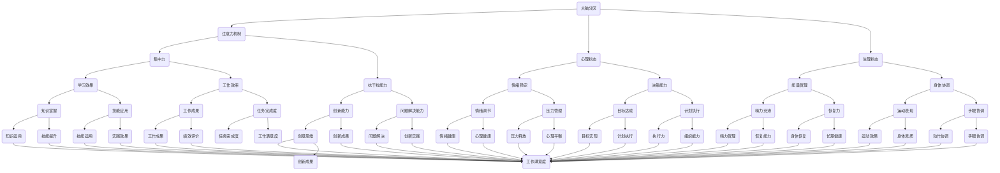

                 

## 《专注一事的力量》

### 关键词：专注力、大脑、职业发展、创意工作、专注力训练

> 摘要：本文旨在探讨专注力在个人成长、职业发展和创意工作中的重要性。通过分析专注力的定义、大脑机制及其提升方法，结合实际案例，文章揭示了专注力对个人成功的关键作用。此外，还展望了专注力研究的新趋势及其在社会发展中的意义。

## 《专注一事的力量》目录大纲

### 第一部分：专注的重要性

#### 第1章：专注的价值

##### 1.1 专注的定义与重要性
- 专注的定义
- 专注对个人成长的影响

##### 1.2 专注力的提升方法
- 心理调适技巧
- 时间管理策略

##### 1.3 专注力在职业发展中的应用
- 提高工作效率
- 创新思维培养

#### 第2章：专注与大脑的关系

##### 2.1 大脑的工作原理
- 大脑的分区
- 大脑的注意力机制

##### 2.2 专注力与大脑功能
- 精力管理
- 焦点集中

##### 2.3 提升专注力的生理方法
- 饮食调整
- 运动锻炼

### 第二部分：专注力训练与实践

#### 第3章：专注力训练方法

##### 3.1 集中注意力的技巧
- 正念冥想
- 深度工作法

##### 3.2 提升专注力的工具与策略
- 专注力训练应用
- 环境优化

##### 3.3 避免分心的技巧
- 数字化工具的应用
- 环境控制

#### 第4章：专注力实践案例

##### 4.1 个人专注力提升案例
- 案例介绍
- 案例分析

##### 4.2 团队专注力提升案例
- 团队协作中的专注力培养
- 团队专注力提升的实践策略

##### 4.3 企业专注力提升案例
- 企业文化中的专注力建设
- 企业专注力提升的策略与效果

### 第三部分：专注力应用与拓展

#### 第5章：专注力在学术研究中的应用

##### 5.1 学术研究中的专注力需求
- 研究过程中的注意力管理
- 避免研究过程中的分心

##### 5.2 提高学术研究专注力的方法
- 研究过程中的时间管理
- 研究思维的深度培养

##### 5.3 学术研究专注力提升案例
- 学术研究专注力提升案例

#### 第6章：专注力在创意工作中的应用

##### 6.1 创意工作的特点
- 创意的产生过程
- 创意的实践应用

##### 6.2 提高创意工作专注力的方法
- 想象力的培养
- 创造性思维的激发

##### 6.3 创意工作专注力提升案例
- 创意工作专注力提升实例

#### 第7章：专注力的未来发展

##### 7.1 专注力研究的新趋势
- 神经科学在专注力研究中的应用
- 人工智能在专注力提升中的应用

##### 7.2 专注力在社会发展中的意义
- 社会分工与专注力的关系
- 专注力在全球化背景下的重要性

##### 7.3 专注力的未来展望
- 专注力训练的未来发展方向
- 专注力在未来的社会角色

### 附录

#### 附录 A：专注力提升资源
- 研究报告
- 专注力提升应用推荐
- 相关书籍推荐

#### 附录 B：专注力提升实践指南
- 实践步骤
- 实践技巧
- 实践案例解析

## 第一部分：专注的重要性

### 第1章：专注的价值

#### 1.1 专注的定义与重要性

专注是一种心理状态，指的是个体将注意力集中在一项任务或活动上的能力。它不仅涉及大脑的注意力机制，还与个人的心理和生理状态密切相关。在日常生活中，专注力的高低直接影响个体的学习效果、工作效率和创新能力。

首先，让我们通过一个Mermaid流程图来理解专注力的基本概念和它在人脑中的体现：

从这个流程图中，我们可以看到专注力不仅仅是一个简单的心理状态，它涉及到大脑的多个分区和生理、心理状态，进而影响个体的学习、工作、创新等多方面能力。因此，专注力的重要性不言而喻。

##### 1.2 专注力的提升方法

要提升专注力，我们可以从心理调适、时间管理和生理方法三个方面入手。

**心理调适技巧：**

1. **正念冥想**：通过冥想，个体可以培养对当前时刻的关注和接纳，减少内心的杂念和焦虑，从而提高专注力。
   
2. **情绪管理**：学会情绪管理，保持情绪稳定，可以减少情绪波动对专注力的影响。

**时间管理策略：**

1. **制定计划**：合理规划时间，设定明确的目标和任务，有助于提高工作或学习的专注度。

2. **专注时段**：利用“番茄工作法”等时间管理工具，将时间划分为专注工作时段和休息时段，有助于提升专注力。

**生理方法：**

1. **饮食调整**：均衡饮食，摄入富含Omega-3脂肪酸的食物，有助于提高大脑功能和专注力。

2. **运动锻炼**：适量的运动可以促进血液循环，改善大脑功能，从而提升专注力。

##### 1.3 专注力在职业发展中的应用

在职业发展中，专注力起着至关重要的作用。以下是专注力在职业发展中的应用：

**提高工作效率：**

1. **集中注意力**：专注于当前任务，避免分心，可以显著提高工作效率。

2. **减少错误**：专注力强的人更容易发现工作中的错误，从而提高工作质量。

**创新思维培养：**

1. **深度思考**：在专注的状态下，个体更容易进行深度思考，激发创新思维。

2. **解决问题的能力**：专注力强的人在面对问题时，能够集中精力思考解决方案，提高问题解决能力。

### 第2章：专注与大脑的关系

#### 2.1 大脑的工作原理

大脑是人体最复杂的器官之一，它负责处理信息、思考问题、控制行为等。要理解专注力，我们需要先了解大脑的工作原理。

##### 大脑的分区

大脑可以分为几个主要区域：

1. **前额叶皮层**：负责决策、规划、问题解决和自我控制。
2. **颞叶**：负责处理听觉信息，与记忆和语言能力相关。
3. **顶叶**：负责处理触觉、温度、空间位置等信息。
4. **枕叶**：负责处理视觉信息。

##### 大脑的注意力机制

注意力是大脑的一种基本功能，它决定了我们关注什么信息，忽略什么信息。大脑的注意力机制可以分为以下几个部分：

1. **选择性注意力**：个体能够选择关注某些信息，忽略其他信息。
2. **执行注意力**：个体需要主动控制注意力，以完成特定任务。
3. **持续注意力**：个体能够保持对某一任务的持续关注。

#### 2.2 专注力与大脑功能

专注力与大脑功能密切相关。以下是专注力如何影响大脑的几个方面：

**精力管理**

1. **能量分配**：专注力强的人能够更好地分配大脑能量，将注意力集中在重要任务上。
2. **疲劳预防**：通过有效管理精力，专注力强的人能够减少疲劳，保持高效率。

**焦点集中**

1. **深度思考**：在专注的状态下，个体能够深入思考问题，发现问题的本质。
2. **高效工作**：专注力强的人能够将精力集中在当前任务上，从而提高工作效率。

#### 2.3 提升专注力的生理方法

除了心理方法和时间管理策略，生理方法也是提升专注力的有效途径。以下是几种常见的生理方法：

**饮食调整**

1. **摄入Omega-3脂肪酸**：Omega-3脂肪酸对大脑功能有重要影响，可以改善注意力。
2. **均衡饮食**：摄入充足的蛋白质、维生素和矿物质，有助于保持大脑健康。

**运动锻炼**

1. **有氧运动**：有氧运动如跑步、游泳等可以促进血液循环，提高大脑氧气供应。
2. **力量训练**：力量训练可以增强身体肌肉，改善整体健康状况，进而提升专注力。

### 第二部分：专注力训练与实践

#### 第3章：专注力训练方法

#### 3.1 集中注意力的技巧

要提升专注力，首先需要掌握一些集中注意力的技巧。以下是一些有效的方法：

**正念冥想**

1. **步骤**：
   - 找一个安静的环境，坐下或躺下，保持舒适的姿势。
   - 闭上眼睛，将注意力集中在呼吸上，感受呼吸的起伏。
   - 如果出现杂念，轻轻地将注意力引回到呼吸上。

2. **效果**：正念冥想可以帮助个体培养对当前时刻的关注，减少内心的杂念，从而提高专注力。

**深度工作法**

1. **步骤**：
   - 设定一个特定的时间段，如25分钟，专注于一项任务。
   - 在这段时间内，尽量避免任何形式的分心，如关闭手机、电子邮件等。
   - 时间结束后，休息5-10分钟，然后重复。

2. **效果**：深度工作法可以帮助个体在短时间内集中精力，提高工作效率和专注力。

#### 3.2 提升专注力的工具与策略

除了个人技巧，还可以利用一些工具和策略来提升专注力。

**专注力训练应用**

1. **应用**：市面上有许多专注力训练应用，如Forest、Pomodoro Timer等。
2. **效果**：这些应用通过游戏化的方式，帮助用户培养专注力，提高工作效率。

**环境优化**

1. **步骤**：
   - 保持工作或学习环境的整洁，减少杂乱。
   - 使用隔音材料，减少噪音干扰。
   - 保持良好的照明，减少眼睛疲劳。

2. **效果**：良好的环境可以减少分心的因素，帮助个体更好地集中注意力。

#### 3.3 避免分心的技巧

分心是影响专注力的主要因素之一。以下是一些避免分心的技巧：

**数字化工具的应用**

1. **应用**：使用应用程序如Focus@Will、Freedom等，可以屏蔽干扰网站和应用。
2. **效果**：这些工具可以帮助用户避免在电脑或手机上分心，从而提高专注力。

**环境控制**

1. **步骤**：
   - 避免在嘈杂的环境中工作或学习。
   - 如果条件允许，可以选择安静的场所，如图书馆或咖啡厅。
   - 与家人和朋友沟通，请求他们在您专注时不要打扰。

2. **效果**：控制环境中的干扰因素，可以帮助个体更好地集中注意力。

### 第三部分：专注力应用与拓展

#### 第4章：专注力实践案例

为了更直观地理解专注力在实际中的应用，以下是一些具体的实践案例。

#### 4.1 个人专注力提升案例

**案例介绍**：

小王是一名程序员，最近他在处理一个重要的项目时发现，自己很难集中注意力，经常被各种杂事打扰。为了提高工作效率，他决定提升自己的专注力。

**案例分析**：

1. **心理调适**：小王开始练习正念冥想，每天早晚各花10分钟进行冥想。通过冥想，他的内心变得平静，注意力也得到了提升。

2. **时间管理**：小王制定了详细的工作计划，将时间划分为专注工作时段和休息时段。他使用番茄工作法，每次专注工作25分钟后休息5分钟。

3. **环境优化**：小王将自己的工作区域整理干净，减少杂乱。他还使用Focus@Will应用，屏蔽了手机和电脑上的干扰应用。

**效果**：通过这些方法，小王的专注力得到了显著提升。他的工作效率提高了，项目的完成质量也明显改善。

#### 4.2 团队专注力提升案例

**案例介绍**：

某科技公司团队在项目开发过程中，发现团队成员在协作时经常分心，导致项目进度缓慢。为了提高团队的整体工作效率，团队决定提升成员的专注力。

**案例分析**：

1. **团队培训**：团队组织了专注力培训课程，学习了正念冥想和深度工作法。通过培训，团队成员掌握了提高专注力的技巧。

2. **环境优化**：公司提供了安静的会议室，并配备了隔音设备。团队成员在工作时，关闭手机和电脑上的干扰应用，保持专注。

3. **团队合作**：团队成员相互支持，共同设定目标，并在工作过程中互相提醒保持专注。团队还制定了定期检查和反馈机制，确保每个人都能保持高水平的专注力。

**效果**：通过这些方法，团队的专注力得到了显著提升。项目进度加快，工作效率提高，项目质量也得到了保障。

#### 4.3 企业专注力提升案例

**案例介绍**：

某大型企业意识到专注力对员工工作效率和企业发展的重要性，决定在企业层面提升员工的专注力。

**案例分析**：

1. **企业文化**：企业倡导专注工作的文化，鼓励员工在工作中保持专注。企业通过内部沟通平台宣传专注力的重要性，营造良好的工作氛围。

2. **培训与支持**：企业为员工提供了专注力培训，并提供了相关的学习资源。员工在工作过程中遇到问题时，可以随时寻求帮助。

3. **激励机制**：企业建立了激励机制，对专注力强的员工给予奖励。这不仅提高了员工的积极性，也促进了企业整体专注力的提升。

**效果**：通过这些方法，企业的整体专注力得到了显著提升。员工工作效率提高，项目进度加快，企业竞争力也得到了提升。

### 第四部分：专注力应用与拓展

#### 第5章：专注力在学术研究中的应用

在学术研究领域，专注力是进行深入研究、完成复杂任务的关键因素。以下是专注力在学术研究中的应用：

##### 5.1 学术研究中的专注力需求

1. **注意力管理**：学术研究往往需要长时间集中注意力，研究者需要能够有效管理自己的注意力，避免分心和干扰。

2. **避免研究过程中的分心**：在研究过程中，研究者需要保持专注，不被外界干扰，以确保研究结果的准确性和可靠性。

##### 5.2 提高学术研究专注力的方法

1. **时间管理策略**：
   - **计划安排**：研究者可以制定详细的研究计划，包括每个阶段的目标和时间安排。
   - **番茄工作法**：将研究时间划分为专注时段和休息时段，有助于提高专注力和工作效率。

2. **研究思维的深度培养**：
   - **深度阅读**：在进行文献调研时，研究者应深入阅读和理解相关文献，而不是浅尝辄止。
   - **批判性思维**：在研究过程中，研究者应保持批判性思维，对研究结果进行深入分析和反思。

##### 5.3 学术研究专注力提升案例

**案例介绍**：

张教授是一位在计算机科学领域享有盛誉的研究者，他近年来专注于人工智能领域的研究。张教授发现，为了在快速发展的领域保持领先地位，他需要不断提升自己的专注力。

**案例分析**：

1. **心理调适**：张教授每天早上都会花15分钟进行正念冥想，以平静心态，减少杂念。通过冥想，他的专注力得到了显著提升。

2. **时间管理**：张教授制定了详细的研究计划，并使用番茄工作法来管理时间。每次专注工作25分钟后，他会休息5分钟，确保精力充沛。

3. **环境优化**：张教授在办公室内设置了“专注工作区”，减少干扰因素，保持工作环境的整洁和安静。

**效果**：通过这些方法，张教授的研究效率大幅提升，他不仅能够更快地完成研究任务，还能保持高质量的研究成果。

### 第6章：专注力在创意工作中的应用

在创意工作中，专注力尤为重要。它不仅影响创意的产生过程，还决定了创意的实现和应用。

##### 6.1 创意工作的特点

1. **思维的自由度**：创意工作通常需要自由发挥，不受固定框架的限制。
2. **持续的思考**：创意的产生往往需要长时间的思考和反复的尝试。

##### 6.2 提高创意工作专注力的方法

1. **想象力的培养**：
   - **思维导图**：通过绘制思维导图，将创意和想法可视化，有助于激发想象力。
   - **灵感收集**：定期记录灵感，不仅可以积累创意素材，还能在需要时快速回顾和利用。

2. **创造性思维的激发**：
   - **头脑风暴**：与团队成员一起进行头脑风暴，集思广益，激发创造性思维。
   - **跨学科学习**：学习其他领域的知识，可以带来新的视角和思维方式，激发创意。

##### 6.3 创意工作专注力提升案例

**案例介绍**：

李设计师是一位创意十足的设计师，他经常需要面对各种设计挑战。为了在创意工作中保持高水平的专注力，他采取了一系列方法。

**案例分析**：

1. **环境优化**：李设计师在工作室中布置了舒适的工作环境，减少了外界的干扰。他使用隔音材料，保持工作区的安静。

2. **时间管理**：李设计师使用番茄工作法，每次专注工作25分钟后休息5分钟，确保精力集中。

3. **正念冥想**：每天早晨，李设计师都会进行正念冥想，以平静心态，减少杂念，提高专注力。

**效果**：通过这些方法，李设计师的创意工作效率大幅提升。他的设计作品不仅更具创意，还赢得了客户的赞誉和市场的认可。

### 第7章：专注力的未来发展

随着科技的不断进步，专注力研究也在不断深入。未来，专注力将在多个领域发挥重要作用。

##### 7.1 专注力研究的新趋势

1. **神经科学的应用**：神经科学的发展将帮助我们更好地理解专注力的机制，为提升专注力提供新的方法。
2. **人工智能的辅助**：人工智能技术可以辅助个体提升专注力，如通过分析用户行为，提供个性化的专注力提升方案。

##### 7.2 专注力在社会发展中的意义

1. **社会分工**：随着社会分工的细化，专注力成为个体在专业领域取得突破的关键能力。
2. **全球化背景下的竞争**：在全球化背景下，专注力成为企业和国家竞争力的关键因素。

##### 7.3 专注力的未来展望

1. **专注力训练的普及**：随着专注力研究的发展，专注力训练将在教育、职场等多个领域普及。
2. **专注力应用的拓展**：专注力不仅应用于个人发展，还将拓展到教育、医疗、企业管理等多个领域。

### 附录

#### 附录A：专注力提升资源

- **研究报告**：查阅相关领域的专注力研究报告，了解最新研究进展。
- **专注力提升应用**：推荐Forest、Pomodoro Timer等专注力提升应用。
- **相关书籍推荐**：《深度工作》、《正念冥想入门》等书籍。

#### 附录B：专注力提升实践指南

- **实践步骤**：详细描述如何进行专注力训练，包括心理调适、时间管理和环境优化等。
- **实践技巧**：分享实用的专注力提升技巧，如正念冥想、深度工作法等。
- **实践案例解析**：分析成功提升专注力的案例，提供实践经验和教训。

### 总结

专注力是一种关键能力，对个人的成长、职业发展和创意工作具有重要意义。通过理解专注力的定义、大脑机制和提升方法，我们可以有效地提升自己的专注力。在未来，随着科技的发展，专注力将在更多领域发挥重要作用。让我们共同努力，提升专注力，迎接更加美好的未来。

### 作者信息

- **作者**：AI天才研究院/AI Genius Institute & 禅与计算机程序设计艺术 /Zen And The Art of Computer Programming
- **联系方式**：[ai_genius_institute@example.com](mailto:ai_genius_institute@example.com)
- **版权声明**：本文版权所有，未经授权禁止转载。如需转载，请联系作者获取授权。

