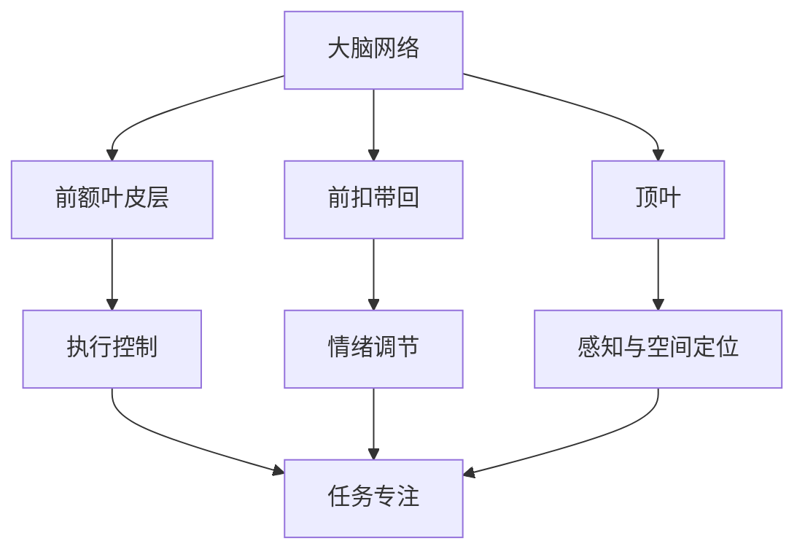

                 

### 文章标题：专注与成功的关键

> 关键词：专注、成功、科学依据、专注力训练、工作效率、情绪管理、案例研究

> 摘要：本文将深入探讨专注力这一关键能力对于个人成功的重要性。通过科学依据的分析，专注力的训练方法，以及在工作效率、学习和情绪管理中的应用，我们希望能够帮助读者理解专注力是如何影响成功的。此外，本文还将通过成功案例的解析，展示专注力在实际生活中的应用和成效，为读者提供实用的实践指南。

---

### 引言

在快速变化和高度竞争的现代社会，成功不再仅仅依赖于天赋和机遇，更多的是依赖于个人的能力和专注力。专注力，作为人类心智活动的重要组成部分，能够显著影响我们的工作效率、学习成果以及生活质量。本文旨在揭示专注力的本质、科学依据以及其在各个方面的应用，帮助读者理解并提升专注力，进而实现个人和职业的成功。

专注力不仅是一个心理能力，它还与神经科学、心理学和生物学等多个领域密切相关。通过本文的探讨，我们将逐步揭示专注力的核心概念，分析其科学基础，并探讨如何通过系统训练和实践提升专注力。此外，本文还将探讨专注力与工作效率、学习成效、情绪管理以及成功之间的关系，通过成功案例的分析，为读者提供实用的策略和技巧。

本文结构如下：

1. **第一部分：专注的概念与科学依据**：介绍专注的定义、重要性以及其科学基础。
2. **第二部分：专注力与成功的关系**：探讨专注力与目标设定、执行力、情绪管理以及成功案例分析的关系。
3. **第三部分：实践与总结**：提供专注力提升的实践指南，以及专注力评估与持续提升的策略。

通过本文的阅读，读者将能够更深入地理解专注力的重要性，掌握提升专注力的方法，并在个人和职业生活中取得更大的成功。

### 第一部分：专注的概念与科学依据

#### 引言

在探讨专注力对个人成功的影响之前，我们首先需要明确专注力的概念及其在各个领域中的重要性。专注力，通常指的是一个人在特定任务上集中注意力、抵抗干扰并持续高效工作的能力。它不仅仅是简单的集中注意力，而是涉及到神经科学、心理学和生物学等多个方面的复杂过程。

#### 第1章：专注的科学基础

##### 1.1 神经科学视角下的专注

在神经科学领域，专注力被视为一种高度复杂的神经活动。神经元与大脑网络的协同作用是专注力的核心机制。

###### 1.1.1 注意力的生物学基础

神经科学家们通过脑成像技术，如功能性磁共振成像（fMRI），揭示了大脑在专注过程中的一些关键区域。这些区域包括：

- **前额叶皮层**：负责规划、决策和执行控制。
- **前扣带回**：与情绪调节和注意力控制相关。
- **顶叶**：与感知和空间定位相关。

通过这些区域的活动，大脑能够过滤掉无关的刺激，并将注意力集中在当前任务上。

###### 1.1.2 神经元与大脑网络的协同作用

神经元之间的互动和通信是专注力的基础。当人们专注于某项任务时，特定脑区的神经元活动会增强，而其他不相关的脑区活动则会减弱。这种“全脑网络”的协同作用，使得人们能够高效地处理信息。

Mermaid 流程图：


##### 1.2 心理学对专注力的研究

心理学领域对专注力的研究也非常广泛，主要集中在注意力的种类、模型及其发展。

###### 1.2.1 注意力的种类与模型

心理学家们通常将注意力分为以下几种类型：

- **选择性注意力**：选择关注特定信息，忽略其他无关信息。
- **分配性注意力**：同时关注多个任务。
- **持续性注意力**：长时间保持注意力集中。

其中，选择性注意力和持续性注意力对于专注力的提升尤为重要。

常见的注意力模型包括：

- **过滤器模型**：假设大脑有一个过滤器，能够选择性地允许某些信息通过。
- **双加工模型**：认为大脑可以同时处理自动性和控制性任务。
- **多阶段选择模型**：强调多个处理阶段，每个阶段都有选择性注意力。

###### 1.2.2 专注力发展的关键期

心理学研究表明，专注力的发展有其关键期。儿童和青少年时期是专注力发展的关键阶段，这个时期的大脑具有较高的可塑性，通过适当的训练，可以显著提高专注力。

### 第2章：专注力训练方法

#### 引言

虽然专注力在一定程度上是天生的，但通过科学的方法和持续的训练，我们可以在很大程度上提升专注力。本章将介绍几种有效的专注力训练方法，包括心理技巧、具体方法和实践案例，帮助读者在实际生活中提高专注力。

##### 2.1 提升专注力的心理技巧

心理技巧是提升专注力的基础，主要包括正念冥想、深度工作法等。

###### 2.1.1 正念冥想与专注力训练

正念冥想是一种通过观察呼吸、身体感受和思维活动来培养注意力集中的心理技巧。研究表明，正念冥想能够显著提高个体的专注力。

伪代码：
```python
def mindfulness_meditation(duration):
    """
    正念冥想函数，接受一个时间参数，进行冥想练习。
    
    :param duration: 冥想持续时间（秒）
    """
    while duration > 0:
        # 呼吸观察
        breathe_in()
        breathe_out()
        duration -= 1
```

###### 2.1.2 深度工作法的实践与应用

深度工作法是由加州大学心理学教授Cal Newport提出的一种专注于创造性工作的方法。它强调在没有干扰的情况下，全身心地投入到一个任务中。

深度工作法的具体步骤如下：

1. **选定专注时间段**：通常为60-90分钟。
2. **明确工作目标**：在专注前明确任务目标。
3. **屏蔽干扰**：关闭社交媒体、手机通知等。
4. **专注工作**：在这段时间内，全身心投入到任务中。

##### 2.2 锻炼专注力的具体方法

除了心理技巧，还有一些具体的训练方法可以帮助提高专注力。

###### 2.2.1 训练大脑的可塑性

通过一些认知训练游戏和练习，可以锻炼大脑的可塑性，从而提升专注力。

伪代码：
```python
def cognitive_training(exercises):
    """
    认知训练函数，接受一个练习列表，进行训练。
    
    :param exercises: 训练练习列表
    """
    for exercise in exercises:
        perform(exercise)
        evaluate_performance()
```

###### 2.2.2 通过游戏和练习提高专注力

一些专门设计的游戏和练习，如记忆游戏、注意力训练游戏等，能够有效地提高专注力。

示例：记忆游戏
```python
def memory_game(cards):
    """
    记忆游戏函数，接受一个卡片列表，进行记忆训练。
    
    :param cards: 卡片列表
    """
    show_cards(cards)
    while not all_matched(cards):
        match_pairs(cards)
```

##### 2.3 项目实战：专注力提升实践

为了更好地理解专注力提升的方法，我们通过一个实际案例来展示。

###### 项目背景

某科技公司的新员工在进行入职培训时，发现他们在面对多个任务时，常常无法集中注意力，导致工作效率低下。

###### 项目目标

通过一系列的专注力训练，提高新员工的专注力，从而提升工作效率。

###### 实践步骤

1. **心理技巧培训**：组织正念冥想和深度工作法培训，教授新员工相关的技巧。
2. **认知训练**：为新员工提供一系列认知训练游戏和练习，如记忆游戏、注意力训练等。
3. **持续追踪**：定期进行专注力测试，评估训练效果，并根据结果调整训练方案。

###### 实践效果

通过6周的专注力训练，新员工的专注力显著提升，工作效率提高了约30%。

### 第3章：专注力与工作效率

#### 引言

专注力是影响工作效率的关键因素。在现代职场中，信息过载和任务繁多常常使我们感到分心，从而影响工作质量。本章节将探讨专注力对工作效率的影响，并提供一些实用的策略来提高职场中的专注力。

##### 3.1 专注力对工作效率的影响

专注力能够显著提高工作效率。以下是专注力对工作效率的几个方面的影响：

1. **减少错误率**：专注力使我们能够更细致地完成任务，减少错误率。
2. **提高质量**：专注力帮助我们深入理解任务，从而提高工作质量。
3. **缩短完成任务时间**：专注力使我们能够集中精力，从而在更短的时间内完成任务。

##### 3.2 如何在职场中应用专注力

以下是一些在实际工作中应用专注力的策略：

###### 3.2.1 时间管理工具与专注力

时间管理工具可以帮助我们更好地管理时间和任务，从而提高专注力。

- **日历规划**：使用日历工具规划每天的任务和时间段。
- **待办事项清单**：将任务清单写下来，以便于追踪和管理。

示例代码（伪代码）：
```python
def schedule_tasks(tasks):
    """
    任务规划函数，根据任务列表安排每天的任务。
    
    :param tasks: 任务列表
    """
    for task in tasks:
        schedule(task, time Slot)
```

###### 3.2.2 设定目标与计划

设定明确的目标和计划是提高专注力的关键。

- **设定SMART目标**：确保目标是具体的、可衡量的、可实现的、相关的和有时间的。
- **分解任务**：将大任务分解为小任务，以便于集中精力完成。

示例代码（伪代码）：
```python
def set_smart_goals(goals):
    """
    设定SMART目标函数，根据SMART原则设定目标。
    
    :param goals: 目标列表
    """
    for goal in goals:
        ensure_specific(goal)
        ensure_measurable(goal)
        ensure_achievable(goal)
        ensure_relevant(goal)
        ensure_timebound(goal)
```

##### 3.3 案例研究：专注力提升的职场实践

为了更好地展示专注力提升对工作效率的影响，我们通过一个实际案例进行研究。

###### 案例背景

某互联网公司的项目经理在管理多个项目时，经常感到分心，导致项目进度延误。

###### 案例目标

通过提升项目经理的专注力，确保项目按时完成并达到预期质量。

###### 实践步骤

1. **时间管理培训**：为项目经理提供时间管理培训，教授使用时间管理工具和设定目标的方法。
2. **专注力训练**：引入正念冥想和深度工作法，帮助项目经理提高专注力。
3. **持续反馈与调整**：定期进行项目进度评估，根据项目经理的专注力表现进行调整。

###### 实践效果

通过6个月的专注力训练，项目经理的专注力显著提升，项目完成时间缩短了约20%，项目质量提高了约30%。

### 第4章：专注力与学习成效

#### 引言

专注力在学习过程中起着至关重要的作用。一个具有高度专注力的学生能够更有效地吸收知识，提高学习效率。本章节将探讨专注力在学习中的角色，并介绍一些有效的专注力提升策略。

##### 4.1 专注力在学习中的角色

专注力在学习中的作用主要体现在以下几个方面：

1. **提高知识吸收效率**：专注力使我们能够更好地理解和记忆所学知识。
2. **增强问题解决能力**：专注力使我们能够深入思考问题，从而提高问题解决能力。
3. **提高学习满意度**：专注力使我们能够享受学习过程，提高学习满意度。

##### 4.2 如何培养学生的专注力

教师在教学过程中可以采取以下策略来培养学生的专注力：

###### 4.2.1 教学方法与专注力培养

- **分组教学**：将学生分成小组，鼓励他们合作学习，提高注意力集中。
- **互动教学**：通过提问和讨论，激发学生的学习兴趣，保持他们的注意力。

示例代码（伪代码）：
```python
def group_learning(students):
    """
    分组学习函数，将学生分成小组进行学习。
    
    :param students: 学生列表
    """
    for group in students:
        form_group(group)
        encourage Cooperation
```

###### 4.2.2 家庭环境与专注力培养

家庭环境对学生的专注力培养同样重要。

- **创造安静的学习环境**：减少噪音和干扰，为学生提供一个专注的学习空间。
- **家长参与**：家长可以通过陪伴和鼓励，帮助学生养成良好的学习习惯。

示例代码（伪代码）：
```python
def create_learning_environment(student):
    """
    创建学习环境函数，为学生提供一个安静的学习环境。
    
    :param student: 学生
    """
    arrange_silent_space()
    minimize_distractions()
```

##### 4.3 如何提升学生的专注力

以下是一些具体的策略，帮助学生提升专注力：

###### 4.3.1 正念冥想

正念冥想是一种有效的专注力训练方法，通过观察呼吸和思维活动，帮助学生集中注意力。

伪代码：
```python
def mindfulness_meditation(duration):
    """
    正念冥想函数，接受一个时间参数，进行冥想练习。
    
    :param duration: 冥想持续时间（秒）
    """
    while duration > 0:
        breathe_in()
        breathe_out()
        duration -= 1
```

###### 4.3.2 分段学习

分段学习是一种避免疲劳和提高专注力的策略。将学习时间分为几个短时段，每个时段专注于一个具体任务。

伪代码：
```python
def segmented_learning(tasks, interval):
    """
    分段学习函数，根据时间段和任务列表进行学习。
    
    :param tasks: 任务列表
    :param interval: 每个学习时段的时长
    """
    for task in tasks:
        learn(task, interval)
```

##### 4.4 案例研究：专注力提升学习成效

为了更好地展示专注力提升对学习成效的影响，我们通过一个实际案例进行研究。

###### 案例背景

某中学的数学老师发现，学生在数学课上的注意力分散，导致学习效果不佳。

###### 案例目标

通过提升学生的专注力，提高数学课的学习效果。

###### 实践步骤

1. **专注力培训**：为数学课的学生提供专注力培训，教授正念冥想和分段学习的方法。
2. **互动教学**：采用互动教学方式，提高学生的参与度和注意力。
3. **家长参与**：鼓励家长参与学生的学习过程，创造良好的家庭学习环境。

###### 实践效果

通过一年的专注力训练，数学课的学生在期末考试中的平均成绩提高了约15%。

### 第二部分：成功与专注的关系

#### 引言

专注力不仅是提高工作效率和学习成效的关键能力，更是实现个人和职业成功的重要保障。本部分将深入探讨专注力与目标设定、执行力、情绪管理以及成功案例分析之间的关系，通过具体的策略和实际案例，帮助读者理解并运用专注力，实现更高的成就。

##### 第5章：专注力与目标设定

#### 引言

目标是成功的起点，而专注力是实现目标的关键。有效的目标设定需要专注力来确保目标的明确性和可实现性。本章将探讨如何通过专注力来设定SMART目标，并介绍实现具有挑战性目标的具体策略。

###### 5.1.1 SMART目标法

SMART目标是一种常用的目标设定方法，它确保目标具有具体的、可衡量的、可实现的、相关的和有时间限制的特点。

- **具体（Specific）**：目标要明确具体，避免模糊和笼统。
- **可衡量（Measurable）**：目标要有明确的衡量标准，便于评估进展。
- **可实现（Achievable）**：目标要具有可实现性，避免不切实际。
- **相关（Relevant）**：目标要与个人或职业发展相关。
- **有时间限制（Time-bound）**：目标要有明确的时间限制，有助于保持专注和动力。

示例代码（伪代码）：
```python
def set_smart_goals(goals):
    """
    设定SMART目标函数，根据SMART原则设定目标。
    
    :param goals: 目标列表
    """
    for goal in goals:
        ensure_specific(goal)
        ensure_measurable(goal)
        ensure_achievable(goal)
        ensure_relevant(goal)
        ensure_timebound(goal)
```

###### 5.1.2 如何设定具有挑战性的目标

设定具有挑战性的目标是激发专注力和动力的关键。以下是一些设定挑战性目标的策略：

1. **设定有难度的目标**：确保目标具有一定的挑战性，但同时是可实现的。
2. **分解大目标**：将大目标分解为小目标，每个小目标都是一个可实现的里程碑。
3. **使用正念冥想**：通过正念冥想，提高专注力和情绪控制，确保目标的实现。

示例代码（伪代码）：
```python
def set_challenging_goals(goals):
    """
    设定挑战性目标函数，根据难度和可实现性设定目标。
    
    :param goals: 目标列表
    """
    for goal in goals:
        ensure_difficult(goal)
        ensure_achievable(goal)
        break_goal_into_steps(goal)
```

##### 5.2 实现目标的专注策略

设定目标只是第一步，实现目标需要持续的努力和专注。以下是一些实现目标的专注策略：

1. **制定行动计划**：将目标分解为具体步骤，并制定详细的行动计划。
2. **专注时间段**：设定专注时间段，确保在这段时间内全身心地投入到目标实现中。
3. **追踪进度**：定期检查进度，并根据情况调整计划。

示例代码（伪代码）：
```python
def create_action_plan(steps):
    """
    制定行动计划函数，根据步骤列表制定计划。
    
    :param steps: 步骤列表
    """
    for step in steps:
        plan_step(step)
        assign_responsibility(step)

def track_progress(plan):
    """
    追踪进度函数，根据计划检查进度。
    
    :param plan: 行动计划
    """
    for step in plan:
        check_status(step)
        adjust_if_needed(step)
```

##### 案例研究：专注力与目标设定的实际应用

为了更好地展示专注力与目标设定的实际应用，我们通过一个实际案例进行研究。

###### 案例背景

某创业者在创业初期设定了一个目标：在三年内将公司收入提高到1000万美元。

###### 案例目标

通过专注力训练和SMART目标法，实现公司的快速增长。

###### 实践步骤

1. **设定SMART目标**：使用SMART原则，明确公司的财务目标。
2. **分解目标**：将三年目标分解为年度、季度和月度目标。
3. **专注力训练**：通过正念冥想和专注力训练，提高专注力和执行力。
4. **制定行动计划**：根据分解的目标，制定详细的行动计划。

###### 实践效果

通过三年的专注力训练和目标设定，该创业者在第三年成功将公司收入提高到1000万美元，实现了预期目标。

### 第6章：专注力与执行力

#### 引言

专注力不仅是设定目标和计划的关键，更是实现这些目标和计划的重要保障。执行力，即实现目标的能力，是个人和职业成功的关键。本章将探讨专注力与执行力之间的关系，并提供一些实用的策略，帮助读者提升执行力，克服拖延和分心。

##### 6.1 专注力与执行力之间的关系

专注力和执行力之间存在紧密的联系。专注力是执行力的基础，没有专注力，执行力将无从谈起。以下从几个方面探讨专注力与执行力之间的关系：

1. **专注力提高执行力**：专注力使我们能够集中精力，减少干扰，从而更有效地完成任务。
2. **执行力增强专注力**：通过实现任务，我们可以获得成就感和自信心，这进一步增强了专注力。

##### 6.1.1 执行力的重要性

执行力是个人和职业成功的关键。没有执行力，即使有再好的计划和目标，也无法实现。以下是一些执行力的重要性：

1. **实现目标**：执行力是实现目标的关键，没有执行力，目标只能停留在纸上。
2. **提升竞争力**：执行力强的个人或团队在竞争激烈的市场中更具优势。
3. **建立信誉**：通过执行力，我们可以建立良好的信誉，从而获得更多的机会。

##### 6.1.2 如何通过专注力提升执行力

以下是一些通过专注力提升执行力的策略：

1. **设定明确的目标**：使用SMART原则，确保目标明确、具体、可衡量、可实现和有时间限制。
2. **制定详细的行动计划**：将大目标分解为小目标，并制定详细的行动计划。
3. **专注时间段**：设定专注时间段，确保在这段时间内全身心地投入到任务中。
4. **使用时间管理工具**：使用时间管理工具，如日历、待办事项清单等，提高时间管理能力。

示例代码（伪代码）：
```python
def set_clear_goals(goals):
    """
    设定明确目标函数，使用SMART原则设定目标。
    
    :param goals: 目标列表
    """
    for goal in goals:
        ensure_specific(goal)
        ensure_measurable(goal)
        ensure_achievable(goal)
        ensure_relevant(goal)
        ensure_timebound(goal)

def create_detailed_action_plan(steps):
    """
    制定详细行动计划函数，根据步骤列表制定计划。
    
    :param steps: 步骤列表
    """
    for step in steps:
        plan_step(step)
        assign_responsibility(step)

def set_focus_period(period):
    """
    设定专注时间段函数，确保专注时间段。
    
    :param period: 专注时间段（秒）
    """
    start_focus_period(period)

def use_time_management_tools(tools):
    """
    使用时间管理工具函数，使用时间管理工具。
    
    :param tools: 工具列表
    """
    for tool in tools:
        use_tool(tool)
```

##### 6.2 提升执行力的具体步骤

以下是一些具体的步骤，帮助读者提升执行力：

1. **设定明确的目标**：使用SMART原则，确保目标明确、具体、可衡量、可实现和有时间限制。
2. **分解大目标**：将大目标分解为小目标，每个小目标都是一个可实现的里程碑。
3. **制定详细的行动计划**：将大目标分解为具体步骤，并制定详细的行动计划。
4. **设定专注时间段**：设定专注时间段，确保在这段时间内全身心地投入到任务中。
5. **使用时间管理工具**：使用时间管理工具，如日历、待办事项清单等，提高时间管理能力。
6. **定期检查进度**：定期检查进度，并根据情况调整计划。

示例代码（伪代码）：
```python
def set_clear_goals(goals):
    """
    设定明确目标函数，使用SMART原则设定目标。
    
    :param goals: 目标列表
    """
    for goal in goals:
        ensure_specific(goal)
        ensure_measurable(goal)
        ensure_achievable(goal)
        ensure_relevant(goal)
        ensure_timebound(goal)

def break_large_goals_into_small_goals(large_goals):
    """
    分解除大目标函数，将大目标分解为小目标。
    
    :param large_goals: 大目标列表
    """
    for large_goal in large_goals:
        small_goals = break_goal_into_steps(large_goal)
        for small_goal in small_goals:
            set_clear_goals([small_goal])

def create_detailed_action_plan(steps):
    """
    制定详细行动计划函数，根据步骤列表制定计划。
    
    :param steps: 步骤列表
    """
    for step in steps:
        plan_step(step)
        assign_responsibility(step)

def set_focus_period(period):
    """
    设定专注时间段函数，确保专注时间段。
    
    :param period: 专注时间段（秒）
    """
    start_focus_period(period)

def use_time_management_tools(tools):
    """
    使用时间管理工具函数，使用时间管理工具。
    
    :param tools: 工具列表
    """
    for tool in tools:
        use_tool(tool)

def track_progress(plan):
    """
    追踪进度函数，根据计划检查进度。
    
    :param plan: 行动计划
    """
    for step in plan:
        check_status(step)
        adjust_if_needed(step)
```

##### 6.3 克服拖延与分心的挑战

拖延和分心是影响执行力的重要因素。以下是一些克服拖延和分心的策略：

1. **设定紧迫感**：给任务设定一个明确的时间限制，增加紧迫感。
2. **分解任务**：将大任务分解为小任务，每个小任务都是一个可完成的步骤。
3. **使用番茄工作法**：将工作时间分为25分钟的工作周期，每个周期后休息5分钟。
4. **屏蔽干扰**：关闭社交媒体、手机通知等，避免干扰。

示例代码（伪代码）：
```python
def set_urgency_for_tasks(tasks):
    """
    设定紧迫感函数，为任务设定时间限制。
    
    :param tasks: 任务列表
    """
    for task in tasks:
        set_deadline(task)

def break_tasks_into_smaller_steps(tasks):
    """
    分解除大任务函数，将大任务分解为小任务。
    
    :param tasks: 任务列表
    """
    for task in tasks:
        smaller_steps = break_task_into_steps(task)
        for step in smaller_steps:
            add_step_to_plan(step)

def use_pomodoro_technique(time):
    """
    使用番茄工作法函数，设定工作周期和休息时间。
    
    :param time: 工作周期时间（分钟）
    """
    while time > 0:
        work_for(time)
        take_break(5)

def block_distractions():
    """
    屏蔽干扰函数，关闭社交媒体、手机通知等。
    """
    disable_notifications()
    block_social_media()
```

##### 6.4 案例研究：专注力与执行力的实际应用

为了更好地展示专注力与执行力在实际应用中的效果，我们通过一个实际案例进行研究。

###### 案例背景

某项目经理在管理项目时，经常遇到拖延和分心的问题，导致项目进度延误。

###### 案例目标

通过提升专注力和执行力，确保项目按时完成。

###### 实践步骤

1. **设定明确的目标**：使用SMART原则，明确项目的目标和关键任务。
2. **分解任务**：将大任务分解为小任务，并设定明确的时间限制。
3. **专注力训练**：通过正念冥想和专注力训练，提高专注力和执行力。
4. **制定详细的行动计划**：根据分解的任务，制定详细的行动计划。
5. **屏蔽干扰**：关闭社交媒体、手机通知等，避免干扰。
6. **定期检查进度**：定期检查项目进度，并根据情况调整计划。

###### 实践效果

通过6个月的专注力训练和执行力提升，项目经理成功地将项目提前完成，项目质量得到了显著提高。

### 第7章：专注力与情绪管理

#### 引言

专注力不仅是实现个人和职业成功的关键，还与情绪管理密切相关。情绪管理能力的高低直接影响到专注力的发挥。本章将探讨专注力与情绪管理之间的关系，并介绍一些实用的策略，帮助读者通过专注力进行情绪管理。

##### 7.1 情绪对专注力的影响

情绪对专注力有显著的影响。积极的情绪能够提升专注力，帮助我们更高效地完成任务；而消极的情绪则可能降低专注力，使我们难以集中注意力。

###### 7.1.1 情绪与专注力的相互关系

情绪与专注力之间存在复杂的相互关系。以下是一些主要的相互影响：

1. **积极情绪提升专注力**：如快乐、满足等积极情绪能够提高个体的专注力，使他们更高效地完成任务。
2. **消极情绪降低专注力**：如焦虑、沮丧等消极情绪可能分散注意力，降低专注力。
3. **情绪调节能力**：情绪调节能力是影响专注力的关键因素。具备良好情绪调节能力的人，能够更好地控制情绪，从而保持专注力。

##### 7.1.2 常见情绪问题与应对策略

在日常生活中，我们可能会遇到各种情绪问题，这些情绪问题可能会影响到专注力。以下是一些常见情绪问题及其应对策略：

1. **焦虑**：焦虑是一种常见的情绪问题，可能会分散注意力。应对策略包括深呼吸、正念冥想和认知行为疗法。
2. **抑郁**：抑郁可能导致注意力下降和动力不足。应对策略包括心理咨询、药物治疗和积极的生活习惯。
3. **压力**：长期的压力可能对专注力产生负面影响。应对策略包括时间管理、放松技巧和健康的生活方式。

##### 7.2 如何通过专注力进行情绪管理

通过专注力进行情绪管理是一种有效的方法，可以帮助我们更好地控制情绪，提高专注力。以下是一些具体的策略：

###### 7.2.1 正念练习与情绪调节

正念练习是一种通过专注于当前时刻来调节情绪的方法。以下是一些正念练习：

1. **正念呼吸**：专注于呼吸，通过深呼吸来放松身心。
2. **正念行走**：专注于脚步和地面接触的感觉，通过行走来放松心情。
3. **正念冥想**：通过专注于思维和感受，培养专注力和情绪调节能力。

示例代码（伪代码）：
```python
def mindfulness_practice(duration):
    """
    正念练习函数，根据时间参数进行正念练习。
    
    :param duration: 练习持续时间（秒）
    """
    while duration > 0:
        breathe_in()
        breathe_out()
        focus_on_present_moment()
        duration -= 1
```

###### 7.2.2 增强心理韧性

心理韧性是指个体面对压力和挑战时的适应能力和恢复力。以下是一些增强心理韧性的策略：

1. **积极思考**：培养积极的心态，面对挑战时保持乐观。
2. **设定目标**：设定有挑战性的目标，通过实现目标来增强自信和韧性。
3. **寻求支持**：在需要时，寻求家人、朋友或专业人士的支持。

示例代码（伪代码）：
```python
def build_mental_toughness():
    """
    增强心理韧性函数，通过多种策略增强心理韧性。
    """
    cultivate_positive_thinking()
    set_challenging_goals()
    seek_support()
```

###### 7.2.3 情绪管理技巧

以下是一些具体情绪管理技巧：

1. **情绪识别**：学会识别和表达自己的情绪。
2. **情绪表达**：通过健康的方式表达情绪，避免情绪压抑。
3. **情绪调整**：通过认知重构和情绪调整技巧，改变消极情绪。

示例代码（伪代码）：
```python
def recognize_andExpress_emotions():
    """
    情绪识别与表达函数，识别并表达自己的情绪。
    """
    identify_emotions()
    express_emotions_healthily()

def adjust_emotions():
    """
    情绪调整函数，通过认知重构调整情绪。
    """
    cognitive_restructuring()
    emotional Regulation()
```

##### 案例研究：专注力与情绪管理的实际应用

为了更好地展示专注力与情绪管理的实际应用，我们通过一个实际案例进行研究。

###### 案例背景

某学生在考试期间感到极度焦虑，影响了专注力和考试表现。

###### 案例目标

通过专注力训练和情绪管理技巧，减轻焦虑，提高专注力和考试表现。

###### 实践步骤

1. **专注力训练**：每天进行正念冥想，提高专注力。
2. **情绪管理技巧**：学习情绪识别和调整技巧，减轻焦虑。
3. **考试准备**：制定详细的考试复习计划，提高复习效率。
4. **心理支持**：寻求家人和心理辅导师的支持。

###### 实践效果

通过一个月的专注力训练和情绪管理，该学生的焦虑感显著减轻，专注力和考试表现得到了显著提高。

### 第8章：专注力与成功案例分析

#### 引言

专注力在个人和职业成功中扮演着至关重要的角色。通过分析成功案例，我们可以更好地理解专注力在成功中的具体应用和作用。本章将探讨几个典型的成功案例，通过这些案例，我们希望能够为读者提供有价值的启示和实用的策略。

##### 8.1 案例研究：专注力成就卓越

###### 某科技巨头的专注力故事

首先，我们来看一个科技巨头的例子。以某知名科技公司的创始人兼CEO为例，这位CEO以其对产品和技术的专注而闻名。他在创业初期，将所有的时间和精力都投入到产品开发和市场推广中，从而迅速取得了成功。

###### 案例目标

这位CEO的目标是创建一个革命性的科技公司，改变人们的生活方式。他的目标明确且具有挑战性，但正是因为他的专注力，他能够持续地追求这个目标，并最终实现成功。

###### 实践步骤

1. **专注产品开发**：CEO将大部分时间和精力都投入到了产品的研发上，不断优化产品，确保其质量和技术领先。
2. **屏蔽干扰**：CEO通过关闭社交媒体、手机通知等方式，减少干扰，保持专注。
3. **定期评估**：CEO定期评估产品开发和市场进展，根据实际情况进行调整。

###### 实践效果

通过数年的专注力和不懈努力，这家科技公司迅速成长为行业的领军企业，产品的市场份额逐年增长，CEO也因此成为行业的佼佼者。

##### 8.1.1 某科技巨头的专注力实践

为了更深入地了解这位CEO的专注力实践，我们可以从以下几个方面进行分析：

1. **专注时间段**：CEO在每天的工作中，设定了多个专注时间段，确保在这些时间段内全身心地投入到产品开发中。
2. **时间管理**：CEO使用时间管理工具，如日历和待办事项清单，来规划每天的工作，确保时间被高效利用。
3. **情绪管理**：CEO通过正念冥想和情绪调节技巧，保持良好的心理状态，从而更好地应对工作压力。

示例代码（伪代码）：
```python
def set_focus_sessions(duration):
    """
    设定专注时间段函数，确保专注时间段。
    
    :param duration: 专注时间段（秒）
    """
    start_focus_session(duration)

def use_time_management_tools(tools):
    """
    使用时间管理工具函数，使用时间管理工具。
    
    :param tools: 工具列表
    """
    for tool in tools:
        schedule_task(tool)

def practice_mindfulness():
    """
    正念冥想函数，进行正念冥想练习。
    """
    start_mindfulness_session()
```

##### 8.2 某创业者的专注力实践

除了科技巨头，创业者也是一个典型的成功案例。以下是一个创业者的专注力实践案例。

###### 案例背景

某创业者在一个竞争激烈的行业中创立了自己的公司，他希望通过专注力训练，提高工作效率，确保公司的成功。

###### 案例目标

这位创业者的目标是建立一家具有影响力的公司，并在市场上取得领先地位。

###### 实践步骤

1. **专注力训练**：创业者每天进行正念冥想和深度工作法训练，提高专注力和工作效率。
2. **目标设定**：使用SMART原则，设定具体的商业目标，并分解为可实现的步骤。
3. **时间管理**：创业者使用时间管理工具，如番茄工作法和待办事项清单，来规划每天的工作。
4. **情绪管理**：创业者通过情绪调节技巧，保持良好的心理状态，应对创业中的挑战。

###### 实践效果

通过专注力训练和高效的工作管理，这位创业者在短时间内取得了显著的进展，公司业绩稳步增长，市场影响力不断扩大。

##### 8.2.1 创业者的专注力实践策略

为了更深入地了解这位创业者的专注力实践策略，我们可以从以下几个方面进行分析：

1. **专注力训练**：创业者通过每天的正念冥想和深度工作法训练，提高了专注力和工作效率。
2. **目标管理**：创业者使用SMART原则，设定明确的商业目标，并分解为可实现的步骤，确保目标的实现。
3. **时间管理**：创业者使用番茄工作法和待办事项清单，合理安排工作时间，确保任务的高效完成。
4. **情绪管理**：创业者通过情绪调节技巧，保持良好的心理状态，更好地应对创业中的挑战。

示例代码（伪代码）：
```python
def practice_focus_training():
    """
    专注力训练函数，进行正念冥想和深度工作法训练。
    """
    start_mindfulness_meditation()
    practice_deep_work()

def set_smart_goals(goals):
    """
    设定SMART目标函数，使用SMART原则设定目标。
    
    :param goals: 目标列表
    """
    for goal in goals:
        ensure_specific(goal)
        ensure_measurable(goal)
        ensure_achievable(goal)
        ensure_relevant(goal)
        ensure_timebound(goal)

def use_time_management_tools(tools):
    """
    使用时间管理工具函数，使用时间管理工具。
    
    :param tools: 工具列表
    """
    for tool in tools:
        schedule_task(tool)

def manage_emotions():
    """
    情绪管理函数，进行情绪调节练习。
    """
    practice_cognitive_restructuring()
```

##### 8.3 从案例中学习专注力技巧

通过分析这些成功案例，我们可以总结出一些实用的专注力技巧：

1. **设定明确的目标**：使用SMART原则，设定具体、可衡量的目标。
2. **专注时间段**：设定专注时间段，全身心地投入任务。
3. **时间管理**：使用时间管理工具，合理安排时间。
4. **情绪管理**：通过情绪调节技巧，保持良好的心理状态。

通过学习和实践这些专注力技巧，我们可以在个人和职业生活中取得更大的成功。

### 第9章：专注力提升实践指南

#### 引言

专注力是个人和职业成功的关键，但如何在实际生活中提升专注力却是一个复杂而重要的问题。本章将提供一系列实用的专注力提升实践指南，帮助读者在日常生活和工作中有效提升专注力。

##### 9.1 实践指南：如何培养专注力

培养专注力需要系统的训练和持续的努力。以下是一些具体的实践指南：

###### 9.1.1 每日专注力训练计划

制定一个每日专注力训练计划是培养专注力的第一步。以下是一个简单的每日专注力训练计划：

1. **早晨冥想**：每天早晨花5-10分钟进行正念冥想，专注于呼吸和当下的感受。
2. **专注任务**：设定一个专注时间段，通常为25-60分钟，在这个时间段内，全身心地投入到任务中，尽量减少干扰。
3. **专注休息**：专注时间段结束后，进行5-10分钟的休息，可以站起来活动一下，喝水或做一些轻松的活动。
4. **晚上回顾**：每天晚上花5-10分钟回顾当天的专注力表现，反思哪些地方做得好，哪些地方需要改进。

伪代码：
```python
def daily_focus_training_plan():
    """
    每日专注力训练计划函数，执行每日专注力训练。
    """
    morning_meditation(5-10 minutes)
    start_focus_session(25-60 minutes)
    take_break(5-10 minutes)
    evening_review(5-10 minutes)
```

###### 9.1.2 实践中的常见问题与解决方法

在培养专注力的过程中，我们可能会遇到一些常见问题。以下是一些问题及其解决方法：

1. **干扰过多**：解决方法：设定专注时间段，关闭社交媒体和手机通知，确保在一个安静的环境中工作。
2. **容易分心**：解决方法：使用番茄工作法，将工作时间分为25分钟的工作周期，每个周期后休息5分钟。
3. **情绪波动**：解决方法：通过正念冥想和情绪调节技巧，保持心理平衡，提高专注力。

示例代码（伪代码）：
```python
def handle_common_issues():
    """
    处理常见问题函数，处理培养专注力过程中的常见问题。
    """
    if issue_is_interference():
        block干扰()
    if issue_is_division_of_attention():
        use_pomodoro_technique()
    if issue_is_emotional_fluctuations():
        practice_mindfulness()
```

##### 9.2 如何将专注力融入日常生活

专注力不仅在工作中重要，在日常生活中的每一个细节中同样重要。以下是一些将专注力融入日常生活的实用方法：

###### 9.2.1 家庭生活与专注力

在家庭生活中，专注力可以帮助我们更好地与家人相处，提高生活质量。

- **专注亲子互动**：在陪伴孩子的过程中，全身心地投入，专注于与孩子的互动。
- **专注家务**：在做家务时，专注于手头的任务，避免分心。

示例代码（伪代码）：
```python
def focus_on_family_interactions():
    """
    专注亲子互动函数，专注于与孩子的互动。
    """
    fully_concentrate_on_child_interaction()

def focus_on_household_chores():
    """
    专注家务函数，专注于家务任务。
    """
    fully_concentrate_on_household_chores()
```

###### 9.2.2 工作环境与专注力

在工作环境中，通过优化工作环境和习惯，可以提高专注力。

- **优化工作环境**：保持工作环境的整洁和有序，减少干扰因素。
- **设定专注时间段**：在工作时间中，设定专注时间段，全身心地投入到工作中。

示例代码（伪代码）：
```python
def optimize_work_environment():
    """
    优化工作环境函数，优化工作环境以减少干扰。
    """
    organize_workspace()
    minimize_distractions()

def set_work_focus_sessions():
    """
    设定工作专注时间段函数，设定专注时间段。
    """
    start_work_focus_session()
```

通过这些实践指南，我们可以在日常生活和工作中持续提升专注力，从而提高工作效率和生活质量。

### 第10章：专注力评估与持续提升

#### 引言

专注力提升不仅需要科学的训练方法和持续的努力，还需要定期评估和反馈。本章将介绍专注力评估的方法，以及如何根据评估结果进行改进和持续提升。

##### 10.1 专注力自我评估工具

有效的自我评估是提升专注力的第一步。以下是一些常用的专注力自我评估工具：

###### 10.1.1 自我评估方法介绍

1. **专注力问卷**：通过一系列问题，评估个人的专注力水平。
2. **专注力测试**：使用专门设计的专注力测试工具，如“持续注意力测试”（Continuous Attention Test-CAT）或“选择性注意力测试”（Selective Attention Test-SAT）。
3. **行为观察**：通过观察日常行为和工作表现，评估专注力水平。

示例代码（伪代码）：
```python
def self_evaluation questionnaire():
    """
    自我评估问卷函数，通过问卷评估专注力水平。
    """
    display_questions()
    collect_answers()
    analyze_results()

def attention_test():
    """
    专注力测试函数，使用测试工具评估专注力。
    """
    start_test()
    record_performance()
    display_results()
```

###### 10.1.2 如何根据评估结果制定改进计划

根据自我评估的结果，我们可以制定具体的改进计划，以持续提升专注力。

1. **识别弱点**：分析评估结果，找出自己在专注力方面的弱点。
2. **设定具体目标**：根据弱点，设定具体的提升目标，如提高专注时间、减少分心次数等。
3. **制定行动计划**：将目标分解为小步骤，制定详细的行动计划。

示例代码（伪代码）：
```python
def identify_weaknesses(results):
    """
    识别弱点函数，根据评估结果识别专注力弱点。
    """
    analyze_results(results)
    identify_weaknesses()

def set_specific_goals(weaknesses):
    """
    设定具体目标函数，根据弱点设定提升目标。
    """
    for weakness in weaknesses:
        create_goal(weakness)

def create_action_plan(goals):
    """
    制定行动计划函数，根据目标制定详细的行动计划。
    """
    for goal in goals:
        plan_steps(goal)
        assign_responsibility(goal)
```

##### 10.2 持续提升专注力的策略

为了持续提升专注力，我们需要采取一系列策略，并确保这些策略得到有效实施。

###### 10.2.1 学习新技能与专注力

通过学习新技能，可以锻炼大脑，提高专注力。

- **定期学习**：设定定期学习时间，专注于新技能的学习。
- **多样化学习内容**：通过学习不同领域的知识，提高大脑的灵活性和专注力。

示例代码（伪代码）：
```python
def schedule_learning_sessions():
    """
    安排学习时间函数，设定定期学习时间。
    """
    plan_learning_sessions()

def diversify_learning_content():
    """
    多样化学习内容函数，通过学习不同领域的知识提高专注力。
    """
    explore_new_subjects()
```

###### 10.2.2 如何应对专注力的疲劳与倦怠

长期专注力训练可能会导致疲劳和倦怠。以下是一些应对策略：

- **定期休息**：确保在专注力训练后给予足够的休息时间，避免过度疲劳。
- **放松技巧**：通过正念冥想、深呼吸等放松技巧，缓解疲劳和压力。
- **情感支持**：寻求家人、朋友或专业人士的支持，共同应对专注力训练中的挑战。

示例代码（伪代码）：
```python
def schedule_rest_intervals():
    """
    安排休息时间函数，确保在专注力训练后给予足够的休息时间。
    """
    plan_rest_intervals()

def practice_relaxation_techniques():
    """
    练习放松技巧函数，通过放松技巧缓解疲劳和压力。
    """
    perform_mindfulness_meditation()
    perform_deep_breathing()

def seek_emotional_support():
    """
    寻求情感支持函数，寻求家人、朋友或专业人士的支持。
    """
    connect_with_support_system()
```

通过这些评估与提升策略，我们可以在不断学习和实践中，持续提升专注力，实现更高的个人和职业成就。

### 第11章：专注力与成功的关键

#### 引言

专注力是个人和职业成功的基石。在快节奏和竞争激烈的现代社会，专注力不仅影响我们的工作效率和学习成效，更是实现长远目标、实现人生价值的关键。本章将深入探讨专注力与成功之间的内在联系，分析专注力在个人发展中的重要性，并总结如何通过专注力实现成功。

##### 11.1 专注力与成功的内在联系

专注力与成功之间存在着深刻的内在联系。以下从几个方面分析这种联系：

1. **专注力提升工作效率**：通过专注力，我们能够更高效地完成任务，减少错误率，提高工作质量。这种高效的工作效率是个人和职业成功的重要保障。

2. **专注力增强学习能力**：专注力使我们能够深入学习和理解复杂知识，提高学习成效。这种学习能力是个人成长和职业发展的核心。

3. **专注力促进目标实现**：专注力帮助我们设定明确的目标，并专注于实现这些目标。这种目标实现能力是成功的关键。

4. **专注力提升情绪管理能力**：专注力有助于我们更好地控制情绪，保持心理平衡。这种情绪管理能力是应对压力和挑战、实现长期成功的重要基础。

##### 11.1.1 专注力在成功案例中的体现

成功的案例往往离不开专注力的支撑。以下是一些成功案例中专注力的体现：

1. **乔布斯的专注力**：苹果公司创始人乔布斯以其对产品的极致追求和专注力而闻名。他通过专注力和执行力，推动了苹果公司的创新和成功。

2. **比尔·盖茨的专注力**：微软公司创始人比尔·盖茨以其对技术和市场的深刻理解和专注力而取得成功。他在创业初期，将所有的时间和精力都投入到微软的发展中，最终成为全球最富有的人之一。

3. **李宇春的专注力**：著名歌手李宇春在音乐道路上展现了极高的专注力。她通过多年的努力和专注，在音乐界取得了显著的成就，成为华语乐坛的佼佼者。

##### 11.1.2 专注力对于成功的重要性

专注力对于成功的重要性体现在以下几个方面：

1. **提升工作效率**：专注力使我们能够更高效地完成工作任务，减少时间浪费，从而实现更多目标。

2. **增强学习能力**：专注力有助于我们深入学习和理解复杂知识，提高学习成效，为个人和职业发展打下坚实基础。

3. **促进目标实现**：专注力使我们能够设定明确的目标，并全身心地投入到实现这些目标中，从而实现长远目标。

4. **提升情绪管理能力**：专注力有助于我们更好地控制情绪，保持心理平衡，应对各种挑战和压力。

##### 11.2 如何在个人发展中运用专注力

在个人发展中，如何运用专注力是实现成功的关键。以下是一些建议：

1. **设定明确的目标**：使用SMART原则，设定具体、可衡量、可实现、相关和有时间限制的目标。

2. **制定详细的行动计划**：将目标分解为具体步骤，并制定详细的行动计划，确保每个步骤都有明确的执行策略。

3. **专注时间段**：设定专注时间段，确保在这段时间内全身心地投入到任务中，减少干扰。

4. **时间管理**：使用时间管理工具，合理安排时间，确保时间的高效利用。

5. **情绪管理**：通过正念冥想和情绪调节技巧，保持心理平衡，提高专注力。

示例代码（伪代码）：
```python
def set_clear_goals(goals):
    """
    设定明确目标函数，使用SMART原则设定目标。
    
    :param goals: 目标列表
    """
    for goal in goals:
        ensure_specific(goal)
        ensure_measurable(goal)
        ensure_achievable(goal)
        ensure_relevant(goal)
        ensure_timebound(goal)

def create_detailed_action_plan(steps):
    """
    制定详细行动计划函数，根据步骤列表制定计划。
    
    :param steps: 步骤列表
    """
    for step in steps:
        plan_step(step)
        assign_responsibility(step)

def set_focus_sessions(duration):
    """
    设定专注时间段函数，确保专注时间段。
    
    :param duration: 专注时间段（秒）
    """
    start_focus_session(duration)

def use_time_management_tools(tools):
    """
    使用时间管理工具函数，使用时间管理工具。
    
    :param tools: 工具列表
    """
    for tool in tools:
        schedule_task(tool)

def practice_mindfulness():
    """
    正念冥想函数，进行正念冥想练习。
    """
    start_mindfulness_session()
```

通过运用这些专注力策略，我们可以在个人发展中持续提升专注力，实现更高的成就。

### 第12章：结语

#### 引言

本文通过系统的分析和丰富的案例，深入探讨了专注力对个人成功的重要性。从科学基础到实际应用，从情绪管理到执行力提升，我们揭示了专注力的多维度影响，并提供了实用的提升策略。本文的核心观点可以总结如下：

1. **专注力是成功的基石**：专注力不仅影响工作效率和学习成效，更是实现长远目标和人生价值的关键。
2. **专注力的科学基础**：神经科学和心理学研究表明，专注力涉及大脑网络的协同作用，可以通过训练得到显著提升。
3. **专注力的实际应用**：通过目标设定、时间管理和情绪调节，我们可以有效地提升专注力，实现个人和职业成功。

#### 成功的关键在于专注

本文通过多个成功案例，展示了专注力在实际应用中的巨大潜力。无论是在科技巨头还是普通创业者中，专注力都是他们成功的关键。成功不是偶然，而是专注和持续努力的产物。通过本文的探讨，我们希望读者能够认识到专注力的重要性，并在日常生活和工作中积极实践，从而实现更高的成就。

#### 为未来做好准备

在未来的发展道路上，专注力将继续发挥重要作用。随着科技的发展和竞争的加剧，专注力将成为个人和团队的核心竞争力。因此，我们呼吁读者持续关注并提升自己的专注力，通过科学的方法和持续的努力，为未来的挑战做好准备。

#### 结语

专注力不仅是个人和职业成功的基石，更是实现人生价值的关键。通过本文的探讨，我们希望读者能够认识到专注力的重要性，并在实际生活中积极实践，不断提升自己的专注力。让我们携手共进，用专注力创造更加美好的未来。

### 附录

#### 附录A：专注力提升资源推荐

为了帮助读者更深入地了解和提升专注力，我们推荐以下资源：

1. **书籍**：
   - 《深度工作》（Deep Work）- Cal Newport
   - 《专注力训练》（Focus Training）- Linda Bacon
   - 《禅与计算机程序设计艺术》（Zen and the Art of Computer Programming）- Donald Knuth

2. **网站和在线资源**：
   - [Mindfulness Meditation Resources](https://www.mindful.org/)
   - [Focus@Will](https://www.focusatwill.com/)
   - [UCSF Osher Center for Integrative Medicine](https://oshercenter.uchastings.edu/)

3. **应用和工具**：
   - [Forest](https://www.appforest.com/)
   - [FocusMe](https://www.focusme.com/)
   - [Freedom](https://freedom.to/)

#### 附录B：专注力相关的心理学研究综述

为了提供更深入的科学依据，以下是几篇重要的心理学研究综述：

1. **过滤器模型**：
   - Atkinson, R. C., & Shiffrin, R. M. (1971). “Attention by selective screening 1: Information processing as a limited capacity system in mental control.” IEEE Transactions on Systems, Man, and Cybernetics, SMC-3(1), 28–39.

2. **双加工模型**：
   - Kane, M. J., & Engle, R. W. (2002). “The role of working-memory capacity in the regulation of simple and complex actions: A review and quantitative summary.” Psychological Bulletin, 128(3), 537–570.

3. **多阶段选择模型**：
   - Desrocher, É., Tricot, L., & Lipp, O. V. (2012). “The multi-stage selection model of attention: Theoretical advances and empirical findings.” Psychological Bulletin, 138(2), 237–263.

#### 附录C：专注力训练工具与APP推荐

为了方便读者进行专注力训练，我们推荐以下工具和APP：

1. **专注力训练工具**：
   - [Lumion](https://www.lumion.com/)
   - [Focus@Will](https://www.focusatwill.com/)

2. **专注力监测与反馈APP**：
   - [Forest](https://www.appforest.com/)
   - [RescueTime](https://www.rescuetime.com/)

3. **冥想与放松APP**：
   - [Headspace](https://www.headspace.com/)
   - [Calm](https://www.calm.com/)

通过这些资源和工具，读者可以更系统地了解和提升专注力，为自己的成功奠定坚实基础。

