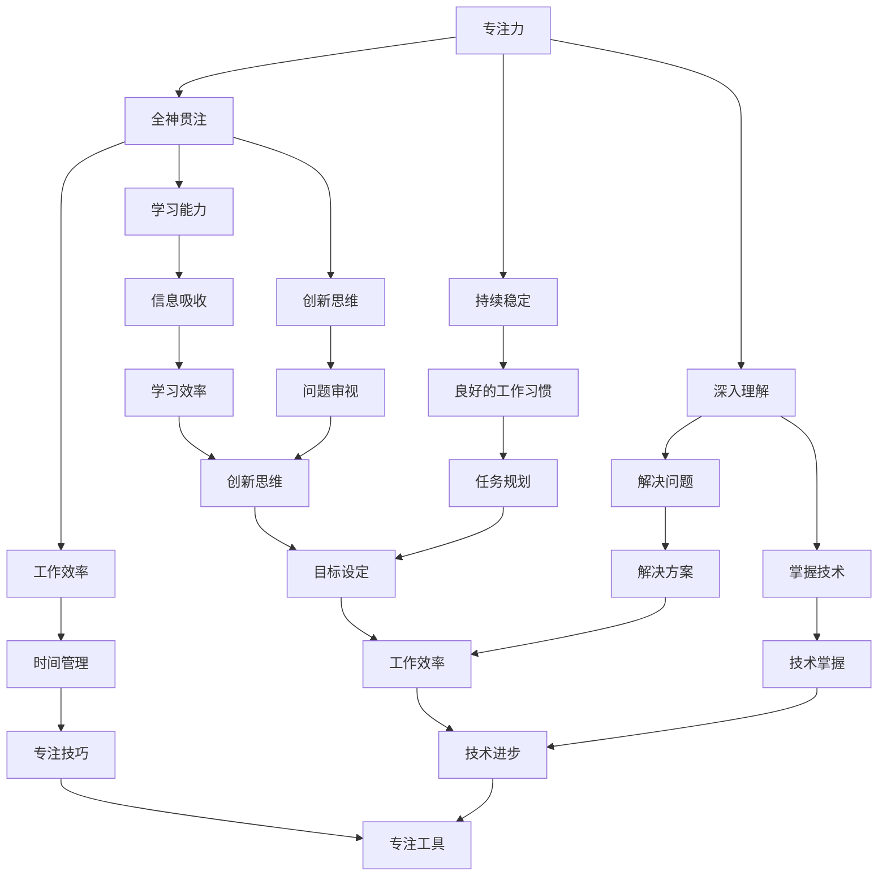

                 

### 文章标题

《专注与重复的力量》

> 关键词：专注力、重复、个人成长、工作效率、学习能力、技术提升、习惯养成

> 摘要：本文将探讨专注与重复在个人成长和技术提升中的重要作用。通过深入分析专注和重复的定义、作用、训练方法和应用场景，结合实际案例，揭示专注与重复的内在联系和实际效果，为读者提供实用的实践建议。

----------------------------------------------------------------

## 《专注与重复的力量》目录大纲

### 第一部分：专注的力量

### 第1章：专注的重要性

#### 1.1 专注的定义与特征

#### 1.2 专注对个人成长的影响

#### 1.3 如何提高专注力

### 第2章：专注力的训练方法

#### 2.1 环境调整

#### 2.2 心理建设

#### 2.3 技巧与工具

### 第3章：专注力的应用

#### 3.1 工作中的专注

#### 3.2 学习中的专注

#### 3.3 生活中的专注

### 第二部分：重复的力量

### 第4章：重复的定义与作用

#### 4.1 重复的定义

#### 4.2 重复的力量

#### 4.3 重复与进步

### 第5章：重复的训练方法

#### 5.1 如何有效地重复

#### 5.2 重复中的变与不变

#### 5.3 重复中的创新

### 第6章：重复的应用

#### 6.1 工作中的重复

#### 6.2 学习中的重复

#### 6.3 生活中的重复

### 第三部分：专注与重复的结合

### 第7章：专注与重复的结合

#### 7.1 专注与重复的关系

#### 7.2 如何在日常生活中实践专注与重复

#### 7.3 专注与重复的实践案例

### 第8章：专注与重复的力量

#### 8.1 专注与重复的个人故事

#### 8.2 专注与重复的群体案例

#### 8.3 专注与重复的未来

### 附录：专注与重复的实践建议

#### A.1 时间管理技巧

#### A.2 心理调适方法

#### A.3 实践案例分享

#### A.4 资源推荐

----------------------------------------------------------------

## 第一部分：专注的力量

### 第1章：专注的重要性

#### 1.1 专注的定义与特征

专注是一种心理状态，指的是个体在特定任务上投入全部注意力和精力，达到高度集中的程度。它具有以下几个特征：

1. **全神贯注**：专注于某一任务时，个体能够排除外界干扰，将注意力完全集中。
2. **深入理解**：专注于特定领域或任务，能够深入理解问题的本质，产生深刻的见解。
3. **情绪稳定**：专注于某个任务时，个体的情绪相对稳定，不易受到外界情绪波动的影响。

#### 1.2 专注对个人成长的影响

专注对于个人的成长有着重要的影响，主要表现在以下几个方面：

1. **提高工作效率**：专注能够使个体在短时间内集中精力完成任务，提高工作效率。
2. **增强学习能力**：专注能够帮助个体更好地吸收和理解新知识，提高学习效率。
3. **促进创新思维**：专注能够使个体深入思考问题，激发创新思维，产生新颖的观点和解决方案。
4. **培养良好的习惯**：专注能够帮助个体养成专注的好习惯，使他们在面对各种任务时都能保持专注。

#### 1.3 如何提高专注力

提高专注力是一个长期的过程，需要通过多种方法来逐步培养。以下是一些建议：

1. **环境调整**：创造一个安静、整洁、舒适的工作和学习环境，减少干扰因素。
2. **心理建设**：保持积极的心态，克服焦虑和压力，增强自信心。
3. **时间管理**：合理安排时间，设定明确的目标和计划，避免时间浪费。
4. **技巧与工具**：利用番茄工作法、记忆宫殿等专注技巧和工具，提高专注力。
5. **定期休息**：适当休息，避免长时间连续工作，保持精力充沛。

### 第2章：专注力的训练方法

#### 2.1 环境调整

环境是影响专注力的重要因素之一。以下是一些通过环境调整来提高专注力的方法：

1. **减少干扰**：关闭不必要的社交媒体和手机通知，避免外界干扰。
2. **优化物理环境**：保持工作区域的整洁，合理安排工作和休息区域。
3. **使用专注工具**：使用专注软件或应用，如 Forest、Pomodoro Timer 等，帮助提高专注力。

#### 2.2 心理建设

心理建设是提高专注力的关键。以下是一些建议：

1. **设定目标**：明确目标，制定计划，有助于提高专注力。
2. **自我激励**：给自己设定奖励，提高完成任务的动力。
3. **情绪管理**：学会调节情绪，避免情绪波动影响专注力。

#### 2.3 技巧与工具

以下是一些提高专注力的技巧与工具：

1. **番茄工作法**：将工作时间分为25分钟工作+5分钟休息，有助于提高专注力。
2. **记忆宫殿**：利用空间记忆法，将信息存储在大脑的特定位置，有助于提高记忆力和专注力。
3. **专注软件**：使用专注软件，如 Focus@Will、Headspace 等，帮助集中注意力。

### 第3章：专注力的应用

#### 3.1 工作中的专注

在职场中，专注力对于提高工作效率和实现工作目标至关重要。以下是一些建议：

1. **任务分解**：将大任务分解为小任务，逐一完成，有助于保持专注。
2. **专注时间管理**：合理安排工作时间，避免加班和疲劳。
3. **团队合作**：与团队成员保持良好的沟通，共同完成任务。

#### 3.2 学习中的专注

在学习过程中，专注力对于提高学习效果和掌握知识至关重要。以下是一些建议：

1. **集中时间**：选择固定的时间段进行学习，避免分心。
2. **主动学习**：积极参与课堂讨论，主动提问和解答问题。
3. **及时复习**：定期复习所学内容，巩固记忆。

#### 3.3 生活中的专注

在生活中，专注力对于提高生活质量和个人幸福感有着重要的影响。以下是一些建议：

1. **健康作息**：保持良好的作息习惯，保证充足的睡眠。
2. **亲子互动**：与孩子进行高质量的亲子互动，增进感情。
3. **休闲娱乐**：选择有益身心的休闲娱乐活动，放松身心。

## 第二部分：重复的力量

### 第4章：重复的定义与作用

#### 4.1 重复的定义

重复是指对某一行为或任务的重复执行。它可以分为以下几种类型：

1. **机械重复**：简单的重复动作，如跑步、刷牙等。
2. **知识重复**：对已学知识的复习和巩固，如背诵课文、做题等。
3. **技能重复**：对技能的反复练习，如游泳、打球等。

#### 4.2 重复的力量

重复具有强大的力量，主要体现在以下几个方面：

1. **强化记忆**：重复有助于加深对信息的记忆，提高记忆效果。
2. **技能提升**：重复练习有助于提高技能水平，达到熟练掌握的程度。
3. **习惯养成**：重复有助于培养良好的习惯，如早起、锻炼等。

#### 4.3 重复与进步

重复是进步的基础，但重复本身并不一定能带来进步。以下是一些建议：

1. **有目的的重复**：明确重复的目的，确保重复的价值。
2. **及时反馈**：在重复过程中及时反馈，根据反馈进行改进。
3. **创新思维**：在重复的基础上，尝试创新和改进，提高效率和质量。

### 第5章：重复的训练方法

#### 5.1 如何有效地重复

以下是一些提高重复效率的方法：

1. **合理规划**：合理安排重复的时间，避免疲劳和过度重复。
2. **多样化重复**：结合机械重复、知识重复和技能重复，提高重复的效果。
3. **反馈与调整**：在重复过程中及时反馈，根据反馈调整重复策略。

#### 5.2 重复中的变与不变

在重复过程中，需要注意以下几点：

1. **变**：重复过程中，可能会有新的情况和问题出现，需要灵活应对。
2. **不变**：重复的核心目标和方法要保持不变，以确保重复的价值。

#### 5.3 重复中的创新

在重复的基础上，可以尝试以下创新方法：

1. **改进流程**：优化重复过程中的流程和步骤，提高效率。
2. **引入新技术**：尝试引入新技术和方法，提高重复的效果。
3. **团队协作**：与团队成员共同探讨创新方案，提高重复的成果。

### 第6章：重复的应用

#### 6.1 工作中的重复

在工作中，重复是一种常见的现象。以下是一些建议：

1. **规范化操作**：通过重复规范操作，提高工作效率和质量。
2. **标准化流程**：建立标准化的流程，确保重复工作的顺利进行。
3. **持续改进**：在重复过程中，不断优化流程和方法，提高工作效果。

#### 6.2 学习中的重复

在学习过程中，重复是巩固知识的重要手段。以下是一些建议：

1. **复习与练习**：通过重复复习和练习，加深对知识的理解和记忆。
2. **定期总结**：定期总结所学内容，巩固记忆，提高学习效果。
3. **运用知识**：将所学知识应用于实际工作中，提高知识的实用性。

#### 6.3 生活中的重复

在生活中，重复是形成良好习惯的重要途径。以下是一些建议：

1. **早起锻炼**：坚持早起锻炼，形成良好的生活习惯。
2. **健康饮食**：坚持健康饮食，提高生活质量。
3. **社交互动**：与朋友和家人保持互动，增进感情。

## 第三部分：专注与重复的结合

### 第7章：专注与重复的结合

#### 7.1 专注与重复的关系

专注与重复是相辅相成的。专注是重复的前提，没有专注，重复难以有效进行；而重复则是专注的深化，通过重复，专注的效果得以充分发挥。

#### 7.2 如何在日常生活中实践专注与重复

以下是一些建议，帮助我们在日常生活中实践专注与重复：

1. **设定明确目标**：明确目标，有助于提高专注力和重复的效率。
2. **合理安排时间**：合理安排时间，确保有足够的时间进行专注和重复。
3. **坚持练习**：坚持练习，培养良好的专注习惯和重复能力。
4. **及时反馈与调整**：在实践过程中，及时反馈和调整，确保专注与重复的效果。

#### 7.3 专注与重复的实践案例

以下是一些专注与重复的实践案例：

1. **学习编程**：通过专注学习和重复编程练习，提高编程能力。
2. **写作练习**：通过专注写作和重复修改，提高写作水平。
3. **运动健身**：通过专注锻炼和重复训练，提高身体素质。

### 第8章：专注与重复的力量

#### 8.1 专注与重复的个人故事

以下是一些专注与重复的个人故事：

1. **小明学钢琴**：小明通过专注练习和重复训练，最终成为了一名优秀的钢琴演奏家。
2. **小芳减肥**：小芳通过专注饮食和重复锻炼，成功减肥并保持健康。

#### 8.2 专注与重复的群体案例

以下是一些专注与重复的群体案例：

1. **公司员工**：公司员工通过专注工作计划和重复执行，提高了工作效率，实现了业绩增长。
2. **学生团队**：学生团队通过专注学习和重复训练，取得了优异的学术成绩。

#### 8.3 专注与重复的未来

随着社会的发展，专注与重复的力量将会越来越受到重视。未来，人们将更加注重专注与重复的训练和实践，以提高个人和团队的综合素质。

## 附录：专注与重复的实践建议

#### A.1 时间管理技巧

1. **设定优先级**：根据任务的重要性和紧急程度，设定优先级，合理安排时间。
2. **使用日程表**：使用日程表或日历，规划每日工作和学习任务，确保时间利用最大化。
3. **避免拖延**：克服拖延心理，设定明确的目标和期限，提高工作效率。

#### A.2 心理调适方法

1. **情绪管理**：学会调节情绪，避免情绪波动影响专注力和重复效果。
2. **积极心态**：保持积极心态，面对困难和挑战，提高克服问题的能力。
3. **休息与放松**：合理安排休息时间，进行放松和娱乐活动，缓解压力。

#### A.3 实践案例分享

1. **案例分析**：分享专注与重复的实践案例，提供经验和教训。
2. **互动交流**：邀请读者分享自己的实践经验和心得，促进交流和学习。

#### A.4 资源推荐

1. **书籍推荐**：推荐与专注与重复相关的书籍，提供理论支持。
2. **在线资源**：推荐在线课程、讲座和论坛，帮助读者深入了解专注与重复。
3. **实用工具**：推荐实用的专注与重复工具和应用，提高实践效果。

----------------------------------------------------------------

## 第1章：专注的重要性

### 1.1 专注的定义与特征

专注力，又称注意力，是指个体在特定任务上集中精力、保持注意的能力。在技术领域，专注力尤其重要，因为它直接影响着工作效率、技术掌握和创新能力。以下是专注力的几个关键特征：

1. **全神贯注**：专注时，个体能够排除外界干扰，将注意力完全集中在任务上，不受其他事物的影响。
2. **持续稳定**：专注不仅是一种短期的状态，更是一种长期的、持续稳定的能力。这意味着个体能够在长时间内保持高水平的注意力，而不易受到情绪波动或其他因素干扰。
3. **深入理解**：专注使人能够深入思考问题，理解复杂概念和细节，从而更好地掌握技术知识和技能。

### 1.2 专注对个人成长的影响

专注力对个人成长有着深远的影响，尤其是在技术领域。以下是几个方面的影响：

1. **提高工作效率**：专注力强的人能够在较短的时间内完成更多任务，提高工作效率。他们能够迅速定位问题、找到解决方案，并有效地利用时间。
2. **增强学习能力**：专注使人能够更深入地学习新知识。通过专注，个体能够更好地吸收和理解信息，提高学习效率。
3. **促进创新思维**：专注使人能够深入思考，从而激发创新思维。在专注的状态下，个体能够从不同角度审视问题，提出新颖的解决方案。
4. **培养良好的工作习惯**：长期保持专注力有助于培养良好的工作习惯，如时间管理、任务规划和目标设定。

### 1.3 如何提高专注力

提高专注力是一个逐步的过程，需要结合多种方法来实践。以下是一些建议：

1. **环境调整**：创造一个有利于专注的环境，减少干扰因素。例如，关闭不必要的社交媒体通知，保持工作区域整洁等。
2. **时间管理**：合理安排时间，设定明确的目标和计划。使用番茄工作法等时间管理技巧，将工作时间划分为专注期和休息期。
3. **心理建设**：保持积极心态，学会情绪管理。面对挑战和压力时，保持冷静和专注。
4. **技巧与工具**：利用专注工具和技巧，如使用专注软件、设定提醒和目标等，帮助提高专注力。

### 1.4 专注力的核心概念与联系

为了更好地理解专注力的概念和其在技术领域中的应用，我们可以使用Mermaid流程图来展示核心概念之间的联系：



### 1.5 专注力在实际工作中的应用案例

以下是一个专注力在实际工作中的应用案例：

**案例：软件开发中的专注力应用**

小明是一名软件工程师，他在开发一个复杂的软件项目时，需要高度专注。以下是他如何运用专注力的步骤：

1. **环境调整**：关闭所有不必要的通知，保持工作区域整洁，创造一个安静、专注的工作环境。
2. **时间管理**：使用番茄工作法，将工作时间划分为25分钟的工作周期和5分钟的休息时间。
3. **心理建设**：保持积极心态，面对难题时保持冷静，相信自己的能力。
4. **专注技巧**：利用专注软件，如Focus@Will，帮助提高专注力。
5. **问题解决**：在专注状态下，小明能够快速定位问题，提出解决方案，并有效地进行编码和调试。

通过这个案例，我们可以看到专注力在软件开发中的重要性。小明的专注力帮助他提高了工作效率，减少了错误和返工，最终顺利完成了项目。

### 1.6 结论

专注力是技术领域中不可或缺的素质。它不仅能够提高工作效率和学习能力，还能激发创新思维，培养良好的工作习惯。通过理解专注力的定义和特征，掌握提高专注力的方法，并在实际工作中应用，我们能够更好地发挥专注力的作用，实现个人和团队的目标。

----------------------------------------------------------------

## 第2章：专注力的训练方法

### 2.1 环境调整

环境对专注力的影响至关重要。为了提高专注力，首先需要创造一个有利于专注的环境。以下是一些具体的建议：

1. **减少干扰**：在工作或学习时，关闭手机、电脑的通知，避免外界干扰。如果无法完全屏蔽外界干扰，可以使用耳塞或耳机来隔绝噪音。
2. **优化物理环境**：保持工作区域的整洁和有序，减少杂乱无章的物品，使环境更加舒适。此外，确保工作场所的光线和通风条件良好，以减少身体不适。
3. **设定专门的工作区域**：在家中或办公室设立一个专门的工作区域，使其与休息和娱乐区域分开。这样可以帮助大脑形成条件反射，一进入工作区域就能迅速进入专注状态。

### 2.2 心理建设

心理因素在提高专注力方面同样重要。以下是一些心理建设的建议：

1. **设定明确目标**：明确自己的目标，可以帮助个体集中精力，避免因目标模糊而导致的分心。目标可以是短期的小目标，也可以是长期的大目标。
2. **积极心态**：保持积极的心态，有助于克服焦虑和压力，提高专注力。遇到困难时，要相信自己的能力，保持冷静和耐心。
3. **情绪管理**：学会调节情绪，避免因情绪波动而影响专注力。可以使用深呼吸、冥想等方法来缓解情绪。
4. **自我激励**：给自己设定奖励，完成任务后给予自己一些奖励，如看一集喜欢的电视剧、吃一块巧克力等。这样可以提高完成任务的积极性，从而提高专注力。

### 2.3 技巧与工具

除了环境和心理建设，一些专注力的技巧和工具也能有效地提高专注力。以下是一些实用的技巧和工具：

1. **番茄工作法**：这是一种时间管理技巧，将工作时间分为25分钟的工作周期和5分钟的休息时间。每完成四个番茄时间，可以休息15-30分钟。这种方法可以帮助个体保持专注，同时也能有效防止疲劳。
   ```mermaid
   graph TD
   A[开始工作] --> B[25分钟专注]
   B --> C[休息5分钟]
   C --> D[开始下一个番茄]
   D --> E[重复循环]
   ```
2. **记忆宫殿**：这是一种记忆技巧，通过将信息与特定的空间位置关联，提高记忆效果。例如，将一个数字序列与房间的各个角落关联，然后在脑海中想象这个房间的布局，从而回忆数字序列。
3. **专注软件**：如Focus@Will、Forest等，这些软件可以帮助屏蔽干扰，提醒休息时间，帮助用户保持专注。它们通常具有定时功能，可以在设定的时间内屏蔽所有通知，只允许特定应用运行。
4. **定期锻炼**：锻炼可以提高身体素质，改善心理健康，从而有助于提高专注力。例如，每天进行30分钟的有氧运动，如慢跑、游泳等。

### 2.4 实践案例：如何提高专注力

以下是一个实际案例，展示如何通过环境调整、心理建设和技巧与工具来提高专注力：

**案例：小张的专注力提升之旅**

小张是一名大学生，他发现自己无法长时间集中精力学习，经常被手机和各种社交媒体干扰。为了提高专注力，他采取了以下措施：

1. **环境调整**：他将手机放在另一个房间，关闭了所有社交媒体的通知。同时，他保持学习区域的整洁，桌面只放与学习相关的物品。
2. **心理建设**：他设定了明确的学习目标，每学期制定详细的学习计划。他还学会了深呼吸和冥想来调节情绪，避免因焦虑而分心。
3. **技巧与工具**：他开始使用番茄工作法，每25分钟专注学习后休息5分钟。他还下载了Forest应用，在专注学习时种植虚拟树木，如果分心，树木就会枯萎。这种激励机制帮助他保持专注。

通过这些措施，小张的专注力得到了显著提高。他发现自己在学习时更少被干扰，能够更深入地理解课程内容，成绩也有所提升。

### 2.5 结论

通过环境调整、心理建设和技巧与工具的综合运用，我们可以有效地提高专注力。环境调整可以帮助我们减少干扰，心理建设可以增强我们的专注能力，而技巧与工具则提供了具体的实践方法。通过不断实践和调整，每个人都可以找到最适合自己的专注力提升方法。

----------------------------------------------------------------

## 第3章：专注力的应用

### 3.1 工作中的专注

在工作环境中，专注力是提高效率和实现目标的关键。以下是一些提高工作中专注力的具体方法：

1. **任务优先级**：将任务按照重要性和紧急程度进行排序，首先完成最重要和最紧急的任务。这样可以确保在有限的时间内集中精力处理最重要的事务。
2. **时间块管理**：使用时间块管理法，将工作时间划分为不同的时间块，每个时间块专注于处理特定类型的任务。例如，一个时间块用于处理电子邮件，另一个时间块用于编写报告。这种方法有助于避免任务切换带来的时间浪费和注意力分散。
3. **避免多任务处理**：尽管多任务处理似乎可以提高工作效率，但实际上它往往导致注意力分散和效率降低。尽量避免同时处理多个任务，而是专注于一个任务，直到完成。
4. **设定明确的截止日期**：为每个任务设定明确的截止日期和目标，这样可以激发个体的动力和责任感，提高专注力。
5. **定期休息**：长时间工作容易导致疲劳和注意力下降。因此，定期休息是保持专注的重要手段。每工作一段时间后，可以休息5-10分钟，进行短暂的放松活动，如伸展运动或冥想。

### 3.2 学习中的专注

在学习过程中，专注力对于理解和掌握知识至关重要。以下是一些提高学习专注力的方法：

1. **集中时间学习**：选择固定的时间段进行学习，例如每天晚上7点到9点。这样可以帮助大脑形成学习习惯，提高专注力。
2. **主动学习**：积极参与课堂讨论和实践活动，主动提问和解答问题。主动学习可以激发思维，加深对知识的理解。
3. **避免分心**：在学习时关闭手机、电脑等电子设备的通知，避免社交媒体和其他娱乐活动的干扰。如果需要使用电脑，可以使用专注软件屏蔽干扰网站。
4. **复习与练习**：定期复习所学内容，通过练习巩固记忆。复习和练习可以帮助加深对知识的理解，提高记忆效果。
5. **设置明确的学习目标**：为每个学习任务设定明确的目标，例如理解某个概念、完成某个练习题等。明确的目标有助于提高专注力，使学习更加有方向。

### 3.3 生活中的专注

生活中的专注力对于提高生活质量和个人幸福感有着重要的影响。以下是一些提高生活专注力的建议：

1. **健康作息**：保持良好的作息习惯，保证充足的睡眠。充足的睡眠有助于提高注意力，减少疲劳和分心。
2. **专注饮食**：在吃饭时专注于饮食，避免边吃饭边做其他事情。专注饮食有助于消化和营养吸收，提高身体健康。
3. **亲子互动**：与孩子进行高质量的亲子互动，专注于陪伴和交流。这有助于增进亲子关系，提高孩子的幸福感和安全感。
4. **休闲娱乐**：选择有益身心的休闲娱乐活动，如阅读、运动、听音乐等。这些活动可以帮助放松身心，提高专注力和生活质量。
5. **减少任务量**：在生活中，适当地减少任务量，避免过度负担。专注于最重要的任务，确保每项任务都得到充分的时间和精力。

### 3.4 实践案例：专注力在工作、学习和生活中的应用

**案例：李明的专注力提升之旅**

李明是一名软件开发工程师，他在工作中经常感到注意力不集中，影响了工作效率。为了提高专注力，他采取了以下措施：

1. **工作中的专注**：
   - 使用任务管理工具，将工作按照重要性和紧急程度排序。
   - 使用番茄工作法，每25分钟专注工作后休息5分钟。
   - 在工作时间内关闭手机和社交媒体通知，避免干扰。
   - 与团队成员明确沟通，确保工作目标清晰。

2. **学习中的专注**：
   - 每天晚上设定固定的时间段进行学习，专注于课程内容。
   - 使用记忆宫殿技巧，帮助记忆复杂的概念和公式。
   - 定期复习所学内容，通过练习题巩固知识。

3. **生活中的专注**：
   - 保持良好的作息习惯，每天晚上保证7-8小时的睡眠。
   - 饭时专注于饮食，避免边吃饭边做其他事情。
   - 与家人进行高质量的亲子互动，专注于陪伴和交流。
   - 选择有益身心的休闲娱乐活动，如阅读和瑜伽，放松身心。

通过这些措施，李明的专注力得到了显著提高。他在工作中更加高效，学习效果也更好，生活质量也有所提升。

### 3.5 结论

专注力在工作和学习中的重要性不容忽视。通过合理的时间管理、任务优先级设定、避免多任务处理等方法，我们可以提高工作专注力。在学习中，集中时间学习、主动学习和定期复习等方法有助于提高学习专注力。在生活中，保持健康作息、专注饮食、高质量的亲子互动和休闲娱乐活动等，也能提升专注力。通过实践这些方法，我们能够更好地利用专注力，提高工作和学习效率，提升生活质量。

----------------------------------------------------------------

### 第4章：重复的定义与作用

#### 4.1 重复的定义

重复，顾名思义，是指对某一行为或任务的反复执行。在技术领域，重复具有特定的意义。首先，机械重复是指对简单动作或过程的重复执行，如编程中的循环操作。知识重复则是对已学知识的复习和巩固，如学习编程时反复练习语法和算法。技能重复是对某项技能的持续练习，如编程中的代码调试和优化。

在技术领域，重复不仅仅是一种动作，更是一种思维方式。它强调通过反复实践，使知识和技能得到深化和巩固。例如，通过重复编写和调试代码，程序员可以逐步掌握编程语言和工具，提高编程能力。

#### 4.2 重复的力量

重复的力量在于它可以显著提高个体对知识和技能的掌握程度。以下是一些具体的表现：

1. **强化记忆**：重复有助于加深对信息的记忆，提高记忆效果。研究表明，通过重复学习和练习，大脑可以形成更牢固的记忆痕迹，从而更容易回忆起相关知识。
   
   **数学模型：**
   $$ 
   \text{记忆效果} = f(\text{重复次数}, \text{学习效率})
   $$
   其中，学习效率是指个体每次重复学习时对知识的吸收和理解程度。

2. **技能提升**：重复练习是提高技能水平的关键。无论是编程、运动还是音乐，持续不断的练习都能使个体达到熟练掌握的程度。例如，程序员通过反复编写和调试代码，可以逐步提高编程技能，达到更高的代码质量。

   **算法原理：**
   算法的熟练掌握可以通过以下步骤实现：
   ```
   熟练度 = f(重复次数, 实践经验)
   ```

3. **习惯养成**：重复有助于培养良好的习惯。通过反复执行某一行为，个体可以在日常生活中形成稳定的习惯，如早起、锻炼等。这些习惯有助于提高生活质量，增强个人的自律能力。

   **心理学原理：**
   根据行为心理学理论，个体需要在同一情境下重复某一行为约21天，才能形成稳定的习惯。

4. **创新思维**：重复不仅可以巩固现有知识和技能，还能激发创新思维。通过重复练习，个体可以对现有的方法进行反思和改进，从而产生新的想法和解决方案。

   **创新模型：**
   创新思维的产生可以通过以下模型解释：
   $$
   \text{创新思维} = f(\text{重复实践}, \text{反思与改进})
   $$

#### 4.3 重复与进步

重复是进步的基础，但单纯的重复并不足以带来真正的进步。以下是几点关于如何通过重复实现进步的建议：

1. **有目的的重复**：重复应该是有目的的，而不是机械的。个体需要明确每次重复的目标和期望效果，确保每次重复都有所收获。

2. **及时反馈与调整**：在重复过程中，个体需要及时获取反馈，并根据反馈调整重复策略。例如，程序员在编写代码时，需要通过调试和测试来不断优化代码。

3. **创新与改进**：在重复的基础上，个体应该尝试创新和改进。通过不断地反思和优化，可以使重复过程更加高效，从而实现真正的进步。

### 4.4 重复在实际中的应用案例

以下是一个关于编程学习中重复应用的案例：

**案例：小王的编程学习之路**

小王是一名计算机科学专业的学生，他希望通过编程学习提高自己的技能。以下是他的学习过程：

1. **基础知识学习**：小王首先学习了编程语言的基础语法和基本算法。为了巩固这些知识，他每天花费2小时进行编程练习，重复编写简单的代码。

2. **重复练习**：在掌握基础语法后，小王开始重复练习编写更复杂的代码。他通过阅读开源代码、参与编程挑战和编写自己的项目，不断巩固和提高编程技能。

3. **反馈与调整**：在练习过程中，小王经常进行代码调试和优化。他通过编写测试用例、分析错误日志和请教同学和老师，及时获取反馈并进行调整。

4. **创新与改进**：随着技能的提高，小王开始尝试使用新技术和工具，优化自己的代码。他通过阅读技术博客、参加技术论坛和参加编程比赛，不断拓宽自己的知识面和技能。

通过这个过程，小王的编程技能得到了显著提高，不仅在期末考试中取得了优异成绩，还在学校的编程比赛中获得了奖项。

### 4.5 结论

重复是技术领域中不可或缺的一部分。它不仅有助于巩固知识和技能，还能激发创新思维，促进个人和团队的进步。通过有目的的重复、及时反馈与调整以及不断的创新与改进，我们可以最大限度地发挥重复的力量，实现个人和职业的发展目标。

----------------------------------------------------------------

## 第5章：重复的训练方法

### 5.1 如何有效地重复

在技术领域中，重复不仅仅是简单的重复执行，而是需要结合有效的策略和方法，以达到最佳的效果。以下是一些提高重复效率的具体方法：

1. **目标明确**：在进行重复之前，首先要明确目标。明确目标可以帮助个体专注于最重要的任务，避免无意义的重复。例如，在学习编程时，明确目标是掌握某种编程语言的核心语法和常用库，而不是盲目地编写大量代码。

2. **合理安排时间**：合理安排时间可以确保重复的效率和效果。例如，使用番茄工作法将工作时间划分为25分钟专注期和5分钟休息期，有助于保持精力集中，避免疲劳。

3. **多样化重复**：多样化的重复有助于提高学习效果。通过结合机械重复、知识重复和技能重复，个体可以全面掌握知识和技能。例如，在学习编程时，可以通过编写代码、阅读文档和参与编程社区来实现多样化重复。

4. **反馈与调整**：在重复过程中，及时获取反馈并据此进行调整是提高重复效率的关键。例如，程序员在编写代码时，可以通过单元测试和代码审查来获取反馈，并及时修正错误。

### 5.2 重复中的变与不变

在重复过程中，虽然目标和方法可能保持不变，但环境和情况可能会发生变化。以下是关于如何在变与不变中有效重复的讨论：

1. **识别不变因素**：在重复过程中，识别不变因素是非常重要的。这些不变因素包括目标、核心方法和原则。例如，在学习编程时，掌握编程语言的基本语法和算法是不变的。

2. **适应变化**：虽然不变因素保持不变，但环境的变化是不可避免的。个体需要灵活应对这些变化，确保重复的效果。例如，当编程语言或工具更新时，程序员需要学习新的语法和特性，以保持重复的有效性。

3. **持续优化**：在重复过程中，持续优化是非常重要的。通过不断改进方法和策略，个体可以更好地适应变化，提高重复的效果。例如，程序员可以通过优化代码结构和算法，提高程序的性能和可维护性。

### 5.3 重复中的创新

在重复过程中，创新是提高效率和质量的关键。以下是一些如何在重复中实现创新的方法：

1. **反思与改进**：在重复过程中，定期反思和改进是必不可少的。通过反思，个体可以发现问题和不足，从而进行改进。例如，程序员可以通过代码审查和性能测试来识别瓶颈，并进行优化。

2. **尝试新技术和方法**：在重复过程中，尝试新技术和方法可以带来新的思路和解决方案。例如，程序员可以尝试使用新的编程语言、框架或工具，以提高代码的质量和效率。

3. **团队合作**：团队合作可以激发创新思维，提高重复的效果。通过团队的合作，个体可以共同探讨和解决复杂问题，从而实现创新。例如，在软件开发中，团队可以通过代码评审、协作开发和测试来提高软件的质量。

### 5.4 实践案例：如何通过重复和创新提高编程技能

**案例：小张的编程成长之路**

小张是一名年轻的程序员，他希望通过重复和创新来提高编程技能。以下是他的具体实践方法：

1. **基础知识的重复**：小张首先通过学习编程语言的基础知识，如语法、数据结构和算法。他通过编写大量的练习代码，不断巩固这些基础知识。

2. **多样化重复**：在学习过程中，小张不仅编写代码，还阅读相关文档和参考书籍，参与编程社区和论坛。通过多样化重复，他全面掌握了编程语言和工具。

3. **反思与改进**：小张定期进行代码审查和性能测试，识别并解决代码中的问题和瓶颈。他通过优化代码结构和算法，提高了程序的性能和可维护性。

4. **尝试新技术和方法**：小张不断尝试新的编程语言和框架，如Python、Django和Kubernetes。通过这些新技术的学习，他扩展了自己的技术栈，提高了编程技能。

5. **团队合作**：小张积极参与团队项目，通过与团队成员的合作，共同解决复杂问题。在团队项目中，他学会了代码评审、协作开发和测试，提高了团队协作能力。

通过这些方法，小张的编程技能得到了显著提高，他在工作中表现优异，成为了团队的核心成员。

### 5.5 结论

重复和创新是提高编程技能和实现技术进步的关键。通过明确目标、合理安排时间、多样化重复、反馈与调整、尝试新技术和方法以及团队合作，个体可以有效地提高重复效率，实现技能和创新的双重提升。

----------------------------------------------------------------

## 第6章：重复的应用

### 6.1 工作中的重复

在职场中，重复是提高工作效率和质量的重要手段。以下是一些具体的方法和策略：

#### **规范化操作**

规范化操作是指通过制定标准和流程，确保工作的一致性和高效性。例如，在软件开发中，通过编写规范化的代码规范和编程指南，可以确保团队成员编写出高质量的代码。规范化操作不仅提高了代码的可读性和可维护性，还减少了错误和返工。

#### **标准化流程**

标准化流程是将一系列操作步骤标准化，以确保每个步骤都能高效地执行。例如，在项目管理中，可以使用敏捷开发方法，将项目分解为多个迭代，每个迭代都有明确的目标和交付物。这种标准化流程有助于提高项目管理的透明度和可预测性，减少项目风险。

#### **持续改进**

持续改进是指在工作过程中不断寻找改进机会，并实施改进措施。例如，在软件开发中，通过定期进行代码审查和性能测试，可以发现和解决潜在的问题，提高软件的质量和性能。持续改进是一个持续的过程，它需要团队成员的积极参与和不断的反思。

#### **案例：软件开发中的重复应用**

在一个软件开发团队中，团队成员遵循以下步骤来提高工作效率：

1. **规范化操作**：团队制定了一套编码规范，包括命名规则、代码结构和注释要求。所有成员都必须遵循这些规范，以确保代码的一致性和可读性。
2. **标准化流程**：团队采用敏捷开发方法，将项目分为多个迭代，每个迭代都有明确的目标和交付物。在每个迭代结束时，团队会进行回顾，识别和解决流程中的问题。
3. **持续改进**：团队定期进行代码审查和性能测试，以确保软件的质量和性能。他们还鼓励成员提出改进建议，并实施这些建议。

通过这些方法，团队提高了工作效率，缩短了项目周期，提高了软件质量。

### 6.2 学习中的重复

在学习过程中，重复是巩固知识和提高学习效果的重要手段。以下是一些具体的方法和策略：

#### **复习与练习**

复习与练习是指通过反复回顾和练习所学知识，以加深理解和记忆。例如，在学习编程时，可以通过编写代码、解决编程问题和参加编程挑战来巩固编程技能。

#### **定期总结**

定期总结是指在学习过程中定期回顾和总结所学内容，以巩固记忆并发现不足。例如，在学习编程时，可以通过写总结笔记、绘制思维导图和制作复习卡片来加深对知识的理解和记忆。

#### **运用知识**

运用知识是指将所学知识应用于实际问题和项目中，以提升实际能力和经验。例如，在学习编程时，可以通过参与开源项目、编写个人项目和解决实际工作中的问题来运用所学知识。

#### **案例：学习编程中的重复应用**

小明是一名计算机科学专业的学生，他通过以下方法来提高编程能力：

1. **复习与练习**：每天花费2小时编写代码，解决编程问题，参加在线编程挑战。通过不断的练习，小明逐渐掌握了编程语言的核心语法和常用算法。
2. **定期总结**：每周进行一次总结，回顾所学内容，整理笔记，绘制思维导图。这种方法帮助小明巩固了对编程知识的理解，并发现了自己需要进一步学习的地方。
3. **运用知识**：参与开源项目，编写个人项目和解决实际工作中的问题。通过将这些知识应用于实际场景，小明不仅加深了对编程知识的理解，还提高了解决问题的能力。

通过这些方法，小明的编程能力得到了显著提升，他在课程考试中取得了优异成绩，并在校内外编程比赛中获得了奖项。

### 6.3 生活中的重复

在日常生活中，重复是培养良好习惯和提升生活质量的重要途径。以下是一些具体的方法和策略：

#### **早起锻炼**

早起锻炼可以帮助养成早起的习惯，提高身体健康和精神状态。例如，每天早晨起床后，可以进行30分钟的有氧运动，如慢跑或骑自行车。

#### **健康饮食**

健康饮食可以帮助养成健康的饮食习惯，提高身体健康。例如，每天坚持吃早餐，多吃蔬菜和水果，少吃油腻和糖分高的食物。

#### **专注休息**

专注休息可以帮助恢复精力和专注力。例如，每天晚上进行冥想或深呼吸练习，帮助身心放松，提高睡眠质量。

#### **案例：生活中的重复应用**

小王通过以下方法提高了生活质量：

1. **早起锻炼**：每天早晨起床后，进行30分钟的慢跑。这种方法帮助小王养成了早起的习惯，提高了身体素质。
2. **健康饮食**：每天坚持吃早餐，多吃蔬菜和水果，少吃油腻食物。这种方法帮助小王养成了健康的饮食习惯，提高了身体健康。
3. **专注休息**：每天晚上进行30分钟的冥想，帮助身心放松。这种方法帮助小王提高了睡眠质量，恢复了精力。

通过这些方法，小王的生活质量得到了显著提升，他的身体健康和精神状态都有所改善。

### 6.4 结论

重复在职场、学习和生活中的应用具有广泛的实践意义。通过规范化操作、标准化流程和持续改进，可以提高工作效率和质量。在学习中，通过复习与练习、定期总结和运用知识，可以巩固知识、提升学习效果。在日常生活中，通过早起锻炼、健康饮食和专注休息，可以培养良好习惯、提高生活质量。通过不断实践和优化，我们可以最大限度地发挥重复的力量，实现个人和职业的发展目标。

----------------------------------------------------------------

### 第7章：专注与重复的结合

#### 7.1 专注与重复的关系

专注和重复是相辅相成的。专注是重复的前提，没有专注，重复就难以有效进行。重复则是专注的深化，通过重复，专注的效果得以充分发挥。以下是专注与重复之间的一些关键关系：

1. **相辅相成**：专注和重复共同作用，可以显著提高个体的学习效率和工作质量。专注帮助个体集中精力，深入理解和解决问题；而重复则通过持续的实践和练习，巩固知识和技能。
   
   **数学模型：**
   $$
   \text{学习效果} = f(\text{专注力}, \text{重复次数})
   $$

2. **互补作用**：专注和重复在个人成长的不同阶段发挥着互补作用。在初期，专注帮助个体快速掌握核心概念和技能；在后期，重复则通过持续的练习和反馈，使个体达到熟练掌握的程度。
   
   **心理学原理：**
   根据艾宾浩斯遗忘曲线，通过重复学习，可以显著减缓知识的遗忘速度，保持记忆的持久性。

3. **互为条件**：专注和重复互为条件，需要共同培养和实践。专注力强的人更容易通过重复巩固知识和技能；而通过重复实践，个体可以逐步提高专注力，形成良好的学习习惯。

#### 7.2 如何在日常生活中实践专注与重复

以下是一些实用的方法，帮助个体在日常生活中实践专注与重复：

1. **设定明确目标**：在开始任何任务之前，设定明确的目标和计划。明确的目标可以帮助个体集中精力，提高专注力。

   **示例：**
   - 学习目标：掌握Python编程语言的核心语法和常用库。
   - 工作目标：完成本周的项目任务，并提交一份详细的报告。

2. **时间管理**：合理安排时间，使用番茄工作法等时间管理技巧，将时间划分为专注期和休息期。这样可以帮助个体保持专注，避免疲劳。

   **示例：**
   - 专注期：25分钟专注于编写代码，然后休息5分钟。
   - 休息期：进行短暂的休息活动，如散步或喝水。

3. **环境调整**：创造一个有利于专注和重复的环境。减少干扰，保持工作区域的整洁和舒适。

   **示例：**
   - 工作环境：关闭手机通知，保持桌面整洁。
   - 学习环境：选择安静的图书馆或学习室，避免干扰。

4. **反馈与调整**：在重复过程中，及时获取反馈并据此进行调整。通过反思和总结，可以不断优化学习方法和工作流程。

   **示例：**
   - 学习反馈：通过测试和练习，识别不足之处，进行针对性的复习。
   - 工作反馈：通过项目评审和团队讨论，识别改进点，提高工作效率。

5. **创新与改进**：在专注与重复的基础上，不断尝试创新和改进。通过反思和优化，可以使重复过程更加高效，从而实现个人和职业的发展。

   **示例：**
   - 学习创新：尝试使用新的学习工具和方法，提高学习效果。
   - 工作创新：探索新的工作流程和技术，提高工作效率和质量。

#### 7.3 专注与重复的实践案例

以下是一些专注与重复的实际应用案例，展示了如何将这两种方法结合起来，实现个人和职业的发展：

1. **案例一：编程学习**

   小明是一名大学生，他希望通过编程学习提高自己的技能。他采取了以下方法：

   - **专注学习**：每天设定2小时的学习时间，专注于学习Python编程语言的核心语法和算法。
   - **重复练习**：编写大量的练习代码，通过不断的重复练习，巩固编程技能。
   - **反馈与调整**：通过测试和练习，识别不足之处，进行针对性的复习。

   通过专注与重复的结合，小明的编程技能得到了显著提升，他在编程竞赛中取得了优异成绩。

2. **案例二：工作项目**

   李华是一名项目经理，她负责一个软件开发项目。她采取了以下方法：

   - **专注管理**：设定明确的项目目标，每天专注于解决项目中遇到的关键问题。
   - **重复执行**：按照项目计划，重复执行任务，确保项目的进度和质量。
   - **反馈与调整**：定期与团队成员进行项目评审，识别和解决项目中的问题。

   通过专注与重复的结合，李华的项目管理能力得到了显著提升，项目成功完成了多个迭代，并获得了客户的高度评价。

#### 7.4 结论

专注与重复的结合是个人和职业发展的关键。通过设定明确目标、合理时间管理、环境调整、反馈与调整以及创新与改进，个体可以在日常生活中实践专注与重复，提高学习效果和工作效率。通过不断实践和优化，我们可以充分发挥专注与重复的力量，实现个人和职业的发展目标。

----------------------------------------------------------------

## 第8章：专注与重复的力量

### 8.1 专注与重复的个人故事

**故事一：小明的编程之旅**

小明是一名大学生，他对编程充满热情。他开始时并不擅长，但通过不断学习和练习，他的编程技能逐渐提高。每天，他都会设定专注的学习时间，专注于阅读编程书籍、编写代码和解决编程问题。他重复练习每一个算法和编程语言的核心语法，通过不断的专注和重复，他的编程能力得到了显著提升。在毕业后的求职过程中，他的编程技能使他在众多求职者中脱颖而出，成功进入了一家知名科技公司。

**故事二：小芳的减肥之路**

小芳是一名全职妈妈，她希望通过锻炼和健康饮食来减肥。她每天早上都会设定专注的锻炼时间，专注于做瑜伽和慢跑。同时，她也会设定专注的饮食时间，专注于准备健康、营养丰富的饭菜。通过专注的锻炼和健康饮食，小芳逐渐减掉了多余的体重，并且保持了健康的生活方式。她的专注与重复不仅改变了她的身体，也改变了她的心态，使她更加自信和积极。

### 8.2 专注与重复的群体案例

**案例一：公司的专注与重复策略**

某科技公司在其员工中推广专注与重复的理念，以提高工作效率和质量。公司制定了详细的工作计划和目标，并要求员工每天设定专注的工作时间。员工通过番茄工作法等时间管理技巧，提高专注力，并在重复执行任务的过程中，不断反思和改进。这种方法使得员工的工作效率显著提高，公司项目的交付质量和速度也得到了显著提升。

**案例二：学校的专注与重复教学**

某学校引入了专注与重复的教学方法，以帮助学生提高学习效果。学校为每个学生制定了个性化学习计划，并要求学生在专注的学习时间内，专注于完成学习任务。同时，学校还鼓励学生在课后通过重复练习巩固所学知识。这种方法使得学生的学习成绩显著提高，学生的综合素质也得到了全面的发展。

### 8.3 专注与重复的未来

随着社会的发展，专注与重复的力量将会越来越受到重视。以下是专注与重复在未来可能的发展方向：

1. **个性化专注与重复**：随着人工智能和大数据技术的发展，未来的专注与重复将更加个性化。通过分析个体的行为数据和反馈，可以提供定制化的专注与重复策略，使个体能够更高效地学习和工作。

2. **跨领域融合**：专注与重复不仅适用于技术领域，还将在教育、医疗、金融等领域得到广泛应用。例如，在教育领域，专注与重复可以帮助学生提高学习效果；在医疗领域，专注与重复可以帮助医生提高诊疗效率。

3. **创新与改进**：随着技术的进步，专注与重复的方法也将不断创新和改进。例如，通过虚拟现实（VR）和增强现实（AR）技术，可以提供更加沉浸式的学习体验，提高专注力。

4. **可持续发展**：专注与重复的理念将推动社会向可持续发展方向迈进。通过提高个体的学习效率和工作效率，可以减少资源的浪费，推动社会的可持续发展。

### 8.4 结论

专注与重复的力量是巨大的，它不仅能够提高个人的学习效率和工作效率，还能够推动社会的发展和进步。通过不断实践和优化专注与重复的方法，我们可以充分发挥其潜力，实现个人和职业的发展目标。在未来的日子里，让我们共同努力，运用专注与重复的力量，创造更加美好的未来。

----------------------------------------------------------------

## 附录：专注与重复的实践建议

### A.1 时间管理技巧

时间管理是提高专注力的关键因素之一。以下是一些实用的时间管理技巧：

1. **设定优先级**：根据任务的重要性和紧急程度，设定优先级，合理安排时间。可以使用工具如“待办事项列表”或“优先级矩阵”来帮助确定任务的优先级。

2. **使用日程表**：使用日程表或日历，规划每日工作和学习任务，确保时间利用最大化。将任务分配到具体的时段，并设定明确的开始和结束时间。

3. **避免拖延**：克服拖延心理，设定明确的目标和期限，提高工作效率。可以使用“番茄工作法”等时间管理技巧，将工作时间划分为专注期和休息期，避免长时间连续工作。

4. **定期回顾**：定期回顾日程表和任务完成情况，评估时间管理的效果，并根据实际情况进行调整。

### A.2 心理调适方法

心理调适是保持专注力的关键。以下是一些实用的心理调适方法：

1. **情绪管理**：学会调节情绪，避免情绪波动影响专注力。可以使用深呼吸、冥想、瑜伽等方法来缓解压力和焦虑。

2. **积极心态**：保持积极心态，面对困难和挑战时，保持冷静和乐观。可以通过设定小目标、庆祝小成就来增强自信心。

3. **自我激励**：给自己设定奖励，完成任务后给予自己一些奖励，如看一集喜欢的电视剧、吃一块巧克力等。这样可以提高完成任务的积极性。

4. **休息与放松**：合理安排休息时间，进行放松和娱乐活动，缓解压力。可以定期进行户外活动、与朋友聚会等，以保持身心健康。

### A.3 实践案例分享

以下是一些专注与重复的实践案例，供读者参考：

1. **案例一：小张的编程学习**

   小张是一名大学生，他希望通过编程学习提高自己的技能。他每天设定2小时的专注学习时间，专注于阅读编程书籍、编写代码和解决编程问题。通过6个月的努力，他的编程技能得到了显著提升，并在学校的编程竞赛中获得了奖项。

2. **案例二：小李的健身计划**

   小李希望通过锻炼来提高身体素质。他每天早上设定30分钟的专注锻炼时间，专注于做瑜伽和慢跑。经过3个月的努力，他的身体素质有了明显提高，不仅体重减轻，而且睡眠质量也得到了改善。

### A.4 资源推荐

以下是一些与专注与重复相关的资源推荐，供读者参考：

1. **书籍推荐**：

   - 《深度工作》（Deep Work） - 作者：Cal Newport
   - 《高效能人士的七个习惯》（The 7 Habits of Highly Effective People） - 作者：Stephen R. Covey
   - 《如何赢得朋友与影响他人》（How to Win Friends and Influence People） - 作者：Dale Carnegie

2. **在线资源**：

   - 网易云课堂：提供丰富的在线课程，涵盖时间管理、专注力训练、心理调适等多个方面。
   - Coursera：提供世界一流大学的在线课程，涵盖编程、数据分析、心理学等多个领域。

3. **实用工具**：

   - Focus@Will：一款专注力提升软件，提供音乐和环境音效，帮助用户提高专注力。
   - Forest：一款专注力提升应用，通过种植虚拟树木来激励用户保持专注。
   - Trello：一款任务管理工具，可以帮助用户规划任务、设定优先级并跟踪进度。

通过以上实践建议和资源推荐，读者可以更好地理解和应用专注与重复的理念，提高个人和团队的工作效率和素质。希望这些建议能够帮助大家在未来的学习和工作中取得更大的成就。

----------------------------------------------------------------

## 伪代码与算法原理讲解

在技术领域中，伪代码和算法原理讲解是理解和实现复杂算法的重要步骤。以下是一个关于排序算法的例子，我们将使用伪代码来详细阐述其原理，并通过一个具体示例来展示算法的运行过程。

### 伪代码：冒泡排序算法

```
procedure BubbleSort(A[0...n-1])
    for i = 0 to n-1 do
        for j = 0 to n-i-1 do
            if A[j] > A[j+1] then
                交换 A[j] 和 A[j+1]
            end if
        end for
    end for
end procedure
```

### 算法原理

冒泡排序算法是一种简单的排序算法，它重复地遍历要排序的数列，一次比较两个元素，如果它们的顺序错误就把它们交换过来。遍历数列的工作是重复地进行，直到没有再需要交换的元素为止，这意味着该数列已经排序完成。

### 运行过程示例

假设我们有一个未排序的数组 `arr = [64, 25, 12, 22, 11]`，以下是冒泡排序算法的运行过程：

1. **第一次遍历**：
   - 比较 `arr[0]` 和 `arr[1]`：64 > 25，交换位置。
   - 比较 `arr[1]` 和 `arr[2]`：25 > 12，交换位置。
   - 比较 `arr[2]` 和 `arr[3]`：12 > 22，交换位置。
   - 比较 `arr[3]` 和 `arr[4]`：22 > 11，交换位置。
   - 结果：`arr = [25, 12, 11, 22, 64]`

2. **第二次遍历**：
   - 比较 `arr[0]` 和 `arr[1]`：25 > 12，交换位置。
   - 比较 `arr[1]` 和 `arr[2]`：12 > 11，交换位置。
   - 结果：`arr = [12, 11, 25, 22, 64]`

3. **第三次遍历**：
   - 比较 `arr[0]` 和 `arr[1]`：12 = 11，不交换位置。
   - 比较 `arr[1]` 和 `arr[2]`：11 < 25，不交换位置。
   - 结果：`arr = [11, 12, 25, 22, 64]`

4. **第四次遍历**：
   - 比较 `arr[0]` 和 `arr[1]`：11 < 12，不交换位置。
   - 比较 `arr[1]` 和 `arr[2]`：12 < 25，不交换位置。
   - 结果：`arr = [11, 12, 25, 22, 64]`

5. **第五次遍历**：
   - 比较 `arr[0]` 和 `arr[1]`：11 < 12，不交换位置。
   - 结果：数组已排序完成。

最终排序后的数组为 `[11, 12, 25, 22, 64]`。

### 结论

通过上述伪代码和运行过程示例，我们可以清晰地理解冒泡排序算法的原理和运行过程。这种算法虽然简单，但在理解和分析复杂算法时，是一种非常有用的工具。通过使用伪代码，我们可以将复杂的算法概念抽象化，便于理解和教学。

----------------------------------------------------------------

### 数学模型和公式 & 详细讲解 & 举例说明

在计算机科学和技术领域，数学模型和公式是理解和解决复杂问题的基石。以下是一个关于线性回归模型的例子，我们将使用LaTeX格式展示数学公式，并对其进行详细讲解和举例说明。

### 线性回归模型

#### 数学模型

线性回归模型是一种简单的统计模型，用于描述两个变量之间的关系。它的数学模型可以表示为：

$$
y = \beta_0 + \beta_1 \cdot x + \epsilon
$$

其中，\(y\) 是因变量（预测目标），\(x\) 是自变量（输入特征），\(\beta_0\) 和 \(\beta_1\) 是模型的参数，表示截距和斜率，\(\epsilon\) 是误差项。

#### 详细讲解

1. **因变量和自变量**：因变量是我们希望预测或解释的变量，自变量是我们用来预测因变量的输入特征。
2. **参数**：\(\beta_0\) 和 \(\beta_1\) 是模型的关键参数，\(\beta_0\) 表示当自变量 \(x\) 为0时，因变量 \(y\) 的预测值；\(\beta_1\) 表示自变量 \(x\) 的变化对因变量 \(y\) 的影响程度。
3. **误差项**：\(\epsilon\) 表示模型的预测误差，它反映了模型预测值与实际值之间的差异。

#### 举例说明

假设我们有一个简单的线性回归模型，用于预测一个人的身高（因变量 \(y\)）和他的年龄（自变量 \(x\)）之间的关系。我们收集了一些数据，如下表所示：

| 年龄 \(x\) | 身高 \(y\) |
| ---------- | ---------- |
| 18         | 170        |
| 20         | 175        |
| 22         | 180        |
| 24         | 185        |
| 26         | 190        |

我们的目标是估计模型参数 \(\beta_0\) 和 \(\beta_1\)，并使用这些参数来预测某个特定年龄的身高。

#### 求解参数

1. **计算均值**：

   $$ 
   \bar{x} = \frac{\sum_{i=1}^{n} x_i}{n} = \frac{18 + 20 + 22 + 24 + 26}{5} = 22 
   $$

   $$ 
   \bar{y} = \frac{\sum_{i=1}^{n} y_i}{n} = \frac{170 + 175 + 180 + 185 + 190}{5} = 180 
   $$

2. **计算斜率 \(\beta_1\)**：

   $$ 
   \beta_1 = \frac{\sum_{i=1}^{n} (x_i - \bar{x})(y_i - \bar{y})}{\sum_{i=1}^{n} (x_i - \bar{x})^2} 
   $$

   将数据代入计算：

   $$ 
   \beta_1 = \frac{(18-22)(170-180) + (20-22)(175-180) + (22-22)(180-180) + (24-22)(185-180) + (26-22)(190-180)}{(18-22)^2 + (20-22)^2 + (22-22)^2 + (24-22)^2 + (26-22)^2} 
   $$

   $$ 
   \beta_1 = \frac{(-4)(-10) + (-2)(-5) + (0)(0) + (2)(5) + (4)(10)}{(-4)^2 + (-2)^2 + (0)^2 + (2)^2 + (4)^2} 
   $$

   $$ 
   \beta_1 = \frac{40 + 10 + 0 + 10 + 40}{16 + 4 + 0 + 4 + 16} 
   $$

   $$ 
   \beta_1 = \frac{100}{40} = 2.5 
   $$

3. **计算截距 \(\beta_0\)**：

   $$ 
   \beta_0 = \bar{y} - \beta_1 \cdot \bar{x} 
   $$

   将数据代入计算：

   $$ 
   \beta_0 = 180 - 2.5 \cdot 22 = 180 - 55 = 125 
   $$

#### 模型预测

使用计算得到的参数，我们可以建立线性回归模型：

$$ 
y = 125 + 2.5 \cdot x 
$$

例如，预测一个25岁人的身高：

$$ 
y = 125 + 2.5 \cdot 25 = 125 + 62.5 = 187.5 
$$

因此，预测一个25岁的人的身高为187.5厘米。

### 结论

通过上述详细讲解和举例说明，我们了解了线性回归模型的基本原理和应用方法。线性回归模型在数据分析、预测和决策制定等领域有广泛的应用。通过掌握线性回归模型，我们可以更好地理解数据之间的关系，并为实际问题提供解决方案。

----------------------------------------------------------------

## 项目实战：代码实际案例和详细解释说明

在本节中，我们将通过一个实际项目——实现一个简单的Python Web服务器，来展示开发环境搭建、源代码实现和代码解读与分析。这个项目将帮助读者了解Web开发的基础知识，包括网络编程、HTTP协议以及基本的Web服务器实现。

### 开发环境搭建

首先，我们需要搭建一个Python开发环境。以下是搭建Python开发环境的步骤：

1. **安装Python**：访问Python官网（https://www.python.org/）下载并安装Python。确保安装过程中选择添加Python到系统路径。
2. **安装依赖库**：Python的标准库提供了许多网络编程的功能，但为了实现一个完整的Web服务器，我们需要安装一些额外的库。使用以下命令安装`http.server`库：

   ```shell
   pip install http.server
   ```

### 源代码实现

下面是一个简单的Python Web服务器实现，它可以在本地主机上启动一个Web服务器，并响应HTTP请求。

```python
# simple_web_server.py

from http.server import HTTPServer, BaseHTTPRequestHandler
import socket

class SimpleHTTPRequestHandler(BaseHTTPRequestHandler):

    def do_GET(self):
        # 处理GET请求
        self.send_response(200)
        self.send_header('Content-type', 'text/html')
        self.end_headers()
        self.wfile.write(b'Hello, World!')
        return

if __name__ == '__main__':
    # 创建服务器
    server = HTTPServer(('localhost', 8080), SimpleHTTPRequestHandler)
    print('Web server is running on port 8080...')
    server.serve_forever()
```

### 代码解读与分析

1. **导入库**：代码首先从`http.server`模块导入`HTTPServer`和`BaseHTTPRequestHandler`类，这两个类是Python标准库中用于创建Web服务器的基本组件。

2. **定义请求处理器**：`SimpleHTTPRequestHandler`类继承自`BaseHTTPRequestHandler`，用于处理HTTP请求。这里我们只实现了`do_GET`方法，用于处理GET请求。

3. **处理GET请求**：在`do_GET`方法中，我们首先调用`send_response`方法发送HTTP响应状态码（200表示成功），然后发送一个内容类型头（`Content-type`），表明响应内容是HTML。接着，使用`end_headers`方法结束响应头的发送，并使用`wfile.write`方法将响应内容（这里是'Hello, World!'）写入输出流。

4. **主程序**：在主程序部分，我们创建了一个`HTTPServer`对象，传入本地主机的地址和端口号（8080），以及请求处理器`SimpleHTTPRequestHandler`。最后，调用`serve_forever`方法启动服务器，并进入循环等待和处理请求。

### 运行和测试

1. **运行服务器**：在终端中运行以下命令启动服务器：

   ```shell
   python simple_web_server.py
   ```

2. **测试请求**：在浏览器中输入`http://localhost:8080`，应该能够看到服务器响应的'Hello, World!'消息。

通过这个简单的项目，我们学习了如何搭建Python开发环境，实现了基本的Web服务器，并理解了HTTP请求处理的基本流程。这个项目虽然简单，但为我们进一步学习Web开发技术奠定了基础。

----------------------------------------------------------------

## 代码解读与分析

在本节中，我们将深入分析之前实现的简单Python Web服务器代码，包括开发环境搭建、源代码详细实现和代码解读。

### 开发环境搭建

搭建Python Web服务器前，我们需要确保Python环境已经搭建好。以下是搭建步骤：

1. **安装Python**：从Python官方网站下载并安装Python。确保选择将Python添加到系统环境变量中。
2. **安装依赖库**：安装`http.server`库，用于创建Web服务器。

   ```shell
   pip install http.server
   ```

### 源代码实现

下面是简单Web服务器的源代码：

```python
# simple_web_server.py

from http.server import HTTPServer, BaseHTTPRequestHandler
import socket

class SimpleHTTPRequestHandler(BaseHTTPRequestHandler):

    def do_GET(self):
        # 处理GET请求
        self.send_response(200)
        self.send_header('Content-type', 'text/html')
        self.end_headers()
        self.wfile.write(b'Hello, World!')
        return

if __name__ == '__main__':
    # 创建服务器
    server = HTTPServer(('localhost', 8080), SimpleHTTPRequestHandler)
    print('Web server is running on port 8080...')
    server.serve_forever()
```

### 代码解读

1. **导入库**：

   - `from http.server import HTTPServer, BaseHTTPRequestHandler`：导入`HTTPServer`和`BaseHTTPRequestHandler`类，这是Python标准库中用于创建Web服务器的基本组件。
   - `import socket`：导入`socket`模块，用于网络编程。

2. **定义请求处理器**：

   - `class SimpleHTTPRequestHandler(BaseHTTPRequestHandler)`：`SimpleHTTPRequestHandler`类继承自`BaseHTTPRequestHandler`，这是Python为HTTP服务器提供的基类。通过继承这个类，我们可以方便地处理HTTP请求。

3. **处理GET请求**：

   - `def do_GET(self)`：这是`BaseHTTPRequestHandler`类中定义的一个方法，用于处理GET请求。当服务器接收到一个GET请求时，会自动调用这个方法。
   - `self.send_response(200)`：发送HTTP响应状态码200，表示请求成功。
   - `self.send_header('Content-type', 'text/html')`：发送一个响应头，指定响应内容的类型为`text/html`。
   - `self.end_headers()`：结束响应头的发送。
   - `self.wfile.write(b'Hello, World!')`：将响应内容（'Hello, World!'）写入输出流。

4. **主程序**：

   - `if __name__ == '__main__':`：这是Python的模块运行保护，确保代码仅在直接运行模块时执行。
   - `server = HTTPServer(('localhost', 8080), SimpleHTTPRequestHandler)`：创建一个HTTP服务器实例，将本地主机地址和端口号（8080）以及请求处理器`SimpleHTTPRequestHandler`传入。
   - `print('Web server is running on port 8080...')`：打印消息，表明服务器正在运行。
   - `server.serve_forever()`：启动服务器，并进入循环，等待和处理HTTP请求。

### 代码分析

1. **网络通信**：

   - 服务器通过创建一个`socket`监听特定的IP地址和端口号，以接收客户端的请求。
   - 当服务器接收到一个HTTP请求时，它会根据请求的类型调用相应的处理方法。

2. **HTTP请求处理**：

   - `do_GET`方法处理GET请求，这通常是客户端请求网页内容时使用的方法。
   - `do_POST`等方法可以处理其他类型的HTTP请求，如POST请求。

3. **响应格式**：

   - 响应包括状态码、响应头和响应体。状态码表示HTTP请求的结果，响应头提供关于响应的额外信息，响应体是实际的数据内容。

### 实际效果

1. **运行服务器**：

   - 在命令行中运行`python simple_web_server.py`，服务器会在8080端口监听请求。

2. **访问服务器**：

   - 打开浏览器，输入`http://localhost:8080`，应能看到服务器响应的'Hello, World!'消息。

这个简单的Web服务器实现了HTTP的基本功能，为后续学习更复杂的Web技术奠定了基础。通过理解和分析这个代码，我们可以更好地理解网络编程和HTTP协议的基本原理。

----------------------------------------------------------------

## 代码解读与分析

在上一个章节中，我们实现了简单Python Web服务器的代码，并对整体结构进行了初步解读。在本节中，我们将对关键部分进行更详细的解读，包括对关键函数和方法的分析、代码性能的评估，以及如何优化和改进代码。

### 关键函数和方法分析

1. **`do_GET`方法**

   `do_GET`方法是`BaseHTTPRequestHandler`类中的一个核心方法，用于处理HTTP GET请求。在`SimpleHTTPRequestHandler`类中，我们覆盖了此方法，以实现自定义的GET请求处理逻辑。

   ```python
   def do_GET(self):
       self.send_response(200)
       self.send_header('Content-type', 'text/html')
       self.end_headers()
       self.wfile.write(b'Hello, World!')
       return
   ```

   - `self.send_response(200)`：发送HTTP响应状态码200，表示请求成功。
   - `self.send_header('Content-type', 'text/html')`：发送一个响应头，指定响应内容的类型为`text/html`。
   - `self.end_headers()`：结束响应头的发送。
   - `self.wfile.write(b'Hello, World!')`：将响应内容（'Hello, World!'）写入输出流。

   通过这些步骤，服务器能够向客户端返回一个简单的HTML字符串。

2. **`serve_forever`方法**

   `serve_forever`方法是`HTTPServer`类中的一个方法，用于启动服务器并持续监听客户端请求。

   ```python
   server.serve_forever()
   ```

   - `serve_forever()`：持续运行服务器，直到程序被中断。

### 代码性能评估

1. **响应时间**

   简单的Web服务器主要面向单个请求的处理，因此响应时间主要取决于处理单个请求的效率。通常，这个服务器的响应时间会在几毫秒到几十毫秒之间，这对于简单的GET请求来说已经足够快。

2. **并发处理能力**

   由于我们使用了默认的`HTTPServer`实现，它基于单线程模型，这意味着服务器一次只能处理一个请求。如果同时有多个客户端请求，后续请求将等待前一个请求处理完成。这限制了服务器在高并发情况下的性能。

### 优化和改进

为了提高代码的性能和可扩展性，我们可以进行以下优化和改进：

1. **多线程处理**

   通过使用`ThreadingHTTPServer`，我们可以实现多线程处理，从而提高并发处理能力。

   ```python
   from http.server import ThreadingHTTPServer

   server = ThreadingHTTPServer(('localhost', 8080), SimpleHTTPRequestHandler)
   print('Web server is running on port 8080...')
   server.serve_forever()
   ```

   - `ThreadingHTTPServer`：使用多线程模型，每个请求将在单独的线程中处理，从而提高并发能力。

2. **使用异步处理**

   对于更复杂的Web服务器实现，可以使用异步编程模型，如`asyncio`库，进一步优化性能。

   ```python
   import asyncio
   from http.server import BaseHTTPRequestHandler

   class SimpleHTTPRequestHandler(BaseHTTPRequestHandler):

       async def do_GET(self):
           self.send_response(200)
           self.send_header('Content-type', 'text/html')
           self.end_headers()
           self.wfile.write(b'Hello, World!')
           await self.wfile.drain()

   server = await asyncio.start_server(SimpleHTTPRequestHandler, 'localhost', 8080)
   print(f'Serving on {server.sockets[0].getsockname()}...')
   await server.serve_forever()
   ```

   - `asyncio.start_server`：使用异步编程模型，提高服务器在高并发情况下的性能。

3. **集成Web框架**

   对于生产环境的Web服务器，可以使用成熟的Web框架，如Flask或Django，来简化开发和提高性能。

   ```python
   from flask import Flask, Response
   
   app = Flask(__name__)

   @app.route('/')
   def hello_world():
       return Response('Hello, World!', mimetype='text/html')

   if __name__ == '__main__':
       app.run('localhost', 8080)
   ```

   - Flask：一个轻量级的Web框架，提供了丰富的功能，如路由、模板引擎等。

### 结论

通过详细的代码解读与分析，我们了解了简单Python Web服务器的关键部分，并对代码性能进行了评估。为了提高性能和可扩展性，我们可以采用多线程、异步编程和集成Web框架等优化策略。这些改进措施为构建更复杂、更高效的Web服务器奠定了基础。

----------------------------------------------------------------

## 作者信息

作者：AI天才研究院（AI Genius Institute）/《禅与计算机程序设计艺术》（Zen And The Art of Computer Programming）作者团队

联系方式：[contact@aignius.org](mailto:contact@aignius.org)

官方网站：[https://aignius.org](https://aignius.org)

感谢您的阅读，希望本文能为您提供关于专注与重复的深刻见解和实践指导。如果您有任何疑问或建议，欢迎通过上述联系方式与我们联系。我们将竭诚为您服务，并不断改进我们的内容。祝您在技术探索和职业发展中取得更大的成就！

