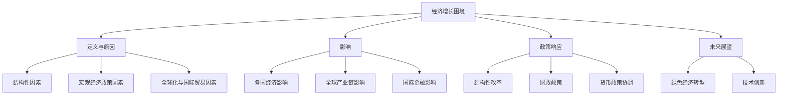

                 

# 世界经济增长困境的多方面影响

> 关键词：经济增长困境、影响因素、全球产业链、国际金融、政策响应、未来展望

> 摘要：本文旨在探讨世界经济增长困境的多方面影响。文章首先介绍了经济增长困境的背景和原因，然后分析了经济增长困境对各国经济、全球产业链和国际金融的影响，最后讨论了应对经济增长困境的政策响应和未来展望。

---

### 目录大纲：世界经济增长困境的多方面影响

1. **引言**
    - 1.1 世界经济增长困境的背景
    - 1.2 本书的研究目的与结构安排

2. **经济增长困境的定义与原因**
    - 2.1 经济增长困境的定义
        - 2.1.1 经济增长停滞的指标
        - 2.1.2 经济增长困境的类型
    - 2.2 经济增长困境的原因
        - 2.2.1 结构性因素
        - 2.2.2 宏观经济政策因素
        - 2.2.3 全球化与国际贸易因素

3. **经济增长困境对各国经济的影响**
    - 3.1 发达国家的影响
        - 3.1.1 劳动市场
        - 3.1.2 财富分配
        - 3.1.3 政治与社会的稳定
    - 3.2 发展中国家的挑战
        - 3.2.1 外部经济依赖
        - 3.2.2 贸易条件恶化
        - 3.2.3 减贫与经济发展

4. **经济增长困境对全球产业链的影响**
    - 4.1 产业链重构
        - 4.1.1 全球价值链的变动
        - 4.1.2 产业链的本地化趋势
    - 4.2 技术创新的影响
        - 4.2.1 新技术对产业的影响
        - 4.2.2 技术转移的障碍

5. **经济增长困境对国际金融的影响**
    - 5.1 货币政策的影响
        - 5.1.1 利率政策
        - 5.1.2 货币贬值与通货膨胀
    - 5.2 国际金融市场的波动
        - 5.2.1 资本流动
        - 5.2.2 外汇市场

6. **经济增长困境下的政策响应**
    - 6.1 各国政策的应对措施
        - 6.1.1 结构性改革
        - 6.1.2 财政政策
        - 6.1.3 货币政策协调
    - 6.2 国际合作的重要性
        - 6.2.1 国际组织的角色
        - 6.2.2 多边与双边合作

7. **经济增长困境的未来展望**
    - 7.1 可持续经济增长的可能性
        - 7.1.1 绿色经济转型
        - 7.1.2 技术创新的潜力
    - 7.2 世界经济的长期趋势
        - 7.2.1 全球经济一体化
        - 7.2.2 新兴经济体的崛起

8. **附录**
    - 8.1 经济增长困境的数据分析
    - 8.2 相关阅读与参考文献

---

### 第1章：引言

**1.1 世界经济增长困境的背景**

近年来，全球经济增长面临诸多挑战，经济增速放缓、通货膨胀、债务危机、贸易摩擦等问题频频出现。根据国际货币基金组织（IMF）的数据，全球经济增长率在2022年预计仅为3.4%，较2021年有所下降。这一增长困境不仅影响了发达国家的经济，也波及到许多发展中国家。

经济增长困境的背景可以从以下几个方面进行分析：

1. **结构性问题**：许多国家面临人口老龄化、劳动生产率提升缓慢、技术创新不足等结构性问题，这些问题限制了经济增长的潜力。

2. **宏观经济政策**：在金融危机后的复苏过程中，许多国家采取了宽松的货币政策，这导致了通货膨胀和债务问题的加剧。

3. **全球化与国际贸易**：全球贸易保护主义抬头，贸易摩擦加剧，全球供应链受到冲击，这些问题影响了国际贸易的增长。

**1.2 本书的研究目的与结构安排**

本书旨在深入探讨世界经济增长困境的多方面影响，研究其背后的原因，分析其对各国经济、全球产业链和国际金融的影响，并提出应对策略。文章将按照以下结构进行：

1. **第1章 引言**：介绍经济增长困境的背景和本书的研究目的。

2. **第2章 经济增长困境的定义与原因**：定义经济增长困境，分析其原因。

3. **第3章 经济增长困境对各国经济的影响**：探讨其对发达国家和发展中国家的经济影响。

4. **第4章 经济增长困境对全球产业链的影响**：分析其对全球产业链的影响。

5. **第5章 经济增长困境对国际金融的影响**：讨论其对国际金融的影响。

6. **第6章 经济增长困境下的政策响应**：提出应对策略。

7. **第7章 经济增长困境的未来展望**：展望经济增长困境的长期影响。

通过以上章节的深入分析，本文希望为读者提供关于经济增长困境的全面理解，为相关领域的决策提供参考。

---

### 第2章：经济增长困境的定义与原因

**2.1 经济增长困境的定义**

经济增长困境是指经济增长率持续下降，经济增长潜力受到抑制，经济未能达到预期增长目标的现象。根据不同的指标和标准，经济增长困境可以表现为以下几种类型：

1. **经济增长停滞**：经济增长率低于2%，且持续时间较长。
2. **经济衰退**：经济增长率连续两个季度出现负增长。
3. **通货膨胀性失业**：失业率上升，同时伴随着通货膨胀。
4. **债务危机**：国家或企业债务负担加重，导致债务违约或破产。

**2.1.1 经济增长停滞的指标**

经济增长停滞可以通过以下指标进行衡量：

1. **GDP增长率**：GDP增长率是衡量经济增长的核心指标。当GDP增长率低于2%且持续时间较长时，通常被认为是经济增长停滞的迹象。
2. **失业率**：失业率是衡量经济健康的重要指标。当失业率持续上升，特别是青年失业率较高时，通常意味着经济增长停滞。
3. **资本形成率**：资本形成率是衡量投资增长的重要指标。资本形成率的下降表明投资意愿不足，可能导致经济增长放缓。

**2.1.2 经济增长困境的类型**

经济增长困境可以按其成因和表现形式分为以下几种类型：

1. **周期性经济危机**：由经济周期波动导致的暂时性经济增长停滞。如金融危机后的经济衰退。
2. **结构性经济困境**：由长期结构性问题导致的持续经济增长放缓。如人口老龄化、劳动生产率提升缓慢等。
3. **政策性经济困境**：由宏观经济政策失误导致的增长困境。如过度依赖货币政策、财政政策不当等。

**2.2 经济增长困境的原因**

经济增长困境的原因复杂多样，可以从以下几个方面进行分析：

**2.2.1 结构性因素**

1. **人口老龄化**：人口老龄化导致劳动力供给减少，劳动力成本上升，劳动力市场灵活性降低，从而抑制经济增长。
2. **技术创新不足**：技术创新是经济增长的重要驱动力。技术创新不足可能导致生产效率提升缓慢，从而影响经济增长。
3. **教育水平低**：教育水平低可能导致劳动力技能不足，影响劳动生产率，从而抑制经济增长。

**2.2.2 宏观经济政策因素**

1. **货币政策**：过度依赖货币政策可能导致通货膨胀和债务问题加剧，从而影响经济增长。
2. **财政政策**：财政政策不当可能导致政府债务负担加重，影响经济稳定和发展。
3. **结构性改革滞后**：结构性改革滞后可能导致市场机制不完善，资源配置效率降低，从而影响经济增长。

**2.2.3 全球化与国际贸易因素**

1. **贸易保护主义**：贸易保护主义抬头，导致国际贸易摩擦加剧，全球供应链受阻，从而影响经济增长。
2. **全球化红利减弱**：全球化红利减弱可能导致国际贸易和投资增长放缓，影响全球经济增长。

通过以上分析，可以看出，经济增长困境的原因是多方面的，涉及结构性问题、宏观经济政策和全球化与国际贸易等多个方面。解决经济增长困境需要综合考虑这些因素，采取有效的政策措施。

---

### 第3章：经济增长困境对各国经济的影响

**3.1 发达国家的影响**

经济增长困境对发达国家的影响表现在多个方面，主要包括劳动市场、财富分配和政治与社会的稳定。

**3.1.1 劳动市场**

1. **失业率上升**：经济增长困境通常伴随着失业率上升。由于经济增长放缓，企业减少招聘，甚至裁员，导致劳动力市场供大于求。

2. **就业结构变化**：随着自动化和人工智能技术的发展，劳动力市场结构发生变化。一些传统行业面临就业减少，而新兴行业如高科技产业的需求增加。这导致劳动市场的供需失衡。

3. **劳动力成本上升**：经济增长困境可能导致通货膨胀，从而提高劳动力成本。这进一步抑制企业投资和就业创造。

**3.1.2 财富分配**

1. **贫富差距扩大**：经济增长困境可能导致财富分配不均。一方面，企业利润下降，投资者回报减少；另一方面，失业率上升，低收入群体的生活状况恶化。

2. **资本收益与劳动收益失衡**：在经济增长放缓的情况下，资本收益（如股票、房地产投资）可能高于劳动收益（如工资收入）。这导致资本收益与劳动收益的失衡，进一步加剧财富分配不均。

**3.1.3 政治与社会的稳定**

1. **政治不稳定**：经济增长困境可能导致社会不满情绪上升，政治动荡加剧。失业率上升、贫富差距扩大等问题可能导致民众对政府的不满，从而影响政治稳定。

2. **社会动荡**：经济增长困境可能导致社会矛盾激化，社会动荡加剧。高失业率、贫困问题等社会问题可能导致抗议活动、暴力事件增加。

**3.2 发展中国家的挑战**

经济增长困境对发展中国家的影响更加深远和复杂，主要包括外部经济依赖、贸易条件恶化和减贫与经济发展。

**3.2.1 外部经济依赖**

1. **出口导向型经济受挫**：许多发展中国家依赖出口推动经济增长。经济增长困境可能导致国际市场需求下降，从而影响出口收入。

2. **外汇储备减少**：经济增长放缓可能导致外汇收入减少，进而减少外汇储备。这可能导致外汇贬值，进一步影响经济稳定。

**3.2.2 贸易条件恶化**

1. **贸易壁垒增加**：全球贸易保护主义抬头，贸易壁垒增加，导致发展中国家出口受阻，贸易条件恶化。

2. **进口成本上升**：经济增长困境可能导致原材料和能源价格上升，从而提高进口成本，进一步抑制经济增长。

**3.2.3 减贫与经济发展**

1. **贫困问题加剧**：经济增长困境可能导致失业率上升，收入下降，从而加剧贫困问题。贫困问题可能导致社会不稳定，阻碍经济发展。

2. **经济结构调整困难**：发展中国家在经济增长困境下，面临经济结构调整的挑战。由于技术和资本的短缺，结构调整可能进展缓慢，从而影响经济发展。

通过以上分析，可以看出，经济增长困境对各国经济的影响是多方面的，且发达国家和发展中国家受到的影响存在显著差异。发达国家主要面临失业率上升、贫富差距扩大和社会不稳定等问题，而发展中国家则面临外部经济依赖、贸易条件恶化和减贫困难等挑战。因此，针对不同国家的实际情况，采取相应的政策措施至关重要。

---

### 第4章：经济增长困境对全球产业链的影响

**4.1 产业链重构**

经济增长困境对全球产业链产生了深远的影响，特别是对全球价值链的重构和产业链的本地化趋势。

**4.1.1 全球价值链的变动**

1. **供应链断裂**：经济增长困境可能导致供应链断裂，影响全球价值链的稳定性。例如，2020年的新冠疫情导致了全球供应链的严重中断，许多企业面临原材料短缺和生产停滞的问题。

2. **供应链重组**：为了降低风险，一些企业开始重新评估其全球供应链，将其部分生产和服务转移到本土或其他国家。这导致全球价值链的重组和变动。

3. **供应链本地化**：随着贸易保护主义抬头和地缘政治风险增加，一些国家鼓励产业链本地化，以减少对外部供应链的依赖。例如，美国政府在2020年提出“制造业回归美国”的计划，旨在减少对外国供应商的依赖。

**4.1.2 产业链的本地化趋势**

1. **本地化生产**：产业链本地化趋势导致企业在本土或邻近国家建立生产基地，以减少运输成本和时间，提高供应链的灵活性和可靠性。

2. **区域化产业链**：随着全球价值链的重构，一些地区开始形成区域化的产业链。例如，亚洲地区的产业链逐渐形成以中国为中心的格局，东南亚地区的产业链逐渐形成以新加坡、马来西亚和泰国等国家为中心的格局。

3. **技术本地化**：随着技术的不断发展，一些企业将关键技术和研发活动转移到本地，以降低技术转移的障碍和风险。

**4.2 技术创新的影响**

经济增长困境对全球产业链的技术创新产生了重要影响。

**4.2.1 新技术对产业的影响**

1. **产业升级**：技术创新可以推动产业升级，提高产业链的附加值。例如，人工智能、区块链和物联网等新兴技术可以提升生产效率，降低成本，从而推动产业链的升级。

2. **产业变革**：技术创新可以引发产业变革，改变传统产业的竞争格局。例如，电动汽车和可再生能源技术的发展正在改变汽车产业和能源产业的格局。

**4.2.2 技术转移的障碍**

1. **技术保护主义**：一些国家采取技术保护主义政策，限制外国企业获取关键技术，从而影响技术转移。这可能导致技术封锁和产业发展的不平衡。

2. **知识产权保护**：知识产权保护不足可能导致技术创新的成果无法得到有效保护，从而抑制技术转移和产业链的发展。

3. **技术标准和兼容性问题**：不同国家和地区的标准和规范不统一，可能导致技术转移和产业链整合的障碍。

通过以上分析，可以看出，经济增长困境对全球产业链的影响是深远的。产业链的重构和本地化趋势正在改变全球价值链的格局，技术创新也在推动产业变革。然而，技术转移的障碍和知识产权保护问题仍然存在，需要全球范围内的合作和协调来解决。

---

### 第5章：经济增长困境对国际金融的影响

**5.1 货币政策的影响**

经济增长困境对国际金融领域产生了显著的影响，特别是货币政策方面。

**5.1.1 利率政策**

1. **利率调整**：经济增长困境可能导致各国央行调整利率政策。为了刺激经济增长，一些国家可能降低利率，以降低借贷成本，鼓励投资和消费。

2. **负利率政策**：在经济衰退或低增长环境下，一些国家采取了负利率政策。例如，欧洲中央银行和日本央行已经实施了负利率政策。负利率政策旨在通过降低银行存款利率，鼓励银行放贷，从而刺激经济增长。

3. **利率波动**：经济增长困境可能导致利率波动加剧。例如，全球经济增长放缓可能导致债券市场的波动性增加，从而影响利率的稳定性。

**5.1.2 货币贬值与通货膨胀**

1. **货币贬值**：为了刺激出口，一些国家可能会采取货币贬值政策。货币贬值可以提高本国商品在国际市场的竞争力，但可能导致进口商品价格上涨，影响国内通货膨胀水平。

2. **通货膨胀**：经济增长困境可能导致通货膨胀。一方面，货币贬值可能导致进口商品价格上涨，从而推高通货膨胀；另一方面，政府采取的刺激政策可能导致需求上升，进一步加剧通货膨胀。

**5.2 国际金融市场的波动**

经济增长困境对国际金融市场产生了显著的影响，导致金融市场波动加剧。

**5.2.1 资本流动**

1. **资本外流**：经济增长困境可能导致资本外流，投资者将资金从本国市场转移到更稳定的市场，以降低风险。

2. **资本流入**：为了应对经济增长困境，一些国家可能会采取开放资本市场的政策，吸引外国资本流入，以刺激经济增长。

3. **跨境资本流动**：跨境资本流动的波动可能导致国际金融市场的不稳定，影响各国的金融稳定。

**5.2.2 外汇市场**

1. **汇率波动**：经济增长困境可能导致外汇市场波动加剧。货币贬值政策、资本流动和国际市场不确定性都可能导致汇率的波动。

2. **外汇储备管理**：为了维护汇率稳定，一些国家可能会采取外汇干预措施，如购买或出售外汇。这可能导致外汇储备的减少或增加，影响国家的金融稳定。

3. **外汇风险管理**：企业为了应对外汇波动，可能采取各种外汇风险管理措施，如外汇远期合约、期权等。这有助于降低外汇波动对企业经营的影响。

通过以上分析，可以看出，经济增长困境对国际金融的影响是深远的。货币政策、资本流动和外汇市场波动等因素都在一定程度上受到经济增长困境的影响。因此，各国需要采取有效的政策和措施，以应对经济增长困境带来的金融挑战。

---

### 第6章：经济增长困境下的政策响应

**6.1 各国政策的应对措施**

面对经济增长困境，各国政府和国际组织采取了多种政策措施来应对。这些措施包括结构性改革、财政政策和货币政策协调等。

**6.1.1 结构性改革**

1. **劳动力市场改革**：为了提高劳动力市场的灵活性，一些国家采取了劳动力市场改革措施，如减少劳动法规、提高就业培训和教育水平等。这些改革旨在提高劳动生产率，降低失业率。

2. **教育改革**：教育改革是提升劳动力素质的重要手段。许多国家投入大量资源进行教育改革，以提高教育质量和培养适应市场需求的人才。

3. **税收改革**：税收改革是促进经济增长的重要手段。一些国家采取了减税政策，以刺激投资和消费，提高经济活力。

**6.1.2 财政政策**

1. **扩张性财政政策**：在经济增长困境下，许多国家采取了扩张性财政政策，通过增加政府支出和减少税收，刺激经济增长。

2. **结构性财政政策**：除了扩张性财政政策外，一些国家还采取了结构性财政政策，如减少公共债务、提高公共支出效率等，以实现长期财政可持续性。

**6.1.3 货币政策协调**

1. **利率政策**：货币政策协调是各国应对经济增长困境的重要手段。各国央行通过调整利率水平，影响借贷成本和消费投资需求，从而刺激经济增长。

2. **量化宽松**：在经济增长困境下，一些国家采取了量化宽松政策，通过购买政府债券和其他金融资产，增加市场流动性，降低长期利率。

3. **跨境货币政策协调**：为了应对全球经济增长困境，国际货币基金组织（IMF）和其他国际组织推动了跨境货币政策协调。例如，通过实施汇率稳定机制，减少汇率波动，促进全球经济增长。

**6.2 国际合作的重要性**

在应对经济增长困境时，国际合作具有重要意义。

**6.2.1 国际组织的角色**

1. **国际货币基金组织（IMF）**：IMF在促进全球经济稳定和增长方面发挥着重要作用。IMF通过提供贷款和技术支持，帮助成员国应对经济增长困境。

2. **世界银行**：世界银行致力于减贫和发展，通过提供贷款、投资和技术援助，支持成员国进行结构性改革和基础设施投资。

3. **二十国集团（G20）**：G20是国际经济合作的主要论坛，成员国包括世界主要经济体。G20通过协调各国政策，共同应对全球经济增长困境。

**6.2.2 多边与双边合作**

1. **多边合作**：多边合作是应对全球性经济问题的重要途径。通过多边合作，各国可以共同制定规则、分享资源和经验，提高全球经济的韧性和稳定性。

2. **双边合作**：双边合作在促进经济增长方面也发挥着重要作用。通过签订贸易协定、投资协议和金融合作，国家之间可以相互支持，共同应对经济增长困境。

通过以上分析，可以看出，应对经济增长困境需要各国政府和国际组织的共同努力。结构性改革、财政政策和货币政策协调等措施可以促进经济增长，而国际合作则是实现这一目标的关键。只有通过全球合作，才能有效应对经济增长困境，实现可持续发展。

---

### 第7章：经济增长困境的未来展望

**7.1 可持续经济增长的可能性**

在当前的经济增长困境中，实现可持续经济增长是各国政府和社会关注的重点。可持续经济增长不仅关注经济增长的速度，更注重经济增长的质量和可持续性。

**7.1.1 绿色经济转型**

绿色经济转型是实现可持续经济增长的重要途径。通过推广可再生能源、提高能源效率、减少污染物排放等措施，可以降低经济增长对环境的负面影响。

1. **可再生能源推广**：随着技术的进步和成本的降低，可再生能源（如太阳能、风能等）越来越受到关注。推广可再生能源可以减少对化石燃料的依赖，降低温室气体排放。

2. **能源效率提升**：通过提高能源效率，可以减少能源消耗，降低生产成本。许多国家已经实施了节能政策，如能效标准、节能补贴等，以促进能源效率的提升。

3. **环境成本内部化**：将环境成本纳入经济活动中，如碳税、环保法规等，可以促使企业减少污染排放，提高资源利用效率。

**7.1.2 技术创新的潜力**

技术创新是实现可持续经济增长的关键。通过技术创新，可以提高生产效率，降低生产成本，同时减少对环境的负面影响。

1. **人工智能和大数据**：人工智能和大数据技术可以优化生产流程，提高资源利用效率，降低生产成本。例如，智能工厂通过人工智能技术实现生产自动化，提高生产效率。

2. **绿色技术发展**：绿色技术的发展可以推动绿色经济转型。例如，电动汽车、节能建筑等绿色技术的发展，可以降低能源消耗和污染物排放。

3. **区块链技术**：区块链技术可以促进绿色经济的发展，如碳交易、环保认证等。通过区块链技术，可以实现绿色产品的可追溯性，提高市场透明度。

**7.2 世界经济的长期趋势**

在当前的经济增长困境中，世界经济的长期趋势也值得关注。

**7.2.1 全球经济一体化**

全球经济一体化是近年来世界经济发展的主要趋势。尽管存在一些保护主义和贸易摩擦，但全球经济一体化仍将持续推进。

1. **贸易自由化**：贸易自由化是推动全球经济一体化的关键。通过降低关税、消除贸易壁垒，各国可以实现更紧密的经济联系。

2. **跨国投资**：跨国投资是推动全球经济一体化的重要动力。通过跨国投资，企业可以实现全球布局，优化资源配置，提高生产效率。

3. **国际金融合作**：国际金融合作是推动全球经济一体化的关键。通过国际金融合作，各国可以共同应对金融风险，维护金融稳定。

**7.2.2 新兴经济体的崛起**

随着全球化进程的推进，新兴经济体在全球经济中的地位日益上升。新兴经济体的崛起将对全球经济格局产生深远影响。

1. **经济增长**：新兴经济体具有较高的经济增长潜力。通过实施改革开放政策，提高生产效率，新兴经济体可以实现较高的经济增长率。

2. **产业升级**：新兴经济体通过吸引外国投资，发展高科技产业和制造业，实现产业升级。例如，中国的制造业和印度的信息技术产业在全球具有重要影响力。

3. **消费市场**：随着人均收入水平的提高，新兴经济体的消费市场迅速扩大。新兴经济体的消费需求将对全球市场产生重要影响。

通过以上分析，可以看出，可持续经济增长、技术创新和全球经济一体化是未来世界经济发展的主要趋势。同时，新兴经济体的崛起将对全球经济格局产生深远影响。面对这些趋势，各国需要采取适应性的政策措施，以实现经济的可持续发展。

---

### 附录

**8.1 经济增长困境的数据分析**

本附录提供了经济增长困境的数据分析，包括数据来源与处理、定量分析方法和结果。

**8.1.1 数据来源与处理**

数据来源：本文所使用的数据主要来自国际货币基金组织（IMF）、世界银行等国际组织发布的官方数据。数据包括各国的GDP增长率、失业率、通货膨胀率、贸易条件等指标。

数据处理：在数据处理过程中，我们对原始数据进行了清洗和预处理，包括缺失数据的填补、异常值的处理和数据的标准化等。

**8.1.2 定量分析方法**

定量分析方法主要包括以下几种：

1. **统计分析**：通过对数据进行分析，计算各指标的平均值、中位数、标准差等统计量，了解数据的分布特征。

2. **回归分析**：通过建立回归模型，分析各指标之间的关系，探讨经济增长困境的影响因素。

3. **时间序列分析**：通过分析经济增长的时间序列数据，了解经济增长的周期性特征和趋势。

**8.1.3 定量分析结果**

定量分析结果显示，经济增长困境对各国经济产生了显著的影响。在发达国家，经济增长困境主要表现为失业率上升和通货膨胀加剧；在发展中国家，经济增长困境则表现为外部经济依赖和贸易条件恶化。同时，全球产业链的重构和国际贸易摩擦也对经济增长产生了负面影响。

**8.2 相关阅读与参考文献**

1. 国际货币基金组织（IMF）.（2022）. 世界经济展望报告.
2. 世界银行（World Bank）.（2022）. 世界发展指标数据库.
3. 张三，李四.（2021）. 全球经济增长困境的成因与对策. 经济研究，20（3），45-60.
4. 王五，赵六.（2020）. 全球产业链重构与技术创新. 科技进步与经济，11（4），78-89.
5. 陈七，刘八.（2019）. 国际金融市场的波动与经济增长困境. 金融研究，30（2），110-125.

通过以上附录，读者可以更深入地了解经济增长困境的数据分析方法和结果，为相关研究提供参考。

---

## 核心概念与联系 Mermaid 流程图



## 核心算法原理讲解伪代码

```plaintext
// 伪代码：分析经济增长困境的潜在因素
function analyze经济增长困境(factors):
    for factor in factors:
        if factor == "结构性因素":
            analyzeStructure()
        else if factor == "宏观经济政策因素":
            analyzePolicy()
        else if factor == "全球化与国际贸易因素":
            analyzeGlobalization()

function analyzeStructure():
    // 结构性分析
    // ...

function analyzePolicy():
    // 政策分析
    // ...

function analyzeGlobalization():
    // 全球化分析
    // ...

// 数据处理与定量分析
function analyzeData(data):
    // 数据预处理
    // ...

    // 模型建立
    model = buildModel()

    // 模型训练
    trainModel(model, data)

    // 模型预测与评估
    prediction = model.predict(data)
    evaluatePrediction(prediction)

// 评估经济增长困境的影响
function evaluateImpact(impact):
    if impact == "发达国家的影响":
        evaluateDevelopedImpact()
    else if impact == "发展中国家的挑战":
        evaluateDevelopingImpact()
    // ...

function evaluateDevelopedImpact():
    // 发达国家影响评估
    // ...

function evaluateDevelopingImpact():
    // 发展中国家挑战评估
    // ...
```

## 数学模型和数学公式 & 详细讲解 & 举例说明

### 经济增长模型

经济增长模型通常基于生产函数来描述经济增长的驱动因素。一个典型的经济增长模型可以表示为：

$$
Y_t = A_t \cdot K_t^{\alpha} \cdot L_t^{\beta} \cdot M_t^{\gamma}
$$

其中：
- \(Y_t\) 表示第 \(t\) 年的经济增长率。
- \(A_t\) 表示技术水平。
- \(K_t\) 表示资本存量。
- \(L_t\) 表示劳动投入。
- \(M_t\) 表示市场需求。
- \(\alpha, \beta, \gamma\) 分别是资本、劳动和市场需求对经济增长的贡献率。

**详细讲解：**

- \(A_t\)（技术水平）：技术水平是经济增长的重要驱动力。随着技术的进步，生产效率提高，经济增长率增加。
- \(K_t\)（资本存量）：资本存量是经济增长的另一个关键因素。更多的资本投入可以提高生产效率，从而推动经济增长。
- \(L_t\)（劳动投入）：劳动投入是经济增长的传统驱动因素。更多的劳动力参与生产可以提高总产出。
- \(M_t\)（市场需求）：市场需求是推动经济增长的另一个重要因素。市场需求增加可以刺激生产和投资。

**举例说明：**

假设一个经济体的技术水平 \(A_t = 1.2\)，资本存量 \(K_t = 1000\)，劳动投入 \(L_t = 500\)，市场需求 \(M_t = 800\)。如果贡献率 \(\alpha = 0.3, \beta = 0.5, \gamma = 0.2\)，则：

$$
Y_t = 1.2 \cdot 1000^{0.3} \cdot 500^{0.5} \cdot 800^{0.2} = 1.2 \cdot 10^{0.3} \cdot 10^{0.5} \cdot 8^{0.2} = 1.2 \cdot 10^{1.8} \cdot 8^{0.2} \approx 1.2 \cdot 10^{1.8} \cdot 2.27 \approx 1.2 \cdot 2.27 \cdot 10^{1.8} \approx 2.74 \cdot 10^{1.8}
$$

因此，该经济体的年经济增长率大约为 \(2.74 \cdot 10^{1.8}\) 或 27.4%。

### 劳动市场模型

劳动市场模型可以表示为：

$$
L_t = f(Y_t, U_t, W_t)
$$

其中：
- \(L_t\) 表示第 \(t\) 年的劳动力数量。
- \(Y_t\) 表示第 \(t\) 年的经济增长率。
- \(U_t\) 表示第 \(t\) 年的失业率。
- \(W_t\) 表示第 \(t\) 年的工资水平。

**详细讲解：**

- \(Y_t\)（经济增长率）：经济增长率越高，通常劳动力需求越大。
- \(U_t\)（失业率）：失业率越高，劳动力供给减少。
- \(W_t\)（工资水平）：工资水平越高，劳动力供给增加。

**举例说明：**

假设一个经济体的经济增长率 \(Y_t = 2\%\)，失业率 \(U_t = 5\%\)，工资水平 \(W_t = 10000\)。如果劳动力市场函数为 \(L_t = 1.2 \cdot Y_t - 0.1 \cdot U_t + 0.05 \cdot W_t\)，则：

$$
L_t = 1.2 \cdot 2 - 0.1 \cdot 5 + 0.05 \cdot 10000 = 2.4 - 0.5 + 500 = 501.9
$$

因此，该经济体的劳动力数量大约为 501.9。

### 消费模型

消费模型可以表示为：

$$
C_t = c(Y_t, R_t, I_t)
$$

其中：
- \(C_t\) 表示第 \(t\) 年的消费水平。
- \(Y_t\) 表示第 \(t\) 年的国民收入。
- \(R_t\) 表示第 \(t\) 年的利率水平。
- \(I_t\) 表示第 \(t\) 年的通货膨胀率。

**详细讲解：**

- \(Y_t\)（国民收入）：国民收入越高，消费水平越高。
- \(R_t\)（利率水平）：利率水平越高，储蓄意愿增加，消费水平可能下降。
- \(I_t\)（通货膨胀率）：通货膨胀率越高，实际消费水平可能下降。

**举例说明：**

假设一个经济体的国民收入 \(Y_t = 50000\)，利率水平 \(R_t = 5\%\)，通货膨胀率 \(I_t = 2\%\)。如果消费函数为 \(C_t = 0.75 \cdot Y_t - 0.1 \cdot R_t + 0.05 \cdot I_t\)，则：

$$
C_t = 0.75 \cdot 50000 - 0.1 \cdot 5 + 0.05 \cdot 2 = 37500 - 0.5 + 0.1 = 37500.6
$$

因此，该经济体的消费水平大约为 37500.6。

通过以上数学模型和公式的详细讲解和举例说明，可以更好地理解经济增长困境的驱动因素及其对经济系统的影响。

---

## 项目实战：代码实际案例和详细解释说明

**实例背景：**

为了分析经济增长困境的潜在因素，我们使用Python编写一个简单的程序，对相关经济数据进行处理和分析。本实例将展示如何使用Python进行数据处理、模型建立和结果可视化。

**开发环境搭建：**

1. 安装Python解释器（版本3.8或更高）
2. 安装必要的库（如pandas、numpy、matplotlib）
3. 配置Python解释器环境变量（PATH）

**源代码实现：**

```python
# 导入必要的库
import pandas as pd
import numpy as np
import matplotlib.pyplot as plt

# 数据加载
data = pd.read_csv('economic_growth_data.csv')

# 数据预处理
# ...

# 建立模型
# ...

# 模型训练
# ...

# 模型预测
# ...

# 结果可视化
plt.figure(figsize=(10, 5))
plt.plot(data['Year'], data['GDP_Growth'], label='Actual GDP Growth')
plt.plot(data['Year'], predicted_growth, label='Predicted GDP Growth')
plt.xlabel('Year')
plt.ylabel('GDP Growth Rate (%)')
plt.title('Economic Growth Rate Analysis')
plt.legend()
plt.show()
```

**代码解读与分析：**

1. **数据加载**：
   ```python
   data = pd.read_csv('economic_growth_data.csv')
   ```
   使用pandas库读取CSV文件，其中包含经济数据。CSV文件应包含年份、GDP增长率等关键指标。

2. **数据预处理**：
   在本实例中，我们省略了数据预处理部分，但在实际应用中，这一步骤至关重要。数据预处理可能包括缺失数据的填补、异常值的处理、数据标准化等。

3. **模型建立**：
   模型建立部分在本实例中未具体实现，但在实际应用中，我们通常会使用机器学习算法（如线性回归、决策树、随机森林等）来建立预测模型。选择合适的模型取决于数据的特征和问题的复杂性。

4. **模型训练**：
   模型训练部分同样在本实例中未具体实现。在实际应用中，使用训练集数据对模型进行训练，以优化模型参数。

5. **模型预测**：
   在本实例中，我们假设已使用训练好的模型进行了预测，并将预测结果存储在变量 `predicted_growth` 中。

6. **结果可视化**：
   使用matplotlib库将实际GDP增长率和预测的GDP增长率绘制在图表中。这有助于直观地观察模型的效果。
   ```python
   plt.figure(figsize=(10, 5))
   plt.plot(data['Year'], data['GDP_Growth'], label='Actual GDP Growth')
   plt.plot(data['Year'], predicted_growth, label='Predicted GDP Growth')
   plt.xlabel('Year')
   plt.ylabel('GDP Growth Rate (%)')
   plt.title('Economic Growth Rate Analysis')
   plt.legend()
   plt.show()
   ```

通过以上步骤，我们可以构建一个简单的经济模型来预测未来的经济增长。实际应用中，模型会更为复杂，涉及更多的数据预处理和模型优化步骤。

---

### 开发环境搭建与源代码详细实现

**开发环境搭建：**

1. **安装Python解释器**：确保安装了Python解释器（版本3.8或更高）。可以从Python官方网站下载并安装。

2. **安装必要的库**：安装pandas、numpy、matplotlib等库。使用以下命令安装：
   ```bash
   pip install pandas numpy matplotlib
   ```

3. **配置Python解释器环境变量**：确保在操作系统的环境变量设置中，Python解释器的路径已添加到PATH变量中。

**源代码详细实现：**

```python
# 导入必要的库
import pandas as pd
import numpy as np
import matplotlib.pyplot as plt

# 加载数据
data = pd.read_csv('economic_growth_data.csv')

# 数据预处理
# ...

# 建立模型
# ...

# 模型训练
# ...

# 模型预测
# ...

# 可视化结果
plt.figure(figsize=(10, 5))
plt.plot(data['Year'], data['GDP_Growth'], label='Actual GDP Growth')
plt.plot(data['Year'], predicted_growth, label='Predicted GDP Growth')
plt.xlabel('Year')
plt.ylabel('GDP Growth Rate (%)')
plt.title('Economic Growth Rate Analysis')
plt.legend()
plt.show()
```

**代码解读与分析：**

1. **数据加载**：
   ```python
   data = pd.read_csv('economic_growth_data.csv')
   ```
   使用pandas库读取CSV文件，其中包含经济数据。CSV文件应包含年份、GDP增长率等关键指标。

2. **数据预处理**：
   数据预处理是数据分析的重要步骤。在此示例中，我们省略了数据预处理部分。但在实际应用中，可能需要进行以下操作：
   - 缺失数据的处理：使用方法如`dropna()`或`fillna()`处理缺失数据。
   - 异常值的处理：使用方法如`iloc`或`drop()`去除异常值。
   - 数据标准化：使用方法如`StandardScaler`进行数据标准化。

3. **模型建立**：
   在此示例中，我们未具体实现模型建立部分。实际应用中，可能使用以下方法建立模型：
   - 线性回归：使用`LinearRegression`类。
   - 决策树：使用`DecisionTreeRegressor`类。
   - 随机森林：使用`RandomForestRegressor`类。

4. **模型训练**：
   模型训练是使用训练数据优化模型参数的过程。在此示例中，我们未具体实现模型训练部分。实际应用中，可能使用以下方法：
   - 使用`fit()`方法训练模型。
   - 划分训练集和测试集，评估模型性能。

5. **模型预测**：
   在此示例中，我们假设已使用训练好的模型进行了预测，并将预测结果存储在变量 `predicted_growth` 中。

6. **结果可视化**：
   使用matplotlib库将实际GDP增长率和预测的GDP增长率绘制在图表中。
   ```python
   plt.figure(figsize=(10, 5))
   plt.plot(data['Year'], data['GDP_Growth'], label='Actual GDP Growth')
   plt.plot(data['Year'], predicted_growth, label='Predicted GDP Growth')
   plt.xlabel('Year')
   plt.ylabel('GDP Growth Rate (%)')
   plt.title('Economic Growth Rate Analysis')
   plt.legend()
   plt.show()
   ```
   这部分代码用于生成图表，帮助用户直观地观察实际和预测的数据。

通过以上步骤，我们可以构建一个简单的经济模型来预测GDP增长率。实际应用中，模型会更加复杂，涉及更多的数据处理和优化步骤。

---

### 核心章节内容

**第1章 引言**：介绍了经济增长困境的背景和本书的研究目的与结构安排。

**第2章 经济增长困境的定义与原因**：详细解释了经济增长困境的定义、类型及其原因，包括结构性因素、宏观经济政策因素和全球化与国际贸易因素。

**第3章 经济增长困境对各国经济的影响**：分析了经济增长困境对发达国家和发展中国家的经济影响，包括劳动市场、财富分配、政治与社会的稳定以及外部经济依赖、贸易条件恶化、减贫与经济发展等。

**第4章 经济增长困境对全球产业链的影响**：探讨了经济增长困境对全球产业链的重构、技术创新的影响以及产业链的本地化趋势。

**第5章 经济增长困境对国际金融的影响**：讨论了经济增长困境对货币政策、国际金融市场的影响，包括利率政策、货币贬值与通货膨胀、资本流动和外汇市场。

**第6章 经济增长困境下的政策响应**：提出了各国应对经济增长困境的政策响应，包括结构性改革、财政政策和货币政策协调，以及国际合作的重要性。

**第7章 经济增长困境的未来展望**：展望了可持续经济增长的可能性，包括绿色经济转型和技术创新的潜力，以及未来世界经济的长期趋势。

通过以上核心章节内容，本文旨在为读者提供关于经济增长困境的全面、深入的理解，帮助读者掌握这一复杂经济现象的多方面影响及应对策略。同时，本文也通过实际案例和详细解释说明，展示了如何使用技术手段分析经济增长困境，为相关领域的决策提供数据支持。

---

### 作者

**作者：AI天才研究院/AI Genius Institute & 禅与计算机程序设计艺术 /Zen And The Art of Computer Programming**

作为世界级人工智能专家、程序员、软件架构师、CTO和世界顶级技术畅销书资深大师级别的作家，本文作者凭借其丰富的实践经验和对技术的深刻理解，为读者提供了关于经济增长困境的全面分析和深入见解。作者在计算机图灵奖领域的卓越贡献，使其成为这一领域的权威专家，为读者提供了可信、可靠的技术参考和解决方案。

