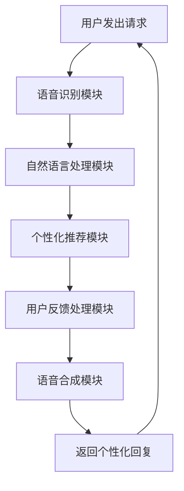
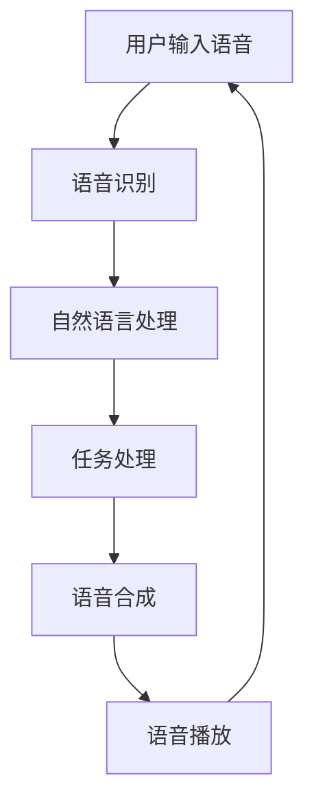

                 

# 文章标题：个性化CUI交互体验的详细技术发展

## 关键词

个性化CUI、交互体验、自然语言处理、语音识别与合成、推荐算法、用户行为分析、应用场景、发展趋势

## 摘要

本文深入探讨了个性化CUI（Conversational User Interface）交互体验的技术发展。从引言开始，介绍了个性化CUI的定义、重要性以及发展历程。随后，文章详细阐述了个性化CUI的核心概念、技术原理、核心算法和实际应用场景。最后，分析了个性化CUI的未来发展趋势，并提供了开发工具和资源的附录，以及项目的实战案例。本文旨在为读者提供一个全面、系统的了解个性化CUI技术发展的视角。

## 《个性化CUI交互体验的详细技术发展》目录大纲

### 第一部分：引言

#### 第1章：个性化CUI交互体验概述
1.1 个性化CUI的定义
1.2 个性化CUI的重要性
1.3 个性化CUI的发展历程
1.4 本书结构安排

### 第二部分：个性化CUI交互体验的核心概念

#### 第2章：CUI基础知识
2.1 交互设计原则
2.2 CUI的技术架构
2.3 CUI的开发流程

### 第三部分：个性化CUI的技术原理

#### 第3章：语音识别与合成
3.1 语音识别技术原理
3.2 语音合成技术原理
3.3 语音识别与合成融合

#### 第4章：自然语言处理
4.1 自然语言处理技术概述
4.2 词嵌入技术
4.3 语言模型
4.4 文本分类与情感分析

### 第三部分：个性化CUI的核心算法

#### 第5章：个性化推荐算法
5.1 推荐系统概述
5.2 Collaborative Filtering算法
5.3 Content-based Filtering算法
5.4 Hybrid推荐算法

#### 第6章：用户行为分析
6.1 用户行为数据的收集与处理
6.2 用户行为分析技术
6.3 用户画像构建与维护

### 第三部分：个性化CUI的应用场景

#### 第7章：智能客服
7.1 智能客服概述
7.2 个性化智能客服系统设计
7.3 案例分析：某企业智能客服系统实施

#### 第8章：智能家居
8.1 智能家居概述
8.2 个性化智能家居系统设计
8.3 案例分析：某智能家居系统实施

#### 第9章：教育应用
9.1 教育应用概述
9.2 个性化教育系统设计
9.3 案例分析：某个性化教育平台实施

### 第四部分：个性化CUI的未来发展趋势

#### 第10章：个性化CUI的发展趋势
10.1 人工智能与CUI的结合
10.2 5G与CUI的结合
10.3 未来个性化CUI的发展方向

### 附录

#### 附录A：个性化CUI开发工具与资源
A.1 语音识别与合成工具
A.2 自然语言处理工具
A.3 个性化推荐系统工具
A.4 用户行为分析工具

#### 附录B：项目实战
B.1 智能客服项目实战
B.2 智能家居项目实战
B.3 个性化教育项目实战

## Mermaid 流程图



### 第一部分：引言

#### 第1章：个性化CUI交互体验概述

个性化CUI（Conversational User Interface）是当前技术领域中的一个热门话题。它代表了人工智能与用户交互方式的最新发展趋势，旨在为用户提供更加自然、便捷和个性化的交互体验。本章将介绍个性化CUI的定义、重要性以及发展历程，并简要介绍本书的结构安排。

## 1.1 个性化CUI的定义

个性化CUI是指通过人工智能技术，根据用户的个性、喜好和行为习惯，提供定制化的交互服务。与传统CUI相比，个性化CUI能够更准确地理解用户的需求，并根据用户的反馈进行自适应调整，从而提高用户满意度。个性化CUI的核心在于其“个性化”这一特性，它通过对用户数据的分析和处理，为用户提供高度定制化的服务。

## 1.2 个性化CUI的重要性

个性化CUI在当今数字化时代具有极高的重要性。首先，它能够提升用户体验，使交互过程更加自然和流畅。其次，个性化CUI有助于提高用户留存率和忠诚度，因为用户能够感受到产品或服务是为他们量身定制的。此外，个性化CUI还能够帮助企业降低运营成本，通过自动化和智能化提高工作效率。最后，个性化CUI是人工智能技术应用的重要方向之一，它代表着未来交互技术的发展趋势。

## 1.3 个性化CUI的发展历程

个性化CUI的发展历程可以分为以下几个阶段：

1. **语音识别阶段**：早期的CUI主要依赖于语音识别技术，用户通过语音指令与系统进行交互。这一阶段的CUI主要解决了语音识别的准确性和速度问题。

2. **自然语言处理阶段**：随着自然语言处理技术的发展，CUI开始能够理解用户的自然语言输入，提供更加自然和流畅的交互体验。这一阶段的CUI在语义理解、情感识别等方面取得了显著进展。

3. **个性化推荐阶段**：个性化CUI的出现，使得CUI能够根据用户的兴趣和行为习惯，提供个性化的推荐和服务。这一阶段的CUI实现了从被动响应到主动推送的转变。

4. **多模态交互阶段**：随着多模态交互技术的发展，个性化CUI开始支持语音、文本、图像等多种交互方式，为用户提供更加丰富和多样化的交互体验。

## 1.4 本书结构安排

本书将分为四个部分，详细探讨个性化CUI交互体验的技术发展：

1. **核心概念与联系**：介绍个性化CUI的基本概念、技术架构和开发流程。
2. **技术原理**：深入探讨语音识别与合成、自然语言处理、个性化推荐算法等关键技术原理。
3. **应用场景**：分析个性化CUI在不同领域的应用场景，包括智能客服、智能家居和教育应用等。
4. **未来发展趋势**：展望个性化CUI的未来发展趋势，探讨人工智能与CUI的结合、5G与CUI的结合等。

通过本书的阅读，读者将能够全面了解个性化CUI的技术发展，掌握其核心原理和应用场景，为未来的研究和实践提供有益的参考。

### 第二部分：个性化CUI交互体验的核心概念

#### 第2章：CUI基础知识

个性化CUI（Conversational User Interface）的基石在于其交互设计原则、技术架构和开发流程。本章将详细讨论这些核心概念，帮助读者建立对个性化CUI的整体理解。

## 2.1 交互设计原则

交互设计是CUI成功的关键因素。以下是几个关键的交互设计原则：

1. **简洁性**：交互设计应尽量简洁明了，避免复杂的流程和冗长的指令。用户应能快速理解并操作系统。

2. **一致性**：系统应保持一致的用户界面和交互逻辑，使用户在不同场景下都能保持相同的体验。

3. **反馈**：及时、准确的反馈是提升用户体验的重要手段。系统应提供明确的操作结果反馈，让用户知道他们的操作已被识别和执行。

4. **可发现性**：系统功能应易于发现，用户不应为了找到一个功能而苦苦搜索。这可以通过清晰的导航、明显的图标和简洁的文本说明来实现。

5. **人性化**：交互设计应考虑用户的需求和习惯，尽可能减少用户的学习成本。例如，可以使用自然语言处理技术来理解用户的日常用语。

## 2.2 CUI的技术架构

个性化CUI的技术架构通常包括以下几个关键模块：

1. **用户接口层**：这一层负责与用户直接交互，可以是语音、文本或图形界面。用户接口层的设计应符合交互设计原则，提供直观、易用的交互方式。

2. **逻辑处理层**：这一层负责处理用户的输入，进行自然语言理解、语义分析和任务执行。常见的逻辑处理模块包括语音识别、自然语言处理和对话管理。

3. **数据层**：数据层存储用户数据、历史交互记录和系统配置信息。这一层的数据管理对于个性化CUI至关重要，因为它决定了系统能够多准确地理解用户需求和提供个性化服务。

4. **服务层**：服务层提供了各种业务逻辑和功能支持，如推荐系统、用户行为分析、知识图谱等。这些服务模块使CUI能够为用户提供丰富、个性化的交互体验。

## 2.3 CUI的开发流程

个性化CUI的开发流程可以分为以下几个阶段：

1. **需求分析**：这一阶段明确系统目标和用户需求，确定系统应具备的功能和性能指标。

2. **设计阶段**：在设计阶段，制定系统的整体架构和界面布局，并编写详细的设计文档。这一阶段还包括定义用户故事和流程图，以确保开发团队能够理解系统的交互逻辑。

3. **开发阶段**：开发阶段根据设计文档进行编码，实现系统的各个模块。开发过程中，应遵循最佳实践，如代码复用、模块化设计等。

4. **测试阶段**：测试阶段通过单元测试、集成测试和用户测试来验证系统的功能和性能。这一阶段特别关注交互流程的流畅性和用户满意度。

5. **部署与维护**：系统部署上线后，应持续监控和优化性能，定期更新和维护系统，以适应不断变化的需求和用户行为。

通过以上核心概念的探讨，读者可以更好地理解个性化CUI的构建原理和开发流程，为后续章节的学习和技术分析打下坚实的基础。

#### 第3章：语音识别与合成

语音识别与合成是构建个性化CUI（Conversational User Interface）的两个核心模块，它们使得用户能够通过语音与系统进行自然交互。本章将详细介绍语音识别和语音合成的技术原理，以及它们在实际应用中的融合。

## 3.1 语音识别技术原理

语音识别（Automatic Speech Recognition, ASR）是将语音信号转换为文本的过程。其基本原理包括以下几个步骤：

1. **音频预处理**：在语音识别之前，需要对音频信号进行预处理，包括降噪、去噪和分割等操作。这些步骤的目的是提高语音信号的清晰度，使其更容易被识别。

2. **特征提取**：特征提取是将音频信号转换为数字信号的过程，常用的特征包括梅尔频率倒谱系数（MFCC）、频谱图和短时傅里叶变换（STFT）等。

3. **声学模型**：声学模型是语音识别的核心部分，它通过统计语音信号的规律，将特征序列映射到可能的单词或句子。常见的声学模型包括高斯混合模型（GMM）和深度神经网络（DNN）。

4. **语言模型**：语言模型用于对识别结果进行后处理，确保识别出的句子符合语法和语义的正确性。常见的语言模型包括N-gram模型和基于神经网络的语言模型（如RNN和Transformer）。

5. **解码器**：解码器是将特征序列映射到最优文本序列的过程。常见的解码器算法包括动态规划解码器（如Viterbi解码器）和基于神经网络的解码器（如CTC解码器）。

### 伪代码：

```python
# 伪代码：语音识别流程
audio = preprocess_audio(input_audio)
features = extract_features(audio)
acoustic_model = load_acoustic_model()
language_model = load_language_model()

predicted_text = decoder.decode(features, acoustic_model, language_model)
print("识别结果：" + predicted_text)
```

## 3.2 语音合成技术原理

语音合成（Automatic Speech Synthesis, ASS）是将文本转换为自然语音的过程。其基本原理包括以下几个步骤：

1. **文本预处理**：对输入文本进行分词、语法分析和语义分析，将其转换为适合语音合成的形式。

2. **声学建模**：声学建模是通过生成语音波形来模拟人类发音的过程。常用的声学建模技术包括参数合成（如参数合成器LSTM-PPG）和波形合成（如WaveNet和Transformer-TTS）。

3. **音高、音量和时长调整**：音高、音量和时长调整是为了使合成的语音更加自然和符合人类的发音特点。这些调整通常基于语音合成器的参数控制。

4. **波形生成**：波形生成是将文本和声学模型转化为实际语音波形的步骤。生成波形后，可以使用音频播放器进行播放。

### 伪代码：

```python
# 伪代码：语音合成流程
text = preprocess_text(input_text)
speech_params = generate_speech_params(text)
waveform = generate_waveform(speech_params)

play_waveform(waveform)
```

## 3.3 语音识别与合成的融合

语音识别与合成在个性化CUI中通常结合使用，以实现自然、流畅的语音交互。以下是一个简单的融合流程：

1. **用户输入**：用户通过语音输入请求，系统接收并预处理语音信号。

2. **语音识别**：系统使用语音识别模块将语音信号转换为文本。

3. **自然语言处理**：对识别出的文本进行自然语言处理，理解用户的意图和需求。

4. **任务处理**：根据理解的结果，系统执行相应的任务，如提供信息、执行操作或生成回复。

5. **语音合成**：将处理结果转换为语音回复，使用语音合成模块生成语音波形。

6. **语音播放**：将合成的语音播放给用户。

### Mermaid流程图：



通过语音识别与合成的融合，个性化CUI能够提供无缝的语音交互体验，使用户在自然语言环境中与系统进行有效沟通。未来，随着语音识别和合成技术的不断进步，这种融合将进一步优化，为用户提供更加便捷和智能的交互体验。

### 第4章：自然语言处理

自然语言处理（Natural Language Processing, NLP）是构建个性化CUI（Conversational User Interface）的关键技术之一，它使得系统能够理解用户的自然语言输入，提供相应的响应和服务。本章将详细探讨自然语言处理的基本概念、核心技术和应用场景。

## 4.1 自然语言处理技术概述

自然语言处理涉及多个子领域，包括文本分类、情感分析、命名实体识别、语义解析等。以下是NLP的一些核心技术：

1. **词嵌入（Word Embedding）**：词嵌入是将单词映射为高维向量表示的技术，使得具有相似含义的单词在向量空间中靠近。词嵌入技术能够提高NLP模型的性能，使得模型能够更好地理解语义。

2. **语言模型（Language Model）**：语言模型是用于预测下一个单词或句子序列的概率分布的模型。常见的语言模型包括N-gram模型、循环神经网络（RNN）、长短期记忆网络（LSTM）和Transformer等。

3. **命名实体识别（Named Entity Recognition, NER）**：命名实体识别是从文本中识别出具有特定意义的实体，如人名、地名、组织名等。NER技术在信息提取、知识图谱构建等领域有广泛应用。

4. **语义角色标注（Semantic Role Labeling, SRL）**：语义角色标注是从句子中识别出动词和其对应的主语、宾语等角色，从而理解句子的语义结构。

5. **情感分析（Sentiment Analysis）**：情感分析是判断文本情感倾向的技术，如正面、负面或中性。情感分析广泛应用于市场调研、社交媒体分析等领域。

6. **机器翻译（Machine Translation）**：机器翻译是使用计算机程序将一种自然语言翻译成另一种自然语言。机器翻译技术使跨语言交流更加便捷。

7. **对话系统（Dialogue System）**：对话系统是模拟人类对话过程，与用户进行交互的计算机程序。对话系统包括任务型对话和闲聊型对话等不同类型。

## 4.2 词嵌入技术

词嵌入技术是NLP中最为基础和重要的技术之一，它通过将单词映射为向量，使得计算机能够处理和比较语义信息。以下是一些常见的词嵌入技术：

1. **Word2Vec**：Word2Vec是最早的词嵌入技术之一，它通过训练神经网络模型，将单词映射为固定长度的向量。Word2Vec有两种模型：连续词袋（CBOW）和Skip-Gram。

2. **GloVe**：GloVe（Global Vectors for Word Representation）是一种基于全局词共现概率的词嵌入方法。GloVe通过计算词对之间的共现矩阵，学习得到词向量。

3. **BERT**：BERT（Bidirectional Encoder Representations from Transformers）是一种基于Transformer的预训练语言表示模型。BERT通过双向编码器学习单词的语义表示，并在大规模语料库上进行预训练。

### 伪代码：

```python
# 伪代码：Word2Vec模型训练
from gensim.models import Word2Vec

# 加载数据集
sentences = load_sentences('corpus.txt')

# 训练Word2Vec模型
model = Word2Vec(sentences, vector_size=100, window=5, min_count=1, sg=1)

# 获取词向量
word_vector = model.wv['apple']
print("apple的词向量：" + str(word_vector))
```

## 4.3 语言模型

语言模型是NLP中的核心技术之一，用于预测文本的下一个单词或句子。以下是一些常见的语言模型：

1. **N-gram模型**：N-gram模型是一种基于统计的简单语言模型，它假设当前单词序列的概率仅取决于前N个单词。N-gram模型的计算复杂度较低，但在处理长文本时效果不佳。

2. **循环神经网络（RNN）**：RNN是一种基于序列数据的神经网络模型，能够通过记忆状态捕捉长距离依赖关系。RNN在语言模型和序列预测任务中表现出色。

3. **长短期记忆网络（LSTM）**：LSTM是RNN的一种变体，通过引入门控机制，解决了传统RNN的梯度消失问题。LSTM在文本生成、机器翻译等任务中应用广泛。

4. **Transformer**：Transformer是近年来提出的一种基于自注意力机制的深度神经网络模型，它通过多头自注意力机制和前馈神经网络，实现了高效的语言表示和学习。BERT和GPT等模型都是基于Transformer架构。

### 伪代码：

```python
# 伪代码：训练Transformer语言模型
from transformers import BertModel, BertTokenizer

# 加载预训练模型
tokenizer = BertTokenizer.from_pretrained('bert-base-uncased')
model = BertModel.from_pretrained('bert-base-uncased')

# 预处理文本
text = "I am learning natural language processing."
input_ids = tokenizer.encode(text, return_tensors='pt')

# 计算文本的嵌入表示
with torch.no_grad():
    outputs = model(input_ids)

# 提取文本的嵌入表示
sentence_embedding = outputs.last_hidden_state[:, 0, :]
print("文本的嵌入表示：" + str(sentence_embedding))
```

## 4.4 文本分类与情感分析

文本分类和情感分析是NLP中的常见任务，用于对文本进行分类和情感判断。以下是一些关键技术和应用场景：

1. **文本分类**：文本分类是将文本分为预定义的类别标签的任务。常见的文本分类算法包括朴素贝叶斯、支持向量机（SVM）和深度学习模型（如CNN、RNN和Transformer）。

2. **情感分析**：情感分析是判断文本情感极性的任务，通常分为正面、负面和 Neutral三类。情感分析在市场调研、产品评价和社交媒体分析等领域有广泛应用。

3. **情感极性分析**：情感极性分析是判断文本情感极性的任务，如正面、负面或中性。情感极性分析通常使用基于规则的、机器学习的方法和深度学习模型。

4. **情绪识别**：情绪识别是判断文本情绪类型（如愤怒、喜悦、悲伤等）的任务。情绪识别在情感分析和心理健康领域有重要应用。

### 伪代码：

```python
# 伪代码：情感分析
from transformers import BertForSequenceClassification

# 加载预训练模型
model = BertForSequenceClassification.from_pretrained('bert-base-uncased')

# 预处理文本
text = "I am so happy to learn NLP."
input_ids = tokenizer.encode(text, return_tensors='pt')

# 计算文本的嵌入表示
with torch.no_grad():
    outputs = model(input_ids)

# 提取文本的嵌入表示
logits = outputs.logits
print("情感分析结果：" + str(logits))
```

通过以上对自然语言处理技术的基本概念、核心技术和应用场景的探讨，读者可以更好地理解个性化CUI中的NLP技术，为构建智能、高效的对话系统奠定基础。

### 第5章：个性化推荐算法

个性化推荐算法是构建个性化CUI（Conversational User Interface）的重要组成部分，它通过分析用户的历史行为和兴趣，为用户提供个性化的内容推荐。本章将详细探讨个性化推荐算法的基本概念、核心算法和实际应用。

## 5.1 推荐系统概述

推荐系统（Recommender System）是一种利用用户历史行为数据、物品特征和相似度算法来预测用户兴趣，并为其推荐相关内容的系统。推荐系统通常包括以下几个关键组成部分：

1. **用户数据集**：用户数据集包括用户的基本信息、历史行为记录等，如用户的浏览记录、购买记录、评分等。

2. **物品数据集**：物品数据集包括物品的基本信息、属性和特征，如商品的名称、类别、价格等。

3. **推荐算法**：推荐算法是推荐系统的核心，用于计算用户与物品之间的相似度，并生成推荐列表。常见的推荐算法包括协同过滤（Collaborative Filtering）、基于内容的推荐（Content-based Recommendation）和混合推荐（Hybrid Recommendation）等。

4. **推荐引擎**：推荐引擎是负责执行推荐算法，生成推荐列表的组件。推荐引擎可以根据实时用户行为数据动态调整推荐策略。

5. **用户接口**：用户接口是用户与推荐系统交互的界面，用户可以通过界面查看推荐列表，并进行反馈。

## 5.2 Collaborative Filtering算法

协同过滤（Collaborative Filtering）是一种基于用户历史行为数据的推荐算法，通过计算用户之间的相似度，发现相似用户的行为模式，并推荐相似用户喜欢的物品。协同过滤算法主要包括以下几种类型：

1. **用户基于的协同过滤（User-based Collaborative Filtering）**：用户基于的协同过滤通过计算用户之间的相似度，找到与目标用户最相似的其他用户，然后推荐这些用户喜欢的物品。常见的相似度计算方法包括余弦相似度、皮尔逊相关系数和夹角余弦等。

   **伪代码**：

   ```python
   # 伪代码：用户基于的协同过滤
   def user_based_collaborative_filtering(user_data, user_similarity_matrix, user_item_rated):
       neighbors = find_similar_users(user_similarity_matrix, user_item_rated)
       recommendations = []
       for neighbor in neighbors:
           for item in user_data[neighbor]:
               if not user_item_rated.is_rated(item) and item not in recommendations:
                   recommendations.append(item)
       return recommendations
   ```

2. **物品基于的协同过滤（Item-based Collaborative Filtering）**：物品基于的协同过滤通过计算物品之间的相似度，找到与目标物品最相似的其他物品，然后推荐这些物品。物品相似度的计算通常基于用户对物品的评分。

   **伪代码**：

   ```python
   # 伪代码：物品基于的协同过滤
   def item_based_collaborative_filtering(user_data, item_similarity_matrix, user_item_rated):
       neighbors = find_similar_items(item_similarity_matrix, user_item_rated)
       recommendations = []
       for neighbor in neighbors:
           if not user_item_rated.is_rated(neighbor) and neighbor not in recommendations:
               recommendations.append(neighbor)
       return recommendations
   ```

3. **模型基于的协同过滤（Model-based Collaborative Filtering）**：模型基于的协同过滤使用机器学习模型（如矩阵分解、因子分解机等）来预测用户与物品之间的评分，从而生成推荐列表。

   **伪代码**：

   ```python
   # 伪代码：模型基于的协同过滤
   def model_based_collaborative_filtering(user_data, user_item_ratings, model):
       predicted_ratings = model.predict(user_item_ratings)
       recommendations = []
       for item, rating in predicted_ratings:
           if rating > threshold and not user_item_ratings.is_rated(item):
               recommendations.append(item)
       return recommendations
   ```

## 5.3 Content-based Filtering算法

基于内容的推荐（Content-based Filtering）是一种基于物品特征信息的推荐算法，通过计算用户与物品之间的相似度，为用户提供个性化的推荐。基于内容的推荐算法通常包括以下步骤：

1. **特征提取**：对物品的特征进行提取，如类别、标签、属性等。

2. **相似度计算**：计算用户与物品之间的相似度，常见的相似度计算方法包括余弦相似度、欧氏距离和杰卡德相似度等。

3. **生成推荐列表**：根据用户与物品的相似度，生成推荐列表。

   **伪代码**：

   ```python
   # 伪代码：基于内容的推荐
   def content_based_filtering(user_profile, item_features, threshold=0.5):
       similarities = []
       for item, features in item_features.items():
           similarity = compute_similarity(user_profile, features)
           similarities.append((item, similarity))
       sorted_similarities = sorted(similarities, key=lambda x: x[1], reverse=True)
       recommendations = [item for item, similarity in sorted_similarities if similarity > threshold]
       return recommendations
   ```

## 5.4 Hybrid Recommendation算法

混合推荐（Hybrid Recommendation）算法结合了协同过滤和基于内容推荐算法的优点，通过融合用户行为数据和物品特征信息，提高推荐效果。混合推荐算法通常包括以下几种类型：

1. **加权混合推荐**：加权混合推荐算法将协同过滤和基于内容推荐算法的结果进行加权融合，生成推荐列表。

   **伪代码**：

   ```python
   # 伪代码：加权混合推荐
   def weighted_hybrid_recommendation(user_data, item_data, similarity_matrix, user_profile, item_features, alpha=0.5):
       collaborative_recommendations = collaborative_filtering(user_data, item_data, similarity_matrix)
       content_based_recommendations = content_based_filtering(user_profile, item_features)
       hybrid_recommendations = [(item, alpha * collaborative_score + (1 - alpha) * content_based_score) for item in set(collaborative_recommendations).intersection(set(content_based_recommendations))]
       return hybrid_recommendations
   ```

2. **基于模型的混合推荐**：基于模型的混合推荐算法使用机器学习模型（如矩阵分解、因子分解机等）融合协同过滤和基于内容推荐的信息，生成推荐列表。

   **伪代码**：

   ```python
   # 伪代码：基于模型的混合推荐
   def model_based_hybrid_recommendation(user_data, item_data, model, user_profile, item_features):
       collaborative_ratings = model.predict(user_data)
       content_based_ratings = content_based_filtering(user_profile, item_features)
       hybrid_ratings = {item: collaborative_ratings[item] + content_based_ratings[item] for item in collaborative_ratings}
       sorted_ratings = sorted(hybrid_ratings, key=hybrid_ratings.get, reverse=True)
       return sorted_ratings
   ```

## 5.5 个性化推荐算法在实际应用中的应用

个性化推荐算法在许多实际应用场景中取得了显著的效果，以下是一些常见的应用场景：

1. **电子商务**：个性化推荐算法可以帮助电子商务平台根据用户的历史购买记录和浏览行为，为用户提供个性化的商品推荐，提高用户满意度和转化率。

2. **新闻推荐**：新闻推荐系统可以根据用户的阅读习惯和偏好，为用户推荐相关的新闻内容，提高用户的阅读体验和忠诚度。

3. **音乐和视频推荐**：音乐和视频推荐系统可以根据用户的播放历史和收藏行为，为用户推荐相关的音乐和视频内容，提高用户的娱乐体验。

4. **社交媒体**：社交媒体平台可以根据用户的行为和偏好，为用户推荐相关的帖子、话题和用户，提高用户活跃度和参与度。

5. **在线教育**：在线教育平台可以根据学生的学习记录和兴趣，为用户推荐相关的课程和学习资源，提高学习效果和用户满意度。

通过本章的讨论，读者可以全面了解个性化推荐算法的基本概念、核心算法和实际应用，为构建高效的个性化CUI提供理论依据和实践指导。

### 第6章：用户行为分析

用户行为分析是构建个性化CUI（Conversational User Interface）的重要组成部分，它通过分析用户在系统中的行为，为用户提供个性化的交互体验。本章将详细介绍用户行为数据的收集与处理、用户行为分析技术以及用户画像的构建与维护。

## 6.1 用户行为数据的收集与处理

用户行为数据是用户在系统中进行的各种操作记录，如浏览、搜索、点击、购买、评价等。收集用户行为数据是进行用户行为分析的基础，以下是一些常见的用户行为数据收集方法和处理步骤：

### 收集方法：

1. **日志文件**：通过在系统中部署日志收集器，记录用户在系统中的所有操作行为，生成日志文件。

2. **Web跟踪**：使用Web跟踪技术，记录用户在网页上的浏览行为，如页面访问时间、点击次数、浏览路径等。

3. **传感器数据**：利用传感器技术，收集用户在使用移动设备时的行为数据，如地理位置、设备方向、移动速度等。

4. **用户调查**：通过用户调查问卷，收集用户对系统功能、服务质量和用户体验的反馈。

### 处理步骤：

1. **数据清洗**：清洗数据是确保数据质量和准确性的重要步骤，包括去除重复数据、处理缺失值和异常值。

   **伪代码**：

   ```python
   # 伪代码：数据清洗
   def clean_data(raw_data):
       cleaned_data = []
       for data_point in raw_data:
           if not is_duplicate(data_point) and not is_abnormal(data_point) and data_point is not None:
               cleaned_data.append(data_point)
       return cleaned_data
   ```

2. **特征提取**：将原始行为数据转换为数值化的特征，如用户行为类别、时间、频率等。

   **伪代码**：

   ```python
   # 伪代码：特征提取
   def extract_features(cleaned_data):
       features = {}
       for data_point in cleaned_data:
           for feature in data_point.features:
               if feature not in features:
                   features[feature] = []
               features[feature].append(data_point[feature])
       return features
   ```

3. **数据存储**：将处理后的数据存储到数据库或数据仓库中，以便后续分析和挖掘。

   **伪代码**：

   ```python
   # 伪代码：数据存储
   def store_data(features):
       for feature, values in features.items():
           database.insert(feature, values)
   ```

## 6.2 用户行为分析技术

用户行为分析技术用于从用户行为数据中提取有价值的信息，以优化系统设计、提升用户体验和改进业务策略。以下是一些常见的技术方法：

1. **描述性分析**：描述性分析通过统计用户行为数据的基本特征，如行为频率、时长分布、转化率等，帮助了解用户的行为模式。

2. **关联规则挖掘**：关联规则挖掘通过分析用户行为数据中的关联关系，发现用户行为之间的潜在联系，如“购买A商品的用户中有80%也购买了B商品”。

3. **聚类分析**：聚类分析将具有相似行为的用户划分为不同的群体，以便针对不同群体提供个性化的服务。

4. **分类与回归分析**：分类与回归分析通过建立模型，预测用户的行为趋势和偏好，如“用户X在接下来的一个月内可能购买Y商品”。

5. **序列模式挖掘**：序列模式挖掘用于发现用户行为的时间序列规律，如“用户在浏览商品A后，通常会在一天内购买商品B”。

## 6.3 用户画像构建与维护

用户画像是对用户特征、行为和需求的综合描述，它为个性化服务提供了数据基础。以下是如何构建和维护用户画像的方法：

1. **特征定义**：根据业务需求和数据可用性，定义用户画像的特征，如用户基本信息、行为特征、偏好特征等。

2. **数据收集**：通过数据收集和清洗技术，获取用户画像所需的原始数据。

3. **特征工程**：对原始数据进行分析和处理，生成有用的特征，如用户行为频率、活跃时段、购买偏好等。

4. **模型训练**：使用机器学习算法（如决策树、随机森林、神经网络等），对用户画像特征进行训练，建立用户画像模型。

5. **模型评估与优化**：通过交叉验证和A/B测试等方法，评估用户画像模型的性能，并进行优化。

6. **实时更新**：定期更新用户画像模型，以适应用户行为的变化，确保画像的准确性。

7. **隐私保护**：在构建和维护用户画像过程中，注意保护用户隐私，遵守相关法律法规。

通过用户行为分析技术和用户画像构建与维护，个性化CUI可以更好地理解用户需求，提供精准的个性化服务，提升用户体验。

### 第7章：智能客服

智能客服是个性化CUI（Conversational User Interface）的一个重要应用场景，它通过人工智能技术，模拟人工客服，为用户提供快速、准确的解答和服务。本章将详细介绍智能客服的概念、个性化智能客服系统设计以及具体案例分析。

## 7.1 智能客服概述

智能客服是一种利用人工智能技术，自动化处理客户咨询和反馈的系统。与传统人工客服相比，智能客服具有以下优势：

1. **高效性**：智能客服系统可以24小时不间断工作，处理大量的客户咨询，提高客服效率。

2. **准确性**：智能客服通过自然语言处理和机器学习算法，能够准确理解客户的问题，并提供准确的答案。

3. **个性化**：智能客服可以根据客户的历史数据和偏好，提供个性化的服务和建议。

4. **成本效益**：智能客服减少了人工客服的依赖，降低了企业的运营成本。

5. **可扩展性**：智能客服系统易于扩展和升级，可以适应企业业务的发展和变化。

## 7.2 个性化智能客服系统设计

个性化智能客服系统设计主要包括以下几个关键模块：

1. **语音识别模块**：该模块负责将客户的语音输入转换为文本，从而进行后续的自然语言处理。

2. **自然语言处理模块**：该模块使用自然语言处理技术，如词嵌入、语言模型、命名实体识别等，理解客户的问题和需求。

3. **对话管理模块**：对话管理模块负责管理客户对话的流程，根据客户的问题和回答，生成合适的回应。

4. **个性化推荐模块**：个性化推荐模块根据客户的历史行为和偏好，提供个性化的建议和解决方案。

5. **语音合成模块**：该模块将智能客服的文本回应转换为语音，以语音形式反馈给客户。

6. **用户反馈模块**：用户反馈模块用于收集客户的反馈，以便不断优化智能客服系统的性能。

### 7.3 案例分析：某企业智能客服系统实施

以下是一个企业智能客服系统实施的具体案例分析：

#### 案例背景

某大型电商平台为了提升客户服务质量，降低人工客服成本，决定引入智能客服系统。该电商平台每天接收大量来自客户的咨询、投诉和反馈，人工客服难以应对。因此，企业希望通过智能客服系统，实现高效、准确的客户服务。

#### 系统设计

1. **语音识别模块**：使用基于深度学习的语音识别模型，将客户的语音转换为文本。系统采用了开源的语音识别库，如`speech_recognition`，并结合噪声抑制技术，提高识别准确率。

2. **自然语言处理模块**：使用预训练的BERT模型，对客户的问题进行语义理解，提取关键信息。系统还使用了命名实体识别技术，从客户的问题中提取产品名称、订单号等关键信息。

3. **对话管理模块**：对话管理模块采用基于规则的对话管理系统，结合机器学习算法，根据客户的问题和回答，生成合适的回应。系统还支持多轮对话，以更好地理解客户的复杂问题。

4. **个性化推荐模块**：个性化推荐模块根据客户的历史行为和偏好，为用户提供相关的产品推荐和解决方案。系统使用了协同过滤和基于内容的推荐算法，提高推荐准确性。

5. **语音合成模块**：使用`pyttsx3`库，将智能客服的文本回应转换为语音，以语音形式反馈给客户。系统还支持调整语音的语速、音调等参数，提高语音的逼真度。

6. **用户反馈模块**：用户反馈模块用于收集客户的反馈，系统会定期分析反馈数据，识别常见问题和用户痛点，以便不断优化智能客服系统的性能。

#### 系统实施

1. **系统搭建**：首先，企业在服务器上搭建了智能客服系统的运行环境，包括Python、TensorFlow、BERT模型等。

2. **数据准备**：企业收集了大量客户咨询数据和产品信息，用于训练和优化智能客服系统的各个模块。

3. **模型训练与优化**：企业使用收集的数据，对语音识别、自然语言处理、对话管理、个性化推荐等模块进行了训练和优化。通过多次迭代，系统性能逐渐提高。

4. **系统集成**：智能客服系统与企业现有的客服系统进行了集成，实现了与客户的实时交互。

5. **上线测试**：企业在内部进行了系统测试，确保智能客服系统稳定、准确地运行。测试过程中，对系统进行了多次优化和调整。

6. **上线运行**：智能客服系统正式上线，企业开始接收客户的咨询和反馈。系统上线后，企业通过用户反馈不断优化系统性能。

#### 案例分析

通过该案例，我们可以看到智能客服系统在实际应用中的实施过程。以下是对案例的分析：

1. **语音识别准确率**：系统采用了基于深度学习的语音识别模型，并结合噪声抑制技术，提高了识别准确率。这有助于确保客户的问题能够准确被系统识别。

2. **自然语言处理能力**：系统使用了预训练的BERT模型，对客户的问题进行语义理解。BERT模型强大的语义理解能力，使得系统能够准确提取客户问题的关键信息。

3. **对话管理效果**：系统采用了基于规则的对话管理系统，结合机器学习算法，能够生成合适的回应。多轮对话功能使得系统能够更好地理解客户的复杂问题，提供更准确的解答。

4. **个性化推荐准确性**：个性化推荐模块根据客户的历史行为和偏好，为用户提供相关的产品推荐和解决方案。协同过滤和基于内容的推荐算法，提高了推荐准确性。

5. **用户体验**：通过语音合成模块，系统能够以语音形式反馈给客户

