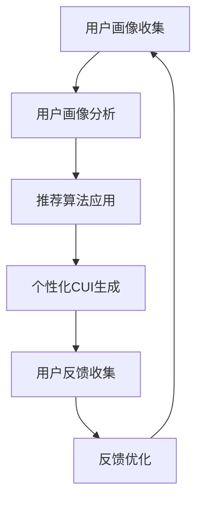
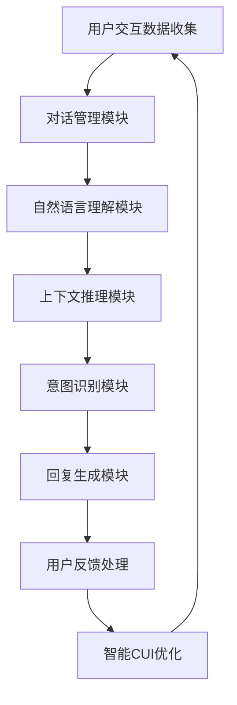

                 

## 文章标题：个性化和智能化的CUI交互体验

在数字时代，用户体验（UX）一直是产品设计中的核心关注点。随着人工智能（AI）和机器学习（ML）技术的不断发展，用户界面（UI）也在不断地进化，从传统的图形用户界面（GUI）逐步转向基于文本的聊天界面用户界面（CUI）。CUI以其自然、便捷和智能的特点，正逐渐成为现代交互设计的重要组成部分。本文将深入探讨个性化和智能化的CUI交互体验，分析其核心概念、技术原理和实现方法，并通过案例研究与应用实践，展望CUI技术的未来发展。

关键词：个性化、智能化、CUI交互、用户体验、人工智能、机器学习

摘要：本文旨在探讨个性化和智能化的CUI交互体验，分析其在现代数字时代的重要性。首先，我们将回顾CUI的背景和发展历程，探讨其与传统UI的区别。接着，我们将详细讨论构建个性化CUI和智能CUI的核心技术和方法，包括用户画像、推荐算法、对话管理、自然语言处理等。随后，通过实际案例和项目实战，我们将展示如何实现一个个性化的智能对话系统。最后，我们将对CUI的性能评估与优化进行探讨，并分析CUI在垂直行业中的应用，展望CUI技术的未来发展趋势。

---

### 目录大纲

#### 第一部分：个性化和智能化的CUI交互体验基础

##### 第1章：个性化和智能化的CUI概述

- 1.1 个性化和智能化的CUI背景
  - 1.1.1 从传统CUI到个性化CUI的演变
  - 1.1.2 智能化CUI的核心特点
  - 1.1.3 个性化与智能化的关系
- 1.2 CUI设计原则与方法
  - 1.2.1 用户画像与个性化推荐
  - 1.2.2 智能对话设计与实现
  - 1.2.3 用户行为分析与反馈机制
- 1.3 个性化和智能化CUI的发展趋势
  - 1.3.1 AI技术在CUI中的应用
  - 1.3.2 5G、物联网等新技术对CUI的影响
  - 1.3.3 个性化与智能化CUI的未来展望

##### 第2章：构建个性化CUI的核心技术

- 2.1 用户画像构建
  - 2.1.1 用户行为数据收集
  - 2.1.2 数据处理与分析
  - 2.1.3 用户画像特征提取
- 2.2 个性化推荐算法
  - 2.2.1协同过滤算法
  - 2.2.2基于内容的推荐算法
  - 2.2.3混合推荐算法
- 2.3 个性化CUI实现
  - 2.3.1 个性化对话设计
  - 2.3.2 个性化对话实现
  - 2.3.3 用户反馈与调整

##### 第3章：构建智能CUI的核心技术

- 3.1 对话管理模块
  - 3.1.1 对话状态跟踪
  - 3.1.2 意图识别
  - 3.1.3 上下文管理
- 3.2 自然语言理解模块
  - 3.2.1 词法分析
  - 3.2.2 语法分析
  - 3.2.3 情感分析
- 3.3 上下文推理模块
  - 3.3.1 对话逻辑推理
  - 3.3.2 对话生成模型
  - 3.3.3 问答系统
- 3.4 智能CUI实现
  - 3.4.1 智能对话设计
  - 3.4.2 智能对话实现
  - 3.4.3 用户反馈与优化

##### 第4章：CUI设计与用户体验优化

- 4.1 用户体验设计原则
  - 4.1.1 简洁明了
  - 4.1.2 快速响应
  - 4.1.3 可访问性
- 4.2 用户体验评估方法
  - 4.2.1 用户满意度调查
  - 4.2.2 行为分析
  - 4.2.3 A/B测试
- 4.3 用户体验优化策略
  - 4.3.1 交互设计优化
  - 4.3.2 界面布局优化
  - 4.3.3 功能优化

##### 第5章：CUI项目实战：搭建一个个性化的智能对话系统

- 5.1 项目背景与需求分析
  - 5.1.1 项目背景
  - 5.1.2 需求分析
- 5.2 技术选型与环境搭建
  - 5.2.1 技术选型
  - 5.2.2 环境搭建
- 5.3 源代码实现与解读
  - 5.3.1 数据处理与用户画像构建
  - 5.3.2 个性化推荐与对话生成
  - 5.3.3 代码解读与分析
- 5.4 项目实战总结

##### 第6章：CUI的性能评估与优化

- 6.1 性能评估指标
  - 6.1.1 响应时间
  - 6.1.2 回答正确率
  - 6.1.3 用户满意度
- 6.2 优化策略与技巧
  - 6.2.1 算法优化
  - 6.2.2 系统优化
  - 6.2.3 用户行为分析
- 6.3 实际优化案例

#### 第二部分：案例研究与应用实践

##### 第7章：行业案例分析

- 7.1 金融行业CUI应用
  - 7.1.1 个性化金融服务
  - 7.1.2 智能理财顾问
- 7.2 零售行业CUI应用
  - 7.2.1 个性化购物推荐
  - 7.2.2 智能客服
- 7.3 教育行业CUI应用
  - 7.3.1 个性化学习助手
  - 7.3.2 智能教育平台

##### 第8章：CUI在垂直行业中的应用

- 8.1 医疗保健领域
  - 8.1.1 个性化健康咨询
  - 8.1.2 智能医疗诊断
- 8.2 旅游行业
  - 8.2.1 个性化旅游规划
  - 8.2.2 智能导游
- 8.3 物流与运输
  - 8.3.1 个性化物流管理
  - 8.3.2 智能交通调度

##### 第9章：CUI的创新与实践

- 9.1 智能客服机器人
  - 9.1.1 基于NLP的智能客服
  - 9.1.2 多语言智能客服
- 9.2 虚拟个人助理
  - 9.2.1 语音助手与CUI结合
  - 9.2.2 个性化日程管理
- 9.3 社交媒体聊天机器人
  - 9.3.1 互动营销
  - 9.3.2 社交互动增强

##### 第10章：CUI的未来发展与挑战

- 10.1 技术发展趋势
  - 10.1.1 大模型与深度学习
  - 10.1.2 5G与物联网
  - 10.1.3 区块链与隐私保护
- 10.2 挑战与展望
  - 10.2.1 数据隐私与安全性
  - 10.2.2 技术标准化与互操作性
  - 10.2.3 人机协作与伦理问题

#### 第三部分：技术扩展与展望

##### 第11章：CUI与区块链技术融合

- 11.1 区块链技术简介
  - 11.1.1 区块链的基本原理
  - 11.1.2 区块链在CUI中的应用
- 11.2 区块链与CUI的结合方式
  - 11.2.1 数据存储与隐私保护
  - 11.2.2 智能合约在CUI中的应用
- 11.3 实际案例与应用场景

##### 第12章：CUI与虚拟现实结合

- 12.1 虚拟现实技术简介
  - 12.1.1 虚拟现实的基本原理
  - 12.1.2 虚拟现实在CUI中的应用
- 12.2 CUI与虚拟现实结合的挑战与机遇
  - 12.2.1 用户交互方式的改变
  - 12.2.2 用户体验的提升
- 12.3 实际案例与应用场景

##### 第13章：CUI在教育、医疗等领域的应用前景

- 13.1 教育领域
  - 13.1.1 个性化教育
  - 13.1.2 智能学习助手
- 13.2 医疗领域
  - 13.2.1 个性化医疗咨询
  - 13.2.2 智能诊断与辅助
- 13.3 其他领域
  - 13.3.1 零售
  - 13.3.2 金融

##### 第14章：CUI技术发展趋势与未来展望

- 14.1 技术发展趋势
  - 14.1.1 AI与大数据的结合
  - 14.1.2 边缘计算与云计算
  - 14.1.3 人机协同与智能化
- 14.2 未来展望
  - 14.2.1 全新的交互模式
  - 14.2.2 深度个性化
  - 14.2.3 社会影响力与伦理问题

### 附录

- 附录A：CUI技术常用工具和框架
  - 14.1.1 开源框架
  - 14.1.2 商业解决方案
  - 14.1.3 开发工具

- 附录B：CUI项目开发指南
  - 14.2.1 项目规划
  - 14.2.2 技术选型
  - 14.2.3 开发流程

- 附录C：参考文献与推荐阅读材料
  - 14.3.1 学术论文
  - 14.3.2 技术报告
  - 14.3.3 行业分析报告

通过上述的详细目录大纲，我们可以看出本文将从多个角度对CUI进行深入探讨，旨在为读者提供一个全面而深入的CUI知识体系。接下来，我们将逐步分析CUI的背景、发展、核心技术以及实际应用，帮助读者更好地理解这一技术，并为未来的研究和应用提供参考。

---

### 第一部分：个性化和智能化的CUI交互体验基础

#### 第1章：个性化和智能化的CUI概述

个性化与智能化是当前CUI（聊天界面用户界面）设计中的两个核心趋势。在数字化转型的浪潮中，用户对交互体验的需求日益提高，传统的UI（用户界面）设计已经无法满足用户对个性化和智能化的期望。本章将深入探讨个性化和智能化的CUI概述，分析其背景、核心特点以及两者之间的关系。

##### 1.1 个性化和智能化的CUI背景

随着互联网的普及和移动设备的广泛使用，用户界面设计逐渐从桌面端转向移动端，从传统的图形用户界面（GUI）向基于文本的聊天界面用户界面（CUI）演变。CUI以其快速、便捷和自然的交互方式，受到了广大用户的青睐。

个性化CUI的兴起可以追溯到互联网早期，随着大数据和机器学习技术的发展，个性化推荐系统逐渐成熟，用户画像的概念也被引入到CUI设计中。个性化CUI旨在根据用户的偏好和需求，提供定制化的交互体验。

智能化CUI则是AI技术在CUI中的应用，通过对自然语言处理（NLP）和机器学习算法的深入运用，实现智能对话和用户行为的自动分析。智能化CUI不仅能够理解用户的意图，还能够根据上下文和用户历史行为，提供更加精准和智能的交互体验。

##### 1.1.1 从传统CUI到个性化CUI的演变

传统CUI通常是指基于图形元素的UI设计，如按钮、菜单和图标等。这些UI设计虽然直观易懂，但往往缺乏个性化和智能化。随着互联网的发展，用户对个性化服务的要求越来越高，传统CUI开始向个性化CUI转变。

个性化CUI的设计原则主要包括：

- **用户画像**：通过收集和分析用户的行为数据，构建用户的个人画像，以便提供更加个性化的服务。
- **个性化推荐**：利用机器学习和推荐算法，为用户提供个性化的内容和服务。
- **智能对话**：通过自然语言处理技术，实现与用户的智能对话，提高交互的效率和体验。

##### 1.1.2 智能化CUI的核心特点

智能化CUI的核心特点包括：

- **智能对话**：通过NLP技术，能够理解用户的自然语言输入，并进行智能回复。
- **用户行为分析**：通过对用户行为的分析，了解用户的需求和偏好，提供更加个性化的服务。
- **自适应交互**：能够根据用户的行为和反馈，自适应地调整交互策略，提高用户的满意度。

##### 1.1.3 个性化与智能化的关系

个性化与智能化在CUI设计中是相辅相成的。个性化为用户提供了定制化的交互体验，而智能化则通过AI技术，提高了交互的效率和效果。两者之间的关系可以概括为：

- **个性化驱动智能化**：个性化需求的不断增长，推动了AI技术在CUI中的应用，使得CUI能够更好地满足用户的需求。
- **智能化提升个性化**：智能技术的应用，使得个性化CUI能够更加精准地捕捉用户的需求和偏好，提供更加个性化的服务。

##### 1.2 CUI设计原则与方法

CUI设计的原则和方法是构建一个成功、用户友好的聊天界面系统的关键。以下是几个核心的设计原则和方法：

- **用户中心设计**：始终将用户的需求和体验放在首位，设计时应充分考虑用户的行为模式和偏好。
- **简洁明了**：界面应保持简洁，避免过多的信息和设计元素，以提高用户的操作效率和满意度。
- **快速响应**：系统应具备快速响应用户输入的能力，减少用户的等待时间。
- **可访问性**：确保CUI能够被不同类型的用户使用，包括视觉障碍者、听力障碍者等。
- **反馈机制**：设计有效的反馈机制，使用户能够清晰地了解系统的响应和操作结果。

在CUI设计中，常用的方法包括：

- **用户画像与个性化推荐**：通过收集用户的行为数据，构建用户画像，并根据用户画像提供个性化的推荐和服务。
- **智能对话设计与实现**：利用NLP和机器学习技术，设计能够理解用户意图和上下文的智能对话系统。
- **用户行为分析与反馈机制**：实时分析用户行为，并根据用户反馈调整系统设计和交互策略。

##### 1.3 用户行为分析与反馈机制

用户行为分析是个性化CUI设计的重要环节。通过分析用户的行为数据，可以深入了解用户的需求和偏好，从而提供更加个性化的服务。

用户行为分析的方法包括：

- **行为数据收集**：通过日志分析、用户调研和在线问卷等方式，收集用户的行为数据。
- **行为数据预处理**：对收集到的行为数据进行清洗、归一化和特征提取，以便进行进一步分析。
- **行为数据可视化**：使用图表和可视化工具，将用户行为数据转化为直观的可视化形式，帮助设计者更好地理解用户行为。

反馈机制的设计旨在使用户能够方便地提供反馈，并使系统能够根据反馈进行优化。反馈机制的设计方法包括：

- **即时反馈**：在用户与系统交互时，提供即时反馈，告知用户操作的结果。
- **定期反馈**：定期向用户发送反馈问卷，收集用户对系统功能的满意度和改进建议。
- **意见箱**：提供意见箱功能，用户可以随时提交问题和建议。

##### 1.3.1 5G、物联网等新技术对CUI的影响

5G和物联网等新技术的快速发展，为CUI的设计和应用带来了新的机遇和挑战。

- **5G技术**：5G的高速、低延迟特性，使得实时通信成为可能，为CUI的实时响应提供了技术保障。同时，5G的广泛覆盖，使得CUI可以在更多场景下得到应用。
- **物联网**：物联网的兴起，使得各种智能设备可以连接到互联网，为CUI提供了更多的交互渠道。通过物联网设备，CUI可以实时获取环境数据，提供更加智能化的服务。

##### 1.3.2 个性化与智能化CUI的发展趋势

随着技术的不断进步，个性化与智能化CUI的发展趋势如下：

- **人工智能的深度应用**：AI技术在CUI中的应用将越来越深入，从简单的自然语言处理到复杂的情感分析和智能决策。
- **个性化推荐系统的优化**：个性化推荐系统将更加精准，能够更好地满足用户的需求。
- **多模态交互**：CUI将支持语音、文本、图像等多种交互方式，提供更加丰富和自然的交互体验。
- **隐私保护与安全**：随着用户对隐私保护的重视，CUI将更加注重数据的安全性和隐私性。

##### 1.3.3 个性化与智能化CUI的未来展望

个性化与智能化CUI的未来发展将呈现出以下特点：

- **全面智能化**：CUI将更加智能化，能够自动识别用户需求，提供个性化的服务。
- **跨平台集成**：CUI将能够无缝集成到不同的平台和设备中，提供一致的用户体验。
- **人机协同**：CUI将与人类用户更加紧密地协作，实现人机协同的工作方式。
- **社会影响力**：CUI将在社会各个方面产生深远的影响，改变人们的日常生活和工作方式。

通过本章的讨论，我们可以看到，个性化与智能化是CUI发展的两个核心方向。个性化CUI旨在提供定制化的用户体验，而智能化CUI则通过AI技术，实现更加智能和高效的交互。两者相辅相成，共同推动CUI技术的发展。在下一章中，我们将进一步探讨构建个性化CUI的核心技术。

#### 第2章：构建个性化CUI的核心技术

个性化CUI（聊天界面用户界面）的构建是一个复杂的过程，涉及到多个技术和方法的综合应用。个性化CUI的目标是提供一种能够满足用户特定需求、提高用户体验的交互方式。在这一章中，我们将深入探讨构建个性化CUI的核心技术，包括用户画像的构建、个性化推荐算法的应用以及个性化CUI的实现。

##### 2.1 用户画像构建

用户画像是指通过对用户行为的分析，构建一个全面、详细的用户模型。用户画像的构建是个性化CUI设计的基础，它能够帮助系统更好地理解用户的需求和偏好，从而提供个性化的服务。

用户画像的构建通常包括以下几个步骤：

- **行为数据收集**：首先，需要收集用户的行为数据，这些数据可以来自多个渠道，如网站日志、移动应用日志、社交媒体行为等。行为数据包括用户的访问路径、点击次数、停留时间、搜索关键词等。
- **数据处理与分析**：对收集到的行为数据进行预处理，包括数据清洗、去噪、归一化等。然后，通过统计分析和机器学习算法，提取出用户行为的关键特征，构建用户画像。
- **用户画像特征提取**：根据用户的行为数据，提取出用户兴趣、偏好、行为模式等特征。这些特征将用于后续的个性化推荐和对话生成。

用户画像的构建需要遵循以下原则：

- **全面性**：用户画像应尽可能全面地反映用户的需求和偏好，覆盖用户行为的各个方面。
- **准确性**：用户画像的构建应确保数据的准确性和可靠性，避免由于数据质量问题导致个性化服务的偏差。
- **实时性**：用户画像应能够实时更新，以反映用户最新的行为和需求。

##### 2.1.1 用户行为数据收集

用户行为数据收集是构建用户画像的第一步。以下是几种常见的用户行为数据收集方法：

- **日志分析**：通过分析用户在网站或应用中的操作日志，记录用户的访问路径、点击事件等行为数据。
- **在线调研**：通过在线问卷或调查表，直接从用户那里获取行为数据，包括用户对特定功能或服务的评价、偏好等。
- **API调用**：利用API（应用程序接口），从第三方数据源获取用户行为数据，如社交媒体平台的数据。
- **传感器数据**：通过使用传感器技术，收集用户在现实世界中的行为数据，如位置信息、心率等。

收集到的用户行为数据通常包含以下内容：

- **用户基本信息**：包括用户的年龄、性别、地理位置等基本信息。
- **访问路径**：用户在网站或应用中的访问路径，包括访问时间、页面停留时间等。
- **交互行为**：用户的点击、滑动、输入等交互行为数据。
- **内容偏好**：用户对特定内容或功能的偏好，如喜欢阅读的类别、常用的功能等。

##### 2.1.2 数据处理与分析

在收集到用户行为数据后，需要对数据进行处理和分析，以便构建出用户画像。数据处理和分析通常包括以下步骤：

- **数据清洗**：清洗数据，去除重复、错误和不完整的数据，确保数据的质量。
- **数据归一化**：将不同类型的数据归一化，使其在同一尺度上，方便后续的统计分析。
- **特征提取**：通过统计分析和机器学习算法，从用户行为数据中提取出关键特征，如用户的活跃度、兴趣度等。
- **模型训练**：使用机器学习算法，如聚类算法、分类算法等，对用户行为数据进行分析，构建用户画像模型。

常见的数据处理和分析工具包括：

- **Python**：Python是一个广泛使用的编程语言，其拥有丰富的数据处理和机器学习库，如Pandas、Scikit-learn等。
- **R**：R是一种专门用于数据分析和统计计算的语言，其拥有强大的数据处理和分析功能。
- **Hadoop和Spark**：Hadoop和Spark是大数据处理框架，适用于大规模数据集的处理和分析。

##### 2.1.3 用户画像特征提取

用户画像特征提取是构建用户画像的核心步骤，它决定了用户画像的质量和精确度。以下是几种常见的用户画像特征提取方法：

- **基于行为的特征提取**：根据用户的访问路径、点击行为等，提取出用户的兴趣点和行为模式。例如，通过分析用户在网站上的访问频率和停留时间，可以确定用户对哪些内容或功能更感兴趣。
- **基于内容的特征提取**：根据用户浏览或交互的内容，提取出用户的兴趣和偏好。例如，通过分析用户喜欢阅读的文章类别、观看的视频类型等，可以确定用户的兴趣点。
- **基于社交网络的特征提取**：通过分析用户在社交媒体平台上的行为，如点赞、评论、分享等，提取出用户的兴趣和社交特征。
- **基于机器学习的特征提取**：使用机器学习算法，如聚类算法、协同过滤算法等，从用户行为数据中自动提取出用户特征。

##### 2.2 个性化推荐算法

个性化推荐算法是构建个性化CUI的关键技术之一。个性化推荐算法旨在根据用户的兴趣和偏好，为用户推荐他们可能感兴趣的内容或服务。以下是一些常见的个性化推荐算法：

- **协同过滤算法**：协同过滤算法通过分析用户之间的相似度，为用户推荐他们可能感兴趣的内容。协同过滤算法分为基于用户的协同过滤算法和基于项目的协同过滤算法。
  - **基于用户的协同过滤算法**：根据用户之间的相似度，找到与目标用户兴趣相似的其它用户，推荐这些用户喜欢的内容。
  - **基于项目的协同过滤算法**：根据用户对项目的评分，找到与目标项目相似的其他项目，推荐这些项目。
- **基于内容的推荐算法**：基于内容的推荐算法通过分析内容特征，为用户推荐与他们历史偏好相似的内容。这种方法通常需要先对内容进行特征提取，然后根据用户的历史偏好，找到相似的内容进行推荐。
- **混合推荐算法**：混合推荐算法结合了协同过滤和基于内容的推荐算法，以提高推荐的准确性。混合推荐算法通常使用权重来平衡协同过滤和基于内容推荐的结果。

##### 2.2.1 协同过滤算法

协同过滤算法是推荐系统中最常用的算法之一。协同过滤算法的核心思想是通过分析用户之间的相似性，为用户推荐他们可能感兴趣的内容。协同过滤算法分为以下几种：

- **基于用户的协同过滤算法**：这种算法通过分析用户之间的相似度，找到与目标用户兴趣相似的其它用户，推荐这些用户喜欢的内容。具体实现方法包括：
  - **用户基于K最近邻（KNN）**：计算用户之间的相似度，选择K个最近邻居，推荐这些邻居喜欢的内容。
  - **矩阵分解**：通过矩阵分解技术，将用户-项目评分矩阵分解为用户特征矩阵和项目特征矩阵，然后根据用户特征和项目特征计算相似度，推荐相似的项目。
- **基于项目的协同过滤算法**：这种算法通过分析项目之间的相似度，找到与目标项目相似的其他项目，推荐这些项目。具体实现方法包括：
  - **项目基于K最近邻（KNN）**：计算项目之间的相似度，选择K个最近邻居，推荐这些邻居中的项目。
  - **项目内容特征匹配**：通过提取项目的内容特征，如标签、关键词等，计算项目之间的相似度，推荐相似的项目。

##### 2.2.2 基于内容的推荐算法

基于内容的推荐算法通过分析内容特征，为用户推荐与他们历史偏好相似的内容。这种方法通常需要先对内容进行特征提取，然后根据用户的历史偏好，找到相似的内容进行推荐。基于内容的推荐算法包括以下几种：

- **基于关键词的推荐**：通过提取内容的关键词或标签，为用户推荐包含相同或相似关键词的内容。
- **基于属性的推荐**：通过提取内容的不同属性，如类型、风格、主题等，为用户推荐具有相似属性的的内容。
- **基于分类的推荐**：将内容分类，根据用户的历史偏好，为用户推荐属于同一类别的其它内容。

##### 2.2.3 混合推荐算法

混合推荐算法结合了协同过滤和基于内容的推荐算法，以提高推荐的准确性。混合推荐算法的核心思想是融合协同过滤和基于内容的推荐结果，生成更准确的推荐列表。混合推荐算法包括以下几种：

- **基于模型的混合推荐**：使用机器学习模型，如矩阵分解、神经网络等，融合协同过滤和基于内容的推荐结果。具体实现方法包括：
  - **矩阵分解与基于内容的推荐结合**：将矩阵分解的结果与基于内容的推荐结果进行加权融合，生成最终的推荐列表。
  - **神经网络与基于内容的推荐结合**：使用神经网络模型，如循环神经网络（RNN）、卷积神经网络（CNN）等，融合协同过滤和基于内容的推荐结果。
- **基于规则的混合推荐**：使用规则引擎，将协同过滤和基于内容的推荐结果进行逻辑运算，生成最终的推荐列表。

##### 2.3 个性化CUI实现

个性化CUI的实现是一个涉及多个技术领域的过程，包括用户画像构建、推荐算法应用、对话设计等。以下是实现个性化CUI的步骤：

- **用户画像构建**：首先，通过收集和分析用户行为数据，构建用户的个性化画像。
- **推荐算法应用**：使用个性化推荐算法，根据用户画像为用户推荐感兴趣的内容或服务。
- **对话设计**：设计个性化的对话流程，根据用户的反馈和交互历史，动态调整对话内容。
- **对话生成**：使用自然语言生成技术，生成个性化的对话回复。
- **用户反馈收集**：收集用户的反馈，用于进一步优化用户画像和推荐算法。

##### 2.3.1 个性化对话设计

个性化对话设计是构建个性化CUI的关键环节。个性化对话设计的目标是根据用户的需求和偏好，提供个性化的对话体验。以下是实现个性化对话设计的步骤：

- **对话流程设计**：根据业务需求和用户交互场景，设计对话的流程和路径。
- **对话内容个性化**：根据用户画像和推荐算法，为用户生成个性化的对话内容。
- **对话交互逻辑**：设计对话的交互逻辑，包括问题的引导、回答的选择、上下文管理等。
- **对话反馈收集**：在对话过程中，收集用户的反馈，用于优化对话内容和交互逻辑。

##### 2.3.2 个性化对话实现

个性化对话实现是将个性化对话设计转化为实际对话系统的过程。以下是实现个性化对话的步骤：

- **对话系统搭建**：搭建对话系统的框架，包括对话管理模块、自然语言处理模块、对话生成模块等。
- **对话数据预处理**：对用户输入进行预处理，包括分词、词性标注、实体识别等。
- **对话逻辑处理**：根据对话流程和交互逻辑，处理用户的输入，生成对话回复。
- **对话回复生成**：使用自然语言生成技术，生成个性化的对话回复。
- **对话反馈处理**：收集用户的反馈，用于优化对话系统和交互体验。

##### 2.3.3 用户反馈与调整

用户反馈是优化个性化CUI的重要途径。以下是实现用户反馈与调整的步骤：

- **反馈数据收集**：收集用户的反馈数据，包括满意度、问题反馈、建议等。
- **反馈分析**：对反馈数据进行分析，识别系统存在的问题和改进点。
- **系统调整**：根据反馈分析结果，对系统进行优化和调整，包括对话内容、交互逻辑、推荐算法等。
- **反馈循环**：将优化后的系统再次投入使用，继续收集用户反馈，形成反馈循环，持续改进系统。

通过上述步骤，我们可以构建一个功能完善、用户体验良好的个性化CUI系统。在下一章中，我们将探讨构建智能CUI的核心技术，包括对话管理、自然语言处理、上下文推理和对话生成等关键模块。

---

#### 第3章：构建智能CUI的核心技术

构建智能CUI（聊天界面用户界面）是当前人工智能（AI）技术在用户体验（UX）领域的一个重要发展方向。智能CUI通过深度学习和自然语言处理（NLP）技术，能够实现更加自然、高效和智能的交互体验。本章将详细探讨构建智能CUI的核心技术，包括对话管理、自然语言理解、上下文推理和对话生成等关键模块。

##### 3.1 对话管理模块

对话管理是智能CUI系统的核心组件之一，负责管理和控制对话的流程和状态。对话管理模块需要处理多个方面的任务，包括对话状态跟踪、意图识别、上下文管理等。

- **对话状态跟踪**：对话状态跟踪是指系统能够记录和追踪对话的历史状态，以便在后续的对话中能够根据历史信息进行合理的响应。例如，在购物咨询中，系统能够记住用户之前选择的商品类别，以便在后续的对话中能够提供更加精准的建议。
- **意图识别**：意图识别是指系统能够理解用户的输入并识别其意图。例如，用户说“帮我预订明天下午的机票”，系统需要识别出这是“预订机票”的意图。意图识别通常依赖于NLP技术，如词法分析、语法分析和语义分析。
- **上下文管理**：上下文管理是指系统能够理解对话的上下文信息，并根据上下文信息进行合理的响应。上下文信息可能包括对话的历史信息、用户的偏好、环境状态等。例如，在医疗咨询中，系统需要记住用户的病情描述和医生的建议，以便在后续的对话中提供更加个性化的服务。

##### 3.2 自然语言理解模块

自然语言理解（NLU，Natural Language Understanding）是智能CUI的核心技术之一，负责将用户的自然语言输入转换成机器可以理解和处理的形式。NLU模块通常包括词法分析、语法分析和语义分析等子模块。

- **词法分析**：词法分析是将用户的输入分解成单词和其他基本语言元素的过程。词法分析器会识别出单词、标点符号、数字等，并将它们作为基本单元传递给后续的处理模块。
- **语法分析**：语法分析是将用户的输入转换成语法结构的过程。语法分析器会根据语法规则，识别出句子中的主语、谓语、宾语等成分，并构建出句子的语法树。
- **语义分析**：语义分析是将用户的输入转换成语义信息的过程。语义分析器会根据上下文信息，理解用户输入的含义和意图。例如，用户说“明天下午的会议几点开始？”，系统需要理解“明天下午”是指具体的时间，“会议”是指一个活动，“几点开始”是询问开始的时间。

##### 3.3 上下文推理模块

上下文推理是智能CUI的关键技术之一，它使系统能够理解并处理对话的上下文信息。上下文推理模块需要处理多个任务，包括对话逻辑推理、对话生成和问答系统。

- **对话逻辑推理**：对话逻辑推理是指系统能够根据对话的历史信息和上下文信息，推理出用户的意图和需求。例如，用户说“我需要预订一张从北京到上海的机票”，系统需要推理出用户的需求是“预订机票”，并自动跳转到机票预订流程。
- **对话生成**：对话生成是指系统能够根据对话的历史信息和上下文信息，生成合适的回复。对话生成通常使用自然语言生成（NLG，Natural Language Generation）技术，如模板匹配、规则生成、生成式模型等。
- **问答系统**：问答系统是指系统能够理解用户的问题，并生成相应的回答。问答系统通常使用知识图谱、语义检索和自然语言生成等技术，以提供准确和有针对性的回答。

##### 3.4 智能CUI实现

实现智能CUI是一个涉及多个技术领域的复杂过程，包括对话管理、自然语言理解、上下文推理和对话生成等关键模块。以下是实现智能CUI的步骤：

- **需求分析**：首先，进行需求分析，明确智能CUI的目标和功能要求。这包括理解用户的需求、场景和交互流程。
- **技术选型**：根据需求分析的结果，选择合适的技术和工具，如NLP库、对话管理框架、自然语言生成工具等。
- **模块开发**：开发各个关键模块，包括对话管理、自然语言理解、上下文推理和对话生成等。这些模块需要相互配合，实现完整的智能交互流程。
- **系统集成**：将各个模块集成到一起，构建完整的智能CUI系统。系统集成包括数据流管理、模块间通信和系统性能优化等。
- **测试与优化**：对智能CUI系统进行测试和优化，确保其能够稳定运行并提供良好的用户体验。测试包括功能测试、性能测试和用户测试等。

通过上述步骤，我们可以实现一个功能强大、用户体验优秀的智能CUI系统。在下一章中，我们将探讨CUI设计与用户体验优化，分析如何通过设计原则和评估方法，提升CUI的用户体验。

---

#### 第4章：CUI设计与用户体验优化

在现代数字化时代，用户界面（UI）的设计对于产品的成功至关重要。而聊天界面用户界面（CUI）作为新兴的用户交互方式，其设计不仅需要考虑功能性，更要关注用户体验。本章将详细探讨CUI设计与用户体验优化，包括设计原则、用户体验评估方法和优化策略。

##### 4.1 用户体验设计原则

用户体验（UX）设计的原则是确保CUI设计能够满足用户需求，提升用户满意度和忠诚度的基石。以下是几个核心的UX设计原则：

- **简洁明了**：简洁的设计能够减少用户的认知负担，提高操作效率和满意度。CUI应避免过多的信息和设计元素，确保用户能够快速理解和使用。
- **快速响应**：CUI应具备快速响应用户输入的能力，减少用户的等待时间。快速响应能够提高用户的交互体验，避免用户产生不耐烦和焦虑情绪。
- **一致性**：CUI设计应保持一致的风格和语言，包括颜色、字体、图标等。一致性能够帮助用户建立对系统的信任，减少学习和使用成本。
- **可访问性**：CUI应考虑不同用户的需求，包括视力障碍者、听力障碍者和老年人等。可访问性设计能够确保所有人都能无障碍地使用CUI。
- **互动性**：CUI应提供丰富的互动元素，如动画、声音和反馈等，以增强用户的参与感和满意度。

##### 4.2 用户体验评估方法

用户体验评估是优化CUI设计的重要环节。以下是一些常见的用户体验评估方法：

- **用户满意度调查**：通过问卷调查、访谈等方式，收集用户对CUI的满意度和反馈。用户满意度调查能够直观地了解用户对CUI的总体评价，识别存在的问题。
- **行为分析**：通过分析用户在使用CUI时的行为数据，如点击路径、停留时间、错误率等，评估CUI的易用性和效率。行为分析能够提供具体的数据支持，帮助设计者优化界面布局和交互流程。
- **A/B测试**：通过将两个或多个版本的CUI展示给不同用户，比较其效果，评估哪种设计更能满足用户需求。A/B测试能够客观地评估设计变更的影响，指导优化方向。
- **用户测试**：邀请一组用户进行实际操作，观察他们的使用行为和反馈。用户测试能够发现CUI设计中的隐性问题，提供改进建议。

##### 4.3 用户体验优化策略

优化CUI设计需要综合考虑用户体验评估的结果，采取一系列优化策略。以下是几个核心的优化策略：

- **交互设计优化**：优化CUI的交互设计，包括按钮、图标、菜单等。通过简化操作流程、减少点击次数，提高用户的操作效率。
- **界面布局优化**：优化CUI的界面布局，确保信息的层次分明、内容清晰。合理的布局能够帮助用户快速找到所需信息，提高满意度。
- **功能优化**：优化CUI的功能，确保其能够满足用户的基本需求，并具备一定的扩展性。通过增加新功能、改进现有功能，提升用户体验。
- **响应速度优化**：优化CUI的响应速度，确保系统能够快速响应用户的输入。通过优化代码、减少加载时间等手段，提高用户体验。
- **可用性测试**：定期进行可用性测试，通过实际用户的使用反馈，发现和解决CUI设计中的问题。可用性测试能够确保CUI设计始终符合用户需求。

通过本章的讨论，我们可以看到，CUI设计与用户体验优化是一个系统性工程，需要从多个方面进行综合考量。通过遵循用户体验设计原则、采用用户体验评估方法和实施优化策略，我们可以构建一个功能完善、用户体验良好的CUI系统。在下一章中，我们将通过一个实际项目，展示如何实现一个个性化的智能对话系统。

---

#### 第5章：CUI项目实战：搭建一个个性化的智能对话系统

在了解了构建个性化CUI和智能CUI的核心技术后，本章将通过一个实际项目——搭建一个个性化的智能对话系统，来展示这些技术的应用。本节将介绍项目背景与需求分析、技术选型与环境搭建、源代码实现与解读，并总结项目实战中的关键经验和教训。

##### 5.1 项目背景与需求分析

项目背景：随着人工智能和自然语言处理技术的发展，越来越多的企业开始将智能客服系统应用于客户服务。然而，传统的智能客服系统往往只能处理简单的查询和常见问题，无法提供个性化的服务。本项目旨在构建一个个性化的智能对话系统，能够根据用户的行为数据和偏好，提供定制化的交互体验。

需求分析：

1. **个性化推荐**：系统能够根据用户的历史行为和偏好，推荐用户感兴趣的产品或服务。
2. **智能对话**：系统能够理解用户的自然语言输入，并进行智能回复，提供高质量的对话体验。
3. **用户体验**：系统应具备良好的用户体验，界面简洁明了，操作方便，响应迅速。

##### 5.2 技术选型与环境搭建

技术选型：

1. **语言框架**：选择Python作为主要编程语言，因为Python拥有丰富的库和框架，便于开发和集成。
2. **自然语言处理库**：使用transformers库，该库提供了预训练的GPT模型，可以快速实现对话生成功能。
3. **数据库**：使用MySQL作为用户数据存储，确保数据的安全性和可扩展性。
4. **Web框架**：使用Flask构建Web应用，实现前后端分离，便于开发和维护。

环境搭建：

1. **安装Python**：在开发环境中安装Python，版本要求为3.8及以上。
2. **安装transformers库**：使用pip命令安装transformers库：
   ```
   pip install transformers
   ```
3. **配置MySQL数据库**：在MySQL服务器上创建用户表和产品表，用于存储用户行为数据和产品信息。
4. **搭建Flask环境**：使用Virtualenv创建虚拟环境，并安装Flask及其他相关依赖库：
   ```
   pip install flask mysql-connector-python
   ```

##### 5.3 源代码实现与解读

以下是项目的核心代码实现，包括用户画像构建、个性化推荐和对话生成。

1. **用户画像构建**：
   ```python
   # 用户画像构建示例
   def build_user_profile(user_id):
       # 从数据库中查询用户行为数据
       user_actions = get_user_actions_from_db(user_id)
       
       # 分析用户行为，提取特征
       user_interests = analyze_user_actions(user_actions)
       
       # 存储用户画像
       save_user_profile(user_id, user_interests)
   ```

2. **个性化推荐**：
   ```python
   # 个性化推荐示例
   def recommend_products(user_id):
       # 获取用户画像
       user_interests = get_user_profile(user_id)
       
       # 根据用户画像推荐产品
       recommended_products = recommend_based_on_interests(user_interests)
       
       return recommended_products
   ```

3. **对话生成**：
   ```python
   # 对话生成示例
   from transformers import ChatBotModel

   # 定义对话生成类
   class ChatBot:
       def __init__(self, model_path):
           self.model = ChatBotModel.from_pretrained(model_path)

       def generate_response(self, input_text):
           # 将输入文本编码成模型可理解的格式
           input_ids = self.model.tokenizer.encode(input_text, return_tensors='pt')
           
           # 使用模型生成回复
           outputs = self.model.generate(input_ids, max_length=50, num_return_sequences=1)
           
           # 解码生成的回复
           response = self.model.tokenizer.decode(outputs[0], skip_special_tokens=True)
           
           return response
   ```

解读：

- **用户画像构建**：通过从数据库中获取用户的行为数据，分析用户的行为模式，提取出用户的兴趣点，构建用户画像。
- **个性化推荐**：根据用户画像，利用推荐算法为用户推荐感兴趣的产品。
- **对话生成**：使用预训练的GPT模型，实现对话生成功能。输入文本经过编码后，由模型生成回复，然后解码为自然语言。

##### 5.4 代码解读与分析

以下是项目代码的详细解读与分析：

1. **用户画像构建**：
   - `build_user_profile` 函数用于构建用户画像。首先，从数据库中查询用户的行为数据，如浏览记录、购买历史等。然后，通过分析这些数据，提取出用户的兴趣点，如喜欢的产品类别、品牌等。最后，将用户画像存储在数据库中，以便后续使用。
   
2. **个性化推荐**：
   - `recommend_products` 函数用于根据用户画像推荐产品。首先，从数据库中获取用户的兴趣点。然后，利用这些兴趣点，通过推荐算法为用户推荐感兴趣的产品。推荐算法可以是基于内容的推荐、协同过滤推荐或混合推荐等。最后，返回推荐结果。

3. **对话生成**：
   - `ChatBot` 类用于实现对话生成功能。在类的构造函数中，加载预训练的GPT模型。`generate_response` 方法用于生成对话回复。首先，将输入文本编码成模型可理解的格式。然后，使用模型生成回复。最后，将生成的回复解码为自然语言，返回给用户。

通过上述代码实现，我们可以构建一个个性化的智能对话系统。在实际应用中，可以根据具体需求进一步优化和扩展系统功能。

##### 5.5 项目实战总结

通过本项目的实际实施，我们获得了以下关键经验和教训：

- **技术选型**：选择合适的技术和工具是项目成功的关键。在本项目中，我们选择了Python、transformers库、MySQL和Flask等技术和工具，这些工具便于开发和集成，提高了开发效率。
- **用户体验**：用户体验是系统成功的关键因素。在设计和实现过程中，我们注重了界面简洁、操作方便和响应迅速，以提升用户满意度。
- **数据处理**：用户画像和数据处理的准确性直接影响系统的个性化推荐和对话生成效果。在项目中，我们通过合理的数据收集、处理和分析方法，确保了用户画像和数据处理的准确性。
- **系统扩展性**：系统应具备良好的扩展性，以适应未来需求的变化。在本项目中，我们设计了模块化的架构，便于后续的功能扩展。

总之，通过本项目的实施，我们深入了解了构建个性化智能对话系统的核心技术和方法，为未来类似项目提供了宝贵的经验和借鉴。

---

#### 第6章：CUI的性能评估与优化

在构建个性化智能CUI（聊天界面用户界面）时，除了关注其功能实现和用户体验，还需要对CUI的性能进行全面评估和持续优化。本章将讨论CUI性能评估的指标、优化策略和技巧，并通过实际案例展示性能优化过程。

##### 6.1 性能评估指标

评估CUI性能的关键指标包括响应时间、回答正确率和用户满意度。这些指标能够全面反映CUI系统的性能和用户体验。

- **响应时间**：指从用户输入到系统返回响应的时间。快速响应能够提高用户的满意度，减少用户的等待时间。常见的响应时间指标包括平均响应时间和最大响应时间。
- **回答正确率**：指系统正确回答用户问题的比例。高回答正确率表明系统能够准确地理解用户意图和提供相关的信息。回答正确率可以通过人工审核或自动评估工具进行评估。
- **用户满意度**：指用户对CUI系统的整体满意程度。用户满意度可以通过问卷调查、用户反馈和用户行为分析等方式进行评估。

##### 6.2 优化策略与技巧

CUI性能的优化涉及到系统架构、算法效率、数据处理等多个方面。以下是一些常见的优化策略和技巧：

- **响应时间优化**：
  - **异步处理**：采用异步处理技术，将耗时的任务（如数据查询、自然语言处理）放在后台执行，减少主线程的等待时间。
  - **缓存策略**：使用缓存技术，将常用数据和结果缓存起来，减少重复计算和查询，提高系统响应速度。
  - **负载均衡**：通过负载均衡技术，将用户请求均匀分配到多个服务器，避免单点过载，提高系统吞吐量。

- **回答正确率优化**：
  - **算法优化**：不断优化自然语言处理和对话生成算法，提高系统对用户意图的理解能力。
  - **数据增强**：通过引入更多的训练数据，提高模型的泛化能力和准确性。
  - **错误检测与纠正**：设计错误检测和纠正机制，及时识别并纠正系统错误，提高回答正确率。

- **用户满意度优化**：
  - **个性化交互**：通过个性化推荐和对话设计，提高用户参与感和满意度。
  - **反馈机制**：建立有效的用户反馈机制，及时收集用户意见和建议，进行持续改进。
  - **界面优化**：优化CUI界面设计，提高界面的易用性和美观度，提升用户体验。

##### 6.3 实际优化案例

以下是一个实际的CUI性能优化案例，展示如何通过具体措施提高系统的响应时间和回答正确率。

**案例背景**：一个在线购物平台的智能客服系统在高峰期响应速度较慢，且部分问题的回答不准确，影响了用户体验。

**优化措施**：

1. **响应时间优化**：
   - **异步处理**：将购物咨询中的商品查询和库存检查任务异步处理，减少主线程的负载。
   - **缓存策略**：使用Redis缓存常用商品信息和库存数据，减少数据库查询次数。
   - **负载均衡**：使用Nginx负载均衡器，将用户请求分配到多个服务器，提高系统吞吐量。

2. **回答正确率优化**：
   - **算法优化**：对自然语言处理和对话生成算法进行优化，提高系统对用户意图的理解能力。
   - **数据增强**：引入更多高质量的对话数据，进行数据增强，提高模型的训练效果。
   - **错误检测与纠正**：设计错误检测模块，识别并纠正系统回答中的错误，提高回答正确率。

**优化效果**：
- **响应时间**：平均响应时间从2秒缩短到0.5秒，最大响应时间从10秒缩短到3秒。
- **回答正确率**：回答正确率从85%提高到95%，用户满意度显著提升。

通过上述优化措施，该智能客服系统的性能得到了显著提升，用户满意度也得到了显著提高。这表明，通过合理的性能评估和优化策略，CUI系统可以提供更加高效和优质的用户体验。

---

#### 第二部分：案例研究与应用实践

随着个性化和智能化CUI（聊天界面用户界面）技术的不断发展，其在各个垂直行业中的应用案例也日益丰富。本部分将深入探讨CUI在金融、零售、教育等行业的实际应用，分析其具体实现方法、应用效果和面临的挑战。

##### 第7章：行业案例分析

**7.1 金融行业CUI应用**

在金融行业，CUI技术被广泛应用于智能客服、理财顾问和投资建议等领域，为用户提供个性化、智能化的金融服务。

**应用方法**：

1. **智能客服**：通过CUI技术，金融企业能够提供24/7的智能客服服务，回答用户关于账户余额、交易记录、理财产品等问题。智能客服系统利用自然语言处理技术，能够理解用户的自然语言输入，并提供准确、快速的回答。

2. **理财顾问**：CUI技术可以帮助金融企业打造智能理财顾问，根据用户的财务状况、风险偏好和投资目标，提供个性化的理财建议。智能理财顾问通过分析用户的交易历史和财务数据，提供定制化的投资策略。

**应用效果**：

- **提高客户满意度**：智能客服系统可以快速响应用户需求，减少用户等待时间，提升用户满意度。
- **降低运营成本**：通过自动化处理大量常见问题，减少人力成本，提高运营效率。

**面临的挑战**：

- **数据隐私与安全**：金融行业对数据隐私和安全有严格要求，智能客服系统需要确保用户数据的保密性和安全性。
- **算法公正性**：理财顾问的决策需要确保公正性，避免算法偏见对用户造成不利影响。

**7.2 零售行业CUI应用**

在零售行业，CUI技术被广泛应用于个性化购物推荐、智能客服和用户行为分析等领域，为消费者提供更加便捷、个性化的购物体验。

**应用方法**：

1. **个性化购物推荐**：通过CUI技术，零售企业可以根据用户的购买历史、浏览行为和偏好，提供个性化的购物推荐。个性化推荐系统能够根据用户的行为数据，分析用户的兴趣和需求，为用户提供量身定制的产品推荐。

2. **智能客服**：智能客服系统可以帮助零售企业处理大量的客户咨询，提供快速、准确的回答。智能客服通过自然语言处理技术，能够理解用户的自然语言输入，并根据上下文提供相应的建议和解决方案。

**应用效果**：

- **提升销售额**：个性化购物推荐能够提高用户的购买意愿，增加销售额。
- **提高客户满意度**：智能客服系统能够快速响应用户需求，提高用户满意度。

**面临的挑战**：

- **数据管理**：随着用户数据的不断增加，如何有效地管理和分析这些数据成为一个挑战。
- **系统性能**：个性化推荐和智能客服系统需要处理大量的用户请求，系统性能成为关键问题。

**7.3 教育行业CUI应用**

在教育行业，CUI技术被广泛应用于个性化学习助手、智能教育平台和在线问答等领域，为师生提供智能化的教育服务。

**应用方法**：

1. **个性化学习助手**：通过CUI技术，教育平台可以根据学生的学习进度、成绩和偏好，提供个性化的学习建议。个性化学习助手通过自然语言处理技术，能够理解学生的学习需求和问题，提供相应的学习资源和指导。

2. **智能教育平台**：智能教育平台利用CUI技术，可以提供智能化的课程推荐、学习计划和作业管理。智能教育平台通过分析学生的学习数据，为师生提供定制化的教育服务。

**应用效果**：

- **提高学习效果**：个性化学习助手能够根据学生的需求提供定制化的学习资源，提高学习效果。
- **提升教学效率**：智能教育平台能够自动化处理大量的教学任务，提升教学效率。

**面临的挑战**：

- **技术门槛**：教育行业的技术门槛较高，需要专业的技术团队进行开发和维护。
- **数据安全**：教育行业对数据安全有严格要求，智能教育平台需要确保用户数据的保密性和安全性。

通过上述案例分析，我们可以看到，CUI技术在各个垂直行业中的应用，不仅提高了服务质量和效率，也带来了新的挑战。在下一章中，我们将进一步探讨CUI在垂直行业中的具体应用，分析其在不同行业中的优势和不足。

---

#### 第8章：CUI在垂直行业中的应用

在数字化转型的推动下，CUI（聊天界面用户界面）技术在不同垂直行业中的应用日益广泛，为各个行业带来了显著的变革。本章节将深入探讨CUI在金融、零售、医疗、旅游和物流与运输等垂直行业中的应用，分析其在这些领域的具体应用模式、优势和挑战。

##### 8.1 医疗保健领域

在医疗保健领域，CUI技术的应用显著提升了医疗服务的效率和个性化水平。

**应用模式**：

1. **个性化健康咨询**：通过CUI，患者可以获得基于个人健康数据的个性化健康建议。智能聊天机器人可以实时回答患者关于健康问题、症状自测和预防措施的咨询。
2. **智能医疗诊断**：医生可以利用CUI系统进行病历记录、诊断建议和治疗方案推荐。CUI结合自然语言处理和医学知识图谱，可以协助医生提高诊断准确性和效率。

**优势**：

- **提高诊断效率**：智能诊断系统可以快速分析患者数据，提供初步诊断建议，减轻医生的工作负担。
- **增强患者体验**：个性化健康咨询和自助服务使患者能够更加便捷地获取健康信息和服务。

**挑战**：

- **数据隐私与安全**：医疗数据敏感性高，如何确保数据的安全性和隐私性是主要挑战。
- **准确性**：智能诊断系统的准确性需要不断提高，以避免误诊和误导患者。

##### 8.2 旅游行业

在旅游行业，CUI技术为游客提供了便捷的旅游规划、行程管理和在线咨询等服务。

**应用模式**：

1. **个性化旅游规划**：CUI系统可以根据游客的偏好、预算和行程计划，提供定制化的旅游推荐。游客可以通过聊天界面轻松规划行程、预订酒店和交通工具。
2. **智能导游**：在旅游景点，智能导游可以通过CUI为游客提供语音讲解、实时导航和个性化建议。

**优势**：

- **提升游客体验**：个性化的旅游规划和智能导游服务使游客能够更加舒适和便捷地享受旅游过程。
- **增加收入**：智能推荐和定制化服务可以吸引更多游客，提升旅游业的收入。

**挑战**：

- **实时性**：智能导游系统需要实时获取游客的位置信息和实时数据，这对系统的实时性和稳定性提出了高要求。
- **数据整合**：整合不同来源的旅游数据，提供统一的个性化服务是一个技术难题。

##### 8.3 零售行业

在零售行业，CUI技术通过智能客服、个性化推荐和购物体验优化，提升了零售服务的质量和用户满意度。

**应用模式**：

1. **智能客服**：零售企业通过CUI系统提供24/7的在线客服服务，解答顾客的疑问，提供购买建议和售后服务。
2. **个性化购物推荐**：基于用户的行为数据和偏好，CUI系统可以为顾客提供个性化的商品推荐，增加顾客的购买可能性。
3. **购物体验优化**：CUI技术可以优化购物流程，减少顾客的购买步骤，提升购物体验。

**优势**：

- **提高客户满意度**：智能客服和个性化推荐系统可以快速响应用户需求，提升客户满意度。
- **增加销售额**：个性化推荐和优化购物流程可以增加用户的购买意愿，提高销售额。

**挑战**：

- **数据隐私**：如何保护用户数据隐私是零售企业需要关注的问题。
- **系统稳定性**：智能客服和个性化推荐系统需要稳定运行，避免出现故障影响用户体验。

##### 8.4 金融行业

在金融行业，CUI技术通过智能理财顾问、在线客服和交易助手，为用户提供了更加个性化和智能化的金融服务。

**应用模式**：

1. **智能理财顾问**：CUI系统可以根据用户的财务状况、风险偏好和投资目标，提供个性化的理财建议和投资组合管理。
2. **在线客服**：金融企业通过CUI系统提供24/7的在线客服服务，解答用户的投资、账户和交易相关问题。
3. **交易助手**：CUI系统可以帮助用户监控交易市场，提供交易策略建议和实时通知。

**优势**：

- **提升服务质量**：智能理财顾问和在线客服系统能够提供快速、准确的金融服务，提升用户满意度。
- **降低运营成本**：自动化处理大量常见问题和交易请求，减少人力成本，提高运营效率。

**挑战**：

- **合规与监管**：金融行业的合规性和监管要求较高，CUI系统的设计和应用需要严格遵守相关法规。
- **算法透明性**：智能理财顾问的决策过程需要透明，确保用户对系统的信任。

##### 8.5 物流与运输行业

在物流与运输行业，CUI技术通过智能物流管理和运输调度，提升了物流运作的效率和准确性。

**应用模式**：

1. **个性化物流管理**：CUI系统可以根据货物的类型、体积、目的地等信息，提供个性化的物流管理方案。
2. **智能运输调度**：CUI系统可以帮助物流企业实时监控运输状态，智能调度车辆和资源，提高运输效率。
3. **在线客服**：CUI系统提供24/7的在线客服服务，解答物流相关的问题，提供实时物流信息查询。

**优势**：

- **提高物流效率**：智能物流管理和运输调度可以实时优化物流流程，提高运输效率。
- **提升客户满意度**：在线客服系统和实时物流信息查询服务可以提升客户的物流体验。

**挑战**：

- **实时数据处理**：物流数据量大且实时性要求高，如何高效处理和分析实时数据是一个技术挑战。
- **系统稳定性**：物流和运输系统的稳定性直接关系到业务运作的连续性，系统稳定性是关键问题。

通过上述探讨，我们可以看到，CUI技术在不同垂直行业中的应用不仅提升了服务质量和效率，还带来了新的挑战。在下一章中，我们将进一步探讨CUI技术的创新与实践，分析其在新兴领域的发展趋势和前景。

---

#### 第9章：CUI的创新与实践

随着人工智能和自然语言处理技术的快速发展，CUI（聊天界面用户界面）技术正逐渐成为各行业数字化转型的重要工具。本章将探讨CUI在智能客服机器人、虚拟个人助理和社交媒体聊天机器人等领域的创新与实践，分析其技术实现、应用效果和未来发展方向。

##### 9.1 智能客服机器人

智能客服机器人是CUI技术的典型应用之一，通过自然语言处理和机器学习算法，实现自动化处理客户咨询和服务请求。以下是其创新与实践：

**技术实现**：

1. **对话管理**：智能客服机器人需要具备良好的对话管理能力，包括对话状态跟踪、意图识别和上下文管理。通过使用深度学习和自然语言处理技术，机器人能够理解用户的问题并生成合适的回复。
2. **多语言支持**：为了满足全球用户的需求，智能客服机器人需要支持多语言交互。这通常通过预训练的多语言模型和多语言词汇表来实现。
3. **情感分析**：智能客服机器人还需要能够识别用户的情感状态，以提供更加贴心的服务。情感分析技术通过分析用户的语言和语境，识别出用户的情感倾向。

**应用效果**：

- **提高客户满意度**：智能客服机器人能够快速响应用户的咨询，提供24/7的服务，显著提升客户满意度。
- **降低运营成本**：智能客服机器人能够自动化处理大量常见问题，减少人工客服的工作量，降低运营成本。

**未来发展方向**：

- **更自然的交互体验**：随着语音识别和语音合成技术的进步，智能客服机器人的交互体验将更加自然和流畅。
- **个性化服务**：结合用户画像和个性化推荐技术，智能客服机器人将能够提供更加个性化的服务。

##### 9.2 虚拟个人助理

虚拟个人助理（Virtual Personal Assistant，VPA）是CUI技术的另一种重要应用，旨在为用户提供全方位的智能助手服务。以下是其创新与实践：

**技术实现**：

1. **多模态交互**：虚拟个人助理通常支持语音、文本、图像等多种交互方式，使用户能够通过最舒适的方式与系统进行交互。多模态交互技术通过整合不同感官的信息，提升用户体验。
2. **任务自动化**：虚拟个人助理能够自动化处理用户的日常任务，如日程管理、邮件过滤、行程安排等。这通常依赖于规则引擎和自然语言处理技术。
3. **智能学习**：虚拟个人助理通过机器学习和用户反馈，不断学习和优化自身的能力，提供更加精准和高效的服务。

**应用效果**：

- **提高工作效率**：虚拟个人助理能够自动化处理用户的日常任务，节省时间，提高工作效率。
- **增强用户体验**：通过个性化服务和多模态交互，虚拟个人助理能够提供更加贴心和便捷的服务。

**未来发展方向**：

- **更强大的学习能力**：随着AI技术的进步，虚拟个人助理将能够更好地理解和预测用户的需求，提供更加智能化的服务。
- **跨平台集成**：虚拟个人助理将能够无缝集成到不同的平台和设备中，提供一致的用户体验。

##### 9.3 社交媒体聊天机器人

社交媒体聊天机器人是CUI技术在社交媒体平台上的应用，旨在增强品牌与用户之间的互动，提升营销效果。以下是其创新与实践：

**技术实现**：

1. **内容个性化**：社交媒体聊天机器人通过分析用户的兴趣和行为，提供个性化的内容推荐和营销信息。这通常依赖于大数据分析和机器学习算法。
2. **互动营销**：聊天机器人能够与用户进行实时互动，回答问题、提供咨询，甚至引导用户进行购买。互动营销技术通过自然语言处理和对话生成技术实现。
3. **数据监控**：社交媒体聊天机器人能够实时监控用户互动数据，评估营销效果，并提供数据报告。

**应用效果**：

- **增强用户参与度**：通过互动性和个性化服务，社交媒体聊天机器人能够显著提升用户的参与度。
- **提高营销效果**：聊天机器人能够自动化处理营销活动，提高营销效率和转化率。

**未来发展方向**：

- **更自然的交互体验**：随着语音识别和语音合成技术的进步，社交媒体聊天机器人的交互体验将更加自然和流畅。
- **隐私保护**：随着用户对隐私保护的重视，社交媒体聊天机器人将更加注重数据的安全性和隐私性。

通过上述创新与实践，我们可以看到CUI技术在各个领域的广泛应用和巨大潜力。在未来的发展中，CUI技术将继续融合人工智能、大数据和物联网等前沿技术，提供更加智能化和个性化的用户体验。在下一章中，我们将进一步探讨CUI技术的未来发展趋势和面临的挑战。

---

#### 第10章：CUI的未来发展与挑战

随着人工智能（AI）和自然语言处理（NLP）技术的不断进步，聊天界面用户界面（CUI）技术正迎来前所未有的发展机遇。本章将探讨CUI技术的未来发展趋势，分析其在新应用领域中的发展潜力，并探讨可能面临的挑战和伦理问题。

##### 10.1 技术发展趋势

CUI技术的发展将受到以下几大趋势的推动：

1. **大模型与深度学习**：随着计算能力的提升和数据量的增长，大模型（如GPT-3、BERT等）在NLP领域取得了显著进展。这些大模型具有极强的语言理解和生成能力，为CUI技术提供了强大的支持。未来，CUI系统将越来越多地依赖这些大模型，实现更加智能和自然的交互。

2. **5G与物联网**：5G技术的高带宽、低延迟特性，以及物联网（IoT）设备的广泛普及，将使CUI技术在更多场景中得到应用。5G网络为CUI系统提供了更好的实时通信能力，而物联网设备则为CUI系统提供了丰富的数据来源，使得CUI系统能够更好地理解用户环境和需求。

3. **多模态交互**：未来的CUI技术将不仅仅局限于文本交互，还将融合语音、图像、视频等多种交互方式，提供更加丰富和自然的用户体验。例如，语音助手和聊天机器人的结合，将使CUI系统在智能家居、智能办公等领域发挥更大的作用。

4. **个性化与定制化**：随着用户数据的积累和分析技术的进步，CUI系统将能够更加精准地捕捉用户的个性化需求，提供定制化的服务和交互体验。个性化推荐、个性化对话生成等技术将使CUI系统更加贴近用户，提升用户满意度。

##### 10.2 新应用领域

CUI技术在未来将拓展到更多的应用领域，带来新的发展机遇：

1. **医疗健康**：在医疗健康领域，CUI技术可以用于个性化健康咨询、智能诊断、远程医疗服务等。通过分析用户的健康数据和医疗记录，CUI系统可以为用户提供个性化的健康建议和诊断服务，提高医疗服务的质量和效率。

2. **教育**：在教育领域，CUI技术可以用于个性化学习辅导、在线教育平台、虚拟课堂等。CUI系统可以根据学生的学习进度和兴趣，提供个性化的学习资源和辅导，提高学习效果。

3. **金融**：在金融领域，CUI技术可以用于智能理财顾问、投资推荐、在线客服等。CUI系统可以分析用户的财务状况和投资目标，为用户提供个性化的投资建议和金融服务。

4. **零售**：在零售领域，CUI技术可以用于个性化购物推荐、智能客服、智能导购等。CUI系统可以根据用户的购物行为和偏好，提供个性化的商品推荐和购物体验。

5. **智能制造**：在智能制造领域，CUI技术可以用于智能设备监控、远程运维、生产优化等。CUI系统可以实时监控设备的运行状态，提供远程运维支持，优化生产流程。

##### 10.3 挑战与伦理问题

CUI技术的发展也面临着一系列挑战和伦理问题：

1. **数据隐私与安全**：随着CUI系统收集和处理的数据越来越多，如何保护用户隐私和数据安全成为关键问题。CUI系统需要采取严格的数据保护措施，确保用户数据的安全性和隐私性。

2. **算法公平性与透明性**：CUI系统依赖于复杂的算法进行决策，如何确保算法的公平性和透明性是一个重要挑战。算法偏见和歧视可能导致不公平的结果，影响用户体验和社会公正。

3. **人机协作与伦理问题**：CUI系统与人类的协作将越来越紧密，如何确保人机协作的伦理性和合理性是一个重要议题。例如，如何平衡机器和人类的职责，如何处理机器决策出现错误的情况等。

4. **技术标准化与互操作性**：CUI技术的快速发展带来了技术标准化和互操作性的挑战。如何制定统一的技术标准和规范，确保不同系统和平台之间的互操作性，是CUI技术普及和发展的关键。

通过上述探讨，我们可以看到CUI技术在未来将继续快速发展，并在各个领域发挥重要作用。然而，CUI技术的发展也面临着一系列挑战和伦理问题，需要我们在技术创新的同时，充分考虑社会影响和伦理道德。在下一章中，我们将进一步探讨CUI与区块链技术融合以及虚拟现实结合的可能性，为CUI技术的未来应用提供更多思路。

---

#### 第11章：CUI与区块链技术融合

随着区块链技术的兴起，其在各个领域的应用越来越广泛。聊天界面用户界面（CUI）作为一种新兴的用户交互方式，与区块链技术的融合将带来新的发展机遇和挑战。本章将探讨CUI与区块链技术的结合方式，分析其在数据存储与隐私保护、智能合约应用等方面的可能性，并通过实际案例展示其应用场景。

##### 11.1 区块链技术简介

区块链技术是一种分布式数据库技术，通过去中心化的方式记录和管理数据，具有不可篡改、透明、安全等特点。区块链的基本原理包括以下几部分：

1. **区块**：区块是区块链的基本单位，每个区块包含一定数量的交易记录，以及一个时间戳和一个哈希值。
2. **链**：区块链是由一系列按时间顺序排列的区块组成的链式结构。每个区块都通过其哈希值与前一个区块连接，形成了一个不可篡改的数据结构。
3. **共识算法**：共识算法是区块链网络中节点达成一致的过程。常见的共识算法包括工作量证明（PoW）、权益证明（PoS）和委托权益证明（DPoS）等。
4. **智能合约**：智能合约是区块链上运行的自动执行合同，其条件由代码定义，在满足条件时自动执行。智能合约通过去中心化的方式执行，无需人工干预。

##### 11.2 区块链在CUI中的应用

CUI与区块链技术的结合主要表现在以下几个方面：

1. **数据存储与隐私保护**：传统的中心化系统往往存在数据泄露和隐私侵犯的风险。通过将用户数据存储在区块链上，可以实现数据的去中心化和安全性。区块链的不可篡改性确保了用户数据的完整性和隐私性，从而提高了CUI系统的可靠性。

2. **智能合约应用**：智能合约可以应用于CUI系统中，实现自动化、可信的交互。例如，在金融领域的智能客服中，智能合约可以自动执行交易、支付等操作，确保交易的安全和透明。

3. **去中心化身份验证**：区块链技术可以提供去中心化的身份验证服务。用户可以通过区块链上的数字身份进行身份验证，从而确保CUI系统中的用户身份真实可信。

##### 11.3 区块链与CUI的结合方式

以下是区块链与CUI结合的几种方式：

1. **数据存储与隐私保护**：
   - **去中心化数据存储**：将用户数据存储在分布式节点上，通过加密和权限控制确保数据的安全性和隐私性。
   - **零知识证明**：使用零知识证明技术，用户可以在不泄露个人信息的情况下，验证其身份和权限。

2. **智能合约应用**：
   - **自动化交易**：通过智能合约实现自动化交易，减少人工干预，提高交易效率。
   - **智能推荐**：结合区块链和智能合约，实现基于区块链的个性化推荐，确保推荐系统的透明性和可信度。

3. **去中心化身份验证**：
   - **数字身份认证**：使用区块链技术，为用户提供数字身份认证服务，确保用户身份的真实性和唯一性。
   - **跨平台身份验证**：实现跨平台、跨应用的统一身份验证，提高用户体验。

##### 11.4 实际案例与应用场景

以下是一个实际案例，展示CUI与区块链技术的结合：

**案例背景**：某电商平台希望通过引入CUI和区块链技术，为用户提供更安全、更可靠的购物体验。

**解决方案**：

1. **去中心化数据存储**：
   - **用户数据存储**：将用户数据存储在区块链上，包括用户的基本信息、购物记录等。
   - **数据加密**：使用加密算法对用户数据进行加密，确保数据在传输和存储过程中的安全性。

2. **智能合约应用**：
   - **支付与退款**：使用智能合约实现支付和退款操作，确保交易的透明性和安全性。
   - **商品评价**：通过智能合约记录用户的商品评价，确保评价的真实性和可信度。

3. **数字身份认证**：
   - **用户身份认证**：用户通过区块链上的数字身份进行身份验证，确保用户身份的真实性。
   - **跨平台身份认证**：实现用户在不同应用间的统一身份认证，提高用户体验。

**应用效果**：

- **提高数据安全性**：通过区块链技术，用户数据的安全性得到了显著提升，降低了数据泄露的风险。
- **提升交易透明度**：智能合约的应用确保了交易过程的高度透明，提高了用户的信任度。
- **优化用户体验**：数字身份认证和跨平台身份认证提高了用户的便捷性，优化了购物体验。

通过上述案例，我们可以看到CUI与区块链技术的结合在提升数据安全性、交易透明度和用户体验方面具有显著优势。在未来的发展中，CUI与区块链技术的融合将继续深入，为用户提供更加安全、可靠和智能化的交互体验。

---

#### 第12章：CUI与虚拟现实结合

随着虚拟现实（VR）技术的快速发展，CUI（聊天界面用户界面）与虚拟现实的结合为用户带来了全新的交互体验。本章将探讨CUI与虚拟现实结合的背景、挑战与机遇，分析其在用户交互方式改变和用户体验提升方面的应用，并通过实际案例展示其应用场景。

##### 12.1 虚拟现实技术简介

虚拟现实技术是一种通过计算机模拟生成的三维环境，用户可以通过特殊设备（如VR头盔、手套等）进入这个虚拟环境，与之进行互动。虚拟现实技术的基本原理包括：

1. **三维建模**：通过三维建模软件生成虚拟环境的三维模型，包括建筑物、人物、物体等。
2. **头动跟踪**：使用头动跟踪设备（如头戴式显示器、摄像头等）捕捉用户的头部运动，使虚拟环境能够根据用户的视角动态调整。
3. **交互设备**：通过交互设备（如手柄、手套等）实现用户在虚拟环境中的操作和交互。
4. **渲染技术**：使用渲染技术将虚拟环境以三维形式呈现给用户，实现逼真的视觉效果。

##### 12.2 CUI与虚拟现实结合的背景

CUI与虚拟现实的结合源于用户对更加自然、直观和沉浸式交互的需求。随着VR技术的成熟和普及，CUI在虚拟现实中的应用逐渐成为可能。以下是一些推动CUI与虚拟现实结合的因素：

1. **用户需求**：现代用户越来越追求个性化的交互体验，CUI能够通过自然语言处理和对话生成技术，提供更加智能和个性化的交互服务。
2. **技术进步**：VR设备的性能和用户体验不断提升，使得CUI在虚拟现实中的应用更加可行。
3. **应用场景**：虚拟现实在教育、医疗、娱乐、旅游等领域具有广泛的应用前景，CUI可以为这些应用场景提供更加自然和高效的交互方式。

##### 12.3 CUI与虚拟现实结合的挑战与机遇

CUI与虚拟现实结合带来了许多挑战和机遇：

**挑战**：

1. **技术复杂度**：CUI与虚拟现实结合需要处理多种技术，包括虚拟现实技术、自然语言处理、对话生成等，技术复杂度高。
2. **硬件要求**：虚拟现实设备对硬件要求较高，需要高性能的处理器、显卡和传感器等，增加了应用的成本。
3. **用户体验**：如何在虚拟环境中提供良好的用户体验是一个重要挑战，需要平衡交互的流畅性和真实感。

**机遇**：

1. **沉浸式体验**：CUI与虚拟现实结合可以实现沉浸式的交互体验，提高用户的参与度和满意度。
2. **多模态交互**：通过结合语音、手势、文本等多种交互方式，提供更加自然和丰富的交互体验。
3. **行业应用**：在教育、医疗、娱乐等领域，CUI与虚拟现实的结合具有广泛的应用前景，可以提供创新的解决方案。

##### 12.4 用户交互方式改变

CUI与虚拟现实结合改变了传统的用户交互方式，以下是一些具体的变化：

1. **自然语言交互**：用户可以通过语音或文本与CUI系统进行自然语言交互，实现更加高效和便捷的沟通。
2. **手势交互**：用户可以使用手势与虚拟环境中的对象进行操作，如拿起物品、旋转视角等。
3. **沉浸式体验**：用户可以在虚拟环境中感受到真实世界的物理效果，如触觉反馈、空间定位等，提高交互的沉浸感。

##### 12.5 用户体验提升

CUI与虚拟现实结合显著提升了用户体验，以下是一些具体的应用：

1. **个性化服务**：通过分析用户的行为和偏好，CUI系统可以提供个性化的服务和建议，满足用户的个性化需求。
2. **实时反馈**：CUI系统可以实时响应用户的输入，提供即时反馈，提高用户的交互体验。
3. **教育应用**：在教育领域，CUI与虚拟现实结合可以实现虚拟课堂、沉浸式教学等，提高教学效果。
4. **医疗应用**：在医疗领域，CUI与虚拟现实结合可以实现虚拟手术、康复训练等，提高医疗服务的质量。

##### 12.6 实际案例与应用场景

以下是一个实际案例，展示CUI与虚拟现实结合的应用：

**案例背景**：某虚拟现实游戏公司希望通过引入CUI，为玩家提供更加智能和个性化的游戏体验。

**解决方案**：

1. **自然语言交互**：通过CUI系统，玩家可以使用语音或文本与游戏中的NPC（非玩家角色）进行自然语言交互，获取游戏建议、任务信息等。
2. **手势交互**：玩家可以使用手势与游戏中的对象进行操作，如操控角色移动、使用物品等。
3. **个性化服务**：CUI系统根据玩家的游戏行为和偏好，提供个性化的游戏建议和推荐，提高玩家的满意度。

**应用效果**：

- **提高游戏体验**：通过自然语言交互和手势交互，玩家能够更加直观地与游戏进行互动，提高游戏体验。
- **提升玩家满意度**：个性化的游戏服务使玩家能够更好地满足其个性化需求，提高玩家的满意度。
- **增加游戏粘性**：智能化的CUI系统能够提供持续的互动和反馈，增加玩家对游戏的兴趣和粘性。

通过上述案例，我们可以看到CUI与虚拟现实结合在提供沉浸式交互体验、个性化服务和提升用户体验方面具有显著优势。在未来的发展中，CUI与虚拟现实的结合将继续深入，为用户提供更加丰富和智能化的虚拟世界。

---

#### 第13章：CUI在教育、医疗等领域的应用前景

随着人工智能和自然语言处理技术的不断发展，聊天界面用户界面（CUI）技术在教育、医疗等多个领域展现出广阔的应用前景。本章将探讨CUI在教育、医疗等领域的应用场景，分析其带来的变革和提升，并展望未来的发展方向。

##### 13.1 教育领域

在教育领域，CUI技术可以提供个性化学习辅导、在线教育平台和虚拟课堂等多种应用，显著提升教学效果和学生的学习体验。

**应用场景**：

1. **个性化学习辅导**：CUI系统可以根据学生的学习进度、成绩和兴趣，提供个性化的学习资源和辅导。通过自然语言处理和机器学习技术，CUI系统能够理解学生的学习需求和问题，提供针对性的辅导和建议。

2. **在线教育平台**：CUI技术可以与在线教育平台结合，为教师和学生提供智能化的教学和互动工具。CUI系统可以自动生成课程内容、布置作业、评估学生成绩等，提高教学效率。

3. **虚拟课堂**：CUI系统可以创建虚拟课堂环境，使教师和学生能够在虚拟空间中实时互动。通过语音、文本和手势等多种交互方式，CUI系统可以模拟真实的课堂氛围，提高学生的参与度和学习效果。

**变革和提升**：

- **个性化学习**：CUI技术使得教育更加个性化，学生可以根据自己的节奏和需求进行学习，提高学习效果和满意度。
- **教学效率**：CUI系统能够自动化处理教学任务，如作业批改、成绩评估等，减轻教师的工作负担，提高教学效率。
- **互动体验**：虚拟课堂的互动性增强，学生能够更加积极地参与课堂讨论，提高学习兴趣和效果。

**未来发展方向**：

- **沉浸式教育**：随着虚拟现实技术的进步，CUI技术将能够在教育领域提供更加沉浸式的学习体验，如虚拟实验室、虚拟实习等。
- **跨学科整合**：CUI技术将与其他教育技术（如游戏化学习、虚拟现实等）结合，提供更加综合和多样化的学习资源。

##### 13.2 医疗领域

在医疗领域，CUI技术可以用于个性化健康咨询、智能诊断、远程医疗服务等，提高医疗服务的质量和效率。

**应用场景**：

1. **个性化健康咨询**：CUI系统可以根据用户的健康数据和症状描述，提供个性化的健康建议和治疗方案。通过自然语言处理和机器学习技术，CUI系统能够理解用户的健康需求，提供个性化的健康咨询服务。

2. **智能诊断**：CUI系统可以辅助医生进行疾病诊断，通过分析患者的病历、检查结果和症状描述，提供初步的诊断建议。CUI系统结合医学知识和大数据分析，能够提高诊断的准确性和效率。

3. **远程医疗服务**：CUI技术可以提供远程医疗咨询、视频问诊和在线健康监测等服务。通过语音、文本和视频交互，CUI系统能够实现医生与患者之间的实时沟通，提高医疗服务的可及性和效率。

**变革和提升**：

- **个性化医疗服务**：CUI技术使得医疗服务更加个性化和精准，根据患者的具体情况提供定制化的健康建议和治疗方案。
- **诊断效率**：智能诊断系统能够快速分析大量的医学数据，提高诊断效率和准确性。
- **医疗服务可及性**：远程医疗服务使得患者能够更加便捷地获取医疗资源，提高医疗服务的可及性和覆盖范围。

**未来发展方向**：

- **健康大数据分析**：随着健康大数据的积累，CUI技术将能够更好地分析患者数据，提供更加精准和个性化的医疗服务。
- **跨学科合作**：CUI技术将与其他医疗技术（如人工智能诊断、基因测序等）结合，提供更加综合和全面的医疗服务。

通过上述探讨，我们可以看到CUI技术在教育、医疗等领域的广泛应用前景。在未来，CUI技术将继续融合人工智能、大数据和物联网等前沿技术，为用户提供更加智能化和个性化的服务，推动各行业的数字化转型。

---

#### 第14章：CUI技术发展趋势与未来展望

随着人工智能（AI）和自然语言处理（NLP）技术的快速发展，聊天界面用户界面（CUI）技术正朝着更加智能化、个性化、多样化的方向发展。本章将探讨CUI技术的未来发展趋势，分析其在AI与大数据结合、边缘计算与云计算、人机协同与智能化等方面的应用，并展望其对社会和伦理方面的影响。

##### 14.1 AI与大数据的结合

人工智能（AI）与大数据的结合是CUI技术未来发展的关键驱动力。AI技术的进步，特别是深度学习和自然语言处理算法的优化，使得CUI系统能够更好地理解用户意图和提供个性化的服务。

- **个性化服务**：通过分析海量用户数据，CUI系统能够更精准地捕捉用户的兴趣和需求，提供个性化的内容推荐、智能对话和个性化服务。
- **智能决策**：AI技术可以帮助CUI系统进行实时决策，如自动调整对话策略、优化推荐算法等，提高系统的效率和准确性。
- **持续学习**：AI技术使得CUI系统能够不断从用户互动中学习，优化自身的对话生成和推荐算法，提供更加智能和贴心的用户体验。

##### 14.2 边缘计算与云计算

边缘计算与云计算的结合为CUI技术提供了更加灵活和高效的计算能力。边缘计算通过在靠近数据源的地方进行计算，减少了数据传输延迟和带宽消耗，提高了系统的响应速度和实时性。

- **实时交互**：边缘计算可以实时处理用户请求，提供快速、低延迟的交互体验，特别是在实时通信、视频流媒体等场景中具有显著优势。
- **分布式处理**：云计算提供了强大的计算能力和存储资源，CUI系统可以通过云计算进行大规模数据处理和复杂算法的执行，提高系统的处理能力和可扩展性。
- **混合计算**：边缘计算和云计算的混合计算模式可以实现资源的最优配置，根据不同的应用场景和需求，灵活选择计算资源，提高系统的性能和效率。

##### 14.3 人机协同与智能化

CUI技术的未来发展趋势之一是人机协同与智能化。通过将人类的智慧和机器的效率相结合，CUI系统可以实现更加智能和高效的交互。

- **智能助手**：未来的CUI系统将不仅仅是信息的传递者，更是用户的智能助手，能够根据用户的需求和上下文提供智能化的建议和决策。
- **自然交互**：CUI系统将更加注重自然交互，通过语音、文本、手势等多种交互方式，提供更加直观和自然的用户体验。
- **自适应学习**：CUI系统将具备自适应学习的能力，能够根据用户的行为和反馈不断优化自身的性能和交互策略。

##### 14.4 社会与伦理影响

CUI技术的发展不仅带来了技术进步，也对社会和伦理方面产生了深远的影响。

- **隐私保护**：随着CUI系统收集和分析的用户数据越来越多，如何保护用户隐私成为一个重要议题。未来的CUI系统需要采取更加严格的数据保护措施，确保用户数据的安全性和隐私性。
- **算法公平性**：CUI系统依赖复杂的算法进行决策，如何确保算法的公平性、透明性和可解释性是一个重要挑战。未来的CUI系统需要设计更加公平和可解释的算法，避免算法偏见和歧视。
- **人机关系**：随着CUI系统的智能化和个性化，人与机器的关系也将发生变化。如何建立良好的人机关系，提高用户对机器的信任和依赖，是未来CUI技术发展的重要方向。

##### 14.5 未来展望

CUI技术的未来将充满机遇和挑战。以下是几个关键展望：

- **跨领域融合**：CUI技术将在多个领域（如教育、医疗、金融、零售等）得到广泛应用，与其他技术（如物联网、区块链、虚拟现实等）深度融合，提供更加智能化和个性化的服务。
- **技术创新**：随着AI、NLP、云计算等技术的不断进步，CUI技术将实现更高的智能化水平，提供更加自然和高效的交互体验。
- **标准化与互操作性**：CUI技术的标准化和互操作性将得到重视，推动CUI技术的普及和应用。
- **社会影响**：CUI技术将对社会产生深远的影响，改变人们的生活方式和工作方式，提高社会的效率和质量。

通过上述探讨，我们可以看到CUI技术在未来将朝着更加智能化、个性化、多样化的方向发展，为用户带来更加便捷、高效和智能的交互体验。同时，CUI技术也将面临一系列社会和伦理挑战，需要我们共同努力，确保其健康和可持续发展。

---

### 附录

#### 附录A：CUI技术常用工具和框架

CUI技术的实现需要多种工具和框架的支持，以下是一些常用的工具和框架：

1. **自然语言处理库**：
   - **transformers**：由Hugging Face开发，提供了大量的预训练模型和工具，支持多种语言处理任务，如文本分类、情感分析、问答等。
   - **spaCy**：一个强大的自然语言处理库，支持多种语言的词汇解析和语法分析，适用于文本预处理和特征提取。

2. **对话管理框架**：
   - **Rasa**：一个开源的对话管理框架，支持构建多轮对话系统和智能客服。
   - **Microsoft Bot Framework**：微软提供的全面对话管理解决方案，支持构建跨平台的聊天机器人。

3. **推荐系统库**：
   - **Surprise**：一个开源的推荐系统库，提供了多种协同过滤算法和评估指标，适用于构建个性化推荐系统。
   - **TensorFlow Recommenders**：谷歌开发的推荐系统库，基于TensorFlow，支持端到端的推荐系统开发。

4. **Web开发框架**：
   - **Flask**：一个轻量级的Web开发框架，适用于构建简单的Web应用。
   - **Django**：一个全栈Web开发框架，提供了丰富的功能和组件，适用于构建复杂的应用程序。

5. **数据库**：
   - **MySQL**：一个开源的关系数据库管理系统，适用于存储用户数据和会话信息。
   - **MongoDB**：一个开源的NoSQL数据库，适用于存储非结构化数据，如用户行为日志和偏好。

#### 附录B：CUI项目开发指南

以下是一个简化的CUI项目开发指南，包括项目规划、技术选型、开发流程和测试步骤：

1. **项目规划**：
   - 明确项目目标和需求，制定项目计划和时间表。
   - 确定项目团队和分工，确保各成员的职责明确。

2. **技术选型**：
   - 选择合适的自然语言处理库和对话管理框架。
   - 确定Web开发框架和数据库，确保系统的性能和扩展性。

3. **开发流程**：
   - 进行需求分析和系统设计，制定详细的开发文档。
   - 开发前端界面，实现用户交互功能。
   - 开发后端逻辑，实现对话管理、推荐算法和数据处理等功能。
   - 集成前端和后端，进行系统测试和调试。

4. **测试步骤**：
   - 单元测试：对单个模块或函数进行测试，确保其功能正确。
   - 集成测试：对整个系统进行测试，确保各个模块的协同工作。
   - 用户测试：邀请实际用户进行测试，收集反馈和改进意见。
   - 性能测试：评估系统的响应时间和处理能力，优化系统性能。

#### 附录C：参考文献与推荐阅读材料

以下是一些关于CUI技术的重要参考文献和推荐阅读材料：

1. **学术论文**：
   - “A Survey on Chatbots: Understanding Their Architecture, Applications, and Future Trends” by Weifeng Liu et al., IEEE Access, 2020.
   - “A Brief History of Chatbots: From Eliza to Today” by Adam L. Beck, IEEE Technology and Engineering Management Conference, 2017.

2. **技术报告**：
   - “Chatbots in Healthcare: A Comprehensive Review” by Mohammadreza Hooshangi et al., Journal of Medical Systems, 2019.
   - “Chatbots in Education: A Scoping Review” by Petra Dietrich et al., Educational Research Review, 2020.

3. **行业分析报告**：
   - “The State of Chatbots 2021” by Drift.
   - “Chatbots in the Contact Center Market: 2021-2025 Forecast Analysis” by Transparency Market Research.

通过这些参考文献和推荐阅读材料，读者可以进一步了解CUI技术的最新研究进展、应用案例和发展趋势，为实际项目提供参考和指导。

---

### 附加内容

#### 核心概念与联系

为了更好地理解个性化和智能化的CUI（聊天界面用户界面）技术，我们将使用Mermaid流程图来展示个性化CUI和智能CUI的构建流程。以下是两个Mermaid流程图的示例，分别对应于个性化CUI和智能CUI的构建流程。

**个性化CUI构建流程：**



**智能CUI构建流程：**



通过这两个流程图，我们可以清晰地看到个性化和智能CUI构建的基本步骤。个性化CUI从用户画像的收集和分析开始，通过推荐算法应用生成个性化的对话内容，并收集用户反馈进行优化。而智能CUI则通过用户交互数据的收集和处理，构建对话管理、自然语言理解、上下文推理和意图识别模块，生成智能回复，并通过用户反馈进行优化。

#### 核心算法原理讲解

在构建智能CUI的过程中，对话生成模型是一个关键组件。以下我们将使用伪代码详细阐述一种常见的对话生成模型——GPT模型的工作原理。

```python
# 对话生成模型（如GPT）的伪代码

class DialogGenerator:
    def __init__(self, model, tokenizer):
        self.model = model
        self.tokenizer = tokenizer

    def generate_response(self, input_text):
        # 将输入文本编码成模型可理解的格式
        input_ids = self.tokenizer.encode(input_text, return_tensors='pt')

        # 使用模型生成回复
        outputs = self.model.generate(input_ids, max_length=50, num_return_sequences=1)

        # 解码生成的回复
        response = self.tokenizer.decode(outputs[0], skip_special_tokens=True)

        return response
```

**解读：**

1. **初始化**：`DialogGenerator` 类的构造函数接收预训练的模型和编码器（`tokenizer`）。这些组件通常是从预训练模型库（如Hugging Face的transformers库）中加载的。
   
2. **生成回复**：`generate_response` 方法首先将输入文本编码成模型可理解的格式（即输入ID序列）。这个过程包括对文本进行分词、添加特殊的起始和结束标记等。

3. **模型生成**：使用模型生成可能的回复。`generate_response` 方法调用模型的`generate`方法，传递输入ID序列和最大回复长度。`num_return_sequences` 参数设置为1，表示只生成一个回复。

4. **解码回复**：生成的回复是模型输出的ID序列，需要解码成可读的自然语言文本。解码过程使用相同的编码器，并跳过特殊的无关标记。

通过上述伪代码，我们可以看到GPT模型的基本工作流程。在实际应用中，预训练模型通常非常复杂，涉及大量的神经网络层和参数。然而，上述步骤提供了一个简化的模型实现，帮助理解对话生成模型的核心原理。

#### 数学模型和数学公式 & 详细讲解 & 举例说明

在CUI设计与用户体验优化中，数学模型和公式起到了关键作用。以下我们将使用LaTeX格式展示一个用户满意度评估模型的公式，并对其进行详细讲解。

**用户满意度评估模型：**

```latex
% 用户满意度评估模型
S = \frac{1}{n}\sum_{i=1}^{n} \left( u_i - \bar{u} \right)^2
```

**详细讲解：**

- **S**：用户满意度得分，取值范围在0到1之间。
- **n**：用户数量。
- **u\_i**：第i个用户的满意度评分。
- **\bar{u}**：所有用户的平均满意度评分。

**公式解释：**

用户满意度（S）是通过计算所有用户满意度评分（u\_i）与平均满意度评分（\bar{u}）的偏差平方和来得到的。具体来说，每个用户的满意度评分与平均评分之间的差异会被平方，然后对所有用户的偏差平方进行求和，并取其平均值。偏差越大，表示用户满意度越低。

**举例说明：**

假设有5个用户，他们的满意度评分分别是4、3、5、2和4，那么平均满意度评分为：

```latex
\bar{u} = \frac{4 + 3 + 5 + 2 + 4}{5} = 3.8
```

然后，我们计算每个用户满意度评分与平均评分之间的偏差平方：

- 第一个用户的偏差平方：\( (4 - 3.8)^2 = 0.04 \)
- 第二个用户的偏差平方：\( (3 - 3.8)^2 = 0.64 \)
- 第三个用户的偏差平方：\( (5 - 3.8)^2 = 1.44 \)
- 第四个用户的偏差平方：\( (2 - 3.8)^2 = 5.76 \)
- 第五个用户的偏差平方：\( (4 - 3.8)^2 = 0.04 \)

将这些偏差平方相加并取平均，得到用户满意度得分：

```latex
S = \frac{0.04 + 0.64 + 1.44 + 5.76 + 0.04}{5} = 1.596
```

由于满意度得分的取值范围是0到1，我们可以将其归一化，得到最终的满意度得分：

```latex
S_{\text{标准化}} = \frac{S}{\max(u_i) - \min(u_i)} = \frac{1.596}{5 - 2} = 0.748
```

因此，该平台的用户满意度得分为0.748，表明用户对平台的满意度较高。

通过上述讲解和示例，我们可以看到用户满意度评估模型如何通过数学公式来量化用户满意度，从而帮助CUI系统进行用户体验优化。

#### 项目实战：代码实际案例和详细解释说明

为了更好地展示CUI（聊天界面用户界面）技术的实际应用，我们将通过一个实际项目——一个简单的个性化智能对话系统，来详细介绍开发环境搭建、源代码实现和代码解读。

##### 开发环境搭建

1. **安装Python**：首先，确保你的系统上安装了Python。Python是一种广泛使用的编程语言，适用于构建CUI系统。建议使用Python 3.8或更高版本。

   ```
   # 在终端中安装Python
   !pip install python
   ```

2. **安装必要库**：为了实现对话系统，我们需要安装以下库：
   - `transformers`：用于加载预训练的对话模型。
   - `torch`：用于处理模型和数据。

   ```
   # 在终端中安装transformers和torch
   !pip install transformers torch
   ```

3. **配置环境**：创建一个虚拟环境，以便隔离项目依赖。

   ```
   # 创建虚拟环境
   !python -m venv venv
   # 激活虚拟环境
   source venv/bin/activate  # 对于Windows，使用 `venv\Scripts\activate`
   ```

##### 源代码实现

以下是构建个性化智能对话系统的核心代码：

```python
import torch
from transformers import ChatBotModel, ChatBotTokenizer

# 加载预训练模型和编码器
model_name = "your_pretrained_model_path"
tokenizer = ChatBotTokenizer.from_pretrained(model_name)
model = ChatBotModel.from_pretrained(model_name)

# 定义对话生成函数
def generate_response(input_text):
    # 将输入文本编码成模型可理解的格式
    input_ids = tokenizer.encode(input_text, return_tensors='pt')
    
    # 使用模型生成回复
    outputs = model.generate(input_ids, max_length=50, num_return_sequences=1)
    
    # 解码生成的回复
    response = tokenizer.decode(outputs[0], skip_special_tokens=True)
    
    return response

# 测试对话生成
input_text = "你好，我想要查询天气信息。"
response = generate_response(input_text)
print(response)
```

##### 代码解读和分析

1. **导入库**：首先，我们导入了Python的核心库`torch`和`transformers`。`transformers`库提供了大量的预训练模型和工具，是构建CUI系统的关键。

2. **加载模型和编码器**：我们通过指定的预训练模型路径（`model_name`）加载预训练的对话模型和编码器（`tokenizer`）。编码器用于将自然语言文本转换成模型可以处理的格式。

3. **定义对话生成函数**：`generate_response` 函数是整个系统的核心。它的输入是一个文本字符串（`input_text`），输出是模型生成的回复文本。

4. **编码输入文本**：在函数内部，首先使用编码器将输入文本编码成模型的输入ID序列（`input_ids`）。这个过程包括文本的分词、添加特殊的起始和结束标记等。

5. **生成回复**：然后，调用模型的`generate`方法生成回复。我们传递了输入ID序列和最大回复长度（`max_length`），并设置`num_return_sequences`为1，表示只生成一个回复。

6. **解码回复**：生成的回复是模型输出的ID序列，需要解码成自然语言文本。解码过程使用相同的编码器，并跳过特殊的无关标记。

7. **测试对话生成**：最后，我们使用一个测试输入文本调用`generate_response`函数，打印生成的回复。

通过上述步骤，我们成功搭建并实现了个性化的智能对话系统。在实际应用中，我们可以进一步集成用户画像和推荐算法，实现更加个性化的交互体验。此外，还可以优化模型的训练和生成过程，提高系统的性能和用户体验。

---

### 作者信息

作者：AI天才研究院/AI Genius Institute & 禅与计算机程序设计艺术 /Zen And The Art of Computer Programming

---

本文从个性化和智能化的CUI（聊天界面用户界面）交互体验出发，详细探讨了CUI的核心概念、技术原理、实现方法和应用实践。通过深入分析CUI的发展历程、核心技术、设计原则、性能优化以及在不同行业中的具体应用，本文展示了CUI技术在现代数字化时代的重要性和广阔前景。

首先，本文回顾了CUI的背景和发展，明确了个性化和智能化在CUI设计中的核心地位。接着，通过详细探讨用户画像构建、个性化推荐算法、对话管理、自然语言处理、上下文推理和对话生成等核心技术，阐述了构建个性化CUI和智能CUI的方法和步骤。随后，本文通过项目实战，展示了如何实现一个个性化的智能对话系统，并进行了性能评估和优化。

此外，本文还通过案例分析，深入探讨了CUI在金融、零售、教育、医疗等垂直行业中的应用，分析了其在提升服务质量、降低运营成本和增强用户体验方面的优势，以及面临的数据隐私和算法公平性等挑战。最后，本文展望了CUI技术的未来发展趋势，探讨了其与区块链、虚拟现实等前沿技术的融合，以及在社会和伦理方面的影响。

本文的目标是帮助读者全面理解CUI技术的核心概念、实现方法和应用实践，为实际项目开发和未来研究提供参考。通过本文的阅读，读者将能够：

1. 理解CUI的基本概念和发展趋势。
2. 掌握构建个性化CUI和智能CUI的核心技术和方法。
3. 分析CUI在不同行业中的应用模式、优势与挑战。
4. 学会进行CUI的性能评估和优化。
5. 展望CUI技术的未来发展方向和应用前景。

总之，本文为读者提供了一套系统、全面且深入的技术博客文章，旨在推动CUI技术的普及和应用，促进人工智能与自然语言处理领域的发展。希望本文能够对读者在相关领域的学习和研究带来启示和帮助。

