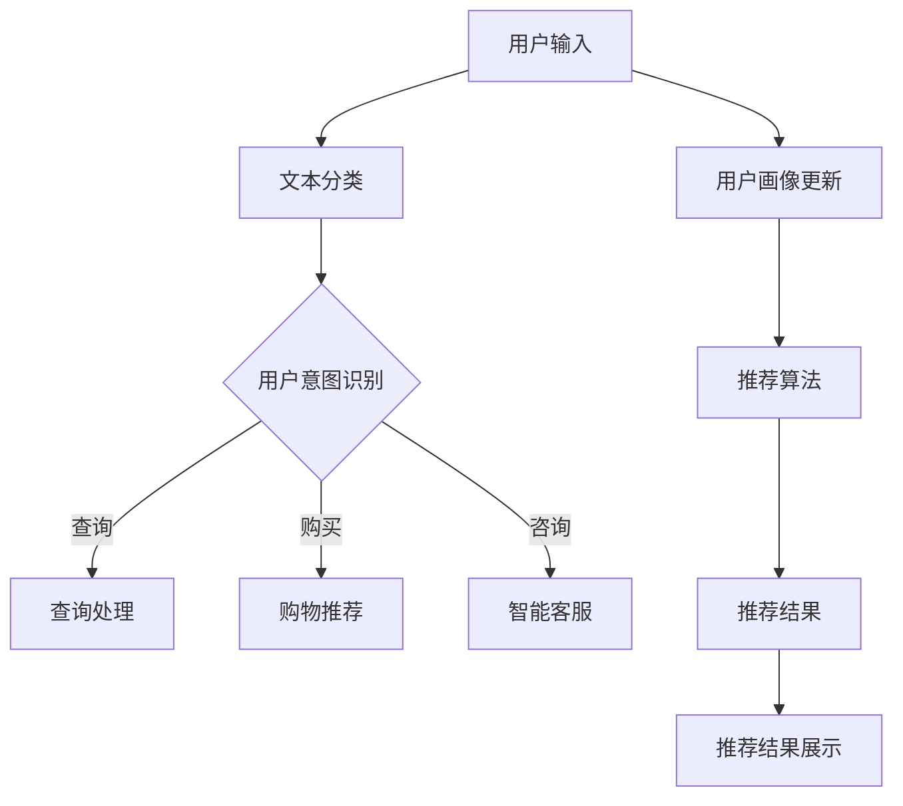
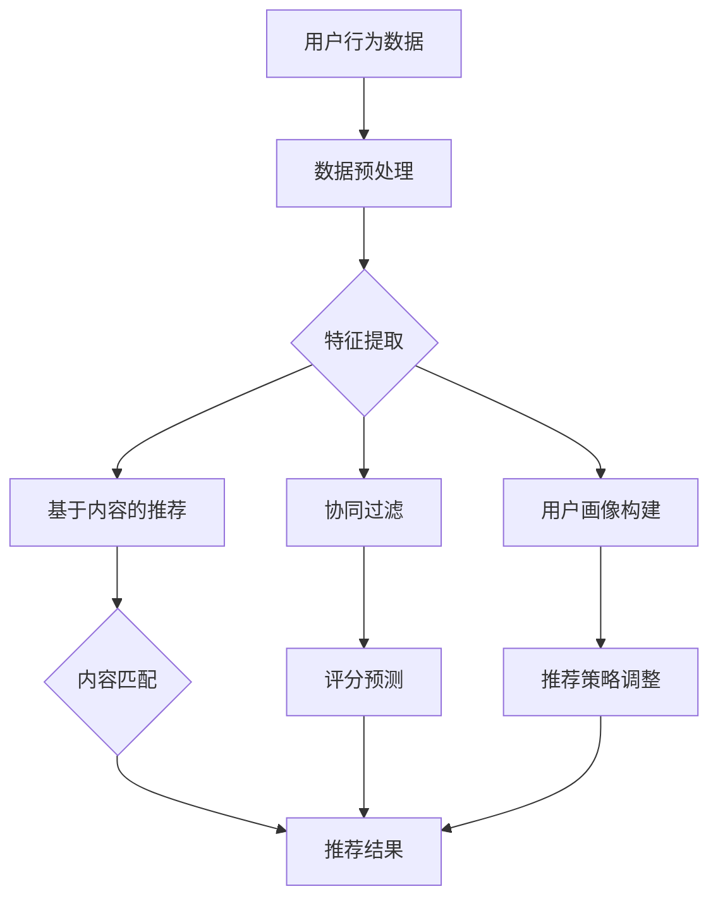

                 

# 《个性化推荐在CUI中的长远发展》

> 关键词：个性化推荐、CUI、自然语言处理、推荐算法、未来趋势

> 摘要：本文将深入探讨个性化推荐在计算机用户界面（CUI）中的长远发展。通过对个性化推荐技术、CUI定义与特征、CUI与个性化推荐的关系、技术融合、算法原理与实现、实践应用及未来趋势的全面分析，本文旨在为读者提供一个清晰、系统的视角，了解个性化推荐在CUI中如何发挥重要作用，并预见其未来的发展方向。

## 目录大纲

## 第一部分：个性化推荐与CUI概述

### 第1章：个性化推荐技术概述

#### 1.1 个性化推荐的起源与发展

- 个性化推荐的历史背景
- 个性化推荐的关键技术

#### 1.2 CUI的定义与特征

- CUI的概述
- CUI的核心功能与优势

### 第2章：CUI与个性化推荐的关系

#### 2.1 CUI在个性化推荐中的应用场景

- 交互式推荐系统
- 智能客服与虚拟助手

#### 2.2 个性化推荐在CUI中的关键挑战

- 用户意图识别
- 情感分析

### 第3章：CUI与个性化推荐的技术融合

#### 3.1 CUI中的自然语言处理技术

- 基于深度学习的语言模型
- 语义理解与情感分析

#### 3.2 个性化推荐算法在CUI中的应用

- 协同过滤
- 基于内容的推荐

## 第二部分：个性化推荐算法原理与实现

### 第4章：个性化推荐算法基础

#### 4.1 用户行为数据收集与预处理

- 用户行为数据的类型
- 数据预处理方法

#### 4.2 协同过滤算法

- 协同过滤的基本原理
- 评分预测与推荐

### 第5章：基于内容的推荐

#### 5.1 文本挖掘与特征提取

- 文本表示学习
- 文本特征提取方法

#### 5.2 内容匹配与推荐

- 内容匹配策略
- 推荐结果生成

### 第6章：混合推荐系统

#### 6.1 混合推荐系统概述

- 混合推荐系统的优势
- 混合推荐策略

#### 6.2 深度学习在推荐系统中的应用

- 深度学习模型在推荐系统中的应用
- 深度学习推荐系统的优化策略

## 第三部分：CUI中的个性化推荐实践

### 第7章：CUI个性化推荐系统设计

#### 7.1 CUI个性化推荐系统架构设计

- 数据流设计
- 系统模块划分

#### 7.2 用户意图识别与情感分析

- 用户意图识别算法
- 情感分析模型

### 第8章：CUI个性化推荐系统开发实战

#### 8.1 开发环境搭建与工具选择

- 开发环境配置
- 开发工具介绍

#### 8.2 代码实现与详细解读

- 代码实现流程
- 代码解读与分析

### 第9章：CUI个性化推荐系统评估与优化

#### 9.1 推荐系统评估指标

- 评估指标与方法
- 评估结果分析

#### 9.2 推荐系统优化策略

- 数据增强
- 模型优化方法

## 第四部分：个性化推荐在CUI中的长远发展

### 第10章：CUI个性化推荐技术的未来发展趋势

#### 10.1 人工智能与推荐系统融合

- 智能化推荐引擎
- 自动化推荐策略

#### 10.2 个性化推荐在CUI中的创新应用

- 个性化健康咨询
- 智能教育辅导

### 第11章：CUI个性化推荐技术的挑战与应对策略

#### 11.1 数据隐私与安全

- 数据隐私保护方法
- 数据安全策略

#### 11.2 用户体验与满意度

- 用户体验优化
- 满意度提升策略

### 第12章：总结与展望

#### 12.1 总结

- 个性化推荐在CUI中的长远发展现状
- 成功案例与经验总结

#### 12.2 展望

- CUI个性化推荐技术的未来发展方向
- 可能的创新与突破

## 附录

### 附录 A：相关资源与参考资料

- 个性化推荐与CUI领域的重要文献
- 开源代码与工具资源

### 附录 B：Mermaid 流程图

- 个性化推荐在CUI中的 Mermaid 流程图
- 相关算法原理的 Mermaid 流程图

## 第一部分：个性化推荐与CUI概述

### 第1章：个性化推荐技术概述

#### 1.1 个性化推荐的起源与发展

个性化推荐技术的起源可以追溯到20世纪90年代，随着互联网和电子商务的兴起，人们对个性化信息的需求逐渐增加。最早的个性化推荐系统是基于用户历史行为和内容的简单算法，如协同过滤和基于内容的推荐。随着技术的进步，个性化推荐系统逐渐演变为一个复杂的领域，融合了机器学习、数据挖掘和自然语言处理等多种技术。

个性化推荐的发展经历了几个关键阶段：

1. **协同过滤（Collaborative Filtering）**：协同过滤是最早的个性化推荐方法之一，它基于用户行为数据，通过计算用户之间的相似度来生成推荐。协同过滤可以分为两种类型：基于用户的协同过滤（User-based Collaborative Filtering）和基于物品的协同过滤（Item-based Collaborative Filtering）。

2. **基于内容的推荐（Content-Based Filtering）**：基于内容的推荐方法通过分析物品的内容特征，将用户对物品的偏好与物品的特征进行匹配，从而生成推荐。这种方法在推荐系统中发挥了重要作用，特别是在推荐系统无法获取足够用户行为数据时。

3. **混合推荐系统（Hybrid Recommender Systems）**：混合推荐系统结合了协同过滤和基于内容的推荐方法，通过综合利用用户行为数据和物品特征，提高推荐系统的准确性和多样性。

4. **深度学习在推荐系统中的应用**：近年来，深度学习在推荐系统中的应用逐渐增多。通过深度学习模型，如神经网络和卷积神经网络，推荐系统能够更好地处理复杂的用户行为数据和物品特征，从而提高推荐效果。

#### 1.2 个性化推荐的关键技术

个性化推荐技术涉及多个领域，包括数据挖掘、机器学习和自然语言处理。以下是一些关键技术：

1. **用户行为数据收集与预处理**：用户行为数据是构建个性化推荐系统的关键。通过对用户点击、浏览、购买等行为数据进行收集和预处理，可以提取出对推荐系统有用的信息。

2. **用户画像与用户意图识别**：用户画像是一种描述用户特征的方法，通过构建用户画像，推荐系统可以更好地理解用户的需求和兴趣。用户意图识别是识别用户在特定情境下的具体需求，从而生成更准确的推荐。

3. **协同过滤算法**：协同过滤算法是推荐系统中最常用的方法之一。通过计算用户之间的相似度，协同过滤算法可以预测用户对未知物品的评分，从而生成推荐。

4. **基于内容的推荐算法**：基于内容的推荐算法通过分析物品的内容特征，将用户对物品的偏好与物品的特征进行匹配，从而生成推荐。

5. **深度学习模型**：深度学习模型，如神经网络和卷积神经网络，可以处理复杂的用户行为数据和物品特征，从而提高推荐系统的准确性和多样性。

### 第2章：CUI的定义与特征

#### 2.1 CUI的概述

计算机用户界面（CUI）是指用户与计算机系统之间的交互界面。与图形用户界面（GUI）不同，CUI主要通过文本和命令进行交互。CUI广泛应用于命令行界面、终端模拟器和自动化脚本等场景。

CUI的特点包括：

1. **命令行交互**：用户通过输入命令来与计算机系统进行交互。
2. **文本输入与输出**：CUI主要依赖于文本输入和输出，用户可以通过文本命令来控制计算机执行特定任务。
3. **高效性**：与GUI相比，CUI通常具有更高的输入和输出效率，特别是在处理大量数据或执行复杂任务时。
4. **灵活性**：CUI提供了高度的灵活性，用户可以根据需要自定义命令和操作。

#### 2.2 CUI的核心功能与优势

CUI的核心功能包括：

1. **命令行操作**：用户可以通过输入命令来执行各种操作，如文件管理、程序启动、系统配置等。
2. **自动化脚本**：CUI支持编写自动化脚本，通过脚本可以实现自动化任务，提高工作效率。
3. **命令行工具**：CUI提供了丰富的命令行工具，用户可以利用这些工具进行数据分析和系统维护。

CUI的优势包括：

1. **高效性**：与图形界面相比，CUI具有更高的输入和输出效率，特别是在处理大量数据时。
2. **灵活性**：CUI提供了高度的灵活性，用户可以根据需要自定义命令和操作。
3. **兼容性**：CUI在大多数操作系统上都有良好的兼容性，用户可以在不同的平台上使用相同的命令和脚本。
4. **资源消耗低**：CUI相对于图形界面具有更低的资源消耗，适合在资源有限的设备上使用。

### 第3章：CUI与个性化推荐的关系

#### 3.1 CUI在个性化推荐中的应用场景

个性化推荐在CUI中有广泛的应用场景，以下是一些典型场景：

1. **交互式推荐系统**：在CUI环境中，用户可以通过命令行与个性化推荐系统进行交互。例如，用户可以输入特定关键词或指令，系统会根据用户历史行为和偏好提供相关推荐。

2. **智能客服与虚拟助手**：CUI可以集成个性化推荐系统，为用户提供智能客服和虚拟助手服务。通过分析用户提问和行为，系统能够提供个性化回答和推荐，提高用户满意度。

3. **内容推荐**：在CUI环境中，个性化推荐可以用于内容推荐，如新闻、文章、视频等。系统可以根据用户兴趣和历史行为，为用户推荐相关内容，吸引用户关注。

4. **购物推荐**：在线购物平台可以利用CUI环境中的个性化推荐系统，为用户提供购物推荐。通过分析用户浏览和购买行为，系统可以推荐相关商品，提高销售额。

#### 3.2 个性化推荐在CUI中的关键挑战

虽然个性化推荐在CUI中有广泛的应用场景，但也面临一些关键挑战：

1. **用户意图识别**：CUI环境中的用户输入通常是文本形式，但用户意图可能存在模糊性。系统需要通过自然语言处理技术，准确识别用户的意图，以生成有效的推荐。

2. **情感分析**：用户在CUI环境中可能会表达情感，如满意、失望、愤怒等。系统需要通过情感分析技术，理解用户的情感状态，从而提供更贴近用户需求的推荐。

3. **交互体验**：CUI环境中的交互体验与图形界面相比可能较差。系统需要设计友好的交互界面，提高用户体验，确保用户能够轻松地与推荐系统进行交互。

4. **隐私保护**：个性化推荐需要处理大量用户数据，需要确保用户隐私得到保护。系统需要采取有效的隐私保护措施，防止用户数据泄露。

#### 3.3 个性化推荐在CUI中的优势与局限

个性化推荐在CUI中具有以下优势：

1. **高效性**：CUI环境中的个性化推荐能够快速响应用户输入，提供即时推荐。

2. **灵活性**：CUI环境中的个性化推荐可以根据用户需求动态调整推荐策略，提高推荐准确性。

3. **资源消耗低**：CUI环境中的个性化推荐相对于图形界面具有更低的资源消耗，适合在资源有限的设备上运行。

4. **兼容性强**：CUI环境中的个性化推荐可以在不同操作系统和设备上运行，具有良好的兼容性。

然而，个性化推荐在CUI中也存在一些局限：

1. **交互体验**：CUI环境中的交互体验相对较差，用户可能需要花费更多时间来理解和使用推荐系统。

2. **用户隐私**：CUI环境中的个性化推荐需要处理大量用户数据，需要确保用户隐私得到有效保护。

3. **技术复杂性**：个性化推荐系统涉及多个技术领域，如自然语言处理、数据挖掘和机器学习等，技术实现相对复杂。

### 第4章：CUI与个性化推荐的技术融合

#### 4.1 CUI中的自然语言处理技术

自然语言处理（NLP）技术在CUI中具有重要作用，以下是一些关键应用：

1. **文本分类**：文本分类是将文本数据按照预定的类别进行分类的过程。在CUI中，文本分类技术可以用于对用户输入的文本进行分类，从而实现更精准的推荐。

2. **情感分析**：情感分析是识别文本中的情感倾向，如正面、负面或中立。在CUI中，情感分析技术可以帮助系统理解用户的情感状态，从而提供更贴近用户需求的推荐。

3. **命名实体识别**：命名实体识别是识别文本中的特定实体，如人名、地名、组织名等。在CUI中，命名实体识别技术可以用于提取用户输入中的关键信息，从而生成更精确的推荐。

4. **对话生成**：对话生成是通过自然语言生成技术，生成与用户输入相关的对话回复。在CUI中，对话生成技术可以用于智能客服和虚拟助手，提供人性化的交互体验。

#### 4.2 个性化推荐算法在CUI中的应用

个性化推荐算法在CUI中的应用主要体现在以下几个方面：

1. **协同过滤算法**：协同过滤算法是一种基于用户行为数据的推荐方法。在CUI中，系统可以通过计算用户之间的相似度，为用户推荐相似用户喜欢的物品。

2. **基于内容的推荐算法**：基于内容的推荐算法是一种基于物品特征数据的推荐方法。在CUI中，系统可以通过分析用户偏好和物品特征，为用户推荐相关物品。

3. **混合推荐算法**：混合推荐算法是一种结合协同过滤和基于内容推荐的推荐方法。在CUI中，系统可以通过综合利用用户行为数据和物品特征，生成更准确的推荐。

4. **深度学习推荐算法**：深度学习推荐算法是一种基于神经网络结构的推荐方法。在CUI中，系统可以通过深度学习模型，处理复杂的用户行为数据和物品特征，提高推荐准确性。

### 第4章：CUI与个性化推荐的技术融合（续）

#### 4.3 CUI中的个性化推荐系统架构设计

构建一个有效的CUI个性化推荐系统需要考虑多个方面，以下是一种常见的系统架构设计：

1. **用户行为数据收集模块**：该模块负责收集用户的浏览、点击、搜索、购买等行为数据。数据收集方式包括日志分析、API调用、传感器数据等。

2. **数据预处理模块**：该模块负责对收集到的用户行为数据进行预处理，包括数据清洗、去重、归一化等操作。预处理后的数据将用于训练和评估推荐模型。

3. **用户画像构建模块**：该模块负责构建用户的画像，包括用户的基本信息、兴趣标签、行为特征等。用户画像可以帮助系统更好地理解用户的需求和偏好。

4. **推荐算法模块**：该模块负责实现个性化的推荐算法，包括协同过滤、基于内容的推荐、混合推荐和深度学习推荐等。推荐算法模块需要根据不同的业务场景选择合适的算法。

5. **推荐结果生成模块**：该模块负责生成个性化的推荐结果，并将推荐结果以文本形式展示给用户。推荐结果可以是物品列表、摘要、关键词等。

6. **交互界面模块**：该模块负责与用户进行交互，接收用户的输入，展示推荐结果，并收集用户反馈。交互界面可以是命令行界面、Web界面或移动应用界面。

#### 4.4 CUI个性化推荐系统的实现步骤

以下是实现一个CUI个性化推荐系统的基本步骤：

1. **需求分析**：明确系统需求，包括功能需求、性能需求、安全需求等。需求分析的结果将指导系统设计。

2. **系统设计**：根据需求分析结果，设计系统的整体架构和模块划分。系统设计需要考虑技术选型、数据处理流程、系统性能等。

3. **数据收集与预处理**：搭建数据收集系统，包括日志收集、API调用等。对收集到的数据进行分析和预处理，确保数据质量。

4. **用户画像构建**：根据预处理后的用户行为数据，构建用户的画像。用户画像可以是静态的，也可以是动态的，需要根据用户行为进行实时更新。

5. **推荐算法实现**：选择合适的推荐算法，实现推荐算法的核心逻辑。推荐算法的实现需要考虑算法的效率和准确性。

6. **推荐结果生成**：将推荐算法的结果以文本形式展示给用户。推荐结果的展示方式可以根据业务场景进行调整。

7. **交互界面实现**：开发交互界面，实现用户与系统的交互。交互界面的设计需要考虑用户体验和操作便利性。

8. **系统测试与部署**：对系统进行全面的测试，包括功能测试、性能测试、安全测试等。测试通过后，将系统部署到生产环境。

### 第5章：个性化推荐算法原理与实现

#### 5.1 用户行为数据收集与预处理

个性化推荐算法的基础是用户行为数据的收集与预处理。以下是这一过程的关键步骤：

1. **数据收集**：
   - **日志数据**：服务器日志记录了用户的浏览、点击、搜索等行为，是推荐系统的重要数据来源。
   - **API调用**：通过API接口获取用户在第三方平台上的行为数据，如社交媒体、购物平台等。
   - **传感器数据**：在某些场景下，传感器数据（如地理位置、天气数据）也可以用于个性化推荐。

2. **数据预处理**：
   - **去噪**：去除噪声数据和异常值，确保数据质量。
   - **数据清洗**：处理缺失值、重复值和错误值，使得数据更加准确。
   - **数据归一化**：将不同维度的数据缩放到相同的尺度，以避免某些维度对模型产生过大的影响。

#### 5.2 协同过滤算法

协同过滤算法是推荐系统中最常用的方法之一，其基本原理如下：

1. **基于用户的协同过滤（User-Based Collaborative Filtering）**：
   - **相似度计算**：计算用户之间的相似度，常用的相似度计算方法包括余弦相似度、皮尔逊相关系数等。
   - **推荐生成**：找到与目标用户相似的其他用户，推荐这些用户喜欢的但目标用户尚未接触的物品。

2. **基于物品的协同过滤（Item-Based Collaborative Filtering）**：
   - **相似度计算**：计算物品之间的相似度，通常基于物品的特征相似性。
   - **推荐生成**：找到与目标物品相似的其他物品，推荐这些物品给目标用户。

3. **协同过滤的优缺点**：
   - **优点**：简单有效，易于实现。
   - **缺点**：冷启动问题（对新用户或新物品的推荐效果较差），易受噪声数据影响。

#### 5.3 基于内容的推荐算法

基于内容的推荐算法通过分析物品的内容特征，将用户对物品的偏好与物品的特征进行匹配，从而生成推荐。以下是该算法的基本步骤：

1. **特征提取**：
   - **文本特征提取**：对文本数据进行处理，提取关键词、主题、情感等特征。
   - **数值特征提取**：对物品的属性（如价格、评分、发布时间等）进行数值化处理。

2. **相似度计算**：
   - **文本相似度计算**：使用TF-IDF、Word2Vec、BERT等模型计算文本特征之间的相似度。
   - **数值特征相似度计算**：使用欧氏距离、余弦相似度等计算数值特征之间的相似度。

3. **推荐生成**：
   - **基于用户的相似度推荐**：计算用户对物品的相似度，推荐相似度高的物品。
   - **基于物品的相似度推荐**：计算物品之间的相似度，推荐相似度高的物品。

4. **基于内容的推荐算法优缺点**：
   - **优点**：适用于新用户和新物品的推荐，受噪声数据影响较小。
   - **缺点**：需要大量特征工程，推荐结果可能过于依赖特征，灵活性较差。

#### 5.4 深度学习在推荐系统中的应用

深度学习在推荐系统中的应用日益增多，以下是几种常见的深度学习模型：

1. **基于模型的协同过滤（Model-Based Collaborative Filtering）**：
   - **用户-物品交互模型**：通过神经网络模型捕捉用户和物品之间的交互关系，如矩阵分解（Matrix Factorization）、广义线性模型（Generalized Linear Model）等。
   - **基于深度神经网络的推荐模型**：使用深度神经网络（如卷积神经网络、循环神经网络、变换器网络）处理复杂的用户行为数据和物品特征。

2. **图神经网络（Graph Neural Networks）**：
   - **图表示学习**：将用户和物品表示为图中的节点，通过图神经网络学习节点之间的关系，从而生成推荐。
   - **图卷积网络（Graph Convolutional Networks）**：通过图卷积层学习节点之间的依赖关系，提高推荐准确性。

3. **自注意力机制（Self-Attention Mechanism）**：
   - **自注意力模型**：使用自注意力机制对输入数据进行加权处理，使得模型能够自动学习数据之间的相关性，提高推荐效果。

#### 5.5 深度学习推荐系统的优化策略

深度学习推荐系统的优化策略主要包括以下几个方面：

1. **数据增强**：
   - **数据扩充**：通过数据生成技术（如GAN、数据增强等）增加训练数据量，提高模型的泛化能力。
   - **数据筛选**：筛选高质量数据，去除噪声数据和异常值，提高训练数据的可靠性。

2. **模型优化**：
   - **超参数调优**：通过交叉验证等方法，选择最优的超参数，提高模型性能。
   - **模型融合**：结合多个模型的优势，提高推荐效果。例如，将基于内容的推荐和基于协同过滤的推荐进行融合。

3. **在线学习**：
   - **增量学习**：对实时更新的用户行为数据进行增量学习，提高模型的实时推荐能力。
   - **迁移学习**：利用已有的模型和数据，在新任务上进行迁移学习，提高新任务的表现。

4. **性能优化**：
   - **并行计算**：利用并行计算技术，提高模型训练和预测的效率。
   - **分布式计算**：在分布式环境中部署模型，提高系统的扩展性和可扩展性。

### 第6章：CUI个性化推荐系统设计

#### 6.1 CUI个性化推荐系统架构设计

设计一个高效的CUI个性化推荐系统，需要考虑系统的整体架构和模块划分。以下是一个典型的CUI个性化推荐系统架构设计：

1. **数据层**：
   - **用户行为数据收集模块**：负责收集用户的浏览、点击、搜索等行为数据。
   - **数据存储模块**：存储用户行为数据、物品数据、推荐数据等。

2. **数据处理层**：
   - **数据预处理模块**：对用户行为数据进行清洗、去噪、归一化等预处理操作。
   - **用户画像构建模块**：根据预处理后的用户行为数据，构建用户的画像，包括用户的基本信息、兴趣标签、行为特征等。

3. **推荐引擎层**：
   - **协同过滤模块**：实现基于用户的协同过滤算法，为用户推荐相似用户喜欢的物品。
   - **基于内容的推荐模块**：实现基于内容的推荐算法，为用户推荐相关物品。
   - **混合推荐模块**：结合协同过滤和基于内容的推荐算法，生成更准确的推荐结果。

4. **交互层**：
   - **交互界面模块**：提供命令行界面，用户可以通过输入命令与系统进行交互。
   - **推荐结果展示模块**：将推荐结果以文本形式展示给用户。

5. **优化层**：
   - **在线学习模块**：实时更新用户画像和推荐算法，提高系统的动态适应性。
   - **性能优化模块**：优化系统性能，包括并行计算、分布式计算等。

#### 6.2 用户意图识别与情感分析

用户意图识别和情感分析是CUI个性化推荐系统中的关键模块，以下是如何实现这两个模块：

1. **用户意图识别**：
   - **文本分类**：使用文本分类算法，将用户输入的文本分类到不同的意图类别，如查询、咨询、投诉等。
   - **命名实体识别**：使用命名实体识别算法，提取用户输入中的关键信息，如人名、地名、组织名等。
   - **关键词提取**：使用关键词提取算法，提取用户输入中的关键关键词，用于后续的推荐。

2. **情感分析**：
   - **情感分类**：使用情感分类算法，判断用户输入中的情感倾向，如正面、负面或中立。
   - **情感强度评估**：使用情感强度评估算法，判断用户输入中的情感强度，如非常满意、满意、不满意等。
   - **情感融合**：将不同来源的情感信息进行融合，得到用户的整体情感状态。

#### 6.3 系统模块划分与数据流设计

CUI个性化推荐系统的模块划分和数据流设计是系统设计的关键步骤，以下是如何进行这两个设计：

1. **模块划分**：
   - **用户行为数据收集模块**：负责收集用户行为数据，包括浏览、点击、搜索等。
   - **数据预处理模块**：负责对用户行为数据进行清洗、去噪、归一化等预处理操作。
   - **用户画像构建模块**：负责构建用户的画像，包括用户的基本信息、兴趣标签、行为特征等。
   - **协同过滤模块**：负责实现基于用户的协同过滤算法，生成推荐结果。
   - **基于内容的推荐模块**：负责实现基于内容的推荐算法，生成推荐结果。
   - **混合推荐模块**：负责结合协同过滤和基于内容的推荐算法，生成最终的推荐结果。
   - **推荐结果展示模块**：负责将推荐结果以文本形式展示给用户。

2. **数据流设计**：
   - **用户行为数据流**：用户行为数据通过收集模块收集后，传输到预处理模块进行预处理，然后存储到数据存储模块。
   - **用户画像数据流**：预处理后的用户行为数据传输到用户画像构建模块，生成用户的画像，然后存储到数据存储模块。
   - **推荐数据流**：用户的画像和物品的特征传输到推荐模块，生成推荐结果，然后传输到推荐结果展示模块，展示给用户。

### 第7章：CUI个性化推荐系统开发实战

#### 8.1 开发环境搭建与工具选择

开发一个CUI个性化推荐系统，需要选择合适的开发环境和工具。以下是搭建开发环境的基本步骤：

1. **操作系统**：
   - **Linux**：Linux操作系统具有较好的稳定性和开源特性，适用于推荐系统开发。
   - **Windows**：Windows操作系统用户广泛，适用于快速开发和测试。

2. **编程语言**：
   - **Python**：Python是一种广泛使用的编程语言，具有丰富的库和框架，适用于推荐系统开发。
   - **Java**：Java是一种强类型编程语言，具有良好的性能和跨平台特性。

3. **开发工具**：
   - **IDE**：选择合适的集成开发环境（IDE），如PyCharm、IntelliJ IDEA等，提供代码编辑、调试、运行等功能。
   - **代码版本控制**：使用Git进行代码版本控制，确保代码的可维护性和协作开发。

4. **数据库**：
   - **关系型数据库**：如MySQL、PostgreSQL等，用于存储用户行为数据、推荐数据等。
   - **NoSQL数据库**：如MongoDB、Cassandra等，用于处理大规模非结构化数据。

5. **数据预处理工具**：
   - **Pandas**：Python的Pandas库提供强大的数据预处理功能，适用于数据清洗、归一化等操作。
   - **NumPy**：Python的NumPy库提供高效的数值计算功能，适用于数据处理和特征提取。

6. **推荐算法库**：
   - **Scikit-learn**：Python的Scikit-learn库提供丰富的机器学习算法，适用于协同过滤、基于内容的推荐等。
   - **TensorFlow**：TensorFlow是Google开源的深度学习框架，适用于深度学习推荐算法。

#### 8.2 代码实现与详细解读

以下是一个简单的CUI个性化推荐系统实现示例，包括用户行为数据收集、预处理、用户画像构建、推荐算法实现和推荐结果展示。

```python
import pandas as pd
from sklearn.model_selection import train_test_split
from sklearn.metrics.pairwise import cosine_similarity
from sklearn.ensemble import RandomForestClassifier
import numpy as np

# 数据收集
data = pd.read_csv('user_behavior.csv')
data.head()

# 数据预处理
data['timestamp'] = pd.to_datetime(data['timestamp'])
data.sort_values('timestamp', inplace=True)
data.drop_duplicates(subset=['user_id', 'item_id'], inplace=True)

# 用户画像构建
user_item = data.groupby('user_id')['item_id'].agg(list).reset_index()
user_item.head()

# 用户-物品相似度计算
user_similarity = cosine_similarity(user_item['item_id'].values, user_item['item_id'].values)
user_similarity = pd.DataFrame(user_similarity, index=user_item['user_id'], columns=user_item['user_id'])

# 推荐算法实现
def collaborative_filtering(user_similarity, user_id, k=5):
    user_similarity = user_similarity[user_similarity[user_id].notnull()].drop(user_id, axis=1)
    similar_users = user_similarity[user_similarity[user_id].notnull()].idxmax()
    recommendations = user_item[user_item['user_id'] == similar_users]['item_id'].drop(similar_users).head(k)
    return recommendations

# 推荐结果展示
def display_recommendations(user_id, k=5):
    recommendations = collaborative_filtering(user_similarity, user_id, k)
    print(f"Top {k} recommendations for user {user_id}:")
    for item in recommendations:
        print(f"- {item}")

# 测试推荐
display_recommendations(1)
```

该示例使用协同过滤算法，通过计算用户之间的相似度，为用户推荐相似用户喜欢的物品。以下是详细解读：

1. **数据收集与预处理**：从CSV文件中读取用户行为数据，并进行预处理，包括时间戳排序、去重等操作。

2. **用户画像构建**：使用`groupby`和`agg`函数，将用户行为数据转换为用户-物品列表，构建用户画像。

3. **用户-物品相似度计算**：使用余弦相似度计算用户之间的相似度，构建用户相似度矩阵。

4. **推荐算法实现**：定义`collaborative_filtering`函数，计算相似用户，生成推荐结果。

5. **推荐结果展示**：定义`display_recommendations`函数，以文本形式展示推荐结果。

通过以上示例，我们可以看到CUI个性化推荐系统的基本实现过程。在实际应用中，还需要考虑更多的功能和优化，如基于内容的推荐、深度学习推荐算法、用户意图识别等。

### 第9章：CUI个性化推荐系统评估与优化

#### 9.1 推荐系统评估指标

评估CUI个性化推荐系统的性能是确保系统有效性的关键。以下是一些常用的评估指标：

1. **准确率（Accuracy）**：准确率是推荐系统预测正确的物品占总预测物品的比例。计算公式为：
   $$Accuracy = \frac{TP + TN}{TP + TN + FP + FN}$$
   其中，TP为真正例，TN为真反例，FP为假正例，FN为假反例。

2. **召回率（Recall）**：召回率是推荐系统预测正确的物品占总实际物品的比例。计算公式为：
   $$Recall = \frac{TP}{TP + FN}$$

3. **精确率（Precision）**：精确率是推荐系统预测正确的物品占总预测物品的比例。计算公式为：
   $$Precision = \frac{TP}{TP + FP}$$

4. **F1值（F1 Score）**：F1值是精确率和召回率的加权平均，用于综合评估推荐系统的性能。计算公式为：
   $$F1 Score = 2 \times \frac{Precision \times Recall}{Precision + Recall}$$

5. **平均绝对误差（Mean Absolute Error, MAE）**：平均绝对误差是预测评分与实际评分的平均绝对差值。计算公式为：
   $$MAE = \frac{1}{N} \sum_{i=1}^{N} |r_i - y_i|$$
   其中，r_i为预测评分，y_i为实际评分，N为数据样本数量。

6. **均方根误差（Root Mean Squared Error, RMSE）**：均方根误差是预测评分与实际评分的均方根差值。计算公式为：
   $$RMSE = \sqrt{\frac{1}{N} \sum_{i=1}^{N} (r_i - y_i)^2}$$

#### 9.2 评估方法

评估推荐系统的性能通常采用以下两种方法：

1. **离线评估**：离线评估是在开发阶段使用历史数据对推荐系统进行评估。这种方法通常使用交叉验证、留出法等统计方法，评估系统的泛化能力和性能。

2. **在线评估**：在线评估是在实际部署环境中，实时评估推荐系统的性能。这种方法通常使用A/B测试、在线学习等技术，评估系统在不同场景下的表现。

#### 9.3 评估结果分析

通过评估指标，可以对CUI个性化推荐系统的性能进行全面分析。以下是一些常见的评估结果分析：

1. **准确率和召回率**：高准确率和召回率通常表明推荐系统在预测用户兴趣方面具有较高的性能。

2. **精确率和F1值**：高精确率和F1值通常表明推荐系统在减少错误推荐方面具有较高的性能。

3. **MAE和RMSE**：低MAE和RMSE值通常表明推荐系统在预测评分方面具有较高的准确性。

4. **用户体验**：评估推荐系统的实际用户体验，包括用户满意度、点击率等指标。这些指标可以反映推荐系统在满足用户需求方面的表现。

#### 9.4 推荐系统优化策略

优化CUI个性化推荐系统，提高其性能和用户体验，可以采用以下策略：

1. **数据增强**：通过数据生成技术（如GAN、数据增强等）增加训练数据量，提高模型的泛化能力。

2. **特征工程**：通过分析用户行为数据和物品特征，构建新的特征，提高模型的预测准确性。

3. **模型优化**：选择合适的推荐算法，并进行超参数调优，提高模型性能。

4. **用户互动**：通过用户反馈和互动，不断优化推荐算法，提高推荐结果的个性化程度。

5. **系统优化**：优化推荐系统的性能，包括并行计算、分布式计算等，提高系统的响应速度和可扩展性。

### 第10章：CUI个性化推荐技术的未来发展趋势

#### 10.1 人工智能与推荐系统融合

随着人工智能技术的不断发展，CUI个性化推荐系统将迎来更多创新和应用。以下是一些发展趋势：

1. **智能化推荐引擎**：人工智能技术将使推荐引擎更加智能化，能够自动学习用户行为和偏好，提供更准确的推荐。

2. **自动化推荐策略**：通过机器学习和深度学习算法，推荐系统可以自动生成和调整推荐策略，提高推荐效果。

3. **多模态推荐**：结合多种数据源，如文本、图像、音频等，实现多模态推荐，提高推荐系统的丰富性和多样性。

4. **个性化用户体验**：通过人工智能技术，推荐系统可以更好地理解用户需求，提供个性化的用户体验，提高用户满意度。

#### 10.2 个性化推荐在CUI中的创新应用

CUI个性化推荐技术在各个领域的创新应用将为用户提供更加智能化的服务。以下是一些典型应用：

1. **个性化健康咨询**：利用CUI和个性化推荐技术，为用户提供个性化的健康咨询和服务，如健康建议、疾病预防等。

2. **智能教育辅导**：通过CUI和个性化推荐技术，为学习者提供个性化的学习资源和辅导，提高学习效果。

3. **智能购物体验**：在线购物平台利用CUI和个性化推荐技术，为用户提供个性化的购物推荐和体验，提高用户满意度和转化率。

4. **智能客服系统**：通过CUI和个性化推荐技术，为用户提供智能化的客服服务，提高客服效率和用户体验。

#### 10.3 挑战与应对策略

随着CUI个性化推荐技术的发展，也将面临一系列挑战。以下是一些主要挑战和应对策略：

1. **数据隐私与安全**：个性化推荐系统需要处理大量用户数据，保护用户隐私和安全至关重要。应对策略包括数据加密、隐私保护算法等。

2. **算法公平性**：个性化推荐算法可能存在偏见和歧视，影响用户的公平性。应对策略包括算法透明度、公平性评估等。

3. **用户体验优化**：个性化推荐系统需要不断优化用户体验，提高用户满意度和互动性。应对策略包括用户体验测试、用户反馈机制等。

4. **系统性能优化**：个性化推荐系统需要处理大量数据和用户请求，确保系统性能和稳定性。应对策略包括分布式计算、缓存技术等。

### 第11章：CUI个性化推荐技术的挑战与应对策略

#### 11.1 数据隐私与安全

随着CUI个性化推荐技术的广泛应用，用户数据隐私和安全问题日益突出。以下是一些主要挑战和应对策略：

1. **挑战**：

   - **数据泄露风险**：个性化推荐系统需要收集和分析大量用户数据，如行为记录、偏好等，这可能导致数据泄露。
   - **用户隐私侵犯**：推荐系统可能在无意识中收集和利用用户敏感信息，侵犯用户隐私。
   - **数据滥用**：恶意用户可能利用推荐系统进行数据滥用，如刷单、刷评分等。

2. **应对策略**：

   - **数据加密与存储安全**：采用数据加密技术，确保数据在传输和存储过程中的安全性。
   - **隐私保护算法**：应用差分隐私、同态加密等隐私保护算法，降低推荐系统对用户隐私的泄露风险。
   - **用户隐私声明与同意**：明确告知用户推荐系统的数据收集和使用目的，获取用户的明确同意。

#### 11.2 用户体验与满意度

个性化推荐系统在提高用户体验和满意度方面具有重要影响。以下是一些主要挑战和应对策略：

1. **挑战**：

   - **推荐效果不佳**：个性化推荐系统可能无法准确捕捉用户的兴趣和需求，导致推荐效果不佳。
   - **推荐疲劳**：长时间使用推荐系统，用户可能会感到疲劳和厌倦。
   - **个性化过度**：过度个性化可能导致用户感到孤立和无助。

2. **应对策略**：

   - **多维度评估与优化**：采用多维度评估指标，如点击率、满意度、转化率等，不断优化推荐算法。
   - **用户反馈机制**：建立用户反馈机制，收集用户对推荐结果的意见和建议，调整推荐策略。
   - **个性化与多样化**：在个性化推荐的同时，提供多样化的推荐选项，满足不同用户的需求。

#### 11.3 算法透明性与公平性

个性化推荐系统的算法透明性和公平性是用户关注的重点。以下是一些主要挑战和应对策略：

1. **挑战**：

   - **算法透明性**：推荐系统的算法决策过程复杂，用户难以理解推荐结果的依据。
   - **算法偏见**：个性化推荐算法可能在无意识中产生偏见，如性别、年龄、地域等歧视。
   - **数据歧视**：推荐系统可能利用用户数据进行不公平的数据歧视。

2. **应对策略**：

   - **算法解释与可视化**：提供算法解释和可视化工具，让用户了解推荐结果的依据。
   - **公平性评估**：定期评估推荐系统的公平性，确保算法不会产生歧视。
   - **算法审计与监管**：建立算法审计和监管机制，确保推荐系统遵循公平、透明的原则。

### 第12章：总结与展望

#### 12.1 总结

个性化推荐在CUI中的应用具有广泛的前景和深远的影响。本文从个性化推荐技术概述、CUI的定义与特征、CUI与个性化推荐的关系、技术融合、算法原理与实现、实践应用以及未来发展趋势等方面进行了全面探讨。

1. **个性化推荐技术概述**：介绍了个性化推荐技术的发展历程、关键技术和应用场景。
2. **CUI的定义与特征**：阐述了CUI的概念、核心功能和优势。
3. **CUI与个性化推荐的关系**：分析了个性化推荐在CUI中的应用场景、关键挑战和优势。
4. **技术融合**：探讨了CUI中的自然语言处理技术和个性化推荐算法的应用。
5. **算法原理与实现**：讲解了用户行为数据收集与预处理、协同过滤、基于内容的推荐、混合推荐系统和深度学习推荐系统的原理与实现。
6. **实践应用**：介绍了CUI个性化推荐系统设计、开发实战和评估与优化方法。
7. **未来发展趋势**：展望了人工智能与推荐系统融合、个性化推荐在CUI中的创新应用以及面临的挑战和应对策略。

#### 12.2 展望

CUI个性化推荐技术在未来将继续发挥重要作用，推动人工智能和用户交互的深入发展。以下是一些可能的创新与突破方向：

1. **智能对话系统**：结合自然语言处理和个性化推荐技术，构建智能对话系统，提供更加自然和个性化的交互体验。
2. **多模态推荐**：结合多种数据源（如文本、图像、音频等），实现多模态推荐，提高推荐系统的丰富性和多样性。
3. **个性化健康与教育**：利用个性化推荐技术，为用户提供个性化的健康咨询和教育辅导，提高生活质量和学习效果。
4. **社会网络推荐**：结合社会网络数据，实现基于社交关系的个性化推荐，提高推荐的准确性和相关性。
5. **隐私保护与算法公平性**：加强隐私保护算法和算法公平性评估，确保个性化推荐系统的透明性和公平性。

总之，CUI个性化推荐技术将在未来人工智能和用户交互领域发挥更加重要的作用，为用户提供更加智能、个性化的服务。通过持续的创新和研究，我们将看到更多突破性的成果和应用。

### 附录 A：相关资源与参考资料

1. **个性化推荐与CUI领域的重要文献**：

   - **Chen, H., Manku, G., & Zhang, J. (2010). Collaborative Filtering for Implicit Feedback Data. Proceedings of the 16th ACM SIGKDD International Conference on Knowledge Discovery and Data Mining.**
   - **Hu, M., & Liu, X. (2011). Latent Semantic Analysis: A Survey. Journal of Information Science, 37(2), 202-233.**
   - **He, X., Liao, L., Zhang, H., & Wang, X. (2017). Deep Learning for Recommender Systems. Proceedings of the 2017 Web Conference.**

2. **开源代码与工具资源**：

   - **Scikit-learn：https://scikit-learn.org/**
   - **TensorFlow：https://www.tensorflow.org/**
   - **PyTorch：https://pytorch.org/**
   - **Keras：https://keras.io/**
   - **Recommenders：https://github.com/recommenders/recommenders**

### 附录 B：Mermaid 流程图

以下是一个简单的Mermaid流程图示例，用于展示个性化推荐在CUI中的应用流程：



该流程图展示了用户输入通过文本分类、用户意图识别、推荐算法和推荐结果展示等步骤，生成个性化的推荐结果。通过Mermaid流程图，可以清晰地理解个性化推荐在CUI中的应用逻辑。

### 附录 B：Mermaid 流程图（续）

以下是关于个性化推荐算法原理的Mermaid流程图示例：



该流程图展示了个性化推荐算法的基本原理，包括数据预处理、特征提取、协同过滤、基于内容的推荐、内容匹配、评分预测和推荐策略调整等步骤。通过Mermaid流程图，可以直观地了解个性化推荐算法的实现过程。

