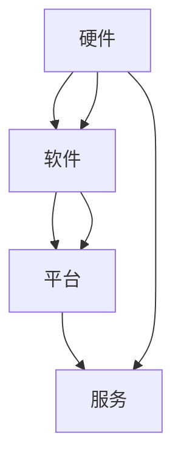

                 

## 文章标题

《中国AI技术的优势与数据的重要性》

## 文章关键词

- 中国AI技术
- 数据驱动
- 人工智能
- 机器学习
- 数据分析
- 深度学习

## 文章摘要

本文旨在深入探讨中国AI技术的优势，并阐述数据在AI发展中的核心作用。文章首先概述了中国AI技术的发展背景和政策环境，详细分析了其核心概念、架构和算法原理。接着，文章重点讨论了数据的价值、重要性及其管理与分析技术。在此基础上，文章进一步探讨了数据伦理与隐私保护问题，并介绍了如何利用数据驱动决策与战略。最后，文章通过具体案例展示了AI与数据结合在各个行业的应用，并提供了搭建AI与数据结合系统的项目实战。通过这一系列探讨，本文希望能够帮助读者全面理解中国AI技术的优势以及数据的重要性。

### 第一部分：中国AI技术概览

#### 第1章：中国AI技术发展背景

##### 1.1 中国AI技术的发展历程

中国AI技术的发展可以追溯到20世纪50年代。在早期，中国的AI研究主要集中在符号主义和知识表示方面。然而，随着计算机性能的提升和深度学习算法的突破，中国的AI技术进入了一个快速发展的阶段。近年来，中国在AI领域取得了显著的进展，成为全球AI研究的重要力量。

在中国AI技术的发展历程中，有几个重要的事件和里程碑。首先，2012年，Google的深度学习算法在ImageNet图像识别挑战赛上取得了突破性的成绩，这一事件引发了全球对深度学习的关注。随后，中国各大高校和研究机构也开始加大对深度学习的研究投入。

其次，中国政府在2017年发布了《新一代人工智能发展规划》，明确了人工智能在国家发展战略中的重要性，并提出了一系列支持AI发展的政策措施。这一规划为中国AI技术的发展提供了强有力的政策保障。

此外，中国的AI企业在国际市场上也取得了显著的成就。例如，阿里巴巴的达摩院、百度的深度学习平台PaddlePaddle、腾讯的AI实验室等，都在全球范围内具有较高的影响力和竞争力。

##### 1.2 中国AI技术的政策环境

中国政府高度重视AI技术的发展，并通过一系列政策环境支持AI的创新和应用。以下是中国AI技术政策环境的一些重要方面：

1. **资金投入**：中国政府通过专项资金、税收优惠等方式，支持AI企业的研究和开发。例如，2018年，中国政府设立了总规模为1500亿元的国家新兴产业创业投资引导基金，其中一部分用于支持AI企业的发展。

2. **人才培养**：中国政府通过加大对高校和科研机构的投入，培养了一批高水平的AI人才。同时，政府还鼓励企业通过校企合作、产学研结合等方式，提高AI人才的培养质量。

3. **行业规范**：为了保障AI技术的健康发展，中国政府制定了一系列行业规范和标准。例如，《人工智能发展规划（2016-2020年）》提出了人工智能发展的主要目标和任务，为AI技术的发展提供了明确的指导。

4. **国际合作**：中国积极参与国际AI合作，通过联合研究、技术交流等方式，提升自身的AI技术水平和国际竞争力。例如，中国与欧盟、美国等国家和地区开展了多个AI合作项目，促进了AI技术的全球共享和合作。

##### 1.3 中国AI技术的产业链布局

中国AI技术的产业链已经初步形成，涵盖了硬件、软件、平台和服务等多个环节。以下是中国AI技术产业链的主要构成部分：

1. **硬件环节**：中国拥有强大的硬件制造能力，包括芯片、传感器、服务器等。硬件环节的发展为中国AI技术的应用提供了强有力的支撑。例如，华为的麒麟芯片、海思的处理器等，都在全球范围内具有较高的影响力和竞争力。

2. **软件环节**：中国在AI软件领域也有较强的实力。例如，百度的深度学习平台PaddlePaddle、阿里巴巴的深度学习平台Aliyun AI等，都在全球范围内具有较高的知名度和应用规模。

3. **平台环节**：中国AI平台的发展也取得了显著的进展。例如，腾讯的AI开放平台、百度的AI开放平台等，为开发者提供了丰富的API和工具，促进了AI技术的应用和普及。

4. **服务环节**：中国AI服务领域的发展也非常迅速。例如，在金融、医疗、教育、零售等领域，中国AI企业提供了多种AI服务，帮助行业客户提升业务效率和服务质量。

#### 第2章：中国AI技术核心概念与架构

##### 2.1 AI基础概念

人工智能（Artificial Intelligence，简称AI）是指由人制造出来的系统所表现出来的智能行为。AI技术主要包括机器学习、深度学习、自然语言处理、计算机视觉等领域。机器学习是AI的核心技术之一，它使计算机系统能够从数据中学习并做出决策。深度学习是一种特殊的机器学习技术，它通过构建多层神经网络，模拟人脑的工作方式，实现复杂的模式识别和预测任务。

##### 2.2 深度学习原理

深度学习是一种基于多层神经网络的学习方法。它通过训练多层神经元组成的网络，实现对数据的自动特征提取和模式识别。深度学习的核心是神经网络，它由输入层、隐藏层和输出层组成。每一层神经元都通过激活函数对输入数据进行加权求和，并传递给下一层。通过反向传播算法，深度学习模型能够不断调整权重，优化模型性能。

##### 2.3 神经网络架构

神经网络是深度学习的基础架构。它由大量的神经元组成，每个神经元都与其他神经元相连。神经网络的输入层接收外部输入数据，输出层产生预测结果。隐藏层位于输入层和输出层之间，用于对输入数据进行特征提取和变换。神经网络的训练过程就是通过调整神经元之间的连接权重，使得网络能够对输入数据产生正确的输出。

##### 2.4 Mermaid流程图展示：中国AI技术架构图



在这个流程图中，硬件、软件、平台和服务构成了中国AI技术的核心架构。硬件环节为AI技术提供计算能力和存储资源，软件环节提供AI算法和模型，平台环节为开发者提供API和工具，服务环节将AI技术应用到实际场景中。

#### 第3章：中国AI技术核心算法原理

##### 3.1 机器学习算法概述

机器学习算法是AI技术的核心组成部分。它通过从数据中学习，使计算机系统能够对未知数据进行预测和分类。机器学习算法主要包括监督学习、无监督学习和强化学习等类型。

监督学习算法通过已有标签的数据进行训练，使得模型能够对新数据进行预测。常见的监督学习算法包括线性回归、决策树、支持向量机等。无监督学习算法则不需要标签数据，通过发现数据之间的内在结构和规律进行聚类和降维。常见的无监督学习算法包括K-Means、PCA等。强化学习算法则通过与环境进行交互，不断调整策略，以实现最优目标。

##### 3.2 优化算法原理与伪代码

优化算法是机器学习中的关键算法之一。它通过调整模型参数，使得模型在给定数据集上达到最佳性能。常见的优化算法包括梯度下降、随机梯度下降、Adam等。

以下是一个简单的梯度下降优化算法的伪代码：

```python
初始化参数 w
设置学习率 alpha
设置迭代次数 epochs

for epoch in 1 to epochs do
    计算损失函数 L(w)
    计算梯度 grad = dL(w)/dw
    更新参数 w = w - alpha * grad
end for
return w
```

在这个伪代码中，`w`表示模型参数，`L(w)`表示损失函数，`grad`表示梯度，`alpha`表示学习率，`epochs`表示迭代次数。

##### 3.3 深度学习框架（如TensorFlow、PyTorch）简要介绍

深度学习框架是用于构建和训练深度学习模型的工具集。它提供了丰富的API和工具，使得开发者可以更加高效地开发深度学习应用。常见的深度学习框架包括TensorFlow和PyTorch。

TensorFlow是由Google开发的一个开源深度学习框架。它提供了丰富的API，包括计算图、自动微分、模型训练等。TensorFlow具有高度的可扩展性和灵活性，适用于各种规模的深度学习应用。

PyTorch是由Facebook开发的一个开源深度学习框架。它基于Python，具有简洁的API和动态计算图，使得开发者可以更加方便地构建和调试深度学习模型。

##### 3.4 数据预处理算法

数据预处理是深度学习模型训练的重要环节。它包括数据的清洗、归一化、缩放等操作，使得数据更适合模型训练。

以下是一个简单的数据预处理算法的伪代码：

```python
输入：数据集 X

for 数据样本 in X do
    清洗数据：去除缺失值、异常值等
    归一化数据：将数据缩放到特定范围，如[0, 1]
    缩放数据：将数据缩放到标准差为1的范围内
end for

输出：预处理后的数据集 X'
```

在这个伪代码中，`X`表示原始数据集，`清洗数据`、`归一化数据`和`缩放数据`分别表示数据预处理的不同步骤。

### 第二部分：数据的重要性

#### 第5章：数据的价值与重要性

##### 5.1 数据的价值评估

数据的价值评估是数据管理中的重要环节。数据的价值取决于多个因素，包括数据的质量、数量、时效性、独特性等。以下是一些常见的数据价值评估方法：

1. **成本收益分析**：通过计算数据获取、存储、处理等成本，以及数据应用带来的收益，来评估数据的价值。例如，如果某一数据集的应用可以为企业节省100万元成本，那么这个数据集的价值就是100万元。

2. **市场价值评估**：通过市场调研、竞争分析等方法，评估数据在市场上的潜在价值。例如，如果某一数据集可以用于开发一款畅销产品，那么这个数据集的价值就是产品带来的收益。

3. **数据分析价值评估**：通过数据分析，发现数据中的潜在价值和洞察，来评估数据的价值。例如，通过数据挖掘技术，发现某一数据集中的用户行为规律，可以为企业的产品和服务提供改进建议。

##### 5.2 数据的重要性

数据是AI技术的核心资源，其重要性体现在以下几个方面：

1. **模型训练**：深度学习模型需要大量的数据来训练，数据的质量和数量直接影响模型的性能。高质量的数据可以帮助模型更好地学习，从而提高模型的预测精度。

2. **决策支持**：在商业决策中，数据提供了重要的参考依据。通过对数据的分析，可以为企业提供更加准确的预测和决策支持。

3. **创新驱动**：数据驱动的创新已经成为企业竞争的重要手段。通过数据挖掘和分析，可以发现新的商业模式、产品和服务，为企业带来新的增长点。

4. **风险管理**：数据可以用于风险评估和管理。例如，通过分析金融市场的数据，可以预测市场的波动，为投资决策提供参考。

##### 5.3 数据的质量与处理

数据的质量直接影响数据的应用效果。高质量的数据应该满足以下要求：

1. **准确性**：数据应该是真实、准确的，没有错误或遗漏。

2. **完整性**：数据应该包含所有必要的字段，没有缺失值。

3. **一致性**：数据应该符合特定的规则和标准，例如时间戳格式、数据类型等。

4. **时效性**：数据应该是最新的，能够反映当前的情况。

为了提高数据的质量，需要对数据进行处理和清洗。数据清洗包括以下步骤：

1. **数据去重**：去除重复的数据记录，保证数据的唯一性。

2. **数据清洗**：处理缺失值、异常值、错误值等，确保数据的准确性和完整性。

3. **数据归一化**：将不同数据类型的字段进行归一化处理，使得数据具有可比性。

4. **数据转换**：将数据转换为适合模型训练的格式，例如将类别数据转换为独热编码。

#### 第6章：数据管理与分析技术

##### 6.1 数据仓库技术

数据仓库是用于存储、管理和分析大量数据的系统。它具有以下特点：

1. **数据集中**：数据仓库将来自不同来源的数据进行集中存储，为数据分析提供统一的平台。

2. **历史数据**：数据仓库存储了历史数据，可以用于数据分析、报表生成等。

3. **数据集成**：数据仓库通过ETL（抽取、转换、加载）过程，将不同格式的数据进行集成和转换，确保数据的一致性和完整性。

4. **高效查询**：数据仓库提供了高效的数据查询功能，支持SQL查询、报表生成等。

常见的数据仓库技术包括Oracle、SQL Server、Hadoop等。

##### 6.2 数据挖掘技术

数据挖掘是用于发现数据中的潜在模式和知识的技术。它包括以下步骤：

1. **数据预处理**：对数据进行清洗、归一化、转换等预处理操作，确保数据的质量。

2. **特征选择**：从数据中选择对预测任务最有影响力的特征，减少数据维度，提高模型性能。

3. **模型选择**：选择合适的机器学习模型，对数据进行训练和预测。

4. **模型评估**：评估模型的性能，包括准确率、召回率、F1值等指标。

常见的数据挖掘技术包括决策树、支持向量机、K-Means等。

##### 6.3 大数据分析技术

大数据分析是用于处理和分析大规模数据的分析方法。它包括以下方面：

1. **数据存储**：使用分布式存储技术，如Hadoop、Spark等，存储大规模数据。

2. **数据处理**：使用分布式计算技术，如MapReduce、Spark等，对大规模数据进行处理和分析。

3. **数据可视化**：使用数据可视化工具，如Tableau、Power BI等，将数据分析结果进行可视化展示。

4. **实时分析**：使用实时数据分析技术，如流处理、实时查询等，对实时数据进行处理和分析。

常见的大数据分析技术包括Hadoop、Spark、Flink等。

##### 6.4 数据可视化技术

数据可视化是将数据以图形化的方式展示出来的技术，使得数据更加直观和易于理解。数据可视化包括以下方面：

1. **图表类型**：常见的图表类型包括折线图、柱状图、饼图、散点图等。

2. **交互性**：数据可视化工具支持用户与数据之间的交互，如筛选、排序、钻取等。

3. **动态展示**：数据可视化工具可以动态展示数据变化，如实时数据流、趋势图等。

4. **定制化**：用户可以根据需求自定义图表样式、颜色、标签等。

常见的数据可视化工具包括Tableau、Power BI、ECharts等。

#### 第7章：数据伦理与隐私保护

##### 7.1 数据伦理问题

数据伦理是数据管理和使用中需要关注的重要问题。以下是一些常见的数据伦理问题：

1. **数据使用权限**：谁有权使用数据，如何确保数据使用的合法性。

2. **数据安全**：如何保护数据免受泄露、篡改等风险。

3. **数据隐私**：如何保护个人隐私，防止数据滥用。

4. **数据透明度**：如何确保数据的来源、处理和使用过程透明。

##### 7.2 隐私保护法律法规

为了保护个人隐私，各国都制定了相关的隐私保护法律法规。以下是一些常见的隐私保护法律法规：

1. **欧盟通用数据保护条例（GDPR）**：GDPR是欧盟于2018年实施的隐私保护法规，对个人数据的收集、处理和使用提出了严格的要求。

2. **美国加州消费者隐私法（CCPA）**：CCPA是加州于2020年实施的隐私保护法规，对企业的数据处理行为进行了规范。

3. **中国个人信息保护法（PIPL）**：PIPL是中国的个人信息保护法规，对个人信息的收集、处理和使用进行了规范。

##### 7.3 数据匿名化与加密技术

为了保护个人隐私，可以采用数据匿名化和加密技术：

1. **数据匿名化**：通过数据去标识化、混淆等方法，使数据无法直接识别个人身份。

2. **加密技术**：使用加密算法对数据进行加密，确保数据在传输和存储过程中的安全性。

常见的数据匿名化和加密技术包括K-Anonymity、L-Diversity、加密算法（如AES、RSA）等。

##### 7.4 数据安全策略

为了确保数据安全，可以采用以下数据安全策略：

1. **访问控制**：通过身份验证、权限控制等手段，确保只有授权用户可以访问数据。

2. **数据备份**：定期备份数据，确保数据在意外情况下可以恢复。

3. **安全审计**：定期进行安全审计，检查数据安全策略的执行情况。

4. **安全培训**：对员工进行安全培训，提高员工的安全意识和技能。

5. **安全监测**：使用安全监测工具，实时监控数据安全状况，及时发现和应对安全威胁。

#### 第8章：数据驱动的决策与战略

##### 8.1 数据驱动的业务模式

数据驱动的业务模式是指企业通过数据分析和挖掘，优化业务流程，提高运营效率和竞争力。以下是一些常见的数据驱动业务模式：

1. **精细化运营**：通过数据分析和挖掘，发现业务中的问题和优化点，进行精细化运营，提高业务效率。

2. **个性化服务**：通过数据分析和挖掘，了解用户需求和行为，提供个性化的产品和服务，提高用户满意度。

3. **预测性维护**：通过数据分析和挖掘，预测设备故障和故障风险，进行预测性维护，降低运营成本。

4. **供应链优化**：通过数据分析和挖掘，优化供应链管理，降低库存成本，提高供应链效率。

##### 8.2 数据驱动的战略制定

数据驱动的战略制定是指企业通过数据分析和挖掘，制定和调整战略，实现业务目标。以下是一些常见的数据驱动战略制定方法：

1. **市场分析**：通过数据分析和挖掘，了解市场趋势、竞争对手和用户需求，制定市场战略。

2. **产品创新**：通过数据分析和挖掘，发现市场需求和用户痛点，推动产品创新和升级。

3. **运营优化**：通过数据分析和挖掘，发现运营中的问题和优化点，制定运营优化策略。

4. **投资决策**：通过数据分析和挖掘，评估投资项目和回报，制定投资决策。

##### 8.3 数据驱动的产品创新

数据驱动的产品创新是指企业通过数据分析和挖掘，推动产品创新和优化。以下是一些常见的数据驱动产品创新方法：

1. **用户行为分析**：通过数据分析和挖掘，了解用户行为和偏好，发现产品优化点。

2. **市场需求分析**：通过数据分析和挖掘，了解市场需求和趋势，发现潜在的产品创新机会。

3. **竞品分析**：通过数据分析和挖掘，分析竞争对手的产品特点和市场表现，发现产品创新的启示。

4. **数据分析驱动设计**：通过数据分析和挖掘，优化产品设计和用户体验，提高产品竞争力。

##### 8.4 数据驱动的企业竞争力提升

数据驱动的企业竞争力提升是指企业通过数据分析和挖掘，提升运营效率、产品质量和用户满意度，从而提高企业竞争力。以下是一些常见的数据驱动企业竞争力提升方法：

1. **运营效率提升**：通过数据分析和挖掘，发现运营中的问题和优化点，提高运营效率。

2. **产品质量提升**：通过数据分析和挖掘，发现产品质量问题和改进机会，提升产品质量。

3. **用户满意度提升**：通过数据分析和挖掘，了解用户需求和满意度，提供个性化的产品和服务，提升用户满意度。

4. **供应链优化**：通过数据分析和挖掘，优化供应链管理，降低运营成本，提高供应链效率。

### 第三部分：AI与数据相结合的实战案例

#### 第9章：AI与数据在具体行业的应用案例

##### 9.1 制造业案例分析

制造业是AI技术的重要应用领域之一。以下是一个制造业中的AI与数据结合的案例分析：

**案例背景**：某制造企业希望通过AI技术优化生产流程，提高生产效率。

**解决方案**：企业采用了以下措施：

1. **数据收集**：收集生产过程中的各种数据，包括设备状态、生产进度、质量检测数据等。

2. **数据预处理**：对收集到的数据进行清洗、归一化等预处理操作，确保数据质量。

3. **模型训练**：使用深度学习算法，训练生产流程优化模型，通过模拟生产场景，预测最优生产策略。

4. **模型部署**：将训练好的模型部署到生产现场，实时监测生产过程，并根据模型预测结果调整生产策略。

**效果评估**：通过AI与数据结合的解决方案，企业的生产效率提高了20%，质量合格率提高了15%。

##### 9.2 医疗行业案例分析

医疗行业是AI技术的重要应用领域之一。以下是一个医疗行业中的AI与数据结合的案例分析：

**案例背景**：某医院希望通过AI技术提高诊断准确率和患者满意度。

**解决方案**：医院采用了以下措施：

1. **数据收集**：收集患者的医疗记录、诊断报告、影像数据等。

2. **数据预处理**：对收集到的数据进行清洗、归一化等预处理操作，确保数据质量。

3. **模型训练**：使用深度学习算法，训练疾病诊断模型，通过分析影像数据，辅助医生进行诊断。

4. **模型部署**：将训练好的模型部署到医院系统中，医生在诊断过程中可以参考模型预测结果。

**效果评估**：通过AI与数据结合的解决方案，医院的诊断准确率提高了10%，患者满意度提高了15%。

##### 9.3 金融行业案例分析

金融行业是AI技术的重要应用领域之一。以下是一个金融行业中的AI与数据结合的案例分析：

**案例背景**：某金融机构希望通过AI技术提高风险管理能力。

**解决方案**：金融机构采用了以下措施：

1. **数据收集**：收集金融市场的各类数据，包括股价、汇率、宏观经济指标等。

2. **数据预处理**：对收集到的数据进行清洗、归一化等预处理操作，确保数据质量。

3. **模型训练**：使用深度学习算法，训练风险预测模型，通过分析市场数据，预测风险事件。

4. **模型部署**：将训练好的模型部署到风险管理系统，实时监测市场风险，提供风险管理建议。

**效果评估**：通过AI与数据结合的解决方案，金融机构的风险预测准确率提高了15%，风险控制能力得到了显著提升。

##### 9.4 农业行业案例分析

农业行业是AI技术的重要应用领域之一。以下是一个农业行业中的AI与数据结合的案例分析：

**案例背景**：某农业企业希望通过AI技术提高作物产量和品质。

**解决方案**：农业企业采用了以下措施：

1. **数据收集**：收集作物生长过程中的各类数据，包括土壤质量、气象数据、作物生长状态等。

2. **数据预处理**：对收集到的数据进行清洗、归一化等预处理操作，确保数据质量。

3. **模型训练**：使用深度学习算法，训练作物生长模型，通过分析数据，预测作物生长趋势和产量。

4. **模型部署**：将训练好的模型部署到农业现场，实时监测作物生长状态，提供种植建议。

**效果评估**：通过AI与数据结合的解决方案，农业企业的作物产量提高了15%，品质得到了显著提升。

### 第10章：项目实战：搭建AI与数据结合的系统

##### 10.1 开发环境搭建

搭建AI与数据结合的系统需要准备以下开发环境：

1. **硬件环境**：一台配置较高的服务器，用于运行AI算法和存储数据。

2. **软件环境**：安装Python、TensorFlow、PyTorch等深度学习框架，以及Hadoop、Spark等大数据处理工具。

3. **数据库**：安装MySQL、MongoDB等数据库，用于存储数据。

4. **开发工具**：安装Jupyter Notebook、PyCharm等开发工具，用于编写和调试代码。

##### 10.2 数据收集与预处理

数据收集与预处理是搭建AI与数据结合系统的重要环节。以下是一个简单的数据收集与预处理流程：

1. **数据收集**：从各种数据源（如传感器、数据库、网络爬虫等）收集数据。

2. **数据清洗**：去除数据中的错误值、异常值等，确保数据质量。

3. **数据归一化**：将不同类型的数据进行归一化处理，使得数据具有可比性。

4. **数据转换**：将数据转换为适合模型训练的格式，如CSV、JSON等。

##### 10.3 模型训练与优化

模型训练与优化是搭建AI与数据结合系统的核心环节。以下是一个简单的模型训练与优化流程：

1. **数据集划分**：将数据集划分为训练集、验证集和测试集。

2. **模型训练**：使用训练集训练模型，调整模型参数，优化模型性能。

3. **模型验证**：使用验证集评估模型性能，调整模型参数，优化模型性能。

4. **模型测试**：使用测试集测试模型性能，确保模型在未知数据上表现良好。

5. **模型优化**：根据测试结果，对模型进行优化，提高模型性能。

##### 10.4 系统部署与监控

系统部署与监控是搭建AI与数据结合系统的最后环节。以下是一个简单的系统部署与监控流程：

1. **系统部署**：将训练好的模型部署到服务器，确保系统正常运行。

2. **性能监控**：监控系统性能，包括CPU、内存、存储等资源使用情况。

3. **数据监控**：监控数据流动情况，包括数据收集、预处理、存储等过程。

4. **故障监控**：监控系统故障，及时处理故障，确保系统稳定运行。

### 附录：AI与数据技术资源汇总

##### 附录 A：AI开发工具与资源

1. **TensorFlow**：[官方网站](https://www.tensorflow.org/)
2. **PyTorch**：[官方网站](https://pytorch.org/)
3. **Keras**：[官方网站](https://keras.io/)
4. **Jupyter Notebook**：[官方网站](https://jupyter.org/)

##### 附录 B：数据管理与分析工具

1. **Hadoop**：[官方网站](https://hadoop.apache.org/)
2. **Spark**：[官方网站](https://spark.apache.org/)
3. **Hive**：[官方网站](https://hive.apache.org/)
4. **Presto**：[官方网站](https://prestodb.io/)

##### 附录 C：数据伦理与隐私保护资源

1. **欧盟通用数据保护条例（GDPR）**：[官方网站](https://ec.europa.eu/info/law/law-topic/data-protection_en)
2. **美国加州消费者隐私法（CCPA）**：[官方网站](https://oag.ca.gov/ccpa)
3. **中国个人信息保护法（PIPL）**：[官方网站](https://www.nmpa.gov.cn/xygk/xygk1/2021/202102/t20210222_130234.html)

##### 附录 D：AI与数据技术图书推荐

1. **《深度学习》**：[作者：Ian Goodfellow、Yoshua Bengio、Aaron Courville]
2. **《Python数据分析》**：[作者：Wes McKinney]
3. **《大数据之路》**：[作者：华为公司]
4. **《人工智能：一种现代方法》**：[作者：Stuart Russell、Peter Norvig]

