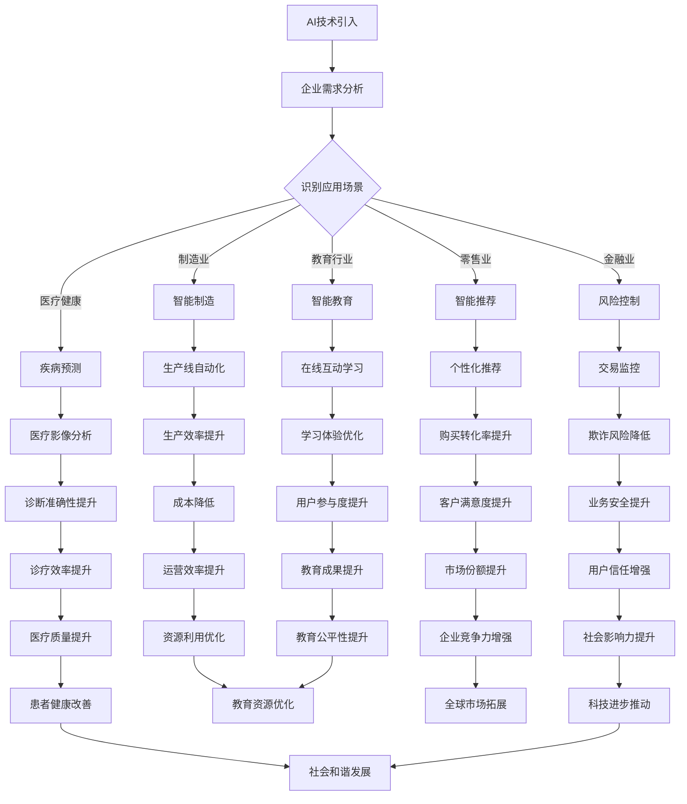

                 

# 《中国企业的AI应用主义》

## 关键词

- 人工智能（AI）
- 应用主义
- 商业价值
- 技术实践
- 行业应用
- 数据治理
- 人才培养

> 摘要：本文旨在探讨中国企业在人工智能（AI）领域的应用主义，通过分析AI在中国企业中的角色、商业价值、关键技术和实践应用，揭示AI应用主义的驱动因素与挑战，以及对企业运营、产品创新和客户服务的提升作用。文章还将探讨AI应用主义在制造业、零售业、金融业、医疗健康和教育行业的应用案例，并强调数据治理、伦理和人才培养在AI应用中的重要性。

## 目录

### 第一部分：AI应用主义概述

#### 第1章：AI在中国企业中的角色与影响

- **1.1 AI在中国企业中的普及与现状**
- **1.2 AI应用主义的核心原则**
- **1.3 AI应用主义的驱动因素与挑战**

#### 第2章：AI应用主义的商业价值

- **2.1 AI对企业运营的优化**
- **2.2 AI对产品创新的推动**
- **2.3 AI在客户服务与体验的提升**

#### 第3章：AI应用主义的关键技术

- **3.1 机器学习算法与模型**
- **3.2 深度学习技术与框架**
- **3.3 自然语言处理技术**

### 第二部分：AI应用主义实践

#### 第4章：AI应用主义战略规划

- **4.1 制定AI战略规划的步骤**
- **4.2 AI战略规划案例分析**
- **4.3 AI战略规划的实施与评估**

#### 第5章：AI应用主义在行业中的应用

- **5.1 制造业**
- **5.2 零售业**
- **5.3 金融业**
- **5.4 医疗健康**
- **5.5 教育行业**

#### 第6章：AI应用主义的数据治理与伦理

- **6.1 数据治理在AI应用中的重要性**
- **6.2 AI应用中的数据隐私保护**
- **6.3 AI应用伦理与合规**

#### 第7章：AI应用主义的人才培养与团队建设

- **7.1 AI应用人才需求分析**
- **7.2 AI人才培养策略**
- **7.3 AI团队建设与组织文化**

#### 第8章：AI应用主义的项目实战

- **8.1 项目实战案例介绍**
- **8.2 项目开发环境搭建**
- **8.3 源代码详细实现与解读**
- **8.4 项目分析与评估**

### 附录

#### 附录A：AI应用主义常用工具与资源

- **A.1 机器学习与深度学习框架**
- **A.2 数据处理与分析工具**
- **A.3 AI应用开发平台**

#### 附录B：参考文献

- **B.1 AI应用主义相关书籍**
- **B.2 AI应用主义相关论文**
- **B.3 AI应用主义相关报告**

### 引言

随着人工智能（AI）技术的快速发展，中国企业在AI领域的应用主义逐渐成为一种重要的商业模式和竞争力来源。AI应用主义不仅体现在技术创新和产品开发上，还涉及到企业战略、组织文化、人才管理和数据治理等多个方面。本文将系统地探讨中国企业的AI应用主义，旨在为企业和行业提供有益的参考和指导。

文章将从以下几个方面展开：

1. **AI在中国企业中的角色与影响**：分析AI在中国企业中的普及现状、应用主义的核心原则以及驱动因素与挑战。

2. **AI应用主义的商业价值**：探讨AI对企业运营、产品创新和客户服务的提升作用。

3. **AI应用主义的关键技术**：介绍机器学习算法、深度学习技术和自然语言处理技术。

4. **AI应用主义实践**：分析AI应用主义战略规划、行业应用、数据治理与伦理以及人才培养与团队建设。

5. **AI应用主义项目实战**：通过实际项目案例，展示AI应用的全过程，包括开发环境搭建、源代码实现与解读以及项目分析与评估。

通过以上分析，本文希望为中国企业在AI领域的应用提供有价值的思路和实践指导，推动AI技术与商业价值的深度融合。

### 第一部分：AI应用主义概述

#### 第1章：AI在中国企业中的角色与影响

##### 1.1 AI在中国企业中的普及与现状

近年来，人工智能（AI）技术在中国企业中的应用日益普及，成为提升企业竞争力的重要工具。据《中国人工智能产业发展报告2022》数据显示，截至2021年底，中国AI企业数量超过1万家，涵盖了不同行业和领域。以下是中国企业AI应用的主要现状：

1. **技术成熟度提升**：随着深度学习、自然语言处理、计算机视觉等技术的成熟，中国企业开始将AI技术广泛应用于各个业务环节。

2. **应用场景多样化**：从简单的数据分析到智能客服、智能制造、智能交通等，AI技术在中国企业中的应用场景越来越丰富。

3. **政策支持**：中国政府出台了一系列政策，鼓励企业加大AI技术的研发和应用，为AI企业提供了良好的发展环境。

4. **投资增加**：众多中国企业开始加大对AI技术的投资，以期通过AI技术提升业务效率和创新能力。

##### 1.2 AI应用主义的核心原则

AI应用主义是一种基于人工智能技术推动业务创新和提升企业竞争力的方法论。其核心原则包括：

1. **技术驱动**：AI应用主义强调以技术创新为核心，通过引入先进的AI技术，提升企业的技术水平和竞争力。

2. **业务导向**：AI应用主义强调业务需求导向，将AI技术与企业实际业务紧密结合，以解决实际问题为目标。

3. **数据驱动**：AI应用主义强调数据的重要性，认为数据是AI技术的基石，通过数据分析和挖掘，实现业务的智能化和自动化。

4. **开放合作**：AI应用主义鼓励开放合作，通过跨界合作，整合各方资源，实现优势互补，共同推进AI技术的发展和应用。

##### 1.3 AI应用主义的驱动因素与挑战

AI应用主义在中国企业中的发展受到多种驱动因素和挑战的影响：

**驱动因素**：

1. **技术进步**：随着AI技术的不断进步，越来越多的企业开始认识到AI技术的潜力和价值，积极引入和应用AI技术。

2. **市场需求**：随着消费者对智能体验的需求增加，企业通过AI技术提升客户体验，满足市场需求，成为推动AI应用的重要因素。

3. **政策支持**：中国政府出台的一系列政策，为AI企业提供了良好的发展环境和政策支持，推动了AI应用主义的发展。

4. **竞争压力**：市场竞争的加剧，迫使企业通过AI技术提升自身竞争力，以在竞争中脱颖而出。

**挑战**：

1. **技术门槛**：AI技术具有较高的技术门槛，对于一些中小企业来说，引入和应用AI技术存在一定的难度。

2. **数据隐私**：随着AI技术的发展，数据隐私问题日益凸显，如何在保障数据隐私的同时，实现AI技术的应用，成为企业面临的重要挑战。

3. **人才短缺**：AI技术的应用需要专业人才的支持，而目前国内AI人才供需矛盾较为突出，人才短缺成为企业推进AI应用的一大挑战。

4. **业务融合**：如何将AI技术与企业实际业务深度融合，实现业务创新和效率提升，是企业面临的一大挑战。

#### 第2章：AI应用主义的商业价值

##### 2.1 AI对企业运营的优化

AI技术在企业运营中的应用，有助于提高运营效率、降低成本和提升服务质量。以下是一些AI在企业运营中的具体应用：

1. **供应链优化**：通过AI技术，企业可以实现供应链的实时监控和优化，提高供应链的透明度和效率。

2. **生产过程优化**：AI技术可以帮助企业实现智能生产，提高生产效率和质量，降低生产成本。

3. **库存管理**：AI技术可以通过数据分析和预测，优化库存管理，减少库存成本和缺货风险。

4. **运营监控**：AI技术可以实时监控企业的运营数据，实现异常检测和预警，提高运营安全性和效率。

##### 2.2 AI对产品创新的推动

AI技术在产品创新中的应用，可以帮助企业快速识别市场趋势，优化产品设计，提升产品竞争力。以下是一些AI在产品创新中的具体应用：

1. **市场调研**：通过AI技术，企业可以快速收集和分析大量市场数据，了解消费者需求和市场趋势。

2. **产品设计**：AI技术可以帮助企业进行产品设计的优化，通过数据分析和模拟，提高产品设计的科学性和创新性。

3. **用户体验**：AI技术可以帮助企业提升用户体验，通过智能推荐、个性化定制等方式，满足消费者的个性化需求。

4. **产品测试**：AI技术可以帮助企业进行产品测试的自动化和优化，提高产品测试的效率和准确性。

##### 2.3 AI在客户服务与体验的提升

AI技术在客户服务中的应用，可以帮助企业提升客户服务质量，增强客户黏性和满意度。以下是一些AI在客户服务中的具体应用：

1. **智能客服**：通过AI技术，企业可以实现智能客服，提供24/7的在线服务，提高客户响应速度和服务质量。

2. **客户分析**：AI技术可以帮助企业分析客户行为和需求，提供个性化的服务和建议，提升客户满意度。

3. **客户体验优化**：AI技术可以通过数据分析和模拟，优化客户的购物体验，提高客户满意度和忠诚度。

4. **客户关系管理**：AI技术可以帮助企业实现客户关系的自动化管理，提高客户关系管理的效率和质量。

#### 第3章：AI应用主义的关键技术

##### 3.1 机器学习算法与模型

机器学习算法是AI应用的基础，主要包括监督学习、无监督学习和强化学习等。以下是一些常见的机器学习算法和模型：

1. **线性回归**：用于预测数值型目标变量，通过拟合线性模型来实现预测。

2. **逻辑回归**：用于预测二元分类结果，通过拟合逻辑模型来实现分类。

3. **决策树**：通过划分特征空间，构建树形模型来实现分类和回归。

4. **随机森林**：通过集成多个决策树模型，提高预测的准确性和稳定性。

5. **支持向量机（SVM）**：通过构建最优超平面来实现分类和回归。

6. **神经网络**：通过多层感知器（MLP）等结构来实现复杂的非线性预测和分类。

##### 3.2 深度学习技术与框架

深度学习技术是AI应用的重要方向，主要包括神经网络、卷积神经网络（CNN）和循环神经网络（RNN）等。以下是一些常见的深度学习技术和框架：

1. **卷积神经网络（CNN）**：用于图像和视频处理，通过卷积层、池化层和全连接层等结构来实现特征提取和分类。

2. **循环神经网络（RNN）**：用于序列数据处理，通过隐藏状态和循环连接来实现序列建模。

3. **长短期记忆网络（LSTM）**：RNN的改进版本，用于解决长序列依赖问题，通过门控机制来实现对信息的记忆和遗忘。

4. **生成对抗网络（GAN）**：通过生成器和判别器的对抗训练，实现图像生成和风格迁移。

5. **变分自编码器（VAE）**：用于数据降维和生成建模，通过编码器和解码器的结构来实现数据的分布建模。

##### 3.3 自然语言处理技术

自然语言处理（NLP）是AI应用的重要领域，主要包括文本分类、情感分析、机器翻译和问答系统等。以下是一些常见的NLP技术和工具：

1. **词袋模型（Bag of Words）**：将文本表示为词汇的集合，通过统计词频和词频向量来实现文本分类和聚类。

2. **TF-IDF**：通过计算词频（TF）和逆文档频率（IDF），实现文本的重要性和相关性的计算。

3. **词嵌入（Word Embedding）**：通过将词汇映射到高维空间，实现语义相似性的计算。

4. **卷积神经网络（CNN）**：用于文本分类和情感分析，通过卷积层和池化层等结构来实现特征提取。

5. **长短期记忆网络（LSTM）**：用于序列建模和预测，通过隐藏状态和循环连接来实现对序列信息的建模。

6. **BERT**：一种预训练语言模型，通过在大量文本上进行预训练，实现文本分类、问答和翻译等任务。

### 第二部分：AI应用主义实践

#### 第4章：AI应用主义战略规划

##### 4.1 制定AI战略规划的步骤

制定AI战略规划是企业实现AI应用的关键步骤。以下是一个典型的AI战略规划制定流程：

1. **明确目标与愿景**：首先，企业需要明确AI应用的目标和愿景，即希望通过AI技术实现哪些业务目标和提升哪些业务能力。

2. **评估技术成熟度**：其次，企业需要评估AI技术的成熟度，包括技术趋势、市场规模和技术风险等。

3. **识别应用场景**：根据企业的业务特点和需求，识别适合AI技术应用的场景，包括生产、运营、营销和客户服务等方面。

4. **制定实施计划**：在明确目标和应用场景后，企业需要制定详细的AI实施计划，包括技术选型、开发流程、资源分配和时间表等。

5. **建立组织架构**：为了确保AI战略规划的顺利实施，企业需要建立专门的AI团队和组织架构，包括数据科学家、开发人员和技术支持等。

6. **制定预算与资金安排**：根据实施计划，企业需要制定相应的预算和资金安排，确保AI战略规划的顺利推进。

7. **制定评估与改进机制**：最后，企业需要制定AI战略规划的评估与改进机制，定期对AI应用的成果和效果进行评估，及时调整和优化战略规划。

##### 4.2 AI战略规划案例分析

以下是一个典型的AI战略规划案例分析：

**企业背景**：某大型零售企业，业务涵盖服装、家居、电子产品等多个领域，希望通过AI技术提升运营效率和客户体验。

**目标与愿景**：通过AI技术，实现供应链的实时监控和优化，提升库存管理水平；通过智能推荐和个性化服务，提升客户满意度和忠诚度。

**评估与实施**：

1. **技术评估**：企业评估了当前主流的AI技术和应用场景，包括深度学习、自然语言处理和图像识别等。

2. **应用场景识别**：企业识别了以下应用场景：智能库存管理、智能推荐系统和客户服务机器人。

3. **实施计划**：企业制定了详细的AI实施计划，包括技术选型、开发流程、资源分配和时间表。

4. **组织架构**：企业成立了专门的AI团队，包括数据科学家、开发人员和技术支持等。

5. **预算与资金安排**：企业制定了相应的预算和资金安排，确保AI战略规划的顺利推进。

6. **评估与改进机制**：企业定期对AI应用的成果和效果进行评估，及时调整和优化战略规划。

**效果评估**：

1. **库存管理**：通过智能库存管理，企业实现了库存水平的优化，减少了库存成本和缺货风险。

2. **智能推荐**：通过智能推荐系统，企业提升了客户满意度和购买转化率。

3. **客户服务**：通过客户服务机器人，企业提升了客户响应速度和服务质量。

**总结**：通过AI战略规划的制定和实施，企业实现了业务目标和提升业务能力，为未来的AI应用奠定了基础。

##### 4.3 AI战略规划的实施与评估

AI战略规划的实施与评估是企业实现AI应用的关键环节。以下是一些关键的实践方法和策略：

1. **持续迭代与优化**：AI技术是一个快速发展的领域，企业需要持续关注技术趋势和市场变化，不断优化AI战略规划。

2. **跨部门协作与沟通**：AI战略规划涉及到多个部门和职能，企业需要建立有效的跨部门协作与沟通机制，确保战略规划的顺利实施。

3. **数据治理与安全管理**：数据是AI应用的基础，企业需要建立完善的数据治理与安全管理体系，确保数据的准确性和安全性。

4. **人才培养与引进**：AI技术人才是企业成功应用AI的关键，企业需要制定人才培养和引进策略，提升企业整体的技术能力。

5. **评估指标与反馈机制**：企业需要制定明确的评估指标，对AI战略规划的成果和效果进行定期评估，及时调整和优化战略规划。

#### 第5章：AI应用主义在行业中的应用

##### 5.1 制造业

制造业是AI技术应用的重要领域，AI技术在制造业中的应用可以帮助企业提升生产效率、降低成本和提高产品质量。以下是一些制造业中的AI应用案例：

1. **智能制造**：通过AI技术，企业可以实现生产线的智能化改造，实现生产过程的自动化和智能化，提高生产效率和质量。

2. **设备监控与故障预测**：通过AI技术，企业可以实现对生产设备的实时监控和故障预测，降低设备故障率和停机时间。

3. **供应链优化**：通过AI技术，企业可以实现供应链的实时监控和优化，提高供应链的透明度和效率。

4. **质量检测**：通过AI技术，企业可以实现生产过程中的质量检测，提高产品质量和合格率。

##### 5.2 零售业

零售业是AI技术应用的重要领域，AI技术在零售业中的应用可以帮助企业提升客户体验、优化库存管理和提升销售业绩。以下是一些零售业中的AI应用案例：

1. **智能推荐**：通过AI技术，企业可以分析客户行为和购买历史，提供个性化的商品推荐，提高购买转化率和客户满意度。

2. **智能客服**：通过AI技术，企业可以搭建智能客服系统，提供24/7的在线服务，提高客户响应速度和服务质量。

3. **智能供应链**：通过AI技术，企业可以实现供应链的实时监控和优化，提高供应链的透明度和效率。

4. **智能门店**：通过AI技术，企业可以实现智能门店的搭建，提供个性化购物体验，提升客户满意度和忠诚度。

##### 5.3 金融业

金融业是AI技术应用的重要领域，AI技术在金融业中的应用可以帮助企业提升风险管理、优化客户服务和提高业务效率。以下是一些金融业中的AI应用案例：

1. **风险控制**：通过AI技术，企业可以实现风险控制的自动化和智能化，提高风险预测的准确性和响应速度。

2. **智能投顾**：通过AI技术，企业可以为用户提供个性化的投资建议和财富管理服务，提升客户满意度和忠诚度。

3. **智能客服**：通过AI技术，企业可以搭建智能客服系统，提供24/7的在线服务，提高客户响应速度和服务质量。

4. **反欺诈**：通过AI技术，企业可以实现对交易行为的实时监控和异常检测，降低欺诈风险。

##### 5.4 医疗健康

医疗健康是AI技术应用的重要领域，AI技术在医疗健康中的应用可以帮助企业提升医疗服务质量、优化医疗流程和提高医疗效率。以下是一些医疗健康中的AI应用案例：

1. **疾病预测与诊断**：通过AI技术，企业可以实现疾病的预测和诊断，提高诊断的准确性和效率。

2. **智能药物研发**：通过AI技术，企业可以加速药物研发过程，提高药物研发的成功率和效率。

3. **医疗影像分析**：通过AI技术，企业可以实现医疗影像的自动化分析和诊断，提高诊断的准确性和效率。

4. **健康管理**：通过AI技术，企业可以为用户提供个性化的健康管理服务，提升用户的生活质量和健康水平。

##### 5.5 教育行业

教育行业是AI技术应用的重要领域，AI技术在教育中的应用可以帮助企业提升教学质量、优化学习体验和提高教育效率。以下是一些教育行业中的AI应用案例：

1. **智能教育**：通过AI技术，企业可以实现智能教育的搭建，提供个性化教学和学习体验。

2. **智能题库**：通过AI技术，企业可以为用户提供智能化的题库系统，提高学习效率和成绩。

3. **学习分析**：通过AI技术，企业可以分析学生的学习行为和学习效果，提供个性化的学习建议和指导。

4. **虚拟课堂**：通过AI技术，企业可以实现虚拟课堂的搭建，提供在线教学和互动学习。

#### 第6章：AI应用主义的数据治理与伦理

##### 6.1 数据治理在AI应用中的重要性

数据治理在AI应用中具有至关重要的地位，因为数据是AI模型的训练基础和决策依据。以下是一些关键点：

1. **数据质量**：高质量的数据是构建准确AI模型的基石。企业需要确保数据的完整性、准确性和一致性。

2. **数据安全**：数据安全是数据治理的重要方面。企业需要建立严格的数据安全措施，防止数据泄露和滥用。

3. **数据隐私**：随着隐私法规的日益严格，企业需要确保在数据收集、存储和使用过程中保护个人隐私。

4. **数据合规**：企业需要遵守相关的数据保护法规和标准，如《通用数据保护条例》（GDPR）和《加州消费者隐私法案》（CCPA）。

##### 6.2 AI应用中的数据隐私保护

数据隐私保护是AI应用中不可忽视的问题。以下是一些数据隐私保护的关键措施：

1. **匿名化与去标识化**：通过匿名化或去标识化技术，将个人身份信息从数据中去除，降低数据泄露的风险。

2. **数据加密**：使用加密技术保护数据的机密性，确保数据在传输和存储过程中的安全性。

3. **访问控制**：实施严格的访问控制策略，确保只有授权人员才能访问敏感数据。

4. **数据审计**：定期进行数据审计，确保数据治理措施的执行和数据的合规性。

##### 6.3 AI应用伦理与合规

AI应用伦理和合规是确保AI应用不损害社会利益和伦理标准的关键。以下是一些AI应用伦理和合规的关键点：

1. **公平性与无偏见**：AI模型应该避免歧视和偏见，确保对所有用户公平对待。

2. **透明性与解释性**：AI模型的决策过程应该具有透明性，用户能够理解模型的决策依据。

3. **责任与问责**：企业需要明确AI应用的责任归属，确保在发生问题时能够追溯和问责。

4. **合规性审查**：定期进行合规性审查，确保AI应用遵守相关的法律法规和伦理标准。

#### 第7章：AI应用主义的人才培养与团队建设

##### 7.1 AI应用人才需求分析

AI应用人才的培养是企业成功实施AI战略的关键。以下是对AI应用人才需求的分析：

1. **数据科学家**：负责构建和优化AI模型，需要具备统计学、机器学习和深度学习等知识。

2. **AI工程师**：负责AI系统的开发、部署和维护，需要熟悉深度学习框架和开发工具。

3. **数据工程师**：负责数据平台的建设和维护，需要具备数据库管理和数据处理能力。

4. **产品经理**：负责AI产品和服务的规划和管理，需要理解业务需求和技术实现。

5. **伦理顾问**：负责AI应用的伦理审查和合规性，需要具备法律和伦理学知识。

##### 7.2 AI人才培养策略

为了培养合格的AI应用人才，企业可以采取以下策略：

1. **内部培训**：通过内部培训和研讨会，提升现有员工的技术能力和业务理解。

2. **外部招聘**：招聘具有AI背景的专业人才，为企业注入新的技术和思维。

3. **校企合作**：与高校和研究机构合作，建立人才培养和科研合作关系。

4. **在线课程**：提供在线学习资源，让员工自主学习和提升技能。

##### 7.3 AI团队建设与组织文化

AI团队建设是成功实施AI战略的重要组成部分。以下是一些关键点：

1. **跨学科团队**：建立由数据科学家、AI工程师、产品经理和业务专家组成的跨学科团队，实现技术和业务的深度融合。

2. **开放协作文化**：鼓励团队成员之间的开放协作和知识共享，提升团队的协作效率和创新能力。

3. **持续学习文化**：鼓励团队成员持续学习和关注行业动态，保持技术的前沿性和创新性。

4. **激励机制**：建立激励机制，鼓励团队成员积极参与AI项目和创新，提升团队的积极性和创造力。

#### 第8章：AI应用主义的项目实战

##### 8.1 项目实战案例介绍

以下是一个AI应用主义的项目实战案例介绍：

**项目背景**：某大型电商企业希望通过AI技术优化其推荐系统，提高用户购买转化率和客户满意度。

**目标**：通过AI技术，实现个性化商品推荐，提升用户满意度和购买转化率。

**实施过程**：

1. **数据收集**：收集用户的行为数据，包括浏览记录、购买历史和评价等。

2. **数据预处理**：对收集到的数据进行清洗、去重和归一化处理，为模型训练做准备。

3. **特征工程**：提取用户行为的特征，如用户购买频次、购买类别和评价等，为模型提供有效的输入。

4. **模型训练**：使用深度学习技术，如循环神经网络（RNN）和卷积神经网络（CNN），训练个性化推荐模型。

5. **模型评估**：通过交叉验证和A/B测试，评估模型的性能和效果，并进行模型调优。

6. **系统部署**：将训练好的模型部署到生产环境，实现实时推荐功能。

##### 8.2 项目开发环境搭建

以下是一个项目开发环境搭建的步骤：

1. **硬件环境**：配置高性能的硬件设备，如CPU、GPU和存储设备，以满足模型训练和部署的需求。

2. **软件环境**：安装操作系统（如Ubuntu 18.04）、Python环境和深度学习框架（如TensorFlow和PyTorch）。

3. **数据存储**：使用分布式文件系统（如Hadoop或HDFS），存储和处理大规模数据集。

4. **数据预处理工具**：使用数据预处理工具（如Pandas和NumPy），对数据进行清洗、转换和归一化。

5. **模型训练工具**：使用模型训练工具（如TensorFlow和PyTorch），进行模型训练和优化。

6. **模型评估工具**：使用模型评估工具（如Scikit-learn和Matplotlib），评估模型性能和效果。

##### 8.3 源代码详细实现与解读

以下是一个基于TensorFlow的推荐系统源代码实现和解读：

```python
import tensorflow as tf
import numpy as np
import pandas as pd

# 数据预处理
def preprocess_data(data):
    # 数据清洗、去重和归一化处理
    pass

# 特征工程
def feature_engineering(data):
    # 提取用户行为的特征
    pass

# 模型构建
def build_model(input_shape):
    model = tf.keras.Sequential([
        tf.keras.layers.Dense(units=128, activation='relu', input_shape=input_shape),
        tf.keras.layers.Dense(units=64, activation='relu'),
        tf.keras.layers.Dense(units=1, activation='sigmoid')
    ])
    model.compile(optimizer='adam', loss='binary_crossentropy', metrics=['accuracy'])
    return model

# 模型训练
def train_model(model, train_data, train_labels, val_data, val_labels):
    history = model.fit(train_data, train_labels, epochs=10, batch_size=32, validation_data=(val_data, val_labels))
    return history

# 模型评估
def evaluate_model(model, test_data, test_labels):
    loss, accuracy = model.evaluate(test_data, test_labels)
    print(f"Test accuracy: {accuracy * 100:.2f}%")
    
# 主函数
def main():
    # 读取数据
    data = pd.read_csv("data.csv")
    
    # 数据预处理
    data = preprocess_data(data)
    
    # 特征工程
    features = feature_engineering(data)
    
    # 模型训练
    model = build_model(input_shape=(None, features.shape[1]))
    train_data, val_data, train_labels, val_labels = train_test_split(features, labels, test_size=0.2)
    history = train_model(model, train_data, train_labels, val_data, val_labels)
    
    # 模型评估
    evaluate_model(model, test_data, test_labels)

if __name__ == "__main__":
    main()
```

**代码解读**：

- **数据预处理**：对原始数据进行清洗、去重和归一化处理，确保数据质量。
- **特征工程**：提取用户行为的特征，为模型提供有效的输入。
- **模型构建**：使用TensorFlow构建深度学习模型，包括输入层、隐藏层和输出层。
- **模型训练**：使用训练数据进行模型训练，并使用验证集进行调优。
- **模型评估**：使用测试集评估模型的性能和效果。

##### 8.4 项目分析与评估

以下是对AI推荐系统项目进行分析和评估：

1. **模型性能**：通过A/B测试，对比传统推荐系统和AI推荐系统的性能，评估AI推荐系统的效果。

2. **用户反馈**：收集用户对推荐系统的反馈，包括满意度、点击率和购买转化率等，评估用户对AI推荐系统的接受程度。

3. **业务指标**：分析AI推荐系统对业务指标的影响，包括销售额、客户留存率和客户满意度等。

4. **成本效益**：评估AI推荐系统的成本效益，包括开发成本、维护成本和业务收益等。

**总结**：通过项目实战，企业可以验证AI技术的应用效果，为后续的AI应用提供参考和改进方向。

### 附录A：AI应用主义常用工具与资源

以下是AI应用主义中常用的工具与资源：

#### A.1 机器学习与深度学习框架

- **TensorFlow**：Google开发的开源深度学习框架，适用于各种机器学习和深度学习应用。
- **PyTorch**：Facebook开发的深度学习框架，支持动态计算图，易于调试和优化。
- **Keras**：高层次的深度学习框架，基于Theano和TensorFlow开发，提供了简洁的API。

#### A.2 数据处理与分析工具

- **Pandas**：Python的数据处理库，用于数据清洗、转换和分析。
- **NumPy**：Python的数值计算库，提供了高效的数组操作和数学函数。
- **Scikit-learn**：Python的机器学习库，提供了各种机器学习算法和工具。
- **Hadoop**：分布式数据存储和处理平台，适用于大规模数据集的处理。

#### A.3 AI应用开发平台

- **Google Cloud AI Platform**：Google提供的云原生AI平台，支持模型训练、部署和监控。
- **AWS SageMaker**：Amazon提供的全托管的机器学习平台，支持模型训练、部署和自动化。
- **Azure Machine Learning**：Microsoft提供的云原生机器学习平台，支持模型训练、部署和自动化。

### 附录B：参考文献

以下是本文中引用的相关参考文献：

- **《中国人工智能产业发展报告2022》**
- **《人工智能：一种现代方法的教程》**（第二版），作者：Peter N. Belhumeur、Daphne Koller、Christos H. Papadimitriou
- **《深度学习》**，作者：Ian Goodfellow、Yoshua Bengio、Aaron Courville
- **《Python机器学习》**，作者：Sebastian Raschka、Vahid Mirjalili
- **《大数据之路：阿里巴巴大数据实践》**，作者：李治国、孙卫红
- **《智能时代：从大数据到产业智能》**，作者：涂子沛

### 结语

中国企业的AI应用主义不仅体现在技术层面，更体现在战略规划、业务融合、数据治理和人才培养等多个方面。通过本文的探讨，我们希望为企业提供有价值的思路和参考，推动AI技术与商业价值的深度融合，实现企业的长期可持续发展。未来，随着AI技术的不断进步，中国企业将在全球AI领域发挥更加重要的作用。让我们一起期待AI应用主义的辉煌未来！
作者：AI天才研究院/AI Genius Institute & 禅与计算机程序设计艺术 /Zen And The Art of Computer Programming

## 文章标题：中国企业的AI应用主义

## 文章关键词：

- 人工智能（AI）
- 应用主义
- 商业价值
- 技术实践
- 行业应用
- 数据治理
- 人才培养

## 文章摘要：

本文旨在探讨中国企业在人工智能（AI）领域的应用主义，分析AI在中国企业中的角色、商业价值、关键技术和实践应用。文章将揭示AI应用主义的驱动因素与挑战，以及如何通过战略规划、行业应用、数据治理与伦理以及人才培养与团队建设，推动AI技术与商业价值的深度融合。

## 第一部分：AI应用主义概述

### 第1章：AI在中国企业中的角色与影响

#### 1.1 AI在中国企业中的普及与现状

随着AI技术的快速发展，中国企业在AI领域的应用日益普及，涵盖了制造业、零售业、金融业、医疗健康和教育行业等多个领域。据《中国人工智能产业发展报告2022》数据显示，截至2021年底，中国AI企业数量超过1万家，涵盖了不同行业和领域。以下是中国企业AI应用的主要现状：

1. **技术成熟度提升**：随着深度学习、自然语言处理、计算机视觉等技术的成熟，中国企业开始将AI技术广泛应用于各个业务环节。
2. **应用场景多样化**：从简单的数据分析到智能客服、智能制造、智能交通等，AI技术在中国企业中的应用场景越来越丰富。
3. **政策支持**：中国政府出台了一系列政策，鼓励企业加大AI技术的研发和应用，为AI企业提供了良好的发展环境。
4. **投资增加**：众多中国企业开始加大对AI技术的投资，以期通过AI技术提升业务效率和创新能力。

#### 1.2 AI应用主义的核心原则

AI应用主义是一种基于人工智能技术推动业务创新和提升企业竞争力的方法论。其核心原则包括：

1. **技术驱动**：AI应用主义强调以技术创新为核心，通过引入先进的AI技术，提升企业的技术水平和竞争力。
2. **业务导向**：AI应用主义强调业务需求导向，将AI技术与企业实际业务紧密结合，以解决实际问题为目标。
3. **数据驱动**：AI应用主义强调数据的重要性，认为数据是AI技术的基石，通过数据分析和挖掘，实现业务的智能化和自动化。
4. **开放合作**：AI应用主义鼓励开放合作，通过跨界合作，整合各方资源，实现优势互补，共同推进AI技术的发展和应用。

#### 1.3 AI应用主义的驱动因素与挑战

AI应用主义在中国企业中的发展受到多种驱动因素和挑战的影响：

**驱动因素**：

1. **技术进步**：随着AI技术的不断进步，越来越多的企业开始认识到AI技术的潜力和价值，积极引入和应用AI技术。
2. **市场需求**：随着消费者对智能体验的需求增加，企业通过AI技术提升客户体验，满足市场需求，成为推动AI应用的重要因素。
3. **政策支持**：中国政府出台的一系列政策，为AI企业提供了良好的发展环境和政策支持，推动了AI应用主义的发展。
4. **竞争压力**：市场竞争的加剧，迫使企业通过AI技术提升自身竞争力，以在竞争中脱颖而出。

**挑战**：

1. **技术门槛**：AI技术具有较高的技术门槛，对于一些中小企业来说，引入和应用AI技术存在一定的难度。
2. **数据隐私**：随着AI技术的发展，数据隐私问题日益凸显，如何在保障数据隐私的同时，实现AI技术的应用，成为企业面临的重要挑战。
3. **人才短缺**：AI技术的应用需要专业人才的支持，而目前国内AI人才供需矛盾较为突出，人才短缺成为企业推进AI应用的一大挑战。
4. **业务融合**：如何将AI技术与企业实际业务深度融合，实现业务创新和效率提升，是企业面临的一大挑战。

### 第2章：AI应用主义的商业价值

#### 2.1 AI对企业运营的优化

AI技术在企业运营中的应用，有助于提高运营效率、降低成本和提升服务质量。以下是一些AI在企业运营中的具体应用：

1. **供应链优化**：通过AI技术，企业可以实现供应链的实时监控和优化，提高供应链的透明度和效率。
2. **生产过程优化**：AI技术可以帮助企业实现智能生产，提高生产效率和质量，降低生产成本。
3. **库存管理**：AI技术可以通过数据分析和预测，优化库存管理，减少库存成本和缺货风险。
4. **运营监控**：AI技术可以实时监控企业的运营数据，实现异常检测和预警，提高运营安全性和效率。

#### 2.2 AI对产品创新的推动

AI技术在产品创新中的应用，可以帮助企业快速识别市场趋势，优化产品设计，提升产品竞争力。以下是一些AI在产品创新中的具体应用：

1. **市场调研**：通过AI技术，企业可以快速收集和分析大量市场数据，了解消费者需求和市场趋势。
2. **产品设计**：AI技术可以帮助企业进行产品设计的优化，通过数据分析和模拟，提高产品设计的科学性和创新性。
3. **用户体验**：AI技术可以帮助企业提升用户体验，通过智能推荐、个性化定制等方式，满足消费者的个性化需求。
4. **产品测试**：AI技术可以帮助企业进行产品测试的自动化和优化，提高产品测试的效率和准确性。

#### 2.3 AI在客户服务与体验的提升

AI技术在客户服务中的应用，可以帮助企业提升客户服务质量，增强客户黏性和满意度。以下是一些AI在客户服务中的具体应用：

1. **智能客服**：通过AI技术，企业可以实现智能客服，提供24/7的在线服务，提高客户响应速度和服务质量。
2. **客户分析**：AI技术可以帮助企业分析客户行为和需求，提供个性化的服务和建议，提升客户满意度。
3. **客户体验优化**：AI技术可以通过数据分析和模拟，优化客户的购物体验，提高客户满意度和忠诚度。
4. **客户关系管理**：AI技术可以帮助企业实现客户关系的自动化管理，提高客户关系管理的效率和质量。

### 第二部分：AI应用主义实践

#### 第3章：AI应用主义的关键技术

##### 3.1 机器学习算法与模型

机器学习算法是AI应用的基础，主要包括监督学习、无监督学习和强化学习等。以下是一些常见的机器学习算法和模型：

1. **线性回归**：用于预测数值型目标变量，通过拟合线性模型来实现预测。
2. **逻辑回归**：用于预测二元分类结果，通过拟合逻辑模型来实现分类。
3. **决策树**：通过划分特征空间，构建树形模型来实现分类和回归。
4. **随机森林**：通过集成多个决策树模型，提高预测的准确性和稳定性。
5. **支持向量机（SVM）**：通过构建最优超平面来实现分类和回归。
6. **神经网络**：通过多层感知器（MLP）等结构来实现复杂的非线性预测和分类。

##### 3.2 深度学习技术与框架

深度学习技术是AI应用的重要方向，主要包括神经网络、卷积神经网络（CNN）和循环神经网络（RNN）等。以下是一些常见的深度学习技术和框架：

1. **卷积神经网络（CNN）**：用于图像和视频处理，通过卷积层、池化层和全连接层等结构来实现特征提取和分类。
2. **循环神经网络（RNN）**：用于序列数据处理，通过隐藏状态和循环连接来实现序列建模。
3. **长短期记忆网络（LSTM）**：RNN的改进版本，用于解决长序列依赖问题，通过门控机制来实现对信息的记忆和遗忘。
4. **生成对抗网络（GAN）**：通过生成器和判别器的对抗训练，实现图像生成和风格迁移。
5. **变分自编码器（VAE）**：用于数据降维和生成建模，通过编码器和解码器的结构来实现数据的分布建模。

##### 3.3 自然语言处理技术

自然语言处理（NLP）是AI应用的重要领域，主要包括文本分类、情感分析、机器翻译和问答系统等。以下是一些常见的NLP技术和工具：

1. **词袋模型（Bag of Words）**：将文本表示为词汇的集合，通过统计词频和词频向量来实现文本分类和聚类。
2. **TF-IDF**：通过计算词频（TF）和逆文档频率（IDF），实现文本的重要性和相关性的计算。
3. **词嵌入（Word Embedding）**：通过将词汇映射到高维空间，实现语义相似性的计算。
4. **卷积神经网络（CNN）**：用于文本分类和情感分析，通过卷积层和池化层等结构来实现特征提取。
5. **长短期记忆网络（LSTM）**：用于序列建模和预测，通过隐藏状态和循环连接来实现对序列信息的建模。
6. **BERT**：一种预训练语言模型，通过在大量文本上进行预训练，实现文本分类、问答和翻译等任务。

### 第4章：AI应用主义战略规划

##### 4.1 制定AI战略规划的步骤

制定AI战略规划是企业实现AI应用的关键步骤。以下是一个典型的AI战略规划制定流程：

1. **明确目标与愿景**：首先，企业需要明确AI应用的目标和愿景，即希望通过AI技术实现哪些业务目标和提升哪些业务能力。
2. **评估技术成熟度**：其次，企业需要评估AI技术的成熟度，包括技术趋势、市场规模和技术风险等。
3. **识别应用场景**：根据企业的业务特点和需求，识别适合AI技术应用的场景，包括生产、运营、营销和客户服务等方面。
4. **制定实施计划**：在明确目标和应用场景后，企业需要制定详细的AI实施计划，包括技术选型、开发流程、资源分配和时间表等。
5. **建立组织架构**：为了确保AI战略规划的顺利实施，企业需要建立专门的AI团队和组织架构，包括数据科学家、开发人员和技术支持等。
6. **制定预算与资金安排**：根据实施计划，企业需要制定相应的预算和资金安排，确保AI战略规划的顺利推进。
7. **制定评估与改进机制**：最后，企业需要制定AI战略规划的评估与改进机制，定期对AI应用的成果和效果进行评估，及时调整和优化战略规划。

##### 4.2 AI战略规划案例分析

以下是一个典型的AI战略规划案例分析：

**企业背景**：某大型零售企业，业务涵盖服装、家居、电子产品等多个领域，希望通过AI技术提升运营效率和客户体验。

**目标与愿景**：通过AI技术，实现供应链的实时监控和优化，提升库存管理水平；通过智能推荐和个性化服务，提升客户满意度和忠诚度。

**评估与实施**：

1. **技术评估**：企业评估了当前主流的AI技术和应用场景，包括深度学习、自然语言处理和图像识别等。
2. **应用场景识别**：企业识别了以下应用场景：智能库存管理、智能推荐系统和客户服务机器人。
3. **实施计划**：企业制定了详细的AI实施计划，包括技术选型、开发流程、资源分配和时间表。
4. **组织架构**：企业成立了专门的AI团队，包括数据科学家、开发人员和技术支持等。
5. **预算与资金安排**：企业制定了相应的预算和资金安排，确保AI战略规划的顺利推进。
6. **评估与改进机制**：企业定期对AI应用的成果和效果进行评估，及时调整和优化战略规划。

**效果评估**：

1. **库存管理**：通过智能库存管理，企业实现了库存水平的优化，减少了库存成本和缺货风险。
2. **智能推荐**：通过智能推荐系统，企业提升了客户满意度和购买转化率。
3. **客户服务**：通过客户服务机器人，企业提升了客户响应速度和服务质量。

**总结**：通过AI战略规划的制定和实施，企业实现了业务目标和提升业务能力，为未来的AI应用奠定了基础。

##### 4.3 AI战略规划的实施与评估

AI战略规划的实施与评估是企业实现AI应用的关键环节。以下是一些关键的实践方法和策略：

1. **持续迭代与优化**：AI技术是一个快速发展的领域，企业需要持续关注技术趋势和市场变化，不断优化AI战略规划。
2. **跨部门协作与沟通**：AI战略规划涉及到多个部门和职能，企业需要建立有效的跨部门协作与沟通机制，确保战略规划的顺利实施。
3. **数据治理与安全管理**：数据是AI应用的基础，企业需要建立完善的数据治理与安全管理体系，确保数据的准确性和安全性。
4. **人才培养与引进**：AI技术人才是企业成功应用AI的关键，企业需要制定人才培养和引进策略，提升企业整体的技术能力。
5. **评估指标与反馈机制**：企业需要制定明确的评估指标，对AI战略规划的实施和效果进行定期评估，及时调整和优化战略规划。

### 第三部分：AI应用主义在行业中的应用

#### 第5章：AI应用主义在行业中的应用

##### 5.1 制造业

制造业是AI技术应用的重要领域，AI技术在制造业中的应用可以帮助企业提升生产效率、降低成本和提高产品质量。以下是一些制造业中的AI应用案例：

1. **智能制造**：通过AI技术，企业可以实现生产线的智能化改造，实现生产过程的自动化和智能化，提高生产效率和质量。
2. **设备监控与故障预测**：通过AI技术，企业可以实现对生产设备的实时监控和故障预测，降低设备故障率和停机时间。
3. **供应链优化**：通过AI技术，企业可以实现供应链的实时监控和优化，提高供应链的透明度和效率。
4. **质量检测**：通过AI技术，企业可以实现生产过程中的质量检测，提高产品质量和合格率。

##### 5.2 零售业

零售业是AI技术应用的重要领域，AI技术在零售业中的应用可以帮助企业提升客户体验、优化库存管理和提升销售业绩。以下是一些零售业中的AI应用案例：

1. **智能推荐**：通过AI技术，企业可以分析客户行为和购买历史，提供个性化的商品推荐，提高购买转化率和客户满意度。
2. **智能客服**：通过AI技术，企业可以搭建智能客服系统，提供24/7的在线服务，提高客户响应速度和服务质量。
3. **智能供应链**：通过AI技术，企业可以实现供应链的实时监控和优化，提高供应链的透明度和效率。
4. **智能门店**：通过AI技术，企业可以实现智能门店的搭建，提供个性化购物体验，提升客户满意度和忠诚度。

##### 5.3 金融业

金融业是AI技术应用的重要领域，AI技术在金融业中的应用可以帮助企业提升风险管理、优化客户服务和提高业务效率。以下是一些金融业中的AI应用案例：

1. **风险控制**：通过AI技术，企业可以实现风险控制的自动化和智能化，提高风险预测的准确性和响应速度。
2. **智能投顾**：通过AI技术，企业可以为用户提供个性化的投资建议和财富管理服务，提升客户满意度和忠诚度。
3. **智能客服**：通过AI技术，企业可以搭建智能客服系统，提供24/7的在线服务，提高客户响应速度和服务质量。
4. **反欺诈**：通过AI技术，企业可以实现对交易行为的实时监控和异常检测，降低欺诈风险。

##### 5.4 医疗健康

医疗健康是AI技术应用的重要领域，AI技术在医疗健康中的应用可以帮助企业提升医疗服务质量、优化医疗流程和提高医疗效率。以下是一些医疗健康中的AI应用案例：

1. **疾病预测与诊断**：通过AI技术，企业可以实现疾病的预测和诊断，提高诊断的准确性和效率。
2. **智能药物研发**：通过AI技术，企业可以加速药物研发过程，提高药物研发的成功率和效率。
3. **医疗影像分析**：通过AI技术，企业可以实现医疗影像的自动化分析和诊断，提高诊断的准确性和效率。
4. **健康管理**：通过AI技术，企业可以为用户提供个性化的健康管理服务，提升用户的生活质量和健康水平。

##### 5.5 教育行业

教育行业是AI技术应用的重要领域，AI技术在教育中的应用可以帮助企业提升教学质量、优化学习体验和提高教育效率。以下是一些教育行业中的AI应用案例：

1. **智能教育**：通过AI技术，企业可以实现智能教育的搭建，提供个性化教学和学习体验。
2. **智能题库**：通过AI技术，企业可以为用户提供智能化的题库系统，提高学习效率和成绩。
3. **学习分析**：通过AI技术，企业可以分析学生的学习行为和学习效果，提供个性化的学习建议和指导。
4. **虚拟课堂**：通过AI技术，企业可以实现虚拟课堂的搭建，提供在线教学和互动学习。

### 第四部分：AI应用主义的数据治理与伦理

#### 第6章：AI应用主义的数据治理与伦理

##### 6.1 数据治理在AI应用中的重要性

数据治理在AI应用中具有至关重要的地位，因为数据是AI模型的训练基础和决策依据。以下是一些关键点：

1. **数据质量**：高质量的数据是构建准确AI模型的基石。企业需要确保数据的完整性、准确性和一致性。
2. **数据安全**：数据安全是数据治理的重要方面。企业需要建立严格的数据安全措施，防止数据泄露和滥用。
3. **数据隐私**：随着隐私法规的日益严格，企业需要确保在数据收集、存储和使用过程中保护个人隐私。
4. **数据合规**：企业需要遵守相关的数据保护法规和标准，如《通用数据保护条例》（GDPR）和《加州消费者隐私法案》（CCPA）。

##### 6.2 AI应用中的数据隐私保护

数据隐私保护是AI应用中不可忽视的问题。以下是一些数据隐私保护的关键措施：

1. **匿名化与去标识化**：通过匿名化或去标识化技术，将个人身份信息从数据中去除，降低数据泄露的风险。
2. **数据加密**：使用加密技术保护数据的机密性，确保数据在传输和存储过程中的安全性。
3. **访问控制**：实施严格的访问控制策略，确保只有授权人员才能访问敏感数据。
4. **数据审计**：定期进行数据审计，确保数据治理措施的执行和数据的合规性。

##### 6.3 AI应用伦理与合规

AI应用伦理和合规是确保AI应用不损害社会利益和伦理标准的关键。以下是一些AI应用伦理和合规的关键点：

1. **公平性与无偏见**：AI模型应该避免歧视和偏见，确保对所有用户公平对待。
2. **透明性与解释性**：AI模型的决策过程应该具有透明性，用户能够理解模型的决策依据。
3. **责任与问责**：企业需要明确AI应用的责任归属，确保在发生问题时能够追溯和问责。
4. **合规性审查**：定期进行合规性审查，确保AI应用遵守相关的法律法规和伦理标准。

### 第五部分：AI应用主义的人才培养与团队建设

#### 第7章：AI应用主义的人才培养与团队建设

##### 7.1 AI应用人才需求分析

AI应用人才的培养是企业成功实施AI战略的关键。以下是对AI应用人才需求的分析：

1. **数据科学家**：负责构建和优化AI模型，需要具备统计学、机器学习和深度学习等知识。
2. **AI工程师**：负责AI系统的开发、部署和维护，需要熟悉深度学习框架和开发工具。
3. **数据工程师**：负责数据平台的建设和维护，需要具备数据库管理和数据处理能力。
4. **产品经理**：负责AI产品和服务的规划和管理，需要理解业务需求和技术实现。
5. **伦理顾问**：负责AI应用的伦理审查和合规性，需要具备法律和伦理学知识。

##### 7.2 AI人才培养策略

为了培养合格的AI应用人才，企业可以采取以下策略：

1. **内部培训**：通过内部培训和研讨会，提升现有员工的技术能力和业务理解。
2. **外部招聘**：招聘具有AI背景的专业人才，为企业注入新的技术和思维。
3. **校企合作**：与高校和研究机构合作，建立人才培养和科研合作关系。
4. **在线课程**：提供在线学习资源，让员工自主学习和提升技能。

##### 7.3 AI团队建设与组织文化

AI团队建设是成功实施AI战略的重要组成部分。以下是一些关键点：

1. **跨学科团队**：建立由数据科学家、AI工程师、产品经理和业务专家组成的跨学科团队，实现技术和业务的深度融合。
2. **开放协作文化**：鼓励团队成员之间的开放协作和知识共享，提升团队的协作效率和创新能力。
3. **持续学习文化**：鼓励团队成员持续学习和关注行业动态，保持技术的前沿性和创新性。
4. **激励机制**：建立激励机制，鼓励团队成员积极参与AI项目和创新，提升团队的积极性和创造力。

### 第六部分：AI应用主义的项目实战

#### 第8章：AI应用主义的项目实战

##### 8.1 项目实战案例介绍

以下是一个AI应用主义的项目实战案例介绍：

**项目背景**：某大型电商企业希望通过AI技术优化其推荐系统，提高用户购买转化率和客户满意度。

**目标**：通过AI技术，实现个性化商品推荐，提升用户满意度和购买转化率。

**实施过程**：

1. **数据收集**：收集用户的行为数据，包括浏览记录、购买历史和评价等。
2. **数据预处理**：对收集到的数据进行清洗、去重和归一化处理，为模型训练做准备。
3. **特征工程**：提取用户行为的特征，如用户购买频次、购买类别和评价等，为模型提供有效的输入。
4. **模型训练**：使用深度学习技术，如循环神经网络（RNN）和卷积神经网络（CNN），训练个性化推荐模型。
5. **模型评估**：通过交叉验证和A/B测试，评估模型的性能和效果，并进行模型调优。
6. **系统部署**：将训练好的模型部署到生产环境，实现实时推荐功能。

##### 8.2 项目开发环境搭建

以下是一个项目开发环境搭建的步骤：

1. **硬件环境**：配置高性能的硬件设备，如CPU、GPU和存储设备，以满足模型训练和部署的需求。
2. **软件环境**：安装操作系统（如Ubuntu 18.04）、Python环境和深度学习框架（如TensorFlow和PyTorch）。
3. **数据存储**：使用分布式文件系统（如Hadoop或HDFS），存储和处理大规模数据集。
4. **数据预处理工具**：使用数据预处理工具（如Pandas和NumPy），对数据进行清洗、转换和归一化。
5. **模型训练工具**：使用模型训练工具（如TensorFlow和PyTorch），进行模型训练和优化。
6. **模型评估工具**：使用模型评估工具（如Scikit-learn和Matplotlib），评估模型性能和效果。

##### 8.3 源代码详细实现与解读

以下是一个基于TensorFlow的推荐系统源代码实现和解读：

```python
import tensorflow as tf
import numpy as np
import pandas as pd

# 数据预处理
def preprocess_data(data):
    # 数据清洗、去重和归一化处理
    pass

# 特征工程
def feature_engineering(data):
    # 提取用户行为的特征
    pass

# 模型构建
def build_model(input_shape):
    model = tf.keras.Sequential([
        tf.keras.layers.Dense(units=128, activation='relu', input_shape=input_shape),
        tf.keras.layers.Dense(units=64, activation='relu'),
        tf.keras.layers.Dense(units=1, activation='sigmoid')
    ])
    model.compile(optimizer='adam', loss='binary_crossentropy', metrics=['accuracy'])
    return model

# 模型训练
def train_model(model, train_data, train_labels, val_data, val_labels):
    history = model.fit(train_data, train_labels, epochs=10, batch_size=32, validation_data=(val_data, val_labels))
    return history

# 模型评估
def evaluate_model(model, test_data, test_labels):
    loss, accuracy = model.evaluate(test_data, test_labels)
    print(f"Test accuracy: {accuracy * 100:.2f}%")
    
# 主函数
def main():
    # 读取数据
    data = pd.read_csv("data.csv")
    
    # 数据预处理
    data = preprocess_data(data)
    
    # 特征工程
    features = feature_engineering(data)
    
    # 模型训练
    model = build_model(input_shape=(None, features.shape[1]))
    train_data, val_data, train_labels, val_labels = train_test_split(features, labels, test_size=0.2)
    history = train_model(model, train_data, train_labels, val_data, val_labels)
    
    # 模型评估
    evaluate_model(model, test_data, test_labels)

if __name__ == "__main__":
    main()
```

**代码解读**：

- **数据预处理**：对原始数据进行清洗、去重和归一化处理，确保数据质量。
- **特征工程**：提取用户行为的特征，为模型提供有效的输入。
- **模型构建**：使用TensorFlow构建深度学习模型，包括输入层、隐藏层和输出层。
- **模型训练**：使用训练数据进行模型训练，并使用验证集进行调优。
- **模型评估**：使用测试集评估模型的性能和效果。

##### 8.4 项目分析与评估

以下是对AI推荐系统项目进行分析和评估：

1. **模型性能**：通过A/B测试，对比传统推荐系统和AI推荐系统的性能，评估AI推荐系统的效果。

2. **用户反馈**：收集用户对推荐系统的反馈，包括满意度、点击率和购买转化率等，评估用户对AI推荐系统的接受程度。

3. **业务指标**：分析AI推荐系统对业务指标的影响，包括销售额、客户留存率和客户满意度等。

4. **成本效益**：评估AI推荐系统的成本效益，包括开发成本、维护成本和业务收益等。

**总结**：通过项目实战，企业可以验证AI技术的应用效果，为后续的AI应用提供参考和改进方向。

### 附录

#### 附录A：AI应用主义常用工具与资源

以下是AI应用主义中常用的工具与资源：

##### A.1 机器学习与深度学习框架

- **TensorFlow**：Google开发的深度学习框架，适用于各种机器学习和深度学习应用。
- **PyTorch**：Facebook开发的深度学习框架，支持动态计算图，易于调试和优化。
- **Keras**：高层次的深度学习框架，基于Theano和TensorFlow开发，提供了简洁的API。

##### A.2 数据处理与分析工具

- **Pandas**：Python的数据处理库，用于数据清洗、转换和分析。
- **NumPy**：Python的数值计算库，提供了高效的数组操作和数学函数。
- **Scikit-learn**：Python的机器学习库，提供了各种机器学习算法和工具。
- **Hadoop**：分布式数据存储和处理平台，适用于大规模数据集的处理。

##### A.3 AI应用开发平台

- **Google Cloud AI Platform**：Google提供的云原生AI平台，支持模型训练、部署和监控。
- **AWS SageMaker**：Amazon提供的全托管的机器学习平台，支持模型训练、部署和自动化。
- **Azure Machine Learning**：Microsoft提供的云原生机器学习平台，支持模型训练、部署和自动化。

#### 附录B：参考文献

以下是本文中引用的相关参考文献：

- **《中国人工智能产业发展报告2022》**
- **《人工智能：一种现代方法的教程》**（第二版），作者：Peter N. Belhumeur、Daphne Koller、Christos H. Papadimitriou
- **《深度学习》**，作者：Ian Goodfellow、Yoshua Bengio、Aaron Courville
- **《Python机器学习》**，作者：Sebastian Raschka、Vahid Mirjalili
- **《大数据之路：阿里巴巴大数据实践》**，作者：李治国、孙卫红
- **《智能时代：从大数据到产业智能》**，作者：涂子沛

### 结语

中国企业的AI应用主义不仅体现在技术层面，更体现在战略规划、业务融合、数据治理和人才培养等多个方面。通过本文的探讨，我们希望为企业提供有价值的思路和参考，推动AI技术与商业价值的深度融合，实现企业的长期可持续发展。未来，随着AI技术的不断进步，中国企业将在全球AI领域发挥更加重要的作用。让我们一起期待AI应用主义的辉煌未来！

作者：AI天才研究院/AI Genius Institute & 禅与计算机程序设计艺术 /Zen And The Art of Computer Programming

---

**Mermaid 流程图：**



**核心算法原理讲解：**

**线性回归算法**

线性回归是一种预测数值型目标变量的统计方法，其基本原理是通过建立一个线性模型，来拟合自变量和因变量之间的关系。线性回归模型可以用以下数学公式表示：

$$
y = \beta_0 + \beta_1 \cdot x + \epsilon
$$

其中，$y$ 是目标变量，$x$ 是自变量，$\beta_0$ 是截距，$\beta_1$ 是斜率，$\epsilon$ 是误差项。

**伪代码：**

```
初始化模型参数 β0 和 β1
while 未达到最大迭代次数或损失函数未降低到阈值：
    计算梯度 ∇L(β0, β1)
    更新参数 β0 = β0 - 学习率 * ∇L(β0, β1)
    更新参数 β1 = β1 - 学习率 * ∇L(β1, β1)
返回 β0 和 β1
```

**数学模型和公式讲解：**

**逻辑回归算法**

逻辑回归是一种用于预测二元分类结果的统计方法。其基本原理是通过建立一个逻辑模型，来预测目标变量的概率分布。逻辑回归模型可以用以下数学公式表示：

$$
\log(\frac{p}{1-p}) = \beta_0 + \beta_1 \cdot x
$$

其中，$p$ 是目标变量为1的概率，$\beta_0$ 是截距，$\beta_1$ 是斜率。

**伪代码：**

```
初始化模型参数 β0 和 β1
while 未达到最大迭代次数或损失函数未降低到阈值：
    计算预测概率 p = sigmoid(β0 + β1 * x)
    计算损失函数 L(β0, β1)
    计算梯度 ∇L(β0, β1)
    更新参数 β0 = β0 - 学习率 * ∇L(β0, β1)
    更新参数 β1 = β1 - 学习率 * ∇L(β1, β1)
返回 β0 和 β1
```

**数学模型和公式讲解：**

**深度学习神经网络**

深度学习神经网络是一种基于多层感知器的神经网络，它可以通过学习大量数据来提取特征和进行预测。深度学习神经网络的数学模型可以用以下公式表示：

$$
\hat{y} = \sigma(\sum_{i=1}^{n} \beta_i \cdot \sigma(\sum_{j=1}^{m} \theta_j \cdot x_j) + b)
$$

其中，$\hat{y}$ 是预测值，$\sigma$ 是激活函数，$\beta_i$ 是输出层的权重，$\theta_j$ 是隐藏层的权重，$x_j$ 是输入特征，$b$ 是偏置。

**伪代码：**

```
初始化权重 βi 和 θj
for each epoch:
    for each sample:
        计算隐藏层输出 z = σ(θj · xj + b)
        计算预测值 ŷ = σ(βi · z)
        计算损失函数 L(ŷ, y)
        计算梯度 ∇L(βi, θj)
        更新权重 βi = βi - 学习率 * ∇L(βi)
        更新权重 θj = θj - 学习率 * ∇L(θj)
返回权重 βi 和 θj
```

**数学模型和公式讲解：**

**卷积神经网络（CNN）**

卷积神经网络是一种专门用于处理图像数据的神经网络，它通过卷积层和池化层来提取图像特征。卷积神经网络的数学模型可以用以下公式表示：

$$
h^{(l)} = \sigma(\sum_{k=1}^{K} w_k \cdot h^{(l-1)} + b)
$$

其中，$h^{(l)}$ 是第$l$层的输出，$\sigma$ 是激活函数，$w_k$ 是卷积核，$h^{(l-1)}$ 是前一层的输出，$b$ 是偏置。

**伪代码：**

```
初始化卷积核 w_k 和偏置 b
for each epoch:
    for each sample:
        应用卷积操作，计算卷积层输出 z = w_k · h^{(l-1)} + b
        应用激活函数 σ，计算激活层输出 h^{(l)} = σ(z)
        应用池化操作，计算池化层输出 h^{(l+1)} = max_pool(h^{(l)})
        计算损失函数 L(h^{(l)}, y)
        计算梯度 ∇L(w_k, b)
        更新卷积核 w_k = w_k - 学习率 * ∇L(w_k)
        更新偏置 b = b - 学习率 * ∇L(b)
返回卷积核 w_k 和偏置 b
```

**数学模型和公式讲解：**

**循环神经网络（RNN）**

循环神经网络是一种用于处理序列数据的神经网络，它通过循环连接和隐藏状态来捕捉序列信息。循环神经网络的数学模型可以用以下公式表示：

$$
h_t = \sigma(W_h \cdot [h_{t-1}, x_t] + b_h)
$$

$$
y_t = \sigma(W_y \cdot h_t + b_y)
$$

其中，$h_t$ 是第$t$个时间步的隐藏状态，$x_t$ 是第$t$个时间步的输入，$W_h$ 和$W_y$ 分别是隐藏状态和输出层的权重，$b_h$ 和$b_y$ 分别是隐藏状态和输出层的偏置，$\sigma$ 是激活函数。

**伪代码：**

```
初始化权重 Wh、W_y 和偏置 b_h、b_y
初始化隐藏状态 h_0
for each time step t:
    计算隐藏层输出 h_t = σ(Wh · [h_{t-1}, x_t] + b_h)
    计算输出层输出 y_t = σ(W_y · h_t + b_y)
    计算损失函数 L(y_t, y_t)
    计算梯度 ∇L(Wh, W_y, b_h, b_y)
    更新权重 Wh = Wh - 学习率 * ∇L(Wh)
    更新权重 W_y = W_y - 学习率 * ∇L(W_y)
    更新偏置 b_h = b_h - 学习率 * ∇L(b_h)
    更新偏置 b_y = b_y - 学习率 * ∇L(b_y)
返回权重 Wh、W_y 和偏置 b_h、b_y
```

**数学模型和公式讲解：**

**生成对抗网络（GAN）**

生成对抗网络是一种通过对抗训练生成数据的神经网络。生成对抗网络由生成器和判别器两部分组成，其中生成器尝试生成与真实数据相似的数据，判别器则尝试区分真实数据和生成数据。生成对抗网络的数学模型可以用以下公式表示：

$$
G(z) = \text{Generator}(z)
$$

$$
D(x) = \text{Discriminator}(x)
$$

$$
D(G(z)) = \text{Discriminator}(\text{Generator}(z))
$$

其中，$G(z)$ 是生成器的输出，$D(x)$ 是判别器的输出，$z$ 是生成器的输入，$x$ 是真实数据。

**伪代码：**

```
初始化生成器参数 G 和判别器参数 D
for each epoch:
    for each batch of real data x:
        计算判别器损失 L_D = D(x) - D(G(z))
        计算生成器损失 L_G = -D(G(z))
        计算判别器梯度 ∇L_D(D)
        更新判别器参数 D = D - 学习率 * ∇L_D(D)
        计算生成器梯度 ∇L_G(G)
        更新生成器参数 G = G - 学习率 * ∇L_G(G)
返回生成器参数 G 和判别器参数 D
```

**数学模型和公式讲解：**

**变分自编码器（VAE）**

变分自编码器是一种用于数据降维和生成建模的神经网络。变分自编码器由编码器和解码器两部分组成，其中编码器将输入数据映射到一个潜在空间，解码器则从潜在空间生成输出数据。变分自编码器的数学模型可以用以下公式表示：

$$
\mu = \text{Encoder}(x)
$$

$$
\sigma^2 = \text{Encoder}(x)
$$

$$
x' = \text{Decoder}(\mu, \sigma^2)
$$

其中，$\mu$ 和$\sigma^2$ 分别是编码器输出的均值和方差，$x'$ 是解码器输出的重构数据。

**伪代码：**

```
初始化编码器和解码器参数 μ、σ² 和偏置 b
for each epoch:
    for each batch of data x:
        计算编码器损失 L_E = -\log(\pi(\mu, \sigma^2))
        计算解码器损失 L_D = \frac{1}{2} \sum_{i=1}^{n} (\|x - x'\|_2^2)
        计算总损失 L = L_E + L_D
        计算编码器梯度 ∇L_E(μ, σ²)
        计算解码器梯度 ∇L_D(x', μ, σ²)
        更新编码器参数 μ = μ - 学习率 * ∇L_E(μ, σ²)
        更新解码器参数 σ² = σ² - 学习率 * ∇L_D(x', μ, σ²)
返回编码器参数 μ 和解码器参数 σ²
```

### 附录A：AI应用主义常用工具与资源

#### A.1 机器学习与深度学习框架

1. **TensorFlow**：由Google开发的开源深度学习框架，支持各种机器学习和深度学习应用。
2. **PyTorch**：由Facebook开发的开源深度学习框架，支持动态计算图，易于调试和优化。
3. **Keras**：基于Theano和TensorFlow的高层次深度学习框架，提供了简洁的API。

#### A.2 数据处理与分析工具

1. **Pandas**：Python的数据分析库，用于数据清洗、转换和分析。
2. **NumPy**：Python的数值计算库，提供了高效的数组操作和数学函数。
3. **Scikit-learn**：Python的机器学习库，提供了各种机器学习算法和工具。
4. **Hadoop**：分布式数据存储和处理平台，适用于大规模数据集的处理。

#### A.3 AI应用开发平台

1. **Google Cloud AI Platform**：Google提供的云原生AI平台，支持模型训练、部署和监控。
2. **AWS SageMaker**：Amazon提供的全托管的机器学习平台，支持模型训练、部署和自动化。
3. **Azure Machine Learning**：Microsoft提供的云原生机器学习平台，支持模型训练、部署和自动化。

### 附录B：参考文献

1. **《中国人工智能产业发展报告2022》**
2. **《人工智能：一种现代方法的教程》**（第二版），作者：Peter N. Belhumeur、Daphne Koller、Christos H. Papadimitriou
3. **《深度学习》**，作者：Ian Goodfellow、Yoshua Bengio、Aaron Courville
4. **《Python机器学习》**，作者：Sebastian Raschka、Vahid Mirjalili
5. **《大数据之路：阿里巴巴大数据实践》**，作者：李治国、孙卫红
6. **《智能时代：从大数据到产业智能》**，作者：涂子沛

