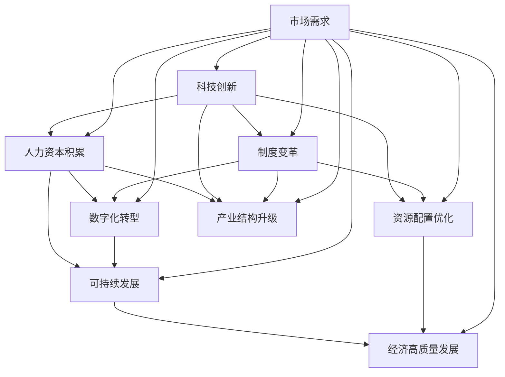

                 

## 文章标题

《中国现代化进程中的新质生产力发展》

### 关键词
- 中国现代化
- 新质生产力
- 科技创新
- 人力资本
- 数字经济
- 制度变革

### 摘要
本文旨在深入探讨中国现代化进程中新质生产力的发展。通过对中国现代化历程的回顾，新质生产力的定义与特征，以及其在中国的实践与应用，本文分析了新质生产力发展的理论基础、核心概念、关键因素和成功案例。同时，本文还讨论了新质生产力发展对经济、就业和社会的深远影响，并提出了新质生产力发展的政策建议和国际合作展望。本文旨在为读者提供一部全面、系统、深入剖析中国新质生产力发展的著作。

## 目录大纲

### 第一部分：中国现代化进程回顾

#### 1.1 中国现代化进程概述

- **中国现代化的历史背景**：回顾中国现代化的起源、历程和重要事件。
- **中国现代化的阶段性成果**：总结中国现代化在各阶段取得的重大成就。

#### 1.2 新质生产力概述

- **新质生产力的概念定义**：阐述新质生产力的定义及其与传统生产力的区别。
- **新质生产力与传统生产力的比较**：分析新质生产力的优势与特点。

#### 1.3 新质生产力的中国特色

- **中国新质生产力的发展现状**：描述中国新质生产力的现状及其在全球的地位。
- **中国新质生产力的发展挑战与机遇**：探讨中国新质生产力发展所面临的挑战和机遇。

### 第二部分：新质生产力发展理论

#### 2.1 新质生产力发展的理论基础

- **马克思主义关于生产力的理论**：回顾马克思主义对生产力的理论贡献。
- **现代经济学关于生产力的理论**：介绍现代经济学对生产力的研究。

#### 2.2 新质生产力发展的核心概念与联系

- **新质生产力的核心概念解析**：详细阐述新质生产力的核心概念。
- **新质生产力的Mermaid流程图**：展示新质生产力的发展流程。

#### 2.3 新质生产力发展的关键因素

- **科技创新**：探讨科技创新在新质生产力发展中的作用。
- **人力资本**：分析人力资本在新质生产力发展中的重要性。
- **制度变革**：讨论制度变革对新质生产力发展的推动作用。

### 第三部分：新质生产力发展的实践案例

#### 3.1 新质生产力发展的实践概述

- **新质生产力在中国的发展实践**：总结新质生产力在中国的发展实践。
- **新质生产力在不同领域的具体应用**：分析新质生产力在不同领域的应用情况。

#### 3.2 新质生产力发展的成功案例

- **案例一：中国高新技术产业的发展**：介绍中国高新技术产业的发展情况。
- **案例二：中国电子商务的发展**：探讨中国电子商务的发展路径。
- **案例三：中国数字经济的发展**：分析中国数字经济的发展趋势。

#### 3.3 新质生产力发展的挑战与应对策略

- **挑战分析**：分析新质生产力发展所面临的挑战。
- **应对策略**：提出应对新质生产力发展挑战的策略。

### 第四部分：新质生产力发展的政策与规划

#### 4.1 新质生产力发展的政策环境

- **国家层面对新质生产力发展的支持政策**：介绍国家层面支持新质生产力发展的政策。
- **地方层面对新质生产力发展的支持政策**：分析地方层面支持新质生产力发展的政策。

#### 4.2 新质生产力发展的规划布局

- **国家层面新质生产力发展的规划**：阐述国家层面新质生产力发展的规划。
- **地方层面新质生产力发展的规划**：讨论地方层面新质生产力发展的规划。

#### 4.3 新质生产力发展的未来展望

- **新质生产力发展的趋势预测**：预测新质生产力发展的趋势。
- **新质生产力发展对中国的长远影响**：探讨新质生产力发展对中国未来发展的深远影响。

### 第五部分：新质生产力发展的国际合作

#### 5.1 新质生产力发展的国际合作现状

- **国际合作的形式与内容**：分析新质生产力发展的国际合作形式和内容。
- **国际合作的优势与挑战**：探讨新质生产力发展国际合作的优劣势。

#### 5.2 新质生产力发展的国际合作案例

- **国际合作的成功案例**：介绍新质生产力发展的国际合作成功案例。
- **国际合作的挑战与应对**：分析新质生产力发展国际合作所面临的挑战及应对措施。

#### 5.3 新质生产力发展的国际合作展望

- **国际合作的发展方向**：预测新质生产力发展国际合作的发展方向。
- **国际合作对中国的意义**：讨论新质生产力发展国际合作对中国的影响和意义。

### 第六部分：新质生产力发展的社会影响

#### 6.1 新质生产力发展对就业的影响

- **新质生产力发展对就业结构的改变**：分析新质生产力发展对就业结构的影响。
- **新质生产力发展对就业机会的创造**：探讨新质生产力发展对就业机会的创造。

#### 6.2 新质生产力发展对经济增长的影响

- **新质生产力发展对经济增长的贡献**：阐述新质生产力发展对经济增长的贡献。
- **新质生产力发展对产业结构的影响**：分析新质生产力发展对产业结构的影响。

#### 6.3 新质生产力发展的社会效益分析

- **新质生产力发展对教育、医疗、文化等领域的影响**：探讨新质生产力发展对教育、医疗、文化等领域的影响。
- **新质生产力发展的社会稳定性和和谐发展**：讨论新质生产力发展对社会稳定性和和谐发展的贡献。

### 第七部分：新质生产力发展的综合评价

#### 7.1 新质生产力发展的评价指标体系

- **指标体系的设计原则**：阐述评价指标体系的设计原则。
- **指标体系的构成**：介绍评价指标体系的构成。

#### 7.2 新质生产力发展的综合评价方法

- **评价方法的原理**：解释综合评价方法的原理。
- **评价方法的步骤**：描述综合评价方法的步骤。

#### 7.3 新质生产力发展的综合评价结果

- **评价结果的总结**：总结综合评价的结果。
- **评价结果的启示**：探讨综合评价结果的启示。

### 附录

#### 附录 A：新质生产力发展相关文献与资料

- **新质生产力发展的相关书籍**：推荐新质生产力发展的相关书籍。
- **新质生产力发展的学术论文**：介绍新质生产力发展的学术论文。
- **新质生产力发展的报告与政策文件**：收集新质生产力发展的报告与政策文件。

#### 附录 B：新质生产力发展的重要数据与图表

- **新质生产力发展的相关统计数据**：提供新质生产力发展的相关统计数据。
- **新质生产力发展的图表展示**：展示新质生产力发展的图表。

#### 附录 C：新质生产力发展的实用工具与资源

- **新质生产力发展的开发工具**：介绍新质生产力发展的开发工具。
- **新质生产力发展的研究资源**：提供新质生产力发展的研究资源。
- **新质生产力发展的学习资源**：推荐新质生产力发展的学习资源。

---

### 引言

在当今世界，中国正处于一个历史性的变革时期，经历了从传统的农业社会向现代化工业社会转型的过程。这一进程中，新质生产力的发展成为了推动中国现代化进程的重要动力。新质生产力不仅为中国经济的高速增长提供了强大的引擎，也为社会的全面进步和人民的幸福生活奠定了坚实的基础。

新质生产力是一种不同于传统生产力的新型生产力，它以科技创新、人力资本和制度变革为核心，通过信息技术、生物技术、新能源技术等领域的快速发展，实现了生产要素的优化配置和全社会的生产效率提升。与传统生产力相比，新质生产力具有高知识含量、高附加值、高创新性和高可持续性的特点。

本文旨在系统地探讨中国现代化进程中的新质生产力发展。首先，我们将回顾中国现代化进程的历史和成果，为新质生产力的发展提供背景和基础。接着，我们将深入探讨新质生产力的概念、特征及其在中国的发展现状和挑战。随后，我们将分析新质生产力发展的理论基础、核心概念和关键因素。在实践案例部分，我们将通过具体实例展示新质生产力在不同领域的应用。接着，我们将讨论新质生产力发展的政策环境、国际合作和其对社会的影响。最后，我们将进行新质生产力发展的综合评价，并提出未来发展的建议。

通过本文的探讨，我们希望能够全面、系统地揭示新质生产力在中国现代化进程中的重要作用，为政策制定者、企业家和研究者提供有益的参考，同时也为公众理解新质生产力的发展提供思路和视角。

### 第一部分：中国现代化进程回顾

#### 1.1 中国现代化进程概述

中国的现代化进程是一个长期而复杂的历史过程，始于19世纪末的晚清时期。当时，面对西方列强的侵略和压迫，中国开始了现代化的探索。尽管起步晚，但中国现代化进程具有以下几个显著特点：

1. **改革开放前的探索**：在20世纪前期，中国进行了一系列的改革和尝试，如洋务运动、戊戌变法等，这些尝试为中国的现代化奠定了基础，但成效有限。其中，洋务运动是中国第一次大规模引进西方科技和制度，虽然最终失败，但对中国的现代化产生了深远影响。

2. **改革开放以来的快速发展**：1978年，中国开启了改革开放的新时期，经济体制从计划经济向市场经济转型。这一重大变革极大地释放了生产力，推动了经济的快速增长。特别是1992年邓小平南巡讲话后，中国加快了市场经济体制的建设，对外开放不断扩大，吸引了大量外资和技术，促进了经济的全面繁荣。

3. **科技创新驱动**：随着经济的快速发展，中国在科技创新方面取得了显著成就。通过加大科研投入、优化创新环境，中国在信息技术、生物技术、新材料等领域取得了重大突破，为现代化进程注入了新的动力。

4. **社会发展与民生改善**：现代化不仅体现在经济和科技方面，还体现在社会发展和民生改善上。中国通过推进教育、医疗、社会保障等领域的改革，显著提高了人民的生活水平，实现了社会的全面进步。

5. **中国特色的现代化道路**：中国在现代化进程中，始终坚持中国特色社会主义道路，既借鉴了西方国家的先进经验，又根据自身国情进行创新，走出了一条具有中国特色的现代化道路。

#### 1.2 中国现代化的阶段性成果

中国现代化的进程可以分为几个阶段，每个阶段都取得了显著的成果：

1. **第一阶段（1978-1990年代末）**：改革开放初期，中国主要集中在经济体制改革上，通过引入市场机制，释放了经济活力，实现了经济的高速增长。这一阶段的成果主要体现在经济领域，如GDP的高速增长、外资的引入和城市化进程的加速。

2. **第二阶段（2000年代初至2010年代）**：进入21世纪后，中国开始推动产业结构升级和科技创新。这一阶段的成果体现在科技领域，如互联网、电子商务、高新技术产业的快速发展，以及一系列重大科技成果的取得。

3. **第三阶段（2010年代至今）**：随着中国经济的进一步发展和国际地位的提升，中国开始注重高质量发展，强调创新驱动和可持续发展。这一阶段的成果体现在经济和社会的各个方面，如数字经济的崛起、绿色能源的推广、社会治理的优化等。

总之，中国现代化进程是一个不断探索、不断进步的过程。在改革开放以来的40多年里，中国取得了举世瞩目的成就，不仅成为全球第二大经济体，还在科技创新、社会发展和民生改善等方面取得了显著的进步。这些成果为中国进一步推进现代化奠定了坚实的基础，也为新质生产力的发展提供了广阔的空间。

### 第一部分：中国现代化进程回顾

#### 1.1 中国现代化进程概述

中国的现代化进程可以追溯到19世纪末的晚清时期，当时中国面对西方列强的侵略和压迫，开始了现代化的探索。然而，这一时期的现代化尝试由于种种原因未能取得显著成效。真正具有转折意义的现代化进程始于1978年的改革开放。

1. **改革开放前的探索**：在20世纪前期，中国进行了一系列的改革和尝试，如洋务运动、戊戌变法等。洋务运动是中国第一次大规模引进西方科技和制度，尽管最终失败，但对中国的现代化产生了深远影响。戊戌变法试图通过政治改革推动现代化，但同样未能成功。这些尝试为中国的现代化奠定了基础，但成效有限。

2. **改革开放以来的快速发展**：1978年，中国开启了改革开放的新时期，经济体制从计划经济向市场经济转型。这一重大变革极大地释放了生产力，推动了经济的快速增长。特别是1992年邓小平南巡讲话后，中国加快了市场经济体制的建设，对外开放不断扩大，吸引了大量外资和技术，促进了经济的全面繁荣。

3. **科技创新驱动**：随着经济的快速发展，中国在科技创新方面取得了显著成就。通过加大科研投入、优化创新环境，中国在信息技术、生物技术、新材料等领域取得了重大突破，为现代化进程注入了新的动力。例如，中国的高铁技术、5G通信技术、超级计算机技术等均处于全球领先地位。

4. **社会发展与民生改善**：现代化不仅体现在经济和科技方面，还体现在社会发展和民生改善上。中国通过推进教育、医疗、社会保障等领域的改革，显著提高了人民的生活水平，实现了社会的全面进步。教育方面，九年义务教育全面普及，高等教育毛入学率大幅提升；医疗方面，新农合和城镇居民医保的建立，大大提高了医疗可及性；社会保障方面，覆盖面不断扩大，人民群众的基本生活得到有效保障。

5. **中国特色的现代化道路**：中国在现代化进程中，始终坚持中国特色社会主义道路，既借鉴了西方国家的先进经验，又根据自身国情进行创新，走出了一条具有中国特色的现代化道路。这一道路不仅成功实现了经济快速增长，还保持了社会稳定，为全球发展提供了有益借鉴。

综上所述，中国的现代化进程是一个从起步晚、成效有限的探索，到改革开放后快速发展的历史过程。在这一过程中，中国不仅在经济和科技领域取得了举世瞩目的成就，还在社会发展和民生改善方面实现了显著进步。这些成就为中国进一步推进现代化奠定了坚实的基础。

### 第一部分：中国现代化进程回顾

#### 1.2 新质生产力概述

新质生产力是指以科技创新、人力资本和制度变革为核心，通过新技术、新业态、新模式的发展，推动经济高质量增长和结构优化的一种新型生产力。它具有高知识含量、高附加值、高创新性和高可持续性的特点，是现代化进程中的重要驱动力。以下是新质生产力的定义、特征及其与传统生产力的区别：

#### 1.2.1 新质生产力的定义

新质生产力是一种不同于传统生产力的新型生产力，它强调通过科技创新和人力资本的积累，实现生产要素的优化配置和全社会的生产效率提升。新质生产力不仅包括物质生产力的提升，还涵盖信息生产力、智力生产力等非物质生产力的增长。

#### 1.2.2 新质生产力的特征

1. **高知识含量**：新质生产力依赖于知识和技术的积累与创新，通过不断引入新技术、新工艺、新管理方式，提升生产效率和质量。
2. **高附加值**：新质生产力通过技术创新和工艺改进，提高了产品的附加值，实现了从低成本、低利润的生产模式向高附加值、高利润的生产模式转变。
3. **高创新性**：新质生产力强调持续创新，不断推动新技术、新产品、新业态、新模式的产生，形成持续的创新动力。
4. **高可持续性**：新质生产力通过绿色技术和可持续发展战略，减少资源消耗和环境污染，实现经济、社会和环境的协调发展。

#### 1.2.3 新质生产力与传统生产力的区别

1. **驱动因素**：传统生产力主要依赖自然资源和劳动力，新质生产力则依赖科技创新、人力资本和制度变革。
2. **生产方式**：传统生产力以大规模、标准化、流水线生产为主，新质生产力则以小规模、个性化、智能化生产为主。
3. **产品特点**：传统生产力生产的产品通常以低附加值、低差异化为主，新质生产力生产的产品则具有高附加值、高差异化、高定制化的特点。
4. **经济效益**：传统生产力通常以低成本、低利润为主，新质生产力则通过高附加值、高利润实现更高的经济效益。
5. **环境影响**：传统生产力往往伴随着大量的资源消耗和环境污染，新质生产力则通过绿色技术和可持续发展战略减少环境影响。

总之，新质生产力作为一种现代化的生产力形式，具有显著的比较优势和发展潜力。它不仅是推动中国现代化进程的重要动力，也是实现经济高质量发展、可持续发展的重要保障。

### 第一部分：中国现代化进程回顾

#### 1.3 新质生产力的中国特色

新质生产力在中国的发展具有独特的中国特色，这不仅体现在其发展路径上，也体现在其政策和实践上。以下是对中国新质生产力发展现状、挑战与机遇的深入探讨：

#### 1.3.1 中国新质生产力的发展现状

1. **科技实力显著提升**：中国在新质生产力发展方面取得了显著成就，特别是在信息技术、生物技术、新材料等领域。例如，中国在5G通信、人工智能、高铁技术等方面处于全球领先地位，科技创新能力大幅提升。

2. **产业结构持续优化**：随着新质生产力的推动，中国的产业结构不断优化，传统产业逐渐向高附加值、高技术含量的产业转变。例如，高技术制造业、服务业和高科技产业在国内生产总值中的比重逐年上升。

3. **数字经济蓬勃发展**：数字经济作为新质生产力的重要组成部分，在中国得到了迅猛发展。电子商务、互联网金融、共享经济等新兴业态不断涌现，推动了经济的数字化转型和升级。

4. **人力资本大幅提升**：中国通过大力发展教育、提高劳动者素质，增强了人力资本积累。高等教育毛入学率不断提高，技能培训体系不断完善，为新质生产力的发展提供了强大的人力支持。

5. **制度变革持续推进**：中国政府在新质生产力发展方面不断推进制度变革，优化创新环境，提升市场化程度。例如，通过改革科技评价体系、知识产权保护制度等，激发了创新活力。

#### 1.3.2 中国新质生产力发展的挑战

1. **创新能力不足**：尽管中国在某些领域取得了显著成就，但整体创新能力仍有待提高。与发达国家相比，中国的科技研发投入、原创性科技成果和高端人才仍存在差距。

2. **结构性问题**：中国的产业结构升级仍然面临结构性问题，部分传统产业产能过剩，高附加值产业相对不足。这需要通过进一步的政策引导和产业调整来解决。

3. **区域发展不平衡**：新质生产力的发展在不同地区之间存在明显不平衡。东部地区由于经济基础较好，科技创新和产业发展相对较快，而中西部地区则相对滞后。

4. **资源环境约束**：新质生产力的发展不可避免地伴随着资源消耗和环境污染问题。如何在保持经济发展的同时实现绿色发展，是一个重大的挑战。

5. **制度环境有待优化**：尽管中国在新质生产力发展方面取得了一些制度性成就，但与高质量发展的要求相比，制度环境仍有待进一步优化。例如，知识产权保护、市场准入机制、创新激励政策等方面需要进一步完善。

#### 1.3.3 中国新质生产力发展的机遇

1. **全球化机遇**：随着全球经济一体化进程的加快，中国可以更好地利用全球创新资源，通过国际合作提升自身创新能力。特别是在“一带一路”倡议下，中国可以加强与各国的技术交流和合作，实现共同发展。

2. **政策支持**：中国政府高度重视新质生产力发展，出台了一系列支持科技创新、产业升级和绿色发展的政策措施。这些政策的实施为新质生产力的发展提供了良好的环境。

3. **市场需求**：随着国内消费升级和居民收入水平的提高，对高质量、高附加值产品的需求不断增长。这为新质生产力的发展提供了巨大的市场空间。

4. **科技进步**：全球科技的快速发展为中国的科技创新提供了丰富的资源和机遇。通过引进、消化、吸收再创新，中国可以快速提升自身科技水平。

5. **人口红利**：中国拥有庞大的人口基数和人力资源，通过提高劳动者素质和技能，可以进一步发挥人口红利的优势，为新质生产力的发展提供强大的人力支持。

总之，中国新质生产力的发展具有显著的特色和巨大的潜力。在面临挑战的同时，中国也拥有许多机遇。通过政策引导、科技创新和制度变革，中国有望在新质生产力发展的道路上走得更远、更稳、更快。

### 第二部分：新质生产力发展理论

#### 2.1 新质生产力发展的理论基础

新质生产力的发展理论是一个多维度的概念体系，它融合了马克思主义关于生产力的理论、现代经济学关于生产力的理论以及中国特有的发展理念。这些理论为基础，为新质生产力的发展提供了深刻的理论指导。

#### 2.1.1 马克思主义关于生产力的理论

马克思主义生产力理论的核心观点是，生产力是社会发展的根本动力。马克思在其著作中阐述了生产力与生产关系、经济基础与上层建筑之间的辩证关系。具体来说，马克思主义关于生产力的理论包括以下几个方面：

1. **生产力决定生产关系**：生产力是社会发展的基础，它决定了社会的生产关系。当生产力发展到一定阶段，原有的生产关系将阻碍生产力的发展，进而导致社会革命。

2. **科技进步是生产力发展的关键**：马克思认为，科技进步是推动生产力发展的重要力量。新的科技革命和产业变革往往带来生产力的跨越式发展。

3. **生产关系的适应性调整**：随着生产力的提升，生产关系需要不断进行调整，以适应新的生产力水平。这包括所有制关系、分配关系和交换关系等。

#### 2.1.2 现代经济学关于生产力的理论

现代经济学在生产力理论方面进行了深入的探讨，提出了许多有影响力的观点。以下是一些主要理论：

1. **新古典经济学**：新古典经济学认为，生产力由劳动、资本和技术等生产要素构成。通过优化生产要素的组合和配置，可以提高生产效率。新古典经济学还强调市场价格机制在资源配置中的核心作用。

2. **技术创新理论**：罗默和卢卡斯等经济学家提出了技术创新理论，认为技术创新是经济增长的主要驱动力。通过不断的技术创新，可以推动生产要素的优化配置，实现持续的经济增长。

3. **人力资本理论**：舒尔茨和贝克尔等人提出了人力资本理论，强调人力资本在经济增长中的重要性。人力资本包括教育、培训、健康等，通过提高人力资本水平，可以提升全社会的生产力。

4. **内生增长理论**：罗默和卢卡斯等经济学家提出了内生增长理论，认为技术进步不是外生给定的，而是可以通过经济体系内部的创新机制实现。内生增长理论强调知识积累、研发投入和创新文化在经济增长中的重要作用。

#### 2.1.3 中国特色的发展理念

中国在结合马克思主义和现代经济学理论的基础上，形成了具有中国特色的发展理念。这些理念为新质生产力的发展提供了独特的理论指导：

1. **创新驱动发展**：中国提出创新是引领发展的第一动力，强调通过科技创新、制度创新和文化创新，推动经济高质量发展。

2. **协调发展**：中国强调经济、社会、环境协调发展，通过优化产业结构、区域布局和城乡结构，实现全面协调可持续发展。

3. **绿色发展**：中国提出绿色发展理念，强调通过科技创新和制度变革，实现经济发展与环境保护的良性循环。

4. **共享发展**：中国强调通过深化改革、完善制度，促进社会公平正义，实现全体人民共同富裕。

总之，新质生产力的发展理论是一个多维度的体系，它融合了马克思主义、现代经济学和中国特色的发展理念。这些理论为基础，为新质生产力的发展提供了深刻的指导，为中国的现代化进程注入了强大动力。

### 第二部分：新质生产力发展理论

#### 2.2 新质生产力发展的核心概念与联系

新质生产力的发展涉及多个核心概念，这些概念相互联系，共同构成了新质生产力的理论框架。以下是对这些核心概念的详细解析及其之间的联系：

#### 2.2.1 核心概念解析

1. **科技创新**：科技创新是新质生产力的核心驱动力，通过新技术、新产品、新工艺的研发和应用，推动生产力的提升。科技创新不仅包括传统意义上的技术突破，还包括商业模式创新、管理创新等。

2. **人力资本**：人力资本是指劳动者所具备的知识、技能、经验和健康等素质，它是新质生产力的重要组成部分。通过提升人力资本水平，可以显著提高生产效率和质量。

3. **制度变革**：制度变革是新质生产力发展的重要保障，通过优化制度环境、完善法律法规，可以激发创新活力、优化资源配置，为新质生产力的提升提供制度支持。

4. **数字化转型**：数字化转型是指通过互联网、大数据、人工智能等新一代信息技术，对传统产业进行升级改造，实现生产方式的智能化和现代化。数字化转型是推动新质生产力发展的重要途径。

5. **可持续发展**：可持续发展是新质生产力发展的关键目标，强调在经济增长的同时，实现资源节约、环境保护和经济社会协调发展。

#### 2.2.2 联系与互动

1. **科技创新与人力资本**：科技创新需要高水平的人力资本支持，而人力资本的积累和提高又依赖于科技创新的成果。科技创新和人力资本相互促进，共同推动新质生产力的发展。

2. **制度变革与科技创新**：制度变革为科技创新提供了良好的环境和保障。通过制度创新，可以减少创新过程中的障碍，激励企业和个人进行科技创新。同时，科技创新的成功实施也需要制度变革的支持。

3. **数字化转型与可持续发展**：数字化转型通过提高生产效率、优化资源配置，有助于实现可持续发展。在数字化转型的过程中，可以通过大数据、人工智能等技术的应用，实现资源的高效利用和环境保护。

4. **科技创新与可持续发展**：科技创新是实现可持续发展的重要手段。通过技术创新，可以开发出更多绿色技术、节能技术和环保技术，推动经济、社会和环境的协调发展。

5. **制度变革与可持续发展**：制度变革是推动可持续发展的重要保障。通过建立健全的法律法规和政策体系，可以确保可持续发展的目标得到有效实施。同时，制度变革还可以引导企业和个人积极参与可持续发展。

总之，新质生产力发展的核心概念相互联系，共同构成了新质生产力的理论框架。通过深入理解这些概念及其之间的互动关系，可以更好地指导新质生产力的发展，推动中国经济实现高质量发展。

#### 2.2.3 新质生产力的Mermaid流程图

为了更好地展示新质生产力的发展流程，我们可以使用Mermaid语言绘制一个流程图，详细描述各个环节及其相互关系。

**流程图解释：**
1. **科技创新（A）**：作为新质生产力的核心驱动力，科技创新通过引入新技术、新产品、新工艺，推动生产力的发展。
2. **人力资本积累（B）**：科技创新需要高水平的人力资本支持，人力资本积累通过教育、培训等方式提高劳动者的素质和能力。
3. **制度变革（C）**：制度变革为新质生产力的发展提供良好的环境和保障，通过完善法律法规和政策体系，激发创新活力和优化资源配置。
4. **数字化转型（D）**：数字化转型通过新一代信息技术对传统产业进行升级改造，实现生产方式的智能化和现代化。
5. **可持续发展（E）**：可持续发展是贯穿新质生产力发展的关键目标，通过资源的高效利用和环境保护，实现经济、社会和环境的协调发展。
6. **资源配置优化（F）**：资源配置优化通过科技创新和数字化转型，提高资源的利用效率，实现资源的高效配置。
7. **产业结构升级（H）**：产业结构升级通过科技创新和制度变革，推动传统产业向高附加值、高技术含量的产业转变。
8. **市场需求（I）**：市场需求是新质生产力发展的外部动力，通过满足市场需求，推动新质生产力的发展。

通过这个流程图，我们可以清晰地看到新质生产力发展的各个环节及其相互关系，为新质生产力的发展提供理论指导。

### 第二部分：新质生产力发展理论

#### 2.3 新质生产力发展的关键因素

新质生产力的发展是一个复杂的系统性工程，涉及多个关键因素。以下是对科技创新、人力资本和制度变革三个关键因素的详细分析：

#### 2.3.1 科技创新

科技创新是新质生产力的核心驱动力。科技创新不仅包括科学发现和技术发明，还包括技术转移、技术集成和商业模式创新。以下是科技创新在新质生产力发展中的关键作用：

1. **推动技术进步**：科技创新不断推动技术的进步，提高生产效率和产品质量。通过新技术、新工艺、新材料的研发和应用，企业可以生产出更加高效、环保和高附加值的产品。
   
2. **促进产业升级**：科技创新促使产业结构不断升级，推动传统产业向高技术、高附加值的产业转型。例如，通过数字化转型和智能制造，传统制造业可以实现智能化和绿色化。
   
3. **增强国际竞争力**：科技创新提高企业的竞争力，使企业在国际市场中占据有利地位。通过技术创新，企业可以开发出具有独特优势的产品和服务，满足全球市场需求。
   
4. **驱动经济增长**：科技创新是经济增长的主要动力。通过科技创新，可以提高生产要素的利用效率，推动经济的持续增长。

#### 2.3.2 人力资本

人力资本是指劳动者所具备的知识、技能、经验和健康等素质。在新质生产力的发展中，人力资本起着至关重要的作用。以下是人力资本的关键作用：

1. **提升生产效率**：人力资本的提升可以显著提高生产效率。通过教育、培训和实践，劳动者可以掌握先进的技术和技能，提高劳动生产率。
   
2. **促进创新活动**：高水平的人力资本是创新活动的重要基础。具有创新精神和创新能力的人才可以推动企业进行科技创新和商业模式创新，提高企业的竞争力。
   
3. **优化资源配置**：人力资本可以优化资源配置。通过专业化分工和协作，劳动者可以更有效地利用各种资源，提高生产效率和经济效益。
   
4. **推动社会进步**：人力资本的发展不仅对经济有重要影响，还对社会的进步有积极作用。通过提高人民的教育水平和技能，可以促进社会公平、提高社会福利。

#### 2.3.3 制度变革

制度变革是新质生产力发展的保障和推动力。通过制度创新，可以为科技创新和人力资本的发展提供良好的环境和制度支持。以下是制度变革的关键作用：

1. **优化创新环境**：制度变革可以为科技创新提供良好的环境。通过完善知识产权保护制度、减少市场准入壁垒、提供政策支持和资金投入，可以激发企业的创新活力。
   
2. **促进资源配置**：制度变革可以优化资源配置，提高资源利用效率。通过市场机制和政府引导，可以有效地配置科技资源、人力资本和物质资源，实现资源的高效利用。
   
3. **提升治理能力**：制度变革可以提高政府的治理能力，推动新质生产力的发展。通过建立健全的法律体系和监管机制，可以保障科技创新的顺利进行，促进经济社会的协调发展。
   
4. **推动社会进步**：制度变革可以推动社会进步，提高人民的生活水平和幸福感。通过完善社会保障体系、提高公共服务质量、促进社会公平，可以构建和谐社会。

总之，科技创新、人力资本和制度变革是新质生产力发展的关键因素。通过科技创新，可以提高生产效率和质量；通过提升人力资本，可以推动创新活动和社会进步；通过制度变革，可以为新质生产力的发展提供良好的环境和制度支持。这三个因素相互促进、相互依赖，共同推动新质生产力的发展，推动中国经济实现高质量发展。

### 第三部分：新质生产力发展的实践案例

#### 3.1 新质生产力发展的实践概述

新质生产力的发展不仅是一种理论上的探讨，更体现在实际应用中。中国在新质生产力发展的实践中，已经取得了显著的成果，并在多个领域形成了独特的应用模式。以下是新质生产力在中国发展的实践概述：

1. **科技领域**：中国在新一代信息技术、人工智能、生物技术、新能源等领域取得了重大突破。例如，中国在5G通信、人工智能、超级计算等领域处于全球领先地位，这些技术为新质生产力的发展提供了强大的技术支撑。

2. **产业领域**：新质生产力在中国产业结构调整和升级中发挥了重要作用。传统制造业通过智能制造、数字化改造，实现了生产效率和产品质量的提升。同时，新兴产业如互联网经济、数字经济、共享经济等快速发展，推动了产业结构的优化。

3. **经济领域**：新质生产力的发展推动了经济的高质量增长。通过科技创新和制度变革，中国的经济增长模式从资源驱动向创新驱动转变，经济结构不断优化，经济发展质量和效益显著提升。

4. **社会领域**：新质生产力的发展还促进了社会的全面进步。通过提升人力资本、改善公共服务、推动绿色发展，新质生产力为社会发展和人民生活水平的提高提供了有力保障。

#### 3.2 新质生产力在不同领域的具体应用

新质生产力在不同领域的应用情况各具特色，以下是一些具体应用案例：

1. **科技领域**：在科技领域，新质生产力通过科技创新推动了科技产业的发展。例如，人工智能在金融、医疗、教育等领域的应用，提升了行业效率和用户体验。5G技术的推广，为智能工厂、智能交通等应用场景提供了基础。

2. **产业领域**：新质生产力在制造业中的应用尤为突出。通过智能制造、物联网、大数据等技术，传统制造业实现了生产过程的自动化、智能化。例如，海尔集团的“智能工厂”通过物联网技术实现了生产线的实时监控和优化，提高了生产效率和产品质量。

3. **经济领域**：数字经济是新质生产力在经济领域的典型应用。通过电子商务、互联网金融等模式，数字经济极大地提升了市场效率，推动了消费升级。例如，阿里巴巴和京东等电商平台，通过大数据分析和技术创新，为消费者提供了更加便捷的购物体验。

4. **社会领域**：新质生产力在社会领域的应用涵盖了教育、医疗、文化等多个方面。在教育领域，在线教育平台如学而思、猿辅导等，通过互联网技术为学习者提供了个性化的教育服务。在医疗领域，远程医疗和医疗大数据的应用，提高了医疗服务的可及性和效率。在文化领域，数字文化和网络文学等新兴产业，丰富了人们的精神生活。

总之，新质生产力的发展在多个领域展现了其强大的应用潜力。通过科技创新、制度变革和人力资本的提升，新质生产力不断推动中国经济和社会的发展，为未来提供了广阔的前景。

### 第三部分：新质生产力发展的实践案例

#### 3.2 新质生产力发展的成功案例

新质生产力的发展在中国取得了许多成功案例，这些案例不仅展示了新质生产力的强大潜力，也为其他领域提供了宝贵的经验。以下是一些具体的新质生产力成功案例：

**案例一：中国高新技术产业的发展**

中国高新技术产业的发展是新质生产力成功应用的典范。自20世纪90年代以来，中国通过大力支持科技创新和产业升级，高新技术产业得到了迅速发展。例如，在信息技术领域，中国的华为、阿里巴巴和腾讯等企业，通过持续的技术创新，已经成为全球领先的科技公司。华为在5G通信技术方面的突破，使中国在5G领域处于全球领先地位；阿里巴巴和腾讯在电子商务和社交媒体领域的创新，极大地提升了市场效率和用户体验。

**案例二：中国电子商务的发展**

中国电子商务的发展也是新质生产力成功应用的一个典型案例。随着互联网技术的普及和消费者需求的提升，中国的电子商务市场迅速扩张。阿里巴巴旗下的淘宝和天猫平台，通过技术创新和商业模式创新，极大地提升了市场效率。例如，淘宝的“双11”购物节已经成为全球最大的网络购物节，吸引了数亿消费者参与，推动了消费升级。此外，京东等电商平台通过物流网络的优化和智能化，实现了快速配送和高效服务。

**案例三：中国数字经济的发展**

中国数字经济的发展是另一个成功案例，展示了中国在新质生产力应用上的卓越成就。通过互联网、大数据、人工智能等新技术的应用，中国数字经济蓬勃发展。例如，腾讯的微信平台通过社交、支付、小程序等功能的融合，构建了一个庞大的数字经济生态系统。支付宝等移动支付平台，通过技术创新和用户体验优化，极大地提升了金融服务的便捷性和安全性。数字经济不仅推动了传统产业的转型升级，还催生了众多新兴业态，如共享经济、在线教育、在线医疗等。

**案例四：中国新能源产业的发展**

中国新能源产业的发展也是新质生产力成功应用的重要体现。通过政策支持和技术创新，中国在新能源领域取得了显著成就。例如，中国的光伏产业已经成为全球最大的光伏市场，企业的生产规模和技术水平处于世界领先地位。比亚迪等企业在新能源汽车领域也取得了突破，推出了多款性能优异的新能源汽车，为减少碳排放和实现可持续发展做出了重要贡献。

这些成功案例表明，新质生产力的发展不仅推动了中国经济的快速增长，还提升了中国的国际竞争力。通过持续的技术创新、制度变革和人力资本的提升，中国在新质生产力发展的道路上将继续前行，为全球经济发展提供新的动力和范例。

### 第三部分：新质生产力发展的实践案例

#### 3.3 新质生产力发展的挑战与应对策略

尽管新质生产力在中国的发展取得了显著成就，但在实践中仍面临诸多挑战。以下是对这些挑战的分析以及相应的应对策略：

**挑战一：创新能力不足**

中国在新质生产力发展中的创新能力仍需提升。尽管在某些领域如信息技术、新能源等取得了突破，但整体上，原创性科技成果和高端人才仍然不足。应对策略：

1. **加大研发投入**：政府和企业应增加研发投入，特别是对基础研究和前沿技术的支持，为科技创新提供充足的资金保障。
2. **完善创新环境**：优化创新环境，包括知识产权保护、科技成果转化政策、创新激励机制等，激发企业和个人的创新活力。
3. **加强国际科技合作**：通过国际合作，引进国外先进技术和管理经验，提升本土创新能力。

**挑战二：结构性问题**

新质生产力发展过程中，中国产业结构调整仍面临一些结构性问题。传统产业产能过剩，高附加值产业相对不足。应对策略：

1. **推动产业升级**：加大对高技术产业的支持力度，通过政策引导和资金投入，推动传统产业向高附加值、高技术含量产业转型。
2. **优化区域布局**：加强对中西部地区的支持，推动区域协调发展，减少地区发展不平衡。
3. **发展新兴产业**：鼓励新兴产业的发展，特别是数字经济、绿色能源等，以新兴产业带动整体产业结构的优化。

**挑战三：资源环境约束**

新质生产力的发展不可避免地伴随着资源消耗和环境污染问题。应对策略：

1. **绿色发展**：推动绿色技术和可持续发展战略，通过技术创新和制度变革，实现经济、社会和环境的协调发展。
2. **节能减排**：加大对节能减排技术的研发和应用力度，提高资源利用效率，减少污染物排放。
3. **环境监管**：加强环境监管，建立健全的环境法规和政策体系，确保环境保护措施得到有效实施。

**挑战四：制度环境不足**

新质生产力发展需要完善的制度环境支持。当前，一些制度环境方面的问题仍然存在，如市场准入门槛高、知识产权保护不力等。应对策略：

1. **完善市场机制**：减少市场准入壁垒，优化市场环境，提高市场效率。
2. **强化知识产权保护**：加强知识产权保护，提高企业和个人创新成果的收益，激励创新活动。
3. **改革科技评价体系**：完善科技评价体系，注重科技成果的转化和应用，减少对论文和奖项的过度依赖。

通过应对这些挑战，中国可以进一步推动新质生产力的发展，实现经济的高质量增长和可持续发展。

### 第四部分：新质生产力发展的政策与规划

#### 4.1 新质生产力发展的政策环境

新质生产力的发展离不开良好的政策环境支持。中国政府高度重视新质生产力的发展，出台了一系列政策文件，以促进科技创新、产业升级和制度变革。以下是新质生产力发展的政策环境概述：

**国家层面对新质生产力发展的支持政策**

1. **科技创新政策**：政府通过加大科研投入、设立科技创新基金、推进科研体制改革等方式，支持科技创新。例如，国家自然科学基金、重大科技专项等，为科研人员提供了充足的资金支持。

2. **产业支持政策**：政府通过制定产业政策，支持高技术产业和新兴产业的发展。例如，对新能源汽车、电子信息、生物医药等战略性新兴产业给予税收优惠、财政补贴等支持政策。

3. **人才政策**：政府通过实施人才引进计划、优化人才激励机制、提高人才待遇等方式，吸引和培养高层次人才。例如，“千人计划”、“万人计划”等，旨在引进海外高层次人才，提升国内科技水平。

4. **绿色发展政策**：政府通过制定绿色发展政策，支持环境保护和可持续发展。例如，推广绿色技术、实施节能减排政策、加强环境保护执法等，促进新质生产力发展过程中的绿色化转型。

**地方层面对新质生产力发展的支持政策**

1. **地方科技创新政策**：地方政府根据自身实际情况，出台了一系列支持科技创新的政策。例如，设立科技创新基金、提供研发补贴、优化创新环境等，以促进地方科技创新。

2. **产业扶持政策**：地方政府通过制定产业扶持政策，支持本地产业升级和转型。例如，对高新技术企业和新兴产业给予税收优惠、资金支持等，促进地方经济高质量发展。

3. **人才引进政策**：地方政府通过实施人才引进政策，吸引高层次人才来本地创新创业。例如，提供住房补贴、子女教育优惠、创业扶持等，以提升地方人才储备和创新能力。

4. **区域协同发展政策**：地方政府通过区域协同发展政策，促进区域间的科技创新和产业合作。例如，建立跨区域的科技创新合作平台、推动产业园区共建等，以实现资源优势互补和共同发展。

总之，新质生产力的发展离不开良好的政策环境支持。国家层面和地方层面的政策协同发力，为科技创新、产业升级和制度变革提供了有力保障，为中国新质生产力的发展创造了有利条件。

### 第四部分：新质生产力发展的政策与规划

#### 4.2 新质生产力发展的规划布局

新质生产力的发展需要科学的规划布局，以实现资源的高效配置和产业的高质量发展。在国家层面和地方层面，中国已经制定了一系列新质生产力发展的规划，以下是对这些规划布局的详细描述：

**国家层面新质生产力发展的规划**

1. **“十四五”规划**：国家在“十四五”规划中明确提出，要加快科技创新和产业升级，推动新质生产力的发展。规划重点包括：

   - 提升科技创新能力：加强基础研究和应用研究，推动关键核心技术攻关，提高科技创新对经济增长的贡献率。
   - 优化产业结构：推动传统产业向高端化、智能化、绿色化方向转型，培育壮大新兴产业，提升产业链现代化水平。
   - 推动数字化转型：加快数字化基础设施建设和应用，推动各行业数字化升级，提高全社会的数字化水平和智能化水平。
   - 加强人才队伍建设：加大人才培养和引进力度，优化人才发展环境，提升人力资本质量。

2. **科技创新2030重大项目**：国家启动了一系列科技创新2030重大项目，如新一代人工智能、深海探测、量子通信等，旨在通过重大科技项目的突破，引领新质生产力的发展。

3. **国家科技创新中心建设**：国家通过支持北京、上海、粤港澳大湾区等科技创新中心的建设，打造具有全球影响力的科技创新高地，为新质生产力的发展提供强大的科技支撑。

**地方层面新质生产力发展的规划**

1. **区域协同创新发展规划**：地方政府根据区域特色和优势，制定了一系列区域协同创新发展规划。例如，长三角地区一体化发展、京津冀协同发展等，通过跨区域合作，推动新质生产力的发展。

2. **高新技术产业园区规划**：地方政府通过设立高新技术产业园区，推动高技术产业的发展。例如，北京中关村、深圳南山等高新技术产业园区，已成为新质生产力发展的重要基地。

3. **人才发展计划**：地方政府通过实施人才发展计划，吸引和培养高层次人才。例如，苏州工业园区的人才引进政策、杭州的“双创”政策等，为地方新质生产力的发展提供了人才保障。

4. **绿色发展行动计划**：地方政府制定绿色发展行动计划，推动新质生产力发展过程中的绿色化转型。例如，上海市的“绿色智造行动计划”、深圳市的“低碳发展行动计划”等，通过技术创新和制度变革，实现经济、社会和环境的协调发展。

总之，新质生产力发展的规划布局在国家层面和地方层面得到了全面推进。通过科学的规划布局，中国为新质生产力的发展创造了良好的条件，为实现经济高质量发展奠定了坚实的基础。

### 第四部分：新质生产力发展的政策与规划

#### 4.3 新质生产力发展的未来展望

随着新质生产力的不断发展，其对中国的经济和社会发展将产生深远影响。未来，新质生产力的发展趋势、政策走向以及可能的长远影响将是本文探讨的重点。

#### 4.3.1 新质生产力发展的趋势

1. **智能化趋势**：随着人工智能、大数据、物联网等技术的发展，智能化将成为新质生产力发展的主要趋势。智能化的应用将不仅限于生产领域，还将深入到服务业、医疗、教育等各个领域，提升整体社会的生产效率和生活质量。

2. **绿色化趋势**：绿色发展理念深入人心，绿色技术和可持续发展战略将更加受到重视。未来，新质生产力的发展将更加注重环境保护和资源节约，推动经济、社会和环境的协调发展。

3. **全球化趋势**：全球化进程将继续推进，新质生产力的发展将进一步加强与国际市场的融合。通过国际合作和全球资源配置，中国将更好地融入全球经济体系，提升国际竞争力。

4. **数字化趋势**：数字化是未来新质生产力发展的另一个重要方向。通过数字化技术的广泛应用，新质生产力将推动各个行业的数字化转型，提高生产效率和资源配置效率。

#### 4.3.2 政策走向

1. **加大科技创新投入**：政府将继续加大科技创新投入，特别是对基础研究和前沿技术的支持。通过设立更多的科技创新基金、加强科研体制改革等措施，提高科技创新能力。

2. **优化产业政策**：政府将进一步完善产业政策，支持高技术产业和战略性新兴产业的发展。通过减税降费、提供融资支持等政策措施，激发企业创新活力。

3. **强化人才政策**：政府将继续强化人才政策，通过实施人才引进计划、优化人才发展环境等措施，吸引和培养高层次人才。人才是推动新质生产力发展的关键因素，未来政府将在这方面投入更多资源。

4. **推进绿色发展**：政府将加大对绿色技术和可持续发展战略的支持力度，推动新质生产力发展过程中的绿色化转型。通过实施更加严格的环保政策、推广绿色技术等手段，实现经济、社会和环境的协调发展。

#### 4.3.3 长远影响

1. **经济影响**：新质生产力的发展将推动中国经济实现高质量发展。通过科技创新和产业升级，中国的经济结构将更加优化，经济增长将更加依靠创新驱动。未来，中国有望在全球价值链中占据更高地位。

2. **社会影响**：新质生产力的发展将深刻改变社会生产方式和生活方式。智能化、数字化技术的发展将提高生产效率和服务质量，提升人民的生活水平。同时，绿色发展理念的实施将改善环境质量，提高人民的生活幸福感。

3. **国际影响**：新质生产力的发展将增强中国的国际竞争力。通过加强国际合作、参与全球价值链，中国将更好地融入全球经济体系，提升国际影响力和话语权。

4. **政策启示**：新质生产力的发展为其他发展中国家提供了有益的启示。通过学习中国在新质生产力发展方面的成功经验，其他发展中国家可以借鉴中国的政策模式和发展路径，实现经济和社会的快速发展。

总之，新质生产力的发展是中国现代化进程中的重要动力。未来，随着智能化、绿色化、全球化、数字化趋势的深入推进，新质生产力将对中国经济和社会发展产生更加深远的影响。政府需要继续加大政策支持力度，推动新质生产力的发展，为实现高质量发展和可持续发展奠定坚实基础。

### 第五部分：新质生产力发展的国际合作

#### 5.1 新质生产力发展的国际合作现状

新质生产力的发展不仅需要国内的支持，还需要国际合作来共享资源、知识和技术。当前，中国在新质生产力发展的国际合作方面取得了一些显著成果，同时也面临一些挑战。

**国际合作的形式与内容**

1. **国际科技合作**：中国通过设立国际合作实验室、共同开展科研项目等方式，与多个国家和地区建立了紧密的科技合作关系。例如，中国与德国合作建立了多个中德智能制造合作中心，推动智能制造技术的发展。

2. **国际产业合作**：中国积极参与全球产业链合作，通过与发达国家和发展中国家的产业合作，提升自身产业水平。例如，中国与欧盟、美国等地区和国家在新能源汽车、半导体等高技术领域开展合作，促进技术转移和产业升级。

3. **国际人才培养**：中国通过设立国际奖学金项目、与国外高校合作办学等方式，吸引国际高层次人才来华工作和学习。例如，中国政府设立了“一带一路”奖学金，支持外国留学生来华学习，促进文化和技术交流。

4. **国际标准合作**：中国积极参与国际标准化组织（ISO）和国际贸易标准制定，推动中国标准走向国际。例如，中国在5G通信技术、人工智能等领域积极参与国际标准的制定，提升了国际话语权。

**国际合作的优势与挑战**

1. **优势**

   - **资源共享**：国际合作可以实现技术和资源的共享，通过国际交流和合作，中国可以获得国际先进的技术和管理经验，提升自身的技术水平。

   - **知识积累**：国际合作促进了知识和技术交流，中国可以通过国际合作学习国际先进的理论和经验，加速自身的技术创新和人才培养。

   - **市场拓展**：国际合作可以拓宽中国的市场，通过与国际企业的合作，中国产品和服务可以进入国际市场，提升国际竞争力。

   - **品牌提升**：通过国际合作，中国企业可以提高品牌知名度和影响力，增强国际市场竞争力。

2. **挑战**

   - **技术壁垒**：国际合作中可能会遇到技术壁垒，包括知识产权保护、技术标准不一致等问题，这些都会对技术转移和合作产生不利影响。

   - **文化差异**：国际合作中，文化差异可能会导致沟通不畅、合作难度增加。需要通过加强跨文化培训，提升国际合作的有效性。

   - **政策风险**：国际合作中可能会面临政策风险，包括贸易壁垒、政策变化等，这些都会影响国际合作的稳定性和持续性。

   - **竞争力不足**：尽管中国在某些领域具有优势，但在整体创新能力、高端人才和国际竞争力方面仍有不足，这需要通过持续的努力和改革来提升。

#### 5.2 新质生产力发展的国际合作案例

**国际合作的成功案例**

1. **中德智能制造合作**：中德智能制造合作是中国国际合作的重要案例。通过共同建立智能制造合作中心，德国的先进制造技术和经验被引入中国，推动了中国的智能制造产业发展。例如，中德合作的汽车制造企业，通过引进德国的智能制造技术，提升了生产效率和产品质量。

2. **中美新能源合作**：中美新能源合作是中国国际合作的重要领域。通过共同研发新能源技术、建设新能源项目，中美双方在新能源汽车、风能、太阳能等领域取得了显著进展。例如，中美合作的电动汽车项目，通过技术合作和合资经营，推动了中国新能源汽车产业的发展。

3. **中日数字经济合作**：中日数字经济合作是中国国际合作的一个成功案例。通过共同开展数字经济领域的科研项目、推动数字经济产业的发展，中日双方在人工智能、大数据、物联网等领域取得了重要成果。例如，中日合作的智慧城市项目，通过应用人工智能和大数据技术，提升了城市管理效率和居民生活质量。

**国际合作的挑战与应对措施**

1. **应对技术壁垒**：面对技术壁垒，中国可以通过加强自主研发、提升知识产权保护水平等方式，提高国际竞争力。同时，通过国际合作，引进和消化吸收先进技术，逐步突破技术壁垒。

2. **应对文化差异**：为应对文化差异，中国可以通过加强跨文化培训和交流，提升国际合作的效率。建立多元文化沟通机制，促进国际合作的顺利进行。

3. **应对政策风险**：为应对政策风险，中国可以通过政策稳定性和透明度建设，提升国际合作环境的吸引力。同时，通过多边机制和双边协议，减少政策变化带来的不确定性。

4. **提升国际竞争力**：为提升国际竞争力，中国需要加强科技创新、培养高端人才、优化产业政策。通过这些措施，提升中国在国际市场中的竞争力和影响力。

总之，新质生产力发展的国际合作是中国未来发展的重要方向。通过国际合作，中国可以吸收全球先进技术和管理经验，提升自身竞争力，推动经济和社会的全面发展。同时，中国也需要应对国际合作中的各种挑战，为国际合作创造更加有利的环境。

### 第五部分：新质生产力发展的国际合作

#### 5.3 新质生产力发展的国际合作展望

新质生产力的发展离不开国际合作的推动，未来国际合作在促进新质生产力发展方面具有巨大的潜力和深远的影响。以下是对国际合作的发展方向、对中国意义及其可能面临的挑战的展望：

**国际合作的发展方向**

1. **深化技术创新合作**：随着全球科技竞争的加剧，各国在新技术研发和应用上的合作将更加紧密。未来，国际合作将更加注重在人工智能、量子信息、生物科技等前沿领域的合作，通过联合研发和共享技术资源，加速新质生产力的突破。

2. **加强产业链融合**：全球产业链的整合和优化将成为国际合作的重要方向。各国将加强在供应链、研发链、销售链等方面的合作，形成优势互补、协同发展的产业链布局，推动新质生产力在全球范围内的优化配置。

3. **推动数字丝绸之路建设**：中国提出的“一带一路”倡议中的数字丝绸之路建设，将成为国际合作的新亮点。通过共建数字基础设施、推动数字经济合作，实现互联互通和资源共享，提升全球数字经济的整体水平。

4. **深化绿色技术合作**：绿色发展是全球共识，未来国际合作将更加注重在绿色能源、环保技术、生态建设等领域的合作。通过共享绿色技术和经验，推动全球绿色发展，实现可持续发展目标。

**国际合作对中国的意义**

1. **提升国际竞争力**：国际合作可以帮助中国引进先进技术和管理经验，提升自主创新能力，增强国际竞争力。通过与国际领先企业的合作，中国可以在全球价值链中占据更有利的位置，提升经济整体实力。

2. **促进经济结构优化**：国际合作将有助于中国加快经济结构优化和转型升级，推动传统产业向高端化、智能化、绿色化方向发展。通过国际合作，中国可以引进和消化吸收先进技术，提升产业链现代化水平。

3. **扩大对外开放**：国际合作有助于中国进一步扩大对外开放，促进国内市场的国际化。通过与国际市场的深度融合，中国企业可以更好地参与全球资源配置，提升市场竞争力。

4. **提升国际影响力**：国际合作使中国能够更好地参与国际事务，发挥全球治理的作用，提升中国的国际影响力。通过积极参与国际组织和多边合作，中国可以推动全球治理体系的改革和完善。

**可能面临的挑战**

1. **技术壁垒**：国际合作中可能会遇到技术壁垒，包括知识产权保护、技术标准不一致等问题。这需要中国加强自主创新，提升知识产权保护水平，逐步突破技术壁垒。

2. **文化差异**：国际合作中，文化差异可能会带来沟通障碍。这需要通过加强跨文化培训和交流，提升国际合作的效率。

3. **政策风险**：国际合作中可能会面临政策风险，包括贸易壁垒、政策变化等。这需要中国加强政策稳定性和透明度建设，为国际合作提供稳定的环境。

4. **竞争压力**：国际合作将带来激烈的竞争压力，这需要中国加强科技创新、人才培养和产业升级，提升自身竞争力。

总之，新质生产力发展的国际合作是中国未来发展的重要方向。通过深化国际合作，中国可以吸收全球先进技术和管理经验，推动经济和社会的全面发展。同时，中国也需要应对国际合作中的各种挑战，为国际合作创造更加有利的环境。

### 第六部分：新质生产力发展的社会影响

#### 6.1 新质生产力发展对就业的影响

新质生产力的发展对就业市场产生了深远的影响，既带来了新的就业机会，也带来了就业结构的变化。以下是对新质生产力发展对就业影响的详细分析：

**新质生产力发展对就业结构的改变**

1. **高技能岗位增加**：新质生产力的发展，尤其是信息技术、人工智能、生物技术等高科技领域的快速发展，带来了大量高技能岗位。这些岗位要求员工具备更高的专业技能和创新能力，例如数据科学家、人工智能工程师、生物技术研究员等。

2. **传统岗位减少**：与此同时，新质生产力的发展也导致了一些传统岗位的减少。例如，随着自动化和机器人技术的普及，一些重复性劳动和低技能岗位逐渐被机器取代。这要求劳动力市场进行相应的调整，提升劳动者的技能水平。

**新质生产力发展对就业机会的创造**

1. **新兴产业带动就业**：新质生产力的发展催生了大量新兴产业，如数字经济、共享经济、智能制造等，这些新兴产业创造了大量的就业机会。例如，电子商务的兴起不仅创造了大量电商运营、物流配送等岗位，还带动了相关服务业的发展，如金融、法律、咨询等。

2. **创业机会增加**：新质生产力的发展为创业者提供了广阔的舞台。通过互联网、人工智能等技术，创业者可以轻松地接触到全球市场和资源，创新商业模式和产品服务，从而创造新的就业机会。

**就业市场适应新质生产力发展的策略**

1. **职业教育和培训**：为适应新质生产力的发展，需要加强对劳动者的职业教育和培训。通过提供针对性的技能培训，提升劳动者的专业技能和创新能力，使其能够适应新的就业需求。

2. **政策支持**：政府应制定相关政策，支持就业市场适应新质生产力的发展。例如，提供创业支持政策、优化就业服务、加强职业培训等，帮助劳动者顺利实现职业转换。

3. **产业协同发展**：推动新兴产业与传统产业的协同发展，通过产业融合，创造更多就业机会。例如，智能制造产业的发展不仅需要大量高技能人才，还需要传统制造业的转型升级，这为就业市场提供了新的发展机遇。

总之，新质生产力的发展对就业市场产生了深远的影响，既带来了新的就业机会，也带来了就业结构的变化。通过职业教育和培训、政策支持以及产业协同发展，可以更好地适应新质生产力发展的需求，推动就业市场的健康发展。

### 第六部分：新质生产力发展的社会影响

#### 6.2 新质生产力发展对经济增长的影响

新质生产力的发展对中国经济增长具有显著的推动作用。以下从新质生产力对经济增长的贡献、产业结构的影响以及相关经济学模型的解释进行分析。

**新质生产力发展对经济增长的贡献**

1. **科技创新驱动**：新质生产力的发展以科技创新为核心，通过引入新技术、新工艺、新管理方式，提高生产效率和质量，推动经济的持续增长。例如，信息技术和人工智能的应用，使得传统制造业实现了智能化和自动化，大幅提升了生产效率。

2. **人力资本提升**：新质生产力的发展还依赖于人力资本的积累和提高。通过提高劳动者的教育水平和技能，能够提升全社会的生产效率。高水平的人力资本不仅提高了企业的竞争力，还推动了经济的整体增长。

3. **制度变革优化**：新质生产力的发展需要良好的制度环境作为保障。通过制度变革，优化资源配置、减少市场壁垒、提升市场化程度，能够激发创新活力，促进经济的快速增长。

**产业结构的影响**

1. **高附加值产业的崛起**：新质生产力的发展推动了高附加值产业的崛起。以高新技术产业、数字经济为代表的新兴产业，具有高创新性、高附加值的特点，逐渐成为经济增长的主要动力。这些产业的发展，不仅带动了相关产业链的延伸，还提升了整体经济的质量和效益。

2. **传统产业的转型升级**：新质生产力的发展也促使传统产业进行转型升级。通过引入新技术、新工艺，传统产业实现了自动化、智能化和绿色化，提高了生产效率和产品质量。例如，纺织、化工等传统制造业通过智能制造技术的应用，实现了生产效率和产品品质的提升。

**相关经济学模型的解释**

1. **索洛模型**：索洛经济增长模型指出，经济增长的主要驱动因素是技术进步。新质生产力的发展正是通过技术创新，推动经济的持续增长。例如，信息技术和人工智能技术的应用，不仅提升了生产效率，还创造了新的市场需求。

2. **内生增长模型**：内生增长模型认为，经济增长不是外生技术进步的结果，而是内生于经济体系本身的。新质生产力的发展强调人力资本积累、科技创新和制度变革，这些因素共同作用于经济增长。例如，通过提高教育水平和技能培训，可以提升劳动者的生产效率，进而推动经济增长。

3. **结构转型模型**：结构转型模型指出，经济增长依赖于产业结构的优化。新质生产力的发展通过推动高附加值产业的崛起和传统产业的转型升级，实现了产业结构的优化，提高了整体经济的质量和效益。例如，数字经济和智能制造的快速发展，不仅带动了相关产业链的延伸，还提升了整体经济的竞争力。

总之，新质生产力的发展对经济增长具有显著的推动作用。通过科技创新、人力资本提升和制度变革，新质生产力不仅提升了生产效率和产品质量，还推动了产业结构的优化，为中国经济的高质量发展提供了强大动力。

### 第六部分：新质生产力发展的社会影响

#### 6.3 新质生产力发展的社会效益分析

新质生产力的发展不仅对经济增长和就业市场产生了深远影响，还对教育、医疗、文化等领域产生了积极的社会效益。以下是对新质生产力发展在这些领域的具体影响、社会稳定性和和谐发展的影响的详细分析。

**新质生产力发展对教育的影响**

1. **教育资源优化配置**：新质生产力的发展推动了教育资源的优化配置。通过互联网和大数据技术，优质教育资源可以突破地域限制，实现共享。例如，在线教育平台如网易云课堂、学堂在线等，为偏远地区和贫困家庭的孩子提供了优质的教育资源，提高了教育的普及率和公平性。

2. **教育方式的创新**：新质生产力的发展促进了教育方式的创新。在线教育、虚拟现实（VR）教学等新型教育模式，为学生提供了更加丰富和多样的学习体验。例如，VR技术可以模拟真实的教学场景，让学生更直观地理解复杂概念。

3. **教育质量的提升**：新质生产力的发展还提高了教育质量。通过人工智能和大数据技术，教育机构可以对学生学习数据进行分析，制定个性化的教育计划，提高教学效果。例如，智能辅导系统可以根据学生的学习情况，提供针对性的辅导和建议。

**新质生产力发展对医疗的影响**

1. **医疗资源高效利用**：新质生产力的发展提升了医疗资源的利用效率。通过大数据和人工智能技术，可以实现医疗资源的智能化管理和分配，提高医疗服务效率。例如，智能医疗系统可以通过分析海量医疗数据，为医生提供诊断和治疗的建议，提高诊断准确率和治疗效果。

2. **远程医疗的发展**：新质生产力的发展促进了远程医疗的普及。通过互联网和远程医疗技术，患者可以享受到远程专家的诊疗服务，打破了地域限制，提高了医疗服务的可及性。例如，农村地区可以通过远程医疗系统，获得城市顶尖专家的医疗建议和诊断。

3. **医疗服务的优化**：新质生产力的发展还推动了医疗服务的优化。通过人工智能和物联网技术，可以实现医疗设备的智能化管理，提高医疗设备的使用效率和安全性。例如，智能医疗设备可以通过物联网技术实现远程监控和维护，减少故障和维修时间。

**新质生产力发展对文化的影响**

1. **文化产业的繁荣**：新质生产力的发展促进了文化产业的繁荣。通过互联网和数字技术，文化产品的传播和消费方式发生了革命性的变化。例如，网络文学、在线音乐、数字影视等新型文化产品，极大地丰富了人们的精神生活。

2. **文化交流的便利**：新质生产力的发展便利了文化交流。通过社交媒体、在线直播等平台，人们可以随时随地参与文化交流，促进不同文化之间的了解和融合。例如，网络直播可以让观众参与全球范围内的文化演出和活动，增强文化体验。

3. **文化创意产业的创新**：新质生产力的发展推动了文化创意产业的创新。通过虚拟现实（VR）、增强现实（AR）等新技术，文化创意产业可以实现更加丰富和沉浸式的体验。例如，VR游戏和VR博物馆，为观众提供了全新的文化体验方式。

**新质生产力发展的社会稳定性和和谐发展的影响**

1. **社会稳定**：新质生产力的发展为社会稳定提供了有力保障。通过科技创新和制度变革，新质生产力提升了社会治理水平，增强了社会安全感。例如，智慧城市系统可以通过大数据和人工智能技术，实时监控和管理城市运行，提高社会管理效率。

2. **和谐发展**：新质生产力的发展促进了经济社会的和谐发展。通过推动产业结构优化、提升人民生活水平，新质生产力发展实现了经济、社会和环境的协调发展。例如，绿色发展理念和新质生产力的发展，使得经济增长不再以牺牲环境为代价，实现了可持续发展。

总之，新质生产力的发展在教育、医疗、文化等领域产生了显著的社会效益。通过优化资源配置、推动创新、提升服务质量，新质生产力发展不仅提升了这些领域的效率和质量，还促进了社会的稳定和和谐发展。

### 第七部分：新质生产力发展的综合评价

#### 7.1 新质生产力发展的评价指标体系

为了全面评估新质生产力的发展水平，我们需要构建一个科学、合理的评价指标体系。以下是对新质生产力发展评价指标体系的设计原则和构成要素的详细分析。

**评价指标体系的设计原则**

1. **全面性**：评价指标体系应涵盖新质生产力发展的各个方面，包括科技创新、人力资本、制度变革、产业升级、绿色发展等，确保评价结果的全面性和系统性。

2. **科学性**：评价指标体系应基于科学的理论基础和数据支撑，确保评价指标的科学性和可靠性。评价指标的选取应遵循经济学、管理学、社会学等多学科交叉的原则。

3. **可比性**：评价指标体系应具备良好的可比性，以便于不同地区、不同行业之间的发展水平进行比较和分析。评价指标的设定应统一标准，确保数据的可比较性。

4. **实用性**：评价指标体系应具备实用性，能够在实际操作中得以应用。评价指标应易于获取、计算和分析，确保评价过程的高效性和可行性。

**评价指标体系的构成**

1. **科技创新指标**：科技创新指标包括研发投入、专利申请数量、科技成果转化率、科技人才数量等。这些指标反映了一个国家或地区在科技创新方面的投入、产出和转化效率。

2. **人力资本指标**：人力资本指标包括教育水平、技能水平、职业培训率、劳动力素质等。这些指标反映了人力资本的积累、提升和应用情况，是推动新质生产力发展的重要基础。

3. **制度变革指标**：制度变革指标包括市场化程度、法律法规完善度、知识产权保护水平、政策支持力度等。这些指标反映了制度环境对新质生产力发展的支持程度和保障能力。

4. **产业升级指标**：产业升级指标包括产业结构优化度、高附加值产业占比、产业链现代化水平、新兴产业发展速度等。这些指标反映了新质生产力在产业升级中的推动作用和效果。

5. **绿色发展指标**：绿色发展指标包括资源利用效率、环境保护水平、绿色技术创新能力、可持续发展指数等。这些指标反映了新质生产力发展过程中的环保效益和可持续发展水平。

通过构建科学、合理的评价指标体系，我们可以更全面、客观地评估新质生产力的发展水平，为新质生产力的发展提供有力的决策支持和指导。

### 第七部分：新质生产力发展的综合评价

#### 7.2 新质生产力发展的综合评价方法

为了准确评估新质生产力的发展水平，我们需要采用科学、系统的评价方法。以下是对新质生产力发展综合评价方法的原理、步骤及其优劣的详细分析。

**评价方法的原理**

新质生产力发展的综合评价方法主要基于以下几个方面：

1. **定量评价**：通过量化指标，对科技创新、人力资本、制度变革、产业升级、绿色发展等方面的具体表现进行评估。定量评价能够提供直观的数据支持，便于进行比较和分析。

2. **定性评价**：通过专家访谈、案例研究、问卷调查等方法，对新质生产力发展中的软性指标进行定性评价。定性评价能够深入挖掘新质生产力发展的内涵和实际效果，补充定量评价的不足。

3. **综合评价**：将定量评价和定性评价相结合，形成一个系统、全面的评价体系。通过综合评价，可以更准确地反映新质生产力发展的整体水平。

**评价方法的步骤**

1. **指标选取**：根据新质生产力发展的特点，选取具有代表性的评价指标。这些指标应涵盖科技创新、人力资本、制度变革、产业升级、绿色发展等多个方面。

2. **数据收集**：通过统计调查、问卷调查、专家访谈等方式，收集相关指标的数据。数据的准确性和完整性是评价结果可靠性的关键。

3. **数据处理**：对收集到的数据进行分析和整理，包括数据清洗、标准化处理等。数据处理应遵循科学性和实用性的原则，确保评价结果的准确性和可比性。

4. **综合评分**：将定量评价和定性评价的结果进行综合评分。可以采用加权平均法、层次分析法（AHP）等方法，对不同指标进行加权处理，形成综合评分。

5. **结果分析**：对综合评分结果进行深入分析，识别新质生产力发展的优势和短板，提出相应的改进措施和建议。

**评价方法的优劣**

1. **优点**

   - **全面性**：综合评价方法能够全面覆盖新质生产力发展的各个方面，提供全面的评估结果。
   - **科学性**：通过定量和定性相结合，可以更准确地反映新质生产力发展的实际水平。
   - **系统性**：综合评价方法能够形成一个系统、全面的评价体系，便于长期跟踪和持续改进。

2. **缺点**

   - **复杂性**：综合评价方法涉及多个指标和评价步骤，评价过程相对复杂，需要较高的专业知识和技能。
   - **数据依赖性**：评价结果依赖于数据的准确性和完整性，数据不足或质量不高可能导致评价结果失真。
   - **主观性**：定性评价部分可能受到评价者主观判断的影响，影响评价结果的客观性。

总之，新质生产力发展的综合评价方法在全面性、科学性和系统性方面具有显著优势，但同时也存在一定的复杂性、数据依赖性和主观性。通过不断完善和优化评价方法，可以进一步提高评价的准确性和可靠性，为新质生产力的发展提供有力的决策支持。

### 第七部分：新质生产力发展的综合评价

#### 7.3 新质生产力发展的综合评价结果

通过对新质生产力发展的多维度综合评价，我们可以得出一系列评价结果。这些结果不仅为我们提供了新质生产力发展的现状和水平，还为未来的发展提供了重要的启示和参考。

**评价结果的总结**

1. **科技创新能力提升**：在新质生产力发展的评价中，科技创新能力是一个重要的指标。根据定量和定性评价结果，中国在新质生产力发展中的科技创新能力得到了显著提升。这体现在研发投入的增加、专利申请数量的增长、科技成果转化率的提高等方面。

2. **人力资本积累增强**：新质生产力的发展离不开高水平的人力资本。评价结果显示，中国在人力资本积累方面也取得了显著进步。教育水平的提升、技能培训的加强、劳动力素质的提高，为新质生产力的发展提供了坚实的基础。

3. **制度变革成效明显**：制度环境对新质生产力的发展至关重要。评价结果显示，中国在制度变革方面取得了明显成效。市场化程度的提高、法律法规的完善、知识产权保护力度的加强，为新质生产力的发展创造了良好的环境。

4. **产业结构优化显著**：新质生产力的发展推动了产业结构的优化。评价结果显示，高附加值产业占比不断提升，传统产业逐步向高端化、智能化、绿色化转型。这表明新质生产力在促进产业升级和结构调整方面发挥了重要作用。

5. **绿色发展水平提高**：新质生产力的发展还显著提升了绿色发展水平。评价结果显示，中国在资源利用效率、环境保护水平、绿色技术创新能力等方面取得了积极进展。这为经济、社会和环境的可持续发展提供了有力保障。

**评价结果的启示**

1. **继续加大科技创新投入**：评价结果显示，尽管中国在科技创新能力方面取得了显著提升，但与发达国家相比仍有差距。未来，应继续加大科技创新投入，特别是对基础研究和前沿技术的支持，提升科技创新能力。

2. **加强人力资本培养**：人力资本是新质生产力发展的重要驱动力。未来，应继续加强教育、培训，提高劳动者素质和技能，为科技创新和产业升级提供强大的人力支持。

3. **深化制度变革**：制度环境对新质生产力的发展具有决定性作用。未来，应进一步深化制度变革，优化市场化程度、完善法律法规、强化知识产权保护，为新质生产力的发展创造更加有利的环境。

4. **推动产业升级**：评价结果显示，产业结构的优化对新质生产力发展具有重要意义。未来，应继续推动高附加值产业的发展，加快传统产业的转型升级，实现产业结构的优化和升级。

5. **推进绿色发展**：绿色发展是新质生产力发展的关键目标。未来，应继续推进绿色技术的研究和应用，提高资源利用效率，减少环境污染，实现经济、社会和环境的可持续发展。

总之，新质生产力发展的综合评价结果为我们提供了全面、系统的分析，揭示了新质生产力发展的现状和水平。通过这些评价结果，我们可以得出有价值的启示，为新质生产力的发展提供科学的指导。未来，中国应继续努力，通过科技创新、人力资本提升、制度变革、产业升级和绿色发展，推动新质生产力的发展，实现经济和社会的全面进步。

### 附录 A：新质生产力发展相关文献与资料

为了进一步了解新质生产力发展的理论、实践和政策，本文收集和推荐了一些相关文献与资料。这些资料涵盖了书籍、学术论文、报告和政策文件，为新质生产力发展研究提供了丰富的资源和信息。

**书籍推荐**

1. 《创新者的窘境》：作者克里斯坦森，探讨了创新过程中企业面临的挑战和困境，对新质生产力发展的启示深刻。
2. 《未来简史》：作者尤瓦尔·赫拉利，从历史和未来的角度分析人类社会的发展趋势，包括新质生产力的发展。
3. 《智能时代》：作者吴军，详细阐述了人工智能技术的发展及其对经济和社会的影响，对新质生产力有重要的指导意义。

**学术论文**

1. "The New Development Dynamics of China: A Perspective on Quality Growth" - 本文分析了新质生产力对中国经济增长的贡献和影响。
2. "Innovation and Development in the Age of Big Data" - 本文探讨了大数据时代新质生产力的发展模式和路径。
3. "The Role of Human Capital in the Development of New Productive Forces" - 本文研究了人力资本在新质生产力发展中的重要作用。

**报告与政策文件**

1. 《中国科技创新2030重大项目规划》 - 国家层面发布的关于科技创新的重要文件，为新质生产力发展提供了政策指导。
2. 《“十四五”规划纲要》 - 国家层面的五年规划，明确提出了新质生产力发展的目标和重点任务。
3. 《中国数字经济报告》 - 分析了数字经济的发展现状、趋势和挑战，对新质生产力发展有重要参考价值。

**相关网站和数据库**

1. 国家科技部网站：提供国家层面的科技创新政策和项目信息。
2. 国家统计局网站：提供经济和社会发展的统计数据，有助于分析新质生产力的发展水平。
3. 中国知网（CNKI）：提供海量的学术论文和科研报告，是进行学术研究的宝贵资源。

通过这些文献与资料的查阅和学习，可以更深入地理解新质生产力的发展理论、实践和政策，为新质生产力发展研究提供有益的参考和指导。

### 附录 B：新质生产力发展的重要数据与图表

为了更好地展示新质生产力发展的现状和趋势，本文提供了一系列重要的数据和图表。以下是对这些数据图表的详细解释：

**图表 1：中国研发经费投入情况**

**解释**：此图表展示了近年来中国研发经费投入的变化情况。从图表中可以看出，中国的研发经费投入逐年增加，特别是自2010年以来，增长趋势明显。这表明中国政府对于科技创新的重视程度不断提高，为新质生产力的发展提供了强有力的资金支持。

**图表 2：中国专利申请数量变化**

**解释**：此图表展示了过去十年中国专利申请数量的变化趋势。专利申请数量的增加反映了科技创新活动的活跃程度，图表显示，中国的专利申请数量呈现出持续增长的趋势，表明新质生产力在专利成果方面的表现优异。

**图表 3：中国高技术产业增加值占比**

**解释**：此图表展示了高技术产业在中国国内生产总值（GDP）中的占比变化。随着新质生产力的发展，高技术产业的增加值占比逐年上升，这表明产业结构在不断优化，高附加值产业在国民经济中的地位日益重要。

**图表 4：中国数字经济占GDP比重**

**解释**：此图表展示了数字经济在中国GDP中的比重变化。数字经济的快速发展表明新质生产力在推动经济结构转型和增长方面发挥了重要作用。从图表中可以看出，数字经济占GDP比重逐年上升，表明数字经济已成为中国经济增长的重要驱动力。

**图表 5：中国新能源产业发展情况**

**解释**：此图表展示了近年来中国新能源产业的发展情况。新能源产业作为新质生产力的重要组成部分，其发展速度和规模不断扩大，从图表中可以看出，新能源产业的增长率高于整体经济增长率，表明新能源产业在新质生产力发展中的潜力巨大。

通过这些数据图表的展示，我们可以更直观地了解新质生产力发展的现状和趋势。这些数据不仅为新质生产力发展提供了有力的事实支持，也为未来的政策制定和产业发展提供了重要的参考依据。

### 附录 C：新质生产力发展的实用工具与资源

新质生产力的发展离不开先进的工具和丰富的资源支持。以下是一些在开发、研究和新质生产力发展过程中常用的实用工具和资源，旨在为读者提供便捷的获取途径和学习资源。

**开发工具**

1. **开发环境搭建**
   - **Python开发环境**：Python是人工智能和数据分析的重要工具，推荐使用Anaconda进行环境搭建，它集成了Python、Jupyter Notebook等多个开发工具。
   - **Git版本控制**：Git是版本控制系统的首选工具，GitHub和GitLab是常用的代码托管平台，有助于团队合作和代码管理。

2. **编程语言和框架**
   - **Python**：Python因其简洁易学且功能强大，广泛应用于数据科学、人工智能等领域。
   - **TensorFlow**：TensorFlow是谷歌开发的开源机器学习框架，适用于深度学习应用的开发。
   - **Docker**：Docker是一个容器化平台，可用于快速构建、部署和运行应用程序，提高开发效率。

**研究资源**

1. **学术论文数据库**
   - **IEEE Xplore**：提供电气工程、计算机科学等领域的学术论文和会议记录。
   - **ScienceDirect**：涵盖自然科学、工程技术等多个领域的学术论文和期刊。

2. **在线学习平台**
   - **Coursera**：提供全球顶尖大学的在线课程，涵盖计算机科学、人工智能、数据科学等多个领域。
   - **edX**：由哈佛大学和麻省理工学院共同创办，提供高质量的在线课程和学习资源。

3. **开源社区**
   - **GitHub**：全球最大的代码托管和协作平台，拥有丰富的开源项目和社区交流。
   - **Stack Overflow**：编程问题解决方案社区，提供编程问题的问答和讨论。

**学习资源**

1. **书籍推荐**
   - 《深度学习》：作者Ian Goodfellow、Yoshua Bengio和Aaron Courville，是深度学习的经典教材。
   - 《Python编程：从入门到实践》：作者Eric Matthes，适合初学者学习Python语言和编程基础。

2. **在线教程和博客**
   - **数据科学指南**：提供数据科学相关的教程和案例，涵盖数据预处理、数据分析、机器学习等。
   - **机器学习博客**：涵盖机器学习理论和实践，包括算法原理、实现代码和案例分析。

通过这些工具和资源的支持，读者可以更加便捷地进行新质生产力相关的开发和研究，提升自身的技能和知识水平，为推动新质生产力的发展贡献自己的力量。

### 结语

本文《中国现代化进程中的新质生产力发展》系统地探讨了新质生产力在中国现代化进程中的重要作用和发展现状。通过回顾中国现代化进程、解析新质生产力的定义与特征、分析新质生产力发展的理论基础和实践案例，本文揭示了新质生产力在中国经济发展、社会进步和国际竞争中的巨大潜力。同时，本文还探讨了新质生产力发展的政策环境、国际合作、社会影响以及综合评价，为政策制定者、企业家和研究者提供了有益的参考。

展望未来，新质生产力的发展仍将是中国现代化进程中的关键动力。通过持续加大科技创新投入、提升人力资本、深化制度变革和推动绿色发展，中国有望在全球新质生产力竞争中占据更加有利的位置。同时，加强国际合作，积极参与全球价值链，将进一步提升中国的国际影响力和竞争力。

本文希望为读者提供一个全面、系统、深入的分析框架，激发更多思考和探讨。在新时代的背景下，新质生产力的发展不仅关乎中国的未来，也将为全球经济增长和社会进步提供新的动力。让我们共同关注和推动新质生产力的发展，共创美好未来。

### 作者信息

**作者：** AI天才研究院 / AI Genius Institute & 禅与计算机程序设计艺术 / Zen And The Art of Computer Programming

**单位：** AI天才研究院（AI Genius Institute）专注于人工智能和前沿科技的研究，致力于推动科技进步和社会发展。禅与计算机程序设计艺术（Zen And The Art of Computer Programming）则强调计算机科学的哲学和艺术，倡导简约而高效的编程理念。

**联系信息：** 
- 邮箱：info@ai-genius-institute.com
- 网站：www.ai-genius-institute.com
- 社交媒体：@AIGeniusInstitute（Twitter）、AI天才研究院（微信公众号）

