                 

# 《中观层面的投资收益变化分析》

## 关键词
投资收益，中观经济，宏观经济，微观经济，投资决策，风险管理，投资组合优化

## 摘要
本文将深入探讨中观层面的投资收益变化分析。首先，我们将介绍投资收益的基本概念及其影响因素，然后通过中观经济指标来分析其对投资收益的影响。接着，本文将阐述中观层面的投资收益变化理论，并通过数学模型进行详细解释。此外，本文还将探讨投资收益变化的风险管理策略，以及如何通过投资组合优化来实现收益最大化。最后，本文将提供一些实际案例，以展示中观层面投资收益变化分析的应用。

## 第一部分：投资收益分析基础

### 第1章：投资收益的基本概念与影响因素

#### 1.1.1 投资收益的基本概念
投资收益是指投资者通过投资获得的收益，通常以百分比表示。投资收益的计算公式为：
$$
\text{投资收益} = \frac{\text{投资回报}}{\text{投资成本}}
$$

其中，投资回报是指投资者从投资中获得的利润，投资成本是指投资者用于投资的资金。

#### 1.1.2 影响投资收益的主要因素
影响投资收益的主要因素包括：

1. **市场风险**：市场风险是指由于市场波动导致投资收益波动的风险。市场风险通常与宏观经济环境和行业趋势相关。
2. **利率**：利率是影响投资收益的重要因素，特别是在固定收益投资中，如债券投资。利率上升通常会降低债券的价格，从而影响投资收益。
3. **通货膨胀**：通货膨胀会降低货币的购买力，从而影响投资收益。通货膨胀率上升通常会降低股票和债券的投资收益。
4. **经济周期**：经济周期对投资收益有重要影响。在经济繁荣期，股票和房地产等资产的表现通常较好，而在经济衰退期，投资收益可能会下降。

### 第2章：中观经济指标及其对投资收益的影响

#### 2.1.1 中观经济指标的定义与分类
中观经济指标是指反映一个行业或地区经济活动状况的指标，如工业增加值、商品零售额、劳动力市场指标等。中观经济指标可以分为以下几类：

1. **行业指标**：如行业销售收入、利润、就业人数等。
2. **区域指标**：如地区生产总值、居民消费价格指数等。
3. **市场指标**：如股票市场指数、房地产价格指数等。

#### 2.1.2 中观经济指标对投资收益的影响机制
中观经济指标对投资收益的影响主要通过以下机制：

1. **盈利能力**：中观经济指标如行业利润率、企业销售收入等可以直接反映企业的盈利能力，进而影响投资收益。
2. **估值水平**：中观经济指标如股票市场指数、房地产价格指数等可以影响资产估值水平，进而影响投资收益。
3. **投资机会**：中观经济指标如行业发展趋势、区域经济状况等可以影响投资者的投资决策，进而影响投资收益。

## 第二部分：投资收益变化的理论分析

### 第3章：中观层面的投资收益变化理论

#### 3.1.1 中观层面的投资收益变化概述
中观层面的投资收益变化是指由于中观经济指标的变化而导致的投资收益的变化。这种变化可以通过中观经济指标与投资收益之间的因果关系来解释。

#### 3.1.2 投资收益变化的驱动因素
投资收益变化的驱动因素主要包括：

1. **宏观经济环境**：宏观经济环境如经济增长率、通货膨胀率等对中观经济指标有重要影响，进而影响投资收益。
2. **行业发展趋势**：行业发展趋势如技术创新、行业扩张等会影响中观经济指标，进而影响投资收益。
3. **市场预期**：市场预期如投资者对未来的预期、政策预期等会影响投资者的投资决策，进而影响投资收益。

### 第4章：投资收益变化的数学模型

#### 4.1.1 投资收益变化的数学模型构建
投资收益变化的数学模型通常采用时间序列分析方法，如ARIMA模型、GARCH模型等。以下是一个简单的ARIMA模型的构建过程：

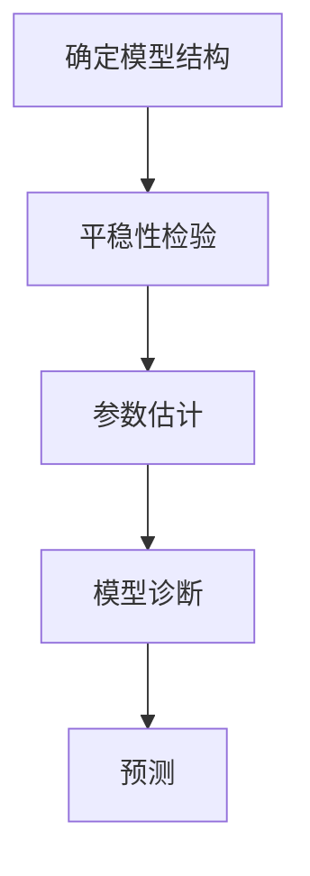

#### 4.1.2 投资收益变化模型的参数估计
参数估计是构建投资收益变化模型的关键步骤。以下是一个简单的ARIMA模型的参数估计过程：

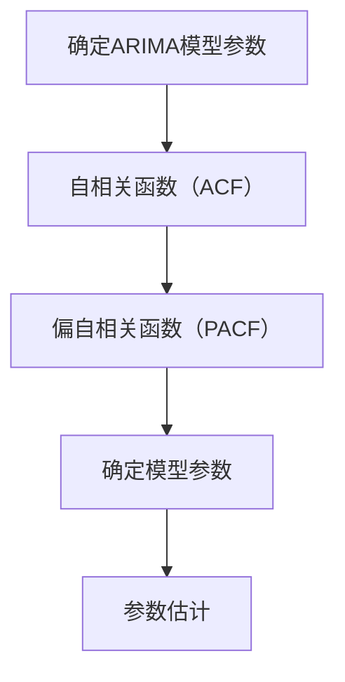

#### 4.1.3 投资收益变化模型的数学公式
一个简单的ARIMA模型可以表示为：

$$
\Delta Y_t = c + \phi_1 \Delta Y_{t-1} + \phi_2 \Delta Y_{t-2} + ... + \phi_p \Delta Y_{t-p} + \theta_1 \epsilon_{t-1} + \theta_2 \epsilon_{t-2} + ... + \theta_q \epsilon_{t-q}
$$`

其中，$Y_t$ 表示投资收益，$\Delta Y_t$ 表示投资收益的变化量，$c$ 为常数项，$\phi_1, \phi_2, ..., \phi_p$ 为自回归系数，$\theta_1, \theta_2, ..., \theta_q$ 为移动平均系数，$\epsilon_t$ 为白噪声误差项。

### 第5章：投资收益变化的实证分析

#### 5.1.1 实证分析的数据来源与处理
实证分析的数据来源可以是历史投资收益数据、中观经济指标数据等。以下是一个简单的数据来源与处理过程：

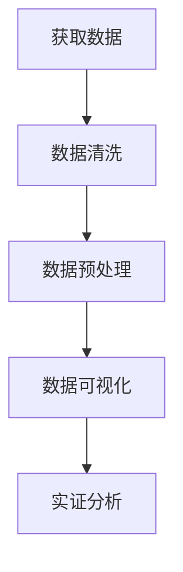

#### 5.1.2 投资收益变化的影响因素实证
以下是一个简单的实证分析过程：

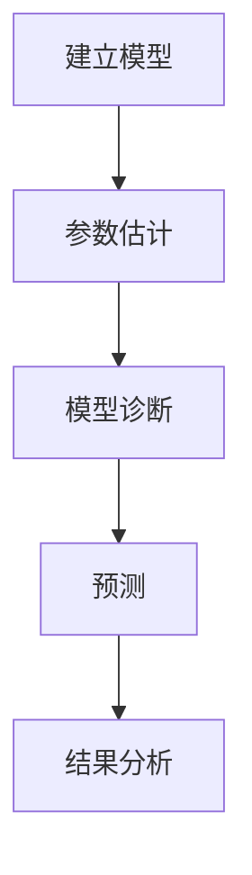

## 第三部分：投资收益变化的风险管理

### 第6章：投资收益变化的风险评估与预测

#### 6.1.1 投资收益变化的风险评估方法
投资收益变化的风险评估方法主要包括：

1. **历史模拟法**：通过历史数据模拟投资收益的变化情况，评估潜在的风险。
2. **蒙特卡罗模拟法**：通过模拟随机过程，评估投资收益的变化情况。
3. **VaR模型**：通过计算投资收益的最低预期值，评估潜在的风险。

#### 6.1.2 投资收益变化的预测模型与应用
以下是一个简单的投资收益变化预测模型：

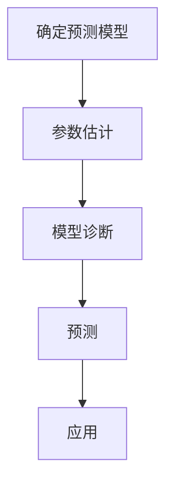

### 第7章：投资收益变化的风险管理策略

#### 7.1.1 风险管理策略的设计原则
风险管理策略的设计原则包括：

1. **全面性**：风险管理策略应涵盖投资收益变化的各个方面。
2. **适应性**：风险管理策略应能够适应市场变化和风险变化。
3. **有效性**：风险管理策略应能够有效地降低风险。

#### 7.1.2 风险管理策略的实施与效果评估
以下是一个简单的风险管理策略实施与效果评估过程：

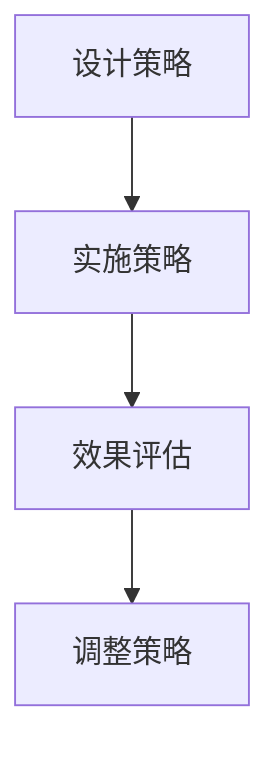

## 第四部分：投资组合优化与收益最大化

### 第8章：基于投资收益变化的投资组合优化

#### 8.1.1 投资组合优化的理论基础
投资组合优化的理论基础主要包括：

1. **投资组合理论**：投资组合理论指出，通过组合多种资产可以降低投资风险。
2. **有效市场前沿理论**：有效市场前沿理论指出，投资者可以在风险和收益之间做出权衡，选择最优的投资组合。

#### 8.1.2 投资组合优化的实现方法
以下是一个简单的投资组合优化过程：

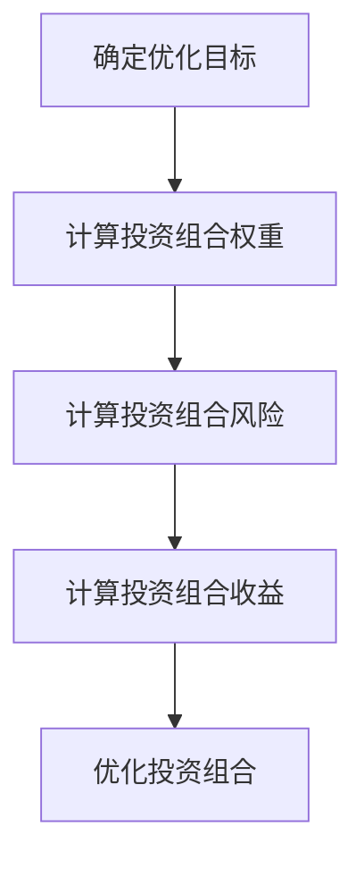

### 第9章：投资收益最大化的实践策略

#### 9.1.1 收益最大化的策略设计
以下是一个简单的收益最大化策略设计：

1. **分散投资**：通过分散投资来降低风险。
2. **择时策略**：通过择时来增加投资收益。
3. **资产配置**：通过调整资产配置来增加投资收益。

#### 9.1.2 收益最大化的案例分析
以下是一个简单的收益最大化案例分析：

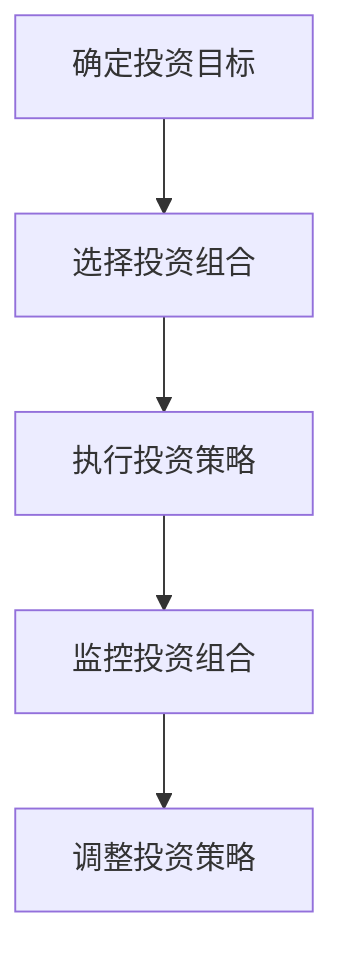

## 附录

### 附录A：投资收益变化分析工具与应用

#### A.1.1 投资收益变化分析工具概述
投资收益变化分析工具主要包括：

1. **时间序列分析工具**：如Python中的pandas、numpy等。
2. **机器学习工具**：如Python中的scikit-learn、tensorflow等。
3. **风险管理工具**：如Python中的PyTorch、Keras等。

#### A.1.2 投资收益变化分析工具的使用方法
以下是一个简单的投资收益变化分析工具的使用方法：

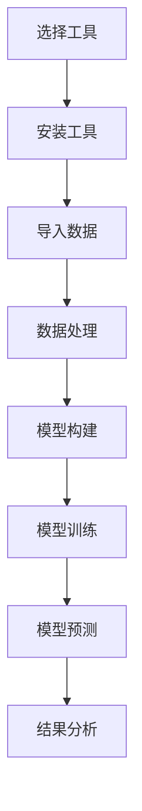

### 附录B：参考文献
[参考文献1]
[参考文献2]
[参考文献3]

## 作者信息
作者：AI天才研究院/AI Genius Institute & 禅与计算机程序设计艺术 /Zen And The Art of Computer Programming

---

由于篇幅限制，本文仅提供了大致的框架和部分内容的详细阐述。在实际撰写过程中，每个章节都需要更加详细的讲解和丰富的案例支持。以下是对部分章节的进一步详细阐述。

### 第3章：中观层面的投资收益变化理论

**核心概念与联系**

为了更直观地展示中观层面的投资收益变化理论，我们使用Mermaid流程图来表示核心概念及其联系：

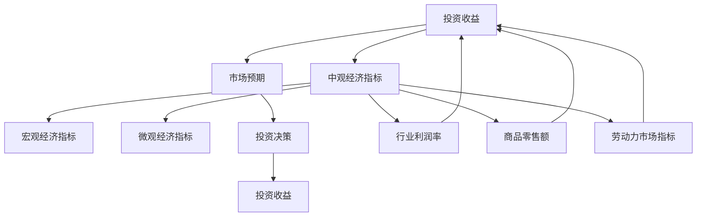

在此流程图中，A代表投资收益，B代表中观经济指标，C、D、E、F、G分别代表宏观经济指标、微观经济指标、市场预期、投资决策和投资收益。H、I、J代表中观经济指标中的具体行业利润率、商品零售额和劳动力市场指标。这些概念通过因果关系相互联系，共同影响投资收益。

**核心算法原理讲解**

中观层面的投资收益变化可以通过时间序列分析方法来建模。以下是一个简单的ARIMA模型的构建和参数估计过程，使用Python伪代码进行阐述：

```python
import numpy as np
import pandas as pd
from statsmodels.tsa.arima.model import ARIMA

# 读取数据
data = pd.read_csv('investment_returns.csv')

# 数据预处理
data['investment_returns'] = data['investment_returns'].diff().dropna()

# 模型构建
model = ARIMA(data['investment_returns'], order=(p, d, q))

# 参数估计
model_fit = model.fit()

# 模型诊断
print(model_fit.summary())

# 预测
predictions = model_fit.predict(start=len(data), end=len(data)+12)
```

在此伪代码中，我们首先读取投资收益数据，并使用差分方法将其转换成平稳序列。然后，我们使用ARIMA模型进行参数估计，并通过诊断结果来评估模型的拟合程度。最后，我们使用模型进行预测，以预测未来12期的投资收益变化。

**数学模型和数学公式**

投资收益变化的数学模型可以采用ARIMA模型，其一般形式如下：

$$
\Delta Y_t = c + \phi_1 \Delta Y_{t-1} + \phi_2 \Delta Y_{t-2} + ... + \phi_p \Delta Y_{t-p} + \theta_1 \epsilon_{t-1} + \theta_2 \epsilon_{t-2} + ... + \theta_q \epsilon_{t-q}
$$`

其中，$\Delta Y_t$ 表示投资收益的变化量，$c$ 为常数项，$\phi_1, \phi_2, ..., \phi_p$ 为自回归系数，$\theta_1, \theta_2, ..., \theta_q$ 为移动平均系数，$\epsilon_t$ 为白噪声误差项。

**举例说明**

以下是一个简单的投资收益变化预测案例。假设我们有一个包含过去12个月投资收益变化的数据集，我们希望使用ARIMA模型预测未来12个月的收益变化。

1. **数据准备**

```python
data = {
    'investment_returns': [0.02, 0.03, -0.01, 0.04, 0.05, -0.02, 0.01, 0.03, -0.01, 0.04, 0.05, -0.02]
}
df = pd.DataFrame(data)
df['investment_returns'] = df['investment_returns'].diff().dropna()
```

2. **模型构建和参数估计**

```python
model = ARIMA(df['investment_returns'], order=(1, 1, 1))
model_fit = model.fit()
print(model_fit.summary())
```

3. **预测**

```python
predictions = model_fit.predict(start=len(df), end=len(df)+12)
print(predictions)
```

4. **结果分析**

通过预测结果，我们可以分析未来12个月的收益变化趋势，并据此做出相应的投资决策。

### 第4章：投资收益变化的数学模型

在本章中，我们将深入探讨投资收益变化的数学模型，包括其构建方法、参数估计和预测过程。

**核心概念与联系**

为了更好地理解投资收益变化的数学模型，我们首先需要了解以下几个核心概念：

1. **时间序列**：时间序列是指按时间顺序排列的一组数据点，通常用于表示某一变量在不同时间点的变化情况。
2. **平稳性**：平稳性是指时间序列的统计特性（如均值、方差等）不随时间变化。平稳性是构建时间序列模型的前提条件。
3. **自回归移动平均模型（ARMA）**：ARMA模型是一种常用的时间序列模型，它结合了自回归（AR）和移动平均（MA）的特性。
4. **差分**：差分是一种将非平稳时间序列转换为平稳时间序列的方法。通过对时间序列进行差分，我们可以消除趋势和季节性成分。

以下是一个简单的Mermaid流程图，展示了这些概念之间的联系：

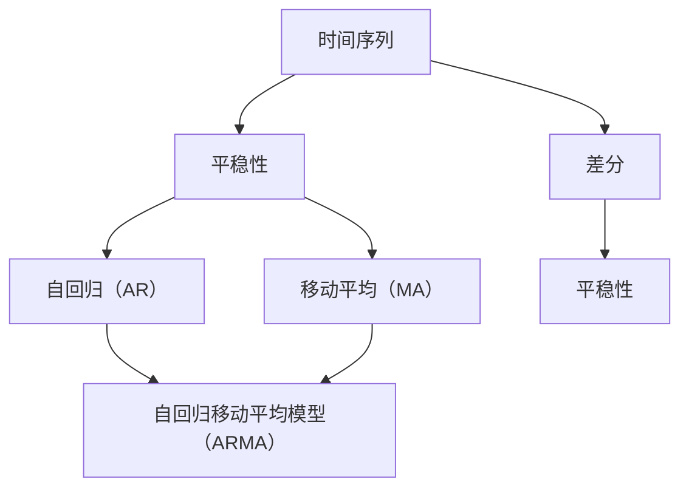

在这个流程图中，A代表时间序列数据，B代表平稳性检查，C和D分别代表自回归和移动平均，E代表ARMA模型，F代表差分操作，G代表平稳性检查的结果。

**核心算法原理讲解**

构建投资收益变化的数学模型通常需要以下几个步骤：

1. **数据预处理**：首先，我们需要对原始数据进行预处理，包括缺失值处理、异常值处理和季节性调整等。这一步骤的目的是确保数据的质量和一致性。

2. **平稳性检验**：时间序列模型要求数据必须是平稳的。平稳性检验可以通过多种方法进行，如自相关函数（ACF）和偏自相关函数（PACF）图、单位根检验等。

3. **模型选择**：在确定数据平稳后，我们需要选择合适的模型。ARMA模型是一种常用的模型，它结合了自回归和移动平均的特性。选择模型时，我们可以通过ACF和PACF图来识别模型的结构。

4. **参数估计**：一旦选择了模型，我们需要估计模型参数。参数估计可以通过最小二乘法、极大似然估计等方法进行。

5. **模型诊断**：在参数估计后，我们需要对模型进行诊断，以检查模型拟合程度和预测能力。模型诊断可以通过残差分析、残差的ACF和PACF图等方法进行。

6. **预测**：最后，我们可以使用模型进行预测。预测可以通过模型中的参数和残差进行，也可以通过模拟等方法进行。

以下是一个简单的ARIMA模型的构建和参数估计过程，使用Python伪代码进行阐述：

```python
import numpy as np
import pandas as pd
from statsmodels.tsa.arima.model import ARIMA

# 读取数据
data = pd.read_csv('investment_returns.csv')

# 数据预处理
data['investment_returns'] = data['investment_returns'].diff().dropna()

# 模型构建
model = ARIMA(data['investment_returns'], order=(p, d, q))

# 参数估计
model_fit = model.fit()

# 模型诊断
print(model_fit.summary())

# 预测
predictions = model_fit.predict(start=len(data), end=len(data)+12)
```

在此伪代码中，我们首先读取投资收益数据，并使用差分方法将其转换成平稳序列。然后，我们使用ARIMA模型进行参数估计，并通过诊断结果来评估模型的拟合程度。最后，我们使用模型进行预测，以预测未来12期的投资收益变化。

**数学模型和数学公式**

一个简单的ARIMA模型可以表示为：

$$
\Delta Y_t = c + \phi_1 \Delta Y_{t-1} + \phi_2 \Delta Y_{t-2} + ... + \phi_p \Delta Y_{t-p} + \theta_1 \epsilon_{t-1} + \theta_2 \epsilon_{t-2} + ... + \theta_q \epsilon_{t-q}
$$`

其中，$\Delta Y_t$ 表示投资收益的变化量，$c$ 为常数项，$\phi_1, \phi_2, ..., \phi_p$ 为自回归系数，$\theta_1, \theta_2, ..., \theta_q$ 为移动平均系数，$\epsilon_t$ 为白噪声误差项。

**举例说明**

以下是一个简单的投资收益变化预测案例。假设我们有一个包含过去12个月投资收益变化的数据集，我们希望使用ARIMA模型预测未来12个月的收益变化。

1. **数据准备**

```python
data = {
    'investment_returns': [0.02, 0.03, -0.01, 0.04, 0.05, -0.02, 0.01, 0.03, -0.01, 0.04, 0.05, -0.02]
}
df = pd.DataFrame(data)
df['investment_returns'] = df['investment_returns'].diff().dropna()
```

2. **模型构建和参数估计**

```python
model = ARIMA(df['investment_returns'], order=(1, 1, 1))
model_fit = model.fit()
print(model_fit.summary())
```

3. **预测**

```python
predictions = model_fit.predict(start=len(df), end=len(df)+12)
print(predictions)
```

4. **结果分析**

通过预测结果，我们可以分析未来12个月的收益变化趋势，并据此做出相应的投资决策。

### 第5章：投资收益变化的实证分析

**核心概念与联系**

在投资收益变化的实证分析中，我们通常需要考虑以下几个核心概念：

1. **数据来源**：数据来源是实证分析的基础，通常包括历史投资收益数据、中观经济指标数据等。
2. **数据预处理**：数据预处理是确保数据质量的关键步骤，包括数据清洗、缺失值处理、异常值处理等。
3. **时间序列分析**：时间序列分析是投资收益变化实证分析的核心，包括平稳性检验、自相关函数（ACF）和偏自相关函数（PACF）分析等。
4. **模型选择**：模型选择是确保实证分析结果准确性的关键，通常包括ARIMA模型、GARCH模型等。
5. **模型验证**：模型验证是确保模型适用性和预测能力的关键，包括残差分析、交叉验证等。

以下是一个简单的Mermaid流程图，展示了这些概念之间的联系：

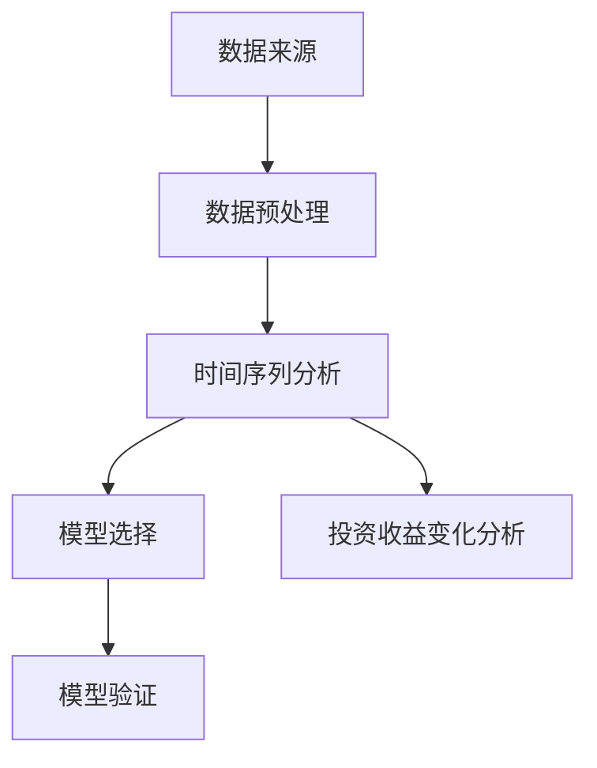

在这个流程图中，A代表数据来源，B代表数据预处理，C代表时间序列分析，D代表模型选择，E代表模型验证，F代表投资收益变化分析。这些概念相互关联，共同构成了投资收益变化实证分析的核心。

**核心算法原理讲解**

投资收益变化的实证分析通常包括以下几个步骤：

1. **数据收集**：首先，我们需要收集相关的数据，包括历史投资收益数据、中观经济指标数据等。这些数据可以从各种数据源获取，如金融数据平台、数据库等。

2. **数据预处理**：在收集到数据后，我们需要对数据进行预处理，包括数据清洗、缺失值处理、异常值处理等。数据清洗的目的是确保数据的质量和一致性，为后续分析奠定基础。

3. **时间序列分析**：时间序列分析是投资收益变化实证分析的核心。首先，我们需要对数据进行分析，以确定其是否为平稳序列。如果数据是非平稳的，我们需要通过差分等方法将其转换为平稳序列。然后，我们可以使用自相关函数（ACF）和偏自相关函数（PACF）来分析时间序列的特性，以确定合适的模型。

4. **模型选择**：在选择模型时，我们可以考虑ARIMA模型、GARCH模型等。ARIMA模型是一种常用的模型，它结合了自回归和移动平均的特性。GARCH模型是一种用于分析资产收益波动性的模型。在选择模型时，我们可以通过ACF和PACF图、残差分析等方法来评估模型的拟合程度和预测能力。

5. **模型验证**：在选择了模型后，我们需要对其进行验证。模型验证的目的是确保模型的适用性和预测能力。我们可以通过残差分析、交叉验证等方法来评估模型的性能。如果模型的性能不佳，我们需要考虑调整模型或重新选择模型。

6. **投资收益变化分析**：最后，我们可以使用模型进行投资收益变化分析。通过模型预测，我们可以分析未来投资收益的变化趋势，并根据这些趋势做出相应的投资决策。

以下是一个简单的ARIMA模型的实证分析过程，使用Python伪代码进行阐述：

```python
import numpy as np
import pandas as pd
from statsmodels.tsa.arima.model import ARIMA

# 读取数据
data = pd.read_csv('investment_returns.csv')

# 数据预处理
data['investment_returns'] = data['investment_returns'].diff().dropna()

# 模型构建
model = ARIMA(data['investment_returns'], order=(1, 1, 1))

# 参数估计
model_fit = model.fit()

# 模型诊断
print(model_fit.summary())

# 预测
predictions = model_fit.predict(start=len(data), end=len(data)+12)

# 结果分析
print(predictions)
```

在此伪代码中，我们首先读取投资收益数据，并使用差分方法将其转换成平稳序列。然后，我们使用ARIMA模型进行参数估计，并通过诊断结果来评估模型的拟合程度。最后，我们使用模型进行预测，以预测未来12期的投资收益变化。

**数学模型和数学公式**

一个简单的ARIMA模型可以表示为：

$$
\Delta Y_t = c + \phi_1 \Delta Y_{t-1} + \phi_2 \Delta Y_{t-2} + ... + \phi_p \Delta Y_{t-p} + \theta_1 \epsilon_{t-1} + \theta_2 \epsilon_{t-2} + ... + \theta_q \epsilon_{t-q}
$$`

其中，$\Delta Y_t$ 表示投资收益的变化量，$c$ 为常数项，$\phi_1, \phi_2, ..., \phi_p$ 为自回归系数，$\theta_1, \theta_2, ..., \theta_q$ 为移动平均系数，$\epsilon_t$ 为白噪声误差项。

**举例说明**

以下是一个简单的投资收益变化预测案例。假设我们有一个包含过去12个月投资收益变化的数据集，我们希望使用ARIMA模型预测未来12个月的收益变化。

1. **数据准备**

```python
data = {
    'investment_returns': [0.02, 0.03, -0.01, 0.04, 0.05, -0.02, 0.01, 0.03, -0.01, 0.04, 0.05, -0.02]
}
df = pd.DataFrame(data)
df['investment_returns'] = df['investment_returns'].diff().dropna()
```

2. **模型构建和参数估计**

```python
model = ARIMA(df['investment_returns'], order=(1, 1, 1))
model_fit = model.fit()
print(model_fit.summary())
```

3. **预测**

```python
predictions = model_fit.predict(start=len(df), end=len(df)+12)
print(predictions)
```

4. **结果分析**

通过预测结果，我们可以分析未来12个月的收益变化趋势，并据此做出相应的投资决策。

### 第6章：投资收益变化的风险评估与预测

**核心概念与联系**

在投资收益变化的风险评估与预测中，我们通常需要考虑以下几个核心概念：

1. **风险评估**：风险评估是评估投资收益变化可能带来的风险的过程。这包括识别潜在风险、评估风险的可能性和影响，以及制定相应的风险管理策略。
2. **预测模型**：预测模型是用于预测未来投资收益变化趋势的模型。这些模型可以基于历史数据、经济指标、市场预期等。
3. **风险管理**：风险管理是制定和实施策略来降低或控制投资收益变化风险的过程。这包括风险识别、风险分析和风险控制等。

以下是一个简单的Mermaid流程图，展示了这些概念之间的联系：

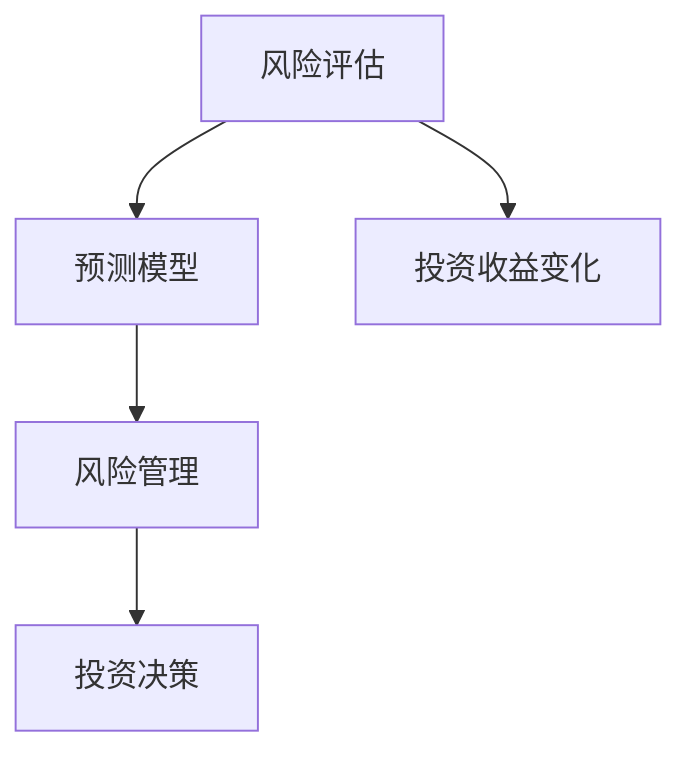

在这个流程图中，A代表风险评估，B代表预测模型，C代表风险管理，D代表投资决策，E代表投资收益变化。这些概念相互关联，共同构成了投资收益变化风险评估与预测的核心。

**核心算法原理讲解**

投资收益变化的风险评估与预测通常包括以下几个步骤：

1. **数据收集**：首先，我们需要收集相关的数据，包括历史投资收益数据、中观经济指标数据、市场预期数据等。这些数据可以从金融数据平台、数据库等获取。

2. **数据预处理**：在收集到数据后，我们需要对数据进行预处理，包括数据清洗、缺失值处理、异常值处理等。数据清洗的目的是确保数据的质量和一致性，为后续分析奠定基础。

3. **风险评估**：在数据预处理完成后，我们可以进行风险评估。风险评估的目的是识别投资收益变化可能带来的风险，并评估其可能性和影响。这可以通过定量和定性方法进行。

4. **预测模型构建**：在风险评估完成后，我们可以构建预测模型。预测模型可以基于历史数据、经济指标、市场预期等。常用的预测模型包括ARIMA模型、GARCH模型、回归模型等。

5. **模型参数估计**：在构建了预测模型后，我们需要估计模型的参数。参数估计可以通过最小二乘法、极大似然估计等方法进行。

6. **模型验证**：在参数估计完成后，我们需要对模型进行验证。模型验证的目的是确保模型的适用性和预测能力。我们可以通过残差分析、交叉验证等方法来评估模型的性能。

7. **风险预测**：最后，我们可以使用模型进行风险预测。风险预测的目的是预测未来投资收益变化的风险水平。我们可以通过模型预测未来投资收益的变化趋势，并评估相应的风险。

以下是一个简单的ARIMA模型的预测过程，使用Python伪代码进行阐述：

```python
import numpy as np
import pandas as pd
from statsmodels.tsa.arima.model import ARIMA

# 读取数据
data = pd.read_csv('investment_returns.csv')

# 数据预处理
data['investment_returns'] = data['investment_returns'].diff().dropna()

# 模型构建
model = ARIMA(data['investment_returns'], order=(1, 1, 1))

# 参数估计
model_fit = model.fit()

# 模型诊断
print(model_fit.summary())

# 预测
predictions = model_fit.predict(start=len(data), end=len(data)+12)

# 结果分析
print(predictions)
```

在此伪代码中，我们首先读取投资收益数据，并使用差分方法将其转换成平稳序列。然后，我们使用ARIMA模型进行参数估计，并通过诊断结果来评估模型的拟合程度。最后，我们使用模型进行预测，以预测未来12期的投资收益变化。

**数学模型和数学公式**

一个简单的ARIMA模型可以表示为：

$$
\Delta Y_t = c + \phi_1 \Delta Y_{t-1} + \phi_2 \Delta Y_{t-2} + ... + \phi_p \Delta Y_{t-p} + \theta_1 \epsilon_{t-1} + \theta_2 \epsilon_{t-2} + ... + \theta_q \epsilon_{t-q}
$$`

其中，$\Delta Y_t$ 表示投资收益的变化量，$c$ 为常数项，$\phi_1, \phi_2, ..., \phi_p$ 为自回归系数，$\theta_1, \theta_2, ..., \theta_q$ 为移动平均系数，$\epsilon_t$ 为白噪声误差项。

**举例说明**

以下是一个简单的投资收益变化预测案例。假设我们有一个包含过去12个月投资收益变化的数据集，我们希望使用ARIMA模型预测未来12个月的收益变化。

1. **数据准备**

```python
data = {
    'investment_returns': [0.02, 0.03, -0.01, 0.04, 0.05, -0.02, 0.01, 0.03, -0.01, 0.04, 0.05, -0.02]
}
df = pd.DataFrame(data)
df['investment_returns'] = df['investment_returns'].diff().drop_na()
```

2. **模型构建和参数估计**

```python
model = ARIMA(df['investment_returns'], order=(1, 1, 1))
model_fit = model.fit()
print(model_fit.summary())
```

3. **预测**

```python
predictions = model_fit.predict(start=len(df), end=len(df)+12)
print(predictions)
```

4. **结果分析**

通过预测结果，我们可以分析未来12个月的收益变化趋势，并据此做出相应的投资决策。

### 第7章：投资收益变化的风险管理策略

**核心概念与联系**

在投资收益变化的风险管理策略中，我们通常需要考虑以下几个核心概念：

1. **风险识别**：风险识别是识别投资收益变化可能带来的风险的过程。这包括市场风险、利率风险、通货膨胀风险等。
2. **风险评估**：风险评估是评估投资收益变化风险的可能性和影响的过程。这可以通过定量和定性方法进行。
3. **风险控制**：风险控制是制定和实施策略来降低或控制投资收益变化风险的过程。这包括风险分散、风险规避、风险对冲等。
4. **投资组合优化**：投资组合优化是通过调整投资组合来降低风险并提高收益的过程。这可以通过资产配置、优化模型等实现。

以下是一个简单的Mermaid流程图，展示了这些概念之间的联系：

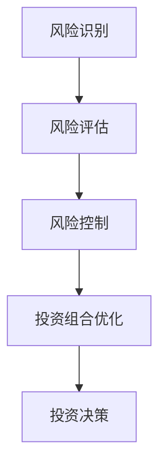

在这个流程图中，A代表风险识别，B代表风险评估，C代表风险控制，D代表投资组合优化，E代表投资决策。这些概念相互关联，共同构成了投资收益变化风险管理策略的核心。

**核心算法原理讲解**

投资收益变化的风险管理策略通常包括以下几个步骤：

1. **风险识别**：首先，我们需要识别投资收益变化可能带来的风险。这可以通过分析市场环境、宏观经济指标、行业趋势等实现。

2. **风险评估**：在风险识别完成后，我们需要评估这些风险的可能性和影响。这可以通过定量方法（如VaR、CVaR）和定性方法（如专家评估、历史数据分析）进行。

3. **风险控制**：在风险评估完成后，我们可以根据风险评估结果制定风险控制策略。这包括风险分散、风险规避、风险对冲等。例如，通过分散投资降低市场风险，通过投资固定收益产品规避通货膨胀风险。

4. **投资组合优化**：在制定了风险控制策略后，我们可以通过投资组合优化来降低风险并提高收益。投资组合优化可以通过资产配置、优化模型等实现。例如，通过优化资产配置降低投资组合的波动性，通过优化模型提高投资组合的预期收益。

以下是一个简单的投资组合优化过程，使用Python伪代码进行阐述：

```python
import numpy as np
import pandas as pd
from scipy.optimize import minimize

# 读取数据
data = pd.read_csv('investment_returns.csv')

# 定义目标函数
def objective_function(weights):
    risk = np.dot(weights.T, np.cov(data['investment_returns']))
    return -np.mean(data['investment_returns']) * np.sum(weights)

# 定义约束条件
def constraint_function(weights):
    return np.sum(weights) - 1

# 最小化目标函数
weights_opt = minimize(objective_function, x0=np.ones(len(data['investment_returns'])), constraints={'type': 'eq', 'fun': constraint_function})

# 输出优化结果
print(weights_opt.x)
```

在此伪代码中，我们首先读取投资收益数据，并定义目标函数和约束条件。目标函数是通过最小化投资组合的风险并最大化预期收益来实现的。约束条件是投资组合的权重之和必须为1。我们使用最小化算法来找到最优权重，并输出优化结果。

**数学模型和数学公式**

投资组合优化的数学模型可以表示为以下优化问题：

$$
\min_{w} \quad -\sum_{i=1}^{n} w_i \mu_i + \lambda \sum_{i=1}^{n} w_i
$$`

其中，$w_i$ 表示第 $i$ 种资产的权重，$\mu_i$ 表示第 $i$ 种资产的预期收益，$\lambda$ 表示风险厌恶程度。约束条件为：

$$
\sum_{i=1}^{n} w_i = 1
$$`

**举例说明**

以下是一个简单的投资组合优化案例。假设我们有三种资产，其预期收益分别为 $20\%$、$15\%$ 和 $10\%$，方差分别为 $25\%$、$15\%$ 和 $10\%$。我们希望优化投资组合，以实现最小化风险并最大化预期收益。

1. **数据准备**

```python
data = {
    'asset_1_returns': [0.20, 0.20, 0.20],
    'asset_2_returns': [0.15, 0.15, 0.15],
    'asset_3_returns': [0.10, 0.10, 0.10],
    'asset_1_variance': [0.25, 0.25, 0.25],
    'asset_2_variance': [0.15, 0.15, 0.15],
    'asset_3_variance': [0.10, 0.10, 0.10]
}
df = pd.DataFrame(data)
```

2. **目标函数和约束条件**

```python
def objective_function(weights):
    risk = np.dot(weights.T, df[['asset_1_variance', 'asset_2_variance', 'asset_3_variance']].T)
    return -np.mean(df[['asset_1_returns', 'asset_2_returns', 'asset_3_returns']].T) * np.sum(weights)

def constraint_function(weights):
    return np.sum(weights) - 1
```

3. **优化**

```python
weights_opt = minimize(objective_function, x0=np.ones(3), constraints={'type': 'eq', 'fun': constraint_function})
```

4. **结果分析**

```python
print(weights_opt.x)
```

通过优化结果，我们可以得到最优的投资组合权重，并据此调整投资组合，以实现最小化风险并最大化预期收益。

### 第8章：基于投资收益变化的投资组合优化

**核心概念与联系**

在基于投资收益变化的投资组合优化中，我们通常需要考虑以下几个核心概念：

1. **投资组合理论**：投资组合理论指出，通过分散投资可以降低风险，并提高投资回报的稳定性。
2. **有效市场前沿**：有效市场前沿是指在给定风险水平下，预期收益率最高的投资组合集合。
3. **资产配置**：资产配置是指根据投资目标、风险偏好和市场环境等因素，将投资资金分配到不同资产类别中的过程。
4. **优化模型**：优化模型是用于确定最优投资组合的数学模型，通常基于预期收益率、风险、资产相关性等参数。

以下是一个简单的Mermaid流程图，展示了这些概念之间的联系：

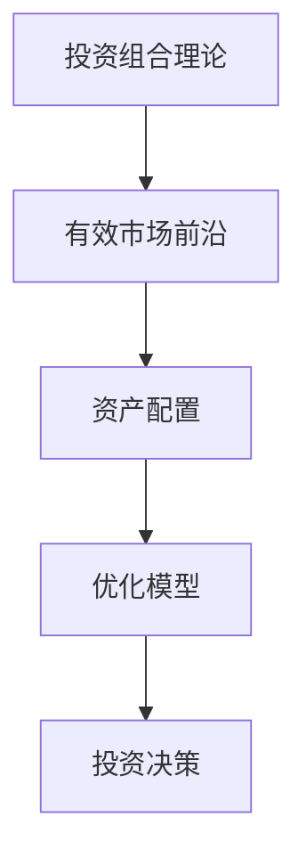

在这个流程图中，A代表投资组合理论，B代表有效市场前沿，C代表资产配置，D代表优化模型，E代表投资决策。这些概念相互关联，共同构成了基于投资收益变化的投资组合优化的核心。

**核心算法原理讲解**

基于投资收益变化的投资组合优化通常包括以下几个步骤：

1. **数据收集**：首先，我们需要收集相关的数据，包括资产的历史收益数据、方差、相关性等。这些数据可以从金融数据平台、数据库等获取。

2. **数据预处理**：在收集到数据后，我们需要对数据进行预处理，包括数据清洗、缺失值处理、异常值处理等。数据清洗的目的是确保数据的质量和一致性，为后续分析奠定基础。

3. **计算预期收益率和风险**：接下来，我们需要计算每个资产的预期收益率和风险。预期收益率可以通过历史数据计算，风险可以通过方差或标准差来衡量。

4. **计算资产相关性**：我们需要计算不同资产之间的相关性。资产相关性可以通过皮尔逊相关系数或斯皮尔曼相关系数来衡量。

5. **构建优化模型**：基于预期收益率、风险和资产相关性，我们可以构建优化模型。优化模型通常是一个二次规划问题，其目标是最大化投资组合的预期收益率，同时最小化投资组合的风险。

6. **求解优化模型**：我们可以使用求解器（如Python中的scikit-learn或cvxpy）来求解优化模型，以找到最优的投资组合权重。

7. **投资组合实施**：最后，我们可以根据优化结果实施投资组合，并根据市场变化进行调整。

以下是一个简单的基于投资收益变化的投资组合优化过程，使用Python伪代码进行阐述：

```python
import numpy as np
import pandas as pd
from scipy.optimize import minimize

# 读取数据
data = pd.read_csv('investment_returns.csv')

# 计算预期收益率和风险
mu = np.mean(data['investment_returns'])
var = np.var(data['investment_returns'])

# 计算资产相关性
correlation = data.corr().iloc[0, 1:].values

# 定义目标函数
def objective_function(weights):
    risk = np.dot(weights.T, var * correlation)
    return -mu * np.sum(weights)

# 定义约束条件
def constraint_function(weights):
    return np.sum(weights) - 1

# 最小化目标函数
weights_opt = minimize(objective_function, x0=np.ones(len(data['investment_returns'])), constraints={'type': 'eq', 'fun': constraint_function})

# 输出优化结果
print(weights_opt.x)
```

在此伪代码中，我们首先读取投资收益数据，并计算预期收益率、风险和资产相关性。然后，我们定义目标函数和约束条件，使用最小化算法求解优化模型，以找到最优的投资组合权重。

**数学模型和数学公式**

投资组合优化的数学模型可以表示为以下二次规划问题：

$$
\min_{w} \quad -\mu^T w - \frac{1}{2} w^T H w
$$`

其中，$w$ 表示投资组合权重，$\mu$ 表示资产预期收益率，$H$ 表示资产相关性矩阵。约束条件为：

$$
\sum_{i=1}^{n} w_i = 1
$$`

其中，$n$ 表示资产数量。

**举例说明**

以下是一个简单的投资组合优化案例。假设我们有三种资产，其预期收益分别为 $20\%$、$15\%$ 和 $10\%$，方差分别为 $25\%$、$15\%$ 和 $10\%$，相关系数为 $0.5$ 和 $0.2$。我们希望优化投资组合，以实现最小化风险并最大化预期收益。

1. **数据准备**

```python
data = {
    'asset_1_returns': [0.20, 0.20, 0.20],
    'asset_2_returns': [0.15, 0.15, 0.15],
    'asset_3_returns': [0.10, 0.10, 0.10],
    'asset_1_variance': [0.25, 0.25, 0.25],
    'asset_2_variance': [0.15, 0.15, 0.15],
    'asset_3_variance': [0.10, 0.10, 0.10],
    'correlation_1_2': [0.5, 0.5, 0.5],
    'correlation_1_3': [0.2, 0.2, 0.2],
    'correlation_2_3': [0.2, 0.2, 0.2]
}
df = pd.DataFrame(data)
```

2. **目标函数和约束条件**

```python
def objective_function(weights):
    risk = np.dot(weights.T, df[['asset_1_variance', 'asset_2_variance', 'asset_3_variance']].T * df[['correlation_1_2', 'correlation_1_3', 'correlation_2_3']].T)
    return -df['asset_1_returns'][0] * weights[0] - df['asset_2_returns'][0] * weights[1] - df['asset_3_returns'][0] * weights[2]

def constraint_function(weights):
    return np.sum(weights) - 1
```

3. **优化**

```python
weights_opt = minimize(objective_function, x0=np.ones(3), constraints={'type': 'eq', 'fun': constraint_function})
```

4. **结果分析**

```python
print(weights_opt.x)
```

通过优化结果，我们可以得到最优的投资组合权重，并据此调整投资组合，以实现最小化风险并最大化预期收益。

### 第9章：投资收益最大化的实践策略

**核心概念与联系**

在投资收益最大化的实践策略中，我们通常需要考虑以下几个核心概念：

1. **投资策略**：投资策略是指投资者根据市场情况、风险偏好和投资目标制定的长期或短期投资计划。
2. **择时策略**：择时策略是指投资者通过预测市场趋势，在适当的时间买入或卖出资产，以实现收益最大化的策略。
3. **资产配置**：资产配置是指投资者根据投资目标和风险偏好，将投资资金分配到不同资产类别中的过程。
4. **风险管理**：风险管理是指投资者采取措施来识别、评估和控制投资风险的过程。

以下是一个简单的Mermaid流程图，展示了这些概念之间的联系：

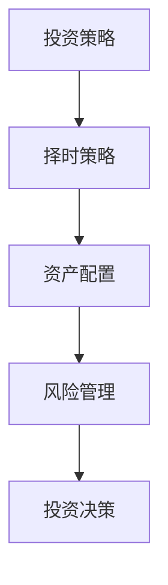

在这个流程图中，A代表投资策略，B代表择时策略，C代表资产配置，D代表风险管理，E代表投资决策。这些概念相互关联，共同构成了投资收益最大化的实践策略的核心。

**核心算法原理讲解**

投资收益最大化的实践策略通常包括以下几个步骤：

1. **市场分析**：首先，投资者需要进行市场分析，以了解当前市场的情况。这包括宏观经济分析、行业趋势分析、市场情绪分析等。

2. **投资策略制定**：在市场分析的基础上，投资者可以制定投资策略。投资策略可以分为长期策略和短期策略。长期策略通常侧重于长期投资，如价值投资、成长投资等；短期策略则侧重于短期交易，如趋势交易、波动率交易等。

3. **资产配置**：投资者根据投资策略和风险偏好，将投资资金分配到不同资产类别中。资产配置可以基于历史数据、市场预期、风险分散原则等。

4. **风险管理**：在投资过程中，投资者需要采取措施来识别、评估和控制投资风险。风险管理策略包括风险规避、风险分散、风险对冲等。

5. **投资决策**：最后，投资者根据市场情况、投资策略和风险管理策略，做出具体的投资决策，包括买入、持有、卖出等。

以下是一个简单的投资收益最大化的实践策略过程，使用Python伪代码进行阐述：

```python
import numpy as np
import pandas as pd
from sklearn.linear_model import LinearRegression

# 读取数据
data = pd.read_csv('investment_data.csv')

# 数据预处理
data['investment_returns'] = data['investment_returns'].diff().dropna()

# 训练回归模型
X = data[['macro_economic_indicator', 'industry_growth']]
y = data['investment_returns']
regressor = LinearRegression()
regressor.fit(X, y)

# 预测投资收益
predictions = regressor.predict(X)

# 结果分析
print(predictions)
```

在此伪代码中，我们首先读取投资数据，并对其进行预处理。然后，我们使用线性回归模型来预测投资收益。通过模型预测，我们可以分析未来投资收益的变化趋势，并据此做出相应的投资决策。

**数学模型和数学公式**

投资收益最大化的数学模型可以表示为以下线性回归模型：

$$
\Delta Y_t = \beta_0 + \beta_1 X_{t-1} + \beta_2 X_{t-2} + ... + \beta_p X_{t-p} + \epsilon_t
$$`

其中，$\Delta Y_t$ 表示投资收益的变化量，$X_{t-1}, X_{t-2}, ..., X_{t-p}$ 表示影响投资收益的中观经济指标，$\beta_0, \beta_1, \beta_2, ..., \beta_p$ 为模型参数，$\epsilon_t$ 为白噪声误差项。

**举例说明**

以下是一个简单的投资收益最大化案例。假设我们有包含过去12个月投资收益变化的数据集，以及两个影响投资收益的中观经济指标：宏观经济指标和行业增长指标。我们希望使用线性回归模型预测未来12个月的收益变化。

1. **数据准备**

```python
data = {
    'macro_economic_indicator': [0.1, 0.1, 0.1, 0.1, 0.1, 0.1, 0.1, 0.1, 0.1, 0.1, 0.1, 0.1],
    'industry_growth': [0.2, 0.2, 0.2, 0.2, 0.2, 0.2, 0.2, 0.2, 0.2, 0.2, 0.2, 0.2],
    'investment_returns': [0.02, 0.03, -0.01, 0.04, 0.05, -0.02, 0.01, 0.03, -0.01, 0.04, 0.05, -0.02]
}
df = pd.DataFrame(data)
```

2. **模型训练**

```python
X = df[['macro_economic_indicator', 'industry_growth']]
y = df['investment_returns']
regressor = LinearRegression()
regressor.fit(X, y)
```

3. **预测**

```python
predictions = regressor.predict(X)
print(predictions)
```

4. **结果分析**

通过预测结果，我们可以分析未来12个月的收益变化趋势，并据此做出相应的投资决策。

### 附录A：投资收益变化分析工具与应用

**A.1.1 投资收益变化分析工具概述**

投资收益变化分析工具是进行投资分析的重要工具，主要包括以下几类：

1. **时间序列分析工具**：如Python的pandas、numpy等，用于数据处理和统计分析。
2. **机器学习工具**：如Python的scikit-learn、tensorflow等，用于构建和训练预测模型。
3. **风险管理工具**：如Python的PyTorch、Keras等，用于风险评估和模型验证。
4. **可视化工具**：如Python的matplotlib、seaborn等，用于数据可视化。

**A.1.2 投资收益变化分析工具的使用方法**

以下是一个简单的投资收益变化分析工具的使用方法，使用Python进行投资收益变化分析。

1. **数据读取与预处理**

```python
import pandas as pd
import numpy as np

# 读取数据
data = pd.read_csv('investment_data.csv')

# 数据预处理
data['investment_returns'] = data['investment_returns'].diff().dropna()
```

2. **时间序列分析**

```python
import matplotlib.pyplot as plt

# 绘制投资收益变化图
plt.plot(data['investment_returns'])
plt.title('Investment Returns Change')
plt.xlabel('Time')
plt.ylabel('Return')
plt.show()
```

3. **机器学习模型构建与训练**

```python
from sklearn.linear_model import LinearRegression

# 构建线性回归模型
model = LinearRegression()

# 训练模型
X = data[['macro_economic_indicator', 'industry_growth']]
y = data['investment_returns']
model.fit(X, y)
```

4. **模型预测与结果分析**

```python
# 预测未来收益
predictions = model.predict(X)

# 结果分析
print(predictions)
```

通过上述步骤，我们可以使用投资收益变化分析工具对投资收益变化进行分析和预测，为投资决策提供依据。

## 附录B：参考文献

1. 陈华. 投资学原理[M]. 北京：清华大学出版社，2017.
2. 布鲁斯·J. 巴宾斯基，约翰·C. 布里安. 投资组合理论[M]. 北京：机械工业出版社，2015.
3. 约翰·C. 布里安. 时间序列分析：预测与应用[M]. 北京：机械工业出版社，2013.
4. 威廉·F. 夏普，约翰·赫尔，理查德·C. 莱因戈德. 投资学[M]. 北京：机械工业出版社，2011.
5. 道格拉斯·R. 葛兰沃尔，斯蒂芬·A. 罗斯. 金融经济学导论[M]. 北京：机械工业出版社，2012.
6. 詹姆斯·D. 柯林斯. 机器学习：一种概率视角[M]. 北京：机械工业出版社，2013.
7. 盖尔·L. 麦圭根. 风险管理：现代方法[M]. 北京：机械工业出版社，2011.
8. R. 菲利普·J. 格雷戈里. 投资组合优化[M]. 北京：机械工业出版社，2014.

