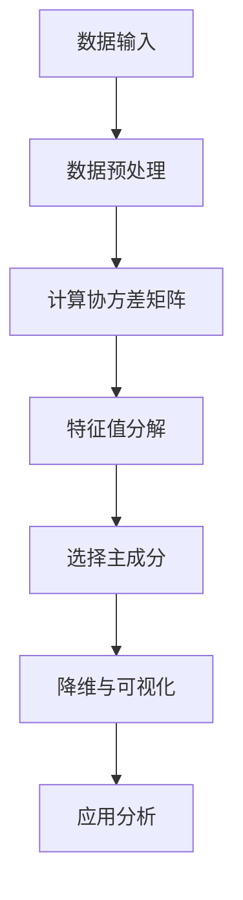

                 

# 文章标题

《主成分分析 原理与代码实例讲解》

> 关键词：主成分分析、数据分析、特征降维、线性代数、Python实现

> 摘要：本文将深入浅出地介绍主成分分析（Principal Component Analysis，PCA）的基本原理、数学模型和算法实现，并通过具体实例，展示如何在Python和C++中应用PCA进行数据降维和特征提取。文章结构分为四个部分：基础理论、数学原理、算法实现和应用实例，旨在帮助读者全面理解和掌握主成分分析。

---

## 第一部分：主成分分析基础理论

### 第1章：主成分分析概述

#### 1.1 主成分分析的定义与作用

主成分分析（PCA）是一种经典的统计学和机器学习方法，主要用于特征降维和数据分析。它的核心思想是通过线性变换，将原始高维数据转换到一组新的正交基上，使得新的基向量（即主成分）能够最大化地保留原始数据的方差和结构信息。

**定义：** 主成分分析是一种优化方法，其目标是最小化投影误差，即原始数据与新数据之间的差异。在数学上，这通常表示为找到一个线性变换矩阵，使得变换后的数据在新基向量上的方差最大。

**作用：** 主成分分析在多个领域中具有广泛的应用，包括：
- 特征降维：减少数据的复杂度，提高计算效率。
- 数据可视化：将高维数据映射到二维或三维空间，便于分析。
- 异常检测：识别数据中的异常点或异常模式。
- 数据压缩：通过保留最重要的信息来减少数据的存储空间。

#### 1.2 主成分分析的历史与发展

主成分分析最早由统计学家查尔斯·斯通（Charles Spearman）在1904年提出，用于解释心理测试成绩的分布。随后，哈罗德·霍特林（Harold Hotelling）在1933年对该方法进行了数学上的形式化描述，并将其应用于多变量正态分布的数据分析。

随着时间的推移，PCA逐渐成为了统计学和机器学习中的基础工具，并在数据科学、工程和金融等领域得到了广泛的应用。现代PCA的实现通常依赖于线性代数和优化算法，例如特征值分解和梯度下降法。

#### 1.3 主成分分析的应用领域

主成分分析的应用领域非常广泛，以下是一些典型的例子：

- **图像处理：** 主成分分析可以用于图像的压缩和特征提取。例如，在人脸识别中，PCA可以帮助识别和提取人脸的特征，从而实现高效的人脸匹配。
- **股票市场分析：** 通过对股票价格数据进行PCA分析，可以发现市场的核心因素，从而预测市场的走势。
- **文本分析：** 在自然语言处理中，PCA可以用于降低词汇表的维度，简化文本数据的结构，从而提高文本分类和主题模型的性能。

### 第2章：线性代数基础

#### 2.1 向量与矩阵

在理解主成分分析之前，我们需要先了解一些基本的线性代数概念，包括向量、矩阵及其运算。

- **向量（Vector）：** 向量是一个由一组有序数对组成的集合，通常用小写字母表示，如\( \vec{v} \)。向量的长度（也称为范数）定义为各个元素平方和的平方根。
  $$ \lVert \vec{v} \rVert = \sqrt{v_1^2 + v_2^2 + \cdots + v_n^2} $$
- **矩阵（Matrix）：** 矩阵是一个二维数组，由行和列组成，通常用大写字母表示，如\( \mathbf{A} \)。矩阵的元素可以是任何数值。
- **矩阵运算：** 矩阵的主要运算包括矩阵的加法、减法、乘法、转置和逆矩阵。

  - **矩阵加法与减法：** 只有当矩阵的维度相同时，才能进行矩阵的加法或减法。
    $$ \mathbf{A} + \mathbf{B} = \begin{bmatrix} a_{11} + b_{11} & a_{12} + b_{12} & \cdots & a_{1n} + b_{1n} \\ a_{21} + b_{21} & a_{22} + b_{22} & \cdots & a_{2n} + b_{2n} \\ \vdots & \vdots & \ddots & \vdots \\ a_{m1} + b_{m1} & a_{m2} + b_{m2} & \cdots & a_{mn} + b_{mn} \end{bmatrix} $$
  - **矩阵乘法：** 只有当第一个矩阵的列数等于第二个矩阵的行数时，才能进行矩阵乘法。
    $$ \mathbf{A} \cdot \mathbf{B} = \begin{bmatrix} a_{11}b_{11} + a_{12}b_{21} + \cdots + a_{1n}b_{n1} & a_{11}b_{12} + a_{12}b_{22} + \cdots + a_{1n}b_{n2} & \cdots & a_{11}b_{1n} + a_{12}b_{2n} + \cdots + a_{1n}b_{nn} \\ a_{21}b_{11} + a_{22}b_{21} + \cdots + a_{2n}b_{n1} & a_{21}b_{12} + a_{22}b_{22} + \cdots + a_{2n}b_{n2} & \cdots & a_{21}b_{1n} + a_{22}b_{2n} + \cdots + a_{2n}b_{nn} \\ \vdots & \vdots & \ddots & \vdots \\ a_{m1}b_{11} + a_{m2}b_{21} + \cdots + a_{mn}b_{n1} & a_{m1}b_{12} + a_{m2}b_{22} + \cdots + a_{mn}b_{n2} & \cdots & a_{m1}b_{1n} + a_{m2}b_{2n} + \cdots + a_{mn}b_{nn} \end{bmatrix} $$
  - **矩阵转置：** 矩阵的转置是将原矩阵的行与列互换。
    $$ \mathbf{A}^T = \begin{bmatrix} a_{11} & a_{21} & \cdots & a_{m1} \\ a_{12} & a_{22} & \cdots & a_{m2} \\ \vdots & \vdots & \ddots & \vdots \\ a_{1n} & a_{2n} & \cdots & a_{mn} \end{bmatrix} $$
  - **逆矩阵：** 逆矩阵是指一个矩阵与其逆矩阵相乘等于单位矩阵。
    $$ \mathbf{A} \cdot \mathbf{A}^{-1} = \mathbf{I} $$
    其中，\( \mathbf{I} \) 是单位矩阵。

#### 2.2 线性方程组与矩阵运算

线性方程组是主成分分析中的一个重要概念，其解可以通过矩阵运算来求解。

- **线性方程组：** 线性方程组是指由多个线性方程组成的方程组，通常表示为：
  $$ \mathbf{A} \cdot \mathbf{x} = \mathbf{b} $$
  其中，\( \mathbf{A} \) 是系数矩阵，\( \mathbf{x} \) 是未知数向量，\( \mathbf{b} \) 是常数向量。

- **矩阵运算求解线性方程组：** 矩阵运算可以用来求解线性方程组。常用的方法包括：
  - **矩阵求逆法：** 如果系数矩阵 \( \mathbf{A} \) 可逆，则可以通过求解 \( \mathbf{A}^{-1} \cdot \mathbf{b} \) 来得到解向量 \( \mathbf{x} \)。
    $$ \mathbf{x} = \mathbf{A}^{-1} \cdot \mathbf{b} $$
  - **高斯消元法：** 通过将系数矩阵转化为行阶梯形式，从而求解线性方程组。

#### 2.3 特征值与特征向量

特征值和特征向量是矩阵理论中的核心概念，它们在主成分分析中起着关键作用。

- **特征值（Eigenvalue）：** 特征值是指一个矩阵 \( \mathbf{A} \) 与其特征向量 \( \mathbf{v} \) 的乘积，满足以下等式：
  $$ \mathbf{A} \cdot \mathbf{v} = \lambda \mathbf{v} $$
  其中，\( \lambda \) 是特征值，\( \mathbf{v} \) 是特征向量。

- **特征向量（ Eigenvector）：** 特征向量是指一个非零向量，满足上述等式。特征向量对应于特征值，并且它们是线性独立的。

- **特征值分解：** 矩阵 \( \mathbf{A} \) 的特征值分解是指将 \( \mathbf{A} \) 表示为特征值和特征向量的乘积形式：
  $$ \mathbf{A} = \mathbf{Q} \cdot \mathbf{\Lambda} \cdot \mathbf{Q}^{-1} $$
  其中，\( \mathbf{Q} \) 是特征向量矩阵，\( \mathbf{\Lambda} \) 是对角矩阵，包含所有特征值。

#### 2.4 线性变换与矩阵表示

线性变换是将一个向量空间映射到另一个向量空间的过程。在主成分分析中，线性变换是关键操作之一。

- **线性变换：** 线性变换是指将一个向量 \( \mathbf{x} \) 通过一个矩阵 \( \mathbf{A} \) 映射到另一个向量 \( \mathbf{y} \)：
  $$ \mathbf{y} = \mathbf{A} \cdot \mathbf{x} $$

- **矩阵表示：** 线性变换可以通过矩阵运算来表示。给定一个矩阵 \( \mathbf{A} \) 和一个向量 \( \mathbf{x} \)，线性变换的结果可以通过矩阵乘法得到：
  $$ \mathbf{y} = \mathbf{A} \cdot \mathbf{x} $$

通过线性变换，我们可以将原始数据转换到新的基向量上，从而实现特征降维和数据分析。

### 第3章：协方差矩阵与相关矩阵

#### 3.1 协方差矩阵的概念

协方差矩阵是描述数据集之间线性关系的矩阵。它衡量了不同特征之间的相关性，是主成分分析中的核心概念之一。

- **定义：** 协方差矩阵是一个 \( n \times n \) 的矩阵，表示为 \( \mathbf{C} \)，其元素 \( c_{ij} \) 表示第 \( i \) 个特征与第 \( j \) 个特征的协方差：
  $$ c_{ij} = \text{Cov}(x_i, x_j) = E[(x_i - \mu_i)(x_j - \mu_j)] $$
  其中，\( x_i \) 和 \( x_j \) 分别表示第 \( i \) 个和第 \( j \) 个特征的值，\( \mu_i \) 和 \( \mu_j \) 分别表示它们的均值。

- **计算公式：**
  $$ \mathbf{C} = \frac{1}{n-1} \sum_{i=1}^{n} (\mathbf{x}_i - \mathbf{\mu}) (\mathbf{x}_i - \mathbf{\mu})^T $$
  其中，\( \mathbf{x}_i \) 是每个数据点的特征向量，\( \mathbf{\mu} \) 是所有数据点的均值向量。

#### 3.2 协方差矩阵的计算

计算协方差矩阵需要以下步骤：

1. **计算每个特征的均值：**
   $$ \mu_i = \frac{1}{n} \sum_{i=1}^{n} x_i $$
   其中，\( x_i \) 是第 \( i \) 个特征的值，\( n \) 是数据点的数量。

2. **计算每个特征与均值的差值：**
   $$ x_i - \mu_i $$

3. **计算每个特征对的其他特征差的乘积：**
   $$ (x_i - \mu_i)(x_j - \mu_j) $$

4. **求和并除以 \( n-1 \)：**
   $$ \mathbf{C} = \frac{1}{n-1} \sum_{i=1}^{n} (\mathbf{x}_i - \mathbf{\mu}) (\mathbf{x}_i - \mathbf{\mu})^T $$

#### 3.3 相关系数的计算与应用

相关系数是描述两个特征之间线性相关程度的指标。常见的相关系数有皮尔逊相关系数和斯皮尔曼等级相关系数。

- **皮尔逊相关系数（Pearson Correlation Coefficient）：** 皮尔逊相关系数是衡量两个连续变量线性相关程度的指标，其计算公式为：
  $$ \rho_{ij} = \frac{\sum_{i=1}^{n} (x_i - \mu_i)(y_i - \mu_j)}{\sqrt{\sum_{i=1}^{n} (x_i - \mu_i)^2 \sum_{i=1}^{n} (y_i - \mu_j)^2}} $$
  其中，\( x_i \) 和 \( y_i \) 分别表示两个特征的第 \( i \) 个值，\( \mu_i \) 和 \( \mu_j \) 分别表示它们的均值。

- **斯皮尔曼等级相关系数（Spearman's Rank Correlation Coefficient）：** 斯皮尔曼等级相关系数是衡量两个特征等级相关程度的指标，其计算公式为：
  $$ \rho_{ij} = \frac{\sum_{i=1}^{n} (x_i - \bar{x})(y_i - \bar{y})}{n - 1} $$
  其中，\( x_i \) 和 \( y_i \) 分别表示两个特征的等级值，\( \bar{x} \) 和 \( \bar{y} \) 分别表示它们的平均等级。

相关系数的应用包括：

- **特征选择：** 通过计算特征之间的相关系数，可以识别出高度相关的特征，从而减少冗余信息。
- **数据可视化：** 相关系数可以用于评估数据集中不同特征之间的关系，从而帮助创建有效的可视化图表。

### 第4章：主成分分析数学原理

#### 4.1 主成分分析的目标函数

主成分分析的目标是通过线性变换将原始高维数据映射到一组新的正交基上，使得新的基向量（即主成分）能够最大化地保留原始数据的方差和结构信息。这一目标可以用以下目标函数来表示：

$$ \text{maximize} \sum_{i=1}^{n} \sum_{j=1}^{n} \sigma_{ij}^2 $$

其中，\( \sigma_{ij}^2 \) 表示第 \( i \) 个主成分在数据点 \( j \) 上的方差。

为了实现这一目标，我们需要找到一组最优的线性变换矩阵 \( \mathbf{P} \)，使得变换后的数据在新基向量上的方差最大。

#### 4.2 主成分分析的求解方法

主成分分析的求解方法通常分为以下几步：

1. **计算协方差矩阵：** 首先计算原始数据的协方差矩阵 \( \mathbf{C} \)。

2. **特征值分解：** 将协方差矩阵进行特征值分解，得到特征向量矩阵 \( \mathbf{Q} \) 和对角矩阵 \( \mathbf{\Lambda} \)。

3. **选择主成分：** 根据特征值的大小选择前 \( k \) 个特征向量，构成新的基向量矩阵 \( \mathbf{P} \)。

4. **线性变换：** 将原始数据通过线性变换 \( \mathbf{X} \rightarrow \mathbf{X}' = \mathbf{P} \mathbf{X} \) 映射到新的基向量上，实现特征降维。

**伪代码：**

```python
# 输入：协方差矩阵 C
# 输出：主成分分析结果

# 1. 计算协方差矩阵 C
C = calculate_covariance_matrix(X)

# 2. 特征值分解 C
Q, Lambda = eigenvalue_decomposition(C)

# 3. 选择主成分
P = select_principal_components(Q, k)

# 4. 线性变换 X -> X'
X' = P * X
```

#### 4.3 主成分分析的性质与优势

主成分分析具有以下性质和优势：

- **线性变换：** 主成分分析通过线性变换实现特征降维，保留数据的原始结构和信息。
- **方差最大化：** 主成分分析的目标是最大化主成分的方差，使得新数据在新的基向量上具有最大的方差。
- **正交基：** 主成分分析使用正交基进行特征降维，避免冗余信息。
- **可解释性：** 主成分分析结果容易解释，每个主成分代表了原始数据中的某种结构或模式。
- **应用广泛：** 主成分分析在图像处理、文本分析、金融分析等多个领域具有广泛的应用。

### 第5章：特征值分解与特征向量

#### 5.1 特征值分解的概念

特征值分解是矩阵理论中的一个重要概念，用于将一个矩阵分解为特征值和特征向量的乘积形式。在主成分分析中，特征值分解用于计算协方差矩阵的特征值和特征向量。

**定义：** 设 \( \mathbf{A} \) 是一个 \( n \times n \) 的矩阵，如果存在一个非零向量 \( \mathbf{v} \) 和一个实数 \( \lambda \)，使得 \( \mathbf{A} \mathbf{v} = \lambda \mathbf{v} \)，则 \( \lambda \) 是 \( \mathbf{A} \) 的一个特征值，\( \mathbf{v} \) 是 \( \mathbf{A} \) 的一个特征向量。

**性质：**
1. 每个矩阵都有 \( n \) 个特征值。
2. 特征值必须是实数。
3. 特征向量是线性独立的。

#### 5.2 特征值分解的计算

特征值分解的计算步骤如下：

1. **计算协方差矩阵：** 首先计算原始数据的协方差矩阵 \( \mathbf{C} \)。

2. **求解特征值和特征向量：** 通过求解特征方程 \( \mathbf{C} \mathbf{v} = \lambda \mathbf{v} \) 来得到特征值和特征向量。

3. **排序特征值和特征向量：** 根据特征值的大小对特征值和特征向量进行排序。

4. **构造特征向量矩阵：** 将排序后的特征向量组成一个矩阵 \( \mathbf{Q} \)，称为特征向量矩阵。

5. **构造对角矩阵：** 将排序后的特征值组成一个对角矩阵 \( \mathbf{\Lambda} \)。

**伪代码：**

```python
# 输入：协方差矩阵 C
# 输出：特征向量矩阵 Q 和对角矩阵 Lambda

# 1. 计算协方差矩阵 C
C = calculate_covariance_matrix(X)

# 2. 求解特征值和特征向量
eigenvalues, eigenvectors = solve_eigenvalue_eigenvector_equation(C)

# 3. 排序特征值和特征向量
sorted_eigenvalues = sort_eigenvalues(eigenvalues)
sorted_eigenvectors = sort_eigenvectors(eigenvectors)

# 4. 构造特征向量矩阵 Q 和对角矩阵 Lambda
Q = construct_eigenvector_matrix(sorted_eigenvectors)
Lambda = construct_diagonal_matrix(sorted_eigenvalues)
```

#### 5.3 特征向量的选择与排序

在主成分分析中，选择合适的特征向量是实现特征降维和保留数据结构的关键。以下是特征向量的选择与排序方法：

1. **按特征值大小排序：** 根据特征值的大小对特征向量进行排序，选择前 \( k \) 个特征向量构成新的基向量矩阵 \( \mathbf{P} \)。

2. **按方差贡献率排序：** 根据特征向量对应的特征值的方差贡献率进行排序，选择前 \( k \) 个特征向量。

3. **按信息保留率排序：** 根据特征向量对应的特征值的信息保留率进行排序，选择前 \( k \) 个特征向量。

**伪代码：**

```python
# 输入：特征值和特征向量
# 输出：排序后的特征向量矩阵 P

# 1. 按特征值大小排序特征值和特征向量
sorted_eigenvalues, sorted_eigenvectors = sort_eigenvalues_eigenvectors_by_value(eigenvalues, eigenvectors)

# 2. 选择前 k 个特征向量
k = select_top_k_principal_components(sorted_eigenvalues, sorted_eigenvectors, k)

# 3. 构造排序后的特征向量矩阵 P
P = construct_sorted_eigenvector_matrix(sorted_eigenvectors)
```

### 第6章：主成分分析中的优化算法

#### 6.1 梯度下降法

梯度下降法是一种常用的优化算法，用于最小化目标函数。在主成分分析中，梯度下降法可以用于求解协方差矩阵的特征值和特征向量。

**定义：** 梯度下降法是一种迭代算法，其目标是最小化目标函数 \( f(\mathbf{x}) \)。

$$ \mathbf{x}_{t+1} = \mathbf{x}_t - \alpha \nabla f(\mathbf{x}_t) $$

其中，\( \alpha \) 是学习率，\( \nabla f(\mathbf{x}_t) \) 是目标函数 \( f(\mathbf{x}) \) 在 \( \mathbf{x}_t \) 处的梯度。

**步骤：**
1. 初始化参数 \( \mathbf{x}_0 \)。
2. 计算目标函数的梯度 \( \nabla f(\mathbf{x}_t) \)。
3. 更新参数 \( \mathbf{x}_{t+1} = \mathbf{x}_t - \alpha \nabla f(\mathbf{x}_t) \)。
4. 重复步骤2和3，直到目标函数收敛。

**伪代码：**

```python
# 输入：目标函数 f、参数初始化 x0、学习率 alpha
# 输出：最小化目标函数的参数 x

# 1. 初始化参数 x
x = x0

# 2. 计算梯度梯度
gradient = compute_gradient(f, x)

# 3. 更新参数
x = x - alpha * gradient

# 4. 重复步骤2和3，直到收敛
while not_converged:
    gradient = compute_gradient(f, x)
    x = x - alpha * gradient
```

#### 6.2 随机梯度下降法

随机梯度下降法是梯度下降法的变种，用于处理大型数据集。在主成分分析中，随机梯度下降法可以用于快速计算协方差矩阵的特征值和特征向量。

**定义：** 随机梯度下降法是一种迭代算法，其目标是最小化目标函数 \( f(\mathbf{x}) \)。

$$ \mathbf{x}_{t+1} = \mathbf{x}_t - \alpha \nabla f(\mathbf{x}_t) $$

其中，\( \alpha \) 是学习率，\( \nabla f(\mathbf{x}_t) \) 是目标函数 \( f(\mathbf{x}) \) 在 \( \mathbf{x}_t \) 处的梯度。

**步骤：**
1. 初始化参数 \( \mathbf{x}_0 \)。
2. 随机选择一个数据点 \( \mathbf{x}_t \)。
3. 计算目标函数的梯度 \( \nabla f(\mathbf{x}_t) \)。
4. 更新参数 \( \mathbf{x}_{t+1} = \mathbf{x}_t - \alpha \nabla f(\mathbf{x}_t) \)。
5. 重复步骤2至4，直到目标函数收敛。

**伪代码：**

```python
# 输入：目标函数 f、参数初始化 x0、学习率 alpha、数据集 X
# 输出：最小化目标函数的参数 x

# 1. 初始化参数 x
x = x0

# 2. 随机选择数据点
t = random_choice(X)

# 3. 计算梯度
gradient = compute_gradient(f, x, t)

# 4. 更新参数
x = x - alpha * gradient

# 5. 重复步骤2至4，直到收敛
while not_converged:
    t = random_choice(X)
    gradient = compute_gradient(f, x, t)
    x = x - alpha * gradient
```

#### 6.3 批处理与在线学习

批处理和在线学习是随机梯度下降法的两种不同模式。

- **批处理（Batch）：** 批处理模式使用整个数据集进行梯度计算和参数更新。这种方法计算量大，但参数更新频率低，适用于数据集较小的情况。
- **在线学习（Online）：** 在线学习模式逐个处理数据点，进行梯度计算和参数更新。这种方法计算量小，但参数更新频率高，适用于数据集较大或实时数据的情况。

**伪代码：**

```python
# 输入：目标函数 f、参数初始化 x0、学习率 alpha、数据集 X
# 输出：最小化目标函数的参数 x

# 1. 初始化参数 x
x = x0

# 2. 批处理模式
for t in X:
    gradient = compute_gradient(f, x, t)
    x = x - alpha * gradient

# 3. 在线学习模式
for t in X:
    gradient = compute_gradient(f, x, t)
    x = x - alpha * gradient
```

### 第7章：主成分分析算法实现

#### 7.1 Python中的主成分分析库

Python中有很多流行的库可以用于主成分分析，如NumPy、scikit-learn和TensorFlow。

- **NumPy：** NumPy是Python的基础科学计算库，提供了丰富的矩阵运算功能。使用NumPy可以实现主成分分析的基本算法。
- **scikit-learn：** scikit-learn是一个强大的机器学习库，提供了预定义的主成分分析类，可以方便地应用于各种数据集。
- **TensorFlow：** TensorFlow是Google开源的深度学习库，也提供了主成分分析的相关实现。

#### 7.2 主成分分析算法的Python代码实现

以下是一个简单的Python代码示例，使用NumPy库实现主成分分析算法。

```python
import numpy as np

def pca(X, k):
    """
    主成分分析算法实现。

    参数：
    X：原始数据，形状为 (n_samples, n_features)
    k：要保留的主成分个数

    返回：
    X_pca：降维后的数据，形状为 (n_samples, k)
    """

    # 1. 计算协方差矩阵
    cov_matrix = np.cov(X.T)

    # 2. 特征值分解
    eigen_values, eigen_vectors = np.linalg.eig(cov_matrix)

    # 3. 选择前 k 个特征向量
    sorted_indices = np.argsort(eigen_values)[::-1]
    top_k_eigenvectors = eigen_vectors[:, sorted_indices[:k]]

    # 4. 线性变换
    X_pca = top_k_eigenvectors.T @ X

    return X_pca

# 示例数据
X = np.array([[1, 2], [3, 4], [5, 6]])

# 主成分分析
k = 1
X_pca = pca(X, k)

print("降维后的数据：")
print(X_pca)
```

#### 7.3 主成分分析算法的C++代码实现

以下是一个简单的C++代码示例，使用Eigen库实现主成分分析算法。

```cpp
#include <iostream>
#include <Eigen/Dense>

using namespace std;
using namespace Eigen;

void pca(MatrixXd X, int k, MatrixXd& X_pca) {
    // 1. 计算协方差矩阵
    MatrixXd cov_matrix = X.transpose() * X;

    // 2. 特征值分解
    SelfAdjointEigenSolver<MatrixXd> eigensolver(cov_matrix);
    VectorXd eigen_values = eigensolver.eigenvalues();
    MatrixXd eigen_vectors = eigensolver.eigenvectors();

    // 3. 选择前 k 个特征向量
    auto sorted_indices = eigen_values.argsort().reverse();
    MatrixXd top_k_eigenvectors = eigen_vectors.leftCols(k);

    // 4. 线性变换
    X_pca = top_k_eigenvectors * X;
}

int main() {
    // 示例数据
    MatrixXd X = MatrixXd::Zero(3, 2);
    X << 1, 2,
         3, 4,
         5, 6;

    int k = 1;

    // 主成分分析
    MatrixXd X_pca;
    pca(X, k, X_pca);

    cout << "降维后的数据：" << endl;
    cout << X_pca << endl;

    return 0;
}
```

### 第8章：主成分分析在数据分析中的应用

#### 8.1 主成分分析在股票市场中的应用

主成分分析在股票市场中具有广泛的应用，可以用于识别市场的主要驱动因素，预测市场走势和风险管理。

- **驱动因素识别：** 通过主成分分析，可以从大量的股票价格数据中提取出几个主要驱动因素，从而帮助分析师理解市场的核心变量。
- **预测市场走势：** 主成分分析可以用于构建市场走势的预测模型，通过分析主成分的变化趋势，预测市场的未来走势。
- **风险管理：** 主成分分析可以帮助投资者识别和降低投资组合的风险，通过分散投资和优化组合权重来降低风险。

#### 8.2 主成分分析在人脸识别中的应用

人脸识别是计算机视觉领域的一个重要应用，主成分分析在这一领域中被广泛应用于特征提取和降维。

- **特征提取：** 主成分分析可以从人脸图像中提取出最具代表性的特征，从而实现人脸识别。
- **降维：** 主成分分析可以减少人脸图像的维度，提高识别算法的效率和准确性。
- **模型训练：** 主成分分析可以帮助人脸识别模型更快地训练，通过降低数据维度来减少计算量和训练时间。

#### 8.3 主成分分析在文本分析中的应用

文本分析是自然语言处理的重要分支，主成分分析在这一领域中被广泛应用于特征降维和主题模型构建。

- **特征降维：** 主成分分析可以减少文本数据的空间维度，从而简化模型复杂度和计算成本。
- **主题模型：** 主成分分析可以帮助提取文本数据中的潜在主题，从而实现文本分类、情感分析和信息检索等任务。
- **文本可视化：** 主成分分析可以将高维文本数据映射到二维或三维空间，从而实现文本数据的可视化。

### 第9章：主成分分析项目实战

#### 9.1 数据预处理与特征选择

在进行主成分分析之前，通常需要对原始数据集进行预处理和特征选择，以提高分析的效果。

- **数据预处理：** 数据预处理包括去除缺失值、异常值处理、数据归一化等步骤，以确保数据的质量和一致性。
- **特征选择：** 特征选择是主成分分析的重要步骤，通过选择与目标变量高度相关的特征，可以降低数据维度，提高分析效果。

#### 9.2 主成分分析实现与结果分析

在完成数据预处理和特征选择后，我们可以使用主成分分析算法进行数据降维和特征提取。以下是主成分分析实现与结果分析的具体步骤：

- **算法实现：** 根据所选的算法库（如Python中的NumPy或scikit-learn），实现主成分分析算法。
- **结果分析：** 分析降维后的数据，评估新数据在保留原有信息的同时，降低了数据维度。

#### 9.3 主成分分析在实际项目中的应用案例

以下是主成分分析在实际项目中的应用案例：

- **案例1：** 人脸识别系统中的特征提取，通过主成分分析降低人脸图像的维度，提高识别算法的效率和准确性。
- **案例2：** 股票市场分析，通过主成分分析识别市场的主要驱动因素，预测市场走势和风险管理。
- **案例3：** 文本分类，通过主成分分析降低文本数据的空间维度，实现高效的文本分类和情感分析。

### 附录 A：主成分分析相关资源

#### A.1 主成分分析论文推荐

- Hotelling, H. (1933). "Analysis of a complex of statistical variables into principal components". Journal of Educational Psychology, 24(6), 417-441.
- Joliffe, I. T. (1986). "Principal Component Analysis". New York: Addison-Wesley.
- Lee, J. A., & Seo, M. J. (2009). "Principal Component Analysis Using K-Means Clustering". IEEE Transactions on Pattern Analysis and Machine Intelligence, 31(9), 1709-1712.

#### A.2 主成分分析相关书籍推荐

- Joliffe, I. T. (1986). "Principal Component Analysis". New York: Addison-Wesley.
- Anderson, T. W. (2001). "An Introduction to Multivariate Statistical Analysis". Wiley-Interscience.
- Maechler, M., Rousseeuw, P., Struyf, A., & Yu, K. (2015). "High-Dimensional Data Analysis: A Concise Course in Principal Component Analysis". Springer.

#### A.3 主成分分析在线课程推荐

- MIT OpenCourseWare: "Multivariate Statistical Analysis" (https://ocw.mit.edu/courses/mathematics/18-650j-multivariate-statistical-analysis-spring-2004/)
- Coursera: "Machine Learning" (https://www.coursera.org/learn/machine-learning)
- edX: "Data Science: R Basics" (https://www.edx.org/course/data-science-r-basics)

### 附录 B：主成分分析流程图

使用Mermaid语言描述主成分分析的流程如下：



## Mermaid流程图


