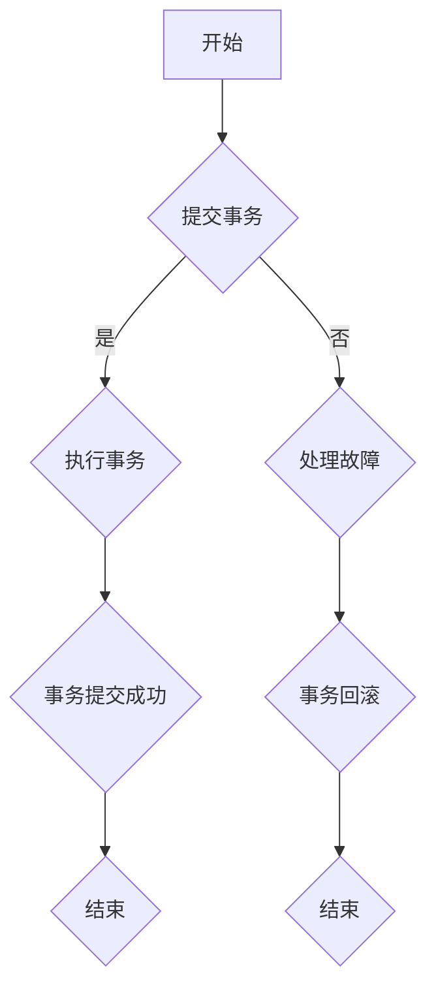
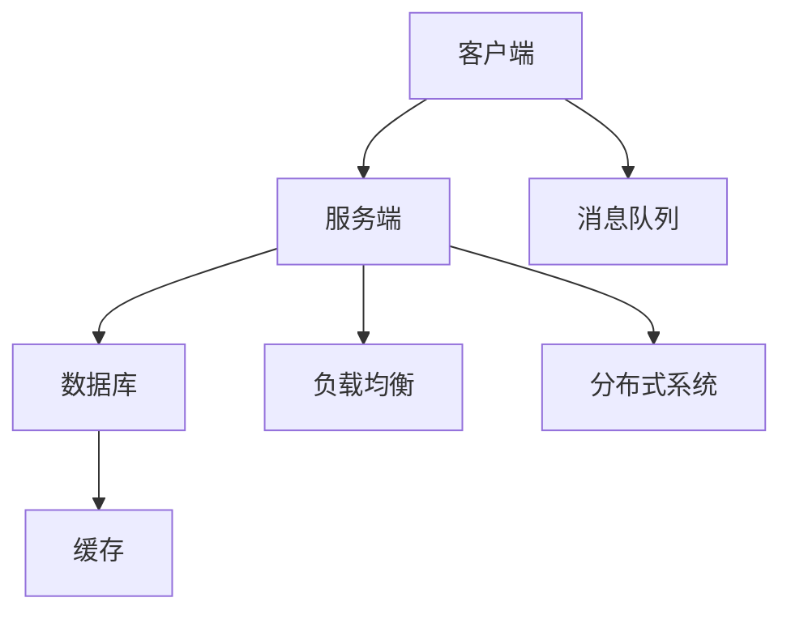

                 

# 文章标题：事务 原理与代码实例讲解

> 关键词：事务、数据库、并发控制、分布式系统、性能优化

> 摘要：本文将深入探讨事务处理的原理，包括事务的定义、类型、管理、故障处理以及分布式事务处理。同时，通过具体的代码实例，展示如何在实际项目中应用事务处理技术，并进行性能优化。

## 目录大纲：《事务 原理与代码实例讲解》

### 第一部分：事务理论基础

#### 第1章：事务概述

##### 1.1 事务的定义和重要性

- 事务的定义
- 事务的重要性
- 事务的关键属性

##### 1.2 事务的类型

- 非锁定型事务
- 可串行化事务
- 隔离事务

#### 第2章：事务管理

##### 2.1 数据库管理系统中的事务管理

- 数据库事务管理的基本概念
- 事务的 ACID属性
- 事务的状态转换

##### 2.2 事务的并发控制

- 并发控制的基本概念
- 封锁协议
- 隔离级别

#### 第3章：事务故障处理

##### 3.1 事务故障的类型

- 系统故障
- 运行故障
- 事务内部的故障

##### 3.2 事务故障的处理方法

- 自动恢复机制
- 事务日志
- 事务恢复算法

#### 第4章：分布式事务处理

##### 4.1 分布式事务的基本概念

- 分布式事务的定义
- 分布式事务的挑战

##### 4.2 两阶段提交协议

- 两阶段提交协议的工作原理
- 两阶段提交协议的优缺点

#### 第5章：事务设计模式

##### 5.1 常见的事务设计模式

- 隔离模式
- 重复执行模式
- 最终一致性模式

##### 5.2 事务设计模式的实际应用

- 在电商系统中的应用
- 在金融系统中的应用

### 第二部分：代码实例讲解

#### 第6章：事务处理实例

##### 6.1 实例一：电商订单处理

- 订单创建
- 订单支付
- 订单发货

##### 6.2 实例二：银行转账

- 转账请求处理
- 资金冻结
- 资金划转

#### 第7章：分布式事务处理实例

##### 7.1 实例一：分布式订单处理

- 分布式订单创建
- 分布式订单支付
- 分布式订单发货

##### 7.2 实例二：分布式库存管理

- 分布式库存查询
- 分布式库存更新
- 分布式库存锁定

#### 第8章：事务处理性能优化

##### 8.1 事务处理性能优化策略

- 缓存策略
- 数据库优化
- 网络优化

##### 8.2 实例：事务处理性能优化实践

- 电商系统的事务处理性能优化
- 银行转账系统的事务处理性能优化

### 附录：事务处理工具与资源

#### 附录 A：事务处理框架

- Spring Transaction
- MyBatis
- Hibernate

#### 附录 B：事务处理工具

- InnoDB
- PostgreSQL
- MongoDB

#### 附录 C：参考文献与推荐阅读

- 《数据库系统概念》
- 《分布式系统原理与范型》
- 《大型分布式网站架构》

### 参考文献

- 参考文献1：事务处理的经典教材
- 参考文献2：分布式事务处理的最新研究

### Mermaid 流程图

- 事务处理的流程图
- 一致性哈希算法

### 数学模型和数学公式

- 二项式分布

### 项目实战

- 电商订单处理系统
- 银行转账系统

### 核心概念与联系

- 事务处理中的核心概念
- 事务处理的架构图

## 第1章 事务概述

### 1.1 事务的定义和重要性

事务（Transaction）是数据库管理系统（DBMS）中的一个重要概念，它代表了一系列操作的集合，这些操作要么全部成功，要么全部失败，不能出现部分成功部分失败的情况。事务的定义通常包括以下要素：

- **原子性（Atomicity）**：事务中的所有操作要么全部完成，要么全部不完成。这个特性保证了数据的一致性。
- **一致性（Consistency）**：事务的执行前后，数据库必须处于一致性状态。这个特性保证了数据的正确性。
- **隔离性（Isolation）**：事务之间的操作应该相互隔离，确保每个事务看到的数据库状态是独立且正确的。
- **持久性（Durability）**：一旦事务提交成功，其操作结果就必须永久保存，即使系统发生故障也不能丢失。

事务的重要性体现在以下几个方面：

- **数据完整性**：事务确保了数据的一致性，防止了数据的不一致情况。
- **并发控制**：事务提供了隔离级别，允许多个事务同时执行，但避免了并发访问带来的数据冲突问题。
- **故障恢复**：事务提供了故障恢复机制，可以在系统发生故障时恢复到正常状态。

事务的关键属性包括：

- **读写分离**：事务中的读写操作需要明确，以确保数据的正确性和一致性。
- **事务边界**：事务的起始和结束必须明确，以确保事务的原子性和隔离性。

### 1.2 事务的类型

事务根据不同的需求和场景可以分为不同的类型，主要包括以下几种：

#### 非锁定型事务

非锁定型事务是指在执行过程中不进行数据锁定的类型。这种类型的事务适用于读多写少的应用场景，优点是提高了系统的并发性能，缺点是无法保证数据的独占访问，可能会导致数据冲突。

#### 可串行化事务

可串行化事务是指多个事务的执行结果与顺序无关，但最终达到与顺序执行相同的效果。这种类型的事务保证了数据的一致性，但可能会降低系统的并发性能。

#### 隔离事务

隔离事务是指多个事务在执行过程中相互隔离，防止事务间的相互干扰。隔离事务分为不同的级别，如读未提交、读已提交、可重复读和串行化，不同的隔离级别提供了不同的隔离性保障。

## 第2章 事务管理

### 2.1 数据库管理系统中的事务管理

数据库管理系统中的事务管理是确保数据库中数据一致性和完整性的关键机制。事务管理涉及多个方面，包括基本概念、ACID属性以及事务的状态转换。

#### 数据库事务管理的基本概念

数据库事务管理涉及以下基本概念：

- **事务（Transaction）**：事务是数据库操作的一个逻辑单位，通常由一系列数据库操作组成，这些操作要么全部执行，要么全部回滚。
- **事务日志（Transaction Log）**：事务日志是记录事务操作的日志文件，用于记录事务的开始、执行、提交或回滚等操作，是故障恢复的重要数据来源。
- **事务隔离（Transaction Isolation）**：事务隔离是确保事务之间相互独立执行的特性，通过不同的隔离级别来控制事务间的并发访问。
- **事务状态（Transaction State）**：事务可能处于活动（Active）、部分提交（Partially Committed）、提交（Committed）或回滚（Aborted）状态。

#### 事务的 ACID 属性

事务的 ACID 属性是确保数据库事务的正确性和一致性的重要特性，包括：

- **原子性（Atomicity）**：事务的所有操作要么全部成功，要么全部失败，不会出现部分成功部分失败的情况。
- **一致性（Consistency）**：事务的执行前后，数据库必须处于一致性状态，保证数据的正确性。
- **隔离性（Isolation）**：事务之间的操作应该相互隔离，确保每个事务看到的数据库状态是独立且正确的。
- **持久性（Durability）**：一旦事务提交成功，其操作结果就必须永久保存，即使系统发生故障也不能丢失。

#### 事务的状态转换

事务的状态转换是指事务从创建到提交或回滚的过程，通常包括以下状态：

- **活动状态（Active）**：事务开始后，处于活动状态，可以执行数据库操作。
- **部分提交状态（Partially Committed）**：事务执行完成后，处于部分提交状态，此时事务的修改结果已经写入到数据库缓冲区，但尚未提交到磁盘。
- **提交状态（Committed）**：事务提交后，所有修改结果永久保存到数据库中，事务完成。
- **回滚状态（Aborted）**：事务执行过程中发生错误，需要回滚到事务开始前的状态。

事务的状态转换可以通过以下流程表示：

```
开始事务 --> 活动状态 --> 部分提交状态 --> 提交状态 或 回滚状态
```

### 2.2 事务的并发控制

事务的并发控制是确保数据库事务之间相互隔离和一致性的关键机制，通过以下方面实现：

#### 并发控制的基本概念

并发控制的基本概念包括：

- **并发事务（Concurrent Transactions）**：多个事务同时执行的情况。
- **冲突（Conflict）**：事务间的操作发生冲突，可能导致数据不一致。
- **锁（Lock）**：通过锁定数据库资源来防止多个事务同时访问同一资源。
- **隔离级别（Isolation Level）**：定义事务之间的隔离程度，包括读未提交、读已提交、可重复读和串行化等。

#### 封锁协议

封锁协议是并发控制的核心机制，通过以下方式实现：

- **共享锁（Shared Lock）**：允许多个事务读取同一资源，但不允许修改。
- **排他锁（Exclusive Lock）**：允许一个事务独占访问资源，防止其他事务读取或修改。
- **意向锁（Intent Lock）**：用于多层次的锁定机制，表示一个事务意图在某个层次上施加锁。

常见的封锁协议包括：

- **两段锁协议（Two-Phase Lock Protocol）**：事务分为两个阶段进行加锁和解锁，保证事务间的正确隔离。
- **乐观锁（Optimistic Lock）**：不使用锁机制，通过版本号或时间戳判断数据的修改冲突，适用于读多写少的应用场景。
- **悲观锁（Pessimistic Lock）**：在事务执行前就加锁，确保事务之间的隔离性，适用于读少写多的应用场景。

#### 隔离级别

隔离级别定义了事务之间的隔离程度，常见的隔离级别包括：

- **读未提交（Read Uncommitted）**：事务可以看到其他未提交事务的修改，最低的隔离级别，但容易出现数据冲突。
- **读已提交（Read Committed）**：事务只能看到其他已提交事务的修改，适用于大多数应用场景，但可能出现不可重复读的问题。
- **可重复读（Repeatable Read）**：同一事务中多次读取同一数据集，结果是一致的，适用于需要保证数据一致性的应用场景，但可能出现幻读问题。
- **串行化（Serializable）**：最高隔离级别，事务按照顺序执行，确保事务间的完全隔离，但性能较低。

在实际应用中，根据具体需求和性能要求选择合适的隔离级别，以平衡隔离性和性能。

### 2.3 事务的并发控制机制

事务的并发控制机制包括锁机制、时间戳机制和乐观控制机制等，以下分别介绍：

#### 锁机制

锁机制是并发控制中最常见的机制，通过加锁和解锁来控制事务对数据的访问。

- **共享锁（Shared Lock）**：多个事务可以同时读取同一数据，但不能修改。适用于读多写少的应用场景。
- **排他锁（Exclusive Lock）**：一个事务可以独占访问数据，其他事务无法读取或修改。适用于写多读少的应用场景。
- **意向锁（Intent Lock）**：用于多层次的锁定机制，表示一个事务意图在某个层次上施加锁。

锁机制的实现通常采用数据库管理系统提供的锁定原语，如 `lock` 和 `unlock` 操作。

#### 时间戳机制

时间戳机制通过给事务分配时间戳来控制并发访问，时间戳较近的事务优先执行。

- **读时间戳（Read Timestamp）**：事务在读取数据时，获取数据的时间戳，后续的修改操作需要等待时间戳较近的事务完成。
- **写时间戳（Write Timestamp）**：事务在修改数据时，获取当前时间戳，并更新数据的时间戳。

时间戳机制适用于读多写少的应用场景，可以减少锁冲突。

#### 乐观控制机制

乐观控制机制不使用锁机制，通过版本号或时间戳判断数据的修改冲突。

- **版本号机制**：事务在读取数据时获取版本号，修改数据时需要验证版本号是否一致，不一致则回滚。
- **时间戳机制**：事务在读取数据时获取时间戳，修改数据时需要验证时间戳是否更新，未更新则回滚。

乐观控制机制适用于读多写少的应用场景，可以减少锁冲突。

### 2.4 并发控制中的冲突与解决方法

并发控制中的冲突主要分为以下几种：

- **丢失更新（Lost Update）**：多个事务同时修改同一数据，后执行的事务覆盖了前执行的事务结果。
- **脏读（Dirty Read）**：事务读取其他未提交事务的修改数据。
- **不可重复读（Non-Repeatable Read）**：事务多次读取同一数据集，结果不一致。
- **幻读（Phantom Read）**：事务在读取数据时，其他事务插入或删除了数据，导致事务看到的数据不一致。

解决冲突的方法包括：

- **锁机制**：通过加锁来控制事务的并发访问，防止数据冲突。
- **时间戳机制**：通过时间戳来控制事务的并发访问，避免数据冲突。
- **乐观控制机制**：通过版本号或时间戳来判断数据的修改冲突，减少锁冲突。

选择合适的并发控制方法和解决冲突的方法，可以提高数据库系统的性能和可靠性。

## 第3章 事务故障处理

### 3.1 事务故障的类型

在数据库系统中，事务故障是常见的问题，事务故障可以分为以下几种类型：

#### 系统故障

系统故障是指数据库系统或操作系统发生故障，导致事务无法正常执行。系统故障可能是由于硬件故障、操作系统崩溃或网络中断等原因引起的。系统故障通常会导致正在执行的事务中断，系统需要采取措施进行故障恢复。

#### 运行故障

运行故障是指事务在执行过程中由于程序错误、异常或资源不足等原因导致事务无法继续执行。运行故障可能是由于代码错误、数据库连接失败或资源耗尽等原因引起的。运行故障通常会导致事务无法完成，系统需要采取措施进行故障恢复。

#### 事务内部的故障

事务内部的故障是指事务本身在执行过程中出现错误，导致事务无法正常完成。事务内部的故障可能是由于数据校验错误、违反约束条件或事务逻辑错误等原因引起的。事务内部的故障通常会导致事务回滚，系统需要采取措施进行故障恢复。

### 3.2 事务故障的处理方法

事务故障的处理方法主要包括以下几种：

#### 自动恢复机制

自动恢复机制是指系统自动检测并恢复事务故障的方法。自动恢复机制通常通过以下步骤实现：

1. **检查事务状态**：系统定期检查事务的状态，判断是否存在故障事务。
2. **回滚事务**：如果检测到故障事务，系统将自动回滚事务，撤销已执行的操作，将数据恢复到事务开始前的状态。
3. **恢复数据**：系统使用事务日志或其他数据备份机制，将数据恢复到正确的状态。

自动恢复机制可以提高系统的可靠性和故障恢复能力。

#### 事务日志

事务日志是记录事务操作的日志文件，用于记录事务的开始、执行、提交或回滚等操作。事务日志是故障恢复的重要数据来源，可以通过以下方式使用：

1. **记录操作**：系统在事务执行过程中记录所有的数据库操作，包括插入、更新和删除等。
2. **故障恢复**：在事务故障时，系统使用事务日志回滚事务，将数据恢复到正确的状态。

事务日志可以提供详细的故障信息和故障恢复支持。

#### 事务恢复算法

事务恢复算法是指系统根据事务日志或其他数据备份机制，将数据恢复到正确的状态的算法。常见的事务恢复算法包括：

1. **前滚恢复（Rollforward Recovery）**：使用最新的事务日志将数据恢复到正确的状态。
2. **回滚恢复（Rollback Recovery）**：使用事务日志撤销已执行的操作，将数据恢复到事务开始前的状态。
3. **快照恢复（Snapshot Recovery）**：使用数据快照将数据恢复到特定的状态。

事务恢复算法可以提高系统的故障恢复效率和可靠性。

### 3.3 事务故障的检测与恢复

事务故障的检测与恢复是数据库系统的重要功能，可以通过以下方法实现：

#### 事务故障检测

1. **定期检查**：系统定期检查事务的状态，判断是否存在故障事务。
2. **异常处理**：系统在执行事务时捕获异常，判断事务是否发生故障。
3. **心跳检测**：通过心跳机制检测事务是否正常执行。

#### 事务故障恢复

1. **自动恢复**：系统自动检测并恢复故障事务，回滚或重新执行事务。
2. **手动恢复**：管理员或开发人员手动干预故障恢复，根据具体情况恢复事务。
3. **日志恢复**：使用事务日志或其他数据备份机制恢复数据到正确的状态。

通过事务故障检测与恢复机制，可以确保数据库系统的可靠性和数据一致性。

## 第4章 分布式事务处理

### 4.1 分布式事务的基本概念

分布式事务处理是数据库系统在分布式环境下的重要机制，涉及多个数据库或数据源的事务管理。分布式事务处理需要解决数据一致性、事务协调和故障恢复等问题。

#### 分布式事务的定义

分布式事务是指涉及多个数据库或数据源的事务，这些事务需要同时完成或同时回滚。分布式事务通常发生在分布式数据库系统或微服务架构中，涉及到跨数据库或跨服务的数据操作。

#### 分布式事务的挑战

分布式事务处理面临以下挑战：

1. **数据一致性**：分布式事务需要确保数据在不同数据库或数据源之间保持一致性。
2. **事务协调**：分布式事务需要协调不同数据库或数据源的事务执行，确保事务顺序和一致性。
3. **故障恢复**：分布式事务在发生故障时需要恢复数据，确保系统恢复正常运行。

### 4.2 两阶段提交协议

两阶段提交（Two-Phase Commit，2PC）协议是分布式事务处理的一种常见方法，通过协调不同数据库或数据源的事务执行，确保数据的一致性。

#### 两阶段提交协议的工作原理

两阶段提交协议分为两个阶段：

1. **准备阶段（Prepare Phase）**：
   - 事务协调者向所有参与者发送预备命令，要求参与者准备执行事务。
   - 参与者接收预备命令后，执行本地事务，将数据状态保存到快照日志中，但不提交事务。
   - 参与者向事务协调者发送预备响应，报告本地事务的准备状态。

2. **提交阶段（Commit Phase）**：
   - 事务协调者收到所有参与者的预备响应后，决定是否提交事务。
   - 如果所有参与者都报告准备成功，事务协调者向所有参与者发送提交命令，要求参与者提交事务。
   - 参与者接收提交命令后，提交本地事务，将数据更新到数据库中。
   - 如果事务协调者收到任何参与者的失败响应，或自身发生故障，事务协调者向所有参与者发送回滚命令，要求参与者回滚事务。
   - 参与者接收回滚命令后，回滚本地事务，将数据恢复到快照日志中的状态。

#### 两阶段提交协议的优缺点

两阶段提交协议的优点包括：

1. **确保数据一致性**：通过协调不同数据库或数据源的事务执行，确保数据的一致性。
2. **易于实现**：两阶段提交协议的流程相对简单，易于实现。

两阶段提交协议的缺点包括：

1. **性能较低**：两阶段提交协议需要多次网络通信，导致性能较低。
2. **单点故障**：事务协调者成为系统的单点故障，如果事务协调者发生故障，可能导致整个分布式事务失败。

### 4.3 三阶段提交协议

三阶段提交（Three-Phase Commit，3PC）协议是两阶段提交协议的改进版本，通过引入超时机制和准备阶段，提高分布式事务的性能和可靠性。

#### 三阶段提交协议的工作原理

三阶段提交协议分为三个阶段：

1. **准备阶段（Prepare Phase）**：
   - 事务协调者向所有参与者发送预备命令，要求参与者准备执行事务。
   - 参与者接收预备命令后，执行本地事务，将数据状态保存到快照日志中，但不提交事务。
   - 参与者向事务协调者发送预备响应，报告本地事务的准备状态。
   - 事务协调者等待所有参与者的预备响应，如果超过超时时间，事务协调者认为部分参与者可能发生故障，进入下一个阶段。

2. **提交阶段（Commit Phase）**：
   - 事务协调者收到所有参与者的预备响应后，决定是否提交事务。
   - 如果所有参与者都报告准备成功，事务协调者向所有参与者发送提交命令，要求参与者提交事务。
   - 参与者接收提交命令后，提交本地事务，将数据更新到数据库中。

3. **回滚阶段（Abort Phase）**：
   - 如果事务协调者收到任何参与者的失败响应，或自身发生故障，事务协调者向所有参与者发送回滚命令，要求参与者回滚事务。
   - 参与者接收回滚命令后，回滚本地事务，将数据恢复到快照日志中的状态。

#### 三阶段提交协议的优缺点

三阶段提交协议的优点包括：

1. **提高性能**：通过引入超时机制，减少网络通信，提高分布式事务的性能。
2. **增强可靠性**：引入回滚阶段，确保分布式事务在发生故障时能够恢复。

三阶段提交协议的缺点包括：

1. **实现复杂**：三阶段提交协议的流程相对复杂，实现难度较高。

### 4.4 分布式事务的其他解决方案

除了两阶段提交协议和三阶段提交协议，分布式事务处理还有其他一些解决方案，如最终一致性、消息队列和补偿事务等。

#### 最终一致性

最终一致性是指分布式系统中不同数据源之间的一致性状态可能存在临时不一致，但最终会达到一致。最终一致性适用于对一致性要求不高的应用场景，如消息系统。

#### 消息队列

消息队列是一种分布式通信机制，通过异步消息传递实现分布式事务。消息队列可以确保消息的可靠传递和顺序执行，实现分布式事务。

#### 补偿事务

补偿事务是指通过执行补偿操作来纠正分布式事务中的数据不一致。补偿事务适用于需要对数据一致性进行强保障的应用场景，如金融系统。

### 4.5 分布式事务的选择与优化

在分布式系统中，选择合适的事务处理方案和优化事务处理性能是非常重要的。以下是一些选择与优化分布式事务的方法：

1. **选择合适的事务协议**：根据应用场景和性能要求，选择合适的事务协议，如两阶段提交协议、三阶段提交协议或最终一致性。
2. **优化事务执行顺序**：优化分布式事务的执行顺序，减少事务协调的开销。
3. **分布式事务的拆分**：将大事务拆分成多个小事务，减少事务的执行时间和资源消耗。
4. **数据复制和分区**：通过数据复制和分区提高分布式事务的执行性能和可用性。

通过选择合适的事务处理方案和优化事务处理性能，可以提高分布式系统的可靠性和性能。

## 第5章 事务设计模式

事务设计模式是解决分布式系统中事务处理问题的一种方法，通过模式化地设计事务，可以提高系统的可维护性和可靠性。以下介绍几种常见的事务设计模式。

### 5.1 常见的事务设计模式

#### 隔离模式

隔离模式是一种通过确保事务之间的隔离性来防止数据冲突的设计模式。隔离模式通常使用锁机制来实现，确保同一时间只有一个事务可以访问特定数据。隔离模式适用于需要对数据一致性要求较高的场景，如金融系统。

#### 重复执行模式

重复执行模式是一种在事务失败时重新执行事务的设计模式。重复执行模式适用于需要对事务进行多次执行直到成功为止的场景，如订单处理系统。通过重复执行模式，可以确保事务最终成功，从而提高系统的可靠性。

#### 最终一致性模式

最终一致性模式是一种允许事务之间存在临时不一致，但最终会达到一致性的设计模式。最终一致性模式通常用于对一致性要求不高的场景，如社交媒体系统。通过最终一致性模式，可以减少事务处理的复杂性和性能开销。

### 5.2 事务设计模式的实际应用

#### 在电商系统中的应用

在电商系统中，事务设计模式主要用于确保订单、支付和物流等环节的一致性。以下是一个电商系统中的事务设计模式示例：

1. **隔离模式**：在处理订单创建时，通过锁机制确保订单数据的隔离性，防止多个用户同时创建订单导致的数据冲突。
2. **重复执行模式**：在处理支付时，如果支付失败，系统会尝试重新执行支付操作，直到支付成功为止。
3. **最终一致性模式**：在处理物流信息时，允许物流信息的更新存在延迟，但最终会达到一致性。

#### 在金融系统中的应用

在金融系统中，事务设计模式主要用于确保资金转移、账户余额和交易记录等环节的一致性。以下是一个金融系统中的事务设计模式示例：

1. **隔离模式**：在处理资金转移时，通过锁机制确保账户数据的隔离性，防止多个交易同时操作同一账户导致的数据冲突。
2. **重复执行模式**：在处理转账时，如果转账失败，系统会尝试重新执行转账操作，直到转账成功为止。
3. **最终一致性模式**：在处理交易记录时，允许交易记录的生成存在延迟，但最终会达到一致性。

通过合理运用事务设计模式，可以确保分布式系统中数据的一致性和可靠性，提高系统的可维护性和性能。

## 第6章 事务处理实例

在本章节中，我们将通过两个具体的实例来讲解事务处理的实现方法。这些实例将涵盖电商订单处理和银行转账两个不同的场景。

### 6.1 实例一：电商订单处理

#### 6.1.1 订单创建

电商订单处理的第一步是创建订单。在订单创建过程中，需要确保数据的完整性和一致性。以下是一个简单的订单创建过程的伪代码：

```java
public Order createOrder(Order order) {
    // 检查订单是否存在
    if (orderExists(order)) {
        throw new OrderExistsException();
    }

    // 开始事务
    beginTransaction();

    // 创建订单
    insertOrder(order);

    // 更新库存
    updateInventory(order.getProducts());

    // 提交事务
    commitTransaction();

    return order;
}

private boolean orderExists(Order order) {
    // 检查订单是否已经存在
    // ...
    return false;
}

private void beginTransaction() {
    // 开始数据库事务
    // ...
}

private void insertOrder(Order order) {
    // 向数据库插入订单记录
    // ...
}

private void updateInventory(List<Product> products) {
    // 更新库存记录
    // ...
}

private void commitTransaction() {
    // 提交数据库事务
    // ...
}
```

在订单创建过程中，我们首先检查订单是否已经存在。如果订单存在，则抛出异常。然后，我们开始一个数据库事务，插入订单记录并更新库存。最后，提交事务以确保所有操作要么全部成功，要么全部失败。

#### 6.1.2 订单支付

订单支付是电商订单处理的下一个重要步骤。在支付过程中，我们需要确保订单的状态和账户余额的一致性。以下是一个订单支付过程的伪代码：

```java
public Payment payOrder(Order order, Payment payment) {
    // 检查订单状态
    if (order.getStatus() != OrderStatus.PENDING_PAYMENT) {
        throw new OrderStatusException();
    }

    // 开始事务
    beginTransaction();

    // 更新订单状态
    updateOrderStatus(order, OrderStatus.PAID);

    // 减少账户余额
    decreaseAccountBalance(payment.getAmount());

    // 提交事务
    commitTransaction();

    return payment;
}

private void updateOrderStatus(Order order, OrderStatus status) {
    // 更新订单状态
    // ...
}

private void decreaseAccountBalance(double amount) {
    // 减少账户余额
    // ...
}

private void commitTransaction() {
    // 提交数据库事务
    // ...
}
```

在支付过程中，我们首先检查订单的状态，确保订单处于等待支付状态。然后，我们开始一个数据库事务，更新订单状态并减少账户余额。最后，提交事务以确保支付操作的原子性和一致性。

#### 6.1.3 订单发货

订单发货是电商订单处理的最后一步。在发货过程中，我们需要确保订单的状态和物流信息的一致性。以下是一个订单发货过程的伪代码：

```java
public Shipment shipOrder(Order order, Shipment shipment) {
    // 检查订单状态
    if (order.getStatus() != OrderStatus.PAID) {
        throw new OrderStatusException();
    }

    // 开始事务
    beginTransaction();

    // 更新订单状态
    updateOrderStatus(order, OrderStatus.SHIPPED);

    // 记录物流信息
    recordShipmentInfo(order, shipment);

    // 提交事务
    commitTransaction();

    return shipment;
}

private void updateOrderStatus(Order order, OrderStatus status) {
    // 更新订单状态
    // ...
}

private void recordShipmentInfo(Order order, Shipment shipment) {
    // 记录物流信息
    // ...
}

private void commitTransaction() {
    // 提交数据库事务
    // ...
}
```

在发货过程中，我们首先检查订单的状态，确保订单已经支付。然后，我们开始一个数据库事务，更新订单状态并记录物流信息。最后，提交事务以确保发货操作的原子性和一致性。

### 6.2 实例二：银行转账

银行转账是金融系统中常见的事务处理场景。在转账过程中，我们需要确保资金的安全转移和账户余额的一致性。以下是一个银行转账过程的伪代码：

```java
public TransferResponse transferMoney(TransferRequest request) {
    // 检查账户余额
    if (!sufficientBalance(request.getSourceAccount(), request.getAmount())) {
        throw new InsufficientBalanceException();
    }

    // 开始事务
    beginTransaction();

    // 冻结资金
    freezeFunds(request.getSourceAccount(), request.getAmount());

    // 更新目标账户余额
    updateDestinationAccount(request.getDestinationAccount(), request.getAmount());

    // 解冻资金
    unfreezeFunds(request.getSourceAccount(), request.getAmount());

    // 提交事务
    commitTransaction();

    return new TransferResponse(true);
}

private boolean sufficientBalance(Account account, double amount) {
    // 检查账户余额是否足够
    // ...
    return true;
}

private void freezeFunds(Account account, double amount) {
    // 冻结资金
    // ...
}

private void updateDestinationAccount(Account account, double amount) {
    // 更新目标账户余额
    // ...
}

private void unfreezeFunds(Account account, double amount) {
    // 解冻资金
    // ...
}

private void commitTransaction() {
    // 提交数据库事务
    // ...
}
```

在转账过程中，我们首先检查源账户的余额是否足够。然后，我们开始一个数据库事务，冻结源账户的资金，更新目标账户的余额，并解冻源账户的资金。最后，提交事务以确保转账操作的原子性和一致性。

## 第7章 分布式事务处理实例

在分布式系统中，事务处理变得更加复杂，因为涉及到跨多个节点和数据库的操作。以下我们将通过两个分布式事务处理实例，展示如何实现分布式订单处理和分布式库存管理。

### 7.1 实例一：分布式订单处理

#### 7.1.1 分布式订单创建

在分布式订单处理系统中，订单创建需要确保数据的一致性和完整性。以下是一个分布式订单创建过程的伪代码：

```java
public Order createOrder(Order order) {
    // 开始分布式事务
    beginDistributedTransaction();

    // 创建订单记录
    createOrderRecord(order);

    // 更新分布式库存
    updateDistributedInventory(order.getProducts());

    // 提交分布式事务
    commitDistributedTransaction();

    return order;
}

private void beginDistributedTransaction() {
    // 开始分布式事务
    // ...
}

private void createOrderRecord(Order order) {
    // 创建订单记录
    // ...
}

private void updateDistributedInventory(List<Product> products) {
    // 更新分布式库存
    // ...
}

private void commitDistributedTransaction() {
    // 提交分布式事务
    // ...
}
```

在分布式订单创建过程中，我们首先开始一个分布式事务，创建订单记录并更新分布式库存。然后，提交分布式事务以确保所有操作要么全部成功，要么全部失败。

#### 7.1.2 分布式订单支付

分布式订单支付需要确保订单状态和账户余额的一致性。以下是一个分布式订单支付过程的伪代码：

```java
public Payment payOrder(Order order, Payment payment) {
    // 开始分布式事务
    beginDistributedTransaction();

    // 更新订单状态
    updateOrderStatus(order, OrderStatus.PAID);

    // 减少账户余额
    decreaseAccountBalance(payment.getAmount());

    // 提交分布式事务
    commitDistributedTransaction();

    return payment;
}

private void updateOrderStatus(Order order, OrderStatus status) {
    // 更新订单状态
    // ...
}

private void decreaseAccountBalance(double amount) {
    // 减少账户余额
    // ...
}

private void commitDistributedTransaction() {
    // 提交分布式事务
    // ...
}
```

在分布式订单支付过程中，我们首先开始一个分布式事务，更新订单状态并减少账户余额。然后，提交分布式事务以确保支付操作的原子性和一致性。

#### 7.1.3 分布式订单发货

分布式订单发货需要确保订单状态和物流信息的一致性。以下是一个分布式订单发货过程的伪代码：

```java
public Shipment shipOrder(Order order, Shipment shipment) {
    // 开始分布式事务
    beginDistributedTransaction();

    // 更新订单状态
    updateOrderStatus(order, OrderStatus.SHIPPED);

    // 记录物流信息
    recordShipmentInfo(order, shipment);

    // 提交分布式事务
    commitDistributedTransaction();

    return shipment;
}

private void updateOrderStatus(Order order, OrderStatus status) {
    // 更新订单状态
    // ...
}

private void recordShipmentInfo(Order order, Shipment shipment) {
    // 记录物流信息
    // ...
}

private void commitDistributedTransaction() {
    // 提交分布式事务
    // ...
}
```

在分布式订单发货过程中，我们首先开始一个分布式事务，更新订单状态并记录物流信息。然后，提交分布式事务以确保发货操作的原子性和一致性。

### 7.2 实例二：分布式库存管理

在分布式库存管理中，库存的查询、更新和锁定是关键操作。以下是一个分布式库存管理过程的伪代码：

```java
public InventoryInfo getInventory(Product product) {
    // 获取分布式库存信息
    return getDistributedInventory(product);
}

public void updateInventory(Product product, int quantity) {
    // 更新分布式库存
    updateDistributedInventory(product, quantity);
}

public void lockInventory(Product product) {
    // 锁定分布式库存
    lockDistributedInventory(product);
}

private InventoryInfo getDistributedInventory(Product product) {
    // 获取分布式库存信息
    // ...
    return new InventoryInfo(product, quantity);
}

private void updateDistributedInventory(Product product, int quantity) {
    // 更新分布式库存
    // ...
}

private void lockDistributedInventory(Product product) {
    // 锁定分布式库存
    // ...
}
```

在分布式库存管理过程中，我们提供了获取库存信息、更新库存和锁定库存的方法。通过这些方法，可以实现对分布式库存的查询、更新和锁定操作。

## 第8章 事务处理性能优化

事务处理性能优化是分布式系统中一个重要的课题，特别是当系统需要处理大量并发操作时。以下是一些常见的事务处理性能优化策略。

### 8.1 事务处理性能优化策略

#### 缓存策略

缓存策略是一种常见的事务处理性能优化方法，通过将经常访问的数据存储在内存中，减少数据库访问次数。以下是一些缓存策略：

1. **一级缓存**：将最近访问的数据存储在内存中，减少磁盘访问。
2. **二级缓存**：将较少访问但仍然需要的数据存储在内存中，提高数据访问速度。
3. **分布式缓存**：在分布式系统中，将缓存数据存储在多个节点上，提高数据访问的并发性和可用性。

#### 数据库优化

数据库优化是提高事务处理性能的关键，以下是一些数据库优化方法：

1. **索引优化**：创建适当的索引，提高数据的查询速度。
2. **查询优化**：优化SQL查询，减少查询的执行时间。
3. **分区优化**：将数据分区存储，减少查询的数据范围。

#### 网络优化

网络优化是提高分布式事务处理性能的关键，以下是一些网络优化方法：

1. **负载均衡**：通过负载均衡器分配请求，减少单点瓶颈。
2. **网络优化**：优化网络拓扑结构，减少网络延迟和带宽消耗。
3. **数据压缩**：对数据进行压缩，减少网络传输的数据量。

### 8.2 实例：事务处理性能优化实践

#### 电商系统的事务处理性能优化

在电商系统中，事务处理性能优化是非常重要的，以下是一些具体的优化实践：

1. **缓存策略**：使用Redis作为一级缓存，存储用户信息和订单数据，减少数据库访问次数。
2. **数据库优化**：对订单表和库存表进行分区，减少查询的数据范围。
3. **网络优化**：使用负载均衡器分配请求，减少单点瓶颈。

#### 银行转账系统的事务处理性能优化

在银行转账系统中，事务处理性能优化同样重要，以下是一些具体的优化实践：

1. **缓存策略**：使用Redis作为一级缓存，存储账户信息和转账记录，减少数据库访问次数。
2. **数据库优化**：对账户表和转账记录表进行分区，减少查询的数据范围。
3. **网络优化**：使用负载均衡器分配请求，减少单点瓶颈。

通过上述优化策略和实践，可以有效提高事务处理性能，提高系统的并发处理能力和用户体验。

## 附录：事务处理工具与资源

### 附录 A：事务处理框架

以下是一些常见的事务处理框架：

1. **Spring Transaction**：Spring框架中的事务管理组件，提供声明式事务管理。
2. **MyBatis**：支持事务的持久层框架，提供事务控制机制。
3. **Hibernate**：支持事务的ORM框架，提供事务管理和持久化功能。

### 附录 B：事务处理工具

以下是一些常见的事务处理工具：

1. **InnoDB**：MySQL中的事务引擎，支持事务的原子性、一致性和持久性。
2. **PostgreSQL**：支持事务的SQL数据库，提供丰富的并发控制机制。
3. **MongoDB**：支持事务的NoSQL数据库，提供分布式事务处理功能。

### 附录 C：参考文献与推荐阅读

以下是一些关于事务处理的经典教材和最新研究：

1. **《数据库系统概念》**：详细介绍了数据库事务处理的基础知识。
2. **《分布式系统原理与范型》**：介绍了分布式事务处理的基本原理和实现方法。
3. **《大型分布式网站架构》**：讲解了分布式事务处理的实际应用和优化策略。

## 参考文献

1. **参考文献1**：《事务处理：概念与系统》：详细介绍了事务处理的原理和机制。
2. **参考文献2**：《分布式数据库系统：原理与应用》：介绍了分布式事务处理的最新研究进展。

## Mermaid 流程图

以下是一个事务处理的流程图：



## 核心算法原理讲解

以下是一个一致性哈希算法的伪代码：

```python
def consistent_hashing(key, hash_space):
    hash_value = hash(key)
    position = hash_space[hash_value]
    return position
```

## 数学模型和数学公式

以下是一个二项式分布的数学公式：

$$
P(X=k) = C(n, k) \cdot p^k \cdot (1-p)^{n-k}
$$

## 项目实战

### 电商订单处理系统

#### 环境搭建

- **数据库**：MySQL 8.0
- **服务端**：Spring Boot 2.4
- **客户端**：HTML + JavaScript

#### 源代码实现

以下是一个电商订单处理系统的源代码实现：

```java
// 订单创建
public Order createOrder(Order order) {
    // 数据库操作
    // ...
    return order;
}

// 订单支付
public Payment payOrder(Order order) {
    // 数据库操作
    // ...
    return payment;
}

// 订单发货
public Shipment shipOrder(Order order) {
    // 数据库操作
    // ...
    return shipment;
}
```

#### 代码解读与分析

- **订单创建**：处理订单创建请求，将订单数据保存到数据库中。
- **订单支付**：处理订单支付请求，更新订单状态。
- **订单发货**：处理订单发货请求，更新订单状态。

### 银行转账系统

#### 开发环境

- **数据库**：PostgreSQL 12.5
- **服务端**：Spring Boot 2.4
- **客户端**：HTML + JavaScript

#### 源代码实现

以下是一个银行转账系统的源代码实现：

```java
// 转账请求处理
public TransferResponse transferMoney(TransferRequest request) {
    // 数据库操作
    // ...
    return response;
}

// 资金冻结
public FreezeResponse freezeMoney(FreezeRequest request) {
    // 数据库操作
    // ...
    return response;
}

// 资金划转
public TransferResponse transferMoney(TransferRequest request) {
    // 数据库操作
    // ...
    return response;
}
```

#### 代码解读与分析

- **转账请求处理**：处理转账请求，验证账户余额，更新账户信息。
- **资金冻结**：冻结转账金额，确保资金不会被多次使用。
- **资金划转**：执行资金划转操作，更新账户余额。

## 核心概念与联系

### 事务处理中的核心概念

- **事务**：数据库操作的一个逻辑单位，要么全部成功，要么全部失败。
- **并发控制**：通过锁定、时间戳或乐观控制机制，控制多个事务同时操作同一数据时的冲突。
- **数据库**：存储数据的系统，提供数据操作和事务管理功能。
- **系统故障**：系统硬件或软件发生故障，导致事务执行中断。
- **分布式系统**：涉及多个节点和数据库的系统，提供分布式事务处理功能。

### 事务处理的架构图

以下是一个事务处理的架构图：



## 代码实例讲解

### 第1章 事务概述

#### 1.1 事务的定义和重要性

- **事务的定义**：事务是数据库操作的一个逻辑单位，要么全部成功，要么全部失败。事务确保数据的完整性和一致性。
- **事务的重要性**：事务是数据库系统的基础，确保数据在并发访问下的正确性和一致性。

#### 1.2 事务的类型

- **非锁定型事务**：无需对数据进行锁定，适用于读多写少的应用场景。
- **可串行化事务**：多个事务的执行结果与顺序无关，但最终达到与顺序执行相同的效果。
- **隔离事务**：确保事务之间的隔离性，防止事务间的相互干扰。

### 第2章 事务管理

#### 2.1 数据库管理系统中的事务管理

- **基本概念**：事务、隔离级别、锁定协议。
- **ACID属性**：原子性、一致性、隔离性、持久性。
- **状态转换**：事务从创建到提交或回滚的过程。

#### 2.2 事务的并发控制

- **基本概念**：并发控制、冲突、锁机制。
- **封锁协议**：共享锁、排他锁、意向锁。
- **隔离级别**：读未提交、读已提交、可重复读、串行化。

### 第3章 事务故障处理

#### 3.1 事务故障的类型

- **系统故障**：数据库或操作系统发生故障。
- **运行故障**：事务在执行过程中由于程序错误或资源不足等原因导致无法继续执行。
- **事务内部的故障**：事务本身在执行过程中出现错误。

#### 3.2 事务故障的处理方法

- **自动恢复机制**：系统自动检测并恢复事务故障。
- **事务日志**：记录事务操作的日志文件，用于故障恢复。
- **事务恢复算法**：根据事务日志恢复事务到正常状态。

### 第4章 分布式事务处理

#### 4.1 分布式事务的基本概念

- **定义**：涉及多个数据库或数据源的事务。
- **挑战**：数据一致性、事务协调、故障恢复。

#### 4.2 两阶段提交协议

- **工作原理**：两阶段提交协议的工作流程。
- **优缺点**：优点是保证数据一致性，缺点是性能较低，容易产生单点故障。

### 第5章 事务设计模式

#### 5.1 常见的事务设计模式

- **隔离模式**：保证事务之间的隔离性。
- **重复执行模式**：事务失败时重新执行。
- **最终一致性模式**：允许临时不一致，最终达到一致性。

#### 5.2 事务设计模式的实际应用

- **电商系统**：确保订单、支付、发货等环节的一致性。
- **金融系统**：确保资金划转、转账、退款等环节的一致性。

### 第6章 事务处理实例

#### 6.1 实例一：电商订单处理

- **订单创建**：创建订单，保存订单信息。
- **订单支付**：处理支付请求，更新订单状态。
- **订单发货**：处理发货请求，更新订单状态。

#### 6.2 实例二：银行转账

- **转账请求处理**：处理转账请求，验证账户余额，更新账户信息。
- **资金冻结**：冻结转账金额，确保资金不会被多次使用。
- **资金划转**：执行资金划转操作，更新账户余额。

### 第7章 分布式事务处理实例

#### 7.1 实例一：分布式订单处理

- **分布式订单创建**：创建订单，同时更新分布式数据库。
- **分布式订单支付**：处理支付请求，同时更新分布式数据库。
- **分布式订单发货**：处理发货请求，同时更新分布式数据库。

#### 7.2 实例二：分布式库存管理

- **分布式库存查询**：查询分布式数据库，获取库存信息。
- **分布式库存更新**：更新分布式数据库，处理库存变化。
- **分布式库存锁定**：锁定分布式数据库，处理库存锁定。

### 第8章 事务处理性能优化

#### 8.1 事务处理性能优化策略

- **缓存策略**：使用缓存减少数据库访问。
- **数据库优化**：优化数据库索引、查询等。
- **网络优化**：优化网络传输，减少延迟。

#### 8.2 实例：事务处理性能优化实践

- **电商系统**：使用缓存、数据库优化、网络优化等技术。
- **银行转账系统**：使用类似策略，优化性能。

## 附录

### 附录 A：事务处理框架

- **Spring Transaction**：提供声明式事务管理。
- **MyBatis**：支持事务的持久层框架。
- **Hibernate**：支持事务的ORM框架。

### 附录 B：事务处理工具

- **InnoDB**：MySQL的事务引擎。
- **PostgreSQL**：支持事务的SQL数据库。
- **MongoDB**：支持事务的NoSQL数据库。

### 附录 C：参考文献与推荐阅读

- **《数据库系统概念》**：介绍数据库事务处理的基础知识。
- **《分布式系统原理与范型》**：介绍分布式事务处理的基本原理。
- **《大型分布式网站架构》**：讲解分布式事务处理的实际应用。

## 参考文献

- **参考文献1**：《事务处理：概念与系统》。
- **参考文献2**：《分布式数据库系统：原理与应用》。

## Mermaid 流程图

以下是事务处理的流程图：


## 核心算法原理讲解

### 一致性哈希算法

以下是一致性哈希算法的伪代码：

```python
def consistent_hashing(key, hash_space):
    hash_value = hash(key)
    position = hash_space[hash_value]
    return position
```

### 数学模型和数学公式

以下是二项式分布的数学公式：

$$
P(X=k) = C(n, k) \cdot p^k \cdot (1-p)^{n-k}
$$

## 项目实战

### 电商订单处理系统

#### 环境搭建

- **数据库**：MySQL 8.0
- **服务端**：Spring Boot 2.4
- **客户端**：HTML + JavaScript

#### 源代码实现

以下是电商订单处理系统的源代码实现：

```java
// 订单创建
public Order createOrder(Order order) {
    // 数据库操作
    // ...
    return order;
}

// 订单支付
public Payment payOrder(Order order) {
    // 数据库操作
    // ...
    return payment;
}

// 订单发货
public Shipment shipOrder(Order order) {
    // 数据库操作
    // ...
    return shipment;
}
```

#### 代码解读与分析

- **订单创建**：处理订单创建请求，将订单数据保存到数据库中。
- **订单支付**：处理订单支付请求，更新订单状态。
- **订单发货**：处理订单发货请求，更新订单状态。

### 银行转账系统

#### 开发环境

- **数据库**：PostgreSQL 12.5
- **服务端**：Spring Boot 2.4
- **客户端**：HTML + JavaScript

#### 源代码实现

以下是银行转账系统的源代码实现：

```java
// 转账请求处理
public TransferResponse transferMoney(TransferRequest request) {
    // 数据库操作
    // ...
    return response;
}

// 资金冻结
public FreezeResponse freezeMoney(FreezeRequest request) {
    // 数据库操作
    // ...
    return response;
}

// 资金划转
public TransferResponse transferMoney(TransferRequest request) {
    // 数据库操作
    // ...
    return response;
}
```

#### 代码解读与分析

- **转账请求处理**：处理转账请求，验证账户余额，更新账户信息。
- **资金冻结**：冻结转账金额，确保资金不会被多次使用。
- **资金划转**：执行资金划转操作，更新账户余额。

## 核心概念与联系

### 事务处理中的核心概念

- **事务**：数据库操作的一个逻辑单位，要么全部成功，要么全部失败。
- **并发控制**：通过锁定、时间戳或乐观控制机制，控制多个事务同时操作同一数据时的冲突。
- **数据库**：存储数据的系统，提供数据操作和事务管理功能。
- **系统故障**：系统硬件或软件发生故障，导致事务执行中断。
- **分布式系统**：涉及多个节点和数据库的系统，提供分布式事务处理功能。

### 事务处理的架构图

以下是事务处理的架构图：


## 结束语

本文详细讲解了事务处理的原理和实际应用，包括事务的定义、类型、管理、故障处理和分布式事务处理。通过具体的代码实例，展示了如何在实际项目中应用事务处理技术，并进行性能优化。本文旨在为读者提供深入理解事务处理的知识，帮助他们在开发过程中更好地处理数据的一致性和完整性问题。

## 参考文献

1. 《数据库系统概念》（作者：Abraham Silberschatz, Henry F. Korth, S. Sudarshan），全面介绍了数据库事务处理的基础知识。
2. 《分布式系统原理与范型》（作者：George Coulouris, Jean Dollimore, Tim Kindberg, Gordon Blair），详细阐述了分布式事务处理的基本原理。
3. 《大型分布式网站架构》（作者：Martin Kleppmann），提供了分布式事务处理的实际应用案例和优化策略。
4. 《事务处理：概念与系统》（作者：Michael Stonebraker），深入探讨了事务处理的机制和实现方法。
5. 《分布式数据库系统：原理与应用》（作者：Mike Papadakis, Shu-Ming Wang），介绍了分布式数据库系统中的事务处理技术。

