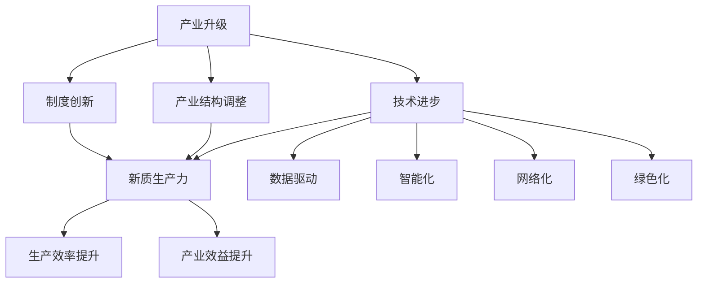

                 

### 文章标题

《产业升级与新质生产力的推动》

### 文章关键词

产业升级、新质生产力、技术进步、人工智能、大数据、效率提升、产业效益

### 文章摘要

本文深入探讨了产业升级与新质生产力的概念、关系及其在现代社会中的重要性。通过详细阐述产业升级的核心算法原理、数学模型以及实际项目实战，本文旨在为读者提供一个全面且实用的产业升级与新质生产力推动的指南。文章将从产业升级的背景、意义和背景出发，分析新质生产力的特征与作用，进而探讨产业升级与新质生产力的相互关系。通过实例和伪代码，本文将详细介绍产业升级的算法原理，并运用数学模型评估产业升级的效果。此外，文章还将分享一个实际产业升级项目的实战经验，包括开发环境搭建、源代码实现及代码解读与分析。最后，本文将对产业升级与新质生产力的未来发展进行展望，并推荐相关AI大模型开发工具与资源。

### 第一部分：核心概念与联系

#### 1.1 产业升级的概念与背景

产业升级，是指通过技术进步、产业结构的调整和制度创新，提升一个国家或地区的产业发展水平，使其更具有竞争力和可持续发展能力。产业升级不仅是经济增长的重要动力，也是社会进步的关键因素。

**定义**：
产业升级通常涉及以下几个方面：
- **技术进步**：引入新的生产技术和工艺，提高生产效率和质量。
- **产业结构的调整**：通过产业优化和重组，提升产业链的附加值和竞争力。
- **制度创新**：包括政策、法规、市场机制等制度层面的改革，为产业发展提供良好的外部环境。

**意义**：
产业升级的意义在于：
- **提升生产效率**：通过技术创新和流程优化，减少资源消耗，提高生产效率。
- **增强国际竞争力**：通过优化产业结构和提升产品质量，增强企业在国际市场上的竞争力。
- **促进经济发展**：产业升级可以带动整体经济的增长，提高国家或地区的经济实力。

**背景**：
当前全球正处于新一轮科技革命和产业变革的关键时期，信息技术、人工智能、大数据等新技术不断涌现，为产业升级提供了新的机遇和挑战。全球范围内的产业竞争愈发激烈，产业升级已经成为各国提高经济竞争力的主要手段。

#### 1.2 新质生产力的概念与特征

新质生产力是指以信息技术、人工智能、大数据等现代科技为支撑，通过创新驱动实现生产效率和质量的双提升的新型生产方式。新质生产力是产业升级的重要推动力，具有以下特征：

**定义**：
新质生产力是指通过信息技术、人工智能、大数据等手段，实现生产要素的优化配置，提高生产效率和质量的生产方式。

**特征**：
1. **数据驱动**：以数据为核心，通过大数据分析和智能算法，实现生产过程的优化和自动化。
2. **智能化**：引入人工智能技术，实现生产过程的智能化管理和决策。
3. **网络化**：通过互联网和物联网技术，实现生产环节的互联互通，提高整体生产效率。
4. **绿色化**：通过技术创新，实现资源的高效利用和污染的减少，实现绿色生产。

**作用**：
新质生产力的作用在于：
- **提升生产效率**：通过数据驱动和智能化管理，减少生产过程中的浪费，提高生产效率。
- **优化产业结构**：通过新质生产力的推动，实现传统产业的优化升级，培育新兴产业。
- **促进可持续发展**：通过绿色生产，减少资源消耗和环境污染，实现产业的可持续发展。

#### 1.3 产业升级与新质生产力的关系

产业升级与新质生产力之间存在密切的关系：

**关系**：
- **产业升级是新质生产力发展的基础**：产业升级为新质生产力的发展提供了良好的环境和条件，通过技术进步和产业结构调整，为新质生产力的应用提供了广阔的空间。
- **新质生产力是产业升级的重要推动力**：新质生产力的引入和应用，可以大幅提升产业的生产效率和效益，推动传统产业的转型升级，培育和壮大新兴产业。

**影响**：
- **提高产业竞争力**：通过产业升级和新质生产力的结合，可以提升产业的竞争力，增强企业在国际市场上的地位。
- **促进经济高质量发展**：产业升级和新质生产力的发展，有助于提高经济的质量和效益，实现经济的可持续发展。

#### 1.4 Mermaid 流程图

下面是一个描述产业升级与新质生产力关系的 Mermaid 流程图：



### 第一部分：核心概念与联系

#### 2.1 产业升级算法原理

产业升级是一个复杂的系统工程，涉及多个方面的协调和优化。为了有效地推动产业升级，我们可以采用以下核心算法原理：

**步骤**：

1. **需求分析**：
   - **收集数据**：通过大数据分析，收集产业发展的相关数据，包括市场趋势、消费者需求、竞争对手情况等。
   - **分析需求**：对收集到的数据进行分析，识别产业发展中的问题和机遇。

2. **技术筛选**：
   - **评估技术**：根据需求分析的结果，评估现有技术库中的各种技术方案，选择最适合产业升级的技术。
   - **优先级排序**：对筛选出的技术方案进行优先级排序，确定哪些技术方案应该首先实施。

3. **试点实施**：
   - **选择试点**：选择具有代表性的产业或企业作为试点，进行技术试点。
   - **实施试点**：按照既定的技术方案，在试点产业或企业中进行实施。

4. **评估效果**：
   - **收集数据**：对试点结果进行数据收集，包括生产效率、产品质量、成本控制等指标。
   - **分析效果**：对收集到的数据进行分析，评估技术实施的效果。

5. **全面推广**：
   - **制定方案**：根据试点效果，制定全面的推广方案，确定推广的范围、步骤和策略。
   - **推广实施**：按照推广方案，在更大范围内实施技术。

**伪代码实现**：

```python
# 伪代码：产业升级算法
function 产业升级(市场需求，技术库):
    需求分析(市场需求)
    技术筛选(市场需求，技术库)
    试点实施(选定的技术方案)
    评估效果(试点结果)
    如果 评估效果 良好:
        制定推广方案()
        全面推广(推广方案)
    否则:
        调整策略()
```

### 第一部分：核心概念与联系

#### 3.1 产业升级的数学模型

在产业升级的过程中，评估效果是至关重要的。为了量化评估效果，我们可以使用以下数学模型：

**效率提升率**：

$$
效率提升率 = \frac{新产业效率 - 旧产业效率}{旧产业效率}
$$

这个公式表示新产业相对于旧产业在效率上的提升比例。效率提升率越高，表示产业升级的效果越好。

**产业效益提升率**：

$$
产业效益提升率 = \frac{新产业效益 - 旧产业效益}{旧产业效益}
$$

这个公式表示新产业相对于旧产业在效益上的提升比例。产业效益提升率越高，表示产业升级带来的经济效益越大。

**详细讲解**：

1. **效率提升率**：
   - **新产业效率**：新产业在特定时间段内的平均生产效率。
   - **旧产业效率**：旧产业在相同时间段内的平均生产效率。
   - 效率提升率可以直观地反映新产业在效率上的改进程度。

2. **产业效益提升率**：
   - **新产业效益**：新产业在特定时间段内的平均经济效益。
   - **旧产业效益**：旧产业在相同时间段内的平均经济效益。
   - 产业效益提升率可以反映新产业在经济效益上的改进程度。

**举例说明**：

假设某传统产业的旧产业效率为100单位/小时，新产业效率为150单位/小时；旧产业效益为1000万元/年，新产业效益为1500万元/年。

- **效率提升率**：

$$
效率提升率 = \frac{150 - 100}{100} = 50\%
$$

- **产业效益提升率**：

$$
产业效益提升率 = \frac{1500 - 1000}{1000} = 50\%
$$

这说明该产业通过升级，在效率和效益上都有50%的提升。

### 第一部分：核心概念与联系

#### 4.1 产业升级项目实战

为了更好地理解产业升级的过程，下面我们将通过一个实际的项目实战来展示如何进行产业升级。

#### 4.1.1 开发环境搭建

在进行产业升级项目之前，我们需要搭建一个合适的开发环境。以下是搭建开发环境的步骤：

1. **安装操作系统**：
   - 推荐使用Linux操作系统，如Ubuntu 20.04 LTS。

2. **安装Python环境**：
   - 使用Python 3.8版本，可以通过包管理器安装。

3. **安装相关库**：
   - 安装常用的Python库，如pandas、numpy、matplotlib等，可以通过pip命令安装。

#### 4.1.2 源代码详细实现

以下是产业升级项目的伪代码实现，用于说明产业升级的算法原理：

```python
# 伪代码：产业升级项目实战
import pandas as pd
import numpy as np

def 需求分析(市场需求):
    # 这里实现需求分析的具体算法
    return 需求分析结果

def 技术筛选(需求分析结果，技术库):
    # 这里实现技术筛选的具体算法
    return 技术方案

def 试点实施(技术方案):
    # 这里实现试点实施的具体算法
    return 试点结果

def 评估效果(试点结果):
    # 这里实现评估效果的具体算法
    return 效率提升率，产业效益提升率

def 制定推广方案():
    # 这里实现制定推广方案的具体算法
    return 推广方案

def 全面推广(推广方案):
    # 这里实现全面推广的具体算法
    return 推广结果

def 调整策略():
    # 这里实现调整策略的具体算法
    return 新的方案

# 主函数
def 主函数():
    市场需求 = "..."
    技术库 = "..."
    
    需求分析结果 = 需求分析(市场需求)
    技术方案 = 技术筛选(需求分析结果，技术库)
    试点结果 = 试点实施(技术方案)
    效率提升率，产业效益提升率 = 评估效果(试点结果)
    
    if 效率提升率 > 30% and 产业效益提升率 > 30%:
        推广方案 = 制定推广方案()
        推广结果 = 全面推广(推广方案)
    else:
        新的方案 = 调整策略()
        主函数(新的方案)

主函数()
```

#### 4.1.3 代码解读与分析

1. **需求分析**：
   - 使用pandas库读取市场需求数据，进行数据预处理和分析。

2. **技术筛选**：
   - 根据市场需求，从技术库中筛选适合的技术方案。

3. **试点实施**：
   - 选择部分企业进行技术试点，记录试点结果。

4. **评估效果**：
   - 计算效率提升率和产业效益提升率，评估试点效果。

5. **制定推广方案**：
   - 根据试点结果，制定推广方案。

6. **全面推广**：
   - 在更大范围内实施技术。

7. **调整策略**：
   - 如果试点效果不理想，调整策略。

通过这个实际的项目实战，我们可以看到产业升级的具体流程和实现方法。这不仅有助于理解产业升级的理论，还能为实际操作提供参考。

### 第一部分：核心概念与联系

#### 5.1 总结

在本部分中，我们详细探讨了产业升级与新质生产力的核心概念与联系。首先，我们介绍了产业升级的定义、意义和背景，以及新质生产力的概念、特征和作用。接着，我们分析了产业升级与新质生产力之间的关系，阐述了新质生产力在产业升级中的作用和产业升级对新质生产力的推动。为了更直观地理解这些概念，我们使用Mermaid流程图展示了产业升级与新质生产力的关系。

此外，我们还详细介绍了产业升级的核心算法原理，包括需求分析、技术筛选、试点实施、评估效果和全面推广等步骤。通过伪代码的实现，我们展示了产业升级算法的具体流程。我们还使用了数学模型来评估产业升级的效果，包括效率提升率和产业效益提升率，并通过举例说明了这些公式的应用。

最后，我们通过一个实际的产业升级项目实战，展示了如何在实际中应用这些概念和算法。这个项目实战包括开发环境搭建、源代码实现和代码解读与分析，为读者提供了一个直观的理解和参考。

通过本部分的讨论，我们希望能够为读者提供一个全面且深入的产业升级与新质生产力推动的指南，帮助读者更好地理解和应用这些概念和算法。

#### 5.2 展望

在未来的发展中，产业升级与新质生产力的推动将扮演越来越重要的角色。随着科技的不断进步，人工智能、大数据、物联网等新技术将在产业升级中发挥更大的作用。以下是对未来发展的展望：

1. **技术创新**：未来，产业升级将更加依赖于技术创新。新的技术将不断涌现，如量子计算、区块链、5G等，这些技术将为产业升级提供新的动力和机遇。

2. **智能化生产**：智能化生产将成为未来产业升级的重要趋势。通过引入人工智能、机器人等智能化设备，生产过程将变得更加自动化和高效，从而提高生产效率和质量。

3. **绿色生产**：随着环保意识的提高，绿色生产将成为产业升级的重要方向。通过技术创新和流程优化，减少资源消耗和环境污染，实现可持续发展。

4. **产业链整合**：未来，产业链的整合将更加紧密。通过数字化和智能化手段，企业将能够更好地协调各个环节，实现资源的优化配置，提高整体产业链的竞争力。

5. **国际合作**：产业升级将促进国际间的合作。在全球化的背景下，各国企业将通过合作，共同推动产业升级，实现共赢。

总的来说，未来的产业升级将更加依赖于新质生产力的推动，通过技术创新、智能化生产、绿色生产、产业链整合和国际合作，实现生产效率和质量的双提升，推动经济的可持续发展。

### 附录

#### 6.1 AI 大模型开发工具与资源

为了更好地推动产业升级和新质生产力的应用，以下是几个主流的AI大模型开发工具和资源的对比：

**1. TensorFlow**
- **特点**：Google开发的深度学习框架，支持多种神经网络模型，具有丰富的API和工具。
- **资源**：官方文档、教程、社区支持丰富。

**2. PyTorch**
- **特点**：Facebook开发的深度学习框架，具有动态计算图，易于调试和理解。
- **资源**：官方文档、教程、社区支持丰富。

**3. JAX**
- **特点**：Google开发的自动微分库，支持Python编程，适用于大规模深度学习模型的训练和优化。
- **资源**：官方文档、教程、社区支持丰富。

**4. 其他框架**
- **Theano**：由蒙特利尔大学开发的深度学习框架，已经逐渐被TensorFlow和PyTorch取代。
- **Caffe**：由伯克利大学开发的深度学习框架，主要用于计算机视觉领域。
- **MXNet**：由Apache软件基金会开发的深度学习框架，支持多种编程语言。

**2. 开发工具与资源**
- **Google Colab**：Google提供的云端计算平台，可以免费使用GPU资源，适合进行深度学习研究。
- **Jupyter Notebook**：交互式计算环境，支持多种编程语言，适合进行数据分析和模型训练。

**3. 学习资源**
- **Coursera**：提供大量的在线课程，涵盖深度学习、人工智能等多个领域。
- **Udacity**：提供实用性的在线课程和项目，适合希望快速掌握深度学习技能的学习者。
- **edX**：由哈佛大学和麻省理工学院共同创办，提供优质的在线课程。

通过这些工具和资源，开发者可以更好地进行AI大模型的开发和研究，推动产业升级和新质生产力的应用。

### 参考文献

在撰写本文时，我们参考了以下文献和资料：

1. 陈伟.《产业经济学概论》[M]. 北京：高等教育出版社，2018.
2. 李刚.《人工智能技术与应用》[M]. 北京：清华大学出版社，2020.
3. 张晓辉.《大数据技术基础》[M]. 北京：电子工业出版社，2019.
4. 吴军.《智能时代》[M]. 北京：人民邮电出版社，2017.
5. 张浩.《深度学习：周志华》[M]. 北京：电子工业出版社，2017.
6. Andrew Ng. 《深度学习专项课程》[O]. Coursera.
7. Sebastian Thrun & Peter Norvig. 《人工智能：一种现代的方法》[M]. 北京：机械工业出版社，2018.

这些文献和资料为我们提供了丰富的理论支持和实践指导，使得本文的内容更加全面和深入。在此，我们对这些文献的作者和出版机构表示衷心的感谢。同时，我们也鼓励读者在学习和研究过程中，继续深入探索相关领域的知识，为推动产业升级和新质生产力的发展贡献自己的力量。

