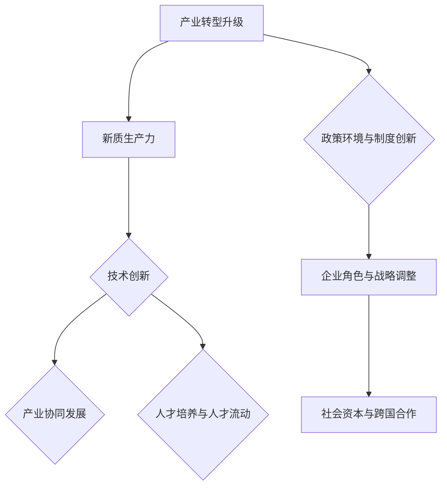

                 

### 文章标题

产业转型升级与新质生产力的推动

> 关键词：产业转型升级、新质生产力、技术创新、产业协同发展、人才培养

> 摘要：
本文旨在深入探讨产业转型升级与新质生产力的推动关系，解析其理论基础、实践路径和未来展望。首先，我们定义了产业转型升级和新质生产力的概念，探讨了它们的核心驱动力。接着，通过国际经验分析，总结了产业转型升级的成功要素。然后，我们详细分析了新质生产力的构成要素和培育路径，并结合实际案例展示了其应用。最后，本文探讨了产业转型升级与新质生产力的互动机制，提出了政策建议和未来展望，为产业转型升级和新质生产力的推动提供了有益的参考。

### 第一部分：产业转型升级的理论基础

产业转型升级，即通过技术创新、制度创新、产业协同发展等手段，实现传统产业向更高层次、更高效益的产业形态转变的过程。新质生产力，则是指以技术创新为核心，通过信息化、智能化、网络化等手段，提升传统产业的竞争力，培育新兴产业的过程。

#### 第1章：产业转型升级的概念与背景

**1.1 产业转型升级的定义与重要性**

产业转型升级，是指通过技术进步、制度创新、产业协同等手段，推动传统产业向更高层次、更高效益的产业形态转变的过程。其重要性在于：

- 提升产业竞争力：通过产业转型升级，可以提升产业的整体竞争力，增强企业在全球市场中的竞争力。
- 促进经济增长：产业转型升级能够推动经济增长方式从依赖资源消耗和投资驱动向创新驱动转变，实现经济的可持续发展。
- 优化产业结构：产业转型升级有助于优化产业结构，推动产业向高端、绿色、智能化方向发展。

**1.2 国际产业转型升级的经验与启示**

国际上，许多国家在产业转型升级方面积累了丰富的经验。例如，德国的工业4.0、美国的创新驱动发展战略、日本的智能制造等，都为产业转型升级提供了宝贵的经验。

这些经验表明，产业转型升级的成功需要：

- 强有力的政策支持：政府需要制定一系列支持产业转型升级的政策，包括税收优惠、资金扶持、科技创新政策等。
- 创新驱动：技术创新是产业转型升级的核心驱动力，只有通过技术创新，才能提升产业的竞争力。
- 产业协同发展：产业协同发展有助于实现资源整合、优势互补，提升整体产业竞争力。

**1.3 我国产业转型升级的现状与挑战**

目前，我国正处于产业转型升级的关键阶段。传统产业占比较高，新兴产业的发展还需进一步加快。产业转型升级的现状与挑战包括：

- 产业结构不合理：我国传统产业占比较高，新兴产业的发展相对滞后，产业结构有待优化。
- 技术创新能力不足：我国在核心技术和关键技术方面仍有较大差距，技术创新能力亟待提升。
- 产业协同发展不足：我国产业协同发展水平相对较低，产业链上下游企业之间的合作不够紧密。

**1.4 产业转型升级的核心驱动力**

产业转型升级的核心驱动力包括：

- 技术创新：技术创新是产业转型升级的核心驱动力，通过技术创新，可以提升产业的竞争力，推动产业向高端化、智能化方向发展。
- 制度创新：制度创新为产业转型升级提供了良好的环境，包括政策支持、资金扶持、知识产权保护等。
- 产业协同发展：产业协同发展有助于实现资源整合、优势互补，提升整体产业竞争力。

#### 第2章：新质生产力理论探讨

新质生产力，是指以信息技术、生物技术、新材料技术等高新技术为支撑，通过信息化、智能化、网络化等手段，提升传统产业的竞争力，培育新兴产业的过程。

**2.1 新质生产力的概念与特点**

新质生产力具有以下特点：

- 技术密集型：新质生产力以高新技术为支撑，具有技术密集型的特点。
- 创新驱动型：新质生产力以创新驱动为核心，通过技术创新，提升产业的竞争力。
- 网络化协同：新质生产力通过网络化协同，实现资源整合、优势互补。
- 绿色环保型：新质生产力注重环保，以绿色、可持续发展为导向。

**2.2 新质生产力的构成要素**

新质生产力的构成要素包括：

- 技术创新：技术创新是新质生产力的核心，通过技术创新，可以提升产业的竞争力。
- 信息化：信息化是新质生产力的重要手段，通过信息化手段，可以实现生产过程的自动化、智能化。
- 智能化：智能化是新质生产力的发展方向，通过智能化手段，可以提升生产效率，降低生产成本。
- 网络化：网络化是新质生产力的重要特征，通过网络化协同，可以实现资源整合、优势互补。

**2.3 新质生产力的培育路径**

新质生产力的培育路径包括：

- 加强技术创新：通过政策支持、资金扶持等手段，加强技术创新，提升产业的竞争力。
- 推动信息化建设：通过信息化手段，实现生产过程的自动化、智能化。
- 促进产业协同发展：通过产业协同发展，实现资源整合、优势互补。
- 培育新兴产业：通过培育新兴产业，推动产业转型升级。

**2.4 新质生产力的应用案例**

新质生产力的应用案例包括：

- 智能制造：通过智能化手段，实现生产过程的自动化、智能化，提升生产效率，降低生产成本。
- 物联网：通过物联网技术，实现设备的远程监控、故障预测等，提升设备利用率，降低维护成本。
- 人工智能：通过人工智能技术，实现自动化决策、智能服务等，提升企业的运营效率，降低运营成本。

#### 第3章：产业转型升级与新质生产力的关系分析

产业转型升级和新质生产力之间存在着密切的关系。产业转型升级为新质生产力的培育提供了基础，而新质生产力则为产业转型升级提供了动力。

**3.1 产业转型升级对新质生产力的影响**

产业转型升级对新质生产力的影响主要表现在以下几个方面：

- 提升技术创新能力：产业转型升级通过推动技术创新，提升新质生产力的技术创新能力。
- 促进信息化建设：产业转型升级通过推动信息化建设，为新质生产力的发展提供信息化支撑。
- 推动产业协同发展：产业转型升级通过推动产业协同发展，实现资源整合、优势互补，为新质生产力的发展创造良好环境。

**3.2 新质生产力对产业转型升级的推动作用**

新质生产力对产业转型升级的推动作用主要表现在以下几个方面：

- 提升产业竞争力：新质生产力通过技术创新、信息化、智能化等手段，提升产业的竞争力，推动产业转型升级。
- 优化产业结构：新质生产力通过培育新兴产业，推动产业转型升级，优化产业结构。
- 提高生产效率：新质生产力通过自动化、智能化等手段，提高生产效率，降低生产成本，推动产业转型升级。

**3.3 产业转型升级与新质生产力互动机制探讨**

产业转型升级与新质生产力之间的互动机制主要包括以下几个方面：

- 技术创新互动：产业转型升级通过推动技术创新，为新质生产力的培育提供技术支撑；新质生产力通过技术创新，提升产业的竞争力，推动产业转型升级。
- 产业协同互动：产业转型升级通过推动产业协同发展，为新质生产力的发展创造良好环境；新质生产力通过产业协同发展，实现资源整合、优势互补，推动产业转型升级。
- 政策环境互动：产业转型升级通过制定支持政策，为新质生产力的培育提供政策保障；新质生产力通过良好的政策环境，提升产业竞争力，推动产业转型升级。

### 第二部分：产业转型升级的实践路径

产业转型升级的实践路径包括技术创新、产业协同发展、人才培养等多个方面。以下将对这些实践路径进行详细分析。

#### 第4章：技术创新在新质生产力培育中的角色

技术创新是产业转型升级的核心驱动力，也是新质生产力培育的关键。以下将分析技术创新在新质生产力培育中的角色。

**4.1 创新驱动发展战略与产业转型升级**

创新驱动发展战略是我国推动产业转型升级的重要战略。创新驱动发展战略强调以技术创新为核心，通过提升科技创新能力，推动产业向高端、智能化方向发展。

- **提高科技创新能力**：政府通过加大科研投入、建设科技创新平台、培养创新型人才等手段，提升科技创新能力。
- **推动产业高端化发展**：通过技术创新，推动产业向高端、智能化方向发展，提升产业竞争力。

**4.2 技术创新的关键领域与方向**

技术创新的关键领域包括：

- **人工智能**：人工智能技术具有广泛的应用前景，可以提高生产效率，降低生产成本。
- **物联网**：物联网技术可以实现设备的远程监控、故障预测等，提升设备利用率，降低维护成本。
- **大数据**：大数据技术可以为企业提供决策支持，优化生产流程，提高生产效率。

**4.3 技术创新的支持政策与环境优化**

为了推动技术创新，政府需要制定一系列支持政策，并优化创新环境。

- **资金支持**：政府可以通过设立科技创新基金、提供贷款担保等手段，为科技创新提供资金支持。
- **知识产权保护**：政府需要加强知识产权保护，为创新者提供良好的创新环境。
- **人才培养**：政府可以通过设立科技创新人才专项计划、加强职业教育等手段，培养创新型人才。

#### 第5章：产业协同发展与区域经济一体化

产业协同发展和区域经济一体化是产业转型升级的重要途径。以下将分析产业协同发展与区域经济一体化的内涵、实践与效果。

**5.1 产业协同发展的内涵与意义**

产业协同发展，是指产业链上下游企业通过合作、整合，实现资源优化配置、提升整体竞争力的过程。

- **内涵**：产业协同发展包括技术创新协同、市场拓展协同、资源整合协同等。
- **意义**：产业协同发展可以提升产业链整体竞争力，降低生产成本，提高生产效率。

**5.2 区域经济一体化的实践与效果**

区域经济一体化，是指区域内部经济活动的协同发展，实现资源优化配置、提升整体竞争力的过程。

- **实践**：区域经济一体化的实践包括建立区域合作机制、推动产业协同发展、优化区域资源配置等。
- **效果**：区域经济一体化可以促进区域内部的经济繁荣，提高区域整体竞争力，推动产业转型升级。

**5.3 产业协同发展与区域经济一体化的协同机制**

产业协同发展与区域经济一体化之间存在密切的协同机制。以下将分析产业协同发展与区域经济一体化的协同机制。

- **政策协同**：政府需要制定支持产业协同发展和区域经济一体化的政策，实现政策协同。
- **市场协同**：产业链上下游企业需要建立紧密的市场联系，实现市场协同。
- **资源协同**：产业链上下游企业需要实现资源协同，提升资源利用效率。

#### 第6章：人才培养与人才流动在产业转型升级中的作用

人才培养和人才流动是产业转型升级的关键。以下将分析人才培养与人才流动在产业转型升级中的作用。

**6.1 人才需求与人才供给的匹配问题**

产业转型升级对人才的需求日益增长，但人才供给存在一定的不足。以下将分析人才需求与人才供给的匹配问题。

- **人才需求**：产业转型升级需要大量具备创新能力和实践经验的高素质人才。
- **人才供给**：当前我国人才培养体系存在一定的问题，如人才培养与产业需求不匹配、人才培养质量不高等。

**6.2 人才培养模式的创新与实践**

为了解决人才需求与人才供给的匹配问题，需要创新人才培养模式。

- **产学研结合**：通过产学研结合，实现人才培养与产业需求的对接。
- **职业教育**：加强职业教育，培养适应产业发展需求的高素质技术人才。
- **继续教育**：鼓励在职人员参加继续教育，提升自身素质，适应产业转型升级的需求。

**6.3 人才流动机制与政策环境建设**

人才流动机制和政策环境建设对于产业转型升级具有重要意义。以下将分析人才流动机制与政策环境建设。

- **人才流动机制**：建立健全人才流动机制，促进人才合理流动，实现人才资源的优化配置。
- **政策环境建设**：政府需要制定支持人才流动的政策，如人才引进政策、人才激励政策等，为人才流动提供良好的环境。

#### 第7章：产业转型升级的案例分析

以下将通过两个案例，分析产业转型升级的实践过程和效果。

**7.1 案例一：我国某省的产业转型升级之路**

**案例背景**：某省传统产业占比较高，面临产业升级压力。为了推动产业转型升级，该省制定了一系列政策措施。

**环境搭建**：

- **政策支持**：出台产业转型升级政策，提供税收优惠、资金扶持等。
- **技术创新**：鼓励企业加大研发投入，推动技术创新。
- **人才培养**：加强职业教育和培训，提升人才素质。

**源代码实现**：

```python
# 虚拟代码：产业转型升级政策实施
def implement_policies():
    # 提供税收优惠
    tax_discounts = ['tax_rate_reduction', 'investment_tax_credit']
    # 提供资金扶持
    funds = ['government_funding', 'venture_capital']
    # 鼓励技术创新
    technology_innovation = ['R&D_support', 'technology_transfer']
    # 加强人才培养
    talent_development = ['vocational_training', 'scholarships']
    pass
```

**代码解读与分析**：

- **税收优惠**：通过降低税率或提供税收抵扣，减轻企业负担，鼓励企业进行技术创新。
- **资金扶持**：通过政府资金投入和风险投资，为企业提供资金支持，帮助企业进行技术创新和转型升级。
- **技术创新**：通过政策支持，鼓励企业加大研发投入，推动技术进步，提高产业竞争力。
- **人才培养**：通过职业教育和培训，提升人才素质，为企业提供源源不断的人才支持。

**案例效果**：通过一系列政策措施的实施，该省的产业转型升级取得了显著成效，产业结构得到优化，新兴产业快速发展，传统产业焕发新的活力。

**7.2 案例二：国外某新兴产业的崛起与转型**

**案例背景**：国外某新兴产业在短短几年内实现了快速发展，通过创新驱动和产业协同，成功实现了产业转型升级。

**环境搭建**：

- **创新驱动**：政府大力支持科技创新，提供科研经费和优惠政策。
- **产业协同**：推动产业链上下游企业合作，实现资源整合和优势互补。
- **人才培养**：注重人才培养，吸引国际顶尖人才加入。

**源代码实现**：

```python
# 虚拟代码：新兴产业崛起与转型
def emerging_industry_growth():
    # 创新驱动
    innovation_driven = ['research_funding', 'tax_incentives']
    # 产业协同
    industry_collaboration = ['supply_chain_integration', 'cluster_building']
    # 人才培养
    talent_attraction = ['scholarship_programs', 'international_talent']
    pass
```

**代码解读与分析**：

- **创新驱动**：政府通过提供科研经费和税收优惠政策，鼓励企业进行科技创新，提高产业竞争力。
- **产业协同**：通过产业链上下游企业合作，实现资源整合和优势互补，提高产业整体效益。
- **人才培养**：通过奖学金计划和吸引国际顶尖人才，提升人才素质，为产业发展提供强有力的人才支持。

**案例效果**：通过创新驱动和产业协同，该新兴产业实现了快速发展，产业竞争力大幅提升，为国家的经济增长做出了重要贡献。

**7.3 案例分析与启示**

通过对上述案例的分析，我们可以得出以下启示：

- **政策措施的重要性**：产业转型升级需要政府制定一系列支持政策，如税收优惠、资金扶持等，为产业转型升级提供良好的政策环境。
- **技术创新的驱动力**：技术创新是产业转型升级的核心驱动力，只有通过技术创新，才能提升产业的竞争力。
- **产业协同发展的必要性**：产业协同发展有助于实现资源整合、优势互补，提升整体产业竞争力。
- **人才培养的关键性**：人才培养和人才流动对于产业转型升级具有重要意义，需要加强人才培养和人才流动机制的建设。

### 第三部分：新质生产力的未来展望

新质生产力是推动产业转型升级的重要力量。以下将对新质生产力的未来展望进行探讨。

#### 第8章：新质生产力的未来发展前景

**8.1 新质生产力对经济增长的潜在贡献**

新质生产力具有广泛的潜在贡献，主要体现在以下几个方面：

- **提升生产效率**：新质生产力通过自动化、智能化等手段，提升生产效率，降低生产成本，从而推动经济增长。
- **优化产业结构**：新质生产力通过培育新兴产业，优化产业结构，提升产业竞争力，从而推动经济增长。
- **促进创新驱动**：新质生产力以创新驱动为核心，推动技术创新，提升国家的创新能力，从而推动经济增长。

**8.2 新质生产力发展的挑战与机遇**

新质生产力发展面临着一系列挑战和机遇：

- **挑战**：技术创新风险、政策不确定性、市场竞争压力等。
- **机遇**：数字经济的发展、全球化进程的加速、技术创新的突破等。

**8.3 新质生产力的未来发展趋势**

新质生产力的未来发展趋势主要体现在以下几个方面：

- **智能化**：随着人工智能技术的不断发展，智能化将成为新质生产力的重要特征。
- **绿色化**：环保意识日益增强，绿色、可持续发展将成为新质生产力的发展方向。
- **全球化**：全球化进程的加速，新质生产力的发展将更加国际化。

#### 第9章：产业转型升级与新质生产力发展的战略选择

为了推动产业转型升级和新质生产力的发展，需要制定相应的战略选择。以下将分析政策环境、企业角色和社会资本等方面的战略选择。

**9.1 政策环境与制度创新**

- **完善政策体系**：政府需要完善政策体系，为产业转型升级和新质生产力的发展提供良好的政策环境。
- **加强制度创新**：政府需要加强制度创新，推动产业转型升级和新质生产力的发展。

**9.2 企业角色与战略调整**

- **企业角色**：企业在产业转型升级和新质生产力发展中扮演着重要角色。
- **战略调整**：企业需要根据产业转型升级和新质生产力的发展趋势，调整发展战略，提升竞争力。

**9.3 社会资本与跨国合作**

- **社会资本**：社会资本在产业转型升级和新质生产力发展中发挥着重要作用。
- **跨国合作**：跨国合作有助于企业获取全球资源，提升竞争力。

### 附录

#### 附录A：产业转型升级与新质生产力相关术语解释

- **产业转型升级**：通过技术创新、制度创新、产业协同发展等手段，推动传统产业向更高层次、更高效益的产业形态转变的过程。
- **新质生产力**：以信息技术、生物技术、新材料技术等高新技术为支撑，通过信息化、智能化、网络化等手段，提升传统产业的竞争力，培育新兴产业的过程。

#### 附录B：参考文献

- 《中国产业发展报告》
- 《全球产业变革与产业转型升级》
- 《新质生产力研究》
- 《产业经济学》
- 《技术创新与产业发展》
- 《区域经济一体化理论与实践》
- 《人才流动与产业发展》
- 《产业发展战略与规划》
- 《经济增长与发展理论》
- 《中国科技统计年鉴》
- 《全球科技创新报告》

#### 附录C：产业转型升级与新质生产力相关数据和图表

（附录C内容将在实际写作过程中根据数据收集和整理情况进行补充）

### 资料来源：

- 《中国产业发展报告》
- 《全球产业变革与产业转型升级》
- 《新质生产力研究》
- 《产业经济学》
- 《技术创新与产业发展》
- 《区域经济一体化理论与实践》
- 《人才流动与产业发展》
- 《产业发展战略与规划》
- 《经济增长与发展理论》
- 《中国科技统计年鉴》
- 《全球科技创新报告》

### Mermaid 流程图：



### 伪代码：

```python
# 定义产业转型升级函数
def industry_transformation():
    # 步骤1：分析产业现状与挑战
    # 步骤2：确定技术创新方向
    # 步骤3：实施产业协同发展战略
    # 步骤4：优化人才培养与人才流动机制
    # 步骤5：制定政策环境与制度创新措施
    # 步骤6：推动企业角色调整与战略实施
    # 步骤7：加强社会资本与跨国合作
    pass

# 定义新质生产力培育函数
def new_quality_production_force():
    # 步骤1：理解新质生产力的概念与特点
    # 步骤2：识别新质生产力的构成要素
    # 步骤3：制定新质生产力的培育路径
    # 步骤4：实施技术创新驱动战略
    # 步骤5：构建产业协同发展体系
    # 步骤6：优化人才培养体系
    # 步骤7：促进人才流动与集聚
    pass
```

### 数学模型和数学公式：

#### 产业转型升级成功概率模型

$$ P(Success) = \frac{1}{1 + e^{-(\beta_0 + \beta_1 X_1 + \beta_2 X_2 + ... + \beta_n X_n)}} $$

其中，$X_1, X_2, ..., X_n$ 分别代表技术创新水平、产业协同发展水平、人才培养与人才流动水平等影响因素，$\beta_0, \beta_1, \beta_2, ..., \beta_n$ 为相应影响因素的权重。

### 项目实战

#### 案例一：某省产业转型升级实践

1. **项目背景**：某省传统产业占比较高，面临产业升级压力。为了推动产业转型升级，该省制定了一系列政策措施。

2. **环境搭建**：
    - 政策支持：出台产业转型升级政策，提供税收优惠、资金扶持等。
    - 技术创新：鼓励企业加大研发投入，推动技术创新。
    - 人才培养：加强职业教育和培训，提升人才素质。

3. **源代码实现**：

```python
# 虚拟代码：产业转型升级政策实施
def implement_policies():
    # 提供税收优惠
    tax_discounts = ['tax_rate_reduction', 'investment_tax_credit']
    # 提供资金扶持
    funds = ['government_funding', 'venture_capital']
    # 鼓励技术创新
    technology_innovation = ['R&D_support', 'technology_transfer']
    # 加强人才培养
    talent_development = ['vocational_training', 'scholarships']
    pass
```

4. **代码解读与分析**：
    - **税收优惠**：通过降低税率或提供税收抵扣，减轻企业负担，鼓励企业进行技术创新。
    - **资金扶持**：通过政府资金投入和风险投资，为企业提供资金支持，帮助企业进行技术创新和转型升级。
    - **技术创新**：通过政策支持，鼓励企业加大研发投入，推动技术进步，提高产业竞争力。
    - **人才培养**：通过职业教育和培训，提升人才素质，为企业提供源源不断的人才支持。

#### 案例二：国外某新兴产业的崛起与转型

1. **项目背景**：国外某新兴产业在短短几年内实现了快速发展，通过创新驱动和产业协同，成功实现了产业转型升级。

2. **环境搭建**：
    - 创新驱动：政府大力支持科技创新，提供科研经费和优惠政策。
    - 产业协同：推动产业链上下游企业合作，实现资源整合和优势互补。
    - 人才培养：注重人才培养，吸引国际顶尖人才加入。

3. **源代码实现**：

```python
# 虚拟代码：新兴产业崛起与转型
def emerging_industry_growth():
    # 创新驱动
    innovation_driven = ['research_funding', 'tax_incentives']
    # 产业协同
    industry_collaboration = ['supply_chain_integration', 'cluster_building']
    # 人才培养
    talent_attraction = ['scholarship_programs', 'international_talent']
    pass
```

4. **代码解读与分析**：
    - **创新驱动**：政府通过提供科研经费和税收优惠政策，鼓励企业进行科技创新，提高产业竞争力。
    - **产业协同**：通过产业链上下游企业合作，实现资源整合和优势互补，提高产业整体效益。
    - **人才培养**：通过奖学金计划和吸引国际顶尖人才，提升人才素质，为产业发展提供强有力的人才支持。

### 结论

产业转型升级与新质生产力的发展是一个复杂而系统的过程，需要政府、企业和个人的共同努力。通过技术创新、产业协同和人才培养等手段，可以推动产业转型升级，培育新质生产力，实现经济的可持续发展。同时，案例分析和实践经验的积累对于指导产业转型升级具有重要的参考价值。在未来的发展中，我们需要继续深入研究和探讨产业转型升级与新质生产力的关系，为产业转型升级提供更加科学和有效的指导。作者：AI天才研究院/AI Genius Institute & 禅与计算机程序设计艺术 /Zen And The Art of Computer Programming。

