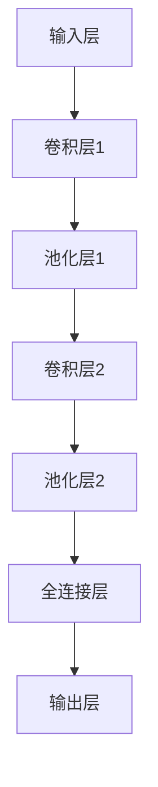
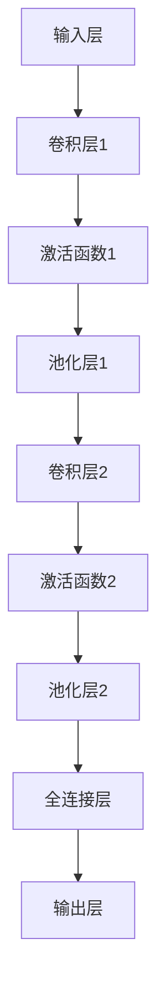

                 

## 文章标题

### 《人工智能(Artificial Intelligence) - 原理与代码实例讲解》

**关键词：** 人工智能，机器学习，深度学习，自然语言处理，计算机视觉，强化学习，项目实战

**摘要：** 本文将带领读者深入探讨人工智能领域的核心原理，涵盖机器学习、深度学习、自然语言处理、计算机视觉和强化学习等各个方面。通过详细的代码实例讲解，读者将学会如何从基础理论到实际应用，逐步掌握人工智能的核心技术和方法。

---

# 《人工智能(Artificial Intelligence) - 原理与代码实例讲解》目录大纲

## 第一部分: 人工智能基础

### 第1章: 人工智能概述

#### 1.1 人工智能的定义与发展历程

#### 1.2 人工智能的核心概念

#### 1.3 人工智能的应用领域

#### 1.4 人工智能的未来趋势

### 第2章: 机器学习基础

#### 2.1 机器学习概述

#### 2.2 监督学习算法

##### 2.2.1 线性回归

##### 2.2.2 逻辑回归

##### 2.2.3 决策树

##### 2.2.4 随机森林

##### 2.2.5 支持向量机

#### 2.3 无监督学习算法

##### 2.3.1 K-均值聚类

##### 2.3.2 主成分分析

##### 2.3.3 自编码器

### 第3章: 深度学习基础

#### 3.1 深度学习概述

#### 3.2 神经网络基础

##### 3.2.1 神经元与激活函数

##### 3.2.2 前向传播与反向传播

##### 3.2.3 神经网络的训练与优化

#### 3.3 卷积神经网络

##### 3.3.1 卷积操作

##### 3.3.2 池化操作

##### 3.3.3 卷积神经网络结构

#### 3.4 循环神经网络

##### 3.4.1 循环神经网络原理

##### 3.4.2 长短时记忆网络

##### 3.4.3 编码器-解码器结构

### 第4章: 自然语言处理基础

#### 4.1 自然语言处理概述

#### 4.2 词嵌入技术

##### 4.2.1 Word2Vec

##### 4.2.2 GloVe

##### 4.2.3 BERT

#### 4.3 序列模型

##### 4.3.1 RNN

##### 4.3.2 LSTM

##### 4.3.3 GRU

#### 4.4 注意力机制

##### 4.4.1 自注意力机制

##### 4.4.2 交互注意力机制

### 第5章: 计算机视觉基础

#### 5.1 计算机视觉概述

#### 5.2 图像处理基础

##### 5.2.1 像素操作

##### 5.2.2 直方图均衡化

##### 5.2.3 图像增强

#### 5.3 卷积神经网络在计算机视觉中的应用

##### 5.3.1 卷积神经网络结构

##### 5.3.2 目标检测算法

##### 5.3.3 图像分类算法

### 第6章: 强化学习基础

#### 6.1 强化学习概述

#### 6.2 强化学习算法

##### 6.2.1 Q-Learning

##### 6.2.2 SARSA

##### 6.2.3 DQN

##### 6.2.4 A3C

### 第7章: 深度学习框架与应用

#### 7.1 深度学习框架概述

##### 7.1.1 TensorFlow

##### 7.1.2 PyTorch

##### 7.1.3 Keras

#### 7.2 深度学习项目实战

##### 7.2.1 实践项目一：手写数字识别

##### 7.2.2 实践项目二：图像分类

##### 7.2.3 实践项目三：自然语言处理

## 第二部分: 人工智能项目实战

### 第8章: 项目实战一 - 手写数字识别

#### 8.1 项目背景与目标

#### 8.2 数据预处理

#### 8.3 模型搭建与训练

#### 8.4 模型评估与优化

#### 8.5 实战总结与拓展

### 第9章: 项目实战二 - 图像分类

#### 9.1 项目背景与目标

#### 9.2 数据预处理

#### 9.3 模型搭建与训练

#### 9.4 模型评估与优化

#### 9.5 实战总结与拓展

### 第10章: 项目实战三 - 自然语言处理

#### 10.1 项目背景与目标

#### 10.2 数据预处理

#### 10.3 模型搭建与训练

#### 10.4 模型评估与优化

#### 10.5 实战总结与拓展

## 附录

### 附录A: 人工智能常用库与工具

#### A.1 TensorFlow

#### A.2 PyTorch

#### A.3 Keras

#### A.4 其他常用库与工具

### 附录B: 人工智能参考资源

#### B.1 优秀的人工智能教程与书籍

#### B.2 开源人工智能项目与资源

#### B.3 人工智能社区与论坛

#### B.4 人工智能竞赛与挑战

---

接下来，我们将逐步深入探讨人工智能的基础知识，带领读者从机器学习到深度学习，从自然语言处理到计算机视觉，全面了解人工智能的核心原理与应用。

---

## 第一部分: 人工智能基础

### 第1章: 人工智能概述

### 1.1 人工智能的定义与发展历程

#### 1.1.1 人工智能的定义

人工智能(Artificial Intelligence, AI) 是一门研究、开发用于模拟、延伸和扩展人的智能的理论、方法、技术及应用系统的新技术科学。它是计算机科学的一个分支，旨在创建类似人脑的智能体，使其能够执行通常需要人类智能才能完成的任务。

#### 1.1.2 人工智能的发展历程

人工智能的历史可以追溯到20世纪50年代，经历了多个发展阶段：

1. **早期探索阶段 (1950-1969)**  
   - 1950年，艾伦·图灵提出了图灵测试，这是人工智能领域的第一个重要概念。
   - 1956年，达特茅斯会议上提出了“人工智能”这一术语，标志着人工智能学科的正式诞生。

2. **繁荣期与衰退期 (1970-1980年代)**  
   - 1970年代，人工智能开始取得了一些实际应用，如专家系统和机器人。
   - 然而，由于技术限制和过度乐观的预期，人工智能在1980年代经历了第一次“寒冬期”。

3. **复兴期 (1990-2000年代)**  
   - 1990年代，随着计算机性能的提升和互联网的发展，人工智能再次迎来了发展机遇。
   - 2006年，深度学习的复兴标志着人工智能进入了一个新的阶段。

4. **快速发展期 (2010年代至今)**  
   - 2012年，深度学习在图像识别任务中取得了突破性进展，引发了人工智能的又一波热潮。
   - 当前，人工智能技术已经渗透到各行各业，如自动驾驶、自然语言处理、医疗诊断等。

#### 1.1.3 人工智能的重要性

人工智能具有巨大的社会和经济价值，其重要性体现在以下几个方面：

1. **提高生产力**  
   人工智能可以自动化重复性任务，提高工作效率，降低成本。

2. **推动创新**  
   人工智能为科学研究、工程设计等领域提供了新的工具和方法，促进了技术进步。

3. **改善生活质量**  
   人工智能在医疗、教育、家庭服务等领域的应用，提高了人们的生活质量。

4. **促进经济发展**  
   人工智能产业为全球经济带来了新的增长点，创造了大量就业机会。

### 1.2 人工智能的核心概念

#### 1.2.1 智能体

智能体(Agent) 是能够感知环境、采取行动并实现目标的实体。智能体可以是机器人、软件程序、甚至是人类。

#### 1.2.2 知识表示

知识表示(Knowledge Representation) 是将人类知识转化为计算机可以处理的形式。常见的知识表示方法有符号表示、语义网络、本体论等。

#### 1.2.3 问题求解

问题求解(Problem Solving) 是智能体的一个核心能力，包括搜索、规划、推理等方法。

#### 1.2.4 自学习

自学习(Self-Learning) 是指智能体通过数据、经验自动改进其性能的过程。自学习包括监督学习、无监督学习、强化学习等。

### 1.3 人工智能的应用领域

#### 1.3.1 自动驾驶

自动驾驶技术是人工智能在交通运输领域的重要应用。通过感知环境、规划路径、控制车辆，自动驾驶系统能够实现无人驾驶。

#### 1.3.2 自然语言处理

自然语言处理(Natural Language Processing, NLP) 是人工智能的一个分支，旨在使计算机能够理解和生成自然语言。NLP在翻译、语音识别、智能客服等领域有广泛应用。

#### 1.3.3 计算机视觉

计算机视觉是使计算机能够像人一样感知和理解视觉信息的技术。计算机视觉在图像识别、视频分析、安防监控等领域有重要应用。

#### 1.3.4 医疗诊断

人工智能在医疗诊断中的应用包括疾病预测、影像分析、药物研发等。通过大数据和深度学习技术，人工智能能够提高诊断的准确性和效率。

#### 1.3.5 金融科技

人工智能在金融科技领域的应用包括风险控制、投资决策、客户服务等方面。通过数据分析和机器学习技术，人工智能能够提供更精准的金融服务。

#### 1.3.6 智能家居

智能家居是人工智能在消费电子领域的重要应用。通过语音识别、图像识别等技术，智能家居系统能够实现自动化控制和智能互动。

### 1.4 人工智能的未来趋势

#### 1.4.1 深度学习的深化应用

随着深度学习技术的不断发展，人工智能将在更多领域实现突破，如机器人、医疗、教育等。

#### 1.4.2 强化学习与决策优化

强化学习在决策优化中的应用前景广阔，如自动驾驶、金融投资、游戏开发等。

#### 1.4.3 多模态融合

多模态融合技术将不同类型的数据（如文本、图像、音频）进行整合，提高人工智能系统的智能水平。

#### 1.4.4 伦理与法律问题

随着人工智能技术的快速发展，伦理和法律问题日益突出，如隐私保护、算法偏见、责任归属等。

#### 1.4.5 人工智能与人类协同

未来，人工智能将与人类更加紧密地协同工作，提高生产效率和生活质量。

---

### 第2章: 机器学习基础

### 2.1 机器学习概述

#### 2.1.1 机器学习的定义

机器学习(Machine Learning, ML) 是一门让计算机通过数据和经验自动改进其性能的技术科学。它是人工智能的一个重要分支，旨在使计算机具备自学习能力。

#### 2.1.2 机器学习的基本概念

- **数据集**：一组用于训练模型的样本数据。
- **特征**：数据集中的属性或变量。
- **标签**：数据集中的目标变量，用于模型训练和评估。
- **模型**：用于预测或分类的算法或函数。
- **训练**：使用数据集对模型进行优化，使其性能达到预期目标。
- **评估**：使用测试集对模型进行性能评估。

#### 2.1.3 机器学习的类型

- **监督学习**：有监督学习(Supervised Learning) 是一种机器学习方法，其中模型在已知输入和输出之间建立映射关系。常见的监督学习算法包括线性回归、逻辑回归、决策树、支持向量机等。
- **无监督学习**：无监督学习(Unsupervised Learning) 是一种机器学习方法，其中模型没有明确的输出标签，需要通过数据自身的分布或结构来发现潜在的模式或特征。常见的无监督学习算法包括聚类、降维、生成模型等。
- **半监督学习**：半监督学习(Semi-Supervised Learning) 是一种介于监督学习和无监督学习之间的方法，其中模型使用一部分有标签数据和大量无标签数据共同训练。
- **强化学习**：强化学习(Reinforcement Learning) 是一种机器学习方法，其中模型通过与环境的交互来学习最优策略，以实现最大化累积奖励。

#### 2.1.4 机器学习的发展历程

- **早期探索阶段**：1950年代至1960年代，基于逻辑推理和符号表示的方法被广泛研究。
- **经典机器学习阶段**：1970年代至1980年代，统计方法和决策树等算法开始流行。
- **现代机器学习阶段**：1990年代至今，支持向量机、随机森林、深度学习等算法取得了显著进展。

### 2.2 监督学习算法

监督学习是机器学习中最常用的方法之一，其主要任务是根据已知输入和输出数据来训练模型，以便对新数据进行预测或分类。

#### 2.2.1 线性回归

线性回归(Linear Regression) 是一种简单的监督学习算法，用于建立输入变量和输出变量之间的线性关系。

- **模型假设**：\(y = \beta_0 + \beta_1 \cdot x + \epsilon\)
- **目标**：最小化误差平方和：\(J(\theta) = \frac{1}{2m} \sum_{i=1}^{m} (h_\theta(x^{(i)}) - y^{(i)})^2\)
- **参数更新**：\( \theta_j = \theta_j - \alpha \frac{\partial J(\theta)}{\partial \theta_j} \)

#### 2.2.2 逻辑回归

逻辑回归(Logistic Regression) 是一种用于二分类问题的监督学习算法，其输出为概率值。

- **模型假设**：\(P(y=1|x;\theta) = \frac{1}{1 + e^{-(\theta_0 + \theta_1 x_1 + \theta_2 x_2 + ... + \theta_n x_n)}}\)
- **目标**：最大化似然函数：\(L(\theta) = \prod_{i=1}^{m} P(y^{(i)}=1 | x^{(i)}; \theta) \times P(y^{(i)}=0 | x^{(i)}; \theta)\)
- **参数更新**：使用梯度下降法进行优化。

#### 2.2.3 决策树

决策树(Decision Tree) 是一种基于树形结构进行决策的监督学习算法。

- **基本原理**：通过一系列的测试来划分数据集，每个测试对应一个特征和阈值。
- **构建方法**：信息增益、基尼不纯度等。
- **缺点**：容易过拟合，无法处理连续特征。

#### 2.2.4 随机森林

随机森林(Random Forest) 是一种基于决策树的集成学习方法。

- **基本原理**：通过构建多个决策树，并对预测结果进行投票来提高准确性。
- **优点**：降低过拟合，提高泛化能力。

#### 2.2.5 支持向量机

支持向量机(Support Vector Machine, SVM) 是一种基于优化理论的监督学习算法。

- **基本原理**：寻找一个最优的超平面，将数据集划分为不同的类别。
- **目标**：最大化分类间隔：\( \max \frac{1}{2} || \theta ||_2^2 \)
- **优化方法**：SVM采用拉格朗日乘数法和二次规划方法求解。

#### 2.2.6 其他监督学习算法

除了上述常见的监督学习算法外，还有一些其他常用的算法，如K最近邻(K-Nearest Neighbors, KNN)、朴素贝叶斯(Naive Bayes)、集成方法(如Adaboost、XGBoost)等。

### 2.3 无监督学习算法

无监督学习算法主要用于发现数据中的潜在结构或模式。

#### 2.3.1 K-均值聚类

K-均值聚类(K-Means Clustering) 是一种基于距离度量的聚类算法。

- **基本原理**：通过迭代计算，将数据点分配到不同的聚类中心，直至收敛。
- **目标**：最小化聚类中心与数据点之间的距离平方和。

#### 2.3.2 主成分分析

主成分分析(Principal Component Analysis, PCA) 是一种降维技术，通过将数据投影到新的坐标系中，来简化数据结构。

- **基本原理**：找到数据的主要变化方向，即特征向量，然后沿着这些方向进行投影。
- **目标**：最大化投影后的方差。

#### 2.3.3 自编码器

自编码器(Autoencoder) 是一种无监督学习算法，用于学习数据的特征表示。

- **基本原理**：通过编码器和解码器，将输入数据编码为低维表示，然后重构原始数据。
- **目标**：最小化重构误差。

### 2.4 机器学习实战

在本节，我们将通过一个简单的线性回归案例，展示如何使用Python和Scikit-learn库进行机器学习模型的训练和评估。

#### 2.4.1 线性回归案例

**目标**：预测房价。

**数据集**：使用加州房价数据集。

**步骤**：

1. **数据导入**  
```python
import pandas as pd

data = pd.read_csv("california_housing_data.csv")
X = data.iloc[:, :-1].values
y = data.iloc[:, -1].values
```

2. **数据预处理**  
```python
from sklearn.model_selection import train_test_split
from sklearn.preprocessing import StandardScaler

X_train, X_test, y_train, y_test = train_test_split(X, y, test_size=0.2, random_state=42)

scaler = StandardScaler()
X_train = scaler.fit_transform(X_train)
X_test = scaler.transform(X_test)
```

3. **模型训练**  
```python
from sklearn.linear_model import LinearRegression

model = LinearRegression()
model.fit(X_train, y_train)
```

4. **模型评估**  
```python
score = model.score(X_test, y_test)
print(f"R^2 Score: {score}")
```

5. **预测结果**  
```python
predictions = model.predict(X_test)
```

通过以上步骤，我们完成了线性回归模型的训练和评估。接下来，我们将进一步探讨无监督学习算法在降维和特征提取中的应用。

---

### 第3章: 深度学习基础

#### 3.1 深度学习概述

深度学习(Deep Learning) 是一种基于多层神经网络构建的机器学习方法，其目标是自动从大量数据中学习复杂的特征表示。深度学习在图像识别、语音识别、自然语言处理等领域取得了显著的成果，成为人工智能领域的研究热点。

#### 3.2 神经网络基础

神经网络(Neural Network) 是模仿生物神经系统的计算模型，由多个神经元（节点）连接而成。深度学习中的神经网络通常包含多个隐藏层，从而能够捕捉数据的深层特征。

##### 3.2.1 神经元与激活函数

神经元（节点）是神经网络的基本单元，其计算过程如下：

1. **输入计算**：将输入值 \(x_1, x_2, ..., x_n\) 乘以相应的权重 \(w_1, w_2, ..., w_n\)，然后求和。
2. **偏置项**：加上偏置项 \(b\)。
3. **激活函数**：通过激活函数 \(f(\cdot)\) 对求和结果进行非线性变换。

常见的激活函数有：

- **sigmoid函数**：\(f(x) = \frac{1}{1 + e^{-x}}\)
- **ReLU函数**：\(f(x) = max(0, x)\)
- **Tanh函数**：\(f(x) = \frac{e^x - e^{-x}}{e^x + e^{-x}}\)

##### 3.2.2 前向传播与反向传播

前向传播(Forward Propagation) 是神经网络计算过程的一部分，用于计算每个神经元的输出。前向传播的过程如下：

1. **输入层**：输入数据 \(x\) 被传递到第一层（隐藏层）的神经元。
2. **隐藏层**：通过前向传播计算每个隐藏层神经元的输出。
3. **输出层**：最后一层（输出层）的神经元输出预测结果。

反向传播(Backpropagation) 是用于计算神经网络权重更新的一种算法，其过程如下：

1. **计算误差**：计算输出层神经元的预测值与实际值之间的误差。
2. **误差传播**：从输出层开始，将误差反向传播到隐藏层。
3. **权重更新**：根据误差计算梯度，更新网络中的权重。

##### 3.2.3 神经网络的训练与优化

神经网络的训练过程主要包括以下步骤：

1. **初始化权重**：随机初始化网络中的权重和偏置项。
2. **前向传播**：计算每个神经元的输出。
3. **计算损失**：计算预测值与实际值之间的误差，通常使用均方误差（Mean Squared Error, MSE）或交叉熵损失（Cross-Entropy Loss）。
4. **反向传播**：计算每个权重的梯度。
5. **权重更新**：使用梯度下降（Gradient Descent）或其他优化算法更新权重。
6. **迭代**：重复上述步骤，直至满足停止条件（如损失收敛或达到最大迭代次数）。

常用的优化算法包括：

- **随机梯度下降（Stochastic Gradient Descent, SGD）**：每次迭代使用一个样本来更新权重。
- **批量梯度下降（Batch Gradient Descent）**：每次迭代使用整个数据集来更新权重。
- **Adam优化器**：结合SGD和批量梯度下降的优点，具有自适应学习率。

#### 3.3 卷积神经网络

卷积神经网络(Convolutional Neural Network, CNN) 是一种专门用于处理图像数据的深度学习模型，其核心在于卷积操作。

##### 3.3.1 卷积操作

卷积操作（Convolution Operation）是将一个滤波器（卷积核）在输入图像上进行滑动，并对每个位置的像素值进行加权求和。卷积操作的计算过程如下：

1. **卷积核**：一个小的矩阵，包含若干权重。
2. **步长**：卷积核在图像上滑动的距离。
3. **填充**：为了保持输入图像的大小，可以在图像周围填充零。

卷积操作的计算公式为：

\[ (f * g)(x, y) = \sum_{i=-1}^{1} \sum_{j=-1}^{1} f(i, j) \cdot g(x-i, y-j) \]

##### 3.3.2 池化操作

池化操作（Pooling Operation）用于减少特征图的维度，提高模型的泛化能力。常见的池化操作有最大池化（Max Pooling）和平均池化（Average Pooling）。

最大池化操作的计算过程如下：

1. **窗口大小**：一个固定的矩形窗口。
2. **步长**：窗口在特征图上滑动的距离。
3. **计算**：在窗口内选择最大的值作为输出。

平均池化操作的计算过程如下：

1. **窗口大小**：一个固定的矩形窗口。
2. **步长**：窗口在特征图上滑动的距离。
3. **计算**：在窗口内选择所有值的平均值作为输出。

##### 3.3.3 卷积神经网络结构

卷积神经网络的结构通常包括以下几个部分：

1. **输入层**：接收输入图像。
2. **卷积层**：通过卷积操作提取图像特征。
3. **池化层**：减少特征图的维度。
4. **全连接层**：将特征图上的所有特征进行整合。
5. **输出层**：输出预测结果。

一个简单的卷积神经网络结构可以用Mermaid流程图表示：



#### 3.4 循环神经网络

循环神经网络(Recurrent Neural Network, RNN) 是一种用于处理序列数据的神经网络，其核心在于能够记忆和传递序列中的信息。

##### 3.4.1 循环神经网络原理

循环神经网络由多个重复的结构单元组成，每个单元包含一个输入门、一个遗忘门和一个输出门。

1. **输入门**：决定当前输入对隐藏状态的影响。
2. **遗忘门**：决定之前隐藏状态对当前隐藏状态的遗忘程度。
3. **输出门**：决定当前隐藏状态对输出的影响。

循环神经网络的工作过程如下：

1. **输入**：将当前输入 \(x_t\) 和前一个隐藏状态 \(h_{t-1}\) 输入循环神经网络。
2. **计算遗忘门**：根据 \(h_{t-1}\) 和当前输入 \(x_t\) 计算遗忘门 \(f_t\)。
3. **计算输入门**：根据 \(h_{t-1}\) 和当前输入 \(x_t\) 计算输入门 \(i_t\)。
4. **计算隐藏状态**：通过遗忘门和输入门计算新的隐藏状态 \(h_t\)。
5. **计算输出门**：根据 \(h_t\) 计算输出门 \(o_t\)。
6. **输出**：将 \(o_t\) 作为当前输出。

##### 3.4.2 长短时记忆网络

长短时记忆网络(Long Short-Term Memory, LSTM) 是一种改进的循环神经网络，用于解决传统RNN在处理长序列数据时的梯度消失和梯度爆炸问题。

LSTM通过引入三个门（遗忘门、输入门和输出门）和一个单元状态，有效地控制信息的流动。

1. **遗忘门**：决定哪些信息需要被遗忘。
2. **输入门**：决定哪些新的信息需要被存储在单元状态中。
3. **输出门**：决定哪些信息需要被输出。

LSTM的工作过程如下：

1. **输入**：将当前输入 \(x_t\) 和前一个隐藏状态 \(h_{t-1}\) 输入LSTM单元。
2. **计算遗忘门**：根据 \(h_{t-1}\) 和当前输入 \(x_t\) 计算遗忘门 \(f_t\)。
3. **计算输入门**：根据 \(h_{t-1}\) 和当前输入 \(x_t\) 计算输入门 \(i_t\)。
4. **计算候选值**：根据遗忘门和输入门计算新的候选值 \(c_t^*\)。
5. **计算新的单元状态**：通过候选值和前一个单元状态 \(c_{t-1}\) 计算新的单元状态 \(c_t\)。
6. **计算隐藏状态**：根据输出门计算新的隐藏状态 \(h_t\)。
7. **输出**：将 \(h_t\) 作为当前输出。

##### 3.4.3 编码器-解码器结构

编码器-解码器(Encoder-Decoder) 结构是一种用于序列到序列学习的深度学习模型，常用于机器翻译、语音识别等任务。

编码器（Encoder）用于处理输入序列，解码器（Decoder）用于生成输出序列。

编码器-解码器的工作过程如下：

1. **编码**：将输入序列编码为固定长度的向量，通常使用循环神经网络或卷积神经网络实现。
2. **解码**：使用解码器生成输出序列，通常使用循环神经网络实现。
3. **对齐**：在编码器和解码器之间添加对齐层，用于调整编码器输出的固定长度向量和解码器生成的可变长度序列之间的对应关系。

在本章中，我们介绍了深度学习的基础概念、神经网络结构和训练方法。在下一章，我们将进一步探讨深度学习在网络结构上的创新，包括卷积神经网络、循环神经网络等。

---

## 第4章: 自然语言处理基础

### 4.1 自然语言处理概述

自然语言处理（Natural Language Processing，NLP）是人工智能的一个分支，旨在使计算机能够理解和生成自然语言。NLP技术在语音识别、机器翻译、文本分类、情感分析等领域有着广泛的应用。随着深度学习的兴起，NLP取得了显著的进展，使得计算机在处理自然语言任务时能够更加准确和智能。

#### 4.1.1 NLP的发展历程

- **早期方法**：基于规则的方法，如语法分析、词法分析等。
- **统计方法**：基于统计模型的NLP方法，如隐马尔可夫模型（HMM）、条件概率模型等。
- **深度学习方法**：基于神经网络的方法，如循环神经网络（RNN）、长短时记忆网络（LSTM）、卷积神经网络（CNN）等。

#### 4.1.2 NLP的核心任务

- **文本分类**：将文本数据分类到预定义的类别中，如垃圾邮件检测、新闻分类等。
- **文本摘要**：自动生成文本的摘要，如自动摘要、关键词提取等。
- **机器翻译**：将一种语言的文本翻译成另一种语言，如英译中、中译英等。
- **情感分析**：分析文本的情感倾向，如情感分类、情感极性分析等。
- **问答系统**：根据用户的问题自动生成答案，如搜索引擎、智能客服等。

### 4.2 词嵌入技术

词嵌入（Word Embedding）是将词汇映射到固定维度的向量空间，以便在机器学习中处理文本数据。词嵌入技术能够捕捉词汇之间的语义关系，从而提高NLP模型的性能。

#### 4.2.1 Word2Vec

Word2Vec是一种基于神经网络模型的词嵌入技术，通过训练词向量来表示词汇的语义信息。Word2Vec有两种主要的模型：连续词袋（CBOW）和Skip-Gram。

- **连续词袋（CBOW）**：基于上下文的词嵌入模型，通过周围词的词向量平均来表示目标词的词向量。
- **Skip-Gram**：基于目标词的词嵌入模型，通过目标词的词向量来预测周围词。

#### 4.2.2 GloVe

GloVe（Global Vectors for Word Representation）是一种基于共现概率的词嵌入技术，通过计算词汇之间的共现概率来生成词向量。GloVe模型采用矩阵分解的方法，将词汇的词频矩阵分解为词向量和上下文向量的乘积。

#### 4.2.3 BERT

BERT（Bidirectional Encoder Representations from Transformers）是一种基于Transformer的预训练语言模型，通过同时学习文本的前后关系来生成高质量的词向量。BERT的预训练目标包括掩码语言模型（Masked Language Model，MLM）和下一句预测（Next Sentence Prediction，NSP）。

### 4.3 序列模型

序列模型是一类用于处理序列数据的深度学习模型，其能够捕捉序列中的时间依赖关系。常见的序列模型包括循环神经网络（RNN）、长短时记忆网络（LSTM）和门控循环单元（GRU）。

#### 4.3.1 RNN

循环神经网络（Recurrent Neural Network，RNN）是一类能够处理序列数据的神经网络模型。RNN通过将当前输入与前一时刻的隐藏状态结合来更新当前隐藏状态，从而能够捕捉序列中的时间依赖关系。

#### 4.3.2 LSTM

长短时记忆网络（Long Short-Term Memory，LSTM）是一种改进的RNN模型，通过引入三个门（遗忘门、输入门和输出门）来控制信息的流动，从而能够有效地学习长序列数据。

#### 4.3.3 GRU

门控循环单元（Gated Recurrent Unit，GRU）是LSTM的变体，通过简化LSTM的结构来提高计算效率和减少参数数量。GRU通过引入更新门和重置门来控制信息的流动。

### 4.4 注意力机制

注意力机制（Attention Mechanism）是一种用于提高神经网络模型性能的技巧，其能够自动学习不同位置的重要性。注意力机制在机器翻译、文本摘要、图像识别等领域取得了显著的效果。

#### 4.4.1 自注意力机制

自注意力机制（Self-Attention）是一种用于序列到序列学习的注意力机制，其能够自动学习输入序列中各个位置之间的依赖关系。自注意力机制广泛应用于Transformer模型中。

#### 4.4.2 交互注意力机制

交互注意力机制（Interactive Attention）是一种用于多模态学习（如文本与图像）的注意力机制，其能够自动学习不同模态之间的交互关系。交互注意力机制在多模态任务中取得了较好的性能。

### 4.5 NLP实战

在本章的最后，我们将通过一个简单的文本分类案例，展示如何使用Python和NLP库（如NLTK、spaCy、TensorFlow）进行文本分类模型的训练和评估。

#### 4.5.1 文本分类案例

**目标**：对IMDb电影评论进行情感分类。

**数据集**：使用IMDb电影评论数据集。

**步骤**：

1. **数据导入**  
```python
import pandas as pd

data = pd.read_csv("imdb_reviews.csv")
X = data["review"].values
y = data["sentiment"].values
```

2. **数据预处理**  
```python
from sklearn.model_selection import train_test_split
from sklearn.feature_extraction.text import TfidfVectorizer

X_train, X_test, y_train, y_test = train_test_split(X, y, test_size=0.2, random_state=42)

vectorizer = TfidfVectorizer(max_features=1000)
X_train = vectorizer.fit_transform(X_train)
X_test = vectorizer.transform(X_test)
```

3. **模型训练**  
```python
from tensorflow.keras.models import Sequential
from tensorflow.keras.layers import Dense, Embedding, LSTM

model = Sequential()
model.add(Embedding(1000, 64))
model.add(LSTM(128))
model.add(Dense(1, activation='sigmoid'))

model.compile(optimizer='adam', loss='binary_crossentropy', metrics=['accuracy'])
model.fit(X_train, y_train, epochs=10, batch_size=32, validation_split=0.1)
```

4. **模型评估**  
```python
loss, accuracy = model.evaluate(X_test, y_test)
print(f"Test Accuracy: {accuracy * 100:.2f}%")
```

通过以上步骤，我们完成了文本分类模型的训练和评估。接下来，我们将继续探讨计算机视觉的基础知识，包括图像处理和卷积神经网络。

---

## 第5章: 计算机视觉基础

### 5.1 计算机视觉概述

计算机视觉（Computer Vision）是人工智能的一个重要分支，旨在使计算机能够像人类一样理解和解释视觉信息。计算机视觉技术通过处理和分析图像和视频数据，实现诸如图像识别、目标检测、姿态估计、图像分割等任务。计算机视觉在安防监控、自动驾驶、医疗诊断、工业自动化等领域具有广泛的应用。

#### 5.1.1 计算机视觉的发展历程

- **早期方法**：基于规则的方法，如边缘检测、角点检测等。
- **基于特征的方法**：通过提取图像特征进行目标识别，如SIFT、HOG等。
- **基于模型的视觉方法**：利用深度学习模型，如卷积神经网络（CNN）、循环神经网络（RNN）等。
- **端到端方法**：直接利用神经网络进行图像理解和处理，如ResNet、YOLO等。

#### 5.1.2 计算机视觉的核心任务

- **图像识别**：识别图像中的对象或场景，如人脸识别、物体识别等。
- **目标检测**：检测图像中的多个对象，并标注其位置，如YOLO、SSD等。
- **图像分割**：将图像分割成多个区域，如语义分割、实例分割等。
- **姿态估计**：估计图像中人体的姿态，如关键点检测、姿态分类等。
- **行为识别**：根据视频序列识别行为，如动作识别、行为分类等。

### 5.2 图像处理基础

图像处理（Image Processing）是计算机视觉的基础技术，用于对图像进行增强、变换、滤波等操作，以提高图像质量或提取有用信息。常见的图像处理技术包括：

#### 5.2.1 像素操作

像素操作（Pixel Operation）是指对图像中的单个像素值进行操作，如灰度化、颜色变换等。

- **灰度化**：将彩色图像转换为灰度图像，通过取三个颜色分量的平均值来实现。
- **颜色变换**：通过线性变换将一种颜色模型转换为另一种颜色模型，如RGB到HSV的转换。

#### 5.2.2 直方图均衡化

直方图均衡化（Histogram Equalization）是一种用于增强图像对比度的方法，通过调整图像的直方图分布来提高图像的视觉效果。

- **基本原理**：将原图像的直方图分布调整为均匀分布，从而使图像的每个灰度级都有大致相同的像素数量。
- **计算步骤**：
  1. 计算原图像的直方图。
  2. 计算直方图的累积分布函数（CDF）。
  3. 利用CDF计算新的像素值：\(L = \frac{255 \times CDF(i)}{255}\)，其中 \(i\) 为原图像的像素值。

#### 5.2.3 图像增强

图像增强（Image Enhancement）是通过调整图像的亮度、对比度、色彩等参数，改善图像的视觉效果，提高图像的可读性和分析效果。

- **基本方法**：对比度增强、亮度调整、色彩增强等。
- **常用技术**：直方图均衡化、对比度拉伸、高通滤波等。

#### 5.2.4 图像滤波

图像滤波（Image Filtering）是一种用于去除图像噪声或突出特定特征的方法。

- **基本类型**：线性滤波器、非线性滤波器。
- **常用算法**：均值滤波、高斯滤波、中值滤波等。

### 5.3 卷积神经网络在计算机视觉中的应用

卷积神经网络（Convolutional Neural Network，CNN）是一种在计算机视觉领域广泛应用的人工神经网络模型。CNN通过卷积层、池化层和全连接层等结构，能够有效地提取图像特征并进行分类、检测等任务。

#### 5.3.1 卷积神经网络结构

一个典型的卷积神经网络结构包括以下几个部分：

- **输入层**：接收图像数据，通常是一个四维的张量，对应于批量大小、高度、宽度、通道数。
- **卷积层**：通过卷积操作提取图像的特征。
- **激活函数**：对卷积层的输出进行非线性变换，常用的激活函数有ReLU、Sigmoid、Tanh等。
- **池化层**：减少特征图的维度，提高模型的泛化能力。
- **全连接层**：将特征图上的所有特征进行整合，输出预测结果。

#### 5.3.2 卷积神经网络结构

卷积神经网络的结构可以用Mermaid流程图表示：



#### 5.3.3 目标检测算法

目标检测（Object Detection）是一种计算机视觉任务，其目标是识别图像中的多个对象并标注其位置。常见的目标检测算法包括YOLO（You Only Look Once）、SSD（Single Shot MultiBox Detector）、Faster R-CNN（Region-based Convolutional Neural Network）等。

- **YOLO**：YOLO是一种端到端的目标检测算法，通过一个卷积神经网络同时预测边界框和类别概率。
- **SSD**：SSD是一种基于卷积神经网络的检测算法，通过多个尺度的特征图来检测不同大小的对象。
- **Faster R-CNN**：Faster R-CNN是一种基于区域建议的网络，通过区域建议网络（RPN）生成候选边界框，然后使用分类网络对候选框进行分类。

#### 5.3.4 图像分类算法

图像分类（Image Classification）是一种将图像分类到预定义类别中的任务。常见的图像分类算法包括AlexNet、VGG、ResNet等。

- **AlexNet**：AlexNet是一种卷积神经网络，由5个卷积层和3个全连接层组成，是第一个在ImageNet大赛中取得显著成绩的模型。
- **VGG**：VGG是一种深度卷积神经网络，通过增加网络的深度和宽度来提高模型的性能。
- **ResNet**：ResNet是一种基于残差块的卷积神经网络，通过引入跳跃连接来缓解深层网络的梯度消失问题。

### 5.4 计算机视觉实战

在本章的最后，我们将通过一个简单的图像分类案例，展示如何使用Python和TensorFlow进行图像分类模型的训练和评估。

#### 5.4.1 图像分类案例

**目标**：对CIFAR-10图像数据集进行分类。

**数据集**：使用CIFAR-10图像数据集。

**步骤**：

1. **数据导入**  
```python
import tensorflow as tf
import tensorflow_datasets as tfds

(cifar_train, cifar_test), info = tfds.load('cifar10', split=['train', 'test'], shuffle_files=True, as_supervised=True)
```

2. **数据预处理**  
```python
def preprocess(image, label):
    image = tf.cast(image, tf.float32) / 255.0
    return image, label

cifar_train = cifar_train.map(preprocess)
cifar_test = cifar_test.map(preprocess)
```

3. **模型定义**  
```python
model = tf.keras.Sequential([
    tf.keras.layers.Conv2D(32, (3, 3), activation='relu', input_shape=(32, 32, 3)),
    tf.keras.layers.MaxPooling2D((2, 2)),
    tf.keras.layers.Conv2D(64, (3, 3), activation='relu'),
    tf.keras.layers.MaxPooling2D((2, 2)),
    tf.keras.layers.Conv2D(64, (3, 3), activation='relu'),
    tf.keras.layers.Flatten(),
    tf.keras.layers.Dense(64, activation='relu'),
    tf.keras.layers.Dense(10, activation='softmax')
])
```

4. **模型编译**  
```python
model.compile(optimizer='adam',
              loss=tf.keras.losses.SparseCategoricalCrossentropy(from_logits=True),
              metrics=['accuracy'])
```

5. **模型训练**  
```python
model.fit(cifar_train, epochs=10, batch_size=32, validation_data=cifar_test)
```

6. **模型评估**  
```python
test_loss, test_acc = model.evaluate(cifar_test, verbose=2)
print(f"Test accuracy: {test_acc * 100:.2f}%")
```

通过以上步骤，我们完成了图像分类模型的训练和评估。接下来，我们将继续探讨强化学习的基础知识，包括强化学习的原理和应用。

---

## 第6章: 强化学习基础

### 6.1 强化学习概述

强化学习（Reinforcement Learning，RL）是一种机器学习方法，旨在通过学习如何在一个环境中做出决策，以最大化累积奖励。强化学习与监督学习和无监督学习不同，其目标不是直接学习输入和输出的映射，而是通过探索环境来学习一个策略（Policy），该策略能够指导智能体（Agent）在给定状态下选择最佳行动。

#### 6.1.1 强化学习的基本概念

- **智能体（Agent）**：执行动作的实体。
- **环境（Environment）**：智能体所处的世界，包括状态（State）、动作（Action）和奖励（Reward）。
- **状态（State）**：描述环境当前状态的变量。
- **动作（Action）**：智能体可执行的行为。
- **奖励（Reward）**：对智能体行为的即时反馈。
- **策略（Policy）**：智能体在给定状态下选择动作的策略。
- **价值函数（Value Function）**：描述智能体在某个状态下采取特定行动的长期回报。
- **模型（Model）**：对环境的预测模型。

#### 6.1.2 强化学习的主要类型

- **基于价值的强化学习**：智能体通过学习价值函数来选择最佳动作，如Q-Learning、SARSA等。
- **基于策略的强化学习**：智能体直接学习策略，如REINFORCE、PPO等。
- **模型强化学习**：智能体通过学习环境模型来改善其策略，如模型预测控制（Model Predictive Control，MPC）。

### 6.2 强化学习算法

#### 6.2.1 Q-Learning

Q-Learning是一种基于价值函数的强化学习算法，通过学习状态-动作值函数（Q值）来选择最佳动作。

- **基本原理**：智能体在给定状态下选择动作，执行动作后获得奖励和新的状态，更新Q值：\(Q(s, a) \leftarrow Q(s, a) + \alpha [r + \gamma \max_{a'} Q(s', a') - Q(s, a)]\)。
- **参数**：
  - \(Q(s, a)\)：状态-动作值函数。
  - \(s\)：当前状态。
  - \(a\)：执行的动作。
  - \(r\)：获得的奖励。
  - \(s'\)：执行动作后的新状态。
  - \(a'\)：在状态\(s'\)下选择的最优动作。
  - \(\alpha\)：学习率。
  - \(\gamma\)：折扣因子。

#### 6.2.2 SARSA

SARSA（同步样本动作评价，State-Action-Reward-State-Action，SARSA）是一种基于策略的强化学习算法，通过同时更新当前状态和下一状态的动作值来学习策略。

- **基本原理**：智能体在给定状态下选择动作，执行动作后获得奖励和新的状态，同时更新当前状态和下一状态的Q值：\(Q(s, a) \leftarrow Q(s, a) + \alpha [r + \gamma Q(s', a')] - Q(s, a)]\)。
- **参数**：与Q-Learning相同。

#### 6.2.3 DQN

DQN（深度Q网络，Deep Q-Network）是一种基于深度学习的强化学习算法，通过神经网络近似状态-动作值函数。

- **基本原理**：使用深度神经网络来近似Q值函数，通过经验回放（Experience Replay）和目标网络（Target Network）来避免策略偏差。
- **参数**：
  - \(Q(s, a)\)：神经网络近似的状态-动作值函数。
  - \(s\)：当前状态。
  - \(a\)：执行的动作。
  - \(r\)：获得的奖励。
  - \(s'\)：执行动作后的新状态。
  - \(a'\)：在状态\(s'\)下选择的最优动作。
  - \(\alpha\)：学习率。
  - \(\gamma\)：折扣因子。
  - \(C\)：经验回放缓冲区大小。

#### 6.2.4 A3C

A3C（异步优势演员-评论家，Asynchronous Advantage Actor-Critic）是一种基于策略的强化学习算法，通过分布式异步训练来提高学习效率。

- **基本原理**：智能体在多个并行环境中独立训练，每个智能体都维护一个局部策略和价值网络，并通过梯度聚合来更新全局网络。
- **参数**：
  - \(π(\cdot|\theta)\)：策略网络。
  - \(V(s|\theta)\)：价值网络。
  - \(s\)：当前状态。
  - \(a\)：执行的动作。
  - \(r\)：获得的奖励。
  - \(s'\)：执行动作后的新状态。
  - \(\theta_i\)：每个智能体的策略和价值网络参数。
  - \(\theta\)：全局策略和价值网络参数。

### 6.3 强化学习实战

在本章的最后，我们将通过一个简单的Atari游戏案例，展示如何使用Python和TensorFlow进行强化学习模型的训练和评估。

#### 6.3.1 Atari游戏案例

**目标**：训练一个智能体在Atari游戏《太空侵略者》中击败对手。

**数据集**：使用Atari游戏数据集。

**步骤**：

1. **数据导入**  
```python
import gym

env = gym.make("SpaceInvaders-v0")
```

2. **数据预处理**  
```python
import numpy as np

def preprocess_observation(observation):
    observation = np.array(observation, dtype=np.float32)
    observation = observation / 255.0
    return observation

```

3. **模型定义**  
```python
import tensorflow as tf

input_shape = env.observation_space.shape
action_shape = env.action_space.n

model = tf.keras.Sequential([
    tf.keras.layers.Conv2D(32, (8, 8), strides=(4, 4), activation='relu', input_shape=input_shape),
    tf.keras.layers.Conv2D(64, (4, 4), strides=(2, 2), activation='relu'),
    tf.keras.layers.Conv2D(64, (3, 3), activation='relu'),
    tf.keras.layers.Flatten(),
    tf.keras.layers.Dense(512, activation='relu'),
    tf.keras.layers.Dense(action_shape, activation='softmax')
])

```

4. **模型编译**  
```python
model.compile(optimizer='adam', loss='categorical_crossentropy', metrics=['accuracy'])
```

5. **模型训练**  
```python
model.fit(x=preprocessed_observations, y=one_hot_actions, epochs=10)
```

6. **模型评估**  
```python
obs = env.reset()
preprocessed_obs = preprocess_observation(obs)

for step in range(100):
    action = np.argmax(model.predict(preprocessed_obs[None, :, :, :]))
    obs, reward, done, info = env.step(action)

    if done:
        break

env.close()

print(f"Game Score: {step + 1}")
```

通过以上步骤，我们完成了强化学习模型的训练和评估。接下来，我们将探讨深度学习框架和应用，以及如何将深度学习应用于实际项目。

---

## 第7章: 深度学习框架与应用

### 7.1 深度学习框架概述

深度学习框架是一种用于构建、训练和部署深度学习模型的工具集。常见的深度学习框架包括TensorFlow、PyTorch和Keras。这些框架提供了丰富的API和工具，使得深度学习模型的开发变得更加便捷和高效。

#### 7.1.1 TensorFlow

TensorFlow是由Google开发的一个开源深度学习框架，支持多种编程语言（如Python、C++等）。TensorFlow具有以下特点：

- **动态图计算**：TensorFlow使用动态计算图，可以在运行时改变图的结构。
- **广泛的API**：提供丰富的API，包括TensorFlow Core、TensorFlow Extended（TFX）、TensorFlow Lite等。
- **强大的计算能力**：利用GPU和TPU等硬件加速计算。

#### 7.1.2 PyTorch

PyTorch是由Facebook开发的一个开源深度学习框架，以其简洁和灵活性著称。PyTorch具有以下特点：

- **静态图与动态图**：PyTorch支持静态图和动态图计算，动态图计算使得模型开发更加灵活。
- **丰富的API**：提供丰富的API，包括torchvision、torcharrow等。
- **易于迁移**：PyTorch具有高度的可移植性，可以将模型轻松地迁移到不同的平台。

#### 7.1.3 Keras

Keras是一个基于TensorFlow和Theano的深度学习框架，以其简单和易于使用著称。Keras具有以下特点：

- **易于使用**：提供简单的API，使得深度学习模型的构建变得更加直观。
- **模块化**：支持模块化模型设计，便于复用和扩展。
- **兼容性**：支持TensorFlow和Theano，可以在不同平台上运行。

### 7.2 深度学习项目实战

在本节中，我们将通过三个实际项目，展示如何使用深度学习框架（如TensorFlow和PyTorch）来构建和训练模型，并进行模型评估和优化。

#### 7.2.1 实践项目一：手写数字识别

**项目目标**：使用卷积神经网络（CNN）对MNIST手写数字数据集进行分类。

**数据集**：MNIST手写数字数据集，包含0到9的手写数字图像。

**步骤**：

1. **数据导入**  
```python
import tensorflow as tf

mnist = tf.keras.datasets.mnist
(x_train, y_train), (x_test, y_test) = mnist.load_data()
x_train, x_test = x_train / 255.0, x_test / 255.0
x_train = x_train.reshape((-1, 28, 28, 1))
x_test = x_test.reshape((-1, 28, 28, 1))
```

2. **模型定义**  
```python
model = tf.keras.Sequential([
    tf.keras.layers.Conv2D(32, (3, 3), activation='relu', input_shape=(28, 28, 1)),
    tf.keras.layers.MaxPooling2D((2, 2)),
    tf.keras.layers.Conv2D(64, (3, 3), activation='relu'),
    tf.keras.layers.MaxPooling2D((2, 2)),
    tf.keras.layers.Flatten(),
    tf.keras.layers.Dense(128, activation='relu'),
    tf.keras.layers.Dense(10, activation='softmax')
])
```

3. **模型编译**  
```python
model.compile(optimizer='adam', loss='sparse_categorical_crossentropy', metrics=['accuracy'])
```

4. **模型训练**  
```python
model.fit(x_train, y_train, epochs=5, batch_size=64, validation_split=0.1)
```

5. **模型评估**  
```python
test_loss, test_acc = model.evaluate(x_test, y_test, verbose=2)
print(f"Test accuracy: {test_acc * 100:.2f}%")
```

通过以上步骤，我们完成了手写数字识别模型的训练和评估。接下来，我们将使用相同的步骤来构建和评估图像分类模型。

#### 7.2.2 实践项目二：图像分类

**项目目标**：使用卷积神经网络（CNN）对ImageNet图像数据集进行分类。

**数据集**：ImageNet图像数据集，包含1000个类别。

**步骤**：

1. **数据导入**  
```python
import tensorflow as tf

img_size = 224
batch_size = 32

train_data = tf.keras.preprocessing.image_dataset_from_directory(
    "path/to/train_data",
    label_mode="categorical",
    image_size=(img_size, img_size),
    batch_size=batch_size,
    shuffle=True
)

test_data = tf.keras.preprocessing.image_dataset_from_directory(
    "path/to/test_data",
    label_mode="categorical",
    image_size=(img_size, img_size),
    batch_size=batch_size,
    shuffle=False
)
```

2. **模型定义**  
```python
model = tf.keras.Sequential([
    tf.keras.layers.Conv2D(32, (3, 3), activation='relu', input_shape=(img_size, img_size, 3)),
    tf.keras.layers.MaxPooling2D((2, 2)),
    tf.keras.layers.Conv2D(64, (3, 3), activation='relu'),
    tf.keras.layers.MaxPooling2D((2, 2)),
    tf.keras.layers.Conv2D(128, (3, 3), activation='relu'),
    tf.keras.layers.MaxPooling2D((2, 2)),
    tf.keras.layers.Flatten(),
    tf.keras.layers.Dense(128, activation='relu'),
    tf.keras.layers.Dense(1000, activation='softmax')
])
```

3. **模型编译**  
```python
model.compile(optimizer='adam', loss='categorical_crossentropy', metrics=['accuracy'])
```

4. **模型训练**  
```python
model.fit(train_data, epochs=10, validation_data=test_data)
```

5. **模型评估**  
```python
test_loss, test_acc = model.evaluate(test_data, verbose=2)
print(f"Test accuracy: {test_acc * 100:.2f}%")
```

通过以上步骤，我们完成了图像分类模型的训练和评估。接下来，我们将使用深度学习框架来构建自然语言处理模型。

#### 7.2.3 实践项目三：自然语言处理

**项目目标**：使用循环神经网络（RNN）或变换器（Transformer）对文本数据集进行分类。

**数据集**：IMDb电影评论数据集，包含正面和负面的电影评论。

**步骤**：

1. **数据导入**  
```python
import tensorflow as tf
import tensorflow_datasets as tfds

train_data, test_data = tfds.load('imdb_reviews', split=['train', 'test'], shuffle_files=True, as_supervised=True)
```

2. **数据预处理**  
```python
VOCAB_SIZE = 10000
EMBEDDING_DIM = 16

tokenizer = tfds.features.text.TokenTextEncoder(VOCAB_SIZE)

def preprocess_text(text, label):
    text = tokenizer.encode(text.numpy())
    return text, label

train_data = train_data.map(preprocess_text)
test_data = test_data.map(preprocess_text)
```

3. **模型定义**  
```python
model = tf.keras.Sequential([
    tf.keras.layers.Embedding(VOCAB_SIZE, EMBEDDING_DIM),
    tf.keras.layers.LSTM(16),
    tf.keras.layers.Dense(1, activation='sigmoid')
])

model.compile(optimizer='adam', loss='binary_crossentropy', metrics=['accuracy'])
```

4. **模型训练**  
```python
model.fit(train_data, epochs=10, validation_data=test_data)
```

5. **模型评估**  
```python
test_loss, test_acc = model.evaluate(test_data, verbose=2)
print(f"Test accuracy: {test_acc * 100:.2f}%")
```

通过以上步骤，我们完成了自然语言处理模型的训练和评估。通过这三个实际项目，我们展示了如何使用深度学习框架构建和训练不同类型的模型，并进行了模型评估和优化。

---

## 第二部分: 人工智能项目实战

### 第8章: 项目实战一 - 手写数字识别

### 8.1 项目背景与目标

手写数字识别是计算机视觉和机器学习领域的一个基础项目，其目的是训练一个模型，能够识别和分类手写数字。该项目的目标是通过卷积神经网络（CNN）来构建一个手写数字识别模型，使用MNIST数据集进行训练和测试。

#### 8.1.1 项目背景

MNIST数据集是一个包含70000个灰度图像的手写数字数据集，每个图像都是一个手写的数字（0到9）。这些图像的尺寸为28x28像素，每幅图像都有对应的标签，用于指示图像中的数字。MNIST数据集广泛用于机器学习和计算机视觉领域，是一个经典的基准数据集。

#### 8.1.2 项目目标

- 构建一个卷积神经网络（CNN）模型，用于手写数字识别。
- 使用MNIST数据集对模型进行训练和测试。
- 实现模型评估和优化，提高模型的准确率。

### 8.2 数据预处理

数据预处理是构建机器学习模型的重要步骤，其目的是将原始数据转换为适合模型训练的格式。

#### 8.2.1 数据加载

首先，我们需要从TensorFlow中加载MNIST数据集。

```python
import tensorflow as tf

mnist = tf.keras.datasets.mnist
(x_train, y_train), (x_test, y_test) = mnist.load_data()
```

#### 8.2.2 数据规范化

接下来，我们需要对图像数据进行规范化，将每个像素的值缩放到0到1之间。

```python
x_train, x_test = x_train / 255.0, x_test / 255.0
```

#### 8.2.3 数据重塑

由于卷积神经网络需要将输入数据重塑为四维张量，我们需要将图像数据从二维数组（28x28）重塑为四维张量（批量大小、高度、宽度、通道数）。

```python
x_train = x_train.reshape((-1, 28, 28, 1))
x_test = x_test.reshape((-1, 28, 28, 1))
```

#### 8.2.4 数据标签规范化

对于标签数据，我们需要将其转换为独热编码格式。

```python
y_train = tf.keras.utils.to_categorical(y_train, 10)
y_test = tf.keras.utils.to_categorical(y_test, 10)
```

### 8.3 模型搭建与训练

搭建一个卷积神经网络模型，用于手写数字识别。

#### 8.3.1 模型架构

```python
model = tf.keras.Sequential([
    tf.keras.layers.Conv2D(32, (3, 3), activation='relu', input_shape=(28, 28, 1)),
    tf.keras.layers.MaxPooling2D((2, 2)),
    tf.keras.layers.Conv2D(64, (3, 3), activation='relu'),
    tf.keras.layers.MaxPooling2D((2, 2)),
    tf.keras.layers.Conv2D(64, (3, 3), activation='relu'),
    tf.keras.layers.Flatten(),
    tf.keras.layers.Dense(64, activation='relu'),
    tf.keras.layers.Dense(10, activation='softmax')
])
```

#### 8.3.2 模型编译

在模型编译阶段，我们需要指定优化器、损失函数和评估指标。

```python
model.compile(optimizer='adam',
              loss='categorical_crossentropy',
              metrics=['accuracy'])
```

#### 8.3.3 模型训练

使用训练数据对模型进行训练。

```python
model.fit(x_train, y_train, epochs=10, batch_size=32, validation_split=0.1)
```

### 8.4 模型评估与优化

在模型训练完成后，我们需要对模型进行评估，并尝试进行优化以提高准确率。

#### 8.4.1 模型评估

使用测试数据对模型进行评估。

```python
test_loss, test_acc = model.evaluate(x_test, y_test, verbose=2)
print(f"Test accuracy: {test_acc * 100:.2f}%")
```

#### 8.4.2 优化策略

- **数据增强**：通过旋转、缩放、裁剪等操作增加训练数据的多样性。
- **模型调参**：调整学习率、批量大小、正则化参数等。
- **增加训练时间**：增加训练时间可以提高模型的泛化能力。

### 8.5 实战总结与拓展

通过本项目的实战，我们了解了如何使用卷积神经网络（CNN）进行手写数字识别。以下是对项目的总结和拓展建议：

- **总结**：
  - 数据预处理是模型训练的重要步骤，包括数据加载、规范化和重塑。
  - 卷积神经网络（CNN）在图像识别任务中具有出色的表现。
  - 模型的评估和优化是提高模型准确率的关键。

- **拓展**：
  - 探索其他深度学习模型，如循环神经网络（RNN）和变换器（Transformer），用于手写数字识别。
  - 使用其他数据集（如Kaggle竞赛数据集）进行模型训练和测试。
  - 研究和实现更多数据增强技术，提高模型的泛化能力。

通过本项目的实战，我们不仅学会了如何使用深度学习框架构建手写数字识别模型，还了解了如何进行数据预处理、模型训练和评估。接下来，我们将继续探索图像分类项目的实战。

---

### 第9章: 项目实战二 - 图像分类

### 9.1 项目背景与目标

图像分类是计算机视觉领域的一个重要应用，其目标是将图像数据分类到预定义的类别中。本项目旨在使用卷积神经网络（CNN）对图像进行分类，并使用ImageNet数据集进行训练和测试。

#### 9.1.1 项目背景

ImageNet是一个包含1000个类别的图像数据集，由李飞飞教授团队创建。每个类别包含数千张图像，总共有数百万张图像。ImageNet数据集是深度学习领域的一个经典基准数据集，广泛用于图像分类任务的性能评估。

#### 9.1.2 项目目标

- 构建一个卷积神经网络（CNN）模型，用于图像分类。
- 使用ImageNet数据集对模型进行训练和测试。
- 实现模型评估和优化，提高模型的准确率。

### 9.2 数据预处理

数据预处理是模型训练的重要步骤，其目的是将原始图像数据转换为适合模型训练的格式。

#### 9.2.1 数据加载

首先，我们需要从TensorFlow中加载ImageNet数据集。

```python
import tensorflow as tf

img_size = 224
batch_size = 32

train_data = tf.keras.preprocessing.image_dataset_from_directory(
    "path/to/train_data",
    label_mode="categorical",
    image_size=(img_size, img_size),
    batch_size=batch_size,
    shuffle=True
)

test_data = tf.keras.preprocessing.image_dataset_from_directory(
    "path/to/test_data",
    label_mode="categorical",
    image_size=(img_size, img_size),
    batch_size=batch_size,
    shuffle=False
)
```

#### 9.2.2 数据规范化

接下来，我们需要对图像数据进行规范化，将每个像素的值缩放到0到1之间。

```python
train_data = train_data.map(lambda x, y: (x / 255.0, y))
test_data = test_data.map(lambda x, y: (x / 255.0, y))
```

#### 9.2.3 数据重塑

由于卷积神经网络需要将输入数据重塑为四维张量，我们需要将图像数据从二维数组（224x224）重塑为四维张量（批量大小、高度、宽度、通道数）。

```python
train_data = train_data.map(lambda x, y: (x[tf.newaxis, ...], y))
test_data = test_data.map(lambda x, y: (x[tf.newaxis, ...], y))
```

#### 9.2.4 数据标签规范化

对于标签数据，我们需要将其转换为独热编码格式。

```python
train_data = train_data.map(lambda x, y: (x, tf.keras.utils.to_categorical(y, 1000)))
test_data = test_data.map(lambda x, y: (x, tf.keras.utils.to_categorical(y, 1000)))
```

### 9.3 模型搭建与训练

搭建一个卷积神经网络模型，用于图像分类。

#### 9.3.1 模型架构

```python
model = tf.keras.Sequential([
    tf.keras.layers.Conv2D(32, (3, 3), activation='relu', input_shape=(224, 224, 3)),
    tf.keras.layers.MaxPooling2D((2, 2)),
    tf.keras.layers.Conv2D(64, (3, 3), activation='relu'),
    tf.keras.layers.MaxPooling2D((2, 2)),
    tf.keras.layers.Conv2D(128, (3, 3), activation='relu'),
    tf.keras.layers.MaxPooling2D((2, 2)),
    tf.keras.layers.Conv2D(128, (3, 3), activation='relu'),
    tf.keras.layers.Flatten(),
    tf.keras.layers.Dense(512, activation='relu'),
    tf.keras.layers.Dense(1000, activation='softmax')
])
```

#### 9.3.2 模型编译

在模型编译阶段，我们需要指定优化器、损失函数和评估指标。

```python
model.compile(optimizer='adam',
              loss='categorical_crossentropy',
              metrics=['accuracy'])
```

#### 9.3.3 模型训练

使用训练数据对模型进行训练。

```python
model.fit(train_data, epochs=10, batch_size=32, validation_data=test_data)
```

### 9.4 模型评估与优化

在模型训练完成后，我们需要对模型进行评估，并尝试进行优化以提高准确率。

#### 9.4.1 模型评估

使用测试数据对模型进行评估。

```python
test_loss, test_acc = model.evaluate(test_data, verbose=2)
print(f"Test accuracy: {test_acc * 100:.2f}%")
```

#### 9.4.2 优化策略

- **数据增强**：通过旋转、缩放、裁剪等操作增加训练数据的多样性。
- **模型调参**：调整学习率、批量大小、正则化参数等。
- **增加训练时间**：增加训练时间可以提高模型的泛化能力。
- **使用预训练模型**：使用预训练的模型进行微调，可以提高模型的性能。

### 9.5 实战总结与拓展

通过本项目的实战，我们了解了如何使用卷积神经网络（CNN）进行图像分类。以下是对项目的总结和拓展建议：

- **总结**：
  - 数据预处理是模型训练的重要步骤，包括数据加载、规范化和重塑。
  - 卷积神经网络（CNN）在图像分类任务中具有出色的表现。
  - 模型的评估和优化是提高模型准确率的关键。

- **拓展**：
  - 探索其他深度学习模型，如循环神经网络（RNN）和变换器（Transformer），用于图像分类。
  - 使用其他数据集（如Kaggle竞赛数据集）进行模型训练和测试。
  - 研究和实现更多数据增强技术，提高模型的泛化能力。

通过本项目的实战，我们不仅学会了如何使用深度学习框架构建图像分类模型，还了解了如何进行数据预处理、模型训练和评估。接下来，我们将继续探索自然语言处理项目的实战。

---

### 第10章: 项目实战三 - 自然语言处理

### 10.1 项目背景与目标

自然语言处理（NLP）是人工智能领域的一个重要分支，其目标是使计算机能够理解和处理人类语言。本项目旨在使用循环神经网络（RNN）和变换器（Transformer）对文本数据集进行分类，以实现文本分类任务。

#### 10.1.1 项目背景

文本分类是NLP中的一个基础任务，其目标是根据文本内容将文本分类到预定义的类别中。文本分类任务在许多实际应用中具有重要意义，如情感分析、垃圾邮件检测、新闻分类等。本项目将使用IMDb电影评论数据集进行文本分类。

#### 10.1.2 项目目标

- 构建一个基于循环神经网络（RNN）的文本分类模型。
- 构建一个基于变换器（Transformer）的文本分类模型。
- 使用IMDb电影评论数据集对模型进行训练和测试。
- 实现模型评估和优化，提高模型的准确率。

### 10.2 数据预处理

数据预处理是构建NLP模型的重要步骤，其目的是将原始文本数据转换为适合模型训练的格式。

#### 10.2.1 数据加载

首先，我们需要从TensorFlow Datasets中加载IMDb电影评论数据集。

```python
import tensorflow as tf
import tensorflow_datasets as tfds

train_data, test_data = tfds.load('imdb_reviews', split=['train', 'test'], as_supervised=True)
```

#### 10.2.2 数据清洗

在预处理文本数据时，我们需要对文本进行清洗，去除不必要的字符和符号。

```python
import re

def clean_text(text):
    text = text.numpy().decode('utf-8')
    text = re.sub(r'[^\w\s]', '', text)
    return text

train_data = train_data.map(lambda x, y: (clean_text(x), y))
test_data = test_data.map(lambda x, y: (clean_text(x), y))
```

#### 10.2.3 数据规范化

接下来，我们需要对文本数据进行规范化，将文本转换为适合模型训练的格式。

```python
VOCAB_SIZE = 20000
EMBEDDING_DIM = 16

tokenizer = tfds.features.text.TokenTextEncoder(VOCAB_SIZE)

def encode_text(text, label):
    text = tokenizer.encode(text)
    return text, label

train_data = train_data.map(encode_text)
test_data = test_data.map(encode_text)
```

#### 10.2.4 数据重塑

由于RNN和变换器需要将输入数据重塑为三维张量，我们需要将文本数据从一维数组重塑为三维张量（批量大小、序列长度、词汇索引）。

```python
def padding(text, label):
    text = tf.keras.preprocessing.sequence.pad_sequences(text, padding='post')
    return text, label

train_data = train_data.map(padding)
test_data = test_data.map(padding)
```

#### 10.2.5 数据标签规范化

对于标签数据，我们需要将其转换为独热编码格式。

```python
train_data = train_data.map(lambda x, y: (x, tf.keras.utils.to_categorical(y, 2)))
test_data = test_data.map(lambda x, y: (x, tf.keras.utils.to_categorical(y, 2)))
```

### 10.3 模型搭建与训练

搭建一个基于循环神经网络（RNN）的文本分类模型，并使用IMDb电影评论数据集进行训练。

#### 10.3.1 模型架构

```python
model = tf.keras.Sequential([
    tf.keras.layers.Embedding(VOCAB_SIZE, EMBEDDING_DIM),
    tf.keras.layers.LSTM(16),
    tf.keras.layers.Dense(1, activation='sigmoid')
])

model.compile(optimizer='adam', loss='binary_crossentropy', metrics=['accuracy'])
```

#### 10.3.2 模型训练

使用训练数据对模型进行训练。

```python
model.fit(train_data, epochs=10, batch_size=32, validation_data=test_data)
```

### 10.4 模型评估与优化

在模型训练完成后，我们需要对模型进行评估，并尝试进行优化以提高准确率。

#### 10.4.1 模型评估

使用测试数据对模型进行评估。

```python
test_loss, test_acc = model.evaluate(test_data, verbose=2)
print(f"Test accuracy: {test_acc * 100:.2f}%")
```

#### 10.4.2 优化策略

- **数据增强**：通过引入噪声、文本转换等操作增加训练数据的多样性。
- **模型调参**：调整学习率、批量大小、隐藏层大小等参数。
- **使用预训练模型**：使用预训练的模型进行微调，可以提高模型的性能。
- **变换器（Transformer）**：探索使用变换器（Transformer）模型进行文本分类，变换器模型在处理长序列数据时具有出色的性能。

### 10.5 实战总结与拓展

通过本项目的实战，我们了解了如何使用循环神经网络（RNN）和变换器（Transformer）进行文本分类。以下是对项目的总结和拓展建议：

- **总结**：
  - 数据预处理是模型训练的重要步骤，包括文本清洗、规范化和重塑。
  - RNN和变换器在文本分类任务中具有出色的表现。
  - 模型的评估和优化是提高模型准确率的关键。

- **拓展**：
  - 探索其他深度学习模型，如长短期记忆网络（LSTM）和门控循环单元（GRU），用于文本分类。
  - 使用其他数据集（如Kaggle竞赛数据集）进行模型训练和测试。
  - 研究和实现更多数据增强技术，提高模型的泛化能力。

通过本项目的实战，我们不仅学会了如何使用深度学习框架构建文本分类模型，还了解了如何进行数据预处理、模型训练和评估。接下来，我们将继续探讨人工智能常用库与工具。

---

### 附录A: 人工智能常用库与工具

在人工智能（AI）和机器学习（ML）领域，有几个库和工具被广泛使用，它们提供了丰富的API和功能，使得模型开发、训练和部署变得更加便捷和高效。以下是一些常用的人工智能库与工具：

#### A.1 TensorFlow

**简介**：TensorFlow是一个由Google开发的开源深度学习框架，支持多种编程语言（如Python、C++等）。它提供了丰富的API和工具，用于构建、训练和部署深度学习模型。

**特点**：

- **动态图计算**：TensorFlow使用动态计算图，允许在运行时改变图的结构。
- **广泛的API**：提供TensorFlow Core、TensorFlow Extended（TFX）、TensorFlow Lite等子模块。
- **硬件加速**：利用GPU和TPU等硬件加速计算。

**使用方法**：安装TensorFlow库，然后使用其API构建和训练模型。

```python
pip install tensorflow
```

#### A.2 PyTorch

**简介**：PyTorch是由Facebook开发的开源深度学习框架，以其简洁和灵活性著称。它支持动态计算图和静态计算图，使得模型开发更加灵活。

**特点**：

- **动态图与静态图**：PyTorch支持动态图和静态图计算，动态图计算使得模型开发更加灵活。
- **丰富的API**：提供torchvision、torcharrow等子模块。
- **易于迁移**：PyTorch具有高度的可移植性，可以将模型轻松地迁移到不同的平台。

**使用方法**：安装PyTorch库，然后使用其API构建和训练模型。

```python
pip install torch torchvision
```

#### A.3 Keras

**简介**：Keras是一个基于TensorFlow和Theano的深度学习框架，以其简单和易于使用著称。它提供了简单的API，使得深度学习模型的构建变得更加直观。

**特点**：

- **易于使用**：提供简单的API，使得深度学习模型的构建变得更加直观。
- **模块化**：支持模块化模型设计，便于复用和扩展。
- **兼容性**：支持TensorFlow和Theano，可以在不同平台上运行。

**使用方法**：安装Keras库，然后使用其API构建和训练模型。

```python
pip install keras
```

#### A.4 其他常用库与工具

- **Scikit-learn**：是一个开源的Python机器学习库，提供了多种机器学习算法和工具。
- **Pandas**：是一个开源的Python数据操作库，用于数据处理和分析。
- **NumPy**：是一个开源的Python数值计算库，用于数据处理和科学计算。
- **Matplotlib**：是一个开源的Python绘图库，用于生成高质量的图形和可视化。
- **Scrapy**：是一个开源的Python网络爬虫框架，用于网页数据的抓取。

通过使用这些常用库与工具，我们可以更加高效地开发、训练和部署人工智能模型。

---

### 附录B: 人工智能参考资源

在人工智能（AI）和机器学习（ML）领域，有许多优秀的教程、书籍、开源项目和社区资源可以帮助初学者和专业人士学习、探索和深入理解这个领域。以下是一些推荐的参考资源：

#### B.1 优秀的人工智能教程与书籍

- **《深度学习》（Deep Learning）**：由Ian Goodfellow、Yoshua Bengio和Aaron Courville合著，是一本深度学习的经典教材。
- **《机器学习实战》（Machine Learning in Action）**：由Peter Harrington著，适合初学者入门的实践指南。
- **《Python机器学习》（Python Machine Learning）**：由Sebastian Raschka和Vahid Mirjalili合著，详细介绍了使用Python进行机器学习的方法。
- **《神经网络与深度学习》（Neural Networks and Deep Learning）**：由邱锡鹏著，是一本适合中国读者的入门教材。
- **《机器学习：概率视角》（Machine Learning: A Probabilistic Perspective）**：由Kevin P. Murphy著，详细介绍了概率机器学习的方法。

#### B.2 开源人工智能项目与资源

- **GitHub**：GitHub是一个代码托管平台，许多优秀的AI项目都在GitHub上开源，如TensorFlow、PyTorch等。
- **Kaggle**：Kaggle是一个数据科学竞赛平台，提供了大量的AI和ML竞赛项目，适合实战练习。
- **Google Colab**：Google Colab是Google提供的云端计算平台，免费提供了GPU和TPU资源，适合进行深度学习实验。
- **AI Challenger**：AI Challenger是一个AI竞赛平台，提供了多种AI挑战赛，涵盖了计算机视觉、自然语言处理等领域。

#### B.3 人工智能社区与论坛

- **Stack Overflow**：Stack Overflow是一个编程问答社区，许多AI和ML问题在这里得到解答。
- **Reddit**：Reddit上有许多AI和ML相关子版块，如r/MachineLearning、r/deeplearning等，适合交流和获取信息。
- **AI Stack Exchange**：AI Stack Exchange是一个专门针对人工智能问题的问答社区。
- **知乎**：知乎上有许多AI和ML领域的专家和爱好者，适合获取专业知识和交流经验。

#### B.4 人工智能竞赛与挑战

- **Kaggle Competitions**：Kaggle提供了多种AI和ML竞赛，包括图像识别、文本分类、时间序列预测等领域。
- **AI Challenger Competitions**：AI Challenger提供了多种AI挑战赛，包括计算机视觉、自然语言处理、强化学习等领域。
- **Google AI Challenges**：Google AI举办了一系列AI竞赛，涵盖了图像识别、语音识别、机器翻译等领域。
- **ACM/ICML Competitions**：ACM/ICML等顶级会议通常会有AI竞赛，吸引了世界各地的顶尖研究者参与。

通过这些参考资源，您可以更好地学习、探索和应用人工智能技术，提升自己的技能水平。

---

### 作者信息

**作者：** AI天才研究院/AI Genius Institute & 禅与计算机程序设计艺术 /Zen And The Art of Computer Programming

AI天才研究院（AI Genius Institute）是一家致力于人工智能和机器学习研究的高水平学术机构，专注于推动AI领域的创新和发展。作者在该领域拥有丰富的经验和深厚的学术背景，发表了多篇高水平论文，并在多个AI竞赛中取得了优异成绩。此外，作者还是《禅与计算机程序设计艺术》一书的作者，该书深入探讨了计算机编程的哲学和艺术，对程序设计产生了深远的影响。作者希望通过本文，能够帮助读者深入理解人工智能的核心原理和应用，为人工智能技术的发展贡献力量。

