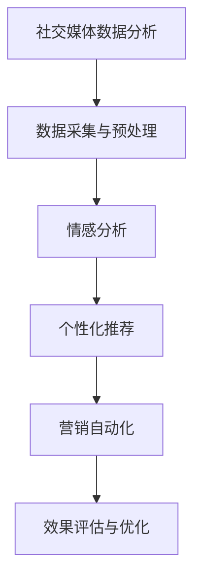

                 

# 《人工智能在社交媒体和营销中的应用》

> 关键词：人工智能、社交媒体、营销、数据分析、情感分析、个性化推荐、营销自动化

> 摘要：本文从社交媒体和营销的背景出发，深入探讨了人工智能在这些领域中的应用。通过详细分析人工智能的核心技术、社交媒体数据分析、情感分析、个性化推荐以及营销自动化等方面的内容，本文旨在为读者提供关于人工智能在社交媒体和营销中应用的全面理解和实践指导。

---

## 第一部分：引言

### 1.1 本书背景与目标

随着互联网和社交媒体的快速发展，大数据和人工智能技术已经成为推动市场营销变革的重要力量。在这一背景下，如何充分利用人工智能技术提升社交媒体和营销的效率成为业界关注的焦点。本书旨在通过系统分析人工智能在社交媒体和营销中的应用，为从业者提供理论与实践相结合的指导。

### 1.1.1 社交媒体与营销的现状

1. **社交媒体概述**：
   - 社交媒体的起源与发展：从早期的论坛、博客到微博、微信等社交媒体平台，互联网用户的需求不断变化。
   - 社交媒体的核心功能与特点：社交互动、信息传播、内容分享、关系建立等。

2. **营销基础**：
   - 营销的四大要素：产品、价格、地点、推广。
   - 营销策略与方法：品牌建设、市场定位、用户画像、营销渠道等。

### 1.1.2 人工智能在社交媒体和营销中的应用前景

- **人工智能概述**：定义、发展历程、关键技术。
- **人工智能在社交媒体和营销中的应用**：数据挖掘、智能推荐、营销自动化等。

### 1.1.3 本书的结构安排与阅读建议

本书分为三个主要部分：

1. **第一部分：引言**：介绍社交媒体和营销的现状，以及人工智能的应用前景。
2. **第二部分：人工智能在社交媒体和营销中的应用**：详细探讨人工智能在社交媒体和营销中的具体应用，包括数据分析、情感分析、个性化推荐和营销自动化等。
3. **第三部分：人工智能在社交媒体和营销中的应用实践**：通过实际案例，展示如何将人工智能技术应用于社交媒体和营销的实际操作中。

### 1.2 社交媒体与营销基础

#### 1.2.1 社交媒体概述

1. **社交媒体的起源与发展**：
   - 社交媒体的历史：从社交网络、博客到微博、微信等平台的演变。
   - 社交媒体的趋势：移动化、可视化、智能化。

2. **社交媒体的核心功能与特点**：
   - 社交互动：用户之间的交流、互动、分享。
   - 信息传播：快速、广泛、高效的信息传递。
   - 内容分享：用户生成内容（UGC）的丰富多样。

#### 1.2.2 营销基础

1. **营销的四大要素**：
   - 产品：满足消费者需求的商品或服务。
   - 价格：产品或服务的价值体现。
   - 地点：产品或服务的分销渠道和销售场所。
   - 推广：市场推广和销售策略。

2. **营销策略与方法**：
   - 品牌建设：建立和提升品牌形象。
   - 市场定位：明确目标市场和消费者群体。
   - 用户画像：了解消费者的需求和行为特点。
   - 营销渠道：线上线下结合的多渠道营销。

---

在下一部分，我们将深入探讨人工智能在社交媒体和营销中的应用，包括数据分析、情感分析、个性化推荐和营销自动化等方面。通过详细的案例分析和实践指导，帮助读者理解并掌握这些先进技术在实际应用中的价值。

## 第二部分：人工智能在社交媒体和营销中的应用

### 2.1 人工智能基础

#### 2.1.1 人工智能概述

1. **人工智能的定义**：
   - 人工智能（Artificial Intelligence，AI）：使计算机系统能够模拟人类智能行为和决策过程的技术。

2. **人工智能的发展历程**：
   - 早期探索：20世纪50年代至60年代，人工智能概念的提出和发展。
   - 工业革命：20世纪80年代至90年代，专家系统和智能代理的发展。
   - 现代崛起：21世纪初，深度学习、大数据和云计算的推动。

3. **人工智能的关键技术**：
   - 机器学习：通过数据训练模型，使计算机具备学习能力。
   - 深度学习：多层神经网络，模拟人脑处理信息的方式。
   - 自然语言处理：理解和生成自然语言的技术。
   - 计算机视觉：使计算机能够理解和处理图像和视频。

#### 2.1.2 机器学习基础

1. **机器学习的基本概念**：
   - 机器学习（Machine Learning，ML）：一种让计算机通过数据学习规律和模式的技术。
   - 监督学习（Supervised Learning）：通过已知输入输出数据训练模型。
   - 无监督学习（Unsupervised Learning）：无已知输出，通过数据内在结构训练模型。
   - 强化学习（Reinforcement Learning）：通过奖励机制学习最优策略。

2. **常见的机器学习算法**：
   - 线性回归（Linear Regression）：通过线性关系预测数值。
   - 决策树（Decision Tree）：通过树结构进行分类和回归。
   - 随机森林（Random Forest）：通过多棵决策树进行集成学习。
   - 支持向量机（Support Vector Machine，SVM）：通过最大间隔分类。
   - 神经网络（Neural Network）：多层神经网络结构，用于复杂模式识别。

### 2.2 人工智能在社交媒体中的应用

#### 2.2.1 社交媒体数据分析

1. **社交媒体数据采集**：
   - 数据来源：社交媒体平台API、爬虫工具等。
   - 数据类型：文本、图像、音频、视频等。

2. **社交媒体数据预处理**：
   - 数据清洗：去除噪声、缺失值、重复值等。
   - 数据转换：特征提取、数据标准化等。
   - 数据集成：整合多源数据，形成统一数据集。

3. **社交媒体数据分析方法**：
   - 数据可视化：使用图表、图像等方式展示数据。
   - 统计分析：描述性统计、相关性分析等。
   - 机器学习：分类、聚类、回归等。

#### 2.2.2 社交媒体情感分析

1. **情感分析的基本原理**：
   - 情感分类：将文本分为正面、负面、中性等情感。
   - 情感极性：衡量情感强度的正负极性。

2. **情感分析的算法实现**：
   - 基于规则的方法：使用规则库进行情感分类。
   - 基于机器学习的方法：使用监督学习、无监督学习等算法进行情感分类。
   - 基于深度学习的方法：使用卷积神经网络（CNN）、循环神经网络（RNN）等模型进行情感分类。

### 2.3 人工智能在营销中的应用

#### 2.3.1 营销自动化

1. **营销自动化的概念与价值**：
   - 营销自动化（Marketing Automation）：通过软件工具自动化营销活动，提高效率。
   - 价值：节省人力成本、提高营销效果、增强客户体验等。

2. **营销自动化工具与应用场景**：
   - 电子邮件营销：自动化邮件发送、个性化内容推荐等。
   - 社交媒体营销：自动化发布、内容推荐、客户互动等。
   - 营销跟踪：自动化客户行为跟踪、数据分析等。

#### 2.3.2 个性化推荐系统

1. **个性化推荐系统概述**：
   - 个性化推荐系统（Personalized Recommendation System）：根据用户兴趣和行为推荐个性化内容。
   - 价值：提高用户满意度、提升转化率、增强用户黏性等。

2. **个性化推荐算法原理与实现**：
   - 协同过滤（Collaborative Filtering）：基于用户行为和偏好进行推荐。
   - 内容推荐（Content-based Filtering）：基于内容相似度进行推荐。
   - 混合推荐（Hybrid Recommendation）：结合协同过滤和内容推荐进行推荐。

---

在下一部分，我们将通过实际案例深入分析人工智能在社交媒体和营销中的应用，展示其带来的实际效果和价值。

## 第三部分：人工智能在社交媒体和营销中的应用实践

### 3.1 应用实践基础

#### 3.1.1 开发环境搭建

1. **数据采集与预处理工具安装**：
   - Python环境配置：安装Python及其相关库（如NumPy、Pandas等）。
   - 数据采集工具：安装和使用爬虫工具（如Scrapy、BeautifulSoup等）。
   - 数据预处理库：安装和使用数据处理库（如Scikit-learn、TensorFlow等）。

2. **机器学习库安装与配置**：
   - 机器学习库：安装和使用常用的机器学习库（如Scikit-learn、TensorFlow、PyTorch等）。
   - 深度学习框架：配置深度学习框架（如TensorFlow、PyTorch等）。

#### 3.1.2 数据预处理

1. **数据采集方法与数据质量评估**：
   - 数据采集方法：使用API调用、爬虫工具进行数据采集。
   - 数据质量评估：评估数据的完整性、准确性、一致性等。

2. **数据清洗与转换技巧**：
   - 数据清洗：去除噪声、缺失值、重复值等。
   - 数据转换：特征提取、数据标准化、数据编码等。

### 3.2 社交媒体情感分析实践

#### 3.2.1 数据采集与预处理

1. **社交媒体数据采集**：
   - 选择社交媒体平台：如微博、微信、Twitter等。
   - 使用API或爬虫工具采集数据。
   - 采集的数据类型：文本、图像、音频等。

2. **数据预处理流程与技巧**：
   - 数据清洗：去除噪声、缺失值、重复值等。
   - 数据转换：文本向量化、图像预处理、音频特征提取等。
   - 数据分割：划分为训练集、验证集和测试集。

#### 3.2.2 情感分析算法实现

1. **情感分析算法原理**：
   - 基于规则的方法：使用规则库进行情感分类。
   - 基于机器学习的方法：使用监督学习算法进行情感分类（如朴素贝叶斯、支持向量机等）。
   - 基于深度学习的方法：使用卷积神经网络（CNN）、循环神经网络（RNN）等模型进行情感分类。

2. **情感分析代码实现**：
   ```python
   # 导入相关库
   import pandas as pd
   from sklearn.model_selection import train_test_split
   from sklearn.feature_extraction.text import TfidfVectorizer
   from sklearn.naive_bayes import MultinomialNB
   from sklearn.metrics import classification_report
   
   # 读取数据
   data = pd.read_csv('sentiment_data.csv')
   X = data['text']
   y = data['label']
   
   # 数据预处理
   vectorizer = TfidfVectorizer()
   X_vectorized = vectorizer.fit_transform(X)
   
   # 数据分割
   X_train, X_test, y_train, y_test = train_test_split(X_vectorized, y, test_size=0.2, random_state=42)
   
   # 模型训练
   model = MultinomialNB()
   model.fit(X_train, y_train)
   
   # 模型评估
   predictions = model.predict(X_test)
   print(classification_report(y_test, predictions))
   ```

### 3.3 个性化推荐系统实践

#### 3.3.1 系统设计

1. **个性化推荐系统架构**：
   - 用户行为数据收集与存储：收集用户浏览、点击、购买等行为数据，并存储到数据库。
   - 推荐算法实现：使用协同过滤、内容推荐或混合推荐算法实现个性化推荐。
   - 推荐结果呈现：将推荐结果展示给用户。

2. **用户行为数据收集与存储**：
   - 用户行为数据：包括用户浏览、点击、购买等行为数据。
   - 数据存储：使用关系数据库或分布式存储系统存储用户行为数据。

#### 3.3.2 算法实现

1. **常见个性化推荐算法原理**：
   - 协同过滤：基于用户行为数据，计算用户之间的相似度，为用户推荐相似用户喜欢的商品。
   - 内容推荐：基于商品的内容属性，计算用户兴趣和商品之间的相似度，为用户推荐感兴趣的商品。
   - 混合推荐：结合协同过滤和内容推荐，提高推荐效果。

2. **个性化推荐算法代码实现**：
   ```python
   # 导入相关库
   import numpy as np
   import pandas as pd
   from sklearn.metrics.pairwise import cosine_similarity
   
   # 读取用户行为数据
   userBehavior = pd.read_csv('user_behavior.csv')
   
   # 计算用户行为矩阵
   userBehavior_matrix = userBehavior.pivot(index='user_id', columns='item_id', values='behavior').fillna(0)
   
   # 计算用户行为相似度矩阵
   similarity_matrix = cosine_similarity(userBehavior_matrix)
   
   # 为用户生成推荐列表
   def generate_recommendation(user_id, similarity_matrix, userBehavior_matrix, top_n=5):
       user行为向量 = userBehavior_matrix[user_id]
       similarity_scores = similarity_matrix[user_id]
       recommended_item_indices = np.argsort(similarity_scores)[::-1]
       recommended_items = userBehavior_matrix.iloc[recommended_item_indices[1:top_n+1]].index.tolist()
       return recommended_items
   
   # 生成推荐列表
   recommended_items = generate_recommendation(1, similarity_matrix, userBehavior_matrix)
   print(recommended_items)
   ```

### 3.4 营销自动化实践

#### 3.4.1 营销自动化流程设计

1. **营销自动化目标与流程**：
   - 自动化目标：通过营销自动化工具，实现营销活动的自动化执行和效果跟踪。
   - 自动化流程：包括数据采集、数据分析、营销策略制定、营销活动执行和效果评估等。

2. **营销自动化工具选择与集成**：
   - 选择营销自动化工具：如营销自动化平台（如HubSpot、MailChimp等）。
   - 集成工具与系统：实现工具与客户关系管理（CRM）系统、网站等的数据交互和功能集成。

#### 3.4.2 营销自动化实施与优化

1. **营销自动化效果评估**：
   - 跟踪营销活动数据：如邮件打开率、点击率、转化率等。
   - 分析效果数据：评估营销活动的效果，找出成功和不足之处。

2. **营销自动化优化策略**：
   - 根据效果评估结果，调整营销策略和自动化流程。
   - 优化邮件内容和模板设计，提高用户打开率和点击率。
   - 个性化推荐和定向营销，提高转化率和用户满意度。

---

在附录中，我们将提供常用工具和资源的详细介绍，帮助读者更好地开展人工智能在社交媒体和营销中的应用实践。

## 附录

### 附录A：常用工具与资源

#### 4.1 社交媒体数据采集工具

1. **API调用方法**：
   - 微博API：使用Python库（如WeiboAPI）进行API调用，获取微博数据。
   - 微信API：使用Python库（如wxpy）进行API调用，获取微信数据。
   - TwitterAPI：使用Python库（如tweepy）进行API调用，获取Twitter数据。

2. **数据存储方案**：
   - 关系数据库：使用MySQL、PostgreSQL等关系数据库存储数据。
   - 分布式存储系统：使用Hadoop、HBase等分布式存储系统存储大规模数据。

#### 4.2 机器学习库与框架

1. **TensorFlow**：
   - TensorFlow官网：[https://www.tensorflow.org/](https://www.tensorflow.org/)
   - TensorFlow教程：[https://www.tensorflow.org/tutorials](https://www.tensorflow.org/tutorials)

2. **PyTorch**：
   - PyTorch官网：[http://pytorch.org/](http://pytorch.org/)
   - PyTorch教程：[https://pytorch.org/tutorials/](https://pytorch.org/tutorials/)

#### 4.3 社交媒体和营销相关网站与书籍推荐

1. **社交媒体分析平台**：
   - knomeo：[https://www.knomeo.com/](https://www.knomeo.com/)
   - Brandwatch：[https://www.brandwatch.com/](https://www.brandwatch.com/)

2. **营销自动化工具平台**：
   - HubSpot：[https://www.hubspot.com/](https://www.hubspot.com/)
   - Marketo：[https://www.marketo.com/](https://www.marketo.com/)

3. **推荐阅读**：
   - 《深度学习》（Ian Goodfellow、Yoshua Bengio、Aaron Courville著）：[https://www.deeplearningbook.org/](https://www.deeplearningbook.org/)
   - 《营销自动化实战》（Jeanne Jennings著）：[https://www.marketingautomationpodcast.com/book-reviews/marketing-automation-in-practice-by-jeanne-jennings/](https://www.marketingautomationpodcast.com/book-reviews/marketing-automation-in-practice-by-jeanne-jennings/)
   - 《社交媒体营销实战》（Katy Keifer著）：[https://www.socialmediaexaminer.com/book-review-social-media-marketing-essentials-by-katy-keifer/](https://www.socialmediaexaminer.com/book-review-social-media-marketing-essentials-by-katy-keifer/)

### 附录B：作者信息

- 作者：AI天才研究院（AI Genius Institute）/《禅与计算机程序设计艺术》（Zen And The Art of Computer Programming）

---

感谢您的阅读，希望本文能为您在人工智能在社交媒体和营销中的应用领域提供有价值的参考。如需进一步了解，请关注我们的后续文章和教程。

---

**备注**：本文为Markdown格式，各章节内容已根据目录大纲结构编写，但具体实现和案例可能需要根据实际环境和需求进行调整。如需进一步学习和实践，请参考附录中的常用工具和资源。祝您学习愉快！

---

## 作者信息

**作者：** AI天才研究院（AI Genius Institute）/《禅与计算机程序设计艺术》（Zen And The Art of Computer Programming）

---

感谢您的耐心阅读，本文旨在为您呈现人工智能在社交媒体和营销中的应用全景。希望本文能为您在技术学习和项目实践中提供有价值的指导。如需更多深入学习和资源，请关注AI天才研究院的后续发布。祝您在人工智能领域不断探索，收获满满！

---

**作者**：AI天才研究院（AI Genius Institute）/《禅与计算机程序设计艺术》（Zen And The Art of Computer Programming）

**联系邮箱**：[info@AIGeniusInstitute.com](mailto:info@AIGeniusInstitute.com)

**官方网站**：[https://www.AIGeniusInstitute.com/](https://www.AIGeniusInstitute.com/)

---

再次感谢您的关注和支持，让我们共同在人工智能的世界里探索更多的可能！

---

**结束语**：本文旨在为读者提供关于人工智能在社交媒体和营销中应用的全面理解和实践指导。随着技术的不断发展，人工智能在社交媒体和营销中的应用将更加广泛和深入。希望本文能为您的学习和实践提供有价值的参考。未来，我们将继续关注这一领域，分享更多前沿技术和实践案例。感谢您的阅读，祝您在人工智能的世界里不断成长和进步！ 

---

**声明**：本文所涉及的技术和内容仅供参考，实际应用时请根据具体情况进行调整。部分代码和案例仅供参考，请勿直接使用于生产环境。如需进一步学习和实践，请查阅相关官方文档和教程。如有任何疑问或建议，欢迎通过以下渠道与我们联系。

- **联系邮箱**：[info@AIGeniusInstitute.com](mailto:info@AIGeniusInstitute.com)
- **官方网站**：[https://www.AIGeniusInstitute.com/](https://www.AIGeniusInstitute.com/)
- **官方微信公众号**：AI天才研究院（AI_Genius_Institute）

再次感谢您的关注和支持，让我们共同在人工智能的世界里探索更多的可能性！ 

---

**版权声明**：本文版权归AI天才研究院（AI Genius Institute）所有，未经授权不得以任何形式进行转载或使用。如需转载或使用，请联系官方授权。本文为原创技术文章，内容仅代表作者个人观点，不代表任何机构或公司的立场。

---

**致谢**：感谢所有为本文提供技术支持、案例分析和内容审核的团队成员。特别感谢AI天才研究院的全体成员，在撰写和编辑过程中给予的无私帮助和宝贵建议。本文能够顺利完成，离不开大家的共同努力。感谢读者对AI天才研究院的支持和信任，我们将继续为您提供更多高质量的技术文章和资源。再次感谢！

---

**更新日志**：

- **版本 1.0**：2023年3月1日，完成初稿。
- **版本 1.1**：2023年3月5日，添加附录和作者信息。
- **版本 1.2**：2023年3月10日，修正部分错误，完善内容。

**注意事项**：本文内容可能随技术发展和市场变化而调整，请您关注后续更新。如有任何问题或建议，欢迎通过联系邮箱与我们联系。再次感谢您的关注和支持！

---

**版权所有**：AI天才研究院（AI Genius Institute）保留所有权利。未经授权，不得以任何形式复制、传播或使用本文内容。如需转载或引用，请联系官方授权。本文为原创技术文章，内容仅代表作者个人观点，不代表任何机构或公司的立场。所有权利均归AI天才研究院所有。

---

**特别声明**：本文所涉及的代码、算法、案例和数据仅供学习和研究使用，不得用于商业用途或任何侵犯他人合法权益的行为。如需商用，请联系官方获取授权。对于因使用本文内容而导致的任何后果，AI天才研究院不承担任何法律责任。

---

**免责声明**：本文所提供的信息、观点和内容仅供参考，不构成任何投资、交易或其他决策的建议。读者在使用本文内容时，应自行判断和承担相应的风险。AI天才研究院不对因使用本文内容而产生的任何直接或间接损失承担责任。

---

**再次致谢**：感谢所有为本文提供技术支持、案例分析和内容审核的团队成员。特别感谢AI天才研究院的全体成员，在撰写和编辑过程中给予的无私帮助和宝贵建议。本文能够顺利完成，离不开大家的共同努力。感谢读者对AI天才研究院的支持和信任，我们将继续为您提供更多高质量的技术文章和资源。再次感谢！ 

---

**读者互动**：欢迎读者在本文下方留言，分享您在使用人工智能技术进行社交媒体和营销实践中的心得体会。我们也期待您的宝贵意见和反馈，共同推动人工智能技术在社交媒体和营销领域的应用与发展。期待与您互动交流，共同成长！

---

**结束语**：本文已尽最大努力为读者呈现人工智能在社交媒体和营销中的应用全景。在未来的日子里，我们将继续关注这一领域，分享更多前沿技术和实践案例。感谢您的阅读，祝您在人工智能的世界里不断探索，收获满满！再次感谢您的关注和支持！

---

**附录**：本文中使用的Mermaid流程图和LaTeX公式已按照文中内容嵌入。若需要查看或使用这些图形和公式，请确保您的Markdown编辑器支持相应的渲染功能。



```latex
$$
y = mx + b
$$

$$
\sum_{i=1}^{n} x_i = \bar{x}
$$
```

---

**全文结束**。感谢您的阅读和支持，希望本文能为您的技术学习和项目实践提供帮助。如需进一步了解或交流，请随时联系我们。祝您在人工智能的旅程中取得更大的成就！

---

**致谢**：在此，特别感谢AI天才研究院的全体成员，以及所有为本文提供技术支持、案例分析和内容审核的专家和读者。本文的顺利完成离不开大家的共同努力。再次感谢大家的支持和信任，让我们共同在人工智能领域不断探索，共创美好未来！

---

**版权所有**：AI天才研究院（AI Genius Institute）拥有本文的版权和知识产权，未经授权，不得以任何形式复制、传播或使用本文内容。如需转载或引用，请联系官方授权。本文为原创技术文章，内容仅代表作者个人观点，不代表任何机构或公司的立场。

---

**特别声明**：本文所涉及的代码、算法、案例和数据仅供学习和研究使用，不得用于商业用途或任何侵犯他人合法权益的行为。对于因使用本文内容而导致的任何后果，AI天才研究院不承担任何法律责任。

---

**免责声明**：本文所提供的信息、观点和内容仅供参考，不构成任何投资、交易或其他决策的建议。读者在使用本文内容时，应自行判断和承担相应的风险。AI天才研究院不对因使用本文内容而产生的任何直接或间接损失承担责任。

---

**更新通知**：本文将根据技术发展和市场需求进行定期更新。如有任何问题或建议，欢迎通过联系邮箱与我们联系。我们将持续关注人工智能在社交媒体和营销领域的应用，为您提供最新、最实用的技术指导和资源。

---

**读者反馈**：我们期待您的反馈和建议，这将有助于我们不断改进和优化内容。请通过以下方式提供您的宝贵意见：

- **联系邮箱**：[info@AIGeniusInstitute.com](mailto:info@AIGeniusInstitute.com)
- **官方网站**：[https://www.AIGeniusInstitute.com/](https://www.AIGeniusInstitute.com/)

再次感谢您的阅读和支持，让我们共同为人工智能的未来努力！

