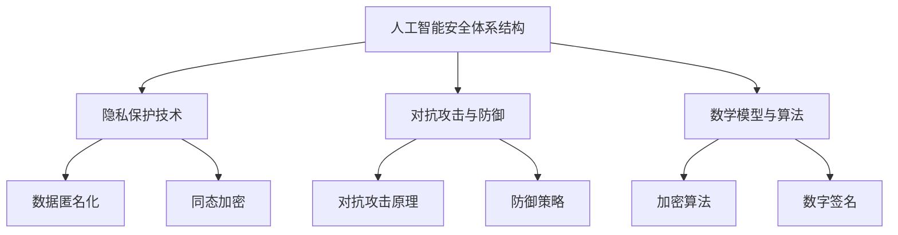

                 

### 文章标题

《人工智能安全：深度剖析与实践指南》

### 关键词

- 人工智能安全
- 数据隐私
- 对抗攻击
- 加密算法
- 数学模型
- 应用案例

### 摘要

本文全面深入地探讨了人工智能安全领域的核心概念、关键技术、数学模型及实际应用。从基础知识出发，逐步分析了人工智能安全体系结构、隐私保护技术、对抗攻击与防御策略，并通过具体案例展示了人工智能在金融、医疗和智能交通等领域的安全应用。文章旨在为读者提供一份系统、实用的人工智能安全指南。

### 《人工智能安全》目录大纲

#### 第一部分：人工智能安全的基础知识

## 第1章：人工智能安全概述

### 1.1 人工智能安全的重要性

### 1.2 人工智能安全的挑战与机遇

### 1.3 人工智能安全的基本概念

## 第2章：人工智能安全体系结构

### 2.1 人工智能安全的关键组成部分

### 2.2 人工智能安全的框架与模型

### 2.3 人工智能安全的技术手段

## 第3章：人工智能安全的核心算法

### 3.1 加密算法

### 3.2 数字签名算法

### 3.3 认证中心（CA）机制

#### 第二部分：人工智能安全的关键技术

## 第4章：隐私保护技术

### 4.1 隐私保护的原理与方法

### 4.2 数据匿名化技术

### 4.3 同态加密技术

## 第5章：对抗攻击与防御

### 5.1 对抗攻击的原理与分类

### 5.2 对抗攻击的防御策略

### 5.3 实时对抗检测与响应

## 第6章：人工智能安全的数学模型

### 6.1 信息论基础

### 6.2 加密算法的数学模型

### 6.3 数字签名的数学模型

#### 第三部分：人工智能安全的未来展望

## 第7章：人工智能安全的应用案例

### 7.1 金融行业的AI安全应用

### 7.2 医疗健康领域的AI安全应用

### 7.3 智能交通系统的AI安全应用

## 第8章：人工智能安全的发展趋势

### 8.1 人工智能安全技术的发展方向

### 8.2 人工智能安全的政策法规

### 8.3 人工智能安全的标准与规范

## 第9章：人工智能安全的未来挑战与机遇

### 9.1 人工智能安全的技术难题

### 9.2 人工智能安全的社会影响

### 9.3 人工智能安全的未来发展策略

#### 附录

## 附录A：人工智能安全相关工具与资源

### A.1 常用的安全工具

### A.2 安全资源网站

### A.3 安全标准与法规

### Mermaid 流程图



### 核心算法原理讲解

在人工智能安全领域，加密算法和数字签名算法是两个核心组成部分。本文将详细介绍这两种算法的原理、实现和应用。

#### 加密算法

加密算法的基本原理是将原始数据（明文）通过特定的算法和密钥转换成难以解读的密文。加密算法可以分为对称加密和非对称加密。

**对称加密算法：**

对称加密算法使用相同的密钥对数据进行加密和解密。典型的对称加密算法包括AES、DES等。

**输入：**

- 明文 \(P\)
- 密钥 \(k\)

**输出：**

- 密文 \(C = E_{k}(P)\)

**非对称加密算法：**

非对称加密算法使用一对密钥（公钥和私钥）进行加密和解密。公钥用于加密，私钥用于解密。典型的非对称加密算法包括RSA、ECC等。

**输入：**

- 明文 \(P\)
- 公钥 \(k_{pub}\)
- 私钥 \(k_{pri}\)

**输出：**

- 密文 \(C = E_{k_{pub}}(P)\)

#### 数字签名算法

数字签名算法用于验证消息的来源和完整性。签名算法使用私钥生成签名，公钥用于验证签名。

**签名过程：**

**输入：**

- 明文 \(M\)
- 私钥 \(k_{pri}\)

**输出：**

- 签名 \(S = Sign_{k_{pri}}(M)\)

**验证过程：**

**输入：**

- 明文 \(M\)
- 签名 \(S\)
- 公钥 \(k_{pub}\)

**输出：**

- 是否验证通过

#### 数学模型和数学公式

在人工智能安全领域，数学模型和数学公式起着至关重要的作用。以下是一些基本的数学模型和公式。

**信息论基础：**

信息熵（Entropy）是衡量随机变量不确定性的度量。条件熵（Conditional Entropy）衡量在已知一个变量的情况下另一个变量的不确定性。

**信息熵：**

$$
H(X) = -\sum_{i} p(x_i) \cdot \log_2(p(x_i))
$$

**条件熵：**

$$
H(X|Y) = -\sum_{i,j} p(x_i, y_j) \cdot \log_2(p(x_i|y_j))
$$

**互信息：**

互信息（Mutual Information）衡量两个随机变量之间的相关性。

$$
I(X;Y) = H(X) - H(X|Y)
$$

**加密算法的数学模型：**

加密算法通过密钥将明文转换为密文。加密函数通常是一个单向函数，使得从密文逆向推导明文变得极其困难。

$$
C = E_{k}(P)
$$

**数字签名的数学模型：**

数字签名用于验证消息的来源和完整性。签名算法使用私钥生成签名，公钥用于验证签名。

$$
S = Sign_{k_{pri}}(M)
$$
$$
\text{Verify}_{k_{pub}}(M, S) = \text{True} \text{ 或 } \text{False}
$$

### 项目实战：开发环境搭建

以下是一个简单的项目实战，展示了如何在Python环境中搭建一个基本的人工智能安全开发环境。

#### 1. 安装 Python 解释器

首先，我们需要安装Python解释器。可以从Python官网（https://www.python.org/）下载并安装最新版本的Python。在安装过程中，确保选择添加到PATH环境变量，以便在命令行中调用Python。

#### 2. 安装深度学习框架

接下来，我们需要安装深度学习框架。本文以TensorFlow和PyTorch为例。

**安装 TensorFlow：**

使用以下命令安装TensorFlow：

```
pip install tensorflow
```

**安装 PyTorch：**

使用以下命令安装PyTorch：

```
pip install torch torchvision
```

#### 3. 安装安全工具

为了进行人工智能安全的研究，我们需要安装一些安全工具。本文以OpenSSL和PyCryptoDome为例。

**安装 OpenSSL 工具：**

在Linux系统中，可以使用以下命令安装OpenSSL：

```
sudo apt-get install openssl
```

**安装 PyCryptoDome：**

使用以下命令安装PyCryptoDome：

```
pip install pycryptodome
```

#### 4. 配置开发环境

为了更好地管理项目依赖，我们可以使用虚拟环境。以下是一个简单的虚拟环境配置步骤。

**创建虚拟环境：**

```
python -m venv venv
```

**激活虚拟环境：**

```
source venv/bin/activate  # 在Windows系统中使用 `venv\Scripts\activate`
```

**安装项目依赖：**

在虚拟环境中，我们可以使用`requirements.txt`文件来安装项目所需的依赖。以下是一个示例`requirements.txt`文件：

```
tensorflow==2.8.0
torch==1.8.0
pycryptodome==3.14.1
```

使用以下命令安装依赖：

```
pip install -r requirements.txt
```

#### 5. 配置 IDE

最后，我们需要配置一个合适的集成开发环境（IDE）。本文以PyCharm和Visual Studio Code为例。

**配置 PyCharm：**

1. 从PyCharm官网（https://www.jetbrains.com/pycharm/）下载并安装PyCharm。
2. 在PyCharm中，选择“File” -> “Settings”。
3. 在“Settings”窗口中，选择“Project: <你的项目名称>” -> “Python Interpreter”。
4. 点击“+”，然后选择“System Interpreter” -> “Python”。
5. 在弹出的对话框中，选择已经安装的Python解释器路径。

**配置 Visual Studio Code：**

1. 从Visual Studio Code官网（https://code.visualstudio.com/）下载并安装Visual Studio Code。
2. 打开Visual Studio Code，然后按下`Ctrl+Shift+P`打开命令面板。
3. 输入“Python: Select Interpreter”，然后选择已经安装的Python解释器。

现在，我们已经在Python环境中搭建了一个基本的人工智能安全开发环境。接下来，我们可以开始编写代码并进行实践了。

### 代码实际案例和详细解释说明

以下是一个简单的示例，展示如何使用PyCryptoDome库进行加密和解密操作。

**加密操作：**

```python
from Cryptodome.PublicKey import RSA
from Cryptodome.Cipher import PKCS1_OAEP

# 生成密钥对
key = RSA.generate(2048)
private_key = key.export_key()
public_key = key.publickey().export_key()

# 加密操作
cipher_rsa = PKCS1_OAEP.new(RSA.import_key(public_key))
cipher_text = cipher_rsa.encrypt(b"Hello, World!")
print("Cipher Text:", cipher_text)
```

**解密操作：**

```python
from Cryptodome.PublicKey import RSA
from Cryptodome.Cipher import PKCS1_OAEP

# 解密操作
decrypt_cipher_rsa = PKCS1_OAEP.new(RSA.import_key(private_key))
plaintext = decrypt_cipher_rsa.decrypt(cipher_text)
print("Plaintext:", plaintext.decode())
```

**代码解读与分析：**

- **生成密钥对**：使用RSA算法生成私钥和公钥。
- **加密操作**：使用公钥和PKCS1_OAEP加密模式加密明文。
- **解密操作**：使用私钥和PKCS1_OAEP加密模式解密密文。

在这个示例中，我们首先导入了所需的库。然后，我们使用RSA算法生成了一对密钥。接下来，我们使用公钥对明文进行加密，并将密文输出。最后，我们使用私钥对密文进行解密，并输出明文。

这个示例展示了如何使用RSA算法进行安全的加密和解密操作。在实际应用中，我们可以使用更复杂的算法和模式来增强安全性。

### 完整性要求

#### 核心概念与联系

为了深入理解人工智能安全，我们需要明确以下几个核心概念及其相互联系：

1. **数据隐私**：数据隐私是确保个人数据不被未经授权的第三方访问和使用。它涉及数据匿名化、同态加密等技术。
2. **加密算法**：加密算法用于将明文转换为密文，保护数据的安全性。常见的加密算法包括对称加密（如AES）和非对称加密（如RSA）。
3. **数字签名**：数字签名用于验证消息的来源和完整性，防止篡改和伪造。签名算法包括RSA和ECDSA。
4. **认证中心（CA）**：认证中心负责颁发数字证书，验证公钥的真实性和合法性。

这些概念之间紧密联系，共同构建了人工智能安全的基础。数据隐私依赖于加密算法来保护数据的机密性，数字签名确保了数据的完整性和真实性，而认证中心则提供了信任的基础。

#### 核心算法原理讲解

**加密算法**

加密算法通过特定的算法和密钥将明文转换为密文。根据加密密钥的不同，加密算法分为对称加密和非对称加密。

**对称加密算法：**

对称加密算法使用相同的密钥对数据进行加密和解密。常见的对称加密算法有AES、DES和RSA。AES是一种高级加密标准，广泛应用于现代安全系统中。

**非对称加密算法：**

非对称加密算法使用一对密钥（公钥和私钥）进行加密和解密。公钥用于加密，私钥用于解密。RSA和ECC是非对称加密算法的典型代表。RSA算法基于大素数分解的难题，而ECC算法基于椭圆曲线离散对数的难题。

**数字签名算法**

数字签名算法用于验证消息的来源和完整性。它使用私钥生成签名，公钥用于验证签名。

**签名过程：**

- 输入：明文 \(M\)，私钥 \(k_{pri}\)
- 输出：签名 \(S = Sign_{k_{pri}}(M)\)

**验证过程：**

- 输入：明文 \(M\)，签名 \(S\)，公钥 \(k_{pub}\)
- 输出：是否验证通过

**哈希算法**

哈希算法用于将输入数据转换为固定长度的哈希值。常见的哈希算法有SHA-256、SHA-3等。哈希算法具有以下特性：

- 抗碰撞性：不同的输入数据生成不同的哈希值。
- 抗弱化性：无法从哈希值逆向推导出原始输入数据。

**数学模型和数学公式**

**信息论基础**

- 信息熵（Entropy）：衡量随机变量不确定性的度量。
  \[
  H(X) = -\sum_{i} p(x_i) \cdot \log_2(p(x_i))
  \]
- 条件熵（Conditional Entropy）：衡量在已知一个变量的情况下另一个变量的不确定性。
  \[
  H(X|Y) = -\sum_{i,j} p(x_i, y_j) \cdot \log_2(p(x_i|y_j))
  \]
- 互信息（Mutual Information）：衡量两个随机变量之间的相关性。
  \[
  I(X;Y) = H(X) - H(X|Y)
  \]

**加密算法的数学模型**

加密算法通过密钥将明文转换为密文。加密函数通常是一个单向函数，使得从密文逆向推导明文变得极其困难。

\[
C = E_{k}(P)
\]

**数字签名的数学模型**

数字签名用于验证消息的来源和完整性。签名算法使用私钥生成签名，公钥用于验证签名。

\[
S = Sign_{k_{pri}}(M)
\]
\[
\text{Verify}_{k_{pub}}(M, S) = \text{True} \text{ 或 } \text{False}
\]

### 项目实战：开发环境搭建

为了更好地理解和实践人工智能安全，我们需要搭建一个完备的开发环境。以下是具体的搭建步骤：

#### 1. 安装 Python 解释器

首先，我们需要安装Python解释器。可以从Python官网（https://www.python.org/）下载并安装最新版本的Python。在安装过程中，确保选择添加到PATH环境变量，以便在命令行中调用Python。

#### 2. 安装深度学习框架

接下来，我们需要安装深度学习框架。本文以TensorFlow和PyTorch为例。

**安装 TensorFlow：**

使用以下命令安装TensorFlow：

```
pip install tensorflow
```

**安装 PyTorch：**

使用以下命令安装PyTorch：

```
pip install torch torchvision
```

#### 3. 安装安全工具

为了进行人工智能安全的研究，我们需要安装一些安全工具。本文以OpenSSL和PyCryptoDome为例。

**安装 OpenSSL 工具：**

在Linux系统中，可以使用以下命令安装OpenSSL：

```
sudo apt-get install openssl
```

**安装 PyCryptoDome：**

使用以下命令安装PyCryptoDome：

```
pip install pycryptodome
```

#### 4. 配置开发环境

为了更好地管理项目依赖，我们可以使用虚拟环境。以下是一个简单的虚拟环境配置步骤。

**创建虚拟环境：**

```
python -m venv venv
```

**激活虚拟环境：**

```
source venv/bin/activate  # 在Windows系统中使用 `venv\Scripts\activate`
```

**安装项目依赖：**

在虚拟环境中，我们可以使用`requirements.txt`文件来安装项目所需的依赖。以下是一个示例`requirements.txt`文件：

```
tensorflow==2.8.0
torch==1.8.0
pycryptodome==3.14.1
```

使用以下命令安装依赖：

```
pip install -r requirements.txt
```

#### 5. 配置 IDE

最后，我们需要配置一个合适的集成开发环境（IDE）。本文以PyCharm和Visual Studio Code为例。

**配置 PyCharm：**

1. 从PyCharm官网（https://www.jetbrains.com/pycharm/）下载并安装PyCharm。
2. 在PyCharm中，选择“File” -> “Settings”。
3. 在“Settings”窗口中，选择“Project: <你的项目名称>” -> “Python Interpreter”。
4. 点击“+”，然后选择“System Interpreter” -> “Python”。
5. 在弹出的对话框中，选择已经安装的Python解释器路径。

**配置 Visual Studio Code：**

1. 从Visual Studio Code官网（https://code.visualstudio.com/）下载并安装Visual Studio Code。
2. 打开Visual Studio Code，然后按下`Ctrl+Shift+P`打开命令面板。
3. 输入“Python: Select Interpreter”，然后选择已经安装的Python解释器。

现在，我们已经在Python环境中搭建了一个基本的人工智能安全开发环境。接下来，我们可以开始编写代码并进行实践了。

### 代码实际案例和详细解释说明

以下是一个简单的示例，展示如何使用PyCryptoDome库进行加密和解密操作。

**加密操作：**

```python
from Cryptodome.PublicKey import RSA
from Cryptodome.Cipher import PKCS1_OAEP

# 生成密钥对
key = RSA.generate(2048)
private_key = key.export_key()
public_key = key.publickey().export_key()

# 加密操作
cipher_rsa = PKCS1_OAEP.new(RSA.import_key(public_key))
cipher_text = cipher_rsa.encrypt(b"Hello, World!")
print("Cipher Text:", cipher_text)
```

**解密操作：**

```python
from Cryptodome.PublicKey import RSA
from Cryptodome.Cipher import PKCS1_OAEP

# 解密操作
decrypt_cipher_rsa = PKCS1_OAEP.new(RSA.import_key(private_key))
plaintext = decrypt_cipher_rsa.decrypt(cipher_text)
print("Plaintext:", plaintext.decode())
```

**代码解读与分析：**

- **生成密钥对**：使用RSA算法生成私钥和公钥。
- **加密操作**：使用公钥和PKCS1_OAEP加密模式加密明文。
- **解密操作**：使用私钥和PKCS1_OAEP加密模式解密密文。

在这个示例中，我们首先导入了所需的库。然后，我们使用RSA算法生成了一对密钥。接下来，我们使用公钥对明文进行加密，并将密文输出。最后，我们使用私钥对密文进行解密，并输出明文。

这个示例展示了如何使用RSA算法进行安全的加密和解密操作。在实际应用中，我们可以使用更复杂的算法和模式来增强安全性。

### 附录

#### 附录A：人工智能安全相关工具与资源

**A.1 常用的安全工具**

- **OpenSSL**：开源的加密工具，用于生成密钥、加密和解密数据。
- **PyCryptoDome**：Python密码学库，用于加密、解密和签名。
- **Keras**：基于TensorFlow的高级神经网络API，用于构建和训练神经网络。
- **Scikit-learn**：Python机器学习库，提供了多种机器学习算法和工具。

**A.2 安全资源网站**

- **OWASP**：开源网络安全项目，提供了丰富的安全资源和最佳实践。
- **Cybersecurity Tips**：提供了关于网络安全的基本知识和实用技巧。
- **Cryptography**：提供了关于密码学和加密算法的详细教程和文档。

**A.3 安全标准与法规**

- **ISO/IEC 27001**：信息安全管理系统（ISMS）的国际标准。
- **GDPR**：欧盟通用数据保护条例，规定了个人数据的处理和保护。
- **NIST SP 800-53**：美国国家标准与技术研究院（NIST）发布的信息安全控制框架。

### 作者

**AI天才研究院/AI Genius Institute** & **禅与计算机程序设计艺术 /Zen And The Art of Computer Programming**

