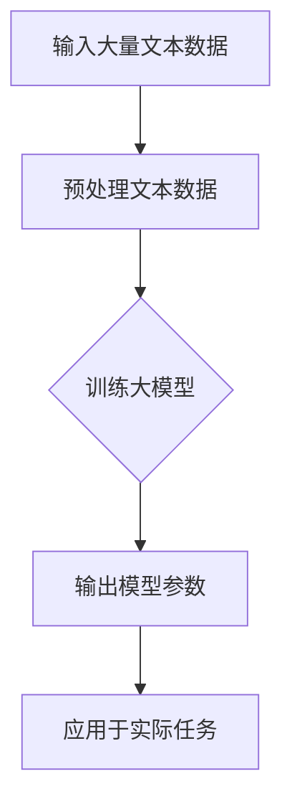

                 

# 《人工智能的成功来源：大模型与大文本》

## 关键词
- 人工智能
- 大模型
- 大文本
- 深度学习
- 自然语言处理
- 计算机视觉

> 摘要：本文将深入探讨人工智能领域中的两大关键因素——大模型与大文本的作用。通过分析人工智能的发展历程、核心概念、大模型原理与架构、大文本处理技术以及应用场景，本文旨在揭示大模型与大文本对于人工智能成功的重要贡献，并展望未来面临的挑战与趋势。

## 目录大纲

## 第一部分：基础理论

### 第1章 人工智能概述
- **1.1 人工智能的发展历程**
  - $历史阶段划分$
  - $标志性事件和人物$
- **1.2 人工智能的核心概念**
  - $感知智能与认知智能的区分$
  - $机器学习、深度学习与神经网络的关系$
- **1.3 大模型与大文本**
  - **核心概念与联系**
    - 
  - **大模型的原理**
    - **伪代码讲解**
    - **数学模型与公式**
    - **举例说明**

### 第2章 大模型原理与架构
- **2.1 深度学习基础**
  - **神经网络基本结构**
  - **常见深度学习架构**
- **2.2 大模型训练策略**
  - **预训练与微调**
  - **自监督学习**
  - **迁移学习**

### 第3章 大文本处理技术
- **3.1 文本预处理**
  - **分词与词嵌入**
  - **文本清洗与去噪**
  - **文本表示学习**
- **3.2 语言模型**
  - **语言模型的基本原理**
  - **n元语言模型**
  - **基于Transformer的语言模型**

### 第4章 大模型应用场景
- **4.1 自然语言处理**
  - **文本分类**
  - **机器翻译**
  - **问答系统**
- **4.2 计算机视觉**
  - **图像分类**
  - **目标检测**
  - **图像生成**
- **4.3 强化学习**
  - **智能决策系统**
  - **游戏AI**

## 第二部分：实践与应用

### 第5章 大模型开发实战
- **5.1 开发环境搭建**
  - **Python开发环境**
  - **深度学习框架**
    - TensorFlow
    - PyTorch
- **5.2 大模型训练案例**
  - **语言模型训练案例**
  - **图像分类模型训练案例**
- **5.3 大模型优化技巧**
  - **模型压缩**
  - **并行训练与分布式训练**

### 第6章 大模型应用案例解析
- **6.1 企业级应用**
  - **金融行业应用**
  - **医疗行业应用**
  - **教育行业应用**
- **6.2 开源项目案例**
  - **开源大模型库**
  - **开源应用案例**

### 第7章 未来展望与挑战
- **7.1 人工智能发展趋势**
  - **大模型研究热点**
  - **跨学科融合趋势**
- **7.2 大模型面临的挑战**
  - **计算资源需求**
  - **数据安全与隐私**
  - **算法伦理与道德**

## 附录

### 附录 A: 工具与资源
- **A.1 深度学习工具**
  - TensorFlow
  - PyTorch
  - 其他常用工具
- **A.2 开源大模型库**
  - OpenAI GPT系列
  - BERT及其变种
  - 其他常用模型库
- **A.3 学习资源与参考**
  - 书籍推荐
  - 网络课程与教程
  - 论文集与研究报告

## 第一部分：基础理论

### 第1章 人工智能概述

#### 1.1 人工智能的发展历程

人工智能（AI）作为一个跨学科领域，从诞生之初就经历了多次革新与发展。其历史大致可以分为以下几个阶段：

- **初始阶段（1950s-1960s）**：以图灵测试和逻辑推理为主要标志，人工智能的概念开始被提出并研究。
- **黄金时代（1970s-1980s）**：随着知识的表达和推理技术的进步，专家系统成为研究热点。
- **衰落时期（1990s）**：由于对人工智能期望过高，加之计算资源限制，人工智能研究一度陷入低谷。
- **复兴时期（2000s）**：机器学习和深度学习技术的发展为人工智能注入了新的活力。
- **当前时代（2010s至今）**：随着大数据、云计算和计算资源的爆发式增长，人工智能迎来了全面爆发。

在人工智能的发展历程中，有许多标志性事件和人物，如约翰·麦卡锡（John McCarthy）提出了人工智能的概念，艾伦·图灵（Alan Turing）提出了图灵测试，而近年来，谷歌的AlphaGo在围棋领域取得突破性成就，更是标志着人工智能技术进入了一个新的时代。

#### 1.2 人工智能的核心概念

人工智能的核心概念可以从多个角度进行理解，主要包括以下几个方面：

- **感知智能与认知智能**：感知智能是指机器能够感知和理解外部世界的能力，如视觉、听觉等。认知智能则是指机器具有推理、判断和解决问题的能力，如语言理解、决策制定等。
- **机器学习、深度学习与神经网络**：机器学习是使机器能够通过数据和经验改进自身性能的一种方法。深度学习是机器学习的一个分支，通过多层神经网络来学习数据的特征表示。神经网络则是一种模拟人脑神经元连接的结构，是深度学习的基础。

#### 1.3 大模型与大文本

**核心概念与联系**

大模型（Large Models）是指具有巨大参数规模和强大表达能力的人工智能模型，如GPT系列、BERT等。大文本（Large Text）则是指包含海量文本数据，这些数据来自于互联网、书籍、新闻等。

大模型与大文本之间的关系密切，大文本为训练大模型提供了丰富的数据支持，而大模型则通过学习这些大文本数据，获得了强大的语言理解和生成能力。以下是一个简化的Mermaid流程图，展示了大模型与大文本的互动过程：



**大模型的原理**

大模型的原理主要涉及以下几个方面：

1. **预训练与微调**：预训练是指在大量无标签数据上进行训练，使模型获得通用特征表示。微调则是指将预训练模型在特定任务上进行调整，提高其在该任务上的性能。
2. **自监督学习**：自监督学习是一种无需人工标注数据的训练方法，通过利用数据中的冗余信息和结构来训练模型。
3. **迁移学习**：迁移学习是指将已经在一个任务上训练好的模型，应用于其他相关任务上，从而提高训练效率和性能。

以下是一个简化的伪代码，描述了使用大量文本数据进行大模型训练的过程：

```plaintext
# 输入：大量文本数据
# 输出：训练好的大模型

# 预处理文本数据
预处理文本数据

# 初始化模型
初始化大模型

# 训练模型
for each 文本 in 数据集 do
    # 预处理文本数据
    预处理(文本)
    # 更新模型权重
    模型更新(模型，文本)
end for

# 微调模型
微调模型(模型，有标签数据)

# 输出模型参数
输出模型参数
```

**数学模型与公式**

大模型的训练通常涉及到复杂的数学模型和优化算法。以下是一个简化的损失函数，用于描述模型在训练过程中对文本数据进行预测的误差：

$$
\text{损失函数} = \frac{1}{N} \sum_{i=1}^{N} (y_i - \hat{y}_i)^2
$$

其中，$N$ 表示样本数量，$y_i$ 表示第$i$个样本的真实标签，$\hat{y}_i$ 表示模型预测的标签。

**举例说明**

大模型的应用场景非常广泛，以下是两个典型的案例：

- **案例1：** 语言模型训练

语言模型是人工智能中一个重要的应用方向，其目标是通过学习大量文本数据，预测下一个单词或词组。一个典型的数据集可以是维基百科的文本数据，目标则是生成自然流畅的语言。

- **案例2：** 图像分类

图像分类是计算机视觉中的一个基本任务，其目标是将图像分类到预定义的类别中。一个典型的数据集可以是ImageNet，其中包含了数百万个图像和相应的标签。

在图像分类任务中，大模型能够通过学习大量的图像和标签数据，获得对图像内容的深刻理解，从而提高分类的准确性。

#### 1.4 人工智能的其他核心技术

除了大模型和大文本，人工智能领域还有许多其他核心技术，如自然语言处理、计算机视觉、强化学习等。

- **自然语言处理（NLP）**：NLP 是人工智能的一个重要分支，其目标是对自然语言进行理解和生成。常见的 NLP 任务包括文本分类、机器翻译、情感分析等。
- **计算机视觉（CV）**：CV 是人工智能的另一个重要分支，其目标是通过计算机对图像和视频进行分析和处理。常见的 CV 任务包括图像分类、目标检测、图像生成等。
- **强化学习（RL）**：强化学习是一种通过试错和反馈进行决策的机器学习方法。常见的 RL 应用包括智能决策系统、游戏AI等。

这些核心技术相互交织，共同推动了人工智能的发展和应用。

### 第2章 大模型原理与架构

#### 2.1 深度学习基础

深度学习是人工智能领域的一个核心技术，其核心思想是通过多层神经网络对数据进行学习和建模。以下是一些深度学习基础的概念和原理：

- **神经网络基本结构**：

神经网络由多个神经元（或节点）组成，每个神经元接收来自前一层神经元的输入，并通过加权求和和激活函数产生输出。神经网络的基本结构可以表示为：

```plaintext
输入层 -> 隐藏层 -> 输出层
```

其中，输入层接收外部输入数据，隐藏层负责对数据进行特征提取和变换，输出层则生成最终的预测结果。

- **常见深度学习架构**：

深度学习领域有许多经典的架构，如卷积神经网络（CNN）、递归神经网络（RNN）与长短时记忆网络（LSTM）、变换器模型（Transformer）等。

1. **卷积神经网络（CNN）**：

CNN 是一种专门用于处理图像数据的深度学习模型，其核心思想是通过卷积操作提取图像的局部特征。CNN 的基本结构如下：

```plaintext
输入层 -> 卷积层 -> 池化层 -> 全连接层 -> 输出层
```

2. **递归神经网络（RNN）与长短时记忆网络（LSTM）**：

RNN 是一种用于处理序列数据的神经网络，其特点是可以捕捉序列中的时间依赖关系。LSTM 是 RNN 的一个变种，通过引入记忆单元和门控机制，提高了对长序列数据的处理能力。

3. **变换器模型（Transformer）**：

Transformer 是一种基于自注意力机制的深度学习模型，广泛应用于自然语言处理任务。其核心思想是通过计算序列中每个元素之间的注意力权重，对数据进行加权处理。

#### 2.2 大模型训练策略

大模型训练策略是指在训练大模型时采用的一些技术和方法，以提高训练效率、模型性能和泛化能力。以下是一些常见的大模型训练策略：

- **预训练与微调**：

预训练是指在大量无标签数据上进行训练，使模型获得通用特征表示。微调则是指将预训练模型在特定任务上进行调整，提高其在该任务上的性能。

- **自监督学习**：

自监督学习是一种无需人工标注数据的训练方法，通过利用数据中的冗余信息和结构来训练模型。常见的自监督学习任务包括填空、改写、分类等。

- **迁移学习**：

迁移学习是指将已经在一个任务上训练好的模型，应用于其他相关任务上，从而提高训练效率和性能。常见的迁移学习策略包括模型蒸馏、特征迁移等。

### 第3章 大文本处理技术

#### 3.1 文本预处理

文本预处理是自然语言处理（NLP）中至关重要的一步，其目的是将原始文本数据转换为适合模型处理的格式。以下是一些常见的文本预处理技术：

- **分词与词嵌入**：

分词是指将原始文本分解为一系列单词或词汇。词嵌入是指将文本中的单词或词汇映射为一个固定大小的向量表示。

- **文本清洗与去噪**：

文本清洗是指去除文本中的无关信息，如标点符号、停用词等。文本去噪是指通过过滤或修复文本中的错误和噪声，提高文本质量。

- **文本表示学习**：

文本表示学习是指将文本数据转换为数值表示，以便于模型处理。常见的文本表示学习方法包括词袋模型、TF-IDF、Word2Vec、BERT等。

#### 3.2 语言模型

语言模型是NLP中的一个核心概念，其目标是预测文本序列中下一个单词或词组。以下是一些常见的语言模型：

- **n元语言模型**：

n元语言模型是一种基于历史n个单词来预测下一个单词的语言模型。其基本思想是利用统计方法计算单词之间的概率分布。

- **基于Transformer的语言模型**：

基于Transformer的语言模型是一种基于自注意力机制的深度学习模型，广泛应用于自然语言处理任务。其核心思想是通过计算序列中每个元素之间的注意力权重，对数据进行加权处理。

#### 3.3 大文本处理的其他技术

除了文本预处理和语言模型，大文本处理还包括许多其他技术，如文本分类、机器翻译、问答系统等。以下是一些常见的大文本处理技术：

- **文本分类**：

文本分类是指将文本数据分类到预定义的类别中。常见的文本分类算法包括朴素贝叶斯、支持向量机、深度学习等。

- **机器翻译**：

机器翻译是指将一种语言的文本自动翻译成另一种语言。常见的机器翻译模型包括基于规则的翻译、统计机器翻译和神经机器翻译等。

- **问答系统**：

问答系统是指通过自然语言交互，为用户回答问题的系统。常见的问答系统包括基于事实的问答、基于机器学习的问答等。

### 第4章 大模型应用场景

#### 4.1 自然语言处理

自然语言处理（NLP）是人工智能的一个重要应用领域，大模型在NLP中发挥了关键作用。以下是一些常见的NLP应用场景：

- **文本分类**：

文本分类是指将文本数据分类到预定义的类别中。大模型通过学习大量文本数据，能够高效地分类文本。

- **机器翻译**：

机器翻译是指将一种语言的文本自动翻译成另一种语言。大模型在机器翻译中发挥了重要作用，通过学习大量的双语文本数据，能够生成高质量翻译。

- **问答系统**：

问答系统是指通过自然语言交互，为用户回答问题的系统。大模型通过学习大量的问答数据，能够理解用户的问题并生成合理的回答。

#### 4.2 计算机视觉

计算机视觉是人工智能的另一个重要应用领域，大模型在计算机视觉中也发挥着关键作用。以下是一些常见的计算机视觉应用场景：

- **图像分类**：

图像分类是指将图像分类到预定义的类别中。大模型通过学习大量的图像数据，能够高效地分类图像。

- **目标检测**：

目标检测是指识别图像中的目标对象并定位其位置。大模型通过学习大量的图像和标签数据，能够准确检测图像中的目标对象。

- **图像生成**：

图像生成是指生成新的图像。大模型通过学习大量的图像数据，能够生成高质量的图像。

#### 4.3 强化学习

强化学习是人工智能的另一个重要分支，大模型在强化学习中也发挥着关键作用。以下是一些常见的强化学习应用场景：

- **智能决策系统**：

智能决策系统是指利用人工智能技术为决策者提供决策支持。大模型通过学习大量的决策数据和反馈信息，能够生成智能化的决策建议。

- **游戏AI**：

游戏AI是指利用人工智能技术实现游戏中的智能行为。大模型通过学习大量的游戏数据和策略，能够生成高效的游戏AI。

### 第二部分：实践与应用

#### 第5章 大模型开发实战

#### 5.1 开发环境搭建

搭建大模型开发环境是进行大模型训练和优化的第一步，以下是一个简化的Python开发环境搭建步骤：

1. **安装Python**：确保安装了Python 3.7或更高版本。
2. **安装深度学习框架**：常见的深度学习框架包括TensorFlow和PyTorch。以下是一个使用pip安装TensorFlow的示例：

```bash
pip install tensorflow
```

3. **安装其他依赖**：根据实际需求安装其他必要的库和依赖，如NumPy、Pandas等。

#### 5.2 大模型训练案例

以下是一个简化的语言模型训练案例，使用TensorFlow和PyTorch分别进行训练：

**使用TensorFlow训练语言模型**

```python
import tensorflow as tf

# 加载预训练的模型
model = tf.keras.Sequential([
    tf.keras.layers.Embedding(input_dim=vocab_size, output_dim=embedding_size),
    tf.keras.layers.GlobalAveragePooling1D(),
    tf.keras.layers.Dense(units=1, activation='sigmoid')
])

# 编译模型
model.compile(optimizer='adam', loss='binary_crossentropy', metrics=['accuracy'])

# 训练模型
model.fit(train_data, train_labels, epochs=5, batch_size=32)
```

**使用PyTorch训练语言模型**

```python
import torch
import torch.nn as nn
import torch.optim as optim

# 定义模型
class LanguageModel(nn.Module):
    def __init__(self, vocab_size, embedding_size):
        super(LanguageModel, self).__init__()
        self.embedding = nn.Embedding(vocab_size, embedding_size)
        self.fc = nn.Linear(embedding_size, vocab_size)

    def forward(self, x):
        x = self.embedding(x)
        x = self.fc(x)
        return x

# 初始化模型和优化器
model = LanguageModel(vocab_size, embedding_size)
optimizer = optim.Adam(model.parameters(), lr=0.001)

# 训练模型
for epoch in range(5):
    for inputs, targets in dataset:
        optimizer.zero_grad()
        outputs = model(inputs)
        loss = nn.functional.cross_entropy(outputs, targets)
        loss.backward()
        optimizer.step()
```

#### 5.3 大模型优化技巧

优化大模型是提高其性能和泛化能力的关键步骤，以下是一些常见的大模型优化技巧：

1. **模型压缩**：

模型压缩是指通过各种技术减小模型的大小，如剪枝、量化等。这些技术可以显著降低模型的存储和计算需求。

2. **并行训练与分布式训练**：

并行训练与分布式训练是指通过将数据或计算任务分布在多台设备上进行训练，以提高训练速度和性能。常见的分布式训练框架包括Horovod和DistributedDataParallel。

### 第6章 大模型应用案例解析

#### 6.1 企业级应用

大模型在企业级应用中具有广泛的应用，以下是一些常见的企业级应用案例：

1. **金融行业应用**：

金融行业利用大模型进行文本分析、风险控制和智能投顾等任务。例如，通过自然语言处理技术分析市场报告和新闻，预测股票走势。

2. **医疗行业应用**：

医疗行业利用大模型进行医学图像分析、疾病诊断和药物研发等任务。例如，通过计算机视觉技术分析医学影像，辅助医生进行诊断。

3. **教育行业应用**：

教育行业利用大模型进行个性化学习推荐、智能评估和智能教学等任务。例如，通过自然语言处理技术分析学生的学习行为，为学生提供个性化的学习资源。

#### 6.2 开源项目案例

开源项目是推动人工智能发展的重要力量，以下是一些著名的大模型开源项目案例：

1. **OpenAI GPT系列**：

OpenAI GPT系列模型是自然语言处理领域的重要突破，包括GPT、GPT-2、GPT-3等。这些模型在机器翻译、文本生成、对话系统等任务上取得了显著成果。

2. **BERT及其变种**：

BERT（Bidirectional Encoder Representations from Transformers）是由Google提出的一种基于Transformer的语言模型。BERT及其变种BERT-

