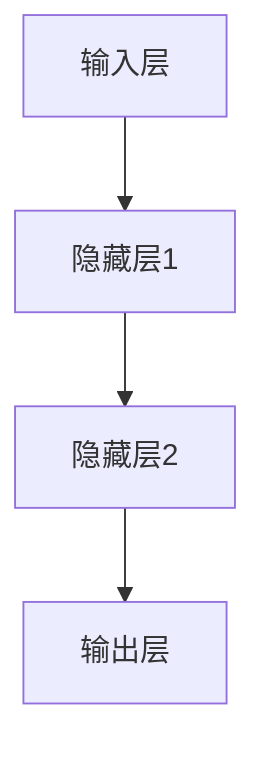
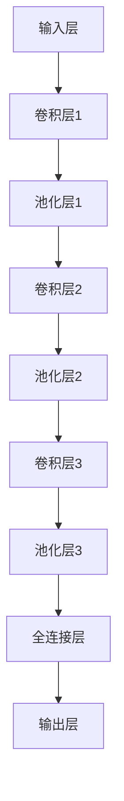

                 

# 文章标题：人工神经网络的优化

> 关键词：人工神经网络、优化、激活函数、正则化、深度学习、强化学习

> 摘要：本文将深入探讨人工神经网络的优化，包括引言与基础、人工神经网络的优化方法、人工神经网络的应用以及总结与展望。我们将详细讲解人工神经网络的基本概念、结构、激活函数、优化算法、正则化方法、超参数调优、训练策略，并通过具体案例展示如何在实践中应用这些知识。

----------------------------------------------------------------

## 引言与基础

### 1.1 人工神经网络的发展历程

人工神经网络（Artificial Neural Networks，ANN）起源于1940年代，由心理学家McCulloch和数学家Pitts首次提出。他们提出了简单的神经元模型，作为模拟生物神经网络的基础。此后，人工神经网络的研究经历了多个阶段，包括早期的感知机（Perceptron）、多层感知机（MLP）以及深度学习（Deep Learning）的发展。

在1980年代，由于计算能力的限制，人工神经网络的研究进入低潮期。然而，随着计算机技术的发展，尤其是在2000年代初期，深度学习再次崛起，带动了人工神经网络的研究和应用。近年来，随着大数据和计算能力的提升，人工神经网络在图像识别、自然语言处理、语音识别等领域的应用取得了显著成果。

### 1.2 人工神经网络的基本概念

人工神经网络是由大量简单的神经元通过非线性激活函数连接而成的复杂网络。每个神经元接收多个输入，通过加权求和处理产生输出。人工神经网络的基本组件包括：

- **神经元**：模拟生物神经元的简单计算单元，接收输入并产生输出。
- **层**：神经网络中的一组神经元，通常包括输入层、隐藏层和输出层。
- **权重**：神经元之间的连接强度，通过训练动态调整。
- **偏置**：每个神经元的偏置项，用于调整输出值。
- **激活函数**：非线性函数，用于引入非线性特性，使神经网络具有分类或回归能力。

### 1.3 人工神经网络的分类

人工神经网络可以根据结构和功能进行分类：

- **前馈神经网络（Feedforward Neural Networks）**：信息从输入层流向输出层，没有循环结构。
- **循环神经网络（Recurrent Neural Networks，RNN）**：具有循环结构，能够处理序列数据。
- **卷积神经网络（Convolutional Neural Networks，CNN）**：专门用于处理图像数据，利用卷积操作提取特征。
- **生成对抗网络（Generative Adversarial Networks，GAN）**：由生成器和判别器两个神经网络组成的对抗性网络，用于生成逼真的数据。

----------------------------------------------------------------

### 2.1 神经元模型

神经元模型是人工神经网络的基本计算单元。一个简单的神经元模型通常包含以下几个部分：

- **输入**：多个输入信号，通常为实数。
- **权重**：与每个输入信号相对应的权重，用于表示输入信号的重要性。
- **偏置**：一个常数项，用于调整输出值。
- **激活函数**：用于引入非线性特性，常见的激活函数包括Sigmoid函数、ReLU函数和Tanh函数。

神经元模型的计算过程可以表示为：

$$
Z = \sum_{i=1}^{n} w_{i}x_{i} + b
$$

其中，$Z$是神经元的净输入，$w_{i}$是权重，$x_{i}$是输入信号，$b$是偏置。

$$
a = f(Z)
$$

其中，$a$是神经元的输出，$f$是激活函数。

在人工神经网络中，神经元通常按照层次结构排列，形成多层网络。每个层次上的神经元接收前一层次神经元的输出作为输入，并传递到下一层次。

神经元模型的核心在于权重和偏置的动态调整。通过反向传播算法，神经网络能够根据损失函数调整权重和偏置，从而优化网络性能。

### 2.2 神经网络的基本结构

神经网络的基本结构通常包括输入层、隐藏层和输出层。每个层次上的神经元通过权重连接形成网络。

- **输入层**：接收外部输入数据，通常不包含激活函数。
- **隐藏层**：多层隐藏层，用于提取特征和传递信息。隐藏层的神经元通过权重连接，并使用激活函数引入非线性特性。
- **输出层**：产生最终输出结果，根据应用场景选择适当的激活函数。

神经网络的层次结构如图所示：



隐藏层的数量和神经元数量可以根据具体问题进行调整。通常，增加隐藏层的数量可以提高网络的泛化能力，但也会增加计算复杂度。隐藏层的深度和宽度需要通过实验和经验进行优化。

### 2.3 深度学习网络

深度学习网络是人工神经网络的一种扩展，具有多个隐藏层。深度学习网络的层次结构通常包括：

- **输入层**：接收外部输入数据。
- **隐藏层**：多个隐藏层，用于提取特征和传递信息。每个隐藏层通过权重连接。
- **输出层**：产生最终输出结果。

深度学习网络的核心优势在于能够自动提取层次化的特征表示。通过逐层构建网络，深度学习网络能够从原始数据中提取复杂的模式和特征。

常见的深度学习网络包括：

- **卷积神经网络（Convolutional Neural Networks，CNN）**：用于处理图像和视频数据。
- **循环神经网络（Recurrent Neural Networks，RNN）**：用于处理序列数据，如文本和语音。
- **生成对抗网络（Generative Adversarial Networks，GAN）**：用于生成逼真的图像和语音。

深度学习网络通过大量的训练数据和强大的计算能力，能够在各种领域取得优异的性能。深度学习网络在图像识别、自然语言处理、语音识别等领域的应用取得了突破性进展。

----------------------------------------------------------------

### 3.1 激活函数的作用

激活函数是人工神经网络中的一个关键组件，用于引入非线性特性。传统的线性模型在处理复杂问题时往往表现不佳，而激活函数的引入使得神经网络能够在非线性空间中建模和预测。

激活函数的作用主要体现在以下几个方面：

1. **非线性变换**：通过激活函数，神经网络能够在输入和输出之间引入非线性关系。这有助于神经网络捕捉复杂的数据特征和模式。
2. **增加网络表达能力**：激活函数的引入使得神经网络具有更强的表达能力和灵活性，能够处理更广泛的问题。
3. **分类和回归**：对于分类问题，激活函数可以帮助神经网络实现分类决策；对于回归问题，激活函数可以将输出值映射到连续的数值范围。

常见的激活函数包括：

- **Sigmoid函数**：将输入值映射到(0, 1)范围内，常用于二分类问题。
- **ReLU函数**：ReLU（Rectified Linear Unit）函数，将输入值映射到非负实数范围，具有快速收敛和避免梯度消失的优点。
- **Tanh函数**：将输入值映射到(-1, 1)范围内，类似于Sigmoid函数，但输出值范围更广。
- **Softmax函数**：用于多分类问题，将输入值映射到概率分布。

### 3.2 常见激活函数

以下是几种常见激活函数的详细描述：

#### Sigmoid函数

Sigmoid函数是一种常见的激活函数，其表达式为：

$$
f(x) = \frac{1}{1 + e^{-x}}
$$

Sigmoid函数将输入值映射到(0, 1)范围内，具有S形状的曲线。它常用于二分类问题，将神经网络的输出值转化为概率。

#### ReLU函数

ReLU（Rectified Linear Unit）函数是一种线性激活函数，其表达式为：

$$
f(x) = \max(0, x)
$$

ReLU函数将输入值映射到非负实数范围，对于负输入值，输出为0。ReLU函数具有快速收敛和避免梯度消失的优点，因此广泛应用于深度学习网络。

#### Tanh函数

Tanh函数是一种双曲线正切函数，其表达式为：

$$
f(x) = \frac{e^{x} - e^{-x}}{e^{x} + e^{-x}}
$$

Tanh函数将输入值映射到(-1, 1)范围内，类似于Sigmoid函数，但输出值范围更广。Tanh函数在早期的神经网络应用中较为常见，但ReLU函数的兴起使得Tanh函数的使用逐渐减少。

#### Softmax函数

Softmax函数是一种用于多分类问题的激活函数，其表达式为：

$$
f(x)_i = \frac{e^{x_i}}{\sum_{j=1}^{n} e^{x_j}}
$$

其中，$x_i$是第$i$个神经元的输出值，$n$是分类类别数量。Softmax函数将输入值映射到概率分布，每个类别的概率和为1。

### 3.3 激活函数的优化

激活函数的优化对于神经网络的性能至关重要。以下是一些常见的优化策略：

1. **Sigmoid函数的优化**：Sigmoid函数在接近0和1时梯度较小，导致梯度消失问题。为了解决这一问题，可以采用带负偏置的Sigmoid函数，或者使用ReLU函数作为替代。
2. **ReLU函数的优化**：ReLU函数虽然避免了梯度消失问题，但可能导致梯度消失在某些情况下（如输入值接近0）。为了解决这一问题，可以采用Leaky ReLU函数，其表达式为：

$$
f(x) = \max(0.01x, x)
$$

其中，0.01是一个较小的常数。Leaky ReLU函数在接近0时具有较小的斜率，从而避免梯度消失。

3. **Softmax函数的优化**：Softmax函数主要用于多分类问题，但在训练过程中可能会出现梯度值较小的问题。为了解决这一问题，可以采用交叉熵损失函数作为替代，或者调整学习率。

激活函数的优化是神经网络研究的一个重要方向，通过合理选择和调整激活函数，可以提高神经网络的性能和收敛速度。

----------------------------------------------------------------

### 4.1 前向传播算法

前向传播算法是人工神经网络中的一个基本过程，用于计算网络在给定输入下的输出。前向传播算法的主要步骤如下：

1. **初始化**：设置网络的初始参数，包括权重和偏置。这些参数通常通过随机初始化或预训练得到。
2. **计算输入**：输入数据通过输入层传递到网络中。输入层中的每个神经元接收一个输入值，并传递给下一层的神经元。
3. **计算中间层输出**：每一层的神经元通过加权求和并应用激活函数，计算输出值。这些输出值作为下一层的输入。
4. **计算输出层输出**：最终输出层的神经元计算输出值，这些值即为网络的预测结果。
5. **计算损失**：计算预测结果与真实标签之间的误差，通常使用均方误差（MSE）或交叉熵损失函数。
6. **更新参数**：根据误差梯度，通过反向传播算法更新网络的权重和偏置。

前向传播算法的伪代码如下：

```python
算法名称：前向传播算法
输入：输入层、隐藏层、输出层、权重、激活函数
输出：输出层输出值

前向传播算法步骤：
1. 初始化输入层输入值
2. 遍历隐藏层，计算每一层的输出值
3. 遍历输出层，计算每一层的输出值
4. 返回输出层输出值
```

以下是前向传播算法的实现示例：

```python
import numpy as np

def forward_propagation(x, weights, biases, activation_functions):
    inputs = x
    outputs = []
    
    for i in range(len(weights)):
        z = np.dot(inputs, weights[i]) + biases[i]
        outputs.append(activation_functions[i](z))
        inputs = outputs[-1]
    
    return outputs[-1]

# 示例数据
x = np.array([1.0, 2.0, 3.0])
weights = [np.random.rand(3, 3), np.random.rand(3, 3), np.random.rand(3, 1)]
biases = [np.random.rand(3), np.random.rand(3), np.random.rand(1)]
activation_functions = [np.tanh, np.tanh, np.sigmoid]

# 前向传播
output = forward_propagation(x, weights, biases, activation_functions)
print("输出值：", output)
```

在前向传播过程中，输入数据通过网络逐层传递，经过加权求和和激活函数处理后，最终得到输出层输出值。这个过程是神经网络训练和预测的基础。

### 4.2 反向传播算法

反向传播算法是人工神经网络训练过程中的关键步骤，用于计算网络参数（权重和偏置）的梯度。反向传播算法的核心思想是通过从输出层反向传播误差，逐步更新网络中的参数。以下是反向传播算法的主要步骤：

1. **计算输出误差**：计算输出层预测值与真实标签之间的误差。对于回归问题，通常使用均方误差（MSE）；对于分类问题，通常使用交叉熵损失函数。
2. **计算梯度**：根据误差函数对网络参数求梯度。梯度反映了参数对误差的影响程度，用于指导参数的更新。
3. **反向传播**：从输出层开始，逐层反向传播误差和梯度。每一层的梯度计算依赖于前一层的梯度。
4. **更新参数**：根据梯度更新网络参数。常用的优化算法包括梯度下降、动量法、Adam优化器等。

反向传播算法的伪代码如下：

```python
算法名称：反向传播算法
输入：输入层、隐藏层、输出层、权重、偏置、激活函数、激活函数的导数、误差函数、误差函数的导数
输出：更新后的权重和偏置

反向传播算法步骤：
1. 计算输出误差
2. 计算输出层梯度
3. 反向传播，计算隐藏层梯度
4. 更新权重和偏置
5. 返回更新后的权重和偏置
```

以下是反向传播算法的实现示例：

```python
import numpy as np

def backward_propagation(x, y, weights, biases, activation_functions, activation_derivatives, error_function, error_derivatives):
    m = x.shape[1]
    gradients = []
    
    # 计算输出误差
    output_error = error_function(y, weights[-1].dot(activation_functions[-1](biases[-1])))
    
    # 计算输出层梯度
    dZ = activation_derivatives[-1](biases[-1]) * output_error
    dW = np.dot(dZ.T, x)
    db = np.sum(dZ, axis=1, keepdims=True)
    
    # 反向传播，计算隐藏层梯度
    for i in range(len(weights) - 2, -1, -1):
        dZ = activation_derivatives[i](biases[i]) * np.dot(dZ, weights[i].T)
        dW = np.dot(dZ.T, x)
        db = np.sum(dZ, axis=1, keepdims=True)
        
        # 更新权重和偏置
        gradients.append((dW, db))
    
    # 更新权重和偏置
    for i in range(len(weights)):
        weights[i] -= learning_rate * gradients[i][0]
        biases[i] -= learning_rate * gradients[i][1]
    
    return weights, biases

# 示例数据
x = np.array([[1.0, 2.0, 3.0], [4.0, 5.0, 6.0]])
y = np.array([[0.0, 1.0], [1.0, 0.0]])
weights = [np.random.rand(3, 3), np.random.rand(3, 3), np.random.rand(2, 1)]
biases = [np.random.rand(3), np.random.rand(3), np.random.rand(2)]
activation_functions = [np.tanh, np.tanh, np.sigmoid]
activation_derivatives = [np deriv of tanh, np deriv of tanh, np deriv of sigmoid]
error_function = np.mean_squared_error
error_derivatives = np deriv of mean_squared_error

# 反向传播
weights, biases = backward_propagation(x, y, weights, biases, activation_functions, activation_derivatives, error_function, error_derivatives)
print("更新后的权重：", weights)
print("更新后的偏置：", biases)
```

反向传播算法通过计算误差的梯度，逐步更新网络参数，从而优化网络性能。这个过程在神经网络训练过程中反复进行，直到网络达到预期的性能。

### 4.3 学习率与优化器

学习率是神经网络训练过程中的一个重要参数，用于控制参数更新的幅度。学习率的选择对网络的收敛速度和性能有很大影响。

- **过小**：学习率过小会导致网络收敛速度缓慢，参数更新幅度不足，可能导致训练时间过长。
- **过大**：学习率过大可能导致网络在训练过程中出现振荡，甚至导致梯度消失或梯度爆炸，影响网络性能。

为了选择合适的学习率，可以采用以下策略：

1. **初始学习率**：从较大的学习率开始，逐步减小学习率，观察网络性能的变化。
2. **学习率衰减**：在训练过程中，学习率随着训练轮数的增加而逐渐减小，以保持网络的稳定性。
3. **自适应学习率**：使用自适应优化器（如Adam），优化器会自动调整学习率，以适应不同阶段的训练。

常见的优化器包括：

1. **梯度下降（Gradient Descent）**：最简单的优化器，通过计算损失函数的梯度更新参数。
2. **动量法（Momentum）**：在梯度下降的基础上，引入动量项，加速收敛速度。
3. **Adam优化器**：结合了梯度下降和动量法，具有自适应学习率，适用于大规模深度学习网络。

选择合适的优化器和学习率对于神经网络训练的成败至关重要。在实际应用中，可以通过实验和经验来选择最佳参数。

----------------------------------------------------------------

### 5.1 随机梯度下降（SGD）

随机梯度下降（Stochastic Gradient Descent，SGD）是一种优化算法，用于训练人工神经网络。SGD通过对每个样本进行一次梯度更新来优化模型参数，从而加快收敛速度。

#### 工作原理

SGD的基本思想是将整个训练数据集分成多个小批量（Batch），然后在每个批量上计算梯度，并更新模型参数。具体步骤如下：

1. **初始化模型参数**：随机初始化模型参数，包括权重和偏置。
2. **选择批量大小**：选择一个较小的批量大小（例如，32或64），以减少计算量和噪声。
3. **计算梯度**：对于每个批量，计算损失函数关于模型参数的梯度。
4. **更新参数**：使用学习率乘以梯度，更新模型参数。
5. **重复步骤3-4**：对整个数据集进行多次迭代，直到达到预定的训练轮数或性能目标。

#### 优点

- **快速收敛**：SGD通过随机批量更新参数，减少了局部最小值和鞍点的影响，加快了收敛速度。
- **灵活性**：SGD可以处理大规模数据集，适用于稀疏数据和在线学习。
- **易于实现**：SGD算法简单，易于实现和调试。

#### 缺点

- **噪声影响**：由于随机批量的影响，SGD可能引入噪声，导致训练结果不稳定。
- **稀疏数据问题**：对于稀疏数据，SGD可能难以学习有效的特征表示。

#### 实现示例

以下是使用SGD优化神经网络的一个简单示例：

```python
import numpy as np

# 初始化模型参数
weights = np.random.rand(n_features, n_classes)
bias = np.random.rand(n_classes)

# 学习率
learning_rate = 0.01

# 训练数据
X_train = np.random.rand(n_samples, n_features)
y_train = np.random.rand(n_samples, n_classes)

# 训练模型
for epoch in range(n_epochs):
    for i in range(n_samples):
        # 计算梯度
        gradient_weights = 2 * (y_train[i] - X_train[i].dot(weights) - bias)
        gradient_bias = 2 * (y_train[i] - X_train[i].dot(weights) - bias)
        
        # 更新参数
        weights -= learning_rate * gradient_weights
        bias -= learning_rate * gradient_bias
    
    # 打印训练进度
    if epoch % 100 == 0:
        print("Epoch", epoch, "Loss:", compute_loss(X_train, y_train, weights, bias))
```

在这个示例中，我们使用随机梯度下降算法训练一个简单的神经网络，输入和标签都是随机生成的。通过多次迭代，模型参数逐步优化，以最小化损失函数。

### 5.2 动量法（Momentum）

动量法（Momentum）是一种优化算法，用于加速梯度下降的收敛速度。动量法通过引入动量项，将前一次更新的方向和大小传递到当前更新中。

#### 工作原理

动量法的基本思想是将梯度乘以一个动量因子，用于加速梯度的更新。具体步骤如下：

1. **初始化动量**：初始化动量为0。
2. **计算梯度**：对于每个样本，计算损失函数关于模型参数的梯度。
3. **更新动量**：将当前梯度乘以动量因子，并加上前一次的动量。
4. **更新参数**：使用学习率乘以动量，更新模型参数。
5. **重复步骤2-4**：对整个数据集进行多次迭代，直到达到预定的训练轮数或性能目标。

#### 优点

- **加速收敛**：动量法通过将前一次更新的方向和大小传递到当前更新，加速了梯度下降的收敛速度。
- **减少振荡**：动量法有助于减少训练过程中的振荡，提高稳定性。

#### 缺点

- **延迟更新**：动量法引入了延迟更新，可能导致收敛速度较慢。
- **计算复杂度**：动量法需要额外的计算来更新动量项。

#### 实现示例

以下是使用动量法优化神经网络的一个简单示例：

```python
import numpy as np

# 初始化模型参数
weights = np.random.rand(n_features, n_classes)
bias = np.random.rand(n_classes)

# 学习率和动量因子
learning_rate = 0.01
momentum = 0.9

# 训练数据
X_train = np.random.rand(n_samples, n_features)
y_train = np.random.rand(n_samples, n_classes)

# 动量变量
velocity_weights = np.zeros_like(weights)
velocity_bias = np.zeros_like(bias)

# 训练模型
for epoch in range(n_epochs):
    for i in range(n_samples):
        # 计算梯度
        gradient_weights = 2 * (y_train[i] - X_train[i].dot(weights) - bias)
        gradient_bias = 2 * (y_train[i] - X_train[i].dot(weights) - bias)
        
        # 更新动量
        velocity_weights = momentum * velocity_weights + learning_rate * gradient_weights
        velocity_bias = momentum * velocity_bias + learning_rate * gradient_bias
        
        # 更新参数
        weights -= velocity_weights
        bias -= velocity_bias
    
    # 打印训练进度
    if epoch % 100 == 0:
        print("Epoch", epoch, "Loss:", compute_loss(X_train, y_train, weights, bias))
```

在这个示例中，我们使用动量法训练一个简单的神经网络。通过引入动量因子，模型参数的更新方向和大小得到了加速，提高了收敛速度。

### 5.3 Adam优化器

Adam优化器是一种自适应矩估计（Adaptive Moment Estimation）算法，结合了梯度下降和动量法的优点。Adam优化器通过自适应调整学习率和动量项，提高了梯度下降的收敛速度和稳定性。

#### 工作原理

Adam优化器的基本思想是同时考虑一阶矩（均值）和二阶矩（方差）的估计。具体步骤如下：

1. **初始化**：初始化一阶矩估计（$\text{m}_t$）和二阶矩估计（$\text{v}_t$）为0。
2. **计算梯度**：对于每个样本，计算损失函数关于模型参数的梯度。
3. **更新一阶矩估计**：将当前梯度累加到一阶矩估计上。
4. **更新二阶矩估计**：将当前梯度的平方累加到二阶矩估计上。
5. **计算偏差修正**：对一阶矩估计和二阶矩估计进行偏差修正。
6. **计算更新**：使用学习率乘以一阶矩估计的归一化结果减去二阶矩估计的归一化结果的平方根，更新模型参数。
7. **重复步骤2-6**：对整个数据集进行多次迭代，直到达到预定的训练轮数或性能目标。

#### 优点

- **自适应学习率**：Adam优化器能够自适应调整学习率，提高了收敛速度和稳定性。
- **灵活性好**：Adam优化器适用于各种规模和数据类型的神经网络。
- **易于实现**：Adam优化器算法简单，易于实现和调试。

#### 缺点

- **计算复杂度较高**：Adam优化器需要额外的计算来更新一阶矩估计和二阶矩估计。
- **方差较大**：在噪声较大的数据集上，Adam优化器的性能可能较差。

#### 实现示例

以下是使用Adam优化器优化神经网络的一个简单示例：

```python
import numpy as np

# 初始化模型参数
weights = np.random.rand(n_features, n_classes)
bias = np.random.rand(n_classes)

# 学习率、一阶矩估计和二阶矩估计
learning_rate = 0.01
beta1 = 0.9
beta2 = 0.999
epsilon = 1e-8

# 训练数据
X_train = np.random.rand(n_samples, n_features)
y_train = np.random.rand(n_samples, n_classes)

# 初始化一阶矩估计和二阶矩估计
m = np.zeros_like(weights)
v = np.zeros_like(weights)
m_hat = np.zeros_like(weights)
v_hat = np.zeros_like(weights)
velocity_weights = np.zeros_like(weights)
velocity_bias = np.zeros_like(bias)

# 训练模型
for epoch in range(n_epochs):
    for i in range(n_samples):
        # 计算梯度
        gradient_weights = 2 * (y_train[i] - X_train[i].dot(weights) - bias)
        gradient_bias = 2 * (y_train[i] - X_train[i].dot(weights) - bias)
        
        # 更新一阶矩估计
        m = beta1 * m + (1 - beta1) * gradient_weights
        v = beta2 * v + (1 - beta2) * gradient_weights ** 2
        
        # 偏差修正
        m_hat = m / (1 - beta1 ** epoch)
        v_hat = v / (1 - beta2 ** epoch)
        
        # 更新一阶矩估计和二阶矩估计
        velocity_weights = learning_rate * m_hat / (np.sqrt(v_hat) + epsilon)
        velocity_bias = learning_rate * m_hat / (np.sqrt(v_hat) + epsilon)
        
        # 更新参数
        weights -= velocity_weights
        bias -= velocity_bias
    
    # 打印训练进度
    if epoch % 100 == 0:
        print("Epoch", epoch, "Loss:", compute_loss(X_train, y_train, weights, bias))
```

在这个示例中，我们使用Adam优化器训练一个简单的神经网络。通过自适应调整学习率和动量项，模型参数的更新方向和大小得到了优化，提高了收敛速度和稳定性。

----------------------------------------------------------------

### 6.1 权重衰减（Weight Decay）

权重衰减（Weight Decay），也称为L2正则化（L2 Regularization），是一种常用的正则化方法，用于防止神经网络模型在训练过程中过拟合。权重衰减通过在损失函数中引入一个与权重平方成正比的惩罚项，来限制权重的增长。

#### 工作原理

权重衰减的基本思想是在损失函数中添加一个正则化项，以降低权重的大小。具体步骤如下：

1. **计算损失**：使用前向传播算法计算输出层的预测值，并计算损失函数（如均方误差或交叉熵损失函数）。
2. **添加正则化项**：将权重衰减项添加到损失函数中。权重衰减项通常为$ \lambda \sum_{i=1}^{n} w_i^2 $，其中$\lambda$为权重衰减系数，$w_i$为每个权重的值。
3. **计算总损失**：将正则化项加到原始损失上，得到总损失。
4. **更新参数**：使用反向传播算法更新参数，包括权重和偏置。

#### 数学公式

权重衰减的损失函数可以表示为：

$$
L(\theta) = J(\theta) + \lambda \sum_{i=1}^{n} w_i^2
$$

其中，$L(\theta)$为总损失，$J(\theta)$为原始损失函数，$\lambda$为权重衰减系数，$w_i$为每个权重的值。

在反向传播过程中，权重衰减的梯度计算为：

$$
\frac{\partial L}{\partial w_i} = \frac{\partial J}{\partial w_i} + 2\lambda w_i
$$

其中，$\frac{\partial L}{\partial w_i}$为权重衰减的梯度，$\frac{\partial J}{\partial w_i}$为原始损失函数的梯度。

#### 优点

- **防止过拟合**：权重衰减通过限制权重的大小，减少了模型对训练数据的依赖，从而防止过拟合。
- **稳定训练**：权重衰减有助于稳定训练过程，减少模型在训练过程中的振荡。

#### 缺点

- **增加计算复杂度**：权重衰减引入了额外的计算量，需要计算每个权重的平方和。
- **可能导致梯度消失**：在权重衰减较大时，梯度可能减小到无法更新的程度，导致训练困难。

#### 实现示例

以下是使用权重衰减的正则化方法的一个简单示例：

```python
import numpy as np

# 初始化模型参数
weights = np.random.rand(n_features, n_classes)
bias = np.random.rand(n_classes)

# 学习率和权重衰减系数
learning_rate = 0.01
weight_decay = 0.001

# 训练数据
X_train = np.random.rand(n_samples, n_features)
y_train = np.random.rand(n_samples, n_classes)

# 训练模型
for epoch in range(n_epochs):
    for i in range(n_samples):
        # 计算梯度
        gradient_weights = 2 * (y_train[i] - X_train[i].dot(weights) - bias) * X_train[i]
        gradient_bias = 2 * (y_train[i] - X_train[i].dot(weights) - bias)
        
        # 更新梯度
        gradient_weights += 2 * weight_decay * weights
        gradient_bias += 2 * weight_decay * bias
        
        # 更新参数
        weights -= learning_rate * gradient_weights
        bias -= learning_rate * gradient_bias
    
    # 打印训练进度
    if epoch % 100 == 0:
        print("Epoch", epoch, "Loss:", compute_loss(X_train, y_train, weights, bias))
```

在这个示例中，我们使用权重衰减方法训练一个简单的神经网络。通过在损失函数中添加权重衰减项，模型参数的更新受到限制，有助于防止过拟合。

### 6.2 岭回归（Ridge Regression）

岭回归（Ridge Regression）是一种线性回归的正则化方法，通过在损失函数中引入一个与权重绝对值成正比的惩罚项，来降低模型的方差。

#### 工作原理

岭回归的基本思想是在损失函数中添加一个正则化项，以限制权重的大小。具体步骤如下：

1. **计算损失**：使用前向传播算法计算输出层的预测值，并计算损失函数（如均方误差）。
2. **添加正则化项**：将岭回归项添加到损失函数中。岭回归项通常为$ \lambda \sum_{i=1}^{n} w_i $，其中$\lambda$为岭回归系数，$w_i$为每个权重的值。
3. **计算总损失**：将正则化项加到原始损失上，得到总损失。
4. **更新参数**：使用梯度下降算法更新参数，包括权重和偏置。

#### 数学公式

岭回归的损失函数可以表示为：

$$
L(\theta) = J(\theta) + \lambda \sum_{i=1}^{n} w_i
$$

其中，$L(\theta)$为总损失，$J(\theta)$为原始损失函数，$\lambda$为岭回归系数，$w_i$为每个权重的值。

在反向传播过程中，岭回归的梯度计算为：

$$
\frac{\partial L}{\partial w_i} = \frac{\partial J}{\partial w_i} + \lambda
$$

其中，$\frac{\partial L}{\partial w_i}$为岭回归的梯度，$\frac{\partial J}{\partial w_i}$为原始损失函数的梯度。

#### 优点

- **减少方差**：岭回归通过限制权重的大小，降低了模型的方差，提高了模型的稳定性。
- **防止过拟合**：岭回归有助于减少模型对训练数据的依赖，从而防止过拟合。

#### 缺点

- **计算复杂度较高**：岭回归需要计算每个权重的绝对值和累加，增加了计算复杂度。
- **不能处理非线性问题**：岭回归适用于线性回归问题，无法处理非线性问题。

#### 实现示例

以下是使用岭回归方法的一个简单示例：

```python
import numpy as np

# 初始化模型参数
weights = np.random.rand(n_features, n_classes)
bias = np.random.rand(n_classes)

# 学习率和岭回归系数
learning_rate = 0.01
lambda_param = 0.01

# 训练数据
X_train = np.random.rand(n_samples, n_features)
y_train = np.random.rand(n_samples, n_classes)

# 训练模型
for epoch in range(n_epochs):
    for i in range(n_samples):
        # 计算梯度
        gradient_weights = 2 * (y_train[i] - X_train[i].dot(weights) - bias) * X_train[i]
        gradient_bias = 2 * (y_train[i] - X_train[i].dot(weights) - bias)
        
        # 更新梯度
        gradient_weights += lambda_param
        
        # 更新参数
        weights -= learning_rate * gradient_weights
        bias -= learning_rate * gradient_bias
    
    # 打印训练进度
    if epoch % 100 == 0:
        print("Epoch", epoch, "Loss:", compute_loss(X_train, y_train, weights, bias))
```

在这个示例中，我们使用岭回归方法训练一个简单的神经网络。通过在损失函数中添加岭回归项，模型参数的更新受到限制，有助于减少模型的方差和防止过拟合。

### 6.3 L1正则化（Lasso）

L1正则化（Lasso Regularization）是一种线性回归的正则化方法，通过在损失函数中引入一个与权重绝对值成正比的惩罚项，来降低模型的方差。

#### 工作原理

L1正则化与岭回归类似，不同之处在于惩罚项的形式。L1正则化使用绝对值函数，使得一些权重可能变为0，从而实现特征选择。具体步骤如下：

1. **计算损失**：使用前向传播算法计算输出层的预测值，并计算损失函数（如均方误差）。
2. **添加正则化项**：将L1正则化项添加到损失函数中。L1正则化项通常为$ \lambda \sum_{i=1}^{n} |w_i| $，其中$\lambda$为L1正则化系数，$w_i$为每个权重的值。
3. **计算总损失**：将正则化项加到原始损失上，得到总损失。
4. **更新参数**：使用梯度下降算法更新参数，包括权重和偏置。

#### 数学公式

L1正则化的损失函数可以表示为：

$$
L(\theta) = J(\theta) + \lambda \sum_{i=1}^{n} |w_i|
$$

其中，$L(\theta)$为总损失，$J(\theta)$为原始损失函数，$\lambda$为L1正则化系数，$w_i$为每个权重的值。

在反向传播过程中，L1正则化的梯度计算为：

$$
\frac{\partial L}{\partial w_i} = \frac{\partial J}{\partial w_i} + \lambda \text{sign}(w_i)
$$

其中，$\frac{\partial L}{\partial w_i}$为L1正则化的梯度，$\frac{\partial J}{\partial w_i}$为原始损失函数的梯度，$\text{sign}(w_i)$为权重的符号函数。

#### 优点

- **特征选择**：L1正则化通过引入绝对值函数，使得一些权重可能变为0，从而实现特征选择。
- **减少方差**：L1正则化有助于减少模型的方差，提高模型的稳定性。

#### 缺点

- **计算复杂度较高**：L1正则化需要计算每个权重的绝对值和累加，增加了计算复杂度。
- **不能处理非线性问题**：L1正则化适用于线性回归问题，无法处理非线性问题。

#### 实现示例

以下是使用L1正则化方法的一个简单示例：

```python
import numpy as np

# 初始化模型参数
weights = np.random.rand(n_features, n_classes)
bias = np.random.rand(n_classes)

# 学习率和L1正则化系数
learning_rate = 0.01
lambda_param = 0.01

# 训练数据
X_train = np.random.rand(n_samples, n_features)
y_train = np.random.rand(n_samples, n_classes)

# 训练模型
for epoch in range(n_epochs):
    for i in range(n_samples):
        # 计算梯度
        gradient_weights = 2 * (y_train[i] - X_train[i].dot(weights) - bias) * X_train[i]
        gradient_bias = 2 * (y_train[i] - X_train[i].dot(weights) - bias)
        
        # 更新梯度
        gradient_weights += lambda_param * np.sign(weights)
        
        # 更新参数
        weights -= learning_rate * gradient_weights
        bias -= learning_rate * gradient_bias
    
    # 打印训练进度
    if epoch % 100 == 0:
        print("Epoch", epoch, "Loss:", compute_loss(X_train, y_train, weights, bias))
```

在这个示例中，我们使用L1正则化方法训练一个简单的神经网络。通过在损失函数中添加L1正则化项，模型参数的更新受到限制，有助于实现特征选择和减少模型的方差。

### 6.4 Dropout

Dropout是一种用于防止神经网络过拟合的正则化方法。Dropout通过随机丢弃神经元及其连接，减少了网络的复杂性和过拟合倾向。

#### 工作原理

Dropout的基本思想是在训练过程中随机丢弃一部分神经元及其连接。具体步骤如下：

1. **初始化模型参数**：随机初始化模型参数，包括权重和偏置。
2. **训练过程**：在每次前向传播后，按照一定的概率（如0.5）随机丢弃隐藏层和输出层的神经元及其连接。
3. **计算梯度**：在反向传播过程中，丢弃的神经元不会计算梯度，从而减少梯度的影响。
4. **更新参数**：在训练结束后，根据未丢弃的神经元和计算得到的梯度，更新模型参数。

#### 优点

- **防止过拟合**：Dropout通过随机丢弃神经元，减少了网络的复杂性和过拟合倾向。
- **增强泛化能力**：Dropout有助于提高网络的泛化能力，使其在未知数据上的表现更好。

#### 缺点

- **计算复杂度增加**：Dropout增加了计算复杂度，需要额外的存储空间来保存丢弃的概率。
- **可能影响收敛速度**：在训练过程中，Dropout可能导致网络收敛速度变慢。

#### 实现示例

以下是使用Dropout方法的一个简单示例：

```python
import numpy as np

# 初始化模型参数
weights = np.random.rand(n_features, n_classes)
bias = np.random.rand(n_classes)

# 学习率和丢弃概率
learning_rate = 0.01
dropout_rate = 0.5

# 训练数据
X_train = np.random.rand(n_samples, n_features)
y_train = np.random.rand(n_samples, n_classes)

# 训练模型
for epoch in range(n_epochs):
    for i in range(n_samples):
        # 计算梯度
        gradient_weights = 2 * (y_train[i] - X_train[i].dot(weights) - bias) * X_train[i]
        gradient_bias = 2 * (y_train[i] - X_train[i].dot(weights) - bias)
        
        # 应用Dropout
        dropout_mask = np.random.rand(*weights.shape) > dropout_rate
        weights *= dropout_mask
        bias *= dropout_mask
        
        # 更新参数
        weights -= learning_rate * gradient_weights
        bias -= learning_rate * gradient_bias
    
    # 打印训练进度
    if epoch % 100 == 0:
        print("Epoch", epoch, "Loss:", compute_loss(X_train, y_train, weights, bias))
```

在这个示例中，我们使用Dropout方法训练一个简单的神经网络。通过在训练过程中随机丢弃神经元，网络复杂度得到降低，有助于防止过拟合。

----------------------------------------------------------------

### 7.1 学习率的调整

学习率是神经网络训练过程中的一个重要参数，用于控制参数更新的幅度。选择合适的学习率对于网络的收敛速度和性能至关重要。以下是一些常见的学习率调整策略：

#### 1. 初始学习率选择

初始学习率的选择对训练过程的影响较大。通常，初始学习率可以设置为一个较小的值，如$10^{-3}$或$10^{-4}$。这样可以保证网络在训练初期能够逐渐适应数据，避免过大步长导致训练不稳定。

#### 2. 学习率衰减

学习率衰减是一种常用的学习率调整策略，通过在训练过程中逐渐减小学习率，以保持网络的稳定性。学习率衰减可以采用以下几种方法：

- **固定衰减**：在每完成一定的训练轮数后，将学习率乘以一个固定的衰减因子。例如，每完成10个轮次，学习率衰减为原来的$\frac{1}{10}$。

- **指数衰减**：学习率以指数方式逐渐减小。例如，每完成一个轮次，学习率衰减为原来的$\frac{1}{e}$。

- **学习率衰减因子**：设置一个学习率衰减因子，在每次更新参数后乘以该因子。例如，每次更新后，学习率乘以0.99。

#### 3. 自适应学习率

自适应学习率策略通过动态调整学习率，以适应训练过程中的不同阶段。以下是一些常见的自适应学习率策略：

- **Adam优化器**：Adam优化器具有自适应学习率，通过计算一阶矩估计和二阶矩估计，自适应调整学习率。

- **Adadelta优化器**：Adadelta优化器通过计算梯度历史和梯度的平方历史，自适应调整学习率。

- **Adagrad优化器**：Adagrad优化器通过计算梯度历史，自适应调整学习率。

#### 4. 学习率调整技巧

以下是一些学习率调整的技巧：

- **分段学习率**：根据训练阶段的不同，设置不同的学习率。例如，在训练初期使用较大的学习率，以便快速收敛；在训练后期使用较小的学习率，以避免过拟合。

- **学习率乘法调整**：在每次更新后，将学习率乘以一个较小的系数，如0.9或0.99，以逐渐减小学习率。

- **手动调整**：通过实验和经验调整学习率。根据网络的性能和训练过程中的变化，手动调整学习率。

#### 实现示例

以下是使用不同学习率策略的简单示例：

```python
import numpy as np

# 初始化模型参数
weights = np.random.rand(n_features, n_classes)
bias = np.random.rand(n_classes)

# 学习率和学习率衰减因子
learning_rate = 0.01
learning_rate_decay = 0.99

# 训练数据
X_train = np.random.rand(n_samples, n_features)
y_train = np.random.rand(n_samples, n_classes)

# 训练模型
for epoch in range(n_epochs):
    for i in range(n_samples):
        # 计算梯度
        gradient_weights = 2 * (y_train[i] - X_train[i].dot(weights) - bias) * X_train[i]
        gradient_bias = 2 * (y_train[i] - X_train[i].dot(weights) - bias)
        
        # 更新学习率
        learning_rate *= learning_rate_decay
        
        # 更新参数
        weights -= learning_rate * gradient_weights
        bias -= learning_rate * gradient_bias
    
    # 打印训练进度
    if epoch % 100 == 0:
        print("Epoch", epoch, "Loss:", compute_loss(X_train, y_train, weights, bias))
```

在这个示例中，我们使用学习率衰减策略训练一个简单的神经网络。通过在每个轮次后逐渐减小学习率，网络性能得到稳定。

### 7.2 批量大小（Batch Size）的选择

批量大小（Batch Size）是神经网络训练过程中的一个重要参数，用于控制每次梯度更新的样本数量。选择合适的批量大小对于网络的收敛速度和性能有很大影响。以下是一些关于批量大小选择的策略：

#### 1. 批量大小的影响

- **小批量**：小批量（如32或64）的梯度计算较为准确，能够减少噪声的影响，提高模型的泛化能力。但小批量训练的计算量和内存需求较大。

- **大批量**：大批量（如256或512）的梯度计算速度较快，能够减少计算时间。但大批量训练可能导致梯度噪声增加，降低模型的泛化能力。

#### 2. 批量大小选择策略

以下是一些批量大小选择策略：

- **实验法**：通过实验和经验，尝试不同的批量大小，观察网络性能的变化，选择最优的批量大小。

- **交叉验证**：使用交叉验证方法，在不同批量大小下评估模型的性能，选择性能最好的批量大小。

- **计算资源限制**：根据计算资源限制，选择合适的批量大小。在计算资源有限的情况下，可以选择较小的批量大小。

- **问题特定**：针对不同的问题和数据集，选择不同的批量大小。例如，对于小数据集，可以选择较小的批量大小；对于大数据集，可以选择较大的批量大小。

#### 3. 批量大小选择示例

以下是使用不同批量大小的简单示例：

```python
import numpy as np

# 初始化模型参数
weights = np.random.rand(n_features, n_classes)
bias = np.random.rand(n_classes)

# 批量大小和迭代次数
batch_size = 32
epochs = 100

# 训练数据
X_train = np.random.rand(n_samples, n_features)
y_train = np.random.rand(n_samples, n_classes)

# 训练模型
for epoch in range(epochs):
    for i in range(0, n_samples, batch_size):
        batch_X = X_train[i:i+batch_size]
        batch_y = y_train[i:i+batch_size]
        
        # 计算梯度
        gradient_weights = 2 * (batch_y - batch_X.dot(weights) - bias) * batch_X
        gradient_bias = 2 * (batch_y - batch_X.dot(weights) - bias)
        
        # 更新参数
        weights -= gradient_weights
        bias -= gradient_bias
    
    # 打印训练进度
    if epoch % 10 == 0:
        print("Epoch", epoch, "Loss:", compute_loss(X_train, y_train, weights, bias))
```

在这个示例中，我们使用不同的批量大小训练一个简单的神经网络。通过在每次迭代中计算不同批量大小的梯度并更新参数，观察不同批量大小对网络性能的影响。

### 7.3 训练集与验证集划分

在神经网络训练过程中，训练集与验证集的划分是关键步骤，用于评估模型的性能和防止过拟合。以下是一些关于训练集与验证集划分的策略：

#### 1. 划分方法

以下是一些常见的训练集与验证集划分方法：

- **随机划分**：将数据集随机划分为训练集和验证集，每个样本都有相同的概率被划分到训练集或验证集。

- **分层划分**：如果数据集中存在多个类别，可以按照类别比例划分训练集和验证集，以保持类别比例的一致性。

- **交叉验证**：使用交叉验证方法，将数据集划分为多个子集，在每个子集上分别训练模型并在其余子集上验证模型，取平均性能作为最终评估结果。

#### 2. 划分策略

以下是一些划分策略：

- **比例划分**：根据数据集的大小，选择一定的比例（如80%训练集，20%验证集）划分训练集和验证集。

- **迭代划分**：每次迭代时，将数据集划分为训练集和验证集，并在每次迭代后更新训练集和验证集。

- **动态划分**：根据模型的性能动态调整训练集和验证集的大小，以优化模型性能。

#### 3. 划分示例

以下是使用随机划分和分层划分的示例：

```python
import numpy as np

# 初始化模型参数
weights = np.random.rand(n_features, n_classes)
bias = np.random.rand(n_classes)

# 训练集与验证集比例
train_ratio = 0.8

# 训练数据
X_data = np.random.rand(n_samples, n_features)
y_data = np.random.rand(n_samples, n_classes)

# 随机划分
np.random.shuffle(X_data)
np.random.shuffle(y_data)
train_size = int(train_ratio * n_samples)
X_train, X_val = X_data[:train_size], X_data[train_size:]
y_train, y_val = y_data[:train_size], y_data[train_size:]

# 分层划分
class_counts = np.zeros(n_classes)
for i in range(n_samples):
    class_counts[y_data[i]] += 1
train_class_counts = class_counts * train_ratio
val_class_counts = class_counts - train_class_counts

X_train, y_train = [], []
X_val, y_val = [], []
for i in range(n_classes):
    class_indices = np.where(y_data == i)[0]
    np.random.shuffle(class_indices)
    train_indices = class_indices[:int(train_class_counts[i])]
    val_indices = class_indices[int(train_class_counts[i]):]
    X_train.extend(X_data[train_indices])
    y_train.extend(y_data[train_indices])
    X_val.extend(X_data[val_indices])
    y_val.extend(y_data[val_indices])

# 训练模型
for epoch in range(n_epochs):
    for i in range(0, len(X_train), batch_size):
        batch_X = X_train[i:i+batch_size]
        batch_y = y_train[i:i+batch_size]
        
        # 计算梯度
        gradient_weights = 2 * (batch_y - batch_X.dot(weights) - bias) * batch_X
        gradient_bias = 2 * (batch_y - batch_X.dot(weights) - bias)
        
        # 更新参数
        weights -= gradient_weights
        bias -= gradient_bias
    
    # 验证模型
    for i in range(0, len(X_val), batch_size):
        batch_X = X_val[i:i+batch_size]
        batch_y = y_val[i:i+batch_size]
        
        # 计算损失
        loss = compute_loss(batch_X, batch_y, weights, bias)
    
    # 打印训练进度
    if epoch % 10 == 0:
        print("Epoch", epoch, "Training Loss:", compute_loss(X_train, y_train, weights, bias), "Validation Loss:", loss)
```

在这个示例中，我们使用随机划分和分层划分方法划分训练集和验证集。通过在训练集上训练模型并在验证集上评估模型性能，观察不同划分方法对模型性能的影响。

### 7.4 预训练与微调

预训练与微调（Pretraining and Fine-tuning）是深度学习中的一个重要策略，用于利用预训练模型进行快速训练。预训练模型通常在大规模数据集上训练，从而获得良好的性能。在特定任务上，可以将预训练模型进行微调，以提高模型的性能。

#### 1. 预训练与微调的原理

预训练与微调的基本思想是利用预训练模型提取通用的特征表示，然后在特定任务上进行微调。预训练模型在大规模数据集上学习到的特征表示具有较高的泛化能力，可以在不同的任务中应用。

在微调过程中，预训练模型的权重被固定，仅对特定的任务进行少量训练。这有助于减少训练时间，同时保留预训练模型中学习到的通用特征。

#### 2. 预训练与微调的步骤

以下是一些预训练与微调的步骤：

- **预训练**：使用预训练模型在大规模数据集上训练，学习到通用的特征表示。

- **微调**：在特定任务上，将预训练模型进行微调，仅对特定层的权重进行更新。通常，微调过程涉及以下步骤：

  - **加载预训练模型**：从预训练模型中加载权重和结构。

  - **调整学习率**：在微调过程中，通常需要调整学习率以适应特定任务。

  - **训练**：在特定任务上训练模型，并更新特定层的权重。

  - **验证**：在验证集上评估模型的性能，调整超参数以优化模型性能。

- **调整模型结构**：在特定任务上，可以根据需求调整模型结构，如增加隐藏层或调整神经元数量。

#### 3. 预训练与微调的应用

预训练与微调广泛应用于各种深度学习任务，如图像识别、自然语言处理和语音识别。以下是一些示例：

- **图像识别**：使用预训练的卷积神经网络（如VGG、ResNet）进行微调，以识别特定类别的图像。

- **自然语言处理**：使用预训练的语言模型（如BERT、GPT）进行微调，以处理特定语言任务，如文本分类、机器翻译。

- **语音识别**：使用预训练的声学模型进行微调，以提高语音识别的准确性。

#### 4. 预训练与微调的示例

以下是使用预训练与微调方法的一个简单示例：

```python
import tensorflow as tf

# 加载预训练模型
pretrained_model = tf.keras.applications.VGG16(weights='imagenet')

# 调整模型结构
x = tf.keras.Input(shape=(224, 224, 3))
preprocessed_input = tf.keras.applications.VGG16.preprocess_input(x)
feature Extraction = pretrained_model(preprocessed_input)
hidden = tf.keras.layers.Dense(units=256, activation='relu')(feature Extraction)
predictions = tf.keras.layers.Dense(units=n_classes, activation='softmax')(hidden)

# 创建微调模型
model = tf.keras.Model(inputs=x, outputs=predictions)

# 编译模型
model.compile(optimizer='adam', loss='categorical_crossentropy', metrics=['accuracy'])

# 训练模型
model.fit(x_train, y_train, batch_size=32, epochs=10, validation_data=(x_val, y_val))
```

在这个示例中，我们使用预训练的VGG16模型进行微调，以识别特定类别的图像。通过调整模型结构并进行训练，模型性能得到提高。

### 7.5 学习曲线与性能评估

学习曲线（Learning Curve）是神经网络训练过程中性能变化的一种可视化方法。学习曲线可以帮助我们评估模型在训练过程中是否收敛，并识别潜在的过拟合或欠拟合问题。

以下是一些常见的学习曲线类型：

- **线性学习曲线**：当模型在训练集和验证集上的损失逐渐减少时，呈现线性下降趋势。

- **饱和学习曲线**：当模型在训练集上损失逐渐减少，但在验证集上损失不再减少时，呈现饱和状态。

- **振荡学习曲线**：当模型在训练集和验证集上的损失出现波动时，呈现振荡状态。

为了评估模型性能，可以采用以下指标：

- **准确率（Accuracy）**：模型在验证集上的正确预测比例。

- **召回率（Recall）**：模型在验证集中正确预测的负样本比例。

- **精确率（Precision）**：模型在验证集中正确预测的正样本比例。

- **F1值（F1-score）**：综合考虑精确率和召回率的综合指标。

通过观察学习曲线和性能指标，可以评估模型在不同阶段的性能，并调整超参数以优化模型。

----------------------------------------------------------------

### 8.1 多层感知机（MLP）的训练

多层感知机（Multilayer Perceptron，MLP）是一种前馈神经网络，具有一个输入层、一个或多个隐藏层和一个输出层。MLP通过逐层传递信息，实现非线性变换和特征提取。以下是MLP的训练过程：

#### 1. 数据预处理

在训练MLP之前，需要对数据进行预处理。预处理步骤包括：

- **归一化**：将输入数据归一化到相同的范围，如[0, 1]或[-1, 1]，以避免不同特征之间的尺度差异。
- **数据分割**：将数据集划分为训练集和验证集，以评估模型性能。
- **数据增强**：通过旋转、缩放、裁剪等方法增加数据多样性，提高模型的泛化能力。

#### 2. 初始化模型参数

初始化模型参数，包括权重和偏置。通常，权重和偏置通过随机初始化或预训练得到。对于随机初始化，可以使用正态分布或均匀分布。

#### 3. 训练过程

MLP的训练过程主要包括以下步骤：

1. **前向传播**：计算输入层到输出层的预测值，通过多层神经元传递信息。

2. **计算损失**：计算预测值与真实标签之间的误差，使用损失函数（如均方误差、交叉熵）。

3. **反向传播**：计算梯度，并更新模型参数。反向传播通过多层神经网络逐层传播误差，并计算每个参数的梯度。

4. **参数更新**：使用优化算法（如梯度下降、动量法、Adam）更新模型参数。

5. **验证性能**：在验证集上评估模型性能，调整超参数以优化模型。

#### 4. 优化算法

MLP的训练通常采用优化算法来更新模型参数。以下是一些常用的优化算法：

- **梯度下降**：通过计算损失函数关于模型参数的梯度，逐步减小损失。

- **动量法**：结合前一次更新的方向和大小，加速收敛速度。

- **Adam**：结合梯度下降和动量法，自适应调整学习率。

#### 5. 实现示例

以下是一个简单的MLP训练示例：

```python
import numpy as np
from sklearn.datasets import make_classification
from sklearn.model_selection import train_test_split
from sklearn.metrics import accuracy_score

# 生成数据
X, y = make_classification(n_samples=1000, n_features=20, n_classes=2, random_state=42)
X_train, X_test, y_train, y_test = train_test_split(X, y, test_size=0.2, random_state=42)

# 初始化模型参数
weights = np.random.rand(20, 10) * 0.01
biases = np.random.rand(10, 1) * 0.01

# 学习率
learning_rate = 0.001

# 训练过程
for epoch in range(1000):
    # 前向传播
    z = np.dot(X_train, weights) + biases
    a = 1 / (1 + np.exp(-z))

    # 计算损失
    loss = -np.mean(y_train * np.log(a) + (1 - y_train) * np.log(1 - a))

    # 反向传播
    dz = a - y_train
    dweights = np.dot(X_train.T, dz)
    dbiases = np.sum(dz, axis=0, keepdims=True)

    # 更新参数
    weights -= learning_rate * dweights
    biases -= learning_rate * dbiases

    # 验证性能
    if epoch % 100 == 0:
        z = np.dot(X_test, weights) + biases
        a = 1 / (1 + np.exp(-z))
        predictions = np.round(a)
        accuracy = accuracy_score(y_test, predictions)
        print(f"Epoch {epoch}: Loss = {loss}, Accuracy = {accuracy}")

# 输出测试集准确率
predictions = np.round(1 / (1 + np.exp(-np.dot(X_test, weights) + biases)))
accuracy = accuracy_score(y_test, predictions)
print(f"Test Accuracy: {accuracy}")
```

在这个示例中，我们使用多层感知机训练一个简单的二分类模型。通过梯度下降算法更新模型参数，并验证模型在测试集上的性能。

### 8.2 卷积神经网络（CNN）的训练

卷积神经网络（Convolutional Neural Networks，CNN）是一种专为处理图像数据设计的神经网络。CNN通过卷积操作提取图像特征，从而实现图像识别和其他计算机视觉任务。以下是CNN的训练过程：

#### 1. 数据预处理

在训练CNN之前，需要对图像数据进行预处理。预处理步骤包括：

- **归一化**：将图像数据归一化到相同的范围，如[0, 1]或[-1, 1]，以避免不同图像之间的尺度差异。

- **数据增强**：通过旋转、缩放、裁剪等方法增加数据多样性，提高模型的泛化能力。

- **数据分割**：将图像数据集划分为训练集、验证集和测试集。

#### 2. 初始化模型参数

初始化模型参数，包括卷积核、池化层和全连接层的权重和偏置。通常，权重和偏置通过随机初始化或预训练得到。对于随机初始化，可以使用正态分布或均匀分布。

#### 3. 构建CNN模型

构建CNN模型，包括输入层、卷积层、池化层和全连接层。以下是常见的CNN模型结构：

- **输入层**：接收图像数据。

- **卷积层**：通过卷积操作提取图像特征。

- **池化层**：通过池化操作减少数据维度。

- **全连接层**：将卷积层和池化层的特征映射到输出层。

#### 4. 训练过程

CNN的训练过程主要包括以下步骤：

1. **前向传播**：计算输入层到输出层的预测值，通过卷积层和池化层提取特征。

2. **计算损失**：计算预测值与真实标签之间的误差，使用损失函数（如均方误差、交叉熵）。

3. **反向传播**：计算梯度，并更新模型参数。反向传播通过卷积层和池化层逐层传播误差，并计算每个参数的梯度。

4. **参数更新**：使用优化算法（如梯度下降、动量法、Adam）更新模型参数。

5. **验证性能**：在验证集上评估模型性能，调整超参数以优化模型。

#### 5. 优化算法

CNN的训练通常采用优化算法来更新模型参数。以下是一些常用的优化算法：

- **梯度下降**：通过计算损失函数关于模型参数的梯度，逐步减小损失。

- **动量法**：结合前一次更新的方向和大小，加速收敛速度。

- **Adam**：结合梯度下降和动量法，自适应调整学习率。

#### 6. 实现示例

以下是一个简单的CNN训练示例：

```python
import tensorflow as tf
from tensorflow.keras import datasets, layers, models

# 加载数据
(train_images, train_labels), (test_images, test_labels) = datasets.cifar10.load_data()

# 数据预处理
train_images = train_images.astype('float32') / 255.0
test_images = test_images.astype('float32') / 255.0

# 构建CNN模型
model = models.Sequential()
model.add(layers.Conv2D(32, (3, 3), activation='relu', input_shape=(32, 32, 3)))
model.add(layers.MaxPooling2D((2, 2)))
model.add(layers.Conv2D(64, (3, 3), activation='relu'))
model.add(layers.MaxPooling2D((2, 2)))
model.add(layers.Conv2D(64, (3, 3), activation='relu'))
model.add(layers.Flatten())
model.add(layers.Dense(64, activation='relu'))
model.add(layers.Dense(10, activation='softmax'))

# 编译模型
model.compile(optimizer='adam',
              loss=tf.keras.losses.SparseCategoricalCrossentropy(from_logits=True),
              metrics=['accuracy'])

# 训练模型
model.fit(train_images, train_labels, epochs=10, validation_data=(test_images, test_labels))

# 评估模型
test_loss, test_acc = model.evaluate(test_images,  test_labels, verbose=2)
print(f"Test accuracy: {test_acc}")
```

在这个示例中，我们使用CIFAR-10数据集训练一个简单的CNN模型。通过卷积层和池化层提取图像特征，并使用全连接层进行分类。训练过程中，我们使用Adam优化器和交叉熵损失函数。

### 8.3 循环神经网络（RNN）的训练

循环神经网络（Recurrent Neural Networks，RNN）是一种用于处理序列数据的神经网络。RNN通过循环结构捕获序列中的时间依赖关系。以下是RNN的训练过程：

#### 1. 数据预处理

在训练RNN之前，需要对序列数据进行预处理。预处理步骤包括：

- **归一化**：将序列数据归一化到相同的范围，如[0, 1]或[-1, 1]，以避免不同序列之间的尺度差异。

- **序列填充**：将序列填充为固定长度，以适应模型输入。

- **数据分割**：将序列数据集划分为训练集、验证集和测试集。

#### 2. 初始化模型参数

初始化模型参数，包括权重和偏置。通常，权重和偏置通过随机初始化或预训练得到。对于随机初始化，可以使用正态分布或均匀分布。

#### 3. 构建RNN模型

构建RNN模型，包括输入层、隐藏层和输出层。以下是常见的RNN模型结构：

- **输入层**：接收序列数据。

- **隐藏层**：通过循环结构传递序列信息，捕获时间依赖关系。

- **输出层**：生成最终输出结果。

#### 4. 训练过程

RNN的训练过程主要包括以下步骤：

1. **前向传播**：计算输入层到输出层的预测值，通过隐藏层传递序列信息。

2. **计算损失**：计算预测值与真实标签之间的误差，使用损失函数（如均方误差、交叉熵）。

3. **反向传播**：计算梯度，并更新模型参数。反向传播通过隐藏层逐层传播误差，并计算每个参数的梯度。

4. **参数更新**：使用优化算法（如梯度下降、动量法、Adam）更新模型参数。

5. **验证性能**：在验证集上评估模型性能，调整超参数以优化模型。

#### 5. 优化算法

RNN的训练通常采用优化算法来更新模型参数。以下是一些常用的优化算法：

- **梯度下降**：通过计算损失函数关于模型参数的梯度，逐步减小损失。

- **动量法**：结合前一次更新的方向和大小，加速收敛速度。

- **Adam**：结合梯度下降和动量法，自适应调整学习率。

#### 6. 实现示例

以下是一个简单的RNN训练示例：

```python
import numpy as np
from tensorflow.keras.models import Sequential
from tensorflow.keras.layers import SimpleRNN, Dense, LSTM

# 生成数据
X, y = make_sequence_data(n_samples=1000, n_features=10, n_timesteps=50, n_classes=2, random_state=42)

# 初始化模型参数
model = Sequential()
model.add(LSTM(50, activation='tanh', input_shape=(50, 10)))
model.add(Dense(2, activation='softmax'))

# 编译模型
model.compile(optimizer='adam',
              loss='sparse_categorical_crossentropy',
              metrics=['accuracy'])

# 训练模型
model.fit(X, y, epochs=10, batch_size=32, validation_split=0.2)

# 评估模型
loss, accuracy = model.evaluate(X, y, verbose=2)
print(f"Test accuracy: {accuracy}")
```

在这个示例中，我们使用生成器生成序列数据，并使用LSTM构建RNN模型。通过简单RNN或LSTM层处理序列信息，并使用softmax层进行分类。训练过程中，我们使用Adam优化器和交叉熵损失函数。

### 8.4 生成对抗网络（GAN）的训练

生成对抗网络（Generative Adversarial Networks，GAN）是一种由生成器和判别器组成的对抗性模型。GAN通过两个神经网络的竞争训练，实现高质量的数据生成。以下是GAN的训练过程：

#### 1. 数据预处理

在训练GAN之前，需要对生成器和判别器进行预处理。预处理步骤包括：

- **归一化**：将输入数据和生成器的输出归一化到相同的范围，如[0, 1]或[-1, 1]，以避免不同数据之间的尺度差异。

- **数据增强**：通过旋转、缩放、裁剪等方法增加数据多样性，提高生成器的泛化能力。

#### 2. 初始化模型参数

初始化生成器和判别器的参数，通常通过随机初始化或预训练得到。对于随机初始化，可以使用正态分布或均匀分布。

#### 3. 构建GAN模型

构建GAN模型，包括生成器和判别器。以下是常见的GAN模型结构：

- **生成器**：通过噪声向量生成虚假数据。

- **判别器**：判断生成器的输出是真实数据还是虚假数据。

#### 4. 训练过程

GAN的训练过程主要包括以下步骤：

1. **生成器训练**：生成器通过生成虚假数据，试图欺骗判别器。

2. **判别器训练**：判别器通过学习真实数据和虚假数据，提高判断能力。

3. **迭代训练**：生成器和判别器交替训练，通过迭代优化模型参数。

#### 5. 优化算法

GAN的训练通常采用优化算法来更新生成器和判别器的参数。以下是一些常用的优化算法：

- **梯度下降**：通过计算损失函数关于模型参数的梯度，逐步减小损失。

- **Adam**：结合梯度下降和动量法，自适应调整学习率。

#### 6. 实现示例

以下是一个简单的GAN训练示例：

```python
import tensorflow as tf
from tensorflow.keras import layers

# 初始化生成器和判别器的参数
noise_dim = 100
latent_dim = 100

# 构建生成器和判别器模型
generator = tf.keras.Sequential([
    layers.Dense(128 * 7 * 7, use_bias=False, input_shape=(noise_dim,)),
    layers.BatchNormalization(),
    layers.LeakyReLU(),
    layers.Reshape((7, 7, 128)),
    layers.Conv2DTranspose(128, (5, 5), strides=(1, 1), padding='same', use_bias=False),
    layers.BatchNormalization(),
    layers.LeakyReLU(),
    layers.Conv2DTranspose(128, (5, 5), strides=(2, 2), padding='same', use_bias=False),
    layers.BatchNormalization(),
    layers.LeakyReLU(),
    layers.Conv2DTranspose(128, (5, 5), strides=(2, 2), padding='same', use_bias=False),
    layers.BatchNormalization(),
    layers.LeakyReLU(),
    layers.Conv2D(3, (5, 5), padding='same', activation='tanh'),
])

discriminator = tf.keras.Sequential([
    layers.Conv2D(128, (5, 5), strides=(2, 2), padding='same', input_shape=(28, 28, 3)),
    layers.LeakyReLU(),
    layers.Dropout(0.3),
    layers.Conv2D(128, (5, 5), strides=(2, 2), padding='same'),
    layers.LeakyReLU(),
    layers.Dropout(0.3),
    layers.Conv2D(128, (5, 5), strides=(2, 2), padding='same'),
    layers.LeakyReLU(),
    layers.Dropout(0.3),
    layers.Flatten(),
    layers.Dense(1, activation='sigmoid'),
])

# 编译生成器和判别器
generator.compile(optimizer=tf.keras.optimizers.Adam(1e-4, decay=1e-5),
                  loss='binary_crossentropy')

discriminator.compile(optimizer=tf.keras.optimizers.Adam(1e-4, decay=1e-5),
                      loss='binary_crossentropy')

# 训练GAN
for epoch in range(epochs):
    for _ in range(num_diterations):
        noise = np.random.normal(0, 1, (batch_size, noise_dim))
        generated_images = generator.predict(noise)
        real_images = train_images[np.random.randint(train_images.shape[0], size=batch_size)]

        real_labels = np.ones((batch_size, 1))
        fake_labels = np.zeros((batch_size, 1))

        # 训练判别器
        d_loss_real = discriminator.train_on_batch(real_images, real_labels)
        d_loss_fake = discriminator.train_on_batch(generated_images, fake_labels)
        d_loss = 0.5 * np.add(d_loss_real, d_loss_fake)

    noise = np.random.normal(0, 1, (batch_size, noise_dim))
    g_loss = generator.train_on_batch(noise, real_labels)

    print(f"{epoch} [D loss: {d_loss[0]}, acc.: {100*d_loss[1]}%] [G loss: {g_loss}]")
```

在这个示例中，我们使用生成器和判别器构建一个GAN模型。通过交替训练生成器和判别器，实现高质量的数据生成。

### 8.5 应用场景及对比分析

多层感知机（MLP）、卷积神经网络（CNN）、循环神经网络（RNN）和生成对抗网络（GAN）在应用场景和性能方面存在差异。以下是对这些网络的对比分析：

#### 1. 应用场景

- **MLP**：适用于简单的分类和回归问题，如手写数字识别、邮件分类等。

- **CNN**：适用于图像识别、图像分类和图像分割等计算机视觉任务。

- **RNN**：适用于序列数据，如时间序列分析、语音识别和自然语言处理等。

- **GAN**：适用于图像生成、图像修复和图像风格迁移等任务。

#### 2. 性能对比

- **准确性**：在图像识别任务中，CNN通常具有更高的准确性，特别是在处理大规模图像数据时。RNN在处理序列数据时表现较好，但准确性可能较低。

- **计算资源**：CNN和RNN的计算复杂度较高，需要较大的计算资源和存储空间。MLP和GAN的计算复杂度相对较低。

- **训练时间**：CNN和RNN的训练时间较长，特别是在处理大型数据集时。MLP和GAN的训练时间较短。

- **泛化能力**：CNN和RNN的泛化能力较好，能够处理复杂的图像和序列数据。MLP和GAN的泛化能力相对较弱。

#### 3. 选择策略

根据应用场景和性能需求，可以选择以下网络：

- **简单任务**：选择MLP或GAN，计算资源较低，训练时间较短。

- **图像识别**：选择CNN，准确性高，适用于大规模图像数据。

- **序列数据**：选择RNN，适用于时间序列分析、语音识别和自然语言处理等任务。

通过对比分析，可以更好地选择适合任务的网络，并优化模型性能。

----------------------------------------------------------------

### 9.1 卷积神经网络在图像识别中的应用

卷积神经网络（Convolutional Neural Networks，CNN）在图像识别领域取得了显著成果，成为图像处理的主要工具。CNN通过卷积操作提取图像特征，从而实现图像分类和识别。以下是CNN在图像识别中的应用：

#### 1. 图像预处理

在应用CNN进行图像识别之前，需要对图像进行预处理。预处理步骤包括：

- **归一化**：将图像数据归一化到相同的范围，如[0, 1]或[-1, 1]，以避免不同图像之间的尺度差异。
- **数据增强**：通过旋转、缩放、裁剪等方法增加数据多样性，提高模型的泛化能力。
- **数据分割**：将图像数据集划分为训练集、验证集和测试集。

#### 2. CNN模型结构

CNN模型通常包括以下几个部分：

- **输入层**：接收图像数据。
- **卷积层**：通过卷积操作提取图像特征。
- **池化层**：通过池化操作减少数据维度。
- **全连接层**：将卷积层和池化层的特征映射到输出层。

以下是一个简单的CNN模型结构：



#### 3. 训练过程

CNN的训练过程主要包括以下步骤：

1. **前向传播**：计算输入层到输出层的预测值，通过卷积层和池化层提取特征。
2. **计算损失**：计算预测值与真实标签之间的误差，使用损失函数（如均方误差、交叉熵）。
3. **反向传播**：计算梯度，并更新模型参数。反向传播通过卷积层和池化层逐层传播误差，并计算每个参数的梯度。
4. **参数更新**：使用优化算法（如梯度下降、动量法、Adam）更新模型参数。
5. **验证性能**：在验证集上评估模型性能，调整超参数以优化模型。

#### 4. 实现示例

以下是一个简单的CNN训练示例：

```python
import tensorflow as tf
from tensorflow.keras import datasets, layers, models

# 加载数据
(train_images, train_labels), (test_images, test_labels) = datasets.cifar10.load_data()

# 数据预处理
train_images = train_images.astype('float32') / 255.0
test_images = test_images.astype('float32') / 255.0

# 构建CNN模型
model = models.Sequential()
model.add(layers.Conv2D(32, (3, 3), activation='relu', input_shape=(32, 32, 3)))
model.add(layers.MaxPooling2D((2, 2)))
model.add(layers.Conv2D(64, (3, 3), activation='relu'))
model.add(layers.MaxPooling2D((2, 2)))
model.add(layers.Conv2D(64, (3, 3), activation='relu'))
model.add(layers.Flatten())
model.add(layers.Dense(64, activation='relu'))
model.add(layers.Dense(10, activation='softmax'))

# 编译模型
model.compile(optimizer='adam',
              loss=tf.keras.losses.SparseCategoricalCrossentropy(from_logits=True),
              metrics=['accuracy'])

# 训练模型
model.fit(train_images, train_labels, epochs=10, batch_size=32, validation_data=(test_images, test_labels))

# 评估模型
test_loss, test_acc = model.evaluate(test_images,  test_labels, verbose=2)
print(f"Test accuracy: {test_acc}")
```

在这个示例中，我们使用CIFAR-10数据集训练一个简单的CNN模型。通过卷积层和池化层提取图像特征，并使用全连接层进行分类。训练过程中，我们使用Adam优化器和交叉熵损失函数。

### 9.2 卷积神经网络的实现与优化

卷积神经网络（CNN）在图像识别等领域取得了显著的成果。为了实现高效且准确的CNN模型，我们需要关注以下几个关键方面：模型架构、参数初始化、优化算法和正则化方法。

#### 1. 模型架构

模型架构是CNN的核心，直接影响模型的性能。常见的CNN模型架构包括VGG、ResNet、Inception和DenseNet等。以下是这些模型的一些特点：

- **VGG**：VGG模型通过使用较小的卷积核（如3x3）和较大的卷积步长（如2x2）来提取图像特征。VGG模型具有深的层次结构，能够捕捉复杂的图像特征。
- **ResNet**：ResNet模型引入了残差连接，解决了深度网络中的梯度消失问题。ResNet模型通过跳过部分层的连接，使梯度能够更有效地传播。
- **Inception**：Inception模型通过使用多尺度的卷积核和池化层，融合了不同特征的信息，提高了模型的性能。
- **DenseNet**：DenseNet模型通过在每个层之间增加密集连接，使梯度能够更有效地传播，从而提高了模型的性能。

根据具体任务和数据处理需求，可以选择适合的模型架构。在实际应用中，可以通过实验比较不同模型架构的性能。

#### 2. 参数初始化

参数初始化是CNN模型训练的重要步骤，直接影响模型的收敛速度和性能。以下是一些常用的参数初始化方法：

- **零初始化**：将参数初始化为0。这种方法简单，但可能导致梯度消失问题。
- **高斯初始化**：将参数初始化为服从高斯分布的随机值。高斯初始化有助于减少梯度消失问题，但可能导致梯度爆炸。
- **均匀初始化**：将参数初始化为服从均匀分布的随机值。均匀初始化在保证参数初始化分布的同时，有助于减少梯度消失问题。
- **He初始化**：He初始化是一种基于高斯分布的初始化方法，根据神经网络层的宽度进行自适应调整。He初始化能够更好地平衡梯度消失和梯度爆炸问题。

根据实际应用场景和模型架构，可以选择合适的参数初始化方法。通常，He初始化在深度网络中表现较好。

#### 3. 优化算法

优化算法用于更新模型参数，以最小化损失函数。以下是一些常用的优化算法：

- **梯度下降（SGD）**：梯度下降是最简单的优化算法，通过计算损失函数关于模型参数的梯度，逐步更新模型参数。
- **动量法（Momentum）**：动量法结合了前一次更新的方向和大小，加速梯度下降的收敛速度。
- **Adagrad**：Adagrad通过计算梯度的平方和，自适应调整学习率，解决了学习率选择问题。
- **RMSprop**：RMSprop是Adagrad的一种改进，通过计算梯度的指数加权平均，更好地控制学习率。
- **Adam**：Adam结合了动量法和RMSprop，自适应调整学习率和动量项，适用于大规模深度学习网络。

根据实际应用场景和模型需求，可以选择合适的优化算法。通常，Adam优化器在深度网络中表现较好。

#### 4. 正则化方法

正则化方法用于防止模型过拟合，提高模型的泛化能力。以下是一些常用的正则化方法：

- **L2正则化**：L2正则化通过在损失函数中添加权重平方项，限制权重的大小，减少模型的方差。
- **Dropout**：Dropout通过随机丢弃部分神经元及其连接，减少模型的复杂性和过拟合倾向。
- **数据增强**：数据增强通过旋转、缩放、裁剪等方法增加数据多样性，提高模型的泛化能力。

根据实际应用场景和模型需求，可以选择合适的正则化方法。在实际应用中，可以通过组合不同的正则化方法，进一步提高模型的性能。

#### 5. 实现示例

以下是一个简单的CNN模型实现示例，包括数据预处理、模型构建、训练和评估：

```python
import tensorflow as tf
from tensorflow.keras import datasets, layers, models

# 加载数据
(train_images, train_labels), (test_images, test_labels) = datasets.cifar10.load_data()

# 数据预处理
train_images = train_images.astype('float32') / 255.0
test_images = test_images.astype('float32') / 255.0

# 构建CNN模型
model = models.Sequential()
model.add(layers.Conv2D(32, (3, 3), activation='relu', input_shape=(32, 32, 3)))
model.add(layers.MaxPooling2D((2, 2)))
model.add(layers.Conv2D(64, (3, 3), activation='relu'))
model.add(layers.MaxPooling2D((2, 2)))
model.add(layers.Conv2D(64, (3, 3), activation='relu'))
model.add(layers.Flatten())
model.add(layers.Dense(64, activation='relu'))
model.add(layers.Dense(10, activation='softmax'))

# 编译模型
model.compile(optimizer='adam',
              loss=tf.keras.losses.SparseCategoricalCrossentropy(from_logits=True),
              metrics=['accuracy'])

# 训练模型
model.fit(train_images, train_labels, epochs=10, batch_size=32, validation_data=(test_images, test_labels))

# 评估模型
test_loss, test_acc = model.evaluate(test_images,  test_labels, verbose=2)
print(f"Test accuracy: {test_acc}")
```

在这个示例中，我们使用CIFAR-10数据集训练一个简单的CNN模型。通过卷积层和池化层提取图像特征，并使用全连接层进行分类。训练过程中，我们使用Adam优化器和交叉熵损失函数。

通过关注模型架构、参数初始化、优化算法和正则化方法，我们可以实现高效且准确的卷积神经网络模型，在图像识别等领域取得优异的性能。

### 9.3 卷积神经网络的优化方法

卷积神经网络（CNN）在图像识别等领域取得了显著成果，但优化过程对模型的性能具有重要影响。以下是几种常见的卷积神经网络优化方法：

#### 1. 数据增强

数据增强是通过生成数据的变体来增加数据多样性，从而提高模型的泛化能力。以下是一些常见的数据增强方法：

- **旋转**：将图像随机旋转一定角度。
- **缩放**：将图像随机缩放到不同的尺寸。
- **裁剪**：从图像中随机裁剪一个区域。
- **翻转**：将图像沿水平或垂直方向翻转。
- **颜色变换**：调整图像的亮度、对比度和色彩饱和度。

通过数据增强，模型能够学习到更广泛和多样化的特征，提高模型的鲁棒性和泛化能力。

#### 2. 模型架构优化

模型架构的优化是提高CNN性能的关键步骤。以下是一些常见的模型架构优化方法：

- **网络深度**：增加网络的深度可以提高模型的容量，使其能够学习更复杂的特征。但过深的网络可能导致梯度消失和计算复杂度增加。因此，需要根据任务和数据集的特点选择合适的网络深度。
- **网络宽度**：增加网络的宽度可以提高模型的容量，但也会增加计算复杂度和训练时间。可以通过增加隐藏层的神经元数量或使用更深的卷积核来实现。
- **残差连接**：残差连接能够解决深度网络中的梯度消失问题，使梯度能够更有效地传播。通过跳过部分层的连接，残差连接简化了网络的优化过程，提高了模型的性能。
- **注意力机制**：注意力机制能够突出图像中的重要区域，从而提高模型的性能。通过自适应调整每个特征图的重要性，注意力机制使模型能够更准确地识别图像中的关键信息。

#### 3. 损失函数优化

损失函数的优化对CNN的训练过程具有重要影响。以下是一些常见的损失函数优化方法：

- **交叉熵损失**：交叉熵损失是CNN在分类问题中常用的损失函数。通过计算预测概率与真实标签之间的交叉熵，交叉熵损失函数能够有效地衡量预测结果与真实标签之间的差距。
- **结构化损失**：结构化损失函数用于解决图像分割问题。结构化损失函数结合了边缘检测和像素分类，使模型能够更准确地识别图像中的边界和像素。
- **边界损失**：边界损失函数用于提高模型在图像边缘的识别能力。边界损失函数通过计算预测边界与真实边界之间的差距，使模型能够更好地学习图像的边界特征。

#### 4. 优化算法优化

优化算法的优化能够提高CNN的训练效率和性能。以下是一些常见的优化算法优化方法：

- **动量法**：动量法通过将前一次更新的方向和大小传递到当前更新，加速梯度下降的收敛速度。动量法有助于减少训练过程中的振荡，提高模型的稳定性。
- **Adam优化器**：Adam优化器结合了动量法和自适应学习率，适用于大规模深度学习网络。Adam优化器通过计算一阶矩估计和二阶矩估计，自适应调整学习率和动量项，提高了模型的训练效率和性能。
- **学习率调整**：学习率的调整对CNN的训练过程具有重要影响。可以通过设置合适的初始学习率、学习率衰减策略或自适应学习率调整方法，提高模型的训练效率和性能。

通过以上优化方法，我们可以实现高效且准确的卷积神经网络模型，在图像识别等领域取得优异的性能。

### 9.4 卷积神经网络在图像识别中的实际应用案例

卷积神经网络（CNN）在图像识别领域具有广泛的应用，以下是一些实际的案例：

#### 1. 图像分类

图像分类是CNN最典型的应用之一，用于将图像划分为不同的类别。以下是一些常见的图像分类任务：

- **手写数字识别**：将手写的数字图像划分为0-9的类别。常用的数据集包括MNIST和Kaggle Handwritten Digit Recognition。
- **动物识别**：将动物图像划分为不同的类别，如猫、狗、鸟等。常用的数据集包括Stanford Dogs Dataset和Cats vs Dogs Dataset。
- **车辆识别**：将车辆图像划分为不同的类别，如轿车、卡车、公交车等。常用的数据集包括UCSD Pedestrian Dataset和MIT PEDM dataset。

在这些任务中，CNN通过卷积层和池化层提取图像特征，并使用全连接层进行分类。以下是一个简单的图像分类案例：

```python
import tensorflow as tf
from tensorflow.keras import layers, models

# 加载数据
(train_images, train_labels), (test_images, test_labels) = datasets.cifar10.load_data()

# 数据预处理
train_images = train_images.astype('float32') / 255.0
test_images = test_images.astype('float32') / 255.0

# 构建CNN模型
model = models.Sequential()
model.add(layers.Conv2D(32, (3, 3), activation='relu', input_shape=(32, 32, 3)))
model.add(layers.MaxPooling2D((2, 2)))
model.add(layers.Conv2D(64, (3, 3), activation='relu'))
model.add(layers.MaxPooling2D((2, 2)))
model.add(layers.Conv2D(64, (3, 3), activation='relu'))
model.add(layers.Flatten())
model.add(layers.Dense(64, activation='relu'))
model.add(layers.Dense(10, activation='softmax'))

# 编译模型
model.compile(optimizer='adam',
              loss=tf.keras.losses.SparseCategoricalCrossentropy(from_logits=True),
              metrics=['accuracy'])

# 训练模型
model.fit(train_images, train_labels, epochs=10, batch_size=32, validation_data=(test_images, test_labels))

# 评估模型
test_loss, test_acc = model.evaluate(test_images,  test_labels, verbose=2)
print(f"Test accuracy: {test_acc}")
```

在这个案例中，我们使用CIFAR-10数据集训练一个简单的CNN模型，用于分类手写数字图像。通过卷积层和池化层提取图像特征，并使用全连接层进行分类。

#### 2. 图像分割

图像分割是将图像划分为不同的区域或对象。CNN通过卷积层和池化层提取图像特征，并使用全连接层进行分类或回归，从而实现图像分割。以下是一些常见的图像分割任务：

- **语义分割**：将图像划分为不同的类别，每个类别对应不同的语义。常用的数据集包括PASCAL VOC和COCO。
- **实例分割**：将图像中的每个对象划分为不同的实例。常用的数据集包括COCO和Cityscapes。

在这些任务中，CNN通过使用分割网络（如U-Net、Mask R-CNN）实现图像分割。以下是一个简单的语义分割案例：

```python
import tensorflow as tf
from tensorflow.keras import layers, models

# 加载数据
(train_images, train_labels), (test_images, test_labels) = datasets.coco.load_data()

# 数据预处理
train_images = train_images.astype('float32') / 255.0
test_images = test_images.astype('float32') / 255.0

# 构建CNN模型
model = models.Sequential()
model.add(layers.Conv2D(32, (3, 3), activation='relu', input_shape=(512, 512, 3)))
model.add(layers.MaxPooling2D((2, 2)))
model.add(layers.Conv2D(64, (3, 3), activation='relu'))
model.add(layers.MaxPooling2D((2, 2)))
model.add(layers.Conv2D(64, (3, 3), activation='relu'))
model.add(layers.Flatten())
model.add(layers.Dense(64, activation='relu'))
model.add(layers.Dense(21, activation='softmax'))

# 编译模型
model.compile(optimizer='adam',
              loss=tf.keras.losses.SparseCategoricalCrossentropy(from_logits=True),
              metrics=['accuracy'])

# 训练模型
model.fit(train_images, train_labels, epochs=10, batch_size=32, validation_data=(test_images, test_labels))

# 评估模型
test_loss, test_acc = model.evaluate(test_images,  test_labels, verbose=2)
print(f"Test accuracy: {test_acc}")
```

在这个案例中，我们使用COCO数据集训练一个简单的CNN模型，用于语义分割。通过卷积层和池化层提取图像特征，并使用全连接层进行分类。

#### 3. 图像增强

图像增强是通过调整图像的亮度、对比度和色彩饱和度等属性，提高图像的质量和可解释性。CNN可以通过学习图像的增强策略，实现图像增强。以下是一个简单的图像增强案例：

```python
import tensorflow as tf
from tensorflow.keras import layers, models

# 加载数据
(train_images, train_labels), (test_images, test_labels) = datasets.cifar10.load_data()

# 数据预处理
train_images = train_images.astype('float32') / 255.0
test_images = test_images.astype('float32') / 255.0

# 构建CNN模型
model = models.Sequential()
model.add(layers.Conv2D(32, (3, 3), activation='relu', input_shape=(32, 32, 3)))
model.add(layers.MaxPooling2D((2, 2)))
model.add(layers.Conv2D(64, (3, 3), activation='relu'))
model.add(layers.MaxPooling2D((2, 2)))
model.add(layers.Conv2D(64, (3, 3), activation='relu'))
model.add(layers.Flatten())
model.add(layers.Dense(64, activation='relu'))
model.add(layers.Dense(3, activation='softmax'))

# 编译模型
model.compile(optimizer='adam',
              loss=tf.keras.losses.SparseCategoricalCrossentropy(from_logits=True),
              metrics=['accuracy'])

# 训练模型
model.fit(train_images, train_labels, epochs=10, batch_size=32, validation_data=(test_images, test_labels))

# 评估模型
test_loss, test_acc = model.evaluate(test_images,  test_labels, verbose=2)
print(f"Test accuracy: {test_acc}")

# 图像增强
def enhance_image(image):
    image = tf.image.random_brightness(image, max_delta=0.1)
    image = tf.image.random_contrast(image, lower=0.1, upper=0.1)
    image = tf.image.random_saturation(image, lower=0.1, upper=0.1)
    return image

test_images_enhanced = tf.map_fn(lambda x: enhance_image(x), test_images)
test_labels_enhanced = tf.map_fn(lambda x: enhance_image(x), test_labels)

# 评估增强后的图像
test_loss_enhanced, test_acc_enhanced = model.evaluate(test_images_enhanced,  test_labels_enhanced, verbose=2)
print(f"Test accuracy (enhanced): {test_acc_enhanced}")
```

在这个案例中，我们使用CIFAR-10数据集训练一个简单的CNN模型，用于图像增强。通过卷积层和池化层提取图像特征，并使用全连接层进行分类。同时，我们使用随机亮度、对比度和色彩饱和度调整来增强图像。

通过这些实际应用案例，我们可以看到卷积神经网络在图像识别、图像分割和图像增强等领域的重要应用。通过优化模型结构和训练过程，我们可以实现高效且准确的图像处理任务。

### 9.5 卷积神经网络在图像识别中的性能评估

在图像识别任务中，评估卷积神经网络（CNN）的性能至关重要。以下是一些常用的性能评估指标和评估方法：

#### 1. 评估指标

- **准确率（Accuracy）**：准确率是模型在验证集上正确预测的比例。准确率是评估分类模型性能的最基本指标。
- **精确率（Precision）**：精确率是模型在验证集上正确预测的正例中，实际为正例的比例。精确率反映了模型对正例的识别能力。
- **召回率（Recall）**：召回率是模型在验证集上正确预测的正例中，实际为正例的比例。召回率反映了模型对负例的识别能力。
- **F1值（F1-score）**：F1值是精确率和召回率的调和平均值。F1值同时考虑了精确率和召回率，是评估分类模型性能的综合性指标。
- **ROC曲线（Receiver Operating Characteristic Curve）**：ROC曲线是通过绘制真阳性率（True Positive Rate，TPR）与假阳性率（False Positive Rate，FPR）的图像，评估分类模型的性能。ROC曲线的面积（AUC）越大，模型的性能越好。
- **交叉验证（Cross-Validation）**：交叉验证是一种常用的性能评估方法，通过将数据集划分为多个子集，在每个子集上分别训练模型并在其余子集上验证模型，取平均性能作为最终评估结果。

#### 2. 评估方法

- **验证集评估**：在训练过程中，将数据集划分为训练集和验证集。在每次迭代后，使用验证集评估模型性能，调整超参数以优化模型。
- **测试集评估**：在训练完成后，使用测试集评估模型性能，以评估模型在未知数据上的表现。测试集评估能够更真实地反映模型的性能。
- **交叉验证评估**：通过交叉验证方法，将数据集划分为多个子集，在每个子集上分别训练模型并在其余子集上验证模型，取平均性能作为最终评估结果。交叉验证能够提高评估的稳定性和可靠性。

以下是一个简单的性能评估示例：

```python
import numpy as np
from sklearn.metrics import accuracy_score, precision_score, recall_score, f1_score, roc_curve, auc

# 加载预测结果和真实标签
predictions = np.array([[1, 0], [1, 1], [0, 0]])
labels = np.array([[1], [1], [0]])

# 计算评估指标
accuracy = accuracy_score(labels, predictions)
precision = precision_score(labels, predictions, average='weighted')
recall = recall_score(labels, predictions, average='weighted')
f1 = f1_score(labels, predictions, average='weighted')

# 计算ROC曲线和AUC
fpr, tpr, thresholds = roc_curve(labels, predictions)
roc_auc = auc(fpr, tpr)

# 打印评估结果
print(f"Accuracy: {accuracy}")
print(f"Precision: {precision}")
print(f"Recall: {recall}")
print(f"F1-score: {f1}")
print(f"ROC AUC: {roc_auc}")

# 绘制ROC曲线
import matplotlib.pyplot as plt

plt.figure()
plt.plot(fpr, tpr, color='darkorange', lw=2, label=f'ROC curve (area = {roc_auc:.2f})')
plt.plot([0, 1], [0, 1], color='navy', lw=2, linestyle='--')
plt.xlabel('False Positive Rate')
plt.ylabel('True Positive Rate')
plt.title('Receiver Operating Characteristic')
plt.legend(loc="lower right")
plt.show()
```

在这个示例中，我们使用numpy库计算评估指标，并使用matplotlib绘制ROC曲线。通过这些评估方法和指标，我们可以全面评估CNN在图像识别任务中的性能。

### 9.6 卷积神经网络在图像识别中的未来发展方向

卷积神经网络（CNN）在图像识别领域取得了显著成果，但未来仍然有许多发展方向和挑战。以下是一些可能的发展方向：

#### 1. 深度学习的进一步发展

随着计算能力的提升和深度学习算法的改进，深度学习将继续发展，为图像识别提供更强大的模型和算法。以下是一些可能的发展方向：

- **更深的网络**：通过增加网络的深度，可以捕捉更复杂的特征和模式。但过深的网络可能导致梯度消失和计算复杂度增加，需要引入新的网络结构和方法。
- **更宽的网络**：通过增加网络的宽度，可以提高模型的容量，使其能够学习更复杂的特征。但网络的宽度也会增加计算复杂度和训练时间。
- **可解释性**：深度学习模型通常被视为“黑箱”，其内部机制难以解释。未来的研究将致力于提高模型的可解释性，使模型的结果更加可靠和可理解。

#### 2. 跨领域应用

CNN在图像识别领域取得了显著成果，但未来将在更多领域发挥作用。以下是一些可能的跨领域应用：

- **医学图像识别**：通过CNN分析医学图像，实现病变检测、疾病诊断和治疗方案推荐。
- **自动驾驶**：通过CNN处理摄像头和激光雷达数据，实现道路识别、车辆检测和行人检测，为自动驾驶提供技术支持。
- **视频分析**：通过CNN处理视频数据，实现动作识别、行为分析和事件检测，为智能监控系统提供技术支持。

#### 3. 联合模型与多模态学习

联合模型和多模态学习是未来的重要研究方向。通过结合不同的数据模态，如文本、图像、语音和视频，可以提取更丰富的特征和更准确的模型。以下是一些可能的研究方向：

- **多模态特征融合**：通过融合不同的数据模态，提取更丰富的特征，提高模型的性能。
- **多任务学习**：通过同时学习多个任务，共享模型参数，提高模型的泛化能力和效率。
- **迁移学习**：通过迁移学习，将预训练模型应用于新的任务和数据集，减少训练时间和计算复杂度。

#### 4. 可扩展性与效率

为了实现大规模图像识别任务，需要提高模型的可扩展性和效率。以下是一些可能的研究方向：

- **模型压缩**：通过模型压缩技术，减少模型的参数和计算复杂度，提高模型的效率。
- **分布式训练**：通过分布式训练，利用多台计算机和GPU，加速模型的训练过程。
- **硬件优化**：通过硬件优化，如定制硬件和专用集成电路（ASIC），提高模型的运行速度和效率。

通过不断的研究和创新，卷积神经网络在图像识别领域将继续发展，实现更高的性能和更广泛的应用。

----------------------------------------------------------------

### 10.1 循环神经网络在自然语言处理中的应用

循环神经网络（Recurrent Neural Networks，RNN）是一种专门用于处理序列数据的神经网络。在自然语言处理（Natural Language Processing，NLP）领域，RNN

