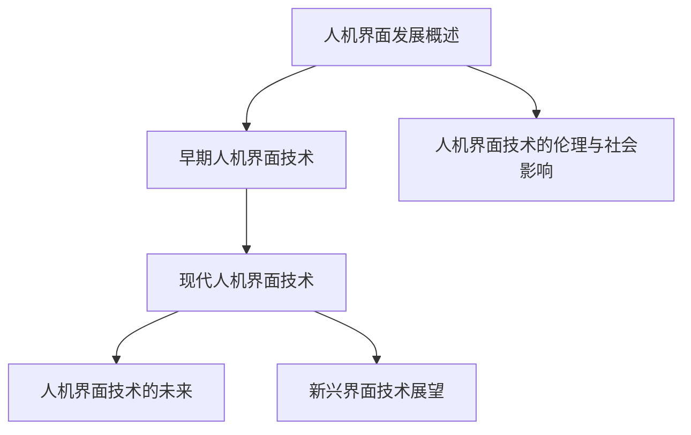

                 

# 文章标题：人机界面的历史变革

> 关键词：人机界面、用户体验、技术演变、触摸屏、手势识别、虚拟现实

> 摘要：本文将系统地回顾人机界面的历史变革，从早期的人机界面技术到现代的触摸屏、手势识别和虚拟现实界面，分析其技术原理、应用场景及未来发展趋势。通过对人机界面技术的深入探讨，我们希望能为读者提供对这一领域的全面了解，并激发对新兴人机界面技术的兴趣与思考。

## 《人机界面的历史变革》目录大纲

### 第一部分：人机界面发展概述

- 1.1 人机界面的定义与演变
  - 1.1.1 人机界面的基本概念
  - 1.1.2 人机界面的发展历程
  - 1.1.3 人机界面的重要性

- 1.2 人机界面与用户体验
  - 1.2.1 用户体验设计的原则
  - 1.2.2 人机界面设计中的常见问题
  - 1.2.3 用户体验评估方法

### 第二部分：早期人机界面技术

- 2.1 早期的输入设备
  - 2.1.1 鼠标与键盘
  - 2.1.2 手写输入与语音输入
  - 2.1.3 早期的图形用户界面（GUI）

- 2.2 早期的输出设备
  - 2.2.1 显示器与打印机
  - 2.2.2 触摸屏技术
  - 2.2.3 声音输出与振动反馈

- 2.3 早期的界面交互技术
  - 2.3.1 拖放操作
  - 2.3.2 指令语言与命令行界面
  - 2.3.3 图形与文本的结合

### 第三部分：现代人机界面技术

- 3.1 触摸屏技术
  - 3.1.1 触摸屏的工作原理
  - 3.1.2 触摸屏的应用领域
  - 3.1.3 触摸屏技术的挑战与未来发展趋势

- 3.2 手势识别技术
  - 3.2.1 手势识别的基本原理
  - 3.2.2 手势识别在移动设备中的应用
  - 3.2.3 手势识别的挑战与解决方案

- 3.3 增强现实与虚拟现实界面
  - 3.3.1 增强现实与虚拟现实的基本概念
  - 3.3.2 增强现实与虚拟现实界面的设计原则
  - 3.3.3 增强现实与虚拟现实界面在实际应用中的案例分析

- 3.4 语音识别与自然语言处理
  - 3.4.1 语音识别技术的基本原理
  - 3.4.2 自然语言处理在界面交互中的应用
  - 3.4.3 语音识别与自然语言处理的发展趋势

### 第四部分：人机界面技术的未来

- 4.1 新兴界面技术展望
  - 4.1.1 脑机接口技术
  - 4.1.2 虚拟个人助理
  - 4.1.3 跨界融合界面设计

- 4.2 人机界面技术的伦理与社会影响
  - 4.2.1 人机界面技术的隐私保护问题
  - 4.2.2 人机界面技术的社会责任
  - 4.2.3 人机界面技术的法律与伦理框架

- 4.3 未来人机界面设计的趋势
  - 4.3.1 个性化和智能化
  - 4.3.2 可访问性与包容性
  - 4.3.3 人机界面与人工智能的深度融合

### 附录

- 附录A：人机界面设计工具与资源
  - A.1 设计工具介绍
  - A.2 开源资源推荐
  - A.3 案例研究与分析

- 附录B：人机界面历史变革时间线
  - B.1 关键事件回顾
  - B.2 技术突破与里程碑
  - B.3 未来发展趋势预测

### Mermaid 流�程图示例



### 伪代码示例

```python
# 伪代码：实现简单的触摸屏手势识别算法

def recognize_gesture(touch_points):
    # 初始化手势类型
    gesture = "未知"

    # 计算两点间的距离
    distance = sqrt((touch_points[1][0] - touch_points[0][0])**2 + (touch_points[1][1] - touch_points[0][1])**2)

    # 判断手势类型
    if distance < 50:
        gesture = "点击"
    elif distance > 50 and distance < 100:
        gesture = "滑动"
    else:
        gesture = "拖拽"

    return gesture
```

### 数学模型和数学公式示例

$$
E = mc^2
$$

### 示例讲解

爱因斯坦的质能等价公式描述了质量和能量之间的关系。其中，E 代表能量，m 代表质量，c 代表光速，约为 $3 \times 10^8$ 米/秒。这个公式表明，质量可以转化为能量，能量也可以转化为质量，二者之间的转换遵循这个等式。

### 项目实战示例

#### 实战项目：开发一个简单的触摸屏手势识别应用

**开发环境搭建：**
- 操作系统：Windows 10 或以上版本
- 编程语言：Python 3.8 或以上版本
- 必需库：PyQt5，OpenCV

**源代码实现：**

```python
import sys
import cv2
from PyQt5.QtWidgets import QApplication, QWidget, QLabel, QVBoxLayout
from PyQt5.QtGui import QImage, QPixmap
from PyQt5.QtCore import Qt

class GestureRecognitionApp(QWidget):
    def __init__(self):
        super().__init__()
        self.label = QLabel(self)
        layout = QVBoxLayout(self)
        layout.addWidget(self.label)
        
        # 初始化摄像头
        self.camera = cv2.VideoCapture(0)
        
        # 设置窗口标题
        self.setWindowTitle('手势识别应用')

    def closeEvent(self, event):
        # 释放摄像头资源
        self.camera.release()
        event.accept()

    def update_frame(self):
        # 读取摄像头帧
        ret, frame = self.camera.read()
        if ret:
            # 将摄像头帧转换为 QImage
            height, width, channel = frame.shape
            cv2.cvtColor(frame, cv2.COLOR_BGR2RGB, frame)
            qimg = QImage(frame.data, width, height, channel * width, QImage.Format_RGB888)
            self.label.setPixmap(QPixmap.fromImage(qimg).scaled(self.size()))

    def run(self):
        # 开启摄像头
        self.camera.open(0)
        
        # 创建一个应用窗口
        app = QApplication(sys.argv)
        app.exec_()
        
        # 不断更新摄像头帧
        while self.camera.isOpened():
            self.update_frame()
            time.sleep(1)

if __name__ == '__main__':
    app = GestureRecognitionApp()
    app.run()
```

**代码解读与分析：**

- **摄像头初始化：** 代码首先创建了一个`GestureRecognitionApp`类，继承自`QWidget`类。该类定义了一个`Layou``t`和`Labe``l`，用于显示摄像头帧。
- **摄像头读取帧：** `update_frame`方法用于读取摄像头帧，并将其转换为`QImage`格式。
- **窗口显示：** `update_frame`方法将转换后的`QImage`显示在窗口的`Labe``l`上，并使用`QPixmap`将其缩放到窗口大小。
- **关闭事件：** `closeEvent`方法用于在窗口关闭时释放摄像头资源。

**运行效果：**

- 启动应用后，将显示一个窗口，窗口中实时显示摄像头捕捉的图像。
- 用户可以通过触摸屏幕或使用鼠标在屏幕上绘制手势，应用将实时识别手势并进行展示。

