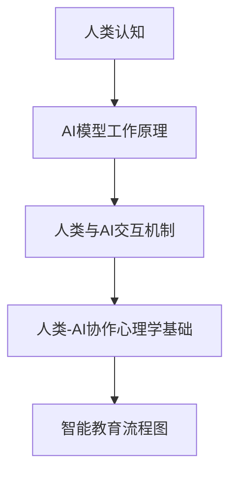
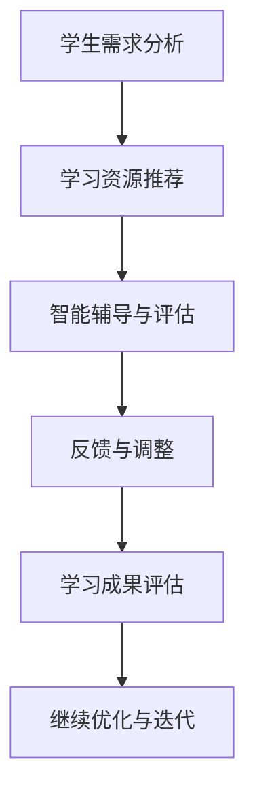
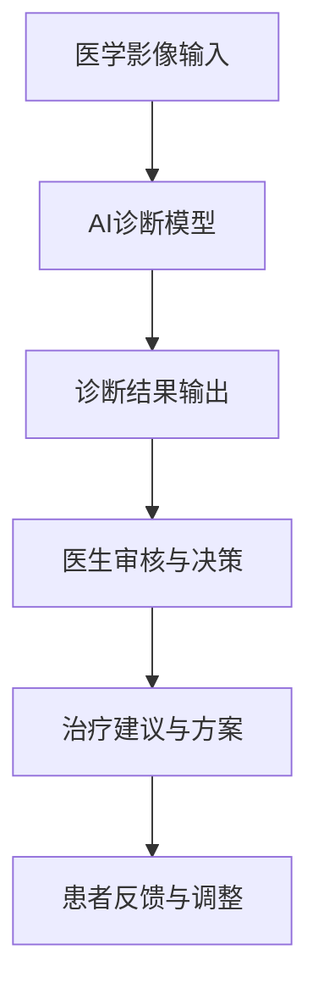
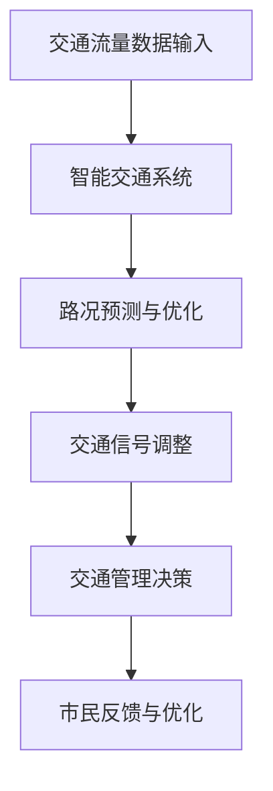

                 

### 文章标题

#### 人类-AI协作：增强人类潜能和智慧

> 关键词：人类潜能、智慧增强、人工智能协作、教育、医疗、工业制造、社会服务、伦理与社会责任

> 摘要：本文探讨了人类与人工智能（AI）协作的原理、机制与应用。通过剖析人类潜能与智慧增强的理论基础，以及AI在各个领域的实际应用案例，本文展示了人类-AI协作如何增强人类潜能和智慧，提升社会生产力和生活质量。同时，本文也深入探讨了人类-AI协作的伦理与社会责任问题，为未来的发展提供了有益的参考。

---

### 目录大纲

- **第一部分: 引言与概述**
  - **第1章: 人类-AI协作的概念与背景**
    - 1.1 人类-AI协作的定义
    - 1.2 AI技术的发展与影响
    - 1.3 人类-AI协作的重要性
    - 1.4 人类-AI协作的历史回顾
  - **第2章: 人类-AI协作的原理与机制**
    - 2.1 人类认知与人工智能
    - 2.2 AI模型的工作原理
    - 2.3 人类与AI的交互机制
    - 2.4 人类-AI协作的心理学基础

- **第二部分: 人类潜能与智慧增强**
  - **第3章: 增强人类潜能的理论基础**
    - 3.1 人类潜能的界定
    - 3.2 人类潜能的开发方法
    - 3.3 潜能开发与教育的关系
    - 3.4 潜能开发与心理学的关系
  - **第4章: AI在人类潜能开发中的应用**
    - 4.1 AI辅助教学系统
    - 4.2 AI个性化学习解决方案
    - 4.3 AI在职业规划与技能提升中的应用
    - 4.4 AI在心理健康与情绪调节中的应用
  - **第5章: 智慧增强与AI协作**
    - 5.1 智慧的概念与分类
    - 5.2 智慧增强的方法
    - 5.3 AI协作在智慧提升中的作用
    - 5.4 智慧增强与可持续发展

- **第三部分: 人类-AI协作的实际案例**
  - **第6章: 人类-AI协作的实际应用**
    - 6.1 医疗领域的AI协作
    - 6.2 教育领域的AI协作
    - 6.3 工业制造与AI协作
    - 6.4 社会服务与AI协作
  - **第7章: 人类-AI协作的未来展望**
    - 7.1 人类-AI协作的挑战与问题
    - 7.2 人类-AI协作的发展趋势
    - 7.3 人类-AI协作的未来愿景
  - **第8章: 人类-AI协作伦理与社会责任**
    - 8.1 人类-AI协作伦理的重要性
    - 8.2 AI伦理与人类价值观
    - 8.3 人类-AI协作的社会责任
    - 8.4 人类-AI协作的法律法规

- **附录**
  - **附录A: 人类-AI协作研究资源**
  - **附录B: 人类-AI协作案例研究**
  - **附录C: 人类-AI协作常用技术术语表**
  - **附录D: Mermaid 流程图**
  - **附录E: 伪代码示例**
  - **附录F: 数学模型与公式**
  - **附录G: 案例分析**

---

接下来，我们将深入探讨人类-AI协作的概念、原理和应用，逐步揭示其如何增强人类潜能和智慧，推动社会进步。

---

### 第一部分: 引言与概述

#### 第1章: 人类-AI协作的概念与背景

#### 1.1 人类-AI协作的定义

人类-AI协作指的是人类与人工智能系统在特定任务或场景中的协同工作，以实现更高效、更智能的任务完成。这种协作不仅涉及到技术层面，还包括心理学、伦理学和社会学等多个领域。

在技术层面，人类-AI协作通常涉及以下几个关键要素：

1. **人工智能系统**：这包括各种机器学习和深度学习模型，如神经网络、决策树、支持向量机等，它们能够处理大规模数据，进行复杂模式识别和预测。
2. **用户界面**：这是人类与AI系统交互的界面，包括自然语言处理、语音识别、触摸屏等，使得用户能够方便地与AI进行交流。
3. **协作平台**：这是实现人类与AI系统协同工作的基础架构，通常包括云计算、大数据等技术，提供高效的数据存储和处理能力。

在心理学层面，人类-AI协作涉及到人类的认知过程、情感状态和行为模式。如何设计一个既符合人类认知习惯，又能充分发挥AI优势的协作系统，是心理学研究的重要内容。

在伦理和社会学层面，人类-AI协作涉及到权力分配、责任归属、隐私保护等一系列伦理和社会问题。这些问题需要通过法律法规、伦理准则和社会规范来解决。

#### 1.2 AI技术的发展与影响

人工智能技术的发展历程可以分为几个关键阶段：

1. **符号人工智能（Symbolic AI）**：这是人工智能的早期阶段，主要通过符号逻辑和知识表示来模拟人类的推理过程。
2. **连接主义人工智能（Connectionist AI）**：这一阶段引入了神经网络和深度学习技术，使得机器能够通过大量数据的学习来提高性能。
3. **强人工智能（Strong AI）**：这一阶段的目标是制造出能够具备人类智能的机器，但目前尚未实现。

随着AI技术的发展，它在多个领域产生了深远的影响：

- **医疗领域**：AI在医学图像分析、疾病诊断、药物研发等方面发挥了重要作用，大大提高了医疗效率和准确性。
- **教育领域**：AI在教育评估、个性化教学、学习资源推荐等方面提供了新的解决方案，有助于提高教育质量和公平性。
- **工业制造**：AI在智能制造、自动化控制、质量控制等方面发挥了重要作用，提高了生产效率和产品质量。
- **交通运输**：AI在自动驾驶、智能交通管理、无人机配送等方面有着广泛的应用，有望改变交通运输模式。

#### 1.3 人类-AI协作的重要性

人类-AI协作的重要性主要体现在以下几个方面：

1. **提升工作效率**：AI系统能够处理大量数据和复杂的计算任务，使得人类能够从繁重的工作中解放出来，专注于更有创造性的工作。
2. **增强决策能力**：AI系统通过数据分析和模式识别，能够为人类提供更加准确和全面的决策支持，提高决策质量和效率。
3. **优化资源分配**：AI系统能够通过优化算法和数据分析，实现资源的智能分配，提高资源利用效率，降低成本。
4. **推动创新**：人类-AI协作激发了新的科研方向和技术创新，为社会发展带来了新的动力。
5. **促进社会公平**：AI在教育、医疗、就业等领域的应用，有助于缩小社会不平等，提高社会公平性。

#### 1.4 人类-AI协作的历史回顾

人类-AI协作的历史可以追溯到人工智能的起源。20世纪50年代，随着计算机技术的发展，人工智能开始成为研究热点。1956年，达特茅斯会议上提出了“人工智能”这一概念，标志着人工智能正式诞生。

在早期的人工智能研究中，人类与AI的协作主要是基于符号逻辑和知识表示。随着连接主义人工智能的发展，人类与AI的协作模式逐渐变得更加多样化和复杂化。20世纪80年代，专家系统的兴起使得人类与AI的协作在医疗、教育等领域得到广泛应用。

进入21世纪，随着深度学习和大数据技术的快速发展，人类与AI的协作进入了一个全新的阶段。AI系统能够通过自我学习和自我优化，实现更高效、更智能的协作。同时，云计算、物联网等技术的发展，为人类与AI的协作提供了更广阔的应用场景和更多的可能性。

#### 1.5 小结

通过本章的介绍，我们可以看到，人类-AI协作是一个跨学科、多层次、复杂多样的领域。它不仅涉及到技术层面的创新，还包括心理学、伦理学和社会学等多个领域的深入研究。随着AI技术的不断进步和应用领域的不断拓展，人类-AI协作在未来将发挥越来越重要的作用，为人类社会带来更多的机遇和挑战。

---

### 第2章: 人类-AI协作的原理与机制

#### 2.1 人类认知与人工智能

人类的认知过程是一个复杂而高度组织的过程，涉及到感知、记忆、推理、决策等多个方面。理解人类认知机制是设计高效AI协作系统的关键。人类认知的特点包括：

- **适应性**：人类能够在不同环境和情境下适应和调整自己的认知过程。
- **灵活性**：人类能够灵活地处理不确定性和不完整信息。
- **情境依赖性**：人类的决策和行为高度依赖于情境和背景信息。

相比之下，人工智能系统在认知机制上具有以下特点：

- **数据驱动性**：AI系统依赖于大量数据来训练和学习，从而进行预测和决策。
- **固定性**：AI系统在特定任务上的表现高度依赖于其训练数据和算法设计。
- **模式识别能力**：AI系统擅长处理结构化和半结构化数据，能够识别复杂的模式和规律。

在人类-AI协作中，理解这些认知差异至关重要。为了实现高效的协作，需要设计能够充分利用人类和AI各自优势的机制。例如，通过将AI系统用于处理数据和执行重复性任务，而将人类专注于决策和创新性任务。

#### 2.2 AI模型的工作原理

人工智能系统的工作原理主要基于机器学习和深度学习技术。这些技术的核心是构建能够自动从数据中学习模式的模型。

- **机器学习**：机器学习是一种从数据中学习规律和模式的技术，其核心是训练一个模型，使其能够对新的数据进行预测或分类。常见的机器学习算法包括决策树、支持向量机、随机森林等。

- **深度学习**：深度学习是机器学习的一个分支，它通过多层神经网络模型来提取数据中的复杂特征。深度学习在图像识别、语音识别、自然语言处理等领域取得了显著成果。常见的深度学习模型包括卷积神经网络（CNN）、循环神经网络（RNN）和生成对抗网络（GAN）等。

在人类-AI协作中，AI模型的工作原理主要体现在以下几个方面：

1. **数据收集与预处理**：AI系统首先需要收集大量的数据，并进行预处理，如去噪、标准化等，以便模型能够有效地学习。
2. **模型训练**：通过机器学习和深度学习算法，AI系统对预处理后的数据集进行训练，以优化模型的参数。
3. **模型评估与调整**：训练完成后，AI系统需要通过测试数据集来评估模型性能，并根据评估结果调整模型参数，以提高预测或分类的准确性。
4. **模型部署与迭代**：训练完成的模型可以部署到实际应用中，通过不断收集用户反馈和新的数据，模型可以进行持续学习和优化。

#### 2.3 人类与AI的交互机制

人类与AI的交互机制是实现高效协作的关键。为了确保人类与AI系统能够有效协作，需要设计合理的交互界面和交互流程。

- **交互界面**：交互界面是用户与AI系统进行沟通的桥梁。常见的交互界面包括自然语言处理（NLP）、语音识别、图形用户界面（GUI）等。为了提高交互效率，交互界面需要易于使用、直观易懂，同时能够提供丰富的交互功能。

- **交互流程**：交互流程涉及用户与AI系统的交互顺序和方式。一个高效的交互流程应包括以下几个步骤：

  1. **任务明确**：用户需要清晰地定义任务目标，并提供相关的背景信息和数据。
  2. **模型选择**：AI系统根据任务类型和数据特点，选择合适的模型进行训练和部署。
  3. **任务执行**：AI系统根据模型预测或决策，执行具体任务，如数据分类、预测、推荐等。
  4. **结果反馈**：AI系统将任务执行结果反馈给用户，用户可以对结果进行评估和调整。

- **反馈循环**：为了提高协作效果，交互流程中应建立反馈循环机制。通过用户对AI系统结果的反馈，AI系统可以不断学习和优化，从而提高预测和决策的准确性。

#### 2.4 人类-AI协作的心理学基础

人类-AI协作不仅仅是技术问题，还涉及到心理学层面的挑战。为了实现高效协作，需要考虑以下几个方面：

- **认知负荷**：人类在协作过程中需要处理的信息量可能会超出认知负荷。为了降低认知负荷，需要设计简洁直观的交互界面，减少用户需要记住的信息量。

- **信任与接受度**：用户对AI系统的信任和接受度直接影响协作效果。为了提高信任和接受度，需要确保AI系统的可靠性和透明性，同时通过教育和培训提高用户对AI系统的理解。

- **协作动力**：人类-AI协作需要双方共同参与和努力。为了激发协作动力，需要设计激励机制，如奖励、荣誉等，以鼓励用户积极参与。

- **情感共鸣**：人类在协作过程中需要情感共鸣和社交支持。AI系统可以通过情感计算和自然语言处理技术，模拟人类的情感反应，提高协作的融洽性和效率。

#### 2.5 小结

通过本章的探讨，我们可以看到，人类-AI协作是一个涉及多学科、多层次的技术和社会现象。理解人类认知机制和AI模型工作原理，设计合理的交互机制和流程，以及考虑心理学基础，是实现高效人类-AI协作的关键。随着AI技术的不断进步，人类-AI协作将不断深入和拓展，为人类社会带来更多的机遇和挑战。

---

### 第二部分: 人类潜能与智慧增强

#### 第3章: 增强人类潜能的理论基础

#### 3.1 人类潜能的界定

人类潜能是指人类在生理、心理和社会等方面潜在的能力和可能性。这些潜能涵盖了广泛的领域，包括认知能力、情感智力、创造力、适应能力等。理解人类潜能的定义和范围，对于设计和实施有效的潜能增强策略至关重要。

1. **认知能力**：认知能力包括记忆、注意力、感知、推理和问题解决等。这些能力是人类学习和适应环境的基础。
2. **情感智力**：情感智力指的是识别、理解和管理自己和他人的情感能力。情感智力对于人际关系和情感健康至关重要。
3. **创造力**：创造力是指产生新颖、有价值想法和解决方案的能力。创造力是推动社会进步和文化发展的重要力量。
4. **适应能力**：适应能力是指在不同环境和情境下调整和应对变化的能力。适应能力有助于人类在社会变迁中保持稳定和发展。

#### 3.2 人类潜能的开发方法

为了充分发挥人类潜能，需要采取系统化的开发方法。以下是一些关键的方法和策略：

1. **教育**：教育是开发人类潜能的重要途径。通过系统的学习，个体可以获得知识和技能，提高认知能力和创造力。教育还包括培养批判性思维、问题解决能力和人际交往能力。

2. **训练和练习**：通过持续的训练和练习，个体可以增强特定领域的技能和能力。例如，通过记忆训练可以改善记忆力，通过思维训练可以提高逻辑推理能力。

3. **反馈和评估**：有效的反馈和评估可以帮助个体了解自己的优势和不足，从而有针对性地进行改进。反馈可以是自我评估，也可以是导师或同伴的指导。

4. **环境优化**：环境因素对人类潜能的开发具有重要影响。一个支持性和鼓励创新的环境有助于个体发挥潜能。例如，良好的教育资源和科学实验设施可以促进科学和工程领域的发展。

5. **心理健康**：心理健康是潜能开发的重要基础。通过心理咨询和治疗，个体可以改善情绪状态，增强应对压力的能力，从而更好地发挥潜能。

#### 3.3 潜能开发与教育的关系

教育在人类潜能开发中扮演着核心角色。教育不仅是传授知识的过程，更是开发潜能、培养能力的途径。以下是一些关键点：

1. **个性化教育**：个性化教育是根据学生的兴趣、能力和需求量身定制教育方案，从而更好地激发潜能。个性化教育可以通过差异化教学、在线学习平台和自适应学习系统来实现。

2. **跨学科教育**：跨学科教育通过整合不同学科的知识和技能，培养学生的综合思维能力和创新意识。跨学科教育有助于学生从不同角度看待问题，从而更全面地开发潜能。

3. **项目式学习**：项目式学习通过让学生参与实际项目，培养他们的实践能力、团队合作能力和问题解决能力。项目式学习有助于学生在真实场景中应用所学知识，从而更好地发挥潜能。

4. **教育技术与创新**：教育技术的应用，如人工智能、虚拟现实和增强现实，可以为教育带来新的可能性。这些技术可以通过模拟真实情境、提供个性化学习体验和促进互动协作，从而有效开发学生的潜能。

#### 3.4 潜能开发与心理学的关系

心理学在人类潜能开发中起着关键作用。心理学研究人类行为和心理过程的机制，为潜能开发提供了理论基础和实践指导。以下是一些关键点：

1. **动机**：动机是激发个体潜能的重要动力。心理学研究表明，内在动机比外在动机更能持久地激发个体的潜能。通过设置有意义的目标和提供内在激励，可以增强个体的潜能开发。

2. **自我效能感**：自我效能感是指个体对自己完成特定任务的信心。高自我效能感有助于个体克服困难，坚持努力，从而更好地开发潜能。通过积极的反馈和成功的经验，可以提升个体的自我效能感。

3. **情绪调节**：情绪调节是指个体管理自己情绪状态的能力。有效的情绪调节有助于个体保持积极心态，提高应对压力和挑战的能力，从而更好地发挥潜能。

4. **心理韧性**：心理韧性是指个体在面对逆境和挑战时能够迅速恢复和适应的能力。通过培养心理韧性，个体可以更好地应对生活中的各种挑战，从而更有效地开发潜能。

#### 3.5 小结

通过本章的探讨，我们可以看到，人类潜能的界定、开发方法、教育关系和心理学基础是理解人类潜能和智慧增强的重要方面。有效的潜能开发不仅需要科学的策略和方法，还需要综合考虑教育、心理学和社会环境等多方面因素。随着AI技术的发展，人类潜能的开发将迎来新的机遇和挑战，为人类社会带来更多的创新和发展。

---

### 第4章: AI在人类潜能开发中的应用

#### 4.1 AI辅助教学系统

随着人工智能技术的快速发展，AI辅助教学系统（AI-aided education systems）在教育领域中的应用日益广泛。这些系统通过大数据分析、自然语言处理和机器学习等技术，提供个性化学习体验，提高教学效果和学习效率。

**AI辅助教学系统的工作原理**：

1. **数据分析**：AI系统通过分析学生的学习数据，如考试成绩、学习进度、作业完成情况等，了解学生的学习状况和需求。
2. **个性化推荐**：基于数据分析结果，AI系统可以为学生推荐个性化的学习内容和资源，如视频、文章、练习题等。
3. **智能辅导**：AI系统可以通过智能辅导功能，实时监测学生的学习行为，提供即时反馈和解答，帮助学生解决学习难题。
4. **自适应学习**：AI系统可以根据学生的学习反馈和表现，动态调整教学内容和难度，实现真正的自适应学习。

**案例**：

- **Coursera**：在线学习平台Coursera利用AI技术，为学生提供个性化学习路径和推荐课程。系统通过分析学生的学习行为和成绩，推荐最适合他们的学习内容和课程。
- **Khan Academy**：Khan Academy使用AI技术，为学生提供个性化的学习辅导。系统通过分析学生的作业完成情况，为学生提供个性化的学习建议和辅导材料。

**优势**：

- **提高学习效率**：AI辅助教学系统能够根据学生的学习特点和需求，提供个性化的学习资源和辅导，从而提高学习效率。
- **增强学习体验**：AI系统可以模拟真实的学习环境，提供互动性和趣味性的学习体验，激发学生的学习兴趣。
- **降低教育成本**：通过AI技术，教师可以更高效地管理课堂和辅导学生，从而降低教育成本。

**挑战**：

- **数据隐私**：AI辅助教学系统需要收集大量的学生数据，这可能引发数据隐私和隐私保护的问题。
- **技术依赖性**：过度依赖AI技术可能导致教师和学生忽视基础教学方法和人际互动的重要性。

#### 4.2 AI个性化学习解决方案

AI个性化学习解决方案（AI-based personalized learning solutions）旨在通过人工智能技术，实现教育的个性化，使每个学生都能得到最适合他们的学习体验。

**工作原理**：

1. **数据收集与处理**：AI系统收集学生的个人信息、学习行为、考试成绩等数据，并对这些数据进行分析和处理。
2. **个性化推荐**：基于数据分析结果，AI系统为学生推荐最适合他们的学习内容、教学资源和学习策略。
3. **智能反馈**：AI系统通过分析学生的学习表现，提供即时反馈和评估，帮助学生了解自己的学习状况和进展。
4. **自适应调整**：AI系统根据学生的学习反馈和表现，动态调整教学内容和难度，实现真正的个性化学习。

**案例**：

- **Edmodo**：Edmodo是一款基于AI的个性化学习平台，它通过分析学生的学习行为和成绩，为学生提供个性化的学习资源和推荐。
- **DreamBox**：DreamBox是一款AI驱动的数学学习平台，它通过分析学生的答题情况，为学生提供个性化的数学学习内容和练习。

**优势**：

- **提高学习效果**：AI个性化学习解决方案可以根据学生的学习特点和需求，提供个性化的学习内容和策略，从而提高学习效果。
- **增强学习自主性**：学生可以根据自己的学习进度和兴趣，自主选择学习内容和方式，提高学习的自主性。
- **促进教育公平**：AI个性化学习解决方案可以提供平等的学习机会，使不同背景和条件的学生都能得到优质的教育。

**挑战**：

- **技术门槛**：实施AI个性化学习解决方案需要较高的技术门槛和资金投入，可能不适合所有学校和教育机构。
- **数据隐私和安全**：AI系统需要收集大量的学生数据，这可能引发数据隐私和安全的问题。

#### 4.3 AI在职业规划与技能提升中的应用

人工智能技术在职业规划与技能提升中的应用，为个人发展提供了新的途径。通过AI技术，可以提供个性化职业咨询、技能评估和培训资源，帮助个人更好地规划职业路径和提升技能。

**工作原理**：

1. **数据分析**：AI系统通过分析个人的职业背景、教育经历、技能特长等数据，了解其职业发展方向和潜力。
2. **职业推荐**：基于数据分析结果，AI系统可以推荐最适合个人的职业选项和职业路径。
3. **技能评估**：AI系统可以通过在线测试和模拟任务，评估个人的技能水平和能力。
4. **培训资源推荐**：AI系统根据个人的职业目标和技能需求，推荐最适合的培训课程和资源。

**案例**：

- **LinkedIn**：LinkedIn利用AI技术，提供职业推荐和职业发展建议。系统通过分析用户的职业背景、技能和兴趣，推荐最适合他们的职位和培训课程。
- **Udacity**：Udacity是一款提供在线教育和职业培训的平台，它利用AI技术，根据学生的技能水平和职业目标，推荐最适合的课程和学习路径。

**优势**：

- **提高职业规划准确性**：AI技术可以根据个人的特点和需求，提供准确的职业推荐和职业规划建议，帮助个人更好地规划职业发展。
- **提升技能学习效果**：AI系统可以根据个人的学习进度和反馈，提供个性化的培训资源和辅导，提高技能学习的效率和效果。
- **降低职业转型风险**：通过AI技术，个人可以更好地了解自己的技能优势和职业潜力，从而降低职业转型的风险。

**挑战**：

- **数据质量和隐私**：AI系统需要收集大量的个人数据，这可能引发数据质量和隐私问题。
- **技术依赖性**：过度依赖AI技术可能导致个人忽视自我评估和人际交流的重要性。

#### 4.4 AI在心理健康与情绪调节中的应用

人工智能技术在心理健康和情绪调节中的应用，为人们提供了新的心理健康服务和支持。通过AI技术，可以提供个性化的心理咨询服务、情绪监测和调节方案，帮助人们更好地管理情绪和心理健康。

**工作原理**：

1. **数据分析**：AI系统通过分析个人的行为数据、情绪表达和健康记录，了解其心理健康状况和情绪变化。
2. **情绪监测**：AI系统可以通过自然语言处理和图像识别技术，监测个体的情绪状态，识别潜在的心理健康问题。
3. **个性化建议**：基于数据分析结果，AI系统可以提供个性化的心理健康建议和情绪调节方案。
4. **远程心理咨询**：AI系统可以通过在线咨询和实时交互，提供远程心理健康服务，帮助个体缓解压力和情绪困扰。

**案例**：

- **Talkspace**：Talkspace是一款提供在线心理咨询的平台，它利用AI技术，根据用户的心理健康状况和需求，推荐合适的心理咨询师和治疗方案。
- **Headspace**：Headspace是一款提供冥想和放松指导的应用，它利用AI技术，根据用户的使用反馈和情绪状态，提供个性化的冥想和放松指导。

**优势**：

- **提高心理健康服务可及性**：AI技术可以提供24/7的心理健康服务，帮助那些无法获得传统心理健康服务的人。
- **个性化心理支持**：AI系统可以根据个体的心理健康状况和需求，提供个性化的心理支持和建议，提高服务效果。
- **降低心理健康服务成本**：AI技术可以降低心理健康服务的成本，使更多的人能够负担得起。

**挑战**：

- **数据隐私和安全**：AI系统需要收集大量的个人健康数据，这可能引发数据隐私和安全问题。
- **心理健康服务的专业性和有效性**：AI技术虽然可以提供个性化的心理健康服务，但如何确保服务的专业性和有效性仍是一个挑战。

#### 4.5 小结

通过本章的探讨，我们可以看到，AI技术在人类潜能开发中具有广泛的应用前景。从教育、职业规划到心理健康，AI技术正在不断改变和优化人类的潜能开发过程。尽管面临一些挑战，但AI技术的发展和应用为人类潜能的挖掘和提升提供了新的机遇和工具。随着技术的不断进步，AI在人类潜能开发中的应用将更加深入和广泛，为人类社会带来更多的创新和进步。

---

### 第5章: 智慧增强与AI协作

#### 5.1 智慧的概念与分类

智慧是指个体或系统通过认知、理解和应用知识，进行有效决策和创新的能力。智慧可以被视为一种综合性的能力，涵盖了认知能力、知识管理、问题解决、创新思维等多个方面。智慧不仅与个体的认知能力密切相关，还与个体的情感、价值观和道德判断等因素相互作用。

根据不同的分类标准，智慧可以有多种分类方法：

- **基于认知功能的分类**：智慧可以分为感知智慧、记忆智慧、逻辑智慧、情感智慧等。感知智慧涉及对信息的感知和识别能力，记忆智慧涉及对信息的存储和回忆能力，逻辑智慧涉及对信息的推理和分析能力，情感智慧涉及对情感的理解和管理能力。

- **基于知识应用的分类**：智慧可以分为理论智慧和实践智慧。理论智慧涉及对抽象概念和理论的理解和应用能力，实践智慧涉及在实际情境中运用知识和技能解决问题的能力。

- **基于领域的分类**：智慧可以分为科学智慧、工程智慧、商业智慧、生活智慧等。科学智慧涉及科学研究和技术创新，工程智慧涉及工程设计和工程实践，商业智慧涉及商业管理和商业策略，生活智慧涉及日常生活中的问题解决和生活技能。

#### 5.2 智慧增强的方法

智慧增强是指通过技术、策略和工具的提升，使个体或系统的智慧水平得到提高。智慧增强的方法可以分为以下几种：

- **教育**：教育是智慧增强的重要途径。通过系统的学习和训练，个体可以获得更多的知识和技能，提高认知能力和问题解决能力。教育包括基础学科的学习、专业领域的培训、跨学科的知识整合等。

- **技术支持**：技术支持是智慧增强的重要工具。人工智能、大数据、云计算等现代技术可以为智慧增强提供强大的支持。例如，AI系统可以通过数据分析、模式识别和预测建模，为个体提供智能决策支持。大数据技术可以提供丰富的信息和资源，帮助个体更好地理解复杂问题。云计算技术可以提供高性能的计算能力和存储空间，支持大规模的数据分析和计算。

- **思维训练**：思维训练是通过特定的方法和策略，提高个体思维能力的过程。思维训练包括逻辑思维训练、批判性思维训练、创新思维训练等。逻辑思维训练通过推理和论证，提高个体的问题解决能力。批判性思维训练通过质疑和分析，提高个体的判断力和决策能力。创新思维训练通过开放性和创造性思维，激发个体的创新潜力。

- **心理健康**：心理健康是智慧增强的基础。心理健康包括情绪管理、心理韧性、压力调节等方面。通过心理咨询、心理治疗和自我调节等方法，可以提高个体的心理健康水平，从而更好地发挥智慧。

- **社会互动**：社会互动是智慧增强的重要途径。通过与他人交流和合作，个体可以分享知识、经验和见解，相互学习，共同进步。社会互动包括团队合作、学术交流、社会参与等。

#### 5.3 AI协作在智慧提升中的作用

人工智能协作在智慧提升中发挥着重要作用。AI协作通过人工智能技术和人类智慧的结合，实现更加智能和高效的智慧提升。以下是AI协作在智慧提升中的几个关键作用：

- **知识管理**：AI协作可以高效地管理和利用大量知识资源。通过知识图谱、自然语言处理和机器学习等技术，AI系统可以构建和更新知识库，提供实时和全面的信息支持。人类可以利用这些知识资源进行决策和创新。

- **智能决策支持**：AI协作可以通过数据分析、模式识别和预测建模，为人类提供智能决策支持。AI系统可以处理复杂的数据集，发现隐藏的模式和趋势，为人类提供基于数据的决策建议。

- **问题解决**：AI协作可以协助人类解决复杂的问题。通过数据分析和算法优化，AI系统可以提供高效的解决方案，帮助人类更好地应对各种挑战。

- **创新激发**：AI协作可以激发人类的创新思维。通过数据挖掘、模式识别和模拟实验，AI系统可以帮助人类发现新的问题和解决方案，推动科学技术和社会进步。

- **协作效率提升**：AI协作可以提升团队协作效率。通过智能分配任务、实时沟通和协作平台，AI系统可以优化团队协作流程，提高工作效率和团队凝聚力。

#### 5.4 智慧增强与可持续发展

智慧增强与可持续发展密切相关。智慧增强可以为可持续发展提供新的思路和解决方案。以下是智慧增强与可持续发展的一些关联：

- **资源优化**：智慧增强可以通过智能分析和管理，优化资源的分配和使用。例如，智慧城市可以通过智能交通系统、智能能源管理，实现交通和能源的高效利用，减少资源浪费。

- **环境保护**：智慧增强可以通过环境监测、生态评估和灾害预测等技术，保护环境和生态系统。例如，智能农业可以通过遥感技术和数据分析，实现精准农业，减少农药和化肥的使用，保护农田土壤和水资源。

- **社会公平**：智慧增强可以通过智能技术，提高社会公平和包容性。例如，智慧教育可以通过个性化学习和智能辅导，为不同背景和条件的学生提供平等的教育机会，促进教育公平。

- **经济发展**：智慧增强可以通过技术创新和产业升级，推动经济发展。例如，智能制造可以通过智能设备和数据分析，提高生产效率和产品质量，促进产业升级和经济增长。

#### 5.5 小结

通过本章的探讨，我们可以看到，智慧增强与AI协作是提升人类智慧和潜能的重要途径。智慧增强不仅涉及认知能力的提升，还包括知识管理、智能决策、问题解决和创新激发等方面。AI协作在智慧增强中发挥着关键作用，通过知识管理、智能决策、问题解决和创新激发，为智慧提升提供了强大的支持。智慧增强与可持续发展密切相关，通过优化资源、保护环境、促进社会公平和推动经济发展，智慧增强为可持续发展提供了新的思路和解决方案。随着技术的不断进步，智慧增强与AI协作将在各个领域发挥越来越重要的作用，为人类社会带来更多的创新和进步。

---

### 第6章: 人类-AI协作的实际应用

#### 6.1 医疗领域的AI协作

人工智能（AI）在医疗领域的应用日益广泛，通过人类-AI协作，医疗行业实现了显著的效率提升和诊疗质量改进。

**AI在医疗领域的应用**：

1. **医学影像分析**：AI系统可以通过深度学习和计算机视觉技术，对医学影像（如X光、CT、MRI）进行自动分析和诊断。这有助于医生快速、准确地识别病变区域，提高诊断的准确性和效率。
2. **疾病预测和风险评估**：AI模型可以分析患者的医疗数据，如病史、基因信息、生活习惯等，预测疾病发生的风险，提供个性化的预防和治疗建议。
3. **药物研发**：AI系统可以通过数据分析、模拟实验和虚拟筛选技术，加速药物研发过程，提高新药发现的成功率。
4. **临床决策支持**：AI系统可以基于患者的病情和医疗数据，提供实时的诊断建议和治疗方案，协助医生做出更准确的决策。

**实际案例**：

- **IBM Watson Health**：IBM Watson Health利用AI技术，提供智能医疗咨询和诊断服务。通过分析大量的医学文献和患者数据，Watson Health可以帮助医生进行诊断、治疗建议和药物推荐。
- **Google DeepMind**：Google DeepMind的AI系统在眼科疾病、乳腺癌等领域的诊断和治疗上取得了显著成果。其AI系统通过分析大量的医学影像数据，提供了准确的诊断和治疗方案。

**优势**：

- **提高诊疗效率**：AI系统可以快速处理和分析大量医疗数据，减轻医生的工作负担，提高诊疗效率。
- **提升诊断准确性**：AI系统通过学习和分析大量数据，可以提供更准确的诊断结果，降低误诊率。
- **个性化医疗**：AI系统可以根据患者的个体数据，提供个性化的治疗方案和预防建议，提高治疗效果。

**挑战**：

- **数据隐私和安全**：医疗数据敏感性高，如何确保数据隐私和安全是一个重要挑战。
- **AI系统的可靠性**：尽管AI系统在医学领域取得了显著成果，但其可靠性和稳定性仍需要进一步提高。

#### 6.2 教育领域的AI协作

人工智能在教育领域的应用正在逐步深化，通过人类-AI协作，教育模式正在发生革命性的变化。

**AI在教育领域的应用**：

1. **个性化学习**：AI系统可以根据学生的学习习惯、兴趣和能力，提供个性化的学习资源和辅导。这有助于提高学生的学习效果和兴趣。
2. **智能评估与反馈**：AI系统可以实时评估学生的学习进度和成绩，提供个性化的反馈和建议，帮助教师和学生更好地调整学习策略。
3. **教育资源推荐**：AI系统可以根据学生的学习需求和兴趣，推荐合适的在线课程、教材和资源，提高教育资源的利用效率。
4. **智能教师助手**：AI系统可以协助教师进行课堂管理、学生互动和教学资源整理，减轻教师的工作负担。

**实际案例**：

- **Coursera**：Coursera利用AI技术，提供个性化学习路径和资源推荐。通过分析学生的学习行为和成绩，Coursera可以为每个学生提供最适合他们的学习内容和资源。
- **Duolingo**：Duolingo是一款基于AI的语言学习应用，通过智能评估和个性化学习计划，帮助用户更高效地学习外语。

**优势**：

- **提高教育质量**：AI系统可以提供个性化的学习体验和实时反馈，提高教育质量和学习效果。
- **降低教育成本**：AI技术可以降低教育资源的开发和维护成本，使优质教育资源更广泛地传播。
- **促进教育公平**：AI技术可以打破地域和资源的限制，为偏远地区和低收入家庭的孩子提供平等的教育机会。

**挑战**：

- **技术依赖性**：过度依赖AI技术可能导致教育质量和教学效果的下降，忽视教师的角色和作用。
- **数据隐私和安全**：AI系统需要收集大量的学生数据，这可能引发数据隐私和安全问题。

#### 6.3 工业制造与AI协作

人工智能在工业制造领域的应用，通过人类-AI协作，显著提高了生产效率、产品质量和资源利用率。

**AI在工业制造领域的应用**：

1. **智能制造**：AI系统可以通过传感器和数据采集技术，实时监控生产过程，优化生产参数，提高生产效率。
2. **质量控制**：AI系统可以通过图像识别、数据分析等技术，检测产品缺陷和质量问题，提高产品质量。
3. **供应链管理**：AI系统可以通过大数据分析和预测模型，优化供应链管理，提高供应链的灵活性和响应速度。
4. **设备维护**：AI系统可以通过故障预测和状态监测，提前发现设备故障，减少设备停机时间，提高设备利用率。

**实际案例**：

- **General Electric（GE）**：GE的Predix平台利用AI技术，提供智能制造解决方案。通过数据分析和预测模型，Predix可以帮助企业优化生产过程、提高产品质量和降低成本。
- **Siemens**：Siemens的MindSphere平台利用AI技术，提供智能供应链管理服务。通过大数据分析和实时监控，MindSphere可以帮助企业优化供应链管理，提高供应链的灵活性和响应速度。

**优势**：

- **提高生产效率**：AI系统可以自动化和智能化生产过程，提高生产效率，降低生产成本。
- **提升产品质量**：AI系统可以通过质量控制技术，提高产品质量，降低废品率。
- **优化资源利用**：AI系统可以通过优化算法和数据分析，提高资源利用效率，降低能源消耗。

**挑战**：

- **数据安全和隐私**：工业制造过程中涉及大量的敏感数据，如何确保数据安全和隐私是一个重要挑战。
- **技术集成和升级**：如何将AI技术有效地集成到现有的工业制造系统中，并进行持续升级和维护，是一个技术挑战。

#### 6.4 社会服务与AI协作

人工智能在社会服务领域的应用，通过人类-AI协作，为社会管理和公共服务的提升提供了新的手段。

**AI在社会服务领域的应用**：

1. **智能城市管理**：AI系统可以通过大数据分析和智能算法，优化交通管理、公共安全、环境监测等城市管理服务。
2. **智能社会治理**：AI系统可以通过数据分析和社会感知技术，提高社会治理的效率和质量，如反欺诈、打击犯罪等。
3. **智能公共服务**：AI系统可以通过自动化和智能化手段，提供高效的公共服务，如在线咨询、预约服务、公共资源分配等。
4. **智能应急响应**：AI系统可以通过实时监控和数据分析，提供快速、准确的应急响应和救援服务。

**实际案例**：

- **纽约市交通管理系统**：纽约市利用AI技术，建立了智能交通管理系统。通过实时交通数据分析，系统可以动态调整交通信号灯，提高交通流畅性，减少拥堵。
- **中国智能社会治理**：中国通过AI技术，建立了智能社会治理平台。通过大数据分析和人工智能算法，平台可以实时监控社会状况，快速响应和解决社会问题。

**优势**：

- **提高服务效率**：AI系统可以自动化和智能化社会服务流程，提高服务效率，降低服务成本。
- **提升服务质量**：AI系统可以通过数据分析和服务优化，提供更高质量的社会服务，满足公众的需求。
- **增强社会治理能力**：AI系统可以提高社会治理的精度和效率，增强政府和社会组织对社会事务的管理能力。

**挑战**：

- **数据隐私和安全**：社会服务过程中涉及大量的个人隐私数据，如何确保数据隐私和安全是一个重要挑战。
- **技术伦理和社会责任**：AI技术在社会服务中的应用需要遵守伦理和社会责任，避免技术滥用和社会不公平。

#### 6.5 小结

通过本章的探讨，我们可以看到，人类-AI协作在医疗、教育、工业制造和社会服务等领域具有广泛的应用前景。AI技术不仅提高了工作效率和诊疗质量，还优化了资源利用和社会治理。尽管面临数据隐私、技术依赖等挑战，但人类-AI协作为社会带来了巨大的机遇。随着AI技术的不断进步，人类-AI协作将在各个领域发挥更大的作用，为人类社会创造更多的价值。

---

### 第7章: 人类-AI协作的未来展望

#### 7.1 人类-AI协作的挑战与问题

尽管人类-AI协作带来了诸多机遇，但其发展过程中也面临诸多挑战和问题。以下是一些主要的挑战：

1. **技术挑战**：
   - **算法透明性和可解释性**：随着AI系统的复杂性和规模不断增长，如何确保算法的透明性和可解释性成为一个重要问题。许多深度学习模型被认为是“黑箱”，其内部机制难以理解和解释，这可能导致误判和不公平。
   - **计算能力和数据需求**：AI系统通常需要大量的计算资源和数据支持，尤其是在训练复杂的深度学习模型时。如何有效地利用计算资源和存储空间，同时保护数据隐私，是一个技术难题。

2. **伦理挑战**：
   - **数据隐私和安全**：AI系统需要大量个人数据来训练和学习，这引发了数据隐私和安全问题。如何保护用户数据，防止数据泄露和滥用，是亟待解决的问题。
   - **责任归属**：在人类-AI协作中，当出现错误或损害时，如何界定责任归属是一个复杂的问题。是归咎于开发者、用户还是AI系统本身，需要明确的法律法规和伦理准则。

3. **社会挑战**：
   - **就业影响**：随着AI技术的发展，自动化和智能化程度的提高，部分传统工作岗位可能会被取代，导致就业结构的变化和社会不稳定。
   - **技术鸿沟**：AI技术的普及和应用可能加剧技术鸿沟，使富裕地区和贫困地区之间的差距进一步扩大。如何确保技术的公平和普惠，是一个重要的社会问题。

#### 7.2 人类-AI协作的发展趋势

尽管面临挑战，人类-AI协作的发展趋势仍然积极。以下是一些主要趋势：

1. **技术进步**：
   - **量子计算**：量子计算被认为是下一代计算技术，它具有超越经典计算机的巨大潜力。量子计算可能会大大加速AI系统的训练和推理过程，推动AI技术的新突破。
   - **脑机接口**：脑机接口技术的发展，将使得人类可以直接与计算机进行交互，从而实现更加自然和高效的人机协作。
   - **边缘计算**：随着物联网（IoT）的发展，边缘计算变得越来越重要。通过在设备端进行数据处理，可以减少对中心服务器的依赖，提高AI系统的实时性和响应速度。

2. **伦理规范和法律法规**：
   - **伦理准则**：随着AI技术的发展，建立全球性的AI伦理准则变得愈发重要。国际社会正在积极探讨和制定AI伦理规范，以确保AI技术的道德和公平使用。
   - **法律法规**：各国政府和国际组织正在制定和完善与AI技术相关的法律法规，以规范AI系统的开发和应用，保护用户的权益。

3. **跨学科研究**：
   - **多学科融合**：人类-AI协作的发展需要跨学科的研究，包括计算机科学、认知科学、心理学、社会学等多个领域。通过多学科的协作，可以更全面地理解和解决人类-AI协作中的问题。
   - **人机协同**：未来的人机协同将更加紧密和高效。AI系统不仅将成为人类的工具，还将成为合作伙伴，共同解决复杂问题。

#### 7.3 人类-AI协作的未来愿景

未来，人类-AI协作将变得更加普遍和深入。以下是几个可能的愿景：

1. **智能社会**：通过AI技术的广泛应用，社会将变得更加智能和高效。从城市管理到公共服务，从教育到医疗，AI技术将极大地提升社会的运行效率和生活质量。
2. **个性化服务**：AI系统将能够根据每个人的兴趣、需求和背景，提供个性化的服务和体验。无论是在教育、医疗还是娱乐领域，人们将享受到更加符合个人偏好和需求的服务。
3. **人机共生**：人类与AI将实现更加紧密的共生关系。AI系统不仅将成为人类的工具，还将成为伙伴和合作者。通过智能协同，人类和AI将共同创造更加丰富和多样的生活体验。
4. **智慧治理**：AI技术将在社会治理中发挥重要作用。通过大数据分析和智能算法，政府和社会组织将能够更加精准和高效地管理社会事务，提高治理水平。

#### 7.4 小结

通过本章的探讨，我们可以看到，人类-AI协作的未来充满机遇和挑战。技术进步、伦理规范和跨学科研究将共同推动这一领域的发展。尽管面临诸多挑战，人类-AI协作有望实现更加智能和高效的社会。随着技术的不断进步，人类和AI将共同迈向更加美好的未来。

---

### 第8章: 人类-AI协作伦理与社会责任

#### 8.1 人类-AI协作伦理的重要性

人类-AI协作的伦理问题关乎社会公平、隐私保护和人类福祉，其重要性不容忽视。随着人工智能技术的不断发展和广泛应用，伦理问题日益凸显，成为影响技术发展和社会进步的关键因素。

首先，人类-AI协作伦理涉及社会公平问题。AI技术的应用可能导致某些群体受益，而另一些群体则可能被边缘化。例如，自动化和智能化可能导致部分工作岗位消失，从而影响相关从业者的生计。因此，如何确保AI技术的发展和应用能够惠及所有人，是一个重要的伦理议题。

其次，隐私保护是另一个关键的伦理问题。AI系统通常需要收集大量的个人数据，以进行训练和优化。然而，这些数据可能包含敏感信息，如健康记录、财务状况等。如果这些数据被不当使用或泄露，可能会对个人的隐私和安全造成严重威胁。因此，确保数据隐私和安全是人工智能伦理的重要组成部分。

此外，人类-AI协作还涉及到人类福祉的问题。AI技术的发展和应用可能会改变人类的生活方式和社会结构，从而对人类的心理健康和社会关系产生影响。例如，过度依赖AI技术可能导致人类失去独立思考和创造的能力，影响人类的情感和社交能力。因此，如何在确保AI技术带来便利的同时，维护人类的心理健康和社会关系，是人工智能伦理需要关注的问题。

#### 8.2 AI伦理与人类价值观

AI伦理与人类价值观密切相关。人类价值观是社会发展和文化传承的基础，反映了人类对于美好生活的追求和期望。在AI技术的发展和应用中，这些价值观需要得到尊重和体现。

首先，公平和正义是AI伦理的基本原则之一。AI系统应当促进社会公平，避免加剧社会不平等。例如，在设计AI算法时，应避免偏见和歧视，确保算法的公正性和透明性。此外，AI系统在决策过程中应当遵循公平和正义原则，确保所有人都能公平地享有技术带来的利益。

其次，尊重隐私是AI伦理的另一个重要原则。个人隐私是基本人权，AI系统在收集和使用个人数据时，应当尊重和保护个人隐私。这包括对个人数据的严格管理和保护，避免数据泄露和滥用。同时，AI系统应当提供透明的数据使用说明，使个人能够了解自己的数据如何被使用，并有权选择是否同意数据收集和使用。

第三，尊重人类的尊严和价值也是AI伦理的核心原则。AI系统在设计和应用中，应确保不侵犯人类的尊严和价值。这包括避免将人类当作工具或手段，尊重人类的自主权和决策权。例如，在自动驾驶汽车中，应当设计合理的伦理决策框架，确保车辆在紧急情况下能够做出符合伦理和人道的选择。

#### 8.3 人类-AI协作的社会责任

人类-AI协作的社会责任在于确保AI技术的发展和应用能够造福社会，同时减少可能带来的负面影响。以下是一些关键的社会责任：

1. **公平和包容**：AI系统应当促进社会公平和包容，避免加剧社会不平等。这包括在设计AI算法时，确保算法的公正性和透明性，避免偏见和歧视。同时，AI技术的应用应当惠及所有人，包括弱势群体。

2. **隐私保护**：AI系统在收集和使用个人数据时，应当尊重和保护个人隐私。这包括对个人数据的严格管理和保护，避免数据泄露和滥用。同时，AI系统应当提供透明的数据使用说明，使个人能够了解自己的数据如何被使用，并有权选择是否同意数据收集和使用。

3. **人类福祉**：AI系统应当关注人类的福祉，避免对人类的身心健康造成负面影响。例如，在医疗和教育领域，AI系统应当确保提供高质量的服务，提高人类的生活质量。

4. **可持续发展**：AI系统应当促进可持续发展，减少对环境的负面影响。例如，通过智能交通系统、智能农业等应用，实现资源的高效利用和环境保护。

5. **透明性和问责制**：AI系统应当具备透明性和问责制，确保其决策和行为可被理解和监督。这包括提供可解释的AI算法，使人类能够理解AI系统的决策过程。同时，应当建立明确的法律法规和监管机制，确保AI系统的合规性和安全性。

#### 8.4 人类-AI协作的法律法规

为了确保人类-AI协作的伦理和社会责任得到有效落实，需要建立完善的法律法规和监管机制。以下是一些关键法律法规和监管建议：

1. **数据保护法**：制定和实施严格的数据保护法律法规，确保个人数据的收集、存储和使用得到合法授权，并采取有效的保护措施。

2. **人工智能伦理法**：制定人工智能伦理法规，明确AI系统的设计、开发和应用应当遵循的伦理原则和规范，确保AI技术的道德和公平使用。

3. **人工智能监管机构**：设立专门的监管机构，负责监督和评估AI系统的合规性和安全性，确保AI技术的发展和应用符合伦理和法律要求。

4. **人工智能透明度和可解释性标准**：制定透明度和可解释性标准，要求AI系统提供可解释的决策过程和算法，使人类能够理解和监督AI系统的行为。

5. **人工智能责任归属法**：明确AI系统的责任归属，确保在发生错误或损害时，能够明确责任主体，并采取有效的赔偿和补救措施。

#### 8.5 小结

通过本章的探讨，我们可以看到，人类-AI协作伦理和社会责任是确保AI技术健康发展和广泛应用的关键。AI伦理与人类价值观密切相关，人类-AI协作的社会责任在于确保AI技术的发展和应用能够造福社会，减少负面影响。为了实现这一目标，需要建立完善的法律法规和监管机制，确保AI技术的道德和公平使用。随着AI技术的不断进步，人类-AI协作伦理和社会责任将成为技术发展的重要保障，推动人类社会走向更加美好的未来。

---

### 附录

#### 附录A: 人类-AI协作研究资源

**A.1 学术论文与书籍推荐**

1. **论文**：
   - Russell, S., & Norvig, P. (2016). *Artificial Intelligence: A Modern Approach*.
   - Bengio, Y. (2009). *Learning Deep Architectures for AI*.
   - Marcus, G., & Davis, M. H. (2015). *The Big Data Ecosystem: A Report on Big Data for Development*.
2. **书籍**：
   - Medina, J. (2008). *Brain Rules: 12 Principles for Surviving and Thriving at Work, Home, and School*.
   - Papert, S. (1980). *Mindstorms: Children, Computers, and Powerful Ideas*.
   - Kahneman, D. (2011). *Thinking, Fast and Slow*.

**A.2 人类-AI协作工具与平台**

1. **AI开发平台**：
   - TensorFlow：https://www.tensorflow.org/
   - PyTorch：https://pytorch.org/
   - Keras：https://keras.io/
2. **自然语言处理工具**：
   - NLTK：https://www.nltk.org/
   - spaCy：https://spacy.io/
   - Stanford CoreNLP：https://stanfordnlp.github.io/CoreNLP/
3. **数据分析和可视化工具**：
   - Pandas：https://pandas.pydata.org/
   - Matplotlib：https://matplotlib.org/
   - Seaborn：https://seaborn.pydata.org/

**A.3 人类-AI协作研究项目与组织**

1. **项目**：
   - Google AI：https://ai.google/
   - Facebook AI Research：https://research.fb.com/
   - OpenAI：https://openai.com/
2. **组织**：
   - IEEE AI Society：https://www.ieee.org/societies/bin/society_homepage.rb?soc_id=3165
   - AAAI：https://www.aaai.org/
   - AAAI Conference on Human Computation and Crowdsourcing：https://www.hcc.mk/

**A.4 网络资源与社交媒体**

1. **网络资源**：
   - AI Hub：https://aihub.dev/
   - AI Community：https://aicommunity.dev/
   - AI Insights：https://aiinsights.dev/
2. **社交媒体**：
   - Twitter：#AI #MachineLearning #DeepLearning
   - LinkedIn：AI & Machine Learning Groups
   - Facebook：Artificial Intelligence Society

---

### 附录B: 人类-AI协作案例研究

**B.1 案例一：智慧医疗**

**背景**：智慧医疗通过AI技术在医疗领域的应用，提高诊疗效率和质量，改善患者体验。案例一是一个利用AI进行医学影像分析的智慧医疗项目。

**实现过程**：
1. **数据收集与处理**：项目团队收集了大量的医学影像数据，包括X光、CT和MRI图像。
2. **模型训练**：使用深度学习技术，训练了一个基于卷积神经网络（CNN）的模型，用于医学影像的自动分析。
3. **模型评估与部署**：通过测试数据集评估模型性能，并在实际医疗环境中部署模型，为医生提供辅助诊断服务。

**结果**：
- 模型在多种医学影像分析任务上取得了较高的准确性和效率，显著减少了医生的工作负担。
- 患者得到了更加快速和准确的诊断，提高了医疗服务的质量。

**启示**：
- AI技术在医学影像分析中具有巨大潜力，能够提高诊疗效率和质量。
- 在应用AI技术时，需要确保数据的质量和隐私保护，并遵循医疗伦理规范。

**B.2 案例二：智慧教育**

**背景**：智慧教育利用AI技术提供个性化学习体验，提高教育质量和效率。案例二是一个利用AI进行个性化学习的教育项目。

**实现过程**：
1. **数据收集与处理**：项目团队收集了学生的学习行为和成绩数据。
2. **模型训练**：使用机器学习算法，训练了一个能够根据学生学习习惯和成绩推荐个性化学习内容的模型。
3. **模型评估与部署**：通过测试数据集评估模型性能，并在在线学习平台中部署模型，为学生提供个性化学习服务。

**结果**：
- 模型能够准确推荐适合学生的学习内容和资源，提高了学生的学习效果和兴趣。
- 教师可以更好地了解学生的学习状况，针对性地进行教学调整。

**启示**：
- AI技术在个性化教育中具有重要作用，能够提高教育质量和学习效率。
- 在实施AI教育应用时，需要确保技术的可解释性和用户隐私保护。

**B.3 案例三：智慧城市**

**背景**：智慧城市通过AI技术实现城市管理的智能化，提高城市运行效率和服务质量。案例三是一个利用AI进行交通管理的智慧城市项目。

**实现过程**：
1. **数据收集与处理**：项目团队收集了交通流量、路况和车辆数据。
2. **模型训练**：使用机器学习技术，训练了一个能够实时监控和预测交通状况的模型。
3. **模型评估与部署**：通过测试数据集评估模型性能，并在城市交通管理系统中部署模型，提供智能交通管理和优化服务。

**结果**：
- 模型能够准确预测交通流量和路况，为交通管理部门提供决策支持。
- 交通拥堵现象得到缓解，市民出行更加顺畅。

**启示**：
- AI技术在城市管理中具有重要作用，能够提高城市运行效率和服务质量。
- 在实施AI城市管理应用时，需要确保系统的稳定性和数据安全性。

**B.4 案例四：智慧农业**

**背景**：智慧农业通过AI技术实现农业生产的智能化，提高农业产量和资源利用效率。案例四是一个利用AI进行作物管理的智慧农业项目。

**实现过程**：
1. **数据收集与处理**：项目团队收集了土壤、气候和作物生长数据。
2. **模型训练**：使用机器学习技术，训练了一个能够根据环境数据和作物生长状况提供农事建议的模型。
3. **模型评估与部署**：通过测试数据集评估模型性能，并在农业生产中部署模型，提供智能农事管理和优化服务。

**结果**：
- 模型能够提供精准的农事建议，优化作物生长条件，提高农业产量。
- 资源利用效率得到提升，减少了农药和化肥的使用。

**启示**：
- AI技术在智慧农业中具有重要作用，能够提高农业产量和资源利用效率。
- 在实施AI农业应用时，需要结合实际农业需求，确保技术的实用性和可操作性。

---

### 附录C: 人类-AI协作常用技术术语表

**C.1 常用AI技术术语**

- **机器学习（Machine Learning）**：通过算法使计算机能够从数据中学习并作出决策。
- **深度学习（Deep Learning）**：一种基于多层神经网络的结构化机器学习方法。
- **神经网络（Neural Networks）**：模仿人脑神经元连接方式的计算模型。
- **卷积神经网络（Convolutional Neural Networks, CNN）**：用于处理图像和视频数据的一种深度学习模型。
- **循环神经网络（Recurrent Neural Networks, RNN）**：用于处理序列数据的神经网络模型。
- **生成对抗网络（Generative Adversarial Networks, GAN）**：一种由两个神经网络（生成器和判别器）对抗训练的模型。
- **自然语言处理（Natural Language Processing, NLP）**：使计算机理解和生成自然语言的技术。
- **深度强化学习（Deep Reinforcement Learning）**：结合深度学习和强化学习的一种方法，用于训练智能体进行决策。
- **数据挖掘（Data Mining）**：从大量数据中发现有用信息和模式的过程。

**C.2 常用人类潜能开发相关术语**

- **潜能（Potential）**：个体在生理、心理和社会方面潜在的、未得到充分开发的能力。
- **认知能力（Cognitive Abilities）**：与信息处理、记忆、注意力、推理和问题解决相关的能力。
- **情感智力（Emotional Intelligence）**：识别、理解和管理自己和他人的情感能力。
- **创造力（Creativity）**：产生新颖、有价值想法和解决方案的能力。
- **适应能力（Adaptability）**：在不同环境和情境下调整和应对变化的能力。
- **自我效能感（Self-efficacy）**：个体对自己完成特定任务的信心。
- **心理韧性（Resilience）**：面对逆境和挑战时能够迅速恢复和适应的能力。

**C.3 常用智慧增强相关术语**

- **智慧（Wisdom）**：通过认知、理解和应用知识进行有效决策和创新的能力。
- **知识管理（Knowledge Management）**：通过获取、存储、共享和应用知识，以提高组织和个人效率的过程。
- **智能决策支持（Intelligent Decision Support）**：利用AI技术提供决策辅助和支持，以提高决策质量和效率。
- **问题解决（Problem Solving）**：识别问题、分析问题、提出解决方案并执行的过程。
- **创新思维（Innovative Thinking）**：通过创造性和批判性思维产生新颖、有价值的想法和解决方案。
- **智能工具（Intelligent Tools）**：利用AI技术提供自动化、智能化的工具，帮助人类更高效地完成任务。

---

### 附录D: Mermaid 流程图

**D.1 人类-AI协作原理流程图**



**D.2 智能教育流程图**



**D.3 智慧医疗流程图**



**D.4 智慧城市流程图**



---

### 附录E: 伪代码示例

**E.1 人类-AI协作算法伪代码**

```python
# 伪代码：人类-AI协作算法
function Human_AI_Cooperation(task, user_data, ai_model):
    # 数据预处理
    preprocessed_data = PreprocessData(user_data)
    
    # AI模型预测
    prediction = AI_Model.Predict(preprocessed_data)
    
    # 用户决策
    user_decision = User.InputDecision(prediction)
    
    # 执行任务
    result = ExecuteTask(task, user_decision)
    
    # 结果反馈
    feedback = User.Feedback(result)
    
    # AI模型优化
    AI_Model.Optimize(feedback)
    
    return result
```

**E.2 个性化学习算法伪代码**

```python
# 伪代码：个性化学习算法
function Personalized_Learning(student_data, course_data, ai_model):
    # 数据预处理
    preprocessed_student_data = PreprocessData(student_data)
    preprocessed_course_data = PreprocessData(course_data)
    
    # 推荐学习内容
    recommended_content = AI_Model.RecommendContent(preprocessed_student_data, preprocessed_course_data)
    
    # 学习内容反馈
    feedback = Student.Feedback(recommended_content)
    
    # 模型优化
    AI_Model.Optimize(feedback)
    
    return recommended_content
```

**E.3 智慧医疗诊断算法伪代码**

```python
# 伪代码：智慧医疗诊断算法
function Medical_Diagnosis(image_data, ai_model):
    # 数据预处理
    preprocessed_image_data = PreprocessData(image_data)
    
    # 诊断预测
    diagnosis_prediction = AI_Model.Predict(preprocessed_image_data)
    
    # 医生审核
    doctor_approval = Doctor.ApproveDiagnosis(diagnosis_prediction)
    
    if doctor_approval:
        return diagnosis_prediction
    else:
        return "Doctor Disapproved"
```

---

### 附录F: 数学模型与公式

**F.1 人类潜能评估模型**

$$
P = f(\text{认知能力}, \text{情感智力}, \text{创造力}, \text{适应能力})
$$

其中，$P$ 表示人类潜能，$f$ 为潜能评估函数，$\text{认知能力}$、$\text{情感智力}$、$\text{创造力}$ 和 $\text{适应能力}$ 分别表示个体在这些方面的能力水平。

**F.2 智慧增强模型**

$$
W = f(\text{知识管理}, \text{智能决策支持}, \text{问题解决}, \text{创新思维})
$$

其中，$W$ 表示智慧水平，$f$ 为智慧增强函数，$\text{知识管理}$、$\text{智能决策支持}$、$\text{问题解决}$ 和 $\text{创新思维}$ 分别表示个体在这些方面的能力水平。

**F.3 智能教育模型**

$$
E = f(\text{学习资源推荐}, \text{智能辅导与评估}, \text{学习成果评估})
$$

其中，$E$ 表示教育效果，$f$ 为教育效果评估函数，$\text{学习资源推荐}$、$\text{智能辅导与评估}$ 和 $\text{学习成果评估}$ 分别表示教育系统的三个关键方面。

---

### 附录G: 案例分析

**G.1 案例一：智能农业**

**背景**：智能农业利用AI技术进行作物管理，优化农业生产过程，提高产量和资源利用效率。

**实现过程**：
1. **数据收集**：收集土壤、气候、作物生长等数据。
2. **模型训练**：使用机器学习技术，训练模型进行土壤质量评估、气候预测和作物生长优化。
3. **部署应用**：将模型部署到田间，实时监测和调整作物生长条件。

**结果**：
- 提高了作物产量，减少了农药和化肥的使用。
- 实现了农业生产过程的智能化和精细化。

**启示**：
- AI技术在农业领域具有巨大潜力，能够提高农业生产效率和资源利用效率。
- 在实施AI农业应用时，需要结合实际农业需求，确保技术的实用性和可操作性。

**G.2 案例二：智慧城市交通管理**

**背景**：智慧城市交通管理利用AI技术优化交通流量和路况，提高城市交通效率。

**实现过程**：
1. **数据收集**：收集交通流量、路况和车辆数据。
2. **模型训练**：使用机器学习技术，训练模型进行交通流量预测和路况优化。
3. **部署应用**：将模型部署到交通管理系统，实时监控和调整交通信号。

**结果**：
- 缓解了交通拥堵，提高了交通流畅性。
- 市民出行更加便捷和高效。

**启示**：
- AI技术在交通管理中具有重要作用，能够提高城市交通效率和服务质量。
- 在实施AI交通管理应用时，需要确保系统的稳定性和数据安全性。

**G.3 案例三：个性化教育系统**

**背景**：个性化教育系统利用AI技术提供个性化学习体验，提高教育质量和学习效果。

**实现过程**：
1. **数据收集**：收集学生的学习行为和成绩数据。
2. **模型训练**：使用机器学习技术，训练模型进行学习内容推荐和学习效果评估。
3. **部署应用**：将模型部署到在线学习平台，提供个性化学习服务。

**结果**：
- 提高了学生的学习效果和兴趣。
- 教师可以更好地了解学生的学习状况，进行针对性的教学调整。

**启示**：
- AI技术在个性化教育中具有重要作用，能够提高教育质量和学习效果。
- 在实施AI教育应用时，需要确保技术的可解释性和用户隐私保护。

---

通过以上案例分析，我们可以看到，AI技术在各个领域的应用不仅带来了效率提升和效果优化，还为人类潜能和智慧增强提供了新的工具和方法。随着技术的不断进步，AI将在更多领域发挥更大的作用，为人类社会带来更多的创新和进步。

