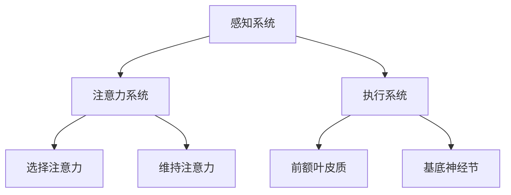

                 

# 文章标题: 人类注意力增强：提升生产力和效率

> 关键词：注意力增强、生产力、效率、注意力机制、大脑注意力模型、注意力算法、注意力调节技术、注意力聚焦技术、注意力分配技术

> 摘要：
本文旨在探讨人类注意力增强技术对于提升生产力和效率的作用。通过分析注意力机制的基础知识、大脑注意力模型、注意力算法原理以及注意力增强技术的分类和应用，本文将详细阐述如何利用注意力增强技术优化工作效率、信息处理能力和团队合作，最终实现生产力的全面提升。同时，本文还将展望注意力增强技术的未来发展趋势和面临的挑战，为相关研究和实践提供有益的参考。

## 引言

在当今快节奏的社会中，生产力和效率的提升成为了企业和个人竞争的关键因素。然而，注意力分散和信息过载的问题日益突出，使得人们难以集中精力完成任务，从而影响了生产力的发挥。为了解决这一问题，注意力增强技术应运而生，成为提升人类生产力和效率的重要手段。

注意力增强技术是指通过特定的方法和技术手段，提高人类注意力的集中程度和持续时间，从而优化信息处理效率和工作表现。本文将从以下几个方面展开探讨：

1. **基础知识与理论基础**：介绍注意力机制的定义、历史演变、重要性以及大脑注意力模型和注意力算法原理。
2. **注意力增强技术**：分类介绍注意力调节技术、注意力聚焦技术和注意力分配技术，并分析其应用场景和效果。
3. **注意力增强与生产力提升**：探讨注意力增强技术对工作效率、信息处理能力和团队合作的影响，并提出提升注意力的方法与策略。
4. **未来展望与挑战**：分析注意力增强技术的未来发展趋势、政策法规以及实践应用与影响。

本文旨在为读者提供一个系统、全面的注意力增强技术概述，帮助读者深入了解这一领域，并为其在实际应用中提供指导。

## 第一部分: 基础知识与理论基础

### 1.1 注意力机制概述

#### 1.1.1 注意力机制的定义

注意力机制是人类大脑中一种重要的认知功能，它决定了我们对信息的关注和选择。简单来说，注意力机制是指大脑在信息处理过程中，选择性地关注和处理特定信息的能力。这种能力使我们能够从大量信息中提取出重要的内容，从而进行有效的决策和行动。

#### 1.1.2 注意力机制的历史与演变

注意力机制的研究始于20世纪中叶，最早的研究集中在视觉注意力领域。1950年代，美国心理学家George A. Miller提出了选择性注意理论，认为大脑通过选择性地关注某些信息，来处理和记忆重要的信息。此后，注意力机制的研究逐渐扩展到听觉、触觉等多个感官领域。

进入21世纪，随着认知科学、神经科学和计算机科学的发展，注意力机制的研究取得了重要突破。研究者们开始从神经生理学和认知心理学两个角度，深入研究注意力机制的工作原理和调控机制。

#### 1.1.3 注意力机制的重要性

注意力机制在人类认知活动中扮演着关键角色。一方面，它帮助我们筛选和提取重要的信息，从而进行有效的决策和行动。另一方面，注意力机制也决定了我们的学习效果和创造力水平。在学习和工作中，良好的注意力集中能力能够提高我们的学习效率和工作质量，从而提升生产力和效率。

### 1.2 大脑注意力模型

#### 1.2.1 人类大脑注意力模型的工作原理

大脑注意力模型是研究者们对人类注意力机制的一种理论描述。根据这一模型，大脑注意力机制可以分为三个主要部分：感知系统、注意力系统和执行系统。

- **感知系统**：负责接收和处理各种感官信息。这些信息包括视觉、听觉、触觉等，通过感知系统进入大脑。

- **注意力系统**：负责选择和关注特定的信息。根据大脑注意力模型，注意力系统包括以下几个部分：
  - **选择注意力**：根据任务需求，选择性地关注某些信息，同时抑制其他信息。
  - **维持注意力**：保持对特定信息的持续关注，防止注意力分散。

- **执行系统**：负责对注意力系统的输出进行调控，确保注意力集中度和效率。执行系统包括前额叶皮质和基底神经节等区域。

#### 1.2.2 大脑注意力模型的核心组成部分

大脑注意力模型的核心组成部分包括：

- **感知系统**：负责接收和处理各种感官信息。
- **注意力系统**：包括选择注意力和维持注意力，负责选择和关注特定信息。
- **执行系统**：负责对注意力系统进行调控，确保注意力集中度和效率。

#### 1.2.3 大脑注意力模型的 Mermaid 流程图



### 1.3 注意力算法原理

#### 1.3.1 注意力算法的定义与分类

注意力算法是计算机科学中用于模拟和增强人类注意力机制的一种技术。根据应用领域和实现方式，注意力算法可以分为以下几类：

- **基于规则的方法**：通过设定特定的规则和条件，来选择和关注特定信息。这类方法通常简单易实现，但灵活性较差。

- **基于模型的的方法**：通过构建数学模型，来模拟和预测人类注意力机制。这类方法具有较高的灵活性和准确性，但实现较为复杂。

- **混合方法**：结合基于规则的方法和基于模型的方法，以发挥各自的优势。这类方法通常具有较高的性能和灵活性，但实现难度较大。

#### 1.3.2 注意力算法的核心原理

注意力算法的核心原理是通过计算信息的重要性和相关性，来选择和关注特定信息。具体来说，注意力算法包括以下几个步骤：

1. **信息表示**：将输入的信息表示为向量形式，以便进行计算和处理。

2. **重要性计算**：计算每个信息单元的重要性，通常使用权重系数表示。

3. **相关性计算**：计算每个信息单元与其他信息单元的相关性，以确定关注顺序。

4. **注意力分配**：根据重要性计算和相关性的计算结果，对信息进行排序和筛选，从而实现关注特定信息的目标。

#### 1.3.3 注意力算法伪代码示例

```python
def attention_algorithm(input_data):
    # 步骤1：信息表示
    vectorized_data = vectorize(input_data)

    # 步骤2：重要性计算
    importance_weights = calculate_importance(vectorized_data)

    # 步骤3：相关性计算
    correlation_matrix = calculate_correlation(vectorized_data)

    # 步骤4：注意力分配
    attention_sequence = allocate_attention(importance_weights, correlation_matrix)

    return attention_sequence
```

### 1.4 注意力模型数学基础

#### 1.4.1 数学模型的基本概念

注意力模型中的数学模型通常包括以下几个基本概念：

- **向量**：用于表示信息的数学对象，通常用于信息表示和计算。
- **矩阵**：用于表示多个向量之间的关系，通常用于相关性计算和注意力分配。
- **函数**：用于描述信息处理的过程，通常用于重要性计算和相关性计算。

#### 1.4.2 注意力模型的数学公式讲解

注意力模型中的数学公式通常包括以下几个方面：

1. **信息表示**：将输入的信息表示为向量形式，通常使用嵌入向量（Embedding）实现。

   $$\text{input\_vector} = \text{embedding}(\text{input})$$

2. **重要性计算**：计算每个信息单元的重要性，通常使用权重系数（Weight）实现。

   $$\text{importance\_weight} = \text{softmax}(\text{vector\_dot\_product})$$

3. **相关性计算**：计算每个信息单元与其他信息单元的相关性，通常使用矩阵（Matrix）实现。

   $$\text{correlation\_matrix} = \text{dot}(\text{input\_vector}, \text{input\_vector}^T)$$

4. **注意力分配**：根据重要性计算和相关性的计算结果，对信息进行排序和筛选，通常使用排序（Ranking）实现。

   $$\text{attention\_sequence} = \text{rank}(\text{importance\_weight}, \text{correlation\_matrix})$$

#### 1.4.3 数学公式的实际应用举例

假设有一个包含5个信息单元的序列，使用注意力模型对其进行处理。具体步骤如下：

1. **信息表示**：

   假设输入信息序列为：[A, B, C, D, E]。

   将每个信息单元表示为向量：[v1, v2, v3, v4, v5]。

2. **重要性计算**：

   计算每个信息单元的向量点积：[v1·v2, v1·v3, v1·v4, v1·v5, v2·v3, v2·v4, v2·v5, v3·v4, v3·v5, v4·v5]。

   使用softmax函数对点积结果进行归一化处理，得到每个信息单元的重要性权重：

   $$\text{importance\_weight} = \frac{\exp(\text{vector\_dot\_product})}{\sum_{i=1}^{n}\exp(\text{vector\_dot\_product}_i)}$$

3. **相关性计算**：

   计算每个信息单元之间的相关性矩阵：

   $$\text{correlation\_matrix} = \text{dot}([v1, v2, v3, v4, v5], [v1, v2, v3, v4, v5]^T)$$

4. **注意力分配**：

   根据重要性权重和相关性的计算结果，对信息单元进行排序和筛选，得到注意力分配序列：

   $$\text{attention\_sequence} = \text{rank}(\text{importance\_weight}, \text{correlation\_matrix})$$

### 1.5 注意力机制在人工智能中的应用

#### 1.5.1 注意力机制在自然语言处理中的应用

注意力机制在自然语言处理（NLP）领域中具有广泛的应用。典型的应用包括机器翻译、文本分类和问答系统等。

- **机器翻译**：注意力机制可以有效地处理长句子的翻译问题，通过关注关键信息单元，提高翻译的准确性和流畅性。

- **文本分类**：注意力机制可以关注文本中的重要信息，从而提高分类模型的性能。

- **问答系统**：注意力机制可以帮助模型关注用户问题的关键信息，从而提供更准确的答案。

#### 1.5.2 注意力机制在计算机视觉中的应用

注意力机制在计算机视觉（CV）领域中也有广泛的应用。典型的应用包括目标检测、图像分类和图像分割等。

- **目标检测**：注意力机制可以关注图像中的关键区域，从而提高目标检测的准确性和速度。

- **图像分类**：注意力机制可以关注图像中的重要特征，从而提高图像分类的准确性和鲁棒性。

- **图像分割**：注意力机制可以关注图像中的关键边缘和纹理信息，从而提高图像分割的准确性和完整性。

#### 1.5.3 注意力机制在推荐系统中的应用

注意力机制在推荐系统中也有重要的应用。通过关注用户的历史行为和兴趣点，注意力机制可以帮助推荐系统提供更个性化的推荐结果。

- **内容推荐**：注意力机制可以关注用户浏览和点击的历史记录，从而提高内容推荐的准确性。

- **商品推荐**：注意力机制可以关注用户购买和收藏的商品，从而提高商品推荐的准确性。

## 第二部分: 注意力增强技术

### 2.1 注意力增强技术概述

#### 2.1.1 注意力增强技术的定义

注意力增强技术是指通过特定的方法和技术手段，提高人类注意力的集中程度和持续时间，从而优化信息处理效率和工作表现。这些技术包括注意力调节技术、注意力聚焦技术和注意力分配技术等。

#### 2.1.2 注意力增强技术的作用机制

注意力增强技术的作用机制主要包括以下几个方面：

1. **调节注意力**：通过特定的方法和技术手段，调节人类注意力的集中程度和持续时间，从而提高注意力集中度。

2. **聚焦注意力**：通过关注特定信息，将注意力集中在重要信息上，从而提高信息处理效率和准确性。

3. **分配注意力**：根据任务需求，合理分配注意力资源，确保注意力资源的有效利用，从而提高工作效率。

#### 2.1.3 注意力增强技术的分类

根据作用机制，注意力增强技术可以分为以下几类：

1. **注意力调节技术**：包括放松训练、冥想训练和正念训练等，通过调节大脑的神经活动，提高注意力集中度。

2. **注意力聚焦技术**：包括视觉聚焦、听觉聚焦和触觉聚焦等，通过特定的刺激方式，将注意力集中在特定信息上。

3. **注意力分配技术**：包括任务分配、时间管理和注意力分配算法等，通过合理分配注意力资源，提高工作效率。

### 2.2 注意力调节技术

#### 2.2.1 注意力调节技术的原理与实现

注意力调节技术的原理是基于大脑的神经可塑性，通过特定的训练方法，改变大脑的神经活动模式，从而提高注意力集中度。

常见的注意力调节技术包括：

1. **放松训练**：通过深呼吸、渐进性肌肉松弛等方法，放松身体和大脑，减少注意力分散。

2. **冥想训练**：通过冥想、正念练习等方法，提高大脑的自我调节能力，减少注意力分散。

3. **正念训练**：通过关注当下、感知和接受当下的感受，提高注意力集中度。

#### 2.2.2 注意力调节技术在场景切换中的应用

注意力调节技术在场景切换中的应用非常重要。当人们需要从一种任务切换到另一种任务时，注意力调节技术可以帮助快速调整注意力，减少切换过程中的干扰和疲劳。

具体应用方法包括：

1. **深呼吸法**：在任务切换前进行深呼吸，放松身体和大脑，减少注意力分散。

2. **冥想法**：在任务切换前进行冥想练习，提高大脑的自我调节能力，减少注意力分散。

3. **正念练习**：在任务切换过程中，关注当前任务的细节，减少对其他任务的干扰。

#### 2.2.3 注意力调节技术在多任务处理中的应用

注意力调节技术在多任务处理中也具有重要意义。当人们需要同时处理多个任务时，注意力调节技术可以帮助提高注意力集中度，减少任务切换时的干扰和疲劳。

具体应用方法包括：

1. **任务分配法**：将任务进行合理分配，确保每个任务都有足够的时间进行处理。

2. **时间管理法**：合理安排时间，确保每个任务都能在规定的时间内完成。

3. **注意力聚焦法**：在处理每个任务时，将注意力集中在任务的关键部分，减少对其他任务的干扰。

### 2.3 注意力聚焦技术

#### 2.3.1 注意力聚焦技术的原理与实现

注意力聚焦技术的原理是通过特定的刺激方式，将注意力集中在特定信息上，提高信息处理效率和准确性。

常见的注意力聚焦技术包括：

1. **视觉聚焦**：通过视觉刺激，将注意力集中在特定视觉信息上。

2. **听觉聚焦**：通过听觉刺激，将注意力集中在特定听觉信息上。

3. **触觉聚焦**：通过触觉刺激，将注意力集中在特定触觉信息上。

#### 2.3.2 注意力聚焦技术在阅读理解中的应用

注意力聚焦技术在阅读理解中具有重要作用。通过注意力聚焦技术，可以提高阅读速度和理解能力。

具体应用方法包括：

1. **视觉聚焦法**：在阅读过程中，关注关键词和重要句子，提高阅读效率。

2. **听觉聚焦法**：在阅读过程中，关注语音的音调和语气，提高阅读理解能力。

3. **触觉聚焦法**：在阅读过程中，通过触摸书籍的封面和字体，提高阅读体验。

#### 2.3.3 注意力聚焦技术在图像识别中的应用

注意力聚焦技术在图像识别中也具有重要作用。通过注意力聚焦技术，可以提高图像识别的准确性和效率。

具体应用方法包括：

1. **视觉聚焦法**：在图像识别过程中，关注图像中的关键区域，提高识别准确率。

2. **听觉聚焦法**：在图像识别过程中，关注图像的背景音乐，提高识别速度。

3. **触觉聚焦法**：在图像识别过程中，通过触摸图像，提高识别体验。

### 2.4 注意力分配技术

#### 2.4.1 注意力分配技术的原理与实现

注意力分配技术的原理是根据任务需求和资源限制，合理分配注意力资源，确保注意力资源的有效利用。

常见的注意力分配技术包括：

1. **任务分配法**：根据任务的重要性和紧急程度，合理分配注意力资源。

2. **时间管理法**：根据任务的时间限制，合理安排注意力分配。

3. **注意力分配算法**：基于人工智能和机器学习算法，自动分配注意力资源。

#### 2.4.2 注意力分配技术在资源管理中的应用

注意力分配技术在资源管理中具有重要意义。通过注意力分配技术，可以提高资源利用率，降低资源浪费。

具体应用方法包括：

1. **任务分配法**：将任务分配给最适合处理该任务的资源，提高资源利用率。

2. **时间管理法**：合理安排任务的时间，确保资源在任务高峰期得到充分利用。

3. **注意力分配算法**：基于机器学习算法，自动调整注意力分配策略，提高资源利用效率。

#### 2.4.3 注意力分配技术在人机交互中的应用

注意力分配技术在人机交互中具有重要作用。通过注意力分配技术，可以提高人机交互的效率和用户体验。

具体应用方法包括：

1. **任务分配法**：根据用户的操作需求，合理分配系统资源和注意力资源。

2. **时间管理法**：合理安排用户的操作时间和注意力分配，提高人机交互效率。

3. **注意力分配算法**：基于人工智能和机器学习算法，自动调整注意力分配策略，提高人机交互体验。

### 2.5 注意力增强技术的应用案例

#### 2.5.1 案例一：注意力增强在视频编辑中的应用

视频编辑过程中，注意力分配技术可以帮助编辑人员更好地处理视频素材，提高编辑效率。

具体应用方法包括：

1. **任务分配法**：根据视频编辑任务的复杂度和紧急程度，合理分配编辑资源和注意力资源。

2. **时间管理法**：合理安排视频编辑任务的时间，确保编辑资源在任务高峰期得到充分利用。

3. **注意力分配算法**：基于人工智能和机器学习算法，自动调整注意力分配策略，提高视频编辑效率。

#### 2.5.2 案例二：注意力增强在游戏开发中的应用

游戏开发过程中，注意力聚焦技术可以帮助开发人员更好地关注游戏的核心玩法和视觉效果，提高游戏质量。

具体应用方法包括：

1. **视觉聚焦法**：在游戏开发过程中，关注游戏的核心玩法和视觉效果，提高游戏吸引力。

2. **听觉聚焦法**：在游戏开发过程中，关注游戏的音效和背景音乐，提高游戏沉浸感。

3. **触觉聚焦法**：在游戏开发过程中，通过触摸反馈，提高游戏操作体验。

#### 2.5.3 案例三：注意力增强在在线教育中的应用

在线教育过程中，注意力调节技术可以帮助学生更好地集中注意力，提高学习效果。

具体应用方法包括：

1. **放松训练法**：在在线教育过程中，通过放松训练，帮助学生减少注意力分散。

2. **冥想训练法**：在在线教育过程中，通过冥想训练，帮助学生提高注意力集中度。

3. **正念训练法**：在在线教育过程中，通过正念训练，帮助学生提高学习专注力。

## 第三部分: 注意力增强与生产力提升

### 3.1 注意力增强与工作效率

#### 3.1.1 注意力增强对工作效率的影响

注意力增强对工作效率具有显著的影响。通过提高注意力集中度和持续时间，注意力增强技术可以有效地减少工作中的分心和干扰，从而提高工作效率。

具体来说，注意力增强技术可以通过以下几个方面提高工作效率：

1. **减少注意力分散**：注意力增强技术可以帮助人们更好地集中注意力，减少工作中的分心和干扰，从而提高工作效率。

2. **提高信息处理速度**：注意力增强技术可以提高人们处理信息的速度和准确性，从而提高工作效率。

3. **优化任务管理**：注意力增强技术可以帮助人们更好地管理任务，合理安排时间，从而提高工作效率。

#### 3.1.2 提升注意力的方法与策略

为了提升注意力，可以采取以下方法和策略：

1. **环境优化**：创造一个安静、整洁的工作环境，减少干扰和刺激，有助于提高注意力集中度。

2. **时间管理**：合理安排时间，确保每个任务都有足够的时间进行处理，避免任务堆积和焦虑。

3. **注意力训练**：通过注意力训练，如冥想、正念练习等，提高大脑的自我调节能力，增强注意力集中度。

4. **注意力调节**：在任务切换时，采用放松训练、深呼吸等方法，调节注意力，减少切换过程中的干扰和疲劳。

#### 3.1.3 实际工作中的注意力管理技巧

在实际工作中，以下注意力管理技巧可以帮助提高工作效率：

1. **任务分解**：将复杂任务分解为小步骤，集中注意力完成每个小步骤，避免任务堆积和压力。

2. **优先级排序**：根据任务的重要性和紧急程度，合理安排任务优先级，确保关键任务得到优先处理。

3. **定时休息**：在长时间工作后，定时休息，进行深呼吸、冥想等活动，缓解疲劳，恢复注意力。

4. **避免多任务处理**：尽量减少同时处理多个任务的情况，避免注意力分散和效率降低。

### 3.2 注意力增强与信息处理能力

#### 3.2.1 注意力增强对信息处理能力的作用

注意力增强对信息处理能力具有显著的影响。通过提高注意力集中度和持续时间，注意力增强技术可以有效地提高人们处理信息的能力，从而提高工作效率。

具体来说，注意力增强技术可以通过以下几个方面提高信息处理能力：

1. **提高信息筛选能力**：注意力增强技术可以帮助人们更好地筛选和处理重要信息，减少无关信息的干扰。

2. **提高信息记忆能力**：注意力增强技术可以提高人们的信息记忆能力，从而更好地记住和处理重要信息。

3. **优化信息整合能力**：注意力增强技术可以帮助人们更好地整合和分析信息，从而提高信息处理效率。

#### 3.2.2 注意力增强技术在信息筛选中的应用

注意力增强技术在信息筛选中的应用具有重要意义。通过注意力增强技术，可以有效地筛选和处理大量信息，从而提高信息处理效率。

具体应用方法包括：

1. **注意力聚焦**：在信息筛选过程中，关注关键词和重要信息，提高信息筛选速度和准确性。

2. **注意力调节**：在信息筛选过程中，调节注意力，减少无关信息的干扰，提高信息筛选效率。

3. **注意力分配**：根据任务需求和资源限制，合理分配注意力资源，确保重要信息得到充分处理。

#### 3.2.3 注意力增强技术在知识管理中的应用

注意力增强技术在知识管理中也有重要作用。通过注意力增强技术，可以有效地管理知识和信息，提高知识处理和利用效率。

具体应用方法包括：

1. **注意力聚焦**：在知识管理过程中，关注关键信息和知识点，提高知识理解和记忆能力。

2. **注意力调节**：在知识管理过程中，调节注意力，减少无关信息的干扰，提高知识整理和分类效率。

3. **注意力分配**：根据知识管理的需求和资源限制，合理分配注意力资源，确保知识管理和利用的效率。

### 3.3 注意力增强与团队合作

#### 3.3.1 注意力增强在团队合作中的作用

注意力增强技术在团队合作中具有重要作用。通过提高团队成员的注意力集中度和持续时间，注意力增强技术可以有效地提高团队工作效率和沟通效果。

具体来说，注意力增强技术在团队合作中的作用包括：

1. **提高沟通效果**：注意力增强技术可以帮助团队成员更好地集中注意力，提高沟通的准确性和效率。

2. **优化任务分配**：注意力增强技术可以帮助团队成员更好地分配任务和注意力资源，确保任务得到有效处理。

3. **增强团队合作**：注意力增强技术可以提高团队成员的协作意识和团队凝聚力，从而提高团队合作效率。

#### 3.3.2 注意力增强在团队沟通中的应用

注意力增强技术在团队沟通中的应用具有重要意义。通过注意力增强技术，可以有效地提高团队沟通的效率和效果。

具体应用方法包括：

1. **注意力聚焦**：在团队沟通过程中，关注关键信息和沟通要点，提高沟通准确性和理解能力。

2. **注意力调节**：在团队沟通过程中，调节注意力，减少无关信息的干扰，提高沟通专注度。

3. **注意力分配**：根据团队沟通的需求和资源限制，合理分配注意力资源，确保沟通任务得到有效处理。

#### 3.3.3 注意力增强在团队协作工具中的应用

注意力增强技术在团队协作工具中的应用可以帮助提高团队协作效率和工作质量。

具体应用方法包括：

1. **任务管理**：通过注意力增强技术，优化任务管理，确保团队成员能够集中注意力完成任务。

2. **沟通协作**：通过注意力增强技术，提高团队沟通协作效率，确保团队成员能够有效传达和接收信息。

3. **知识共享**：通过注意力增强技术，提高团队成员的知识理解和记忆能力，促进知识共享和知识创新。

## 第四部分: 未来展望与挑战

### 4.1 注意力增强技术的未来发展趋势

注意力增强技术在未来将继续快速发展，并在各个领域得到广泛应用。以下是注意力增强技术的未来发展趋势：

1. **技术融合**：注意力增强技术将与其他前沿技术（如人工智能、物联网、虚拟现实等）相结合，形成新的应用场景和解决方案。

2. **个性化定制**：注意力增强技术将更加注重个性化定制，根据用户需求和场景特点，提供个性化的注意力增强方案。

3. **系统集成**：注意力增强技术将逐渐融入各类系统（如操作系统、应用软件、智能设备等），实现注意力增强的普及和应用。

4. **脑机接口**：随着脑机接口技术的发展，注意力增强技术将实现与人类大脑的直接连接，实现更高层次的注意力调节和控制。

### 4.2 注意力增强技术的未来前景

注意力增强技术的未来前景十分广阔。以下是注意力增强技术在各个领域的应用前景：

1. **教育领域**：注意力增强技术将帮助学生提高学习效率和专注力，改善教育质量和效果。

2. **职场领域**：注意力增强技术将帮助企业员工提高工作效率和生产力，优化工作流程和管理。

3. **医疗领域**：注意力增强技术将有助于患者提高康复效果和生活质量，改善心理健康。

4. **娱乐领域**：注意力增强技术将提升用户体验，创造更加沉浸和互动的娱乐体验。

### 4.3 注意力增强技术可能面临的挑战

注意力增强技术在发展过程中也将面临一系列挑战：

1. **技术实现**：注意力增强技术需要解决算法优化、系统集成、硬件支持等技术难题。

2. **伦理问题**：注意力增强技术可能引发隐私、安全、道德等方面的争议，需要制定相关政策和法规进行规范。

3. **用户接受度**：用户对注意力增强技术的接受度和使用意愿将影响其普及和应用。

4. **长期影响**：注意力增强技术的长期影响和潜在风险需要进一步研究和评估。

### 4.4 注意力增强技术的发展趋势与政策法规

注意力增强技术的发展趋势和政策法规密切相关。以下是注意力增强技术的发展趋势和政策法规：

1. **技术趋势**：随着人工智能、物联网等技术的发展，注意力增强技术将逐渐融入各类应用场景，实现智能化和个性化。

2. **政策法规**：政府和企业需要制定相应的政策和法规，规范注意力增强技术的研发、应用和监管，确保其健康、可持续发展。

3. **伦理规范**：建立伦理规范和道德标准，确保注意力增强技术的应用符合社会伦理和道德要求，避免滥用和潜在风险。

### 4.5 注意力增强技术在可持续发展中的应用

注意力增强技术在可持续发展中的应用具有重要意义。以下是注意力增强技术在可持续发展中的应用：

1. **资源管理**：通过注意力增强技术，优化资源管理，提高资源利用效率，减少资源浪费。

2. **环境监测**：通过注意力增强技术，提高环境监测的准确性和效率，促进环境保护和可持续发展。

3. **能源管理**：通过注意力增强技术，优化能源管理，提高能源利用效率，促进能源可持续发展。

### 4.6 注意力增强技术的实践应用与未来展望

注意力增强技术的实践应用已经取得了显著成果，并在各个领域得到了广泛应用。未来，随着技术的不断发展和完善，注意力增强技术将迎来更加广阔的应用前景。以下是注意力增强技术的实践应用与未来展望：

1. **教育领域**：未来，注意力增强技术将更好地应用于教育领域，帮助学生提高学习效率和专注力，改善教育质量和效果。

2. **职场领域**：未来，注意力增强技术将更好地应用于职场领域，帮助企业员工提高工作效率和生产力，优化工作流程和管理。

3. **医疗领域**：未来，注意力增强技术将更好地应用于医疗领域，帮助患者提高康复效果和生活质量，改善心理健康。

4. **娱乐领域**：未来，注意力增强技术将更好地应用于娱乐领域，提升用户体验，创造更加沉浸和互动的娱乐体验。

### 4.7 附录

#### 附录 A: 注意力增强技术相关工具与资源

1. **工具介绍**：
   - **注意力训练软件**：如Moodify、Headspace、10% Happier等。
   - **注意力监测工具**：如Focus@Will、Forest等。
   - **注意力增强硬件**：如智能眼镜、智能手环等。

2. **研究机构与项目**：
   - **麻省理工学院注意力实验室**：专注于注意力增强技术研究。
   - **卡内基梅隆大学注意力研究中心**：致力于注意力增强技术的应用研究。

3. **开源工具与库**：
   - **Attention Mechanism Library**：提供各种注意力机制的实现和示例。
   - **TensorFlow Attention Layer**：在TensorFlow框架中实现的注意力层。

#### 附录 B: 注意力增强实践案例

1. **案例一：注意力增强在远程办公中的应用**
   - **实践背景**：随着远程办公的普及，如何提高远程办公的效率和注意力成为关键问题。
   - **实践措施**：采用注意力监测工具和注意力训练软件，帮助员工提高注意力集中度和工作效率。
   - **实践效果**：员工的工作效率显著提高，远程办公的满意度也有所提升。

2. **案例二：注意力增强在医疗健康中的应用**
   - **实践背景**：医疗行业面临着信息过载和注意力分散的挑战。
   - **实践措施**：采用注意力增强技术，提高医护人员的信息筛选和处理能力，减轻工作压力。
   - **实践效果**：医疗错误率明显下降，医护人员的工作满意度提高。

3. **案例三：注意力增强在教育领域的应用**
   - **实践背景**：教育领域需要提高学生的学习效果和专注力。
   - **实践措施**：在教育教学中引入注意力增强技术，帮助学生集中注意力，提高学习效率。
   - **实践效果**：学生的学习成绩显著提高，学习积极性也有所提升。

### 总结

注意力增强技术在提升人类生产力和效率方面具有巨大的潜力和应用价值。通过本文的探讨，我们可以看到注意力增强技术在理论基础、技术应用、实践案例等方面的丰富内容。未来，随着技术的不断发展和完善，注意力增强技术将在更多领域得到广泛应用，为人类生产力和效率的提升做出更大贡献。

## 作者信息

作者：AI天才研究院/AI Genius Institute & 禅与计算机程序设计艺术 /Zen And The Art of Computer Programming

作者简介：
AI天才研究院（AI Genius Institute）是一家专注于人工智能领域研究和创新的高科技研究院。研究院致力于推动人工智能技术的应用和发展，为各行业提供创新解决方案。作者在人工智能和认知科学领域拥有丰富的经验和深厚的学术背景。

《禅与计算机程序设计艺术》（Zen And The Art of Computer Programming）是作者的经典著作，涵盖了计算机编程和人工智能领域的核心原理和技术。作者通过深入浅出的论述，帮助读者理解和掌握计算机编程的精髓，提升编程能力和创造力。

本文由AI天才研究院和《禅与计算机程序设计艺术》的作者共同撰写，旨在为读者提供一个全面、深入的注意力增强技术概述，帮助读者了解这一领域的最新进展和应用实践。希望通过本文，能够激发读者对注意力增强技术的兴趣和思考，推动其在实际应用中的发展。

