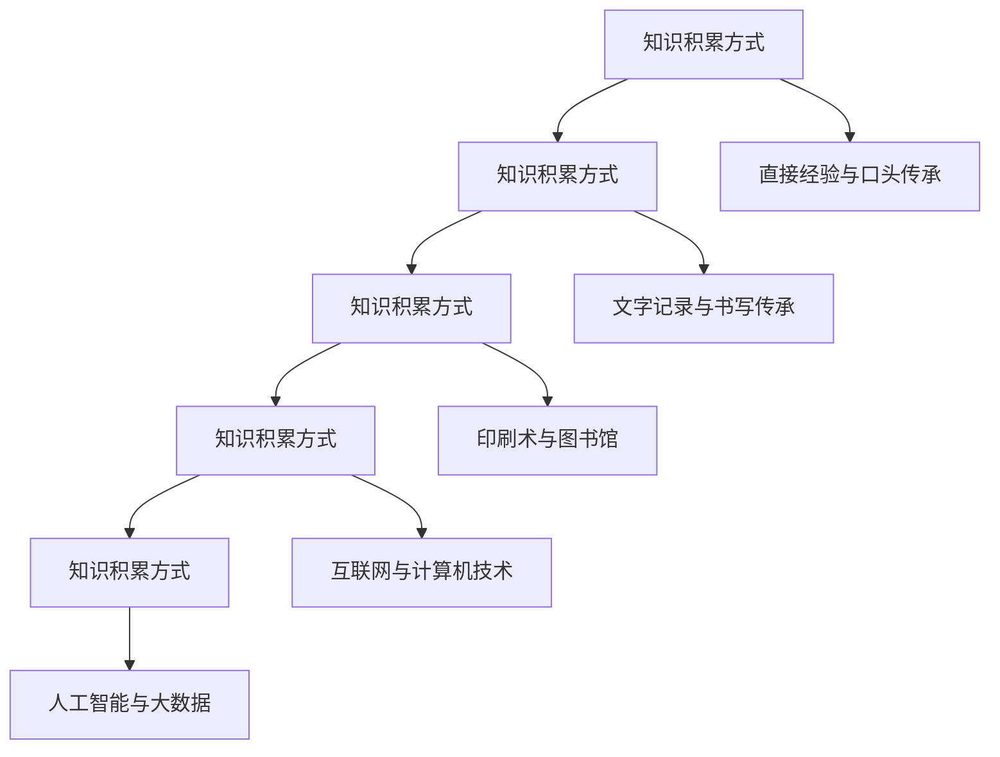

                 

# 《人类知识的进化论：从猿猴到人工智能》

> 关键词：人类知识进化、猿猴行为、人工智能、深度学习、伦理与社会责任

> 摘要：本文通过分析人类知识的进化历程，从猿猴行为到现代人工智能的发展，探讨了人类知识在科技进步中的重要作用，并探讨了人工智能在未来社会中的角色和影响。

## 第1章 引言：人类知识的进化背景与重要性

### 1.1 人类知识的定义与分类

人类知识是指人类在长期实践中积累的经验、理论、方法和价值观的总和。按照不同的分类标准，人类知识可以分为以下几类：

1. **自然知识**：指人类对自然界规律和现象的认识，如物理、化学、生物等自然科学知识。
2. **社会知识**：指人类对人类社会现象和规律的认识，如历史、文化、法律、经济等社会科学知识。
3. **技术知识**：指人类在工程技术、医疗、农业等领域中所掌握的知识。
4. **哲学知识**：指人类对宇宙、人生、价值等根本问题的思考和探索。

### 1.2 知识进化的重要阶段

人类知识的进化可以分为以下几个重要阶段：

1. **原始社会**：人类最初的知识主要是通过直接的观察和经验积累得到的，如对食物、水源、安全的认知。
2. **农业社会**：随着农业的发展，人类开始积累关于农作物种植、畜牧养殖等方面的知识。
3. **工业社会**：工业革命后，人类在科学技术领域取得了巨大的进步，如机械制造、电力应用、化学合成等。
4. **信息社会**：计算机和互联网技术的普及，使人类进入了信息社会，信息处理和传输成为社会的主要活动。

### 1.3 人类知识进化与现代科技的关系

现代科技的发展是人类知识进化的一个重要表现。从蒸汽机、电报到计算机、互联网，每一次科技革命都极大地推动了人类知识的发展。而现代科技的发展反过来又进一步促进了人类知识的积累和传播。例如，人工智能技术的发展使得人类能够更好地处理和分析海量数据，从而推动了科学研究的深入。

## 第2章 生物学视角：猿猴行为与智力发展

### 2.1 猿猴的社交行为与沟通方式

猿猴是人类的近亲，其行为和智力发展对人类有着重要的启示。猿猴的社交行为主要包括以下几种：

1. **群体生活**：猿猴通常生活在群体中，通过分工合作来提高生存效率。
2. **社交互动**：猿猴之间通过面部表情、肢体动作和声音来交流信息，如表达敌意、友谊或求偶。
3. **食物分享**：猿猴会通过分享食物来加强群体内成员之间的关系。

### 2.2 猿猴的智力发展与认知能力

猿猴的智力发展水平相对较高，其认知能力包括：

1. **问题解决**：猿猴能够通过观察、试错和经验积累来解决问题，如使用工具获取食物。
2. **记忆能力**：猿猴具有较好的记忆能力，能够记住食物的藏匿地点和社交信息。
3. **学习能力**：猿猴能够通过模仿和学习来适应环境变化，如学习新的食物获取方法。

### 2.3 猿猴的适应性与学习能力

猿猴的适应性和学习能力是其智力发展的关键。他们能够通过以下方式适应环境：

1. **身体适应性**：猿猴的身体结构和行为方式使其能够适应不同的生态环境。
2. **认知适应性**：猿猴能够通过改变行为策略来应对环境变化，如学习新的捕食技巧。
3. **社会适应性**：猿猴能够通过社交互动来建立和维护社会关系，提高生存机会。

## 第3章 人类文明的起源与知识积累

### 3.1 人类文明的历史概述

人类文明起源于几十万年前，经历了原始社会、农业社会、工业社会和信息社会等不同阶段。每个阶段都有其独特的知识积累方式：

1. **原始社会**：人类通过直接经验和口头传承来积累知识。
2. **农业社会**：人类开始记录文字，通过书写来传承知识。
3. **工业社会**：印刷术和图书馆的出现使知识传播更加广泛和便捷。
4. **信息社会**：互联网和计算机技术的发展使得知识积累和传播达到了前所未有的速度。

### 3.2 早期文明的知识积累与传播

早期文明的知识积累主要体现在以下方面：

1. **科学知识**：古埃及、古印度、古希腊等文明在数学、天文学、医学等领域取得了重要成就。
2. **技术知识**：古罗马、中国古代等文明在建筑、水利工程、农业技术等方面取得了显著进步。
3. **哲学知识**：古希腊、古印度、古中国等文明产生了众多哲学思想和理论。

### 3.3 古代文明的科学技术成就

古代文明在科学技术领域取得了许多重要成就，如：

1. **天文学**：古埃及、巴比伦、中国等文明编制了天文历法，对行星运动进行了观察和记录。
2. **数学**：古希腊、古印度、中国等文明在数学理论和方法方面取得了重要进展。
3. **医学**：古埃及、古希腊、古印度、中国古代等文明在医学理论和实践方面做出了巨大贡献。

## 第4章 数学与逻辑思维的发展

### 4.1 古代数学的发展与成就

古代数学的发展主要体现在以下几个方面：

1. **数学基础**：古希腊、古印度、古中国等文明为数学的发展奠定了基础，如毕达哥拉斯定理、勾股定理等。
2. **代数学**：阿拉伯数学家阿尔-花剌子米发明了代数符号，使代数成为一门独立的学科。
3. **几何学**：古希腊数学家欧几里得创立了《几何原本》，为几何学的发展奠定了基础。

### 4.2 逻辑思维的基本原理与应用

逻辑思维是数学和科学发展的基础，其基本原理包括：

1. **推理原理**：从已知的前提推导出新的结论，如三段论。
2. **证明原理**：通过逻辑推理证明一个命题的真实性。
3. **逻辑运算**：如合取、析取、否定等基本逻辑运算。

逻辑思维在科学研究和人工智能领域有着广泛的应用，如逻辑推理算法、逻辑编程等。

### 4.3 数学与逻辑思维在人工智能中的应用

数学和逻辑思维在人工智能中的应用主要体现在以下几个方面：

1. **机器学习**：使用数学模型和算法来训练机器模型，使其具备学习能力和智能决策能力。
2. **自然语言处理**：使用数学模型和算法来理解和生成自然语言，如词向量模型、语言模型等。
3. **逻辑编程**：使用逻辑推理来编程，实现智能推理和决策。

## 第5章 计算机科学与信息技术的兴起

### 5.1 计算机科学的起源与发展

计算机科学的起源可以追溯到20世纪40年代，当时第一台电子计算机问世。此后，计算机科学经历了快速的发展，主要阶段包括：

1. **电子计算机时代**：第一代计算机以电子管为主，计算机体积庞大、速度缓慢。
2. **晶体管时代**：第二代计算机使用晶体管，计算机性能得到显著提升。
3. **集成电路时代**：第三代计算机采用集成电路，计算机体积缩小、性能提高。
4. **互联网时代**：第四代计算机以互联网为核心，计算机应用范围广泛。

### 5.2 信息技术的应用与普及

信息技术的应用和普及主要体现在以下几个方面：

1. **互联网**：互联网的出现改变了人们的生活和工作方式，信息传播速度大幅提高。
2. **移动通信**：移动通信技术的发展使得人们可以随时随地进行通信，提高了沟通效率。
3. **云计算**：云计算技术使得计算资源可以按需获取，降低了企业运营成本。

### 5.3 计算机科学与人工智能的关系

计算机科学与人工智能有着密切的关系，计算机科学为人工智能提供了技术支持，如机器学习、深度学习算法等。同时，人工智能的发展也推动了计算机科学的进步，如大数据处理、物联网技术等。

## 第6章 人工智能的概念与分类

### 6.1 人工智能的定义与发展历程

人工智能（Artificial Intelligence，简称AI）是指通过计算机系统实现人类智能的功能，如感知、理解、推理、学习、决策等。人工智能的发展历程可以分为以下几个阶段：

1. **早期探索**：20世纪50年代，人工智能概念诞生，研究者开始探讨如何使计算机具有智能。
2. **符号主义**：20世纪60年代，符号主义人工智能提出，通过符号表示和逻辑推理来实现智能。
3. **专家系统**：20世纪70年代，专家系统成为人工智能研究的主要方向，通过模拟专家的决策过程来解决复杂问题。
4. **连接主义**：20世纪80年代，连接主义人工智能兴起，通过神经网络模拟人脑的计算过程。
5. **计算智能**：20世纪90年代至今，计算智能成为人工智能研究的主要方向，包括遗传算法、进化计算、模糊逻辑等。

### 6.2 人工智能的分类与特点

人工智能可以分为以下几类：

1. **弱人工智能**：弱人工智能指在特定领域具有人类智能水平的计算机系统，如语音识别、图像识别等。
2. **强人工智能**：强人工智能指具有全面人类智能水平的计算机系统，能够像人类一样进行思考、感知和行动。
3. **混合智能**：混合智能结合了弱人工智能和强人工智能的特点，能够在多个领域发挥智能作用。

### 6.3 人工智能的核心技术与挑战

人工智能的核心技术包括：

1. **机器学习**：通过训练模型从数据中学习规律和模式。
2. **深度学习**：一种基于多层神经网络的机器学习技术，能够处理复杂数据。
3. **自然语言处理**：使计算机能够理解和生成自然语言。
4. **计算机视觉**：使计算机能够理解和解释视觉信息。

人工智能面临的挑战包括：

1. **数据质量**：高质量的数据是人工智能训练的基础，但数据质量和多样性往往难以保证。
2. **算法优化**：如何设计更高效、更可靠的算法是人工智能研究的重要方向。
3. **伦理与安全**：人工智能的发展引发了一系列伦理和安全问题，如隐私保护、算法偏见等。

## 第7章 人工智能在现代社会中的应用

### 7.1 人工智能在行业中的应用

人工智能在各个行业都得到了广泛应用，如：

1. **金融行业**：人工智能在金融领域主要用于风险管理、信用评分、投资决策等。
2. **医疗行业**：人工智能在医疗领域主要用于疾病诊断、药物研发、手术机器人等。
3. **教育行业**：人工智能在教育领域主要用于个性化学习、教育评估、智能辅导等。
4. **制造业**：人工智能在制造业主要用于自动化生产、质量控制、智能物流等。

### 7.2 人工智能对社会生活的影响

人工智能对社会生活产生了深远的影响，如：

1. **生活方式**：人工智能改变了人们的生活方式，如智能家居、智能穿戴设备等。
2. **就业结构**：人工智能的发展可能导致一些传统职业的消失，同时也创造了新的就业机会。
3. **隐私保护**：人工智能在数据处理和分析中涉及到大量个人隐私，如何保护隐私成为重要议题。

### 7.3 人工智能的未来趋势与挑战

人工智能的未来趋势包括：

1. **智能化的普及**：人工智能技术将更加普及，应用到更多的领域和场景。
2. **融合技术的创新**：人工智能与其他技术的融合将带来更多创新，如物联网、5G等。
3. **智能化社会**：人工智能将推动社会向智能化方向发展，提高社会生产力和生活质量。

人工智能面临的挑战包括：

1. **技术成熟度**：人工智能技术仍需进一步成熟，提高性能和可靠性。
2. **伦理与法律**：人工智能的伦理和法律问题需要得到妥善解决，确保其发展符合社会价值观。
3. **人才短缺**：人工智能领域的人才需求巨大，但人才培养和储备仍需加强。

## 第8章 人工智能与人类知识的未来

### 8.1 人工智能对知识生产的影响

人工智能对知识生产的影响体现在以下几个方面：

1. **知识获取**：人工智能能够通过大数据分析和机器学习快速获取大量知识，提高知识获取效率。
2. **知识整合**：人工智能能够将不同来源、不同领域的知识进行整合，形成更全面、更系统的知识体系。
3. **知识创新**：人工智能能够通过模拟人类思维过程，产生新的知识，推动知识创新。

### 8.2 人工智能与人类智慧的融合

人工智能与人类智慧的融合体现在以下几个方面：

1. **协作创新**：人工智能和人类专家在知识创新、问题解决等方面进行协作，发挥各自优势。
2. **智能教育**：人工智能在教育领域的应用将推动教育模式创新，提高教育质量。
3. **智能生活**：人工智能在家庭、医疗、交通等领域的应用将使人们的生活更加便利和舒适。

### 8.3 人工智能时代的知识管理与教育

人工智能时代的知识管理与教育面临以下挑战和机遇：

1. **知识管理**：如何有效地管理和利用海量知识成为关键问题，需要建立智能化知识管理系统。
2. **教育模式**：人工智能将推动教育模式的变革，如个性化学习、混合学习等，提高教育效果。
3. **人才培养**：人工智能时代需要具备人工智能知识和技能的人才，如何培养这类人才成为重要议题。

## 第9章 人工智能的伦理与社会责任

### 9.1 人工智能的伦理问题与挑战

人工智能的伦理问题主要包括：

1. **隐私保护**：人工智能在数据处理过程中可能侵犯个人隐私，如何保护隐私成为重要问题。
2. **算法偏见**：人工智能算法可能存在偏见，导致不公平现象，如何避免和解决偏见成为挑战。
3. **责任归属**：在人工智能系统发生错误或导致事故时，如何确定责任归属成为问题。

### 9.2 人工智能的社会责任与规范

人工智能的社会责任主要包括：

1. **公正公平**：人工智能应遵循公正公平原则，确保所有人都能公平地享受人工智能带来的好处。
2. **透明公开**：人工智能系统的设计、开发和应用过程应透明公开，接受社会监督。
3. **可持续发展**：人工智能的发展应与可持续发展目标相结合，推动社会经济的可持续发展。

### 9.3 人工智能的未来发展之路

人工智能的未来发展之路包括以下几个方面：

1. **技术创新**：持续推动人工智能技术创新，提高人工智能的性能和可靠性。
2. **伦理规范**：建立完善的伦理规范体系，确保人工智能的发展符合社会价值观。
3. **政策支持**：政府应制定有利于人工智能发展的政策，促进人工智能产业的繁荣。
4. **国际合作**：加强国际合作，推动人工智能技术的全球发展和应用。

## 附录：参考资料与进一步阅读

### A.1 生物学与人类知识进化相关书籍

1. 《人类简史：从动物到上帝》（Yuval Noah Harari）
2. 《人类星球》（Spencer Weart）
3. 《人类进化史》（Richard Dawkins）

### A.2 计算机科学与人工智能基础书籍

1. 《人工智能：一种现代方法》（Stuart Russell & Peter Norvig）
2. 《深度学习》（Ian Goodfellow、Yoshua Bengio & Aaron Courville）
3. 《神经网络与深度学习》（邱锡鹏）

### A.3 人工智能应用案例分析

1. 《人工智能应用实践》（Tom Mitchell）
2. 《人工智能应用案例集》（周志华、张钹）
3. 《深度学习实战》（Aurélien Géron）

### A.4 人工智能伦理与社会责任相关书籍与报告

1. 《人工智能伦理导论》（Luciano Floridi）
2. 《人工智能伦理报告》（美国国家科学院、工程院等）
3. 《人工智能伦理指南》（欧盟委员会）

# Mermaid 流程图：人类知识进化过程



# 核心算法原理讲解：深度学习算法的伪代码

```python
// 伪代码：深度学习算法
function DeepLearningAlgorithm(input_data, training_data, epochs):
    # 初始化神经网络结构
    network = InitializeNeuralNetwork()

    # 进行 epochs 次迭代训练
    for epoch in 1 to epochs:
        # 计算预测值
        predicted = network.FeedForward(input_data)

        # 计算误差
        error = CalculateError(predicted, training_data.target)

        # 计算梯度
        gradients = network.BackPropagate(error)

        # 更新网络权重
        network.UpdateWeights(gradients)

    # 返回训练完成的神经网络
    return network
```

# 数学模型与公式：神经网络中的权重更新公式

$$
W_{new} = W_{old} - \alpha \cdot \nabla J(W)
$$

其中：

- $W_{new}$ 是更新后的权重
- $W_{old}$ 是旧的权重
- $\alpha$ 是学习率
- $\nabla J(W)$ 是权重 $W$ 对损失函数 $J$ 的梯度

# 项目实战：使用Python实现简单的神经网络

```python
import numpy as np

# 初始化神经网络参数
input_size = 3
hidden_size = 4
output_size = 1

# 初始化权重
W1 = np.random.rand(input_size, hidden_size)
W2 = np.random.rand(hidden_size, output_size)

# 定义激活函数
def sigmoid(x):
    return 1 / (1 + np.exp(-x))

# 前向传播
def forward(x):
    z1 = np.dot(x, W1)
    a1 = sigmoid(z1)
    z2 = np.dot(a1, W2)
    a2 = sigmoid(z2)
    return a2

# 反向传播
def backward(x, y):
    output = forward(x)
    error = y - output
    d_output = error * (output * (1 - output))

    d_W2 = np.dot(a1.T, d_output)
    d_a1 = np.dot(d_output, W2.T) * (a1 * (1 - a1))

    d_x = np.dot(d_a1, W1.T)
    return d_x, d_W1, d_W2

# 训练神经网络
def train(x, y, epochs, learning_rate):
    for epoch in range(epochs):
        output = forward(x)
        error = y - output
        d_x, d_W1, d_W2 = backward(x, y)

        W1 -= learning_rate * d_W1
        W2 -= learning_rate * d_W2

# 测试神经网络
x_test = np.array([[0, 0, 1]])
y_test = np.array([[1]])

train(x_test, y_test, epochs=1000, learning_rate=0.1)

output = forward(x_test)
print("Predicted output:", output)
```

# 代码解读与分析：神经网络代码实现细节

1. **初始化参数**：初始化输入层、隐藏层和输出层的权重矩阵 `W1` 和 `W2`，这些权重是随机生成的。

2. **激活函数**：使用 sigmoid 函数作为激活函数，将输出值映射到 0 到 1 之间，实现非线性变换。

3. **前向传播**：计算输入通过网络的输出值，包括两个矩阵乘法：`z1 = np.dot(x, W1)` 和 `z2 = np.dot(a1, W2)`。然后通过 sigmoid 函数得到隐藏层和输出层的激活值。

4. **反向传播**：计算输出误差，并计算每个权重矩阵的梯度。这个过程使用了链式法则和链规则，通过两个矩阵乘法：`d_output = error * (output * (1 - output))` 和 `d_x = np.dot(d_a1, W1.T)`。

5. **权重更新**：使用梯度下降法更新权重矩阵，通过减去学习率乘以梯度来更新权重，即 `W1 -= learning_rate * d_W1` 和 `W2 -= learning_rate * d_W2`。

6. **训练神经网络**：通过循环进行多次前向传播和反向传播，逐步减少输出误差，提高模型的预测准确性。

7. **测试神经网络**：在训练完成后，使用测试数据来评估模型的性能，并输出预测结果。

这段代码展示了简单神经网络的基本工作流程，包括参数初始化、前向传播、反向传播和权重更新等步骤。在实际应用中，神经网络的结构和参数可以更加复杂，需要考虑更多的优化技术和训练策略来提高模型的性能和泛化能力。

