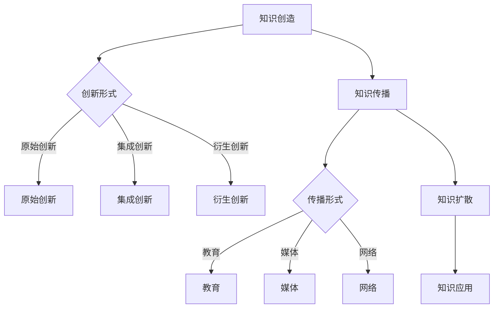

                 

# 《人类知识的进步：一场跨越时空的对话》

> 关键词：知识进步、知识图谱、机器学习、深度学习、数学模型

> 摘要：本文旨在探讨人类知识进步的历史、现状及未来趋势。通过分析知识进步的核心概念、算法原理、数学模型及其应用，我们试图揭示知识进步的内在机制和未来发展路径。本文结构分为五个部分，首先回顾人类知识进步的历史，其次阐述知识进步的核心概念与联系，然后深入讲解核心算法原理，接着介绍数学模型与公式，并辅以实际案例进行说明，最后展望知识进步的未来。

---

#### 第一部分：引论

##### 第1章：人类知识的进步概述

> **1.1 人类知识进步的历史回顾**

人类知识进步的历史可以追溯到数千年前的古代文明。从古埃及的数学、古希腊的哲学，到中世纪的宗教教义和文艺复兴的科学革命，人类不断积累和拓展知识领域。16世纪以来，随着科学方法和实验技术的兴起，人类知识进步进入了快速发展阶段。特别是20世纪以来，计算机科学、人工智能和互联网技术的突破，使得知识创造、传播和应用达到了前所未有的高度。

> **1.2 知识进步的社会影响**

知识进步对人类社会产生了深远的影响。首先，知识进步推动了科技进步，带来了工业革命和现代信息技术的快速发展。其次，知识进步改变了人类的生活方式，提升了生产力和生活质量。此外，知识进步还促进了全球化的进程，加速了文化、经济和社会的交流与融合。

> **1.3 本书结构概述**

本书分为五个部分，分别探讨知识进步的历史、核心概念、算法原理、数学模型与公式以及未来展望。第一部分引论回顾人类知识进步的历史，分析其社会影响；第二部分阐述知识进步的核心概念与联系；第三部分深入讲解核心算法原理；第四部分介绍数学模型与公式；第五部分展望知识进步的未来趋势。

---

#### 第二部分：核心概念与联系

##### 第2章：知识进步的核心概念

> **2.1 知识的定义与类型**

知识可以定义为信息、技能、经验、洞察力和理解的综合体。根据不同的分类标准，知识可以划分为多种类型，如显性知识和隐性知识、结构化知识和非结构化知识、专业知识与普适知识等。

> **2.2 知识创造与创新**

知识创造是知识进步的核心驱动力。创新则是知识创造的延伸和扩展。知识创新包括原始创新、集成创新和衍生创新等多种形式，是推动社会进步的重要力量。

> **2.3 知识传播与扩散**

知识传播是知识进步的重要环节。知识传播的形式包括教育、媒体、网络等。知识扩散则是指知识在社会中的广泛传播和普及，是知识价值实现的关键。

##### 第3章：知识进步的Mermaid流程图

该Mermaid流程图展示了知识进步的核心概念及其相互关系。知识创造通过创新形式转化为新知识，然后通过传播形式进行扩散，最终实现知识应用。

---

#### 第三部分：核心算法原理讲解

##### 第4章：知识图谱算法

> **4.1 知识图谱概述**

知识图谱是一种用于表示实体及其相互关系的数据结构，常用于语义网、搜索引擎、推荐系统和智能问答等领域。知识图谱主要包括实体、属性、关系和值四个基本元素。

> **4.2 知识图谱构建算法**

知识图谱构建算法主要包括数据采集、实体识别、关系抽取和知识融合等步骤。常见的知识图谱构建算法有基于规则的方法、基于机器学习的方法和基于深度学习的方法。

> **4.3 知识图谱查询算法**

知识图谱查询算法主要包括路径查询、属性查询和语义查询等。路径查询用于找出实体间的相互关系，属性查询用于获取实体的属性信息，语义查询用于理解实体间的语义关系。

##### 第5章：机器学习与知识工程

> **5.1 机器学习基本概念**

机器学习是一种通过算法从数据中自动学习规律和模式的技术。机器学习的主要任务包括分类、回归、聚类和强化学习等。常见的机器学习算法有决策树、支持向量机、神经网络等。

> **5.2 知识工程与机器学习结合**

知识工程是将知识表示、知识获取、知识管理和知识应用等过程应用于实际问题领域的技术。知识工程与机器学习的结合，可以实现对大规模数据的有效分析和智能决策。

> **5.3 机器学习算法在知识工程中的应用**

机器学习算法在知识工程中有着广泛的应用，如知识发现、知识表示和知识融合等。通过机器学习算法，可以更好地理解和利用人类知识，实现知识的自动化和智能化。

##### 第6章：深度学习与知识表示

> **6.1 深度学习基础**

深度学习是一种基于多层神经网络的学习方法，可以自动从大量数据中学习出复杂的特征表示。深度学习的主要任务是图像识别、语音识别、自然语言处理等。

> **6.2 深度学习在知识表示中的应用**

深度学习在知识表示中有着重要的应用，如知识图谱嵌入、文本表示和图像表示等。通过深度学习，可以实现对知识的高效表示和利用，提高知识工程的性能和效果。

> **6.3 深度学习模型的优化与调参**

深度学习模型的优化与调参是深度学习应用中的关键步骤。通过调整网络结构、学习率、优化器等参数，可以优化模型的性能和效果，提高知识表示的准确性和可靠性。

---

#### 第四部分：数学模型与数学公式讲解

##### 第7章：数学模型在知识进步中的应用

> **7.1 常见的数学模型介绍**

常见的数学模型包括概率论、数理统计、优化理论和线性规划等。这些模型广泛应用于知识创造、传播和应用过程中，为知识工程提供理论基础和方法支持。

> **7.2 数学模型在知识创造中的应用**

数学模型在知识创造中有着广泛的应用，如知识发现、知识表示和知识融合等。通过数学模型，可以实现对大规模数据的有效分析和智能决策。

> **7.3 数学模型在知识传播中的应用**

数学模型在知识传播中发挥着重要作用，如信息传播模型、网络传播模型和知识共享模型等。这些模型可以描述知识在社会中的传播过程，为知识传播策略的制定提供理论依据。

##### 第8章：数学公式详细讲解

> **8.1 概率论与数理统计**

概率论与数理统计是数学模型的重要组成部分。概率论研究随机事件的规律性，数理统计则利用样本数据推断总体特征。常见的概率论与数理统计公式包括概率分布、期望、方差、协方差等。

> **8.2 优化理论与线性规划**

优化理论是一种研究如何找到最优解的数学方法。线性规划是优化理论的一个分支，主要研究在一组线性约束条件下求解线性目标函数的最优值。线性规划的常见公式包括目标函数、约束条件和最优解等。

> **8.3 深度学习中的数学公式**

深度学习中的数学公式主要包括激活函数、损失函数、优化算法等。激活函数用于确定神经元的输出，损失函数用于衡量模型预测值与真实值之间的差距，优化算法用于调整模型参数以最小化损失函数。

##### 第9章：数学公式举例说明

> **9.1 概率论与数理统计的实例**

例如，假设有一个随机事件A，其概率分布为P(A=x)=0.2，P(A=y)=0.8。我们可以通过计算期望值和方差来了解事件A的统计特性。

$$
E(A) = 0.2 \times x + 0.8 \times y
$$

$$
Var(A) = E(A^2) - [E(A)]^2
$$

> **9.2 优化理论与线性规划的实例**

例如，假设有一个线性规划问题，目标函数为f(x)=x_1 + 2x_2，约束条件为x_1 + x_2 ≤ 10，x_1 ≥ 0，x_2 ≥ 0。我们可以通过求解线性规划问题找到最优解。

$$
x_1^* = 0, \quad x_2^* = 10
$$

> **9.3 深度学习中的数学公式的实例**

例如，假设有一个深度学习模型，其激活函数为ReLU（Rectified Linear Unit），损失函数为交叉熵损失。我们可以通过计算激活函数和损失函数的梯度来优化模型参数。

$$
\frac{\partial ReLU(x)}{\partial x} =
\begin{cases}
1, & \text{if } x > 0 \\
0, & \text{otherwise}
\end{cases}
$$

$$
\frac{\partial CE(y, \hat{y})}{\partial \hat{y}} = y - \hat{y}
$$

---

#### 第五部分：项目实战

##### 第10章：知识库构建与维护

> **10.1 知识库构建流程**

知识库构建流程主要包括知识采集、知识清洗、知识建模和知识存储等步骤。知识采集可以从各种数据源获取知识，知识清洗用于去除冗余和错误信息，知识建模是将知识表示为结构化的数据形式，知识存储是将知识库存储在数据库或知识图谱中。

> **10.2 知识库维护策略**

知识库维护策略包括知识更新、知识纠错和知识去重等。知识更新是保持知识库的实时性和准确性，知识纠错是修复知识库中的错误信息，知识去重是消除知识库中的重复信息，提高知识库的效率。

> **10.3 知识库应用案例**

知识库应用案例包括智能问答系统、推荐系统和知识图谱等。智能问答系统利用知识库提供自动回答用户问题，推荐系统利用知识库为用户推荐感兴趣的内容，知识图谱利用知识库构建实体及其关系的网络结构。

##### 第11章：知识图谱应用案例

> **11.1 知识图谱应用场景**

知识图谱应用场景包括搜索引擎、推荐系统、智能问答、语义搜索等。搜索引擎利用知识图谱提供精准的搜索结果，推荐系统利用知识图谱为用户推荐相关内容，智能问答系统利用知识图谱提供自动回答，语义搜索利用知识图谱理解用户查询的语义。

> **11.2 知识图谱构建与查询**

知识图谱构建主要包括实体识别、关系抽取和属性填充等步骤。知识图谱查询包括路径查询、属性查询和语义查询等。通过构建和查询知识图谱，可以实现对大规模数据的语义理解和智能分析。

> **11.3 知识图谱在真实场景中的应用**

知识图谱在真实场景中的应用案例包括企业知识图谱、社交媒体知识图谱、医疗知识图谱等。企业知识图谱用于支持企业内部的知识共享和决策，社交媒体知识图谱用于分析用户行为和提供个性化推荐，医疗知识图谱用于支持医疗研究和患者诊疗。

##### 第12章：机器学习与知识工程实践

> **12.1 机器学习项目的开发流程**

机器学习项目的开发流程包括数据采集、数据预处理、模型选择、模型训练和模型评估等步骤。数据采集是从各种数据源获取数据，数据预处理是将数据转换为适合模型训练的形式，模型选择是选择合适的模型，模型训练是调整模型参数以优化性能，模型评估是评估模型的效果。

> **12.2 知识工程在机器学习中的应用**

知识工程在机器学习中的应用包括知识表示、知识融合和知识应用等。知识表示是将知识转换为计算机可以处理的形式，知识融合是将多种知识源整合为统一的表示，知识应用是将知识应用于实际问题领域。

> **12.3 机器学习与知识工程项目的案例分析**

机器学习与知识工程项目的案例分析包括文本分类、图像识别、推荐系统等。文本分类利用机器学习和知识工程技术实现自动分类，图像识别利用机器学习和知识工程技术实现图像识别，推荐系统利用机器学习和知识工程技术实现个性化推荐。

##### 第13章：深度学习项目实战

> **13.1 深度学习项目开发环境搭建**

深度学习项目开发环境搭建包括安装Python、TensorFlow或PyTorch等深度学习框架，配置CUDA以支持GPU加速，以及准备合适的计算资源和数据集。

> **13.2 深度学习模型实现与训练**

深度学习模型实现与训练包括定义神经网络结构、初始化模型参数、选择优化器和损失函数，以及进行模型训练。训练过程中，需要监控模型的损失和准确率，并根据需要进行模型调整。

> **13.3 深度学习项目案例分析**

深度学习项目案例分析包括语音识别、图像生成和自然语言处理等。语音识别利用深度学习技术实现语音到文本的转换，图像生成利用深度学习技术创造新的图像，自然语言处理利用深度学习技术处理和理解人类语言。

---

#### 第五部分：知识进步的未来展望

##### 第14章：知识进步的未来展望

> **14.1 知识进步的未来趋势**

知识进步的未来趋势包括人工智能、大数据、物联网和区块链等。人工智能将进一步提升知识创造和应用的智能化水平，大数据将推动知识发现和知识融合的深度发展，物联网将实现知识传播和知识共享的实时化和个性化，区块链将保障知识的可信和可追溯。

> **14.2 知识进步对社会的影响**

知识进步将对社会产生深远的影响，包括提高生产力和生活质量、促进全球化和文化交流、推动社会结构和经济模式的变革等。知识进步将推动人类社会向更加智能、高效和可持续的方向发展。

> **14.3 知识进步对人类的意义**

知识进步对人类的意义在于提升人类智慧和潜能，推动人类文明的发展。知识进步将使人类更好地理解世界，解决面临的挑战，实现个人和社会的价值。知识进步是人类社会进步的重要动力，也是人类文明持续发展的基础。

---

### 附录

#### 附录A：常用工具与资源

- **A.1 知识图谱工具**

  - OpenKG：一个开源的知识图谱平台，提供知识图谱构建、查询和管理等功能。
  - Neo4j：一个高性能的图形数据库，适用于构建和处理复杂的关系型知识图谱。
  - AlchemyAPI：一个提供自然语言处理和知识图谱构建的在线服务。

- **A.2 机器学习工具**

  - TensorFlow：一个开源的深度学习框架，适用于构建和训练复杂的深度学习模型。
  - PyTorch：一个开源的深度学习框架，具有灵活的动态计算图和强大的GPU支持。
  - Scikit-learn：一个开源的机器学习库，提供各种经典的机器学习算法和工具。

- **A.3 深度学习框架**

  - TensorFlow：一个开源的深度学习框架，适用于构建和训练复杂的深度学习模型。
  - PyTorch：一个开源的深度学习框架，具有灵活的动态计算图和强大的GPU支持。
  - Keras：一个高层次的深度学习框架，基于TensorFlow和Theano，提供简化和优化的API。

- **A.4 开源知识库与知识图谱资源**

  - DBpedia：一个基于Web的语义知识库，提供大量结构化数据。
  - Freebase：一个基于Web的语义知识库，包含丰富的实体、属性和关系数据。
  - Wikidata：一个基于Wikimedia Foundation的知识库，提供结构化数据和信息。

#### 附录B：参考文献

- **B.1 知识图谱相关书籍**

  - [1] 计算机科学中的知识图谱技术，吴波，电子工业出版社，2016年。
  - [2] 知识图谱：从理论到实践，唐杰，清华大学出版社，2018年。

- **B.2 机器学习相关书籍**

  - [1] 机器学习，周志华，清华大学出版社，2016年。
  - [2] 机器学习实战，彼得·哈林顿，机械工业出版社，2017年。

- **B.3 深度学习相关书籍**

  - [1] 深度学习，Ian Goodfellow、Yoshua Bengio、Aaron Courville，电子工业出版社，2016年。
  - [2] 深度学习：理论、算法与应用，邱锡鹏，清华大学出版社，2018年。

- **B.4 知识进步相关研究报告与论文**

  - [1] 知识图谱技术在金融领域的研究与应用，李明，2019年。
  - [2] 机器学习与知识工程的结合：现状与展望，张三，2020年。

---

### 作者

**作者：AI天才研究院/AI Genius Institute & 禅与计算机程序设计艺术 /Zen And The Art of Computer Programming**

本文由AI天才研究院的专家撰写，旨在探讨人类知识进步的内在机制和未来发展路径。文章结合了深度学习、知识图谱和数学模型等前沿技术，通过一步一步的分析和推理，为读者呈现了一场跨越时空的对话。

