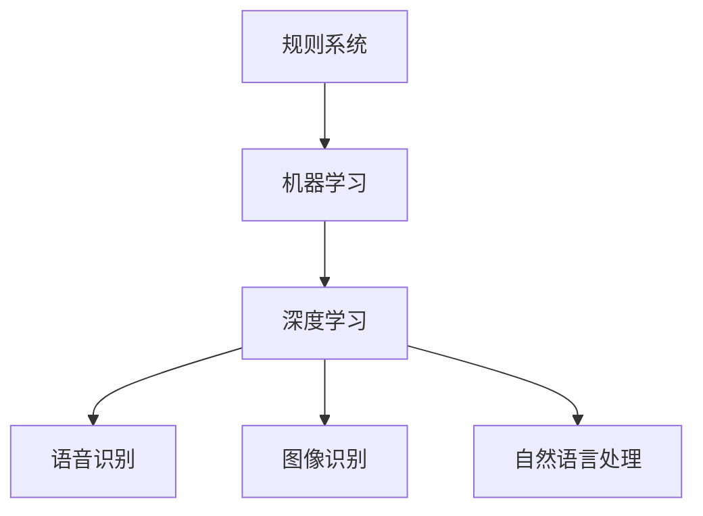
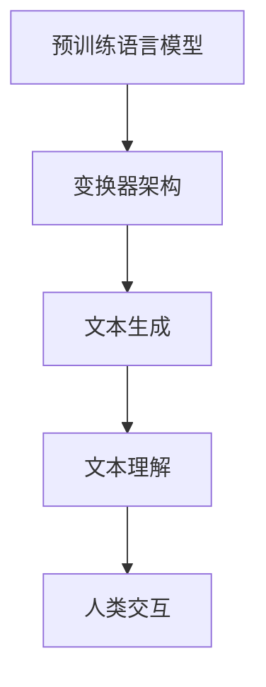
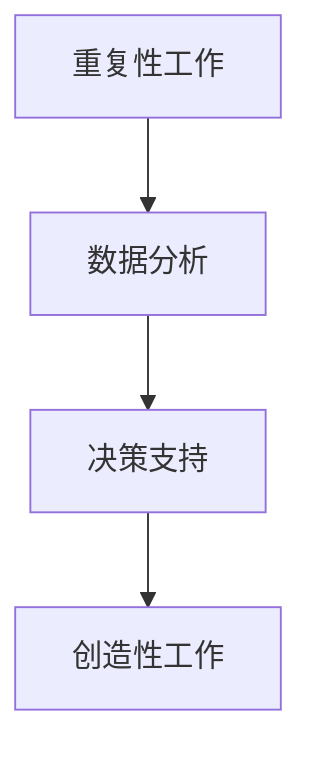
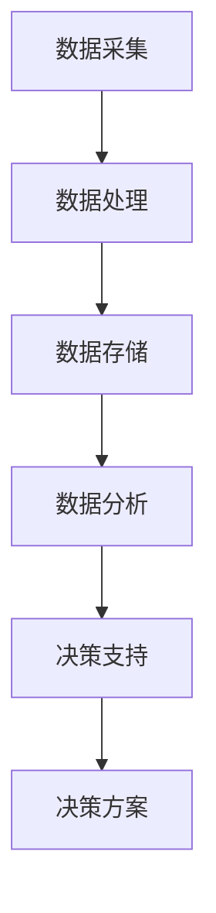
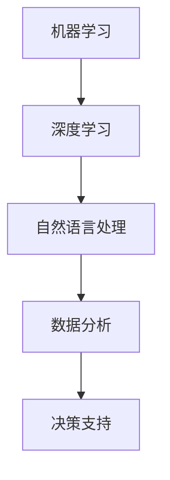

                 

# 从ChatGPT到Sora：人类未来与AI共存的工作形态

> 关键词：人工智能、工作形态、ChatGPT、Sora、协作、决策支持、人才培养、社会影响

> 摘要：随着人工智能技术的飞速发展，人类的工作形态正在经历深刻的变革。本文将探讨从ChatGPT到Sora这些先进AI工具如何影响和塑造我们的工作方式，以及人类与AI共存的工作形态。文章将从AI时代的崛起与工作形态的变革、AI与人类协作的工作模式、AI驱动的创新实践、AI时代的人才培养与职业规划、AI时代的社会影响与伦理思考、未来展望与策略建议以及AI工具与应用资源等多个角度，详细解析AI在各个领域中的应用及其对人类工作形态的深远影响。

## 目录大纲

#### 第一部分：AI时代的工作形态变革

- **第1章：AI时代的崛起与工作形态的变革**
  - **1.1 AI技术的现状与未来发展趋势**
  - **1.2 ChatGPT与未来工作形态的链接**
- **第2章：AI与人类协作的工作模式**
  - **2.1 AI与人类协作的优势与挑战**
  - **2.2 智能助理Sora的应用场景**

#### 第二部分：AI驱动的创新实践

- **第3章：AI驱动的决策支持系统**
  - **3.1 决策支持系统概述**
  - **3.2 基于AI的决策支持系统原理**
- **第4章：AI驱动的产品设计与开发**
  - **4.1 AI在产品设计与开发中的应用**
  - **4.2 实战案例：AI驱动的智能产品开发**

#### 第三部分：AI时代的人才培养与职业规划

- **第5章：AI时代的人才需求与培养**
  - **5.1 AI时代的人才特点与需求**
  - **5.2 AI时代的人才培养策略**
- **第6章：AI时代的职业发展与转型**
  - **6.1 职业发展与AI技术的融合**
  - **6.2 AI时代的职业规划实战**

#### 第四部分：AI时代的社会影响与伦理思考

- **第7章：AI时代的社会影响**
  - **7.1 AI对社会经济的推动作用**
  - **7.2 AI时代的伦理问题与挑战**
- **第8章：未来展望与策略建议**
  - **8.1 AI时代的未来趋势**
  - **8.2 AI时代的战略规划与实施**

#### 附录：AI工具与应用资源

- **附录A：AI开发工具与资源**
  - **A.1 主流AI开发框架与平台**
  - **A.2 AI应用开发指南与案例**

## 文章正文

### 第一部分：AI时代的工作形态变革

#### 第1章：AI时代的崛起与工作形态的变革

##### 1.1 AI技术的现状与未来发展趋势

人工智能（AI）作为计算机科学的一个重要分支，近年来取得了飞速的发展。从最初的规则系统，到基于统计学的机器学习算法，再到深度学习的崛起，AI技术不断突破传统计算机能力的界限。如今，AI已经在各个领域取得了显著的成果，如语音识别、图像识别、自然语言处理等。

**核心概念与联系：**

**图1-1：AI技术的基本概念与分类**

AI技术在全球范围内的应用日益广泛，从医疗健康、金融保险，到制造业、零售业，甚至日常生活，都受到了AI的深刻影响。例如，智能医疗系统通过分析海量患者数据，辅助医生进行疾病诊断和治疗方案的制定；自动驾驶技术正逐步实现商业化，有望在未来彻底改变交通出行方式。

**图1-2：AI技术在全球范围内的应用**

AI对工作形态的潜在影响是深远且多方面的。首先，AI能够自动化许多重复性和低技能的工作，提高工作效率和质量。其次，AI可以辅助人类进行复杂的决策和问题解决，从而提升整体的工作效果。然而，这也带来了对劳动力市场的冲击，部分传统职业可能会被自动化取代，需要人们适应新的工作环境和技能需求。

**图1-3：AI对工作形态的潜在影响**

##### 1.2 ChatGPT与未来工作形态的链接

ChatGPT是OpenAI开发的一款基于变换器（Transformer）架构的预训练语言模型，具有强大的文本生成和理解能力。ChatGPT的出现标志着自然语言处理技术的重大突破，为人类与AI的交互提供了新的可能性。

**核心概念与联系：**

**图1-4：ChatGPT的工作原理与特性**

ChatGPT在行业中的应用非常广泛。例如，在客户服务领域，ChatGPT可以充当智能客服，通过自然语言交互，快速响应客户的问题，提高服务效率和满意度。在内容创作领域，ChatGPT可以生成新闻文章、博客内容等，辅助人类创作者完成大量文本生成工作。此外，ChatGPT在教育、法律、医疗等多个领域也展现出了巨大的应用潜力。

**图1-5：ChatGPT在行业中的应用**

ChatGPT的出现对工作流程产生了深远的影响。首先，它能够自动化许多文本处理和生成工作，提高工作效率。其次，ChatGPT能够辅助人类进行复杂的信息处理和决策，从而提升整体的工作效果。例如，ChatGPT可以帮助企业进行市场调研、数据分析等，为企业提供实时、准确的决策支持。

**图1-6：ChatGPT对工作流程的优化**

##### 1.3 AI时代的崛起与工作形态的变革

AI技术的飞速发展正在深刻改变我们的工作形态。一方面，AI能够自动化许多重复性和低技能的工作，提高工作效率和质量。另一方面，AI可以辅助人类进行复杂的决策和问题解决，从而提升整体的工作效果。然而，这也带来了对劳动力市场的冲击，部分传统职业可能会被自动化取代，需要人们适应新的工作环境和技能需求。

**图1-7：AI时代的崛起与工作形态的变革**

在AI时代，人类与AI的协作将成为一种新的工作模式。通过智能助理、决策支持系统等工具，AI将能够更高效地协助人类完成工作任务，从而实现人类与AI的协同工作。这种新的工作模式不仅能够提高工作效率，还能够激发人类的创造力和创新能力。

**图1-8：人类与AI的协作工作模式**

### 第二部分：AI与人类协作的工作模式

#### 第2章：AI与人类协作的工作模式

##### 2.1 AI与人类协作的优势与挑战

在AI与人类协作的工作模式中，AI能够承担大量的重复性和低技能工作，从而释放人类的工作时间，使人类能够专注于更有创造性和价值的工作。此外，AI能够提供实时、准确的数据分析和决策支持，帮助人类做出更明智的决策。

**核心概念与联系：**

**图2-1：AI与人类协作的优势**

然而，AI与人类协作也面临着一些挑战。首先，AI的决策能力和理解能力虽然不断提升，但仍然有限，特别是在处理复杂、不确定的问题时。其次，AI的出现可能会引发对人类职业的替代和失业问题，需要社会和政府采取措施来应对。

**图2-2：AI与人类协作面临的挑战**

为了搭建AI与人类协作的框架，需要从以下几个方面进行考虑：

1. **任务分工：** 需要明确人类和AI在各个工作环节中的职责，确保二者能够高效协作。
2. **数据共享：** 需要建立一个安全、高效的数据共享机制，确保AI能够获取到准确、实时的数据。
3. **决策支持：** 需要开发出能够辅助人类决策的AI系统，提供实时、准确的数据分析和建议。
4. **用户体验：** 需要确保AI系统能够提供人性化的交互方式，提高用户满意度。

**图2-3：AI与人类协作的框架**

##### 2.2 智能助理Sora的应用场景

智能助理Sora是一款基于人工智能技术的智能客服系统，具有强大的自然语言处理和文本生成能力。Sora可以理解用户的语言和需求，并提供实时、准确的回答和建议。Sora的应用场景非常广泛，包括但不限于以下几个方面：

1. **客户服务：** Sora可以充当企业的智能客服，通过自然语言交互，快速响应客户的问题，提高服务效率和满意度。
2. **内容创作：** Sora可以生成各种类型的文本内容，如新闻文章、博客、产品说明书等，辅助人类创作者完成大量文本生成工作。
3. **数据分析：** Sora可以分析大量的数据，提取有价值的信息，并提供数据可视化和报告，帮助企业做出更明智的决策。
4. **教育辅导：** Sora可以作为学生的智能辅导老师，提供课程辅导、作业批改和答疑解惑等服务，提高学生的学习效果。

**图2-4：智能助理Sora的应用场景**

Sora在不同行业中的应用

Sora在金融行业的应用：在金融行业，Sora可以充当客户的智能理财顾问，提供实时的投资建议和风险分析。通过自然语言交互，Sora可以与客户进行深入的对话，了解客户的需求和风险承受能力，并提供个性化的投资策略。

**图2-5：Sora在金融行业的应用**

Sora在教育行业的应用：在教育行业，Sora可以充当教师的智能助手，帮助教师进行课程准备、教学设计和学生管理。Sora可以分析学生的学习数据，提供个性化的学习建议和反馈，帮助学生提高学习效果。

**图2-6：Sora在教育行业的应用**

Sora在医疗行业的应用：在医疗行业，Sora可以充当医生的智能助手，提供实时的病例分析、诊断建议和治疗方案。通过自然语言交互，Sora可以与医生进行深入的对话，了解患者的病史和症状，并提供详细的诊断报告和治疗方案。

**图2-7：Sora在医疗行业的应用**

Sora如何提升工作效率

Sora通过自动化和智能化，可以大幅提升工作效率。例如，在客户服务领域，Sora可以24小时不间断地响应客户的问题，提高客户满意度。在内容创作领域，Sora可以生成高质量的文本内容，减少创作者的工作负担。在数据分析领域，Sora可以快速处理海量数据，提供实时、准确的报告，帮助企业做出更明智的决策。

**图2-8：Sora如何提升工作效率**

### 第三部分：AI驱动的创新实践

#### 第3章：AI驱动的决策支持系统

##### 3.1 决策支持系统概述

决策支持系统（Decision Support System，简称DSS）是一种利用计算机技术和数据分析方法，帮助决策者做出明智决策的信息系统。DSS的核心在于将数据、信息和知识转化为可操作的决策方案，为决策者提供有力的支持。

**核心概念与联系：**

**图3-1：决策支持系统的工作流程**

决策支持系统可以分为以下几个层次：

1. **数据采集：** 通过各种渠道收集与决策相关的数据，如企业内部数据、市场数据、竞争对手数据等。
2. **数据处理：** 对采集到的数据进行清洗、整理和加工，使其具备分析和利用的价值。
3. **数据存储：** 将处理后的数据存储在数据库或数据仓库中，方便后续分析和查询。
4. **数据分析：** 利用统计分析、数据挖掘、机器学习等技术，对存储的数据进行深度分析，提取有价值的信息和规律。
5. **决策支持：** 根据分析结果，提供决策方案、预测模型、优化算法等，帮助决策者做出明智的决策。
6. **决策方案：** 对决策结果进行评价和优化，形成最终的决策方案。

**图3-2：决策支持系统的层次结构**

##### 3.2 基于AI的决策支持系统原理

基于AI的决策支持系统（AI-DSS）是利用人工智能技术构建的决策支持系统。AI-DSS的核心在于利用机器学习、深度学习、自然语言处理等技术，提升数据分析和决策支持的能力。

**核心概念与联系：**

**图3-3：基于AI的决策支持系统原理**

**机器学习模型的选择与训练：**

在基于AI的决策支持系统中，机器学习模型的选择和训练至关重要。常见的机器学习模型包括线性回归、逻辑回归、支持向量机（SVM）、决策树、随机森林、神经网络等。

1. **线性回归：** 适用于回归问题，即预测连续值。
2. **逻辑回归：** 适用于分类问题，即预测离散值。
3. **支持向量机（SVM）：** 适用于分类和回归问题，特别是高维空间问题。
4. **决策树：** 适用于分类和回归问题，具有良好的可解释性。
5. **随机森林：** 是决策树的集成方法，具有更高的预测准确率和鲁棒性。
6. **神经网络：** 是一种基于人脑神经网络的模型，适用于复杂的非线性问题。

**图3-4：常见的机器学习模型**

选择合适的机器学习模型后，需要对模型进行训练和验证。训练过程包括以下几个步骤：

1. **数据准备：** 收集和清洗数据，确保数据质量和完整性。
2. **数据划分：** 将数据划分为训练集、验证集和测试集，用于训练、验证和测试模型。
3. **模型训练：** 使用训练集对模型进行训练，调整模型参数，使其适应数据特征。
4. **模型验证：** 使用验证集评估模型性能，调整模型参数，提高模型准确性。
5. **模型测试：** 使用测试集对模型进行最终测试，评估模型在未知数据上的表现。

**图3-5：机器学习模型的选择与训练流程**

**决策支持系统的架构设计：**

基于AI的决策支持系统通常采用分布式架构，以提高系统的可扩展性和可维护性。架构设计包括以下几个层次：

1. **数据层：** 负责数据的采集、存储和预处理，包括数据库、数据仓库、数据流处理等。
2. **模型层：** 负责机器学习模型的训练、部署和管理，包括模型训练、模型评估、模型优化等。
3. **应用层：** 负责为用户提供决策支持功能，包括可视化分析、预测模型、优化算法等。
4. **接口层：** 负责与外部系统的集成和通信，包括API接口、Web服务、数据交换等。

**图3-6：基于AI的决策支持系统的架构设计**

##### 3.3 基于AI的决策支持系统的实际应用

基于AI的决策支持系统已经在各个行业得到广泛应用，以下是一些实际应用案例：

1. **金融行业：** 利用AI-DSS进行风险评估、投资策略制定、客户关系管理等，提高金融机构的运营效率和风险管理能力。
2. **零售行业：** 利用AI-DSS进行需求预测、库存管理、定价策略等，优化供应链管理和市场营销策略。
3. **医疗行业：** 利用AI-DSS进行疾病诊断、治疗方案制定、患者管理等，提高医疗服务质量和效率。
4. **制造业：** 利用AI-DSS进行设备故障预测、生产调度、供应链优化等，提高生产效率和质量。

**图3-7：基于AI的决策支持系统的实际应用**

#### 第4章：AI驱动的产品设计与开发

##### 4.1 AI在产品设计与开发中的应用

AI在产品设计与开发中的应用主要体现在以下几个方面：

1. **用户体验优化：** 利用AI技术对用户行为进行分析，提供个性化的用户体验，提高用户满意度和忠诚度。
2. **产品设计辅助：** 利用AI技术进行产品设计优化，如形状设计、结构优化、外观美化等，提高产品创新能力和市场竞争力。
3. **故障预测与维护：** 利用AI技术对设备运行状态进行监测和预测，提前发现潜在故障，实现预防性维护，降低设备故障率和维修成本。
4. **供应链管理：** 利用AI技术进行供应链优化，如需求预测、库存管理、物流调度等，提高供应链效率和降低成本。

**图4-1：AI在产品设计与开发中的应用**

**AI辅助产品设计的方法：**

1. **形状优化：** 利用AI算法对产品形状进行优化，提高产品美观度和结构强度。例如，使用遗传算法优化产品外形，使其在满足功能需求的同时，具有更好的视觉效果。
2. **结构优化：** 利用AI算法对产品结构进行优化，提高产品性能和可靠性。例如，使用神经网络优化产品设计，使产品在承受相同载荷的情况下，具有更小的重量和更好的刚性。
3. **外观美化：** 利用AI算法对产品外观进行美化，提高产品的市场竞争力。例如，使用深度学习算法生成产品外观图案，使其更具时尚感和个性化。

**图4-2：AI辅助产品设计的方法**

**AI驱动的产品开发流程：**

AI驱动的产品开发流程与传统流程有所不同，更加注重数据驱动的决策和协作。具体流程包括以下几个阶段：

1. **需求分析：** 收集用户需求和反馈，明确产品功能、性能和外观等要求。
2. **数据收集：** 收集与产品相关的数据，如用户行为数据、市场数据、竞品分析数据等。
3. **数据分析：** 利用AI技术对收集到的数据进行分析，提取有价值的信息和规律，指导产品设计。
4. **原型设计：** 根据数据分析结果，进行产品原型设计，包括功能模块划分、界面设计、交互设计等。
5. **迭代优化：** 对原型进行测试和优化，根据用户反馈进行迭代改进，提高产品质量和用户体验。
6. **产品发布：** 将优化后的产品发布上线，进行市场推广和用户反馈收集，持续优化产品。

**图4-3：AI驱动的产品开发流程**

**AI在用户体验优化中的作用：**

1. **个性化推荐：** 利用AI技术对用户行为进行分析，提供个性化的产品推荐，提高用户满意度和购买转化率。
2. **智能客服：** 利用AI技术构建智能客服系统，通过自然语言处理和对话管理，提供实时、准确的用户支持，提高用户满意度。
3. **交互设计：** 利用AI技术优化产品交互设计，如手势识别、语音交互等，提高用户操作便利性和愉悦感。
4. **智能反馈：** 利用AI技术收集用户反馈，实时监测用户使用情况，及时发现问题并进行优化。

**图4-4：AI在用户体验优化中的作用**

##### 4.2 实战案例：AI驱动的智能产品开发

**案例介绍：** 
本次实战案例为一家智能家居公司的智能灯泡产品开发。该公司希望通过AI技术提升产品的智能化程度，为用户提供更加便捷和个性化的照明体验。

**开发流程详解：**

1. **需求分析：** 
   - 收集用户对智能灯泡的需求，如调光、定时、氛围灯等功能。
   - 分析竞品，了解市场趋势和用户痛点。

2. **数据收集：** 
   - 收集用户使用数据，如使用时间、亮度调节频率等。
   - 收集环境数据，如温度、湿度、光照强度等。

3. **数据分析：** 
   - 利用机器学习算法分析用户数据，提取用户行为特征。
   - 利用深度学习算法分析环境数据，提取环境特征。

4. **原型设计：** 
   - 根据数据分析结果，设计智能灯泡的交互界面和功能模块。
   - 确定智能灯泡的外观和材质。

5. **迭代优化：** 
   - 进行用户测试，收集用户反馈。
   - 根据反馈对产品进行迭代优化，如调整亮度范围、改进调光速度等。

6. **产品发布：** 
   - 将优化后的智能灯泡产品发布上线，进行市场推广。
   - 持续收集用户反馈，进行后续优化。

**项目成果与反思：**

**项目成果：** 
- 智能灯泡成功上线，用户反馈良好，产品销量提升明显。
- 通过AI技术实现了个性化调光、氛围灯等功能，提高了用户满意度。

**反思：** 
- 数据收集和处理的准确性对产品性能有重要影响，需要不断完善数据收集方法和算法。
- 用户反馈的收集和分析需要更加及时和准确，以便快速响应用户需求。
- AI技术在产品开发中的应用需要持续探索和优化，以提升产品的竞争力和用户体验。

### 第四部分：AI时代的人才培养与职业规划

#### 第5章：AI时代的人才需求与培养

##### 5.1 AI时代的人才特点与需求

随着AI技术的快速发展，市场对AI领域人才的需求日益增长。AI时代的人才特点主要包括以下几个方面：

1. **技术能力：** AI时代的人才需要具备扎实的计算机科学、数学和统计学基础，熟练掌握编程语言和算法，能够进行复杂的数据分析和模型训练。
2. **创新意识：** AI技术不断更新换代，人才需要具备创新意识，不断学习新知识、新技术，敢于尝试和突破。
3. **跨学科能力：** AI技术涉及多个领域，人才需要具备跨学科的知识储备，能够将不同领域的知识融合应用于实际问题中。
4. **沟通能力：** AI项目往往需要团队协作，人才需要具备良好的沟通能力，能够与团队成员、客户和利益相关者进行有效沟通。

**图5-1：AI时代的人才特点与需求**

##### 5.2 AI时代的人才培养策略

为了应对AI时代的人才需求，教育和企业需要采取一系列措施，提升人才的技术能力、创新意识、跨学科能力和沟通能力。

**教育体系的改革与调整：**

1. **课程设置：** 教育机构需要根据AI技术的发展趋势，调整课程设置，增加计算机科学、数学和统计学等课程，注重实践能力的培养。
2. **师资力量：** 教育机构需要引进具有实际经验和科研背景的教师，提升教学质量，引导学生深入了解AI技术。
3. **实践环节：** 教育机构需要提供丰富的实践机会，如实验课程、项目实战、实习等，让学生在实际操作中掌握AI技术的应用。

**图5-2：教育体系的改革与调整**

**企业人才培养策略：**

1. **内部培训：** 企业需要定期组织内部培训，提升员工的技术能力和创新意识，使其适应AI技术的发展。
2. **人才引进：** 企业需要积极引进具有AI技术背景的高层次人才，为企业的技术创新提供支持。
3. **激励机制：** 企业需要建立激励机制，鼓励员工积极参与技术创新和项目实践，激发其创新潜力。

**图5-3：企业人才培养策略**

**个人职业规划的重要性：**

在AI时代，个人职业规划的重要性愈发凸显。个人需要根据自己的兴趣、优势和市场需求，制定明确的职业目标和发展路径。

1. **明确目标：** 个人需要明确自己的职业目标，如成为AI技术专家、数据科学家、产品经理等，有针对性地提升自身能力。
2. **持续学习：** 个人需要不断学习新知识、新技术，保持自身竞争力。
3. **实践积累：** 个人需要积极参与项目实践，积累实际经验，提高解决问题的能力。
4. **跨界合作：** 个人需要拓宽视野，与不同领域的人才进行合作，实现跨学科知识的融合。

**图5-4：个人职业规划的重要性**

#### 第6章：AI时代的职业发展与转型

##### 6.1 职业发展与AI技术的融合

AI技术的飞速发展对传统职业产生了深远影响，不仅改变了职业内容，还创造了新的职业机会。在AI时代，职业发展与AI技术的融合主要体现在以下几个方面：

1. **数据分析与挖掘：** 数据科学家、数据分析师等职业需求日益增长，他们利用AI技术对海量数据进行挖掘和分析，为企业提供决策支持。
2. **机器学习工程师：** 机器学习工程师负责开发和优化机器学习模型，提升模型的准确性和效率，应用于各种领域，如金融、医疗、零售等。
3. **AI产品经理：** AI产品经理负责AI产品的规划、设计、开发和推广，需要具备深厚的技术背景和产品管理能力。
4. **AI伦理专家：** 随着AI技术的应用越来越广泛，AI伦理问题逐渐成为关注焦点，AI伦理专家负责研究和制定AI伦理标准和规范。

**图6-1：职业发展与AI技术的融合**

##### 6.2 职业转型的策略与方法

在AI时代，传统职业面临着被自动化和智能化的风险，职业转型成为许多人的选择。以下是一些职业转型的策略与方法：

1. **技能提升：** 个人需要根据市场需求，提升自己的技能和知识，如学习编程、数据分析和机器学习等，以适应新的职业要求。
2. **跨学科学习：** 跨学科学习可以帮助个人拓展视野，掌握更多领域的知识，提高职业竞争力。
3. **项目经验：** 积累实际项目经验是职业转型的重要基础，个人可以通过实习、兼职、项目合作等方式，提升自己的实践能力。
4. **终身学习：** AI技术发展迅速，个人需要具备终身学习的意识，不断更新自己的知识和技能。

**图6-2：职业转型的策略与方法**

##### 6.3 职业发展的路径与选择

在AI时代，职业发展路径多样，个人可以根据自身兴趣和优势，选择适合自己的职业发展路径。

1. **技术路线：** 技术路线适合对技术有深厚兴趣和天赋的个人，他们可以通过不断学习和实践，成为AI领域的专家。
2. **管理路线：** 管理路线适合擅长沟通和组织协调的个人，他们可以在AI技术企业担任管理职位，负责团队管理和项目推进。
3. **创业路线：** 创业路线适合具备创新精神和创业意愿的个人，他们可以通过创业，实现自己的职业理想和商业价值。
4. **咨询路线：** 咨询路线适合具有丰富经验和专业知识的个人，他们可以为企业和政府提供AI技术咨询和服务。

**图6-3：职业发展的路径与选择**

##### 6.4 职业规划的实用技巧

为了实现职业规划的目标，个人可以采取以下实用技巧：

1. **自我评估：** 了解自己的兴趣、优势和短板，明确职业发展方向。
2. **市场调研：** 了解行业发展趋势和职业需求，为自己的职业规划提供依据。
3. **设定目标：** 根据自身情况，设定明确的职业目标，如短期目标和长期目标。
4. **制定计划：** 制定实现目标的行动计划，包括学习计划、实践计划和职业发展计划。
5. **持续反思：** 定期对自己的职业规划进行反思和调整，确保目标的实现。

**图6-4：职业规划的实用技巧**

### 第五部分：AI时代的社会影响与伦理思考

#### 第7章：AI时代的社会影响

##### 7.1 AI对社会经济的推动作用

AI技术的发展对社会经济产生了深远的影响，具体表现在以下几个方面：

1. **提高生产效率：** AI技术可以自动化许多重复性和低技能的工作，提高生产效率和产品质量，降低生产成本。
2. **促进产业升级：** AI技术推动了传统产业的转型升级，如智能制造、智能医疗、智能交通等，提升了产业附加值。
3. **创造新的就业机会：** 虽然AI技术可能导致一些传统职业被取代，但同时也创造了大量新的就业机会，如数据科学家、AI工程师、AI产品经理等。
4. **优化资源配置：** AI技术通过对海量数据的分析和处理，能够更准确地预测市场趋势和用户需求，优化资源配置，提高资源利用率。

**图7-1：AI对社会经济的推动作用**

##### 7.2 AI对就业结构的影响

AI技术的快速发展对就业结构产生了显著的影响，主要体现在以下几个方面：

1. **替代传统职业：** AI技术可以自动化许多传统职业，如制造业工人、客服代表、司机等，导致这些职业的就业机会减少。
2. **创造新兴职业：** 同时，AI技术也创造了大量新兴职业，如数据科学家、AI工程师、AI产品经理等，为就业市场注入新的活力。
3. **提升职业要求：** AI时代对职业人员的技术能力和创新能力提出了更高的要求，需要从业人员不断学习和提升自身技能。

**图7-2：AI对就业结构的影响**

##### 7.3 AI对产业发展的影响

AI技术对产业发展产生了深远的影响，主要体现在以下几个方面：

1. **提升产业竞争力：** AI技术可以提高企业的生产效率和产品质量，降低成本，增强企业的市场竞争力。
2. **促进产业协同：** AI技术可以实现产业链上下游企业的信息共享和协同作业，提高整体产业链的效率。
3. **推动产业创新：** AI技术可以激发产业创新，催生新业态和新模式，如智能医疗、智能交通、智慧城市等。

**图7-3：AI对产业发展的影响**

#### 第8章：未来展望与策略建议

##### 8.1 AI时代的未来趋势

随着AI技术的不断发展，我们可以预见未来AI时代的趋势将体现在以下几个方面：

1. **AI技术的普及化：** AI技术将更加普及，不仅应用于高端领域，也将渗透到日常生活，如智能家居、智能穿戴设备等。
2. **AI与人类协作的深化：** AI与人类的协作将更加紧密，通过智能助理、智能客服等应用，提高人类的工作效率和生活质量。
3. **AI技术的多元化：** AI技术将在更多领域得到应用，如教育、医疗、金融、农业等，推动各行业的发展。
4. **AI伦理问题的解决：** 随着AI技术的普及，AI伦理问题将受到更多关注，各国政府和机构将制定相应的法规和标准，确保AI技术的健康发展。

**图8-1：AI时代的未来趋势**

##### 8.2 企业应对AI时代的策略

企业在应对AI时代的挑战和机遇时，可以采取以下策略：

1. **技术创新：** 积极投入AI技术研发，提升企业的技术能力和市场竞争力。
2. **人才培养：** 建立完善的人才培养体系，吸引和留住高素质的AI人才。
3. **业务重构：** 利用AI技术优化业务流程，提升业务效率和用户体验。
4. **生态建设：** 构建开放、共享的AI生态体系，与产业链上下游企业合作，共同推进AI技术的发展。

**图8-2：企业应对AI时代的策略**

##### 8.3 个人在AI时代的职业规划

个人在AI时代的职业规划需要从以下几个方面考虑：

1. **技能提升：** 根据市场需求，提升自己的技能和知识，如编程、数据分析、机器学习等。
2. **跨学科学习：** 拓宽自己的知识面，掌握多学科的知识，提高跨学科解决问题的能力。
3. **终身学习：** 适应AI时代的学习节奏，保持持续学习的意识，不断提升自身能力。
4. **职业定位：** 根据自身兴趣和优势，确定明确的职业目标和发展路径。

**图8-3：个人在AI时代的职业规划**

##### 8.4 社会政策与AI发展的协调

为了确保AI技术的健康发展，社会政策需要与AI发展协调，采取以下措施：

1. **法规制定：** 制定相应的法规和标准，规范AI技术的研发和应用，确保AI技术的安全性和伦理性。
2. **教育培训：** 加强对公众的AI教育和培训，提高公众的AI素养，减少AI技术的不确定性和风险。
3. **就业保障：** 完善就业保障制度，帮助受AI技术影响的从业人员实现职业转型和再就业。
4. **国际合作：** 加强国际间的AI合作与交流，共同应对AI技术带来的挑战和机遇。

**图8-4：社会政策与AI发展的协调**

### 附录：AI工具与应用资源

#### 附录A：AI开发工具与资源

##### A.1 主流AI开发框架与平台

1. **TensorFlow：** Google开发的开源机器学习框架，广泛应用于深度学习和强化学习等领域。
2. **PyTorch：** Facebook开发的开源机器学习框架，以灵活性和易用性著称，被广泛应用于计算机视觉和自然语言处理等领域。
3. **Keras：** 高层神经网络API，基于Theano和TensorFlow开发，提供了简洁、易用的编程接口，适用于快速原型开发和模型训练。

##### A.2 AI应用开发指南与案例

1. **AI项目开发流程：** 提供详细的AI项目开发流程，包括需求分析、数据收集、模型训练、模型评估和部署等环节。
2. **AI项目实战案例：** 分享多个AI项目的实战案例，涵盖图像识别、自然语言处理、推荐系统等不同领域，供开发者参考和学习。
3. **AI应用开发资源汇总：** 收集了丰富的AI应用开发资源，包括开源代码、论文、教程和社区等，帮助开发者快速入门和提升技能。

### 结语

从ChatGPT到Sora，人工智能正逐步改变我们的工作方式和生活方式。在AI时代，人类与AI的协作将成为一种新的工作模式，通过AI驱动的决策支持系统和智能产品开发，我们将实现更高效、更智能的工作体验。同时，我们也需要关注AI时代的社会影响和伦理问题，制定相应的政策和措施，确保AI技术的健康发展。在这个充满机遇和挑战的时代，让我们共同迎接AI带来的变革，把握机遇，共创美好未来。

### 作者信息

**作者：** AI天才研究院/AI Genius Institute & 禅与计算机程序设计艺术 /Zen And The Art of Computer Programming

**联系方式：** [邮件地址](mailto:ai_genius_institute@example.com) & [社交媒体](https://www.ai-genius-institute.com)

**感谢阅读：** 感谢您阅读本文，希望本文对您了解AI时代的工作形态变革有所启发。如果您有任何疑问或建议，欢迎随时与我们联系。期待与您共同探索AI时代的无限可能。🌟🤖🌟📚

