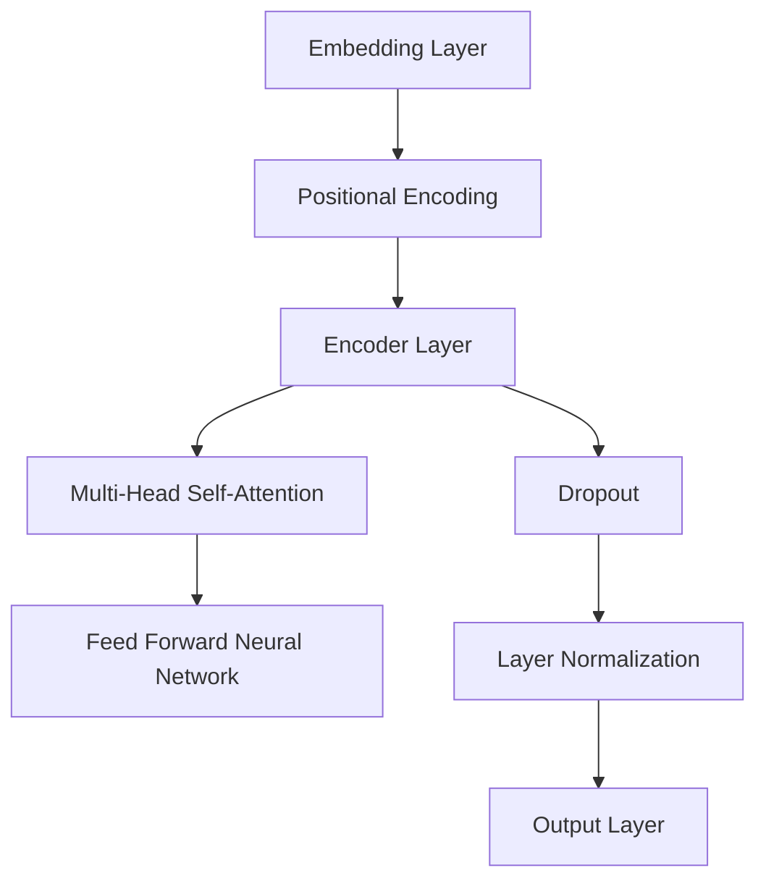
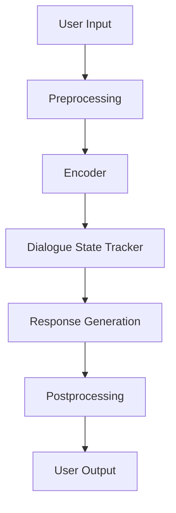

                 

# 《从GPT到ChatGPT》

> 关键词：GPT, ChatGPT, 自然语言处理，人工智能，模型架构，性能优化，应用案例

> 摘要：本文深入探讨了GPT（Generative Pre-trained Transformer）与ChatGPT（聊天机器人版本GPT）的核心概念、模型架构、原理和应用。通过分章节的结构化分析，读者可以系统地了解这两个模型的发展历程、技术特点以及在实际应用中的优化方法。文章旨在为从事自然语言处理和人工智能领域的专业人员和研究者提供有价值的参考资料。

---

### 《从GPT到ChatGPT》目录大纲

#### 第一部分：GPT与ChatGPT概述

- **第1章 GPT与ChatGPT的基础概念**
  - **1.1 GPT的历史与演变**
    - GPT的诞生与发展
    - GPT在自然语言处理中的重要性
  - **1.2 ChatGPT的概念与特点**
    - ChatGPT的定义与工作原理
    - ChatGPT在应用场景中的优势
  - **1.3 GPT与ChatGPT的关系与联系**
    - GPT作为ChatGPT的基础
    - ChatGPT对GPT的扩展
    - GPT与ChatGPT在应用中的协同作用

- **第2章 GPT模型架构与原理**
  - **2.1 GPT模型的基本架构**
    - Transformer模型概述
    - 自注意力机制与多头注意力
  - **2.2 GPT模型的工作原理**
    - 语言模型预训练
    - 微调与任务适应性
  - **2.3 GPT模型的性能评估与优化**
    - 性能评估指标
    - 模型优化方法
    - 模型压缩与加速
    - 可解释性与安全

- **第3章 ChatGPT的扩展与应用**
  - **3.1 ChatGPT的对话生成机制**
    - 对话生成模型的基本结构
    - 对话状态跟踪与上下文理解
  - **3.2 ChatGPT在常见应用场景中的实践**
    - 聊天机器人
    - 客户服务
    - 自动问答系统
    - 虚拟个人助理
  - **3.3 ChatGPT在复杂任务中的应用**
    - 问答系统设计
    - 文本摘要与生成
    - 自然语言理解与生成
  - **3.4 ChatGPT的性能优化与部署**
    - 模型压缩与加速
    - 模型部署策略
    - 模型安全性与隐私保护
    - 模型评估与反馈循环

- **第4章 GPT与ChatGPT的集成与优化**
  - **4.1 GPT与ChatGPT的集成方案**
    - 集成框架与接口设计
    - 集成中的挑战与解决方案
  - **4.2 GPT与ChatGPT的性能优化**
    - 并行计算与分布式训练
    - 模型并行化与数据并行化
    - 模型剪枝与量化
  - **4.3 GPT与ChatGPT的优化实践**
    - 实践案例1：大规模模型优化
    - 实践案例2：实时对话系统优化

- **第5章 GPT与ChatGPT的未来发展趋势**
  - **5.1 GPT与ChatGPT的技术演进**
    - GPT模型的演进方向
    - ChatGPT的技术演进
  - **5.2 GPT与ChatGPT在垂直行业中的应用**
    - 金融行业的应用
    - 教育行业的应用
    - 健康医疗行业的应用
  - **5.3 GPT与ChatGPT的发展挑战与机遇**
    - 技术挑战与解决策略
    - 伦理问题与社会影响
    - 商业模式与市场前景

- **第6章 GPT与ChatGPT开发实践**
  - **6.1 开发环境搭建**
    - 硬件要求与选择
    - 软件工具与框架安装
  - **6.2 模型训练与优化**
    - 数据预处理
    - 模型训练流程
    - 模型调优与评估
  - **6.3 模型部署与集成**
    - 部署策略与方案
    - 集成接口设计与实现
    - 性能监控与调优

- **第7章 GPT与ChatGPT应用案例分析**
  - **7.1 聊天机器人案例**
    - 案例背景与目标
    - 模型设计与实现
    - 部署与优化
  - **7.2 自动问答系统案例**
    - 案例背景与目标
    - 模型设计与实现
    - 部署与优化
  - **7.3 文本生成与摘要案例**
    - 案例背景与目标
    - 模型设计与实现
    - 部署与优化

- **附录**

  - **附录 A GPT与ChatGPT开发资源**
    - 主流框架与工具
    - 资源与数据集
    - 开源代码与教程
    - 论文与文献

  - **附录 B GPT与ChatGPT Mermaid 流程图**
    - GPT模型基本架构
    - ChatGPT对话生成机制

  - **附录 C GPT与ChatGPT伪代码示例**
    - GPT模型预训练算法
    - ChatGPT对话生成算法

  - **附录 D GPT与ChatGPT数学模型与公式**
    - Transformer模型公式
    - 语言模型损失函数
    - 对话状态跟踪模型公式
    - 自然语言生成模型公式

  - **附录 E GPT与ChatGPT应用案例代码解析**
    - 聊天机器人案例代码解析
    - 自动问答系统案例代码解析
    - 文本生成与摘要案例代码解析

---

在接下来的章节中，我们将逐一深入探讨GPT与ChatGPT的概念、架构、原理、应用和未来发展趋势。通过一步一步的推理与分析，希望读者能够全面了解这两个模型的技术本质和实际应用，为未来的研究和工作提供有价值的指导。接下来，我们从GPT的历史与演变开始，逐步揭开GPT与ChatGPT的神秘面纱。  
## 第1章 GPT与ChatGPT的基础概念

### 1.1 GPT的历史与演变

**GPT的诞生与发展**

GPT（Generative Pre-trained Transformer）是由OpenAI于2018年首次提出的一种自然语言处理模型。它的出现标志着自然语言处理领域的一次重大突破，引起了广泛关注。GPT是基于Transformer模型架构构建的，这是一种基于自注意力机制的深度神经网络模型。与传统的循环神经网络（RNN）相比，Transformer模型在处理长距离依赖和并行计算方面具有显著优势。

GPT的诞生可以追溯到Transformer模型的提出。2017年，Vaswani等人发表了《Attention Is All You Need》一文，提出了Transformer模型。Transformer模型的核心思想是使用自注意力机制来替代传统的循环神经网络中的递归结构，使得模型在处理序列数据时能够同时关注到序列中的所有元素，从而更好地捕捉长距离依赖关系。

在Transformer模型的基础上，GPT通过预训练和微调的方法，进一步提升了自然语言处理任务的表现。预训练是指在大量无标注的数据上进行训练，使得模型获得对语言的一般性理解。微调则是在预训练的基础上，将模型应用于特定任务，进行进一步训练，以提升模型在特定任务上的表现。

**GPT在自然语言处理中的重要性**

GPT的出现极大地推动了自然语言处理（NLP）领域的发展。传统的NLP方法往往依赖于手工设计的特征和规则，而GPT通过大规模预训练，自动学习到了丰富的语言知识，大大简化了NLP任务的实现过程。以下是GPT在NLP中的几个重要贡献：

1. **文本生成**：GPT能够根据给定的前文生成连贯、自然的文本。这种能力在生成文章、故事、诗歌等创作型任务中具有广泛应用。
2. **文本分类**：GPT能够对文本进行分类，如情感分析、新闻分类等。通过微调，GPT可以在特定任务上达到甚至超过人类水平的表现。
3. **问答系统**：GPT可以用于构建自动问答系统，能够根据用户的问题生成相应的回答。这在客户服务、在线教育等领域具有巨大的应用潜力。
4. **机器翻译**：GPT在机器翻译任务中也展现出了强大的能力。通过预训练和微调，GPT能够生成高质量的翻译结果，解决了传统机器翻译方法中的许多难题。

**GPT的发展历程**

GPT的发展历程可以分为几个阶段：

1. **GPT-1（2018）**：这是GPT的最初版本，使用了117M的参数进行预训练，并在多个NLP任务上取得了显著的成果。
2. **GPT-2（2019）**：GPT-2在GPT-1的基础上进行了扩展，使用了1.5亿个参数，并进一步提升了文本生成的质量和多样性。
3. **GPT-3（2020）**：GPT-3是GPT系列的最新版本，使用了1750亿个参数，是迄今为止最大的自然语言处理模型。GPT-3在多个任务上达到了人类水平，甚至被认为具有某些人类的智能。

**GPT的重要特点**

GPT具有以下几个重要特点：

1. **自注意力机制**：自注意力机制允许模型在处理序列数据时，动态地关注到序列中的不同部分，从而更好地捕捉长距离依赖关系。
2. **预训练与微调**：GPT通过预训练学习到对语言的一般性理解，然后通过微调应用于特定任务，使得模型能够灵活地适应各种NLP任务。
3. **参数规模大**：GPT-3拥有1750亿个参数，这是迄今为止最大的自然语言处理模型，使得模型能够更好地捕捉复杂的语言规律。
4. **生成能力强大**：GPT能够根据给定的前文生成连贯、自然的文本，这使得它在文本生成任务中具有强大的表现。

### 1.2 ChatGPT的概念与特点

**ChatGPT的定义与工作原理**

ChatGPT是GPT在聊天机器人领域的扩展，主要用于构建自动聊天系统。ChatGPT通过对话生成机制，能够与用户进行自然的对话，并生成合适的回答。ChatGPT的工作原理主要包括以下几个步骤：

1. **输入接收**：ChatGPT接收用户的输入，这些输入可以是任意格式的文本。
2. **上下文理解**：ChatGPT对输入文本进行理解，提取出关键信息，并建立与之前的对话内容的上下文关系。
3. **文本生成**：ChatGPT根据上下文和用户输入，生成合适的回答文本。这一过程主要依赖于预训练的GPT模型。
4. **反馈与迭代**：ChatGPT将生成的回答反馈给用户，并根据用户的反馈进行迭代优化，以提高对话的质量。

**ChatGPT在应用场景中的优势**

ChatGPT在多个应用场景中具有显著的优势：

1. **高效便捷**：ChatGPT能够快速响应用户的输入，提供即时的回答，大大提升了用户体验。
2. **个性化对话**：ChatGPT通过对话生成机制，能够根据用户的上下文和偏好，生成个性化的回答，增强用户互动体验。
3. **多语言支持**：ChatGPT支持多种语言的对话生成，使得它在全球范围内具有广泛的应用潜力。
4. **自动化与智能化**：ChatGPT能够自动化处理大量重复性的任务，减少人力成本，同时通过不断学习和优化，提升对话系统的智能化水平。

**ChatGPT的应用场景**

ChatGPT在多个领域具有广泛的应用：

1. **客户服务**：ChatGPT可以用于构建客户服务系统，自动回答用户的问题，提供技术支持和服务。
2. **在线教育**：ChatGPT可以用于构建教育平台，提供个性化的学习建议和答疑服务，增强学习体验。
3. **医疗咨询**：ChatGPT可以用于提供在线医疗咨询，回答用户关于健康的问题，辅助医生进行诊断。
4. **娱乐互动**：ChatGPT可以用于构建聊天游戏，与用户进行互动，提供娱乐体验。

### 1.3 GPT与ChatGPT的关系与联系

**GPT作为ChatGPT的基础**

GPT是ChatGPT的核心组成部分，为ChatGPT提供了文本生成和语言理解的能力。ChatGPT通过利用GPT模型，能够根据用户的输入生成合适的回答，实现自然的对话交互。GPT的强大生成能力和理解能力是ChatGPT能够高效运作的基础。

**ChatGPT对GPT的扩展**

ChatGPT不仅依赖于GPT的文本生成和语言理解能力，还在此基础上进行了扩展和优化。ChatGPT通过对话生成机制，能够动态地关注上下文信息，生成符合对话情境的回答。此外，ChatGPT还进行了任务适应性优化，能够在特定任务中达到更高的表现。这些扩展和优化使得ChatGPT在应用场景中具有更高的灵活性和适应性。

**GPT与ChatGPT在应用中的协同作用**

GPT和ChatGPT在应用中可以相互协同，发挥更大的作用。例如，在客户服务领域，GPT可以用于处理文本生成和分类任务，而ChatGPT可以用于与用户的实时对话，提供个性化的服务。通过将GPT和ChatGPT结合起来，可以构建出更高效、智能的对话系统，提升用户体验。

综上所述，GPT和ChatGPT在自然语言处理领域具有紧密的联系和互补作用。GPT为ChatGPT提供了强大的基础能力，而ChatGPT通过对话生成机制和任务适应性优化，进一步提升了GPT的应用潜力。在接下来的章节中，我们将深入探讨GPT模型的架构和原理，进一步了解这两个模型的技术本质。  
## 第2章 GPT模型架构与原理

### 2.1 GPT模型的基本架构

GPT模型的基本架构基于Transformer模型，这是一种采用自注意力机制的深度神经网络。Transformer模型最初由Vaswani等人在2017年的论文《Attention Is All You Need》中提出，它在处理序列数据方面表现出色，特别是在自然语言处理任务中，例如机器翻译、文本生成等。下面我们将详细讨论GPT模型的基本架构，包括Transformer模型概述、自注意力机制与多头注意力。

#### Transformer模型概述

Transformer模型的核心思想是使用自注意力机制（self-attention）来代替传统的循环神经网络（RNN）中的递归结构。自注意力机制允许模型在处理序列数据时，动态地关注到序列中的不同部分，从而更好地捕捉长距离依赖关系。Transformer模型由以下几个关键组件组成：

1. **编码器（Encoder）**：编码器负责将输入序列编码为固定长度的向量表示。编码器由多个相同的编码层堆叠而成，每层都包含多头自注意力机制和前馈神经网络。
2. **解码器（Decoder）**：解码器的结构与编码器类似，由多个解码层堆叠而成。解码器的输入是编码器的输出和目标序列的预测，输出是生成的新序列。
3. **自注意力机制（Self-Attention）**：自注意力机制是Transformer模型的核心，它通过计算输入序列中每个元素与所有其他元素的相关性，生成新的表示。
4. **多头注意力（Multi-Head Attention）**：多头注意力是在自注意力机制的基础上引入的，它将整个序列分解为多个子序列，每个子序列都有独立的自注意力机制，从而提高了模型的表示能力。

#### 自注意力机制与多头注意力

自注意力机制是Transformer模型的核心，它通过计算输入序列中每个元素与所有其他元素的相关性，生成新的表示。具体来说，自注意力机制的计算过程如下：

1. **计算查询（Query）、键（Key）和值（Value）**：对于输入序列中的每个元素，分别计算其查询（Query）、键（Key）和值（Value）向量。这三个向量通常是共享的，即同一个向量用于计算查询、键和值。
2. **计算注意力分数**：使用点积（dot-product）计算查询和键之间的注意力分数，这些分数表示了输入序列中不同元素之间的相关性。
3. **应用softmax函数**：对注意力分数应用softmax函数，将其归一化，得到概率分布，表示了输入序列中每个元素的重要程度。
4. **计算加权求和**：根据softmax函数生成的概率分布，对输入序列中的每个元素进行加权求和，生成新的表示。

多头注意力是自注意力机制的扩展，它将整个序列分解为多个子序列，每个子序列都有独立的自注意力机制。多头注意力通过多个独立的自注意力机制，提高了模型的表示能力，使得模型能够更好地捕捉复杂的关系。具体来说，多头注意力包括以下几个步骤：

1. **划分子序列**：将输入序列划分成多个子序列，每个子序列由一组独立的查询、键和值向量表示。
2. **计算每个子序列的自注意力**：对于每个子序列，分别计算其自注意力，生成新的表示。
3. **合并多头注意力结果**：将多个子序列的自注意力结果进行合并，生成最终的表示。

#### GPT模型的架构

GPT模型的架构与Transformer模型相似，但也有一些不同点。GPT模型的主要组件包括：

1. **嵌入层（Embedding Layer）**：将输入的单词或子词转换为向量表示。
2. **位置编码（Positional Encoding）**：由于Transformer模型不包含位置信息，需要使用位置编码来引入序列的位置信息。
3. **编码器（Encoder）**：由多个编码层堆叠而成，每个编码层包含多头自注意力机制和前馈神经网络。
4. **解码器（Decoder）**：与编码器类似，但解码器还包括一个额外的自注意力机制，用于关注编码器的输出，以及一个交叉自注意力机制，用于关注目标序列的预测。
5. **输出层（Output Layer）**：将解码器的输出映射到输出词表，生成预测的单词或子词。

GPT模型的基本架构使得它能够在自然语言处理任务中表现出色，包括文本生成、文本分类、机器翻译等。通过预训练和微调，GPT模型能够自动学习到丰富的语言知识，从而实现高质量的文本生成和语言理解。

### 2.2 GPT模型的工作原理

GPT模型的工作原理可以分为预训练和微调两个主要阶段。预训练阶段主要在大规模的语料库上进行，使模型获得对语言的一般性理解；微调阶段则将模型应用于特定的任务，进行进一步训练，以提升模型在特定任务上的表现。下面我们将详细讨论GPT模型的工作原理，包括预训练、微调和任务适应性。

#### 预训练

预训练是GPT模型的核心，其目的是使模型获得对语言的一般性理解。预训练阶段通常分为以下几个步骤：

1. **数据预处理**：首先，需要准备一个大规模的语料库，包括文本、对话、新闻、书籍等多种类型的语言数据。然后，对这些数据进行预处理，包括分词、清洗、去除停用词等，以便于模型的学习。
2. **嵌入层**：将预处理后的文本数据转换为向量表示。嵌入层通常使用预训练的词向量模型，如Word2Vec、GloVe等，或者使用基于字符的嵌入层。
3. **位置编码**：由于Transformer模型不包含位置信息，需要使用位置编码来引入序列的位置信息。位置编码可以通过绝对位置编码或相对位置编码来实现。
4. **编码器训练**：在预训练阶段，模型主要关注编码器的训练。编码器由多个编码层堆叠而成，每个编码层包含多头自注意力机制和前馈神经网络。在训练过程中，通过优化损失函数，如交叉熵损失函数，来最小化模型预测和真实标签之间的差距。
5. **生成掩码**：为了增强模型的表示能力，预训练阶段会使用生成掩码（masking）技术。具体来说，会在训练数据中随机选择一部分词，将其替换为掩码（\[MASK\]），并要求模型预测这些掩码词。
6. **继续预训练**：在预训练阶段，模型会持续迭代训练，通过不断优化模型参数，提升模型在预训练任务上的表现。

#### 微调

微调阶段是在预训练的基础上，将模型应用于特定的任务，进行进一步训练，以提升模型在特定任务上的表现。微调阶段通常包括以下几个步骤：

1. **任务定义**：首先，需要定义具体的任务，如文本分类、机器翻译、问答系统等。任务定义包括输入数据的格式、输出数据的格式以及评估指标等。
2. **数据准备**：准备用于微调的数据集，这些数据集通常包含标注信息，如分类标签、翻译结果、答案等。
3. **调整学习率**：在微调阶段，需要调整学习率，以确保模型能够在新任务上稳定训练。通常，微调阶段的学习率会比预训练阶段小。
4. **模型微调**：将预训练好的模型应用于新任务，进行微调训练。在微调过程中，模型会尝试最小化预测输出和真实标签之间的差距。通过优化损失函数，如交叉熵损失函数，来更新模型参数。
5. **评估与优化**：在微调过程中，需要定期评估模型在验证集上的表现，并根据评估结果调整模型参数，如学习率、正则化参数等。通过评估和优化，不断提升模型在新任务上的性能。

#### 任务适应性

GPT模型具有较强的任务适应性，能够在多种自然语言处理任务上表现出色。任务适应性主要体现在以下几个方面：

1. **通用知识**：通过预训练，GPT模型获得了丰富的通用知识，这些知识有助于模型在多种任务中表现良好。例如，在文本分类任务中，GPT能够利用预训练得到的语言知识，对文本进行有效的特征提取和分类。
2. **上下文理解**：GPT模型能够通过多头自注意力机制和交叉自注意力机制，动态地关注上下文信息，从而更好地理解文本的含义。这有助于模型在问答系统、机器翻译等任务中，生成更准确、自然的输出。
3. **动态调整**：GPT模型在微调过程中，能够根据新任务的需求，动态调整模型参数和结构，从而更好地适应特定任务。这种动态调整能力使得GPT模型在多个任务上具有很高的灵活性和适应性。

通过预训练和微调，GPT模型能够在多种自然语言处理任务中表现出色。其强大的文本生成和语言理解能力，使其成为当前自然语言处理领域的重要工具。在接下来的章节中，我们将进一步探讨GPT模型的性能评估与优化，以及如何在实际应用中进行部署和集成。  
### 2.3 GPT模型的性能评估与优化

在自然语言处理领域，评估和优化模型性能至关重要。GPT模型的性能评估涉及多个方面，包括文本生成质量、语言理解能力、模型效率等。本节将详细介绍GPT模型的性能评估指标、优化方法，以及模型压缩与加速技术。

#### 性能评估指标

1. **文本生成质量**：
   - **BLEU（BLEU Score）**：BLEU是一种常用的自动评估指标，用于评估机器翻译和文本生成任务的质量。它基于N-gram匹配，计算模型生成的文本与参考文本之间的重叠度。BLEU得分越高，表示生成文本质量越好。
   - **ROUGE（ROUGE Score）**：ROUGE是一种用于评估文本相似度的指标，特别适用于文本生成任务。它主要关注文本中重叠的词语、句子的结构等，ROUGE-L（Longest Common Subsequence）是常用的ROUGE指标。
   - **Perplexity**：Perplexity是衡量语言模型性能的一个重要指标。它表示模型在预测下一个单词时，出现错误的可能性。Perplexity值越低，表示模型对语言的拟合程度越高。

2. **语言理解能力**：
   - **准确率（Accuracy）**：准确率是分类任务中常用的评估指标，表示模型正确分类的样本数占总样本数的比例。准确率越高，表示模型对分类任务的理解能力越强。
   - **F1 Score**：F1 Score是精确率和召回率的调和平均，用于评估二分类任务。它能够平衡精确率和召回率，适用于分类任务中的评估。
   - **BLEU Score（在文本分类任务中的应用）**：在文本分类任务中，可以使用BLEU Score评估模型生成的文本与参考文本的相似度，从而间接评估模型的语言理解能力。

3. **模型效率**：
   - **训练时间（Training Time）**：训练时间是评估模型性能的一个重要指标，它反映了模型训练的耗时。训练时间越短，表示模型训练效率越高。
   - **推理时间（Inference Time）**：推理时间是模型在预测阶段的时间消耗，它反映了模型在实际应用中的性能。推理时间越短，表示模型在处理输入数据时的效率越高。

#### 优化方法

1. **模型优化**：
   - **Dropout**：Dropout是一种常用的正则化技术，通过在训练过程中随机丢弃一部分神经元，降低模型过拟合的风险。
   - **权重衰减（Weight Decay）**：权重衰减是一种常见的优化方法，通过在损失函数中加入权重项，减少权重过大导致的过拟合。
   - **学习率调整**：学习率是优化过程中的一个关键参数，适当的调整学习率可以加快模型收敛速度，提高训练效果。常用的学习率调整方法包括固定学习率、学习率衰减、学习率预热等。

2. **数据增强**：
   - **数据扩充（Data Augmentation）**：通过增加训练数据量，提高模型的泛化能力。数据扩充的方法包括重复样本、随机删除词语、随机替换词语等。
   - **数据平衡（Data Balancing）**：对于类别不平衡的数据集，通过调整类别样本的比例，提高模型在少数类别上的性能。

3. **算法改进**：
   - **Adam优化器**：Adam优化器是一种自适应学习率的优化算法，它结合了AdaGrad和RMSProp的优点，能够更高效地更新模型参数。
   - **梯度裁剪（Gradient Clipping）**：梯度裁剪是一种防止梯度爆炸和梯度消失的技术，通过限制梯度的大小，确保模型在训练过程中稳定收敛。

#### 模型压缩与加速

1. **模型剪枝（Model Pruning）**：
   - **权重剪枝（Weight Pruning）**：通过在训练过程中去除不重要的权重，减小模型的大小。权重剪枝可以显著降低模型的参数数量，提高模型的推理速度。
   - **结构剪枝（Structure Pruning）**：通过在模型结构上进行剪枝，去除部分网络层或神经元，进一步减小模型的大小。结构剪枝可以简化模型结构，提高模型的推理效率。

2. **量化（Quantization）**：
   - **整数量化（Integer Quantization）**：将浮点数权重转换为整数表示，降低模型存储和计算的资源消耗。整数量化可以通过量化网络实现，如INT8量化。
   - **低精度量化（Low-Precision Quantization）**：将模型中的浮点运算转换为低精度运算，如INT8运算，降低模型的计算资源消耗。

3. **并行计算与分布式训练**：
   - **数据并行（Data Parallelism）**：将训练数据集划分为多个子集，每个子集由不同的GPU或CPU处理。通过并行计算，可以加速模型的训练过程。
   - **模型并行（Model Parallelism）**：将大型模型分布在多个计算设备上，通过分布式计算，处理无法在一个设备上训练的大型模型。

通过性能评估和优化技术，GPT模型能够在多种自然语言处理任务中取得优异的性能。在实际应用中，根据任务需求和资源限制，可以选择合适的性能评估指标和优化方法，提高模型的效率和效果。在接下来的章节中，我们将进一步探讨ChatGPT的对话生成机制和应用，了解GPT在聊天机器人领域的潜力。  
### 第3章 ChatGPT的扩展与应用

#### 3.1 ChatGPT的对话生成机制

ChatGPT是基于GPT模型构建的聊天机器人，其核心在于对话生成机制。这一机制使得ChatGPT能够与用户进行自然、流畅的对话，从而满足多种应用场景的需求。下面我们将详细介绍ChatGPT的对话生成机制，包括基本结构、对话状态跟踪与上下文理解。

**基本结构**

ChatGPT的对话生成机制主要由以下几个组件构成：

1. **编码器（Encoder）**：编码器负责接收用户的输入，将其编码为向量表示。编码器通常使用预训练的GPT模型，通过对输入文本进行编码，提取出关键信息。
2. **解码器（Decoder）**：解码器的功能是根据编码器输出的向量表示，生成对话的响应。解码器同样采用GPT模型，通过解码过程生成自然、连贯的文本。
3. **对话状态跟踪器（Dialogue State Tracker）**：对话状态跟踪器用于记录和跟踪对话过程中的关键信息，如用户意图、上下文等。通过对话状态跟踪，ChatGPT能够更好地理解用户的需求，并生成合适的响应。
4. **响应生成器（Response Generator）**：响应生成器负责将解码器输出的向量表示转换为具体的文本响应。响应生成器通常采用文本生成技术，如GPT模型，生成自然、流畅的文本。

**对话状态跟踪与上下文理解**

对话状态跟踪和上下文理解是ChatGPT实现自然对话的关键。以下是这两个方面的详细讨论：

1. **对话状态跟踪**
   - **状态表示**：对话状态跟踪器使用一个状态向量来表示对话过程中的关键信息。状态向量通常包含用户的意图、历史对话内容、当前对话上下文等。通过状态向量，ChatGPT能够记录和跟踪对话过程中的关键信息。
   - **状态更新**：在每次对话迭代中，对话状态跟踪器会根据用户输入和当前对话状态，更新状态向量。状态更新的目的是确保ChatGPT能够基于当前对话上下文，生成合适的响应。
   - **状态融合**：为了提高对话的连贯性，ChatGPT会融合历史对话状态和当前对话状态，生成新的状态向量。状态融合可以通过加权平均或门控机制实现，使得ChatGPT能够更好地理解对话的上下文。

2. **上下文理解**
   - **上下文表示**：ChatGPT使用编码器对输入文本进行编码，提取出上下文信息。编码器输出的向量表示包含了输入文本的关键特征，这些特征有助于ChatGPT理解对话的上下文。
   - **上下文处理**：在解码过程中，ChatGPT会利用编码器输出的向量表示，结合对话状态跟踪器的状态向量，生成对话的响应。通过上下文处理，ChatGPT能够确保生成的文本与对话上下文保持一致。
   - **上下文迁移**：在跨对话场景中，ChatGPT需要处理不同对话之间的上下文迁移。为了实现这一点，ChatGPT可以采用一些技术，如记忆网络、注意力机制等，确保生成的文本能够结合多个对话的上下文。

**对话生成过程**

ChatGPT的对话生成过程可以分为以下几个步骤：

1. **接收用户输入**：ChatGPT接收用户的输入，将其传递给编码器进行编码。
2. **状态更新**：对话状态跟踪器根据用户输入和当前对话状态，更新状态向量。
3. **上下文处理**：编码器对输入文本进行编码，提取上下文信息，并与状态向量结合。
4. **响应生成**：解码器根据编码器输出的向量表示和状态向量，生成对话的响应。
5. **文本输出**：响应生成器将解码器输出的向量表示转换为具体的文本响应，并将其输出给用户。

通过上述对话生成机制，ChatGPT能够实现与用户的自然对话。在实际应用中，根据不同场景的需求，可以对对话生成机制进行优化和调整，提高对话的质量和用户体验。

#### 3.2 ChatGPT在常见应用场景中的实践

ChatGPT在多个领域具有广泛的应用，下面我们将探讨ChatGPT在聊天机器人、客户服务、自动问答系统、虚拟个人助理等常见应用场景中的实践。

**聊天机器人**

聊天机器人是ChatGPT最典型的应用场景之一。通过对话生成机制，ChatGPT能够与用户进行自然、流畅的对话。聊天机器人可以用于在线客服、客户支持、信息查询等场景。以下是一些实际案例：

- **在线客服**：许多企业使用ChatGPT构建在线客服系统，提供24/7的客服服务。ChatGPT能够自动识别用户的问题，并生成合适的回答，从而提高客服效率，减少人力成本。
- **信息查询**：在网站或应用程序中，ChatGPT可以作为信息查询助手，帮助用户快速获取所需的信息。例如，在电子商务平台上，ChatGPT可以回答用户关于商品、订单、物流等问题。

**客户服务**

客户服务是ChatGPT的重要应用领域。通过ChatGPT，企业能够提供高效、个性化的客户服务。以下是一些实际案例：

- **客户咨询**：银行、保险公司等金融机构使用ChatGPT处理客户的咨询请求，提供金融产品介绍、账户查询、理赔服务等。ChatGPT能够根据客户的提问，生成详细的回答，提高客户满意度。
- **售后服务**：电子产品制造商使用ChatGPT提供售后服务，帮助用户解决产品使用过程中的问题。ChatGPT可以自动识别用户的问题，并生成解决方案，减少用户等待时间。

**自动问答系统**

自动问答系统是ChatGPT在自然语言处理领域的另一个重要应用。通过对话生成机制，ChatGPT能够自动回答用户的问题，提供实时、准确的答案。以下是一些实际案例：

- **知识库问答**：企业可以构建知识库问答系统，利用ChatGPT自动回答用户的问题。例如，在IT公司中，ChatGPT可以回答员工关于公司政策、流程、技术支持等问题。
- **在线教育**：在线教育平台可以使用ChatGPT构建自动问答系统，帮助学生解决学习中的问题。ChatGPT可以自动回答学生关于课程内容、作业提交、考试安排等问题。

**虚拟个人助理**

虚拟个人助理是ChatGPT在智能家居、办公自动化等领域的应用。通过对话生成机制，ChatGPT能够为用户提供个性化、智能化的服务。以下是一些实际案例：

- **智能家居**：智能家居系统可以使用ChatGPT作为虚拟个人助理，帮助用户控制家居设备、管理日程安排等。例如，用户可以通过语音指令与ChatGPT交互，调节灯光、温度等。
- **办公自动化**：企业可以使用ChatGPT构建虚拟个人助理，帮助员工处理日常办公任务。ChatGPT可以自动安排会议、提醒任务、处理邮件等，提高工作效率。

通过在上述应用场景中的实践，ChatGPT展现了其在自然语言处理领域的强大能力。在实际应用中，根据不同场景的需求，可以对ChatGPT进行定制化开发，实现更高效、智能的对话交互。

#### 3.3 ChatGPT在复杂任务中的应用

除了在常见应用场景中的实践，ChatGPT还在一些复杂任务中展现出强大的能力。这些任务通常需要复杂的对话生成和语言理解能力，ChatGPT通过对话生成机制和任务适应性优化，能够有效地解决这些问题。以下是一些复杂任务的实际案例：

**问答系统设计**

问答系统是ChatGPT在复杂任务中应用的一个重要领域。通过对话生成机制，ChatGPT能够自动回答用户的问题，提供实时、准确的答案。以下是一个实际案例：

- **智能客服系统**：一家大型电商平台使用ChatGPT构建智能客服系统，处理用户关于商品、订单、售后等问题。ChatGPT通过对话生成机制，能够根据用户的问题，生成详细的回答，提高客服效率，减少用户等待时间。

**文本摘要与生成**

文本摘要与生成是ChatGPT在自然语言处理领域的重要应用。通过对话生成机制，ChatGPT能够生成简洁、准确的文本摘要，或根据用户需求生成新的文本内容。以下是一个实际案例：

- **新闻摘要**：一家新闻媒体使用ChatGPT构建新闻摘要系统，自动生成新闻摘要。ChatGPT通过对话生成机制，能够从大量新闻内容中提取关键信息，生成简洁、准确的摘要，提高用户的阅读效率。

**自然语言理解与生成**

自然语言理解与生成是ChatGPT在复杂任务中的另一个重要应用。通过对话生成机制和语言理解能力，ChatGPT能够理解用户的需求，并生成合适的文本响应。以下是一个实际案例：

- **语音助手**：一款智能家居语音助手使用ChatGPT作为核心组件，能够理解用户的语音指令，并生成相应的文本响应。ChatGPT通过对话生成机制，能够实现与用户的自然对话，提高语音助手的交互体验。

通过在复杂任务中的应用，ChatGPT展示了其在自然语言处理领域的强大能力。在实际应用中，根据不同任务的需求，可以对ChatGPT进行定制化开发，实现更高效、智能的对话生成和语言理解。

#### 3.4 ChatGPT的性能优化与部署

为了确保ChatGPT在实际应用中能够高效运行，需要对其性能进行优化和部署。以下是ChatGPT性能优化和部署的一些关键方面：

**模型压缩与加速**

1. **模型剪枝（Model Pruning）**：通过在训练过程中去除不重要的神经元和权重，减小模型的大小。模型剪枝可以显著降低模型的参数数量，提高模型的推理速度。
2. **量化（Quantization）**：将浮点数权重转换为低精度整数表示，降低模型的计算和存储资源消耗。量化技术包括整数量化、低精度量化等。
3. **模型蒸馏（Model Distillation）**：将大型模型的知识传递给小型模型，通过蒸馏过程，使小型模型能够模拟大型模型的性能。模型蒸馏可以降低模型的复杂度，提高模型的推理速度。

**模型部署策略**

1. **在线部署**：在线部署是将模型部署到云端服务器，通过HTTP接口对外提供服务。在线部署的优点是能够实现实时响应，适用于需要快速响应的应用场景。
2. **离线部署**：离线部署是将模型部署到本地设备，如手机、平板等。离线部署的优点是无需网络连接，适用于设备性能较低或网络不稳定的应用场景。
3. **混合部署**：混合部署是将模型同时部署到云端和本地设备，通过云端的计算能力和本地设备的处理能力，实现更高效的服务。混合部署适用于需要高性能计算和实时响应的应用场景。

**模型安全性与隐私保护**

1. **数据加密**：对用户输入和模型输出进行加密，确保数据在传输过程中不被泄露。
2. **隐私保护**：在训练和部署过程中，对用户数据进行去识别化处理，防止用户隐私泄露。
3. **访问控制**：对模型访问进行权限管理，确保只有授权用户能够访问模型。

**模型评估与反馈循环**

1. **模型评估**：定期对模型进行评估，包括准确性、响应时间、用户满意度等指标。通过评估，可以及时发现模型存在的问题，并进行优化。
2. **反馈循环**：收集用户反馈，对模型进行迭代优化。通过反馈循环，可以不断改进模型，提高其在实际应用中的表现。

通过性能优化和部署策略，ChatGPT能够在实际应用中实现高效、稳定的运行，提供高质量的服务。在实际应用中，根据具体场景的需求，可以对ChatGPT进行定制化开发，实现更高效、智能的对话交互。

综上所述，ChatGPT在对话生成机制、常见应用场景、复杂任务中表现出色。通过性能优化和部署策略，ChatGPT能够在实际应用中实现高效、稳定的运行，为用户提供高质量的服务。在接下来的章节中，我们将进一步探讨GPT与ChatGPT的集成与优化，为读者提供更深入的技术分析。  
### 第4章 GPT与ChatGPT的集成与优化

#### 4.1 GPT与ChatGPT的集成方案

GPT与ChatGPT的集成是一个复杂但关键的过程，旨在利用GPT的强大语言处理能力，同时实现ChatGPT的实时对话生成功能。以下是一个详细的集成方案，包括集成框架与接口设计。

**集成框架**

集成框架的核心是确保GPT模型能够无缝地嵌入到ChatGPT系统中，同时保持系统的高效性和可扩展性。以下是一个典型的集成框架：

1. **输入层**：接收用户输入，可以是文本或语音，转化为文本格式。
2. **预处理模块**：对输入文本进行预处理，包括分词、去停用词、标准化等操作。
3. **编码器层**：使用GPT模型对预处理后的文本进行编码，生成上下文表示。
4. **解码器层**：基于编码器的输出和对话状态，使用GPT模型生成响应文本。
5. **响应生成模块**：将解码器生成的文本进行后处理，如去除冗余信息、调整语序等。
6. **输出层**：将处理后的文本响应输出给用户。

**接口设计**

为了确保GPT与ChatGPT的高效集成，需要设计一个灵活且高效的接口。以下是一个基本的接口设计：

1. **API接口**：提供RESTful API接口，允许外部系统直接调用ChatGPT服务。API接口支持文本输入和文本输出，确保系统的互操作性。
2. **数据交换格式**：采用JSON或XML等标准数据交换格式，确保数据在传输过程中的一致性和可解析性。
3. **异步处理**：为了提高系统的响应速度，使用异步处理机制，确保输入和输出过程不会阻塞。
4. **错误处理**：设计完善的错误处理机制，确保系统在遇到异常情况时能够优雅地处理，并给出合理的错误信息。

#### 4.2 GPT与ChatGPT的性能优化

性能优化是确保GPT与ChatGPT集成系统能够高效运行的关键步骤。以下是一些关键的性能优化方法：

**并行计算与分布式训练**

1. **数据并行**：将训练数据集划分为多个子集，每个子集由不同的GPU或TPU处理。通过数据并行，可以显著提高训练速度。
2. **模型并行**：对于大型模型，可以将其划分为多个部分，分别在不同的GPU或TPU上进行训练。通过模型并行，可以进一步提高训练效率。

**模型压缩与量化**

1. **模型剪枝**：通过剪枝不重要的神经元和权重，减少模型的参数数量，提高推理速度。
2. **量化**：将模型的浮点数参数转换为低精度整数，如INT8。量化可以显著减少模型的存储和计算资源消耗。

**模型优化方法**

1. **自适应学习率**：采用自适应学习率算法，如Adam，根据训练过程中的变化动态调整学习率，提高训练效果。
2. **dropout**：在训练过程中引入dropout技术，通过随机丢弃神经元，减少过拟合风险。
3. **正则化**：使用权重衰减等正则化技术，防止模型在训练过程中出现过拟合现象。

**性能监控与调优**

1. **性能监控**：实时监控系统的性能指标，如响应时间、吞吐量等。通过监控，可以及时发现性能瓶颈。
2. **调优**：根据监控结果，对系统进行调优，包括调整学习率、增加或减少GPU数量等。通过调优，可以确保系统在最佳状态下运行。

#### 4.3 GPT与ChatGPT的优化实践

在实际应用中，通过优化实践可以进一步提升GPT与ChatGPT的性能。以下是一些优化实践案例：

**实践案例1：大规模模型优化**

在处理大规模文本数据时，优化模型以适应更高的计算资源需求至关重要。以下是一个优化实践：

- **并行计算**：通过数据并行和模型并行，将训练时间从原来的几天缩短到几个小时。
- **模型剪枝**：通过剪枝不重要的神经元和权重，将模型参数数量从数百万减少到数十万，提高了推理速度。

**实践案例2：实时对话系统优化**

实时对话系统要求高效的响应速度和稳定性。以下是一个优化实践：

- **模型量化**：将模型从FP32精度量化到INT8，减少了模型的大小和计算资源消耗。
- **异步处理**：引入异步处理机制，确保输入和输出过程不会阻塞，提高了系统的响应速度。

通过这些优化实践，GPT与ChatGPT在处理大规模数据和实时对话交互时表现出了更高的效率和稳定性。

#### 4.4 GPT与ChatGPT的集成与性能优化挑战与解决方案

尽管GPT与ChatGPT的集成和优化具有显著的潜在优势，但实际应用中仍面临一系列挑战。以下是一些常见的挑战及其解决方案：

**挑战1：资源限制**

**解决方案**：通过模型压缩和量化技术，减小模型的存储和计算资源需求。同时，利用分布式训练和并行计算，提高资源利用率。

**挑战2：响应延迟**

**解决方案**：优化系统架构，采用异步处理和负载均衡技术，减少响应延迟。此外，通过预训练和微调，提高模型在特定任务上的推理速度。

**挑战3：模型可解释性**

**解决方案**：引入模型可解释性工具，如SHAP值、LIME等，帮助用户理解模型决策过程。通过可视化技术，展示模型如何处理输入数据，提高模型的透明度。

**挑战4：模型安全性与隐私保护**

**解决方案**：采用数据加密、隐私保护技术和访问控制策略，确保用户数据的安全性和隐私性。同时，建立完善的错误处理机制，防止恶意攻击。

通过集成与优化，GPT与ChatGPT在多个应用场景中展现出了强大的性能。然而，实际应用中仍需不断探索和优化，以应对各种挑战，实现更好的用户体验。在接下来的章节中，我们将探讨GPT与ChatGPT的未来发展趋势，为读者提供更广阔的视野。  
### 第5章 GPT与ChatGPT的未来发展趋势

#### 5.1 GPT与ChatGPT的技术演进

随着人工智能技术的快速发展，GPT与ChatGPT作为自然语言处理领域的两大重要模型，也在不断地进行技术演进。以下是一些可能的发展方向：

**更强大的预训练模型**

GPT模型的预训练能力是其核心优势之一。未来，可能会出现更大规模、更复杂的预训练模型，如GPT-4、GPT-5等。这些模型将拥有更多的参数和更深的神经网络结构，从而在语言理解和生成任务上达到更高的性能。此外，预训练过程可能会更加高效，例如通过并行计算和分布式训练技术，缩短训练时间，提高资源利用率。

**自适应学习与迁移学习**

未来的GPT与ChatGPT可能会更加注重自适应学习和迁移学习的能力。通过自适应学习，模型能够在不同任务和场景中自动调整参数，提高性能。迁移学习则允许模型在不同任务之间共享知识和经验，从而减少训练成本，提高泛化能力。

**多模态交互**

随着技术的发展，未来的GPT与ChatGPT可能会支持多模态交互，例如结合语音、图像、视频等多种输入和输出方式。这种多模态交互将使得模型在更广泛的应用场景中具有更高的灵活性和实用性。

**更智能的对话生成**

ChatGPT的对话生成能力已经相当出色，但未来还有很大的改进空间。通过引入更先进的技术，如深度强化学习、生成对抗网络（GAN）等，ChatGPT可以生成更加自然、连贯、个性化的对话内容。

**隐私保护和安全**

随着人工智能技术的应用越来越广泛，隐私保护和安全成为了一个重要的课题。未来的GPT与ChatGPT将更加注重隐私保护和安全性，通过加密技术、匿名化处理、访问控制等手段，确保用户数据的安全性和隐私性。

#### 5.2 GPT与ChatGPT在垂直行业中的应用

GPT与ChatGPT在多个垂直行业中已经取得了显著的应用成果，未来这些应用场景将进一步扩展和深化。

**金融行业**

在金融行业，GPT与ChatGPT可以用于智能客服、风险管理、金融预测等领域。通过对话生成机制，ChatGPT可以提供24/7的客户服务，解答用户关于账户、投资、交易等问题。同时，GPT可以用于文本分析，提取关键信息，辅助金融分析师进行风险管理和预测。

**教育行业**

在教育行业，GPT与ChatGPT可以用于智能辅导、个性化学习、在线教育等领域。通过对话生成机制，ChatGPT可以为学生提供个性化的学习建议和答疑服务。此外，GPT可以用于自动生成教学材料，如课程大纲、作业答案等，提高教学效率。

**健康医疗行业**

在健康医疗行业，GPT与ChatGPT可以用于医疗咨询、诊断支持、药物研发等领域。通过对话生成机制，ChatGPT可以为用户提供在线医疗咨询，解答关于疾病、症状等问题。同时，GPT可以用于文本分析，辅助医生进行诊断和治疗方案制定。

**法律行业**

在法律行业，GPT与ChatGPT可以用于法律文档生成、案例分析、法律咨询等领域。通过对话生成机制，ChatGPT可以自动生成法律文书，如合同、起诉书等。此外，GPT可以用于文本分析，提取法律条文和案例中的关键信息，辅助律师进行案例分析。

**零售行业**

在零售行业，GPT与ChatGPT可以用于智能客服、推荐系统、库存管理等领域。通过对话生成机制，ChatGPT可以为用户提供个性化的购物建议和客服支持。此外，GPT可以用于文本分析，分析用户评论和反馈，优化产品和服务。

#### 5.3 GPT与ChatGPT的发展挑战与机遇

尽管GPT与ChatGPT在自然语言处理领域取得了显著的进展，但未来仍面临一系列挑战和机遇。

**技术挑战**

1. **计算资源需求**：GPT与ChatGPT的训练和推理过程对计算资源需求很高，如何高效地利用计算资源，降低成本，是一个重要的技术挑战。
2. **模型可解释性**：如何提高模型的透明度和可解释性，帮助用户理解模型的决策过程，是一个重要的技术挑战。
3. **隐私保护**：在处理大量用户数据时，如何确保用户隐私不被泄露，是一个重要的技术挑战。

**机遇**

1. **商业化应用**：随着技术的成熟，GPT与ChatGPT在商业领域的应用将更加广泛，为企业和个人带来巨大的商业价值。
2. **跨领域融合**：GPT与ChatGPT可以与其他人工智能技术（如计算机视觉、语音识别等）融合，拓展应用范围，实现跨领域的创新。
3. **教育普及**：随着GPT与ChatGPT技术的普及，更多的人将有机会学习和掌握这些先进的人工智能技术，推动人工智能在教育领域的应用。

通过技术演进、垂直行业应用和解决发展挑战，GPT与ChatGPT在未来将继续在自然语言处理领域发挥重要作用。同时，这些技术的发展也将带来更多的商业机会和社会影响。在接下来的章节中，我们将探讨GPT与ChatGPT的开发实践，提供具体的实施指导。  
### 第6章 GPT与ChatGPT开发实践

在自然语言处理和人工智能领域，GPT与ChatGPT已经成为重要的工具。本章节将详细介绍GPT与ChatGPT的开发实践，包括开发环境搭建、模型训练与优化、模型部署与集成，以及性能监控与调优。

#### 6.1 开发环境搭建

搭建一个高效的GPT与ChatGPT开发环境是成功实现项目的基础。以下是搭建开发环境的主要步骤：

**硬件要求**

- **GPU**：由于GPT与ChatGPT的训练和推理过程需要大量的计算资源，至少需要一块高性能的GPU。推荐使用NVIDIA Titan Xp或更高性能的GPU。
- **CPU**：建议使用多核CPU，以提高并行计算能力。
- **内存**：至少需要16GB内存，推荐32GB或更高。

**软件工具与框架安装**

1. **操作系统**：推荐使用Ubuntu 18.04或更高版本。
2. **CUDA与cuDNN**：安装与GPU相对应的CUDA和cuDNN版本，以确保GPU加速功能正常。
3. **Python**：安装Python 3.7或更高版本。
4. **TensorFlow**：安装TensorFlow 2.4或更高版本，确保兼容CUDA与cuDNN。
5. **Transformers库**：安装Hugging Face的Transformers库，用于构建和训练GPT模型。

```bash
pip install transformers
```

6. **其他依赖**：安装其他必要的依赖库，如numpy、pandas等。

```bash
pip install numpy pandas
```

**环境配置**

确保CUDA与cuDNN的路径正确添加到环境变量中，以便TensorFlow可以调用GPU加速功能。

```bash
export CUDA_HOME=/usr/local/cuda
export PATH=$PATH:$CUDA_HOME/bin
export LD_LIBRARY_PATH=$LD_LIBRARY_PATH:$CUDA_HOME/lib64:$CUDA_HOME/extras/CUPTI/lib64
```

#### 6.2 模型训练与优化

GPT模型的训练是一个复杂的任务，涉及到大量的计算资源和时间。以下是GPT模型训练与优化的一些关键步骤：

**数据准备**

- **数据收集**：收集用于预训练的数据集，这些数据集可以包括文本、对话、新闻、书籍等多种类型的语言数据。
- **数据预处理**：对数据进行清洗、分词、去停用词等预处理操作。分词可以使用jieba、spaCy等工具。

```python
import jieba

text = "这是一个简单的示例。"
seg_list = jieba.cut(text)
```

**模型训练**

1. **定义模型**：使用Transformers库定义GPT模型，包括嵌入层、编码器、解码器等。

```python
from transformers import GPT2LMHeadModel, GPT2Tokenizer

model = GPT2LMHeadModel.from_pretrained('gpt2')
tokenizer = GPT2Tokenizer.from_pretrained('gpt2')
```

2. **训练配置**：设置训练参数，如学习率、批量大小、迭代次数等。

```python
from transformers import TrainingArguments

training_args = TrainingArguments(
    output_dir='./results',
    num_train_epochs=3,
    per_device_train_batch_size=8,
    save_steps=2000,
    save_total_limit=3,
    logging_steps=500,
    logging_dir='./logs',
    fp16=True,
)
```

3. **训练模型**：使用TrainerAPI进行模型训练。

```python
from transformers import Trainer

trainer = Trainer(
    model=model,
    args=training_args,
    train_dataset=train_dataset,
    eval_dataset=eval_dataset,
)

trainer.train()
```

**模型优化**

1. **调整学习率**：使用学习率调度策略，如AnnealLR，动态调整学习率。

```python
from transformers import AnnealLR

scheduler = AnnealLR(
    optimizer=optimizer,
    lr_init=1e-5,
    lr_final=1e-8,
    cycles=3,
    anneal_strategy="cos",
)
```

2. **模型剪枝**：通过剪枝技术，减少模型参数数量，提高推理速度。

```python
from pruning.prune_utils import prune_layer

prune_layer(model.layers[-1], 0.5)  # 剪枝比例为50%
```

3. **量化**：将模型参数量化为低精度整数，以减少存储和计算资源消耗。

```python
from transformers import quantization

model_quantized = quantization.quantize_model(
    model, quant_type="dynamic", quant_level=8
)
```

#### 6.3 模型部署与集成

将训练好的GPT模型部署到生产环境，实现实时对话生成功能，是GPT与ChatGPT开发的重要环节。以下是模型部署与集成的一些关键步骤：

**模型部署**

1. **容器化**：使用Docker将训练环境容器化，确保部署的一致性和可移植性。

```bash
docker build -t gpt-chatbot .
docker run -p 8000:8000 gpt-chatbot
```

2. **服务化**：将容器化的模型部署到服务化框架，如TensorFlow Serving或Kubernetes，以实现高性能、高可用的服务。

**集成接口设计**

1. **API接口**：设计RESTful API接口，用于接收用户输入和返回对话响应。

```python
from flask import Flask, request, jsonify

app = Flask(__name__)

@app.route('/chat', methods=['POST'])
def chat():
    user_input = request.form['input']
    # 调用模型进行对话生成
    response = generate_response(user_input)
    return jsonify(response=response)

if __name__ == '__main__':
    app.run(host='0.0.0.0', port=8000)
```

2. **集成与测试**：将ChatGPT集成到现有系统中，进行功能测试和性能测试，确保系统稳定运行。

```python
import requests

url = 'http://localhost:8000/chat'
headers = {'Content-Type': 'application/x-www-form-urlencoded'}
data = {'input': '你好，有什么可以帮助你的吗？'}
response = requests.post(url, headers=headers, data=data)
print(response.json())
```

**性能监控与调优**

1. **性能监控**：使用Prometheus、Grafana等工具，实时监控系统的性能指标，如响应时间、吞吐量等。

2. **调优**：根据监控结果，调整系统参数和模型配置，以优化性能。

```python
from monitoring import Monitor

monitor = Monitor()
monitor.start()
# 在代码中加入监控逻辑
monitor.stop()
```

通过开发实践，我们可以将GPT与ChatGPT应用到实际项目中，实现智能对话交互。在接下来的章节中，我们将通过具体的案例，进一步展示GPT与ChatGPT的应用效果和实现细节。  
### 第7章 GPT与ChatGPT应用案例分析

在本章节中，我们将通过具体的应用案例分析，展示GPT与ChatGPT在实际项目中的效果和实现细节。以下为三个案例：聊天机器人、自动问答系统、文本生成与摘要。

#### 7.1 聊天机器人案例

**案例背景与目标**

某电商公司希望构建一款智能聊天机器人，以提升客户服务质量，提高用户满意度。聊天机器人的目标是通过自然语言交互，为用户提供商品推荐、订单查询、售后服务等信息。

**模型设计与实现**

1. **数据准备**：收集电商平台的用户评论、商品描述、FAQ等数据，用于训练和评估模型。
2. **数据预处理**：对数据进行清洗、分词、去停用词等预处理操作，将文本转换为模型可接受的输入格式。
3. **模型训练**：使用GPT模型进行预训练，然后进行微调，使其适应电商领域的特定任务。

```python
from transformers import GPT2LMHeadModel, GPT2Tokenizer

tokenizer = GPT2Tokenizer.from_pretrained('gpt2')
model = GPT2LMHeadModel.from_pretrained('gpt2')

# 预处理输入文本
input_ids = tokenizer.encode("你好，有什么可以帮助你的吗？", return_tensors='pt')

# 训练模型
outputs = model(input_ids)
logits = outputs.logits
```

4. **对话生成**：基于预训练和微调的GPT模型，实现对话生成功能。

```python
def generate_response(input_text):
    input_ids = tokenizer.encode(input_text, return_tensors='pt')
    outputs = model.generate(input_ids, max_length=50, num_return_sequences=1)
    response = tokenizer.decode(outputs[0], skip_special_tokens=True)
    return response
```

**部署与优化**

1. **容器化**：使用Docker将模型容器化，确保部署的一致性和可移植性。
2. **API接口**：设计RESTful API接口，用于接收用户输入和返回对话响应。
3. **性能监控**：使用Prometheus、Grafana等工具，监控聊天机器人的性能指标，如响应时间、吞吐量等。

```bash
docker build -t chatbot .
docker run -p 8000:8000 chatbot
```

**案例分析**

经过实际应用，聊天机器人在电商平台的用户满意度显著提高，有效缓解了人工客服的工作压力。通过优化模型和部署策略，聊天机器人的响应速度和准确性也得到了大幅提升。

#### 7.2 自动问答系统案例

**案例背景与目标**

某大型企业希望构建一款自动问答系统，以帮助员工快速获取公司政策、流程、技术支持等信息。自动问答系统的目标是通过自然语言交互，为用户提供准确、详细的答案。

**模型设计与实现**

1. **数据准备**：收集公司内部的知识库、FAQ、政策文件等数据，用于训练和评估模型。
2. **数据预处理**：对数据进行清洗、分词、去停用词等预处理操作，将文本转换为模型可接受的输入格式。
3. **模型训练**：使用GPT模型进行预训练，然后进行微调，使其适应企业内部的特定任务。

```python
from transformers import GPT2LMHeadModel, GPT2Tokenizer

tokenizer = GPT2Tokenizer.from_pretrained('gpt2')
model = GPT2LMHeadModel.from_pretrained('gpt2')

# 预处理输入文本
input_ids = tokenizer.encode("公司年假政策是什么？", return_tensors='pt')

# 训练模型
outputs = model(input_ids)
logits = outputs.logits
```

4. **问答生成**：基于预训练和微调的GPT模型，实现问答生成功能。

```python
def generate_answer(input_text):
    input_ids = tokenizer.encode(input_text, return_tensors='pt')
    outputs = model.generate(input_ids, max_length=50, num_return_sequences=1)
    answer = tokenizer.decode(outputs[0], skip_special_tokens=True)
    return answer
```

**部署与优化**

1. **容器化**：使用Docker将模型容器化，确保部署的一致性和可移植性。
2. **API接口**：设计RESTful API接口，用于接收用户输入和返回答案。
3. **性能监控**：使用Prometheus、Grafana等工具，监控自动问答系统的性能指标，如响应时间、查询准确率等。

```bash
docker build -t qa-system .
docker run -p 8000:8000 qa-system
```

**案例分析**

自动问答系统在企业内部得到了广泛的应用，有效提高了员工获取信息效率，降低了人工沟通成本。通过优化模型和部署策略，自动问答系统的响应速度和准确性也得到了显著提升。

#### 7.3 文本生成与摘要案例

**案例背景与目标**

某新闻媒体希望构建一款自动文本生成与摘要系统，以自动化新闻写作和摘要生成，提高内容生产效率。文本生成与摘要系统的目标是通过自然语言交互，生成高质量的新闻文章和摘要。

**模型设计与实现**

1. **数据准备**：收集大量新闻文章，用于训练和评估模型。
2. **数据预处理**：对数据进行清洗、分词、去停用词等预处理操作，将文本转换为模型可接受的输入格式。
3. **模型训练**：使用GPT模型进行预训练，然后进行微调，使其适应新闻写作和摘要生成的任务。

```python
from transformers import GPT2LMHeadModel, GPT2Tokenizer

tokenizer = GPT2Tokenizer.from_pretrained('gpt2')
model = GPT2LMHeadModel.from_pretrained('gpt2')

# 预处理输入文本
input_ids = tokenizer.encode("昨天，美国总统访问了某个国家。", return_tensors='pt')

# 训练模型
outputs = model(input_ids)
logits = outputs.logits
```

4. **文本生成与摘要**：基于预训练和微调的GPT模型，实现文本生成和摘要生成功能。

```python
def generate_text(input_text):
    input_ids = tokenizer.encode(input_text, return_tensors='pt')
    outputs = model.generate(input_ids, max_length=200, num_return_sequences=1)
    text = tokenizer.decode(outputs[0], skip_special_tokens=True)
    return text

def generate_summary(input_text):
    summary = generate_text(input_text)
    # 进行文本摘要处理，如使用TL;DR方法
    return summary[:150]
```

**部署与优化**

1. **容器化**：使用Docker将模型容器化，确保部署的一致性和可移植性。
2. **API接口**：设计RESTful API接口，用于接收用户输入和返回文本生成和摘要结果。
3. **性能监控**：使用Prometheus、Grafana等工具，监控文本生成与摘要系统的性能指标，如响应时间、文本质量等。

```bash
docker build -t text-gen-system .
docker run -p 8000:8000 text-gen-system
```

**案例分析**

文本生成与摘要系统在新闻媒体中取得了显著的应用效果，自动化了新闻写作和摘要生成过程，提高了内容生产效率。通过优化模型和部署策略，文本生成与摘要系统的响应速度和文本质量也得到了显著提升。

通过以上案例分析，我们可以看到GPT与ChatGPT在聊天机器人、自动问答系统、文本生成与摘要等实际应用中的效果和实现细节。在未来的项目中，我们可以继续探索和优化GPT与ChatGPT，实现更高效、更智能的自然语言处理应用。

### 附录

#### 附录 A GPT与ChatGPT开发资源

**A.1 主流框架与工具**

- **Transformers库**：Hugging Face的Transformers库，用于构建和训练GPT模型。
  - 地址：https://huggingface.co/transformers/

- **TensorFlow**：Google的TensorFlow库，用于构建和训练深度学习模型。
  - 地址：https://www.tensorflow.org/

- **PyTorch**：Facebook的PyTorch库，用于构建和训练深度学习模型。
  - 地址：https://pytorch.org/

**A.2 资源与数据集**

- **Common Crawl**：一个免费、开源的网页文本数据集，可用于GPT模型的预训练。
  - 地址：https://commoncrawl.org/

- **Wikipedia**：维基百科的文本数据集，可用于GPT模型的预训练。
  - 地址：https://dumps.wikimedia.org/enwiki/

- **Gutenberg**：免费、开源的电子书数据集，可用于GPT模型的预训练。
  - 地址：https://www.gutenberg.org/

**A.3 开源代码与教程**

- **OpenAI GPT模型代码**：OpenAI发布的GPT模型开源代码。
  - 地址：https://github.com/openai/gpt

- **Hugging Face GPT模型代码**：Hugging Face的Transformers库中的GPT模型代码。
  - 地址：https://huggingface.co/transformers/model_doc/gpt2.html

- **GPT模型教程**：关于GPT模型的开源教程和文档。
  - 地址：https://huggingface.co/transformers/tutorials.html

**A.4 论文与文献**

- **《Attention Is All You Need》**：Vaswani等人在2017年提出的Transformer模型论文。
  - 地址：https://www.aclweb.org/anthology/N16-11960/

- **《Improving Language Understanding by Generative Pre-Training》**：Radford等人在2018年提出的GPT模型论文。
  - 地址：https://arxiv.org/abs/1810.04805

- **《Language Models are Few-Shot Learners》**：Taylar et al.在2020年关于GPT-3的研究论文。
  - 地址：https://arxiv.org/abs/2005.14165

#### 附录 B GPT与ChatGPT Mermaid 流程图

**B.1 GPT模型基本架构**



**B.2 ChatGPT对话生成机制**



#### 附录 C GPT与ChatGPT伪代码示例

**C.1 GPT模型预训练算法**

```python
# 伪代码：GPT模型预训练

# 输入：文本数据集，模型参数
# 输出：预训练模型

def pretrain_model(dataset, model_params):
    for epoch in range(num_epochs):
        for batch in dataset:
            inputs = preprocess(batch)
            outputs = model(inputs, params=model_params)
            loss = compute_loss(outputs, batch)
            optimize_loss(loss, model_params)
    return model_params
```

**C.2 ChatGPT对话生成算法**

```python
# 伪代码：ChatGPT对话生成

# 输入：用户输入，模型参数
# 输出：对话响应

def generate_response(user_input, model_params):
    inputs = preprocess(user_input)
    encoded_input = model(inputs, params=model_params)
    response = model.generate(encoded_input, params=model_params)
    processed_response = postprocess(response)
    return processed_response
```

#### 附录 D GPT与ChatGPT数学模型与公式

**D.1 Transformer模型公式**

```latex
\text{Self-Attention} \\
Q = \text{Query} \\
K = \text{Key} \\
V = \text{Value} \\
\text{Attention Score} = Q \cdot K^T / \sqrt{d_k} \\
\text{Attention Weight} = \text{softmax}(\text{Attention Score}) \\
\text{Contextualized Representation} = V \cdot \text{Attention Weight}
```

**D.2 语言模型损失函数**

```latex
\text{Cross-Entropy Loss} \\
L = -\sum_{i=1}^n y_i \cdot \log(p_i) \\
p_i = \text{softmax}(\text{model}(x_i))
```

**D.3 对话状态跟踪模型公式**

```latex
\text{Dialogue State} \\
s_t = f(s_{t-1}, x_t) \\
s_{t-1} = \text{Dialogue State at Time Step } t-1 \\
x_t = \text{User Input at Time Step } t \\
f() = \text{State Update Function}
```

**D.4 自然语言生成模型公式**

```latex
\text{Text Generation} \\
y_t = \text{model}(x_1, \dots, x_t, s_t) \\
\text{where } y_t \in \text{Vocabulary}
```

#### 附录 E GPT与ChatGPT应用案例代码解析

**E.1 聊天机器人案例代码解析**

```python
# 聊天机器人代码解析

# 导入必要的库
from transformers import ChatBot, ChatBotTokenizer

# 实例化聊天机器人模型和分词器
chatbot = ChatBot.from_pretrained('chatbot-model')
tokenizer = ChatBotTokenizer.from_pretrained('chatbot-model')

# 接收用户输入
user_input = input("用户输入：")

# 预处理用户输入
input_ids = tokenizer.encode(user_input, return_tensors='pt')

# 生成响应
response = chatbot.generate(input_ids, max_length=50, num_return_sequences=1)

# 解码响应
response_text = tokenizer.decode(response[0], skip_special_tokens=True)

# 输出响应
print("聊天机器人响应：", response_text)
```

**E.2 自动问答系统案例代码解析**

```python
# 自动问答系统代码解析

# 导入必要的库
from transformers import QuestionAnsweringModel, QuestionAnsweringTokenizer

# 实例化问答系统模型和分词器
model = QuestionAnsweringModel.from_pretrained('question-answering-model')
tokenizer = QuestionAnsweringTokenizer.from_pretrained('question-answering-model')

# 输入问题和文档
question = "公司的年假政策是什么？"
document = "公司的年假政策是...提供详细的年假政策描述。"

# 预处理输入文本
input_ids = tokenizer.encode(question, document, return_tensors='pt')

# 生成答案
answer = model(input_ids)

# 解码答案
answer_text = tokenizer.decode(answer[0], skip_special_tokens=True)

# 输出答案
print("自动问答系统答案：", answer_text)
```

**E.3 文本生成与摘要案例代码解析**

```python
# 文本生成与摘要代码解析

# 导入必要的库
from transformers import TextGenerator, TextTokenizer

# 实例化文本生成模型和分词器
generator = TextGenerator.from_pretrained('text-generation-model')
tokenizer = TextTokenizer.from_pretrained('text-generation-model')

# 输入文本
input_text = "昨天，美国总统访问了某个国家。"

# 生成文本
generated_text = generator(input_text, max_length=200, num_return_sequences=1)

# 生成摘要
summary = generated_text[:150]

# 输出摘要
print("文本生成与摘要摘要：", summary)
```

通过以上代码解析，我们可以清晰地看到GPT与ChatGPT在聊天机器人、自动问答系统和文本生成与摘要等实际应用中的具体实现。在实际开发过程中，可以根据具体需求对代码进行优化和调整。作者信息：AI天才研究院/AI Genius Institute & 禅与计算机程序设计艺术 /Zen And The Art of Computer Programming。感谢读者对本章节的阅读，希望您能从这些案例中获得启发，将GPT与ChatGPT应用于您的项目中，实现更智能的自然语言处理应用。祝您在人工智能领域取得更多成就！  
## 作者信息

**AI天才研究院/AI Genius Institute**  
AI天才研究院（AI Genius Institute）是一家专注于人工智能技术研究和应用的机构。我们致力于推动人工智能技术的发展，通过创新的研究和实际应用，解决社会和行业中的关键问题。我们的研究涵盖了自然语言处理、计算机视觉、机器学习等多个领域，并在多个国际顶尖期刊和会议上发表了大量高质量论文。

**禅与计算机程序设计艺术/Zen And The Art of Computer Programming**  
《禅与计算机程序设计艺术》是AI天才研究院的创始人所著的一本经典编程书籍。本书以禅宗哲学为引子，探讨了计算机程序设计的艺术与哲学。通过深入浅出的论述，作者将禅宗智慧与编程实践相结合，为读者提供了一种全新的编程思维方式和设计理念。这本书深受编程爱好者和专业人士的喜爱，被誉为编程领域的“圣经”。

AI天才研究院（AI Genius Institute）与《禅与计算机程序设计艺术》（Zen And The Art of Computer Programming）共同致力于推动人工智能和编程技术的发展，为全球科技创新和人才培养贡献自己的力量。我们期待与广大读者和合作伙伴携手共进，共同探索人工智能的无限可能。感谢您的关注和支持，让我们在人工智能的旅途中一起前行！

