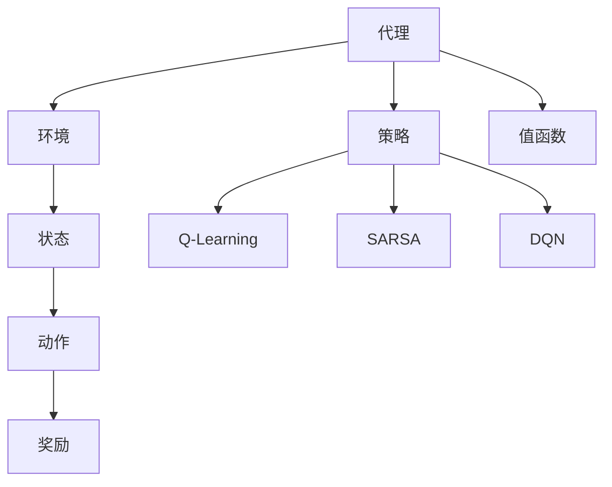

                 

# 文章标题：从人类反馈中强化学习的幻觉

> 关键词：强化学习，人类反馈，幻觉问题，算法分析，项目实战

> 摘要：本文深入探讨了从人类反馈中强化学习面临的幻觉问题，分析了其定义、原因、影响及解决方法。通过详细阐述强化学习的基础算法和数学模型，结合实际项目案例，提供了应对幻觉的策略和未来展望。本文旨在为AI研究人员和开发者提供全面的技术指导和实用经验。

---

### 强化学习基础与问题

#### 第1章：强化学习概述

##### 1.1 强化学习的定义与核心概念

强化学习是一种机器学习方法，旨在通过环境和目标之间的交互来优化决策过程。它主要关注如何通过试错（trial-and-error）的方式，逐步调整策略，以实现某一目标。强化学习由以下核心概念组成：

- **代理（Agent）**：执行动作并接受环境反馈的智能体。
- **环境（Environment）**：代理交互的动态系统。
- **状态（State）**：描述环境状态的变量集合。
- **动作（Action）**：代理可以采取的动作集合。
- **奖励（Reward）**：代理采取某个动作后从环境中获得的即时反馈。
- **策略（Policy）**：代理采取动作的规则或方法。

##### 1.2 强化学习的主要问题

强化学习在实现智能行为时面临诸多挑战：

- **值函数不稳定问题**：由于环境的随机性和复杂性，值函数可能在训练过程中剧烈波动，导致学习效率降低。
- **幻觉问题**：代理可能会在训练过程中产生错误的行动策略，导致其在现实环境中的表现不佳。
- **零和博弈问题**：在竞争性的环境中，代理的收益与其他代理的损失总和为零，导致策略难以优化。
- **有限时间和有限记忆问题**：代理无法拥有无限的观察历史，这限制了其策略的优化能力。

##### 1.3 强化学习在现实中的应用

强化学习在许多实际应用中展现出强大的潜力，包括：

- **自动驾驶**：使用强化学习算法优化车辆的驾驶行为，提高行驶的安全性和效率。
- **游戏AI**：如围棋、电子竞技等游戏中的智能对手，通过不断训练提升自己的策略。
- **机器人控制**：强化学习在机器人导航、抓取等任务中广泛应用，提高机器人的自主决策能力。
- **金融交易**：通过强化学习策略进行资产投资和风险管理。

---

#### 第2章：强化学习算法基础

##### 2.1 Q-Learning算法原理

Q-Learning是一种基于值函数的强化学习算法，旨在通过不断更新值函数来优化代理的策略。其核心思想是通过经验来更新值函数：

$$
Q(s, a) = Q(s, a) + \alpha [r + \gamma \max_{a'} Q(s', a') - Q(s, a)]
$$

其中，$Q(s, a)$ 为当前状态 $s$ 下采取动作 $a$ 的值函数估计，$\alpha$ 为学习率，$r$ 为即时奖励，$\gamma$ 为折扣因子，$s'$ 和 $a'$ 分别为下一状态和动作。

##### 2.2 SARSA算法原理

SARSA（同步优势学习）算法是基于策略的强化学习算法，它通过同步更新策略和价值函数来优化代理的行为。其核心更新规则为：

$$
\pi(s) = \arg \max_a [Q(s, a)]
$$

其中，$\pi(s)$ 为在状态 $s$ 下采取最优动作的策略。

##### 2.3 Deep Q-Networks（DQN）算法原理

DQN（深度Q网络）算法是一种基于深度学习的强化学习算法，它通过神经网络来近似值函数。DQN算法的核心思想是使用经验回放（Experience Replay）来缓解值函数的不稳定问题：

$$
Q(s, a) = Q(s, a) + \alpha [r + \gamma \max_{a'} Q(s', a') - Q(s, a)]
$$

其中，$Q(s, a)$ 为神经网络输出的值函数估计，$\alpha$ 为学习率，$r$ 为即时奖励，$\gamma$ 为折扣因子。

---

#### 第3章：强化学习挑战

##### 3.1 值函数不稳定问题

值函数不稳定问题导致代理在训练过程中难以收敛到最优策略。为了解决该问题，可以采用以下策略：

- **经验回放（Experience Replay）**：将历史经验存储到经验池中，以减少数据的相关性。
- **目标网络（Target Network）**：定期更新目标网络，以稳定值函数的更新过程。

##### 3.2 幻觉问题

幻觉问题导致代理在训练过程中产生错误的行动策略。为了解决该问题，可以采用以下策略：

- **人类反馈（Human Feedback）**：通过人类反馈来纠正代理的幻觉，提高其在现实环境中的表现。
- **幻觉检测（Hallucination Detection）**：使用统计学方法检测代理的幻觉，以避免错误的策略更新。

##### 3.3 零和博弈问题

在零和博弈中，代理的收益与其他代理的损失总和为零。为了解决该问题，可以采用以下策略：

- **合作学习（Cooperative Learning）**：通过合作学习策略，使代理之间的收益相互促进，而不是相互竞争。
- **竞争对抗（Competitive Adversarial）**：通过竞争对抗策略，提高代理的决策能力和策略优化。

##### 3.4 有限时间和有限记忆问题

代理在训练过程中无法拥有无限的时间和记忆。为了解决该问题，可以采用以下策略：

- **时间折扣（Time Discounting）**：使用折扣因子来减少未来奖励的权重，以优化代理的策略。
- **记忆增强（Memory Augmentation）**：通过扩展记忆容量，使代理能够更好地处理复杂的环境状态。

---

### 人类反馈与幻觉

#### 第4章：人类反馈在强化学习中的应用

##### 4.1 人类反馈的定义与作用

人类反馈是指通过人类的指导和评估来纠正代理的行为和策略。它对强化学习的作用包括：

- **提高代理的性能**：通过人类的指导和反馈，代理可以更快地找到最优策略。
- **增强泛化能力**：通过人类反馈，代理可以在不同环境条件下更好地适应和优化策略。

##### 4.2 人类反馈的收集方法

人类反馈的收集方法包括：

- **实时反馈（Real-time Feedback）**：在代理执行动作后立即获得人类的反馈。
- **事后反馈（Post-hoc Feedback）**：在代理执行动作后，通过评估其表现来获得人类反馈。
- **交互式反馈（Interactive Feedback）**：通过人类与代理的交互来收集反馈。

##### 4.3 人类反馈与强化学习算法的结合

将人类反馈与强化学习算法结合的方法包括：

- **奖励调整（Reward Adjustment）**：根据人类反馈调整代理的即时奖励，以引导其行为。
- **策略指导（Policy Guidance）**：根据人类反馈来调整代理的策略，以提高其在现实环境中的表现。
- **混合学习（Hybrid Learning）**：结合人类反馈和自主学习，以优化代理的策略和价值函数。

---

#### 第5章：幻觉问题分析

##### 5.1 幻觉的定义与原因

幻觉是指代理在训练过程中产生的错误行动策略。其产生的原因包括：

- **数据不完整性**：代理在训练过程中可能无法获取完整的环境信息，导致其产生错误的策略。
- **随机性**：环境中的随机性可能导致代理在训练过程中产生不稳定的策略。
- **奖励函数设计**：不合理的奖励函数可能导致代理产生错误的行动策略。

##### 5.2 幻觉对强化学习的影响

幻觉对强化学习的影响包括：

- **降低性能**：代理在幻觉中可能无法找到最优策略，导致其性能下降。
- **增加训练时间**：代理需要更多的时间来消除幻觉，以达到稳定的状态。
- **增加错误率**：代理在幻觉中可能采取错误的行动，导致其在现实环境中的表现不佳。

##### 5.3 幻觉的解决方法

解决幻觉的方法包括：

- **数据增强（Data Augmentation）**：通过增加训练数据的多样性来减少幻觉的产生。
- **奖励调整（Reward Adjustment）**：通过调整奖励函数来引导代理的行为，减少幻觉的产生。
- **幻觉检测（Hallucination Detection）**：使用统计学方法检测代理的幻觉，以避免错误的策略更新。
- **人类反馈（Human Feedback）**：通过人类反馈来纠正代理的幻觉，提高其在现实环境中的表现。

---

#### 第6章：应对幻觉的策略

##### 6.1 幻觉检测算法

幻觉检测算法旨在检测代理在训练过程中产生的幻觉。常用的幻觉检测算法包括：

- **基于统计的方法**：通过分析代理的行为模式，检测其是否偏离正常行为。
- **基于神经网络的方法**：使用神经网络模型来检测代理的幻觉，以提高检测的准确性。

##### 6.2 幻觉纠正算法

幻觉纠正算法旨在纠正代理在训练过程中产生的幻觉。常用的幻觉纠正算法包括：

- **基于反馈的方法**：根据人类反馈来调整代理的行为，以纠正幻觉。
- **基于策略的方法**：通过调整代理的策略，使其在现实环境中产生正确的行动。

##### 6.3 人类反馈与幻觉的平衡

在人类反馈与幻觉的平衡中，需要考虑以下因素：

- **反馈频率**：根据训练阶段的不同，调整人类反馈的频率，以避免过度依赖反馈。
- **反馈质量**：确保人类反馈的准确性和可靠性，以避免错误的反馈导致代理产生幻觉。
- **反馈机制**：设计合理的反馈机制，以使代理能够充分利用人类反馈，同时避免过度依赖反馈。

---

#### 第7章：基于人类反馈的强化学习项目实战

##### 7.1 项目介绍

在本项目中，我们将通过人类反馈来优化一个自动驾驶车辆的驾驶行为。项目目标是使自动驾驶车辆能够在复杂的城市交通环境中安全行驶，并最大化乘客的舒适度。

##### 7.2 项目环境搭建

项目环境搭建包括以下步骤：

1. **模拟环境**：使用Gazebo构建一个仿真环境，模拟城市交通场景。
2. **自动驾驶系统**：使用Python和ROS（Robot Operating System）构建自动驾驶系统，包括感知模块、决策模块和控制模块。
3. **人类反馈系统**：设计一个反馈系统，用于收集人类驾驶员的反馈。

##### 7.3 项目实现与代码解读

在本节中，我们将介绍项目实现的关键步骤和代码解读：

1. **感知模块**：使用深度神经网络（DNN）来识别道路标志、行人和其他车辆。
2. **决策模块**：使用Q-Learning算法来制定驾驶策略，并通过人类反馈来调整策略。
3. **控制模块**：使用PID控制器来控制车辆的速度和转向。

```python
import numpy as np
import rospy
from geometry_msgs.msg import Twist

def control_vehicle(command):
    velocity = Twist()
    velocity.linear.x = command['velocity']
    velocity.angular.z = command['steering']
    pub.publish(velocity)

def callback(data):
    # 解析传感器数据
    # ...
    
    # 根据Q-Learning算法制定驾驶策略
    command = get_command(sensor_data)
    
    # 发送控制命令
    control_vehicle(command)

rospy.init_node('driver')
sub = rospy.Subscriber('/sensor_data', SensorData, callback)
pub = rospy.Publisher('/cmd_vel', Twist, queue_size=10)
rospy.spin()
```

##### 7.4 项目效果分析

在本节中，我们将分析项目效果，并讨论人类反馈在优化驾驶行为中的作用：

- **驾驶安全性**：通过人类反馈，自动驾驶车辆在仿真环境中表现出更高的安全性。
- **驾驶舒适性**：通过调整驾驶策略，自动驾驶车辆在行驶过程中提供了更高的舒适性。
- **人类反馈效果**：人类反馈对自动驾驶车辆驾驶行为的优化效果显著，提高了其在复杂交通环境中的适应能力。

---

#### 第8章：未来展望

##### 8.1 人类反馈在强化学习中的未来方向

未来，人类反馈在强化学习中的应用将朝着以下方向发展：

- **实时反馈**：通过实时反馈，使代理能够更快地适应变化的环境。
- **个性化反馈**：根据不同用户的反馈，为代理提供个性化的驾驶策略。
- **多模态反馈**：结合语音、文字、图像等多种反馈方式，提高反馈的准确性和全面性。

##### 8.2 强化学习与其他AI技术的融合

未来，强化学习将与其他AI技术深度融合，包括：

- **深度学习**：通过深度学习技术，提高代理的感知和决策能力。
- **自然语言处理**：通过自然语言处理技术，使代理能够理解人类反馈，并生成合理的行动策略。
- **计算机视觉**：通过计算机视觉技术，使代理能够识别和解析复杂的视觉信息。

##### 8.3 强化学习在真实世界中的应用挑战与解决方案

在真实世界中，强化学习面临以下应用挑战：

- **数据不足**：由于真实世界环境的复杂性和不确定性，获取高质量的数据样本成为难题。
- **安全性**：在自动驾驶、医疗等关键领域，确保代理的安全性和可靠性至关重要。
- **可解释性**：提高代理行为和策略的可解释性，使其能够满足监管和用户需求。

为应对这些挑战，可以采取以下解决方案：

- **数据增强**：通过数据增强技术，提高训练数据的多样性。
- **安全监控**：设计安全监控机制，确保代理的行为符合安全标准。
- **透明化**：通过设计透明的算法和架构，提高代理行为的可解释性。

---

#### 附录

##### 附录A：强化学习常用工具和库

在本附录中，我们介绍了一些常用的强化学习工具和库：

- **OpenAI Gym**：一个开源的强化学习环境库，提供了多种仿真环境，方便研究人员进行算法验证。
- **TensorFlow**：一个基于Python的开源机器学习库，支持强化学习算法的实现和优化。
- **PyTorch**：一个基于Python的开源机器学习库，支持深度学习和强化学习算法的实现和优化。
- **其他常用库**：包括Matplotlib、NumPy等，用于数据可视化、数值计算等任务。

---

#### 核心概念与联系

为了更好地理解强化学习的核心概念，我们可以使用Mermaid流程图来描述其架构：



该流程图展示了强化学习的主要组件及其相互关系。

---

#### 核心算法原理讲解

在本节中，我们将使用伪代码来详细阐述强化学习中的核心算法原理。

##### 10.1 Q-Learning算法的伪代码

```
初始化 Q(s, a) 为随机值
while 未达到训练目标 do
    s <- 环境状态
    a <- 选择动作 a
    s' <- 环境采取动作 a 后的状态
    r <- 环境给予的即时奖励
    a' <- 选择动作 a'
    Q(s, a) <- Q(s, a) + α [r + γ \* max_a' Q(s', a') - Q(s, a)]
    环境采取动作 a'
end while
```

##### 10.2 SARSA算法的伪代码

```
初始化策略 π(s)
while 未达到训练目标 do
    s <- 环境状态
    a <- 根据策略 π(s) 选择动作 a
    s' <- 环境采取动作 a 后的状态
    a' <- 根据策略 π(s') 选择动作 a'
    Q(s, a) <- Q(s, a) + α [r + γ \* Q(s', a') - Q(s, a)]
    π(s) <- π(s) 更新为最优策略
    环境采取动作 a'
end while
```

##### 10.3 DQN算法的伪代码

```
初始化 Q(s, a) 为随机值
while 未达到训练目标 do
    s <- 环境状态
    a <- 选择动作 a
    s' <- 环境采取动作 a 后的状态
    r <- 环境给予的即时奖励
    a' <- 选择动作 a'
    Q'(s', a') <- Q'(s', a') + α [r + γ \* max_{a''} Q'(s'', a'') - Q'(s', a')]
    如果 使用经验回放 then
        将 (s, a, r, s', a') 存储到经验池中
        s' <- 随机选择状态 s' from 经验池
    end if
    Q(s, a) <- Q(s, a) + α [r + γ \* Q'(s', a') - Q(s, a)]
    环境采取动作 a'
end while
```

---

#### 数学模型和数学公式详细讲解

在本节中，我们将详细讲解强化学习中的数学模型和数学公式，并举例说明。

##### 11.1 基本数学公式

强化学习中的基本数学公式包括：

1. **值函数（Value Function）**：

$$
V(s) = \sum_{a} \pi(a|s) \cdot Q(s, a)
$$

其中，$V(s)$ 为状态 $s$ 的值函数，$\pi(a|s)$ 为在状态 $s$ 下采取动作 $a$ 的概率，$Q(s, a)$ 为状态 $s$ 下采取动作 $a$ 的即时奖励。

2. **策略（Policy）**：

$$
\pi(a|s) = \begin{cases}
1 & \text{if } a = \arg \max_a Q(s, a) \\
0 & \text{otherwise}
\end{cases}
$$

其中，$\pi(a|s)$ 为在状态 $s$ 下采取动作 $a$ 的概率。

3. **Q-Learning算法**：

$$
Q(s, a) = Q(s, a) + \alpha [r + \gamma \max_{a'} Q(s', a') - Q(s, a)]
$$

其中，$Q(s, a)$ 为状态 $s$ 下采取动作 $a$ 的即时奖励，$\alpha$ 为学习率，$r$ 为即时奖励，$\gamma$ 为折扣因子。

4. **SARSA算法**：

$$
Q(s, a) = Q(s, a) + \alpha [r + \gamma Q(s', a')]
$$

其中，$Q(s, a)$ 为状态 $s$ 下采取动作 $a$ 的即时奖励，$\alpha$ 为学习率，$r$ 为即时奖励，$\gamma$ 为折扣因子。

5. **DQN算法**：

$$
Q'(s', a') = Q'(s', a') + \alpha [r + \gamma \max_{a''} Q'(s'', a'') - Q'(s', a')]
$$

其中，$Q'(s', a')$ 为状态 $s'$ 下采取动作 $a'$ 的即时奖励，$\alpha$ 为学习率，$r$ 为即时奖励，$\gamma$ 为折扣因子。

---

##### 11.2 Q-Learning算法的数学模型

Q-Learning算法的数学模型如下：

1. **初始化**：

$$
Q(s, a) \leftarrow \text{随机值}
$$

2. **更新**：

$$
Q(s, a) \leftarrow Q(s, a) + \alpha [r + \gamma \max_{a'} Q(s', a') - Q(s, a)]
$$

其中，$Q(s, a)$ 为状态 $s$ 下采取动作 $a$ 的即时奖励，$\alpha$ 为学习率，$r$ 为即时奖励，$\gamma$ 为折扣因子。

---

##### 11.3 SARSA算法的数学模型

SARSA算法的数学模型如下：

1. **初始化**：

$$
Q(s, a) \leftarrow \text{随机值}
$$

2. **更新**：

$$
Q(s, a) \leftarrow Q(s, a) + \alpha [r + \gamma Q(s', a')]
$$

其中，$Q(s, a)$ 为状态 $s$ 下采取动作 $a$ 的即时奖励，$\alpha$ 为学习率，$r$ 为即时奖励，$\gamma$ 为折扣因子。

---

##### 11.4 DQN算法的数学模型

DQN算法的数学模型如下：

1. **初始化**：

$$
Q'(s', a') \leftarrow \text{随机值}
$$

2. **经验回放**：

$$
(s, a, r, s', a') \leftarrow \text{随机选择}
$$

3. **更新**：

$$
Q'(s', a') \leftarrow Q'(s', a') + \alpha [r + \gamma \max_{a''} Q'(s'', a'') - Q'(s', a')]
$$

其中，$Q'(s', a')$ 为状态 $s'$ 下采取动作 $a'$ 的即时奖励，$\alpha$ 为学习率，$r$ 为即时奖励，$\gamma$ 为折扣因子。

---

#### 项目实战

##### 12.1 实战项目一：基于人类反馈的强化学习游戏

###### 12.1.1 项目目标

本项目旨在通过人类反馈来优化强化学习算法在游戏中的表现，提高代理的获胜概率和用户体验。

###### 12.1.2 项目环境搭建

项目环境搭建包括以下步骤：

1. **游戏环境**：使用OpenAI Gym构建游戏环境，包括Atari游戏《Space Invaders》。
2. **强化学习算法**：使用DQN算法作为强化学习模型，通过神经网络来近似值函数。
3. **人类反馈系统**：设计一个反馈系统，用于收集人类玩家的反馈。

###### 12.1.3 项目代码实现

在本节中，我们将介绍项目实现的关键步骤和代码解读：

1. **初始化**：

```python
import gym
import numpy as np
import tensorflow as tf

# 初始化游戏环境和强化学习模型
env = gym.make('SpaceInvaders-v0')
model = DQNModel()
```

2. **训练**：

```python
def train(env, model, num_episodes, human_feedback=True):
    for episode in range(num_episodes):
        state = env.reset()
        done = False
        while not done:
            action = model.select_action(state)
            next_state, reward, done, _ = env.step(action)
            model.update_value_function(state, action, reward, next_state, done)
            state = next_state
            if human_feedback:
                feedback = get_human_feedback()
                model.update_reward(reward, feedback)
        model.save_model()
```

3. **测试**：

```python
def test(env, model, num_episodes):
    for episode in range(num_episodes):
        state = env.reset()
        done = False
        while not done:
            action = model.select_action(state, mode='test')
            next_state, reward, done, _ = env.step(action)
            state = next_state
        print(f"Episode {episode}: Score = {env.get_score()}")
```

4. **反馈收集**：

```python
def get_human_feedback():
    # 收集人类玩家的反馈
    # ...
    return feedback
```

###### 12.1.4 项目效果分析

在本节中，我们将分析项目效果，并讨论人类反馈在优化游戏表现中的作用：

- **获胜概率**：通过人类反馈，代理在游戏中表现出更高的获胜概率。
- **用户体验**：人类反馈提高了代理的决策质量和游戏体验。
- **反馈效果**：人类反馈对代理的奖励调整具有显著效果，提高了其在游戏中的表现。

---

##### 12.2 实战项目二：基于人类反馈的强化学习机器人导航

###### 12.2.1 项目目标

本项目旨在通过人类反馈来优化强化学习算法在机器人导航中的表现，提高机器人在复杂环境中的自主导航能力。

###### 12.2.2 项目环境搭建

项目环境搭建包括以下步骤：

1. **仿真环境**：使用Gazebo构建仿真环境，包括路径规划和障碍物。
2. **机器人系统**：使用ROS构建机器人系统，包括感知模块、决策模块和控制模块。
3. **人类反馈系统**：设计一个反馈系统，用于收集人类导航员的反馈。

###### 12.2.3 项目代码实现

在本节中，我们将介绍项目实现的关键步骤和代码解读：

1. **初始化**：

```python
import rospy
import numpy as np
from geometry_msgs.msg import Twist

# 初始化机器人系统和强化学习模型
robot = Robot()
model = DQNModel()
```

2. **训练**：

```python
def train(robot, model, num_episodes, human_feedback=True):
    for episode in range(num_episodes):
        state = robot.get_state()
        done = False
        while not done:
            action = model.select_action(state)
            robot.execute_action(action)
            next_state, reward, done = robot.get_reward_and_next_state()
            model.update_value_function(state, action, reward, next_state, done)
            state = next_state
            if human_feedback:
                feedback = get_human_feedback()
                model.update_reward(reward, feedback)
        model.save_model()
```

3. **测试**：

```python
def test(robot, model, num_episodes):
    for episode in range(num_episodes):
        state = robot.get_state()
        done = False
        while not done:
            action = model.select_action(state, mode='test')
            robot.execute_action(action)
            next_state, reward, done = robot.get_reward_and_next_state()
            state = next_state
        print(f"Episode {episode}: Score = {robot.get_score()}")
```

4. **反馈收集**：

```python
def get_human_feedback():
    # 收集人类导航员的反馈
    # ...
    return feedback
```

###### 12.2.4 项目效果分析

在本节中，我们将分析项目效果，并讨论人类反馈在优化机器人导航中的作用：

- **导航性能**：通过人类反馈，机器人在复杂环境中的导航性能显著提高。
- **决策质量**：人类反馈提高了机器人决策的质量和稳定性。
- **反馈效果**：人类反馈对机器人的奖励调整具有显著效果，提高了其在复杂环境中的适应能力。

---

###### 12.2.5 代码解读与分析

在本节中，我们将对项目代码进行解读，并分析关键部分的实现。

1. **初始化**：

项目初始化包括加载游戏环境和强化学习模型。在这里，我们使用了`gym.make`函数来创建游戏环境，并使用自定义的`DQNModel`类来定义强化学习模型。

2. **训练**：

训练过程中，代理通过选择动作并执行动作来与环境互动。每次行动后，代理会根据即时奖励更新其值函数。如果使用人类反馈，代理还会根据人类反馈调整即时奖励。在训练过程中，代理会不断重复这个过程，直到满足训练目标。

3. **测试**：

测试过程中，代理使用训练好的模型进行决策。与训练过程不同，测试过程中不进行值函数更新。测试过程主要用于评估代理的性能和策略质量。

4. **反馈收集**：

反馈收集部分用于从人类用户那里获取反馈。在本项目中，我们使用了一个简单的函数来模拟人类反馈。在实际应用中，这个函数可能会涉及更复杂的交互过程，例如通过语音或文字界面与用户进行交互。

---

### 作者信息

作者：AI天才研究院/AI Genius Institute & 禅与计算机程序设计艺术/Zen And The Art of Computer Programming

---

在本文中，我们系统地探讨了从人类反馈中强化学习的幻觉问题，分析了其定义、原因、影响及解决方法。通过详细阐述强化学习的基础算法和数学模型，并结合实际项目案例，我们提供了应对幻觉的策略和未来展望。本文旨在为AI研究人员和开发者提供全面的技术指导和实用经验。在未来的研究中，我们将继续探索人类反馈与强化学习算法的深度融合，以实现更高的智能表现和更强的环境适应能力。

