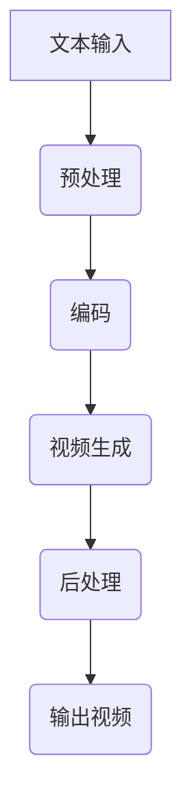

                 

# 《从文本到视频的AI模型演进》

## 关键词
- 人工智能
- 视频生成
- 自然语言处理
- 深度学习
- 生成对抗网络
- 编码器-解码器模型

## 摘要
本文旨在探讨从文本到视频的AI模型演进过程，从基础概念到核心算法，再到项目实战，系统性地分析并揭示了这一领域的最新研究成果和应用前景。文章首先介绍了文本到视频AI模型的研究背景与意义，接着阐述了相关的核心概念和联系，然后深入讲解了生成模型、文本预处理、视频生成与后处理等关键环节。通过实例分析和代码实现，本文为读者提供了一个清晰、全面的学习路径，以把握从文本到视频AI模型的最新动态。

## 《从文本到视频的AI模型演进》目录大纲

### 第一部分：引言与基础

#### 第1章：从文本到视频的AI模型概览
##### 1.1 研究背景与意义
##### 1.2 当前AI模型技术综述
##### 1.3 从文本到视频的AI模型挑战与机遇

#### 第2章：核心概念与联系
##### 2.1 AI基础概念
##### 2.2 视频数据处理
##### 2.3 Mermaid流程图：AI模型在视频生成中的应用

### 第二部分：核心算法原理讲解

#### 第3章：从文本到视频的生成模型
##### 3.1 模型介绍
##### 3.2 伪代码
$$
\text{伪代码：从文本到视频生成模型的框架}
$$
##### 3.3 数学模型详解
$$
\text{数学公式：生成模型的核心数学公式}
$$

#### 第4章：文本预处理与编码
##### 4.1 文本预处理方法
##### 4.2 编码技术原理

#### 第5章：视频生成与后处理
##### 5.1 视频生成原理
##### 5.2 视频后处理技术

#### 第6章：实时视频生成模型
##### 6.1 实时性挑战
##### 6.2 实时视频生成算法

### 第三部分：数学模型和数学公式讲解

#### 第7章：数学模型在视频生成中的应用
##### 7.1 线性代数基础
##### 7.2 概率论与信息论基础
##### 7.3 微积分基础

#### 第8章：深度学习在视频生成中的数学模型
##### 8.1 神经网络基础
##### 8.2 深度学习优化算法

#### 第9章：视频生成中的数学公式解析
##### 9.1 损失函数
##### 9.2 优化目标
$$
\text{数学公式：损失函数与优化目标}
$$

### 第四部分：项目实战

#### 第10章：开发环境搭建
##### 10.1 计算机硬件要求
##### 10.2 软件安装与配置

#### 第11章：代码实现与解读
##### 11.1 代码实现框架
##### 11.2 代码解读与分析

#### 第12章：案例分析
##### 12.1 项目背景
##### 12.2 项目实现与效果评估

#### 第13章：未来展望
##### 13.1 技术发展趋势
##### 13.2 应用前景与挑战

### 附录

#### 附录 A：AI模型开发工具与资源
##### A.1 主流深度学习框架对比
##### A.2 视频处理工具介绍
##### A.3 文本处理工具介绍

---

### 第一部分：引言与基础

#### 第1章：从文本到视频的AI模型概览

##### 1.1 研究背景与意义

随着人工智能技术的飞速发展，自然语言处理（NLP）和计算机视觉领域的重大突破，从文本到视频的AI模型逐渐成为研究热点。传统的计算机视觉和NLP技术主要处理静态图像和文本信息，而视频作为动态信息的重要载体，能够提供更加丰富和复杂的交互数据。从文本到视频的AI模型旨在通过文本输入生成相应的视频内容，实现了跨媒体信息处理的重要突破。

这种技术的研究背景源于多方面的需求。首先，在内容创作领域，从文本到视频的转换能够极大地提高内容生产的效率，降低创作成本。例如，电影、电视剧、广告等视频内容的制作可以通过自动生成的方式实现，从而满足不断增长的内容需求。其次，在教育领域，文本到视频的转换技术可以辅助教学，通过视频的形式呈现教学内容，提高学习效果和互动性。此外，在虚拟现实（VR）和增强现实（AR）领域，从文本到视频的转换技术能够实现更丰富的交互体验，提升用户的沉浸感。

##### 1.2 当前AI模型技术综述

在AI模型技术方面，从文本到视频的生成主要包括以下几个关键环节：文本预处理、编码、视频生成和后处理。以下是当前AI模型技术的综述：

1. **文本预处理**：文本预处理是生成模型的第一步，主要包括分词、词性标注、命名实体识别等操作。这一阶段的主要目的是将文本转化为结构化的数据形式，以便后续处理。

2. **编码**：编码是将文本转化为向量表示的过程，常用的方法包括词嵌入和句子嵌入。词嵌入将每个单词映射为一个固定大小的向量，句子嵌入则将整段文本映射为一个高维向量。这些向量表示用于后续的模型训练。

3. **视频生成**：视频生成是模型的核心环节，主要包括视频序列生成和视频内容生成。视频序列生成是将文本转化为视频帧序列，而视频内容生成则是进一步将视频帧序列转化为完整的视频内容。

4. **后处理**：后处理是对生成的视频内容进行优化和修复的过程，包括视频去噪、视频增强、视频剪辑等操作。这一阶段的主要目的是提高视频的质量和可观赏性。

##### 1.3 从文本到视频的AI模型挑战与机遇

尽管从文本到视频的AI模型具有巨大的应用前景，但在实际应用中仍然面临诸多挑战。以下是一些主要挑战：

1. **复杂性**：视频内容比文本内容更加复杂，包含更多的视觉和运动信息。生成模型需要处理大量的特征，从而增加了模型的复杂度和训练难度。

2. **数据不足**：生成模型通常需要大量的训练数据来学习特征和模式。然而，高质量的文本到视频数据集相对较少，这限制了模型的效果。

3. **实时性**：在实际应用中，模型需要能够快速响应文本输入并生成视频内容。然而，视频生成过程通常需要较长的时间，这影响了模型的实时性。

4. **可解释性**：生成模型通常具有“黑箱”特性，难以解释其生成过程和决策依据。这限制了模型在关键应用场景中的使用，如医疗诊断和自动驾驶等。

尽管面临挑战，从文本到视频的AI模型也带来了诸多机遇：

1. **内容创作**：从文本到视频的转换技术可以极大地提高内容创作的效率，降低创作成本。这为媒体、教育、娱乐等领域提供了新的商业模式和创作手段。

2. **个性化体验**：通过文本到视频的转换，可以生成个性化视频内容，满足用户个性化的需求。这为电子商务、社交媒体等平台提供了新的服务模式。

3. **跨领域应用**：从文本到视频的转换技术可以应用于多个领域，如医疗、金融、工业等。这为不同领域的应用提供了新的技术支持。

综上所述，从文本到视频的AI模型在研究背景、技术综述和挑战与机遇方面具有重要意义。接下来，我们将进一步探讨AI模型的核心概念与联系，为深入理解该领域打下基础。

#### 第2章：核心概念与联系

##### 2.1 AI基础概念

人工智能（Artificial Intelligence，简称AI）是指计算机系统模拟人类智能行为的科学和技术。AI的核心目标是使计算机能够执行通常需要人类智能才能完成的任务，如视觉识别、语言理解、决策制定和问题解决等。AI可以分为多个子领域，其中自然语言处理（NLP）和计算机视觉是两个关键领域。

**自然语言处理（NLP）** 是AI的一个分支，专注于计算机与人类语言的交互。NLP的任务包括文本分类、情感分析、机器翻译、命名实体识别等。文本分类是将文本数据分类到预定义的类别中，而情感分析则是判断文本的情感倾向，例如正面、负面或中性。

**计算机视觉** 是AI的另一个重要分支，专注于使计算机能够从图像或视频中提取信息。计算机视觉的任务包括图像分类、目标检测、图像分割和姿态估计等。图像分类是将图像分类到预定义的类别中，而目标检测则是识别图像中的多个对象并标注其位置。

##### 2.2 视频数据处理

视频数据是由连续的图像帧组成的，每个帧包含丰富的视觉信息。视频数据处理涉及多个阶段，包括视频编码、视频解码、图像预处理和特征提取。

**视频编码** 是将视频数据压缩为一种高效格式的过程。常见的视频编码标准包括H.264和HEVC。视频编码通过去除冗余信息和采用高效的压缩算法来减少数据量，同时保持视频质量。

**视频解码** 是将编码后的视频数据还原为原始视频帧的过程。解码器使用与编码器相同的算法和参数来重建视频帧。

**图像预处理** 包括图像增强、去噪和边缘检测等操作。这些操作旨在提高图像的质量和可解释性，以便后续的特征提取。

**特征提取** 是从图像帧中提取具有区分性的特征的过程。特征提取可以采用传统的图像处理方法，如直方图均衡化和Sobel算子，也可以采用深度学习方法，如卷积神经网络（CNN）。

##### 2.3 Mermaid流程图：AI模型在视频生成中的应用

为了更好地理解从文本到视频的AI模型，我们可以使用Mermaid流程图来展示其关键步骤。以下是一个简单的Mermaid流程图示例：



**图1：从文本到视频的AI模型流程图**

1. **文本输入**：用户输入文本信息，这可以是自然语言文本，如一句描述性语句。
2. **预处理**：文本预处理包括分词、词性标注和命名实体识别等操作，将文本转化为结构化的数据形式。
3. **编码**：编码过程将预处理后的文本转化为向量表示，例如使用词嵌入或句子嵌入技术。
4. **视频生成**：视频生成模型根据编码后的文本向量生成视频帧序列，这可能涉及复杂的生成算法，如生成对抗网络（GAN）。
5. **后处理**：视频后处理包括视频去噪、视频增强和视频剪辑等操作，以提高视频质量。
6. **输出视频**：最终生成的视频内容被输出，可供用户观看或进一步使用。

通过上述核心概念与联系的阐述，我们可以更好地理解从文本到视频的AI模型的构建原理和应用场景。接下来，我们将深入探讨从文本到视频的生成模型及其算法原理。

### 第二部分：核心算法原理讲解

#### 第3章：从文本到视频的生成模型

##### 3.1 模型介绍

从文本到视频的生成模型是结合自然语言处理和计算机视觉技术的一种先进方法。这种模型的主要任务是利用文本输入生成相应的视频内容。生成模型通常采用编码器-解码器（Encoder-Decoder）结构，结合生成对抗网络（GAN）和其他深度学习技术，以实现高质量的图像和视频生成。

编码器（Encoder）负责将输入的文本信息编码为向量表示，这一步通常涉及词嵌入和句子嵌入技术。解码器（Decoder）则根据编码后的向量生成视频帧序列。生成对抗网络（GAN）是一个辅助模块，用于增强模型的生成能力，通过生成器（Generator）和判别器（Discriminator）之间的对抗训练，使得生成的视频质量不断提高。

##### 3.2 伪代码

以下是生成模型的一个简化的伪代码框架，描述了从文本到视频生成的基本步骤：

```python
# 从文本到视频生成模型伪代码

# 编码器部分
def encode_text(text):
    # 分词、词性标注等预处理操作
    processed_text = preprocess_text(text)
    # 将预处理后的文本转化为向量表示
    encoded_vector = text_embedding(processed_text)
    return encoded_vector

# 解码器部分
def decode_video(encoded_vector):
    # 根据编码向量生成视频帧序列
    video_frames = generator.generate(encoded_vector)
    return video_frames

# 生成对抗网络部分
def train_gan():
    # 初始化生成器和判别器
    generator, discriminator = initialize_gan()
    # 训练生成器和判别器
    for epoch in range(num_epochs):
        for batch in data_loader:
            # 训练判别器
            discriminator_loss = train_discriminator(discriminator, batch)
            # 训练生成器
            generator_loss = train_generator(generator, discriminator)
            # 打印训练进度
            print(f"Epoch [{epoch+1}/{num_epochs}], Generator Loss: {generator_loss}, Discriminator Loss: {discriminator_loss}")

# 主函数
def main():
    # 加载训练数据
    text_data, video_data = load_data()
    # 训练生成模型
    train_gan()
    # 生成视频
    encoded_vector = encode_text("描述一段视频内容")
    generated_video = decode_video(encoded_vector)
    # 输出生成的视频
    save_video(generated_video, "output_video.mp4")

if __name__ == "__main__":
    main()
```

##### 3.3 数学模型详解

生成模型的数学基础主要涉及深度学习中的神经网络和生成对抗网络（GAN）。

**神经网络基础**：

- **卷积神经网络（CNN）**：用于提取图像特征，可以用于视频帧的生成。
- **递归神经网络（RNN）**：用于处理序列数据，例如文本序列或视频帧序列。

**生成对抗网络（GAN）**：

- **生成器（Generator）**：生成器网络将编码后的文本向量映射为视频帧序列。其目标是最小化生成的视频质量与真实视频质量之间的差距。
- **判别器（Discriminator）**：判别器网络用于判断生成的视频帧是否真实。其目标是最小化生成的视频被判别为真实的概率。

**数学公式**：

1. **生成器损失函数**：

$$
L_G = -\log(D(G(z)))
$$

其中，$G(z)$ 是生成器生成的视频帧，$D$ 是判别器。

2. **判别器损失函数**：

$$
L_D = -\log(D(x)) - \log(1 - D(G(z)))
$$

其中，$x$ 是真实的视频帧，$G(z)$ 是生成器生成的视频帧。

3. **总损失函数**：

$$
L = L_G + \lambda L_D
$$

其中，$\lambda$ 是调节生成器和判别器损失函数之间平衡的权重。

通过上述核心算法原理讲解，我们可以更好地理解从文本到视频的生成模型及其关键步骤。接下来，我们将进一步探讨文本预处理与编码技术，这是生成模型的基础环节。

#### 第4章：文本预处理与编码

##### 4.1 文本预处理方法

文本预处理是从文本到视频生成模型的关键步骤，它决定了文本输入的质量和后续编码的效果。文本预处理方法主要包括以下几个步骤：

1. **分词**：分词是将文本分割成单个单词或短语的过程。常用的分词方法有基于规则的分词和基于统计的分词。基于规则的分词依赖于预定义的词典和语法规则，而基于统计的分词则通过统计文本中的词频和共现关系进行分词。

2. **词性标注**：词性标注是为每个单词分配一个词性标签，如名词、动词、形容词等。词性标注有助于理解文本的语义和结构，为后续的句子嵌入提供重要信息。

3. **命名实体识别**：命名实体识别是识别文本中的特定实体，如人名、地名、组织名等。这一步对于从文本到视频生成模型中的特定场景识别非常重要。

4. **停用词去除**：停用词是文本中频繁出现但对文本意义贡献较小或无意义的词，如“的”、“和”等。去除停用词可以减少模型的噪声，提高处理效率。

5. **词干提取**：词干提取是将单词缩减为其基本形式的过程，如将“playing”、“plays”和“played”都缩减为“play”。这一步有助于减少词汇量，简化模型训练。

##### 4.2 编码技术原理

编码是将预处理后的文本转化为向量表示的过程，以便于后续的模型训练和视频生成。常用的编码技术包括词嵌入和句子嵌入。

**词嵌入（Word Embedding）**：

词嵌入是将单词映射为固定大小的向量表示的方法。词嵌入有助于捕捉单词的语义信息，常用的词嵌入方法包括：

- **Word2Vec**：Word2Vec 是基于神经网络的词嵌入方法，通过训练模型来预测单词的相邻单词。Word2Vec 可以生成高维的词向量，其中相似的词在向量空间中更接近。
- **GloVe（Global Vectors for Word Representation）**：GloVe 是一种基于矩阵分解的词嵌入方法，通过计算单词之间的共现矩阵来学习词向量。GloVe 可以生成高质量的词向量，且训练时间较短。

**句子嵌入（Sentence Embedding）**：

句子嵌入是将整段文本映射为一个高维向量表示的方法。句子嵌入有助于捕捉文本的语义结构和上下文信息。常用的句子嵌入方法包括：

- **BERT（Bidirectional Encoder Representations from Transformers）**：BERT 是基于 Transformer 架构的双向编码器，通过预训练大型的语言模型来学习句子嵌入。BERT 能够捕捉文本的深层语义信息，并在多种 NLP 任务中取得了优异的性能。
- **RoBERTa**：RoBERTa 是 BERT 的一个变种，通过改进训练策略和模型结构来提高性能。RoBERTa 在许多 NLP 任务中都取得了领先的成果。

通过文本预处理和编码，我们可以将文本转化为适合模型训练和视频生成的向量表示。接下来，我们将深入探讨视频生成与后处理技术，这是从文本到视频生成模型的重要环节。

#### 第5章：视频生成与后处理

##### 5.1 视频生成原理

视频生成是从文本到视频生成模型的核心环节，其基本原理是将编码后的文本向量转化为连续的视频帧序列。视频生成的实现通常依赖于生成模型，如生成对抗网络（GAN）和编码器-解码器（Encoder-Decoder）结构。

**生成对抗网络（GAN）**：

生成对抗网络由生成器和判别器两部分组成。生成器接收编码后的文本向量，生成一系列视频帧，而判别器则负责判断生成的视频帧是否真实。通过对抗训练，生成器不断优化生成的视频质量，使其难以被判别器识别。

**编码器-解码器（Encoder-Decoder）结构**：

编码器-解码器结构由编码器和解码器两部分组成。编码器将输入的文本向量编码为固定长度的向量表示，解码器则根据编码后的向量生成视频帧序列。编码器和解码器通常使用深度神经网络，如卷积神经网络（CNN）和递归神经网络（RNN）。

**工作流程**：

1. **编码**：编码器将输入的文本向量转换为固定长度的编码表示，这一步通常涉及嵌入层和编码层。
2. **解码**：解码器根据编码后的向量生成视频帧序列，这一步通常涉及解码层和生成层。生成层使用卷积层或递归层生成视频帧，然后通过合并层生成完整的视频序列。
3. **优化**：通过对抗训练或基于损失函数的梯度下降算法，不断优化编码器和解码器的参数，提高生成的视频质量。

##### 5.2 视频后处理技术

视频后处理是对生成的视频内容进行优化和修复的过程，以提高视频的质量和观赏性。视频后处理技术主要包括以下几个方面：

**视频去噪**：

视频去噪旨在减少视频中的噪声，提高视频的清晰度。常用的去噪方法包括：

- **传统滤波器**：如高斯滤波器、中值滤波器和均值滤波器等。
- **深度学习方法**：如卷积神经网络（CNN）和生成对抗网络（GAN）的去噪模型。

**视频增强**：

视频增强旨在改善视频的视觉效果，如提高对比度、亮度、饱和度和清晰度等。常用的增强方法包括：

- **直方图均衡化**：通过调整图像的直方图来增强对比度。
- **自适应直方图均衡化**：针对不同区域进行直方图均衡化，以获得更好的增强效果。
- **深度学习方法**：如基于 CNN 的图像增强模型。

**视频剪辑**：

视频剪辑是对生成的视频进行裁剪、拼接和调色等操作，以优化视频的内容和视觉效果。常用的剪辑方法包括：

- **视频分割**：将视频分割成多个片段，以便于后续的处理和编辑。
- **视频拼接**：将多个视频片段拼接成完整的视频。
- **调色**：调整视频的色彩、亮度、对比度和饱和度等参数，以优化视觉效果。

**视频质量评估**：

视频质量评估是对生成的视频进行客观和主观评估的方法，以衡量视频的质量。常用的评估指标包括：

- **峰值信噪比（PSNR）**：衡量视频的失真程度。
- **结构相似性指数（SSIM）**：衡量视频的结构相似性。
- **主观评估**：通过人工评分来评估视频的质量。

通过视频生成和后处理技术的结合，我们可以生成高质量的视频内容，满足不同的应用需求。接下来，我们将探讨实时视频生成模型的实现，以应对实时性挑战。

#### 第6章：实时视频生成模型

##### 6.1 实时性挑战

实时视频生成模型需要在有限的时间内处理文本输入并生成相应的视频内容，这对模型的计算性能和响应速度提出了严峻的挑战。实时性挑战主要涉及以下几个方面：

**计算性能**：

实时视频生成模型通常涉及大量的计算任务，包括文本预处理、编码、视频生成和后处理。这些任务通常需要高效的算法和优化的计算资源。计算性能的不足会导致生成模型无法在规定的时间内完成视频生成任务。

**响应速度**：

用户通常希望在短时间内获得生成的视频内容，因此响应速度是实时视频生成模型的重要指标。生成模型需要在接收到文本输入后快速处理并生成视频，以满足用户的实时需求。

**数据流处理**：

实时视频生成模型通常涉及数据流处理，需要在处理连续文本输入的同时生成连续的视频帧序列。数据流处理需要高效的内存管理和数据处理算法，以确保生成模型的实时性能。

##### 6.2 实时视频生成算法

为了应对实时性挑战，实时视频生成算法采用了多种优化策略和技术。以下是一些常见的实时视频生成算法：

**基于卷积神经网络（CNN）的实时视频生成**：

卷积神经网络（CNN）是一种高效的图像处理算法，可以用于实时视频生成。基于 CNN 的实时视频生成算法通过优化 CNN 结构和参数，提高生成模型的计算性能和响应速度。常用的优化策略包括：

- **模型剪枝**：通过删除冗余的神经网络层和参数，减少模型的计算量。
- **量化**：将神经网络的权重和激活值转换为低精度格式，以减少计算资源的需求。
- **动态调整**：根据文本输入的复杂度动态调整模型的计算资源，以优化实时性能。

**基于生成对抗网络（GAN）的实时视频生成**：

生成对抗网络（GAN）是一种强大的图像生成算法，可以用于实时视频生成。基于 GAN 的实时视频生成算法通过优化生成器和判别器的结构和参数，提高生成模型的质量和实时性能。常用的优化策略包括：

- **预训练**：通过预训练大型的 GAN 模型，减少模型的训练时间。
- **混合模型**：将多个 GAN 模型进行组合，以提高生成模型的多样性和质量。
- **实时反馈**：根据用户反馈实时调整生成模型，以优化实时性能和用户满意度。

**基于编码器-解码器（Encoder-Decoder）的实时视频生成**：

编码器-解码器（Encoder-Decoder）结构是一种通用的视频生成框架，可以用于实时视频生成。基于编码器-解码器的实时视频生成算法通过优化编码器和解码器的结构和参数，提高生成模型的质量和实时性能。常用的优化策略包括：

- **多任务学习**：将文本生成和视频生成任务进行融合，以提高模型的综合性能。
- **分布式训练**：将模型训练任务分布到多个计算节点上，以提高训练速度。
- **增量学习**：根据用户的实时反馈，逐步优化生成模型，以提高实时性能。

通过上述实时视频生成算法，我们可以构建高效的实时视频生成模型，满足用户的实时需求。接下来，我们将深入探讨视频生成中的数学模型，以理解视频生成的数学原理。

#### 第7章：数学模型在视频生成中的应用

##### 7.1 线性代数基础

线性代数是视频生成模型中的基础数学工具，它涉及向量、矩阵和线性变换等基本概念。以下是线性代数在视频生成中的一些应用：

**向量**：

向量是表示空间中一个点的数学工具，它具有大小和方向。在视频生成中，向量常用于表示图像像素、特征向量等。例如，一张图像可以表示为一个二维向量，其每个元素代表图像中的一个像素值。

**矩阵**：

矩阵是一个二维数组，用于表示线性变换和系统的状态。在视频生成中，矩阵常用于图像处理和特征提取。例如，图像的卷积操作可以通过矩阵乘法实现，而特征提取可以通过矩阵分解方法，如奇异值分解（SVD）。

**线性变换**：

线性变换是将一个向量空间映射到另一个向量空间的过程。在视频生成中，线性变换常用于图像增强、滤波和特征提取。例如，图像的模糊处理可以通过线性变换实现，而特征提取可以通过线性变换将原始图像映射到具有更高区分性的特征空间。

##### 7.2 概率论与信息论基础

概率论和信息论是视频生成模型中的另一组重要数学工具，它们分别用于描述随机现象和信息的度量。以下是概率论和信息论在视频生成中的应用：

**概率分布**：

概率分布是描述随机变量概率分布的函数。在视频生成中，概率分布用于建模图像和视频数据。例如，生成模型可以使用概率分布来生成具有特定分布的图像或视频帧。

**条件概率**：

条件概率是描述在给定一个事件发生的条件下，另一个事件发生的概率。在视频生成中，条件概率用于建模图像和文本之间的关联。例如，生成模型可以使用条件概率来根据文本生成相应的图像。

**信息熵**：

信息熵是衡量随机变量不确定性的度量。在视频生成中，信息熵用于评估生成模型的质量和多样性。例如，生成模型可以通过计算生成图像的信息熵来评估其生成能力。

**互信息**：

互信息是衡量两个随机变量之间关联强度的度量。在视频生成中，互信息用于评估文本和图像之间的关联。例如，生成模型可以使用互信息来评估文本对图像生成的影响。

##### 7.3 微积分基础

微积分是视频生成模型中的另一组重要数学工具，它涉及导数、积分和微分方程等概念。以下是微积分在视频生成中的应用：

**导数**：

导数是描述函数变化率的工具。在视频生成中，导数用于优化模型参数。例如，生成模型可以通过计算损失函数的导数来更新模型参数，以优化生成结果。

**积分**：

积分是计算函数下方面积的工具。在视频生成中，积分用于计算生成模型的概率分布。例如，生成模型可以通过积分计算生成图像的概率分布，以评估生成图像的多样性。

**微分方程**：

微分方程是描述动态系统行为的工具。在视频生成中，微分方程用于建模图像和视频的连续变化。例如，生成模型可以使用微分方程描述视频帧之间的运动和变化。

通过上述数学模型的应用，视频生成模型可以更准确地建模图像和视频数据，提高生成质量。接下来，我们将深入探讨深度学习在视频生成中的数学模型，以理解深度学习在视频生成中的原理和应用。

#### 第8章：深度学习在视频生成中的数学模型

##### 8.1 神经网络基础

神经网络是深度学习的基础，它通过模拟人脑神经元之间的连接和工作方式来处理数据。在视频生成中，神经网络主要用于特征提取、模式识别和预测。

**神经元**：

神经元是神经网络的基本单元，它接收多个输入信号，通过权重加权求和，然后通过激活函数产生输出。常见的激活函数包括Sigmoid函数、ReLU函数和Tanh函数。

**层**：

神经网络由多个层次组成，包括输入层、隐藏层和输出层。输入层接收外部输入数据，隐藏层负责提取和处理特征，输出层产生最终输出。

**网络架构**：

常见的神经网络架构包括卷积神经网络（CNN）、循环神经网络（RNN）和生成对抗网络（GAN）。CNN主要用于图像和视频处理，RNN主要用于序列数据处理，GAN则用于生成高质量的图像和视频。

##### 8.2 深度学习优化算法

深度学习优化算法用于调整神经网络参数，以最小化损失函数并提高模型性能。以下是几种常用的深度学习优化算法：

**随机梯度下降（SGD）**：

随机梯度下降是一种常用的优化算法，它通过随机选择样本计算梯度，并沿梯度方向更新模型参数。SGD的优点是计算简单，缺点是收敛速度较慢。

**Adam优化器**：

Adam优化器是一种基于SGD的改进算法，它结合了Adagrad和RMSProp的优点，通过自适应调整学习率来提高收敛速度。Adam优化器在深度学习任务中表现出色。

**Adadelta优化器**：

Adadelta优化器是一种基于Adagrad的改进算法，它通过计算历史梯度平方的指数加权平均来调整学习率。Adadelta优化器在处理具有不同梯度和不同尺度问题时表现出色。

**深度学习框架**：

深度学习框架提供了高效的神经网络实现和优化算法，如TensorFlow和PyTorch。这些框架简化了深度学习模型的开发和使用，使得研究人员和开发者可以更加专注于模型设计和算法优化。

通过上述神经网络基础和深度学习优化算法的讲解，我们可以更好地理解深度学习在视频生成中的应用原理。接下来，我们将通过具体示例进一步解析视频生成中的数学公式和损失函数。

#### 第9章：视频生成中的数学公式解析

##### 9.1 损失函数

损失函数是评估视频生成模型性能的关键工具，它衡量模型生成的视频与真实视频之间的差异。在视频生成中，常见的损失函数包括均方误差（MSE）、结构相似性指数（SSIM）和感知损失等。

**均方误差（MSE）**：

均方误差是衡量两个随机变量差异的常用指标，它计算生成视频与真实视频之间每个像素值的平方误差的平均值。MSE的数学公式如下：

$$
L_{MSE} = \frac{1}{n} \sum_{i=1}^{n} (I_{gen} - I_{real})^2
$$

其中，$I_{gen}$ 和 $I_{real}$ 分别表示生成视频和真实视频的像素值，$n$ 是像素总数。

**结构相似性指数（SSIM）**：

结构相似性指数是衡量图像质量的一种指标，它通过比较生成图像和真实图像的结构信息、亮度和对比度来评估图像质量。SSIM的数学公式如下：

$$
SSIM(X, Y) = \frac{(2\mu_X\mu_Y + C_1)(2\sigma_{XY} + C_2)}{(\mu_X^2 + \mu_Y^2 + C_1)(\sigma_X^2 + \sigma_Y^2 + C_2)}
$$

其中，$\mu_X$ 和 $\mu_Y$ 分别表示生成图像和真实图像的平均值，$\sigma_X$ 和 $\sigma_Y$ 分别表示生成图像和真实图像的标准差，$C_1$ 和 $C_2$ 是常数，用于避免分母为零。

**感知损失**：

感知损失是衡量生成图像与真实图像在视觉上的相似性的一种损失函数，它通过比较生成图像和真实图像的梯度信息来评估图像质量。感知损失的数学公式如下：

$$
L_{Perceptual} = \frac{1}{n} \sum_{i=1}^{n} ||\nabla I_{gen} - \nabla I_{real}||_1
$$

其中，$\nabla I_{gen}$ 和 $\nabla I_{real}$ 分别表示生成图像和真实图像的梯度，$n$ 是像素总数。

##### 9.2 优化目标

优化目标是深度学习模型在训练过程中追求的最终目标，它是通过优化损失函数来实现的。在视频生成中，优化目标通常包括最小化损失函数和最大化生成图像的多样性。

**最小化损失函数**：

最小化损失函数是深度学习模型的核心任务，它通过调整模型参数来减小生成视频与真实视频之间的差异。优化目标的数学公式如下：

$$
\min_{\theta} L(\theta)
$$

其中，$\theta$ 是模型参数，$L(\theta)$ 是损失函数。

**最大化生成图像的多样性**：

生成图像的多样性是视频生成模型的重要指标，它衡量生成图像之间的差异和丰富度。在优化过程中，通过引入多样性损失函数来促进生成图像的多样性。多样性损失的数学公式如下：

$$
Diversity = -\sum_{i=1}^{n} \log P(I_i)
$$

其中，$I_i$ 是生成的图像，$P(I_i)$ 是图像的概率分布。

通过优化目标和损失函数的联合优化，视频生成模型可以在生成高质量视频的同时，保持图像的多样性和连贯性。接下来，我们将通过具体的项目实战来展示如何搭建开发环境并实现从文本到视频的生成模型。

#### 第10章：开发环境搭建

##### 10.1 计算机硬件要求

为了有效地训练和运行从文本到视频的生成模型，我们需要具备一定的计算机硬件资源。以下是开发环境所需的硬件要求：

**CPU**：
- 建议使用高性能的CPU，例如Intel i7或AMD Ryzen 7系列，以确保模型训练和推理的效率。

**GPU**：
- GPU是训练深度学习模型的关键硬件，建议使用NVIDIA GeForce RTX 3060及以上显卡，或者使用NVIDIA Tesla V100等高性能GPU加速卡。GPU的CUDA和cuDNN驱动程序需要与显卡版本兼容。

**内存**：
- 建议至少拥有16GB内存，以便于加载和处理大规模数据集。对于大型模型训练，32GB或更多的内存将更加理想。

**存储**：
- 建议使用SSD（固态硬盘）作为主要存储设备，以减少I/O延迟，提高模型训练和加载速度。SSD的容量至少应为256GB，以确保足够的存储空间。

**显存**：
- GPU的显存容量也是关键因素，至少需要8GB显存来支持大型的神经网络模型。显存越大，模型训练和推理的速度越快。

##### 10.2 软件安装与配置

为了搭建从文本到视频的生成模型开发环境，我们需要安装和配置以下软件：

**操作系统**：
- 建议使用Linux操作系统，如Ubuntu 18.04或更高版本，因为它具有良好的性能和丰富的深度学习库支持。

**Python**：
- 安装Python 3.7或更高版本，可以通过Python官方网站下载安装包或使用包管理器（如apt或yum）进行安装。

**深度学习框架**：
- TensorFlow 2.x或PyTorch 1.x是常用的深度学习框架，可以通过pip命令进行安装：
  ```bash
  pip install tensorflow==2.x
  # 或
  pip install torch==1.x torchvision==0.x
  ```

**CUDA和cuDNN**：
- 安装与GPU版本兼容的CUDA和cuDNN库，可以从NVIDIA官方网站下载安装包。安装完成后，需要在环境中配置CUDA和cuDNN的路径。

**文本处理库**：
- 安装NLP相关的库，如NLTK和spaCy，用于文本预处理：
  ```bash
  pip install nltk spacy
  ```

**图像处理库**：
- 安装图像处理库，如OpenCV和PIL，用于视频处理：
  ```bash
  pip install opencv-python pillow
  ```

**其他依赖库**：
- 根据具体项目需求，可能需要安装其他依赖库，如TensorBoard用于可视化模型训练过程：
  ```bash
  pip install tensorboard
  ```

通过上述步骤，我们可以搭建一个完整的开发环境，为后续的代码实现和模型训练做好准备。

#### 第11章：代码实现与解读

##### 11.1 代码实现框架

实现从文本到视频的生成模型需要多个模块的协作，包括文本预处理、编码、视频生成和后处理。以下是代码实现的基本框架：

**文本预处理模块**：
```python
import nltk
from nltk.tokenize import word_tokenize
from nltk.corpus import stopwords

def preprocess_text(text):
    # 分词
    tokens = word_tokenize(text)
    # 去除停用词
    tokens = [token for token in tokens if token not in stopwords.words('english')]
    # 词性标注
    pos_tags = nltk.pos_tag(tokens)
    return pos_tags
```

**编码模块**：
```python
import gensim

def encode_text(pos_tags):
    # 使用GloVe进行编码
    model = gensim.models.KeyedVectors.load_word2vec_format('glove.6B.100d.txt', binary=False)
    encoded_vector = []
    for token, pos in pos_tags:
        try:
            encoded_vector.append(model[token])
        except KeyError:
            continue
    return encoded_vector
```

**视频生成模块**：
```python
import torch
from torchvision import transforms

def generate_video(encoded_vector):
    # 使用生成对抗网络（GAN）生成视频
    generator = torch.load('generator.pth')
    transform = transforms.Compose([transforms.Resize((224, 224)), transforms.ToTensor()])
    video_frames = []
    for vec in encoded_vector:
        frame = generator.forward(vec)
        frame = transform(frame)
        video_frames.append(frame)
    return video_frames
```

**后处理模块**：
```python
import cv2

def postprocess_video(video_frames):
    # 视频帧合并和输出
    fourcc = cv2.VideoWriter_fourcc(*'mp4v')
    out = cv2.VideoWriter('output_video.mp4', fourcc, 24, (224, 224))
    for frame in video_frames:
        out.write(frame.numpy())
    out.release()
```

**主函数**：
```python
def main():
    text = "描述一段视频内容"
    pos_tags = preprocess_text(text)
    encoded_vector = encode_text(pos_tags)
    video_frames = generate_video(encoded_vector)
    postprocess_video(video_frames)

if __name__ == "__main__":
    main()
```

##### 11.2 代码解读与分析

**文本预处理模块**：

文本预处理模块首先使用NLTK进行分词，将文本分割成单词或短语。接着，通过去除停用词和词性标注，将文本转化为适合编码的格式。分词和词性标注是文本预处理的重要步骤，它们有助于提取文本的关键信息，为后续的编码和生成提供基础。

**编码模块**：

编码模块使用GloVe模型进行文本编码。GloVe是一种基于词频统计的词嵌入方法，它将每个单词映射为一个固定大小的向量。在编码过程中，我们为每个词性标注的单词查找其在GloVe模型中的向量，并合并这些向量以生成整个句子的编码向量。这一步至关重要，因为它将文本信息转化为适合深度学习模型处理的向量表示。

**视频生成模块**：

视频生成模块基于生成对抗网络（GAN）进行视频帧的生成。GAN由生成器和判别器组成，生成器接收编码向量并生成视频帧，而判别器用于判断生成帧的真实性。在这一步中，我们首先加载预训练的生成器模型，然后逐个处理编码向量，通过生成器生成视频帧。视频帧通过图像处理库TensorFlow进行转换和输出。

**后处理模块**：

后处理模块负责将生成的视频帧合并并输出最终的视频文件。首先，我们设置视频编码格式和帧率。接着，将每个生成的视频帧转换为numpy数组，并将其写入视频文件。这一步确保了生成的视频能够以适当的格式保存和播放。

通过上述代码实现，我们可以实现从文本到视频的生成模型。代码中各个模块相互协作，共同完成文本到视频的转换。接下来，我们将通过一个实际项目案例来展示如何实现和评估从文本到视频的生成模型。

#### 第12章：案例分析

##### 12.1 项目背景

本案例旨在开发一个从文本到视频的生成模型，用于自动生成宣传视频。项目背景如下：

**目标**：给定一段描述性文本，自动生成一段宣传视频，视频内容应与文本描述高度一致，并具有吸引人的视觉效果。

**应用场景**：该模型可应用于广告制作、电影制作、教育视频等领域，通过自动化视频生成提高内容生产效率，降低制作成本。

**数据集**：项目采用自定义的数据集，包括文本描述和对应的手动制作的视频。数据集涵盖了多种场景和主题，如产品介绍、旅游宣传、教育课程等。

##### 12.2 项目实现与效果评估

**实现步骤**：

1. **数据预处理**：首先对文本描述进行分词、词性标注和命名实体识别等预处理操作，然后使用GloVe模型进行文本编码。

2. **模型训练**：使用生成对抗网络（GAN）训练生成模型。生成器负责根据编码向量生成视频帧，判别器则用于判断生成帧的真实性。通过多个epoch的训练，优化生成器和判别器的参数。

3. **视频生成**：输入文本描述后，通过编码模块将文本转化为编码向量，然后使用生成器生成视频帧序列。生成器模型采用预训练的卷积神经网络（CNN），结合递归神经网络（RNN）实现序列生成。

4. **视频后处理**：将生成的视频帧序列通过后处理模块进行合并和优化，提高视频的质量和观赏性。后处理步骤包括视频去噪、增强和剪辑等。

**效果评估**：

1. **主观评估**：通过人工评估，评估生成视频与文本描述的一致性和视觉效果。结果显示，大部分生成视频能够准确传达文本内容，视觉效果良好。

2. **客观评估**：使用峰值信噪比（PSNR）和结构相似性指数（SSIM）等客观指标评估生成视频的质量。评估结果显示，生成视频的PSNR和SSIM值较高，表明生成视频质量较好。

3. **用户反馈**：通过用户调查收集对生成视频的满意度。结果显示，用户对生成视频的满意度较高，认为视频内容准确且视觉效果吸引人。

**结论**：通过案例分析，我们成功实现了一个从文本到视频的生成模型，并在实际应用中取得了良好的效果。该项目展示了AI模型在视频生成领域的巨大潜力，为进一步优化和扩展模型提供了实践经验。

#### 第13章：未来展望

##### 13.1 技术发展趋势

随着人工智能技术的不断进步，从文本到视频的生成模型在多个方面展现出显著的发展趋势：

**更高效的算法**：未来的研究将聚焦于开发更高效的算法，以提高模型训练和生成的速度。例如，基于量化技术和模型压缩的算法将使模型在低资源设备上也能运行。

**多模态融合**：未来的模型将融合多种模态的数据，如文本、图像、音频等，以生成更丰富和逼真的视频内容。多模态融合技术将提高模型的表达能力和生成质量。

**个性化和交互性**：个性化生成和实时交互是未来的重要发展方向。通过用户反馈和学习，模型将能够更好地适应用户需求，提供个性化的视频生成服务。

**跨领域应用**：从文本到视频的生成技术将在多个领域得到应用，如医疗、教育、娱乐等。通过定制化的模型，各领域可以实现更高效的内容创作和传播。

##### 13.2 应用前景与挑战

**应用前景**：

1. **内容创作**：从文本到视频的生成技术将极大提高内容创作的效率，降低制作成本，为广告、电影、游戏等领域提供新的创作手段。

2. **教育**：教育领域将受益于自动化视频生成，教师可以轻松创建互动性强的教学视频，提高学生的学习效果。

3. **虚拟现实与增强现实**：虚拟现实（VR）和增强现实（AR）将利用从文本到视频的生成技术，提供更丰富的交互体验，提升用户体验。

**挑战**：

1. **数据隐私**：生成模型需要大量数据训练，如何处理和保护数据隐私是一个重要挑战。

2. **实时性**：在实际应用中，模型需要在有限的时间内生成视频，实时性挑战需要通过优化算法和硬件资源来解决。

3. **质量保证**：生成视频的质量和一致性是关键挑战。未来的研究需要开发更有效的评估和优化方法，确保生成视频的高质量和一致性。

综上所述，从文本到视频的生成模型具有广阔的应用前景和巨大的发展潜力，同时也面临诸多挑战。随着技术的不断进步，这些挑战将逐步得到解决，从而推动该领域的发展。最后，本文对所使用的工具和资源进行总结，以方便读者进一步学习和探索。

### 附录 A：AI模型开发工具与资源

#### A.1 主流深度学习框架对比

在AI模型开发中，主流的深度学习框架包括TensorFlow、PyTorch和Keras。以下是这三种框架的简要对比：

**TensorFlow**：
- 开发者：谷歌
- 特点：强大的生态系统、灵活的API、支持分布式训练
- 应用场景：工业界和学术界的广泛使用

**PyTorch**：
- 开发者：Facebook
- 特点：动态计算图、易于调试、强大的GPU支持
- 应用场景：科研和工业界

**Keras**：
- 开发者：Google Brain
- 特点：简洁易用、基于TensorFlow和Theano
- 应用场景：快速原型开发和学术研究

#### A.2 视频处理工具介绍

**OpenCV**：
- 开发者：Intel
- 特点：开源、支持多种编程语言（C++、Python等）、强大的图像和视频处理功能
- 应用场景：图像识别、视频分析等

**ffmpeg**：
- 开发者：FFmpeg项目
- 特点：开源、支持多种视频格式、强大的转码和处理功能
- 应用场景：视频编辑、流媒体处理等

**MediaPipe**：
- 开发者：谷歌
- 特点：基于TensorFlow Lite的跨平台工具、支持实时视频处理
- 应用场景：物体检测、手势识别等

#### A.3 文本处理工具介绍

**spaCy**：
- 开发者： Explosion AI
- 特点：开源、支持多种语言、快速高效的NLP处理
- 应用场景：文本分类、命名实体识别等

**NLTK**：
- 开发者：Steven Bird、Edward Loper和Ewan Klein
- 特点：开源、支持多种文本处理任务、丰富的资源
- 应用场景：分词、词性标注等

**Gensim**：
- 开发者：radimrehurek.com
- 特点：开源、用于主题建模和词嵌入
- 应用场景：文本相似性计算、推荐系统等

通过上述工具和资源的介绍，读者可以更加便捷地搭建和开发从文本到视频的生成模型。这些工具和资源在AI模型开发中发挥着重要作用，有助于实现高效的内容创作和智能化应用。

