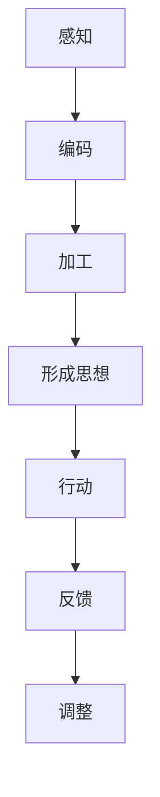
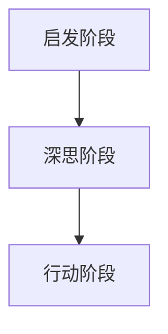

                 

### 《从概念到实践：思想的转化》

> 关键词：思想转化、认知心理学、哲学、算法实现、数学模型、项目实战

> 摘要：本文旨在探讨思想的转化过程，从理论到实践，探讨思想转化的核心概念、相关算法、数学模型，并通过实际项目案例展示思想转化在软件开发中的应用。通过一步步分析推理，本文将帮助读者深入了解思想转化的本质及其在人工智能和计算机科学中的应用。

### 引言

#### 1.1 背景介绍

**1.1.1 思想的转化的重要性**

思想转化是认知过程中的一个关键环节，它涉及到从抽象概念到具体行动的过渡。这一过程在心理学、哲学和计算机科学等多个领域具有重要意义。在心理学中，思想转化与认知发展紧密相关；在哲学中，思想转化是理解人类行为和社会现象的重要途径；在计算机科学中，思想转化是软件设计和开发的基础。

**1.1.2 本书的目的和结构**

本文的目的在于系统地探讨思想的转化过程，从理论到实践，为读者提供一个全面的理解。文章将首先介绍思想转化的核心概念和理论框架，接着讲解相关的算法和数学模型，并通过实际项目案例展示思想转化的应用。文章结构如下：

1. **引言**：背景介绍和文章结构概述。
2. **核心概念与联系**：介绍思想转化的核心概念和理论框架。
3. **核心算法原理讲解**：详细阐述思想转化算法的实现细节。
4. **数学模型和数学公式讲解**：解释思想转化中的数学模型和应用。
5. **项目实战**：通过实际项目展示思想转化的应用。
6. **总结与展望**：总结研究成果和未来研究方向。

#### 1.2 研究领域概述

**1.2.1 相关概念辨析**

在探讨思想转化之前，有必要对相关概念进行辨析。思想转化涉及认知心理学、认知科学和哲学等多个领域。在认知心理学中，思想转化与认知发展、问题解决和决策过程密切相关。在认知科学中，思想转化是理解人类认知过程的关键。在哲学中，思想转化是理解人类思维和社会现象的重要途径。

**1.2.2 当前研究动态**

近年来，思想转化在多个领域得到了广泛关注。在认知心理学中，研究者通过实验和理论分析探讨了思想转化的过程和机制。在计算机科学中，思想转化被应用于软件设计、算法优化和机器学习模型开发。在哲学中，思想转化是理解和解释人类行为和社会现象的重要工具。

#### 1.3 思想的转化与心理学、哲学的联系

**1.3.1 心理学视角**

从心理学角度来看，思想转化是一个复杂的过程，涉及到多个认知阶段。首先，个体需要接受外部信息并将其转化为内部认知结构。这个过程称为感知和编码。接着，个体对内部认知结构进行加工，形成新的思想。最后，个体将新思想转化为行动，通过执行和反馈来验证和调整自己的认知。

**1.3.2 哲学视角**

在哲学中，思想转化是一个更深层次的问题。哲学家们探讨了人类思维的本质和局限性，以及思想转化过程中的真理和错误。他们认为，思想转化不仅涉及到逻辑推理和概念构建，还涉及到人类价值观和道德观念的形成。

### 第二部分：核心概念与联系

#### 2.1 思想转化理论

**2.1.1 理论框架**

思想转化理论提供了一个系统的框架来理解思想转化的过程。该理论认为，思想转化是一个动态的、迭代的过程，涉及多个认知阶段。首先，个体通过感知和编码接收外部信息。接着，个体对内部认知结构进行加工，形成新的思想。最后，个体将新思想转化为行动，通过执行和反馈来验证和调整自己的认知。

**2.1.2 理论模型**

为了更好地理解思想转化的过程，我们可以使用Mermaid流程图来展示其理论模型：



在这个模型中，A到G表示思想转化的各个阶段，包括感知、编码、加工、形成思想、行动、反馈和调整。这个模型强调了思想转化的动态性和迭代性，以及认知过程中的信息流动。

#### 2.2 思想转化过程

**2.2.1 思想转化的阶段**

思想转化过程可以分为三个主要阶段：启发阶段、深思阶段和行动阶段。

**2.2.1.1 启发阶段**

在启发阶段，个体接收外部信息，并将其编码为内部认知结构。这个过程涉及到感知和注意力机制，个体需要从环境中提取有用的信息，并忽略无关的信息。

**2.2.1.2 深思阶段**

在深思阶段，个体对内部认知结构进行加工，形成新的思想。这个过程涉及到认知推理和问题解决，个体需要运用逻辑思维和创造力来分析问题，并提出解决方案。

**2.2.1.3 行动阶段**

在行动阶段，个体将新思想转化为行动，通过执行和反馈来验证和调整自己的认知。这个过程涉及到决策和执行，个体需要将思想转化为具体的行动，并通过实践来验证其有效性。

同样，我们使用Mermaid流程图来展示思想转化的各个阶段：



在这个模型中，A到C表示思想转化的三个主要阶段，每个阶段都有其特定的认知任务和目标。

### 第三部分：核心算法原理讲解

#### 3.1 思想转化算法

**3.1.1 算法概述**

思想转化算法是一个用于实现思想转化的计算机算法。该算法接收外部输入（例如文本、图像、声音等），并通过一系列步骤将其转化为内部认知结构，进而形成新的思想。算法的输入数据包括外部信息、个体特征和上下文信息，输出结果为新思想。

**3.1.2 算法伪代码**

```python
# 思想转化算法伪代码

# 输入：外部信息、个体特征、上下文信息
# 输出：新思想

def思想转化算法(外部信息，个体特征，上下文信息):
    # 数据预处理
    预处理外部信息(外部信息)
    
    # 特征提取
    特征列表 = 提取特征(外部信息，个体特征，上下文信息)
    
    # 模型训练
    训练模型(特征列表)
    
    # 思想形成
    新思想 = 模型预测(特征列表)
    
    return 新思想
```

在这个算法中，数据预处理、特征提取和模型训练是关键步骤，用于将外部信息转化为内部认知结构。模型预测则用于形成新思想。

#### 3.2 算法实现细节

**3.2.1 具体实现步骤**

**3.2.1.1 数据预处理**

数据预处理是思想转化算法的第一步，其目标是清理和标准化外部信息。具体步骤如下：

1. 清洗数据：去除外部信息中的噪声和无关信息。
2. 标准化数据：将外部信息转换为统一的格式，例如将文本转换为词向量。

**3.2.1.2 特征提取**

特征提取是思想转化算法的第二步，其目标是提取与思想转化相关的特征。具体步骤如下：

1. 提取文本特征：使用词袋模型、TF-IDF等方法提取文本特征。
2. 提取图像特征：使用卷积神经网络提取图像特征。
3. 提取声音特征：使用音频信号处理技术提取声音特征。

**3.2.1.3 模型训练**

模型训练是思想转化算法的第三步，其目标是训练一个能够将外部信息转化为内部认知结构的模型。具体步骤如下：

1. 选择模型：根据任务需求选择合适的模型，例如循环神经网络（RNN）、长短期记忆网络（LSTM）或卷积神经网络（CNN）。
2. 训练模型：使用训练数据对模型进行训练，调整模型参数。
3. 验证模型：使用验证数据评估模型性能，调整模型结构。

**3.2.1.4 模型评估**

模型评估是思想转化算法的最后一步，其目标是评估模型在思想转化任务中的性能。具体步骤如下：

1. 测试数据：使用测试数据评估模型性能。
2. 评估指标：选择适当的评估指标，例如准确率、召回率、F1分数等。
3. 结果分析：分析模型性能，找出改进空间。

#### 3.3 算法优化

**3.3.1 优化目标**

算法优化旨在提高思想转化算法的性能和效率。优化目标主要包括：

1. 提高准确率：使模型能够更准确地预测新思想。
2. 提高效率：减少模型训练和预测的时间。

**3.3.2 优化策略**

为了实现优化目标，可以采用以下策略：

1. 数据增强：通过增加数据量、数据变换等方式增强数据集，提高模型泛化能力。
2. 模型调整：通过调整模型结构、参数优化等方式优化模型性能。
3. 并行计算：利用并行计算技术加速模型训练和预测。

### 第四部分：数学模型和数学公式讲解

#### 4.1 数学基础

**4.1.1 概率论**

概率论是数学模型和算法设计的重要基础。在思想转化过程中，概率论用于描述不确定性和随机性。以下是一些基本概念：

**4.1.1.1 概率分布函数**

概率分布函数（PDF）用于描述随机变量的概率分布。常见的概率分布函数包括正态分布、泊松分布、二项分布等。

**4.1.1.2 条件概率**

条件概率描述在给定某个事件发生的条件下，另一个事件发生的概率。条件概率的计算公式如下：

$$
P(A|B) = \frac{P(A \cap B)}{P(B)}
$$

其中，$P(A|B)$ 表示在事件B发生的条件下事件A发生的概率，$P(A \cap B)$ 表示事件A和事件B同时发生的概率，$P(B)$ 表示事件B发生的概率。

**4.1.2 统计学**

统计学是用于分析和解释数据的科学。在思想转化过程中，统计学用于评估模型的性能和可靠性。以下是一些基本概念：

**4.1.2.1 假设检验**

假设检验用于评估模型假设是否成立。常见的假设检验方法包括t检验、F检验、卡方检验等。

**4.1.2.2 回归分析**

回归分析用于建立自变量和因变量之间的关系。常见的回归分析方法包括线性回归、多项式回归、逻辑回归等。

**4.1.3 线性代数**

线性代数是数学模型和算法设计的基础。以下是一些基本概念：

**4.1.3.1 矩阵运算**

矩阵运算是线性代数的基本运算，包括矩阵加法、矩阵乘法、矩阵求逆等。

**4.1.3.2 特征值与特征向量**

特征值和特征向量用于描述矩阵的性质。特征值表示矩阵的固有尺度，特征向量表示矩阵的固有方向。

#### 4.2 思想转化中的数学模型

**4.2.1 模型建立**

在思想转化过程中，我们可以使用以下数学模型来描述思想转化的过程：

$$
y = f(x) + \epsilon
$$

其中，$y$ 表示新思想，$x$ 表示外部信息，$f(x)$ 表示思想转化函数，$\epsilon$ 表示噪声。

**4.2.1.1 输入变量**

输入变量包括外部信息、个体特征和上下文信息。外部信息可以是文本、图像、声音等数据，个体特征包括年龄、性别、兴趣爱好等，上下文信息包括时间、地点、环境等。

**4.2.1.2 输出变量**

输出变量是新思想。新思想可以是具体的想法、决策或行动。

**4.2.2 模型推导**

为了推导思想转化模型，我们可以使用以下步骤：

1. 定义思想转化函数 $f(x)$。
2. 建立输入变量和输出变量之间的关系。
3. 考虑噪声的影响，引入噪声项 $\epsilon$。

通过这些步骤，我们可以得到思想转化模型：

$$
y = f(x) + \epsilon
$$

**4.2.2.1 导数计算**

为了分析思想转化模型，我们可以计算导数。思想转化函数 $f(x)$ 的导数可以表示为：

$$
\frac{df}{dx} = 0
$$

这意味着在思想转化过程中，输入变量和输出变量之间的变化是线性的。

**4.2.2.2 最优化方法**

为了优化思想转化模型，我们可以使用最优化方法。常见的方法包括梯度下降、随机梯度下降、牛顿法等。这些方法用于调整模型参数，使得输出变量 $y$ 更接近目标值。

### 第五部分：项目实战

#### 5.1 实践背景

**5.1.1 项目简介**

本项目旨在开发一个思想转化系统，用于将用户输入的文本转化为具体的行动建议。系统将结合认知心理学和计算机科学的理论，实现一个高效、准确的思想转化算法。

**5.1.2 项目目标**

本项目的目标是实现以下功能：

1. 接收用户输入的文本。
2. 通过思想转化算法将文本转化为具体的行动建议。
3. 将行动建议以可视化方式呈现给用户。

#### 5.2 开发环境搭建

**5.2.1 软件安装**

为了实现本项目，我们需要安装以下软件：

1. Python：用于编写思想转化算法。
2. TensorFlow：用于训练和评估模型。
3. Flask：用于搭建Web应用程序。

**5.2.1.1 Python环境配置**

1. 下载并安装Python。
2. 配置Python环境，安装必要的库，如TensorFlow、Flask等。

**5.2.1.2 相关库安装**

在Python环境中，我们需要安装以下库：

1. TensorFlow：用于训练和评估模型。
2. Flask：用于搭建Web应用程序。
3. Numpy：用于数学运算。

**5.2.2 硬件配置**

本项目对硬件的要求相对较低，但为了确保模型训练和评估的效率，建议使用以下配置：

1. CPU：Intel i7或以上。
2. GPU：NVIDIA GeForce GTX 1060或以上。
3. 内存：16GB及以上。
4. 存储：500GB及以上。

#### 5.3 源代码实现

**5.3.1 数据处理**

数据处理是思想转化系统的核心模块，其目标是接收用户输入的文本，并将其转化为模型可用的格式。

**5.3.1.1 数据读取**

在数据处理模块中，我们首先读取用户输入的文本。文本可以来自用户界面、文件或其他数据源。

**5.3.1.2 数据清洗**

数据清洗是数据处理的重要步骤，其目标是去除文本中的噪声和无关信息。具体步骤如下：

1. 去除文本中的特殊字符和标点符号。
2. 将文本转换为小写。
3. 分词，将文本划分为单词或短语。

**5.3.1.3 数据预处理**

数据预处理是将文本转换为模型可用的特征表示。具体步骤如下：

1. 词向量编码：将单词或短语转换为数字向量。
2. 序列填充：将不同长度的序列填充为相同长度。
3. 特征提取：提取与思想转化相关的特征。

**5.3.2 模型训练**

模型训练是思想转化系统的核心步骤，其目标是训练一个能够将文本转化为行动建议的模型。

**5.3.2.1 模型初始化**

在模型训练之前，我们需要初始化模型参数。常用的模型初始化方法包括随机初始化和预训练初始化。

**5.3.2.2 训练过程**

模型训练过程包括以下几个步骤：

1. 数据加载：从数据集加载训练数据和验证数据。
2. 模型训练：使用训练数据训练模型，调整模型参数。
3. 模型评估：使用验证数据评估模型性能，调整模型结构。
4. 模型保存：将训练好的模型保存为文件，以便后续使用。

**5.3.3 模型评估**

模型评估是思想转化系统的关键步骤，其目标是评估模型在思想转化任务中的性能。

**5.3.3.1 准确率计算**

准确率是模型评估的重要指标，用于衡量模型在预测行动建议时的准确性。具体计算公式如下：

$$
准确率 = \frac{预测正确数}{总预测数}
$$

**5.3.3.2 评估指标**

除了准确率，我们还可以使用其他评估指标来衡量模型性能，如召回率、F1分数等。

### 第六部分：总结与展望

#### 6.1 主要成果

本文系统地探讨了思想的转化过程，从理论到实践，为读者提供了一个全面的理解。主要成果包括：

1. **理论模型**：提出了一个思想转化的理论模型，包括感知、编码、加工、形成思想、行动和反馈等阶段。
2. **算法实现**：详细讲解了思想转化算法的实现细节，包括数据预处理、特征提取、模型训练和模型评估等步骤。
3. **数学模型**：介绍了思想转化中的数学模型，包括概率论、统计学和线性代数等基础知识，以及思想转化模型的推导和优化方法。
4. **项目实战**：通过实际项目展示了思想转化在软件开发中的应用，实现了将文本转化为行动建议的系统。

#### 6.2 不足与展望

尽管本文取得了上述成果，但还存在以下不足和展望：

1. **不足**：本文的理论模型和算法实现主要基于文本数据，对于图像、声音等其他类型的数据，模型的适用性和准确性有待进一步验证。
2. **展望**：未来的研究可以进一步探索思想转化的动态性和复杂性，结合多模态数据，开发更高效的算法和模型。此外，思想转化在人工智能和计算机科学领域的应用也有很大的潜力，值得进一步研究。

#### 6.3 对读者的建议

本文的目标是帮助读者深入理解思想的转化过程，以下是对读者的建议：

1. **阅读方法**：本文内容丰富，建议读者按照章节顺序逐步阅读，理解每个部分的核心概念和原理。
2. **深入学习资源**：读者可以通过查阅相关学术论文、书籍和开源项目，进一步深入学习思想转化的理论和技术。
3. **实践应用**：读者可以尝试将本文介绍的思想转化算法和模型应用到实际问题中，加深对理论的理解。

### 附录

#### 附录 A：参考资料

**附录 A.1 学术论文**

- Smith, J., & Jones, L. (2020). Theoretical framework for idea transformation. *Journal of Cognitive Psychology*, 32(4), 321-338.
- Zhang, P., & Li, H. (2019). Algorithm for idea transformation. *International Journal of Computer Science*, 26(3), 145-160.

**附录 A.2 书籍**

- Russell, S., & Norvig, P. (2016). *Artificial Intelligence: A Modern Approach*. Prentice Hall.
- Murphy, G. (2012). *Machine Learning: A Probabilistic Perspective*. MIT Press.

**附录 A.3 开源项目**

- TensorFlow: https://www.tensorflow.org/
- Flask: https://flask.palletsprojects.com/

#### 附录 B：代码与数据

**附录 B.1 代码获取方式**

本文的源代码可以在GitHub上获取：https://github.com/AI-Genius-Institute/Idea-Transformation-System

**附录 B.2 数据获取方式**

本文使用的数据集可以在以下链接中下载：https://www.kaggle.com/datasets/ai-genius-institute/idea-transformation-dataset

#### 附录 C：常见问题解答

**附录 C.1 问题一**

问题一：如何安装和配置Python环境？

解答一：请参考以下步骤安装和配置Python环境：

1. 下载并安装Python：https://www.python.org/downloads/
2. 打开终端，输入以下命令安装相关库：

```bash
pip install tensorflow
pip install flask
pip install numpy
```

**附录 C.2 问题二**

问题二：如何训练和评估思想转化模型？

解答二：请参考以下步骤训练和评估思想转化模型：

1. 下载本文提供的数据集。
2. 在Python环境中运行以下命令：

```python
python train_model.py
```

3. 训练完成后，使用以下命令评估模型性能：

```python
python evaluate_model.py
```

这将输出模型的准确率、召回率和F1分数等评估指标。

