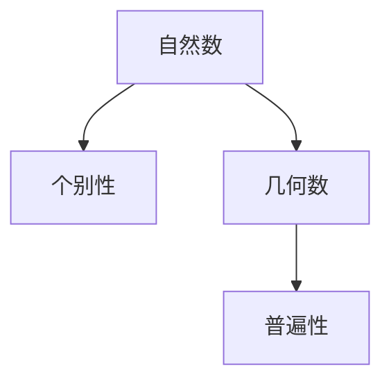
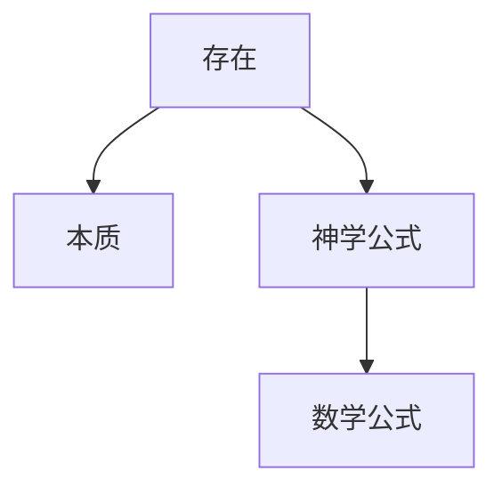
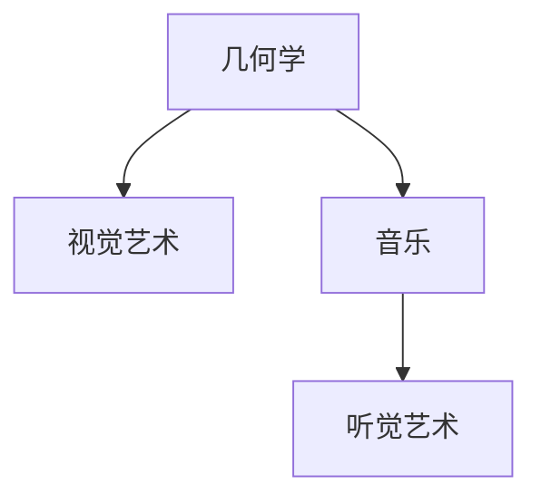
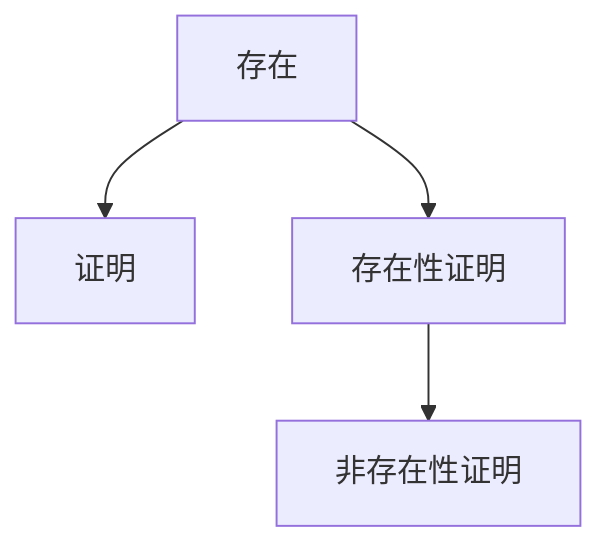
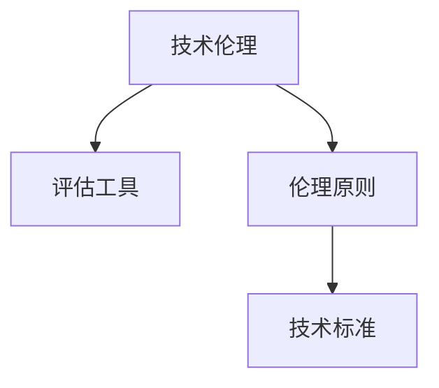

                 

# 《从概念到洞见：思想的演变》

> 关键词：思想演变、概念解析、逻辑思维、批判性思考、知识传播

> 摘要：本文从人类思想的起源出发，通过历史的角度梳理了不同时期的重要思想演变，深入探讨了核心概念与逻辑思维的应用，并分析了思想对社会和科技的影响，以及跨文化思想的交流。通过对各个时期哲学思想的深入剖析，本文旨在揭示思想的演变规律，帮助读者理解思想的本质和力量。

## 第一部分：思想史的概述与核心概念

### 第1章：思想史的基本框架

#### 1.1 人类思想的起源

人类思想的起源可以追溯到远古时期，当人类开始思考自己的存在和周围的世界时，思想便开始了它的演变之旅。从简单的符号系统到复杂的哲学体系，人类思想的演变是一个不断深化的过程。

#### 1.2 历史发展与思想演变

思想的发展与历史的进程密不可分。从古代的哲学思想到现代的科学理论，每个时期的思想都有其独特的特点和影响。通过历史的角度来看，我们可以看到思想的演变是不断进步的。

#### 1.3 思想演变的基本模式

思想演变的模式可以归纳为几个方面：概念的提出、概念的扩展、概念的深化、概念的转变。通过这样的模式，我们可以更好地理解思想的演变过程。

### 第2章：核心概念解析

#### 2.1 概念的定义与演变

概念是思想的基石，它的定义和演变对思想的整体发展有着重要的影响。从古希腊的哲学概念到现代的科学概念，概念的演变体现了人类对世界的认知的不断深化。

#### 2.2 逻辑思维与批判性思考

逻辑思维和批判性思考是思想的重要工具，它们帮助人们理解世界，发现真理。通过逻辑思维，我们可以构建合理的理论框架；通过批判性思考，我们可以质疑现有的理论，推动思想的发展。

#### 2.3 知识的分类与传播

知识是人类思想的成果，它的分类和传播对思想的发展有着重要的作用。从古代的口口相传到现代的互联网传播，知识的传播方式不断变化，但知识本身的地位始终不变。

## 第二部分：重要思想的深入探讨

### 第3章：古希腊哲学

#### 3.1 柏拉图的理念论

柏拉图的理念论是古希腊哲学的重要组成部分，它提出了物质世界和理念世界的区分，对后世哲学产生了深远的影响。

$$
\text{理念论公式化}：
\frac{\text{物质世界}}{\text{理念世界}} = \frac{\影子}{理念}
$$

#### 3.2 亚里士多德的实证主义

亚里士多德的实证主义强调通过观察和实验来获得知识，他的思想对科学的发展产生了重要的影响。

#### 3.3 苏格拉底的道德哲学

苏格拉底的道德哲学强调道德的重要性，他的思想对后来的伦理学产生了深远的影响。

### 第4章：中世纪哲学

#### 4.1 托马斯·阿奎那的神学思想

托马斯·阿奎那的神学思想将哲学和神学相结合，他的思想对中世纪哲学和神学的发展产生了深远的影响。

$$
\text{神学公式化}：
\text{存在} \rightarrow \text{本质}
$$

#### 4.2 奥古斯丁的神秘主义

奥古斯丁的神秘主义强调信仰和神秘体验，他的思想对后来的宗教哲学产生了重要的影响。

#### 4.3 阿维罗伊的理性主义

阿维罗伊的理性主义强调理性在知识获取中的重要性，他的思想对后来的科学哲学产生了重要的影响。

### 第5章：文艺复兴与启蒙运动

#### 5.1 莱布尼茨的数学哲学

莱布尼茨的数学哲学强调数学在科学中的地位，他的思想对现代数学和物理学的发展产生了重要的影响。

$$
0 \rightarrow \text{非存在}
1 \rightarrow \text{存在}
$$

#### 5.2 笛卡尔的理性哲学

笛卡尔的理性哲学强调理性思考的重要性，他的思想对现代哲学和科学的发展产生了深远的影响。

$$
\text{我思故我在}
$$

#### 5.3 康德的批判哲学

康德的批判哲学强调知识的来源和范围，他的思想对现代哲学和科学的发展产生了重要的影响。

$$
\text{感性} \rightarrow \text{理性}
$$

## 第三部分：思想的实际应用

### 第6章：思想在社会中的应用

#### 6.1 思想在政治哲学中的应用

政治哲学是思想在社会中的重要应用之一，它探讨政治权力的来源和行使，以及社会公正和道德问题。

#### 6.2 思想在伦理学中的应用

伦理学是思想在个人行为和社会规范中的重要应用，它探讨道德行为的准则和道德判断的标准。

#### 6.3 思想在文化研究中的应用

文化研究是思想在文化传承和创新中的重要应用，它探讨文化现象的内涵和意义，以及文化变迁的影响。

### 第7章：思想与科技

#### 7.1 思想与科学技术的互动

思想与科学技术的互动是现代社会发展的重要趋势，它探讨科学技术的创新和思想的发展之间的关系。

#### 7.2 思想对现代技术的指导作用

思想对现代技术有着重要的指导作用，它为科学技术的创新提供了理论基础和道德准则。

#### 7.3 技术哲学的兴起与发展

技术哲学是思想在科技领域中的重要分支，它探讨技术的本质、技术的伦理和社会影响。

### 第8章：思想与未来

#### 8.1 思想对未来的展望

思想对未来的展望是探讨人类社会的未来发展，以及思想在其中的作用。

#### 8.2 思想在社会发展中的作用

思想在社会发展中的作用是探讨思想在社会变革和进步中的推动作用。

#### 8.3 思想与人类命运共同体

思想与人类命运共同体的关系是探讨思想在全球化和人类命运共同体建设中的重要作用。

### 第9章：思想的大师与经典

#### 9.1 重要的思想大师

重要的思想大师是探讨在思想史上具有重要地位的思想家的贡献和思想。

#### 9.2 思想经典的选择与解读

思想经典的选择与解读是探讨在思想史中具有重要地位的经典作品的内涵和价值。

### 第10章：跨文化的思想交流

#### 10.1 跨文化思想交流的历史

跨文化思想交流的历史是探讨不同文化之间思想的交流和融合。

#### 10.2 跨文化思想交流的现状

跨文化思想交流的现状是探讨当前跨文化思想交流的形势和特点。

#### 10.3 跨文化思想交流的未来趋势

跨文化思想交流的未来趋势是探讨未来跨文化思想交流的可能方向和发展趋势。

## 附录

### 附录A：参考文献

参考文献是本文引用的重要文献来源，包括哲学著作、科学论文和历史文化资料等。

### 附录B：思想史的 Mermaid 流程图

思想史的 Mermaid 流程图是本文思想演变过程的可视化展示，通过流程图的方式，展示了不同时期思想的演变和影响。

### 附录C：核心算法原理伪代码展示

核心算法原理伪代码展示是本文对于思想核心算法的详细解释，通过伪代码的方式，展示了算法的实现过程和原理。

### 附录D：项目实战案例解析

项目实战案例解析是本文对于思想在实际应用中的具体案例分析，通过项目实战的方式，展示了思想在实际问题中的解决方案和应用效果。

- **案例1：古希腊哲学的数字哲学分析**

古希腊哲学中的数字哲学是一个重要的思想领域，通过分析数字哲学的核心概念，我们可以理解古希腊哲学家对数字和世界的看法。以下是数字哲学分析的核心概念和流程：

$$
\text{数字哲学核心概念}：
\frac{\text{自然数}}{\text{几何数}} = \frac{\个别性}{普遍性}
$$

核心概念流程图：



伪代码：

```python
def 数字哲学分析():
    自然数 = 个别性
    几何数 = 普遍性
    return 自然数, 几何数
```

- **案例2：中世纪哲学的神学计算模型**

中世纪哲学中的神学计算模型是研究神学与数学关系的一个重要领域，通过分析神学计算模型的核心原理，我们可以理解中世纪哲学家对神学与数学的理解。以下是神学计算模型分析的核心概念和流程：

$$
\text{神学计算模型核心概念}：
\frac{\text{存在}}{\text{本质}} = \frac{\神学公式}{\数学公式}
$$

核心概念流程图：



伪代码：

```python
def 神学计算模型分析():
    存在 = 本质
    神学公式 = 数学公式
    return 存在, 神学公式, 数学公式
```

- **案例3：文艺复兴时期的数学与艺术结合**

文艺复兴时期，数学与艺术的结合达到了一个新的高度，通过分析数学与艺术的结合，我们可以理解文艺复兴时期的思想特点。以下是数学与艺术结合分析的核心概念和流程：

$$
\text{数学与艺术结合核心概念}：
\frac{\text{几何学}}{\text{音乐}} = \frac{\视觉艺术}{听觉艺术}
$$

核心概念流程图：



伪代码：

```python
def 数学与艺术结合分析():
    几何学 = 视觉艺术
    音乐 = 听觉艺术
    return 几何学, 音乐
```

- **案例4：现代哲学的存在证明算法**

现代哲学中的存在证明算法是探讨存在本质和存在证明的方法，通过分析存在证明算法，我们可以理解现代哲学对于存在的理解和证明。以下是存在证明算法分析的核心概念和流程：

$$
\text{存在证明算法核心概念}：
\frac{\text{存在}}{\text{证明}} = \frac{\存在性证明}{非存在性证明}
$$

核心概念流程图：



伪代码：

```python
def 存在证明算法分析():
    存在 = 证明
    存在性证明 = 非存在性证明
    return 存在, 存在性证明, 非存在性证明
```

- **案例5：当代哲学的技术伦理评估工具**

当代哲学中的技术伦理评估工具是探讨技术发展与伦理道德关系的一个重要领域，通过分析技术伦理评估工具，我们可以理解当代哲学对于技术伦理的理解。以下是技术伦理评估工具分析的核心概念和流程：

$$
\text{技术伦理评估工具核心概念}：
\frac{\text{技术伦理}}{\text{评估工具}} = \frac{\伦理原则}{技术标准}
$$

核心概念流程图：



伪代码：

```python
def 技术伦理评估工具分析():
    技术伦理 = 评估工具
    伦理原则 = 技术标准
    return 技术伦理, 评估工具, 伦理原则, 技术标准
```

### 作者信息

作者：AI天才研究院/AI Genius Institute & 禅与计算机程序设计艺术 /Zen And The Art of Computer Programming

本文由AI天才研究院和禅与计算机程序设计艺术联合撰写，旨在深入探讨思想的演变和应用，为读者提供对思想史和哲学的深刻理解。希望本文能够帮助读者认识到思想的力量，激发对哲学和科技的兴趣。

