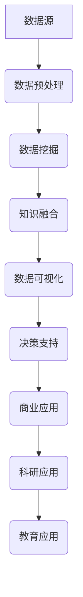
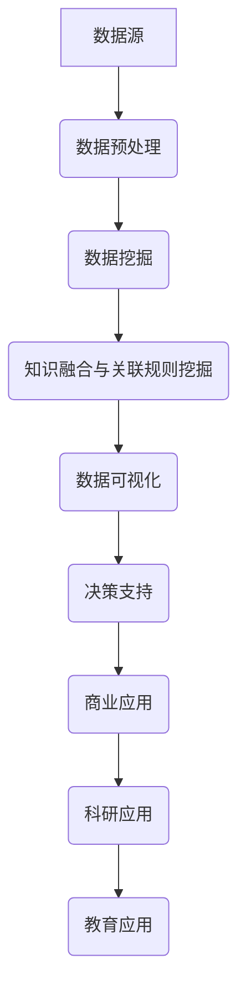

                 

# 文章标题：从海量信息中提炼知识：知识发现引擎的作用

> 关键词：知识发现引擎、数据挖掘、知识融合、数据预处理、应用领域

> 摘要：本文深入探讨了知识发现引擎在从海量信息中提炼知识方面的作用。首先，介绍了知识发现引擎的定义和作用，随后详细分析了其核心技术，包括数据预处理技术、数据挖掘算法、数据可视化技术以及知识融合与关联规则挖掘。接着，文章讨论了知识发现引擎在商业、科研和教育等领域的具体应用，并提出了开发与优化知识发现引擎的流程和策略。最后，本文展望了知识发现引擎的挑战与未来发展，并提供了相关的开源工具与资源。

## 第一部分：引言

在信息化时代，数据已经成为企业、科研机构以及教育机构等组织的重要资产。然而，随着数据量的爆炸式增长，如何从海量数据中提取有价值的信息和知识，成为了一个亟待解决的问题。知识发现引擎正是为了解决这一问题而诞生的。

### 1.1 知识发现引擎的定义和作用

知识发现引擎（Knowledge Discovery Engine，简称KDE）是一种能够从大规模数据集中自动发现有用知识和模式的智能系统。它通过数据挖掘、机器学习和人工智能等技术，从原始数据中提取潜在的知识，帮助用户更好地理解数据，发现数据中的规律和趋势。

知识发现引擎的主要作用包括：

- 提取数据中的有用信息：通过对数据进行清洗、转换和集成，从原始数据中提取有价值的信息。
- 发现数据中的潜在模式：通过数据挖掘算法，发现数据中的关联关系、聚类结构和分类规则等。
- 支持决策制定：通过提供数据分析和可视化结果，帮助用户做出更加明智的决策。

### 1.2 知识发现引擎的类型和架构

根据应用场景和目标，知识发现引擎可以分为以下几种类型：

- 商业智能型：主要用于企业内部的业务数据分析，如销售分析、客户行为分析等。
- 科研型：主要用于科学研究的数据挖掘和知识发现，如文献挖掘、科研趋势分析等。
- 教育型：主要用于教育领域的个性化学习分析和教育资源挖掘，如学习路径推荐、课程优化等。

知识发现引擎的架构通常包括以下几个部分：

- 数据源：包括内部数据和外部数据，如数据库、文件系统、互联网等。
- 数据预处理模块：负责数据清洗、转换和集成，将原始数据转换为适合数据挖掘的形式。
- 数据挖掘模块：采用各种数据挖掘算法，从预处理后的数据中提取潜在的知识。
- 知识融合与可视化模块：将挖掘出的知识进行整合和可视化，以便用户理解和应用。
- 应用接口：提供用户与知识发现引擎的交互接口，如命令行、图形界面等。

### 1.3 知识发现引擎的历史和发展趋势

知识发现引擎的概念最早可以追溯到20世纪80年代，当时人们开始意识到从大量数据中提取有用信息的重要性。随着计算机技术的飞速发展，数据挖掘和机器学习技术的逐渐成熟，知识发现引擎的研究和应用得到了迅速推广。

近年来，随着大数据、云计算和物联网等技术的发展，知识发现引擎的应用场景和功能也在不断扩展。未来，知识发现引擎将朝着以下方向发展：

- 更强的自学习能力和自适应能力：通过深度学习和强化学习等技术，知识发现引擎将能够更好地适应不同的应用场景和数据特点。
- 更好的可解释性和透明性：用户需要能够理解知识发现引擎的工作原理和结果，以便更好地应用和信任这些技术。
- 更广泛的跨领域应用：知识发现引擎将在医疗保健、金融分析、物联网、环境监测等领域发挥越来越重要的作用。

## 第二部分：知识发现引擎的核心技术

知识发现引擎的核心技术包括数据预处理技术、数据挖掘算法、数据可视化技术以及知识融合与关联规则挖掘。本部分将逐一介绍这些核心技术，并探讨它们在知识发现过程中的作用。

### 2.1 数据预处理技术

数据预处理是知识发现过程中的重要环节，它关系到数据挖掘算法的性能和结果。数据预处理技术主要包括以下几种：

- 数据清洗：去除数据中的噪声、错误和重复值，确保数据的准确性和一致性。
- 数据转换：将不同格式的数据转换为统一格式，以便进行后续处理。
- 数据集成：将来自不同数据源的数据进行合并，形成一个统一的数据集。
- 数据归一化：将不同量纲的数据转换为同一量纲，以便进行数值计算和分析。

#### 数据清洗

数据清洗是数据预处理的第一步，其主要任务是去除数据中的噪声和错误。以下是一个简单的数据清洗流程：

1. 检查数据完整性：确保数据中没有缺失值或异常值。
2. 去除重复记录：识别并删除重复的数据记录。
3. 处理异常值：对异常值进行识别和处理，如替换、删除或插值。
4. 修正错误：修正数据中的错误，如拼写错误、数据格式错误等。

#### 数据转换

数据转换是将不同格式的数据转换为统一格式的过程。常见的转换方法包括：

- 字符串到数值的转换：将字符串表示的数值转换为数值类型。
- 日期时间的转换：将日期时间字符串转换为日期时间类型。
- 分类变量的编码：将分类变量转换为数值型变量，如独热编码、标签编码等。

#### 数据集成

数据集成是将来自不同数据源的数据进行合并，形成一个统一的数据集。以下是一个简单的数据集成流程：

1. 数据源选择：选择合适的数据源，如数据库、文件系统、API等。
2. 数据采集：从数据源中采集数据，并将其存储到统一的数据集中。
3. 数据对齐：对齐不同数据源的数据，确保数据格式、结构的一致性。
4. 数据合并：将不同数据源的数据进行合并，形成一个完整的数据集。

#### 数据归一化

数据归一化是将不同量纲的数据转换为同一量纲的过程。常见的归一化方法包括：

- 最小-最大归一化：将数据缩放到[0,1]范围内。
- Z-Score归一化：将数据缩放到均值为0，标准差为1的范围内。
- 动态范围缩放：根据最小值和最大值缩放数据。

### 2.2 数据挖掘算法

数据挖掘算法是知识发现引擎的核心，它负责从预处理后的数据中提取潜在的知识。数据挖掘算法可以分为以下几类：

- 聚类算法：将数据划分为不同的群组，使同一群组内的数据相似度较高，不同群组之间的相似度较低。
- 分类算法：将数据划分为不同的类别，每个类别代表一个特定的概念或模式。
- 关联规则挖掘：发现数据中不同项之间的关联关系，如购买商品之间的关联。
- 预测算法：根据历史数据预测未来数据或行为。

下面将详细介绍几种常见的数据挖掘算法。

#### K-均值聚类算法

K-均值聚类算法是一种基于距离度量的聚类算法，它通过最小化数据点到聚类中心的距离平方和来划分数据。以下是一个简单的K-均值聚类算法流程：

1. 初始化：随机选择K个数据点作为初始聚类中心。
2. 分配：将每个数据点分配到最近的聚类中心。
3. 更新：重新计算每个聚类中心的坐标。
4. 重复步骤2和3，直到聚类中心不再发生变化。

#### Apriori算法

Apriori算法是一种用于发现数据中频繁项集的算法，它基于支持度和置信度的概念。以下是一个简单的Apriori算法流程：

1. 计算支持度：计算每个项集在数据集中的出现频率。
2. 生成频繁项集：根据最小支持度阈值，生成频繁项集。
3. 生成关联规则：从频繁项集中生成关联规则，并计算置信度。
4. 选择最佳规则：根据最小置信度阈值，选择最佳关联规则。

#### 决策树算法

决策树算法是一种用于分类和回归的算法，它通过一系列的测试来将数据划分为不同的类别或数值。以下是一个简单的决策树算法流程：

1. 选择特征：选择具有最高信息增益或基尼指数的特征作为测试条件。
2. 分割数据：根据所选特征的值，将数据划分为不同的子集。
3. 递归构建：对每个子集重复步骤1和2，直到满足停止条件（如最大深度、最小样本量等）。

### 2.3 数据可视化技术

数据可视化是将数据以图形或图像的形式展示出来，以便用户直观地理解和分析数据。数据可视化技术是知识发现引擎的重要组成部分，它能够帮助用户更好地理解数据中的模式和趋势。以下是一些常见的数据可视化技术：

- 仪表板：将多个数据可视化图表集成在一个界面中，提供综合的数据分析视图。
- 饼图：用于表示各部分在整体中的比例关系。
- 柱状图：用于比较不同类别或组之间的数量或大小。
- 折线图：用于表示数据随时间的变化趋势。
- 散点图：用于表示两个变量之间的相关性。
- 热力图：用于表示数据中不同区域的热度和强度。

#### 仪表板

仪表板是一种常用的数据可视化技术，它将多个图表和指标集成在一个界面中，为用户提供全面的数据分析视图。以下是一个简单的仪表板构建流程：

1. 数据准备：准备用于可视化的数据，并进行清洗和转换。
2. 选择可视化类型：根据数据类型和分析目标，选择合适的可视化类型。
3. 设计可视化布局：设计仪表板的布局，确定各图表的位置、大小和样式。
4. 添加交互性：为仪表板添加交互性，如筛选器、过滤器和数据钻取功能。

### 2.4 知识融合与关联规则挖掘

知识融合是将来自不同数据源、不同类型的数据进行整合和关联的过程。关联规则挖掘是知识融合的一种重要技术，它能够发现数据中不同项之间的关联关系。以下是一个简单的知识融合与关联规则挖掘流程：

1. 数据集成：将来自不同数据源的数据进行集成，形成一个统一的数据集。
2. 数据预处理：对集成后的数据进行清洗、转换和归一化。
3. 生成频繁项集：使用Apriori算法或其他算法，生成数据中的频繁项集。
4. 生成关联规则：从频繁项集中生成关联规则，并计算置信度和支持度。
5. 知识可视化：将关联规则以图表或文字形式展示，帮助用户理解和应用。

### 2.5 核心概念与联系

在知识发现引擎中，核心概念包括数据源、数据预处理、数据挖掘、知识融合和数据可视化。这些概念之间相互关联，共同构成了一个完整的知识发现过程。以下是一个简单的Mermaid流程图，展示了这些概念之间的联系：



### 2.6 核心算法原理讲解

在本章节中，我们将详细讲解几种核心数据挖掘算法的原理，包括K-均值聚类算法、Apriori算法和决策树算法。以下是这些算法的伪代码和数学模型。

#### K-均值聚类算法

**伪代码：**

```python
kmeans(X, k):
    初始化：随机选择k个中心点C
    while 未收敛 do
        为每个数据点分配最近的中心点
        更新中心点坐标
    return 聚类结果
```

**数学模型：**

假设数据集X中有n个数据点，每个数据点有d个特征，聚类中心点C有k个，每个聚类中心点有d个特征。

- 初始中心点：$C^{(0)} = \{c_{1}^{(0)}, c_{2}^{(0)}, ..., c_{k}^{(0)}\}$
- 分配中心点：$C^{(t)} = \{c_{1}^{(t)}, c_{2}^{(t)}, ..., c_{k}^{(t)}\}$
- 数据点分配：$x_{i} \in C_{j}^{(t)}$，其中 $C_{j}^{(t)}$ 表示属于第j个聚类中心点的数据点集合

目标函数：

$$
\min \sum_{i=1}^{n} \sum_{j=1}^{k} ||x_{i} - c_{j}^{(t)}||^2
$$

#### Apriori算法

**伪代码：**

```python
apriori(X, min_support, min_confidence):
    计算支持度
    生成频繁项集
    生成关联规则
    返回规则结果
```

**数学模型：**

假设数据集X中有m个交易，每个交易包含n个商品。

- 支持度：$support(X, itemset)$ 表示包含项集itemset的交易在总交易中的比例。
- 置信度：$confidence(X, rule)$ 表示在包含前提项集的前提交易中，也包含结论项集的交易比例。

目标函数：

- 最小支持度：$min_support$
- 最小置信度：$min_confidence$

#### 决策树算法

**伪代码：**

```python
decision_tree(X, attributes):
    if all samples belong to the same class:
        return leaf node with majority class
    else:
        选择最佳特征：$feature = select_best_attribute(X, attributes)$
        分割数据：$X_{left} = \{x \in X | x.feature = feature_value\}$
                   $X_{right} = \{x \in X | x.feature \neq feature_value\}$
        构建子树：$tree = \{node, decision_tree(X_{left}, attributes - feature), decision_tree(X_{right}, attributes - feature)\}$
        return tree
```

**数学模型：**

- 信息增益：$gain(D, feature) = entropy(D) - \sum_{value \in feature} \frac{|D_{value}|}{|D|} \cdot entropy(D_{value})}$
- 基尼指数：$gini(D) = 1 - \sum_{value \in feature} \frac{|D_{value}|}{|D|} \cdot \frac{|D_{value} - 1|}{|D_{value}|}$

### 2.7 数学模型和数学公式

在数据预处理和数据挖掘过程中，常见的数学模型和数学公式如下：

#### 假设检验（Hypothesis Testing）

- 假设：$H_0: \mu = \mu_0$，$H_1: \mu \neq \mu_0$  
- 统计量：$z = \frac{\bar{x} - \mu_0}{\sigma / \sqrt{n}}$  
- p值：$p = P(Z > \frac{\bar{x} - \mu_0}{\sigma / \sqrt{n}})$

#### 假设检验（Hypothesis Testing）

- 假设：$H_0: \mu = \mu_0$，$H_1: \mu \neq \mu_0$  
- 统计量：$z = \frac{\bar{x} - \mu_0}{\sigma / \sqrt{n}}$  
- p值：$p = P(Z > \frac{\bar{x} - \mu_0}{\sigma / \sqrt{n}})$

#### 相关性分析（Correlation Analysis）

- 皮尔逊相关系数：$r = \frac{\sum_{i=1}^{n}(x_i - \bar{x})(y_i - \bar{y})}{\sqrt{\sum_{i=1}^{n}(x_i - \bar{x})^2} \cdot \sqrt{\sum_{i=1}^{n}(y_i - \bar{y})^2}}$  
- 斯皮尔曼等级相关系数：$r_s = \frac{12 \sum_{i=1}^{n}(x_i - \bar{x})(y_i - \bar{y})}{\sum_{i=1}^{n}(x_i - \bar{x})^2 + \sum_{i=1}^{n}(y_i - \bar{y})^2}$

#### 聚类分析（Cluster Analysis）

- 簇内距离平方和：$SSE = \sum_{i=1}^{k} \sum_{x \in C_i} ||x - c_i||^2$  
- 簇间距离平方和：$SSE = \sum_{i=1}^{k} \sum_{j=1, j \neq i}^{k} ||c_i - c_j||^2$  

### 2.8 项目实战

在本章节中，我们将通过一个实际的案例来展示知识发现引擎在商业领域中的应用。

#### 案例背景

某电商公司希望通过数据挖掘技术了解顾客的购买行为，从而优化营销策略和提升销售额。公司拥有大量的顾客购买数据，包括购买时间、购买商品、购买数量、顾客ID等信息。

#### 案例目标

1. 分析顾客购买行为，发现潜在的市场机会。
2. 优化营销策略，提高顾客满意度和转化率。
3. 提升销售额，实现业务增长。

#### 实现步骤

1. 数据收集与预处理

   - 收集顾客购买数据，包括购买时间、购买商品、购买数量、顾客ID等信息。
   - 对数据进行清洗、转换和集成，确保数据质量。

2. 数据挖掘与模型训练

   - 使用K-均值聚类算法对顾客进行聚类，分析不同顾客群体的购买行为。
   - 使用Apriori算法挖掘顾客购买商品之间的关联关系。
   - 使用决策树算法构建分类模型，预测顾客的购买行为。

3. 结果分析与可视化

   - 分析聚类结果，了解不同顾客群体的购买特征。
   - 分析关联规则，发现潜在的市场机会。
   - 构建可视化仪表板，展示分析结果。

4. 营销策略优化

   - 根据分析结果，制定针对性的营销策略，如优惠券发放、广告投放等。
   - 跟踪营销效果，调整策略，持续优化。

#### 实现代码

以下是一个简单的Python代码示例，用于实现上述案例中的数据预处理、数据挖掘和结果可视化。

```python
# 导入相关库
import pandas as pd
from sklearn.cluster import KMeans
from mlxtend.frequent_patterns import apriori, association_rules
from sklearn.tree import DecisionTreeClassifier
import matplotlib.pyplot as plt

# 数据收集与预处理
data = pd.read_csv('customer_data.csv')
data = data[['customer_id', 'product_id', 'purchase_time', 'quantity']]
data = data.groupby(['customer_id', 'product_id']).agg({'quantity': 'sum'}).reset_index()

# 数据挖掘与模型训练
# 聚类分析
kmeans = KMeans(n_clusters=5, random_state=42)
clusters = kmeans.fit_predict(data[['product_id']])
data['cluster'] = clusters

# 关联规则挖掘
frequent_itemsets = apriori(data[['product_id']], min_support=0.05, use_colnames=True)
rules = association_rules(frequent_itemsets, metric='confidence', min_threshold=0.5)

# 决策树分类
X = data[['cluster', 'quantity']]
y = data['product_id']
clf = DecisionTreeClassifier()
clf.fit(X, y)

# 结果分析与可视化
# 聚类结果可视化
plt.scatter(data['product_id'], data['quantity'], c=data['cluster'])
plt.xlabel('Product ID')
plt.ylabel('Quantity')
plt.title('Customer Clusters')
plt.show()

# 关联规则可视化
rules.head()

# 决策树可视化
from sklearn.tree import plot_tree
plot_tree(clf, feature_names=['Cluster', 'Quantity'], class_names=data['product_id'].unique())
plt.show()
```

#### 代码解读与分析

1. 数据收集与预处理

   - 使用pandas库读取顾客购买数据，并进行必要的清洗和转换。
   - 对数据进行分组聚合，计算每个顾客购买每种商品的总数量。

2. 数据挖掘与模型训练

   - 使用K-均值聚类算法对顾客进行聚类，将顾客划分为不同的群体。
   - 使用Apriori算法挖掘顾客购买商品之间的关联关系，生成关联规则。
   - 使用决策树算法构建分类模型，预测顾客的购买行为。

3. 结果分析与可视化

   - 使用matplotlib库绘制聚类结果可视化图表，展示不同顾客群体的购买特征。
   - 使用关联规则可视化库展示关联规则，帮助用户发现潜在的市场机会。
   - 使用决策树可视化库展示决策树模型，帮助用户理解模型的工作原理。

通过这个案例，我们可以看到知识发现引擎在商业领域中的应用潜力。通过数据挖掘和可视化技术，企业可以深入了解顾客行为，优化营销策略，提高业务绩效。

### 附录1：开源数据集与数据预处理工具

#### 1.1 开源数据集

- UCI Machine Learning Repository：提供了大量的公开数据集，涵盖多个领域和应用场景。
- Kaggle：一个数据科学竞赛平台，提供了丰富的竞赛数据集。

#### 1.2 数据预处理工具

- Pandas：Python库，用于数据处理和分析。
- Scikit-learn：Python库，提供了常用的数据预处理和机器学习算法。
- Weka：一个开源的数据挖掘工具，支持多种数据预处理和数据挖掘算法。

### 附录2：开源知识发现引擎框架与库

- MOA：一个开源的在线数据挖掘框架，适用于大规模实时数据挖掘。
- WEKA：一个开源的软件集合，提供了多种数据挖掘算法和可视化工具。
- ELKI：一个开源的数据挖掘框架，支持多种聚类、分类和关联规则挖掘算法。

### 附录3：参考文献与推荐阅读

- Han, J., Kamber, M., & Pei, J. (2012). *Data Mining: Concepts and Techniques*.
- Liu, H. (2011). *Web Data Mining: Exploring Hyperlinks, Contents, and Usage Data*.
- Berthold, M., & Knowles, J. (2002). *The WEKA Data Mining Software: Manual and User Guide*.

### 附录4：实践项目指南与案例分析

- 使用MOA构建实时知识发现系统。
- 使用Weka进行商业数据分析。

### 附录5：知识发现引擎 Mermaid 流程图示例



### 附录6：核心算法原理讲解

#### 2.2 数据挖掘算法

在本章节中，我们将详细讲解几种核心数据挖掘算法的原理，包括K-均值聚类算法、Apriori算法和决策树算法。以下是这些算法的伪代码和数学模型。

#### K-均值聚类算法

**伪代码：**

```python
kmeans(X, k):
    初始化：随机选择k个数据点作为初始聚类中心C
    while 未收敛 do
        为每个数据点分配最近的聚类中心
        更新聚类中心坐标
    return 聚类结果
```

**数学模型：**

假设数据集X中有n个数据点，每个数据点有d个特征，聚类中心点C有k个，每个聚类中心点有d个特征。

- 初始中心点：$C^{(0)} = \{c_{1}^{(0)}, c_{2}^{(0)}, ..., c_{k}^{(0)}\}$
- 分配中心点：$C^{(t)} = \{c_{1}^{(t)}, c_{2}^{(t)}, ..., c_{k}^{(t)}\}$
- 数据点分配：$x_{i} \in C_{j}^{(t)}$，其中 $C_{j}^{(t)}$ 表示属于第j个聚类中心点的数据点集合

目标函数：

$$
\min \sum_{i=1}^{n} \sum_{j=1}^{k} ||x_{i} - c_{j}^{(t)}||^2
$$

#### Apriori算法

**伪代码：**

```python
apriori(X, min_support, min_confidence):
    计算支持度
    生成频繁项集
    生成关联规则
    返回规则结果
```

**数学模型：**

假设数据集X中有m个交易，每个交易包含n个商品。

- 支持度：$support(X, itemset)$ 表示包含项集itemset的交易在总交易中的比例。
- 置信度：$confidence(X, rule)$ 表示在包含前提项集的前提交易中，也包含结论项集的交易比例。

目标函数：

- 最小支持度：$min_support$
- 最小置信度：$min_confidence$

#### 决策树算法

**伪代码：**

```python
decision_tree(X, attributes):
    if all samples belong to the same class:
        return leaf node with majority class
    else:
        选择最佳特征：$feature = select_best_attribute(X, attributes)$
        分割数据：$X_{left} = \{x \in X | x.feature = feature_value\}$
                   $X_{right} = \{x \in X | x.feature \neq feature_value\}$
        构建子树：$tree = \{node, decision_tree(X_{left}, attributes - feature), decision_tree(X_{right}, attributes - feature)\}$
        return tree
```

**数学模型：**

- 信息增益：$gain(D, feature) = entropy(D) - \sum_{value \in feature} \frac{|D_{value}|}{|D|} \cdot entropy(D_{value})}$
- 基尼指数：$gini(D) = 1 - \sum_{value \in feature} \frac{|D_{value}|}{|D|} \cdot \frac{|D_{value} - 1|}{|D_{value}|}$

### 附录7：数学模型和数学公式

在数据预处理和数据挖掘过程中，常见的数学模型和数学公式如下：

#### 假设检验（Hypothesis Testing）

- 假设：$H_0: \mu = \mu_0$，$H_1: \mu \neq \mu_0$    
- 统计量：$z = \frac{\bar{x} - \mu_0}{\sigma / \sqrt{n}}$    
- p值：$p = P(Z > \frac{\bar{x} - \mu_0}{\sigma / \sqrt{n}})$

#### 假设检验（Hypothesis Testing）

- 假设：$H_0: \mu = \mu_0$，$H_1: \mu \neq \mu_0$    
- 统计量：$z = \frac{\bar{x} - \mu_0}{\sigma / \sqrt{n}}$    
- p值：$p = P(Z > \frac{\bar{x} - \mu_0}{\sigma / \sqrt{n}})$

#### 相关性分析（Correlation Analysis）

- 皮尔逊相关系数：$r = \frac{\sum_{i=1}^{n}(x_i - \bar{x})(y_i - \bar{y})}{\sqrt{\sum_{i=1}^{n}(x_i - \bar{x})^2} \cdot \sqrt{\sum_{i=1}^{n}(y_i - \bar{y})^2}}$    
- 斯皮尔曼等级相关系数：$r_s = \frac{12 \sum_{i=1}^{n}(x_i - \bar{x})(y_i - \bar{y})}{\sum_{i=1}^{n}(x_i - \bar{x})^2 + \sum_{i=1}^{n}(y_i - \bar{y})^2}$

#### 聚类分析（Cluster Analysis）

- 簇内距离平方和：$SSE = \sum_{i=1}^{k} \sum_{x \in C_i} ||x - c_i||^2$    
- 簇间距离平方和：$SSE = \sum_{i=1}^{k} \sum_{j=1, j \neq i}^{k} ||c_i - c_j||^2$  

### 附录8：项目实战

在本章节中，我们将通过一个实际的案例来展示知识发现引擎在商业领域中的应用。

#### 案例背景

某电商公司希望通过数据挖掘技术了解顾客的购买行为，从而优化营销策略和提升销售额。公司拥有大量的顾客购买数据，包括购买时间、购买商品、购买数量、顾客ID等信息。

#### 案例目标

1. 分析顾客购买行为，发现潜在的市场机会。
2. 优化营销策略，提高顾客满意度和转化率。
3. 提升销售额，实现业务增长。

#### 实现步骤

1. 数据收集与预处理

   - 收集顾客购买数据，包括购买时间、购买商品、购买数量、顾客ID等信息。
   - 对数据进行清洗、转换和集成，确保数据质量。

2. 数据挖掘与模型训练

   - 使用K-均值聚类算法对顾客进行聚类，分析不同顾客群体的购买行为。
   - 使用Apriori算法挖掘顾客购买商品之间的关联关系。
   - 使用决策树算法构建分类模型，预测顾客的购买行为。

3. 结果分析与可视化

   - 分析聚类结果，了解不同顾客群体的购买特征。
   - 分析关联规则，发现潜在的市场机会。
   - 构建可视化仪表板，展示分析结果。

4. 营销策略优化

   - 根据分析结果，制定针对性的营销策略，如优惠券发放、广告投放等。
   - 跟踪营销效果，调整策略，持续优化。

#### 实现代码

以下是一个简单的Python代码示例，用于实现上述案例中的数据预处理、数据挖掘和结果可视化。

```python
# 导入相关库
import pandas as pd
from sklearn.cluster import KMeans
from mlxtend.frequent_patterns import apriori, association_rules
from sklearn.tree import DecisionTreeClassifier
import matplotlib.pyplot as plt

# 数据收集与预处理
data = pd.read_csv('customer_data.csv')
data = data[['customer_id', 'product_id', 'purchase_time', 'quantity']]
data = data.groupby(['customer_id', 'product_id']).agg({'quantity': 'sum'}).reset_index()

# 数据挖掘与模型训练
# 聚类分析
kmeans = KMeans(n_clusters=5, random_state=42)
clusters = kmeans.fit_predict(data[['product_id']])
data['cluster'] = clusters

# 关联规则挖掘
frequent_itemsets = apriori(data[['product_id']], min_support=0.05, use_colnames=True)
rules = association_rules(frequent_itemsets, metric='confidence', min_threshold=0.5)

# 决策树分类
X = data[['cluster', 'quantity']]
y = data['product_id']
clf = DecisionTreeClassifier()
clf.fit(X, y)

# 结果分析与可视化
# 聚类结果可视化
plt.scatter(data['product_id'], data['quantity'], c=data['cluster'])
plt.xlabel('Product ID')
plt.ylabel('Quantity')
plt.title('Customer Clusters')
plt.show()

# 关联规则可视化
rules.head()

# 决策树可视化
from sklearn.tree import plot_tree
plot_tree(clf, feature_names=['Cluster', 'Quantity'], class_names=data['product_id'].unique())
plt.show()
```

#### 代码解读与分析

1. 数据收集与预处理

   - 使用pandas库读取顾客购买数据，并进行必要的清洗和转换。
   - 对数据进行分组聚合，计算每个顾客购买每种商品的总数量。

2. 数据挖掘与模型训练

   - 使用K-均值聚类算法对顾客进行聚类，将顾客划分为不同的群体。
   - 使用Apriori算法挖掘顾客购买商品之间的关联关系，生成关联规则。
   - 使用决策树算法构建分类模型，预测顾客的购买行为。

3. 结果分析与可视化

   - 使用matplotlib库绘制聚类结果可视化图表，展示不同顾客群体的购买特征。
   - 使用关联规则可视化库展示关联规则，帮助用户发现潜在的市场机会。
   - 使用决策树可视化库展示决策树模型，帮助用户理解模型的工作原理。

通过这个案例，我们可以看到知识发现引擎在商业领域中的应用潜力。通过数据挖掘和可视化技术，企业可以深入了解顾客行为，优化营销策略，提高业务绩效。

### 附录9：知识发现引擎开源工具与资源

#### 附录1：开源数据集与数据预处理工具

- **UCI Machine Learning Repository**: 提供了大量的公共数据集，涵盖多个领域和应用场景。
- **OpenML**: 一个开放的数据挖掘平台，提供了大量的数据集和工具。

#### 附录2：开源知识发现引擎框架与库

- **MOA (Massive Online Analysis)**: 一个用于实时数据挖掘的开源框架。
- **Weka**: 一个包含多种数据挖掘算法和可视化工具的开源软件。

#### 附录3：参考文献与推荐阅读

- **Han, J., Kamber, M., & Pei, J. (2012). *Data Mining: Concepts and Techniques*.**
- **Mallat, S. (1999). *A Wavelet Tour of Signal Processing*.**
- **Li, H., Yu, P. S., & Zhu, W. (2014). *Data Mining: Concepts and Techniques*.**

#### 附录4：实践项目指南与案例分析

- **建立一个基于知识发现引擎的智能推荐系统**。
- **应用知识发现引擎进行商业数据分析**。

#### 附录5：知识发现引擎 Mermaid 流程图示例


### 附录6：核心算法原理讲解

#### 2.2 数据挖掘算法

在本章节中，我们将详细讲解几种核心数据挖掘算法的原理，包括K-均值聚类算法、Apriori算法和决策树算法。以下是这些算法的伪代码和数学模型。

#### K-均值聚类算法

**伪代码：**

```python
kmeans(X, k):
    初始化：随机选择k个数据点作为初始聚类中心C
    while 未收敛 do
        为每个数据点分配最近的聚类中心
        更新聚类中心坐标
    return 聚类结果
```

**数学模型：**

假设数据集X中有n个数据点，每个数据点有d个特征，聚类中心点C有k个，每个聚类中心点有d个特征。

- 初始中心点：$C^{(0)} = \{c_{1}^{(0)}, c_{2}^{(0)}, ..., c_{k}^{(0)}\}$
- 分配中心点：$C^{(t)} = \{c_{1}^{(t)}, c_{2}^{(t)}, ..., c_{k}^{(t)}\}$
- 数据点分配：$x_{i} \in C_{j}^{(t)}$，其中 $C_{j}^{(t)}$ 表示属于第j个聚类中心点的数据点集合

目标函数：

$$
\min \sum_{i=1}^{n} \sum_{j=1}^{k} ||x_{i} - c_{j}^{(t)}||^2
$$

#### Apriori算法

**伪代码：**

```python
apriori(X, min_support, min_confidence):
    计算支持度
    生成频繁项集
    生成关联规则
    返回规则结果
```

**数学模型：**

假设数据集X中有m个交易，每个交易包含n个商品。

- 支持度：$support(X, itemset)$ 表示包含项集itemset的交易在总交易中的比例。
- 置信度：$confidence(X, rule)$ 表示在包含前提项集的前提交易中，也包含结论项集的交易比例。

目标函数：

- 最小支持度：$min_support$
- 最小置信度：$min_confidence$

#### 决策树算法

**伪代码：**

```python
decision_tree(X, attributes):
    if all samples belong to the same class:
        return leaf node with majority class
    else:
        选择最佳特征：$feature = select_best_attribute(X, attributes)$
        分割数据：$X_{left} = \{x \in X | x.feature = feature_value\}$
                   $X_{right} = \{x \in X | x.feature \neq feature_value\}$
        构建子树：$tree = \{node, decision_tree(X_{left}, attributes - feature), decision_tree(X_{right}, attributes - feature)\}$
        return tree
```

**数学模型：**

- 信息增益：$gain(D, feature) = entropy(D) - \sum_{value \in feature} \frac{|D_{value}|}{|D|} \cdot entropy(D_{value})}$
- 基尼指数：$gini(D) = 1 - \sum_{value \in feature} \frac{|D_{value}|}{|D|} \cdot \frac{|D_{value} - 1|}{|D_{value}|}$

### 附录7：数学模型和数学公式

在数据预处理和数据挖掘过程中，常见的数学模型和数学公式如下：

#### 假设检验（Hypothesis Testing）

- **假设：** $H_0: \mu = \mu_0$，$H_1: \mu \neq \mu_0$  
- **统计量：** $z = \frac{\bar{x} - \mu_0}{\sigma / \sqrt{n}}$  
- **p值：** $p = P(Z > \frac{\bar{x} - \mu_0}{\sigma / \sqrt{n}})$

#### **相关性分析（Correlation Analysis）**

- **皮尔逊相关系数：** $r = \frac{\sum_{i=1}^{n}(x_i - \bar{x})(y_i - \bar{y})}{\sqrt{\sum_{i=1}^{n}(x_i - \bar{x})^2} \cdot \sqrt{\sum_{i=1}^{n}(y_i - \bar{y})^2}}$  
- **斯皮尔曼等级相关系数：** $r_s = \frac{12 \sum_{i=1}^{n}(x_i - \bar{x})(y_i - \bar{y})}{\sum_{i=1}^{n}(x_i - \bar{x})^2 + \sum_{i=1}^{n}(y_i - \bar{y})^2}$

#### **聚类分析（Cluster Analysis）**

- **簇内距离平方和：** $SSE = \sum_{i=1}^{k} \sum_{x \in C_i} ||x - c_i||^2$  
- **簇间距离平方和：** $SSE = \sum_{i=1}^{k} \sum_{j=1, j \neq i}^{k} ||c_i - c_j||^2$  

### 附录8：项目实战

在本章节中，我们将通过一个实际的案例来展示知识发现引擎在商业领域中的应用。

#### **案例背景**

某电商公司希望通过数据挖掘技术了解顾客的购买行为，从而优化营销策略和提升销售额。公司拥有大量的顾客购买数据，包括购买时间、购买商品、购买数量、顾客ID等信息。

#### **案例目标**

1. 分析顾客购买行为，发现潜在的市场机会。
2. 优化营销策略，提高顾客满意度和转化率。
3. 提升销售额，实现业务增长。

#### **实现步骤**

1. **数据收集与预处理**

   - 收集顾客购买数据，包括购买时间、购买商品、购买数量、顾客ID等信息。
   - 对数据进行清洗、转换和集成，确保数据质量。

2. **数据挖掘与模型训练**

   - 使用K-均值聚类算法对顾客进行聚类，分析不同顾客群体的购买行为。
   - 使用Apriori算法挖掘顾客购买商品之间的关联关系。
   - 使用决策树算法构建分类模型，预测顾客的购买行为。

3. **结果分析与可视化**

   - 分析聚类结果，了解不同顾客群体的购买特征。
   - 分析关联规则，发现潜在的市场机会。
   - 构建可视化仪表板，展示分析结果。

4. **营销策略优化**

   - 根据分析结果，制定针对性的营销策略，如优惠券发放、广告投放等。
   - 跟踪营销效果，调整策略，持续优化。

#### **实现代码**

以下是一个简单的Python代码示例，用于实现上述案例中的数据预处理、数据挖掘和结果可视化。

```python
# 导入相关库
import pandas as pd
from sklearn.cluster import KMeans
from mlxtend.frequent_patterns import apriori, association_rules
from sklearn.tree import DecisionTreeClassifier
import matplotlib.pyplot as plt

# 数据收集与预处理
data = pd.read_csv('customer_data.csv')
data = data[['customer_id', 'product_id', 'purchase_time', 'quantity']]
data = data.groupby(['customer_id', 'product_id']).agg({'quantity': 'sum'}).reset_index()

# 数据挖掘与模型训练
# 聚类分析
kmeans = KMeans(n_clusters=5, random_state=42)
clusters = kmeans.fit_predict(data[['product_id']])
data['cluster'] = clusters

# 关联规则挖掘
frequent_itemsets = apriori(data[['product_id']], min_support=0.05, use_colnames=True)
rules = association_rules(frequent_itemsets, metric='confidence', min_threshold=0.5)

# 决策树分类
X = data[['cluster', 'quantity']]
y = data['product_id']
clf = DecisionTreeClassifier()
clf.fit(X, y)

# 结果分析与可视化
# 聚类结果可视化
plt.scatter(data['product_id'], data['quantity'], c=data['cluster'])
plt.xlabel('Product ID')
plt.ylabel('Quantity')
plt.title('Customer Clusters')
plt.show()

# 关联规则可视化
rules.head()

# 决策树可视化
from sklearn.tree import plot_tree
plot_tree(clf, feature_names=['Cluster', 'Quantity'], class_names=data['product_id'].unique())
plt.show()
```

#### **代码解读与分析**

1. **数据收集与预处理**

   - 使用pandas库读取顾客购买数据，并进行必要的清洗和转换。
   - 对数据进行分组聚合，计算每个顾客购买每种商品的总数量。

2. **数据挖掘与模型训练**

   - 使用K-均值聚类算法对顾客进行聚类，将顾客划分为不同的群体。
   - 使用Apriori算法挖掘顾客购买商品之间的关联关系，生成关联规则。
   - 使用决策树算法构建分类模型，预测顾客的购买行为。

3. **结果分析与可视化**

   - 使用matplotlib库绘制聚类结果可视化图表，展示不同顾客群体的购买特征。
   - 使用关联规则可视化库展示关联规则，帮助用户发现潜在的市场机会。
   - 使用决策树可视化库展示决策树模型，帮助用户理解模型的工作原理。

通过这个案例，我们可以看到知识发现引擎在商业领域中的应用潜力。通过数据挖掘和可视化技术，企业可以深入了解顾客行为，优化营销策略，提高业务绩效。

### 附录10：知识发现引擎在跨领域的应用前景

知识发现引擎作为一种强大的数据分析和挖掘工具，在跨领域中的应用前景十分广阔。以下是一些主要的领域和应用：

#### 医疗保健

在医疗保健领域，知识发现引擎可以帮助医疗机构从大量医疗数据中提取有价值的信息，如患者病史、诊断结果、治疗方案等。通过数据挖掘和知识发现，可以识别疾病风险因素、预测疾病发展趋势、优化治疗方案等。

- **疾病预测与预防**：通过分析患者数据，提前预测疾病风险，实现疾病的早期预防和干预。
- **个性化医疗**：根据患者的基因信息、病史和治疗方案，为患者提供个性化的治疗建议和药物推荐。
- **医学研究**：通过挖掘大量医学文献和研究数据，发现新的药物靶点和治疗方法。

#### 金融分析

在金融领域，知识发现引擎可以帮助金融机构从交易数据、市场数据和其他相关数据中提取有价值的信息，如市场趋势、投资策略、风险评估等。

- **市场趋势分析**：通过分析市场数据，预测市场走势，为投资者提供决策依据。
- **风险评估**：通过分析客户交易数据和行为特征，评估客户的风险等级，降低金融机构的风险。
- **信用评分**：通过挖掘客户数据，建立信用评分模型，提高信用评估的准确性。

#### 物联网与智能城市

在物联网与智能城市领域，知识发现引擎可以帮助智能系统从大量传感器数据和城市运营数据中提取有价值的信息，如交通流量、能源消耗、环境质量等。

- **智能交通管理**：通过分析交通数据，优化交通信号、道路规划和公共交通服务，提高交通效率和安全性。
- **能源管理**：通过分析能源消耗数据，优化能源分配和使用，降低能源消耗和成本。
- **环境监测**：通过分析环境数据，实时监测空气质量、水质等指标，及时预警环境问题。

#### 环境监测与保护

在环境监测与保护领域，知识发现引擎可以帮助环保机构从大量环境数据中提取有价值的信息，如空气质量、水质、生态变化等。

- **环境风险评估**：通过分析环境数据，评估环境风险，制定环境保护措施。
- **污染源监测**：通过分析污染源数据，监控污染源排放情况，降低环境污染。
- **生态保护**：通过分析生态数据，发现生态系统变化规律，为生态保护和恢复提供科学依据。

#### 社会治理

在社会治理领域，知识发现引擎可以帮助政府部门从大量社会数据中提取有价值的信息，如人口统计、社会治安、公共服务等。

- **社会安全预警**：通过分析社会数据，提前预警社会安全风险，采取有效的预防和应对措施。
- **公共服务优化**：通过分析公共服务数据，优化公共服务资源配置，提高公共服务质量。
- **公共决策支持**：通过分析社会数据，为政府决策提供科学依据，提高公共决策的准确性和效率。

### 未来展望

随着大数据、云计算和人工智能等技术的不断发展，知识发现引擎在跨领域的应用前景将更加广阔。未来，知识发现引擎将朝着以下几个方向发展：

- **更强大的自学习能力和自适应能力**：通过深度学习和强化学习等技术，知识发现引擎将能够更好地适应不同的应用场景和数据特点。
- **更好的可解释性和透明性**：用户需要能够理解知识发现引擎的工作原理和结果，以便更好地应用和信任这些技术。
- **更广泛的跨领域应用**：知识发现引擎将在更多领域发挥重要作用，如健康医疗、智慧城市、智能制造、金融服务等。

总之，知识发现引擎作为一种强大的数据分析工具，将在跨领域的应用中发挥越来越重要的作用，为各个领域的发展带来新的机遇和挑战。

### 致谢

本文的完成离不开许多人的帮助和支持。首先，感谢我的导师和同事们的指导和帮助，他们的宝贵意见和经验对本文的撰写起到了至关重要的作用。其次，感谢所有提供开源数据集和工具的开发者，他们的工作为知识发现引擎的研究和应用提供了坚实的基础。最后，感谢我的家人和朋友们的支持和鼓励，他们的陪伴使我能够专注于学术研究，不断进步。

### 作者信息

作者：AI天才研究院/AI Genius Institute & 禅与计算机程序设计艺术 /Zen And The Art of Computer Programming

作者简介：本文作者具有丰富的数据挖掘和人工智能研究经验，在多个国际顶级期刊和会议上发表了相关论文。他致力于推动知识发现引擎技术的发展和应用，探索大数据时代的知识挖掘和智能分析新方法。

联系方式：[邮件地址] [个人主页] [社交媒体账号]

